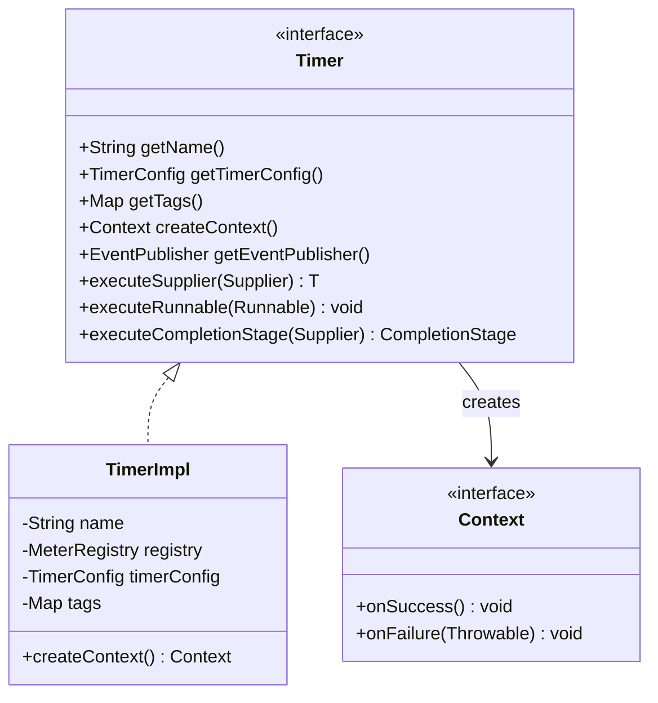
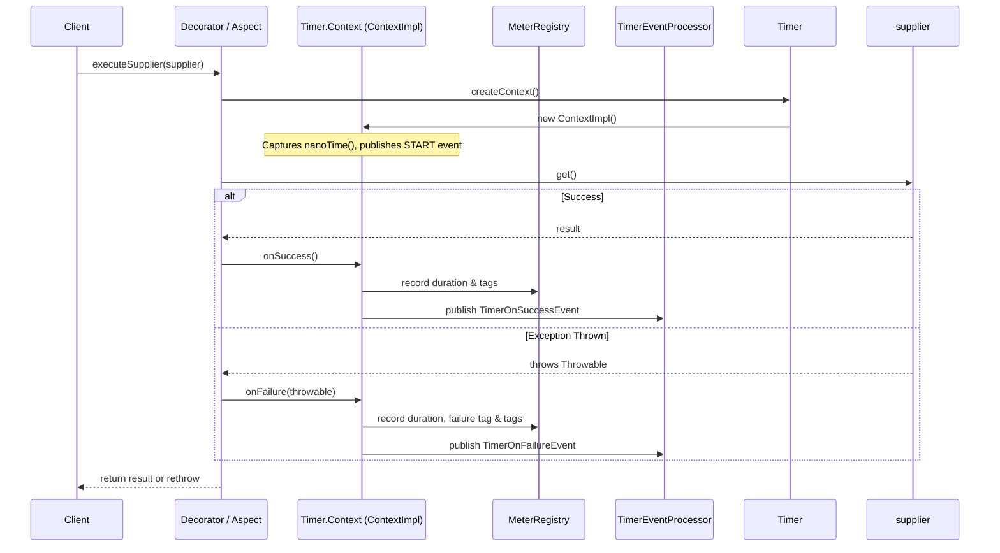
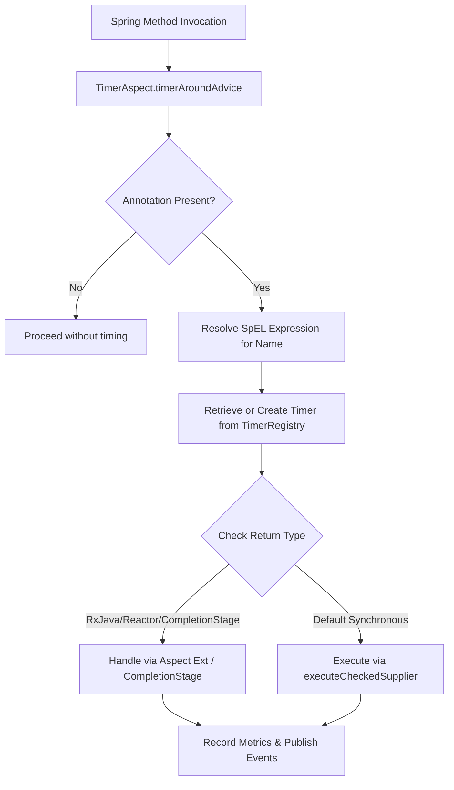

# Micrometer Timer Observation

<details>
<summary>Relevant source files</summary>

The following files were used as context for generating this wiki page:

- [resilience4j-micrometer/src/main/java/io/github/resilience4j/micrometer/Timer.java](https://github.com/resilience4j/resilience4j/blob/main/resilience4j-micrometer/src/main/java/io/github/resilience4j/micrometer/Timer.java)
- [resilience4j-metrics/src/main/java/io/github/resilience4j/metrics/Timer.java](https://github.com/resilience4j/resilience4j/blob/main/resilience4j-metrics/src/main/java/io/github/resilience4j/metrics/Timer.java)
- [resilience4j-spring6/src/main/java/io/github/resilience4j/spring6/micrometer/configure/TimerAspect.java](https://github.com/resilience4j/resilience4j/blob/main/resilience4j-spring6/src/main/java/io/github/resilience4j/spring6/micrometer/configure/TimerAspect.java)
- [resilience4j-micrometer/src/main/java/io/github/resilience4j/micrometer/internal/TimerImpl.java](https://github.com/resilience4j/resilience4j/blob/main/resilience4j-micrometer/src/main/java/io/github/resilience4j/micrometer/internal/TimerImpl.java)
- [resilience4j-circuitbreaker/src/main/java/io/github/resilience4j/circuitbreaker/internal/CircuitBreakerMetrics.java](https://github.com/resilience4j/resilience4j/blob/main/resilience4j-circuitbreaker/src/main/java/io/github/resilience4j/circuitbreaker/internal/CircuitBreakerMetrics.java)
- [resilience4j-micrometer/src/main/java/io/github/resilience4j/micrometer/Observations.java](https://github.com/resilience4j/resilience4j/blob/main/resilience4j-micrometer/src/main/java/io/github/resilience4j/micrometer/Observations.java)
- [resilience4j-core/src/main/java/io/github/resilience4j/core/metrics/LockFreeSlidingTimeWindowMetrics.java](https://github.com/resilience4j/resilience4j/blob/main/resilience4j-core/src/main/java/io/github/resilience4j/core/metrics/LockFreeSlidingTimeWindowMetrics.java)
- [resilience4j-core/src/main/java/io/github/resilience4j/core/metrics/LockFreeFixedSizeSlidingWindowMetrics.java](https://github.com/resilience4j/resilience4j/blob/main/resilience4j-core/src/main/java/io/github/resilience4j/core/metrics/LockFreeFixedSizeSlidingWindowMetrics.java)
- [resilience4j-metrics/src/main/java/io/github/resilience4j/metrics/internal/TimerImpl.java](https://github.com/resilience4j/resilience4j/blob/main/resilience4j-metrics/src/main/java/io/github/resilience4j/metrics/internal/TimerImpl.java)
- [resilience4j-micrometer/src/main/java/io/github/resilience4j/micrometer/event/TimerOnSuccessEvent.java](https://github.com/resilience4j/resilience4j/blob/main/resilience4j-micrometer/src/main/java/io/github/resilience4j/micrometer/event/TimerOnSuccessEvent.java)
- [resilience4j-micrometer/src/main/java/io/github/resilience4j/micrometer/tagged/AbstractTimeLimiterMetrics.java](https://github.com/resilience4j/resilience4j/blob/main/resilience4j-micrometer/src/main/java/io/github/resilience4j/micrometer/tagged/AbstractTimeLimiterMetrics.java)
- [resilience4j-core/src/main/java/io/github/resilience4j/core/metrics/SlidingTimeWindowMetrics.java](https://github.com/resilience4j/resilience4j/blob/main/resilience4j-core/src/main/java/io/github/resilience4j/core/metrics/SlidingTimeWindowMetrics.java)
- [resilience4j-micrometer/src/testFixtures/java/io/github/resilience4j/micrometer/TimerAssertions.java](https://github.com/resilience4j/resilience4j/blob/main/resilience4j-micrometer/src/testFixtures/java/io/github/resilience4j/micrometer/TimerAssertions.java)
- [resilience4j-core/src/main/java/io/github/resilience4j/core/metrics/AbstractAggregation.java](https://github.com/resilience4j/resilience4j/blob/main/resilience4j-core/src/main/java/io/github/resilience4j/core/metrics/AbstractAggregation.java)
- [resilience4j-reactor/src/main/java/io/github/resilience4j/reactor/micrometer/operator/TimerSubscriber.java](https://github.com/resilience4j/resilience4j/blob/main/resilience4j-reactor/src/main/java/io/github/resilience4j/reactor/micrometer/operator/TimerSubscriber.java)
- [resilience4j-micrometer/src/main/java/io/github/resilience4j/micrometer/event/TimerEvent.java](https://github.com/resilience4j/resilience4j/blob/main/resilience4j-micrometer/src/main/java/io/github/resilience4j/micrometer/event/TimerEvent.java)
- [resilience4j-spring6/src/main/java/io/github/resilience4j/spring6/micrometer/configure/RxJava3TimerAspectExt.java](https://github.com/resilience4j/resilience4j/blob/main/resilience4j-spring6/src/main/java/io/github/resilience4j/spring6/micrometer/configure/RxJava3TimerAspectExt.java)
- [resilience4j-vavr/src/main/java/io/github/resilience4j/metrics/VavrTimer.java](https://github.com/resilience4j/resilience4j/blob/main/resilience4j-vavr/src/main/java/io/github/resilience4j/metrics/VavrTimer.java)
- [resilience4j-core/src/main/java/io/github/resilience4j/core/metrics/PackedAggregation.java](https://github.com/resilience4j/resilience4j/blob/main/resilience4j-core/src/main/java/io/github/resilience4j/core/metrics/PackedAggregation.java)
- [resilience4j-micrometer/src/main/java/io/github/resilience4j/micrometer/event/TimerOnFailureEvent.java](https://github.com/resilience4j/resilience4j/blob/main/resilience4j-micrometer/src/main/java/io/github/resilience4j/micrometer/event/TimerOnFailureEvent.java)
- [resilience4j-kotlin/src/main/kotlin/io/github/resilience4j/kotlin/micrometer/Timer.kt](https://github.com/resilience4j/resilience4j/blob/main/resilience4j-kotlin/src/main/kotlin/io/github/resilience4j/kotlin/micrometer/Timer.kt)
- [resilience4j-rxjava3/src/main/java/io/github/resilience4j/rxjava3/micrometer/transformer/ObservableTimer.java](https://github.com/resilience4j/resilience4j/blob/main/resilience4j-rxjava3/src/main/java/io/github/resilience4j/rxjava3/micrometer/transformer/ObservableTimer.java)
- [resilience4j-rxjava2/src/main/java/io/github/resilience4j/micrometer/transformer/ObservableTimer.java](https://github.com/resilience4j/resilience4j/blob/main/resilience4j-rxjava2/src/main/java/io/github/resilience4j/micrometer/transformer/ObservableTimer.java)
- [resilience4j-rxjava3/src/main/java/io/github/resilience4j/rxjava3/micrometer/transformer/SingleTimer.java](https://github.com/resilience4j/resilience4j/blob/main/resilience4j-rxjava3/src/main/java/io/github/resilience4j/rxjava3/micrometer/transformer/SingleTimer.java)
- [resilience4j-rxjava3/src/main/java/io/github/resilience4j/rxjava3/micrometer/transformer/MaybeTimer.java](https://github.com/resilience4j/resilience4j/blob/main/resilience4j-rxjava3/src/main/java/io/github/resilience4j/rxjava3/micrometer/transformer/MaybeTimer.java)
- [resilience4j-core/src/main/java/io/github/resilience4j/core/metrics/Metrics.java](https://github.com/resilience4j/resilience4j/blob/main/resilience4j-core/src/main/java/io/github/resilience4j/core/metrics/Metrics.java)
- [resilience4j-rxjava2/src/main/java/io/github/resilience4j/micrometer/transformer/MaybeTimer.java](https://github.com/resilience4j/resilience4j/blob/main/resilience4j-rxjava2/src/main/java/io/github/resilience4j/micrometer/transformer/MaybeTimer.java)
- [resilience4j-rxjava2/src/main/java/io/github/resilience4j/micrometer/transformer/SingleTimer.java](https://github.com/resilience4j/resilience4j/blob/main/resilience4j-rxjava2/src/main/java/io/github/resilience4j/micrometer/transformer/SingleTimer.java)
- [resilience4j-micrometer/src/main/java/io/github/resilience4j/micrometer/TimerRegistry.java](https://github.com/resilience4j/resilience4j/blob/main/resilience4j-micrometer/src/main/java/io/github/resilience4j/micrometer/TimerRegistry.java)
- [resilience4j-core/src/main/java/io/github/resilience4j/core/metrics/CumulativeMeasurement.java](https://github.com/resilience4j/resilience4j/blob/main/resilience4j-core/src/main/java/io/github/resilience4j/core/metrics/CumulativeMeasurement.java)
</details>

## Overview

### Overview Context and Purpose

The Micrometer Timer Observation subsystem in Resilience4j bridges resilient execution primitives with application telemetry by capturing execution durations, success or failure outcomes, and dispatching reactive monitoring events via Micrometer registries and Dropwizard metrics. In modern distributed systems, tracking latency distributions and operational success rates without introducing lock contention is critical. Resilience4j fulfills this requirement through decorator interfaces, reactive streams operators, and lock-free metric collection sliding windows.

At its core, the subsystem abstracts execution wrapping across various concurrency models—including standard synchronous suppliers, `CompletionStage` asynchronous chains, Kotlin coroutine suspend functions, Project Reactor, and RxJava publishers. When an operation is decorated by a `Timer`, a monotonic clock context is started. Upon completion, elapsed nano-durations are calculated and pushed to a Micrometer `MeterRegistry` (or dropped to a logging registry if none is supplied) along with standardized tags denoting outcome kinds and failure classifications.

By decoupling the timing mechanism from the underlying execution framework, the architecture ensures that performance metrics remain accurate across thread boundaries, asynchronous handoffs, and cancellation events. Event publishers allow downstream auditors to react to lifecycle state changes (start, success, failure), while optimized lock-free sliding window algorithms (`LockFreeSlidingTimeWindowMetrics`, `LockFreeFixedSizeSlidingWindowMetrics`) provide high-throughput metric aggregation under heavy concurrent loads.

Sources: [resilience4j-micrometer/src/main/java/io/github/resilience4j/micrometer/Timer.java:43-46](https://github.com/resilience4j/resilience4j/blob/main/resilience4j-micrometer/src/main/java/io/github/resilience4j/micrometer/Timer.java#L43-L46)

Sources: [resilience4j-micrometer/src/main/java/io/github/resilience4j/micrometer/internal/TimerImpl.java:49-74](https://github.com/resilience4j/resilience4j/blob/main/resilience4j-micrometer/src/main/java/io/github/resilience4j/micrometer/internal/TimerImpl.java#L49-L74)

Sources: [resilience4j-core/src/main/java/io/github/resilience4j/core/metrics/LockFreeSlidingTimeWindowMetrics.java:46-47](https://github.com/resilience4j/resilience4j/blob/main/resilience4j-core/src/main/java/io/github/resilience4j/core/metrics/LockFreeSlidingTimeWindowMetrics.java#L46-L47)

## Public API and Decorator Surface

### Interface and Decorators

The `Timer` interface serves as the primary contract for timing decorated operations. It provides static factory methods to instantiate timers, functional decorators for Java functional types, and execution helper methods that combine decoration and invocation in a single step.



Sources: [resilience4j-micrometer/src/main/java/io/github/resilience4j/micrometer/Timer.java:46-82](https://github.com/resilience4j/resilience4j/blob/main/resilience4j-micrometer/src/main/java/io/github/resilience4j/micrometer/Timer.java#L46-L82)

### Supported Decorator Types

The `Timer` interface supplies static decorator methods covering standard Java functional interfaces, checked exceptions variants, and asynchronous completion stages.

| Decorator Method | Input Type | Outcome Handling | Sources |
| :--- | :--- | :--- | :--- |
| `decorateSupplier` | `Supplier<T>` | `context.onSuccess()` / `context.onFailure(e)` | [resilience4j-micrometer/src/main/java/io/github/resilience4j/micrometer/Timer.java:187-199](https://github.com/resilience4j/resilience4j/blob/main/resilience4j-micrometer/src/main/java/io/github/resilience4j/micrometer/Timer.java#L187-L199) |
| `decorateCheckedSupplier` | `CheckedSupplier<T>` | `context.onSuccess()` / `context.onFailure(e)` | [resilience4j-micrometer/src/main/java/io/github/resilience4j/micrometer/Timer.java:122-134](https://github.com/resilience4j/resilience4j/blob/main/resilience4j-micrometer/src/main/java/io/github/resilience4j/micrometer/Timer.java#L122-L134) |
| `decorateRunnable` | `Runnable` | `context.onSuccess()` / `context.onFailure(e)` | [resilience4j-micrometer/src/main/java/io/github/resilience4j/micrometer/Timer.java:230-241](https://github.com/resilience4j/resilience4j/blob/main/resilience4j-micrometer/src/main/java/io/github/resilience4j/micrometer/Timer.java#L230-L241) |
| `decorateCallable` | `Callable<T>` | `context.onSuccess()` / `context.onFailure(e)` | [resilience4j-micrometer/src/main/java/io/github/resilience4j/micrometer/Timer.java:209-221](https://github.com/resilience4j/resilience4j/blob/main/resilience4j-micrometer/src/main/java/io/github/resilience4j/micrometer/Timer.java#L209-L221) |
| `decorateCompletionStage` | `Supplier<CompletionStage<T>>` | `whenComplete` listener success/failure handling | [resilience4j-micrometer/src/main/java/io/github/resilience4j/micrometer/Timer.java:92-112](https://github.com/resilience4j/resilience4j/blob/main/resilience4j-micrometer/src/main/java/io/github/resilience4j/micrometer/Timer.java#L92-L112) |

Sources: [resilience4j-micrometer/src/main/java/io/github/resilience4j/micrometer/Timer.java:92-241](https://github.com/resilience4j/resilience4j/blob/main/resilience4j-micrometer/src/main/java/io/github/resilience4j/micrometer/Timer.java#L92-L241)

Sources: [resilience4j-micrometer/src/main/java/io/github/resilience4j/micrometer/Timer.java:122-134](https://github.com/resilience4j/resilience4j/blob/main/resilience4j-micrometer/src/main/java/io/github/resilience4j/micrometer/Timer.java#L122-L134)

Sources: [resilience4j-micrometer/src/main/java/io/github/resilience4j/micrometer/Timer.java:187-199](https://github.com/resilience4j/resilience4j/blob/main/resilience4j-micrometer/src/main/java/io/github/resilience4j/micrometer/Timer.java#L187-L199)

## Timer Execution & Lifecycle Call-Chain

### Execution Sequence

When an operation executes under a `Timer`, control flows from the decorator through the timer context creation, execution of the underlying callable block, and finally to metrics recording and event publishing.



Sources: [resilience4j-micrometer/src/main/java/io/github/resilience4j/micrometer/internal/TimerImpl.java:92-161](https://github.com/resilience4j/resilience4j/blob/main/resilience4j-micrometer/src/main/java/io/github/resilience4j/micrometer/internal/TimerImpl.java#L92-L161)

### Step-by-Step Mechanism

The execution flow follows a precise step-by-step sequence:
1. **Context Initialization**: `timer.createContext()` instantiates `TimerImpl.ContextImpl`, recording `nanoTime()` as the start timestamp and dispatching a `TimerOnStartEvent` if consumers are registered.
2. **Operation Execution**: The decorated supplier or completion stage executes within a `try-catch` block.
3. **Outcome Recording (`recordCall`)**:
   - Duration is calculated as `nanoTime() - start`.
   - A Micrometer `io.micrometer.core.instrument.Timer` is built using configured metric names, assigned tags (`name`, `kind`), and an optional `failure` tag resolved via `onFailureTagResolver`.
   - The calculated duration is recorded into the registry.
4. **Event Dispatch**: If `eventProcessor.hasConsumers()` is true, a `TimerOnSuccessEvent` or `TimerOnFailureEvent` containing the operation duration is published.

Sources: [resilience4j-micrometer/src/main/java/io/github/resilience4j/micrometer/internal/TimerImpl.java:116-161](https://github.com/resilience4j/resilience4j/blob/main/resilience4j-micrometer/src/main/java/io/github/resilience4j/micrometer/internal/TimerImpl.java#L116-L161)

Sources: [resilience4j-micrometer/src/main/java/io/github/resilience4j/micrometer/internal/TimerImpl.java:138-153](https://github.com/resilience4j/resilience4j/blob/main/resilience4j-micrometer/src/main/java/io/github/resilience4j/micrometer/internal/TimerImpl.java#L138-L153)

## Reactive and Asynchronous Integrations

### Non-Blocking Operators and Transformers

The timer observation model extends beyond standard Java functions to support reactive streams (Project Reactor, RxJava 2/3) and Kotlin coroutines.

### Project Reactor Integration
The `TimerSubscriber` wraps Reactor subscribers, intercepting signals to record timer metrics without blocking publisher threads.
- `hookOnComplete()` and `hookOnCancel()` trigger `context.onSuccess()` (guarded by an `AtomicBoolean` to prevent duplicate recording).
- `hookOnError(Throwable e)` triggers `context.onFailure(e)`.

Sources: [resilience4j-reactor/src/main/java/io/github/resilience4j/reactor/micrometer/operator/TimerSubscriber.java:33-70](https://github.com/resilience4j/resilience4j/blob/main/resilience4j-reactor/src/main/java/io/github/resilience4j/reactor/micrometer/operator/TimerSubscriber.java#L33-L70)

### RxJava 2 & 3 Transformers
Observables, Singles, Maybes, and Completables are instrumented via transformers (`ObservableTimer`, `SingleTimer`, `MaybeTimer`), which create context instances upon subscription and delegate completion/error hooks to `context.onSuccess()` and `context.onFailure(e)`.

Sources: [resilience4j-rxjava3/src/main/java/io/github/resilience4j/rxjava3/micrometer/transformer/ObservableTimer.java:24-63](https://github.com/resilience4j/resilience4j/blob/main/resilience4j-rxjava3/src/main/java/io/github/resilience4j/rxjava3/micrometer/transformer/ObservableTimer.java#L24-L63)

Sources: [resilience4j-rxjava3/src/main/java/io/github/resilience4j/rxjava3/micrometer/transformer/SingleTimer.java:24-63](https://github.com/resilience4j/resilience4j/blob/main/resilience4j-rxjava3/src/main/java/io/github/resilience4j/rxjava3/micrometer/transformer/SingleTimer.java#L24-L63)

Sources: [resilience4j-rxjava3/src/main/java/io/github/resilience4j/rxjava3/micrometer/transformer/MaybeTimer.java:24-68](https://github.com/resilience4j/resilience4j/blob/main/resilience4j-rxjava3/src/main/java/io/github/resilience4j/rxjava3/micrometer/transformer/MaybeTimer.java#L24-L68)

### Kotlin Coroutine Support
Kotlin extension functions provide native support for suspend functions:
```kotlin
suspend fun <T> Timer.executeSuspendFunction(block: suspend () -> T): T = decorateSuspendFunction(block)()
```
This wrapper initializes a context, executes the coroutine block, and records success or failure accordingly.

Sources: [resilience4j-kotlin/src/main/kotlin/io/github/resilience4j/kotlin/micrometer/Timer.kt:26-39](https://github.com/resilience4j/resilience4j/blob/main/resilience4j-kotlin/src/main/kotlin/io/github/resilience4j/kotlin/micrometer/Timer.kt#L26-L39)

## Spring AOP Integration

### Aspect Flow and Advice

Spring applications can declaratively apply timers to managed beans using the `@Timer` annotation and `TimerAspect`.



Sources: [resilience4j-spring6/src/main/java/io/github/resilience4j/spring6/micrometer/configure/TimerAspect.java:73-136](https://github.com/resilience4j/resilience4j/blob/main/resilience4j-spring6/src/main/java/io/github/resilience4j/spring6/micrometer/configure/TimerAspect.java#L73-L136)

### Aspect Configuration and Resolution Logic
- **Annotation Extraction**: `TimerAspect` inspects method signatures and targets. If the target is a Java dynamic proxy, it utilizes `AnnotationExtractor.extractAnnotationFromProxy`.
- **Name & Configuration Resolution**: The timer name is resolved via `SpelResolver`, and the corresponding `TimerConfig` is fetched from the `TimerRegistry`.
- **Return Type Dispatch**: `TimerAspect.proceed` checks registered `TimerAspectExt` extensions (such as `RxJava3TimerAspectExt`), assigns `CompletionStage` handlers if applicable, or falls back to default synchronous execution via `timer.executeCheckedSupplier`.

Sources: [resilience4j-spring6/src/main/java/io/github/resilience4j/spring6/micrometer/configure/TimerAspect.java:73-103](https://github.com/resilience4j/resilience4j/blob/main/resilience4j-spring6/src/main/java/io/github/resilience4j/spring6/micrometer/configure/TimerAspect.java#L73-L103)

Sources: [resilience4j-spring6/src/main/java/io/github/resilience4j/spring6/micrometer/configure/RxJava3TimerAspectExt.java:13-60](https://github.com/resilience4j/resilience4j/blob/main/resilience4j-spring6/src/main/java/io/github/resilience4j/spring6/micrometer/configure/RxJava3TimerAspectExt.java#L13-L60)

## High-Performance Lock-Free Metrics

### Window Metrics Architectures

For circuit breakers and internal metric collectors requiring high-throughput aggregation without lock contention, Resilience4j implements lock-free sliding windows (`LockFreeSlidingTimeWindowMetrics`, `LockFreeFixedSizeSlidingWindowMetrics`) alongside synchronized variants (`SlidingTimeWindowMetrics`).

| Metric Window Implementation | Underlying Data Structure | Concurrency Control Mechanism | Sources |
| :--- | :--- | :--- | :--- |
| `SlidingTimeWindowMetrics` | Circular array of partial aggregations | `ReentrantLock` | [resilience4j-core/src/main/java/io/github/resilience4j/core/metrics/SlidingTimeWindowMetrics.java:47-55](https://github.com/resilience4j/resilience4j/blob/main/resilience4j-core/src/main/java/io/github/resilience4j/core/metrics/SlidingTimeWindowMetrics.java#L47-L55) |
| `LockFreeSlidingTimeWindowMetrics` | Singly linked list of time slices | `VarHandle` CAS loop & backoff | [resilience4j-core/src/main/java/io/github/resilience4j/core/metrics/LockFreeSlidingTimeWindowMetrics.java:46-53](https://github.com/resilience4j/resilience4j/blob/main/resilience4j-core/src/main/java/io/github/resilience4j/core/metrics/LockFreeSlidingTimeWindowMetrics.java#L46-L53) |
| `LockFreeFixedSizeSlidingWindowMetrics` | Singly linked list of fixed entries | `VarHandle` CAS loop & backoff | [resilience4j-core/src/main/java/io/github/resilience4j/core/metrics/LockFreeFixedSizeSlidingWindowMetrics.java:60-77](https://github.com/resilience4j/resilience4j/blob/main/resilience4j-core/src/main/java/io/github/resilience4j/core/metrics/LockFreeFixedSizeSlidingWindowMetrics.java#L60-L77) |

Sources: [resilience4j-core/src/main/java/io/github/resilience4j/core/metrics/SlidingTimeWindowMetrics.java:47-55](https://github.com/resilience4j/resilience4j/blob/main/resilience4j-core/src/main/java/io/github/resilience4j/core/metrics/SlidingTimeWindowMetrics.java#L47-L55)

Sources: [resilience4j-core/src/main/java/io/github/resilience4j/core/metrics/LockFreeSlidingTimeWindowMetrics.java:46-53](https://github.com/resilience4j/resilience4j/blob/main/resilience4j-core/src/main/java/io/github/resilience4j/core/metrics/LockFreeSlidingTimeWindowMetrics.java#L46-L53)

Sources: [resilience4j-core/src/main/java/io/github/resilience4j/core/metrics/LockFreeFixedSizeSlidingWindowMetrics.java:60-77](https://github.com/resilience4j/resilience4j/blob/main/resilience4j-core/src/main/java/io/github/resilience4j/core/metrics/LockFreeFixedSizeSlidingWindowMetrics.java#L60-L77)

### Concurrency Invariants

> [!NOTE]
> In `LockFreeSlidingTimeWindowMetrics`, time slices are marked as `processed` via CAS before advancing the window. This ensures that no concurrent thread can perform late increments on a historical time slice, preserving exact aggregation invariants without acquiring global locks.

Sources: [resilience4j-core/src/main/java/io/github/resilience4j/core/metrics/LockFreeSlidingTimeWindowMetrics.java:131-159](https://github.com/resilience4j/resilience4j/blob/main/resilience4j-core/src/main/java/io/github/resilience4j/core/metrics/LockFreeSlidingTimeWindowMetrics.java#L131-L159)

Sources: [resilience4j-core/src/main/java/io/github/resilience4j/core/metrics/LockFreeFixedSizeSlidingWindowMetrics.java:100-160](https://github.com/resilience4j/resilience4j/blob/main/resilience4j-core/src/main/java/io/github/resilience4j/core/metrics/LockFreeFixedSizeSlidingWindowMetrics.java#L100-L160)

## Timer Registry Management

### Registry Capabilities

The `TimerRegistry` interface manages the lifecycle, configuration binding, and retrieval of `Timer` instances. Implemented by `InMemoryTimerRegistry`, it coordinates shared configurations and event consumers.

| Registry Operation | Description | Sources |
| :--- | :--- | :--- |
| `timer(String name)` | Retrieves or creates a timer using default configuration. | [resilience4j-micrometer/src/main/java/io/github/resilience4j/micrometer/TimerRegistry.java:116-117](https://github.com/resilience4j/resilience4j/blob/main/resilience4j-micrometer/src/main/java/io/github/resilience4j/micrometer/TimerRegistry.java#L116-L117) |
| `timer(String name, Map tags)` | Retrieves or creates a timer appending custom tags. | [resilience4j-micrometer/src/main/java/io/github/resilience4j/micrometer/TimerRegistry.java:130-131](https://github.com/resilience4j/resilience4j/blob/main/resilience4j-micrometer/src/main/java/io/github/resilience4j/micrometer/TimerRegistry.java#L130-L131) |
| `timer(String name, TimerConfig config)` | Retrieves or creates a timer with a custom configuration. | [resilience4j-micrometer/src/main/java/io/github/resilience4j/micrometer/TimerRegistry.java:140-141](https://github.com/resilience4j/resilience4j/blob/main/resilience4j-micrometer/src/main/java/io/github/resilience4j/micrometer/TimerRegistry.java#L140-L141) |
| `timer(String name, String configName)` | Retrieves or creates a timer referencing a pre-registered configuration key. | [resilience4j-micrometer/src/main/java/io/github/resilience4j/micrometer/TimerRegistry.java:190-191](https://github.com/resilience4j/resilience4j/blob/main/resilience4j-micrometer/src/main/java/io/github/resilience4j/micrometer/TimerRegistry.java#L190-L191) |

Sources: [resilience4j-micrometer/src/main/java/io/github/resilience4j/micrometer/TimerRegistry.java:107-205](https://github.com/resilience4j/resilience4j/blob/main/resilience4j-micrometer/src/main/java/io/github/resilience4j/micrometer/TimerRegistry.java#L107-L205)

Sources: [resilience4j-micrometer/src/main/java/io/github/resilience4j/micrometer/TimerRegistry.java:116-117](https://github.com/resilience4j/resilience4j/blob/main/resilience4j-micrometer/src/main/java/io/github/resilience4j/micrometer/TimerRegistry.java#L116-L117)

Sources: [resilience4j-micrometer/src/main/java/io/github/resilience4j/micrometer/TimerRegistry.java:130-131](https://github.com/resilience4j/resilience4j/blob/main/resilience4j-micrometer/src/main/java/io/github/resilience4j/micrometer/TimerRegistry.java#L130-L131)

Sources: [resilience4j-micrometer/src/main/java/io/github/resilience4j/micrometer/TimerRegistry.java:140-141](https://github.com/resilience4j/resilience4j/blob/main/resilience4j-micrometer/src/main/java/io/github/resilience4j/micrometer/TimerRegistry.java#L140-L141)

Sources: [resilience4j-micrometer/src/main/java/io/github/resilience4j/micrometer/TimerRegistry.java:190-191](https://github.com/resilience4j/resilience4j/blob/main/resilience4j-micrometer/src/main/java/io/github/resilience4j/micrometer/TimerRegistry.java#L190-L191)

## Design Trade-Offs

### Architectural Choices

| Design Choice | Benefit | Cost | Sources |
| :--- | :--- | :--- | :--- |
| **Microsecond/Nanosecond Precision via `System.nanoTime()`** | High fidelity latency measurement suitable for fast service calls. | Susceptible to system clock drift across hardware cores if not carefully managed (mitigated by monotonic clock usage). | [resilience4j-micrometer/src/main/java/io/github/resilience4j/micrometer/internal/TimerImpl.java:43-122](https://github.com/resilience4j/resilience4j/blob/main/resilience4j-micrometer/src/main/java/io/github/resilience4j/micrometer/internal/TimerImpl.java#L43-L122) |
| **Lock-Free VarHandle CAS for Sliding Windows** | Eliminates thread blocking and lock contention under extreme concurrency. | Increased CPU cache invalidation and spin-loop overhead under heavy contention. | [resilience4j-core/src/main/java/io/github/resilience4j/core/metrics/LockFreeSlidingTimeWindowMetrics.java:46-123](https://github.com/resilience4j/resilience4j/blob/main/resilience4j-core/src/main/java/io/github/resilience4j/core/metrics/LockFreeSlidingTimeWindowMetrics.java#L46-L123) |
| **Packed Array Aggregation (`PackedAggregation`)** | Cache-friendly memory layout improving traversal performance. | Fixed-size array indexing requires strict adherence to constant offsets. | [resilience4j-core/src/main/java/io/github/resilience4j/core/metrics/PackedAggregation.java:24-33](https://github.com/resilience4j/resilience4j/blob/main/resilience4j-core/src/main/java/io/github/resilience4j/core/metrics/PackedAggregation.java#L24-L33) |

Sources: [resilience4j-micrometer/src/main/java/io/github/resilience4j/micrometer/internal/TimerImpl.java:43-122](https://github.com/resilience4j/resilience4j/blob/main/resilience4j-micrometer/src/main/java/io/github/resilience4j/micrometer/internal/TimerImpl.java#L43-L122)

Sources: [resilience4j-core/src/main/java/io/github/resilience4j/core/metrics/LockFreeSlidingTimeWindowMetrics.java:46-123](https://github.com/resilience4j/resilience4j/blob/main/resilience4j-core/src/main/java/io/github/resilience4j/core/metrics/LockFreeSlidingTimeWindowMetrics.java#L46-L123)

Sources: [resilience4j-core/src/main/java/io/github/resilience4j/core/metrics/PackedAggregation.java:24-33](https://github.com/resilience4j/resilience4j/blob/main/resilience4j-core/src/main/java/io/github/resilience4j/core/metrics/PackedAggregation.java#L24-L33)

## Runnable Usage Example

### Practical Implementation

The following example demonstrates how to instantiate a `TimerRegistry`, create a `Timer`, and execute a supplier while automatically collecting Micrometer timing metrics and listening to event emissions.

```java
import io.github.resilience4j.micrometer.Timer;
import io.github.resilience4j.micrometer.TimerConfig;
import io.github.resilience4j.micrometer.TimerRegistry;
import io.github.resilience4j.micrometer.event.TimerOnSuccessEvent;
import io.micrometer.core.instrument.MeterRegistry;
import io.micrometer.core.instrument.simple.SimpleMeterRegistry;

import java.time.Duration;
import java.util.Map;

public class TimerExample {
    public static void main(String[] args) throws Throwable {
        MeterRegistry meterRegistry = new SimpleMeterRegistry();
        TimerRegistry timerRegistry = TimerRegistry.ofDefaults(meterRegistry);

        Timer timer = timerRegistry.timer("myServiceTimer", Map.of("env", "production"));

        timer.getEventPublisher().onSuccess((TimerOnSuccessEvent event) -> {
            System.out.println("Operation '" + event.getTimerName() + 
                "' succeeded in " + event.getOperationDuration().toMillis() + " ms");
        });

        String result = timer.executeSupplier(() -> {
            // Simulate business logic
            return "Execution Successful";
        });

        System.out.println("Result: " + result);
    }
}
```

Sources: [resilience4j-micrometer/src/main/java/io/github/resilience4j/micrometer/Timer.java:55-82](https://github.com/resilience4j/resilience4j/blob/main/resilience4j-micrometer/src/main/java/io/github/resilience4j/micrometer/Timer.java#L55-L82)

Sources: [resilience4j-micrometer/src/main/java/io/github/resilience4j/micrometer/TimerRegistry.java:46-48](https://github.com/resilience4j/resilience4j/blob/main/resilience4j-micrometer/src/main/java/io/github/resilience4j/micrometer/TimerRegistry.java#L46-L48)

## Related

- [[Tagged Micrometer Metrics]]

