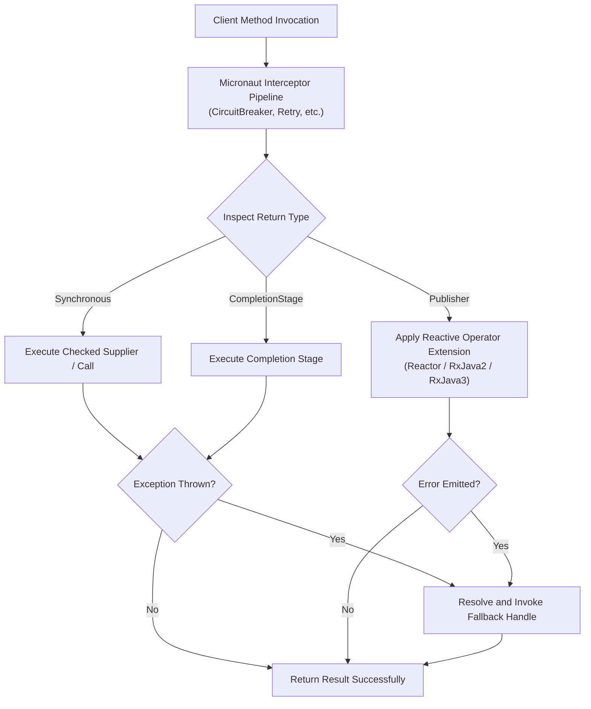
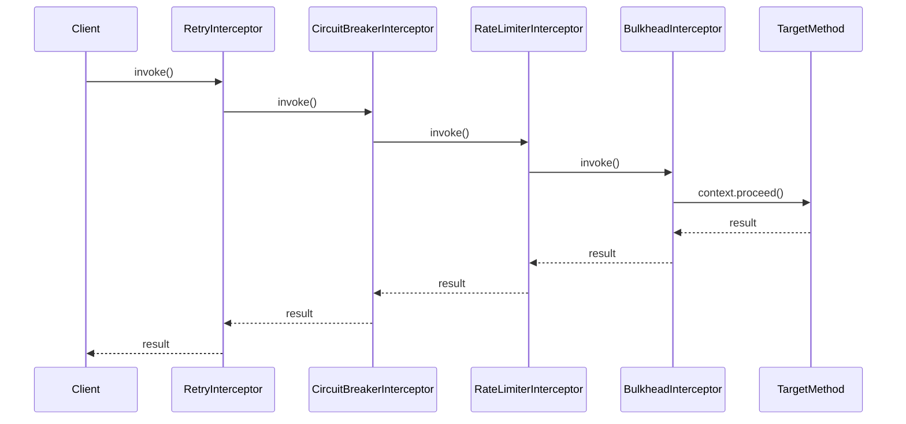

# Micronaut Annotation Processing

<details>
<summary>Relevant source files</summary>

The following files were used as context for generating this wiki page:

- [resilience4j-micronaut/src/main/java/io/github/resilience4j/micronaut/circuitbreaker/CircuitBreakerRegistryFactory.java](https://github.com/resilience4j/resilience4j/blob/main/resilience4j-micronaut/src/main/java/io/github/resilience4j/micronaut/circuitbreaker/CircuitBreakerRegistryFactory.java)
- [resilience4j-micronaut/src/main/java/io/github/resilience4j/micronaut/circuitbreaker/CircuitBreakerInterceptor.java](https://github.com/resilience4j/resilience4j/blob/main/resilience4j-micronaut/src/main/java/io/github/resilience4j/micronaut/circuitbreaker/CircuitBreakerInterceptor.java)
- [resilience4j-micronaut/src/main/java/io/github/resilience4j/micronaut/bulkhead/BulkheadInterceptor.java](https://github.com/resilience4j/resilience4j/blob/main/resilience4j-micronaut/src/main/java/io/github/resilience4j/micronaut/bulkhead/BulkheadInterceptor.java)
- [resilience4j-micronaut/src/main/java/io/github/resilience4j/micronaut/retry/RetryInterceptor.java](https://github.com/resilience4j/resilience4j/blob/main/resilience4j-micronaut/src/main/java/io/github/resilience4j/micronaut/retry/RetryInterceptor.java)
- [resilience4j-micronaut/src/main/java/io/github/resilience4j/micronaut/ratelimiter/RateLimiterInterceptor.java](https://github.com/resilience4j/resilience4j/blob/main/resilience4j-micronaut/src/main/java/io/github/resilience4j/micronaut/ratelimiter/RateLimiterInterceptor.java)
- [resilience4j-micronaut-annotation/src/main/java/io/github/resilience4j/micronaut/processor/CircuitBreakerAnnotationRemapper.java](https://github.com/resilience4j/resilience4j/blob/main/resilience4j-micronaut-annotation/src/main/java/io/github/resilience4j/micronaut/processor/CircuitBreakerAnnotationRemapper.java)
- [resilience4j-spring6/src/main/java/io/github/resilience4j/spring6/circuitbreaker/configure/CircuitBreakerAspect.java](https://github.com/resilience4j/resilience4j/blob/main/resilience4j-spring6/src/main/java/io/github/resilience4j/spring6/circuitbreaker/configure/CircuitBreakerAspect.java)
- [resilience4j-micronaut-annotation/src/main/java/io/github/resilience4j/micronaut/processor/RateLimiterAnnotationRemapper.java](https://github.com/resilience4j/resilience4j/blob/main/resilience4j-micronaut-annotation/src/main/java/io/github/resilience4j/micronaut/processor/RateLimiterAnnotationRemapper.java)
- [resilience4j-micronaut-annotation/src/main/java/io/github/resilience4j/micronaut/processor/RetryAnnotationRemapper.java](https://github.com/resilience4j/resilience4j/blob/main/resilience4j-micronaut-annotation/src/main/java/io/github/resilience4j/micronaut/processor/RetryAnnotationRemapper.java)
- [resilience4j-micronaut-annotation/src/main/java/io/github/resilience4j/micronaut/processor/TimeLimiterRemapper.java](https://github.com/resilience4j/resilience4j/blob/main/resilience4j-micronaut-annotation/src/main/java/io/github/resilience4j/micronaut/processor/TimeLimiterRemapper.java)
- [resilience4j-micronaut-annotation/src/main/java/io/github/resilience4j/micronaut/processor/BulkheadAnnotationRemapper.java](https://github.com/resilience4j/resilience4j/blob/main/resilience4j-micronaut-annotation/src/main/java/io/github/resilience4j/micronaut/processor/BulkheadAnnotationRemapper.java)
- [resilience4j-micronaut/src/main/java/io/github/resilience4j/micronaut/annotation/CircuitBreaker.java](https://github.com/resilience4j/resilience4j/blob/main/resilience4j-micronaut/src/main/java/io/github/resilience4j/micronaut/annotation/CircuitBreaker.java)
- [resilience4j-micronaut/src/main/java/io/github/resilience4j/micronaut/annotation/RateLimiter.java](https://github.com/resilience4j/resilience4j/blob/main/resilience4j-micronaut/src/main/java/io/github/resilience4j/micronaut/annotation/RateLimiter.java)
- [resilience4j-micronaut/src/main/java/io/github/resilience4j/micronaut/annotation/TimeLimiter.java](https://github.com/resilience4j/resilience4j/blob/main/resilience4j-micronaut/src/main/java/io/github/resilience4j/micronaut/annotation/TimeLimiter.java)
- [resilience4j-micronaut/src/main/java/io/github/resilience4j/micronaut/circuitbreaker/package-info.java](https://github.com/resilience4j/resilience4j/blob/main/resilience4j-micronaut/src/main/java/io/github/resilience4j/micronaut/circuitbreaker/package-info.java)
- [resilience4j-micronaut/src/main/java/io/github/resilience4j/micronaut/annotation/Bulkhead.java](https://github.com/resilience4j/resilience4j/blob/main/resilience4j-micronaut/src/main/java/io/github/resilience4j/micronaut/annotation/Bulkhead.java)
- [resilience4j-micronaut/src/main/java/io/github/resilience4j/micronaut/annotation/Retry.java](https://github.com/resilience4j/resilience4j/blob/main/resilience4j-micronaut/src/main/java/io/github/resilience4j/micronaut/annotation/Retry.java)
- [resilience4j-micronaut/src/main/java/io/github/resilience4j/micronaut/circuitbreaker/CircuitBreakerQualifier.java](https://github.com/resilience4j/resilience4j/blob/main/resilience4j-micronaut/src/main/java/io/github/resilience4j/micronaut/circuitbreaker/CircuitBreakerQualifier.java)
- [resilience4j-micronaut/src/main/java/io/github/resilience4j/micronaut/retry/package-info.java](https://github.com/resilience4j/resilience4j/blob/main/resilience4j-micronaut/src/main/java/io/github/resilience4j/micronaut/retry/package-info.java)
- [resilience4j-micronaut/src/main/java/io/github/resilience4j/micronaut/ratelimiter/package-info.java](https://github.com/resilience4j/resilience4j/blob/main/resilience4j-micronaut/src/main/java/io/github/resilience4j/micronaut/ratelimiter/package-info.java)
- [resilience4j-spring-boot3/src/main/java/io/github/resilience4j/springboot3/nativeimage/configuration/NativeHintsConfiguration.java](https://github.com/resilience4j/resilience4j/blob/main/resilience4j-spring-boot3/src/main/java/io/github/resilience4j/springboot3/nativeimage/configuration/NativeHintsConfiguration.java)
- [resilience4j-micronaut/src/main/java/io/github/resilience4j/micronaut/retry/RetryQualifier.java](https://github.com/resilience4j/resilience4j/blob/main/resilience4j-micronaut/src/main/java/io/github/resilience4j/micronaut/retry/RetryQualifier.java)
- [resilience4j-micronaut/src/main/java/io/github/resilience4j/micronaut/timelimiter/package-info.java](https://github.com/resilience4j/resilience4j/blob/main/resilience4j-micronaut/src/main/java/io/github/resilience4j/micronaut/timelimiter/package-info.java)
- [resilience4j-micronaut/src/main/java/io/github/resilience4j/micronaut/ratelimiter/RateLimiterQualifier.java](https://github.com/resilience4j/resilience4j/blob/main/resilience4j-micronaut/src/main/java/io/github/resilience4j/micronaut/ratelimiter/RateLimiterQualifier.java)
- [resilience4j-micronaut/src/main/java/io/github/resilience4j/micronaut/timelimiter/TimeLimiterQualifier.java](https://github.com/resilience4j/resilience4j/blob/main/resilience4j-micronaut/src/main/java/io/github/resilience4j/micronaut/timelimiter/TimeLimiterQualifier.java)
- [resilience4j-micronaut/src/main/java/io/github/resilience4j/micronaut/util/ReactorPublisherExtension.java](https://github.com/resilience4j/resilience4j/blob/main/resilience4j-micronaut/src/main/java/io/github/resilience4j/micronaut/util/ReactorPublisherExtension.java)
- [resilience4j-spring-boot4/src/main/java/io/github/resilience4j/springboot/nativeimage/configuration/NativeHintsConfiguration.java](https://github.com/resilience4j/resilience4j/blob/main/resilience4j-spring-boot4/src/main/java/io/github/resilience4j/springboot/nativeimage/configuration/NativeHintsConfiguration.java)
- [resilience4j-micronaut/src/main/java/io/github/resilience4j/micronaut/util/RxJava2PublisherExtension.java](https://github.com/resilience4j/resilience4j/blob/main/resilience4j-micronaut/src/main/java/io/github/resilience4j/micronaut/util/RxJava2PublisherExtension.java)
- [resilience4j-micronaut/src/main/java/io/github/resilience4j/micronaut/util/RxJava3PublisherExtension.java](https://github.com/resilience4j/resilience4j/blob/main/resilience4j-micronaut/src/main/java/io/github/resilience4j/micronaut/util/RxJava3PublisherExtension.java)
- [resilience4j-micronaut/src/main/java/io/github/resilience4j/micronaut/bulkhead/package-info.java](https://github.com/resilience4j/resilience4j/blob/main/resilience4j-micronaut/src/main/java/io/github/resilience4j/micronaut/bulkhead/package-info.java)
</details>

## Overview

Micronaut Annotation Processing provides a native, compile-time AOP and annotation remapping integration layer between Resilience4j fault tolerance capabilities and the Micronaut framework. By leveraging Micronaut's interception model (`MethodInterceptor`, `MethodInvocationContext`) alongside package rename remappers (`PackageRenameRemapper`), the subsystem allows developers to transparently annotate beans or methods with resilience policies—such as Circuit Breaker, Rate Limiter, Retry, Bulkhead, and Time Limiter—without incurring runtime reflection overhead for dependency injection and bean wiring.
Sources: [resilience4j-micronaut/src/main/java/io/github/resilience4j/micronaut/circuitbreaker/CircuitBreakerInterceptor.java](https://github.com/resilience4j/resilience4j/blob/main/resilience4j-micronaut/src/main/java/io/github/resilience4j/micronaut/circuitbreaker/CircuitBreakerInterceptor.java#L39-L51)

The architecture bridges standard Resilience4j configuration registries (`CircuitBreakerRegistry`, `RateLimiterRegistry`, `RetryRegistry`, `BulkheadRegistry`) with Micronaut's execution and reactive extension pipelines. Reactive return types (Project Reactor `Flux`/`Mono`, RxJava2 `Flowable`, RxJava3 `Flowable`), asynchronous `CompletionStage`/`CompletableFuture` structures, and traditional synchronous invocations are automatically intercepted, evaluated against fault tolerance policies, and safely routed through fallback execution handlers when faults occur.
Sources: [resilience4j-micronaut/src/main/java/io/github/resilience4j/micronaut/bulkhead/BulkheadInterceptor.java](https://github.com/resilience4j/resilience4j/blob/main/resilience4j-micronaut/src/main/java/io/github/resilience4j/micronaut/bulkhead/BulkheadInterceptor.java#L42-L67)


Sources: [resilience4j-micronaut/src/main/java/io/github/resilience4j/micronaut/retry/RetryInterceptor.java](https://github.com/resilience4j/resilience4j/blob/main/resilience4j-micronaut/src/main/java/io/github/resilience4j/micronaut/retry/RetryInterceptor.java#L83-L128)

## Annotation API & Package Remapping

The public API surface consists of a set of annotations placed in the `io.github.resilience4j.micronaut.annotation` package. Each annotation is meta-annotated with Micronaut's `@Around` and `@Executable` annotations, turning the target class or method into an AOP proxy interceptable at runtime.
Sources: [resilience4j-micronaut/src/main/java/io/github/resilience4j/micronaut/annotation/CircuitBreaker.java](https://github.com/resilience4j/resilience4j/blob/main/resilience4j-micronaut/src/main/java/io/github/resilience4j/micronaut/annotation/CircuitBreaker.java#L29-L34)

To support seamless interchangeability between native Resilience4j annotations and Micronaut-specific packages, the `resilience4j-micronaut-annotation` module provides package rename remappers implementing `PackageRenameRemapper`. These interceptors map legacy or core Resilience4j package namespaces to `io.github.resilience4j.micronaut.annotation`.
Sources: [resilience4j-micronaut-annotation/src/main/java/io/github/resilience4j/micronaut/processor/CircuitBreakerAnnotationRemapper.java](https://github.com/resilience4j/resilience4j/blob/main/resilience4j-micronaut-annotation/src/main/java/io/github/resilience4j/micronaut/processor/CircuitBreakerAnnotationRemapper.java#L23-L34)

| Annotation | Target Elements | Key Attributes | Interceptor Bean |
| :--- | :--- | :--- | :--- |
| `io.github.resilience4j.micronaut.annotation.CircuitBreaker` | `METHOD`, `TYPE` | `name`, `fallbackMethod` | `CircuitBreakerInterceptor` |
| `io.github.resilience4j.micronaut.annotation.RateLimiter` | `METHOD`, `TYPE` | `name`, `fallbackMethod` | `RateLimiterInterceptor` |
| `io.github.resilience4j.micronaut.annotation.Retry` | `METHOD`, `TYPE` | `name`, `fallbackMethod` | `RetryInterceptor` |
| `io.github.resilience4j.micronaut.annotation.Bulkhead` | `METHOD`, `TYPE` | `name`, `fallbackMethod`, `type` (`SEMAPHORE`, `THREADPOOL`) | `BulkheadInterceptor` |
| `io.github.resilience4j.micronaut.annotation.TimeLimiter` | `METHOD`, `TYPE` | `name`, `fallbackMethod` | `TimeLimiter` configuration |
Sources: [resilience4j-micronaut/src/main/java/io/github/resilience4j/micronaut/annotation/CircuitBreaker.java](https://github.com/resilience4j/resilience4j/blob/main/resilience4j-micronaut/src/main/java/io/github/resilience4j/micronaut/annotation/CircuitBreaker.java#L34-L49), [resilience4j-micronaut/src/main/java/io/github/resilience4j/micronaut/annotation/RateLimiter.java](https://github.com/resilience4j/resilience4j/blob/main/resilience4j-micronaut/src/main/java/io/github/resilience4j/micronaut/annotation/RateLimiter.java#L34-L49), [resilience4j-micronaut/src/main/java/io/github/resilience4j/micronaut/annotation/Retry.java](https://github.com/resilience4j/resilience4j/blob/main/resilience4j-micronaut/src/main/java/io/github/resilience4j/micronaut/annotation/Retry.java#L33-L48), [resilience4j-micronaut/src/main/java/io/github/resilience4j/micronaut/annotation/Bulkhead.java](https://github.com/resilience4j/resilience4j/blob/main/resilience4j-micronaut/src/main/java/io/github/resilience4j/micronaut/annotation/Bulkhead.java#L32-L61), [resilience4j-micronaut/src/main/java/io/github/resilience4j/micronaut/annotation/TimeLimiter.java](https://github.com/resilience4j/resilience4j/blob/main/resilience4j-micronaut/src/main/java/io/github/resilience4j/micronaut/annotation/TimeLimiter.java#L29-L44)

## Interceptor Execution Phase Ordering

Micronaut AOP interceptors implement `MethodInterceptor` and specify execution order via an integer offset returned by `getOrder()`. The Resilience4j framework coordinates interceptor ordering using `ResilienceInterceptPhase` constants to ensure that cross-cutting fault tolerance concerns wrap around method executions in a deterministic sequence.
Sources: [resilience4j-micronaut/src/main/java/io/github/resilience4j/micronaut/circuitbreaker/CircuitBreakerInterceptor.java](https://github.com/resilience4j/resilience4j/blob/main/resilience4j-micronaut/src/main/java/io/github/resilience4j/micronaut/circuitbreaker/CircuitBreakerInterceptor.java#L53-L56)


Sources: [resilience4j-micronaut/src/main/java/io/github/resilience4j/micronaut/bulkhead/BulkheadInterceptor.java](https://github.com/resilience4j/resilience4j/blob/main/resilience4j-micronaut/src/main/java/io/github/resilience4j/micronaut/bulkhead/BulkheadInterceptor.java#L69-L72), [resilience4j-micronaut/src/main/java/io/github/resilience4j/micronaut/retry/RetryInterceptor.java](https://github.com/resilience4j/resilience4j/blob/main/resilience4j-micronaut/src/main/java/io/github/resilience4j/micronaut/retry/RetryInterceptor.java#L64-L67), [resilience4j-micronaut/src/main/java/io/github/resilience4j/micronaut/ratelimiter/RateLimiterInterceptor.java](https://github.com/resilience4j/resilience4j/blob/main/resilience4j-micronaut/src/main/java/io/github/resilience4j/micronaut/ratelimiter/RateLimiterInterceptor.java#L53-L56)

## Registry Factories and Bean Initialization

The `CircuitBreakerRegistryFactory` (and analogous factories for other fault tolerance modules) operates as a Micronaut `@Factory` bean conditioned on property activation (`resilience4j.circuitbreaker.enabled`). It binds configuration properties, event consumer registries, and customizers into dependency injection containers.
Sources: [resilience4j-micronaut/src/main/java/io/github/resilience4j/micronaut/circuitbreaker/CircuitBreakerRegistryFactory.java](https://github.com/resilience4j/resilience4j/blob/main/resilience4j-micronaut/src/main/java/io/github/resilience4j/micronaut/circuitbreaker/CircuitBreakerRegistryFactory.java#L45-L47)

```java
@Factory
@Requires(property = "resilience4j.circuitbreaker.enabled", value = StringUtils.TRUE, defaultValue = StringUtils.FALSE)
public class CircuitBreakerRegistryFactory {
    @Bean
    @CircuitBreakerQualifier
    public CompositeCustomizer<CircuitBreakerConfigCustomizer> compositeCircuitBreakerCustomizer(
        @Nullable List<CircuitBreakerConfigCustomizer> configCustomizer ) {
        return new CompositeCustomizer<>(configCustomizer);
    }

    @Singleton
    @Requires(beans = CircuitBreakerProperties.class)
    public CircuitBreakerRegistry circuitBreakerRegistry(
        CommonCircuitBreakerConfigurationProperties circuitBreakerConfigurationProperties,
        @CircuitBreakerQualifier EventConsumerRegistry<CircuitBreakerEvent> eventConsumerRegistry,
        @CircuitBreakerQualifier RegistryEventConsumer<CircuitBreaker> circuitBreakerRegistryEventConsumer,
        @CircuitBreakerQualifier CompositeCustomizer<CircuitBreakerConfigCustomizer> compositeCircuitBreakerCustomizer) {
        CircuitBreakerRegistry circuitBreakerRegistry = createCircuitBreakerRegistry(
            circuitBreakerConfigurationProperties, circuitBreakerRegistryEventConsumer,
            compositeCircuitBreakerCustomizer);
        registerEventConsumer(circuitBreakerConfigurationProperties, circuitBreakerRegistry, eventConsumerRegistry);
        initCircuitBreakerRegistry(circuitBreakerConfigurationProperties, circuitBreakerRegistry, compositeCircuitBreakerCustomizer);
        return circuitBreakerRegistry;
    }
}
```
Sources: [resilience4j-micronaut/src/main/java/io/github/resilience4j/micronaut/circuitbreaker/CircuitBreakerRegistryFactory.java](https://github.com/resilience4j/resilience4j/blob/main/resilience4j-micronaut/src/main/java/io/github/resilience4j/micronaut/circuitbreaker/CircuitBreakerRegistryFactory.java#L45-L68)

During registry initialization, `registerEventConsumer` listens to registry lifecycle events (`onEntryAdded`, `onEntryReplaced`, `onEntryRemoved`) to wire buffer-allocated event consumers:
Sources: [resilience4j-micronaut/src/main/java/io/github/resilience4j/micronaut/circuitbreaker/CircuitBreakerRegistryFactory.java](https://github.com/resilience4j/resilience4j/blob/main/resilience4j-micronaut/src/main/java/io/github/resilience4j/micronaut/circuitbreaker/CircuitBreakerRegistryFactory.java#L133-L139)

```java
public void registerEventConsumer(CommonCircuitBreakerConfigurationProperties circuitBreakerProperties,CircuitBreakerRegistry circuitBreakerRegistry,
                                  EventConsumerRegistry<CircuitBreakerEvent> eventConsumerRegistry) {
    circuitBreakerRegistry.getEventPublisher()
        .onEntryAdded(event -> registerEventConsumer(circuitBreakerProperties, eventConsumerRegistry, event.getAddedEntry()))
        .onEntryReplaced(event -> registerEventConsumer(circuitBreakerProperties, eventConsumerRegistry, event.getNewEntry()))
        .onEntryRemoved(event -> unregisterEventConsumer(eventConsumerRegistry, event.getRemovedEntry()));
}
```
Sources: [resilience4j-micronaut/src/main/java/io/github/resilience4j/micronaut/circuitbreaker/CircuitBreakerRegistryFactory.java](https://github.com/resilience4j/resilience4j/blob/main/resilience4j-micronaut/src/main/java/io/github/resilience4j/micronaut/circuitbreaker/CircuitBreakerRegistryFactory.java#L133-L139)

> [!NOTE]
> Event buffer sizing defaults to `100` elements if no explicit instance properties are bound in `CommonCircuitBreakerConfigurationProperties`.
Sources: [resilience4j-micronaut/src/main/java/io/github/resilience4j/micronaut/circuitbreaker/CircuitBreakerRegistryFactory.java](https://github.com/resilience4j/resilience4j/blob/main/resilience4j-micronaut/src/main/java/io/github/resilience4j/micronaut/circuitbreaker/CircuitBreakerRegistryFactory.java#L145-L155)

## Method Interception and Invocation Dispatch

Interceptors inspect the return type of intercepted methods via Micronaut's `InterceptedMethod` abstraction. Depending on whether the method returns a reactive `PUBLISHER`, an asynchronous `COMPLETION_STAGE`, or a `SYNCHRONOUS` value, the interceptor branches into specialized execution wrappers.
Sources: [resilience4j-micronaut/src/main/java/io/github/resilience4j/micronaut/circuitbreaker/CircuitBreakerInterceptor.java](https://github.com/resilience4j/resilience4j/blob/main/resilience4j-micronaut/src/main/java/io/github/resilience4j/micronaut/circuitbreaker/CircuitBreakerInterceptor.java#L83-L86)

For instance, `CircuitBreakerInterceptor.intercept()` evaluates return types as follows:
Sources: [resilience4j-micronaut/src/main/java/io/github/resilience4j/micronaut/circuitbreaker/CircuitBreakerInterceptor.java](https://github.com/resilience4j/resilience4j/blob/main/resilience4j-micronaut/src/main/java/io/github/resilience4j/micronaut/circuitbreaker/CircuitBreakerInterceptor.java#L83-L115)

```java
InterceptedMethod interceptedMethod = InterceptedMethod.of(context, conversionService);
try {
    switch (interceptedMethod.resultType()) {
        case PUBLISHER:
            return interceptedMethod.handleResult(
                extension.fallbackPublisher(
                    extension.circuitBreaker(interceptedMethod.interceptResultAsPublisher(), circuitBreaker),
                    context,
                    this::findFallbackMethod));
        case COMPLETION_STAGE:
            return interceptedMethod.handleResult(
                fallbackForFuture(
                    circuitBreaker.executeCompletionStage(() -> {
                        try {
                            return interceptedMethod.interceptResultAsCompletionStage();
                        } catch (Exception e) {
                            throw new CompletionException(e);
                        }
                    }),
                    context)
            );
        case SYNCHRONOUS:
            try {
                return circuitBreaker.executeCheckedSupplier(context::proceed);
            } catch (Throwable exception) {
                return fallback(context, exception);
            }
        default:
            return interceptedMethod.unsupported();
    }
} catch (Exception e) {
    return interceptedMethod.handleException(e);
}
```
Sources: [resilience4j-micronaut/src/main/java/io/github/resilience4j/micronaut/circuitbreaker/CircuitBreakerInterceptor.java](https://github.com/resilience4j/resilience4j/blob/main/resilience4j-micronaut/src/main/java/io/github/resilience4j/micronaut/circuitbreaker/CircuitBreakerInterceptor.java#L83-L115)

## Reactive Publisher Extensions

To integrate seamlessly with Project Reactor and RxJava streams, `PublisherExtension` implementations (`ReactorPublisherExtension`, `RxJava2PublisherExtension`, `RxJava3PublisherExtension`) adapt reactive publishers using operators supplied by Resilience4j.
Sources: [resilience4j-micronaut/src/main/java/io/github/resilience4j/micronaut/util/ReactorPublisherExtension.java](https://github.com/resilience4j/resilience4j/blob/main/resilience4j-micronaut/src/main/java/io/github/resilience4j/micronaut/util/ReactorPublisherExtension.java#L28-L30)

When a reactive stream emits an error, `fallbackPublisher` intercepts the termination signal (`onErrorResume` / `onErrorResumeNext`), resolves the fallback method via `ExecutionHandleLocator`, invokes the fallback handler with original parameter values, and converts the result back into a compliant reactive `Publisher`.
Sources: [resilience4j-micronaut/src/main/java/io/github/resilience4j/micronaut/util/ReactorPublisherExtension.java](https://github.com/resilience4j/resilience4j/blob/main/resilience4j-micronaut/src/main/java/io/github/resilience4j/micronaut/util/ReactorPublisherExtension.java#L64-L66)

```java
@Override
public <T> Publisher<T> fallbackPublisher(Publisher<T> publisher, MethodInvocationContext<Object, Object> context, Function<MethodInvocationContext<Object, Object>, Optional<? extends MethodExecutionHandle<?, Object>>> handler) {
    return Flux.from(publisher).onErrorResume(throwable -> {
        Optional<? extends MethodExecutionHandle<?, Object>> fallbackMethod = handler.apply(context);
        if (fallbackMethod.isPresent()) {
            MethodExecutionHandle<?, Object> fallbackHandle = fallbackMethod.get();
            if (logger.isDebugEnabled()) {
                logger.debug("Type [{}] resolved fallback: {}", context.getTarget().getClass(), fallbackHandle);
            }
            Object fallbackResult;
            try {
                fallbackResult = fallbackHandle.invoke(context.getParameterValues());
            } catch (Exception e) {
                return Flux.error(throwable);
            }
            if (fallbackResult == null) {
                return Flux.error(new FallbackException("Fallback handler [" + fallbackHandle + "] returned null value"));
            } else {
                return ConversionService.SHARED.convert(fallbackResult, Publisher.class)
                    .orElseThrow(() -> new FallbackException("Unsupported Reactive type: " + fallbackResult));
            }
        }
        return Flux.error(throwable);
    });
}
```
Sources: [resilience4j-micronaut/src/main/java/io/github/resilience4j/micronaut/util/ReactorPublisherExtension.java](https://github.com/resilience4j/resilience4j/blob/main/resilience4j-micronaut/src/main/java/io/github/resilience4j/micronaut/util/ReactorPublisherExtension.java#L64-L87)

> [!WARNING]
> If a resolved fallback method returns `null`, `fallbackPublisher` immediately completes the stream with a `FallbackException`. Similarly, if the return value cannot be converted to a Reactive `Publisher`, an unsupported type exception is thrown.
Sources: [resilience4j-micronaut/src/main/java/io/github/resilience4j/micronaut/util/ReactorPublisherExtension.java](https://github.com/resilience4j/resilience4j/blob/main/resilience4j-micronaut/src/main/java/io/github/resilience4j/micronaut/util/ReactorPublisherExtension.java#L78-L83)

## Bulkhead Implementation Types (Semaphore vs. ThreadPool)

The `BulkheadInterceptor` supports two distinct bulkhead execution strategies governed by the `Bulkhead.Type` enumeration: `SEMAPHORE` and `THREADPOOL`.
Sources: [resilience4j-micronaut/src/main/java/io/github/resilience4j/micronaut/annotation/Bulkhead.java](https://github.com/resilience4j/resilience4j/blob/main/resilience4j-micronaut/src/main/java/io/github/resilience4j/micronaut/annotation/Bulkhead.java#L59-L61)

```java
final io.github.resilience4j.micronaut.annotation.Bulkhead.Type type = bulkheadAnnotationValue.enumValue("type", io.github.resilience4j.micronaut.annotation.Bulkhead.Type.class).orElse(io.github.resilience4j.micronaut.annotation.Bulkhead.Type.SEMAPHORE);

if (type == io.github.resilience4j.micronaut.annotation.Bulkhead.Type.THREADPOOL) {
    return handleThreadPoolBulkhead(context, bulkheadAnnotationValue);
} else {
    // Semaphore-based bulkhead handling
}
```
Sources: [resilience4j-micronaut/src/main/java/io/github/resilience4j/micronaut/bulkhead/BulkheadInterceptor.java](https://github.com/resilience4j/resilience4j/blob/main/resilience4j-micronaut/src/main/java/io/github/resilience4j/micronaut/bulkhead/BulkheadInterceptor.java#L95-L100)

When `THREADPOOL` is selected, the interceptor mandates that the intercepted method returns a `CompletionStage` (or `CompletableFuture`), executing the call inside a dedicated thread pool bulkhead and mapping rejections (`BulkheadFullException`) into exceptionally completed futures:
Sources: [resilience4j-micronaut/src/main/java/io/github/resilience4j/micronaut/bulkhead/BulkheadInterceptor.java](https://github.com/resilience4j/resilience4j/blob/main/resilience4j-micronaut/src/main/java/io/github/resilience4j/micronaut/bulkhead/BulkheadInterceptor.java#L143-L148)

```java
private CompletionStage<?> handleThreadPoolBulkhead(MethodInvocationContext<Object, Object> context, AnnotationValue<io.github.resilience4j.micronaut.annotation.Bulkhead> bulkheadAnnotationValue) {
    final String name = bulkheadAnnotationValue.stringValue("name").orElse("default");
    ThreadPoolBulkhead bulkhead = this.threadPoolBulkheadRegistry.bulkhead(name);

    InterceptedMethod interceptedMethod = InterceptedMethod.of(context, conversionService);
    if (interceptedMethod.resultType() == InterceptedMethod.ResultType.COMPLETION_STAGE) {
        try {
            return this.fallbackForFuture(bulkhead.executeCallable(() -> {
                try {
                    return ((CompletableFuture<?>) context.proceed()).get();
                } catch (ExecutionException e) {
                    throw new CompletionException(e.getCause());
                } catch (InterruptedException | CancellationException e) {
                    throw e;
                } catch (Throwable e) {
                    throw new CompletionException(e);
                }
            }), context);
        } catch (BulkheadFullException ex) {
            CompletableFuture<?> future = new CompletableFuture<>();
            future.completeExceptionally(ex);
            return future;
        }
    }

    throw new IllegalStateException(
        "ThreadPool bulkhead is only applicable for completable futures");
}
```
Sources: [resilience4j-micronaut/src/main/java/io/github/resilience4j/micronaut/bulkhead/BulkheadInterceptor.java](https://github.com/resilience4j/resilience4j/blob/main/resilience4j-micronaut/src/main/java/io/github/resilience4j/micronaut/bulkhead/BulkheadInterceptor.java#L143-L170)

> [!CAUTION]
> Attempting to apply a `THREADPOOL` bulkhead to a synchronous or reactive publisher method without a `CompletionStage` return type results in an immediate `IllegalStateException`.
Sources: [resilience4j-micronaut/src/main/java/io/github/resilience4j/micronaut/bulkhead/BulkheadInterceptor.java](https://github.com/resilience4j/resilience4j/blob/main/resilience4j-micronaut/src/main/java/io/github/resilience4j/micronaut/bulkhead/BulkheadInterceptor.java#L168-L170)

## Design Trade-offs

| Design Choice | Benefit | Cost |
| :--- | :--- | :--- |
| **Compile-Time AOP (`MethodInterceptor`)** | Eliminates runtime reflection overhead for proxy creation; optimized startup time in Micronaut. | Requires annotation processing during compilation; less dynamic than runtime bytecode manipulation frameworks. |
| **Package Rename Remapping** | Permits transparent reuse of annotations across different modules (`io.github.resilience4j.*.annotation` to `io.github.resilience4j.micronaut.annotation`). | Requires maintenance of remapper mappings across packaging boundaries. |
| **Publisher Extensions (`Flux`, `Flowable`)** | Native integration with reactive streams and non-blocking backpressure operators. | Requires conditional bean registration (`@Requires(classes = ...))`) to prevent ClassNotFound errors when optional reactive libraries are absent. |
| **Dual Bulkhead Modes (`SEMAPHORE` vs `THREADPOOL`)** | Flexibility to protect lightweight call paths or isolate heavy blocking operations onto separate thread pools. | Thread pool bulkheads restrict return types strictly to `CompletionStage`, raising runtime exceptions if misused. |
Sources: [resilience4j-micronaut-annotation/src/main/java/io/github/resilience4j/micronaut/processor/CircuitBreakerAnnotationRemapper.java](https://github.com/resilience4j/resilience4j/blob/main/resilience4j-micronaut-annotation/src/main/java/io/github/resilience4j/micronaut/processor/CircuitBreakerAnnotationRemapper.java#L23-L34), [resilience4j-micronaut/src/main/java/io/github/resilience4j/micronaut/util/ReactorPublisherExtension.java](https://github.com/resilience4j/resilience4j/blob/main/resilience4j-micronaut/src/main/java/io/github/resilience4j/micronaut/util/ReactorPublisherExtension.java#L28-L30), [resilience4j-micronaut/src/main/java/io/github/resilience4j/micronaut/bulkhead/BulkheadInterceptor.java](https://github.com/resilience4j/resilience4j/blob/main/resilience4j-micronaut/src/main/java/io/github/resilience4j/micronaut/bulkhead/BulkheadInterceptor.java#L143-L170)

## Runnable Usage Example

The following example demonstrates how to annotate a Micronaut bean with a Resilience4j `@CircuitBreaker` and provide a matching fallback method:
Sources: [resilience4j-micronaut/src/main/java/io/github/resilience4j/micronaut/annotation/CircuitBreaker.java](https://github.com/resilience4j/resilience4j/blob/main/resilience4j-micronaut/src/main/java/io/github/resilience4j/micronaut/annotation/CircuitBreaker.java#L34-L49)

```java
package com.example;

import io.github.resilience4j.micronaut.annotation.CircuitBreaker;
import jakarta.inject.Singleton;

@Singleton
public class RemoteServiceClient {

    @CircuitBreaker(name = "backendA", fallbackMethod = "fallbackGetDetails")
    public String getDetails(String id) {
        // Simulated external call that may fail or trip the circuit breaker
        if (id == null || id.isEmpty()) {
            throw new IllegalArgumentException("Invalid ID");
        }
        return "Service Response for ID: " + id;
    }

    private String fallbackGetDetails(String id, Throwable t) {
        return "Fallback Response (Reason: " + t.getMessage() + ")";
    }
}
```
Sources: [resilience4j-micronaut/src/main/java/io/github/resilience4j/micronaut/annotation/CircuitBreaker.java](https://github.com/resilience4j/resilience4j/blob/main/resilience4j-micronaut/src/main/java/io/github/resilience4j/micronaut/annotation/CircuitBreaker.java#L34-L49), [resilience4j-micronaut/src/main/java/io/github/resilience4j/micronaut/circuitbreaker/CircuitBreakerInterceptor.java](https://github.com/resilience4j/resilience4j/blob/main/resilience4j-micronaut/src/main/java/io/github/resilience4j/micronaut/circuitbreaker/CircuitBreakerInterceptor.java#L64-L70)

## Related

- [[Micronaut Interceptors]]

