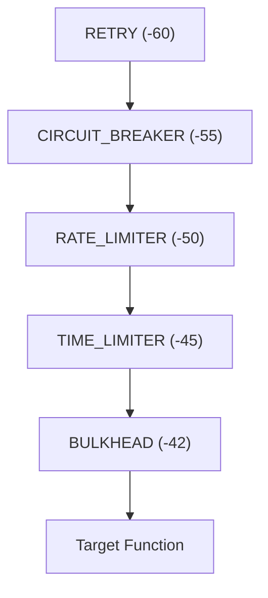
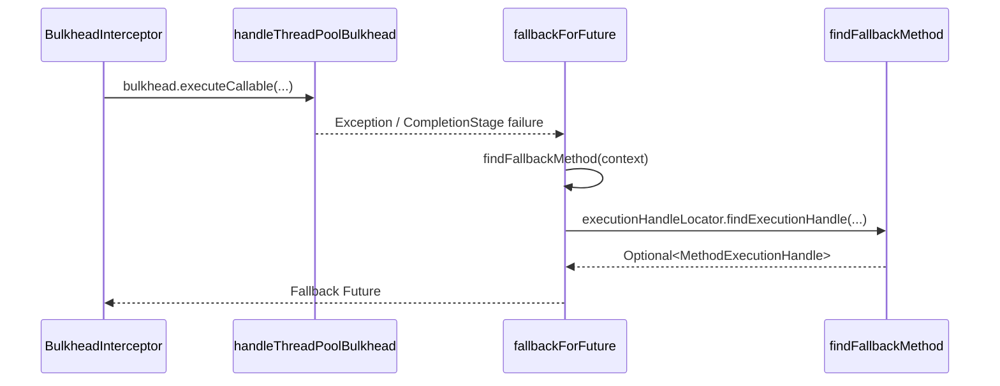

# Micronaut Interceptors

<details>
<summary>Relevant source files</summary>

The following files were used as context for generating this wiki page:

- [resilience4j-micronaut/src/main/java/io/github/resilience4j/micronaut/bulkhead/BulkheadInterceptor.java](https://github.com/resilience4j/resilience4j/blob/main/resilience4j-micronaut/src/main/java/io/github/resilience4j/micronaut/bulkhead/BulkheadInterceptor.java)
- [resilience4j-spring6/src/main/java/io/github/resilience4j/spring6/circuitbreaker/configure/CircuitBreakerAspect.java](https://github.com/resilience4j/resilience4j/blob/main/resilience4j-spring6/src/main/java/io/github/resilience4j/spring6/circuitbreaker/configure/CircuitBreakerAspect.java)
- [resilience4j-spring6/src/main/java/io/github/resilience4j/spring6/retry/configure/RetryAspect.java](https://github.com/resilience4j/resilience4j/blob/main/resilience4j-spring6/src/main/java/io/github/resilience4j/spring6/retry/configure/RetryAspect.java)
- [resilience4j-micronaut/src/main/java/io/github/resilience4j/micronaut/circuitbreaker/CircuitBreakerInterceptor.java](https://github.com/resilience4j/resilience4j/blob/main/resilience4j-micronaut/src/main/java/io/github/resilience4j/micronaut/circuitbreaker/CircuitBreakerInterceptor.java)
- [resilience4j-micronaut/src/main/java/io/github/resilience4j/micronaut/retry/RetryInterceptor.java](https://github.com/resilience4j/resilience4j/blob/main/resilience4j-micronaut/src/main/java/io/github/resilience4j/micronaut/retry/RetryInterceptor.java)
- [resilience4j-micronaut/src/main/java/io/github/resilience4j/micronaut/ratelimiter/RateLimiterInterceptor.java](https://github.com/resilience4j/resilience4j/blob/main/resilience4j-micronaut/src/main/java/io/github/resilience4j/micronaut/ratelimiter/RateLimiterInterceptor.java)
- [resilience4j-micronaut/src/main/java/io/github/resilience4j/micronaut/retry/RetryRegistryFactory.java](https://github.com/resilience4j/resilience4j/blob/main/resilience4j-micronaut/src/main/java/io/github/resilience4j/micronaut/retry/RetryRegistryFactory.java)
- [resilience4j-micronaut/src/main/java/io/github/resilience4j/micronaut/timelimiter/TimeLimiterInterceptor.java](https://github.com/resilience4j/resilience4j/blob/main/resilience4j-micronaut/src/main/java/io/github/resilience4j/micronaut/timelimiter/TimeLimiterInterceptor.java)
- [resilience4j-spring6/src/main/java/io/github/resilience4j/spring6/bulkhead/configure/BulkheadAspect.java](https://github.com/resilience4j/resilience4j/blob/main/resilience4j-spring6/src/main/java/io/github/resilience4j/spring6/bulkhead/configure/BulkheadAspect.java)
- [resilience4j-spring6/src/main/java/io/github/resilience4j/spring6/ratelimiter/configure/RateLimiterAspect.java](https://github.com/resilience4j/spring6/ratelimiter/configure/RateLimiterAspect.java)
- [resilience4j-feign/README.adoc](https://github.com/resilience4j/resilience4j/blob/main/resilience4j-feign/README.adoc)
- [resilience4j-micronaut/src/main/java/io/github/resilience4j/micronaut/BaseInterceptor.java](https://github.com/resilience4j/resilience4j/blob/main/resilience4j-micronaut/src/main/java/io/github/resilience4j/micronaut/BaseInterceptor.java)
- [resilience4j-micronaut/src/main/java/io/github/resilience4j/micronaut/annotation/CircuitBreaker.java](https://github.com/resilience4j/resilience4j/blob/main/resilience4j-micronaut/src/main/java/io/github/resilience4j/micronaut/annotation/CircuitBreaker.java)
- [resilience4j-micronaut/src/main/java/io/github/resilience4j/micronaut/annotation/Retry.java](https://github.com/resilience4j/resilience4j/blob/main/resilience4j-micronaut/src/main/java/io/github/resilience4j/micronaut/annotation/Retry.java)
- [resilience4j-micronaut/src/main/java/io/github/resilience4j/micronaut/ResilienceInterceptPhase.java](https://github.com/resilience4j/resilience4j/blob/main/resilience4j-micronaut/src/main/java/io/github/resilience4j/micronaut/ResilienceInterceptPhase.java)
- [resilience4j-spring6/src/main/java/io/github/resilience4j/spring6/circuitbreaker/configure/ReactorCircuitBreakerAspectExt.java](https://github.com/resilience4j/resilience4j/blob/main/resilience4j-spring6/src/main/java/io/github/resilience4j/spring6/circuitbreaker/configure/ReactorCircuitBreakerAspectExt.java)
- [resilience4j-micronaut/src/main/java/io/github/resilience4j/micronaut/annotation/RateLimiter.java](https://github.com/resilience4j/resilience4j/blob/main/resilience4j-micronaut/src/main/java/io/github/resilience4j/micronaut/annotation/RateLimiter.java)
- [resilience4j-micronaut/src/main/java/io/github/resilience4j/micronaut/annotation/TimeLimiter.java](https://github.com/resilience4j/resilience4j/blob/main/resilience4j-micronaut/src/main/java/io/github/resilience4j/micronaut/annotation/TimeLimiter.java)
- [resilience4j-spring6/src/main/java/io/github/resilience4j/spring6/circuitbreaker/configure/RxJava3CircuitBreakerAspectExt.java](https://github.com/resilience4j/resilience4j/blob/main/resilience4j-spring6/src/main/java/io/github/resilience4j/spring6/circuitbreaker/configure/RxJava3CircuitBreakerAspectExt.java)
- [resilience4j-spring6/src/main/java/io/github/resilience4j/spring6/retry/configure/RxJava3RetryAspectExt.java](https://github.com/resilience4j/resilience4j/blob/main/resilience4j-spring6/src/main/java/io/github/resilience4j/spring6/retry/configure/RxJava3RetryAspectExt.java)
- [resilience4j-spring6/src/main/java/io/github/resilience4j/spring6/circuitbreaker/configure/RxJava2CircuitBreakerAspectExt.java](https://github.com/resilience4j/spring6/circuitbreaker/configure/RxJava2CircuitBreakerAspectExt.java)
- [resilience4j-spring6/src/main/java/io/github/resilience4j/spring6/retry/configure/RxJava2RetryAspectExt.java](https://github.com/resilience4j/spring6/retry/configure/RxJava2RetryAspectExt.java)
- [resilience4j-micronaut/src/main/java/io/github/resilience4j/micronaut/util/PublisherExtension.java](https://github.com/resilience4j/resilience4j/blob/main/resilience4j-micronaut/src/main/java/io/github/resilience4j/micronaut/util/PublisherExtension.java)
- [resilience4j-spring6/src/main/java/io/github/resilience4j/spring6/retry/configure/ReactorRetryAspectExt.java](https://github.com/resilience4j/spring6/retry/configure/ReactorRetryAspectExt.java)
- [resilience4j-micronaut/src/main/java/io/github/resilience4j/micronaut/util/ReactorPublisherExtension.java](https://github.com/resilience4j/resilience4j/blob/main/resilience4j-micronaut/src/main/java/io/github/resilience4j/micronaut/util/ReactorPublisherExtension.java)
- [resilience4j-micronaut/src/main/java/io/github/resilience4j/micronaut/annotation/Bulkhead.java](https://github.com/resilience4j/resilience4j/blob/main/resilience4j-micronaut/src/main/java/io/github/resilience4j/micronaut/annotation/Bulkhead.java)
- [resilience4j-micronaut/src/main/java/io/github/resilience4j/micronaut/util/RxJava2PublisherExtension.java](https://github.com/resilience4j/resilience4j/blob/main/resilience4j-micronaut/src/main/java/io/github/resilience4j/micronaut/util/RxJava2PublisherExtension.java)
- [resilience4j-micronaut/src/main/java/io/github/resilience4j/micronaut/util/RxJava3PublisherExtension.java](https://github.com/resilience4j/resilience4j/blob/main/resilience4j-micronaut/src/main/java/io/github/resilience4j/micronaut/util/RxJava3PublisherExtension.java)
- [resilience4j-feign/src/main/java/io/github/resilience4j/feign/FeignDecorators.java](https://github.com/resilience4j/resilience4j/blob/main/resilience4j-feign/src/main/java/io/github/resilience4j/feign/FeignDecorators.java)
- [resilience4j-micronaut/src/main/java/io/github/resilience4j/micronaut/circuitbreaker/package-info.java](https://github.com/resilience4j/resilience4j/blob/main/resilience4j-micronaut/src/main/java/io/github/resilience4j/micronaut/circuitbreaker/package-info.java)
</details>

## Overview

The Micronaut integration for Resilience4j provides declarative AOP method interception and fault tolerance patterns using annotations such as `@CircuitBreaker`, `@Retry`, `@RateLimiter`, `@TimeLimiter`, and `@Bulkhead`. By combining bean interceptors with the `ResilienceInterceptPhase` ordering mechanism, it coordinates multi-layer resilience policies around service method invocations.
Sources: [resilience4j-micronaut/src/main/java/io/github/resilience4j/micronaut/ResilienceInterceptPhase.java#L21-L29](https://github.com/resilience4j/resilience4j/blob/main/resilience4j-micronaut/src/main/java/io/github/resilience4j/micronaut/ResilienceInterceptPhase.java#L21-L29), [resilience4j-micronaut/src/main/java/io/github/resilience4j/micronaut/circuitbreaker/CircuitBreakerInterceptor.java#L37-L39](https://github.com/resilience4j/resilience4j/blob/main/resilience4j-micronaut/src/main/java/io/github/resilience4j/micronaut/circuitbreaker/CircuitBreakerInterceptor.java#L37-L39)

The architecture leverages a shared `BaseInterceptor` class to handle execution context management and dynamic fallback method resolution when failures occur or asynchronous futures complete exceptionally. Specialized interceptors delegate reactive stream transformations to `PublisherExtension` implementations, seamlessly supporting Reactor, RxJava2, and RxJava3 types alongside synchronous and `CompletionStage` executions.
Sources: [resilience4j-micronaut/src/main/java/io/github/resilience4j/micronaut/BaseInterceptor.java#L30-L68](https://github.com/resilience4j/resilience4j/blob/main/resilience4j-micronaut/src/main/java/io/github/resilience4j/micronaut/BaseInterceptor.java#L30-L68), [resilience4j-micronaut/src/main/java/io/github/resilience4j/micronaut/util/PublisherExtension.java#L15-L27](https://github.com/resilience4j/resilience4j/blob/main/resilience4j-micronaut/src/main/java/io/github/resilience4j/micronaut/util/PublisherExtension.java#L15-L27)

## Declarative Resilience Annotations and Ordering

### Declarative Resilience Annotations and Ordering

### Overview

Micronaut resilience annotations provide declarative AOP method interception that can be applied to individual methods or across entire classes to automatically enable backend monitoring, throttling, and fault tolerance. Each annotation is meta-annotated with `@Around`, `@Documented`, and `@Executable` to participate in Micronaut's proxy-based interception framework at runtime.
Sources: [resilience4j-micronaut/src/main/java/io/github/resilience4j/micronaut/annotation/CircuitBreaker.java#L18-L34](https://github.com/resilience4j/resilience4j/blob/main/resilience4j-micronaut/src/main/java/io/github/resilience4j/micronaut/annotation/CircuitBreaker.java#L18-L34), [resilience4j-micronaut/src/main/java/io/github/resilience4j/micronaut/annotation/Retry.java#L18-L33](https://github.com/resilience4j/resilience4j/blob/main/resilience4j-micronaut/src/main/java/io/github/resilience4j/micronaut/annotation/Retry.java#L18-L33)

Every declarative annotation includes a mandatory `name` attribute to look up specific configuration properties and an optional `fallbackMethod` attribute specifying a local fallback method name to invoke upon failure.
Sources: [resilience4j-micronaut/src/main/java/io/github/resilience4j/micronaut/annotation/CircuitBreaker.java#L34-L49](https://github.com/resilience4j/resilience4j/blob/main/resilience4j-micronaut/src/main/java/io/github/resilience4j/micronaut/annotation/CircuitBreaker.java#L34-L49), [resilience4j-micronaut/src/main/java/io/github/resilience4j/micronaut/annotation/RateLimiter.java#L34-L49](https://github.com/resilience4j/resilience4j/blob/main/resilience4j-micronaut/src/main/java/io/github/resilience4j/micronaut/annotation/RateLimiter.java#L34-L49), [resilience4j-micronaut/src/main/java/io/github/resilience4j/micronaut/annotation/TimeLimiter.java#L29-L44](https://github.com/resilience4j/resilience4j/blob/main/resilience4j-micronaut/src/main/java/io/github/resilience4j/micronaut/annotation/TimeLimiter.java#L29-L44)

| Annotation | Target Elements | Mandatory Attribute | Optional Attributes | Sources |
| --- | --- | --- | --- | --- |
| `@CircuitBreaker` | `METHOD`, `TYPE` | `name()` | `fallbackMethod()` | [resilience4j-micronaut/src/main/java/io/github/resilience4j/micronaut/annotation/CircuitBreaker.java#L21-L49](https://github.com/resilience4j/resilience4j/blob/main/resilience4j-micronaut/src/main/java/io/github/resilience4j/micronaut/annotation/CircuitBreaker.java#L21-L49) |
| `@Retry` | `METHOD`, `TYPE` | `name()` | `fallbackMethod()` | [resilience4j-micronaut/src/main/java/io/github/resilience4j/micronaut/annotation/Retry.java#L21-L48](https://github.com/resilience4j/resilience4j/blob/main/resilience4j-micronaut/src/main/java/io/github/resilience4j/micronaut/annotation/Retry.java#L21-L48) |
| `@RateLimiter` | `METHOD`, `TYPE` | `name()` | `fallbackMethod()` | [resilience4j-micronaut/src/main/java/io/github/resilience4j/micronaut/annotation/RateLimiter.java#L21-L49](https://github.com/resilience4j/resilience4j/blob/main/resilience4j-micronaut/src/main/java/io/github/resilience4j/micronaut/annotation/RateLimiter.java#L21-L49) |
| `@TimeLimiter` | `METHOD`, `TYPE` | `name()` | `fallbackMethod()` | [resilience4j-micronaut/src/main/java/io/github/resilience4j/micronaut/annotation/TimeLimiter.java#L24-L44](https://github.com/resilience4j/resilience4j/blob/main/resilience4j-micronaut/src/main/java/io/github/resilience4j/micronaut/annotation/TimeLimiter.java#L24-L44) |
| `@Bulkhead` | `METHOD`, `TYPE` | `name()` | `fallbackMethod()`, `type()` | [resilience4j-micronaut/src/main/java/io/github/resilience4j/micronaut/annotation/Bulkhead.java#L21-L62](https://github.com/resilience4j/resilience4j/blob/main/resilience4j-micronaut/src/main/java/io/github/resilience4j/micronaut/annotation/Bulkhead.java#L21-L62) |

Sources: [resilience4j-micronaut/src/main/java/io/github/resilience4j/micronaut/annotation/Bulkhead.java#L21-L62](https://github.com/resilience4j/resilience4j/blob/main/resilience4j-micronaut/src/main/java/io/github/resilience4j/micronaut/annotation/Bulkhead.java#L21-L62)

### Interceptor Execution Precedence

To control execution precedence when multiple resilience annotations are present, interceptors implement Micronaut's `Ordered` interface via the `ResilienceInterceptPhase` enumeration. The default ordering encapsulates decorators in the execution chain: `Retry ( CircuitBreaker ( RateLimiter ( TimeLimiter ( Bulkhead ( Function ) ) ) ) )`.
Sources: [resilience4j-micronaut/src/main/java/io/github/resilience4j/micronaut/ResilienceInterceptPhase.java#L21-L29](https://github.com/resilience4j/resilience4j/blob/main/resilience4j-micronaut/src/main/java/io/github/resilience4j/micronaut/ResilienceInterceptPhase.java#L21-L29)


Sources: [resilience4j-micronaut/src/main/java/io/github/resilience4j/micronaut/ResilienceInterceptPhase.java#L30-L56](https://github.com/resilience4j/resilience4j/blob/main/resilience4j-micronaut/src/main/java/io/github/resilience4j/micronaut/ResilienceInterceptPhase.java#L30-L56)

| Phase Constant | Position Value | Intercepted Pattern | Sources |
| --- | --- | --- | --- |
| `RETRY` | `-60` | Retry | [resilience4j-micronaut/src/main/java/io/github/resilience4j/micronaut/ResilienceInterceptPhase.java#L34-L35](https://github.com/resilience4j/resilience4j/blob/main/resilience4j-micronaut/src/main/java/io/github/resilience4j/micronaut/ResilienceInterceptPhase.java#L34-L35) |
| `CIRCUIT_BREAKER` | `-55` | Circuit Breaker | [resilience4j-micronaut/src/main/java/io/github/resilience4j/micronaut/ResilienceInterceptPhase.java#L39-L40](https://github.com/resilience4j/resilience4j/blob/main/resilience4j-micronaut/src/main/java/io/github/resilience4j/micronaut/ResilienceInterceptPhase.java#L39-L40) |
| `RATE_LIMITER` | `-50` | Rate Limiter | [resilience4j-micronaut/src/main/java/io/github/resilience4j/micronaut/ResilienceInterceptPhase.java#L44-L45](https://github.com/resilience4j/resilience4j/blob/main/resilience4j-micronaut/src/main/java/io/github/resilience4j/micronaut/ResilienceInterceptPhase.java#L44-L45) |
| `TIME_LIMITER` | `-45` | Time Limiter | [resilience4j-micronaut/src/main/java/io/github/resilience4j/micronaut/ResilienceInterceptPhase.java#L49-L50](https://github.com/resilience4j/resilience4j/blob/main/resilience4j-micronaut/src/main/java/io/github/resilience4j/micronaut/ResilienceInterceptPhase.java#L49-L50) |
| `BULKHEAD` | `-42` | Bulkhead | [resilience4j-micronaut/src/main/java/io/github/resilience4j/micronaut/ResilienceInterceptPhase.java#L54-L55](https://github.com/resilience4j/resilience4j/blob/main/resilience4j-micronaut/src/main/java/io/github/resilience4j/micronaut/ResilienceInterceptPhase.java#L54-L55) |

Sources: [resilience4j-micronaut/src/main/java/io/github/resilience4j/micronaut/ResilienceInterceptPhase.java#L30-L56](https://github.com/resilience4j/resilience4j/blob/main/resilience4j-micronaut/src/main/java/io/github/resilience4j/micronaut/ResilienceInterceptPhase.java#L30-L56)

> [!NOTE]
> The `Bulkhead` annotation provides a `type()` element supporting `Bulkhead.Type.SEMAPHORE` and `Bulkhead.Type.THREADPOOL`, allowing execution throttling via semaphore isolation or thread pool distribution.
> Sources: [resilience4j-micronaut/src/main/java/io/github/resilience4j/micronaut/annotation/Bulkhead.java#L48-L61](https://github.com/resilience4j/resilience4j/blob/main/resilience4j-micronaut/src/main/java/io/github/resilience4j/micronaut/annotation/Bulkhead.java#L48-L61)

## Core Base Interceptor and Fallback Resolution

### Overview

The `BaseInterceptor` abstract class provides core mechanics for exception handling, logging, and dynamic fallback resolution across concrete interceptor implementations. When synchronous execution fails or asynchronous execution completes exceptionally, `BaseInterceptor` intercepts the failure and attempts to resolve a suitable fallback method using Micronaut's dependency injection and execution handle infrastructure.
Sources: [resilience4j-micronaut/src/main/java/io/github/resilience4j/micronaut/BaseInterceptor.java#L30-L68](https://github.com/resilience4j/resilience4j/blob/main/resilience4j-micronaut/src/main/java/io/github/resilience4j/micronaut/BaseInterceptor.java#L30-L68)

### Fallback Resolution Mechanics

The fallback process distinguishes between synchronous execution failures and asynchronous completion stages. For synchronous calls, the `fallback` method inspects the incoming exception, logs specific errors such as `NoAvailableServiceException`, and searches for a fallback handle via `findFallbackMethod`. If a fallback method is present, its handle is invoked with the original parameter values; otherwise, runtime exceptions are rethrown directly while checked or other throwables are wrapped in a `CompletionException`.
Sources: [resilience4j-micronaut/src/main/java/io/github/resilience4j/micronaut/BaseInterceptor.java#L42-L68](https://github.com/resilience4j/resilience4j/blob/main/resilience4j-micronaut/src/main/java/io/github/resilience4j/micronaut/BaseInterceptor.java#L42-L68)

For asynchronous completion stages, `fallbackForFuture` attaches a completion listener to the result stage. If the stage completes exceptionally, it invokes `findFallbackMethod` and attempts to execute the fallback handler asynchronously, chaining the resulting future or completing exceptionally with a `FallbackException` if the handler returns a null value.
Sources: [resilience4j-micronaut/src/main/java/io/github/resilience4j/micronaut/BaseInterceptor.java#L70-L107](https://github.com/resilience4j/resilience4j/blob/main/resilience4j-micronaut/src/main/java/io/github/resilience4j/micronaut/BaseInterceptor.java#L70-L107)

### Call-Chain Execution Walkthrough (`Intercept -> FindFallbackMethod`)

1. `intercept`: The concrete interceptor (such as `BulkheadInterceptor`) intercepts method invocations and executes through handlers like `handleThreadPoolBulkhead`.
Sources: [resilience4j-micronaut/src/main/java/io/github/resilience4j/micronaut/bulkhead/BulkheadInterceptor.java#L87-L141](https://github.com/resilience4j/resilience4j/blob/main/resilience4j-micronaut/src/main/java/io/github/resilience4j/micronaut/bulkhead/BulkheadInterceptor.java#L87-L141)

2. `handleThreadPoolBulkhead`: For thread pool bulkhead execution, the callable wraps future execution and handles exceptional outcomes or bulkhead rejections.
Sources: [resilience4j-micronaut/src/main/java/io/github/resilience4j/micronaut/bulkhead/BulkheadInterceptor.java#L142-L169](https://github.com/resilience4j/resilience4j/blob/main/resilience4j-micronaut/src/main/java/io/github/resilience4j/micronaut/bulkhead/BulkheadInterceptor.java#L142-L169)

3. `fallbackForFuture`: When an asynchronous completion stage completes exceptionally, this base method catches the failure and delegates to fallback resolution.
Sources: [resilience4j-micronaut/src/main/java/io/github/resilience4j/micronaut/BaseInterceptor.java#L69-L106](https://github.com/resilience4j/resilience4j/blob/main/resilience4j-micronaut/src/main/java/io/github/resilience4j/micronaut/BaseInterceptor.java#L69-L106)

4. `findFallbackMethod`: Subclasses implement this method to query the `ExecutionHandleLocator` using declaring types, fallback method attributes, and argument types.
Sources: [resilience4j-micronaut/src/main/java/io/github/resilience4j/micronaut/BaseInterceptor.java#L32](https://github.com/resilience4j/resilience4j/blob/main/resilience4j-micronaut/src/main/java/io/github/resilience4j/micronaut/BaseInterceptor.java#L32), [resilience4j-micronaut/src/main/java/io/github/resilience4j/micronaut/bulkhead/BulkheadInterceptor.java#L80-L86](https://github.com/resilience4j/resilience4j/blob/main/resilience4j-micronaut/src/main/java/io/github/resilience4j/micronaut/bulkhead/BulkheadInterceptor.java#L80-L86)


Sources: [resilience4j-micronaut/src/main/java/io/github/resilience4j/micronaut/BaseInterceptor.java#L32-L106](https://github.com/resilience4j/resilience4j/blob/main/resilience4j-micronaut/src/main/java/io/github/resilience4j/micronaut/BaseInterceptor.java#L32-L106), [resilience4j-micronaut/src/main/java/io/github/resilience4j/micronaut/bulkhead/BulkheadInterceptor.java#L80-L86](https://github.com/resilience4j/resilience4j/blob/main/resilience4j-micronaut/src/main/java/io/github/resilience4j/micronaut/bulkhead/BulkheadInterceptor.java#L80-L86), [resilience4j-micronaut/src/main/java/io/github/resilience4j/micronaut/bulkhead/BulkheadInterceptor.java#L142-L169](https://github.com/resilience4j/resilience4j/blob/main/resilience4j-micronaut/src/main/java/io/github/resilience4j/micronaut/bulkhead/BulkheadInterceptor.java#L142-L169)

> [!NOTE]
> If a fallback method handle returns `null`, `fallbackForFuture` explicitly completes the future exceptionally with a `FallbackException` rather than propagating a null reference.
> Sources: [resilience4j-micronaut/src/main/java/io/github/resilience4j/micronaut/BaseInterceptor.java#L84-L86](https://github.com/resilience4j/resilience4j/blob/main/resilience4j-micronaut/src/main/java/io/github/resilience4j/micronaut/BaseInterceptor.java#L84-L86)

## Specific AOP Interceptor Implementations

### Overview

Specific AOP interceptor implementations in Resilience4j Micronaut bridge declarative annotations with core execution wrappers. Each interceptor extends `BaseInterceptor`, implements Micronaut's `MethodInterceptor<Object, Object>`, and queries its respective registry to fetch named configurations or defaults. Interceptors inspect the return type via `InterceptedMethod.of(context, conversionService)` to handle `PUBLISHER`, `COMPLETION_STAGE`, or `SYNCHRONOUS` execution branches.

Sources: [resilience4j-micronaut/src/main/java/io/github/resilience4j/micronaut/bulkhead/BulkheadInterceptor.java#L44-L170](https://github.com/resilience4j/resilience4j/blob/main/resilience4j-micronaut/src/main/java/io/github/resilience4j/micronaut/bulkhead/BulkheadInterceptor.java#L44-L170), [resilience4j-micronaut/src/main/java/io/github/resilience4j/micronaut/circuitbreaker/CircuitBreakerInterceptor.java#L39-L117](https://github.com/resilience4j/resilience4j/blob/main/resilience4j-micronaut/src/main/java/io/github/resilience4j/micronaut/circuitbreaker/CircuitBreakerInterceptor.java#L39-L117), [resilience4j-micronaut/src/main/java/io/github/resilience4j/micronaut/retry/RetryInterceptor.java#L43-L128](https://github.com/resilience4j/resilience4j/blob/main/resilience4j-micronaut/src/main/java/io/github/resilience4j/micronaut/retry/RetryInterceptor.java#L43-L128), [resilience4j-micronaut/src/main/java/io/github/resilience4j/micronaut/ratelimiter/RateLimiterInterceptor.java#L39-L117](https://github.com/resilience4j/resilience4j/blob/main/resilience4j-micronaut/src/main/java/io/github/resilience4j/micronaut/ratelimiter/RateLimiterInterceptor.java#L39-L117), [resilience4j-micronaut/src/main/java/io/github/resilience4j/micronaut/timelimiter/TimeLimiterInterceptor.java#L46-L128](https://github.com/resilience4j/resilience4j/blob/main/resilience4j-micronaut/src/main/java/io/github/resilience4j/micronaut/timelimiter/TimeLimiterInterceptor.java#L46-L128)

### Bulkhead and ThreadPoolBulkhead Handling

`BulkheadInterceptor` supports two distinct types defined by `io.github.resilience4j.micronaut.annotation.Bulkhead.Type`: `SEMAPHORE` and `THREADPOOL`. When `Type.THREADPOOL` is selected, the interceptor invokes `handleThreadPoolBulkhead`, which requires the intercepted method to return a `COMPLETION_STAGE`. It wraps execution inside `bulkhead.executeCallable(...)`, unwrapping `ExecutionException` causes and handling `BulkheadFullException` by returning an exceptionally completed `CompletableFuture`. Semaphore bulkheads delegate synchronously through `bulkhead.executeCheckedSupplier(context::proceed)` or wrap reactive publishers and completion stages.

Sources: [resilience4j-micronaut/src/main/java/io/github/resilience4j/micronaut/bulkhead/BulkheadInterceptor.java#L95-L170](https://github.com/resilience4j/resilience4j/blob/main/resilience4j-micronaut/src/main/java/io/github/resilience4j/micronaut/bulkhead/BulkheadInterceptor.java#L95-L170)

> [!WARNING]
> ThreadPool bulkhead interception throws an `IllegalStateException` if applied to methods that do not return a `COMPLETION_STAGE`.
> Sources: [resilience4j-micronaut/src/main/java/io/github/resilience4j/micronaut/bulkhead/BulkheadInterceptor.java#L168-L170](https://github.com/resilience4j/resilience4j/blob/main/resilience4j-micronaut/src/main/java/io/github/resilience4j/micronaut/bulkhead/BulkheadInterceptor.java#L168-L170)

### Call-Chain Execution Walkthrough

The interceptor dispatches incoming calls based on the resolved return type. Taking `RetryInterceptor` as an example:

1. `intercept(MethodInvocationContext)`: Verifies presence of the `@Retry` annotation, retrieves the named `RetryConfig` from `RetryRegistry`, and instantiates `InterceptedMethod`.
Sources: [resilience4j-micronaut/src/main/java/io/github/resilience4j/micronaut/retry/RetryInterceptor.java#L84-L95](https://github.com/resilience4j/resilience4j/blob/main/resilience4j-micronaut/src/main/java/io/github/resilience4j/micronaut/retry/RetryInterceptor.java#L84-L95)

2. `interceptedMethod.resultType()`: Evaluates the method signature return type, branching into `PUBLISHER`, `COMPLETION_STAGE`, or `SYNCHRONOUS`.
Sources: [resilience4j-micronaut/src/main/java/io/github/resilience4j/micronaut/retry/RetryInterceptor.java#L96-L124](https://github.com/resilience4j/resilience4j/blob/main/resilience4j-micronaut/src/main/java/io/github/resilience4j/micronaut/retry/RetryInterceptor.java#L96-L124)

3. `retry.executeCompletionStage(executorService, supplier)` or `retry.executeCheckedSupplier(context::proceed)`: Executes the target method wrapped in retry logic using the scheduled executor service for asynchronous stages.
Sources: [resilience4j-micronaut/src/main/java/io/github/resilience4j/micronaut/retry/RetryInterceptor.java#L104-L115](https://github.com/resilience4j/resilience4j/blob/main/resilience4j-micronaut/src/main/java/io/github/resilience4j/micronaut/retry/RetryInterceptor.java#L104-L115), [resilience4j-micronaut/src/main/java/io/github/resilience4j/micronaut/retry/RetryInterceptor.java#L116-L122](https://github.com/resilience4j/resilience4j/blob/main/resilience4j-micronaut/src/main/java/io/github/resilience4j/micronaut/retry/RetryInterceptor.java#L116-L122)

4. `fallback(context, exception)` / `fallbackForFuture`: Intercepts thrown exceptions or exceptional completion stages to search for and execute registered fallback execution handles.
Sources: [resilience4j-micronaut/src/main/java/io/github/resilience4j/micronaut/retry/RetryInterceptor.java#L104-L115](https://github.com/resilience4j/resilience4j/blob/main/resilience4j-micronaut/src/main/java/io/github/resilience4j/micronaut/retry/RetryInterceptor.java#L104-L115), [resilience4j-micronaut/src/main/java/io/github/resilience4j/micronaut/retry/RetryInterceptor.java#L116-L122](https://github.com/resilience4j/resilience4j/blob/main/resilience4j-micronaut/src/main/java/io/github/resilience4j/micronaut/retry/RetryInterceptor.java#L116-L122)

### Interceptor Execution Characteristics

| Interceptor | Annotation Bean | Required Bean / Registry | Result Types Handled |
| :--- | :--- | :--- | :--- |
| `BulkheadInterceptor` | `io.github.resilience4j.micronaut.annotation.Bulkhead` | `BulkheadRegistry`, `ThreadPoolBulkheadRegistry` | `PUBLISHER`, `COMPLETION_STAGE`, `SYNCHRONOUS` |
| `CircuitBreakerInterceptor` | `io.github.resilience4j.micronaut.annotation.CircuitBreaker` | `CircuitBreakerRegistry` | `PUBLISHER`, `COMPLETION_STAGE`, `SYNCHRONOUS` |
| `RetryInterceptor` | `io.github.resilience4j.micronaut.annotation.Retry` | `RetryRegistry` | `PUBLISHER`, `COMPLETION_STAGE`, `SYNCHRONOUS` |
| `RateLimiterInterceptor` | `io.github.resilience4j.micronaut.annotation.RateLimiter` | `RateLimiterRegistry` | `PUBLISHER`, `COMPLETION_STAGE`, `SYNCHRONOUS` |
| `TimeLimiterInterceptor` | `io.github.resilience4j.micronaut.annotation.TimeLimiter` | `TimeLimiterRegistry` | `PUBLISHER`, `COMPLETION_STAGE`, `SYNCHRONOUS` |

Sources: [resilience4j-micronaut/src/main/java/io/github/resilience4j/micronaut/bulkhead/BulkheadInterceptor.java#L42-L44](https://github.com/resilience4j/resilience4j/blob/main/resilience4j-micronaut/src/main/java/io/github/resilience4j/micronaut/bulkhead/BulkheadInterceptor.java#L42-L44), [resilience4j-micronaut/src/main/java/io/github/resilience4j/micronaut/bulkhead/BulkheadInterceptor.java#L107-L136](https://github.com/resilience4j/resilience4j/blob/main/resilience4j-micronaut/src/main/java/io/github/resilience4j/micronaut/bulkhead/BulkheadInterceptor.java#L107-L136), [resilience4j-micronaut/src/main/java/io/github/resilience4j/micronaut/circuitbreaker/CircuitBreakerInterceptor.java#L37-L39](https://github.com/resilience4j/resilience4j/blob/main/resilience4j-micronaut/src/main/java/io/github/resilience4j/micronaut/circuitbreaker/CircuitBreakerInterceptor.java#L37-L39), [resilience4j-micronaut/src/main/java/io/github/resilience4j/micronaut/circuitbreaker/CircuitBreakerInterceptor.java#L84-L112](https://github.com/resilience4j/resilience4j/blob/main/resilience4j-micronaut/src/main/java/io/github/resilience4j/micronaut/circuitbreaker/CircuitBreakerInterceptor.java#L84-L112), [resilience4j-micronaut/src/main/java/io/github/resilience4j/micronaut/retry/RetryInterceptor.java#L41-L43](https://github.com/resilience4j/resilience4j/blob/main/resilience4j-micronaut/src/main/java/io/github/resilience4j/micronaut/retry/RetryInterceptor.java#L41-L43), [resilience4j-micronaut/src/main/java/io/github/resilience4j/micronaut/retry/RetryInterceptor.java#L96-L124](https://github.com/resilience4j/resilience4j/blob/main/resilience4j-micronaut/src/main/java/io/github/resilience4j/micronaut/retry/RetryInterceptor.java#L96-L124), [resilience4j-micronaut/src/main/java/io/github/resilience4j/micronaut/ratelimiter/RateLimiterInterceptor.java#L37-L39](https://github.com/resilience4j/resilience4j/blob/main/resilience4j-micronaut/src/main/java/io/github/resilience4j/micronaut/ratelimiter/RateLimiterInterceptor.java#L37-L39), [resilience4j-micronaut/src/main/java/io/github/resilience4j/micronaut/ratelimiter/RateLimiterInterceptor.java#L85-L113](https://github.com/resilience4j/resilience4j/blob/main/resilience4j-micronaut/src/main/java/io/github/resilience4j/micronaut/ratelimiter/RateLimiterInterceptor.java#L85-L113), [resilience4j-micronaut/src/main/java/io/github/resilience4j/micronaut/timelimiter/TimeLimiterInterceptor.java#L44-L46](https://github.com/resilience4j/resilience4j/blob/main/resilience4j-micronaut/src/main/java/io/github/resilience4j/micronaut/timelimiter/TimeLimiterInterceptor.java#L44-L46), [resilience4j-micronaut/src/main/java/io/github/resilience4j/micronaut/timelimiter/TimeLimiterInterceptor.java#L93-L124](https://github.com/resilience4j/resilience4j/blob/main/resilience4j-micronaut/src/main/java/io/github/resilience4j/micronaut/timelimiter/TimeLimiterInterceptor.java#L93-L124)

## Reactive Stream Publisher Extensions

### Overview

The `PublisherExtension` interface defines the contract for decorating reactive stream `Publisher` instances with Resilience4j patterns—bulkhead, circuit breaker, time limiter, retry, rate limiter—as well as handling reactive fallbacks. Implementations target specific reactive libraries in Micronaut applications, conditionally loading when the corresponding runtime classes are present on the classpath.

Sources: [resilience4j-micronaut/src/main/java/io/github/resilience4j/micronaut/util/PublisherExtension.java#L15-L27](https://github.com/resilience4j/resilience4j/blob/main/resilience4j-micronaut/src/main/java/io/github/resilience4j/micronaut/util/PublisherExtension.java#L15-L27)

### Extension Implementations and Runtime Requirements

Three concrete singleton implementations provide reactive stream operators for Reactor, RxJava2, and RxJava3. Each class uses Micronaut's `@Requires` annotation to inspect the classpath before registration.

| Implementation Class | Required Classes | Reactive Stream Source / Wrapper |
| :--- | :--- | :--- |
| `ReactorPublisherExtension` | `Flux.class`, `AbstractSubscriber.class` | `reactor.core.publisher.Flux` |
| `RxJava2PublisherExtension` | `Flowable.class`, AbstractSubscriber (Resilience4j) | `io.reactivex.Flowable` |
| `RxJava3PublisherExtension` | `Flowable.class`, AbstractSubscriber (RxJava3) | `io.reactivex.rxjava3.core.Flowable` |

Sources: [resilience4j-micronaut/src/main/java/io/github/resilience4j/micronaut/util/ReactorPublisherExtension.java#L28-L30](https://github.com/resilience4j/resilience4j/blob/main/resilience4j-micronaut/src/main/java/io/github/resilience4j/micronaut/util/ReactorPublisherExtension.java#L28-L30), [resilience4j-micronaut/src/main/java/io/github/resilience4j/micronaut/util/RxJava2PublisherExtension.java#L28-L30](https://github.com/resilience4j/resilience4j/blob/main/resilience4j-micronaut/src/main/java/io/github/resilience4j/micronaut/util/RxJava2PublisherExtension.java#L28-L30), [resilience4j-micronaut/src/main/java/io/github/resilience4j/micronaut/util/RxJava3PublisherExtension.java#L28-L30](https://github.com/resilience4j/resilience4j/blob/main/resilience4j-micronaut/src/main/java/io/github/resilience4j/micronaut/util/RxJava3PublisherExtension.java#L28-L30)

### Operator Decoration Mapping

Each extension wraps a standard `Publisher<T>` by converting it to the library-specific reactive type (`Flux` or `Flowable`) and applying the corresponding Resilience4j operator or transformer.

- **Bulkhead**: Uses `BulkheadOperator.of(bulkhead)` via `transformDeferred` (Reactor) or `compose` (RxJava2/3).
- **CircuitBreaker**: Uses `CircuitBreakerOperator.of(circuitBreaker)`.
- **TimeLimiter**: Uses `TimeLimiterOperator.of(timeLimiter)` in Reactor and `TimeLimiterTransformer.of(timeLimiter)` in RxJava2/3.
- **Retry**: Uses `RetryOperator.of(retry)` in Reactor and `RetryTransformer.of(retry)` in RxJava2/3.
- **RateLimiter**: Uses `RateLimiterOperator.of(rateLimiter)`.

Sources: [resilience4j-micronaut/src/main/java/io/github/resilience4j/micronaut/util/ReactorPublisherExtension.java#L33-L61](https://github.com/resilience4j/resilience4j/blob/main/resilience4j-micronaut/src/main/java/io/github/resilience4j/micronaut/util/ReactorPublisherExtension.java#L33-L61), [resilience4j-micronaut/src/main/java/io/github/resilience4j/micronaut/util/RxJava2PublisherExtension.java#L33-L56](https://github.com/resilience4j/resilience4j/blob/main/resilience4j-micronaut/src/main/java/io/github/resilience4j/micronaut/util/RxJava2PublisherExtension.java#L33-L56), [resilience4j-micronaut/src/main/java/io/github/resilience4j/micronaut/util/RxJava3PublisherExtension.java#L33-L56](https://github.com/resilience4j/resilience4j/blob/main/resilience4j-micronaut/src/main/java/io/github/resilience4j/micronaut/util/RxJava3PublisherExtension.java#L33-L56)

### Fallback Execution Walkthrough

When an upstream publisher emits an error during execution, the `fallbackPublisher` method intercepts the failure stream to resolve and execute a registered fallback handler. The call sequence proceeds through specific validation and invocation checks:

1. `Flux.from(publisher).onErrorResume(...)` or `Flowable.fromPublisher(publisher).onErrorResumeNext(...)` intercepts the incoming `throwable`.
Sources: [resilience4j-micronaut/src/main/java/io/github/resilience4j/micronaut/util/ReactorPublisherExtension.java#L64-L65](https://github.com/resilience4j/resilience4j/blob/main/resilience4j-micronaut/src/main/java/io/github/resilience4j/micronaut/util/ReactorPublisherExtension.java#L64-L65), [resilience4j-micronaut/src/main/java/io/github/resilience4j/micronaut/util/RxJava2PublisherExtension.java#L59-L60](https://github.com/resilience4j/resilience4j/blob/main/resilience4j-micronaut/src/main/java/io/github/resilience4j/micronaut/util/RxJava2PublisherExtension.java#L59-L60)

2. `handler.apply(context)` is called to resolve an `Optional<? extends MethodExecutionHandle<?, Object>>` fallback method.
Sources: [resilience4j-micronaut/src/main/java/io/github/resilience4j/micronaut/util/ReactorPublisherExtension.java#L66](https://github.com/resilience4j/resilience4j/blob/main/resilience4j-micronaut/src/main/java/io/github/resilience4j/micronaut/util/ReactorPublisherExtension.java#L66), [resilience4j-micronaut/src/main/java/io/github/resilience4j/micronaut/util/RxJava2PublisherExtension.java#L61](https://github.com/resilience4j/resilience4j/blob/main/resilience4j-micronaut/src/main/java/io/github/resilience4j/micronaut/util/RxJava2PublisherExtension.java#L61)

3. If present, a debug log records target class and fallback handle details when debug logging is enabled.
Sources: [resilience4j-micronaut/src/main/java/io/github/resilience4j/micronaut/util/ReactorPublisherExtension.java#L67-L71](https://github.com/resilience4j/resilience4j/blob/main/resilience4j-micronaut/src/main/java/io/github/resilience4j/micronaut/util/ReactorPublisherExtension.java#L67-L71), [resilience4j-micronaut/src/main/java/io/github/resilience4j/micronaut/util/RxJava2PublisherExtension.java#L62-L66](https://github.com/resilience4j/resilience4j/blob/main/resilience4j-micronaut/src/main/java/io/github/resilience4j/micronaut/util/RxJava2PublisherExtension.java#L62-L66)

4. `fallbackHandle.invoke(context.getParameterValues())` executes the fallback method; if an exception is thrown during invocation, the original `throwable` is re-emitted via `Flux.error(throwable)` or `Flowable.error(throwable)`.
Sources: [resilience4j-micronaut/src/main/java/io/github/resilience4j/micronaut/util/ReactorPublisherExtension.java#L72-L77](https://github.com/resilience4j/resilience4j/blob/main/resilience4j-micronaut/src/main/java/io/github/resilience4j/micronaut/util/ReactorPublisherExtension.java#L72-L77), [resilience4j-micronaut/src/main/java/io/github/resilience4j/micronaut/util/RxJava2PublisherExtension.java#L67-L72](https://github.com/resilience4j/resilience4j/blob/main/resilience4j-micronaut/src/main/java/io/github/resilience4j/micronaut/util/RxJava2PublisherExtension.java#L67-L72)

5. If the resulting `fallbackResult` is `null`, a `FallbackException` is thrown indicating a null return value.
Sources: [resilience4j-micronaut/src/main/java/io/github/resilience4j/micronaut/util/ReactorPublisherExtension.java#L78-L80](https://github.com/resilience4j/resilience4j/blob/main/resilience4j-micronaut/src/main/java/io/github/resilience4j/micronaut/util/ReactorPublisherExtension.java#L78-L80), [resilience4j-micronaut/src/main/java/io/github/resilience4j/micronaut/util/RxJava2PublisherExtension.java#L73-L75](https://github.com/resilience4j/resilience4j/blob/main/resilience4j-micronaut/src/main/java/io/github/resilience4j/micronaut/util/RxJava2PublisherExtension.java#L73-L75)

6. `ConversionService.SHARED.convert(fallbackResult, Publisher.class)` converts the fallback result into a reactive `Publisher`; if conversion fails, a `FallbackException` for an unsupported reactive type is thrown.
Sources: [resilience4j-micronaut/src/main/java/io/github/resilience4j/micronaut/util/ReactorPublisherExtension.java#L81-L83](https://github.com/resilience4j/resilience4j/blob/main/resilience4j-micronaut/src/main/java/io/github/resilience4j/micronaut/util/ReactorPublisherExtension.java#L81-L83), [resilience4j-micronaut/src/main/java/io/github/resilience4j/micronaut/util/RxJava2PublisherExtension.java#L76-L78](https://github.com/resilience4j/resilience4j/blob/main/resilience4j-micronaut/src/main/java/io/github/resilience4j/micronaut/util/RxJava2PublisherExtension.java#L76-L78)

> [!WARNING]
> If a fallback method invocation throws an exception or returns a null value, the reactive stream immediately terminates with a `FallbackException` or propagates the original error, bypassing any subsequent recovery operators unless handled further downstream.

Sources: [resilience4j-micronaut/src/main/java/io/github/resilience4j/micronaut/util/ReactorPublisherExtension.java#L64-L87](https://github.com/resilience4j/resilience4j/blob/main/resilience4j-micronaut/src/main/java/io/github/resilience4j/micronaut/util/ReactorPublisherExtension.java#L64-L87), [resilience4j-micronaut/src/main/java/io/github/resilience4j/micronaut/util/RxJava2PublisherExtension.java#L59-L82](https://github.com/resilience4j/resilience4j/blob/main/resilience4j-micronaut/src/main/java/io/github/resilience4j/micronaut/util/RxJava2PublisherExtension.java#L59-L82), [resilience4j-micronaut/src/main/java/io/github/resilience4j/micronaut/util/RxJava3PublisherExtension.java#L59-L82](https://github.com/resilience4j/resilience4j/blob/main/resilience4j-micronaut/src/main/java/io/github/resilience4j/micronaut/util/RxJava3PublisherExtension.java#L59-L82)

## Registry Factories and Event Management

### Overview

The `RetryRegistryFactory` class acts as a Micronaut `@Factory` bean configuration component, conditionally activated when the property `resilience4j.retry.enabled` is set to true. It manages the creation and lifecycle wiring of `RetryRegistry`, customizer composites, event consumer registries, and composite registry event consumers.

Sources: [resilience4j-micronaut/src/main/java/io/github/resilience4j/micronaut/retry/RetryRegistryFactory.java#L43-L45](https://github.com/resilience4j/resilience4j/blob/main/resilience4j-micronaut/src/main/java/io/github/resilience4j/micronaut/retry/RetryRegistryFactory.java#L43-L45)

### Bean Definition and Lifecycle Wiring

The factory provides singleton and bean definitions that construct the required registries and customizers for retry mechanisms. The primary `createRetryRegistry` method initializes instances using configuration properties and binds event listeners to entries.

```java
    @Singleton
    @Requires(beans = CommonRetryConfigurationProperties.class)
    public RetryRegistry createRetryRegistry(
        CommonRetryConfigurationProperties retryConfigurationProperties,
        @RetryQualifier EventConsumerRegistry<RetryEvent> retryEventConsumerRegistry,
        @RetryQualifier RegistryEventConsumer<Retry> retryRegistryEventConsumer,
        @RetryQualifier CompositeCustomizer<RetryConfigCustomizer> compositeRetryCustomizer) {
        RetryRegistry retryRegistry = createRetryRegistry(retryConfigurationProperties,
            retryRegistryEventConsumer, compositeRetryCustomizer);
        registerEventConsumer(retryRegistry, retryEventConsumerRegistry,
            retryConfigurationProperties);
        retryConfigurationProperties.getInstances()
            .forEach((name, properties) ->
                retryRegistry.retry(name, retryConfigurationProperties
                    .createRetryConfig(name, compositeRetryCustomizer)));
        return retryRegistry;
    }
```

Sources: [resilience4j-micronaut/src/main/java/io/github/resilience4j/micronaut/retry/RetryRegistryFactory.java#L53-L69](https://github.com/resilience4j/resilience4j/blob/main/resilience4j-micronaut/src/main/java/io/github/resilience4j/micronaut/retry/RetryRegistryFactory.java#L53-L69)

### Event Consumer Registration and Unregistration

Event management for entries added, replaced, or removed within the registry is handled through the event publisher hooks. When a retry instance is added or replaced, an event consumer is created with a configured buffer size defaulting to 100 if unspecified. When an entry is removed, its associated event consumer is unregistered.

```java
    private void registerEventConsumer(RetryRegistry retryRegistry,
                                       EventConsumerRegistry<RetryEvent> eventConsumerRegistry,
                                       CommonRetryConfigurationProperties rateLimiterConfigurationProperties) {
        retryRegistry.getEventPublisher()
            .onEntryAdded(event -> registerEventConsumer(eventConsumerRegistry, event.getAddedEntry(), rateLimiterConfigurationProperties))
            .onEntryReplaced(event -> registerEventConsumer(eventConsumerRegistry, event.getNewEntry(), rateLimiterConfigurationProperties))
            .onEntryRemoved(event -> unregisterEventConsumer(eventConsumerRegistry, event.getRemovedEntry()));
    }

    private void unregisterEventConsumer(EventConsumerRegistry<RetryEvent> eventConsumerRegistry, Retry retry) {
        eventConsumerRegistry.removeEventConsumer(retry.getName());
    }

    private void registerEventConsumer(
        EventConsumerRegistry<RetryEvent> eventConsumerRegistry, Retry retry,
        CommonRetryConfigurationProperties retryConfigurationProperties) {
        int eventConsumerBufferSize = Optional.ofNullable(retryConfigurationProperties.getBackendProperties(retry.getName()))
            .map(CommonRetryConfigurationProperties.InstanceProperties::getEventConsumerBufferSize)
            .orElse(100);
        retry.getEventPublisher().onEvent(eventConsumerRegistry.createEventConsumer(retry.getName(), eventConsumerBufferSize));
    }
```

Sources: [resilience4j-micronaut/src/main/java/io/github/resilience4j/micronaut/retry/RetryRegistryFactory.java#L96-L116](https://github.com/resilience4j/resilience4j/blob/main/resilience4j-micronaut/src/main/java/io/github/resilience4j/micronaut/retry/RetryRegistryFactory.java#L96-L116)

## Related

- [[Micronaut Registry Factories]]
- [[Resilience Annotations]]

