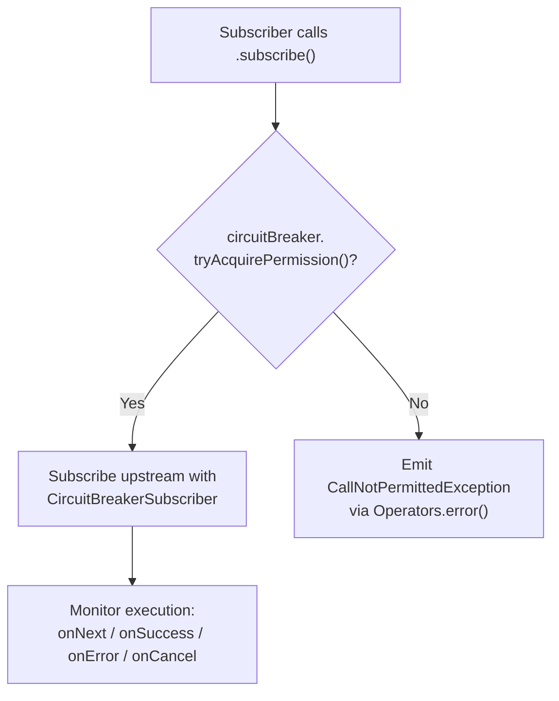
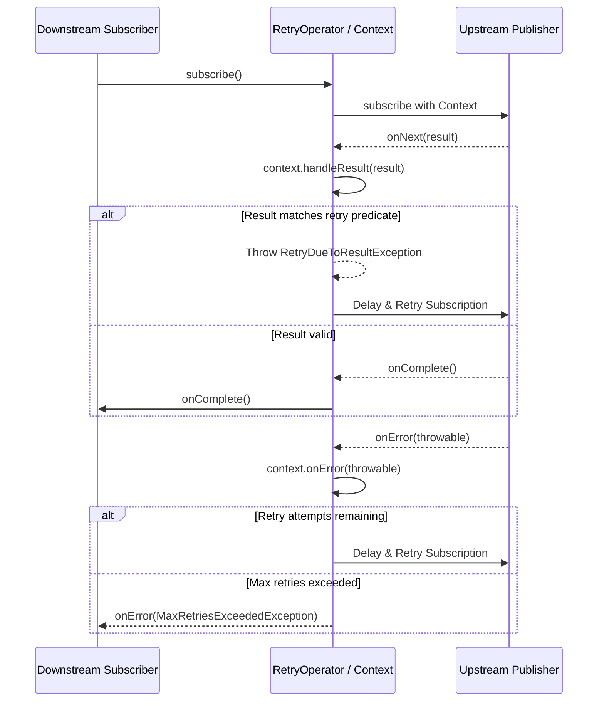

# Project Reactor Operators

<details>
<summary>Relevant source files</summary>

The following files were used as context for generating this wiki page:

- [resilience4j-all/src/main/java/io/github/resilience4j/decorators/Decorators.java](https://github.com/resilience4j/resilience4j/blob/main/resilience4j-all/src/main/java/io/github/resilience4j/decorators/Decorators.java)
- [resilience4j-reactor/src/main/java/io/github/resilience4j/reactor/ReactorOperatorFallbackDecorator.java](https://github.com/resilience4j/resilience4j/blob/main/resilience4j-reactor/src/main/java/io/github/resilience4j/reactor/ReactorOperatorFallbackDecorator.java)
- [README.adoc](https://github.com/resilience4j/resilience4j/blob/main/README.adoc)
- [resilience4j-reactor/src/main/java/io/github/resilience4j/reactor/retry/RetryOperator.java](https://github.com/resilience4j/resilience4j/blob/main/resilience4j-reactor/src/main/java/io/github/resilience4j/reactor/retry/RetryOperator.java)
- [resilience4j-reactor/src/main/java/io/github/resilience4j/reactor/circuitbreaker/operator/CircuitBreakerSubscriber.java](https://github.com/resilience4j/resilience4j/blob/main/resilience4j-reactor/src/main/java/io/github/resilience4j/reactor/circuitbreaker/operator/CircuitBreakerSubscriber.java)
- [resilience4j-spring6/src/main/java/io/github/resilience4j/spring6/fallback/ReactorFallbackDecorator.java](https://github.com/resilience4j/resilience4j/blob/main/resilience4j-spring6/src/main/java/io/github/resilience4j/spring6/fallback/ReactorFallbackDecorator.java)
- [resilience4j-rxjava3/src/main/java/io/github/resilience4j/rxjava3/circuitbreaker/operator/FlowableCircuitBreaker.java](https://github.com/resilience4j/resilience4j/blob/main/resilience4j-rxjava3/src/main/java/io/github/resilience4j/rxjava3/circuitbreaker/operator/FlowableCircuitBreaker.java)
- [resilience4j-retry/src/main/java/io/github/resilience4j/retry/Retry.java](https://github.com/resilience4j/resilience4j/blob/main/resilience4j-retry/src/main/java/io/github/resilience4j/retry/Retry.java)
- [resilience4j-micronaut/src/main/java/io/github/resilience4j/micronaut/util/ReactorPublisherExtension.java](https://github.com/resilience4j/resilience4j/blob/main/resilience4j-micronaut/src/main/java/io/github/resilience4j/micronaut/util/ReactorPublisherExtension.java)
- [resilience4j-rxjava3/src/main/java/io/github/resilience4j/rxjava3/retry/transformer/RetryTransformer.java](https://github.com/resilience4j/resilience4j/blob/main/resilience4j-rxjava3/src/main/java/io/github/resilience4j/rxjava3/retry/transformer/RetryTransformer.java)
- [resilience4j-rxjava2/src/main/java/io/github/resilience4j/retry/transformer/RetryTransformer.java](https://github.com/resilience4j/resilience4j/blob/main/resilience4j-rxjava2/src/main/java/io/github/resilience4j/retry/transformer/RetryTransformer.java)
- [resilience4j-reactor/src/main/java/io/github/resilience4j/reactor/timelimiter/TimeLimiterOperator.java](https://github.com/resilience4j/resilience4j/blob/main/resilience4j-reactor/src/main/java/io/github/resilience4j/reactor/timelimiter/TimeLimiterOperator.java)
- [resilience4j-reactor/src/main/java/io/github/resilience4j/reactor/circuitbreaker/operator/FluxCircuitBreaker.java](https://github.com/resilience4j/resilience4j/blob/main/resilience4j-reactor/src/main/java/io/github/resilience4j/reactor/circuitbreaker/operator/FluxCircuitBreaker.java)
- [resilience4j-spring6/src/main/java/io/github/resilience4j/spring6/fallback/RxJava3FallbackDecorator.java](https://github.com/resilience4j/resilience4j/blob/main/resilience4j-spring6/src/main/java/io/github/resilience4j/spring6/fallback/RxJava3FallbackDecorator.java)
- [resilience4j-reactor/src/main/java/io/github/resilience4j/reactor/circuitbreaker/operator/MonoCircuitBreaker.java](https://github.com/resilience4j/resilience4j/blob/main/resilience4j-reactor/src/main/java/io/github/resilience4j/reactor/circuitbreaker/operator/MonoCircuitBreaker.java)
- [resilience4j-vavr/src/main/java/io/github/resilience4j/decorators/VavrDecorators.java](https://github.com/resilience4j/resilience4j/blob/main/resilience4j-vavr/src/main/java/io/github/resilience4j/decorators/VavrDecorators.java)
- [resilience4j-reactor/src/main/java/io/github/resilience4j/reactor/circuitbreaker/operator/CircuitBreakerOperator.java](https://github.com/resilience4j/resilience4j/blob/main/resilience4j-reactor/src/main/java/io/github/resilience4j/reactor/circuitbreaker/operator/CircuitBreakerOperator.java)
- [resilience4j-spring6/src/main/java/io/github/resilience4j/spring6/circuitbreaker/configure/ReactorCircuitBreakerAspectExt.java](https://github.com/resilience4j/resilience4j/blob/main/resilience4j-spring6/src/main/java/io/github/resilience4j/spring6/circuitbreaker/configure/ReactorCircuitBreakerAspectExt.java)
- [resilience4j-spring6/src/main/java/io/github/resilience4j/spring6/fallback/RxJava2FallbackDecorator.java](https://github.com/resilience4j/resilience4j/blob/main/resilience4j-spring6/src/main/java/io/github/resilience4j/spring6/fallback/RxJava2FallbackDecorator.java)
- [resilience4j-micronaut/src/main/java/io/github/resilience4j/micronaut/util/RxJava3PublisherExtension.java](https://github.com/resilience4j/resilience4j/blob/main/resilience4j-micronaut/src/main/java/io/github/resilience4j/micronaut/util/RxJava3PublisherExtension.java)
- [resilience4j-reactor/src/main/java/io/github/resilience4j/reactor/ratelimiter/operator/CorePublisherRateLimiterOperator.java](https://github.com/resilience4j/resilience4j/blob/main/resilience4j-reactor/src/main/java/io/github/resilience4j/reactor/ratelimiter/operator/CorePublisherRateLimiterOperator.java)
- [resilience4j-micronaut/src/main/java/io/github/resilience4j/micronaut/util/RxJava2PublisherExtension.java](https://github.com/resilience4j/resilience4j/blob/main/resilience4j-micronaut/src/main/java/io/github/resilience4j/micronaut/util/RxJava2PublisherExtension.java)
- [resilience4j-reactor/src/main/java/io/github/resilience4j/reactor/ratelimiter/operator/RateLimiterOperator.java](https://github.com/resilience4j/resilience4j/blob/main/resilience4j-reactor/src/main/java/io/github/resilience4j/reactor/ratelimiter/operator/RateLimiterOperator.java)
- [resilience4j-spring6/src/main/java/io/github/resilience4j/spring6/retry/configure/ReactorRetryAspectExt.java](https://github.com/resilience4j/resilience4j/blob/main/resilience4j-spring6/src/main/java/io/github/resilience4j/spring6/retry/configure/ReactorRetryAspectExt.java)
- [resilience4j-reactor/src/main/java/io/github/resilience4j/reactor/bulkhead/operator/BulkheadOperator.java](https://github.com/resilience4j/resilience4j/blob/main/resilience4j-reactor/src/main/java/io/github/resilience4j/reactor/bulkhead/operator/BulkheadOperator.java)
- [resilience4j-reactor/src/main/java/io/github/resilience4j/reactor/bulkhead/operator/FluxBulkhead.java](https://github.com/resilience4j/resilience4j/blob/main/resilience4j-reactor/src/main/java/io/github/resilience4j/reactor/bulkhead/operator/FluxBulkhead.java)
- [resilience4j-reactor/src/main/java/io/github/resilience4j/reactor/micrometer/operator/TimerOperator.java](https://github.com/resilience4j/resilience4j/blob/main/resilience4j-reactor/src/main/java/io/github/resilience4j/reactor/micrometer/operator/TimerOperator.java)
- [resilience4j-reactor/src/main/java/io/github/resilience4j/reactor/bulkhead/operator/MonoBulkhead.java](https://github.com/resilience4j/resilience4j/blob/main/resilience4j-reactor/src/main/java/io/github/resilience4j/reactor/bulkhead/operator/MonoBulkhead.java)
- [resilience4j-rxjava3/src/main/java/io/github/resilience4j/rxjava3/circuitbreaker/operator/CircuitBreakerOperator.java](https://github.com/resilience4j/resilience4j/blob/main/resilience4j-rxjava3/src/main/java/io/github/resilience4j/rxjava3/circuitbreaker/operator/CircuitBreakerOperator.java)
- [resilience4j-micronaut/src/main/java/io/github/resilience4j/micronaut/util/PublisherExtension.java](https://github.com/resilience4j/resilience4j/blob/main/resilience4j-micronaut/src/main/java/io/github/resilience4j/micronaut/util/PublisherExtension.java)
</details>

## Overview

Project Reactor Operators provide integration between Resilience4j fault tolerance patterns (Circuit Breaker, Rate Limiter, Retry, Bulkhead, Time Limiter, and Micrometer Timers) and Project Reactor types (`Mono` and `Flux`). In a reactive programming model, traditional imperative decorators or higher-order functions cannot intercept asynchronous push-based stream subscriptions properly without breaking backpressure or reactive context. Resilience4j solves this by implementing custom reactive operators (`UnaryOperatorublisher<T>>`) that hook directly into the subscription lifecycle.

These operators intercept downstream subscriptions, verify permissions or allocate resources before upstream connection, and record metrics or handle errors as items flow through. By leveraging operators like `transformDeferred`, developers can wrap reactive streams cleanly without sacrificing non-blocking semantics. This module also bridges seamlessly into framework integrations such as Spring 6 AOP and Micronaut HTTP routing layers.

Sources: [resilience4j-reactor/src/main/java/io/github/resilience4j/reactor/circuitbreaker/operator/CircuitBreakerOperator.java:34-62](https://github.com/resilience4j/resilience4j/blob/main/resilience4j-reactor/src/main/java/io/github/resilience4j/reactor/circuitbreaker/operator/CircuitBreakerOperator.java#L34-L62), [README.adoc:473-485](https://github.com/resilience4j/resilience4j/blob/main/README.adoc#L473-L485)

## Public API and Operator Interfaces

The `resilience4j-reactor` module exposes operators implementing `java.util.function.UnaryOperatorublisher<T>>`. Each resilience component supplies a factory class providing `.of(...)` factory methods. When applied to a `Mono` or `Flux`, the operator inspects the publisher instance type and returns an appropriate specialized operator wrapper (`MonoOperator` or `FluxOperator`). If an unrecognised publisher implementation is passed, an `IllegalPublisherException` is thrown.

| Operator Class | Target Resilience Component | Supported Reactive Types | Thrown Exception on Rejection |
| :--- | :--- | :--- | :--- |
| `CircuitBreakerOperator` | `CircuitBreaker` | `Mono`, `Flux` | `CallNotPermittedException` |
| `RateLimiterOperator` | `RateLimiter` | `Mono`, `Flux` | `RequestNotPermitted` |
| `BulkheadOperator` | `Bulkhead` | `Mono`, `Flux` | `BulkheadFullException` |
| `TimeLimiterOperator` | `TimeLimiter` | `Mono`, `Flux` | `TimeoutException` |
| `RetryOperator` | `Retry` | `Mono`, `Flux` | `MaxRetriesExceededException` |
| `TimerOperator` | Micrometer `Timer` | `Mono`, `Flux` | None (Metrics wrapper) |

Sources: [resilience4j-reactor/src/main/java/io/github/resilience4j/reactor/circuitbreaker/operator/CircuitBreakerOperator.java:34-62](https://github.com/resilience4j/resilience4j/blob/main/resilience4j-reactor/src/main/java/io/github/resilience4j/reactor/circuitbreaker/operator/CircuitBreakerOperator.java#L34-L62), [resilience4j-reactor/src/main/java/io/github/resilience4j/reactor/ratelimiter/operator/RateLimiterOperator.java:34-77](https://github.com/resilience4j/resilience4j/blob/main/resilience4j-reactor/src/main/java/io/github/resilience4j/reactor/ratelimiter/operator/RateLimiterOperator.java#L34-L77), [resilience4j-reactor/src/main/java/io/github/resilience4j/reactor/bulkhead/operator/BulkheadOperator.java:34-63](https://github.com/resilience4j/resilience4j/blob/main/resilience4j-reactor/src/main/java/io/github/resilience4j/reactor/bulkhead/operator/BulkheadOperator.java#L34-L63), [resilience4j-reactor/src/main/java/io/github/resilience4j/reactor/timelimiter/TimeLimiterOperator.java:32-60](https://github.com/resilience4j/resilience4j/blob/main/resilience4j-reactor/src/main/java/io/github/resilience4j/reactor/timelimiter/TimeLimiterOperator.java#L32-L60), [resilience4j-reactor/src/main/java/io/github/resilience4j/reactor/retry/RetryOperator.java:32-68](https://github.com/resilience4j/resilience4j/blob/main/resilience4j-reactor/src/main/java/io/github/resilience4j/reactor/retry/RetryOperator.java#L32-L68), [resilience4j-reactor/src/main/java/io/github/resilience4j/reactor/micrometer/operator/TimerOperator.java:31-60](https://github.com/resilience4j/resilience4j/blob/main/resilience4j-reactor/src/main/java/io/github/resilience4j/reactor/micrometer/operator/TimerOperator.java#L31-L60)

## Circuit Breaker Operator Architecture

The `CircuitBreakerOperator` intercepts subscription attempts via `MonoCircuitBreaker` and `FluxCircuitBreaker`. Upon `subscribe(CoreSubscriber)` execution, the operator queries `circuitBreaker.tryAcquirePermission()`. If permission is denied because the circuit is OPEN, it immediately terminates the subscriber with a `CallNotPermittedException`. If granted, it subscribes the upstream source wrapping the downstream subscriber in a `CircuitBreakerSubscriber`.



Sources: [resilience4j-reactor/src/main/java/io/github/resilience4j/reactor/circuitbreaker/operator/FluxCircuitBreaker.java:35-42](https://github.com/resilience4j/resilience4j/blob/main/resilience4j-reactor/src/main/java/io/github/resilience4j/reactor/circuitbreaker/operator/FluxCircuitBreaker.java#L35-L42), [resilience4j-reactor/src/main/java/io/github/resilience4j/reactor/circuitbreaker/operator/MonoCircuitBreaker.java:35-42](https://github.com/resilience4j/resilience4j/blob/main/resilience4j-reactor/src/main/java/io/github/resilience4j/reactor/circuitbreaker/operator/MonoCircuitBreaker.java#L35-L42), [resilience4j-reactor/src/main/java/io/github/resilience4j/reactor/circuitbreaker/operator/CircuitBreakerSubscriber.java:32-87](https://github.com/resilience4j/resilience4j/blob/main/resilience4j-reactor/src/main/java/io/github/resilience4j/reactor/circuitbreaker/operator/CircuitBreakerSubscriber.java#L32-L87)

The `CircuitBreakerSubscriber` tracks execution duration from initialization (`this.start = circuitBreaker.getCurrentTimestamp()`) and records outcomes:
- `hookOnNext`: For single producers (like `Mono`), records success or result metrics on the first emitted item using `successSignaled.compareAndSet(false, true)`.
- `hookOnComplete`: Records success if no prior result was finalized.
- `hookOnError`: Records exception failure via `circuitBreaker.onError(...)`.
- `hookOnCancel`: Evaluates whether an event was emitted; if cancelled before emission, it releases the acquired circuit breaker permission (`circuitBreaker.releasePermission()`).

Sources: [resilience4j-reactor/src/main/java/io/github/resilience4j/reactor/circuitbreaker/operator/CircuitBreakerSubscriber.java:52-81](https://github.com/resilience4j/resilience4j/blob/main/resilience4j-reactor/src/main/java/io/github/resilience4j/reactor/circuitbreaker/operator/CircuitBreakerSubscriber.java#L52-L81)

> [!NOTE]
> `CircuitBreakerSubscriber` uses atomic boolean flags (`successSignaled` and `eventWasEmitted`) to ensure that asynchronous race conditions between emission, completion, and subscription cancellation never double-record metrics or release permissions incorrectly.

Sources: [resilience4j-reactor/src/main/java/io/github/resilience4j/reactor/circuitbreaker/operator/CircuitBreakerSubscriber.java:39-57](https://github.com/resilience4j/resilience4j/blob/main/resilience4j-reactor/src/main/java/io/github/resilience4j/reactor/circuitbreaker/operator/CircuitBreakerSubscriber.java#L39-L57)

## Rate Limiter and Bulkhead Operators

Rate limiting and bulkhead operators govern resource allocation prior to stream execution. 

The `RateLimiterOperator` relies on `CorePublisherRateLimiterOperator` which invokes `rateLimiter.reservePermission(permits)` during subscription.
1. If `waitDuration >= 0`, permission is reserved.
2. If `waitDuration > 0`, subscription is delayed using `Mono.delay(Duration.ofNanos(waitDuration))` before subscribing the source.
3. If `waitDuration < 0`, permission acquisition failed, and the subscriber receives a `RequestNotPermitted` exception.

Sources: [resilience4j-reactor/src/main/java/io/github/resilience4j/reactor/ratelimiter/operator/CorePublisherRateLimiterOperator.java:40-51](https://github.com/resilience4j/resilience4j/blob/main/resilience4j-reactor/src/main/java/io/github/resilience4j/reactor/ratelimiter/operator/CorePublisherRateLimiterOperator.java#L40-L51)

The `BulkheadOperator` delegates to `MonoBulkhead` and `FluxBulkhead`. During `subscribe`, it calls `bulkhead.tryAcquirePermission()`. If permissions are exhausted, it immediately terminates the subscriber with a `BulkheadFullException`:

```java
if (bulkhead.tryAcquirePermission()) {
    source.subscribe(new BulkheadSubscriber<>(bulkhead, actual, true));
} else {
    Operators.error(actual, BulkheadFullException.createBulkheadFullException(bulkhead));
}
```

Sources: [resilience4j-reactor/src/main/java/io/github/resilience4j/reactor/bulkhead/operator/MonoBulkhead.java:35-41](https://github.com/resilience4j/resilience4j/blob/main/resilience4j-reactor/src/main/java/io/github/resilience4j/reactor/bulkhead/operator/MonoBulkhead.java#L35-L41), [resilience4j-reactor/src/main/java/io/github/resilience4j/reactor/bulkhead/operator/FluxBulkhead.java:34-41](https://github.com/resilience4j/resilience4j/blob/main/resilience4j-reactor/src/main/java/io/github/resilience4j/reactor/bulkhead/operator/FluxBulkhead.java#L34-L41)

## Retry Operator Execution Flow

The `RetryOperator` integrates Reactor streams with Resilience4j retry mechanisms by wrapping execution inside a `Retry.AsyncContext`. It intercepts elements and errors through Reactor operators (`doOnNext`, `retryWhen`, `doOnSuccess`, `doOnComplete`).



Sources: [resilience4j-reactor/src/main/java/io/github/resilience4j/reactor/retry/RetryOperator.java:51-68](https://github.com/resilience4j/resilience4j/blob/main/resilience4j-reactor/src/main/java/io/github/resilience4j/reactor/retry/RetryOperator.java#L51-L68)

When an error or a result-triggered `RetryDueToResultException` occurs, `Context.handleErrors` evaluates the wait duration:
- If `throwable instanceof Error`, it is rethrown immediately without retry.
- If `waitDurationMillis == -1`, retries are exhausted, and `Mono.error(throwable)` propagates downstream.
- Otherwise, a `Mono.delay(Duration.ofMillis(waitDurationMillis))` schedules the next retry attempt.

Sources: [resilience4j-reactor/src/main/java/io/github/resilience4j/reactor/retry/RetryOperator.java:89-106](https://github.com/resilience4j/resilience4j/blob/main/resilience4j-reactor/src/main/java/io/github/resilience4j/reactor/retry/RetryOperator.java#L89-L106)

## Time Limiter and Fallback Integration

The `TimeLimiterOperator` applies a timeout configuration retrieved from `timeLimiter.getTimeLimiterConfig().getTimeoutDuration()`. For `Mono` and `Flux`, it chains Reactor's native `.timeout(...)` operator and hooks success/error notifications back into the `TimeLimiter` state tracker:

```java
private Publisher<T> withTimeout(Mono<T> upstream) {
    return upstream.timeout(getTimeout())
        .doOnSuccess(t -> timeLimiter.onSuccess())
        .doOnError(timeLimiter::onError);
}
```

Sources: [resilience4j-reactor/src/main/java/io/github/resilience4j/reactor/timelimiter/TimeLimiterOperator.java:62-66](https://github.com/resilience4j/resilience4j/blob/main/resilience4j-reactor/src/main/java/io/github/resilience4j/reactor/timelimiter/TimeLimiterOperator.java#L62-L66)

To handle failures gracefully after operators trigger exceptions like `CallNotPermittedException`, `MaxRetriesExceededException`, or `TimeoutException`, developers use `ReactorOperatorFallbackDecorator`. This utility maintains a mapping of throwable types to fallback publishers (`FALLBACK_PUBLISHER_CACHE`) and applies `.onErrorResume(...)` across `Mono` or `Flux` streams.

Sources: [resilience4j-reactor/src/main/java/io/github/resilience4j/reactor/ReactorOperatorFallbackDecorator.java:25-91](https://github.com/resilience4j/resilience4j/blob/main/resilience4j-reactor/src/main/java/io/github/resilience4j/reactor/ReactorOperatorFallbackDecorator.java#L25-L91)

Convenience methods simplify fallback binding for standard resilience exceptions:
- `decorateRetry(retryOperator, fallbackPublisher)`: Triggers fallback on `MaxRetriesExceededException`.
- `decorateCircuitBreaker(circuitBreakerOperator, fallbackPublisher)`: Triggers fallback on `CallNotPermittedException`.
- `decorateTimeLimiter(timeLimiterOperator, fallbackPublisher)`: Triggers fallback on `TimeoutException`.

Sources: [resilience4j-reactor/src/main/java/io/github/resilience4j/reactor/ReactorOperatorFallbackDecorator.java:111-149](https://github.com/resilience4j/resilience4j/blob/main/resilience4j-reactor/src/main/java/io/github/resilience4j/reactor/ReactorOperatorFallbackDecorator.java#L111-L149)

## Framework Extensions (Spring 6 and Micronaut)

Both Spring 6 and Micronaut integrate Reactor operators automatically via AOP aspect extensions and publisher extension utilities when reactive return types (`Mono` or `Flux`) are detected on intercepted methods.

In Spring 6, `ReactorCircuitBreakerAspectExt` and `ReactorRetryAspectExt` inspect AOP method returns and apply deferred transformation:
```java
Object returnValue = proceedingJoinPoint.proceed();
if (Flux.class.isAssignableFrom(returnValue.getClass())) {
    return ((Flux<?>) returnValue).transformDeferred(CircuitBreakerOperator.of(circuitBreaker));
} else if (Mono.class.isAssignableFrom(returnValue.getClass())) {
    return ((Mono<?>) returnValue).transformDeferred(CircuitBreakerOperator.of(circuitBreaker));
}
```

Sources: [resilience4j-spring6/src/main/java/io/github/resilience4j/spring6/circuitbreaker/configure/ReactorCircuitBreakerAspectExt.java:56-68](https://github.com/resilience4j/resilience4j/blob/main/resilience4j-spring6/src/main/java/io/github/resilience4j/spring6/circuitbreaker/configure/ReactorCircuitBreakerAspectExt.java#L56-L68), [resilience4j-spring6/src/main/java/io/github/resilience4j/spring6/retry/configure/ReactorRetryAspectExt.java:53-63](https://github.com/resilience4j/resilience4j/blob/main/resilience4j-spring6/src/main/java/io/github/resilience4j/spring6/retry/configure/ReactorRetryAspectExt.java#L53-L63)

In Micronaut, `ReactorPublisherExtension` implements `PublisherExtension`, wrapping raw publishers with corresponding Resilience4j operators:
```java
@Override
public <T> Publisher<T> circuitBreaker(Publisher<T> publisher, CircuitBreaker circuitBreaker) {
    return Flux.from(publisher)
        .transformDeferred(CircuitBreakerOperator.of(circuitBreaker));
}
```

Sources: [resilience4j-micronaut/src/main/java/io/github/resilience4j/micronaut/util/ReactorPublisherExtension.java:40-43](https://github.com/resilience4j/resilience4j/blob/main/resilience4j-micronaut/src/main/java/io/github/resilience4j/micronaut/util/ReactorPublisherExtension.java#L40-L43)

## Working Example

The following complete example demonstrates how to configure a CircuitBreaker and Retry operator on a Project Reactor `Mono`, accompanied by a fallback handler using `ReactorOperatorFallbackDecorator`.

```java
import io.github.resilience4j.circuitbreaker.CircuitBreaker;
import io.github.resilience4j.reactor.ReactorOperatorFallbackDecorator;
import io.github.resilience4j.reactor.circuitbreaker.operator.CircuitBreakerOperator;
import io.github.resilience4j.reactor.retry.RetryOperator;
import io.github.resilience4j.retry.Retry;
import reactor.core.publisher.Mono;

public class ReactiveResilienceExample {

    public Mono<String> callRemoteService(BackendService backendService) {
        CircuitBreaker circuitBreaker = CircuitBreaker.ofDefaults("backendService");
        Retry retry = Retry.ofDefaults("backendService");

        Mono<String> remoteCall = Mono.fromCallable(backendService::doSomething);

        return remoteCall
            .transformDeferred(CircuitBreakerOperator.of(circuitBreaker))
            .transformDeferred(RetryOperator.of(retry))
            .transformDeferred(
                ReactorOperatorFallbackDecorator.decorateCircuitBreaker(
                    CircuitBreakerOperator.of(circuitBreaker),
                    Mono.just("Fallback Response")
                )
            );
    }
}
```

Sources: [README.adoc:473-482](https://github.com/resilience4j/resilience4j/blob/main/README.adoc#L473-L482), [resilience4j-reactor/src/main/java/io/github/resilience4j/reactor/ReactorOperatorFallbackDecorator.java:127-133](https://github.com/resilience4j/resilience4j/blob/main/resilience4j-reactor/src/main/java/io/github/resilience4j/reactor/ReactorOperatorFallbackDecorator.java#L127-L133)

## Related

- [[RxJava 2 Operators]]
- [[RxJava 3 Operators]]

