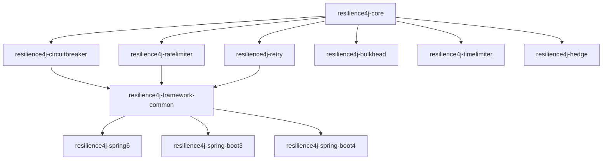
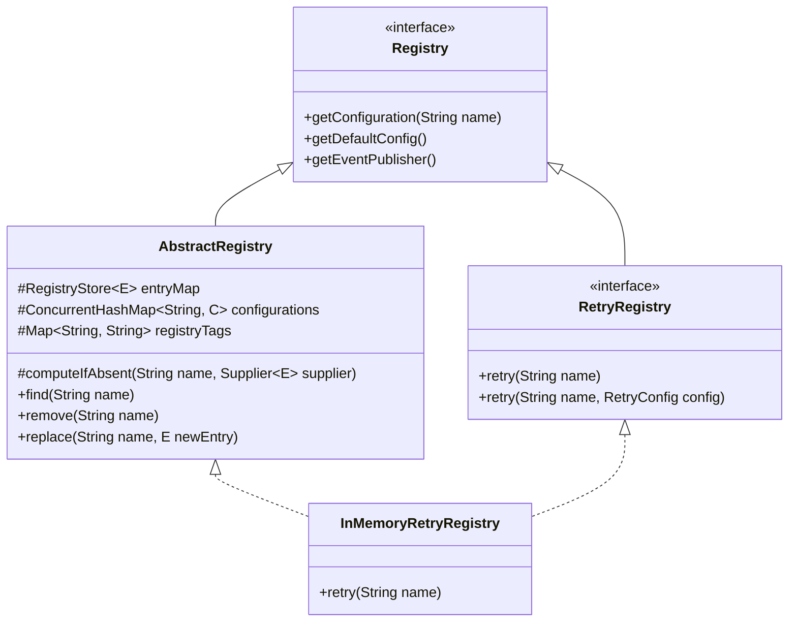
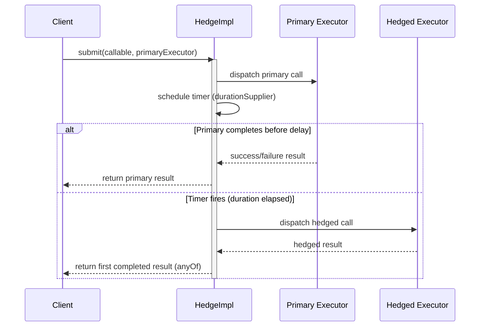

# Project Structure

<details>
<summary>Relevant source files</summary>

The following files were used as context for generating this wiki page:

- [gradle/libs.versions.toml](https://github.com/resilience4j/resilience4j/blob/main/gradle/libs.versions.toml)
- [README.adoc](https://github.com/resilience4j/resilience4j/blob/main/README.adoc)
- [resilience4j-spring6/src/main/java/io/github/resilience4j/spring6/retry/configure/RetryConfiguration.java](https://github.com/resilience4j/resilience4j/blob/main/resilience4j-spring6/src/main/java/io/github/resilience4j/spring6/retry/configure/RetryConfiguration.java)
- [resilience4j-spring6/src/main/java/io/github/resilience4j/spring6/ratelimiter/configure/RateLimiterConfiguration.java](https://github.com/resilience4j/resilience4j/blob/main/resilience4j-spring6/src/main/java/io/github/resilience4j/spring6/ratelimiter/configure/RateLimiterConfiguration.java)
- [resilience4j-hedge/src/main/java/io/github/resilience4j/hedge/internal/HedgeImpl.java](https://github.com/resilience4j/resilience4j/blob/main/resilience4j-hedge/src/main/java/io/github/resilience4j/hedge/internal/HedgeImpl.java)
- [resilience4j-framework-common/src/main/java/io/github/resilience4j/common/utils/ConfigUtils.java](https://github.com/resilience4j/resilience4j/blob/main/resilience4j-framework-common/src/main/java/io/github/resilience4j/common/utils/ConfigUtils.java)
- [resilience4j-core/src/main/java/io/github/resilience4j/core/registry/AbstractRegistry.java](https://github.com/resilience4j/resilience4j/blob/main/resilience4j-core/src/main/java/io/github/resilience4j/core/registry/AbstractRegistry.java)
- [resilience4j-retry/src/main/java/io/github/resilience4j/retry/RetryRegistry.java](https://github.com/resilience4j/resilience4j/blob/main/resilience4j-retry/src/main/java/io/github/resilience4j/retry/RetryRegistry.java)
- [resilience4j-spring6/src/main/java/io/github/resilience4j/spring6/fallback/configure/FallbackConfiguration.java](https://github.com/resilience4j/resilience4j/blob/main/resilience4j-spring6/src/main/java/io/github/resilience4j/spring6/fallback/configure/FallbackConfiguration.java)
- [resilience4j-ratelimiter/src/main/java/io/github/resilience4j/ratelimiter/RateLimiterRegistry.java](https://github.com/resilience4j/resilience4j/blob/main/resilience4j-ratelimiter/src/main/java/io/github/resilience4j/ratelimiter/RateLimiterRegistry.java)
- [resilience4j-spring-boot3/src/main/java/io/github/resilience4j/springboot3/nativeimage/configuration/package-info.java](https://github.com/resilience4j/resilience4j/blob/main/resilience4j-spring-boot3/src/main/java/io/github/resilience4j/springboot3/nativeimage/configuration/package-info.java)
- [resilience4j-spring-boot4/src/main/java/io/github/resilience4j/springboot/nativeimage/configuration/package-info.java](https://github.com/resilience4j/resilience4j/blob/main/resilience4j-spring-boot4/src/main/java/io/github/resilience4j/springboot/nativeimage/configuration/package-info.java)
- [resilience4j-bom/README.adoc](https://github.com/resilience4j/resilience4j/blob/main/resilience4j-bom/README.adoc)
- [resilience4j-hedge/src/main/java/io/github/resilience4j/hedge/internal/package-info.java](https://github.com/resilience4j/resilience4j/blob/main/resilience4j-hedge/src/main/java/io/github/resilience4j/hedge/internal/package-info.java)
- [resilience4j-hedge/src/main/java/io/github/resilience4j/hedge/package-info.java](https://github.com/resilience4j/resilience4j/blob/main/resilience4j-hedge/src/main/java/io/github/resilience4j/hedge/package-info.java)
- [resilience4j-core/src/main/java/io/github/resilience4j/core/registry/package-info.java](https://github.com/resilience4j/resilience4j/blob/main/resilience4j-core/src/main/java/io/github/resilience4j/core/registry/package-info.java)
- [resilience4j-spring6/src/main/java/io/github/resilience4j/spring6/fallback/package-info.java](https://github.com/resilience4j/resilience4j/blob/main/resilience4j-spring6/src/main/java/io/github/resilience4j/spring6/fallback/package-info.java)
- [resilience4j-spring6/src/main/java/io/github/resilience4j/spring6/utils/package-info.java](https://github.com/resilience4j/resilience4j/blob/main/resilience4j-spring6/src/main/java/io/github/resilience4j/spring6/utils/package-info.java)
- [resilience4j-spring6/src/main/java/io/github/resilience4j/spring6/retry/configure/package-info.java](https://github.com/resilience4j/resilience4j/blob/main/resilience4j-spring6/src/main/java/io/github/resilience4j/spring6/retry/configure/package-info.java)
- [resilience4j-spring6/README.adoc](https://github.com/resilience4j/resilience4j/blob/main/resilience4j-spring6/README.adoc)
- [resilience4j-core/src/main/java/io/github/resilience4j/core/package-info.java](https://github.com/resilience4j/resilience4j/blob/main/resilience4j-core/src/main/java/io/github/resilience4j/core/package-info.java)
- [resilience4j-spring-boot3/src/main/java/io/github/resilience4j/springboot3/verifier/autoconfigure/package-info.java](https://github.com/resilience4j/resilience4j/blob/main/resilience4j-spring-boot3/src/main/java/io/github/resilience4j/springboot3/verifier/autoconfigure/package-info.java)
- [resilience4j-spring6/src/main/java/io/github/resilience4j/spring6/ratelimiter/configure/package-info.java](https://github.com/resilience4j/resilience4j/blob/main/resilience4j-spring6/src/main/java/io/github/resilience4j/spring6/ratelimiter/configure/package-info.java)
- [resilience4j-micrometer/src/main/java/io/github/resilience4j/micrometer/internal/package-info.java](https://github.com/resilience4j/resilience4j/blob/main/resilience4j-micrometer/src/main/java/io/github/resilience4j/micrometer/internal/package-info.java)
- [resilience4j-spring-boot4/src/main/java/io/github/resilience4j/springboot/retry/autoconfigure/package-info.java](https://github.com/resilience4j/resilience4j/blob/main/resilience4j-spring-boot4/src/main/java/io/github/resilience4j/springboot/retry/autoconfigure/package-info.java)
- [resilience4j-spring-boot3/src/main/java/io/github/resilience4j/springboot3/retry/autoconfigure/package-info.java](https://github.com/resilience4j/resilience4j/blob/main/resilience4j-spring3/src/main/java/io/github/resilience4j/springboot3/retry/autoconfigure/package-info.java)
</details>

## Overview

Resilience4j is engineered as a modular, lightweight fault-tolerance library built specifically around functional programming paradigms and higher-order functions (decorators). Rather than imposing a monolithic runtime or forcing applications to adopt all available resilience patterns, the codebase is decomposed into independent functional core modules (`resilience4j-circuitbreaker`, `resilience4j-ratelimiter`, `resilience4j-bulkhead`, `resilience4j-retry`, `resilience4j-timelimiter`, `resilience4j-cache`, `resilience4j-hedge`), shared utilities (`resilience4j-core`, `resilience4j-framework-common`), and external framework integration adapters (`resilience4j-spring6`, `resilience4j-spring-boot3`, `resilience4j-spring-boot4`, `resilience4j-micrometer`). This design enables developers to pick precisely the required modules and avoid unnecessary transitive dependencies.

The underlying structural philosophy separates stateful policy executors from registry factories and dependency-injection configurations. Core components manage their own lifecycle events via dedicated event publishers and consumer registries, while framework extensions wire these primitives into Spring context beans using conditional class path activation. Furthermore, starting with Resilience4j 3, core execution infrastructure and schedulers support Java virtual threads (Project Loom) via configuration properties or JVM flags, aligning modern asynchronous execution with high-throughput JVM concurrency models.

Sources: [README.adoc:30-117](https://github.com/resilience4j/resilience4j/blob/main/README.adoc#L30-L117), [resilience4j-spring6/README.adoc:1-33](https://github.com/resilience4j/resilience4j/blob/main/resilience4j-spring6/README.adoc#L1-L33)

## Core Modularization and Dependency Architecture

The repository layout follows a strict multi-module Gradle project structure governed by version catalogs (`gradle/libs.versions.toml`) and Bill of Materials (`resilience4j-bom`) modules. This guarantees consistent dependency version alignment across projects using Maven or Gradle. The modular hierarchy isolates pure Java functional interfaces from framework-specific bindings.

Sources: [gradle/libs.versions.toml:1-143](https://github.com/resilience4j/resilience4j/blob/main/gradle/libs.versions.toml#L1-L143)



Sources: [gradle/libs.versions.toml:1-143](https://github.com/resilience4j/resilience4j/blob/main/gradle/libs.versions.toml#L1-L143)

The version catalog (`gradle/libs.versions.toml`) centralizes library versions for Micrometer (`1.16.0`), Reactor (`3.4.24`), Spring Framework 6 (`6.1.1`), Spring Boot 3 (`3.2.0`), and Spring Boot 4 (`4.0.0`).

Sources: [resilience4j-bom/README.adoc:1-40](https://github.com/resilience4j/resilience4j/blob/main/resilience4j-bom/README.adoc#L1-L40)

## Registry Management and AbstractRegistry Pattern

All resilience components rely on registry factories (`RetryRegistry`, `RateLimiterRegistry`, etc.) that inherit from `AbstractRegistry<E, C>`. The registry acts as a thread-safe container storing named instances (`RegistryStore<E>`) and named configuration profiles (`ConcurrentHashMap<String, C>`).

Sources: [resilience4j-core/src/main/java/io/github/resilience4j/core/registry/AbstractRegistry.java:33-106](https://github.com/resilience4j/resilience4j/blob/main/resilience4j-core/src/main/java/io/github/resilience4j/core/registry/AbstractRegistry.java#L33-L106)



Sources: [resilience4j-retry/src/main/java/io/github/resilience4j/retry/RetryRegistry.java:31-165](https://github.com/resilience4j/resilience4j/blob/main/resilience4j-retry/src/main/java/io/github/resilience4j/retry/RetryRegistry.java#L31-L165)

When an instance is requested by name via `computeIfAbsent`, the registry evaluates the supplier, creates the entry, and emits an `EntryAddedEvent` through its internal `RegistryEventProcessor`.

Sources: [resilience4j-core/src/main/java/io/github/resilience4j/core/registry/AbstractRegistry.java:100-106](https://github.com/resilience4j/resilience4j/blob/main/resilience4j-core/src/main/java/io/github/resilience4j/core/registry/AbstractRegistry.java#L100-L106)

> [!IMPORTANT]
> The configuration name `"default"` is strictly reserved across all registries (`AbstractRegistry.DEFAULT_CONFIG`). Attempting to add a custom shared configuration named `"default"` via `addConfiguration("default", config)` or builder methods triggers an `IllegalArgumentException`.

Sources: [resilience4j-core/src/main/java/io/github/resilience4j/core/registry/AbstractRegistry.java:130-137](https://github.com/resilience4j/resilience4j/blob/main/resilience4j-core/src/main/java/io/github/resilience4j/core/registry/AbstractRegistry.java#L130-L137), [resilience4j-retry/src/main/java/io/github/resilience4j/retry/RetryRegistry.java:294-301](https://github.com/resilience4j/resilience4j/blob/main/resilience4j-retry/src/main/java/io/github/resilience4j/retry/RetryRegistry.java#L294-L301)

## Spring Integration and Configuration Wiring

Modules such as `resilience4j-spring6` provide dedicated `@Configuration` classes (`RetryConfiguration`, `RateLimiterConfiguration`, `FallbackConfiguration`) that wire registries, customizers, and AOP aspects into the Spring ApplicationContext.

Sources: [resilience4j-spring6/src/main/java/io/github/resilience4j/spring6/retry/configure/RetryConfiguration.java:50-82](https://github.com/resilience4j/resilience4j/blob/main/resilience4j-spring6/src/main/java/io/github/resilience4j/spring6/retry/configure/RetryConfiguration.java#L50-L82)

For instance, `RetryConfiguration` registers a composite customizer, initializes the `RetryRegistry` from external configuration properties, and hooks up event consumer registration:

```java
@Bean
public RetryRegistry retryRegistry(RetryConfigurationProperties retryConfigurationProperties,
    EventConsumerRegistry<RetryEvent> retryEventConsumerRegistry,
    RegistryEventConsumer<Retry> retryRegistryEventConsumer,
    @Qualifier("compositeRetryCustomizer") CompositeCustomizer<RetryConfigCustomizer> compositeRetryCustomizer) {
    RetryRegistry retryRegistry = createRetryRegistry(retryConfigurationProperties,
        retryRegistryEventConsumer, compositeRetryCustomizer);
    registerEventConsumer(retryRegistry, retryEventConsumerRegistry,
        retryConfigurationProperties);
    initRetryRegistry(retryConfigurationProperties, compositeRetryCustomizer, retryRegistry);
    return retryRegistry;
}
```

Sources: [resilience4j-spring6/src/main/java/io/github/resilience4j/spring6/retry/configure/RetryConfiguration.java:71-82](https://github.com/resilience4j/resilience4j/blob/main/resilience4j-spring6/src/main/java/io/github/resilience4j/spring6/retry/configure/RetryConfiguration.java#L71-L82)

Aspects are conditionally loaded based on classpath conditions (`AspectJOnClasspathCondition`, `ReactorOnClasspathCondition`, `RxJava2OnClasspathCondition`, `RxJava3OnClasspathCondition`).

Sources: [resilience4j-spring6/src/main/java/io/github/resilience4j/spring6/retry/configure/RetryConfiguration.java:163-194](https://github.com/resilience4j/resilience4j/blob/main/resilience4j-spring6/src/main/java/io/github/resilience4j/spring6/retry/configure/RetryConfiguration.java#L163-L194)

## Concurrency and Hedging Mechanism

The `resilience4j-hedge` module implements request hedging (`HedgeImpl`), where a primary execution call is dispatched alongside concurrent secondary (hedged) attempts if the primary call does not complete within a specified duration.

Sources: [resilience4j-hedge/src/main/java/io/github/resilience4j/hedge/internal/HedgeImpl.java:38-68](https://github.com/resilience4j/resilience4j/blob/main/resilience4j-hedge/src/main/java/io/github/resilience4j/hedge/internal/HedgeImpl.java#L38-L68)



Sources: [resilience4j-hedge/src/main/java/io/github/resilience4j/hedge/internal/HedgeImpl.java:90-137](https://github.com/resilience4j/resilience4j/blob/main/resilience4j-hedge/src/main/java/io/github/resilience4j/hedge/internal/HedgeImpl.java#L90-L137)

The underlying scheduler is instantiated using `ContextAwareScheduledThreadPoolExecutor`, binding thread pool sizing to `hedgeConfig.getConcurrentHedges()` and applying context propagators.

Sources: [resilience4j-hedge/src/main/java/io/github/resilience4j/hedge/internal/HedgeImpl.java:62-67](https://github.com/resilience4j/resilience4j/blob/main/resilience4j-hedge/src/main/java/io/github/resilience4j/hedge/internal/HedgeImpl.java#L62-L67)

## Configuration Merging and Property Utilities

Framework integrations manage properties across base profiles and individual instance overrides using utility methods in `ConfigUtils`. For instance, `ConfigUtils.mergePropertiesIfAny` merges unset instance properties with base configuration defaults for circuit breakers, bulkheads, rate limiters, retries, and time limiters.

Sources: [resilience4j-framework-common/src/main/java/io/github/resilience4j/common/utils/ConfigUtils.java:29-33](https://github.com/resilience4j/resilience4j/blob/main/resilience4j-framework-common/src/main/java/io/github/resilience4j/common/utils/ConfigUtils.java#L29-L33)

```java
public static void mergePropertiesIfAny(
    CommonCircuitBreakerConfigurationProperties.InstanceProperties instanceProperties,
    CommonCircuitBreakerConfigurationProperties.InstanceProperties baseProperties) {
    if (instanceProperties.getRegisterHealthIndicator() == null &&
        baseProperties.getRegisterHealthIndicator() != null) {
        instanceProperties.setRegisterHealthIndicator(baseProperties.getRegisterHealthIndicator());
    }
    if (instanceProperties.getAllowHealthIndicatorToFail() == null &&
        baseProperties.getAllowHealthIndicatorToFail() != null) {
        instanceProperties.setAllowHealthIndicatorToFail(baseProperties.getAllowHealthIndicatorToFail());
    }
    if (instanceProperties.getEventConsumerBufferSize() == null &&
        baseProperties.getEventConsumerBufferSize() != null) {
        instanceProperties.setEventConsumerBufferSize(baseProperties.getEventConsumerBufferSize());
    }
    if (instanceProperties.getIgnoreClassBindingExceptions() == null &&
        baseProperties.getIgnoreClassBindingExceptions() != null) {
        instanceProperties.setIgnoreClassBindingExceptions(baseProperties.getIgnoreClassBindingExceptions());
    }
}
```

Sources: [resilience4j-framework-common/src/main/java/io/github/resilience4j/common/utils/ConfigUtils.java:34-60](https://github.com/resilience4j/resilience4j/blob/main/resilience4j-framework-common/src/main/java/io/github/resilience4j/common/utils/ConfigUtils.java#L34-L60)

## Design Trade-Offs

| Design Choice | Benefit | Cost |
| :--- | :--- | :--- |
| **Modular Package Split** (`resilience4j-circuitbreaker`, `resilience4j-retry`, etc.) | Allows applications to pull in only required dependencies without bloated binaries. | Increases project count and requires careful version synchronization across modules. |
| **AbstractRegistry & ConcurrentHashMap Store** | Thread-safe, lock-free instance sharing with zero blocking on standard lookups. | Higher memory overhead when maintaining numerous distinct service registries. |
| **Event Consumer Ring Buffers** | Decouples event generation from consumption, preventing metrics logging from blocking execution threads. | Events exceeding buffer capacity are dropped if consumers do not drain fast enough. |
| **Conditional Classpath Spring Configuration** | Automatically adapts to reactive (Reactor), RxJava, or AspectJ environments based on available classpath dependencies. | Can complicate classpath debugging when conditional beans fail to instantiate silently. |

Sources: [README.adoc:32-92](https://github.com/resilience4j/resilience4j/blob/main/README.adoc#L32-L92), [resilience4j-core/src/main/java/io/github/resilience4j/core/registry/AbstractRegistry.java:33-106](https://github.com/resilience4j/resilience4j/blob/main/resilience4j-core/src/main/java/io/github/resilience4j/core/registry/AbstractRegistry.java#L33-L106), [resilience4j-spring6/src/main/java/io/github/resilience4j/spring6/retry/configure/RetryConfiguration.java:135-156](https://github.com/resilience4j/resilience4j/blob/main/resilience4j-spring6/src/main/java/io/github/resilience4j/spring6/retry/configure/RetryConfiguration.java#L135-L156)

## Related

- [[Overview]]

