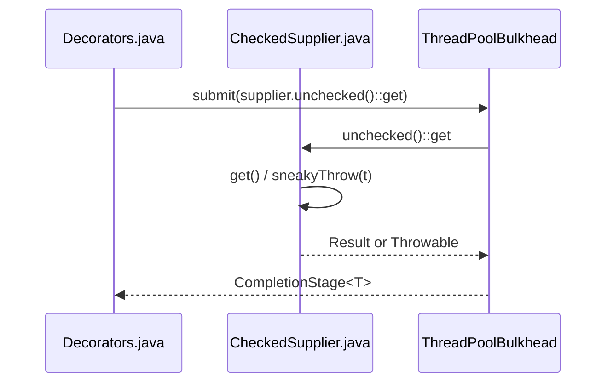

# Quick Start

<details>
<summary>Relevant source files</summary>

The following files were used as context for generating this wiki page:

- [resilience4j-all/src/main/java/io/github/resilience4j/decorators/Decorators.java](https://github.com/resilience4j/resilience4j/blob/main/resilience4j-all/src/main/java/io/github/resilience4j/decorators/Decorators.java)
- [README.adoc](https://github.com/resilience4j/resilience4j/blob/main/README.adoc)
- [resilience4j-feign/README.adoc](https://github.com/resilience4j/resilience4j/blob/main/resilience4j-feign/README.adoc)
- [resilience4j-circuitbreaker/src/main/java/io/github/resilience4j/circuitbreaker/CircuitBreaker.java](https://github.com/resilience4j/resilience4j/blob/main/resilience4j-circuitbreaker/src/main/java/io/github/resilience4j/circuitbreaker/CircuitBreaker.java)
- [resilience4j-feign/src/main/java/io/github/resilience4j/feign/FeignDecorators.java](https://github.com/resilience4j/resilience4j/blob/main/resilience4j-feign/src/main/java/io/github/resilience4j/feign/FeignDecorators.java)
- [resilience4j-vavr/src/main/java/io/github/resilience4j/decorators/VavrDecorators.java](https://github.com/resilience4j/resilience4j/blob/main/resilience4j-vavr/src/main/java/io/github/resilience4j/decorators/VavrDecorators.java)
- [resilience4j-vavr/src/main/java/io/github/resilience4j/circuitbreaker/VavrCircuitBreaker.java](https://github.com/resilience4j/resilience4j/blob/main/resilience4j-vavr/src/main/java/io/github/resilience4j/circuitbreaker/VavrCircuitBreaker.java)
- [resilience4j-retry/src/main/java/io/github/resilience4j/retry/Retry.java](https://github.com/resilience4j/resilience4j/blob/main/resilience4j-retry/src/main/java/io/github/resilience4j/retry/Retry.java)
- [resilience4j-hedge/src/main/java/io/github/resilience4j/hedge/internal/HedgeImpl.java](https://github.com/resilience4j/resilience4j/blob/main/resilience4j-hedge/src/main/java/io/github/resilience4j/hedge/internal/HedgeImpl.java)
- [resilience4j-bulkhead/src/main/java/io/github/resilience4j/bulkhead/Bulkhead.java](https://github.com/resilience4j/resilience4j/blob/main/resilience4j-bulkhead/src/main/java/io/github/resilience4j/bulkhead/Bulkhead.java)
- [resilience4j-vavr/src/main/java/io/github/resilience4j/bulkhead/VavrBulkhead.java](https://github.com/resilience4j/resilience4j/blob/main/resilience4j-vavr/src/main/java/io/github/resilience4j/bulkhead/VavrBulkhead.java)
- [resilience4j-hedge/src/main/java/io/github/resilience4j/hedge/Hedge.java](https://github.com/resilience4j/resilience4j/blob/main/resilience4j-hedge/src/main/java/io/github/resilience4j/hedge/Hedge.java)
- [resilience4j-feign/src/main/java/io/github/resilience4j/feign/Resilience4jFeign.java](https://github.com/resilience4j/resilience4j/blob/main/resilience4j-feign/src/main/java/io/github/resilience4j/feign/Resilience4jFeign.java)
- [resilience4j-feign/src/main/java/io/github/resilience4j/feign/FallbackDecorator.java](https://github.com/resilience4j/resilience4j/blob/main/resilience4j-feign/src/main/java/io/github/resilience4j/feign/FallbackDecorator.java)
- [resilience4j-core/src/main/java/io/github/resilience4j/core/functions/CheckedRunnable.java](https://github.com/resilience4j/resilience4j/blob/main/resilience4j-core/src/main/java/io/github/resilience4j/core/functions/CheckedRunnable.java)
- [resilience4j-core/src/main/java/io/github/resilience4j/core/functions/CheckedSupplier.java](https://github.com/resilience4j/resilience4j/blob/main/resilience4j-core/src/main/java/io/github/resilience4j/core/functions/CheckedSupplier.java)
- [resilience4j-ratelimiter/src/main/java/io/github/resilience4j/ratelimiter/RateLimiter.java](https://github.com/resilience4j/resilience4j/blob/main/resilience4j-ratelimiter/src/main/java/io/github/resilience4j/ratelimiter/RateLimiter.java)
</details>

## Overview

Resilience4j provides a lightweight fault tolerance library built around functional programming principles, enabling developers to enhance lambda expressions, method references, and functional interfaces with robust execution strategies. By offering higher-order functions and fluent decorator APIs, the library allows systems to selectively compose failure-handling primitives without enforcing rigid or all-in framework dependencies.

Sources: [README.adoc#[30-36](https://github.com/resilience4j/resilience4j/blob/main/README.adoc#L30-L36)

Designed to protect distributed applications from cascading failures, resource exhaustion, and transient remote invocation errors, Resilience4j decouples service execution from failure mitigation. Its design emphasizes functional composability, thread safety, and modularity, allowing engineers to stack multiple independent policies—such as circuit breaking, automatic retrying, concurrency isolation, and rate limiting—into tailored execution chains.

Sources: [resilience4j-all/src/main/java/io/github/resilience4j/decorators/Decorators.java#[22-42](https://github.com/resilience4j/resilience4j/blob/main/resilience4j-all/src/main/java/io/github/resilience4j/decorators/Decorators.java#L22-L42), [README.adoc#[30-36](https://github.com/resilience4j/resilience4j/blob/main/README.adoc#L30-L36)

## Decorator Composition with Decorators API

### Overview

The `Decorators` utility class provides a fluent builder syntax that enables developers to apply multiple fault-tolerance decorators in a specific, ordered chain to various functional interfaces, including standard and checked suppliers, functions, runnables, callables, consumers, and completion stages. When composing decorators via `Decorators.ofSupplier(...)`, methods are applied in the exact sequence they are chained, wrapping the underlying execution target progressively. For example, building a supplier chain with a circuit breaker, a retry policy, and a fallback handler constructs an execution order where the supplier executes first, its outcome is evaluated by the circuit breaker, retried if necessary, and finally passed to the fallback handler upon failure. Each decorator independently determines whether a given exception constitutes a failure.

Sources: [resilience4j-all/src/main/java/io/github/resilience4j/decorators/Decorators.java#[22-42](https://github.com/resilience4j/resilience4j/blob/main/resilience4j-all/src/main/java/io/github/resilience4j/decorators/Decorators.java#L22-L42)

### Functional Wrapper Composition and Checked Functions

Resilience4j supports both standard Java functional interfaces and checked functional interfaces through wrapper classes such as `DecorateCheckedSupplier`, `DecorateCheckedFunction`, `DecorateCheckedRunnable`, and `DecorateCheckedConsumer`. These checked variants allow functional expressions to throw checked exceptions while providing methods like `unchecked()` to bridge checked operations into standard Java functional types using sneaky throwing mechanisms.

> [!NOTE]
> Checked suppliers and runnables use sneaky throwing in their `unchecked()` default methods to bypass Java's checked exception compile-time checks when bridging into standard `Supplier` or `Runnable` interfaces, allowing transparent integration with thread pools and asynchronous completion stages.

Sources: [resilience4j-core/src/main/java/io/github/resilience4j/core/functions/CheckedRunnable.java#[29-43](https://github.com/resilience4j/resilience4j/blob/main/resilience4j-core/src/main/java/io/github/resilience4j/core/functions/CheckedRunnable.java#L29-L43), [resilience4j-core/src/main/java/io/github/resilience4j/core/functions/CheckedSupplier.java#[36-50](https://github.com/resilience4j/resilience4j/blob/main/resilience4j-core/src/main/java/io/github/resilience4j/core/functions/CheckedSupplier.java#L36-L50)

### Call-Chain Execution Walkthroughs

When a thread pool bulkhead is incorporated into a checked supplier or checked runnable decorator chain, execution flows through a precise sequence of adapter and bridge methods. 

For a `DecorateCheckedSupplier` utilizing `withThreadPoolBulkhead`, the execution walkthrough proceeds as follows:
1. `withThreadPoolBulkhead` in `Decorators.java` receives a `ThreadPoolBulkhead` instance and returns a `DecorateCompletionStage` wrapping a stage supplier.

Sources: [resilience4j-all/src/main/java/io/github/resilience4j/decorators/Decorators.java#[442-450](https://github.com/resilience4j/resilience4j/blob/main/resilience4j-all/src/main/java/io/github/resilience4j/decorators/Decorators.java#L442-L450)

2. The stage supplier invokes `threadPoolBulkhead.submit(...)`, passing a lambda expression created by calling `supplier.unchecked()::get`.

Sources: [resilience4j-all/src/main/java/io/github/resilience4j/decorators/Decorators.java#[445-445](https://github.com/resilience4j/resilience4j/blob/main/resilience4j-all/src/main/java/io/github/resilience4j/decorators/Decorators.java#L445-L445)

3. The `unchecked()` method on `CheckedSupplier` returns a standard `Supplier` whose `get()` method invokes the underlying checked `get()`, catching any thrown `Throwable`.

Sources: [resilience4j-core/src/main/java/io/github/resilience4j/core/functions/CheckedSupplier.java#[36-40](https://github.com/resilience4j/resilience4j/blob/main/resilience4j-core/src/main/java/io/github/resilience4j/core/functions/CheckedSupplier.java#L36-L40), [resilience4j-core/src/main/java/io/github/resilience4j/core/functions/CheckedSupplier.java#[29-29](https://github.com/resilience4j/resilience4j/blob/main/resilience4j-core/src/main/java/io/github/resilience4j/core/functions/CheckedSupplier.java#L29-L29)

4. If an exception occurs, `sneakyThrow(t)` is invoked to rethrow the throwable without requiring explicit method declaration. If the bulkhead queue is full, `BulkheadFullException` is caught and returned as a failed completion stage.

Sources: [resilience4j-all/src/main/java/io/github/resilience4j/decorators/Decorators.java#[446-448](https://github.com/resilience4j/resilience4j/blob/main/resilience4j-all/src/main/java/io/github/resilience4j/decorators/Decorators.java#L446-L448), [resilience4j-core/src/main/java/io/github/resilience4j/core/functions/CheckedSupplier.java#[40-42](https://github.com/resilience4j/resilience4j/blob/main/resilience4j-core/src/main/java/io/github/resilience4j/core/functions/CheckedSupplier.java#L40-L42)

Similarly, for a `DecorateCheckedRunnable` utilizing `withThreadPoolBulkhead`, the execution walkthrough follows this order:
1. `withThreadPoolBulkhead` in `Decorators.java` constructs a completion stage supplier.

Sources: [resilience4j-all/src/main/java/io/github/resilience4j/decorators/Decorators.java#[602-611](https://github.com/resilience4j/resilience4j/blob/main/resilience4j-all/src/main/java/io/github/resilience4j/decorators/Decorators.java#L602-L611)

2. The supplier calls `threadPoolBulkhead.submit(...)` passing `runnable.unchecked()`.

Sources: [resilience4j-all/src/main/java/io/github/resilience4j/decorators/Decorators.java#[605-605](https://github.com/resilience4j/resilience4j/blob/main/resilience4j-all/src/main/java/io/github/resilience4j/decorators/Decorators.java#L605-L605)

3. The `unchecked()` method on `CheckedRunnable` executes `run()`, catching any `Throwable`.

Sources: [resilience4j-core/src/main/java/io/github/resilience4j/core/functions/CheckedRunnable.java#[29-35](https://github.com/resilience4j/resilience4j/blob/main/resilience4j-core/src/main/java/io/github/resilience4j/core/functions/CheckedRunnable.java#L29-L35)

4. Caught throwables are passed to `sneakyThrow(x)` to propagate unchecked, while `BulkheadFullException` results in a failed completion stage.

Sources: [resilience4j-all/src/main/java/io/github/resilience4j/decorators/Decorators.java#[606-610](https://github.com/resilience4j/resilience4j/blob/main/resilience4j-all/src/main/java/io/github/resilience4j/decorators/Decorators.java#L606-L610), [resilience4j-core/src/main/java/io/github/resilience4j/core/functions/CheckedRunnable.java#[33-35](https://github.com/resilience4j/resilience4j/blob/main/resilience4j-core/src/main/java/io/github/resilience4j/core/functions/CheckedRunnable.java#L33-L35)



Sources: [resilience4j-all/src/main/java/io/github/resilience4j/decorators/Decorators.java#[442-450](https://github.com/resilience4j/resilience4j/blob/main/resilience4j-all/src/main/java/io/github/resilience4j/decorators/Decorators.java#L442-L450), [resilience4j-core/src/main/java/io/github/resilience4j/core/functions/CheckedSupplier.java#[29-50](https://github.com/resilience4j/resilience4j/blob/main/resilience4j-core/src/main/java/io/github/resilience4j/core/functions/CheckedSupplier.java#L29-L50)

### Decorator Builder API Reference

The `Decorators` class exposes static factory methods corresponding to different functional signatures. The following table summarizes the available builder types and their factory entry points.

| Factory Method | Return Builder Type | Target Functional Interface |
| --- | --- | --- |
| `ofSupplier(Supplier<T>)` | `DecorateSupplier<T>` | `java.util.function.Supplier<T>` |
| `ofFunction(Function<T, R>)` | `DecorateFunction<T, R>` | `java.util.function.Function<T, R>` |
| `ofRunnable(Runnable)` | `DecorateRunnable` | `java.lang.Runnable` |
| `ofCallable(Callable<T>)` | `DecorateCallable<T>` | `java.util.concurrent.Callable<T>` |
| `ofCheckedSupplier(CheckedSupplier<T>)` | `DecorateCheckedSupplier<T>` | `io.github.resilience4j.core.functions.CheckedSupplier<T>` |
| `ofCheckedFunction(CheckedFunction<T, R>)` | `DecorateCheckedFunction<T, R>` | `io.github.resilience4j.core.functions.CheckedFunction<T, R>` |
| `ofCheckedRunnable(CheckedRunnable)` | `DecorateCheckedRunnable` | `io.github.resilience4j.core.functions.CheckedRunnable` |
| `ofCheckedConsumer(CheckedConsumer<T>)` | `DecorateCheckedConsumer<T>` | `io.github.resilience4j.core.functions.CheckedConsumer<T>` |
| `ofCompletionStage(Supplier<CompletionStage<T>>)` | `DecorateCompletionStage<T>` | `java.util.function.Supplier<CompletionStage<T>>` |
| `ofConsumer(Consumer<T>)` | `DecorateConsumer<T>` | `java.util.function.Consumer<T>` |

Sources: [resilience4j-all/src/main/java/io/github/resilience4j/decorators/Decorators.java#[43-84](https://github.com/resilience4j/resilience4j/blob/main/resilience4j-all/src/main/java/io/github/resilience4j/decorators/Decorators.java#L43-L84)

### Design Trade-Offs

| Design Choice | Benefit | Cost |
| --- | --- | --- |
| Fluent builder wrapper mutation (`supplier = ...`) | Enables clean, readable method chaining without requiring intermediate immutable builder allocations for each decorator step. | Modifies internal mutable references during builder construction, requiring careful handling if builders are shared across threads. |
| Functional interface bridging via `unchecked()` | Permits checked functional interfaces to integrate seamlessly into standard Java functional APIs and asynchronous executors. | Relies on sneaky throwing semantics, which bypasses compile-time checked exception tracking for callers of unmanaged bridges. |
| Specialized decorator classes per signature | Provides type-safe method signatures tailored precisely to suppliers, functions, runnables, and completion stages. | Results in duplicated builder method definitions across multiple inner classes (`DecorateSupplier`, `DecorateFunction`, `DecorateCallable`, etc.). |

Sources: [resilience4j-all/src/main/java/io/github/resilience4j/decorators/Decorators.java#[86-798](https://github.com/resilience4j/resilience4j/blob/main/resilience4j-all/src/main/java/io/github/resilience4j/decorators/Decorators.java#L86-L798), [resilience4j-core/src/main/java/io/github/resilience4j/core/functions/CheckedSupplier.java#[36-50](https://github.com/resilience4j/resilience4j/blob/main/resilience4j-core/src/main/java/io/github/resilience4j/core/functions/CheckedSupplier.java#L36-L50)

## CircuitBreaker Protection and State Control

### Overview

The `CircuitBreaker` interface manages the state of a backend system through a finite state machine composed of five operating states: `CLOSED`, `OPEN`, `HALF_OPEN`, `DISABLED`, and `FORCED_OPEN`. It does not independently inspect the backend system but relies entirely on explicit runtime metrics provided by decorator wrappers via `onSuccess`, `onError`, and `onResult` events. Before initiating any communication with a protected backend, callers must obtain execution permission via `tryAcquirePermission()` or `acquirePermission()`.

Sources: [resilience4j-circuitbreaker/src/main/java/io/github/resilience4j/circuitbreaker/CircuitBreaker.java#[37-55](https://github.com/resilience4j/resilience4j/blob/main/resilience4j-circuitbreaker/src/main/java/io/github/resilience4j/circuitbreaker/CircuitBreaker.java#L37-L55)

### Circuit Breaker States and Transitions

The state machine transitions between operating modes based on failure rates and sliding window evaluations. The core enumeration `State` assigns a fixed precedence order and publishing permission flag to each mode, ensuring deterministic behavior even if enum ordering shifts.

| State Name | Order Value | Allow Publish | Description |
| --- | --- | --- | --- |
| `CLOSED` | `0` | `true` | Operating normally, tracking metrics and allowing requests through. |
| `OPEN` | `1` | `true` | Tripped due to excessive failure rate, rejecting requests immediately. |
| `HALF_OPEN` | `2` | `true` | Wait interval elapsed; permits a test batch of calls to check backend recovery. |
| `DISABLED` | `3` | `false` | Inactive; bypasses state transitions and event publishing while allowing all calls. |
| `FORCED_OPEN` | `4` | `false` | Inactive; bypasses state transitions and event publishing while rejecting all calls. |
| `METRICS_ONLY` | `5` | `true` | Captures metrics and publishes events while allowing all calls to pass without tripping. |

Sources: [resilience4j-circuitbreaker/src/main/java/io/github/resilience4j/circuitbreaker/CircuitBreaker.java#[810-861](https://github.com/resilience4j/resilience4j/blob/main/resilience4j-circuitbreaker/src/main/java/io/github/resilience4j/circuitbreaker/CircuitBreaker.java#L810-L861)

> [!NOTE]
> The `State.order` field is a fixed integer rather than relying on `Enum.ordinal()`. If new states are introduced into the enumeration in future releases, existing state precedence and integer ordering remain invariant.

Sources: [resilience4j-circuitbreaker/src/main/java/io/github/resilience4j/circuitbreaker/CircuitBreaker.java#[839-860](https://github.com/resilience4j/resilience4j/blob/main/resilience4j-circuitbreaker/src/main/java/io/github/resilience4j/circuitbreaker/CircuitBreaker.java#L839-L860)

### Call-Chain Execution Walkthrough

When protecting a synchronous supplier execution via `CircuitBreaker.decorateSupplier()`, the decorated wrapper executes a precise sequence of permission checks, timing measurements, and metric recordings. 

1. `circuitBreaker.acquirePermission()` — Validates current state. If `OPEN` or `FORCED_OPEN`, throws a `CallNotPermittedException`. If `HALF_OPEN` and test call limits are exhausted, throws `CallNotPermittedException`. Otherwise, grants access and adjusts internal counters.
2. `circuitBreaker.getCurrentTimestamp()` — Captures the start time using the configured timestamp supplier (defaulting to `System.nanoTime()`).
3. `supplier.get()` — Executes the underlying target operation inside a `try-catch` block.
4. **Branching outcome**:
   - On success: `circuitBreaker.getCurrentTimestamp()` measures elapsed duration, and `circuitBreaker.onResult(duration, durationUnit, result)` or `circuitBreaker.onSuccess(duration, durationUnit)` records a successful invocation to update the failure rate window.
   - On exception: `circuitBreaker.onError(duration, durationUnit, exception)` records the failure against the sliding window before rethrowing the exception.

Sources: [resilience4j-circuitbreaker/src/main/java/io/github/resilience4j/circuitbreaker/CircuitBreaker.java#[66-82](https://github.com/resilience4j/resilience4j/blob/main/resilience4j-circuitbreaker/src/main/java/io/github/resilience4j/circuitbreaker/CircuitBreaker.java#L66-L82), [resilience4j-circuitbreaker/src/main/java/io/github/resilience4j/circuitbreaker/CircuitBreaker.java#[189-205](https://github.com/resilience4j/resilience4j/blob/main/resilience4j-circuitbreaker/src/main/java/io/github/resilience4j/circuitbreaker/CircuitBreaker.java#L189-L205)

### Design Trade-Offs

| Design Choice | Benefit | Cost |
| --- | --- | --- |
| Explicit permission acquisition (`acquirePermission()` / `tryAcquirePermission()`) | Decouples call permission checks from execution wrappers, permitting custom handling in asynchronous and reactive pipelines. | Requires callers to manually invoke `releasePermission()` if a reserved permit is cancelled before invocation. |
| Fixed integer ordering (`order`) in `State` enum | Prevents runtime bugs if enum constants are reordered or if new intermediate states are added in future versions. | Requires manual maintenance of integer constants when introducing new states to the finite state machine. |
| Separate decorator method sets across modules (`CircuitBreaker` and `Vavr` extensions) | Provides native integration for functional libraries like Vavr (`Try`, `Either`) without forcing heavy library dependencies into core modules. | Duplicates functional wrapping logic across multiple interfaces and utility classes. |

Sources: [resilience4j-circuitbreaker/src/main/java/io/github/resilience4j/circuitbreaker/CircuitBreaker.java#[434-457](https://github.com/resilience4j/resilience4j/blob/main/resilience4j-circuitbreaker/src/main/java/io/github/resilience4j/circuitbreaker/CircuitBreaker.java#L434-L457), [resilience4j-circuitbreaker/src/main/java/io/github/resilience4j/circuitbreaker/CircuitBreaker.java#[839-860](https://github.com/resilience4j/resilience4j/blob/main/resilience4j-circuitbreaker/src/main/java/io/github/resilience4j/circuitbreaker/CircuitBreaker.java#L839-L860), [resilience4j-vavr/src/main/java/io/github/resilience4j/circuitbreaker/VavrCircuitBreaker.java#[30-140](https://github.com/resilience4j/resilience4j/blob/main/resilience4j-vavr/src/main/java/io/github/resilience4j/circuitbreaker/VavrCircuitBreaker.java#L30-L140)

> [!WARNING]
> When decorating asynchronous structures like `CompletionStage` or `Future`, make sure that permissions acquired via `tryAcquirePermission()` are correctly released on cancellation or exception paths using `OnceConsumer` to prevent state leakages in HALF_OPEN test call counters.

Sources: [resilience4j-circuitbreaker/src/main/java/io/github/resilience4j/circuitbreaker/CircuitBreaker.java#[92-129](https://github.com/resilience4j/resilience4j/blob/main/resilience4j-circuitbreaker/src/main/java/io/github/resilience4j/circuitbreaker/CircuitBreaker.java#L92-L129), [resilience4j-circuitbreaker/src/main/java/io/github/resilience4j/circuitbreaker/CircuitBreaker.java#[1047-1117](https://github.com/resilience4j/resilience4j/blob/main/resilience4j-circuitbreaker/src/main/java/io/github/resilience4j/circuitbreaker/CircuitBreaker.java#L1047-L1117)

## Retry Policy and Execution Wrapping

Resilience4j provides robust retry capabilities via the `Retry` interface and its companion classes. You can wrap standard and checked functional interfaces—such as `Supplier`, `CheckedSupplier`, `Callable`, `Runnable`, `Function`, and `Consumer`—to automatically re-attempt execution upon encountering failures or matching result criteria.

Sources: [resilience4j-retry/src/main/java/io/github/resilience4j/retry/Retry.java#[39-457](https://github.com/resilience4j/resilience4j/blob/main/resilience4j-retry/src/main/java/io/github/resilience4j/retry/Retry.java#L39-L457)

### Execution Walkthrough

When an operation wrapped via `decorateSupplier()` or `executeSupplier()` runs, the execution follows a deterministic loop managed through the `Retry.Context` interface:

1. `retry.context()` — Obtains a new retry context instance for tracking the call attempt state.
2. `supplier.get()` — Executes the target supplier inside a `try-catch` block.
3. **Branching outcome**:
   - On success: `context.onResult(result)` validates the returned value. If validation returns `false` (indicating no further retry is needed), `context.onComplete()` is called and the result is returned. If validation dictates a retry, the loop continues after applying the configured backoff delay.
   - On runtime exception: `context.onRuntimeError(runtimeException)` handles the exception, updates metrics and events, and either schedules a delayed retry or rethrows the exception when retry limits are exceeded.

Sources: [resilience4j-retry/src/main/java/io/github/resilience4j/retry/Retry.java#[296-312](https://github.com/resilience4j/resilience4j/blob/main/resilience4j-retry/src/main/java/io/github/resilience4j/retry/Retry.java#L296-L312)

### Supported Decorator Methods

The `Retry` interface exposes a comprehensive suite of static and default decoration methods for both checked and unchecked operations.

| Method Signature | Input Type | Exception Handling | Purpose |
| --- | --- | --- | --- |
| `decorateCheckedSupplier(Retry, CheckedSupplier)` | `CheckedSupplier<T>` | `Throwable` | Decorates a checked supplier with retry logic |
| `decorateSupplier(Retry, Supplier)` | `Supplier<T>` | `RuntimeException` | Decorates an unchecked supplier with retry logic |
| `decorateCheckedFunction(Retry, CheckedFunction)` | `CheckedFunction<T, R>` | `Throwable` | Decorates a checked function taking argument `T` |
| `decorateFunction(Retry, Function)` | `Function<T, R>` | `RuntimeException` | Decorates an unchecked function taking argument `T` |
| `decorateCheckedRunnable(Retry, CheckedRunnable)` | `CheckedRunnable` | `Throwable` | Decorates a checked runnable taking no arguments |
| `decorateRunnable(Retry, Runnable)` | `Runnable` | `RuntimeException` | Decorates an unchecked runnable taking no arguments |
| `decorateCallable(Retry, Callable)` | `Callable<T>` | `Exception` | Decorates a callable returning result `T` |
| `decorateCompletionStage(Retry, ScheduledExecutorService, Supplier<CompletionStage<T>>)` | `Supplier<CompletionStage<T>>` | Asynchronous (`Throwable`) | Decorates asynchronous completion stages with scheduled retries |

Sources: [resilience4j-retry/src/main/java/io/github/resilience4j/retry/Retry.java#[107-449](https://github.com/resilience4j/resilience4j/blob/main/resilience4j-retry/src/main/java/io/github/resilience4j/retry/Retry.java#L107-L449)

> [!WARNING]
> When executing asynchronous retries using `decorateCompletionStage()`, make sure to pass a valid `ScheduledExecutorService` scheduler. If a negative delay is returned by the async context, `AsyncRetryBlock` completes the promise exceptionally rather than scheduling another attempt.

Sources: [resilience4j-retry/src/main/java/io/github/resilience4j/retry/Retry.java#[107-121](https://github.com/resilience4j/resilience4j/blob/main/resilience4j-retry/src/main/java/io/github/resilience4j/retry/Retry.java#L107-L121), [resilience4j-retry/src/main/java/io/github/resilience4j/retry/Retry.java#[712-755](https://github.com/resilience4j/resilience4j/blob/main/resilience4j-retry/src/main/java/io/github/resilience4j/retry/Retry.java#L712-L755)

### Worked Example: Executing with Retry

The following example demonstrates how to instantiate a `Retry` object using default configurations and wrap a `CheckedSupplier` to execute remote calls with automatic retry recovery:

```java
Retry retry = Retry.ofDefaults("backendService");

CheckedSupplier<String> restrictedSupplier = Retry.decorateCheckedSupplier(
    retry,
    () -> {
        // Simulated remote call that may fail
        return "Success Result";
    }
);

try {
    String result = restrictedSupplier.get();
} catch (Throwable throwable) {
    // Handle final failure after max retries exceeded
}
```

Sources: [resilience4j-retry/src/main/java/io/github/resilience4j/retry/Retry.java#[94-96](https://github.com/resilience4j/resilience4j/blob/main/resilience4j-retry/src/main/java/io/github/resilience4j/retry/Retry.java#L94-L96), [resilience4j-retry/src/main/java/io/github/resilience4j/retry/Retry.java#[146-163](https://github.com/resilience4j/resilience4j/blob/main/resilience4j-retry/src/main/java/io/github/resilience4j/retry/Retry.java#L146-L163)

## Bulkhead Concurrency and Resource Isolation

### Overview

Bulkhead concurrency and resource isolation limit the number of parallel operations to shed load and control resource usage across flows without mandating a specific concurrency or I/O model. The `Bulkhead` interface provides thread-safe decoration methods for suppliers, runtimes, callables, and asynchronous completion stages.

Sources: [resilience4j-bulkhead/src/main/java/io/github/resilience4j/bulkhead/Bulkhead.java#[39-55](https://github.com/resilience4j/resilience4j/blob/main/resilience4j-bulkhead/src/main/java/io/github/resilience4j/bulkhead/Bulkhead.java#L39-L55)

### Call-Chain Execution Walkthrough

When an operation protected by a bulkhead is executed via `decorateSupplier()` or `executeSupplier()`, the call follows a strict permission lifecycle:

1. `bulkhead.acquirePermission()` — Blocks or attempts to obtain an available execution permit from the underlying semaphore.
2. `supplier.get()` — Executes the target workload inside a `try` block after permission is successfully secured.
3. `bulkhead.onComplete()` — Enforces state integrity by releasing the held permit in a `finally` block regardless of whether the supplier succeeded or threw an exception.

Sources: [resilience4j-bulkhead/src/main/java/io/github/resilience4j/bulkhead/Bulkhead.java#[67-74](https://github.com/resilience4j/resilience4j/blob/main/resilience4j-bulkhead/src/main/java/io/github/resilience4j/bulkhead/Bulkhead.java#L67-L74), [resilience4j-bulkhead/src/main/java/io/github/resilience4j/bulkhead/Bulkhead.java#[188-197](https://github.com/resilience4j/resilience4j/blob/main/resilience4j-bulkhead/src/main/java/io/github/resilience4j/bulkhead/Bulkhead.java#L188-L197)

> [!WARNING]
> When decorating `Future` instances using `decorateFuture()`, the bulkhead retains the acquired permission until `Future#get()` or `Future#get(long, TimeUnit)` is fully evaluated. Delays in evaluating the future will hold the underlying semaphore permit longer than the actual task execution time.

Sources: [resilience4j-bulkhead/src/main/java/io/github/resilience4j/bulkhead/Bulkhead.java#[117-121](https://github.com/resilience4j/resilience4j/blob/main/resilience4j-bulkhead/src/main/java/io/github/resilience4j/bulkhead/Bulkhead.java#L117-L121)

### Supported Bulkhead Decorator Methods

The `Bulkhead` and `VavrBulkhead` interfaces provide static wrapper methods across Java and Vavr functional types:

| Method Signature | Input Type | Exception Handling | Purpose |
| --- | --- | --- | --- |
| `Bulkhead.decorateSupplier(Bulkhead, Supplier)` | `Supplier<T>` | `RuntimeException` | Decorates a standard supplier with bulkhead permits |
| `Bulkhead.decorateCompletionStage(Bulkhead, Supplier<CompletionStage<T>>)` | `Supplier<CompletionStage<T>>` | Asynchronous (`Throwable`) | Decorates asynchronous completion stages |
| `Bulkhead.decorateFuture(Bulkhead, Supplier<Future<T>>)` | `Supplier<Future<T>>` | `Throwable` / `ExecutionException` | Decorates future suppliers holding permits until evaluated |
| `Bulkhead.decorateCallable(Bulkhead, Callable)` | `Callable<T>` | `Exception` | Decorates a callable returning result `T` |
| `VavrBulkhead.decorateTrySupplier(Bulkhead, Supplier<Try<T>>)` | `Supplier<Try<T>>` | Vavr `Try` | Decorates Vavr Try suppliers returning failure when full |
| `VavrBulkhead.decorateEitherSupplier(Bulkhead, Supplier<Either>)` | `Supplier<Either<? extends Exception, T>>` | Vavr `Either` | Decorates Vavr Either suppliers with bulkhead limits |

Sources: [resilience4j-bulkhead/src/main/java/io/github/resilience4j/bulkhead/Bulkhead.java#[85-141](https://github.com/resilience4j/resilience4j/blob/main/resilience4j-bulkhead/src/main/java/io/github/resilience4j/bulkhead/Bulkhead.java#L85-L141), [resilience4j-bulkhead/src/main/java/io/github/resilience4j/bulkhead/Bulkhead.java#[169-197](https://github.com/resilience4j/resilience4j/blob/main/resilience4j-bulkhead/src/main/java/io/github/resilience4j/bulkhead/Bulkhead.java#L169-L197), [resilience4j-vavr/src/main/java/io/github/resilience4j/bulkhead/VavrBulkhead.java#[77-113](https://github.com/resilience4j/resilience4j/blob/main/resilience4j-vavr/src/main/java/io/github/resilience4j/bulkhead/VavrBulkhead.java#L77-L113)

### Worked Example: Executing with Bulkhead Protection

The following example demonstrates how to create a default semaphore bulkhead and execute a supplier within its concurrency constraints:

```java
Bulkhead bulkhead = Bulkhead.ofDefaults("databaseBulkhead");

Supplier<String> restrictedSupplier = Bulkhead.decorateSupplier(
    bulkhead,
    () -> {
        // Protected remote or resource-intensive call
        return "Query Result";
    }
);

String result = restrictedSupplier.get();
```

Sources: [resilience4j-bulkhead/src/main/java/io/github/resilience4j/bulkhead/Bulkhead.java#[188-197](https://github.com/resilience4j/resilience4j/blob/main/resilience4j-bulkhead/src/main/java/io/github/resilience4j/bulkhead/Bulkhead.java#L188-L197), [resilience4j-bulkhead/src/main/java/io/github/resilience4j/bulkhead/Bulkhead.java#[303-305](https://github.com/resilience4j/resilience4j/blob/main/resilience4j-bulkhead/src/main/java/io/github/resilience4j/bulkhead/Bulkhead.java#L303-L305)

## Feign Client Decoration and Fallbacks

### Overview

The `resilience4j-feign` integration module allows developers to incorporate fault-tolerance patterns—such as the CircuitBreaker, RateLimiter, Retry, and Bulkhead—directly into OpenFeign client interfaces. Since Feign version 12.5, integration is achieved using Feign's capabilities API via `Resilience4jFeign.capability()`, replacing older builder-based approaches tied to invocation handler factories in Feign 10.9 through 12.4.

Sources: [resilience4j-feign/README.adoc#[4-20](https://github.com/resilience4j/resilience4j/blob/main/resilience4j-feign/README.adoc#L4-L20), [resilience4j-feign/src/main/java/io/github/resilience4j/feign/Resilience4jFeign.java#[37-41](https://github.com/resilience4j/resilience4j/blob/main/resilience4j-feign/src/main/java/io/github/resilience4j/feign/Resilience4jFeign.java#L37-L41)

### Building Decorated Clients with `FeignDecorators`

Decorators are configured sequentially using the fluent `FeignDecorators.Builder` class. The order in which decorators are declared determines their execution order in the call chain. Default methods on Feign interfaces are automatically excluded from decoration because they do not participate in actual network web requests.

```java
public interface MyService {
    @RequestLine("GET /greeting")
    String getGreeting();
}

CircuitBreaker circuitBreaker = CircuitBreaker.ofDefaults("backendName");
RateLimiter rateLimiter = RateLimiter.ofDefaults("backendName");

FeignDecorators decorators = FeignDecorators.builder()
                                 .withRateLimiter(rateLimiter)
                                 .withCircuitBreaker(circuitBreaker)
                                 .build();

MyService myService = Feign.builder()
                        .addCapability(Resilience4jFeign.capability(decorators))
                        .target(MyService.class, "http://localhost:8080/");
```

Sources: [resilience4j-feign/README.adoc#[23-41](https://github.com/resilience4j/resilience4j/blob/main/resilience4j-feign/README.adoc#L23-L41), [resilience4j-feign/src/main/java/io/github/resilience4j/feign/FeignDecorators.java#[66-78](https://github.com/resilience4j/resilience4j/blob/main/resilience4j-feign/src/main/java/io/github/resilience4j/feign/FeignDecorators.java#L66-L78), [resilience4j-feign/src/main/java/io/github/resilience4j/feign/FeignDecorators.java#[220-231](https://github.com/resilience4j/resilience4j/blob/main/resilience4j-feign/src/main/java/io/github/resilience4j/feign/FeignDecorators.java#L220-L231)

> [!WARNING]
> Default interface methods on Feign targets are explicitly skipped during decoration (`m.isDefault()`). If a decorated Feign interface includes default methods, invoking them bypasses all resilience decorators and fallback handlers entirely.

Sources: [resilience4j-feign/src/main/java/io/github/resilience4j/feign/FeignDecorators.java#[220-231](https://github.com/resilience4j/resilience4j/blob/main/resilience4j-feign/src/main/java/io/github/resilience4j/feign/FeignDecorators.java#L220-L231)

### Fallback Integration and Filtering

Fallbacks can be registered to intercept exceptions thrown during HTTP requests or when resilience mechanisms (such as an open CircuitBreaker) reject a call. Fallback targets must implement the exact same Feign interface specified in the target method, or an `IllegalArgumentException` is thrown.

| Builder Method Signature | Filter Type | Trigger Condition |
| --- | --- | --- |
| `withFallback(Object)` | None | Any thrown exception |
| `withFallback(Object, Class<? extends Exception>)` | Exception Class | Only when exception matches the specified class or subclass |
| `withFallback(Object, Predicate<Exception>)` | `Predicate<Exception>` | Only when the predicate evaluates to `true` |
| `withFallbackFactory(Function<Exception, ?>)` | None | Any thrown exception, consuming the exception instance |
| `withFallbackFactory(Function<Exception, ?>, Class<? extends Exception>)` | Exception Class | Matching exception class, consuming the exception |
| `withFallbackFactory(Function<Exception, ?>, Predicate<Exception>)` | `Predicate<Exception>` | Matching predicate condition, consuming the exception |

Sources: [resilience4j-feign/README.adoc#[72-98](https://github.com/resilience4j/resilience4j/blob/main/resilience4j-feign/README.adoc#L72-L98), [resilience4j-feign/src/main/java/io/github/resilience4j/feign/FeignDecorators.java#[126-206](https://github.com/resilience4j/resilience4j/blob/main/resilience4j-feign/src/main/java/io/github/resilience4j/feign/FeignDecorators.java#L126-L206), [resilience4j-feign/src/main/java/io/github/resilience4j/feign/FallbackDecorator.java#[39-58](https://github.com/resilience4j/resilience4j/blob/main/resilience4j-feign/src/main/java/io/github/resilience4j/feign/FallbackDecorator.java#L39-L58)

### Call-Chain Execution Walkthrough

When a method on a decorated Feign client is invoked, the execution flows through several layers before reaching the actual transport handler:

1. `DecoratorInvocationHandler#invoke()` — Intercepts reflective method calls on the Feign client proxy interface and routes them to the composed decorator chain.
2. `FeignDecorators#decorate()` — Iterates through the stored list of `FeignDecorator` instances, wrapping the checked execution function (`decoratedFn = decorator.decorate(...)`) sequentially in the declared order.
3. `FallbackDecorator#decorate()` — Delegates to `FallbackHandler#decorate()`, wrapping the invocation call with exception interception and filtering (`filter.isInstance(ex)` or `filter.test(ex)`).
4. Resilience decorators (`Retry`, `CircuitBreaker`, `RateLimiter`, `Bulkhead`) — Apply their respective permission checks and state monitoring around the underlying Feign `MethodHandler`.

Sources: [resilience4j-feign/src/main/java/io/github/resilience4j/feign/FeignDecorators.java#[70-78](https://github.com/resilience4j/resilience4j/blob/main/resilience4j-feign/src/main/java/io/github/resilience4j/feign/FeignDecorators.java#L70-L78), [resilience4j-feign/src/main/java/io/github/resilience4j/feign/Resilience4jFeign.java#[61-72](https://github.com/resilience4j/resilience4j/blob/main/resilience4j-feign/src/main/java/io/github/resilience4j/feign/Resilience4jFeign.java#L61-L72), [resilience4j-feign/src/main/java/io/github/resilience4j/feign/FallbackDecorator.java#[66-73](https://github.com/resilience4j/resilience4j/blob/main/resilience4j-feign/src/main/java/io/github/resilience4j/feign/FallbackDecorator.java#L66-L73)

## Rate Limiting and Hedging Controls

### Overview

Rate limiting controls the frequency of outgoing requests using `RateLimiter` permissions, which require acquiring permits prior to execution. Hedging (`Hedge`) executes speculative secondary requests when primary executions fail to return within a configured duration.

Sources: [resilience4j-ratelimiter/src/main/java/io/github/resilience4j/ratelimiter/RateLimiter.java#[42-48](https://github.com/resilience4j/resilience4j/blob/main/resilience4j-ratelimiter/src/main/java/io/github/resilience4j/ratelimiter/RateLimiter.java#L42-L48), [resilience4j-hedge/src/main/java/io/github/resilience4j/hedge/Hedge.java#[31-41](https://github.com/resilience4j/resilience4j/blob/main/resilience4j-hedge/src/main/java/io/github/resilience4j/hedge/Hedge.java#L31-L41)

### RateLimiter Methods and Execution Wrapping

The `RateLimiter` interface provides factory methods and helper decorators for suppliers, functions, and futures, allowing fine-grained permit allocation.

| Method Signature | Return Type | Purpose |
| --- | --- | --- |
| `RateLimiter.of(String, RateLimiterConfig)` | `RateLimiter` | Creates a rate limiter instance with custom configuration. |
| `RateLimiter.decorateCompletionStage(RateLimiter, Supplier<CompletionStage<T>>)` | `Supplier<CompletionStage<T>>` | Decorates a completion stage supplier with 1 permit requirement. |
| `RateLimiter.decorateCompletionStage(RateLimiter, int, Supplier<CompletionStage<T>>)` | `Supplier<CompletionStage<T>>` | Decorates a completion stage supplier requiring a specified number of permits. |
| `RateLimiter.decorateCheckedSupplier(RateLimiter, CheckedSupplier<T>)` | `CheckedSupplier<T>` | Wraps a checked supplier with rate limiting and error/result recording. |
| `RateLimiter.decorateCheckedSupplier(RateLimiter, int, CheckedSupplier<T>)` | `CheckedSupplier<T>` | Wraps a checked supplier with a custom permit count. |
| `RateLimiter.decorateCheckedFunction(RateLimiter, CheckedFunction<T, R>)` | `CheckedFunction<T, R>` | Restricts a checked function with rate limiting. |
| `RateLimiter.decorateCheckedFunction(RateLimiter, Function<T, Integer>, CheckedFunction<T, R>)` | `CheckedFunction<T, R>` | Restricts a function where permits are calculated dynamically from arguments. |

Sources: [resilience4j-ratelimiter/src/main/java/io/github/resilience4j/ratelimiter/RateLimiter.java#[58-85](https://github.com/resilience4j/resilience4j/blob/main/resilience4j-ratelimiter/src/main/java/io/github/resilience4j/ratelimiter/RateLimiter.java#L58-L85), [resilience4j-ratelimiter/src/main/java/io/github/resilience4j/ratelimiter/RateLimiter.java#[143-183](https://github.com/resilience4j/resilience4j/blob/main/resilience4j-ratelimiter/src/main/java/io/github/resilience4j/ratelimiter/RateLimiter.java#L143-L183), [resilience4j-ratelimiter/src/main/java/io/github/resilience4j/ratelimiter/RateLimiter.java#[223-250](https://github.com/resilience4j/resilience4j/blob/main/resilience4j-ratelimiter/src/main/java/io/github/resilience4j/ratelimiter/RateLimiter.java#L223-L250), [resilience4j-ratelimiter/src/main/java/io/github/resilience4j/ratelimiter/RateLimiter.java#[297-334](https://github.com/resilience4j/resilience4j/blob/main/resilience4j-ratelimiter/src/main/java/io/github/resilience4j/ratelimiter/RateLimiter.java#L297-L334)

### Hedging Implementation and Call-Chain Walkthrough

The `HedgeImpl` class manages speculative secondary requests using a scheduled thread pool executor. When a request is submitted, execution flows through specific internal methods:

1. `Hedge#submit(Callable<T>, ExecutorService)` or `decorateCompletionStage()` — Invokes `decorateCaller()`, establishing the primary and hedged suppliers.
2. `HedgeImpl#decorateCaller()` — Starts a nano-timing clock, wraps the primary supplier execution into `supplied` as a `CompletableFuture<HedgeResult<T>>`, and schedules a timer via `ContextAwareScheduledThreadPoolExecutor#schedule()` using the duration returned by `durationSupplier.get()`.
3. When the timer fires, `timedCompletable.complete(null)` triggers the `hedgedSupplier` execution, wrapped in `hedged`.
4. `CompletableFuture#anyOf(hedged, supplied)` races both futures. Whichever completes first wins, cancelling the losing future and invoking either `onPrimarySuccess()`, `onSecondarySuccess()`, `onPrimaryFailure()`, or `onSecondaryFailure()`.

Sources: [resilience4j-hedge/src/main/java/io/github/resilience4j/hedge/internal/HedgeImpl.java#[91-138](https://github.com/resilience4j/resilience4j/blob/main/resilience4j-hedge/src/main/java/io/github/resilience4j/hedge/internal/HedgeImpl.java#L91-L138)

> [!NOTE]
> Hedged calls should be restricted strictly to side-effect-free, idempotent operations. Non-idempotent inserts or mutations must never be hedged, as speculative execution can duplicate state changes across backends.

Sources: [resilience4j-hedge/src/main/java/io/github/resilience4j/hedge/Hedge.java#[38-41](https://github.com/resilience4j/resilience4j/blob/main/resilience4j-hedge/src/main/java/io/github/resilience4j/hedge/Hedge.java#L38-L41)

## Related

- [[Overview]]
- [[Decorator Chains]]

