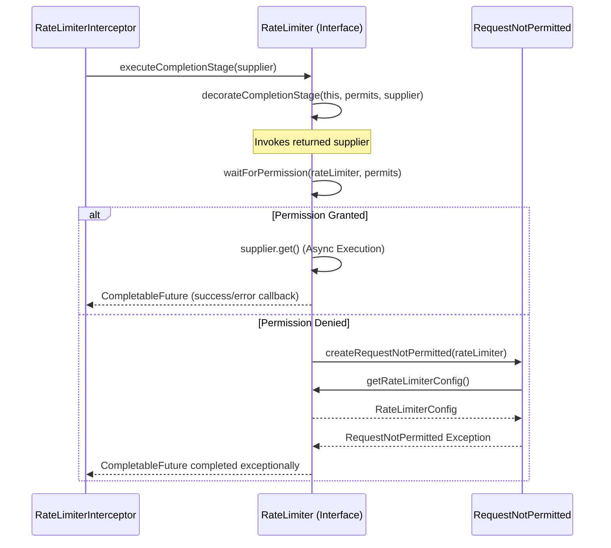
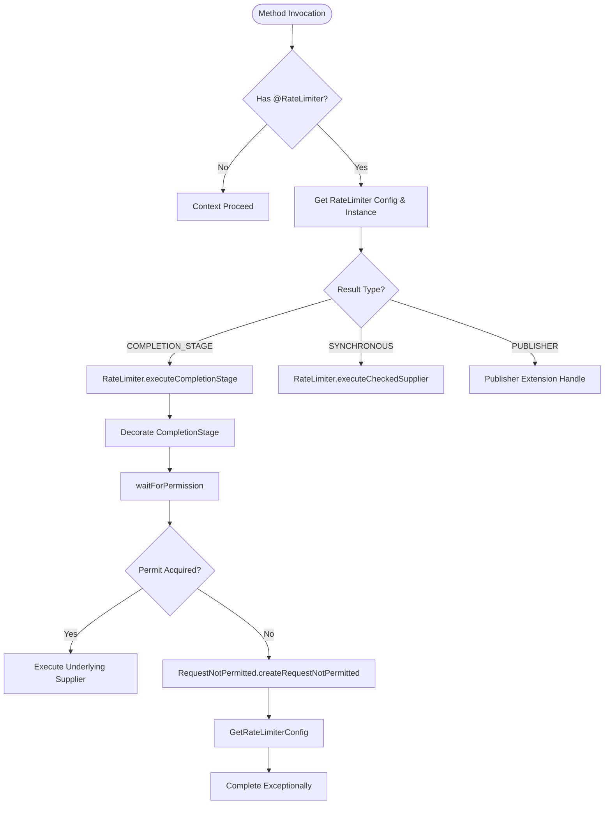

# Rate Limiter Interceptor Execution

Relevant source files

The following files were used as context for generating this wiki page:

- [resilience4j-micronaut/src/main/java/io/github/resilience4j/micronaut/ratelimiter/RateLimiterInterceptor.java](https://github.com/resilience4j/resilience4j/blob/main/resilience4j-micronaut/src/main/java/io/github/resilience4j/micronaut/ratelimiter/RateLimiterInterceptor.java)
- [resilience4j-ratelimiter/src/main/java/io/github/resilience4j/ratelimiter/RateLimiter.java](https://github.com/resilience4j/resilience4j/blob/main/resilience4j-ratelimiter/src/main/java/io/github/resilience4j/ratelimiter/RateLimiter.java)
- [resilience4j-ratelimiter/src/main/java/io/github/resilience4j/ratelimiter/RequestNotPermitted.java](https://github.com/resilience4j/resilience4j/blob/main/resilience4j-ratelimiter/src/main/java/io/github/resilience4j/ratelimiter/RequestNotPermitted.java)

## Overview

### Introduction

The `Intercept -> GetRateLimiterConfig` execution flow describes how the Resilience4j Micronaut integration intercepts method calls annotated with `@RateLimiter`, resolves the corresponding rate limiter configuration, and manages asynchronous execution using Java's `CompletionStage`. When an intercepted method returns a `CompletionStage`, the framework delegates execution to the core rate limiter component, which verifies permissions before proceeding or raising a rate-limiting exception.

Sources: [resilience4j-micronaut/src/main/java/io/github/resilience4j/micronaut/ratelimiter/RateLimiterInterceptor.java:73-104](https://github.com/resilience4j/resilience4j/blob/main/resilience4j-micronaut/src/main/java/io/github/resilience4j/micronaut/ratelimiter/RateLimiterInterceptor.java#L73-L104), [resilience4j-ratelimiter/src/main/java/io/github/resilience4j/ratelimiter/RateLimiter.java:605-619](https://github.com/resilience4j/resilience4j/blob/main/resilience4j-ratelimiter/src/main/java/io/github/resilience4j/ratelimiter/RateLimiter.java#L605-L619)

---

### Step-by-Step Execution Trace

#### Step 1: Intercept Method Invocation
The execution begins in the Micronaut AOP layer where `RateLimiterInterceptor.intercept()` intercepts any method annotated with `@RateLimiter`. It reads the name attribute from the annotation, retrieves or falls back to a default `RateLimiterConfig`, instantiates or fetches the `RateLimiter` instance, and branches based on the method's return type (such as `COMPLETION_STAGE`).

Sources: [resilience4j-micronaut/src/main/java/io/github/resilience4j/micronaut/ratelimiter/RateLimiterInterceptor.java:73-104](https://github.com/resilience4j/resilience4j/blob/main/resilience4j-micronaut/src/main/java/io/github/resilience4j/micronaut/ratelimiter/RateLimiterInterceptor.java#L73-L104)

#### Step 2: Execute Completion Stage
For asynchronous methods returning a `CompletionStage`, `RateLimiter.executeCompletionStage()` is invoked. This default interface method wraps the provided supplier with default permit requirements (defaulting to 1 permit) and delegates execution to the decoration utility.

Sources: [resilience4j-ratelimiter/src/main/java/io/github/resilience4j/ratelimiter/RateLimiter.java:605-619](https://github.com/resilience4j/ratelimiter/src/main/java/io/github/resilience4j/ratelimiter/RateLimiter.java#L605-L619)

#### Step 3: Decorate Completion Stage
`RateLimiter.decorateCompletionStage()` creates a decorated supplier that returns a new `CompletableFuture`. When invoked, it attempts to acquire permission before executing the underlying asynchronous supplier, and handles success or failure completion callbacks to record metrics and adjust state via `onResult()` or `onError()`.

Sources: [resilience4j-ratelimiter/src/main/java/io/github/resilience4j/ratelimiter/RateLimiter.java:143-183](https://github.com/resilience4j/ratelimiter/src/main/java/io/github/resilience4j/ratelimiter/RateLimiter.java#L143-L183)

#### Step 4: Wait For Permission
Within the decoration block, `RateLimiter.waitForPermission()` is called. This method queries the rate limiter to acquire the specified number of permits. If the thread is interrupted, it marks cancellation; if permission is denied within the timeout duration, it triggers an exception path.

Sources: [resilience4j-ratelimiter/src/main/java/io/github/resilience4j/ratelimiter/RateLimiter.java:572-580](https://github.com/resilience4j/ratelimiter/src/main/java/io/github/resilience4j/ratelimiter/RateLimiter.java#L572-L580)

#### Step 5: Create Request Not Permitted Exception
If permission acquisition fails (`waitForPermission` returns false), `RequestNotPermitted.createRequestNotPermitted()` is invoked. It inspects the rate limiter configuration to determine whether stack traces should be writable, formats an explanatory message including the rate limiter name, and returns a new `RequestNotPermitted` exception instance.

Sources: [resilience4j-ratelimiter/src/main/java/io/github/resilience4j/ratelimiter/RequestNotPermitted.java:39-47](https://github.com/resilience4j/ratelimiter/src/main/java/io/github/resilience4j/ratelimiter/RequestNotPermitted.java#L39-L47)

#### Step 6: Get Rate Limiter Configuration
During exception creation and permission handling, `RateLimiter.getRateLimiterConfig()` is accessed to retrieve configuration parameters such as stack trace visibility flags and timeout durations.

Sources: [resilience4j-ratelimiter/src/main/java/io/github/resilience4j/ratelimiter/RateLimiter.java:735-737](https://github.com/resilience4j/ratelimiter/src/main/java/io/github/resilience4j/ratelimiter/RateLimiter.java#L735-L737)

---

### Sequence Diagram

Sources: [resilience4j-micronaut/src/main/java/io/github/resilience4j/micronaut/ratelimiter/RateLimiterInterceptor.java:93-104](https://github.com/resilience4j/resilience4j/blob/main/resilience4j-micronaut/src/main/java/io/github/resilience4j/micronaut/ratelimiter/RateLimiterInterceptor.java#L93-L104), [resilience4j-ratelimiter/src/main/java/io/github/resilience4j/ratelimiter/RateLimiter.java:143-183](https://github.com/resilience4j/ratelimiter/src/main/java/io/github/resilience4j/ratelimiter/RateLimiter.java#L143-L183), [resilience4j-ratelimiter/src/main/java/io/github/resilience4j/ratelimiter/RequestNotPermitted.java:39-47](https://github.com/resilience4j/ratelimiter/src/main/java/io/github/resilience4j/ratelimiter/RequestNotPermitted.java#L39-L47)

---

### Flowchart

Sources: [resilience4j-micronaut/src/main/java/io/github/resilience4j/micronaut/ratelimiter/RateLimiterInterceptor.java:73-113](https://github.com/resilience4j/resilience4j/blob/main/resilience4j-micronaut/src/main/java/io/github/resilience4j/micronaut/ratelimiter/RateLimiterInterceptor.java#L73-L113), [resilience4j-ratelimiter/src/main/java/io/github/resilience4j/ratelimiter/RateLimiter.java:159-182](https://github.com/resilience4j/resilience4j/blob/main/resilience4j-ratelimiter/src/main/java/io/github/resilience4j/ratelimiter/RateLimiter.java#L159-L182), [resilience4j-ratelimiter/src/main/java/io/github/resilience4j/ratelimiter/RequestNotPermitted.java:39-47](https://github.com/resilience4j/ratelimiter/src/main/java/io/github/resilience4j/ratelimiter/RequestNotPermitted.java#L39-L47)

---

### Key Observations

- **Cross-Module Boundaries:** The execution flow bridges the `resilience4j-micronaut` AOP interceptor layer with the core `resilience4j-ratelimiter` execution logic.
- **Error Handling:** When permits cannot be acquired within the configured timeout, a `RequestNotPermitted` exception is instantiated dynamically, respecting the configuration's stack trace writability settings.
- **Asynchronous Integration:** For `CompletionStage` returns, rate limiting is non-blocking with respect to thread permission waits inside the future lifecycle, completing the resulting promise exceptionally if rate limits are exceeded.

Sources: [resilience4j-micronaut/src/main/java/io/github/resilience4j/micronaut/ratelimiter/RateLimiterInterceptor.java:93-104](https://github.com/resilience4j/resilience4j/blob/main/resilience4j-micronaut/src/main/java/io/github/resilience4j/micronaut/ratelimiter/RateLimiterInterceptor.java#L93-L104), [resilience4j-ratelimiter/src/main/java/io/github/resilience4j/ratelimiter/RateLimiter.java:159-182](https://github.com/resilience4j/resilience4j/blob/main/resilience4j-ratelimiter/src/main/java/io/github/resilience4j/ratelimiter/RateLimiter.java#L159-L182), [resilience4j-ratelimiter/src/main/java/io/github/resilience4j/ratelimiter/RequestNotPermitted.java:39-47](https://github.com/resilience4j/resilience4j/blob/main/resilience4j-ratelimiter/src/main/java/io/github/resilience4j/ratelimiter/RequestNotPermitted.java#L39-L47)
