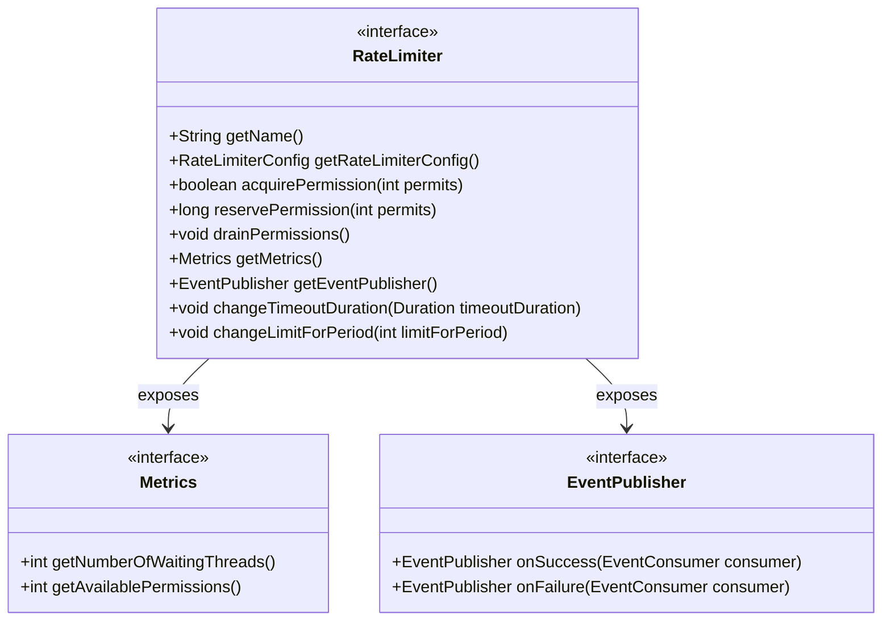
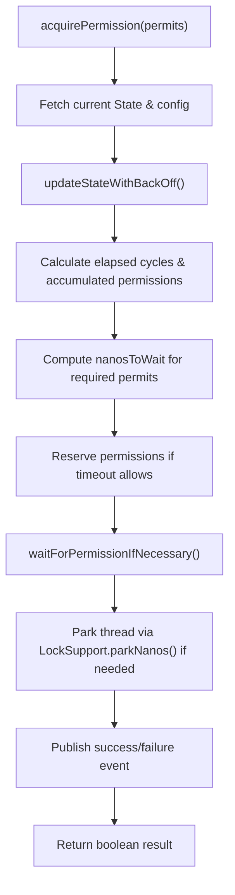
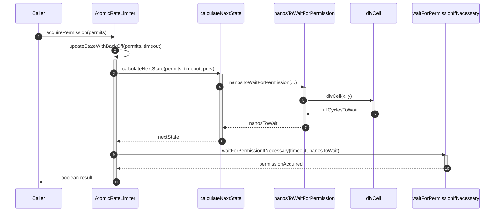
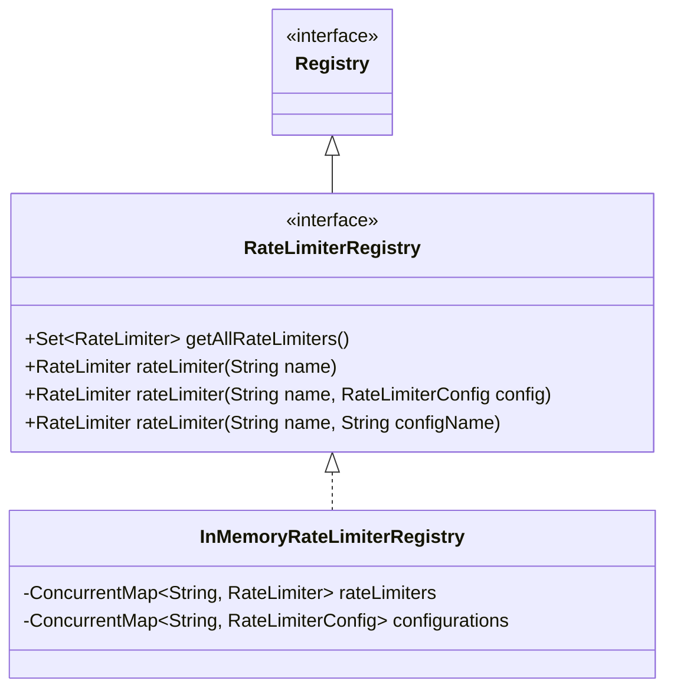

# Rate Limiters

<details>
<summary>Relevant source files</summary>

The following files were used as context for generating this wiki page:

- [resilience4j-ratelimiter/src/main/java/io/github/resilience4j/ratelimiter/RateLimiter.java](https://github.com/resilience4j/resilience4j/blob/main/resilience4j-ratelimiter/src/main/java/io/github/resilience4j/ratelimiter/RateLimiter.java)
- [resilience4j-ratelimiter/src/main/java/io/github/resilience4j/ratelimiter/internal/AtomicRateLimiter.java](https://github.com/resilience4j/resilience4j/blob/main/resilience4j-ratelimiter/src/main/java/io/github/resilience4j/ratelimiter/internal/AtomicRateLimiter.java)
- [resilience4j-ratelimiter/src/main/java/io/github/resilience4j/ratelimiter/internal/SemaphoreBasedRateLimiter.java](https://github.com/resilience4j/resilience4j/blob/main/resilience4j-ratelimiter/src/main/java/io/github/resilience4j/ratelimiter/internal/SemaphoreBasedRateLimiter.java)
- [resilience4j-vavr/src/main/java/io/github/resilience4j/ratelimiter/VavrRateLimiter.java](https://github.com/resilience4j/resilience4j/blob/main/resilience4j-vavr/src/main/java/io/github/resilience4j/ratelimiter/VavrRateLimiter.java)
- [resilience4j-circuitbreaker/src/main/java/io/github/resilience4j/circuitbreaker/internal/CircuitBreakerStateMachine.java](https://github.com/resilience4j/resilience4j/blob/main/resilience4j-circuitbreaker/src/main/java/io/github/resilience4j/circuitbreaker/internal/CircuitBreakerStateMachine.java)
- [resilience4j-spring6/src/main/java/io/github/resilience4j/spring6/ratelimiter/configure/RateLimiterAspect.java](https://github.com/resilience4j/resilience4j/blob/main/resilience4j-spring6/src/main/java/io/github/resilience4j/spring6/ratelimiter/configure/RateLimiterAspect.java)
- [README.adoc](https://github.com/resilience4j/resilience4j/blob/main/README.adoc)
- [resilience4j-bulkhead/src/main/java/io/github/resilience4j/bulkhead/internal/SemaphoreBulkhead.java](https://github.com/resilience4j/resilience4j/blob/main/resilience4j-bulkhead/src/main/java/io/github/resilience4j/bulkhead/internal/SemaphoreBulkhead.java)
- [resilience4j-micronaut/src/main/java/io/github/resilience4j/micronaut/ratelimiter/RateLimiterInterceptor.java](https://github.com/resilience4j/resilience4j/blob/main/resilience4j-micronaut/src/main/java/io/github/resilience4j/micronaut/ratelimiter/RateLimiterInterceptor.java)
- [resilience4j-ratelimiter/src/jmh/java/io/github/resilience4j/ratelimiter/RateLimiterBenchmark.java](https://github.com/resilience4j/resilience4j/blob/main/resilience4j-ratelimiter/src/jmh/java/io/github/resilience4j/ratelimiter/RateLimiterBenchmark.java)
- [resilience4j-spring-boot3/src/main/java/io/github/resilience4j/springboot3/ratelimiter/monitoring/health/RateLimitersHealthIndicator.java](https://github.com/resilience4j/resilience4j/blob/main/resilience4j-spring-boot3/src/main/java/io/github/resilience4j/springboot3/ratelimiter/monitoring/health/RateLimitersHealthIndicator.java)
- [resilience4j-spring-boot4/src/main/java/io/github/resilience4j/springboot/ratelimiter/monitoring/health/RateLimitersHealthIndicator.java](https://github.com/resilience4j/resilience4j/blob/main/resilience4j-spring-boot4/src/main/java/io/github/resilience4j/springboot/ratelimiter/monitoring/health/RateLimitersHealthIndicator.java)
- [resilience4j-circuitbreaker/src/main/java/io/github/resilience4j/circuitbreaker/internal/CircuitBreakerMetrics.java](https://github.com/resilience4j/resilience4j/blob/main/resilience4j-circuitbreaker/src/main/java/io/github/resilience4j/circuitbreaker/internal/CircuitBreakerMetrics.java)
- [resilience4j-kotlin/src/main/kotlin/io/github/resilience4j/kotlin/ratelimiter/RateLimiter.kt](https://github.com/resilience4j/resilience4j/blob/main/resilience4j-kotlin/src/main/kotlin/io/github/resilience4j/kotlin/ratelimiter/RateLimiter.kt)
- [resilience4j-metrics/src/main/java/io/github/resilience4j/metrics/publisher/RateLimiterMetricsPublisher.java](https://github.com/resilience4j/resilience4j/blob/main/resilience4j-metrics/src/main/java/io/github/resilience4j/metrics/publisher/RateLimiterMetricsPublisher.java)
- [resilience4j-reactor/src/main/java/io/github/resilience4j/reactor/ratelimiter/operator/CorePublisherRateLimiterOperator.java](https://github.com/resilience4j/resilience4j/blob/main/resilience4j-reactor/src/main/java/io/github/resilience4j/reactor/ratelimiter/operator/CorePublisherRateLimiterOperator.java)
- [resilience4j-ratelimiter/src/main/java/io/github/resilience4j/ratelimiter/RateLimiterConfig.java](https://github.com/resilience4j/resilience4j/blob/main/resilience4j-ratelimiter/src/main/java/io/github/resilience4j/ratelimiter/RateLimiterConfig.java)
- [resilience4j-rxjava3/src/main/java/io/github/resilience4j/rxjava3/ratelimiter/operator/FlowableRateLimiter.java](https://github.com/resilience4j/resilience4j/blob/main/resilience4j-rxjava3/src/main/java/io/github/resilience4j/rxjava3/ratelimiter/operator/FlowableRateLimiter.java)
- [resilience4j-rxjava3/src/main/java/io/github/resilience4j/rxjava3/ratelimiter/operator/ObserverRateLimiter.java](https://github.com/resilience4j/resilience4j/blob/main/resilience4j-rxjava3/src/main/java/io/github/resilience4j/rxjava3/ratelimiter/operator/ObserverRateLimiter.java)
- [resilience4j-ratelimiter/src/main/java/io/github/resilience4j/ratelimiter/RateLimiterRegistry.java](https://github.com/resilience4j/resilience4j/blob/main/resilience4j-ratelimiter/src/main/java/io/github/resilience4j/ratelimiter/RateLimiterRegistry.java)
</details>

## Overview

### Overview
Rate limiting in Resilience4j is a foundational fault-tolerance mechanism designed to restrict the frequency of incoming calls or outbound requests to external systems. By distributing a configurable number of permits over defined temporal cycles, rate limiters protect downstream services from being overwhelmed, prevent cascading failures, and enforce service-level agreements (SLAs) or API quotas. When an execution exceeds the allotted rate, the limiter either blocks the calling thread until a permit becomes available or fails fast by throwing a `RequestNotPermitted` exception.

Sources: [resilience4j-ratelimiter/src/main/java/io/github/resilience4j/ratelimiter/RateLimiter.java:43-48](https://github.com/resilience4j/resilience4j/blob/main/resilience4j-ratelimiter/src/main/java/io/github/resilience4j/ratelimiter/RateLimiter.java#L43-L48)

The rate limiter subsystem is architected around functional decorators, reactive operators, and concurrent data structures. It provides out-of-the-box support for synchronous and asynchronous execution flows, integration with Vavr, Kotlin Coroutines, Project Reactor, RxJava3, and Spring/Micronaut AOP annotations. At its core, Resilience4j offers two primary implementations: `AtomicRateLimiter`, an optimized, lock-free state machine based on atomic references and constant back-off, and `SemaphoreBasedRateLimiter`, which relies on standard Java Semaphores paired with a scheduled executor service.

Sources: [resilience4j-ratelimiter/src/main/java/io/github/resilience4j/ratelimiter/internal/AtomicRateLimiter.java:39-48](https://github.com/resilience4j/resilience4j/blob/main/resilience4j-ratelimiter/src/main/java/io/github/resilience4j/ratelimiter/internal/AtomicRateLimiter.java#L39-L48)

The design emphasizes low contention, high thread safety, and transparent monitoring via health indicators and metric publishers.

Sources: [resilience4j-ratelimiter/src/main/java/io/github/resilience4j/ratelimiter/internal/SemaphoreBasedRateLimiter.java:41-45](https://github.com/resilience4j/resilience4j/blob/main/resilience4j-ratelimiter/src/main/java/io/github/resilience4j/ratelimiter/internal/SemaphoreBasedRateLimiter.java#L41-L45)

---

## Public API and Interface Surface

### Interface Contract and Methods
The public contract of the rate limiter subsystem is defined by the `RateLimiter` interface, which exposes methods for permission acquisition, call execution, configuration updates, metrics collection, and event publishing. Callers can acquire permissions synchronously via `acquirePermission()`, reserve time allocations via `reservePermission()`, or wrap functional interfaces (such as `Supplier`, `Runnable`, `Callable`, `Function`, and `CompletionStage`) using provided helper decorators.

Sources: [resilience4j-ratelimiter/src/main/java/io/github/resilience4j/ratelimiter/RateLimiter.java:49-885](https://github.com/resilience4j/resilience4j/blob/main/resilience4j-ratelimiter/src/main/java/io/github/resilience4j/ratelimiter/RateLimiter.java#L49-L885)



Sources: [resilience4j-ratelimiter/src/main/java/io/github/resilience4j/ratelimiter/RateLimiter.java:49-885](https://github.com/resilience4j/resilience4j/blob/main/resilience4j-ratelimiter/src/main/java/io/github/resilience4j/ratelimiter/RateLimiter.java#L49-L885)

The interface includes overloaded factory methods for instantiation, allowing developers to supply custom configurations, tags, or alternative nanosecond time sources (useful for unit testing).

Sources: [resilience4j-ratelimiter/src/main/java/io/github/resilience4j/ratelimiter/RateLimiter.java:58-133](https://github.com/resilience4j/resilience4j/blob/main/resilience4j-ratelimiter/src/main/java/io/github/resilience4j/ratelimiter/RateLimiter.java#L58-L133)

| Static Factory / Method | Parameters | Description |
| :--- | :--- | :--- |
| `RateLimiter.of` | `String name, RateLimiterConfig config` | Creates an `AtomicRateLimiter` with custom config. |
| `RateLimiter.ofDefaults` | `String name` | Creates an `AtomicRateLimiter` with default config. |
| `RateLimiter.waitForPermission` | `RateLimiter limiter, int permits` | Acquires permissions or throws `RequestNotPermitted`. |

Sources: [resilience4j-ratelimiter/src/main/java/io/github/resilience4j/ratelimiter/RateLimiter.java:58-133](https://github.com/resilience4j/resilience4j/blob/main/resilience4j-ratelimiter/src/main/java/io/github/resilience4j/ratelimiter/RateLimiter.java#L58-L133)

Decorators wrap standard functional interfaces to manage permit acquisition and failure recording automatically.

Sources: [resilience4j-ratelimiter/src/main/java/io/github/resilience4j/ratelimiter/RateLimiter.java:387-403](https://github.com/resilience4j/resilience4j/blob/main/resilience4j-ratelimiter/src/main/java/io/github/resilience4j/ratelimiter/RateLimiter.java#L387-L403)

| Decorator Method | Target Type | Description |
| :--- | :--- | :--- |
| `decorateSupplier` | `Supplier<T>` | Restricts supplier execution with permission checks. |
| `decorateRunnable` | `CheckedRunnable` | Restricts checked runnable execution. |
| `decorateCompletionStage` | `Supplier<CompletionStage<T>>` | Asynchronously rate-limits completion stages. |

Sources: [resilience4j-ratelimiter/src/main/java/io/github/resilience4j/ratelimiter/RateLimiter.java:143-146](https://github.com/resilience4j/resilience4j/blob/main/resilience4j-ratelimiter/src/main/java/io/github/resilience4j/ratelimiter/RateLimiter.java#L143-L146), [resilience4j-ratelimiter/src/main/java/io/github/resilience4j/ratelimiter/RateLimiter.java:259-263](https://github.com/resilience4j/resilience4j/blob/main/resilience4j-ratelimiter/src/main/java/io/github/resilience4j/ratelimiter/RateLimiter.java#L259-L263), [resilience4j-ratelimiter/src/main/java/io/github/resilience4j/ratelimiter/RateLimiter.java:387-389](https://github.com/resilience4j/resilience4j/blob/main/resilience4j-ratelimiter/src/main/java/io/github/resilience4j/ratelimiter/RateLimiter.java#L387-L389)

---

## Core Implementations: Atomic vs. Semaphore-Based

### Implementation Strategies and Mechanisms
Resilience4j provides two distinct internal implementations of the `RateLimiter` interface: `AtomicRateLimiter` and `SemaphoreBasedRateLimiter`.

Sources: [resilience4j-ratelimiter/src/main/java/io/github/resilience4j/ratelimiter/internal/AtomicRateLimiter.java:39-48](https://github.com/resilience4j/resilience4j/blob/main/resilience4j-ratelimiter/src/main/java/io/github/resilience4j/ratelimiter/internal/AtomicRateLimiter.java#L39-L48), [resilience4j-ratelimiter/src/main/java/io/github/resilience4j/ratelimiter/internal/SemaphoreBasedRateLimiter.java:41-45](https://github.com/resilience4j/resilience4j/blob/main/resilience4j-ratelimiter/src/main/java/io/github/resilience4j/ratelimiter/internal/SemaphoreBasedRateLimiter.java#L41-L45)

`AtomicRateLimiter` divides time elapsed since class loading into discrete cycles, where each cycle's duration is determined by `RateLimiterConfig#getLimitRefreshPeriod()`. The internal state is encapsulated within an immutable `State` object stored in an `AtomicReference`. Rather than employing a background thread to periodically refresh permissions, `AtomicRateLimiter` lazily calculates accrued permissions upon each acquisition request based on current elapsed nanoseconds.

Sources: [resilience4j-ratelimiter/src/main/java/io/github/resilience4j/ratelimiter/internal/AtomicRateLimiter.java:39-48](https://github.com/resilience4j/resilience4j/blob/main/resilience4j-ratelimiter/src/main/java/io/github/resilience4j/ratelimiter/internal/AtomicRateLimiter.java#L39-L48)



Sources: [resilience4j-ratelimiter/src/main/java/io/github/resilience4j/ratelimiter/internal/AtomicRateLimiter.java:128-134](https://github.com/resilience4j/resilience4j/blob/main/resilience4j-ratelimiter/src/main/java/io/github/resilience4j/ratelimiter/internal/AtomicRateLimiter.java#L128-L134)

> [!NOTE]
> `AtomicRateLimiter` uses a constant back-off mechanism via `parkNanos(1)` inside its compare-and-swap (CAS) retry loop, a technique adapted from transactional memory algorithms that significantly reduces memory bus contention in high-concurrency benchmarks.

Sources: [resilience4j-ratelimiter/src/main/java/io/github/resilience4j/ratelimiter/internal/AtomicRateLimiter.java:174-180](https://github.com/resilience4j/resilience4j/blob/main/resilience4j-ratelimiter/src/main/java/io/github/resilience4j/ratelimiter/internal/AtomicRateLimiter.java#L174-L180)

`SemaphoreBasedRateLimiter` delegates permission management to a standard `java.util.concurrent.Semaphore` initialized with `limitForPeriod`. A scheduled executor service runs a fixed-rate task every `limitRefreshPeriod` to release exhausted permissions back into the semaphore.

Sources: [resilience4j-ratelimiter/src/main/java/io/github/resilience4j/ratelimiter/internal/SemaphoreBasedRateLimiter.java:101-129](https://github.com/resilience4j/resilience4j/blob/main/resilience4j-ratelimiter/src/main/java/io/github/resilience4j/ratelimiter/internal/SemaphoreBasedRateLimiter.java#L101-L129)

> [!WARNING]
> When using `SemaphoreBasedRateLimiter`, you must invoke `shutdown()` when the limiter is no longer needed. Because the scheduler holds a reference to the scheduled future task, failing to shut it down can prevent garbage collection and lead to a memory leak when creating multiple instances dynamically.

Sources: [resilience4j-ratelimiter/src/main/java/io/github/resilience4j/ratelimiter/internal/SemaphoreBasedRateLimiter.java:261-271](https://github.com/resilience4j/resilience4j/blob/main/resilience4j-ratelimiter/src/main/java/io/github/resilience4j/ratelimiter/internal/SemaphoreBasedRateLimiter.java#L261-L271)

---

## Execution Walkthrough and Sequence Flow

### Call-Chain Execution Walkthrough
When a thread invokes `acquirePermission(int permits)`, `AtomicRateLimiter` executes a precise, non-blocking evaluation sequence. First, `acquirePermission()` retrieves the timeout duration from config and invokes `updateStateWithBackOff(permits, timeoutInNanos)`. Inside `updateStateWithBackOff()`, a `do-while` CAS loop calls `calculateNextState(permits, timeoutInNanos, prev)`. 

Sources: [resilience4j-ratelimiter/src/main/java/io/github/resilience4j/ratelimiter/internal/AtomicRateLimiter.java:126-134](https://github.com/resilience4j/resilience4j/blob/main/resilience4j-ratelimiter/src/main/java/io/github/resilience4j/ratelimiter/internal/AtomicRateLimiter.java#L126-L134), [resilience4j-ratelimiter/src/main/java/io/github/resilience4j/ratelimiter/internal/AtomicRateLimiter.java:184-193](https://github.com/resilience4j/resilience4j/blob/main/resilience4j-ratelimiter/src/main/java/io/github/resilience4j/ratelimiter/internal/AtomicRateLimiter.java#L184-L193)

`calculateNextState()` computes the elapsed nanoseconds via `currentNanoTime()`, determines the current cycle, and calculates accumulated permissions from elapsed cycles. It then calls `nanosToWaitForPermission()`, which checks if available permissions satisfy the requested count (`availablePermissions >= permits`). If additional cycles are needed, `nanosToWaitForPermission()` invokes `divCeil(int x, int y)` to compute the number of full cycles to wait rounded up to the nearest integer. Finally, `reservePermissions()` constructs the next immutable `State`. If the CAS fails due to contention, `compareAndSet()` parks the thread for 1 nanosecond (`parkNanos(1)`) before retrying. Once the modified state is established, `waitForPermissionIfNecessary()` parks the thread using `parkNanos()` up to the allowed timeout, and `publishRateLimiterAcquisitionEvent()` records success or failure metrics and events.

Sources: [resilience4j-ratelimiter/src/main/java/io/github/resilience4j/ratelimiter/internal/AtomicRateLimiter.java:226-251](https://github.com/resilience4j/resilience4j/blob/main/resilience4j-ratelimiter/src/main/java/io/github/resilience4j/ratelimiter/internal/AtomicRateLimiter.java#L226-L251), [resilience4j-ratelimiter/src/main/java/io/github/resilience4j/ratelimiter/internal/AtomicRateLimiter.java:264-285](https://github.com/resilience4j/resilience4j/blob/main/resilience4j-ratelimiter/src/main/java/io/github/resilience4j/ratelimiter/internal/AtomicRateLimiter.java#L264-L285)

The following sequence diagram illustrates this permission acquisition call chain, explicitly tracing through `acquirePermission` → `updateStateWithBackOff` → `calculateNextState` → `nanosToWaitForPermission` → `divCeil`:

Sources: [resilience4j-ratelimiter/src/main/java/io/github/resilience4j/ratelimiter/internal/AtomicRateLimiter.java:126-285](https://github.com/resilience4j/resilience4j/blob/main/resilience4j-ratelimiter/src/main/java/io/github/resilience4j/ratelimiter/internal/AtomicRateLimiter.java#L126-L285)



Sources: [resilience4j-ratelimiter/src/main/java/io/github/resilience4j/ratelimiter/internal/AtomicRateLimiter.java:126-285](https://github.com/resilience4j/resilience4j/blob/main/resilience4j-ratelimiter/src/main/java/io/github/resilience4j/ratelimiter/internal/AtomicRateLimiter.java#L126-L285)

---

## Configuration and Options

`RateLimiterConfig` governs the timing and throughput parameters of rate limiter instances. It is constructed via a fluent builder pattern with sensible defaults.

Sources: [resilience4j-ratelimiter/src/main/java/io/github/resilience4j/ratelimiter/RateLimiterConfig.java:63-84](https://github.com/resilience4j/resilience4j/blob/main/resilience4j-ratelimiter/src/main/java/io/github/resilience4j/ratelimiter/RateLimiterConfig.java#L63-L84)

| Configuration Property | Default Value | Description |
| :--- | :--- | :--- |
| `timeoutDuration` | 5 seconds | Maximum time the calling thread waits for a permission. |
| `limitRefreshPeriod` | 500 nanoseconds | Period after which the rate limiter refreshes its permissions. |
| `limitForPeriod` | 50 | Number of permissions available during each refresh period. |
| `writableStackTraceEnabled` | `true` | Controls whether `RequestNotPermitted` exceptions populate a stack trace. |
| `drainPermissionsOnResult` | `any -> false` | Predicate deciding whether to drain remaining period permissions based on call results. |

Sources: [resilience4j-ratelimiter/src/main/java/io/github/resilience4j/ratelimiter/RateLimiterConfig.java:150-156](https://github.com/resilience4j/resilience4j/blob/main/resilience4j-ratelimiter/src/main/java/io/github/resilience4j/ratelimiter/RateLimiterConfig.java#L150-L156)

Validation checks are enforced during configuration building:
- `timeoutDuration` must not be null or negative.
- `limitRefreshPeriod` must not be null and must be greater than or equal to `1` nanosecond (`ACCEPTABLE_REFRESH_PERIOD`).
- `limitForPeriod` must be strictly greater than `0`.

Sources: [resilience4j-ratelimiter/src/main/java/io/github/resilience4j/ratelimiter/RateLimiterConfig.java:86-118](https://github.com/resilience4j/resilience4j/blob/main/resilience4j-ratelimiter/src/main/java/io/github/resilience4j/ratelimiter/RateLimiterConfig.java#L86-L118)

---

## Registry and Instance Management

### Registry Architecture
The `RateLimiterRegistry` interface and its implementation `InMemoryRateLimiterRegistry` manage the lifecycle, configuration mapping, and lookup of named `RateLimiter` instances across an application. Registries support default configurations, shared named configurations, event consumers, and tags.

Sources: [resilience4j-ratelimiter/src/main/java/io/github/resilience4j/ratelimiter/RateLimiterRegistry.java:35-83](https://github.com/resilience4j/resilience4j/blob/main/resilience4j-ratelimiter/src/main/java/io/github/resilience4j/ratelimiter/RateLimiterRegistry.java#L35-L83)



Sources: [resilience4j-ratelimiter/src/main/java/io/github/resilience4j/ratelimiter/RateLimiterRegistry.java:35-157](https://github.com/resilience4j/resilience4j/blob/main/resilience4j-ratelimiter/src/main/java/io/github/resilience4j/ratelimiter/RateLimiterRegistry.java#L35-L157)

---

## Reactive and Asynchronous Extensions

### Reactive and Coroutine Integration
Resilience4j provides dedicated operators to integrate rate limiters into reactive and asynchronous programming models without blocking operating system threads.

Sources: [resilience4j-reactor/src/main/java/io/github/resilience4j/reactor/ratelimiter/operator/CorePublisherRateLimiterOperator.java:40-51](https://github.com/resilience4j/resilience4j/blob/main/resilience4j-reactor/src/main/java/io/github/resilience4j/reactor/ratelimiter/operator/CorePublisherRateLimiterOperator.java#L40-L51)

`CorePublisherRateLimiterOperator` intercepts subscription events on `CorePublisher` instances (such as `Mono` or `Flux`). It reserves permissions upfront using `rateLimiter.reservePermission(permits)`:
- If `waitDuration == 0`, it subscribes immediately.
- If `waitDuration > 0`, it delays subscription using `Mono.delay(Duration.ofNanos(waitDuration))`.
- If `waitDuration < 0`, it fails fast by emitting `RequestNotPermitted`.

Sources: [resilience4j-reactor/src/main/java/io/github/resilience4j/reactor/ratelimiter/operator/CorePublisherRateLimiterOperator.java:40-51](https://github.com/resilience4j/resilience4j/blob/main/resilience4j-reactor/src/main/java/io/github/resilience4j/reactor/ratelimiter/operator/CorePublisherRateLimiterOperator.java#L40-L51)

`FlowableRateLimiter` and `ObserverRateLimiter` evaluate `rateLimiter.reservePermission()` upon subscription. If waiting is required, a `Completable.timer` schedules downstream subscription after the calculated nanoseconds elapse.

Sources: [resilience4j-rxjava3/src/main/java/io/github/resilience4j/rxjava3/ratelimiter/operator/FlowableRateLimiter.java:43-56](https://github.com/resilience4j/resilience4j/blob/main/resilience4j-rxjava3/src/main/java/io/github/resilience4j/rxjava3/ratelimiter/operator/FlowableRateLimiter.java#L43-L56), [resilience4j-rxjava3/src/main/java/io/github/resilience4j/rxjava3/ratelimiter/operator/ObserverRateLimiter.java:40-53](https://github.com/resilience4j/resilience4j/blob/main/resilience4j-rxjava3/src/main/java/io/github/resilience4j/rxjava3/ratelimiter/operator/ObserverRateLimiter.java#L40-L53)

Extension functions in `RateLimiter.kt` allow suspending execution until permissions become available via `awaitPermission()`, leveraging coroutine `delay()` without thread blocking.

Sources: [resilience4j-kotlin/src/main/kotlin/io/github/resilience4j/kotlin/ratelimiter/RateLimiter.kt:32-78](https://github.com/resilience4j/resilience4j/blob/main/resilience4j-kotlin/src/main/kotlin/io/github/resilience4j/kotlin/ratelimiter/RateLimiter.kt#L32-L78)

---

## AOP, Monitoring, and Health Indicators

### Aspects, Health Indicators, and Metrics
The `RateLimiterAspect` (Spring 6) and `RateLimiterInterceptor` (Micronaut) intercept methods annotated with `@RateLimiter`. They resolve the rate limiter instance from the registry using SpEL expressions or annotation attributes, wrap execution using `executeCheckedSupplier` or `executeCompletionStage`, and delegate fallback execution when permitted calls fail or are rejected.

Sources: [resilience4j-spring6/src/main/java/io/github/resilience4j/spring6/ratelimiter/configure/RateLimiterAspect.java:100-117](https://github.com/resilience4j/resilience4j/blob/main/resilience4j-spring6/src/main/java/io/github/resilience4j/spring6/ratelimiter/configure/RateLimiterAspect.java#L100-L117), [resilience4j-micronaut/src/main/java/io/github/resilience4j/micronaut/ratelimiter/RateLimiterInterceptor.java:73-117](https://github.com/resilience4j/resilience4j/blob/main/resilience4j-micronaut/src/main/java/io/github/resilience4j/micronaut/ratelimiter/RateLimiterInterceptor.java#L73-L117)

`RateLimitersHealthIndicator` (Spring Boot 3 & 4) inspects registered rate limiters. If available permissions are exhausted and the estimated wait time exceeds the configured timeout duration, the health indicator reports a status of `RATE_LIMITED` (or `DOWN` if `allowHealthIndicatorToFail` is enabled). Additionally, `RateLimiterMetricsPublisher` exports gauges for available permissions and waiting threads to Micrometer or Dropwizard registries.

Sources: [resilience4j-spring-boot3/src/main/java/io/github/resilience4j/springboot3/ratelimiter/monitoring/health/RateLimitersHealthIndicator.java:52-95](https://github.com/resilience4j/resilience4j/blob/main/resilience4j-spring-boot3/src/main/java/io/github/resilience4j/springboot3/ratelimiter/monitoring/health/RateLimitersHealthIndicator.java#L52-L95), [resilience4j-metrics/src/main/java/io/github/resilience4j/metrics/publisher/RateLimiterMetricsPublisher.java:49-62](https://github.com/resilience4j/resilience4j/blob/main/resilience4j-metrics/src/main/java/io/github/resilience4j/metrics/publisher/RateLimiterMetricsPublisher.java#L49-L62)

---

## Worked Example

The following complete, runnable example demonstrates how to configure a `RateLimiter`, wrap a supplier function, and handle request rejections when rate limits are exceeded.

Sources: [README.adoc:494-515](https://github.com/resilience4j/resilience4j/blob/main/README.adoc#L494-L515)

```java
import io.github.resilience4j.ratelimiter.RateLimiter;
import io.github.resilience4j.ratelimiter.RateLimiterConfig;
import io.github.resilience4j.ratelimiter.RequestNotPermitted;
import io.vavr.control.Try;

import java.time.Duration;
import java.util.function.Supplier;

public class RateLimiterExample {
    public static void main(String[] args) {
        // 1. Define custom rate limiter configuration: 1 request per second, 100ms timeout
        RateLimiterConfig config = RateLimiterConfig.custom()
            .timeoutDuration(Duration.ofMillis(100))
            .limitRefreshPeriod(Duration.ofSeconds(1))
            .limitForPeriod(1)
            .build();

        // 2. Create the RateLimiter instance via registry or static factory
        RateLimiter rateLimiter = RateLimiter.of("myBackend", config);

        // 3. Define the target supplier call
        Supplier<String> backendCall = () -> "Successful Response";

        // 4. Decorate the supplier with the rate limiter
        Supplier<String> restrictedSupplier = RateLimiter.decorateSupplier(rateLimiter, backendCall);

        // 5. Execute first call (should succeed)
        Try<String> firstTry = Try.ofSupplier(restrictedSupplier);
        System.out.println("First call success: " + firstTry.isSuccess());

        // 6. Execute second call immediately (should fail with RequestNotPermitted)
        Try<String> secondTry = Try.ofSupplier(restrictedSupplier);
        if (secondTry.isFailure() && secondTry.getCause() instanceof RequestNotPermitted) {
            System.out.println("Second call rejected: Rate limit exceeded!");
        }
    }
}
```

Sources: [README.adoc:494-515](https://github.com/resilience4j/resilience4j/blob/main/README.adoc#L494-L515), [resilience4j-ratelimiter/src/main/java/io/github/resilience4j/ratelimiter/RateLimiter.java:58-60](https://github.com/resilience4j/resilience4j/blob/main/resilience4j-ratelimiter/src/main/java/io/github/resilience4j/ratelimiter/RateLimiter.java#L58-L60), [resilience4j-ratelimiter/src/main/java/io/github/resilience4j/ratelimiter/RateLimiterConfig.java:63-65](https://github.com/resilience4j/resilience4j/blob/main/resilience4j-ratelimiter/src/main/java/io/github/resilience4j/ratelimiter/RateLimiterConfig.java#L63-L65)

## Related

- [[Registry Management]]

