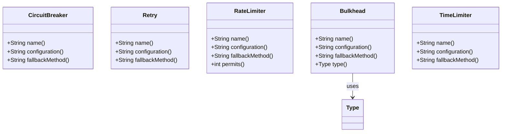
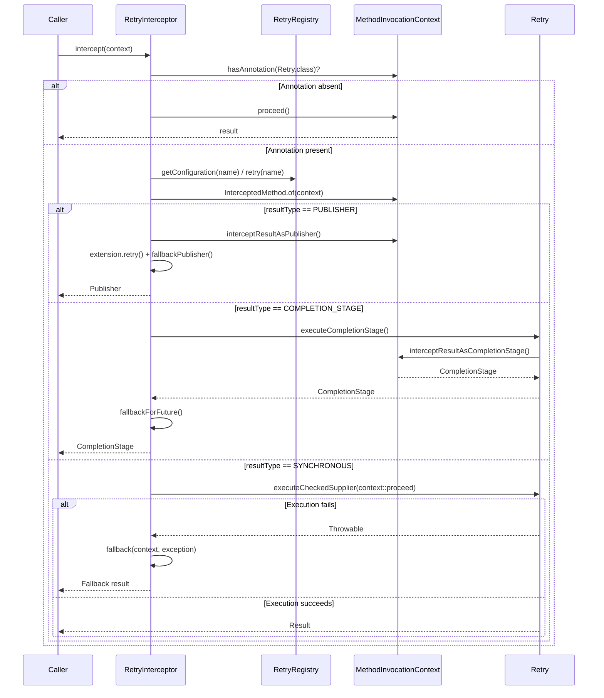

# Resilience Annotations

<details>
<summary>Relevant source files</summary>

The following files were used as context for generating this wiki page:

- [README.adoc](https://github.com/resilience4j/resilience4j/blob/main/README.adoc)
- [resilience4j-feign/README.adoc](https://github.com/resilience4j/resilience4j/blob/main/resilience4j-feign/README.adoc)
- [resilience4j-micronaut/src/main/java/io/github/resilience4j/micronaut/circuitbreaker/CircuitBreakerInterceptor.java](https://github.com/resilience4j/resilience4j/blob/main/resilience4j-micronaut/src/main/java/io/github/resilience4j/micronaut/circuitbreaker/CircuitBreakerInterceptor.java)
- [resilience4j-micronaut/src/main/java/io/github/resilience4j/micronaut/retry/RetryInterceptor.java](https://github.com/resilience4j/resilience4j/blob/main/resilience4j-micronaut/src/main/java/io/github/resilience4j/micronaut/retry/RetryInterceptor.java)
- [resilience4j-spring6/src/main/java/io/github/resilience4j/spring6/retry/configure/RetryAspect.java](https://github.com/resilience4j/resilience4j/blob/main/resilience4j-spring6/src/main/java/io/github/resilience4j/spring6/retry/configure/RetryAspect.java)
- [resilience4j-all/src/main/java/io/github/resilience4j/decorators/Decorators.java](https://github.com/resilience4j/resilience4j/blob/main/resilience4j-all/src/main/java/io/github/resilience4j/decorators/Decorators.java)
- [resilience4j-micronaut/src/main/java/io/github/resilience4j/micronaut/annotation/CircuitBreaker.java](https://github.com/resilience4j/resilience4j/blob/main/resilience4j-micronaut/src/main/java/io/github/resilience4j/micronaut/annotation/CircuitBreaker.java)
- [resilience4j-micronaut/src/main/java/io/github/resilience4j/micronaut/annotation/Retry.java](https://github.com/resilience4j/resilience4j/blob/main/resilience4j-micronaut/src/main/java/io/github/resilience4j/micronaut/annotation/Retry.java)
- [resilience4j-micronaut/src/main/java/io/github/resilience4j/micronaut/annotation/RateLimiter.java](https://github.com/resilience4j/resilience4j/blob/main/resilience4j-micronaut/src/main/java/io/github/resilience4j/micronaut/annotation/RateLimiter.java)
- [resilience4j-micronaut/src/main/java/io/github/resilience4j/micronaut/annotation/Bulkhead.java](https://github.com/resilience4j/resilience4j/blob/main/resilience4j-micronaut/src/main/java/io/github/resilience4j/micronaut/annotation/Bulkhead.java)
- [resilience4j-micronaut/src/main/java/io/github/resilience4j/micronaut/annotation/TimeLimiter.java](https://github.com/resilience4j/resilience4j/blob/main/resilience4j-micronaut/src/main/java/io/github/resilience4j/micronaut/annotation/TimeLimiter.java)
- [resilience4j-annotations/src/main/java/io/github/resilience4j/circuitbreaker/annotation/CircuitBreaker.java](https://github.com/resilience4j/circuitbreaker/annotation/CircuitBreaker.java)
- [resilience4j-micronaut/src/main/java/io/github/resilience4j/micronaut/util/PublisherExtension.java](https://github.com/resilience4j/resilience4j/blob/main/resilience4j-micronaut/src/main/java/io/github/resilience4j/micronaut/util/PublisherExtension.java)
- [resilience4j-micronaut/src/main/java/io/github/resilience4j/micronaut/util/ReactorPublisherExtension.java](https://github.com/resilience4j/resilience4j/blob/main/resilience4j-micronaut/src/main/java/io/github/resilience4j/micronaut/util/ReactorPublisherExtension.java)
- [resilience4j-feign/src/main/java/io/github/resilience4j/feign/FeignDecorators.java](https://github.com/resilience4j/resilience4j/blob/main/resilience4j-feign/src/main/java/io/github/resilience4j/feign/FeignDecorators.java)
- [resilience4j-hedge/src/main/java/io/github/resilience4j/hedge/Hedge.java](https://github.com/resilience4j/hedge/src/main/java/io/github/resilience4j/hedge/Hedge.java)
- [resilience4j-annotations/src/main/java/io/github/resilience4j/retry/annotation/Retry.java](https://github.com/resilience4j/retry/annotation/Retry.java)
- [resilience4j-micronaut/src/main/java/io/github/resilience4j/micronaut/util/RxJava3PublisherExtension.java](https://github.com/resilience4j/resilience4j/blob/main/resilience4j-micronaut/src/main/java/io/github/resilience4j/micronaut/util/RxJava3PublisherExtension.java)
- [resilience4j-micronaut/src/main/java/io/github/resilience4j/micronaut/util/RxJava2PublisherExtension.java](https://github.com/resilience4j/resilience4j/blob/main/resilience4j-micronaut/src/main/java/io/github/resilience4j/micronaut/util/RxJava2PublisherExtension.java)
- [resilience4j-annotations/src/main/java/io/github/resilience4j/ratelimiter/annotation/RateLimiter.java](https://github.com/resilience4j/ratelimiter/annotation/RateLimiter.java)
- [resilience4j-annotations/src/main/java/io/github/resilience4j/bulkhead/annotation/Bulkhead.java](https://github.com/resilience4j/bulkhead/annotation/Bulkhead.java)
- [resilience4j-all/src/main/java/io/github/resilience4j/decorators/package-info.java](https://github.com/resilience4j/resilience4j/blob/main/resilience4j-all/src/main/java/io/github/resilience4j/decorators/package-info.java)
- [resilience4j-spring-boot3/README.adoc](https://github.com/resilience4j/resilience4j/blob/main/resilience4j-spring-boot3/README.adoc)
- [resilience4j-micronaut/src/main/java/io/github/resilience4j/micronaut/retry/RetryQualifier.java](https://github.com/resilience4j/resilience4j/blob/main/resilience4j-micronaut/src/main/java/io/github/resilience4j/micronaut/retry/RetryQualifier.java)
- [resilience4j-micronaut/src/main/java/io/github/resilience4j/micronaut/ResilienceInterceptPhase.java](https://github.com/resilience4j/micronaut/ResilienceInterceptPhase.java)
- [RELEASENOTES.adoc](https://github.com/resilience4j/resilience4j/blob/main/RELEASENOTES.adoc)
- [resilience4j-annotations/src/main/java/io/github/resilience4j/timelimiter/annotation/TimeLimiter.java](https://github.com/resilience4j/timelimiter/annotation/TimeLimiter.java)
</details>

## Overview

Resilience Annotations provide a declarative, metadata-driven approach to applying fault tolerance patterns—such as Circuit Breakers, Retries, Rate Limiters, Bulkheads, and Time Limiters—across methods and classes without cluttering business logic with programmatic builder chains. Rather than requiring developers to manually wrap functional interfaces using `Decorators` or individual builder utilities, framework integrations intercept annotated target methods at runtime via AOP proxies or interceptors, resolving registry instances and wrapping execution contexts dynamically based on return types (synchronous values, `CompletionStage`, or reactive streams like Reactor `Flux`/`Mono` and RxJava `Flowable`).

Sources: [resilience4j-micronaut/src/main/java/io/github/resilience4j/micronaut/circuitbreaker/CircuitBreakerInterceptor.java:37-40](https://github.com/resilience4j/resilience4j/blob/main/resilience4j-micronaut/src/main/java/io/github/resilience4j/micronaut/circuitbreaker/CircuitBreakerInterceptor.java#L37-L40)

At its core, this architecture bridges declarative user metadata (`io.github.resilience4j.*.annotation` packages) with underlying runtime registries (`CircuitBreakerRegistry`, `RetryRegistry`, etc.). When applied at the class level, an annotation is equivalent to annotating every public method on that class. Framework-specific runtime handlers—such as Spring's `RetryAspect` or Micronaut's `CircuitBreakerInterceptor` and `RetryInterceptor`—extract annotation attributes, evaluate Spring Expression Language (SpEL) parameters or configuration keys at runtime, fetch or construct the appropriate resilience instance, and delegate actual method invocation through the requested policy chain.

Sources: [resilience4j-spring6/src/main/java/io/github/resilience4j/spring6/retry/configure/RetryAspect.java:64-65](https://github.com/resilience4j/resilience4j/blob/main/resilience4j-spring6/src/main/java/io/github/resilience4j/spring6/retry/configure/RetryAspect.java#L64-L65)

A central design challenge in declarative resilience is managing cross-cutting concern execution order. If multiple annotations are present on a single method, the interception order dictates whether a failure policy wraps a rate limiter or vice versa. Framework integrations address this through explicit interception phases (e.g., Micronaut's `ResilienceInterceptPhase` and Spring Boot aspect ordering properties), ensuring that outer boundaries like Circuit Breakers correctly encapsulate inner boundaries like Retries to prevent redundant failure recording across attempt loops.

Sources: [resilience4j-micronaut/src/main/java/io/github/resilience4j/micronaut/ResilienceInterceptPhase.java:30-31](https://github.com/resilience4j/resilience4j/blob/main/resilience4j-micronaut/src/main/java/io/github/resilience4j/micronaut/ResilienceInterceptPhase.java#L30-L31)

---

## Public Annotation Interface Surface

The resilience annotations API defines metadata contracts across standard runtime retention policies and target selectors (`ElementType.METHOD` and `ElementType.TYPE`). Every annotation exposes configuration properties for naming instances, referencing shared configuration keys, defining fallbacks, and configuring pattern-specific parameters.



Sources: [resilience4j-annotations/src/main/java/io/github/resilience4j/circuitbreaker/annotation/CircuitBreaker.java:27-60](https://github.com/resilience4j/circuitbreaker/annotation/CircuitBreaker.java#L27-L60)

The core annotation attributes and their default values are summarized below:

| Annotation | Attribute | Type | Default | Purpose |
| :--- | :--- | :--- | :--- | :--- |
| `@CircuitBreaker` | `name` | `String` | *(required)* | Name of the circuit breaker instance or SpEL expression. |
| `@CircuitBreaker` | `configuration` | `String` | `""` | Config key to share configuration when name uses SpEL. |
| `@CircuitBreaker` | `fallbackMethod` | `String` | `""` | Fallback method name or SpEL expression (`bean::method`). |
| `@Retry` | `name` | `String` | *(required)* | Name of the retry instance or SpEL expression. |
| `@Retry` | `configuration` | `String` | `""` | Config key to share configuration when name uses SpEL. |
| `@Retry` | `fallbackMethod` | `String` | `""` | Fallback method name or SpEL expression (`bean::method`). |
| `@RateLimiter` | `name` | `String` | *(required)* | Name of the rate limiter instance or SpEL expression. |
| `@RateLimiter` | `configuration` | `String` | `""` | Config key to share configuration when name uses SpEL. |
| `@RateLimiter` | `fallbackMethod` | `String` | `""` | Fallback method name or SpEL expression (`bean::method`). |
| `@RateLimiter` | `permits` | `int` | `1` | Number of permits required by the invocation. |
| `@Bulkhead` | `name` | `String` | *(required)* | Name of the bulkhead instance or SpEL expression. |
| `@Bulkhead` | `configuration` | `String` | `""` | Config key to share configuration when name uses SpEL. |
| `@Bulkhead` | `fallbackMethod` | `String` | `""` | Fallback method name or SpEL expression (`bean::method`). |
| `@Bulkhead` | `type` | `Type` | `SEMAPHORE` | Implementation type: `SEMAPHORE` or `THREADPOOL`. |
| `@TimeLimiter` | `name` | `String` | *(required)* | Name of the time limiter instance or SpEL expression. |
| `@TimeLimiter` | `configuration` | `String` | `""` | Config key to share configuration when name uses SpEL. |
| `@TimeLimiter` | `fallbackMethod` | `String` | `""` | Fallback method name or SpEL expression (`bean::method`). |

Sources: [resilience4j-annotations/src/main/java/io/github/resilience4j/retry/annotation/Retry.java:39-55](https://github.com/resilience4j/retry/annotation/Retry.java#L39-L55)

---

## SpEL Resolution and Expression Parsing

When annotations are processed in Spring environments (via aspects such as `RetryAspect`), annotation attributes like `name`, `configuration`, and `fallbackMethod` are not treated strictly as static literals. Instead, they can be evaluated as Spring Expression Language (SpEL) expressions via `SpelResolver`. This allows dynamic backend naming or fallback routing based on method arguments, runtime environment state, or external bean delegations.

Sources: [resilience4j-spring6/src/main/java/io/github/resilience4j/spring6/retry/configure/RetryAspect.java:25-26](https://github.com/resilience4j/resilience4j/blob/main/resilience4j-spring6/src/main/java/io/github/resilience4j/spring6/retry/configure/RetryAspect.java#L25-L26)

The `RetryAspect` interceptor demonstrates this evaluation during around advice execution:

```java
String backend = spelResolver.resolve(method, proceedingJoinPoint.getArgs(), retryAnnotation.name());
String configKey = retryAnnotation.configuration().isEmpty() ? backend : retryAnnotation.configuration();
var retry = getOrCreateRetry(methodName, backend, configKey);
```

Sources: [resilience4j-spring6/src/main/java/io/github/resilience4j/spring6/retry/configure/RetryAspect.java:114-116](https://github.com/resilience4j/resilience4j/blob/main/resilience4j-spring6/src/main/java/io/github/resilience4j/spring6/retry/configure/RetryAspect.java#L114-L116)

SpEL evaluation supports several root object references for parameter and method extraction:
- `#root.args[0]`, `#p0`, or `#a0`: References the first parameter passed to the intercepted method.
- `#root.methodName`: Resolves to the name of the intercepted Java method.
- `#root.className`: Resolves to the declaring class name.
- `@beanName.methodName(#a0)`: Delegates execution to an external Spring bean method using runtime arguments.

Sources: [resilience4j-annotations/src/main/java/io/github/resilience4j/retry/annotation/Retry.java:33-36](https://github.com/resilience4j/retry/annotation/Retry.java#L33-L36)

> [!NOTE]
> If a SpEL expression is used for the `name` attribute, it is strongly recommended to specify an explicit `configuration` key. This ensures that dynamic runtime names share a consolidated template configuration from the registry rather than attempting to look up non-existent individual configuration entries per evaluated name string.

Sources: [resilience4j-annotations/src/main/java/io/github/resilience4j/retry/annotation/Retry.java:42-45](https://github.com/resilience4j/retry/annotation/Retry.java#L42-L45)

---

## Interception Control Flow and Return-Type Dispatch

Interceptors handle method invocations by inspecting the declared return type of the intercepted method. Whether running under Spring AOP or Micronaut AOP, interceptors branch execution into synchronous suppliers, asynchronous completion stages (`CompletionStage`), or reactive streams (`Publisher`).

Sources: [resilience4j-micronaut/src/main/java/io/github/resilience4j/micronaut/retry/RetryInterceptor.java:24-27](https://github.com/resilience4j/resilience4j/blob/main/resilience4j-micronaut/src/main/java/io/github/resilience4j/micronaut/retry/RetryInterceptor.java#L24-L27)

The following sequence diagram illustrates how `RetryInterceptor` processes an invocation context across different return type branches:



Sources: [resilience4j-micronaut/src/main/java/io/github/resilience4j/micronaut/retry/RetryInterceptor.java:84-128](https://github.com/resilience4j/resilience4j/blob/main/resilience4j-micronaut/src/main/java/io/github/resilience4j/micronaut/retry/RetryInterceptor.java#L84-L128)

Interceptors execute within structured try-catch blocks to guarantee that any unexpected exceptions thrown during interception setup are correctly handled by the underlying framework's interception mechanism.

Sources: [resilience4j-micronaut/src/main/java/io/github/resilience4j/micronaut/circuitbreaker/CircuitBreakerInterceptor.java:113-115](https://github.com/resilience4j/resilience4j/blob/main/resilience4j-micronaut/src/main/java/io/github/resilience4j/micronaut/circuitbreaker/CircuitBreakerInterceptor.java#L113-L115)

---

## Reactive Stream Integration via Publisher Extensions

When intercepted methods return reactive streams (such as Reactor `Flux`/`Mono` or RxJava `Flowable`), standard imperative execution wrappers cannot be applied directly because subscription has not yet occurred. Resilience4j bridges this gap through `PublisherExtension` implementations (`ReactorPublisherExtension`, `RxJava2PublisherExtension`, and `RxJava3PublisherExtension`).

Sources: [resilience4j-micronaut/src/main/java/io/github/resilience4j/micronaut/util/PublisherExtension.java:15-27](https://github.com/resilience4j/resilience4j/blob/main/resilience4j-micronaut/src/main/java/io/github/resilience4j/micronaut/util/PublisherExtension.java#L15-L27)

These extensions transform reactive publishers using operator composition rather than blocking execution:
- **Reactor:** Uses `Flux.from(publisher).transformDeferred(CircuitBreakerOperator.of(circuitBreaker))` to defer operator attachment until subscription time.
- **RxJava:** Uses `Flowable.fromPublisher(publisher).compose(RetryTransformer.of(retry))` or corresponding operator modules.
- **Fallback Resolution:** Catches downstream errors via operators like `onErrorResume` or `onErrorResumeNext`, dynamically invokes fallback execution handles, and converts fallback results into compatible reactive types via the `ConversionService`.

Sources: [resilience4j-micronaut/src/main/java/io/github/resilience4j/micronaut/util/ReactorPublisherExtension.java:34-37](https://github.com/resilience4j/resilience4j/blob/main/resilience4j-micronaut/src/main/java/io/github/resilience4j/micronaut/util/ReactorPublisherExtension.java#L34-L37)

```java
@Override
public <T> Publisher<T> circuitBreaker(Publisher<T> publisher, CircuitBreaker circuitBreaker) {
    return Flux.from(publisher)
        .transformDeferred(CircuitBreakerOperator.of(circuitBreaker));
}
```

Sources: [resilience4j-micronaut/src/main/java/io/github/resilience4j/micronaut/util/ReactorPublisherExtension.java:39-43](https://github.com/resilience4j/resilience4j/blob/main/resilience4j-micronaut/src/main/java/io/github/resilience4j/micronaut/util/ReactorPublisherExtension.java#L39-L43)

---

## Interceptor Ordering and Phase Precedence

When multiple resilience annotations (`@Retry`, `@CircuitBreaker`, `@RateLimiter`, `@TimeLimiter`, `@Bulkhead`) are placed on the same class or method, their relative execution order determines how errors propagate and whether counters interact correctly.

Sources: [resilience4j-micronaut/src/main/java/io/github/resilience4j/micronaut/ResilienceInterceptPhase.java:21-29](https://github.com/resilience4j/resilience4j/blob/main/resilience4j-micronaut/src/main/java/io/github/resilience4j/micronaut/ResilienceInterceptPhase.java#L21-L29)

In Micronaut, execution phase ordering is controlled by the `ResilienceInterceptPhase` enum implementing `Ordered`:

| Phase Name | Order Value | Interceptor / Position |
| :--- | :--- | :--- |
| `RETRY` | `-60` | Outer-most boundary (handles retries of entire protected blocks). |
| `CIRCUIT_BREAKER` | `-55` | Encapsulates rate limiters and timeout handlers. |
| `RATE_LIMITER` | `-50` | Throttles incoming invocation rate. |
| `TIME_LIMITER` | `-45` | Enforces execution duration limits. |
| `BULKHEAD` | `-42` | Inner-most boundary (limits concurrent calls). |

Sources: [resilience4j-micronaut/src/main/java/io/github/resilience4j/micronaut/ResilienceInterceptPhase.java:30-55](https://github.com/resilience4j/resilience4j/blob/main/resilience4j-micronaut/src/main/java/io/github/resilience4j/micronaut/ResilienceInterceptPhase.java#L30-L55)

The default composition layout produced by these phase numbers corresponds to:
`Retry ( CircuitBreaker ( RateLimiter ( TimeLimiter ( Bulkhead ( Function ) ) ) ) )`

Sources: [resilience4j-micronaut/src/main/java/io/github/resilience4j/micronaut/ResilienceInterceptPhase.java:27](https://github.com/resilience4j/resilience4j/blob/main/resilience4j-micronaut/src/main/java/io/github/resilience4j/micronaut/ResilienceInterceptPhase.java#L27)

> [!WARNING]
> In Spring Boot 3 environments, default AOP aspect ordering may cause `@Retry` to run inside `@CircuitBreaker` (inner retry, outer circuit breaker). If configured incorrectly, a single logical operation that exhausts its retry attempts will record **multiple failures** in the CircuitBreaker, potentially causing the circuit to open prematurely. To ensure the CircuitBreaker wraps the entire retry sequence (recording only 1 failure per total logical failure), explicitly configure aspect order properties:
> ```properties
> resilience4j.circuitbreaker.circuitBreakerAspectOrder=1
> resilience4j.retry.retryAspectOrder=2
> ```

Sources: [resilience4j-spring-boot3/README.adoc:61-76](https://github.com/resilience4j/resilience4j/blob/main/resilience4j-spring-boot3/README.adoc#L61-L76)

---

## Design Trade-Offs

The declarative annotation architecture balances ease of use against runtime flexibility and introspection overhead.

Sources: [resilience4j-micronaut/src/main/java/io/github/resilience4j/micronaut/circuitbreaker/CircuitBreakerInterceptor.java:73-82](https://github.com/resilience4j/resilience4j/blob/main/resilience4j-micronaut/src/main/java/io/github/resilience4j/micronaut/circuitbreaker/CircuitBreakerInterceptor.java#L73-L82)

| Design Choice | Benefit | Cost |
| :--- | :--- | :--- |
| **AOP Proxy Interception** | Keeps business logic clean of boilerplate decorator code; applies policies uniformly across classes or methods. | Introduces reflective invocation overhead and complexity in debugging proxy chains and aspect ordering. |
| **Registry-Backed Instance Caching** | Instances are shared and reused across calls by name, maintaining accurate global metrics and state across the application. | Requires careful naming convention discipline; unintended name collisions cause unrelated methods to share circuit state. |
| **SpEL Expression Evaluation** | Enables dynamic, request-aware backend naming and external bean fallback routing at runtime. | Evaluation overhead on every method invocation; potential security and debugging complexity with complex expressions. |
| **Phase-Based Ordering** | Provides deterministic nesting of resilience patterns out-of-the-box without manual builder nesting. | Fixed framework phase ordering can be restrictive if custom nesting topologies are required for specific edge cases. |

Sources: [resilience4j-spring6/src/main/java/io/github/resilience4j/spring6/retry/configure/RetryAspect.java:104-120](https://github.com/resilience4j/resilience4j/blob/main/resilience4j-spring6/src/main/java/io/github/resilience4j/spring6/retry/configure/RetryAspect.java#L104-L120)

---

## Full Worked Example

The following complete example demonstrates a service class annotated with both `@CircuitBreaker` and `@Retry`, configured with fallback methods to handle failures gracefully in a Micronaut or Spring Boot application.

Sources: [resilience4j-annotations/src/main/java/io/github/resilience4j/circuitbreaker/annotation/CircuitBreaker.java:30-60](https://github.com/resilience4j/circuitbreaker/annotation/CircuitBreaker.java#L30-L60)

```java
package com.example.service;

import io.github.resilience4j.circuitbreaker.annotation.CircuitBreaker;
import io.github.resilience4j.retry.annotation.Retry;
import jakarta.inject.Singleton;

@Singleton
public class BillingService {

    @CircuitBreaker(name = "billingService", fallbackMethod = "chargeFallback")
    @Retry(name = "billingService")
    public String chargeCustomer(String customerId, double amount) {
        // Business logic that may experience transient network failures
        if (amount > 10000.0) {
            throw new RuntimeException("Payment gateway timeout");
        }
        return "Charged successfully: " + amount;
    }

    // Fallback method matching parameter signature plus optional Throwable
    public String chargeFallback(String customerId, double amount, Throwable t) {
        return "Fallback response for customer " + customerId + ": " + t.getMessage();
    }
}
```

Sources: [resilience4j-annotations/src/main/java/io/github/resilience4j/retry/annotation/Retry.java:27-55](https://github.com/resilience4j/retry/annotation/Retry.java#L27-L55)

## Related

- [[Spring 6 Aspects]]
- [[Micronaut Interceptors]]

