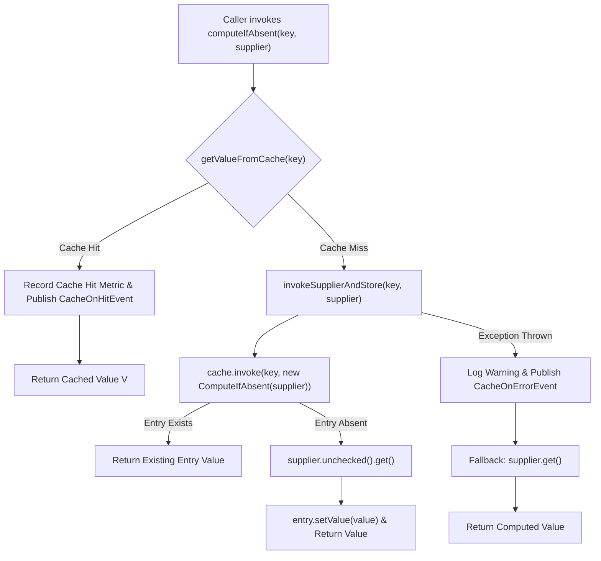

# Result Caching

<details>
<summary>Relevant source files</summary>

The following files were used as context for generating this wiki page:

- [resilience4j-all/src/main/java/io/github/resilience4j/decorators/Decorators.java](https://github.com/resilience4j/resilience4j/blob/main/resilience4j-all/src/main/java/io/github/resilience4j/decorators/Decorators.java)
- [resilience4j-retry/src/main/java/io/github/resilience4j/retry/internal/RetryImpl.java](https://github.com/resilience4j/resilience4j/blob/main/resilience4j-retry/src/main/java/io/github/resilience4j/retry/internal/RetryImpl.java)
- [resilience4j-cache/src/main/java/io/github/resilience4j/cache/internal/CacheImpl.java](https://github.com/resilience4j/resilience4j/blob/main/resilience4j-cache/src/main/java/io/github/resilience4j/cache/internal/CacheImpl.java)
- [resilience4j-hedge/src/main/java/io/github/resilience4j/hedge/internal/HedgeImpl.java](https://github.com/resilience4j/resilience4j/blob/main/resilience4j-hedge/src/main/java/io/github/resilience4j/hedge/internal/HedgeImpl.java)
- [resilience4j-circuitbreaker/src/main/java/io/github/resilience4j/circuitbreaker/internal/CircuitBreakerMetrics.java](https://github.com/resilience4j/resilience4j/blob/main/resilience4j-circuitbreaker/src/main/java/io/github/resilience4j/circuitbreaker/internal/CircuitBreakerMetrics.java)
- [resilience4j-spring6/src/main/java/io/github/resilience4j/spring6/fallback/FallbackMethod.java](https://github.com/resilience4j/resilience4j/blob/main/resilience4j-spring6/src/main/java/io/github/resilience4j/spring6/fallback/FallbackMethod.java)
- [resilience4j-vavr/src/main/java/io/github/resilience4j/decorators/VavrDecorators.java](https://github.com/resilience4j/resilience4j/blob/main/resilience4j-vavr/src/main/java/io/github/resilience4j/decorators/VavrDecorators.java)
- [resilience4j-circuitbreaker/src/main/java/io/github/resilience4j/circuitbreaker/CircuitBreaker.java](https://github.com/resilience4j/resilience4j/blob/main/resilience4j-circuitbreaker/src/main/java/io/github/resilience4j/circuitbreaker/CircuitBreaker.java)
- [resilience4j-hedge/src/main/java/io/github/resilience4j/hedge/Hedge.java](https://github.com/resilience4j/resilience4j/blob/main/resilience4j-hedge/src/main/java/io/github/resilience4j/hedge/Hedge.java)
- [resilience4j-retry/src/main/java/io/github/resilience4j/retry/Retry.java](https://github.com/resilience4j/resilience4j/blob/main/resilience4j-retry/src/main/java/io/github/resilience4j/retry/Retry.java)
- [resilience4j-cache/src/main/java/io/github/resilience4j/cache/CacheRegistryStore.java](https://github.com/resilience4j/resilience4j/blob/main/resilience4j-cache/src/main/java/io/github/resilience4j/cache/CacheRegistryStore.java)
- [resilience4j-vavr/src/main/java/io/github/resilience4j/cache/VavrCache.java](https://github.com/resilience4j/resilience4j/blob/main/resilience4j-vavr/src/main/java/io/github/resilience4j/cache/VavrCache.java)
- [resilience4j-cache/src/main/java/io/github/resilience4j/cache/Cache.java](https://github.com/resilience4j/resilience4j/blob/main/resilience4j-cache/src/main/java/io/github/resilience4j/cache/Cache.java)
- [resilience4j-core/src/main/java/io/github/resilience4j/core/ContextPropagator.java](https://github.com/resilience4j/resilience4j/blob/main/resilience4j-core/src/main/java/io/github/resilience4j/core/ContextPropagator.java)
- [resilience4j-core/src/main/java/io/github/resilience4j/core/registry/InMemoryRegistryStore.java](https://github.com/resilience4j/resilience4j/blob/main/resilience4j-core/src/main/java/io/github/resilience4j/core/registry/InMemoryRegistryStore.java)
- [resilience4j-kotlin/src/main/kotlin/io/github/resilience4j/kotlin/circuitbreaker/CircuitBreaker.kt](https://github.com/resilience4j/resilience4j/blob/main/resilience4j-kotlin/src/main/kotlin/io/github/resilience4j/kotlin/circuitbreaker/CircuitBreaker.kt)
- [resilience4j-feign/src/main/java/io/github/resilience4j/feign/DecoratorInvocationHandler.java](https://github.com/resilience4j/resilience4j/blob/main/resilience4j-feign/src/main/java/io/github/resilience4j/feign/DecoratorInvocationHandler.java)
- [resilience4j-core/src/main/java/io/github/resilience4j/core/CallableUtils.java](https://github.com/resilience4j/resilience4j/blob/main/resilience4j-core/src/main/java/io/github/resilience4j/core/CallableUtils.java)
- [resilience4j-cache/src/main/java/io/github/resilience4j/cache/event/CacheOnErrorEvent.java](https://github.com/resilience4j/resilience4j/blob/main/resilience4j-cache/src/main/java/io/github/resilience4j/cache/event/CacheOnErrorEvent.java)
- [resilience4j-cache/src/main/java/io/github/resilience4j/cache/event/CacheEvent.java](https://github.com/resilience4j/resilience4j/blob/main/resilience4j-cache/src/main/java/io/github/resilience4j/cache/event/CacheEvent.java)
- [resilience4j-cache/src/main/java/io/github/resilience4j/cache/package-info.java](https://github.com/resilience4j/resilience4j/blob/main/resilience4j-cache/src/main/java/io/github/resilience4j/cache/package-info.java)
- [resilience4j-hedge/src/main/java/io/github/resilience4j/hedge/internal/HedgeResult.java](https://github.com/resilience4j/resilience4j/blob/main/resilience4j-hedge/src/main/java/io/github/resilience4j/hedge/internal/HedgeResult.java)
- [resilience4j-spring6/src/main/java/io/github/resilience4j/spring6/fallback/FallbackExecutor.java](https://github.com/resilience4j/spring6/fallback/FallbackExecutor.java)
- [resilience4j-cache/src/main/java/io/github/resilience4j/cache/event/AbstractCacheEvent.java](https://github.com/resilience4j/resilience4j/blob/main/resilience4j-cache/src/main/java/io/github/resilience4j/cache/event/AbstractCacheEvent.java)
- [resilience4j-cache/src/main/java/io/github/resilience4j/cache/internal/package-info.java](https://github.com/resilience4j/resilience4j/blob/main/resilience4j-cache/src/main/java/io/github/resilience4j/cache/internal/package-info.java)
- [resilience4j-core/src/main/java/io/github/resilience4j/core/ResultUtils.java](https://github.com/resilience4j/core/ResultUtils.java)
- [resilience4j-micronaut/src/main/java/io/github/resilience4j/micronaut/BaseInterceptor.java](https://github.com/resilience4j/resilience4j/blob/main/resilience4j-micronaut/src/main/java/io/github/resilience4j/micronaut/BaseInterceptor.java)
</details>

## Overview

Result Caching in Resilience4j provides an integration layer between fault-tolerance decorators and JCache (`javax.cache.Cache`) compliant caching providers. Its primary purpose is to eliminate redundant execution of expensive supplier or function operations by memoizing results based on a cache key, while cleanly participating in resilience pipelines alongside circuit breakers, rate limiters, and retries.

Sources: [resilience4j-cache/src/main/java/io/github/resilience4j/cache/Cache.java:35-48](https://github.com/resilience4j/resilience4j/blob/main/resilience4j-cache/src/main/java/io/github/resilience4j/cache/Cache.java#L35-L48)

The subsystem solves the problem of unnecessary downstream load and latency by intercepting invocation flows. When an execution request arrives, the cache module first checks the backing cache store. If a cache hit occurs, the cached value is returned immediately without invoking the underlying supplier. On a cache miss, the supplier is evaluated via a JCache atomic entry processor (`ComputeIfAbsent`), and the resulting value is stored back into the cache before being returned to the caller.

Sources: [resilience4j-cache/src/main/java/io/github/resilience4j/cache/internal/CacheImpl.java:66-69](https://github.com/resilience4j/resilience4j/blob/main/resilience4j-cache/src/main/java/io/github/resilience4j/cache/internal/CacheImpl.java#L66-L69)

Architecturally, `Cache<K, V>` serves as the central public interface backed by `CacheImpl<K, V>`. It integrates directly with Java functional interfaces (`Supplier`, `CheckedSupplier`, `Callable`), Vavr functional types (`CheckedFunction0`, `CheckedFunction1`), and the `Decorators` fluent builder API. Furthermore, the component maintains execution metrics (`CacheMetrics`) tracking cache hits and misses, and publishes lifecycle events (`CacheOnHitEvent`, `CacheOnMissEvent`, `CacheOnErrorEvent`) through an internal event processor.

Sources: [resilience4j-cache/src/main/java/io/github/resilience4j/cache/Cache.java:35-152](https://github.com/resilience4j/resilience4j/blob/main/resilience4j-cache/src/main/java/io/github/resilience4j/cache/Cache.java#L35-L152), [resilience4j-cache/src/main/java/io/github/resilience4j/cache/internal/CacheImpl.java:41-53](https://github.com/resilience4j/resilience4j/blob/main/resilience4j-cache/src/main/java/io/github/resilience4j/cache/internal/CacheImpl.java#L41-L53)

## Public API and Interface Surface

The caching module exposes a clean, functional API centered around the `Cache<K, V>` interface and static factory methods. It wraps standard `javax.cache.Cache` instances and provides adapter methods to transform standard Java and Vavr suppliers into cache-backed functions mapping a cache key `K` to a result `V`.

Sources: [resilience4j-cache/src/main/java/io/github/resilience4j/cache/Cache.java:35-48](https://github.com/resilience4j/resilience4j/blob/main/resilience4j-cache/src/main/java/io/github/resilience4j/cache/Cache.java#L35-L48)

The following static factory methods and decorators are available on the `Cache` interface:

| Method Signature | Input Parameters | Return Type | Description |
| :--- | :--- | :--- | :--- |
| `Cache.of(cache)` | `javax.cache.Cache<K, V>` | `Cache<K, V>` | Wraps a JCache instance into a Resilience4j Cache. |
| `Cache.decorateCheckedSupplier(cache, supplier)` | `Cache<K, R>`, `CheckedSupplier<R>` | `CheckedFunction<K, R>` | Returns a decorated function that checks the cache before executing the checked supplier. |
| `Cache.decorateSupplier(cache, supplier)` | `Cache<K, R>`, `Supplier<R>` | `Function<K, R>` | Returns a decorated function that checks the cache before executing the standard supplier. |
| `Cache.decorateCallable(cache, callable)` | `Cache<K, R>`, `Callable<R>` | `CheckedFunction<K, R>` | Returns a decorated function that checks the cache before invoking the callable. |

Sources: [resilience4j-cache/src/main/java/io/github/resilience4j/cache/Cache.java:45-91](https://github.com/resilience4j/resilience4j/blob/main/resilience4j-cache/src/main/java/io/github/resilience4j/cache/Cache.java#L45-L91)

> [!NOTE]
> Decorating a parameterless `Supplier<T>` with a cache transforms it into a unary `Function<K, T>`, where the input parameter acts as the cache key `K` passed into `computeIfAbsent`.

Sources: [resilience4j-cache/src/main/java/io/github/resilience4j/cache/Cache.java:60-77](https://github.com/resilience4j/resilience4j/blob/main/resilience4j-cache/src/main/java/io/github/resilience4j/cache/Cache.java#L60-L77)

## Core Execution and Data Flow

The operational heart of the result caching subsystem resides in `CacheImpl`, specifically in its implementation of the `computeIfAbsent(K key, CheckedSupplier<V> supplier)` method. When an invocation is processed, control flows through a retrieval phase, an atomic JCache invocation phase, and fallback handling.

Sources: [resilience4j-cache/src/main/java/io/github/resilience4j/cache/internal/CacheImpl.java:66-69](https://github.com/resilience4j/resilience4j/blob/main/resilience4j-cache/src/main/java/io/github/resilience4j/cache/internal/CacheImpl.java#L66-L69)



Sources: [resilience4j-cache/src/main/java/io/github/resilience4j/cache/internal/CacheImpl.java:66-101](https://github.com/resilience4j/resilience4j/blob/main/resilience4j-cache/src/main/java/io/github/resilience4j/cache/internal/CacheImpl.java#L66-L101)

During `invokeSupplierAndStore`, the implementation relies on `CacheImpl.ComputeIfAbsent`, which implements `EntryProcessor<K, V, V>`. Within the JCache entry processor, the load-bearing guard ensures atomicity across concurrent threads attempting to compute the same missing key:

Sources: [resilience4j-cache/src/main/java/io/github/resilience4j/cache/internal/CacheImpl.java:184-188](https://github.com/resilience4j/resilience4j/blob/main/resilience4j-cache/src/main/java/io/github/resilience4j/cache/internal/CacheImpl.java#L184-L188)

```java
@Override
public V process(MutableEntry<K, V> entry, Object... arguments) {
    if (entry.exists()) {
        return entry.getValue();
    }
    V value = supplier.unchecked().get();
    entry.setValue(value);
    return value;
}
```

This entry processor pattern guarantees that even under concurrent cache misses for the same key, the underlying supplier is invoked at most once while subsequent threads obtain the populated entry.

Sources: [resilience4j-cache/src/main/java/io/github/resilience4j/cache/internal/CacheImpl.java:193-201](https://github.com/resilience4j/resilience4j/blob/main/resilience4j-cache/src/main/java/io/github/resilience4j/cache/internal/CacheImpl.java#L193-L201)

## Integration with Decorators API

Result caching integrates seamlessly into the fluent `Decorators` builder pipeline provided by `resilience4j-all` and `resilience4j-vavr`. When building a decorated supplier, calling `.withCache(cache)` terminates the supplier-based builder chain and transitions it into a function builder accepting the cache key.

Sources: [resilience4j-all/src/main/java/io/github/resilience4j/decorators/Decorators.java:109-111](https://github.com/resilience4j/resilience4j/blob/main/resilience4j-all/src/main/java/io/github/resilience4j/decorators/Decorators.java#L109-L111)

```java
Function<String, String> cachedFunction = Decorators
    .ofSupplier(() -> remoteService.fetchData())
    .withCircuitBreaker(CircuitBreaker.ofDefaults("backend"))
    .withRetry(Retry.ofDefaults("backend"))
    .withCache(Cache.of(jcacheInstance));
```

Sources: [resilience4j-all/src/main/java/io/github/resilience4j/decorators/Decorators.java:29-35](https://github.com/resilience4j/resilience4j/blob/main/resilience4j-all/src/main/java/io/github/resilience4j/decorators/Decorators.java#L29-L35)

Under the hood, `DecorateSupplier.withCache` invokes `Cache.decorateSupplier(cache, supplier)`, transforming the upstream supplier into a function keyed by `K`.

Sources: [resilience4j-all/src/main/java/io/github/resilience4j/decorators/Decorators.java:109-111](https://github.com/resilience4j/resilience4j/blob/main/resilience4j-all/src/main/java/io/github/resilience4j/decorators/Decorators.java#L109-L111), [resilience4j-vavr/src/main/java/io/github/resilience4j/decorators/VavrDecorators.java:82-84](https://github.com/resilience4j/resilience4j/blob/main/resilience4j-vavr/src/main/java/io/github/resilience4j/decorators/VavrDecorators.java#L82-L84)

## Metrics and Monitoring

`CacheImpl` maintains internal runtime statistics via `CacheMetrics`, implementing the `Cache.Metrics` interface. Metrics are updated synchronously upon cache resolution.

Sources: [resilience4j-cache/src/main/java/io/github/resilience4j/cache/internal/CacheImpl.java:51-53](https://github.com/resilience4j/resilience4j/blob/main/resilience4j-cache/src/main/java/io/github/resilience4j/cache/internal/CacheImpl.java#L51-L53)

| Metric Method | Return Type | Description |
| :--- | :--- | :--- |
| `getNumberOfCacheHits()` | `long` | Returns the total number of successful cache lookups where the key was present. |
| `getNumberOfCacheMisses()` | `long` | Returns the total number of cache lookups where the key was absent, triggering supplier execution. |

Sources: [resilience4j-cache/src/main/java/io/github/resilience4j/cache/Cache.java:123-138](https://github.com/resilience4j/resilience4j/blob/main/resilience4j-cache/src/main/java/io/github/resilience4j/cache/Cache.java#L123-L138), [resilience4j-cache/src/main/java/io/github/resilience4j/cache/internal/CacheImpl.java:173-181](https://github.com/resilience4j/resilience4j/blob/main/resilience4j-cache/src/main/java/io/github/resilience4j/cache/internal/CacheImpl.java#L173-L181)

## Event Publishing and Lifecycle Events

The cache component provides an event publishing mechanism via `Cache.EventPublisher` and `CacheEvent`. Consumers can register listeners for cache hits, misses, and errors.

Sources: [resilience4j-cache/src/main/java/io/github/resilience4j/cache/Cache.java:117-121](https://github.com/resilience4j/resilience4j/blob/main/resilience4j-cache/src/main/java/io/github/resilience4j/cache/Cache.java#L117-L121)

Supported event types and their corresponding event classes include:

| Event Type Enum (`CacheEvent.Type`) | Event Class | Description |
| :--- | :--- | :--- |
| `CACHE_HIT` | `CacheOnHitEvent` | Fired when a requested key is found in the cache. |
| `CACHE_MISS` | `CacheOnMissEvent` | Fired when a requested key is absent, requiring supplier execution. |
| `ERROR` | `CacheOnErrorEvent` | Fired when an exception occurs during cache access or entry invocation. |

Sources: [resilience4j-cache/src/main/java/io/github/resilience4j/cache/event/CacheEvent.java:53-66](https://github.com/resilience4j/resilience4j/blob/main/resilience4j-cache/src/main/java/io/github/resilience4j/cache/event/CacheEvent.java#L53-L66), [resilience4j-cache/src/main/java/io/github/resilience4j/cache/event/CacheOnErrorEvent.java:24-37](https://github.com/resilience4j/resilience4j/blob/main/resilience4j-cache/src/main/java/io/github/resilience4j/cache/event/CacheOnErrorEvent.java#L24-L37)

> [!IMPORTANT]
> Events are only published if at least one consumer is registered with the event publisher (`eventProcessor.hasConsumers()`), preventing unnecessary object allocation in hot paths.

Sources: [resilience4j-cache/src/main/java/io/github/resilience4j/cache/internal/CacheImpl.java:117-121](https://github.com/resilience4j/resilience4j/blob/main/resilience4j-cache/src/main/java/io/github/resilience4j/cache/internal/CacheImpl.java#L117-L121)

## Design Trade-offs

The architectural choices embodied in the Resilience4j cache module involve specific design trade-offs:

Sources: [resilience4j-cache/src/main/java/io/github/resilience4j/cache/Cache.java:45-48](https://github.com/resilience4j/resilience4j/blob/main/resilience4j-cache/src/main/java/io/github/resilience4j/cache/Cache.java#L45-L48)

| Design Choice | Benefit | Cost |
| :--- | :--- | :--- |
| **JCache (`javax.cache.Cache`) Integration** | Vendor-agnostic compatibility with any JCache implementation (Ehcache, Hazelcast, Caffeine JCache, etc.). | Additional abstraction layer overhead compared to direct provider APIs. |
| **Atomic Entry Processor (`ComputeIfAbsent`)** | Prevents cache stampedes and duplicate supplier executions under concurrent cache misses. | Execution semantics depend on the underlying JCache provider's locking guarantees for `Cache.invoke`. |
| **Fallback to Raw Supplier on Error** | Ensures system availability and resilience if the caching provider fails or throws an exception. | Bypasses caching temporarily, potentially increasing load on downstream dependencies during cache outages. |

Sources: [resilience4j-cache/src/main/java/io/github/resilience4j/cache/Cache.java:45-48](https://github.com/resilience4j/resilience4j/blob/main/resilience4j-cache/src/main/java/io/github/resilience4j/cache/Cache.java#L45-L48), [resilience4j-cache/src/main/java/io/github/resilience4j/cache/internal/CacheImpl.java:87-101](https://github.com/resilience4j/resilience4j/blob/main/resilience4j-cache/src/main/java/io/github/resilience4j/cache/internal/CacheImpl.java#L87-L101)

## Runnable Example

The following complete, copy-pasteable example demonstrates how to set up a JCache instance, wrap it with Resilience4j Cache, and use it either directly or via the `Decorators` fluent builder:

Sources: [resilience4j-cache/src/main/java/io/github/resilience4j/cache/Cache.java:45-48](https://github.com/resilience4j/resilience4j/blob/main/resilience4j-cache/src/main/java/io/github/resilience4j/cache/Cache.java#L45-L48)

```java
package io.github.resilience4j.example;

import io.github.resilience4j.cache.Cache;
import io.github.resilience4j.decorators.Decorators;
import io.github.resilience4j.retry.Retry;

import javax.cache.Caching;
import javax.cache.configuration.MutableConfiguration;
import javax.cache.spi.CachingProvider;
import java.util.function.Function;

public class ResultCachingExample {
    public static void main(String[] args) {
        // 1. Initialize a JCache provider and cache
        CachingProvider provider = Caching.getCachingProvider();
        javax.cache.CacheManager cacheManager = provider.getCacheManager();
        MutableConfiguration<String, String> configuration = new MutableConfiguration<>();
        javax.cache.Cache<String, String> jcache = cacheManager.createCache("myCache", configuration);

        // 2. Wrap with Resilience4j Cache
        Cache<String, String> cache = Cache.of(jcache);

        // 3. Register event consumers for observability
        cache.getEventPublisher()
            .onCacheHit(event -> System.out.println("Cache HIT for key: " + event.getCacheName()))
            .onCacheMiss(event -> System.out.println("Cache MISS for key: " + event.getCacheName()))
            .onError(event -> System.out.println("Cache ERROR: " + event.getThrowable().getMessage()));

        // 4. Create a decorated function using Decorators builder
        Function<String, String> cachedFunction = Decorators
            .ofSupplier(() -> "ComputedResult")
            .withRetry(Retry.ofDefaults("myService"))
            .withCache(cache);

        // 5. Execute invocations
        String result1 = cachedFunction.apply("key1"); // Triggers cache miss and supplier execution
        String result2 = cachedFunction.apply("key1"); // Triggers cache hit

        System.out.println("Result 1: " + result1);
        System.out.println("Result 2: " + result2);
        System.out.println("Cache Hits: " + cache.getMetrics().getNumberOfCacheHits());
        System.out.println("Cache Misses: " + cache.getMetrics().getNumberOfCacheMisses());
    }
}
```

Sources: [resilience4j-cache/src/main/java/io/github/resilience4j/cache/Cache.java:45-77](https://github.com/resilience4j/resilience4j/blob/main/resilience4j-cache/src/main/java/io/github/resilience4j/cache/Cache.java#L45-L77), [resilience4j-cache/src/main/java/io/github/resilience4j/cache/internal/CacheImpl.java:66-126](https://github.com/resilience4j/resilience4j/blob/main/resilience4j-cache/src/main/java/io/github/resilience4j/cache/internal/CacheImpl.java#L66-L126), [resilience4j-all/src/main/java/io/github/resilience4j/decorators/Decorators.java:109-111](https://github.com/resilience4j/resilience4j/blob/main/resilience4j-all/src/main/java/io/github/resilience4j/decorators/Decorators.java#L109-L111)

## Related

- [[Decorator Chains]]

