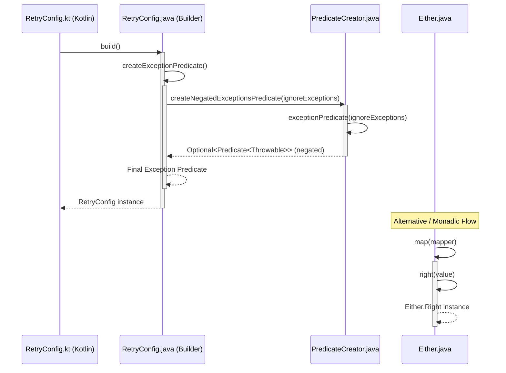
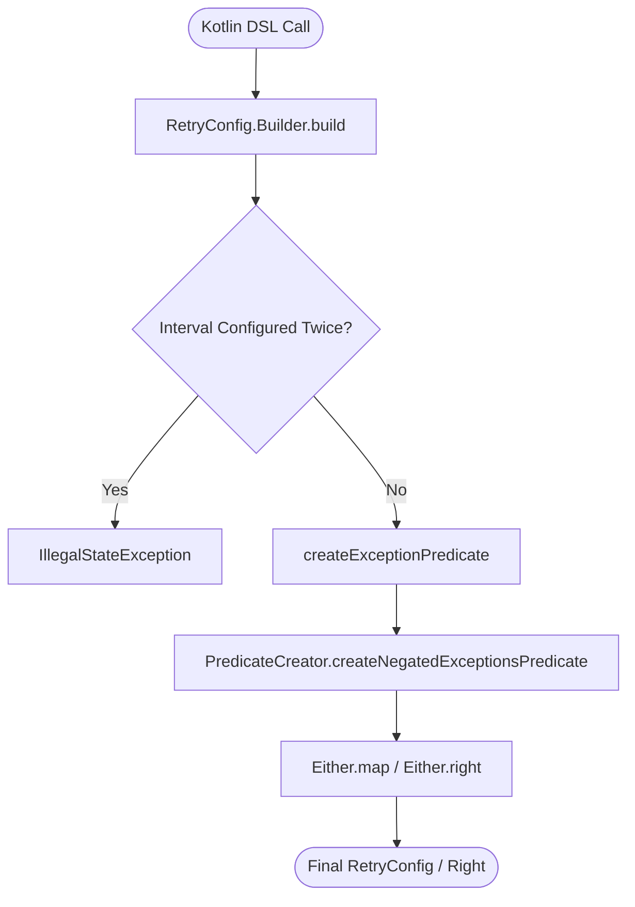

# Retry Configuration Creation

Relevant source files

The following files were used as context for generating this wiki page:

- [resilience4j-kotlin/src/main/kotlin/io/github/resilience4j/kotlin/retry/RetryConfig.kt](https://github.com/resilience4j/resilience4j/blob/main/resilience4j-kotlin/src/main/kotlin/io/github/resilience4j/kotlin/retry/RetryConfig.kt)
- [resilience4j-retry/src/main/java/io/github/resilience4j/retry/RetryConfig.java](https://github.com/resilience4j/resilience4j/blob/main/resilience4j-retry/src/main/java/io/github/resilience4j/retry/RetryConfig.java)
- [resilience4j-core/src/main/java/io/github/resilience4j/core/predicate/PredicateCreator.java](https://github.com/resilience4j/resilience4j/blob/main/resilience4j-core/src/main/java/io/github/resilience4j/core/predicate/PredicateCreator.java)
- [resilience4j-core/src/main/java/io/github/resilience4j/core/functions/Either.java](https://github.com/resilience4j/resilience4j/blob/main/resilience4j-core/src/main/java/io/github/resilience4j/core/functions/Either.java)

## Overview

### Introduction

The execution flow from **RetryConfig** to **Right** traces the initialization of Resilience4j retry configurations—often initiated through Kotlin DSL wrappers—down to the core builder logic that constructs exception and result predicates. As part of this configuration building process, interval functions and disjunction values utilize functional components like `Either.right` to wrap or project outcomes. This page details how configuration options flow across modules to finalize a `RetryConfig` instance.

Sources: [resilience4j-kotlin/src/main/kotlin/io/github/resilience4j/kotlin/retry/RetryConfig.kt:36-40](https://github.com/resilience4j/resilience4j/blob/main/resilience4j-kotlin/src/main/kotlin/io/github/resilience4j/kotlin/retry/RetryConfig.kt#L36-L40), [resilience4j-retry/src/main/java/io/github/resilience4j/retry/RetryConfig.java:393-412](https://github.com/resilience4j/resilience4j/blob/main/resilience4j-retry/src/main/java/io/github/resilience4j/retry/RetryConfig.java#L393-L412)

---

## Step-by-Step Execution Trace

### 1. Kotlin RetryConfig DSL Entrypoint

The process begins when a Kotlin application invokes the inline `RetryConfig` builder function. This function initializes a custom `RetryConfig.Builder`, applies any user-defined lambda configurations, and invokes `.build()`.

Sources: [resilience4j-kotlin/src/main/kotlin/io/github/resilience4j/kotlin/retry/RetryConfig.kt:36-40](https://github.com/resilience4j/resilience4j/blob/main/resilience4j-kotlin/src/main/kotlin/io/github/resilience4j/kotlin/retry/RetryConfig.kt#L36-L40)

### 2. Java Builder Build Phase

Control transfers to `RetryConfig.Builder.build()` in the `resilience4j-retry` module. This method validates the interval functions, copies over configured retry attempts, exception types, and invokes helper methods to assemble predicates and interval strategies.

Sources: [resilience4j-retry/src/main/java/io/github/resilience4j/retry/RetryConfig.java:393-412](https://github.com/resilience4j/resilience4j/blob/main/resilience4j-retry/src/main/java/io/github/resilience4j/retry/RetryConfig.java#L393-L412)

### 3. Creating the Exception Predicate

During the build process, `createExceptionPredicate()` compiles the final exception-handling criteria. It combines user-specified retry exception rules with negated ignore exception rules created via core utilities.

Sources: [resilience4j-retry/src/main/java/io/github/resilience4j/retry/RetryConfig.java:422-426](https://github.com/resilience4j/resilience4j/blob/main/resilience4j-retry/src/main/java/io/github/resilience4j/retry/RetryConfig.java#L422-L426)

### 4. Creating Negated Exceptions Predicate

`PredicateCreator.createNegatedExceptionsPredicate` takes any ignored exception classes, builds a combined matcher predicate for them, and negates the resulting predicate so that ignored exceptions are successfully filtered out during evaluation.

Sources: [resilience4j-core/src/main/java/io/github/resilience4j/core/predicate/PredicateCreator.java:27-32](https://github.com/resilience4j/resilience4j/blob/main/resilience4j-core/src/main/java/io/github/resilience4j/core/predicate/PredicateCreator.java#L27-L32)

### 5. Building the Base Exception Predicate

`PredicateCreator.exceptionPredicate` streams the configured exception classes, filters distinct entries, maps each class into an assignability check predicate, and reduces them using disjunction (`Predicate::or`).

Sources: [resilience4j-core/src/main/java/io/github/resilience4j/core/predicate/PredicateCreator.java:34-40](https://github.com/resilience4j/core/predicate/PredicateCreator.java#L34-L40)

### 6. Mapping Either Disjunctions

In operations involving the `Either` monad (such as interval bi-functions or result/exception projections), `Either.map` evaluates projected values. If the instance represents a right-side value, it transforms the right value using the provided mapper function.

Sources: [resilience4j-core/src/main/java/io/github/resilience4j/core/functions/Either.java:133-141](https://github.com/resilience4j/resilience4j/blob/main/resilience4j-core/src/main/java/io/github/resilience4j/core/functions/Either.java#L133-L141)

### 7. Constructing the Right Instance

Finally, `Either.right` wraps successful outcomes or right-side projections into an explicit `Either.Right` container instance, concluding the transformation pipeline.

Sources: [resilience4j-core/src/main/java/io/github/resilience4j/core/functions/Either.java:41-44](https://github.com/resilience4j/resilience4j/blob/main/resilience4j-core/src/main/java/io/github/resilience4j/core/functions/Either.java#L41-L44)

---

## Architectural Diagrams

### Sequence Diagram

Sources: [resilience4j-kotlin/src/main/kotlin/io/github/resilience4j/kotlin/retry/RetryConfig.kt:36-40](https://github.com/resilience4j/resilience4j/blob/main/resilience4j-kotlin/src/main/kotlin/io/github/resilience4j/kotlin/retry/RetryConfig.kt#L36-L40), [resilience4j-retry/src/main/java/io/github/resilience4j/retry/RetryConfig.java:393-412](https://github.com/resilience4j/resilience4j/blob/main/resilience4j-retry/src/main/java/io/github/resilience4j/retry/RetryConfig.java#L393-L412), [resilience4j-core/src/main/java/io/github/resilience4j/core/predicate/PredicateCreator.java:27-32](https://github.com/resilience4j/resilience4j/blob/main/resilience4j-core/src/main/java/io/github/resilience4j/core/predicate/PredicateCreator.java#L27-L32), [resilience4j-core/src/main/java/io/github/resilience4j/core/functions/Either.java:41-44](https://github.com/resilience4j/resilience4j/blob/main/resilience4j-core/src/main/java/io/github/resilience4j/core/functions/Either.java#L41-L44)

### Flowchart

Sources: [resilience4j-kotlin/src/main/kotlin/io/github/resilience4j/kotlin/retry/RetryConfig.kt:36-40](https://github.com/resilience4j/resilience4j/blob/main/resilience4j-kotlin/src/main/kotlin/io/github/resilience4j/kotlin/retry/RetryConfig.kt#L36-L40), [resilience4j-retry/src/main/java/io/github/resilience4j/retry/RetryConfig.java:393-412](https://github.com/resilience4j/resilience4j/blob/main/resilience4j-retry/src/main/java/io/github/resilience4j/retry/RetryConfig.java#L393-L412), [resilience4j-core/src/main/java/io/github/resilience4j/core/predicate/PredicateCreator.java:27-32](https://github.com/resilience4j/resilience4j/blob/main/resilience4j-core/src/main/java/io/github/resilience4j/core/predicate/PredicateCreator.java#L27-L32), [resilience4j-core/src/main/java/io/github/resilience4j/core/functions/Either.java:133-141](https://github.com/resilience4j/resilience4j/blob/main/resilience4j-core/src/main/java/io/github/resilience4j/core/functions/Either.java#L133-L141)

---

## Key Observations

- **Cross-Module Boundaries:** The flow bridges Kotlin-specific extension functions (`resilience4j-kotlin`), Java builder configuration logic (`resilience4j-retry`), and core predicates/functional monads (`resilience4j-core`).
- **Fail-Fast Validation:** During `RetryConfig.Builder.build()`, conflicting configurations (such as defining both `intervalFunction` and `intervalBiFunction`) immediately throw an `IllegalStateException`.
- **Predicate Composition:** Exception handling leverages functional composition (`.and(...)`, `.or(...)`, and `.negate()`) to cleanly separate recorded failures from ignored exceptions.

Sources: [resilience4j-retry/src/main/java/io/github/resilience4j/retry/RetryConfig.java:393-412](https://github.com/resilience4j/resilience4j/blob/main/resilience4j-retry/src/main/java/io/github/resilience4j/retry/RetryConfig.java#L393-L412), [resilience4j-core/src/main/java/io/github/resilience4j/core/predicate/PredicateCreator.java:13-32](https://github.com/resilience4j/resilience4j/blob/main/resilience4j-core/src/main/java/io/github/resilience4j/core/predicate/PredicateCreator.java#L13-L32)
