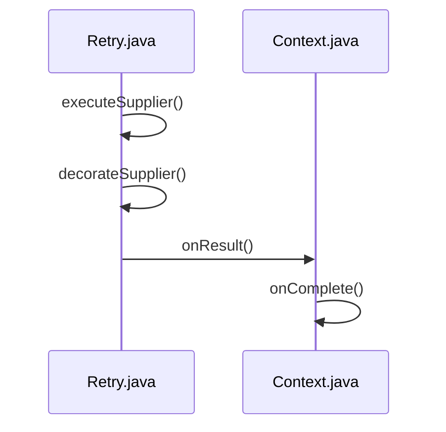
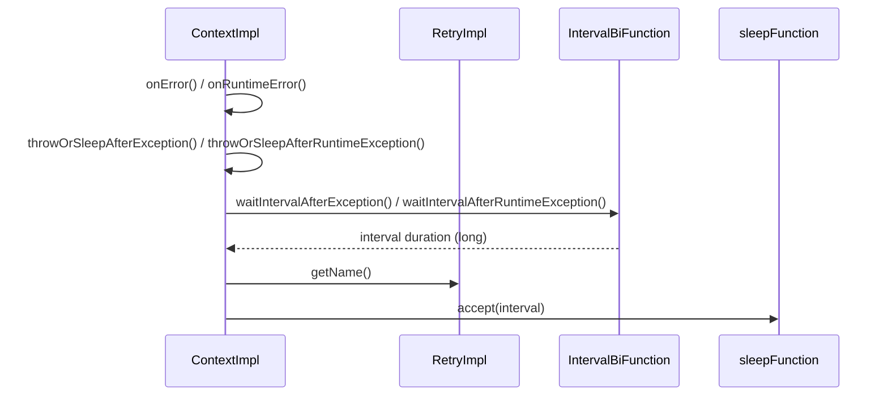

# Retry Mechanism

<details>
<summary>Relevant source files</summary>

The following files were used as context for generating this wiki page:

- [resilience4j-retry/src/main/java/io/github/resilience4j/retry/internal/RetryImpl.java](https://github.com/resilience4j/resilience4j/blob/main/resilience4j-retry/src/main/java/io/github/resilience4j/retry/internal/RetryImpl.java)
- [resilience4j-retry/src/main/java/io/github/resilience4j/retry/Retry.java](https://github.com/resilience4j/resilience4j/blob/main/resilience4j-retry/src/main/java/io/github/resilience4j/retry/Retry.java)
- [resilience4j-spring6/src/main/java/io/github/resilience4j/spring6/retry/configure/RetryAspect.java](https://github.com/resilience4j/resilience4j/blob/main/resilience4j-spring6/src/main/java/io/github/resilience4j/spring6/retry/configure/RetryAspect.java)
- [resilience4j-circuitbreaker/src/main/java/io/github/resilience4j/circuitbreaker/internal/CircuitBreakerStateMachine.java](https://github.com/resilience4j/resilience4j/blob/main/resilience4j-circuitbreaker/src/main/java/io/github/resilience4j/circuitbreaker/internal/CircuitBreakerStateMachine.java)
- [resilience4j-retry/src/main/java/io/github/resilience4j/retry/RetryRegistry.java](https://github.com/resilience4j/resilience4j/blob/main/resilience4j-retry/src/main/java/io/github/resilience4j/retry/RetryRegistry.java)
- [README.adoc](https://github.com/resilience4j/resilience4j/blob/main/README.adoc)
- [resilience4j-micronaut/src/main/java/io/github/resilience4j/micronaut/retry/RetryInterceptor.java](https://github.com/resilience4j/micronaut/blob/main/resilience4j-micronaut/src/main/java/io/github/resilience4j/micronaut/retry/RetryInterceptor.java)
- [resilience4j-kotlin/src/main/kotlin/io/github/resilience4j/kotlin/circuitbreaker/CircuitBreaker.kt](https://github.com/resilience4j/resilience4j/blob/main/resilience4j-kotlin/src/main/kotlin/io/github/resilience4j/kotlin/circuitbreaker/CircuitBreaker.kt)
- [resilience4j-rxjava3/src/main/java/io/github/resilience4j/rxjava3/retry/transformer/RetryTransformer.java](https://github.com/resilience4j/resilience4j/blob/main/resilience4j-rxjava3/src/main/java/io/github/resilience4j/rxjava3/retry/transformer/RetryTransformer.java)
- [resilience4j-spring-boot4/src/main/java/io/github/resilience4j/springboot/retry/autoconfigure/RetryAutoConfiguration.java](https://github.com/resilience4j/resilience4j/blob/main/resilience4j-spring-boot4/src/main/java/io/github/resilience4j/springboot/retry/autoconfigure/RetryAutoConfiguration.java)
- [resilience4j-vavr/src/main/java/io/github/resilience4j/retry/VavrRetry.java](https://github.com/resilience4j/resilience4j/blob/main/resilience4j-vavr/src/main/java/io/github/resilience4j/retry/VavrRetry.java)
- [resilience4j-rxjava2/src/main/java/io/github/resilience4j/retry/transformer/RetryTransformer.java](https://github.com/resilience4j/resilience4j/blob/main/resilience4j-rxjava2/src/main/java/io/github/resilience4j/retry/transformer/RetryTransformer.java)
- [resilience4j-reactor/src/main/java/io/github/resilience4j/reactor/retry/RetryOperator.java](https://github.com/resilience4j/resilience4j/blob/main/resilience4j-reactor/src/main/java/io/github/resilience4j/reactor/retry/RetryOperator.java)
- [resilience4j-all/src/main/java/io/github/resilience4j/decorators/Decorators.java](https://github.com/resilience4j/resilience4j/blob/main/resilience4j-all/src/main/java/io/github/resilience4j/decorators/Decorators.java)
- [resilience4j-kotlin/src/main/kotlin/io/github/resilience4j/kotlin/retry/Retry.kt](https://github.com/resilience4j/kotlin/src/main/kotlin/io/github/resilience4j/kotlin/retry/Retry.kt)
- [resilience4j-spring6/src/main/java/io/github/resilience4j/spring6/retry/configure/RxJava3RetryAspectExt.java](https://github.com/resilience4j/spring6/blob/main/resilience4j-spring6/src/main/java/io/github/resilience4j/spring6/retry/configure/RxJava3RetryAspectExt.java)
- [resilience4j-hedge/src/main/java/io/github/resilience4j/hedge/internal/HedgeImpl.java](https://github.com/resilience4j/resilience4j/blob/main/resilience4j-hedge/src/main/java/io/github/resilience4j/hedge/internal/HedgeImpl.java)
- [resilience4j-kotlin/src/main/kotlin/io/github/resilience4j/kotlin/retry/FlowRetry.kt](https://github.com/resilience4j/kotlin/src/main/kotlin/io/github/resilience4j/kotlin/retry/FlowRetry.kt)
- [resilience4j-spring6/src/main/java/io/github/resilience4j/spring6/retry/configure/RxJava2RetryAspectExt.java](https://github.com/resilience4j/spring6/blob/main/resilience4j-spring6/src/main/java/io/github/resilience4j/spring6/retry/configure/RxJava2RetryAspectExt.java)
- [resilience4j-spring6/src/main/java/io/github/resilience4j/spring6/retry/configure/ReactorRetryAspectExt.java](https://github.com/resilience4j/spring6/blob/main/resilience4j-spring6/src/main/java/io/github/resilience4j/spring6/retry/configure/ReactorRetryAspectExt.java)
- [resilience4j-retry/src/main/java/io/github/resilience4j/retry/RetryConfig.java](https://github.com/resilience4j/retry/RetryConfig.java)
</details>

## Overview

The retry mechanism in Resilience4j provides fault tolerance by automatically re-executing failed operations or calls that return unsatisfactory results, addressing transient faults that may self-correct after a short delay. Designed around functional programming principles, the core API offers thread-safe execution decorators, registries, and dynamic contexts that wrap standard functional interfaces, lambdas, and method references. The engine coordinates retry iterations, calculates backoff intervals, and manages stateful attempts for both synchronous and asynchronous operations. Furthermore, Resilience4j integrates seamlessly with reactive programming models, coroutines, and declarative framework annotations via AOP interceptors and auto-configurations.

Sources: [resilience4j-retry/src/main/java/io/github/resilience4j/retry/Retry.java#L37-L39](https://github.com/resilience4j/resilience4j/blob/main/resilience4j-retry/src/main/java/io/github/resilience4j/retry/Retry.java#L37-L39), [README.adoc#L32-L36](https://github.com/resilience4j/resilience4j/blob/main/README.adoc#L32-L36), [README.adoc#L340-L342](https://github.com/resilience4j/resilience4j/blob/main/README.adoc#L340-L342)

## Core API and Execution Decorators

### Overview

The `Retry` interface acts as the central public contract for creating and managing thread-safe retry instances capable of decorating various functional programming types. Higher-order execution wrapping is supported for standard Java functional interfaces, Vavr control structures, and Kotlin coroutines through distinct extension packages.

Sources: [resilience4j-retry/src/main/java/io/github/resilience4j/retry/Retry.java#L37-L39](https://github.com/resilience4j/resilience4j/blob/main/resilience4j-retry/src/main/java/io/github/resilience4j/retry/Retry.java#L37-L39), [resilience4j-vavr/src/main/java/io/github/resilience4j/retry/VavrRetry.java#L29-L29](https://github.com/resilience4j/resilience4j/blob/main/resilience4j-vavr/src/main/java/io/github/resilience4j/retry/VavrRetry.java#L29-L29), [resilience4j-kotlin/src/main/kotlin/io/github/resilience4j/kotlin/retry/Retry.kt#L29-L51](https://github.com/resilience4j/resilience4j/blob/main/resilience4j-kotlin/src/main/kotlin/io/github/resilience4j/kotlin/retry/Retry.kt#L29-L51)

### Execution Flow and Call Chain

The execution of a decorated operation processes through a specific sequence of internal handler calls. For a synchronous supplier execution via `executeSupplier`, the invocation flows through `executeSupplier` → `decorateSupplier` → `onResult` → `onComplete`.



1. `executeSupplier` invokes the decorated supplier wrapper.
Sources: [resilience4j-retry/src/main/java/io/github/resilience4j/retry/Retry.java#L521-L523](https://github.com/resilience4j/resilience4j/blob/main/resilience4j-retry/src/main/java/io/github/resilience4j/retry/Retry.java#L521-L523)
2. `decorateSupplier` sets up the `do-while` retry loop, fetching the result from the underlying supplier.
Sources: [resilience4j-retry/src/main/java/io/github/resilience4j/retry/Retry.java#L296-L312](https://github.com/resilience4j/resilience4j/blob/main/resilience4j-retry/src/main/java/io/github/resilience4j/retry/Retry.java#L296-L312)
3. `onResult` validates the returned result against configured predicates to determine if another attempt is required.
Sources: [resilience4j-retry/src/main/java/io/github/resilience4j/retry/Retry.java#L302-L303](https://github.com/resilience4j/resilience4j/blob/main/resilience4j-retry/src/main/java/io/github/resilience4j/retry/Retry.java#L302-L303), [resilience4j-retry/src/main/java/io/github/resilience4j/retry/Retry.java#L652-L655](https://github.com/resilience4j/resilience4j/blob/main/resilience4j-retry/src/main/java/io/github/resilience4j/retry/Retry.java#L652-L655)
4. `onComplete` records a successful call and triggers generated retry events once validation passes without requiring further retries.
Sources: [resilience4j-retry/src/main/java/io/github/resilience4j/retry/Retry.java#L304-L305](https://github.com/resilience4j/resilience4j/blob/main/resilience4j-retry/src/main/java/io/github/resilience4j/retry/Retry.java#L304-L305), [resilience4j-retry/src/main/java/io/github/resilience4j/retry/Retry.java#L643-L649](https://github.com/resilience4j/resilience4j/blob/main/resilience4j-retry/src/main/java/io/github/resilience4j/retry/Retry.java#L643-L649)

> [!NOTE]
> Asynchronous completion stage handling wraps executions in an `AsyncRetryBlock` implementing `Runnable`, scheduling subsequent attempts on a `ScheduledExecutorService` based on delay values returned by `AsyncContext`.
> Sources: [resilience4j-retry/src/main/java/io/github/resilience4j/retry/Retry.java#L112-L121](https://github.com/resilience4j/resilience4j/blob/main/resilience4j-retry/src/main/java/io/github/resilience4j/retry/Retry.java#L112-L121), [resilience4j-retry/src/main/java/io/github/resilience4j/retry/Retry.java#L692-L756](https://github.com/resilience4j/resilience4j/blob/main/resilience4j-retry/src/main/java/io/github/resilience4j/retry/Retry.java#L692-L756)

### Functional Decorators and Signatures

The `Retry` interface provides static factory and default methods to decorate standard Java functional types. Additional decorators exist for Vavr constructs and fluent composition builders.

| Decorator Method | Input Type | Return Type | Source File & Line Range |
| :--- | :--- | :--- | :--- |
| `decorateSupplier` | `Supplier<T>` | `Supplier<T>` | [resilience4j-retry/src/main/java/io/github/resilience4j/retry/Retry.java#L296-L312](https://github.com/resilience4j/resilience4j/blob/main/resilience4j-retry/src/main/java/io/github/resilience4j/retry/Retry.java#L296-L312) |
| `decorateCheckedSupplier` | `CheckedSupplier<T>` | `CheckedSupplier<T>` | [resilience4j-retry/src/main/java/io/github/resilience4j/retry/Retry.java#L146-L163](https://github.com/resilience4j/resilience4j/blob/main/resilience4j-retry/src/main/java/io/github/resilience4j/retry/Retry.java#L146-L163) |
| `decorateCallable` | `Callable<T>` | `Callable<T>` | [resilience4j-retry/src/main/java/io/github/resilience4j/retry/Retry.java#L333-L349](https://github.com/resilience4j/resilience4j/blob/main/resilience4j-retry/src/main/java/io/github/resilience4j/retry/Retry.java#L333-L349) |
| `decorateRunnable` | `Runnable` | `Runnable` | [resilience4j-retry/src/main/java/io/github/resilience4j/retry/Retry.java#L370-L386](https://github.com/resilience4j/resilience4j/blob/main/resilience4j-retry/src/main/java/io/github/resilience4j/retry/Retry.java#L370-L386) |
| `decorateFunction` | `Function<T, R>` | `Function<T, R>` | [resilience4j-retry/src/main/java/io/github/resilience4j/retry/Retry.java#L407-L423](https://github.com/resilience4j/resilience4j/blob/main/resilience4j-retry/src/main/java/io/github/resilience4j/retry/Retry.java#L407-L423) |
| `decorateConsumer` | `Consumer<T>` | `Consumer<T>` | [resilience4j-retry/src/main/java/io/github/resilience4j/retry/Retry.java#L433-L449](https://github.com/resilience4j/resilience4j/blob/main/resilience4j-retry/src/main/java/io/github/resilience4j/retry/Retry.java#L433-L449) |
| `decorateEitherSupplier` | `Supplier<Either<E, T>>` | `Supplier<Either<E, T>>` | [resilience4j-vavr/src/main/java/io/github/resilience4j/retry/VavrRetry.java#L115-L137](https://github.com/resilience4j/resilience4j/blob/main/resilience4j-vavr/src/main/java/io/github/resilience4j/retry/VavrRetry.java#L115-L137) |
| `decorateTrySupplier` | `Supplier<Try<T>>` | `Supplier<Try<T>>` | [resilience4j-vavr/src/main/java/io/github/resilience4j/retry/VavrRetry.java#L147-L172](https://github.com/resilience4j/resilience4j/blob/main/resilience4j-vavr/src/main/java/io/github/resilience4j/retry/VavrRetry.java#L147-L172) |

Sources: [resilience4j-retry/src/main/java/io/github/resilience4j/retry/Retry.java#L146-L450](https://github.com/resilience4j/resilience4j/blob/main/resilience4j-retry/src/main/java/io/github/resilience4j/retry/Retry.java#L146-L450), [resilience4j-vavr/src/main/java/io/github/resilience4j/retry/VavrRetry.java#L38-L172](https://github.com/resilience4j/resilience4j/blob/main/resilience4j-vavr/src/main/java/io/github/resilience4j/retry/VavrRetry.java#L38-L172)

### Design Trade-offs

| Design Choice | Benefit | Cost |
| :--- | :--- | :--- |
| Dynamic Context Allocation (`retry.context()`) | Enables stateful tracking per execution thread safely across concurrent calls | Requires allocating a new context instance per decorated invocation loop |
| Separate Checked and Runtime Decorator Methods | Avoids checked exception boilerplate on standard Java functional interfaces | Duplicates execution wrapper logic across checked and unchecked variants |
| Explicit Asynchronous Completion Stage Blocks | Integrates non-blocking completion stages with `ScheduledExecutorService` backoff delays | Adds internal callback chaining overhead via `AsyncRetryBlock` |

Sources: [resilience4j-retry/src/main/java/io/github/resilience4j/retry/Retry.java#L112-L162](https://github.com/resilience4j/resilience4j/blob/main/resilience4j-retry/src/main/java/io/github/resilience4j/retry/Retry.java#L112-L162), [resilience4j-retry/src/main/java/io/github/resilience4j/retry/Retry.java#L296-L312](https://github.com/resilience4j/resilience4j/blob/main/resilience4j-retry/src/main/java/io/github/resilience4j/retry/Retry.java#L296-L312)

### Fluent Decorators API Usage

The `Decorators` utility class allows chaining multiple resilience patterns around an operation using a builder syntax.

```java
Supplier<String> supplier = Decorators
    .ofSupplier(() -> remoteService.call())
    .withRetry(Retry.ofDefaults("backendId"))
    .decorate();

String result = supplier.get();
```

Sources: [resilience4j-all/src/main/java/io/github/resilience4j/decorators/Decorators.java#L45-L48](https://github.com/resilience4j/resilience4j/blob/main/resilience4j-all/src/main/java/io/github/resilience4j/decorators/Decorators.java#L45-L48), [resilience4j-all/src/main/java/io/github/resilience4j/decorators/Decorators.java#L104-L107](https://github.com/resilience4j/resilience4j/blob/main/resilience4j-all/src/main/java/io/github/resilience4j/decorators/Decorators.java#L104-L107)

## Internal Engine and Failure Execution

### Overview

The core internal retry engine is managed by `RetryImpl`, which implements the `Retry` interface and maintains runtime state and metrics via its inner classes `ContextImpl`, `AsyncContextImpl`, and `RetryMetrics`. When executing synchronous or asynchronous operations, the engine tracks attempt counts, evaluates exception and result predicates, calculates backoff intervals, and publishes lifecycle events.

Sources: [resilience4j-retry/src/main/java/io/github/resilience4j/retry/internal/RetryImpl.java#L46-L145](https://github.com/resilience4j/resilience4j/blob/main/resilience4j-retry/src/main/java/io/github/resilience4j/retry/internal/RetryImpl.java#L46-L145)

### Synchronous Execution Call-Chain Walkthroughs

The synchronous execution engine delegates checked and runtime exceptions through dedicated call chains. 

1. `onError` — invoked when a checked exception occurs, incrementing total attempts and testing the exception predicate.
Sources: [resilience4j-retry/src/main/java/io/github/resilience4j/retry/internal/RetryImpl.java#L206-L216](https://github.com/resilience4j/resilience4j/blob/main/resilience4j-retry/src/main/java/io/github/resilience4j/retry/internal/RetryImpl.java#L206-L216)
2. `throwOrSleepAfterException` — increments the attempt counter and checks if `maxAttempts` has been reached, publishing error events or proceeding to sleep.
Sources: [resilience4j-retry/src/main/java/io/github/resilience4j/retry/internal/RetryImpl.java#L231-L242](https://github.com/resilience4j/resilience4j/blob/main/resilience4j-retry/src/main/java/io/github/resilience4j/retry/internal/RetryImpl.java#L231-L242)
3. `waitIntervalAfterException` — calculates the backoff interval using `intervalBiFunction`, publishes retry events, and passes the duration to `sleepFunction.accept(interval)`.
Sources: [resilience4j-retry/src/main/java/io/github/resilience4j/retry/internal/RetryImpl.java#L257-L275](https://github.com/resilience4j/resilience4j/blob/main/resilience4j-retry/src/main/java/io/github/resilience4j/retry/internal/RetryImpl.java#L257-L275)
4. `getName` — retrieves the instance name for event publishing and error reporting context.
Sources: [resilience4j-retry/src/main/java/io/github/resilience4j/retry/internal/RetryImpl.java#L101-L105](https://github.com/resilience4j/resilience4j/blob/main/resilience4j-retry/src/main/java/io/github/resilience4j/retry/internal/RetryImpl.java#L101-L105)

1. `onRuntimeError` — handles runtime exceptions by updating counters and evaluating the exception predicate.
Sources: [resilience4j-retry/src/main/java/io/github/resilience4j/retry/internal/RetryImpl.java#L217-L229](https://github.com/resilience4j/resilience4j/blob/main/resilience4j-retry/src/main/java/io/github/resilience4j/retry/internal/RetryImpl.java#L217-L229)
2. `throwOrSleepAfterRuntimeException` — increments attempts and triggers maximum retry failure handling if limits are exceeded.
Sources: [resilience4j-retry/src/main/java/io/github/resilience4j/retry/internal/RetryImpl.java#L243-L255](https://github.com/resilience4j/resilience4j/blob/main/resilience4j-retry/src/main/java/io/github/resilience4j/retry/internal/RetryImpl.java#L243-L255)
3. `waitIntervalAfterRuntimeException` — computes the backoff delay via `intervalBiFunction`, executes the sleep consumer, and handles thread interruption or execution errors.
Sources: [resilience4j-retry/src/main/java/io/github/resilience4j/retry/internal/RetryImpl.java#L276-L306](https://github.com/resilience4j/resilience4j/blob/main/resilience4j-retry/src/main/java/io/github/resilience4j/retry/internal/RetryImpl.java#L276-L306)
4. `getName` — queries the retry instance identifier.
Sources: [resilience4j-retry/src/main/java/io/github/resilience4j/retry/internal/RetryImpl.java#L101-L105](https://github.com/resilience4j/resilience4j/blob/main/resilience4j-retry/src/main/java/io/github/resilience4j/retry/internal/RetryImpl.java#L101-L105)



Sources: [resilience4j-retry/src/main/java/io/github/resilience4j/retry/internal/RetryImpl.java#L101-L105](https://github.com/resilience4j/resilience4j/blob/main/resilience4j-retry/src/main/java/io/github/resilience4j/retry/internal/RetryImpl.java#L101-L105), [resilience4j-retry/src/main/java/io/github/resilience4j/retry/internal/RetryImpl.java#L206-L306](https://github.com/resilience4j/resilience4j/blob/main/resilience4j-retry/src/main/java/io/github/resilience4j/retry/internal/RetryImpl.java#L206-L306)

### Internal Engine Components and Metrics

The engine maintains atomic counters and references to record execution outcomes and aggregate metrics.

| Component Field | Type | Purpose | Source File & Line Range |
| :--- | :--- | :--- | :--- |
| `sleepFunction` | `CheckedConsumer<Long>` | Configurable static consumer representing the thread sleep mechanism (`Thread::sleep`) | [resilience4j-retry/src/main/java/io/github/resilience4j/retry/internal/RetryImpl.java#L49-L49](https://github.com/resilience4j/resilience4j/blob/main/resilience4j-retry/src/main/java/io/github/resilience4j/retry/internal/RetryImpl.java#L49-L49) |
| `numOfAttempts` | `AtomicInteger` | Tracks current attempt count within `ContextImpl` and `AsyncContextImpl` | [resilience4j-retry/src/main/java/io/github/resilience4j/retry/internal/RetryImpl.java#L149-L149](https://github.com/resilience4j/resilience4j/blob/main/resilience4j-retry/src/main/java/io/github/resilience4j/retry/internal/RetryImpl.java#L149-L149) |
| `lastException` | `AtomicReference<Exception>` | Stores the most recent checked exception encountered during execution | [resilience4j-retry/src/main/java/io/github/resilience4j/retry/internal/RetryImpl.java#L150-L150](https://github.com/resilience4j/resilience4j/blob/main/resilience4j-retry/src/main/java/io/github/resilience4j/retry/internal/RetryImpl.java#L150-L150) |
| `lastRuntimeException` | `AtomicReference<RuntimeException>` | Stores the most recent runtime exception encountered during execution | [resilience4j-retry/src/main/java/io/github/resilience4j/retry/internal/RetryImpl.java#L151-L151](https://github.com/resilience4j/resilience4j/blob/main/resilience4j-retry/src/main/java/io/github/resilience4j/retry/internal/RetryImpl.java#L151-L151) |
| `succeededAfterRetryCounter` | `LongAdder` | Counts successful calls that required one or more retries | [resilience4j-retry/src/main/java/io/github/resilience4j/retry/internal/RetryImpl.java#L88-L88](https://github.com/resilience4j/resilience4j/blob/main/resilience4j-retry/src/main/java/io/github/resilience4j/retry/internal/RetryImpl.java#L88-L88) |
| `failedAfterRetryCounter` | `LongAdder` | Counts failed calls that exhausted all permitted retry attempts | [resilience4j-retry/src/main/java/io/github/resilience4j/retry/internal/RetryImpl.java#L89-L89](https://github.com/resilience4j/resilience4j/blob/main/resilience4j-retry/src/main/java/io/github/resilience4j/retry/internal/RetryImpl.java#L89-L89) |
| `succeededWithoutRetryCounter` | `LongAdder` | Counts successful calls on the initial attempt | [resilience4j-retry/src/main/java/io/github/resilience4j/retry/internal/RetryImpl.java#L90-L90](https://github.com/resilience4j/resilience4j/blob/main/resilience4j-retry/src/main/java/io/github/resilience4j/retry/internal/RetryImpl.java#L90-L90) |
| `failedWithoutRetryCounter` | `LongAdder` | Counts failed calls that were ignored or failed immediately without retrying | [resilience4j-retry/src/main/java/io/github/resilience4j/retry/internal/RetryImpl.java#L91-L91](https://github.com/resilience4j/resilience4j/blob/main/resilience4j-retry/src/main/java/io/github/resilience4j/retry/internal/RetryImpl.java#L91-L91) |
| `totalAttemptsCounter` | `LongAdder` | Tracks total execution attempts across all calls | [resilience4j-retry/src/main/java/io/github/resilience4j/retry/internal/RetryImpl.java#L92-L92](https://github.com/resilience4j/resilience4j/blob/main/resilience4j-retry/src/main/java/io/github/resilience4j/retry/internal/RetryImpl.java#L92-L92) |

Sources: [resilience4j-retry/src/main/java/io/github/resilience4j/retry/internal/RetryImpl.java#L46-L93](https://github.com/resilience4j/resilience4j/blob/main/resilience4j-retry/src/main/java/io/github/resilience4j/retry/internal/RetryImpl.java#L46-L93), [resilience4j-retry/src/main/java/io/github/resilience4j/retry/internal/RetryImpl.java#L147-L152](https://github.com/resilience4j/resilience4j/blob/main/resilience4j-retry/src/main/java/io/github/resilience4j/retry/internal/RetryImpl.java#L147-L152), [resilience4j-retry/src/main/java/io/github/resilience4j/retry/internal/RetryImpl.java#L311-L315](https://github.com/resilience4j/resilience4j/blob/main/resilience4j-retry/src/main/java/io/github/resilience4j/retry/internal/RetryImpl.java#L311-L315)

> [!WARNING]
> When a thread is interrupted during the `waitIntervalAfterRuntimeException` sleep phase, the engine catches `InterruptedException`, reasserts the interrupt flag via `Thread.currentThread().interrupt()`, and either rethrows the stored runtime exception or wraps the interruption in a `CancellationException`.
> Sources: [resilience4j-retry/src/main/java/io/github/resilience4j/retry/internal/RetryImpl.java#L287-L299](https://github.com/resilience4j/resilience4j/blob/main/resilience4j-retry/src/main/java/io/github/resilience4j/retry/internal/RetryImpl.java#L287-L299)

## Configuration and Exception Predicate Rules

### Overview

The `RetryConfig` class governs retry parameter specifications, defining constants such as `DEFAULT_MAX_ATTEMPTS` (set to `3`) and `DEFAULT_WAIT_DURATION` (set to `500` milliseconds). It provides configuration hooks for backoff timing, failure exception predicates, and result evaluation predicates via its builder.

Sources: [resilience4j-retry/src/main/java/io/github/resilience4j/retry/RetryConfig.java#L39-L68](https://github.com/resilience4j/resilience4j/blob/main/resilience4j-retry/src/main/java/io/github/resilience4j/retry/RetryConfig.java#L39-L68)

### Configuration Properties and Defaults

| Parameter Field | Type | Default Value | Purpose | Source File & Line Range |
| :--- | :--- | :--- | :--- | :--- |
| `maxAttempts` | `int` | `3` (`DEFAULT_MAX_ATTEMPTS`) | Maximum allowed execution attempts before failing | [resilience4j-retry/src/main/java/io/github/resilience4j/retry/RetryConfig.java#L40-L60](https://github.com/resilience4j/resilience4j/blob/main/resilience4j-retry/src/main/java/io/github/resilience4j/retry/RetryConfig.java#L40-L60) |
| `waitDuration` | `long` | `500` (`DEFAULT_WAIT_DURATION`) | Default wait duration in milliseconds between attempts | [resilience4j-retry/src/main/java/io/github/resilience4j/retry/RetryConfig.java#L39-L41](https://github.com/resilience4j/resilience4j/blob/main/resilience4j-retry/src/main/java/io/github/resilience4j/retry/RetryConfig.java#L39-L41) |
| `failAfterMaxAttempts` | `boolean` | `false` | Determines if an exception should be thrown after max attempts with no satisfactory result | [resilience4j-retry/src/main/java/io/github/resilience4j/retry/RetryConfig.java#L61-L61](https://github.com/resilience4j/resilience4j/blob/main/resilience4j-retry/src/main/java/io/github/resilience4j/retry/RetryConfig.java#L61-L61) |
| `writableStackTraceEnabled` | `boolean` | `true` | Controls whether generated `MaxRetriesExceededException` instances include stack traces | [resilience4j-retry/src/main/java/io/github/resilience4j/retry/RetryConfig.java#L62-L62](https://github.com/resilience4j/resilience4j/blob/main/resilience4j-retry/src/main/java/io/github/resilience4j/retry/RetryConfig.java#L62-L62) |
| `retryExceptions` | `Class<? extends Throwable>[]` | empty array | Specific exception classes that trigger a retry | [resilience4j-retry/src/main/java/io/github/resilience4j/retry/RetryConfig.java#L47-L47](https://github.com/resilience4j/resilience4j/blob/main/resilience4j-retry/src/main/java/io/github/resilience4j/retry/RetryConfig.java#L47-L47) |
| `ignoreExceptions` | `Class<? extends Throwable>[]` | empty array | Specific exception classes that are ignored and prevent retries | [resilience4j-retry/src/main/java/io/github/resilience4j/retry/RetryConfig.java#L49-L49](https://github.com/resilience4j/resilience4j/blob/main/resilience4j-retry/src/main/java/io/github/resilience4j/retry/RetryConfig.java#L49-L49) |

Sources: [resilience4j-retry/src/main/java/io/github/resilience4j/retry/RetryConfig.java#L39-L62](https://github.com/resilience4j/resilience4j/blob/main/resilience4j-retry/src/main/java/io/github/resilience4j/retry/RetryConfig.java#L39-L62)

> [!NOTE]
> `RetryRegistry` acts as a factory for managed `Retry` instances, supporting custom configurations via `RetryRegistry.of(RetryConfig)` and custom naming through `RetryRegistry.custom()`.
> Sources: [resilience4j-retry/src/main/java/io/github/resilience4j/retry/RetryRegistry.java#L39-L41](https://github.com/resilience4j/resilience4j/blob/main/resilience4j-retry/src/main/java/io/github/resilience4j/retry/RetryRegistry.java#L39-L41), [resilience4j-retry/src/main/java/io/github/resilience4j/retry/RetryRegistry.java#L253-L255](https://github.com/resilience4j/resilience4j/blob/main/resilience4j-retry/src/main/java/io/github/resilience4j/retry/RetryRegistry.java#L253-L255)

> [!WARNING]
> When building a custom `RetryRegistry`, attempting to add a configuration named `"default"` via `addRetryConfig("default", configuration)` throws an `IllegalArgumentException` because that identifier is reserved.
> Sources: [resilience4j-retry/src/main/java/io/github/resilience4j/retry/RetryRegistry.java#L294-L300](https://github.com/resilience4j/resilience4j/blob/main/resilience4j-retry/src/main/java/io/github/resilience4j/retry/RetryRegistry.java#L294-L300)

## Reactive Streams and Coroutine Integration

### Overview

Resilience4j provides specialized reactive operators and transformers to integrate retry mechanics into Project Reactor (`Mono` and `Flux`), RxJava (v2 and v3 types including `Flowable`, `Observable`, `Single`, `Completable`, and `Maybe`), and Kotlin Coroutines via `Flow`. Each adapter instantiates a stateful `Retry.AsyncContext` to track attempt counts, backoff intervals, and predicate evaluations across stream items and signals.

Sources: [resilience4j-rxjava3/src/main/java/io/github/resilience4j/rxjava3/retry/transformer/RetryTransformer.java#L25-L32](https://github.com/resilience4j/resilience4j/blob/main/resilience4j-rxjava3/src/main/java/io/github/resilience4j/rxjava3/retry/transformer/RetryTransformer.java#L25-L32), [resilience4j-rxjava2/src/main/java/io/github/resilience4j/retry/transformer/RetryTransformer.java#L25-L32](https://github.com/resilience4j/resilience4j/blob/main/resilience4j-rxjava2/src/main/java/io/github/resilience4j/retry/transformer/RetryTransformer.java#L25-L32), [resilience4j-reactor/src/main/java/io/github/resilience4j/reactor/retry/RetryOperator.java#L32-L38](https://github.com/resilience4j/resilience4j/blob/main/resilience4j-reactor/src/main/java/io/github/resilience4j/reactor/retry/RetryOperator.java#L32-L38), [resilience4j-kotlin/src/main/kotlin/io/github/resilience4j/kotlin/retry/FlowRetry.kt#L30-L33](https://github.com/resilience4j/resilience4j/blob/main/resilience4j-kotlin/src/main/kotlin/io/github/resilience4j/kotlin/retry/FlowRetry.kt#L30-L33)

### Reactive Operators and Adapters

| Integration Module | Class / Extension | Supported Types | Core Interception Hook | Source File & Line Range |
| :--- | :--- | :--- | :--- | :--- |
| Reactor | `RetryOperator` | `Mono`, `Flux` | `retryWhen(reactor.util.retry.Retry.withThrowable(...))` | [resilience4j-reactor/src/main/java/io/github/resilience4j/reactor/retry/RetryOperator.java#L52-L68](https://github.com/resilience4j/resilience4j/blob/main/resilience4j-reactor/src/main/java/io/github/resilience4j/reactor/retry/RetryOperator.java#L52-L68) |
| RxJava 2 & 3 | `RetryTransformer` | `Flowable`, `Observable`, `Single`, `Completable`, `Maybe` | `retryWhen(errors -> errors.flatMap(...))` | [resilience4j-rxjava3/src/main/java/io/github/resilience4j/rxjava3/retry/transformer/RetryTransformer.java#L46-L83](https://github.com/resilience4j/resilience4j/blob/main/resilience4j-rxjava3/src/main/java/io/github/resilience4j/rxjava3/retry/transformer/RetryTransformer.java#L46-L83) |
| Kotlin Coroutines | `Flow.retry(Retry)` | `Flow<T>` | `retryWhen { e, _ -> ... }` | [resilience4j-kotlin/src/main/kotlin/io/github/resilience4j/kotlin/retry/FlowRetry.kt#L30-L61](https://github.com/resilience4j/resilience4j/blob/main/resilience4j-kotlin/src/main/kotlin/io/github/resilience4j/kotlin/retry/FlowRetry.kt#L30-L61) |

Sources: [resilience4j-rxjava3/src/main/java/io/github/resilience4j/rxjava3/retry/transformer/RetryTransformer.java#L25-L83](https://github.com/resilience4j/resilience4j/blob/main/resilience4j-rxjava3/src/main/java/io/github/resilience4j/rxjava3/retry/transformer/RetryTransformer.java#L25-L83), [resilience4j-reactor/src/main/java/io/github/resilience4j/reactor/retry/RetryOperator.java#L52-L68](https://github.com/resilience4j/resilience4j/blob/main/resilience4j-reactor/src/main/java/io/github/resilience4j/reactor/retry/RetryOperator.java#L52-L68), [resilience4j-kotlin/src/main/kotlin/io/github/resilience4j/kotlin/retry/FlowRetry.kt#L30-L61](https://github.com/resilience4j/resilience4j/blob/main/resilience4j-kotlin/src/main/kotlin/io/github/resilience4j/kotlin/retry/FlowRetry.kt#L30-L61)

### Execution and Result-Based Exception Interception

When a reactive stream emits an item or encounters an error, the operator translates the outcome into wait durations using `retryContext.onResult(result)` or `retryContext.onError(throwable)`. If `onResult` evaluates to a positive wait duration, an internal runtime exception (`RetryDueToResultException`) is thrown to force a retry cycle through the error-handling operator.

Sources: [resilience4j-rxjava3/src/main/java/io/github/resilience4j/rxjava3/retry/transformer/RetryTransformer.java#L97-L121](https://github.com/resilience4j/resilience4j/blob/main/resilience4j-rxjava3/src/main/java/io/github/resilience4j/rxjava3/retry/transformer/RetryTransformer.java#L97-L121), [resilience4j-reactor/src/main/java/io/github/resilience4j/reactor/retry/RetryOperator.java#L82-L106](https://github.com/resilience4j/resilience4j/blob/main/resilience4j-reactor/src/main/java/io/github/resilience4j/reactor/retry/RetryOperator.java#L82-L106), [resilience4j-kotlin/src/main/kotlin/io/github/resilience4j/kotlin/retry/FlowRetry.kt#L34-L52](https://github.com/resilience4j/resilience4j/blob/main/resilience4j-kotlin/src/main/kotlin/io/github/resilience4j/kotlin/retry/FlowRetry.kt#L34-L52)

> [!WARNING]
> In Reactor and RxJava transformers, if an incoming `Throwable` instance is an instance of `Error` (such as `OutOfMemoryError`), it bypasses retry evaluations entirely and is immediately rethrown to prevent swallowing fatal virtual machine errors.
> Sources: [resilience4j-rxjava3/src/main/java/io/github/resilience4j/rxjava3/retry/transformer/RetryTransformer.java#L109-L112](https://github.com/resilience4j/resilience4j/blob/main/resilience4j-rxjava3/src/main/java/io/github/resilience4j/rxjava3/retry/transformer/RetryTransformer.java#L109-L112), [resilience4j-reactor/src/main/java/io/github/resilience4j/reactor/retry/RetryOperator.java#L94-L97](https://github.com/resilience4j/resilience4j/blob/main/resilience4j-reactor/src/main/java/io/github/resilience4j/reactor/retry/RetryOperator.java#L94-L97)

## Framework Interceptors and Auto Configuration

### Overview

Declarative retry capabilities in Resilience4j are exposed via framework-specific integration modules, including Spring AOP aspects and Micronaut method interceptors. These components intercept method invocations annotated with `@Retry` and route execution through a dynamically resolved `Retry` registry instance, supporting synchronous values, `CompletionStage` asynchronous flows, and reactive streams.

Sources: [resilience4j-spring6/src/main/java/io/github/resilience4j/spring6/retry/configure/RetryAspect.java#L43-L65](https://github.com/resilience4j/resilience4j/blob/main/resilience4j-spring6/src/main/java/io/github/resilience4j/spring6/retry/configure/RetryAspect.java#L43-L65), [resilience4j-micronaut/src/main/java/io/github/resilience4j/micronaut/retry/RetryInterceptor.java#L41-L43](https://github.com/resilience4j/resilience4j/blob/main/resilience4j-micronaut/src/main/java/io/github/resilience4j/micronaut/retry/RetryInterceptor.java#L41-L43)

### Aspect-Oriented Interception and Execution Flow

In Spring environments, the `RetryAspect` intercepts methods annotated with `@Retry` (or declared within an annotated class) using the pointcut expression `@within(retry) || @annotation(retry)`. 

Sources: [resilience4j-spring6/src/main/java/io/github/resilience4j/spring6/retry/configure/RetryAspect.java#L99-L101](https://github.com/resilience4j/resilience4j/blob/main/resilience4j-spring6/src/main/java/io/github/resilience4j/spring6/retry/configure/RetryAspect.java#L99-L101)

The interception walkthrough proceeds through the following internal phases:
1. `retryAroundAdvice()` extracts the target method metadata, resolves the backend name using `SpelResolver`, and retrieves or creates a `Retry` instance via `getOrCreateRetry()`.
Sources: [resilience4j-spring6/src/main/java/io/github/resilience4j/spring6/retry/configure/RetryAspect.java#L104-L116](https://github.com/resilience4j/resilience4j/blob/main/resilience4j-spring6/src/main/java/io/github/resilience4j/spring6/retry/configure/RetryAspect.java#L104-L116)
2. `fallbackExecutor.execute()` wraps the execution with fallback configuration handlers.
Sources: [resilience4j-spring6/src/main/java/io/github/resilience4j/spring6/retry/configure/RetryAspect.java#L119-L119](https://github.com/resilience4j/resilience4j/blob/main/resilience4j-spring6/src/main/java/io/github/resilience4j/spring6/retry/configure/RetryAspect.java#L119-L119)
3. `proceed()` inspects the method return type: if it assigns from `CompletionStage`, it invokes `handleJoinPointCompletableFuture()`; if extension handlers are present (`retryAspectExtList`), it delegates to matching extensions like `ReactorRetryAspectExt`, `RxJava2RetryAspectExt`, or `RxJava3RetryAspectExt`; otherwise, it falls back to `handleDefaultJoinPoint()`.
Sources: [resilience4j-spring6/src/main/java/io/github/resilience4j/spring6/retry/configure/RetryAspect.java#L122-L135](https://github.com/resilience4j/resilience4j/blob/main/resilience4j-spring6/src/main/java/io/github/resilience4j/spring6/retry/configure/RetryAspect.java#L122-L135)
4. `handleDefaultJoinPoint()` executes the underlying join point via `retry.executeCheckedSupplier(proceedingJoinPoint::proceed)`.
Sources: [resilience4j-spring6/src/main/java/io/github/resilience4j/spring6/retry/configure/RetryAspect.java#L177-L180](https://github.com/resilience4j/resilience4j/blob/main/resilience4j-spring6/src/main/java/io/github/resilience4j/spring6/retry/configure/RetryAspect.java#L177-L180)

> [!NOTE]
> When a retry aspect intercepts a target class wrapped behind an interface JDK proxy, `getRetryAnnotation()` explicitly uses `AnnotationExtractor.extractAnnotationFromProxy()` to retrieve the annotation configuration from the underlying interface.
> Sources: [resilience4j-spring6/src/main/java/io/github/resilience4j/spring6/retry/configure/RetryAspect.java#L160-L165](https://github.com/resilience4j/resilience4j/blob/main/resilience4j-spring6/src/main/java/io/github/resilience4j/spring6/retry/configure/RetryAspect.java#L160-L165)

### Reactive and Asynchronous Aspect Extensions

Framework interceptors support reactive types and completion stages by applying appropriate operators or transformers. The table below lists the reactive extensions and interceptors along with their handled types:

| Integration Module | Component Class | Supported Return Types / Publishers | Interception Mechanism | Source File & Line Range |
| :--- | :--- | :--- | :--- | :--- |
| Spring 6 | `ReactorRetryAspectExt` | `Flux`, `Mono` | `transformDeferred(RetryOperator.of(retry))` | [resilience4j-spring6/src/main/java/io/github/resilience4j/spring6/retry/configure/ReactorRetryAspectExt.java#L38-L41](https://github.com/resilience4j/resilience4j/blob/main/resilience4j-spring6/src/main/java/io/github/resilience4j/spring6/retry/configure/ReactorRetryAspectExt.java#L38-L41) |
| Spring 6 | `RxJava2RetryAspectExt` | `ObservableSource`, `SingleSource`, `CompletableSource`, `MaybeSource`, `Flowable` | `compose(RetryTransformer.of(retry))` | [resilience4j-spring6/src/main/java/io/github/resilience4j/spring6/retry/configure/RxJava2RetryAspectExt.java#L35-L37](https://github.com/resilience4j/resilience4j/blob/main/resilience4j-spring6/src/main/java/io/github/resilience4j/spring6/retry/configure/RxJava2RetryAspectExt.java#L35-L37) |
| Spring 6 | `RxJava3RetryAspectExt` | `ObservableSource`, `SingleSource`, `CompletableSource`, `MaybeSource`, `Flowable` | `compose(RetryTransformer.of(retry))` | [resilience4j-spring6/src/main/java/io/github/resilience4j/spring6/retry/configure/RxJava3RetryAspectExt.java#L20-L22](https://github.com/resilience4j/resilience4j/blob/main/resilience4j-spring6/src/main/java/io/github/resilience4j/spring6/retry/configure/RxJava3RetryAspectExt.java#L20-L22) |
| Micronaut | `RetryInterceptor` | `PUBLISHER`, `COMPLETION_STAGE`, `SYNCHRONOUS` | `InterceptedMethod` result type dispatch | [resilience4j-micronaut/src/main/java/io/github/resilience4j/micronaut/retry/RetryInterceptor.java#L97-L122](https://github.com/resilience4j/resilience4j/blob/main/resilience4j-micronaut/src/main/java/io/github/resilience4j/micronaut/retry/RetryInterceptor.java#L97-L122) |

Sources: [resilience4j-spring6/src/main/java/io/github/resilience4j/spring6/retry/configure/ReactorRetryAspectExt.java#L38-L41](https://github.com/resilience4j/resilience4j/blob/main/resilience4j-spring6/src/main/java/io/github/resilience4j/spring6/retry/configure/ReactorRetryAspectExt.java#L38-L41), [resilience4j-spring6/src/main/java/io/github/resilience4j/spring6/retry/configure/RxJava2RetryAspectExt.java#L35-L37](https://github.com/resilience4j/resilience4j/blob/main/resilience4j-spring6/src/main/java/io/github/resilience4j/spring6/retry/configure/RxJava2RetryAspectExt.java#L35-L37), [resilience4j-spring6/src/main/java/io/github/resilience4j/spring6/retry/configure/RxJava3RetryAspectExt.java#L20-L22](https://github.com/resilience4j/resilience4j/blob/main/resilience4j-spring6/src/main/java/io/github/resilience4j/spring6/retry/configure/RxJava3RetryAspectExt.java#L20-L22), [resilience4j-micronaut/src/main/java/io/github/resilience4j/micronaut/retry/RetryInterceptor.java#L97-L122](https://github.com/resilience4j/resilience4j/blob/main/resilience4j-micronaut/src/main/java/io/github/resilience4j/micronaut/retry/RetryInterceptor.java#L97-L122)

### Spring Boot Auto-Configuration

The `RetryAutoConfiguration` class configures beans for retry monitoring and execution when `Retry.class` is present on the classpath. It registers default event registries, registry event consumers, and dynamically conditionalizes aspect extensions based on classpath conditions.

Sources: [resilience4j-spring-boot4/src/main/java/io/github/resilience4j/springboot/retry/autoconfigure/RetryAutoConfiguration.java#L59-L63](https://github.com/resilience4j/resilience4j/blob/main/resilience4j-spring-boot4/src/main/java/io/github/resilience4j/springboot/retry/autoconfigure/RetryAutoConfiguration.java#L59-L63)

| Bean Method | Return Type | Conditional Requirements | Purpose | Source File & Line Range |
| :--- | :--- | :--- | :--- | :--- |
| `retryRegistry` | `RetryRegistry` | `@ConditionalOnMissingBean` | Manages named retry configurations and instances | [resilience4j-spring-boot4/src/main/java/io/github/resilience4j/springboot/retry/autoconfigure/RetryAutoConfiguration.java#L74-L83](https://github.com/resilience4j/resilience4j/blob/main/resilience4j-spring-boot4/src/main/java/io/github/resilience4j/springboot/retry/autoconfigure/RetryAutoConfiguration.java#L74-L83) |
| `retryEventConsumerRegistry` | `EventConsumerRegistry<RetryEvent>` | `@ConditionalOnMissingBean(value = RetryEvent.class, parameterizedContainer = EventConsumerRegistry.class)` | Tracks retry event histories | [resilience4j-spring-boot4/src/main/java/io/github/resilience4j/springboot/retry/autoconfigure/RetryAutoConfiguration.java#L92-L96](https://github.com/resilience4j/resilience4j/blob/main/resilience4j-spring-boot4/src/main/java/io/github/resilience4j/springboot/retry/autoconfigure/RetryAutoConfiguration.java#L92-L96) |
| `retryAspect` | `RetryAspect` | `@Conditional(AspectJOnClasspathCondition.class)`, `@ConditionalOnMissingBean` | Intercepts annotated methods for declarative retries | [resilience4j-spring-boot4/src/main/java/io/github/resilience4j/springboot/retry/autoconfigure/RetryAutoConfiguration.java#L117-L131](https://github.com/resilience4j/resilience4j/blob/main/resilience4j-spring-boot4/src/main/java/io/github/resilience4j/springboot/retry/autoconfigure/RetryAutoConfiguration.java#L117-L131) |
| `rxJava2RetryAspectExt` | `RxJava2RetryAspectExt` | `@Conditional({RxJava2OnClasspathCondition.class, AspectJOnClasspathCondition.class})` | Handles RxJava 2 reactive return types | [resilience4j-spring-boot4/src/main/java/io/github/resilience4j/springboot/retry/autoconfigure/RetryAutoConfiguration.java#L133-L138](https://github.com/resilience4j/resilience4j/blob/main/resilience4j-spring-boot4/src/main/java/io/github/resilience4j/springboot/retry/autoconfigure/RetryAutoConfiguration.java#L133-L138) |
| `rxJava3RetryAspectExt` | `RxJava3RetryAspectExt` | `@Conditional({RxJava3OnClasspathCondition.class, AspectJOnClasspathCondition.class})` | Handles RxJava 3 reactive return types | [resilience4j-spring-boot4/src/main/java/io/github/resilience4j/springboot/retry/autoconfigure/RetryAutoConfiguration.java#L140-L145](https://github.com/resilience4j/resilience4j/blob/main/resilience4j-spring-boot4/src/main/java/io/github/resilience4j/springboot/retry/autoconfigure/RetryAutoConfiguration.java#L140-L145) |
| `reactorRetryAspectExt` | `ReactorRetryAspectExt` | `@Conditional({ReactorOnClasspathCondition.class, AspectJOnClasspathCondition.class})` | Handles Spring Reactor return types | [resilience4j-spring-boot4/src/main/java/io/github/resilience4j/springboot/retry/autoconfigure/RetryAutoConfiguration.java#L147-L152](https://github.com/resilience4j/resilience4j/blob/main/resilience4j-spring-boot4/src/main/java/io/github/resilience4j/springboot/retry/autoconfigure/RetryAutoConfiguration.java#L147-L152) |
| `retryEndpoint` / `retryEventsEndpoint` | `RetryEndpoint` / `RetryEventsEndpoint` | `@ConditionalOnAvailableEndpoint` | Exposes Actuator metrics and event endpoints | [resilience4j-spring-boot4/src/main/java/io/github/resilience4j/springboot/retry/autoconfigure/RetryAutoConfiguration.java#L154-L170](https://github.com/resilience4j/resilience4j/blob/main/resilience4j-spring-boot4/src/main/java/io/github/resilience4j/springboot/retry/autoconfigure/RetryAutoConfiguration.java#L154-L170) |

Sources: [resilience4j-spring-boot4/src/main/java/io/github/resilience4j/springboot/retry/autoconfigure/RetryAutoConfiguration.java#L74-L169](https://github.com/resilience4j/resilience4j/blob/main/resilience4j-spring-boot4/src/main/java/io/github/resilience4j/springboot/retry/autoconfigure/RetryAutoConfiguration.java#L74-L169)

## Related

- [[Retry Interval Functions]]

