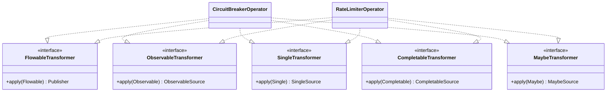
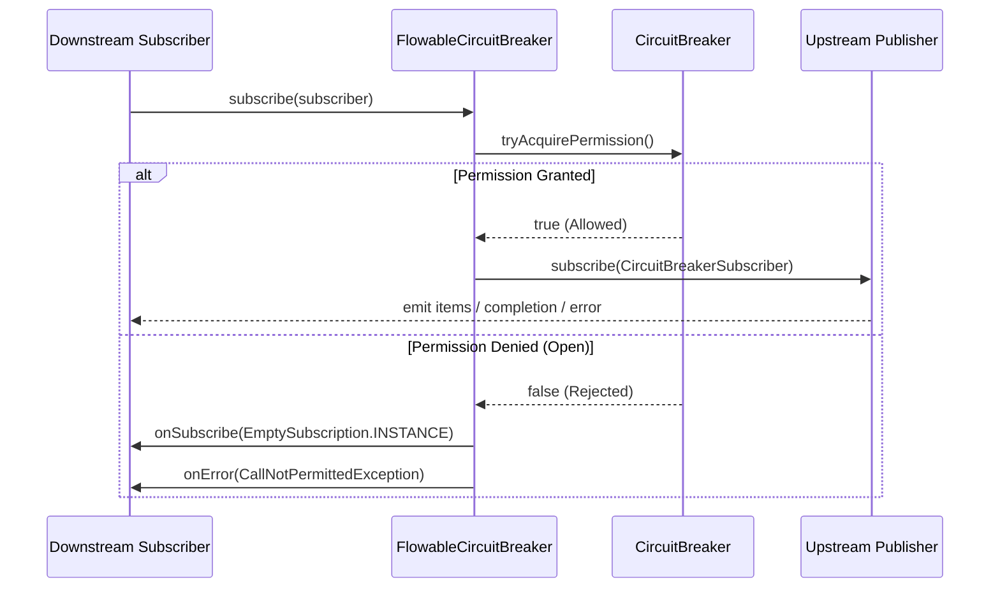
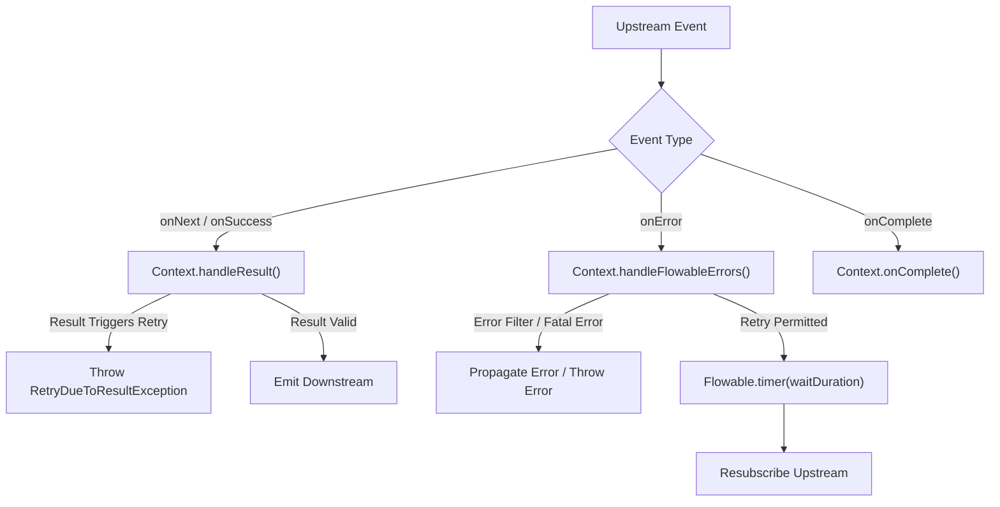

# RxJava 2 Operators

<details>
<summary>Relevant source files</summary>

The following files were used as context for generating this wiki page:

- [resilience4j-all/src/main/java/io/github/resilience4j/decorators/Decorators.java](https://github.com/resilience4j/resilience4j/blob/main/resilience4j-all/src/main/java/io/github/resilience4j/decorators/Decorators.java)
- [resilience4j-rxjava2/src/main/java/io/github/resilience4j/circuitbreaker/operator/FlowableCircuitBreaker.java](https://github.com/resilience4j/resilience4j/blob/main/resilience4j-rxjava2/src/main/java/io/github/resilience4j/circuitbreaker/operator/FlowableCircuitBreaker.java)
- [resilience4j-rxjava3/src/main/java/io/github/resilience4j/rxjava3/circuitbreaker/operator/FlowableCircuitBreaker.java](https://github.com/resilience4j/resilience4j/blob/main/resilience4j-rxjava3/src/main/java/io/github/resilience4j/rxjava3/circuitbreaker/operator/FlowableCircuitBreaker.java)
- [resilience4j-rxjava2/src/main/java/io/github/resilience4j/retry/transformer/RetryTransformer.java](https://github.com/resilience4j/resilience4j/blob/main/resilience4j-rxjava2/src/main/java/io/github/resilience4j/retry/transformer/RetryTransformer.java)
- [resilience4j-reactor/src/main/java/io/github/resilience4j/reactor/ReactorOperatorFallbackDecorator.java](https://github.com/resilience4j/resilience4j/blob/main/resilience4j-reactor/src/main/java/io/github/resilience4j/reactor/ReactorOperatorFallbackDecorator.java)
- [resilience4j-rxjava3/src/main/java/io/github/resilience4j/rxjava3/retry/transformer/RetryTransformer.java](https://github.com/resilience4j/resilience4j/blob/main/resilience4j-rxjava3/src/main/java/io/github/resilience4j/rxjava3/retry/transformer/RetryTransformer.java)
- [resilience4j-rxjava2/src/main/java/io/github/resilience4j/circuitbreaker/operator/ObserverCircuitBreaker.java](https://github.com/resilience4j/resilience4j/blob/main/resilience4j-rxjava2/src/main/java/io/github/resilience4j/circuitbreaker/operator/ObserverCircuitBreaker.java)
- [resilience4j-rxjava2/src/main/java/io/github/resilience4j/timelimiter/transformer/TimeLimiterTransformer.java](https://github.com/resilience4j/resilience4j/blob/main/resilience4j-rxjava2/src/main/java/io/github/resilience4j/timelimiter/transformer/TimeLimiterTransformer.java)
- [resilience4j-rxjava3/src/main/java/io/github/resilience4j/rxjava3/circuitbreaker/operator/ObserverCircuitBreaker.java](https://github.com/resilience4j/resilience4j/blob/main/resilience4j-rxjava3/src/main/java/io/github/resilience4j/rxjava3/circuitbreaker/operator/ObserverCircuitBreaker.java)
- [resilience4j-rxjava2/src/main/java/io/github/resilience4j/ratelimiter/operator/RateLimiterOperator.java](https://github.com/resilience4j/resilience4j/blob/main/resilience4j-rxjava2/src/main/java/io/github/resilience4j/ratelimiter/operator/RateLimiterOperator.java)
- [resilience4j-rxjava3/src/main/java/io/github/resilience4j/rxjava3/timelimiter/transformer/TimeLimiterTransformer.java](https://github.com/resilience4j/resilience4j/blob/main/resilience4j-rxjava3/src/main/java/io/github/resilience4j/rxjava3/timelimiter/transformer/TimeLimiterTransformer.java)
- [resilience4j-rxjava2/src/main/java/io/github/resilience4j/circuitbreaker/operator/CircuitBreakerOperator.java](https://github.com/resilience4j/resilience4j/blob/main/resilience4j-rxjava2/src/main/java/io/github/resilience4j/circuitbreaker/operator/CircuitBreakerOperator.java)
- [resilience4j-micronaut/src/main/java/io/github/resilience4j/micronaut/util/RxJava2PublisherExtension.java](https://github.com/resilience4j/resilience4j/blob/main/resilience4j-micronaut/src/main/java/io/github/resilience4j/micronaut/util/RxJava2PublisherExtension.java)
- [resilience4j-spring6/src/main/java/io/github/resilience4j/spring6/ratelimiter/configure/RxJava2RateLimiterAspectExt.java](https://github.com/resilience4j/resilience4j/blob/main/resilience4j-spring6/src/main/java/io/github/resilience4j/spring6/ratelimiter/configure/RxJava2RateLimiterAspectExt.java)
- [resilience4j-spring6/src/main/java/io/github/resilience4j/spring6/circuitbreaker/configure/RxJava2CircuitBreakerAspectExt.java](https://github.com/resilience4j/resilience4j/blob/main/resilience4j-spring6/src/main/java/io/github/resilience4j/spring6/circuitbreaker/configure/RxJava2CircuitBreakerAspectExt.java)
- [resilience4j-spring6/src/main/java/io/github/resilience4j/spring6/fallback/RxJava2FallbackDecorator.java](https://github.com/resilience4j/resilience4j/blob/main/resilience4j-spring6/src/main/java/io/github/resilience4j/spring6/fallback/RxJava2FallbackDecorator.java)
- [resilience4j-rxjava3/src/main/java/io/github/resilience4j/rxjava3/ratelimiter/operator/RateLimiterOperator.java](https://github.com/resilience4j/resilience4j/blob/main/resilience4j-rxjava3/src/main/java/io/github/resilience4j/rxjava3/ratelimiter/operator/RateLimiterOperator.java)
- [resilience4j-rxjava2/src/main/java/io/github/resilience4j/circuitbreaker/operator/SingleCircuitBreaker.java](https://github.com/resilience4j/resilience4j/blob/main/resilience4j-rxjava2/src/main/java/io/github/resilience4j/circuitbreaker/operator/SingleCircuitBreaker.java)
- [resilience4j-rxjava3/src/main/java/io/github/resilience4j/rxjava3/ratelimiter/operator/FlowableRateLimiter.java](https://github.com/resilience4j/resilience4j/blob/main/resilience4j-rxjava3/src/main/java/io/github/resilience4j/rxjava3/ratelimiter/operator/FlowableRateLimiter.java)
- [resilience4j-rxjava2/src/main/java/io/github/resilience4j/circuitbreaker/operator/CompletableCircuitBreaker.java](https://github.com/resilience4j/resilience4j/blob/main/resilience4j-rxjava2/src/main/java/io/github/resilience4j/circuitbreaker/operator/CompletableCircuitBreaker.java)
- [resilience4j-rxjava2/src/main/java/io/github/resilience4j/ratelimiter/operator/FlowableRateLimiter.java](https://github.com/resilience4j/resilience4j/blob/main/resilience4j-rxjava2/src/main/java/io/github/resilience4j/ratelimiter/operator/FlowableRateLimiter.java)
- [resilience4j-spring6/src/main/java/io/github/resilience4j/spring6/retry/configure/RxJava2RetryAspectExt.java](https://github.com/resilience4j/resilience4j/blob/main/resilience4j-spring6/src/main/java/io/github/resilience4j/spring6/retry/configure/RxJava2RetryAspectExt.java)
- [resilience4j-rxjava3/src/main/java/io/github/resilience4j/rxjava3/circuitbreaker/operator/CircuitBreakerOperator.java](https://github.com/resilience4j/resilience4j/blob/main/resilience4j-rxjava3/src/main/java/io/github/resilience4j/rxjava3/circuitbreaker/operator/CircuitBreakerOperator.java)
- [resilience4j-rxjava2/src/main/java/io/github/resilience4j/ratelimiter/operator/ObserverRateLimiter.java](https://github.com/resilience4j/resilience4j/blob/main/resilience4j-rxjava2/src/main/java/io/github/resilience4j/ratelimiter/operator/ObserverRateLimiter.java)
- [resilience4j-rxjava2/src/main/java/io/github/resilience4j/ratelimiter/operator/SingleRateLimiter.java](https://github.com/resilience4j/resilience4j/blob/main/resilience4j-rxjava2/src/main/java/io/github/resilience4j/ratelimiter/operator/SingleRateLimiter.java)
- [resilience4j-rxjava2/src/main/java/io/github/resilience4j/bulkhead/operator/BulkheadOperator.java](https://github.com/resilience4j/resilience4j/blob/main/resilience4j-rxjava2/src/main/java/io/github/resilience4j/bulkhead/operator/BulkheadOperator.java)
- [resilience4j-rxjava3/src/main/java/io/github/resilience4j/rxjava3/ratelimiter/operator/ObserverRateLimiter.java](https://github.com/resilience4j/resilience4j/blob/main/resilience4j-rxjava3/src/main/java/io/github/resilience4j/rxjava3/ratelimiter/operator/ObserverRateLimiter.java)
- [resilience4j-rxjava2/src/main/java/io/github/resilience4j/ratelimiter/operator/CompletableRateLimiter.java](https://github.com/resilience4j/resilience4j/blob/main/resilience4j-rxjava2/src/main/java/io/github/resilience4j/ratelimiter/operator/CompletableRateLimiter.java)
- [resilience4j-rxjava2/src/main/java/io/github/resilience4j/bulkhead/operator/SingleBulkhead.java](https://github.com/resilience4j/resilience4j/blob/main/resilience4j-rxjava2/src/main/java/io/github/resilience4j/bulkhead/operator/SingleBulkhead.java)
- [resilience4j-rxjava3/src/main/java/io/github/resilience4j/rxjava3/ratelimiter/operator/SingleRateLimiter.java](https://github.com/resilience4j/resilience4j/blob/main/resilience4j-rxjava3/src/main/java/io/github/resilience4j/rxjava3/ratelimiter/operator/SingleRateLimiter.java)
</details>

## Overview

### Overview Context
The Resilience4j RxJava integration layer bridges reactive programming models in RxJava 2 (and RxJava 3) with fault tolerance patterns such as Circuit Breaker, Rate Limiter, Bulkhead, Retry, and Time Limiter. Instead of treating reactive streams as standard blocking callables, Resilience4j implements custom reactive operators and transformers (`FlowableTransformer`, `ObservableTransformer`, `SingleTransformer`, `CompletableTransformer`, and `MaybeTransformer`) that intercept subscription and event emission lifecycles. This architectural approach allows developers to apply failure handling transparently across asynchronous stream pipelines (`Flowable`, `Observable`, `Single`, `Maybe`, and `Completable`) without breaking reactive backpressure or composition idioms.

Sources: [resilience4j-rxjava2/src/main/java/io/github/resilience4j/circuitbreaker/operator/CircuitBreakerOperator.java:32-37](https://github.com/resilience4j/resilience4j/blob/main/resilience4j-rxjava2/src/main/java/io/github/resilience4j/circuitbreaker/operator/CircuitBreakerOperator.java#L32-L37)

### Mechanism and Architecture
By implementing custom RxJava publishers and subscribers, components like `CircuitBreakerOperator`, `RateLimiterOperator`, and `BulkheadOperator` evaluate permission acquisition and resource allocation precisely at subscription time (`subscribeActual`). If a circuit is open, a bulkhead is full, or a rate limit is exceeded, the operator immediately short-circuits the stream by invoking downstream error channels with dedicated exceptions (`CallNotPermittedException`, `BulkheadFullException`, or `RequestNotPermitted`) without ever subscribing to the upstream source. Conversely, transformers like `RetryTransformer` and `TimeLimiterTransformer` decorate existing reactive sources using operator composition (`compose()` or `retryWhen()`), mapping stream errors and successful terminations back into the state machine of the underlying resilience primitive.

Sources: [resilience4j-rxjava2/src/main/java/io/github/resilience4j/circuitbreaker/operator/CircuitBreakerOperator.java:32-37](https://github.com/resilience4j/resilience4j/blob/main/resilience4j-rxjava2/src/main/java/io/github/resilience4j/circuitbreaker/operator/CircuitBreakerOperator.java#L32-L37), [resilience4j-spring6/src/main/java/io/github/resilience4j/spring6/circuitbreaker/configure/RxJava2CircuitBreakerAspectExt.java:32-38](https://github.com/resilience4j/resilience4j/blob/main/resilience4j-spring6/src/main/java/io/github/resilience4j/spring6/circuitbreaker/configure/RxJava2CircuitBreakerAspectExt.java#L32-L38)

### Framework Interoperability
Integration with dependency injection and AOP frameworks—such as Spring 6 (`RxJava2CircuitBreakerAspectExt`, `RxJava2RateLimiterAspectExt`, `RxJava2RetryAspectExt`) and Micronaut (`RxJava2PublisherExtension`)—further automates this wrapping process. When a managed bean method returns an RxJava reactive type, aspects inspect the return type against supported reactive classes (`ObservableSource`, `SingleSource`, `CompletableSource`, `MaybeSource`, and `Flowable`) and automatically apply the appropriate transformer or operator.

Sources: [resilience4j-spring6/src/main/java/io/github/resilience4j/spring6/circuitbreaker/configure/RxJava2CircuitBreakerAspectExt.java:32-38](https://github.com/resilience4j/resilience4j/blob/main/resilience4j-spring6/src/main/java/io/github/resilience4j/spring6/circuitbreaker/configure/RxJava2CircuitBreakerAspectExt.java#L32-L38), [resilience4j-micronaut/src/main/java/io/github/resilience4j/micronaut/util/RxJava2PublisherExtension.java:28-30](https://github.com/resilience4j/resilience4j/blob/main/resilience4j-micronaut/src/main/java/io/github/resilience4j/micronaut/util/RxJava2PublisherExtension.java#L28-L30)

## Public API and Transformer Surface

### Interface Structure
The public API for RxJava integration centers around operator classes that implement RxJava's transformer interfaces. Each resilience primitive provides a unified operator class (`CircuitBreakerOperator`, `RateLimiterOperator`, `BulkheadOperator`, `RetryTransformer`, and `TimeLimiterTransformer`) capable of handling all five RxJava reactive types.

Sources: [resilience4j-rxjava2/src/main/java/io/github/resilience4j/circuitbreaker/operator/CircuitBreakerOperator.java:32-34](https://github.com/resilience4j/resilience4j/blob/main/resilience4j-rxjava2/src/main/java/io/github/resilience4j/circuitbreaker/operator/CircuitBreakerOperator.java#L32-L34), [resilience4j-rxjava2/src/main/java/io/github/resilience4j/ratelimiter/operator/RateLimiterOperator.java:32-34](https://github.com/resilience4j/resilience4j/blob/main/resilience4j-rxjava2/src/main/java/io/github/resilience4j/ratelimiter/operator/RateLimiterOperator.java#L32-L34)

### Composition Model
The transformer classes implement `FlowableTransformer`, `ObservableTransformer`, `SingleTransformer`, `CompletableTransformer`, and `MaybeTransformer`. This uniform implementation enables fluent stream composition via the `.compose()` operator across diverse stream arities.



Sources: [resilience4j-rxjava2/src/main/java/io/github/resilience4j/circuitbreaker/operator/CircuitBreakerOperator.java:32-34](https://github.com/resilience4j/resilience4j/blob/main/resilience4j-rxjava2/src/main/java/io/github/resilience4j/circuitbreaker/operator/CircuitBreakerOperator.java#L32-L34), [resilience4j-rxjava2/src/main/java/io/github/resilience4j/ratelimiter/operator/RateLimiterOperator.java:32-34](https://github.com/resilience4j/resilience4j/blob/main/resilience4j-rxjava2/src/main/java/io/github/resilience4j/ratelimiter/operator/RateLimiterOperator.java#L32-L34)

### Supported Types Matrix
| Resilience Primitive | Operator / Transformer Class | Supported RxJava Types | Failure / Rejection Exception |
| :--- | :--- | :--- | :--- |
| Circuit Breaker | `CircuitBreakerOperator` | `Flowable`, `Observable`, `Single`, `Completable`, `Maybe` | `CallNotPermittedException` |
| Rate Limiter | `RateLimiterOperator` | `Flowable`, `Observable`, `Single`, `Completable`, `Maybe` | `RequestNotPermitted` |
| Bulkhead | `BulkheadOperator` | `Flowable`, `Observable`, `Single`, `Completable`, `Maybe` | `BulkheadFullException` |
| Retry | `RetryTransformer` | `Flowable`, `Observable`, `Single`, `Completable`, `Maybe` | Original exception or `MaxRetriesExceededException` |
| Time Limiter | `TimeLimiterTransformer` | `Flowable`, `Observable`, `Single`, `Completable`, `Maybe` | `TimeoutException` |

Sources: [resilience4j-rxjava2/src/main/java/io/github/resilience4j/circuitbreaker/operator/CircuitBreakerOperator.java:32-34](https://github.com/resilience4j/resilience4j/blob/main/resilience4j-rxjava2/src/main/java/io/github/resilience4j/circuitbreaker/operator/CircuitBreakerOperator.java#L32-L34), [resilience4j-rxjava2/src/main/java/io/github/resilience4j/ratelimiter/operator/RateLimiterOperator.java:32-34](https://github.com/resilience4j/resilience4j/blob/main/resilience4j-rxjava2/src/main/java/io/github/resilience4j/ratelimiter/operator/RateLimiterOperator.java#L32-L34), [resilience4j-rxjava2/src/main/java/io/github/resilience4j/bulkhead/operator/BulkheadOperator.java:32-34](https://github.com/resilience4j/resilience4j/blob/main/resilience4j-rxjava2/src/main/java/io/github/resilience4j/bulkhead/operator/BulkheadOperator.java#L32-L34), [resilience4j-rxjava2/src/main/java/io/github/resilience4j/retry/transformer/RetryTransformer.java:25-26](https://github.com/resilience4j/resilience4j/blob/main/resilience4j-rxjava2/src/main/java/io/github/resilience4j/retry/transformer/RetryTransformer.java#L25-L26), [resilience4j-rxjava2/src/main/java/io/github/resilience4j/timelimiter/transformer/TimeLimiterTransformer.java:25-27](https://github.com/resilience4j/resilience4j/blob/main/resilience4j-rxjava2/src/main/java/io/github/resilience4j/timelimiter/transformer/TimeLimiterTransformer.java#L25-L27)

## Circuit Breaker Operators

### Subscription Flow Architecture
The Circuit Breaker integration provides custom reactive publishers (`FlowableCircuitBreaker`, `ObserverCircuitBreaker`, `SingleCircuitBreaker`, `CompletableCircuitBreaker`, `MaybeCircuitBreaker`) that intercept subscription evaluation via `subscribeActual()`. 

Sources: [resilience4j-rxjava2/src/main/java/io/github/resilience4j/circuitbreaker/operator/FlowableCircuitBreaker.java:40-48](https://github.com/resilience4j/resilience4j/blob/main/resilience4j-rxjava2/src/main/java/io/github/resilience4j/circuitbreaker/operator/FlowableCircuitBreaker.java#L40-L48)

### Permission Evaluation Sequence
When a downstream subscriber subscribes to the wrapped reactive source, the operator first checks permission availability via `circuitBreaker.tryAcquirePermission()`. If permission is granted, the upstream publisher is subscribed to using a specialized observer that tracks execution duration and reports success, error, or cancellation metrics back to the circuit breaker state machine. If permission is denied (i.e., the circuit is OPEN), the operator immediately emits `EmptySubscription.INSTANCE` or `EmptyDisposable.INSTANCE` followed by `CallNotPermittedException` down the error channel.



Sources: [resilience4j-rxjava2/src/main/java/io/github/resilience4j/circuitbreaker/operator/FlowableCircuitBreaker.java:40-48](https://github.com/resilience4j/resilience4j/blob/main/resilience4j-rxjava2/src/main/java/io/github/resilience4j/circuitbreaker/operator/FlowableCircuitBreaker.java#L40-L48), [resilience4j-rxjava2/src/main/java/io/github/resilience4j/circuitbreaker/operator/ObserverCircuitBreaker.java:36-44](https://github.com/resilience4j/resilience4j/blob/main/resilience4j-rxjava2/src/main/java/io/github/resilience4j/circuitbreaker/operator/ObserverCircuitBreaker.java#L36-L44)

### Execution Walkthrough: Flowable Circuit Breaker Lifecycle
1. **Subscription Interception**: Downstream calls `subscribe(Subscriber)` on `FlowableCircuitBreaker`, triggering `subscribeActual(Subscriber downstream)` at [FlowableCircuitBreaker.java:40-48](https://github.com/resilience4j/resilience4j/blob/main/resilience4j-rxjava2/src/main/java/io/github/resilience4j/circuitbreaker/operator/FlowableCircuitBreaker.java#L40-L48).
2. **Permission Evaluation**: The guard `if (circuitBreaker.tryAcquirePermission())` evaluates state. If open, `downstream.onSubscribe(EmptySubscription.INSTANCE)` is called, followed immediately by `downstream.onError(createCallNotPermittedException(circuitBreaker))`.
3. **Timer Initialization**: When permitted, `CircuitBreakerSubscriber` is instantiated, capturing `this.start = circuitBreaker.getCurrentTimestamp()` at [FlowableCircuitBreaker.java:50-57](https://github.com/resilience4j/resilience4j/blob/main/resilience4j-rxjava2/src/main/java/io/github/resilience4j/circuitbreaker/operator/FlowableCircuitBreaker.java#L50-L57).
4. **Outcome Reporting**: 
   - On error (`hookOnError`), duration is computed as `circuitBreaker.getCurrentTimestamp() - start` and reported via `circuitBreaker.onError(...)` at [FlowableCircuitBreaker.java:59-62](https://github.com/resilience4j/resilience4j/blob/main/resilience4j-rxjava2/src/main/java/io/github/resilience4j/circuitbreaker/operator/FlowableCircuitBreaker.java#L59-L62).
   - On completion (`hookOnComplete`), success is recorded via `circuitBreaker.onSuccess(...)` at [FlowableCircuitBreaker.java:64-67](https://github.com/resilience4j/resilience4j/blob/main/resilience4j-rxjava2/src/main/java/io/github/resilience4j/circuitbreaker/operator/FlowableCircuitBreaker.java#L64-L67).
   - On cancellation (`hookOnCancel`), if `eventWasEmitted.get()` is true, success is recorded; otherwise, `circuitBreaker.releasePermission()` is called to return the acquired slot at [FlowableCircuitBreaker.java:69-76](https://github.com/resilience4j/resilience4j/blob/main/resilience4j-rxjava2/src/main/java/io/github/resilience4j/circuitbreaker/operator/FlowableCircuitBreaker.java#L69-L76).

> [!NOTE]
> During cancellation (`hookOnCancel`), the circuit breaker distinguishes between subscriptions that have already emitted items and those cancelled prematurely. If `eventWasEmitted.get()` is true, the execution counts as a success; otherwise, the acquired permission is released back to the circuit breaker without recording a failure or success.

Sources: [resilience4j-rxjava2/src/main/java/io/github/resilience4j/circuitbreaker/operator/FlowableCircuitBreaker.java:40-77](https://github.com/resilience4j/resilience4j/blob/main/resilience4j-rxjava2/src/main/java/io/github/resilience4j/circuitbreaker/operator/FlowableCircuitBreaker.java#L40-L77), [resilience4j-rxjava2/src/main/java/io/github/resilience4j/circuitbreaker/operator/ObserverCircuitBreaker.java:46-73](https://github.com/resilience4j/resilience4j/blob/main/resilience4j-rxjava2/src/main/java/io/github/resilience4j/circuitbreaker/operator/ObserverCircuitBreaker.java#L46-L73)

## Rate Limiter Operators

### Reservation Logic
Rate limiter operators (`FlowableRateLimiter`, `ObserverRateLimiter`, `SingleRateLimiter`, `CompletableRateLimiter`, `MaybeRateLimiter`) control stream subscription velocity by interacting with a `RateLimiter` instance via `rateLimiter.reservePermission()`.

Sources: [resilience4j-rxjava2/src/main/java/io/github/resilience4j/ratelimiter/operator/FlowableRateLimiter.java:32-56](https://github.com/resilience4j/resilience4j/blob/main/resilience4j-rxjava2/src/main/java/io/github/resilience4j/ratelimiter/operator/FlowableRateLimiter.java#L32-L56)

### Timing Execution
When a downstream subscriber subscribes, the operator invokes `reservePermission()`, which returns a wait duration in nanoseconds:
- If `waitDuration > 0`, the operator schedules subscription to the upstream source after the required delay using `Completable.timer(waitDuration, TimeUnit.NANOSECONDS)`.
- If `waitDuration == 0`, the upstream is subscribed to immediately.
- If `waitDuration < 0`, permission acquisition failed (rate limit exceeded), and the operator emits `RequestNotPermitted` down the error channel.

Sources: [resilience4j-rxjava2/src/main/java/io/github/resilience4j/ratelimiter/operator/FlowableRateLimiter.java:43-56](https://github.com/resilience4j/resilience4j/blob/main/resilience4j-rxjava2/src/main/java/io/github/resilience4j/ratelimiter/operator/FlowableRateLimiter.java#L43-L56)

### Usage Example
```java
Flowable<String> restrictedStream = Flowable.range(1, 10)
    .map(i -> "Item " + i)
    .compose(RateLimiterOperator.of(RateLimiter.ofDefaults("testRateLimiter")));
```

Sources: [resilience4j-rxjava2/src/main/java/io/github/resilience4j/ratelimiter/operator/RateLimiterOperator.java:32-75](https://github.com/resilience4j/resilience4j/blob/main/resilience4j-rxjava2/src/main/java/io/github/resilience4j/ratelimiter/operator/RateLimiterOperator.java#L32-L75)

## Bulkhead Operators

### Concurrency Control
Bulkhead operators (`FlowableBulkhead`, `ObserverBulkhead`, `SingleBulkhead`, `CompletableBulkhead`, `MaybeBulkhead`) limit concurrent executions across reactive stream subscriptions. 

Sources: [resilience4j-rxjava2/src/main/java/io/github/resilience4j/bulkhead/operator/SingleBulkhead.java:25-43](https://github.com/resilience4j/resilience4j/blob/main/resilience4j-rxjava2/src/main/java/io/github/resilience4j/bulkhead/operator/SingleBulkhead.java#L25-L43)

### Permission and Rejection
During `subscribeActual()`, the operator calls `bulkhead.tryAcquirePermission()`. If a permit is available, the upstream is subscribed to with an observer that releases or completes the bulkhead permit upon stream termination (`hookOnComplete`, `hookOnError`, or `hookOnCancel`). If the bulkhead is full (`tryAcquirePermission()` returns `false`), the operator immediately emits `BulkheadFullException` down the error channel.

Sources: [resilience4j-rxjava2/src/main/java/io/github/resilience4j/bulkhead/operator/SingleBulkhead.java:35-65](https://github.com/resilience4j/resilience4j/blob/main/resilience4j-rxjava2/src/main/java/io/github/resilience4j/bulkhead/operator/SingleBulkhead.java#L35-L65), [resilience4j-rxjava2/src/main/java/io/github/resilience4j/bulkhead/operator/BulkheadOperator.java:32-75](https://github.com/resilience4j/resilience4j/blob/main/resilience4j-rxjava2/src/main/java/io/github/resilience4j/bulkhead/operator/BulkheadOperator.java#L32-L75)

### Usage Example
```java
Single<String> bulkheadSingle = Single.just("Payload")
    .compose(BulkheadOperator.of(Bulkhead.ofDefaults("testBulkhead")));
```

Sources: [resilience4j-rxjava2/src/main/java/io/github/resilience4j/bulkhead/operator/BulkheadOperator.java:32-75](https://github.com/resilience4j/resilience4j/blob/main/resilience4j-rxjava2/src/main/java/io/github/resilience4j/bulkhead/operator/BulkheadOperator.java#L32-L75)

## Retry Transformers

### Pipeline Flow
The `RetryTransformer` class coordinates retry logic across RxJava streams by leveraging `retryWhen()` combined with `retry.asyncContext()`. Unlike subscription-phase operators, `RetryTransformer` inspects emitted items and terminal errors during stream execution.



Sources: [resilience4j-rxjava2/src/main/java/io/github/resilience4j/retry/transformer/RetryTransformer.java:25-83](https://github.com/resilience4j/resilience4j/blob/main/resilience4j-rxjava2/src/main/java/io/github/resilience4j/retry/transformer/RetryTransformer.java#L25-L83)

### Mechanism and Error Interception
1. **Context Initialization**: `apply(Flowable<T> upstream)` instantiates a `Context<T>` wrapping `retry.asyncContext()` at [RetryTransformer.java:46-47](https://github.com/resilience4j/resilience4j/blob/main/resilience4j-rxjava2/src/main/java/io/github/resilience4j/retry/transformer/RetryTransformer.java#L46-L47).
2. **Result Inspection**: `doOnNext(context::handleResult)` evaluates emitted items against `retryOnResult` predicates. If `retryContext.onResult(result)` returns a non-negative wait duration, a `RetryDueToResultException` is thrown internally at [RetryTransformer.java:97-102](https://github.com/resilience4j/resilience4j/blob/main/resilience4j-rxjava2/src/main/java/io/github/resilience4j/retry/transformer/RetryTransformer.java#L97-L102).
3. **Error Handling**: `retryWhen(errors -> errors.flatMap(context::handleFlowableErrors))` intercepts stream failures:
   - If the throwable is an instance of `Error` (fatal JVM error), it is rethrown immediately without retrying at [RetryTransformer.java:110-112](https://github.com/resilience4j/resilience4j/blob/main/resilience4j-rxjava2/src/main/java/io/github/resilience4j/retry/transformer/RetryTransformer.java#L110-L112).
   - If `retryContext.onError(throwable)` returns `-1`, retries are exhausted, and `Flowable.error(throwable)` propagates downstream at [RetryTransformer.java:114-118](https://github.com/resilience4j/resilience4j/blob/main/resilience4j-rxjava2/src/main/java/io/github/resilience4j/retry/transformer/RetryTransformer.java#L114-L118).
   - Otherwise, a delay timer (`Flowable.timer(waitDuration, TimeUnit.MILLISECONDS)`) schedules the retry attempt at [RetryTransformer.java:120](https://github.com/resilience4j/resilience4j/blob/main/resilience4j-rxjava2/src/main/java/io/github/resilience4j/retry/transformer/RetryTransformer.java#L120).

Sources: [resilience4j-rxjava2/src/main/java/io/github/resilience4j/retry/transformer/RetryTransformer.java:45-121](https://github.com/resilience4j/resilience4j/blob/main/resilience4j-rxjava2/src/main/java/io/github/resilience4j/retry/transformer/RetryTransformer.java#L45-L121)

## Time Limiter Transformers

### Timeout Enforcement Architecture
`TimeLimiterTransformer` enforces timeout constraints on reactive streams by integrating RxJava's native `.timeout()` operator with Resilience4j's `TimeLimiter` event listeners.

Sources: [resilience4j-rxjava2/src/main/java/io/github/resilience4j/timelimiter/transformer/TimeLimiterTransformer.java:25-53](https://github.com/resilience4j/resilience4j/blob/main/resilience4j-rxjava2/src/main/java/io/github/resilience4j/timelimiter/transformer/TimeLimiterTransformer.java#L25-L53)

### Subscription and Notification
When applied, the transformer queries `getTimeoutInMillis()` from the time limiter configuration and applies `.timeout(timeoutMillis, TimeUnit.MILLISECONDS)`. It registers side-effect hooks (`doOnNext`, `doOnComplete`, `doOnSuccess`, `doOnError`) that notify the `TimeLimiter` instance of successful completions or failures (`timeLimiter.onSuccess()` or `timeLimiter.onError()`). If the upstream fails to emit within the allotted duration, RxJava emits a `TimeoutException`, which is captured by `doOnError`.

Sources: [resilience4j-rxjava2/src/main/java/io/github/resilience4j/timelimiter/transformer/TimeLimiterTransformer.java:47-93](https://github.com/resilience4j/resilience4j/blob/main/resilience4j-rxjava2/src/main/java/io/github/resilience4j/timelimiter/transformer/TimeLimiterTransformer.java#L47-L93)

### Usage Example
```java
Flowable<String> timedFlowable = Flowable.fromCallable(() -> "Data")
    .compose(TimeLimiterTransformer.of(TimeLimiter.ofDefaults("testTimeLimiter")));
```

Sources: [resilience4j-rxjava2/src/main/java/io/github/resilience4j/timelimiter/transformer/TimeLimiterTransformer.java:35-53](https://github.com/resilience4j/resilience4j/blob/main/resilience4j-rxjava2/src/main/java/io/github/resilience4j/timelimiter/transformer/TimeLimiterTransformer.java#L35-L53)

## Framework Integration and AOP Support

### Spring 6 AOP Aspect Extensions
Spring aspects such as `RxJava2CircuitBreakerAspectExt`, `RxJava2RateLimiterAspectExt`, and `RxJava2RetryAspectExt` implement `canHandleReturnType(Class returnType)` by matching against `rxSupportedTypes`:

```java
private final Set<Class> rxSupportedTypes = newHashSet(
    ObservableSource.class, SingleSource.class, CompletableSource.class, 
    MaybeSource.class, Flowable.class
);
```

When invoked, the `handle()` method executes the target method via `proceed()`, casts the resulting return object to the appropriate RxJava type, and applies the operator via `.compose()`.

Sources: [resilience4j-spring6/src/main/java/io/github/resilience4j/spring6/circuitbreaker/configure/RxJava2CircuitBreakerAspectExt.java:32-65](https://github.com/resilience4j/resilience4j/blob/main/resilience4j-spring6/src/main/java/io/github/resilience4j/spring6/circuitbreaker/configure/RxJava2CircuitBreakerAspectExt.java#L32-L65)

### Micronaut Publisher Extension
In Micronaut applications, `RxJava2PublisherExtension` implements `PublisherExtension`, wrapping raw publishers with Resilience4j operators using `Flowable.fromPublisher(publisher).compose(...)`:

```java
@Override
public <T> Publisher<T> circuitBreaker(Publisher<T> publisher, CircuitBreaker circuitBreaker) {
    return Flowable.fromPublisher(publisher).compose(CircuitBreakerOperator.of(circuitBreaker));
}
```

Sources: [resilience4j-micronaut/src/main/java/io/github/resilience4j/micronaut/util/RxJava2PublisherExtension.java:30-41](https://github.com/resilience4j/resilience4j/blob/main/resilience4j-micronaut/src/main/java/io/github/resilience4j/micronaut/util/RxJava2PublisherExtension.java#L30-L41)

### Fallback Decorators in RxJava 2
`RxJava2FallbackDecorator` integrates fallback handling for Spring 6 fallback methods returning reactive streams. When an exception occurs during stream execution, `onErrorResumeNext` intercepts the failure and invokes the fallback method:

```java
public CheckedSupplier<Object> decorate(FallbackMethod fallbackMethod, CheckedSupplier<Object> supplier) {
    return supplier.andThen(request -> {
        if (request instanceof ObservableSource) {
            return ((Observable<?>) request)
                .onErrorResumeNext(rxJava2OnErrorResumeNext(fallbackMethod, Observable::error));
        }
        return request;
    });
}
```

Sources: [resilience4j-spring6/src/main/java/io/github/resilience4j/spring6/fallback/RxJava2FallbackDecorator.java:30-68](https://github.com/resilience4j/resilience4j/blob/main/resilience4j-spring6/src/main/java/io/github/resilience4j/spring6/fallback/RxJava2FallbackDecorator.java#L30-L68)

## Related

- [[Project Reactor Operators]]
- [[RxJava 3 Operators]]

