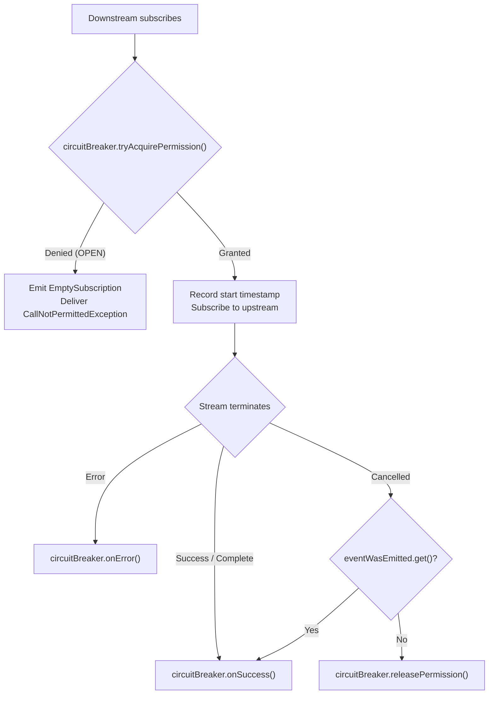
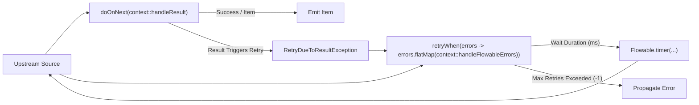

# RxJava 3 Operators

<details>
<summary>Relevant source files</summary>

The following files were used as context for generating this wiki page:

- [README.adoc](https://github.com/resilience4j/resilience4j/blob/main/README.adoc)
- [resilience4j-rxjava3/src/main/java/io/github/resilience4j/rxjava3/circuitbreaker/operator/FlowableCircuitBreaker.java](https://github.com/resilience4j/resilience4j/blob/main/resilience4j-rxjava3/src/main/java/io/github/resilience4j/rxjava3/circuitbreaker/operator/FlowableCircuitBreaker.java)
- [resilience4j-rxjava2/src/main/java/io/github/resilience4j/circuitbreaker/operator/FlowableCircuitBreaker.java](https://github.com/resilience4j/resilience4j/blob/main/resilience4j-rxjava2/src/main/java/io/github/resilience4j/circuitbreaker/operator/FlowableCircuitBreaker.java)
- [resilience4j-rxjava3/src/main/java/io/github/resilience4j/rxjava3/retry/transformer/RetryTransformer.java](https://github.com/resilience4j/resilience4j/blob/main/resilience4j-rxjava3/src/main/java/io/github/resilience4j/rxjava3/retry/transformer/RetryTransformer.java)
- [resilience4j-rxjava2/src/main/java/io/github/resilience4j/retry/transformer/RetryTransformer.java](https://github.com/resilience4j/resilience4j/blob/main/resilience4j-rxjava2/src/main/java/io/github/resilience4j/retry/transformer/RetryTransformer.java)
- [resilience4j-rxjava3/src/main/java/io/github/resilience4j/rxjava3/circuitbreaker/operator/ObserverCircuitBreaker.java](https://github.com/resilience4j/resilience4j/blob/main/resilience4j-rxjava3/src/main/java/io/github/resilience4j/rxjava3/circuitbreaker/operator/ObserverCircuitBreaker.java)
- [resilience4j-micronaut/src/main/java/io/github/resilience4j/micronaut/util/RxJava3PublisherExtension.java](https://github.com/resilience4j/resilience4j/blob/main/resilience4j-micronaut/src/main/java/io/github/resilience4j/micronaut/util/RxJava3PublisherExtension.java)
- [resilience4j-spring6/src/main/java/io/github/resilience4j/spring6/circuitbreaker/configure/RxJava3CircuitBreakerAspectExt.java](https://github.com/resilience4j/resilience4j/blob/main/resilience4j-spring6/src/main/java/io/github/resilience4j/spring6/circuitbreaker/configure/RxJava3CircuitBreakerAspectExt.java)
- [resilience4j-spring6/src/main/java/io/github/resilience4j/spring6/fallback/RxJava3FallbackDecorator.java](https://github.com/resilience4j/resilience4j/blob/main/resilience4j-spring6/src/main/java/io/github/resilience4j/spring6/fallback/RxJava3FallbackDecorator.java)
- [resilience4j-spring6/src/main/java/io/github/resilience4j/spring6/retry/configure/RxJava3RetryAspectExt.java](https://github.com/resilience4j/resilience4j/blob/main/resilience4j-spring6/src/main/java/io/github/resilience4j/spring6/retry/configure/RxJava3RetryAspectExt.java)
- [resilience4j-rxjava3/src/main/java/io/github/resilience4j/rxjava3/timelimiter/transformer/TimeLimiterTransformer.java](https://github.com/resilience4j/resilience4j/blob/main/resilience4j-rxjava3/src/main/java/io/github/resilience4j/rxjava3/timelimiter/transformer/TimeLimiterTransformer.java)
- [resilience4j-rxjava3/src/main/java/io/github/resilience4j/rxjava3/bulkhead/operator/FlowableBulkhead.java](https://github.com/resilience4j/resilience4j/blob/main/resilience4j-rxjava3/src/main/java/io/github/resilience4j/rxjava3/bulkhead/operator/FlowableBulkhead.java)
- [resilience4j-rxjava3/src/main/java/io/github/resilience4j/rxjava3/circuitbreaker/operator/CircuitBreakerOperator.java](https://github.com/resilience4j/resilience4j/blob/main/resilience4j-rxjava3/src/main/java/io/github/resilience4j/rxjava3/circuitbreaker/operator/CircuitBreakerOperator.java)
- [resilience4j-spring6/src/main/java/io/github/resilience4j/spring6/bulkhead/configure/RxJava3BulkheadAspectExt.java](https://github.com/resilience4j/resilience4j/blob/main/resilience4j-spring6/src/main/java/io/github/resilience4j/spring6/bulkhead/configure/RxJava3BulkheadAspectExt.java)
- [resilience4j-reactor/src/main/java/io/github/resilience4j/reactor/ReactorOperatorFallbackDecorator.java](https://github.com/resilience4j/resilience4j/blob/main/resilience4j-reactor/src/main/java/io/github/resilience4j/reactor/ReactorOperatorFallbackDecorator.java)
- [resilience4j-rxjava3/src/main/java/io/github/resilience4j/rxjava3/ratelimiter/operator/FlowableRateLimiter.java](https://github.com/resilience4j/resilience4j/blob/main/resilience4j-rxjava3/src/main/java/io/github/resilience4j/rxjava3/ratelimiter/operator/FlowableRateLimiter.java)
- [resilience4j-rxjava3/src/main/java/io/github/resilience4j/rxjava3/circuitbreaker/operator/MaybeCircuitBreaker.java](https://github.com/resilience4j/resilience4j/blob/main/resilience4j-rxjava3/src/main/java/io/github/resilience4j/rxjava3/circuitbreaker/operator/MaybeCircuitBreaker.java)
- [resilience4j-rxjava3/src/main/java/io/github/resilience4j/rxjava3/AbstractSubscriber.java](https://github.com/resilience4j/resilience4j/blob/main/resilience4j-rxjava3/src/main/java/io/github/resilience4j/rxjava3/AbstractSubscriber.java)
- [resilience4j-rxjava3/src/main/java/io/github/resilience4j/rxjava3/bulkhead/operator/ObserverBulkhead.java](https://github.com/resilience4j/resilience4j/blob/main/resilience4j-rxjava3/src/main/java/io/github/resilience4j/rxjava3/bulkhead/operator/ObserverBulkhead.java)
- [resilience4j-spring6/src/main/java/io/github/resilience4j/spring6/ratelimiter/configure/RxJava3RateLimiterAspectExt.java](https://github.com/resilience4j/resilience4j/blob/main/resilience4j-spring6/src/main/java/io/github/resilience4j/spring6/ratelimiter/configure/RxJava3RateLimiterAspectExt.java)
- [resilience4j-rxjava3/src/main/java/io/github/resilience4j/rxjava3/ratelimiter/operator/RateLimiterOperator.java](https://github.com/resilience4j/resilience4j/blob/main/resilience4j-rxjava3/src/main/java/io/github/resilience4j/rxjava3/ratelimiter/operator/RateLimiterOperator.java)
- [resilience4j-rxjava3/src/main/java/io/github/resilience4j/rxjava3/bulkhead/operator/BulkheadOperator.java](https://github.com/resilience4j/resilience4j/blob/main/resilience4j-rxjava3/src/main/java/io/github/resilience4j/rxjava3/bulkhead/operator/BulkheadOperator.java)
- [resilience4j-rxjava3/src/main/java/io/github/resilience4j/rxjava3/circuitbreaker/operator/CompletableCircuitBreaker.java](https://github.com/resilience4j/resilience4j/blob/main/resilience4j-rxjava3/src/main/java/io/github/resilience4j/rxjava3/circuitbreaker/operator/CompletableCircuitBreaker.java)
- [resilience4j-rxjava3/src/main/java/io/github/resilience4j/rxjava3/circuitbreaker/operator/SingleCircuitBreaker.java](https://github.com/resilience4j/resilience4j/blob/main/resilience4j-rxjava3/src/main/java/io/github/resilience4j/rxjava3/circuitbreaker/operator/SingleCircuitBreaker.java)
- [resilience4j-rxjava3/src/main/java/io/github/resilience4j/rxjava3/ratelimiter/operator/ObserverRateLimiter.java](https://github.com/resilience4j/resilience4j/blob/main/resilience4j-rxjava3/src/main/java/io/github/resilience4j/rxjava3/ratelimiter/operator/ObserverRateLimiter.java)
- [resilience4j-micronaut/src/main/java/io/github/resilience4j/micronaut/util/RxJava2PublisherExtension.java](https://github.com/resilience4j/resilience4j/blob/main/resilience4j-micronaut/src/main/java/io/github/resilience4j/micronaut/util/RxJava2PublisherExtension.java)
- [resilience4j-rxjava3/src/main/java/io/github/resilience4j/rxjava3/bulkhead/operator/MaybeBulkhead.java](https://github.com/resilience4j/resilience4j/blob/main/resilience4j-rxjava3/src/main/java/io/github/resilience4j/rxjava3/bulkhead/operator/MaybeBulkhead.java)
- [resilience4j-rxjava2/src/main/java/io/github/resilience4j/circuitbreaker/operator/CircuitBreakerOperator.java](https://github.com/resilience4j/resilience4j/blob/main/resilience4j-rxjava2/src/main/java/io/github/resilience4j/circuitbreaker/operator/CircuitBreakerOperator.java)
- [resilience4j-rxjava3/src/main/java/io/github/resilience4j/rxjava3/AbstractObserver.java](https://github.com/resilience4j/resilience4j/blob/main/resilience4j-rxjava3/src/main/java/io/github/resilience4j/rxjava3/AbstractObserver.java)
- [resilience4j-micronaut/src/main/java/io/github/resilience4j/micronaut/util/ReactorPublisherExtension.java](https://github.com/resilience4j/resilience4j/blob/main/resilience4j-micronaut/src/main/java/io/github/resilience4j/micronaut/util/ReactorPublisherExtension.java)
</details>

## Overview

### ### Introduction
The `resilience4j-rxjava3` module provides reactive operators and transformers designed to integrate Resilience4j fault tolerance components—specifically **CircuitBreaker**, **RateLimiter**, **Bulkhead**, **Retry**, and **TimeLimiter**—directly into RxJava 3 reactive streams. Rather than wrapping imperative method calls or blocking suppliers, these operators plug natively into RxJava's stream lifecycle (`Flowable`, `Observable`, `Single`, `Maybe`, and `Completable`) via composition interfaces (`FlowableTransformer`, `ObservableTransformer`, `SingleTransformer`, `MaybeTransformer`, and `CompletableTransformer`). 
Sources: [resilience4j-rxjava3/src/main/java/io/github/resilience4j/rxjava3/circuitbreaker/operator/CircuitBreakerOperator.java:32-34](https://github.com/resilience4j/resilience4j/blob/main/resilience4j-rxjava3/src/main/java/io/github/resilience4j/rxjava3/circuitbreaker/operator/CircuitBreakerOperator.java#L32-L34)

By operating at the reactive stream boundary, Resilience4j intercepts subscription events, execution outcomes, and cancellations. This enables non-blocking permission acquisition, execution duration tracking, transparent retries via error-stream flat-mapping, and immediate failure propagation when circuits are open or bulkheads are saturated.
Sources: [resilience4j-rxjava3/src/main/java/io/github/resilience4j/rxjava3/retry/transformer/RetryTransformer.java:25-26](https://github.com/resilience4j/resilience4j/blob/main/resilience4j-rxjava3/src/main/java/io/github/resilience4j/rxjava3/retry/transformer/RetryTransformer.java#L25-L26)

Integration with application frameworks such as Spring 6 AOP (`RxJava3CircuitBreakerAspectExt`, `RxJava3RetryAspectExt`, `RxJava3BulkheadAspectExt`, `RxJava3RateLimiterAspectExt`) and Micronaut (`RxJava3PublisherExtension`) allows methods returning RxJava 3 reactive types to be automatically decorated with resilience policies declared via annotations or configuration properties.
Sources: [resilience4j-spring6/src/main/java/io/github/resilience4j/spring6/circuitbreaker/configure/RxJava3CircuitBreakerAspectExt.java:21-22](https://github.com/resilience4j/resilience4j/blob/main/resilience4j-spring6/src/main/java/io/github/resilience4j/spring6/circuitbreaker/configure/RxJava3CircuitBreakerAspectExt.java#L21-L22)

---

## Supported Reactive Types and Transformers

### ### Core Mapping Matrix
Resilience4j implements operator classes that implement RxJava 3 transformer interfaces for all five core reactive types: `Flowable`, `Observable`, `Single`, `Maybe`, and `Completable`. Each transformer takes an instance of a resilience pattern and exposes an `of(...)` factory method.
Sources: [resilience4j-rxjava3/src/main/java/io/github/resilience4j/rxjava3/circuitbreaker/operator/CircuitBreakerOperator.java:42-50](https://github.com/resilience4j/resilience4j/blob/main/resilience4j-rxjava3/src/main/java/io/github/resilience4j/rxjava3/circuitbreaker/operator/CircuitBreakerOperator.java#L42-L50)

| Transformer Class | Supported Resilience Pattern | Implemented RxJava 3 Transformer Interfaces |
| :--- | :--- | :--- |
| `CircuitBreakerOperator` | `CircuitBreaker` | `FlowableTransformer`, `SingleTransformer`, `MaybeTransformer`, `CompletableTransformer`, `ObservableTransformer` |
| `BulkheadOperator` | `Bulkhead` | `FlowableTransformer`, `SingleTransformer`, `MaybeTransformer`, `CompletableTransformer`, `ObservableTransformer` |
| `RateLimiterOperator` | `RateLimiter` | `FlowableTransformer`, `SingleTransformer`, `MaybeTransformer`, `CompletableTransformer`, `ObservableTransformer` |
| `RetryTransformer` | `Retry` | `FlowableTransformer`, `ObservableTransformer`, `SingleTransformer`, `CompletableTransformer`, `MaybeTransformer` |
| `TimeLimiterTransformer` | `TimeLimiter` | `FlowableTransformer`, `ObservableTransformer`, `SingleTransformer`, `CompletableTransformer`, `MaybeTransformer` |

Sources: [resilience4j-rxjava3/src/main/java/io/github/resilience4j/rxjava3/bulkhead/operator/BulkheadOperator.java:32-33](https://github.com/resilience4j/resilience4j/blob/main/resilience4j-rxjava3/src/main/java/io/github/resilience4j/rxjava3/bulkhead/operator/BulkheadOperator.java#L32-L33), [resilience4j-rxjava3/src/main/java/io/github/resilience4j/rxjava3/ratelimiter/operator/RateLimiterOperator.java:32-33](https://github.com/resilience4j/resilience4j/blob/main/resilience4j-rxjava3/src/main/java/io/github/resilience4j/rxjava3/ratelimiter/operator/RateLimiterOperator.java#L32-L33), [resilience4j-rxjava3/src/main/java/io/github/resilience4j/rxjava3/retry/transformer/RetryTransformer.java:25-26](https://github.com/resilience4j/resilience4j/blob/main/resilience4j-rxjava3/src/main/java/io/github/resilience4j/rxjava3/retry/transformer/RetryTransformer.java#L25-L26), [resilience4j-rxjava3/src/main/java/io/github/resilience4j/rxjava3/timelimiter/transformer/TimeLimiterTransformer.java:25-27](https://github.com/resilience4j/resilience4j/blob/main/resilience4j-rxjava3/src/main/java/io/github/resilience4j/rxjava3/timelimiter/transformer/TimeLimiterTransformer.java#L25-L27)

---

## Circuit Breaker Operators & Mechanism

### ### Execution Flow and State Tracking
The `CircuitBreakerOperator` intercepts subscription time via custom `Flowable`, `Observable`, `Single`, `Maybe`, and `Completable` implementations. When a downstream subscriber subscribes to the decorated source, the operator queries the circuit breaker for execution permission.
Sources: [resilience4j-rxjava3/src/main/java/io/github/resilience4j/rxjava3/circuitbreaker/operator/FlowableCircuitBreaker.java:40-48](https://github.com/resilience4j/resilience4j/blob/main/resilience4j-rxjava3/src/main/java/io/github/resilience4j/rxjava3/circuitbreaker/operator/FlowableCircuitBreaker.java#L40-L48)

1. **Permission Check**: In `subscribeActual()`, the operator calls `circuitBreaker.tryAcquirePermission()`.
Sources: [resilience4j-rxjava3/src/main/java/io/github/resilience4j/rxjava3/circuitbreaker/operator/FlowableCircuitBreaker.java:42-42](https://github.com/resilience4j/resilience4j/blob/main/resilience4j-rxjava3/src/main/java/io/github/resilience4j/rxjava3/circuitbreaker/operator/FlowableCircuitBreaker.java#L42-L42)
2. **Fast Failure**: If permission is denied (i.e., the circuit is `OPEN`), the operator immediately emits `EmptySubscription.INSTANCE` (or `EmptyDisposable.INSTANCE`) to the downstream subscriber and calls `downstream.onError(createCallNotPermittedException(circuitBreaker))`.
Sources: [resilience4j-rxjava3/src/main/java/io/github/resilience4j/rxjava3/circuitbreaker/operator/FlowableCircuitBreaker.java:44-47](https://github.com/resilience4j/resilience4j/blob/main/resilience4j-rxjava3/src/main/java/io/github/resilience4j/rxjava3/circuitbreaker/operator/FlowableCircuitBreaker.java#L44-L47)
3. **Execution & Timing**: If permission is granted, a specialized observer/subscriber (`CircuitBreakerSubscriber`, `CircuitBreakerObserver`, `CircuitBreakerSingleObserver`, `CircuitBreakerMaybeObserver`, or `CircuitBreakerCompletableObserver`) records the start timestamp using `circuitBreaker.getCurrentTimestamp()`.
Sources: [resilience4j-rxjava3/src/main/java/io/github/resilience4j/rxjava3/circuitbreaker/operator/FlowableCircuitBreaker.java:52-57](https://github.com/resilience4j/resilience4j/blob/main/resilience4j-rxjava3/src/main/java/io/github/resilience4j/rxjava3/circuitbreaker/operator/FlowableCircuitBreaker.java#L52-L57)
4. **Outcome Recording**:
   - On successful completion (`hookOnComplete` / `hookOnSuccess`), `circuitBreaker.onSuccess(...)` is invoked with the elapsed duration.
   - On error (`hookOnError`), `circuitBreaker.onError(...)` is invoked with the elapsed duration and the caught `Throwable`.
   - On cancellation (`hookOnCancel`), if an event was already emitted (`eventWasEmitted.get()`), it records success; otherwise, it calls `circuitBreaker.releasePermission()`.
Sources: [resilience4j-rxjava3/src/main/java/io/github/resilience4j/rxjava3/circuitbreaker/operator/FlowableCircuitBreaker.java:59-76](https://github.com/resilience4j/resilience4j/blob/main/resilience4j-rxjava3/src/main/java/io/github/resilience4j/rxjava3/circuitbreaker/operator/FlowableCircuitBreaker.java#L59-L76)


Sources: [resilience4j-rxjava3/src/main/java/io/github/resilience4j/rxjava3/circuitbreaker/operator/FlowableCircuitBreaker.java:40-76](https://github.com/resilience4j/resilience4j/blob/main/resilience4j-rxjava3/src/main/java/io/github/resilience4j/rxjava3/circuitbreaker/operator/FlowableCircuitBreaker.java#L40-L76)

---

## Rate Limiter Operators & Permission Reservation

### ### Rate-Limiting Mechanics
The `RateLimiterOperator` coordinates rate limits by reserving permissions prior to subscribing to upstream sources. When `subscribeActual()` executes, the rate limiter invokes `rateLimiter.reservePermission()`, which returns a `long` representing the required wait duration in nanoseconds.
Sources: [resilience4j-rxjava3/src/main/java/io/github/resilience4j/rxjava3/ratelimiter/operator/FlowableRateLimiter.java:41-44](https://github.com/resilience4j/resilience4j/blob/main/resilience4j-rxjava3/src/main/java/io/github/resilience4j/rxjava3/ratelimiter/operator/FlowableRateLimiter.java#L41-L44)

- **`waitDuration > 0`**: The operator schedules an asynchronous timer using `Completable.timer(waitDuration, TimeUnit.NANOSECONDS)`, and upon expiration, subscribes to the upstream publisher.
Sources: [resilience4j-rxjava3/src/main/java/io/github/resilience4j/rxjava3/ratelimiter/operator/FlowableRateLimiter.java:46-48](https://github.com/resilience4j/resilience4j/blob/main/resilience4j-rxjava3/src/main/java/io/github/resilience4j/rxjava3/ratelimiter/operator/FlowableRateLimiter.java#L46-L48)
- **`waitDuration == 0`**: Immediate subscription occurs without delay.
Sources: [resilience4j-rxjava3/src/main/java/io/github/resilience4j/rxjava3/ratelimiter/operator/FlowableRateLimiter.java:49-51](https://github.com/resilience4j/resilience4j/blob/main/resilience4j-rxjava3/src/main/java/io/github/resilience4j/rxjava3/ratelimiter/operator/FlowableRateLimiter.java#L49-L51)
- **`waitDuration < 0`**: Permission is denied (rate limit exceeded). The operator immediately signals `EmptySubscription.INSTANCE` (or `EmptyDisposable.INSTANCE`) and delivers `createRequestNotPermitted(rateLimiter)`.
Sources: [resilience4j-rxjava3/src/main/java/io/github/resilience4j/rxjava3/ratelimiter/operator/FlowableRateLimiter.java:52-55](https://github.com/resilience4j/resilience4j/blob/main/resilience4j-rxjava3/src/main/java/io/github/resilience4j/rxjava3/ratelimiter/operator/FlowableRateLimiter.java#L52-L55)

> [!NOTE]
> `RateLimiterSubscriber` and `RateLimiterObserver` forward emitted values to `rateLimiter.onResult(value)` and exceptions to `rateLimiter.onError(e)`, while treating completion and cancellation as no-ops.
Sources: [resilience4j-rxjava3/src/main/java/io/github/resilience4j/rxjava3/ratelimiter/operator/FlowableRateLimiter.java:58-82](https://github.com/resilience4j/resilience4j/blob/main/resilience4j-rxjava3/src/main/java/io/github/resilience4j/rxjava3/ratelimiter/operator/FlowableRateLimiter.java#L58-L82)

---

## Bulkhead Operators & Concurrency Control

### ### Concurrency Enforcement
The `BulkheadOperator` manages concurrent execution limits using semaphore-based concurrency control across all reactive types.
Sources: [resilience4j-rxjava3/src/main/java/io/github/resilience4j/rxjava3/bulkhead/operator/BulkheadOperator.java:32-34](https://github.com/resilience4j/resilience4j/blob/main/resilience4j-rxjava3/src/main/java/io/github/resilience4j/rxjava3/bulkhead/operator/BulkheadOperator.java#L32-L34)

1. **Permission Acquisition**: During subscription (`subscribeActual`), the operator checks `bulkhead.tryAcquirePermission()`.
Sources: [resilience4j-rxjava3/src/main/java/io/github/resilience4j/rxjava3/bulkhead/operator/FlowableBulkhead.java:41-42](https://github.com/resilience4j/resilience4j/blob/main/resilience4j-rxjava3/src/main/java/io/github/resilience4j/rxjava3/bulkhead/operator/FlowableBulkhead.java#L41-L42)
2. **Bulkhead Full Handling**: If no concurrent permits are available, the operator immediately fails by calling `downstream.onError(BulkheadFullException.createBulkheadFullException(bulkhead))`.
Sources: [resilience4j-rxjava3/src/main/java/io/github/resilience4j/rxjava3/bulkhead/operator/FlowableBulkhead.java:44-47](https://github.com/resilience4j/resilience4j/blob/main/resilience4j-rxjava3/src/main/java/io/github/resilience4j/rxjava3/bulkhead/operator/FlowableBulkhead.java#L44-L47)
3. **Permission Release**:
   - For `Flowable` and `Observable`, completion or error hooks (`hookOnComplete`, `hookOnError`) release the bulkhead permit via `bulkhead.onComplete()`.
   - Cancellation (`hookOnCancel`) invokes `bulkhead.releasePermission()`.
   - For `MaybeBulkhead`, completion, error, and success all invoke `bulkhead.onComplete()`.
Sources: [resilience4j-rxjava3/src/main/java/io/github/resilience4j/rxjava3/bulkhead/operator/FlowableBulkhead.java:56-69](https://github.com/resilience4j/resilience4j/blob/main/resilience4j-rxjava3/src/main/java/io/github/resilience4j/rxjava3/bulkhead/operator/FlowableBulkhead.java#L56-L69), [resilience4j-rxjava3/src/main/java/io/github/resilience4j/rxjava3/bulkhead/operator/MaybeBulkhead.java:51-68](https://github.com/resilience4j/resilience4j/blob/main/resilience4j-rxjava3/src/main/java/io/github/resilience4j/rxjava3/bulkhead/operator/MaybeBulkhead.java#L51-L68)

---

## Retry Transformers & Error Flat-Mapping

### ### Retry Pipeline Architecture
The `RetryTransformer` integrates retry policies into RxJava 3 pipelines by leveraging RxJava's `retryWhen` operator combined with an internal `Context` class wrapping `Retry.AsyncContext<T>`.
Sources: [resilience4j-rxjava3/src/main/java/io/github/resilience4j/rxjava3/retry/transformer/RetryTransformer.java:45-51](https://github.com/resilience4j/resilience4j/blob/main/resilience4j-rxjava3/src/main/java/io/github/resilience4j/rxjava3/retry/transformer/RetryTransformer.java#L45-L51)


Sources: [resilience4j-rxjava3/src/main/java/io/github/resilience4j/rxjava3/retry/transformer/RetryTransformer.java:46-50](https://github.com/resilience4j/resilience4j/blob/main/resilience4j-rxjava3/src/main/java/io/github/resilience4j/rxjava3/retry/transformer/RetryTransformer.java#L46-L50)

- **Result-Based Retries**: `doOnNext` (or `doOnSuccess`) intercepts emitted items and calls `context::handleResult`. If the retry predicate matches the result, `retryContext.onResult(result)` returns a positive wait duration, which triggers a synthetic `RetryDueToResultException`.
Sources: [resilience4j-rxjava3/src/main/java/io/github/resilience4j/rxjava3/retry/transformer/RetryTransformer.java:48-48](https://github.com/resilience4j/resilience4j/blob/main/resilience4j-rxjava3/src/main/java/io/github/resilience4j/rxjava3/retry/transformer/RetryTransformer.java#L48-L48), [resilience4j-rxjava3/src/main/java/io/github/resilience4j/rxjava3/retry/transformer/RetryTransformer.java:97-101](https://github.com/resilience4j/resilience4j/blob/main/resilience4j-rxjava3/src/main/java/io/github/resilience4j/rxjava3/retry/transformer/RetryTransformer.java#L97-L101)
- **Error-Based Retries**: `retryWhen` intercepts errors via `handleFlowableErrors` or `handleObservableErrors`. If the error is an instance of `Error` (fatal errors), it is rethrown immediately without retrying. Otherwise, `retryContext.onError(throwable)` computes the backoff wait duration. If the duration is `-1` (retries exhausted), the error is propagated; otherwise, a timer is scheduled via `Flowable.timer(...)` or `Observable.timer(...)`.
Sources: [resilience4j-rxjava3/src/main/java/io/github/resilience4j/rxjava3/retry/transformer/RetryTransformer.java:104-121](https://github.com/resilience4j/resilience4j/blob/main/resilience4j-rxjava3/src/main/java/io/github/resilience4j/rxjava3/retry/transformer/RetryTransformer.java#L104-L121)

---

## TimeLimiter Transformers & Timeout Handling

### ### Timeout Configuration and Callbacks
The `TimeLimiterTransformer` enforces execution timeout constraints on reactive streams by utilizing RxJava's built-in `.timeout(...)` operator.
Sources: [resilience4j-rxjava3/src/main/java/io/github/resilience4j/rxjava3/timelimiter/transformer/TimeLimiterTransformer.java:47-49](https://github.com/resilience4j/resilience4j/blob/main/resilience4j-rxjava3/src/main/java/io/github/resilience4j/rxjava3/timelimiter/transformer/TimeLimiterTransformer.java#L47-L49)

- **Timeout Extraction**: The timeout duration is retrieved from the `TimeLimiter` configuration (`timeLimiter.getTimeLimiterConfig().getTimeoutDuration().toMillis()`).
Sources: [resilience4j-rxjava3/src/main/java/io/github/resilience4j/rxjava3/timelimiter/transformer/TimeLimiterTransformer.java:89-93](https://github.com/resilience4j/resilience4j/blob/main/resilience4j-rxjava3/src/main/java/io/github/resilience4j/rxjava3/timelimiter/transformer/TimeLimiterTransformer.java#L89-L93)
- **Success & Error Hooks**: 
  - On successful emission or completion (`doOnNext`, `doOnComplete`, `doOnSuccess`), `timeLimiter.onSuccess()` is invoked.
  - On timeout or upstream error (`doOnError`), `timeLimiter.onError(t)` is notified.
Sources: [resilience4j-rxjava3/src/main/java/io/github/resilience4j/rxjava3/timelimiter/transformer/TimeLimiterTransformer.java:50-52](https://github.com/resilience4j/resilience4j/blob/main/resilience4j-rxjava3/src/main/java/io/github/resilience4j/rxjava3/timelimiter/transformer/TimeLimiterTransformer.java#L50-L52)

---

## Spring 6 and Micronaut Integration Extensions

### ### AOP Aspect Extensions
Both Spring 6 AOP and Micronaut provide automatic integration extensions that detect RxJava 3 return types on annotated methods and apply the corresponding operators or transformers.
Sources: [resilience4j-spring6/src/main/java/io/github/resilience4j/spring6/circuitbreaker/configure/RxJava3CircuitBreakerAspectExt.java:21-33](https://github.com/resilience4j/resilience4j/blob/main/resilience4j-spring6/src/main/java/io/github/resilience4j/spring6/circuitbreaker/configure/RxJava3CircuitBreakerAspectExt.java#L21-L33)

Classes such as `RxJava3CircuitBreakerAspectExt`, `RxJava3RetryAspectExt`, `RxJava3BulkheadAspectExt`, and `RxJava3RateLimiterAspectExt` implement aspect extension interfaces:
1. **Return Type Matching**: `canHandleReturnType(Class returnType)` verifies whether the method return type is assignable from `ObservableSource`, `SingleSource`, `CompletableSource`, `MaybeSource`, or `Flowable`.
Sources: [resilience4j-spring6/src/main/java/io/github/resilience4j/spring6/circuitbreaker/configure/RxJava3CircuitBreakerAspectExt.java:30-33](https://github.com/resilience4j/resilience4j/blob/main/resilience4j-spring6/src/main/java/io/github/resilience4j/spring6/circuitbreaker/configure/RxJava3CircuitBreakerAspectExt.java#L30-L33)
2. **Aspect Execution**: The `handle(...)` method invokes the target join point to obtain the reactive return value, identifies its concrete RxJava 3 type, and applies the operator via `.compose(...)`.
Sources: [resilience4j-spring6/src/main/java/io/github/resilience4j/spring6/circuitbreaker/configure/RxJava3CircuitBreakerAspectExt.java:43-50](https://github.com/resilience4j/resilience4j/blob/main/resilience4j-spring6/src/main/java/io/github/resilience4j/spring6/circuitbreaker/configure/RxJava3CircuitBreakerAspectExt.java#L43-L50)

```java
// Example: Applying CircuitBreakerOperator in Spring 6 AOP
CircuitBreakerOperator circuitBreakerOperator = CircuitBreakerOperator.of(circuitBreaker);
Object returnValue = proceedingJoinPoint.proceed();
if (returnValue instanceof Flowable) {
    return ((Flowable<?>) returnValue).compose(circuitBreakerOperator);
}
```
Sources: [resilience4j-spring6/src/main/java/io/github/resilience4j/spring6/circuitbreaker/configure/RxJava3CircuitBreakerAspectExt.java:46-69](https://github.com/resilience4j/resilience4j/blob/main/resilience4j-spring6/src/main/java/io/github/resilience4j/spring6/circuitbreaker/configure/RxJava3CircuitBreakerAspectExt.java#L46-L69)

---

## Runnable Usage Example

### ### Code Snippet
The following complete example demonstrates how to instantiate a `CircuitBreaker` and apply it to an RxJava 3 `Flowable` stream using `CircuitBreakerOperator`:
Sources: [README.adoc:463-468](https://github.com/resilience4j/resilience4j/blob/main/README.adoc#L463-L468)

```java
import io.github.resilience4j.circuitbreaker.CircuitBreaker;
import io.github.resilience4j.rxjava3.circuitbreaker.operator.CircuitBreakerOperator;
import io.reactivex.rxjava3.core.Flowable;

public class RxJava3OperatorExample {

    public static void main(String[] args) {
        CircuitBreaker circuitBreaker = CircuitBreaker.ofDefaults("backendService");

        Flowable.range(1, 3)
            .map(i -> "Item " + i)
            .compose(CircuitBreakerOperator.of(circuitBreaker))
            .subscribe(
                item -> System.out.println("OnNext: " + item),
                error -> System.err.println("OnError: " + error.getMessage()),
                () -> System.out.println("OnComplete")
            );
    }
}
```
Sources: [resilience4j-rxjava3/src/main/java/io/github/resilience4j/rxjava3/circuitbreaker/operator/CircuitBreakerOperator.java:48-55](https://github.com/resilience4j/resilience4j/blob/main/resilience4j-rxjava3/src/main/java/io/github/resilience4j/rxjava3/circuitbreaker/operator/CircuitBreakerOperator.java#L48-L55)

## Related

- [[RxJava 2 Operators]]
- [[Project Reactor Operators]]

