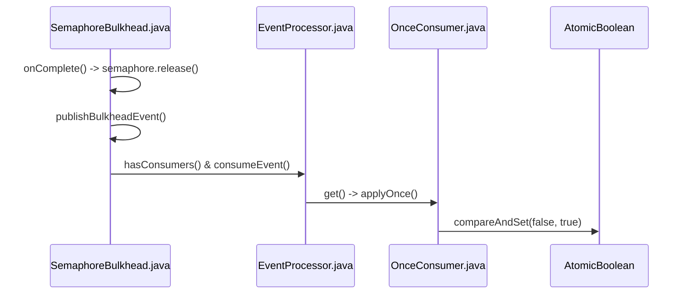
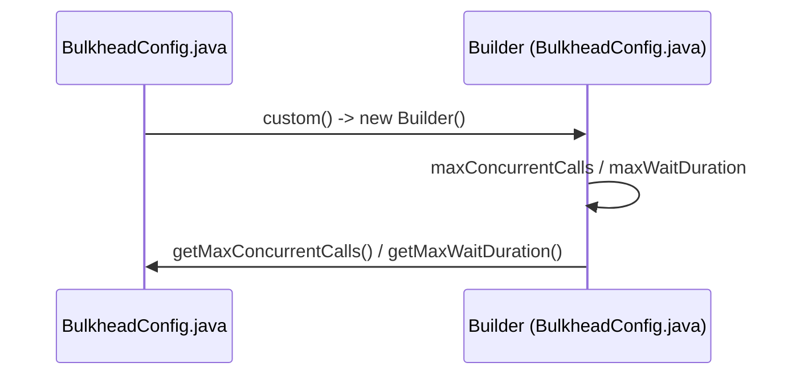

# Semaphore Bulkheads

<details>
<summary>Relevant source files</summary>

The following files were used as context for generating this wiki page:

- [README.adoc](https://github.com/resilience4j/resilience4j/blob/main/README.adoc)
- [resilience4j-spring6/src/main/java/io/github/resilience4j/spring6/bulkhead/configure/BulkheadAspect.java](https://github.com/resilience4j/resilience4j/blob/main/resilience4j-spring6/src/main/java/io/github/resilience4j/spring6/bulkhead/configure/BulkheadAspect.java)
- [resilience4j-ratelimiter/src/main/java/io/github/resilience4j/ratelimiter/internal/SemaphoreBasedRateLimiter.java](https://github.com/resilience4j/resilience4j/blob/main/resilience4j-ratelimiter/src/main/java/io/github/resilience4j/ratelimiter/internal/SemaphoreBasedRateLimiter.java)
- [resilience4j-bulkhead/src/main/java/io/github/resilience4j/bulkhead/Bulkhead.java](https://github.com/resilience4j/resilience4j/blob/main/resilience4j-bulkhead/src/main/java/io/github/resilience4j/bulkhead/Bulkhead.java)
- [resilience4j-micronaut/src/main/java/io/github/resilience4j/micronaut/bulkhead/BulkheadInterceptor.java](https://github.com/resilience4j/resilience4j/blob/main/resilience4j-micronaut/src/main/java/io/github/resilience4j/micronaut/bulkhead/BulkheadInterceptor.java)
- [resilience4j-bulkhead/src/main/java/io/github/resilience4j/bulkhead/internal/SemaphoreBulkhead.java](https://github.com/resilience4j/resilience4j/blob/main/resilience4j-bulkhead/src/main/java/io/github/resilience4j/bulkhead/internal/SemaphoreBulkhead.java)
- [resilience4j-bulkhead/src/main/java/io/github/resilience4j/bulkhead/internal/FixedThreadPoolBulkhead.java](https://github.com/resilience4j/resilience4j/blob/main/resilience4j-bulkhead/src/main/java/io/github/resilience4j/bulkhead/internal/FixedThreadPoolBulkhead.java)
- [resilience4j-kotlin/src/main/kotlin/io/github/resilience4j/kotlin/bulkhead/Bulkhead.kt](https://github.com/resilience4j/resilience4j/blob/main/resilience4j-kotlin/src/main/kotlin/io/github/resilience4j/kotlin/bulkhead/Bulkhead.kt)
- [resilience4j-bulkhead/src/main/java/io/github/resilience4j/bulkhead/ThreadPoolBulkhead.java](https://github.com/resilience4j/resilience4j/blob/main/resilience4j-bulkhead/src/main/java/io/github/resilience4j/bulkhead/ThreadPoolBulkhead.java)
- [resilience4j-bulkhead/src/main/java/io/github/resilience4j/bulkhead/ThreadPoolBulkheadRegistry.java](https://github.com/resilience4j/resilience4j/blob/main/resilience4j-bulkhead/src/main/java/io/github/resilience4j/bulkhead/ThreadPoolBulkheadRegistry.java)
- [resilience4j-bulkhead/src/main/java/io/github/resilience4j/bulkhead/internal/InMemoryThreadPoolBulkheadRegistry.java](https://github.com/resilience4j/resilience4j/blob/main/resilience4j-bulkhead/src/main/java/io/github/resilience4j/bulkhead/internal/InMemoryThreadPoolBulkheadRegistry.java)
- [resilience4j-vavr/src/main/java/io/github/resilience4j/bulkhead/VavrBulkhead.java](https://github.com/resilience4j/resilience4j/blob/main/resilience4j-vavr/src/main/java/io/github/resilience4j/bulkhead/VavrBulkhead.java)
- [resilience4j-hedge/src/main/java/io/github/resilience4j/hedge/internal/HedgeImpl.java](https://github.com/resilience4j/resilience4j/blob/main/resilience4j-hedge/src/main/java/io/github/resilience4j/hedge/internal/HedgeImpl.java)
- [resilience4j-spring6/src/main/java/io/github/resilience4j/spring6/bulkhead/configure/ReactorBulkheadAspectExt.java](https://github.com/resilience4j/resilience4j/blob/main/resilience4j-spring6/src/main/java/io/github/resilience4j/spring6/bulkhead/configure/ReactorBulkheadAspectExt.java)
- [resilience4j-rxjava3/src/main/java/io/github/resilience4j/rxjava3/bulkhead/operator/FlowableBulkhead.java](https://github.com/resilience4j/resilience4j/blob/main/resilience4j-rxjava3/src/main/java/io/github/resilience4j/rxjava3/bulkhead/operator/FlowableBulkhead.java)
- [resilience4j-ratelimiter/src/jmh/java/io/github/resilience4j/ratelimiter/RateLimiterBenchmark.java](https://github.com/resilience4j/resilience4j/blob/main/resilience4j-ratelimiter/src/jmh/java/io/github/resilience4j/ratelimiter/RateLimiterBenchmark.java)
- [resilience4j-spring6/src/main/java/io/github/resilience4j/spring6/bulkhead/configure/RxJava3BulkheadAspectExt.java](https://github.com/resilience4j/resilience4j/blob/main/resilience4j-spring6/src/main/java/io/github/resilience4j/spring6/bulkhead/configure/RxJava3BulkheadAspectExt.java)
- [resilience4j-rxjava2/src/main/java/io/github/resilience4j/bulkhead/operator/FlowableBulkhead.java](https://github.com/resilience4j/resilience4j/blob/main/resilience4j-rxjava2/src/main/java/io/github/resilience4j/bulkhead/operator/FlowableBulkhead.java)
- [resilience4j-spring6/src/main/java/io/github/resilience4j/spring6/bulkhead/configure/RxJava2BulkheadAspectExt.java](https://github.com/resilience4j/resilience4j/blob/main/resilience4j-spring6/src/main/java/io/github/resilience4j/spring6/bulkhead/configure/RxJava2BulkheadAspectExt.java)
- [resilience4j-bulkhead/src/main/java/io/github/resilience4j/bulkhead/BulkheadConfig.java](https://github.com/resilience4j/resilience4j/blob/main/resilience4j-bulkhead/src/main/java/io/github/resilience4j/bulkhead/BulkheadConfig.java)
- [resilience4j-rxjava3/src/main/java/io/github/resilience4j/rxjava3/bulkhead/operator/ObserverBulkhead.java](https://github.com/resilience4j/resilience4j/blob/main/resilience4j-rxjava3/src/main/java/io/github/resilience4j/rxjava3/bulkhead/operator/ObserverBulkhead.java)
- [resilience4j-micronaut/src/main/java/io/github/resilience4j/micronaut/annotation/Bulkhead.java](https://github.com/resilience4j/resilience4j/blob/main/resilience4j-micronaut/src/main/java/io/github/resilience4j/micronaut/annotation/Bulkhead.java)
- [resilience4j-annotations/src/main/java/io/github/resilience4j/bulkhead/annotation/Bulkhead.java](https://github.com/resilience4j/resilience4j/blob/main/resilience4j-annotations/src/main/java/io/github/resilience4j/bulkhead/annotation/Bulkhead.java)
- [resilience4j-bulkhead/src/main/java/io/github/resilience4j/bulkhead/BulkheadFullException.java](https://github.com/resilience4j/resilience4j/blob/main/resilience4j-bulkhead/src/main/java/io/github/resilience4j/bulkhead/BulkheadFullException.java)
- [resilience4j-core/src/main/java/io/github/resilience4j/core/functions/OnceConsumer.java](https://github.com/resilience4j/resilience4j/blob/main/resilience4j-core/src/main/java/io/github/resilience4j/core/functions/OnceConsumer.java)
- [resilience4j-kotlin/src/main/kotlin/io/github/resilience4j/kotlin/bulkhead/BulkheadConfig.kt](https://github.com/resilience4j/resilience4j/blob/main/resilience4j-kotlin/src/main/kotlin/io/github/resilience4j/kotlin/bulkhead/BulkheadConfig.kt)
- [resilience4j-ratelimiter/src/main/java/io/github/resilience4j/ratelimiter/internal/AtomicRateLimiter.java](https://github.com/resilience4j/ratelimiter/blob/main/resilience4j-ratelimiter/src/main/java/io/github/resilience4j/ratelimiter/internal/AtomicRateLimiter.java)
</details>

## Overview

Semaphore Bulkheads in Resilience4j provide a robust concurrency-limiting mechanism designed to isolate application resources and prevent cascading failures across microservices. By acting as an entity that restricts the number of parallel operations without mandating a specific I/O model, semaphore bulkheads allow applications to shed excess load and maintain system stability during high concurrency. Sources: [resilience4j-bulkhead/src/main/java/io/github/resilience4j/bulkhead/Bulkhead.java#L40-L54](https://github.com/resilience4j/resilience4j/blob/main/resilience4j-bulkhead/src/main/java/io/github/resilience4j/bulkhead/Bulkhead.java#L40-L54)

## Public Decorator API and Core Abstraction

### Overview

The `Bulkhead` interface provides the core abstraction and public decorator API for managing concurrent operations. It acts as an entity limiting parallel execution without assuming a specific concurrency or I/O model. To execute a protected operation, a permission must be obtained via `tryAcquirePermission()` or `acquirePermission()`, and released via `onComplete()` upon completion.

Sources: [resilience4j-bulkhead/src/main/java/io/github/resilience4j/bulkhead/Bulkhead.java#L39-L54](https://github.com/resilience4j/resilience4j/blob/main/resilience4j-bulkhead/src/main/java/io/github/resilience4j/bulkhead/Bulkhead.java#L39-L54)

### Functional Wrapping and Decorators

Resilience4j supplies a rich set of static decorator methods that wrap standard Java functional interfaces, Vavr functional types, asynchronous completion stages, and Kotlin coroutines. Each wrapper handles permission acquisition before invoking the target logic, and guarantees state integrity by invoking `onComplete()` in a `finally` block or completion callback.

| Decorator Method | Target Functional Type | Execution Behavior on Rejection |
| :--- | :--- | :--- |
| `decorateSupplier` | `Supplier<T>` | Blocks or throws when full (via `acquirePermission`) |
| `decorateCheckedSupplier` | `CheckedSupplier<T>` | Blocks or throws when full (via `acquirePermission`) |
| `decorateCallable` | `Callable<T>` | Blocks or throws when full (via `acquirePermission`) |
| `decorateRunnable` | `Runnable` | Blocks or throws when full (via `acquirePermission`) |
| `decorateCheckedRunnable` | `CheckedRunnable` | Blocks or throws when full (via `acquirePermission`) |
| `decorateConsumer` | `Consumer<T>` | Blocks or throws when full (via `acquirePermission`) |
| `decorateCheckedConsumer` | `CheckedConsumer<T>` | Blocks or throws when full (via `acquirePermission`) |
| `decorateFunction` | `Function<T, R>` | Blocks or throws when full (via `acquirePermission`) |
| `decorateCheckedFunction` | `CheckedFunction<T, R>` | Blocks or throws when full (via `acquirePermission`) |
| `decorateCompletionStage` | `Supplier<CompletionStage<T>>` | Completes exceptionally with `BulkheadFullException` |
| `decorateFuture` | `Supplier<Future<T>>` | Returns completed future exceptionally with `BulkheadFullException` |
| `decorateTrySupplier` (Vavr) | `Supplier<Try<T>>` | Returns `Try.failure(BulkheadFullException)` |
| `decorateEitherSupplier` (Vavr) | `Supplier<Either<Exception, T>>` | Returns `Either.left(BulkheadFullException)` |

Sources: [resilience4j-bulkhead/src/main/java/io/github/resilience4j/bulkhead/Bulkhead.java#L55-L296](https://github.com/resilience4j/resilience4j/blob/main/resilience4j-bulkhead/src/main/java/io/github/resilience4j/bulkhead/Bulkhead.java#L55-L296), [resilience4j-vavr/src/main/java/io/github/resilience4j/bulkhead/VavrBulkhead.java#L30-L154](https://github.com/resilience4j/resilience4j/blob/main/resilience4j-vavr/src/main/java/io/github/resilience4j/bulkhead/VavrBulkhead.java#L30-L154)

> [!NOTE]
> When decorating `Future` instances via `Bulkhead.decorateFuture()`, the bulkhead reserves its permission until `Future#get()` or `Future#get(long, TimeUnit)` is evaluated, meaning delays in evaluating the future result in holding the semaphore permit longer than the underlying execution time.
> Sources: [resilience4j-bulkhead/src/main/java/io/github/resilience4j/bulkhead/Bulkhead.java#L117-L126](https://github.com/resilience4j/resilience4j/blob/main/resilience4j-bulkhead/src/main/java/io/github/resilience4j/bulkhead/Bulkhead.java#L117-L126)

### Call-Chain Execution Walkthrough

The invocation lifecycle for a synchronous decorated supplier follows a strict sequencing pattern to ensure concurrency bounds are enforced and released correctly.

1. `decorateSupplier()` wraps the original `Supplier<T>` into a new functional instance.
2. When invoked, the wrapper calls `bulkhead.acquirePermission()`, which checks semaphore availability and applies configured waiting periods.
3. Upon acquiring a permit, `supplier.get()` executes the core business logic.
4. The `finally` block invokes `bulkhead.onComplete()`, decrementing active counts and releasing the semaphore permit back to the pool.

Sources: [resilience4j-bulkhead/src/main/java/io/github/resilience4j/bulkhead/Bulkhead.java#L188-L197](https://github.com/resilience4j/resilience4j/blob/main/resilience4j-bulkhead/src/main/java/io/github/resilience4j/bulkhead/Bulkhead.java#L188-L197)

### Kotlin Coroutine and Suspend Extensions

For Kotlin developers, the library provides extension functions on `Bulkhead` to seamlessly wrap suspend functions. The `executeSuspendFunction` method inspects the coroutine context for cancellation events to release permits appropriately when jobs are cancelled.

```kotlin
suspend fun <T> Bulkhead.executeSuspendFunction(block: suspend () -> T): T {
    acquirePermissionSuspend()
    return try {
        block().also { onComplete() }
    } catch (e: Throwable) {
        if (isCancellation(coroutineContext, e)) {
            releasePermission()
        } else {
            onComplete()
        }
        throw e
    }
}
```

Sources: [resilience4j-kotlin/src/main/kotlin/io/github/resilience4j/kotlin/bulkhead/Bulkhead.kt#L34-L46](https://github.com/resilience4j/resilience4j/blob/main/resilience4j-kotlin/src/main/kotlin/io/github/resilience4j/kotlin/bulkhead/Bulkhead.kt#L34-L46)

> [!TIP]
> `acquirePermissionSuspend()` utilizes a fast path if `maxWaitDuration` is zero, avoiding dispatcher context switches; otherwise, it dispatches blocking acquisition calls via `Dispatchers.IO`.
> Sources: [resilience4j-kotlin/src/main/kotlin/io/github/resilience4j/kotlin/bulkhead/Bulkhead.kt#L85-L92](https://github.com/resilience4j/resilience4j/blob/main/resilience4j-kotlin/src/main/kotlin/io/github/resilience4j/kotlin/bulkhead/Bulkhead.kt#L85-L92)

## Semaphore Execution Control and State Management

### Overview

Semaphore execution control relies on a underlying `java.util.concurrent.Semaphore` instance initialized with the configured maximum concurrent calls and fairness flag. When permission acquisition or release occurs, the semaphore manages concurrency limits, while event publishers record state transitions through registered consumers.
Sources: [resilience4j-bulkhead/src/main/java/io/github/resilience4j/bulkhead/internal/SemaphoreBulkhead.java#L81-L89](https://github.com/resilience4j/resilience4j/blob/main/resilience4j-bulkhead/src/main/java/io/github/resilience4j/bulkhead/internal/SemaphoreBulkhead.java#L81-L89)

### Call-Chain Execution Walkthrough

The completion and event-publishing pathway proceeds through a coordinated execution chain, ensuring that once execution finishes, permissions are relinquished and events are propagated exactly once.

1. `onComplete()` is invoked on the bulkhead instance, which immediately calls `semaphore.release()` to return the permit.
2. `publishBulkheadEvent()` checks if the underlying `eventProcessor` has registered consumers.
3. `get()` fetches the newly instantiated `BulkheadOnCallFinishedEvent` from the supplied event factory.
4. `applyOnce()` utilizes an atomic boolean guard to ensure the underlying consumer accepts the event data only a single time.
5. `compareAndSet()` flips the execution flag atomically inside `OnceConsumer` to prevent duplicate event dispatching.

Sources: [resilience4j-bulkhead/src/main/java/io/github/resilience4j/bulkhead/internal/SemaphoreBulkhead.java#L183-L188](https://github.com/resilience4j/resilience4j/blob/main/resilience4j-bulkhead/src/main/java/io/github/resilience4j/bulkhead/internal/SemaphoreBulkhead.java#L183-L188), [resilience4j-bulkhead/src/main/java/io/github/resilience4j/bulkhead/internal/SemaphoreBulkhead.java#L248-L252](https://github.com/resilience4j/resilience4j/blob/main/resilience4j-bulkhead/src/main/java/io/github/resilience4j/bulkhead/internal/SemaphoreBulkhead.java#L248-L252), [resilience4j-core/src/main/java/io/github/resilience4j/core/functions/OnceConsumer.java#L46-L50](https://github.com/resilience4j/resilience4j/blob/main/resilience4j-core/src/main/java/io/github/resilience4j/core/functions/OnceConsumer.java#L46-L50)



Sources: [resilience4j-bulkhead/src/main/java/io/github/resilience4j/bulkhead/internal/SemaphoreBulkhead.java#L183-L188](https://github.com/resilience4j/resilience4j/blob/main/resilience4j-bulkhead/src/main/java/io/github/resilience4j/bulkhead/internal/SemaphoreBulkhead.java#L183-L188), [resilience4j-bulkhead/src/main/java/io/github/resilience4j/bulkhead/internal/SemaphoreBulkhead.java#L248-L252](https://github.com/resilience4j/resilience4j/blob/main/resilience4j-bulkhead/src/main/java/io/github/resilience4j/bulkhead/internal/SemaphoreBulkhead.java#L248-L252), [resilience4j-core/src/main/java/io/github/resilience4j/core/functions/OnceConsumer.java#L46-L50](https://github.com/resilience4j/resilience4j/blob/main/resilience4j-core/src/main/java/io/github/resilience4j/core/functions/OnceConsumer.java#L46-L50)

### Event Publishing and Metrics Table

The semaphore bulkhead exposes event types and metrics tracking interfaces via its internal processors and metric wrappers.

| Component Class | Method / Interface | Return Type | Purpose |
| :--- | :--- | :--- | :--- |
| `BulkheadEventProcessor` | `onCallPermitted` | `EventPublisher` | Registers consumer for permitted call events |
| `BulkheadEventProcessor` | `onCallRejected` | `EventPublisher` | Registers consumer for rejected call events |
| `BulkheadEventProcessor` | `onCallFinished` | `EventPublisher` | Registers consumer for finished call events |
| `BulkheadMetrics` | `getAvailableConcurrentCalls` | `int` | Returns current available permits on semaphore |
| `BulkheadMetrics` | `getMaxAllowedConcurrentCalls` | `int` | Returns configured maximum concurrent calls limit |

Sources: [resilience4j-bulkhead/src/main/java/io/github/resilience4j/bulkhead/internal/SemaphoreBulkhead.java#L254-L301](https://github.com/resilience4j/resilience4j/blob/main/resilience4j-bulkhead/src/main/java/io/github/resilience4j/bulkhead/internal/SemaphoreBulkhead.java#L254-L301)

> [!WARNING]
> When modifying bulkhead configurations dynamically via `changeConfig()`, if the new `maxConcurrentCalls` is lower than the previous limit, the bulkhead invokes `semaphore.acquireUninterruptibly(-delta)` to shrink the semaphore permit count, which can block the calling thread until active calls complete.
> Sources: [resilience4j-bulkhead/src/main/java/io/github/resilience4j/bulkhead/internal/SemaphoreBulkhead.java#L126-L140](https://github.com/resilience4j/resilience4j/blob/main/resilience4j-bulkhead/src/main/java/io/github/resilience4j/bulkhead/internal/SemaphoreBulkhead.java#L126-L140)

## Bulkhead Configuration and Parameters

### Overview

The `BulkheadConfig` class and its nested `Builder` provide immutable configuration parameters for semaphore-based bulkheads. Key properties include concurrent call limits, maximum wait durations for acquiring permits, stack trace generation toggles, and fair call handling strategies. Kotlin language extensions in `BulkheadConfig.kt` offer idiomatic lambda-based DSL builders for instantiation.

Sources: [resilience4j-bulkhead/src/main/java/io/github/resilience4j/bulkhead/BulkheadConfig.java#L25-L49](https://github.com/resilience4j/resilience4j/blob/main/resilience4j-bulkhead/src/main/java/io/github/resilience4j/bulkhead/BulkheadConfig.java#L25-L49), [resilience4j-kotlin/src/main/kotlin/io/github/resilience4j/kotlin/bulkhead/BulkheadConfig.kt#L23-L60](https://github.com/resilience4j/resilience4j/blob/main/resilience4j-kotlin/src/main/kotlin/io/github/resilience4j/kotlin/bulkhead/BulkheadConfig.kt#L23-L60)

### Configuration Call Chains and Sequence

To instantiate or inspect configuration properties, factory methods construct a `Builder` instance and retrieve properties via specific accessor methods.

1. `BulkheadConfig` invokes `custom()` to instantiate a new `Builder` object.
2. `custom()` returns a fresh `BulkheadConfig.Builder` initialized with default settings.
3. `Builder` accumulates parameter values through builder methods.
4. `getMaxConcurrentCalls()` retrieves the configured integer limit from the built configuration.

Sources: [resilience4j-bulkhead/src/main/java/io/github/resilience4j/bulkhead/BulkheadConfig.java#L56-L58](https://github.com/resilience4j/resilience4j/blob/main/resilience4j-bulkhead/src/main/java/io/github/resilience4j/bulkhead/BulkheadConfig.java#L56-L58), [resilience4j-bulkhead/src/main/java/io/github/resilience4j/bulkhead/BulkheadConfig.java#L78-L80](https://github.com/resilience4j/resilience4j/blob/main/resilience4j-bulkhead/src/main/java/io/github/resilience4j/bulkhead/BulkheadConfig.java#L78-L80), [resilience4j-bulkhead/src/main/java/io/github/resilience4j/bulkhead/BulkheadConfig.java#L105-L117](https://github.com/resilience4j/resilience4j/blob/main/resilience4j-bulkhead/src/main/java/io/github/resilience4j/bulkhead/BulkheadConfig.java#L105-L117)

Similarly, retrieving max wait duration follows this trace:

1. `BulkheadConfig` invokes `custom()` to initialize a `Builder`.
2. `custom()` returns a new `BulkheadConfig.Builder`.
3. `Builder` configures or retains the wait duration.
4. `getMaxWaitDuration()` returns the configured `Duration` instance.

Sources: [resilience4j-bulkhead/src/main/java/io/github/resilience4j/bulkhead/BulkheadConfig.java#L56-L58](https://github.com/resilience4j/resilience4j/blob/main/resilience4j-bulkhead/src/main/java/io/github/resilience4j/bulkhead/BulkheadConfig.java#L56-L58), [resilience4j-bulkhead/src/main/java/io/github/resilience4j/bulkhead/BulkheadConfig.java#L82-L84](https://github.com/resilience4j/resilience4j/blob/main/resilience4j-bulkhead/src/main/java/io/github/resilience4j/bulkhead/BulkheadConfig.java#L82-L84), [resilience4j-bulkhead/src/main/java/io/github/resilience4j/bulkhead/BulkheadConfig.java#L105-L117](https://github.com/resilience4j/resilience4j/blob/main/resilience4j-bulkhead/src/main/java/io/github/resilience4j/bulkhead/BulkheadConfig.java#L105-L117)



Sources: [resilience4j-bulkhead/src/main/java/io/github/resilience4j/bulkhead/BulkheadConfig.java#L56-L58](https://github.com/resilience4j/resilience4j/blob/main/resilience4j-bulkhead/src/main/java/io/github/resilience4j/bulkhead/BulkheadConfig.java#L56-L58), [resilience4j-bulkhead/src/main/java/io/github/resilience4j/bulkhead/BulkheadConfig.java#L78-L84](https://github.com/resilience4j/resilience4j/blob/main/resilience4j-bulkhead/src/main/java/io/github/resilience4j/bulkhead/BulkheadConfig.java#L78-L84), [resilience4j-bulkhead/src/main/java/io/github/resilience4j/bulkhead/BulkheadConfig.java#L105-L117](https://github.com/resilience4j/resilience4j/blob/main/resilience4j-bulkhead/src/main/java/io/github/resilience4j/bulkhead/BulkheadConfig.java#L105-L117)

### Configuration Defaults and Parameters

The default values and configuration options defined in `BulkheadConfig` govern permit limits, thread blocking behavior, and queue fairness.

| Constant Name | Type | Default Value | Meaning / Purpose |
| :--- | :--- | :--- | :--- |
| `DEFAULT_MAX_CONCURRENT_CALLS` | `int` | `25` | Default maximum allowed concurrent executions |
| `DEFAULT_MAX_WAIT_DURATION` | `Duration` | `Duration.ofSeconds(0)` | Default maximum time threads wait to enter the bulkhead |
| `DEFAULT_WRITABLE_STACK_TRACE_ENABLED` | `boolean` | `true` | Controls whether generated rejection exceptions have writable stack traces |
| `DEFAULT_FAIR_CALL_HANDLING_STRATEGY_ENABLED` | `boolean` | `true` | Enables fair FIFO call handling strategy in the underlying semaphore |

Sources: [resilience4j-bulkhead/src/main/java/io/github/resilience4j/bulkhead/BulkheadConfig.java#L33-L36](https://github.com/resilience4j/resilience4j/blob/main/resilience4j-bulkhead/src/main/java/io/github/resilience4j/bulkhead/BulkheadConfig.java#L33-L36)

> [!WARNING]
> Setting `maxWaitDuration` to a non-zero value on event-loop threads (such as reactive computation pools) risks blocking core execution threads and degrading application throughput.
> Sources: [resilience4j-bulkhead/src/main/java/io/github/resilience4j/bulkhead/BulkheadConfig.java#L146-L149](https://github.com/resilience4j/resilience4j/blob/main/resilience4j-bulkhead/src/main/java/io/github/resilience4j/bulkhead/BulkheadConfig.java#L146-L149)

### Design Trade-Offs

| Design Choice | Benefit | Cost |
| :--- | :--- | :--- |
| Immutable Configuration (`@Immutable`) | Thread-safe sharing across multiple bulkhead instances and threads without synchronization overhead | Requires creating a new configuration instance via `Builder` or `from()` to update parameters |
| Fair Call Handling Strategy Enabled (`fairCallHandlingEnabled = true`) | Guarantees strict FIFO ordering of incoming requests using an internal queue | Potential throughput reduction under high contention compared to non-fair semaphores |
| Configurable Stack Trace Suppression (`writableStackTraceEnabled = false`) | Reduces logging noise and allocation overhead during high-frequency bulkhead rejections | Discards stack trace diagnostics (`getStackTrace()` returns zero-length array) for rejection exceptions |

Sources: [resilience4j-bulkhead/src/main/java/io/github/resilience4j/bulkhead/BulkheadConfig.java#L21-L28](https://github.com/resilience4j/resilience4j/blob/main/resilience4j-bulkhead/src/main/java/io/github/resilience4j/bulkhead/BulkheadConfig.java#L21-L28), [resilience4j-bulkhead/src/main/java/io/github/resilience4j/bulkhead/BulkheadConfig.java#L172-L188](https://github.com/resilience4j/resilience4j/blob/main/resilience4j-bulkhead/src/main/java/io/github/resilience4j/bulkhead/BulkheadConfig.java#L172-L188)

### Worked Example: Java and Kotlin Configuration

The following examples demonstrate creating custom `BulkheadConfig` instances using both the Java builder API and the Kotlin DSL extension.

```java
import io.github.resilience4j.bulkhead.BulkheadConfig;
import java.time.Duration;

BulkheadConfig config = BulkheadConfig.custom()
    .maxConcurrentCalls(10)
    .maxWaitDuration(Duration.ofMillis(500))
    .writableStackTraceEnabled(false)
    .fairCallHandlingStrategyEnabled(true)
    .build();
```

Sources: [resilience4j-bulkhead/src/main/java/io/github/resilience4j/bulkhead/BulkheadConfig.java#L132-L189](https://github.com/resilience4j/resilience4j/blob/main/resilience4j-bulkhead/src/main/java/io/github/resilience4j/bulkhead/BulkheadConfig.java#L132-L189)

```kotlin
import io.github.resilience4j.kotlin.bulkhead.BulkheadConfig
import io.github.resilience4j.bulkhead.BulkheadConfig as JavaBulkheadConfig
import java.time.Duration

val kotlinConfig = BulkheadConfig {
    maxConcurrentCalls(10)
    maxWaitDuration(Duration.ofMillis(500))
    writableStackTraceEnabled(false)
    fairCallHandlingStrategyEnabled(true)
}
```

Sources: [resilience4j-kotlin/src/main/kotlin/io/github/resilience4j/kotlin/bulkhead/BulkheadConfig.kt#L35-L39](https://github.com/resilience4j/resilience4j/blob/main/resilience4j-kotlin/src/main/kotlin/io/github/resilience4j/kotlin/bulkhead/BulkheadConfig.kt#L35-L39)

## Framework Aspect and Interceptor Integration

### Overview

Declarative bulkhead enforcement across Spring 6 and Micronaut frameworks is driven by specialized annotation aspects and method interceptors. These components inspect method-level annotations (`@Bulkhead`), resolve runtime parameters using expression languages, retrieve appropriate registry configurations, and wrap target invocations in semaphore or thread-pool execution guards.
Sources: [resilience4j-spring6/src/main/java/io/github/resilience4j/spring6/bulkhead/configure/BulkheadAspect.java#L50-L73](https://github.com/resilience4j/resilience4j/blob/main/resilience4j-spring6/src/main/java/io/github/resilience4j/spring6/bulkhead/configure/BulkheadAspect.java#L50-L73), [resilience4j-micronaut/src/main/java/io/github/resilience4j/micronaut/bulkhead/BulkheadInterceptor.java#L38-L44](https://github.com/resilience4j/resilience4j/blob/main/resilience4j-micronaut/src/main/java/io/github/resilience4j/micronaut/bulkhead/BulkheadInterceptor.java#L38-L44)

### Spring 6 AOP Integration

The `BulkheadAspect` class coordinates execution for Spring 6 applications. It implements `Ordered` to position itself via `bulkheadConfigurationProperties.getBulkheadAspectOrder()`. When a method annotated with `@Bulkhead` is invoked, `bulkheadAroundAdvice` executes the following ordered call chain:
1. `MethodSignature` extracts the target `Method` and builds the fully-qualified `methodName` (`declaringClass#methodName`).
Sources: [resilience4j-spring6/src/main/java/io/github/resilience4j/spring6/bulkhead/configure/BulkheadAspect.java#L103-L106](https://github.com/resilience4j/resilience4j/blob/main/resilience4j-spring6/src/main/java/io/github/resilience4j/spring6/bulkhead/configure/BulkheadAspect.java#L103-L106)

2. `getBulkheadAnnotation()` checks parameters or uses `AnnotationExtractor` to retrieve the annotation from target proxies or classes if absent.
Sources: [resilience4j-spring6/src/main/java/io/github/resilience4j/spring6/bulkhead/configure/BulkheadAspect.java#L107-L112](https://github.com/resilience4j/resilience4j/blob/main/resilience4j-spring6/src/main/java/io/github/resilience4j/spring6/bulkhead/configure/BulkheadAspect.java#L107-L112), [resilience4j-spring6/src/main/java/io/github/resilience4j/spring6/bulkhead/configure/BulkheadAspect.java#L189-L202](https://github.com/resilience4j/resilience4j/blob/main/resilience4j-spring6/src/main/java/io/github/resilience4j/spring6/bulkhead/configure/BulkheadAspect.java#L189-L202)

3. `SpelResolver.resolve()` evaluates the bulkhead name expression against method arguments.
Sources: [resilience4j-spring6/src/main/java/io/github/resilience4j/spring6/bulkhead/configure/BulkheadAspect.java#L114-L114](https://github.com/resilience4j/resilience4j/blob/main/resilience4j-spring6/src/main/java/io/github/resilience4j/spring6/bulkhead/configure/BulkheadAspect.java#L114-L114)

4. Depending on whether `bulkheadAnnotation.type()` evaluates to `Bulkhead.Type.THREADPOOL`, execution branches either to `proceedInThreadPoolBulkhead()` or `getOrCreateBulkhead()`.
Sources: [resilience4j-spring6/src/main/java/io/github/resilience4j/spring6/bulkhead/configure/BulkheadAspect.java#L116-L125](https://github.com/resilience4j/resilience4j/blob/main/resilience4j-spring6/src/main/java/io/github/resilience4j/spring6/bulkhead/configure/BulkheadAspect.java#L116-L125)

5. `fallbackExecutor.execute()` wraps the constructed supplier to handle failures and execute designated fallback methods.
Sources: [resilience4j-spring6/src/main/java/io/github/resilience4j/spring6/bulkhead/configure/BulkheadAspect.java#L117-L124](https://github.com/resilience4j/resilience4j/blob/main/resilience4j-spring6/src/main/java/io/github/resilience4j/spring6/bulkhead/configure/BulkheadAspect.java#L117-L124)

> [!NOTE]
> `BulkheadAspect` inspects `bulkheadAspectExts` extensions before falling back to standard `CompletionStage` or synchronous execution, enabling custom reactive adapter bindings.
> Sources: [resilience4j-spring6/src/main/java/io/github/resilience4j/spring6/bulkhead/configure/BulkheadAspect.java#L139-L145](https://github.com/resilience4j/resilience4j/blob/main/resilience4j-spring6/src/main/java/io/github/resilience4j/spring6/bulkhead/configure/BulkheadAspect.java#L139-L145)

### Micronaut Interceptor Integration

In Micronaut, `BulkheadInterceptor` implements `MethodInterceptor<Object, Object>` and intercepts methods annotated with `io.github.resilience4j.micronaut.annotation.Bulkhead`. The interceptor requires both `BulkheadRegistry` and `ThreadPoolBulkheadRegistry` beans to be present in the context.
Sources: [resilience4j-micronaut/src/main/java/io/github/resilience4j/micronaut/bulkhead/BulkheadInterceptor.java#L42-L44](https://github.com/resilience4j/resilience4j/blob/main/resilience4j-micronaut/src/main/java/io/github/resilience4j/micronaut/bulkhead/BulkheadInterceptor.java#L42-L44)

The interceptor inspects the `InterceptedModel` result type via `InterceptedMethod.of(context, conversionService)` and routes execution into three distinct handling branches:
* `PUBLISHER`: Integrates with `PublisherExtension` to apply reactive bulkhead and fallback operators.
Sources: [resilience4j-micronaut/src/main/java/io/github/resilience4j/micronaut/bulkhead/BulkheadInterceptor.java#L108-L115](https://github.com/resilience4j/resilience4j/blob/main/resilience4j-micronaut/src/main/java/io/github/resilience4j/micronaut/bulkhead/BulkheadInterceptor.java#L108-L115)
* `COMPLETION_STAGE`: Executes through `bulkhead.executeCompletionStage()` combined with future fallback handling.
Sources: [resilience4j-micronaut/src/main/java/io/github/resilience4j/micronaut/bulkhead/BulkheadInterceptor.java#L116-L127](https://github.com/resilience4j/resilience4j/blob/main/resilience4j-micronaut/src/main/java/io/github/resilience4j/micronaut/bulkhead/BulkheadInterceptor.java#L116-L127)
* `SYNCHRONOUS`: Executes via `bulkhead.executeCheckedSupplier(context::proceed)` with a catch block invoking `fallback(context, exception)`.
Sources: [resilience4j-micronaut/src/main/java/io/github/resilience4j/micronaut/bulkhead/BulkheadInterceptor.java#L128-L133](https://github.com/resilience4j/resilience4j/blob/main/resilience4j-micronaut/src/main/java/io/github/resilience4j/micronaut/bulkhead/BulkheadInterceptor.java#L128-L133)

### Annotation Properties Reference

Both frameworks provide declarative annotations supporting bulkhead naming, fallback definitions, and execution types.

| Annotation Property | Return Type | Default Value | Description |
| :--- | :--- | :--- | :--- |
| `name` | `String` | *(Required)* | Name of the bulkhead or SpEL expression resolving the target bulkhead name. |
| `fallbackMethod` | `String` | `""` | Name of the fallback method invoked upon rejection or failure. |
| `type` | `Type` | `Type.SEMAPHORE` | Bulkhead implementation type, selecting either `SEMAPHORE` or `THREADPOOL`. |
| `configuration` | `String` | `""` | Configuration key to load registry settings when `name` is a dynamic SpEL expression (Spring 6 only). |

Sources: [resilience4j-annotations/src/main/java/io/github/resilience4j/bulkhead/annotation/Bulkhead.java#L23-L43](https://github.com/resilience4j/annotations/blob/main/resilience4j-annotations/src/main/java/io/github/resilience4j/bulkhead/annotation/Bulkhead.java#L23-L43), [resilience4j-micronaut/src/main/java/io/github/resilience4j/micronaut/annotation/Bulkhead.java#L39-L51](https://github.com/resilience4j/resilience4j/blob/main/resilience4j-micronaut/src/main/java/io/github/resilience4j/micronaut/annotation/Bulkhead.java#L39-L51)

## Reactive Operators and Language Extensions

### Overview

Reactive stream bulkhead enforcement integrates directly with Project Reactor and RxJava through specialized operators and aspect extensions. These components intercept reactive publishers—such as `Flux`, `Mono`, `Observable`, `Single`, `Completable`, `Maybe`, and `Flowable`—to evaluate concurrency limits upon subscription rather than at assembly time. When a downstream subscriber demands execution, the operator attempts to acquire a semaphore permission from the underlying `Bulkhead`. If the bulkhead is full, permission acquisition fails instantly, emitting a `BulkheadFullException` down the reactive chain via `EmptySubscription` or `EmptyDisposable`.

> [!NOTE]
> Permission acquisition in reactive operators occurs lazily inside `subscribeActual` when a downstream subscriber attaches to the publisher, ensuring that rejected streams do not reserve concurrency slots before execution begins.
> Sources: [resilience4j-rxjava3/src/main/java/io/github/resilience4j/rxjava3/bulkhead/operator/FlowableBulkhead.java#L40-L48](https://github.com/resilience4j/resilience4j/blob/main/resilience4j-rxjava3/src/main/java/io/github/resilience4j/rxjava3/bulkhead/operator/FlowableBulkhead.java#L40-L48), [resilience4j-rxjava3/src/main/java/io/github/resilience4j/rxjava3/bulkhead/operator/ObserverBulkhead.java#L35-L43](https://github.com/resilience4j/resilience4j/blob/main/resilience4j-rxjava3/src/main/java/io/github/resilience4j/rxjava3/bulkhead/operator/ObserverBulkhead.java#L35-L43)

### Call-Chain Execution Walkthrough

When an AOP-intercepted method returns a reactive stream, framework aspect extensions delegate execution through structured signature checks and composition operators:
1. `BulkheadAspect` invokes `canHandleReturnType(Class returnType)` on registered extensions such as `ReactorBulkheadAspectExt`, `RxJava2BulkheadAspectExt`, or `RxJava3BulkheadAspectExt` to identify matching return types.
Sources: [resilience4j-spring6/src/main/java/io/github/resilience4j/spring6/bulkhead/configure/ReactorBulkheadAspectExt.java#L38-L42](https://github.com/resilience4j/resilience4j/blob/main/resilience4j-spring6/src/main/java/io/github/resilience4j/spring6/bulkhead/configure/ReactorBulkheadAspectExt.java#L38-L42), [resilience4j-spring6/src/main/java/io/github/resilience4j/spring6/bulkhead/configure/RxJava3BulkheadAspectExt.java#L29-L33](https://github.com/resilience4j/resilience4j/blob/main/resilience4j-spring6/src/main/java/io/github/resilience4j/spring6/bulkhead/configure/RxJava3BulkheadAspectExt.java#L29-L33)
2. `handle(ProceedingJoinPoint proceedingJoinPoint, Bulkhead bulkhead, String methodName)` proceeds with the join point to obtain the raw return value (`returnValue = proceedingJoinPoint.proceed()`).
Sources: [resilience4j-spring6/src/main/java/io/github/resilience4j/spring6/bulkhead/configure/ReactorBulkheadAspectExt.java#L54-L57](https://github.com/resilience4j/resilience4j/blob/main/resilience4j-spring6/src/main/java/io/github/resilience4j/spring6/bulkhead/configure/ReactorBulkheadAspectExt.java#L54-L57), [resilience4j-spring6/src/main/java/io/github/resilience4j/spring6/bulkhead/configure/RxJava3BulkheadAspectExt.java#L43-L46](https://github.com/resilience4j/resilience4j/blob/main/resilience4j-spring6/src/main/java/io/github/resilience4j/spring6/bulkhead/configure/RxJava3BulkheadAspectExt.java#L43-L46)
3. The aspect matches the runtime instance type (e.g., checking `Flux`, `Mono`, `ObservableSource`, `SingleSource`, `CompletableSource`, `MaybeSource`, or `Flowable`) and wraps or composes it using `BulkheadOperator.of(bulkhead)`.
Sources: [resilience4j-spring6/src/main/java/io/github/resilience4j/spring6/bulkhead/configure/ReactorBulkheadAspectExt.java#L58-L64](https://github.com/resilience4j/resilience4j/blob/main/resilience4j-spring6/src/main/java/io/github/resilience4j/spring6/bulkhead/configure/ReactorBulkheadAspectExt.java#L58-L64), [resilience4j-spring6/src/main/java/io/github/resilience4j/spring6/bulkhead/configure/RxJava3BulkheadAspectExt.java#L51-L67](https://github.com/resilience4j/resilience4j/blob/main/resilience4j-spring6/src/main/java/io/github/resilience4j/spring6/bulkhead/configure/RxJava3BulkheadAspectExt.java#L51-L67)
4. Upon subscription, `FlowableBulkhead` or `ObserverBulkhead` evaluates `bulkhead.tryAcquirePermission()`. If successful, upstream subscribes through a lifecycle observer (`BulkheadSubscriber` or `BulkheadObserver`); otherwise, it signals `BulkheadFullException`.
Sources: [resilience4j-rxjava3/src/main/java/io/github/resilience4j/rxjava3/bulkhead/operator/FlowableBulkhead.java#L40-L48](https://github.com/resilience4j/resilience4j/blob/main/resilience4j-rxjava3/src/main/java/io/github/resilience4j/rxjava3/bulkhead/operator/FlowableBulkhead.java#L40-L48), [resilience4j-rxjava3/src/main/java/io/github/resilience4j/rxjava3/bulkhead/operator/ObserverBulkhead.java#L35-L43](https://github.com/resilience4j/resilience4j/blob/main/resilience4j-rxjava3/src/main/java/io/github/resilience4j/rxjava3/bulkhead/operator/ObserverBulkhead.java#L35-L43)

> [!WARNING]
> If a method returns an unrecognized reactive type or non-reactive object, the aspect logs an error and throws an `IllegalArgumentException` stating that the type is not supported for bulkhead enforcement.
> Sources: [resilience4j-spring6/src/main/java/io/github/resilience4j/spring6/bulkhead/configure/ReactorBulkheadAspectExt.java#L64-L71](https://github.com/resilience4j/resilience4j/blob/main/resilience4j-spring6/src/main/java/io/github/resilience4j/spring6/bulkhead/configure/ReactorBulkheadAspectExt.java#L64-L71), [resilience4j-spring6/src/main/java/io/github/resilience4j/spring6/bulkhead/configure/RxJava3BulkheadAspectExt.java#L67-L73](https://github.com/resilience4j/resilience4j/blob/main/resilience4j-spring6/src/main/java/io/github/resilience4j/spring6/bulkhead/configure/RxJava3BulkheadAspectExt.java#L67-L73)

### Supported Reactive Types and Handlers

The framework extensions recognize specific reactive types across RxJava 2, RxJava 3, and Project Reactor runtimes.

| Framework / Extension | Supported Source Types | Interception Method | Rejection Signal |
| :--- | :--- | :--- | :--- |
| **Project Reactor** (`ReactorBulkheadAspectExt`) | `Flux`, `Mono` | `transformDeferred(BulkheadOperator.of(bulkhead))` | `BulkheadFullException` via `Mono.error` / `Flux.error` |
| **RxJava 3** (`RxJava3BulkheadAspectExt`) | `ObservableSource`, `SingleSource`, `CompletableSource`, `MaybeSource`, `Flowable` | `compose(bulkheadOperator)` | `BulkheadFullException` via `EmptyDisposable` / `EmptySubscription` |
| **RxJava 2** (`RxJava2BulkheadAspectExt`) | `ObservableSource`, `SingleSource`, `CompletableSource`, `MaybeSource`, `Flowable` | `compose(bulkheadOperator)` | `BulkheadFullException` via `EmptyDisposable` / `EmptySubscription` |

Sources: [resilience4j-spring6/src/main/java/io/github/resilience4j/spring6/bulkhead/configure/ReactorBulkheadAspectExt.java#L39-L42](https://github.com/resilience4j/resilience4j/blob/main/resilience4j-spring6/src/main/java/io/github/resilience4j/spring6/bulkhead/configure/ReactorBulkheadAspectExt.java#L39-L42), [resilience4j-spring6/src/main/java/io/github/resilience4j/spring6/bulkhead/configure/RxJava3BulkheadAspectExt.java#L21-L22](https://github.com/resilience4j/resilience4j/blob/main/resilience4j-spring6/src/main/java/io/github/resilience4j/spring6/bulkhead/configure/RxJava3BulkheadAspectExt.java#L21-L22), [resilience4j-spring6/src/main/java/io/github/resilience4j/spring6/bulkhead/configure/RxJava2BulkheadAspectExt.java#L36-L37](https://github.com/resilience4j/resilience4j/blob/main/resilience4j-spring6/src/main/java/io/github/resilience4j/spring6/bulkhead/configure/RxJava2BulkheadAspectExt.java#L36-L37)

### Lifecycle Hook Mapping

Reactive bulkhead operators utilize subscriber and observer hooks to manage semaphore permissions throughout stream execution, ensuring that permissions are released exactly once upon completion, error, or cancellation.

| Lifecycle Event | Operator Hook Method (`BulkheadSubscriber` / `BulkheadObserver`) | Bulkhead Action Executed |
| :--- | :--- | :--- |
| **Error Terminal Signal** | `hookOnError(Throwable t)` / `hookOnError(Throwable e)` | `bulkhead.onComplete()` |
| **Complete Terminal Signal** | `hookOnComplete()` | `bulkhead.onComplete()` |
| **Subscription Cancellation** | `hookOnCancel()` | `bulkhead.releasePermission()` |

Sources: [resilience4j-rxjava3/src/main/java/io/github/resilience4j/rxjava3/bulkhead/operator/FlowableBulkhead.java#L56-L69](https://github.com/resilience4j/resilience4j/blob/main/resilience4j-rxjava3/src/main/java/io/github/resilience4j/rxjava3/bulkhead/operator/FlowableBulkhead.java#L56-L69), [resilience4j-rxjava3/src/main/java/io/github/resilience4j/rxjava3/bulkhead/operator/ObserverBulkhead.java#L51-L64](https://github.com/resilience4j/resilience4j/blob/main/resilience4j-rxjava3/src/main/java/io/github/resilience4j/rxjava3/bulkhead/operator/ObserverBulkhead.java#L51-L64), [resilience4j-rxjava2/src/main/java/io/github/resilience4j/bulkhead/operator/FlowableBulkhead.java#L56-L69](https://github.com/resilience4j/resilience4j/blob/main/resilience4j-rxjava2/src/main/java/io/github/resilience4j/bulkhead/operator/FlowableBulkhead.java#L56-L69)

## Exception Handling and Rejection Behavior

### Overview

When a semaphore bulkhead is saturated or when execution submission fails under high concurrency, Resilience4j signals rejections by throwing a `BulkheadFullException`. This exception extends `RuntimeException` and encapsulates the name of the bulkhead that rejected the call. 

Sources: [resilience4j-bulkhead/src/main/java/io/github/resilience4j/bulkhead/BulkheadFullException.java#L24-L25](https://github.com/resilience4j/resilience4j/blob/main/resilience4j-bulkhead/src/main/java/io/github/resilience4j/bulkhead/BulkheadFullException.java#L24-L25), [resilience4j-bulkhead/src/main/java/io/github/resilience4j/bulkhead/internal/FixedThreadPoolBulkhead.java#L162-L165](https://github.com/resilience4j/resilience4j/blob/main/resilience4j-bulkhead/src/main/java/io/github/resilience4j/bulkhead/internal/FixedThreadPoolBulkhead.java#L162-L165)

### Exception Construction and Interruption Handling

The `BulkheadFullException` factory methods inspect the bulkhead configuration and thread state to construct descriptive error messages. If the current thread's interrupt flag is set while waiting for semaphore permissions, the exception message specifically notes that the thread was interrupted during the permission wait. Otherwise, it reports that the bulkhead is full and does not permit further calls. Stack trace writability is dynamically controlled based on the underlying bulkhead configuration settings.

Sources: [resilience4j-bulkhead/src/main/java/io/github/resilience4j/bulkhead/BulkheadFullException.java#L38-L55](https://github.com/resilience4j/resilience4j/blob/main/resilience4j-bulkhead/src/main/java/io/github/resilience4j/bulkhead/BulkheadFullException.java#L38-L55)

| Factory Method Signature | Trigger Condition | Generated Exception Message Pattern |
| :--- | :--- | :--- |
| `createBulkheadFullException(Bulkhead bulkhead)` | Semaphore acquisition failure or thread interruption during wait | `"Bulkhead '%s' is full and thread was interrupted during permission wait"` or `"Bulkhead '%s' is full and does not permit further calls"` |
| `createBulkheadFullException(ThreadPoolBulkhead bulkhead)` | `RejectedExecutionException` thrown by thread pool executor | `"Bulkhead '%s' is full and does not permit further calls"` |

Sources: [resilience4j-bulkhead/src/main/java/io/github/resilience4j/bulkhead/BulkheadFullException.java#L38-L72](https://github.com/resilience4j/resilience4j/blob/main/resilience4j-bulkhead/src/main/java/io/github/resilience4j/bulkhead/BulkheadFullException.java#L38-L72), [resilience4j-bulkhead/src/main/java/io/github/resilience4j/bulkhead/internal/FixedThreadPoolBulkhead.java#L162-L165](https://github.com/resilience4j/resilience4j/blob/main/resilience4j-bulkhead/src/main/java/io/github/resilience4j/bulkhead/internal/FixedThreadPoolBulkhead.java#L162-L165)

## Related

- [[Thread Pool Bulkheads]]

