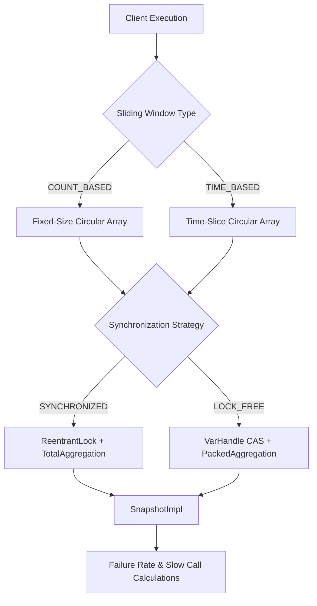
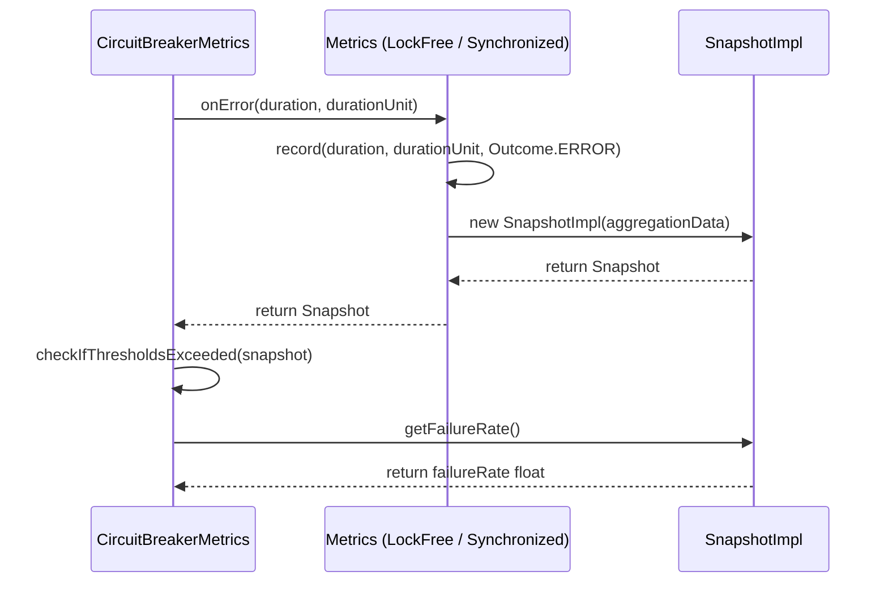

# Sliding Window Metrics

<details>
<summary>Relevant source files</summary>

The following files were used as context for generating this wiki page:

- [grafana_dashboard.json](https://github.com/resilience4j/resilience4j/blob/main/grafana_dashboard.json)
- [resilience4j-circuitbreaker/src/main/java/io/github/resilience4j/circuitbreaker/internal/CircuitBreakerMetrics.java](https://github.com/resilience4j/resilience4j/blob/main/resilience4j-circuitbreaker/src/main/java/io/github/resilience4j/circuitbreaker/internal/CircuitBreakerMetrics.java)
- [resilience4j-core/src/main/java/io/github/resilience4j/core/metrics/LockFreeSlidingTimeWindowMetrics.java](https://github.com/resilience4j/resilience4j/blob/main/resilience4j-core/src/main/java/io/github/resilience4j/core/metrics/LockFreeSlidingTimeWindowMetrics.java)
- [resilience4j-core/src/jmh/java/io/github/resilience4j/core/MetricsBenchmark.java](https://github.com/resilience4j/resilience4j/blob/main/resilience4j-core/src/jmh/java/io/github/resilience4j/core/MetricsBenchmark.java)
- [resilience4j-ratelimiter/src/main/java/io/github/resilience4j/ratelimiter/internal/AtomicRateLimiter.java](https://github.com/resilience4j/ratelimiter/src/main/java/io/github/resilience4j/ratelimiter/internal/AtomicRateLimiter.java)
- [resilience4j-core/src/main/java/io/github/resilience4j/core/metrics/LockFreeFixedSizeSlidingWindowMetrics.java](https://github.com/resilience4j/resilience4j/blob/main/resilience4j-core/src/main/java/io/github/resilience4j/core/metrics/LockFreeFixedSizeSlidingWindowMetrics.java)
- [resilience4j-core/src/main/java/io/github/resilience4j/core/metrics/FixedSizeSlidingWindowMetrics.java](https://github.com/resilience4j/resilience4j/blob/main/resilience4j-core/src/main/java/io/github/resilience4j/core/metrics/FixedSizeSlidingWindowMetrics.java)
- [resilience4j-core/src/main/java/io/github/resilience4j/core/metrics/SlidingTimeWindowMetrics.java](https://github.com/resilience4j/resilience4j/blob/main/resilience4j-core/src/main/java/io/github/resilience4j/core/metrics/SlidingTimeWindowMetrics.java)
- [resilience4j-metrics/src/main/java/io/github/resilience4j/metrics/Timer.java](https://github.com/resilience4j/resilience4j/blob/main/resilience4j-metrics/src/main/java/io/github/resilience4j/metrics/Timer.java)
- [resilience4j-hedge/src/main/java/io/github/resilience4j/hedge/internal/AverageDurationSupplier.java](https://github.com/resilience4j/resilience4j/blob/main/resilience4j-hedge/src/main/java/io/github/resilience4j/hedge/internal/AverageDurationSupplier.java)
- [resilience4j-core/src/jmh/java/io/github/resilience4j/core/VirtualThreadMetricsBenchmark.java](https://github.com/resilience4j/resilience4j/blob/main/resilience4j-core/src/jmh/java/io/github/resilience4j/core/VirtualThreadMetricsBenchmark.java)
- [resilience4j-core/src/main/java/io/github/resilience4j/core/metrics/PackedAggregation.java](https://github.com/resilience4j/resilience4j/blob/main/resilience4j-core/src/main/java/io/github/resilience4j/core/metrics/PackedAggregation.java)
- [resilience4j-core/src/main/java/io/github/resilience4j/core/metrics/Snapshot.java](https://github.com/resilience4j/resilience4j/blob/main/resilience4j-core/src/main/java/io/github/resilience4j/core/metrics/Snapshot.java)
- [resilience4j-ratelimiter/src/main/java/io/github/resilience4j/ratelimiter/internal/SemaphoreBasedRateLimiter.java](https://github.com/resilience4j/ratelimiter/src/main/java/io/github/resilience4j/ratelimiter/internal/SemaphoreBasedRateLimiter.java)
- [resilience4j-hedge/src/main/java/io/github/resilience4j/hedge/internal/HedgeDurationSupplier.java](https://github.com/resilience4j/resilience4j/blob/main/resilience4j-hedge/src/main/java/io/github/resilience4j/hedge/internal/HedgeDurationSupplier.java)
- [resilience4j-spring-boot4/src/main/java/io/github/resilience4j/springboot/ratelimiter/monitoring/health/RateLimitersHealthIndicator.java](https://github.com/resilience4j/resilience4j/blob/main/resilience4j-spring-boot4/src/main/java/io/github/resilience4j/springboot/ratelimiter/monitoring/health/RateLimitersHealthIndicator.java)
- [resilience4j-spring-boot3/src/main/java/io/github/resilience4j/springboot3/ratelimiter/monitoring/health/RateLimitersHealthIndicator.java](https://github.com/resilience4j/resilience4j/blob/main/resilience4j-spring-boot3/src/main/java/io/github/resilience4j/springboot3/ratelimiter/monitoring/health/RateLimitersHealthIndicator.java)
- [resilience4j-core/src/main/java/io/github/resilience4j/core/metrics/SnapshotImpl.java](https://github.com/resilience4j/resilience4j/blob/main/resilience4j-core/src/main/java/io/github/resilience4j/core/metrics/SnapshotImpl.java)
- [resilience4j-core/src/main/java/io/github/resilience4j/core/metrics/AbstractAggregation.java](https://github.com/resilience4j/resilience4j/blob/main/resilience4j-core/src/main/java/io/github/resilience4j/core/metrics/AbstractAggregation.java)
- [resilience4j-circuitbreaker/src/main/java/io/github/resilience4j/circuitbreaker/CircuitBreakerConfig.java](https://github.com/resilience4j/circuitbreaker/src/main/java/io/github/resilience4j/circuitbreaker/CircuitBreakerConfig.java)
- [resilience4j-metrics/src/main/java/io/github/resilience4j/metrics/TimeLimiterMetrics.java](https://github.com/resilience4j/metrics/main/java/io/github/resilience4j/metrics/TimeLimiterMetrics.java)
- [resilience4j-core/src/main/java/io/github/resilience4j/core/metrics/MeasurementData.java](https://github.com/resilience4j/resilience4j/blob/main/resilience4j-core/src/main/java/io/github/resilience4j/core/metrics/MeasurementData.java)
- [resilience4j-core/src/main/java/io/github/resilience4j/core/metrics/Metrics.java](https://github.com/resilience4j/resilience4j/blob/main/resilience4j-core/src/main/java/io/github/resilience4j/core/metrics/Metrics.java)
- [resilience4j-core/src/main/java/io/github/resilience4j/core/metrics/Measurement.java](https://github.com/resilience4j/resilience4j/blob/main/resilience4j-core/src/main/java/io/github/resilience4j/core/metrics/Measurement.java)
- [resilience4j-metrics/src/main/java/io/github/resilience4j/metrics/internal/TimerImpl.java](https://github.com/resilience4j/metrics/main/java/io/github/resilience4j/metrics/internal/TimerImpl.java)
- [resilience4j-core/src/main/java/io/github/resilience4j/core/metrics/PartialAggregation.java](https://github.com/resilience4j/resilience4j/blob/main/resilience4j-core/src/main/java/io/github/resilience4j/core/metrics/PartialAggregation.java)
</details>

## Overview

### Sliding Window Metrics Overview

Sliding Window Metrics form the core numerical engine of Resilience4j, providing high-performance aggregation for components such as the Circuit Breaker and Request Hedging (`AverageDurationSupplier`). Rather than retaining individual call tuples in memory, the subsystem maintains sliding aggregates using either a fixed number of calls or discrete time slices (seconds). This design bounds memory consumption to $O(n)$ while delivering snapshot retrievals in constant $O(1)$ time.

Sources: [resilience4j-core/src/main/java/io/github/resilience4j/core/metrics/FixedSizeSlidingWindowMetrics.java:25-39](https://github.com/resilience4j/resilience4j/blob/main/resilience4j-core/src/main/java/io/github/resilience4j/core/metrics/FixedSizeSlidingWindowMetrics.java#L25-L39)

The architecture addresses high-concurrency bottlenecks through two distinct synchronization strategies: traditional lock-based coordination (`ReentrantLock`) and advanced lock-free concurrency powered by Java's `VarHandle` API and compare-and-swap (CAS) loops. By utilizing techniques like subtract-on-evict, `PackedAggregation` cache-locality optimizations, and CAS-backoff mechanisms, the subsystem sustains massive throughput across both platform threads and virtual threads.

Sources: [resilience4j-core/src/main/java/io/github/resilience4j/core/metrics/SlidingTimeWindowMetrics.java:26-46](https://github.com/resilience4j/resilience4j/blob/main/resilience4j-core/src/main/java/io/github/resilience4j/core/metrics/SlidingTimeWindowMetrics.java#L26-L46)



Sources: [resilience4j-core/src/main/java/io/github/resilience4j/core/metrics/FixedSizeSlidingWindowMetrics.java:25-39](https://github.com/resilience4j/resilience4j/blob/main/resilience4j-core/src/main/java/io/github/resilience4j/core/metrics/FixedSizeSlidingWindowMetrics.java#L25-L39), [resilience4j-core/src/main/java/io/github/resilience4j/core/metrics/SlidingTimeWindowMetrics.java:26-46](https://github.com/resilience4j/resilience4j/blob/main/resilience4j-core/src/main/java/io/github/resilience4j/core/metrics/SlidingTimeWindowMetrics.java#L26-L46)

---

## Public API and Core Interfaces (`Metrics` & `Snapshot`)

### Interface Specifications

The public entry point for recording metrics and querying execution summaries is defined by the `Metrics` and `Snapshot` interfaces. The `Metrics` interface exposes methods to record execution outcomes and obtain point-in-time snapshots, whereas `Snapshot` provides aggregated analytical data.

Sources: [resilience4j-core/src/main/java/io/github/resilience4j/core/metrics/Metrics.java:23-43](https://github.com/resilience4j/resilience4j/blob/main/resilience4j-core/src/main/java/io/github/resilience4j/core/metrics/Metrics.java#L23-L43)

### Interface Methods and Outcomes

- `Snapshot record(long duration, TimeUnit durationUnit, Outcome outcome)`: Records a call with its execution duration, time unit, and classification outcome.
- `Snapshot getSnapshot()`: Retrieves a pre-aggregated point-in-time view of the current window without modifying state.
- `Outcome`: An enumeration defining call outcomes: `SUCCESS`, `ERROR`, `SLOW_SUCCESS`, and `SLOW_ERROR`.

Sources: [resilience4j-core/src/main/java/io/github/resilience4j/core/metrics/Snapshot.java:23-94](https://github.com/resilience4j/resilience4j/blob/main/resilience4j-core/src/main/java/io/github/resilience4j/core/metrics/Snapshot.java#L23-L94)

```java
public interface Metrics {
    Snapshot record(long duration, TimeUnit durationUnit, Outcome outcome);
    Snapshot getSnapshot();

    enum Outcome {
        SUCCESS, ERROR, SLOW_SUCCESS, SLOW_ERROR
    }
}
```

Sources: [resilience4j-core/src/main/java/io/github/resilience4j/core/metrics/Metrics.java:23-43](https://github.com/resilience4j/resilience4j/blob/main/resilience4j-core/src/main/java/io/github/resilience4j/core/metrics/Metrics.java#L23-L43)

---

## Fixed-Size Count-Based Sliding Windows

### Circular Buffer Implementation

`FixedSizeSlidingWindowMetrics` implements a count-based sliding window backed by a circular array of size $N$. When the window size is configured to $N$, the circular array retains exactly $N$ individual measurements protected by a `ReentrantLock`.

Sources: [resilience4j-core/src/main/java/io/github/resilience4j/core/metrics/FixedSizeSlidingWindowMetrics.java:40-62](https://github.com/resilience4j/resilience4j/blob/main/resilience4j-core/src/main/java/io/github/resilience4j/core/metrics/FixedSizeSlidingWindowMetrics.java#L40-L62)

### Subtract-on-Evict Mechanism

Instead of recalculating metrics over all stored items on every recording, the sliding window incrementally updates a single `TotalAggregation`. When a new call outcome is recorded, the window pointer advances to the next bucket, the oldest measurement contained in that bucket is subtracted from the total aggregation via `totalAggregation.removeBucket(latestMeasurement)`, and the bucket is reset and populated with the new call data.

Sources: [resilience4j-core/src/main/java/io/github/resilience4j/core/metrics/FixedSizeSlidingWindowMetrics.java:64-93](https://github.com/resilience4j/resilience4j/blob/main/resilience4j-core/src/main/java/io/github/resilience4j/core/metrics/FixedSizeSlidingWindowMetrics.java#L64-L93)

```java
private Measurement moveWindowByOne() {
    moveHeadIndexByOne();
    Measurement latestMeasurement = getLatestMeasurement();
    totalAggregation.removeBucket(latestMeasurement);
    latestMeasurement.reset();
    return latestMeasurement;
}
```

Sources: [resilience4j-core/src/main/java/io/github/resilience4j/core/metrics/FixedSizeSlidingWindowMetrics.java:87-93](https://github.com/resilience4j/resilience4j/blob/main/resilience4j-core/src/main/java/io/github/resilience4j/core/metrics/FixedSizeSlidingWindowMetrics.java#L87-L93)

> [!NOTE]
> The subtract-on-evict pattern guarantees $O(1)$ snapshot retrieval time regardless of the sliding window size $N$, trading minor arithmetic overhead during recording for instantaneous threshold evaluations.

Sources: [resilience4j-core/src/main/java/io/github/resilience4j/core/metrics/FixedSizeSlidingWindowMetrics.java:25-39](https://github.com/resilience4j/resilience4j/blob/main/resilience4j-core/src/main/java/io/github/resilience4j/core/metrics/FixedSizeSlidingWindowMetrics.java#L25-L39)

---

## Sliding Time-Window Metrics

### Time-Slice Aggregation Structure

`SlidingTimeWindowMetrics` aggregates call outcomes over the last $N$ seconds rather than a fixed number of calls. It utilizes a circular array of `PartialAggregation` (bucket) instances, where each bucket aggregates metrics for a specific epoch second.

Sources: [resilience4j-core/src/main/java/io/github/resilience4j/core/metrics/SlidingTimeWindowMetrics.java:47-75](https://github.com/resilience4j/resilience4j/blob/main/resilience4j-core/src/main/java/io/github/resilience4j/core/metrics/SlidingTimeWindowMetrics.java#L47-L75)

### Epoch Second Alignment and Window Advancement

The head bucket represents the current epoch second. When `record()` or `getSnapshot()` is invoked, `moveWindowToCurrentEpochSecond()` calculates the difference between the current system epoch second and the latest bucket's epoch second. If time has advanced, the window head index moves forward, evicted buckets are subtracted from the `TotalAggregation`, and stale buckets are reset with new epoch second timestamps.

Sources: [resilience4j-core/src/main/java/io/github/resilience4j/core/metrics/SlidingTimeWindowMetrics.java:76-127](https://github.com/resilience4j/resilience4j/blob/main/resilience4j-core/src/main/java/io/github/resilience4j/core/metrics/SlidingTimeWindowMetrics.java#L76-L127)

```java
private PartialAggregation moveWindowToCurrentEpochSecond(
    PartialAggregation latestPartialAggregation) {
    long currentEpochSecond = clock.instant().getEpochSecond();
    long differenceInSeconds = currentEpochSecond - latestPartialAggregation.getEpochSecond();
    if (differenceInSeconds == 0) {
        return latestPartialAggregation;
    }
    long secondsToMoveTheWindow = Math.min(differenceInSeconds, timeWindowSizeInSeconds);
    PartialAggregation currentPartialAggregation;
    do {
        secondsToMoveTheWindow--;
        moveHeadIndexByOne();
        currentPartialAggregation = getLatestPartialAggregation();
        totalAggregation.removeBucket(currentPartialAggregation);
        currentPartialAggregation.reset(currentEpochSecond - secondsToMoveTheWindow);
    } while (secondsToMoveTheWindow > 0);
    return currentPartialAggregation;
}
```

Sources: [resilience4j-core/src/main/java/io/github/resilience4j/core/metrics/SlidingTimeWindowMetrics.java:110-127](https://github.com/resilience4j/resilience4j/blob/main/resilience4j-core/src/main/java/io/github/resilience4j/core/metrics/SlidingTimeWindowMetrics.java#L110-L127)

---

## Lock-Free Sliding Windows (`VarHandle` Architecture)

### Atomic VarHandle Mechanism

To eliminate lock contention under high concurrency, Resilience4j provides lock-free implementations: `LockFreeFixedSizeSlidingWindowMetrics` and `LockFreeSlidingTimeWindowMetrics`. These classes manage circular buffers represented as linked lists controlled via atomic `VarHandle` operations (`HEAD`, `TAIL`, `NEXT`, `TIME_SLICE`).

Sources: [resilience4j-core/src/main/java/io/github/resilience4j/core/metrics/LockFreeFixedSizeSlidingWindowMetrics.java:60-78](https://github.com/resilience4j/resilience4j/blob/main/resilience4j-core/src/main/java/io/github/resilience4j/core/metrics/LockFreeFixedSizeSlidingWindowMetrics.java#L60-L78), [resilience4j-core/src/main/java/io/github/resilience4j/core/metrics/LockFreeSlidingTimeWindowMetrics.java:46-67](https://github.com/resilience4j/resilience4j/blob/main/resilience4j-core/src/main/java/io/github/resilience4j/core/metrics/LockFreeSlidingTimeWindowMetrics.java#L46-L67)

### Lock-Free Algorithmic Flow

1. **Read References**: Read current `headRef`, `tailRef`, and their `.next` links.
2. **CAS Validation**: Verify that `head == headRef` to ensure the head has not fallen off the list due to concurrent advancement.
3. **Node Extension or Advancement**:
   - If `tailNext == null`, attempt to allocate and attach a new `Node` via `NEXT.compareAndSet(tail, null, nextNode)`.
   - If `tailNext != null`, advance `HEAD` and `TAIL` pointers using weak CAS operations (`HEAD.weakCompareAndSet(...)`).
4. **Backoff on Contention**: If a CAS operation fails, invoke `CASBackoffUtil.performBackoff(spinCount)` to yield or park efficiently without busy-waiting.

Sources: [resilience4j-core/src/main/java/io/github/resilience4j/core/metrics/LockFreeFixedSizeSlidingWindowMetrics.java:99-160](https://github.com/resilience4j/resilience4j/blob/main/resilience4j-core/src/main/java/io/github/resilience4j/core/metrics/LockFreeFixedSizeSlidingWindowMetrics.java#L99-L160)

```java
if (tailNext == null) {
    int nextId = (tail.id + 1) % windowSize;
    PackedAggregation nextStats = tail.stats.copy();
    nextStats.discard(head.stats);
    nextStats.record(duration, durationUnit, outcome);
    Node nextNode = new Node(nextId, nextStats, null);

    if (NEXT.compareAndSet(tail, null, nextNode)) {
        if (HEAD.weakCompareAndSet(this, head, headNext)) {
            TAIL.weakCompareAndSet(this, tail, nextNode);
        }
        return new SnapshotImpl(nextNode.stats);
    }
}
```

Sources: [resilience4j-core/src/main/java/io/github/resilience4j/core/metrics/LockFreeFixedSizeSlidingWindowMetrics.java:127-148](https://github.com/resilience4j/resilience4j/blob/main/resilience4j-core/src/main/java/io/github/resilience4j/core/metrics/LockFreeFixedSizeSlidingWindowMetrics.java#L127-L148)

> [!CAUTION]
> For `TIME_BASED` windows with `LOCK_FREE` strategy, the `slidingWindowSize` must be at least `2`. Configuring a size of 1 throws an `IllegalArgumentException` during builder validation.

Sources: [resilience4j-circuitbreaker/src/main/java/io/github/resilience4j/circuitbreaker/CircuitBreakerConfig.java:681-683](https://github.com/resilience4j/circuitbreaker/src/main/java/io/github/resilience4j/circuitbreaker/CircuitBreakerConfig.java#L681-L683)

---

## Call-Chain Execution Walkthrough

### Failure Recording and Snapshot Resolution Trace

When a protected operation fails in a Circuit Breaker, metrics are updated and checked against failure thresholds. The execution flow follows a precise chain from event invocation to snapshot analysis.

Sources: [resilience4j-circuitbreaker/src/main/java/io/github/resilience4j/circuitbreaker/internal/CircuitBreakerMetrics.java:124-132](https://github.com/resilience4j/circuitbreaker/internal/CircuitBreakerMetrics.java#L124-L132)



Sources: [resilience4j-circuitbreaker/src/main/java/io/github/resilience4j/circuitbreaker/internal/CircuitBreakerMetrics.java:124-132](https://github.com/resilience4j/circuitbreaker/internal/CircuitBreakerMetrics.java#L124-L132), [resilience4j-core/src/main/java/io/github/resilience4j/core/metrics/SnapshotImpl.java:32-38](https://github.com/resilience4j/resilience4j/blob/main/resilience4j-core/src/main/java/io/github/resilience4j/core/metrics/SnapshotImpl.java#L32-L38)

### Walkthrough Steps

1. **`onError()`**: `CircuitBreakerMetrics.onError()` evaluates whether the call duration exceeds the slow call threshold, determining the outcome (`Outcome.SLOW_ERROR` or `Outcome.ERROR`).
2. **`checkIfThresholdsExceeded()`**: Passes the resulting `Snapshot` to `checkIfThresholdsExceeded(snapshot)`.
3. **`getFailureRate()`**: Invokes `getFailureRate(snapshot)` which calls `snapshot.getFailureRate()` to evaluate failure ratios against configured thresholds.
4. **`getSnapshot()`**: Retrieves the underlying snapshot from the metrics accumulator to complete the evaluation cycle.

Sources: [resilience4j-circuitbreaker/src/main/java/io/github/resilience4j/circuitbreaker/internal/CircuitBreakerMetrics.java:124-159](https://github.com/resilience4j/circuitbreaker/internal/CircuitBreakerMetrics.java#L124-L159), [resilience4j-circuitbreaker/src/main/java/io/github/resilience4j/circuitbreaker/internal/CircuitBreakerMetrics.java:202-205](https://github.com/resilience4j/circuitbreaker/internal/CircuitBreakerMetrics.java#L202-L205), [resilience4j-core/src/main/java/io/github/resilience4j/core/metrics/Metrics.java:34-39](https://github.com/resilience4j/resilience4j/blob/main/resilience4j-core/src/main/java/io/github/resilience4j/core/metrics/Metrics.java#L34-L39)

---

## Configuration Reference Table

### Sliding Window Parameters

Sliding window metrics behavior is governed by configuration options exposed through `CircuitBreakerConfig` and related builders.

Sources: [resilience4j-circuitbreaker/src/main/java/io/github/resilience4j/circuitbreaker/CircuitBreakerConfig.java:43-54](https://github.com/resilience4j/circuitbreaker/src/main/java/io/github/resilience4j/circuitbreaker/CircuitBreakerConfig.java#L43-L54)

| Parameter | Type | Default Value | Description |
| :--- | :--- | :--- | :--- |
| `slidingWindowSize` | `int` | `100` | Size of the sliding window (number of calls or time units). |
| `minimumNumberOfCalls` | `int` | `100` | Minimum calls required in the window before calculating failure rate. |
| `slidingWindowType` | `SlidingWindowType` | `COUNT_BASED` | Window aggregation strategy: `COUNT_BASED` or `TIME_BASED`. |
| `slidingWindowSynchronizationStrategy` | `SlidingWindowSynchronizationStrategy` | `SYNCHRONIZED` | Concurrency strategy: `SYNCHRONIZED` (locks) or `LOCK_FREE` (CAS). |
| `slowCallDurationThreshold` | `Duration` | `60s` | Duration threshold above which a call is classified as slow. |
| `slowCallRateThreshold` | `float` | `100%` | Percentage of slow calls required to trigger state transitions. |

Sources: [resilience4j-circuitbreaker/src/main/java/io/github/resilience4j/circuitbreaker/CircuitBreakerConfig.java:43-54](https://github.com/resilience4j/circuitbreaker/src/main/java/io/github/resilience4j/circuitbreaker/CircuitBreakerConfig.java#L43-L54)

---

## Design Trade-Offs

### Architectural Trade-Offs Analysis

The metrics subsystem implements deliberate architectural choices balancing memory allocation, contention handling, and computational complexity.

Sources: [resilience4j-core/src/main/java/io/github/resilience4j/core/metrics/FixedSizeSlidingWindowMetrics.java:25-39](https://github.com/resilience4j/resilience4j/blob/main/resilience4j-core/src/main/java/io/github/resilience4j/core/metrics/FixedSizeSlidingWindowMetrics.java#L25-L39)

| Design Choice | Benefit | Cost |
| :--- | :--- | :--- |
| **Count-Based vs. Time-Based Windows** | Count-based bounds memory strictly by call volume; time-based captures temporal recency. | Time-based requires clock reads and second-boundary alignment checks. |
| **Synchronized (`ReentrantLock`) Strategy** | Zero extra object allocation during recording; simple state mutation in place. | Potential thread blocking and higher latency under OS scheduler thread preemption. |
| **Lock-Free (`VarHandle`) Strategy** | Superior throughput and reduced thread contention under high concurrency. | Higher object allocation overhead due to immutable node and aggregation copying. |
| **`PackedAggregation` Cache Locality** | Packs primitive arrays (`long[]`, `int[]`) for optimal CPU cache line utilization. | Index-based field access requires maintaining strict constant offset mappings. |

Sources: [resilience4j-core/src/main/java/io/github/resilience4j/core/metrics/FixedSizeSlidingWindowMetrics.java:25-39](https://github.com/resilience4j/resilience4j/blob/main/resilience4j-core/src/main/java/io/github/resilience4j/core/metrics/FixedSizeSlidingWindowMetrics.java#L25-L39), [resilience4j-circuitbreaker/src/main/java/io/github/resilience4j/circuitbreaker/CircuitBreakerConfig.java:228-246](https://github.com/resilience4j/circuitbreaker/src/main/java/io/github/resilience4j/circuitbreaker/CircuitBreakerConfig.java#L228-L246), [resilience4j-core/src/main/java/io/github/resilience4j/core/metrics/PackedAggregation.java:24-34](https://github.com/resilience4j/resilience4j/blob/main/resilience4j-core/src/main/java/io/github/resilience4j/core/metrics/PackedAggregation.java#L24-L34)

---

## Runnable Usage Example

### Code Example

The following example demonstrates how to instantiate a lock-free count-based sliding window metrics instance, record call outcomes, and inspect the resulting snapshot statistics.

Sources: [resilience4j-core/src/main/java/io/github/resilience4j/core/metrics/LockFreeFixedSizeSlidingWindowMetrics.java:60-169](https://github.com/resilience4j/resilience4j/blob/main/resilience4j-core/src/main/java/io/github/resilience4j/core/metrics/LockFreeFixedSizeSlidingWindowMetrics.java#L60-L169)

```java
import io.github.resilience4j.core.metrics.LockFreeFixedSizeSlidingWindowMetrics;
import io.github.resilience4j.core.metrics.Metrics;
import io.github.resilience4j.core.metrics.Snapshot;

import java.util.concurrent.TimeUnit;

public class SlidingWindowMetricsExample {
    public static void main(String[] args) {
        // Create a lock-free fixed-size sliding window with a capacity of 10 calls
        Metrics metrics = new LockFreeFixedSizeSlidingWindowMetrics(10);

        // Record successful and failed calls
        metrics.record(150, TimeUnit.MILLISECONDS, Metrics.Outcome.SUCCESS);
        metrics.record(200, TimeUnit.MILLISECONDS, Metrics.Outcome.SUCCESS);
        metrics.record(1200, TimeUnit.MILLISECONDS, Metrics.Outcome.SLOW_ERROR);

        // Retrieve an immutable snapshot
        Snapshot snapshot = metrics.getSnapshot();

        System.out.println("Total Calls: " + snapshot.getTotalNumberOfCalls());
        System.out.println("Successful Calls: " + snapshot.getNumberOfSuccessfulCalls());
        System.out.println("Failed Calls: " + snapshot.getNumberOfFailedCalls());
        System.out.println("Failure Rate: " + snapshot.getFailureRate() + "%");
        System.out.println("Average Duration: " + snapshot.getAverageDuration().toMillis() + "ms");
    }
}
```

Sources: [resilience4j-core/src/main/java/io/github/resilience4j/core/metrics/LockFreeFixedSizeSlidingWindowMetrics.java:60-169](https://github.com/resilience4j/resilience4j/blob/main/resilience4j-core/src/main/java/io/github/resilience4j/core/metrics/LockFreeFixedSizeSlidingWindowMetrics.java#L60-L169), [resilience4j-core/src/main/java/io/github/resilience4j/core/metrics/Snapshot.java:23-94](https://github.com/resilience4j/resilience4j/blob/main/resilience4j-core/src/main/java/io/github/resilience4j/core/metrics/Snapshot.java#L23-L94)

## Related

- [[Circuit Breaker State Machine]]
- [[Tagged Micrometer Metrics]]

