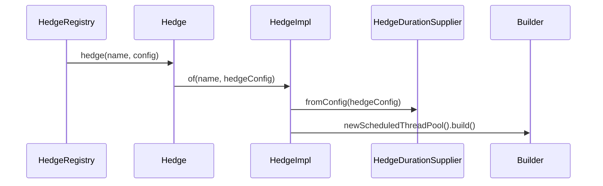
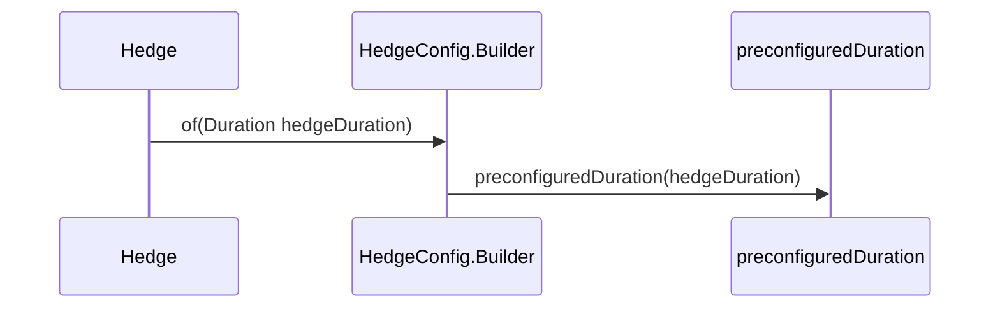
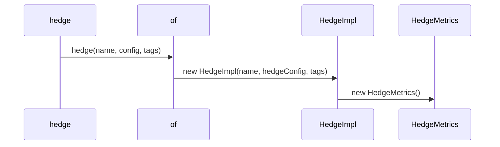

# Speculative Hedging

<details>
<summary>Relevant source files</summary>

The following files were used as context for generating this wiki page:

- [README.adoc](https://github.com/resilience4j/resilience4j/blob/main/README.adoc)
- [resilience4j-framework-common/src/main/java/io/github/resilience4j/common/retry/configuration/CommonRetryConfigurationProperties.java](https://github.com/resilience4j/resilience4j/blob/main/resilience4j-framework-common/src/main/java/io/github/resilience4j/common/retry/configuration/CommonRetryConfigurationProperties.java)
- [resilience4j-hedge/src/main/java/io/github/resilience4j/hedge/internal/HedgeImpl.java](https://github.com/resilience4j/resilience4j/blob/main/resilience4j-hedge/src/main/java/io/github/resilience4j/hedge/internal/HedgeImpl.java)
- [resilience4j-spring6/src/main/java/io/github/resilience4j/spring6/retry/configure/RetryAspect.java](https://github.com/resilience4j/resilience4j/blob/main/resilience4j-spring6/src/main/java/io/github/resilience4j/spring6/retry/configure/RetryAspect.java)
- [resilience4j-hedge/src/main/java/io/github/resilience4j/hedge/Hedge.java](https://github.com/resilience4j/resilience4j/blob/main/resilience4j-hedge/src/main/java/io/github/resilience4j/hedge/Hedge.java)
- [resilience4j-spring6/src/main/java/io/github/resilience4j/spring6/timelimiter/configure/TimeLimiterAspect.java](https://github.com/resilience4j/spring6/timelimiter/configure/TimeLimiterAspect.java)
- [resilience4j-retry/src/main/java/io/github/resilience4j/retry/internal/RetryImpl.java](https://github.com/resilience4j/resilience4j/blob/main/resilience4j-retry/src/main/java/io/github/resilience4j/retry/internal/RetryImpl.java)
- [resilience4j-hedge/src/main/java/io/github/resilience4j/hedge/HedgeConfig.java](https://github.com/resilience4j/resilience4j/blob/main/resilience4j-hedge/src/main/java/io/github/resilience4j/hedge/HedgeConfig.java)
- [resilience4j-spring6/src/main/java/io/github/resilience4j/spring6/bulkhead/configure/BulkheadAspect.java](https://github.com/resilience4j/spring6/bulkhead/configure/BulkheadAspect.java)
- [resilience4j-micronaut/src/main/java/io/github/resilience4j/micronaut/timelimiter/TimeLimiterInterceptor.java](https://github.com/resilience4j/micronaut/src/main/java/io/github/resilience4j/micronaut/timelimiter/TimeLimiterInterceptor.java)
- [resilience4j-micronaut/src/main/java/io/github/resilience4j/micronaut/retry/RetryInterceptor.java](https://github.com/resilience4j/micronaut/retry/RetryInterceptor.java)
- [resilience4j-hedge/src/main/java/io/github/resilience4j/hedge/internal/InMemoryHedgeRegistry.java](https://github.com/resilience4j/resilience4j/blob/main/resilience4j-hedge/src/main/java/io/github/resilience4j/hedge/internal/InMemoryHedgeRegistry.java)
- [resilience4j-spring6/src/main/java/io/github/resilience4j/spring6/ratelimiter/configure/RateLimiterAspect.java](https://github.com/resilience4j/spring6/ratelimiter/configure/RateLimiterAspect.java)
- [resilience4j-hedge/src/main/java/io/github/resilience4j/hedge/internal/HedgeDurationSupplier.java](https://github.com/resilience4j/resilience4j/blob/main/resilience4j-hedge/src/main/java/io/github/resilience4j/hedge/internal/HedgeDurationSupplier.java)
- [grafana_dashboard.json](https://github.com/resilience4j/resilience4j/blob/main/grafana_dashboard.json)
- [resilience4j-hedge/src/main/java/io/github/resilience4j/hedge/internal/HedgeEventProcessor.java](https://github.com/resilience4j/resilience4j/blob/main/resilience4j-hedge/src/main/java/io/github/resilience4j/hedge/internal/HedgeEventProcessor.java)
- [resilience4j-hedge/src/main/java/io/github/resilience4j/hedge/event/HedgeOnSecondarySuccessEvent.java](https://github.com/resilience4j/resilience4j/blob/main/resilience4j-hedge/src/main/java/io/github/resilience4j/hedge/event/HedgeOnSecondarySuccessEvent.java)
- [resilience4j-hedge/src/main/java/io/github/resilience4j/hedge/event/HedgeOnSecondaryFailureEvent.java](https://github.com/resilience4j/resilience4j/blob/main/resilience4j-hedge/src/main/java/io/github/resilience4j/hedge/event/HedgeOnSecondaryFailureEvent.java)
- [resilience4j-hedge/src/main/java/io/github/resilience4j/hedge/internal/AverageDurationSupplier.java](https://github.com/resilience4j/resilience4j/blob/main/resilience4j-hedge/src/main/java/io/github/resilience4j/hedge/internal/AverageDurationSupplier.java)
- [resilience4j-hedge/src/main/java/io/github/resilience4j/hedge/package-info.java](https://github.com/resilience4j/resilience4j/blob/main/resilience4j-hedge/src/main/java/io/github/resilience4j/hedge/package-info.java)
- [resilience4j-spring6/src/main/java/io/github/resilience4j/spring6/fallback/FallbackExecutor.java](https://github.com/resilience4j/resilience4j/blob/main/resilience4j-spring6/src/main/java/io/github/resilience4j/spring6/fallback/FallbackExecutor.java)
- [resilience4j-hedge/src/main/java/io/github/resilience4j/hedge/internal/HedgeResult.java](https://github.com/resilience4j/resilience4j/blob/main/resilience4j-hedge/src/main/java/io/github/resilience4j/hedge/internal/HedgeResult.java)
- [resilience4j-hedge/src/main/java/io/github/resilience4j/hedge/event/HedgeOnPrimarySuccessEvent.java](https://github.com/resilience4j/resilience4j/blob/main/resilience4j-hedge/src/main/java/io/github/resilience4j/hedge/event/HedgeOnPrimarySuccessEvent.java)
- [resilience4j-hedge/src/main/java/io/github/resilience4j/hedge/event/HedgeOnPrimaryFailureEvent.java](https://github.com/resilience4j/resilience4j/blob/main/resilience4j-hedge/src/main/java/io/github/resilience4j/hedge/event/HedgeOnPrimaryFailureEvent.java)
- [resilience4j-timelimiter/src/main/java/io/github/resilience4j/timelimiter/TimeLimiter.java](https://github.com/resilience4j/resilience4j/blob/main/resilience4j-timelimiter/src/main/java/io/github/resilience4j/timelimiter/TimeLimiter.java)
- [resilience4j-hedge/src/main/java/io/github/resilience4j/hedge/internal/PreconfiguredDurationSupplier.java](https://github.com/resilience4j/resilience4j/blob/main/resilience4j-hedge/src/main/java/io/github/resilience4j/hedge/internal/PreconfiguredDurationSupplier.java)
- [resilience4j-hedge/src/main/java/io/github/resilience4j/hedge/event/HedgeEvent.java](https://github.com/resilience4j/resilience4j/blob/main/resilience4j-hedge/src/main/java/io/github/resilience4j/hedge/event/HedgeEvent.java)
- [resilience4j-hedge/src/main/java/io/github/resilience4j/hedge/HedgeRegistry.java](https://github.com/resilience4j/resilience4j/blob/main/resilience4j-hedge/src/main/java/io/github/resilience4j/hedge/HedgeRegistry.java)
- [resilience4j-micronaut/src/main/java/io/github/resilience4j/micronaut/BaseInterceptor.java](https://github.com/resilience4j/micronaut/src/main/java/io/github/resilience4j/micronaut/BaseInterceptor.java)
</details>

## Overview

Speculative hedging improves tail latency and system responsiveness in distributed applications by proactively launching redundant secondary execution attempts when primary service calls exceed configurable time thresholds. Designed to mitigate unpredictable response time tails without waiting for timeouts or failures, hedging ensures high availability for side-effect-free and idempotent operations. Resilience4j provides robust instance lifecycle management through registries, dynamic duration calculation strategies, event-driven observability, and seamless framework integration via decorator patterns. Sources: [resilience4j-hedge/src/main/java/io/github/resilience4j/hedge/Hedge.java#L31-L41](https://github.com/resilience4j/resilience4j/blob/main/resilience4j-hedge/src/main/java/io/github/resilience4j/hedge/Hedge.java#L31-L41), [resilience4j-hedge/src/main/java/io/github/resilience4j/hedge/internal/HedgeImpl.java#L38-L138](https://github.com/resilience4j/resilience4j/blob/main/resilience4j-hedge/src/main/java/io/github/resilience4j/hedge/internal/HedgeImpl.java#L38-L138)

## Public Interface and Registry Architecture

### Overview

The speculative hedging module centers around the `Hedge` interface, which defines operations for submitting callables and decorating completion stages, and the `HedgeRegistry` interface, which manages named instances via `InMemoryHedgeRegistry`. Instances can be created using static factory methods on `Hedge` or configured via `HedgeConfig` and its inner `Builder`. Sources: [resilience4j-hedge/src/main/java/io/github/resilience4j/hedge/Hedge.java#L42-L115](https://github.com/resilience4j/resilience4j/blob/main/resilience4j-hedge/src/main/java/io/github/resilience4j/hedge/Hedge.java#L42-L115), [resilience4j-hedge/src/main/java/io/github/resilience4j/hedge/HedgeRegistry.java#L28-L40](https://github.com/resilience4j/resilience4j/blob/main/resilience4j-hedge/src/main/java/io/github/resilience4j/hedge/HedgeRegistry.java#L28-L40), [resilience4j-hedge/src/main/java/io/github/resilience4j/hedge/internal/InMemoryHedgeRegistry.java#L37-L38](https://github.com/resilience4j/resilience4j/blob/main/resilience4j-hedge/src/main/java/io/github/resilience4j/hedge/internal/InMemoryHedgeRegistry.java#L37-L38)

### Call-Chain Execution Walkthrough

1. `hedge` — Initiates the creation or retrieval of a named hedge instance through the registry interface method. Sources: [resilience4j-hedge/src/main/java/io/github/resilience4j/hedge/HedgeRegistry.java#L56-L56](https://github.com/resilience4j/resilience4j/blob/main/resilience4j-hedge/src/main/java/io/github/resilience4j/hedge/HedgeRegistry.java#L56-L56)
2. `of` — Static factory method on the `Hedge` interface that accepts a name and configuration, passing them down to construct the implementation. Sources: [resilience4j-hedge/src/main/java/io/github/resilience4j/hedge/Hedge.java#L82-L84](https://github.com/resilience4j/resilience4j/blob/main/resilience4j-hedge/src/main/java/io/github/resilience4j/hedge/Hedge.java#L82-L84)
3. `HedgeImpl` — Constructor that initializes event processing, creates metrics collectors, instantiates duration suppliers, and builds a context-aware scheduled thread pool executor. Sources: [resilience4j-hedge/src/main/java/io/github/resilience4j/hedge/internal/HedgeImpl.java#L54-L68](https://github.com/resilience4j/resilience4j/blob/main/resilience4j-hedge/src/main/java/io/github/resilience4j/hedge/internal/HedgeImpl.java#L54-L68)
4. `fromConfig` — Called within the `HedgeImpl` constructor to instantiate the specific `HedgeDurationSupplier` strategy based on the provided configuration. Sources: [resilience4j-hedge/src/main/java/io/github/resilience4j/hedge/internal/HedgeImpl.java#L59-L60](https://github.com/resilience4j/resilience4j/blob/main/resilience4j-hedge/src/main/java/io/github/resilience4j/hedge/internal/HedgeImpl.java#L59-L60)
5. `Builder` — Fluent builder implementation inside `InMemoryHedgeRegistry` or `HedgeConfig` used to assemble custom configuration parameters and registry consumers. Sources: [resilience4j-hedge/src/main/java/io/github/resilience4j/hedge/internal/InMemoryHedgeRegistry.java#L54-L95](https://github.com/resilience4j/resilience4j/blob/main/resilience4j-hedge/src/main/java/io/github/resilience4j/hedge/internal/InMemoryHedgeRegistry.java#L54-L95), [resilience4j-hedge/src/main/java/io/github/resilience4j/hedge/HedgeConfig.java#L131-L242](https://github.com/resilience4j/resilience4j/blob/main/resilience4j-hedge/src/main/java/io/github/resilience4j/hedge/HedgeConfig.java#L131-L242)



Sources: [resilience4j-hedge/src/main/java/io/github/resilience4j/hedge/HedgeRegistry.java#L80-L81](https://github.com/resilience4j/resilience4j/blob/main/resilience4j-hedge/src/main/java/io/github/resilience4j/hedge/HedgeRegistry.java#L80-L81), [resilience4j-hedge/src/main/java/io/github/resilience4j/hedge/Hedge.java#L82-L84](https://github.com/resilience4j/resilience4j/blob/main/resilience4j-hedge/src/main/java/io/github/resilience4j/hedge/Hedge.java#L82-L84), [resilience4j-hedge/src/main/java/io/github/resilience4j/hedge/internal/HedgeImpl.java#L50-L68](https://github.com/resilience4j/resilience4j/blob/main/resilience4j-hedge/src/main/java/io/github/resilience4j/hedge/internal/HedgeImpl.java#L50-L68)

### Registry API and Configuration Methods

| Method Signature | Return Type | Description |
|------------------|-------------|-------------|
| `HedgeRegistry.builder()` | `InMemoryHedgeRegistry.Builder` | Obtains a builder instance for constructing an `InMemoryHedgeRegistry`. Sources: [resilience4j-hedge/src/main/java/io/github/resilience4j/hedge/HedgeRegistry.java#L38-L40](https://github.com/resilience4j/resilience4j/blob/main/resilience4j-hedge/src/main/java/io/github/resilience4j/hedge/HedgeRegistry.java#L38-L40) |
| `HedgeRegistry.getAllHedges()` | `Stream<Hedge>` | Returns a stream of all managed `Hedge` instances. Sources: [resilience4j-hedge/src/main/java/io/github/resilience4j/hedge/HedgeRegistry.java#L47-L47](https://github.com/resilience4j/resilience4j/blob/main/resilience4j-hedge/src/main/java/io/github/resilience4j/hedge/HedgeRegistry.java#L47-L47) |
| `HedgeRegistry.hedge(String name)` | `Hedge` | Returns an existing managed hedge or creates a new one using default configuration. Sources: [resilience4j-hedge/src/main/java/io/github/resilience4j/hedge/HedgeRegistry.java#L56-L56](https://github.com/resilience4j/resilience4j/blob/main/resilience4j-hedge/src/main/java/io/github/resilience4j/hedge/HedgeRegistry.java#L56-L56) |
| `HedgeRegistry.hedge(String name, Map<String, String> tags)` | `Hedge` | Returns or creates a managed hedge with custom tags merged over registry tags. Sources: [resilience4j-hedge/src/main/java/io/github/resilience4j/hedge/HedgeRegistry.java#L70-L70](https://github.com/resilience4j/resilience4j/blob/main/resilience4j-hedge/src/main/java/io/github/resilience4j/hedge/HedgeRegistry.java#L70-L70) |
| `HedgeRegistry.hedge(String name, HedgeConfig config)` | `Hedge` | Returns or creates a managed hedge with a custom `HedgeConfig`. Sources: [resilience4j-hedge/src/main/java/io/github/resilience4j/hedge/HedgeRegistry.java#L80-L80](https://github.com/resilience4j/resilience4j/blob/main/resilience4j-hedge/src/main/java/io/github/resilience4j/hedge/HedgeRegistry.java#L80-L80) |
| `HedgeRegistry.hedge(String name, Supplier<HedgeConfig> supplier)` | `Hedge` | Returns or creates a managed hedge using a configuration supplier. Sources: [resilience4j-hedge/src/main/java/io/github/resilience4j/hedge/HedgeRegistry.java#L106-L106](https://github.com/resilience4j/resilience4j/blob/main/resilience4j-hedge/src/main/java/io/github/resilience4j/hedge/HedgeRegistry.java#L106-L106) |
| `HedgeRegistry.hedge(String name, String configName)` | `Hedge` | Returns or creates a managed hedge referencing a pre-added shared configuration name. Sources: [resilience4j-hedge/src/main/java/io/github/resilience4j/hedge/HedgeRegistry.java#L133-L133](https://github.com/resilience4j/resilience4j/blob/main/resilience4j-hedge/src/main/java/io/github/resilience4j/hedge/HedgeRegistry.java#L133-L133) |

Sources: [resilience4j-hedge/src/main/java/io/github/resilience4j/hedge/HedgeRegistry.java#L38-L149](https://github.com/resilience4j/resilience4j/blob/main/resilience4j-hedge/src/main/java/io/github/resilience4j/hedge/HedgeRegistry.java#L38-L149)

### Design Trade-Offs

| Design Choice | Benefit | Cost |
|----------------|---------|------|
| Abstract registry inheritance (`AbstractRegistry`) | Standardizes instance caching, event consumption, and shared configuration lookup across Resilience4j modules. Sources: [resilience4j-hedge/src/main/java/io/github/resilience4j/hedge/internal/InMemoryHedgeRegistry.java#L37-L38](https://github.com/resilience4j/resilience4j/blob/main/resilience4j-hedge/src/main/java/io/github/resilience4j/hedge/internal/InMemoryHedgeRegistry.java#L37-L38) | Imposes class hierarchy coupling on the registry implementation. Sources: [resilience4j-hedge/src/main/java/io/github/resilience4j/hedge/internal/InMemoryHedgeRegistry.java#L37-L38](https://github.com/resilience4j/resilience4j/blob/main/resilience4j-hedge/src/main/java/io/github/resilience4j/hedge/internal/InMemoryHedgeRegistry.java#L37-L38) |
| `ContextAwareScheduledThreadPoolExecutor` integration | Automatically propagates execution contexts (such as MDC or security context) to scheduled hedged threads. Sources: [resilience4j-hedge/src/main/java/io/github/resilience4j/hedge/internal/HedgeImpl.java#L62-L67](https://github.com/resilience4j/resilience4j/blob/main/resilience4j-hedge/src/main/java/io/github/resilience4j/hedge/internal/HedgeImpl.java#L62-L67) | Additional overhead during task scheduling and thread pool initialization. Sources: [resilience4j-hedge/src/main/java/io/github/resilience4j/hedge/internal/HedgeImpl.java#L62-L67](https://github.com/resilience4j/resilience4j/blob/main/resilience4j-hedge/src/main/java/io/github/resilience4j/hedge/internal/HedgeImpl.java#L62-L67) |
| Lazy supplier evaluation (`Supplier<HedgeConfig>`) | Defers configuration resolution until instance creation time, supporting dynamic property sources. Sources: [resilience4j-hedge/src/main/java/io/github/resilience4j/hedge/HedgeRegistry.java#L121-L123](https://github.com/resilience4j/resilience4j/blob/main/resilience4j-hedge/src/main/java/io/github/resilience4j/hedge/HedgeRegistry.java#L121-L123) | Introduces potential null-pointer or configuration lookup exceptions at runtime if suppliers fail. Sources: [resilience4j-hedge/src/main/java/io/github/resilience4j/hedge/HedgeRegistry.java#L121-L123](https://github.com/resilience4j/resilience4j/blob/main/resilience4j-hedge/src/main/java/io/github/resilience4j/hedge/HedgeRegistry.java#L121-L123) |

Sources: [resilience4j-hedge/src/main/java/io/github/resilience4j/hedge/internal/InMemoryHedgeRegistry.java#L37-L38](https://github.com/resilience4j/resilience4j/blob/main/resilience4j-hedge/src/main/java/io/github/resilience4j/hedge/internal/InMemoryHedgeRegistry.java#L37-L38), [resilience4j-hedge/src/main/java/io/github/resilience4j/hedge/internal/HedgeImpl.java#L62-L67](https://github.com/resilience4j/resilience4j/blob/main/resilience4j-hedge/src/main/java/io/github/resilience4j/hedge/internal/HedgeImpl.java#L62-L67), [resilience4j-hedge/src/main/java/io/github/resilience4j/hedge/HedgeRegistry.java#L121-L123](https://github.com/resilience4j/resilience4j/blob/main/resilience4j-hedge/src/main/java/io/github/resilience4j/hedge/HedgeRegistry.java#L121-L123)

> [!NOTE]
> When defining shared configurations in `InMemoryHedgeRegistry.Builder`, any configuration registered under the name `"default"` is explicitly removed from the shared configuration map so that the base default configuration remains distinct. Sources: [resilience4j-hedge/src/main/java/io/github/resilience4j/hedge/internal/InMemoryHedgeRegistry.java#L90-L93](https://github.com/resilience4j/resilience4j/blob/main/resilience4j-hedge/src/main/java/io/github/resilience4j/hedge/internal/InMemoryHedgeRegistry.java#L90-L93)

### Worked Example: Registry Lifecycle and Instance Creation

```java
import io.github.resilience4j.hedge.Hedge;
import io.github.resilience4j.hedge.HedgeConfig;
import io.github.resilience4j.hedge.HedgeRegistry;

import java.time.Duration;
import java.util.Map;
import java.util.concurrent.CompletableFuture;
import java.util.concurrent.Executors;
import java.util.concurrent.ScheduledExecutorService;

public class HedgeLifecycleExample {
    public static void main(String[] args) {
        // Build a custom HedgeConfig with preconfigured duration and max concurrency
        HedgeConfig config = HedgeConfig.custom()
            .preconfiguredDuration(Duration.ofMillis(200))
            .withMaxConcurrency(5)
            .build();

        // Initialize the HedgeRegistry using the builder
        HedgeRegistry registry = HedgeRegistry.builder()
            .withDefaultConfig(config)
            .withTags(Map.of("region", "us-east"))
            .build();

        // Retrieve or create a managed Hedge instance from the registry
        Hedge hedge = registry.hedge("backendService", Map.of("tier", "critical"));

        // Execute a task using the hedge decorator
        ScheduledExecutorService executor = Executors.newScheduledThreadPool(2);
        CompletableFuture<String> future = hedge.submit(() -> {
            // Simulated remote call
            return "Success";
        }, executor);

        future.join();
    }
}
```

Sources: [resilience4j-hedge/src/main/java/io/github/resilience4j/hedge/HedgeConfig.java#L67-L69](https://github.com/resilience4j/resilience4j/blob/main/resilience4j-hedge/src/main/java/io/github/resilience4j/hedge/HedgeConfig.java#L67-L69), [resilience4j-hedge/src/main/java/io/github/resilience4j/hedge/HedgeRegistry.java#L38-L40](https://github.com/resilience4j/resilience4j/blob/main/resilience4j-hedge/src/main/java/io/github/resilience4j/hedge/HedgeRegistry.java#L38-L40), [resilience4j-hedge/src/main/java/io/github/resilience4j/hedge/internal/InMemoryHedgeRegistry.java#L121-L124](https://github.com/resilience4j/resilience4j/blob/main/resilience4j-hedge/src/main/java/io/github/resilience4j/hedge/internal/InMemoryHedgeRegistry.java#L121-L124), [resilience4j-hedge/src/main/java/io/github/resilience4j/hedge/Hedge.java#L124-L124](https://github.com/resilience4j/resilience4j/blob/main/resilience4j-hedge/src/main/java/io/github/resilience4j/hedge/Hedge.java#L124-L124)

## Core Execution and Speculative Scheduling

### Overview

`HedgeImpl` orchestrates speculative executions by managing primary service calls alongside secondary hedged calls scheduled via a `ContextAwareScheduledThreadPoolExecutor`. When a caller decorates or submits an asynchronous task, `HedgeImpl` starts timing the primary execution and schedules a secondary task to fire if the primary service duration exceeds the threshold supplied by `HedgeDurationSupplier`.

Sources: [resilience4j-hedge/src/main/java/io/github/resilience4j/hedge/internal/HedgeImpl.java#L62-L67](https://github.com/resilience4j/resilience4j/blob/main/resilience4j-hedge/src/main/java/io/github/resilience4j/hedge/internal/HedgeImpl.java#L62-L67), [resilience4j-hedge/src/main/java/io/github/resilience4j/hedge/internal/HedgeImpl.java#L103-L112](https://github.com/resilience4j/resilience4j/blob/main/resilience4j-hedge/src/main/java/io/github/resilience4j/hedge/internal/HedgeImpl.java#L103-L112)

### Call-Chain Execution Walkthrough

The core speculative scheduling and race execution flow operates through specific internal methods and lambda chains in `HedgeImpl`:

1. `submit()` or `decorateCompletionStage()` invokes `decorateCaller(primarySupplier, hedgedSupplier)`. Sources: [resilience4j-hedge/src/main/java/io/github/resilience4j/hedge/internal/HedgeImpl.java#L91-L100](https://github.com/resilience4j/resilience4j/blob/main/resilience4j-hedge/src/main/java/io/github/resilience4j/hedge/internal/HedgeImpl.java#L91-L100)

2. `decorateCaller()` captures the start timestamp (`System.nanoTime()`), wraps the primary supplier into a `CompletableFuture<HedgeResult<T>>` via `.handle(...)`, and creates a `timedCompletable` future. Sources: [resilience4j-hedge/src/main/java/io/github/resilience4j/hedge/internal/HedgeImpl.java#L104-L108](https://github.com/resilience4j/resilience4j/blob/main/resilience4j-hedge/src/main/java/io/github/resilience4j/hedge/internal/HedgeImpl.java#L104-L108)

3. `configuredHedgeExecutor.schedule(...)` schedules a delayed task to complete `timedCompletable` with `null` after `durationSupplier.get()` nanoseconds. Sources: [resilience4j-hedge/src/main/java/io/github/resilience4j/hedge/internal/HedgeImpl.java#L112-L112](https://github.com/resilience4j/resilience4j/blob/main/resilience4j-hedge/src/main/java/io/github/resilience4j/hedge/internal/HedgeImpl.java#L112-L112)

4. Once `timedCompletable` completes, `thenCompose` triggers the `hedgedSupplier`, wrapping its outcome into a hedged `HedgeResult<T>` via `.handle(...)`. Sources: [resilience4j-hedge/src/main/java/io/github/resilience4j/hedge/internal/HedgeImpl.java#L109-L111](https://github.com/resilience4j/resilience4j/blob/main/resilience4j-hedge/src/main/java/io/github/resilience4j/hedge/internal/HedgeImpl.java#L109-L111)

5. `CompletableFuture.anyOf(hedged, supplied)` races the primary result against the secondary hedged result. Sources: [resilience4j-hedge/src/main/java/io/github/resilience4j/hedge/internal/HedgeImpl.java#L113-L113](https://github.com/resilience4j/resilience4j/blob/main/resilience4j-hedge/src/main/java/io/github/resilience4j/hedge/internal/HedgeImpl.java#L113-L113)

6. Upon completion of either branch, `thenApply(...)` inspects `HedgeResult.fromPrimary` to determine the winner:
   - If `t.fromPrimary` is true, the scheduled future `sf` is cancelled with `cancel(true)` and the hedged future is cancelled with `cancel(false)`. Success or failure metrics and events are dispatched via `onPrimarySuccess()` or `onPrimaryFailure()`.
   - If `t.fromPrimary` is false, the primary `supplied` future is cancelled with `cancel(false)`. Success or failure metrics and events are dispatched via `onSecondarySuccess()` or `onSecondaryFailure()`.
Sources: [resilience4j-hedge/src/main/java/io/github/resilience4j/hedge/internal/HedgeImpl.java#L114-L136](https://github.com/resilience4j/resilience4j/blob/main/resilience4j-hedge/src/main/java/io/github/resilience4j/hedge/internal/HedgeImpl.java#L114-L136)

> [!WARNING]
> When the primary call wins the race, `sf.cancel(true)` interrupts the scheduled timer task if it has not yet fired, while `hedged.cancel(false)` prevents the secondary supplier from executing if it has not yet been composed, conserving thread pool resources. Sources: [resilience4j-hedge/src/main/java/io/github/resilience4j/hedge/internal/HedgeImpl.java#L117-L119](https://github.com/resilience4j/resilience4j/blob/main/resilience4j-hedge/src/main/java/io/github/resilience4j/hedge/internal/HedgeImpl.java#L117-L119)

### Result Encapsulation and Execution State

The outcome of primary and secondary execution branches is captured using the `HedgeResult<T>` class, which encapsulates the return value, completion origin, and any encountered exception.

| Field / Method | Type | Meaning |
| :--- | :--- | :--- |
| `throwable` | `Optional<Throwable>` | Contains the exception thrown during execution, if any failure occurred. Sources: [resilience4j-hedge/src/main/java/io/github/resilience4j/hedge/internal/HedgeResult.java#L30-L30](https://github.com/resilience4j/resilience4j/blob/main/resilience4j-hedge/src/main/java/io/github/resilience4j/hedge/internal/HedgeResult.java#L30-L30) |
| `fromPrimary` | `boolean` | Indicates whether the result originated from the primary execution (`true`) or a secondary hedged attempt (`false`). Sources: [resilience4j-hedge/src/main/java/io/github/resilience4j/hedge/internal/HedgeResult.java#L31-L31](https://github.com/resilience4j/resilience4j/blob/main/resilience4j-hedge/src/main/java/io/github/resilience4j/hedge/internal/HedgeResult.java#L31-L31) |
| `value` | `T` | The resolved return value of the call. Undefined or null when an error occurs. Sources: [resilience4j-hedge/src/main/java/io/github/resilience4j/hedge/internal/HedgeResult.java#L32-L32](https://github.com/resilience4j/resilience4j/blob/main/resilience4j-hedge/src/main/java/io/github/resilience4j/hedge/internal/HedgeResult.java#L32-L32) |
| `HedgeResult.of(T, boolean, Optional<Throwable>)` | Static Factory | Factory method used by `.handle(...)` callbacks to construct the outcome container. Sources: [resilience4j-hedge/src/main/java/io/github/resilience4j/hedge/internal/HedgeResult.java#L49-L51](https://github.com/resilience4j/resilience4j/blob/main/resilience4j-hedge/src/main/java/io/github/resilience4j/hedge/internal/HedgeResult.java#L49-L51) |

Sources: [resilience4j-hedge/src/main/java/io/github/resilience4j/hedge/internal/HedgeResult.java#L29-L52](https://github.com/resilience4j/resilience4j/blob/main/resilience4j-hedge/src/main/java/io/github/resilience4j/hedge/internal/HedgeResult.java#L29-L52), [resilience4j-hedge/src/main/java/io/github/resilience4j/hedge/internal/HedgeImpl.java#L106-L111](https://github.com/resilience4j/resilience4j/blob/main/resilience4j-hedge/src/main/java/io/github/resilience4j/hedge/internal/HedgeImpl.java#L106-L111)

> [!NOTE]
> `HedgeImpl` constructs its internal scheduled thread pool using `ContextAwareScheduledThreadPoolExecutor.newScheduledThreadPool()`, setting the core pool size directly from `hedgeConfig.getConcurrentHedges()` and applying configured context propagators. Sources: [resilience4j-hedge/src/main/java/io/github/resilience4j/hedge/internal/HedgeImpl.java#L62-L67](https://github.com/resilience4j/resilience4j/blob/main/resilience4j-hedge/src/main/java/io/github/resilience4j/hedge/internal/HedgeImpl.java#L62-L67)

## Dynamic Threshold and Duration Calculation

### Overview

The calculation of speculative hedging duration relies on the `HedgeDurationSupplier` interface, which acts as a factory and supplier of wait times (`Duration`). Resilience4j provides two primary supplier variants managed via `HedgeConfig.HedgeDurationSupplierType`: preconfigured fixed durations and adaptive sliding-window averages.
Sources: [resilience4j-hedge/src/main/java/io/github/resilience4j/hedge/internal/HedgeDurationSupplier.java#L27-L48](https://github.com/resilience4j/resilience4j/blob/main/resilience4j-hedge/src/main/java/io/github/resilience4j/hedge/internal/HedgeDurationSupplier.java#L27-L48), [resilience4j-hedge/src/main/java/io/github/resilience4j/hedge/HedgeConfig.java#L127-L129](https://github.com/resilience4j/resilience4j/blob/main/resilience4j-hedge/src/main/java/io/github/resilience4j/hedge/HedgeConfig.java#L127-L129)

### Execution Walkthrough

1. `hedge` creates a custom configuration or invokes `Hedge.of(Duration hedgeDuration)`. Sources: [resilience4j-hedge/src/main/java/io/github/resilience4j/hedge/Hedge.java#L109-L115](https://github.com/resilience4j/resilience4j/blob/main/resilience4j-hedge/src/main/java/io/github/resilience4j/hedge/Hedge.java#L109-L115)

2. `of` initializes a new `HedgeConfig.Builder` and delegates configuration. Sources: [resilience4j-hedge/src/main/java/io/github/resilience4j/hedge/HedgeConfig.java#L67-L69](https://github.com/resilience4j/resilience4j/blob/main/resilience4j-hedge/src/main/java/io/github/resilience4j/hedge/HedgeConfig.java#L67-L69)

3. `preconfiguredDuration` sets the supplier type to `HedgeDurationSupplierType.PRECONFIGURED` and assigns the cutoff duration. Sources: [resilience4j-hedge/src/main/java/io/github/resilience4j/hedge/HedgeConfig.java#L208-L215](https://github.com/resilience4j/resilience4j/blob/main/resilience4j-hedge/src/main/java/io/github/resilience4j/hedge/HedgeConfig.java#L208-L215)


Sources: [resilience4j-hedge/src/main/java/io/github/resilience4j/hedge/Hedge.java#L109-L115](https://github.com/resilience4j/resilience4j/blob/main/resilience4j-hedge/src/main/java/io/github/resilience4j/hedge/Hedge.java#L109-L115), [resilience4j-hedge/src/main/java/io/github/resilience4j/hedge/HedgeConfig.java#L67-L69](https://github.com/resilience4j/resilience4j/blob/main/resilience4j-hedge/src/main/java/io/github/resilience4j/hedge/HedgeConfig.java#L67-L69), [resilience4j-hedge/src/main/java/io/github/resilience4j/hedge/HedgeConfig.java#L208-L215](https://github.com/resilience4j/resilience4j/blob/main/resilience4j-hedge/src/main/java/io/github/resilience4j/hedge/HedgeConfig.java#L208-L215)

### Duration Supplier Strategies

| Strategy Enum Value | Implementing Class | Configuration Method | Behavior |
| :--- | :--- | :--- | :--- |
| `PRECONFIGURED` | `PreconfiguredDurationSupplier` | `preconfiguredDuration(Duration)` | Always returns the exact initialized `cutoff` duration; ignores runtime execution events. Sources: [resilience4j-hedge/src/main/java/io/github/resilience4j/hedge/internal/PreconfiguredDurationSupplier.java#L29-L51](https://github.com/resilience4j/resilience4j/blob/main/resilience4j-hedge/src/main/java/io/github/resilience4j/hedge/internal/PreconfiguredDurationSupplier.java#L29-L51) |
| `AVERAGE_PLUS` | `AverageDurationSupplier` | `averagePlusPercentageDuration` / `averagePlusAmountDuration` | Computes a sliding-window average duration and adds either a percentage factor or fixed millisecond increment. Sources: [resilience4j-hedge/src/main/java/io/github/resilience4j/hedge/internal/AverageDurationSupplier.java#L32-L65](https://github.com/resilience4j/resilience4j/blob/main/resilience4j-hedge/src/main/java/io/github/resilience4j/hedge/internal/AverageDurationSupplier.java#L32-L65) |

Sources: [resilience4j-hedge/src/main/java/io/github/resilience4j/hedge/HedgeConfig.java#L127-L129](https://github.com/resilience4j/resilience4j/blob/main/resilience4j-hedge/src/main/java/io/github/resilience4j/hedge/HedgeConfig.java#L127-L129), [resilience4j-hedge/src/main/java/io/github/resilience4j/hedge/internal/HedgeDurationSupplier.java#L38-L72](https://github.com/resilience4j/resilience4j/blob/main/resilience4j-hedge/src/main/java/io/github/resilience4j/hedge/internal/HedgeDurationSupplier.java#L38-L72), [resilience4j-hedge/src/main/java/io/github/resilience4j/hedge/internal/AverageDurationSupplier.java#L32-L65](https://github.com/resilience4j/resilience4j/blob/main/resilience4j-hedge/src/main/java/io/github/resilience4j/hedge/internal/AverageDurationSupplier.java#L32-L65)

> [!NOTE]
> `AverageDurationSupplier` relies on a fixed-size sliding window (`FixedSizeSlidingWindowMetrics`) to record response durations in nanoseconds and compute moving averages. Sources: [resilience4j-hedge/src/main/java/io/github/resilience4j/hedge/internal/AverageDurationSupplier.java#L37-L50](https://github.com/resilience4j/resilience4j/blob/main/resilience4j-hedge/src/main/java/io/github/resilience4j/hedge/internal/AverageDurationSupplier.java#L37-L50)

### Design Trade-Offs

| Design Choice | Benefit | Cost |
| :--- | :--- | :--- |
| Preconfigured fixed duration | Predictable scheduling behavior with zero runtime state tracking overhead. Sources: [resilience4j-hedge/src/main/java/io/github/resilience4j/hedge/internal/PreconfiguredDurationSupplier.java#L29-L51](https://github.com/resilience4j/resilience4j/blob/main/resilience4j-hedge/src/main/java/io/github/resilience4j/hedge/internal/PreconfiguredDurationSupplier.java#L29-L51) | Infleixble under fluctuating backend latency conditions. Sources: [resilience4j-hedge/src/main/java/io/github/resilience4j/hedge/internal/PreconfiguredDurationSupplier.java#L29-L51](https://github.com/resilience4j/resilience4j/blob/main/resilience4j-hedge/src/main/java/io/github/resilience4j/hedge/internal/PreconfiguredDurationSupplier.java#L29-L51) |
| Sliding-window average duration | Dynamically adapts hedge delays to shifting network and service performance. Sources: [resilience4j-hedge/src/main/java/io/github/resilience4j/hedge/internal/AverageDurationSupplier.java#L32-L86](https://github.com/resilience4j/resilience4j/blob/main/resilience4j-hedge/src/main/java/io/github/resilience4j/hedge/internal/AverageDurationSupplier.java#L32-L86) | Introduces state mutation overhead and sliding window memory allocation. Sources: [resilience4j-hedge/src/main/java/io/github/resilience4j/hedge/internal/AverageDurationSupplier.java#L32-L86](https://github.com/resilience4j/resilience4j/blob/main/resilience4j-hedge/src/main/java/io/github/resilience4j/hedge/internal/AverageDurationSupplier.java#L32-L86) |

Sources: [resilience4j-hedge/src/main/java/io/github/resilience4j/hedge/internal/PreconfiguredDurationSupplier.java#L29-L51](https://github.com/resilience4j/resilience4j/blob/main/resilience4j-hedge/src/main/java/io/github/resilience4j/hedge/internal/PreconfiguredDurationSupplier.java#L29-L51), [resilience4j-hedge/src/main/java/io/github/resilience4j/hedge/internal/AverageDurationSupplier.java#L32-L86](https://github.com/resilience4j/resilience4j/blob/main/resilience4j-hedge/src/main/java/io/github/resilience4j/hedge/internal/AverageDurationSupplier.java#L32-L86)

## Hedge Events and Observability Metrics

### Overview

The speculative hedging subsystem tracks execution outcomes through explicit event publishers, event processors, and internal metrics. When a primary or secondary call completes, the executing context delegates result reporting to `HedgeImpl` methods (`onPrimarySuccess`, `onPrimaryFailure`, `onSecondarySuccess`, and `onSecondaryFailure`). These methods update thread-safe performance counters inside `HedgeMetrics`, feed duration samples back into the active `HedgeDurationSupplier`, and publish strongly typed domain events (`HedgeOnPrimarySuccessEvent`, `HedgeOnPrimaryFailureEvent`, `HedgeOnSecondarySuccessEvent`, and `HedgeOnSecondaryFailureEvent`) to registered consumers via `HedgeEventProcessor`.

Sources: [resilience4j-hedge/src/main/java/io/github/resilience4j/hedge/internal/HedgeImpl.java#L204-L237](https://github.com/resilience4j/resilience4j/blob/main/resilience4j-hedge/src/main/java/io/github/resilience4j/hedge/internal/HedgeImpl.java#L204-L237), [resilience4j-hedge/src/main/java/io/github/resilience4j/hedge/internal/HedgeEventProcessor.java#L27-L62](https://github.com/resilience4j/resilience4j/blob/main/resilience4j-hedge/src/main/java/io/github/resilience4j/hedge/internal/HedgeEventProcessor.java#L27-L62)

### Execution Walkthrough

1. `hedge` creates or retrieves a named hedge instance from the registry. Sources: [resilience4j-hedge/src/main/java/io/github/resilience4j/hedge/internal/InMemoryHedgeRegistry.java#L121-L124](https://github.com/resilience4j/resilience4j/blob/main/resilience4j-hedge/src/main/java/io/github/resilience4j/hedge/internal/InMemoryHedgeRegistry.java#L121-L124)

2. `of` constructs a new `HedgeImpl` passing the configuration and optional tags. Sources: [resilience4j-hedge/src/main/java/io/github/resilience4j/hedge/Hedge.java#L98-L101](https://github.com/resilience4j/resilience4j/blob/main/resilience4j-hedge/src/main/java/io/github/resilience4j/hedge/Hedge.java#L98-L101)

3. `HedgeImpl` initializes its internal components including the event processor, duration supplier, scheduled thread pool executor, and `HedgeMetrics`. Sources: [resilience4j-hedge/src/main/java/io/github/resilience4j/hedge/internal/HedgeImpl.java#L50-L68](https://github.com/resilience4j/resilience4j/blob/main/resilience4j-hedge/src/main/java/io/github/resilience4j/hedge/internal/HedgeImpl.java#L50-L68)

4. `HedgeMetrics` tracks execution success and failure counts alongside active pool metrics. Sources: [resilience4j-hedge/src/main/java/io/github/resilience4j/hedge/internal/HedgeImpl.java#L150-L186](https://github.com/resilience4j/resilience4j/blob/main/resilience4j-hedge/src/main/java/io/github/resilience4j/hedge/internal/HedgeImpl.java#L150-L186)


Sources: [resilience4j-hedge/src/main/java/io/github/resilience4j/hedge/internal/InMemoryHedgeRegistry.java#L121-L124](https://github.com/resilience4j/resilience4j/blob/main/resilience4j-hedge/src/main/java/io/github/resilience4j/hedge/internal/InMemoryHedgeRegistry.java#L121-L124), [resilience4j-hedge/src/main/java/io/github/resilience4j/hedge/Hedge.java#L98-L101](https://github.com/resilience4j/resilience4j/blob/main/resilience4j-hedge/src/main/java/io/github/resilience4j/hedge/Hedge.java#L98-L101), [resilience4j-hedge/src/main/java/io/github/resilience4j/hedge/internal/HedgeImpl.java#L50-L68](https://github.com/resilience4j/resilience4j/blob/main/resilience4j-hedge/src/main/java/io/github/resilience4j/hedge/internal/HedgeImpl.java#L50-L68), [resilience4j-hedge/src/main/java/io/github/resilience4j/hedge/internal/HedgeImpl.java#L150-L186](https://github.com/resilience4j/resilience4j/blob/main/resilience4j-hedge/src/main/java/io/github/resilience4j/hedge/internal/HedgeImpl.java#L150-L186)

### Event Types and Metrics Reference

| Event Class | Event Type Enum | Recorded Metric | Payload / Detail |
| :--- | :--- | :--- | :--- |
| `HedgeOnPrimarySuccessEvent` | `PRIMARY_SUCCESS` | `getPrimarySuccessCount()` | Hedge name, creation time, call duration in milliseconds. Sources: [resilience4j-hedge/src/main/java/io/github/resilience4j/hedge/event/HedgeEvent.java#L37-L42](https://github.com/resilience4j/resilience4j/blob/main/resilience4j-hedge/src/main/java/io/github/resilience4j/hedge/event/HedgeEvent.java#L37-L42), [resilience4j-hedge/src/main/java/io/github/resilience4j/hedge/event/HedgeOnPrimarySuccessEvent.java#L23-L36](https://github.com/resilience4j/resilience4j/blob/main/resilience4j-hedge/src/main/java/io/github/resilience4j/hedge/event/HedgeOnPrimarySuccessEvent.java#L23-L36), [resilience4j-hedge/src/main/java/io/github/resilience4j/hedge/internal/HedgeImpl.java#L150-L186](https://github.com/resilience4j/resilience4j/blob/main/resilience4j-hedge/src/main/java/io/github/resilience4j/hedge/internal/HedgeImpl.java#L150-L186) |
| `HedgeOnPrimaryFailureEvent` | `PRIMARY_FAILURE` | `getPrimaryFailureCount()` | Hedge name, creation time, call duration, recorded `Throwable`. Sources: [resilience4j-hedge/src/main/java/io/github/resilience4j/hedge/event/HedgeEvent.java#L37-L42](https://github.com/resilience4j/resilience4j/blob/main/resilience4j-hedge/src/main/java/io/github/resilience4j/hedge/event/HedgeEvent.java#L37-L42), [resilience4j-hedge/src/main/java/io/github/resilience4j/hedge/event/HedgeOnPrimaryFailureEvent.java#L23-L44](https://github.com/resilience4j/resilience4j/blob/main/resilience4j-hedge/src/main/java/io/github/resilience4j/hedge/event/HedgeOnPrimaryFailureEvent.java#L23-L44), [resilience4j-hedge/src/main/java/io/github/resilience4j/hedge/internal/HedgeImpl.java#L150-L186](https://github.com/resilience4j/resilience4j/blob/main/resilience4j-hedge/src/main/java/io/github/resilience4j/hedge/internal/HedgeImpl.java#L150-L186) |
| `HedgeOnSecondarySuccessEvent` | `SECONDARY_SUCCESS` | `getSecondarySuccessCount()` | Hedge name, creation time, hedged call duration in milliseconds. Sources: [resilience4j-hedge/src/main/java/io/github/resilience4j/hedge/event/HedgeEvent.java#L37-L42](https://github.com/resilience4j/resilience4j/blob/main/resilience4j-hedge/src/main/java/io/github/resilience4j/hedge/event/HedgeEvent.java#L37-L42), [resilience4j-hedge/src/main/java/io/github/resilience4j/hedge/event/HedgeOnSecondarySuccessEvent.java#L23-L37](https://github.com/resilience4j/resilience4j/blob/main/resilience4j-hedge/src/main/java/io/github/resilience4j/hedge/event/HedgeOnSecondarySuccessEvent.java#L23-L37), [resilience4j-hedge/src/main/java/io/github/resilience4j/hedge/internal/HedgeImpl.java#L150-L186](https://github.com/resilience4j/resilience4j/blob/main/resilience4j-hedge/src/main/java/io/github/resilience4j/hedge/internal/HedgeImpl.java#L150-L186) |
| `HedgeOnSecondaryFailureEvent` | `SECONDARY_FAILURE` | `getSecondaryFailureCount()` | Hedge name, creation time, hedged call duration, recorded `Throwable`. Sources: [resilience4j-hedge/src/main/java/io/github/resilience4j/hedge/event/HedgeEvent.java#L37-L42](https://github.com/resilience4j/resilience4j/blob/main/resilience4j-hedge/src/main/java/io/github/resilience4j/hedge/event/HedgeEvent.java#L37-L42), [resilience4j-hedge/src/main/java/io/github/resilience4j/hedge/event/HedgeOnSecondaryFailureEvent.java#L23-L44](https://github.com/resilience4j/resilience4j/blob/main/resilience4j-hedge/src/main/java/io/github/resilience4j/hedge/event/HedgeOnSecondaryFailureEvent.java#L23-L44), [resilience4j-hedge/src/main/java/io/github/resilience4j/hedge/internal/HedgeImpl.java#L150-L186](https://github.com/resilience4j/resilience4j/blob/main/resilience4j-hedge/src/main/java/io/github/resilience4j/hedge/internal/HedgeImpl.java#L150-L186) |

Sources: [resilience4j-hedge/src/main/java/io/github/resilience4j/hedge/event/HedgeEvent.java#L37-L42](https://github.com/resilience4j/resilience4j/blob/main/resilience4j-hedge/src/main/java/io/github/resilience4j/hedge/event/HedgeEvent.java#L37-L42), [resilience4j-hedge/src/main/java/io/github/resilience4j/hedge/event/HedgeOnPrimarySuccessEvent.java#L23-L36](https://github.com/resilience4j/resilience4j/blob/main/resilience4j-hedge/src/main/java/io/github/resilience4j/hedge/event/HedgeOnPrimarySuccessEvent.java#L23-L36), [resilience4j-hedge/src/main/java/io/github/resilience4j/hedge/event/HedgeOnPrimaryFailureEvent.java#L23-L44](https://github.com/resilience4j/resilience4j/blob/main/resilience4j-hedge/src/main/java/io/github/resilience4j/hedge/event/HedgeOnPrimaryFailureEvent.java#L23-L44), [resilience4j-hedge/src/main/java/io/github/resilience4j/hedge/event/HedgeOnSecondarySuccessEvent.java#L23-L37](https://github.com/resilience4j/resilience4j/blob/main/resilience4j-hedge/src/main/java/io/github/resilience4j/hedge/event/HedgeOnSecondarySuccessEvent.java#L23-L37), [resilience4j-hedge/src/main/java/io/github/resilience4j/hedge/event/HedgeOnSecondaryFailureEvent.java#L23-L44](https://github.com/resilience4j/resilience4j/blob/main/resilience4j-hedge/src/main/java/io/github/resilience4j/hedge/event/HedgeOnSecondaryFailureEvent.java#L23-L44), [resilience4j-hedge/src/main/java/io/github/resilience4j/hedge/internal/HedgeImpl.java#L150-L186](https://github.com/resilience4j/resilience4j/blob/main/resilience4j-hedge/src/main/java/io/github/resilience4j/hedge/internal/HedgeImpl.java#L150-L186)

> [!NOTE]
> Event publication is conditional: `publishEvent` only dispatches events if `eventProcessor.hasConsumers()` evaluates to true, preventing unnecessary allocation overhead when no listeners are registered. Sources: [resilience4j-hedge/src/main/java/io/github/resilience4j/hedge/internal/HedgeImpl.java#L207-L209](https://github.com/resilience4j/resilience4j/blob/main/resilience4j-hedge/src/main/java/io/github/resilience4j/hedge/internal/HedgeImpl.java#L207-L209), [resilience4j-hedge/src/main/java/io/github/resilience4j/hedge/internal/HedgeImpl.java#L216-L218](https://github.com/resilience4j/resilience4j/blob/main/resilience4j-hedge/src/main/java/io/github/resilience4j/hedge/internal/HedgeImpl.java#L216-L218)

> [!WARNING]
> If a registered event consumer throws a runtime exception during event processing, `publishEvent` catches the `RuntimeException` and logs a warning via SLF4J rather than propagating the failure back to the caller. Sources: [resilience4j-hedge/src/main/java/io/github/resilience4j/hedge/internal/HedgeImpl.java#L239-L245](https://github.com/resilience4j/resilience4j/blob/main/resilience4j-hedge/src/main/java/io/github/resilience4j/hedge/internal/HedgeImpl.java#L239-L245)

## Framework Integration and Aspect Interceptors

### Overview

Aspect interceptors in Resilience4j coordinate cross-cutting fault tolerance policies for Spring and Micronaut frameworks. Although speculative hedging manages concurrent execution and fallback dispatch internally via asynchronous suppliers, framework aspects for retry, time limiters, and bulkheads wrap execution flow according to explicit ordering phases. Interceptors extract annotation metadata from proxy-wrapped targets or implementation classes, resolve SpEL configuration keys, and delegate primary execution paths through registered backend registries. Sources: [resilience4j-spring6/src/main/java/io/github/resilience4j/spring6/retry/configure/RetryAspect.java#L104-L120](https://github.com/resilience4j/resilience4j/blob/main/resilience4j-spring6/src/main/java/io/github/resilience4j/spring6/retry/configure/RetryAspect.java#L104-L120), [resilience4j-spring6/src/main/java/io/github/resilience4j/spring6/timelimiter/configure/TimeLimiterAspect.java#L76-L92](https://github.com/resilience4j/resilience4j/blob/main/resilience4j-spring6/src/main/java

## Related

- [[Time Limiters]]

