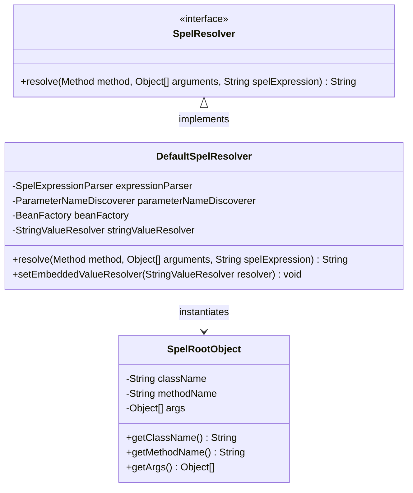
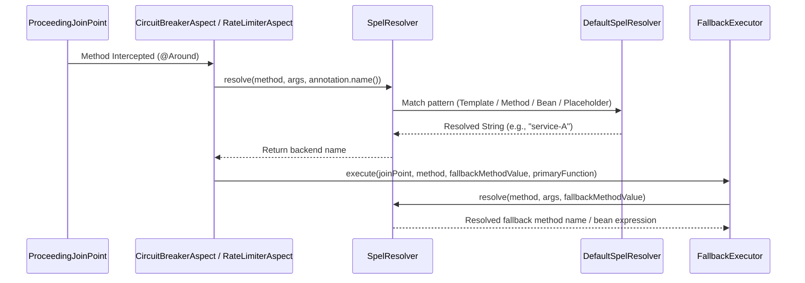
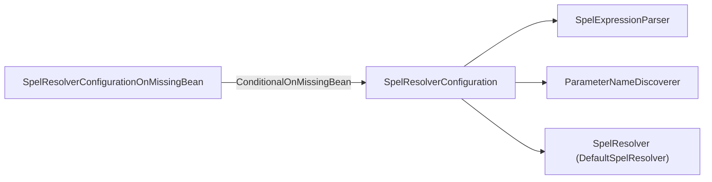

# SpEL Expression Evaluation

<details>
<summary>Relevant source files</summary>

The following files were used as context for generating this wiki page:

- [resilience4j-framework-common/src/main/java/io/github/resilience4j/common/circuitbreaker/configuration/CommonCircuitBreakerConfigurationProperties.java](https://github.com/resilience4j/resilience4j/blob/main/resilience4j-framework-common/src/main/java/io/github/resilience4j/common/circuitbreaker/configuration/CommonCircuitBreakerConfigurationProperties.java)
- [resilience4j-spring6/src/main/java/io/github/resilience4j/spring6/circuitbreaker/configure/CircuitBreakerConfiguration.java](https://github.com/resilience4j/resilience4j/blob/main/resilience4j-spring6/src/main/java/io/github/resilience4j/spring6/circuitbreaker/configure/CircuitBreakerConfiguration.java)
- [resilience4j-spring6/src/main/java/io/github/resilience4j/spring6/ratelimiter/configure/RateLimiterConfiguration.java](https://github.com/resilience4j/resilience4j/blob/main/resilience4j-spring6/src/main/java/io/github/resilience4j/spring6/ratelimiter/configure/RateLimiterConfiguration.java)
- [resilience4j-spring6/src/main/java/io/github/resilience4j/spring6/bulkhead/configure/BulkheadConfiguration.java](https://github.com/resilience4j/resilience4j/blob/main/resilience4j-spring6/src/main/java/io/github/resilience4j/spring6/bulkhead/configure/BulkheadConfiguration.java)
- [resilience4j-spring6/src/main/java/io/github/resilience4j/spring6/retry/configure/RetryConfiguration.java](https://github.com/resilience4j/resilience4j/blob/main/resilience4j-spring6/src/main/java/io/github/resilience4j/spring6/retry/configure/RetryConfiguration.java)
- [resilience4j-spring6/src/main/java/io/github/resilience4j/spring6/timelimiter/configure/TimeLimiterConfiguration.java](https://github.com/resilience4j/resilience4j/blob/main/resilience4j-spring6/src/main/java/io/github/resilience4j/spring6/timelimiter/configure/TimeLimiterConfiguration.java)
- [resilience4j-spring6/src/main/java/io/github/resilience4j/spring6/micrometer/configure/TimerConfiguration.java](https://github.com/resilience4j/resilience4j/blob/main/resilience4j-spring6/src/main/java/io/github/resilience4j/spring6/micrometer/configure/TimerConfiguration.java)
- [resilience4j-framework-common/src/main/java/io/github/resilience4j/common/ratelimiter/configuration/CommonRateLimiterConfigurationProperties.java](https://github.com/resilience4j/resilience4j/blob/main/resilience4j-framework-common/src/main/java/io/github/resilience4j/common/ratelimiter/configuration/CommonRateLimiterConfigurationProperties.java)
- [resilience4j-spring6/src/main/java/io/github/resilience4j/spring6/ratelimiter/configure/RateLimiterAspect.java](https://github.com/resilience4j/spring6/ratelimiter/configure/RateLimiterAspect.java)
- [resilience4j-spring6/src/main/java/io/github/resilience4j/spring6/spelresolver/DefaultSpelResolver.java](https://github.com/resilience4j/spring6/spelresolver/DefaultSpelResolver.java)
- [resilience4j-spring6/src/main/java/io/github/resilience4j/spring6/spelresolver/configure/SpelResolverConfiguration.java](https://github.com/resilience4j/spring6/spelresolver/configure/SpelResolverConfiguration.java)
- [resilience4j-spring-boot3/src/main/java/io/github/resilience4j/springboot3/spelresolver/autoconfigure/SpelResolverConfigurationOnMissingBean.java](https://github.com/resilience4j/springboot3/spelresolver/autoconfigure/SpelResolverConfigurationOnMissingBean.java)
- [resilience4j-spring-boot4/src/main/java/io/github/resilience4j/springboot/spelresolver/autoconfigure/SpelResolverConfigurationOnMissingBean.java](https://github.com/resilience4j/springboot/spelresolver/autoconfigure/SpelResolverConfigurationOnMissingBean.java)
- [resilience4j-spring6/src/main/java/io/github/resilience4j/spring6/circuitbreaker/configure/CircuitBreakerAspect.java](https://github.com/resilience4j/spring6/circuitbreaker/configure/CircuitBreakerAspect.java)
- [resilience4j-hedge/src/main/java/io/github/resilience4j/hedge/internal/InMemoryHedgeRegistry.java](https://github.com/resilience4j/hedge/src/main/java/io/github/resilience4j/hedge/internal/InMemoryHedgeRegistry.java)
- [resilience4j-commons-configuration/src/main/java/io/github/resilience4j/commons/configuration/circuitbreaker/configure/CommonsConfigurationCircuitBreakerConfiguration.java](https://github.com/resilience4j/commons-configuration/src/main/java/io/github/resilience4j/commons/configuration/circuitbreaker/configure/CommonsConfigurationCircuitBreakerConfiguration.java)
- [gradle/libs.versions.toml](https://github.com/resilience4j/resilience4j/blob/main/gradle/libs.versions.toml)
- [resilience4j-framework-common/src/main/java/io/github/resilience4j/common/micrometer/configuration/CommonTimerConfigurationProperties.java](https://github.com/resilience4j/resilience4j/blob/main/resilience4j-framework-common/src/main/java/io/github/resilience4j/common/micrometer/configuration/CommonTimerConfigurationProperties.java)
- [resilience4j-spring6/src/main/java/io/github/resilience4j/spring6/spelresolver/SpelResolver.java](https://github.com/resilience4j/spring6/spelresolver/SpelResolver.java)
- [resilience4j-spring6/src/main/java/io/github/resilience4j/spring6/spelresolver/SpelRootObject.java](https://github.com/resilience4j/spring6/spelresolver/SpelRootObject.java)
- [resilience4j-spring6/src/main/java/io/github/resilience4j/spring6/fallback/configure/FallbackConfiguration.java](https://github.com/resilience4j/spring6/fallback/configure/FallbackConfiguration.java)
- [resilience4j-spring6/src/main/java/io/github/resilience4j/spring6/fallback/FallbackExecutor.java](https://github.com/resilience4j/spring6/fallback/FallbackExecutor.java)
- [resilience4j-spring-boot3/src/main/java/io/github/resilience4j/springboot3/fallback/autoconfigure/FallbackConfigurationOnMissingBean.java](https://github.com/resilience4j/springboot3/fallback/autoconfigure/FallbackConfigurationOnMissingBean.java)
- [resilience4j-spring-boot4/src/main/java/io/github/resilience4j/springboot/fallback/autoconfigure/FallbackConfigurationOnMissingBean.java](https://github.com/resilience4j/springboot/fallback/autoconfigure/FallbackConfigurationOnMissingBean.java)
- [resilience4j-framework-common/src/main/java/io/github/resilience4j/common/CompositeCustomizer.java](https://github.com/resilience4j/resilience4j/blob/main/resilience4j-framework-common/src/main/java/io/github/resilience4j/common/CompositeCustomizer.java)
- [resilience4j-spring-boot4/src/main/java/io/github/resilience4j/springboot/ratelimiter/autoconfigure/RateLimiterAutoConfiguration.java](https://github.com/resilience4j/springboot/ratelimiter/autoconfigure/RateLimiterAutoConfiguration.java)
- [resilience4j-spring-boot3/src/main/java/io/github/resilience4j/springboot3/ratelimiter/autoconfigure/AbstractRateLimiterConfigurationOnMissingBean.java](https://github.com/resilience4j/springboot3/ratelimiter/autoconfigure/AbstractRateLimiterConfigurationOnMissingBean.java)
- [resilience4j-spring-boot3/src/main/java/io/github/resilience4j/springboot3/circuitbreaker/autoconfigure/AbstractCircuitBreakerConfigurationOnMissingBean.java](https://github.com/resilience4j/springboot3/circuitbreaker/autoconfigure/AbstractCircuitBreakerConfigurationOnMissingBean.java)
- [resilience4j-spring-boot3/src/main/java/io/github/resilience4j/springboot3/nativeimage/configuration/NativeHintsConfiguration.java](https://github.com/resilience4j/resilience4j/blob/main/resilience4j-spring-boot3/src/main/java/io/github/resilience4j/springboot3/nativeimage/configuration/NativeHintsConfiguration.java)
- [resilience4j-framework-common/src/main/java/io/github/resilience4j/common/CustomizerWithName.java](https://github.com/resilience4j/resilience4j/blob/main/resilience4j-framework-common/src/main/java/io/github/resilience4j/common/CustomizerWithName.java)
</details>

## Overview

SpEL Expression Evaluation in Resilience4j provides dynamic runtime resolution of configuration attributes and fallback method names inside Spring AOP aspects (`CircuitBreakerAspect`, `RateLimiterAspect`, and `FallbackExecutor`). By leveraging the Spring Expression Language (SpEL), developers can pass method parameters, evaluate bean references, or inspect runtime execution context directly inside annotations like `@CircuitBreaker(name = "#{#serviceName}")` or `@RateLimiter(fallbackMethod = "#{@myFallbackBean::fallbackMethod}")`.

The subsystem solves the limitation of static annotation attributes by binding method metadata and argument arrays to a dedicated evaluation context (`SpelRootObject`) during interception. This allows multi-tenant applications, dynamic routing layers, and context-dependent rate-limiting or circuit-breaking keys to be resolved per invocation without requiring compile-time constants.

Architecturally, the evaluation layer centers around the `SpelResolver` interface and its default implementation, `DefaultSpelResolver`, backed by Spring's `SpelExpressionParser`, `ParameterNameDiscoverer`, and `BeanFactory`. It interacts directly with aspects and the fallback executor before registry lookups or fallback method dispatch occur.

Sources: [resilience4j-spring6/src/main/java/io/github/resilience4j/spring6/spelresolver/SpelResolver.java:1-22](https://github.com/resilience4j/resilience4j/blob/main/resilience4j-spring6/src/main/java/io/github/resilience4j/spring6/spelresolver/SpelResolver.java#L1-L22)

Sources: [resilience4j-spring6/src/main/java/io/github/resilience4j/spring6/spelresolver/DefaultSpelResolver.java:31-92](https://github.com/resilience4j/resilience4j/blob/main/resilience4j-spring6/src/main/java/io/github/resilience4j/spring6/spelresolver/DefaultSpelResolver.java#L31-L92)

Sources: [resilience4j-spring6/src/main/java/io/github/resilience4j/spring6/circuitbreaker/configure/CircuitBreakerAspect.java:95-111](https://github.com/resilience4j/resilience4j/blob/main/resilience4j-spring6/src/main/java/io/github/resilience4j/spring6/circuitbreaker/configure/CircuitBreakerAspect.java#L95-L111)

Sources: [resilience4j-spring6/src/main/java/io/github/resilience4j/spring6/ratelimiter/configure/RateLimiterAspect.java:101-117](https://github.com/resilience4j/spring6/ratelimiter/configure/RateLimiterAspect.java#L101-L117)

---

## Public API and Interface Surface

### Core Interface
The SpEL resolution subsystem exposes a clean abstraction via the `SpelResolver` interface, ensuring that Spring aspects and fallback executors remain decoupled from the underlying parser implementation.



Sources: [resilience4j-spring6/src/main/java/io/github/resilience4j/spring6/spelresolver/SpelResolver.java:1-22](https://github.com/resilience4j/resilience4j/blob/main/resilience4j-spring6/src/main/java/io/github/resilience4j/spring6/spelresolver/SpelResolver.java#L1-L22)

### API Methods Table

| Method Signature | Description |
| :--- | :--- |
| `String resolve(Method method, Object[] arguments, String spelExpression)` | Resolves a given SpEL expression or property placeholder against the current method signature and runtime argument array. |

Sources: [resilience4j-spring6/src/main/java/io/github/resilience4j/spring6/spelresolver/SpelResolver.java:20-22](https://github.com/resilience4j/resilience4j/blob/main/resilience4j-spring6/src/main/java/io/github/resilience4j/spring6/spelresolver/SpelResolver.java#L20-L22)

---

## Core Data Structures and Resolution Context

To evaluate expressions against method invocations, `DefaultSpelResolver` constructs a `SpelRootObject` and wraps it inside a `MethodBasedEvaluationContext`. 

The `SpelRootObject` captures three core properties of the intercepted join point:
- `className`: The fully qualified name of the class declaring the intercepted method (`method.getDeclaringClass().getName()`).
- `methodName`: The name of the intercepted method (`method.getName()`).
- `args`: The runtime argument array passed to the method invocation (`Object[]`).

Sources: [resilience4j-spring6/src/main/java/io/github/resilience4j/spring6/spelresolver/SpelRootObject.java:23-45](https://github.com/resilience4j/spring6/spelresolver/SpelRootObject.java#L23-L45)

Sources: [resilience4j-spring6/src/main/java/io/github/resilience4j/spring6/spelresolver/DefaultSpelResolver.java:59-64](https://github.com/resilience4j/spring6/spelresolver/DefaultSpelResolver.java#L59-L64)

---

## Expression Parsing and Regex Matching Patterns

`DefaultSpelResolver` inspects incoming expression strings using four distinct regular expression patterns to determine the correct evaluation strategy. 

| Pattern Variable | Regex | Target Evaluation Syntax |
| :--- | :--- | :--- |
| `PLACEHOLDER_SPEL_REGEX` | `^\$\{.+}$` | Property placeholders (e.g. `${my.property.key}`) |
| `SPEL_TEMPLATE_REGEX` | `.*#\{.+}.*` | SpEL templates containing literal text and evaluated blocks (e.g. `service-#{#arg0}`) |
| `METHOD_SPEL_REGEX` | `^#.+$` | Direct SpEL expressions referencing root or arguments (e.g. `#{#argName}`) |
| `BEAN_SPEL_REGEX` | `^@.+` | Bean reference expressions (e.g. `@myBean.calculate(#arg0)`) |

> [!NOTE]
> If an expression matches `PLACEHOLDER_SPEL_REGEX`, resolution is delegated to Spring's `StringValueResolver`. If it matches template, method, or bean patterns, execution context is established using `MethodBasedEvaluationContext`.

Sources: [resilience4j-spring6/src/main/java/io/github/resilience4j/spring6/spelresolver/DefaultSpelResolver.java:31-36](https://github.com/resilience4j/spring6/spelresolver/DefaultSpelResolver.java#L31-L36)

Sources: [resilience4j-spring6/src/main/java/io/github/resilience4j/spring6/spelresolver/DefaultSpelResolver.java:50-86](https://github.com/resilience4j/spring6/spelresolver/DefaultSpelResolver.java#L50-L86)

---

## Control Flow and Evaluation Mechanism

When an annotated method is invoked, the aspect intercepts the call and resolves the instance name or fallback specification before consulting registries or executors.



Sources: [resilience4j-spring6/src/main/java/io/github/resilience4j/spring6/circuitbreaker/configure/CircuitBreakerAspect.java:95-111](https://github.com/resilience4j/spring6/circuitbreaker/configure/CircuitBreakerAspect.java#L95-L111)

Sources: [resilience4j-spring6/src/main/java/io/github/resilience4j/spring6/ratelimiter/configure/RateLimiterAspect.java:101-117](https://github.com/resilience4j/spring6/ratelimiter/configure/RateLimiterAspect.java#L101-L117)

Sources: [resilience4j-spring6/src/main/java/io/github/resilience4j/spring6/fallback/FallbackExecutor.java:42-44](https://github.com/resilience4j/spring6/fallback/FallbackExecutor.java#L42-L44)

---

## Configuration and Spring Integration

### Configuration Overview
The SpEL resolution subsystem is configured via `SpelResolverConfiguration` (for standard Spring) and `SpelResolverConfigurationOnMissingBean` (for Spring Boot 3 and Boot 4 autoconfiguration). 



Sources: [resilience4j-spring6/src/main/java/io/github/resilience4j/spring6/spelresolver/configure/SpelResolverConfiguration.java:30-36](https://github.com/resilience4j/spring6/spelresolver/configure/SpelResolverConfiguration.java#L30-L36)

### Configuration Beans Table

| Method | Return Type | Scope / Condition | Description |
| :--- | :--- | :--- | :--- |
| `spelResolver` | `SpelResolver` | Singleton / ConditionalOnMissingBean | Instantiates `DefaultSpelResolver` with parser, parameter name discoverer, and bean factory. |
| `spelExpressionParser` | `SpelExpressionParser` | Singleton / ConditionalOnMissingBean | Standard Spring SpEL expression parser. |
| `parameterNameDiscoverer` | `ParameterNameDiscoverer` | Singleton / ConditionalOnMissingBean | Uses `StandardReflectionParameterNameDiscoverer` to inspect method argument names. |

Sources: [resilience4j-spring6/src/main/java/io/github/resilience4j/spring6/spelresolver/configure/SpelResolverConfiguration.java:32-45](https://github.com/resilience4j/spring6/spelresolver/configure/SpelResolverConfiguration.java#L32-L45)

Sources: [resilience4j-spring-boot3/src/main/java/io/github/resilience4j/springboot3/spelresolver/autoconfigure/SpelResolverConfigurationOnMissingBean.java:39-55](https://github.com/resilience4j/springboot3/spelresolver/autoconfigure/SpelResolverConfigurationOnMissingBean.java#L39-L55)

---

## Native Image and Reflection Hints

Because SpEL execution relies heavily on runtime method invocation, reflection, and expression parsing, GraalVM Native Image support is registered explicitly via `NativeHintsConfiguration`.

> [!WARNING]
> When compiling Resilience4j Spring Boot applications into GraalVM native images, failure to register reflection hints for `MethodBasedEvaluationContext`, `FallbackExecutor`, and AOP aspects will cause SpEL evaluation exceptions during runtime method interception.

Sources: [resilience4j-spring-boot3/src/main/java/io/github/resilience4j/springboot3/nativeimage/configuration/NativeHintsConfiguration.java:9-12](https://github.com/resilience4j/spring-boot3/src/main/java/io/github/resilience4j/springboot3/nativeimage/configuration/NativeHintsConfiguration.java#L9-L12)

Registered reflection members include:
- `BulkheadAspect`: `INVOKE_DECLARED_METHODS`
- `CircuitBreakerAspect`: `INVOKE_DECLARED_METHODS`
- `RateLimiterAspect`: `INVOKE_DECLARED_METHODS`
- `RetryAspect`: `INVOKE_DECLARED_METHODS`
- `TimeLimiterAspect`: `INVOKE_DECLARED_METHODS`
- `FallbackExecutor` & `FallbackMethod`: `INVOKE_DECLARED_METHODS`, `INVOKE_DECLARED_CONSTRUCTORS`
- `MethodBasedEvaluationContext`: `INVOKE_DECLARED_METHODS`

Sources: [resilience4j-spring-boot3/src/main/java/io/github/resilience4j/springboot3/nativeimage/configuration/NativeHintsConfiguration.java:14-38](https://github.com/resilience4j/spring-boot3/src/main/java/io/github/resilience4j/springboot3/nativeimage/configuration/NativeHintsConfiguration.java#L14-L38)

---

## Worked Example

The following Java snippet demonstrates how a developer uses SpEL expressions within Resilience4j annotations to dynamically route calls and select fallback beans based on runtime method arguments.

```java
package com.example.service;

import io.github.resilience4j.circuitbreaker.annotation.CircuitBreaker;
import org.springframework.stereotype.Service;

@Service
public class OrderService {

    @CircuitBreaker(
        name = "#{#clientType}", 
        fallbackMethod = "@orderFallbackBean::getFallbackOrder"
    )
    public String processOrder(String clientType, Long orderId) {
        // Business logic interacting with external system
        return "Order processed for " + clientType;
    }
}
```

When `processOrder("premium-client", 1001L)` is invoked:
1. `CircuitBreakerAspect` intercepts the call and passes the method, argument array `["premium-client", 1001L]`, and expression `"#{#clientType}"` to `SpelResolver`.
2. `DefaultSpelResolver` matches `METHOD_SPEL_REGEX`, evaluates `#clientType` against `SpelRootObject`, and resolves the backend name as `"premium-client"`.
3. If an exception occurs, `FallbackExecutor` parses `@orderFallbackBean::getFallbackOrder` and dispatches the fallback to the Spring bean `orderFallbackBean`.

Sources: [resilience4j-spring6/src/main/java/io/github/resilience4j/spring6/spelresolver/DefaultSpelResolver.java:50-86](https://github.com/resilience4j/spring6/spelresolver/DefaultSpelResolver.java#L50-L86)

Sources: [resilience4j-spring6/src/main/java/io/github/resilience4j/spring6/fallback/FallbackExecutor.java:42-77](https://github.com/resilience4j/spring6/fallback/FallbackExecutor.java#L42-L77)

## Related

- [[Spring 6 Aspects]]

