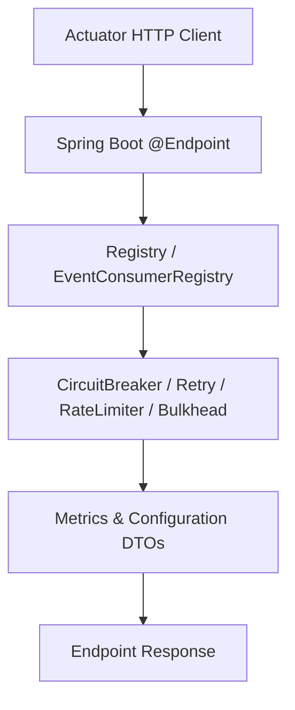
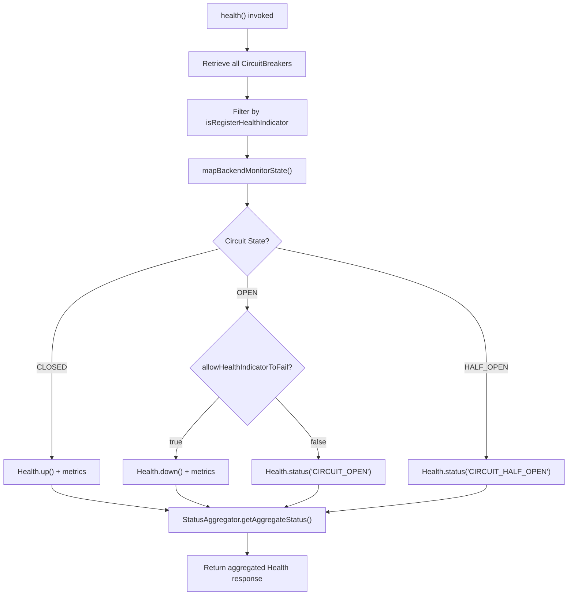

# Spring Boot 3 Actuator

<details>
<summary>Relevant source files</summary>

The following files were used as context for generating this wiki page:

- [resilience4j-spring-boot3/src/main/java/io/github/resilience4j/springboot3/circuitbreaker/monitoring/endpoint/CircuitBreakerEndpoint.java](https://github.com/resilience4j/resilience4j/blob/main/resilience4j-spring-boot3/src/main/java/io/github/resilience4j/springboot3/circuitbreaker/monitoring/endpoint/CircuitBreakerEndpoint.java)
- [resilience4j-spring-boot4/src/main/java/io/github/resilience4j/springboot/circuitbreaker/monitoring/endpoint/CircuitBreakerEndpoint.java](https://github.com/resilience4j/resilience4j/blob/main/resilience4j-springboot/src/main/java/io/github/resilience4j/springboot/circuitbreaker/monitoring/endpoint/CircuitBreakerEndpoint.java)
- [resilience4j-spring-boot3/src/main/resources/META-INF/additional-spring-configuration-metadata.json](https://github.com/resilience4j/resilience4j/blob/main/resilience4j-spring-boot3/src/main/resources/META-INF/additional-spring-configuration-metadata.json)
- [resilience4j-spring-boot3/src/main/java/io/github/resilience4j/springboot3/circuitbreaker/monitoring/health/CircuitBreakersHealthIndicator.java](https://github.com/resilience4j/resilience4j/blob/main/resilience4j-spring-boot3/src/main/java/io/github/resilience4j/springboot3/circuitbreaker/monitoring/health/CircuitBreakersHealthIndicator.java)
- [resilience4j-spring-boot3/README.adoc](https://github.com/resilience4j/resilience4j/blob/main/resilience4j-spring-boot3/README.adoc)
- [resilience4j-spring-boot3/src/main/java/io/github/resilience4j/springboot3/circuitbreaker/autoconfigure/CircuitBreakerStreamEventsAutoConfiguration.java](https://github.com/resilience4j/resilience4j/blob/main/resilience4j-spring-boot3/src/main/java/io/github/resilience4j/springboot3/circuitbreaker/autoconfigure/CircuitBreakerStreamEventsAutoConfiguration.java)
- [resilience4j-spring-boot3/src/main/java/io/github/resilience4j/springboot3/circuitbreaker/monitoring/endpoint/CircuitBreakerHystrixServerSideEvent.java](https://github.com/resilience4j/resilience4j/blob/main/resilience4j-spring-boot3/src/main/java/io/github/resilience4j/springboot3/circuitbreaker/monitoring/endpoint/CircuitBreakerHystrixServerSideEvent.java)
- [resilience4j-spring-boot3/src/main/java/io/github/resilience4j/springboot3/circuitbreaker/monitoring/endpoint/CircuitBreakerServerSideEvent.java](https://github.com/resilience4j/resilience4j/blob/main/resilience4j-spring-boot3/src/main/java/io/github/resilience4j/springboot3/circuitbreaker/monitoring/endpoint/CircuitBreakerServerSideEvent.java)
- [resilience4j-spring-boot4/src/main/java/io/github/resilience4j/springboot/circuitbreaker/monitoring/endpoint/CircuitBreakerHystrixServerSideEvent.java](https://github.com/resilience4j/resilience4j/blob/main/resilience4j-springboot/src/main/java/io/github/resilience4j/springboot/circuitbreaker/monitoring/endpoint/CircuitBreakerHystrixServerSideEvent.java)
- [resilience4j-spring-boot4/src/main/java/io/github/resilience4j/springboot/circuitbreaker/monitoring/endpoint/CircuitBreakerServerSideEvent.java](https://github.com/resilience4j/resilience4j/blob/main/resilience4j-springboot/src/main/java/io/github/resilience4j/springboot/circuitbreaker/monitoring/endpoint/CircuitBreakerServerSideEvent.java)
- [resilience4j-spring-boot4/src/main/java/io/github/resilience4j/springboot/circuitbreaker/autoconfigure/CircuitBreakerStreamEventsAutoConfiguration.java](https://github.com/resilience4j/resilience4j/blob/main/resilience4j-springboot/src/main/java/io/github/resilience4j/springboot/circuitbreaker/autoconfigure/CircuitBreakerStreamEventsAutoConfiguration.java)
- [resilience4j-spring-boot3/src/main/java/io/github/resilience4j/springboot3/circuitbreaker/autoconfigure/CircuitBreakerAutoConfiguration.java](https://github.com/resilience4j/resilience4j/blob/main/resilience4j-spring-boot3/src/main/java/io/github/resilience4j/springboot3/circuitbreaker/autoconfigure/CircuitBreakerAutoConfiguration.java)
- [resilience4j-spring-boot3/src/main/java/io/github/resilience4j/springboot3/circuitbreaker/monitoring/endpoint/CircuitBreakerEventsEndpoint.java](https://github.com/resilience4j/resilience4j/blob/main/resilience4j-spring-boot3/src/main/java/io/github/resilience4j/springboot3/circuitbreaker/monitoring/endpoint/CircuitBreakerEventsEndpoint.java)
- [resilience4j-spring-boot3/src/main/java/io/github/resilience4j/springboot3/retry/monitoring/endpoint/RetryEventsEndpoint.java](https://github.com/resilience4j/resilience4j/blob/main/resilience4j-spring-boot3/src/main/java/io/github/resilience4j/springboot3/retry/monitoring/endpoint/RetryEventsEndpoint.java)
- [resilience4j-spring-boot4/src/main/java/io/github/resilience4j/springboot/circuitbreaker/monitoring/endpoint/CircuitBreakerEventsEndpoint.java](https://github.com/resilience4j/resilience4j/blob/main/resilience4j-springboot/src/main/java/io/github/resilience4j/springboot/circuitbreaker/monitoring/endpoint/CircuitBreakerEventsEndpoint.java)
- [resilience4j-spring-boot3/src/main/java/io/github/resilience4j/springboot3/bulkhead/monitoring/endpoint/BulkheadEventsEndpoint.java](https://github.com/resilience4j/resilience4j/blob/main/resilience4j-spring-boot3/src/main/java/io/github/resilience4j/springboot3/bulkhead/monitoring/endpoint/BulkheadEventsEndpoint.java)
- [resilience4j-spring-boot3/src/main/java/io/github/resilience4j/springboot3/ratelimiter/monitoring/endpoint/RateLimiterEventsEndpoint.java](https://github.com/resilience4j/resilience4j/blob/main/resilience4j-spring-boot3/src/main/java/io/github/resilience4j/springboot3/ratelimiter/monitoring/endpoint/RateLimiterEventsEndpoint.java)
- [resilience4j-spring-boot3/src/main/java/io/github/resilience4j/springboot3/retry/autoconfigure/RetryAutoConfiguration.java](https://github.com/resilience4j/resilience4j/blob/main/resilience4j-spring-boot3/src/main/java/io/github/resilience4j/springboot3/retry/autoconfigure/RetryAutoConfiguration.java)
- [resilience4j-spring-boot3/src/main/java/io/github/resilience4j/springboot3/ratelimiter/autoconfigure/RateLimiterAutoConfiguration.java](https://github.com/resilience4j/resilience4j/blob/main/resilience4j-spring-boot3/src/main/java/io/github/resilience4j/springboot3/ratelimiter/autoconfigure/RateLimiterAutoConfiguration.java)
- [resilience4j-spring-boot4/src/main/java/io/github/resilience4j/springboot/retry/monitoring/endpoint/RetryEventsEndpoint.java](https://github.com/resilience4j/resilience4j/blob/main/resilience4j-springboot/src/main/java/io/github/resilience4j/springboot/retry/monitoring/endpoint/RetryEventsEndpoint.java)
- [resilience4j-spring-boot3/src/main/java/io/github/resilience4j/springboot3/bulkhead/autoconfigure/BulkheadAutoConfiguration.java](https://github.com/resilience4j/resilience4j/blob/main/resilience4j-spring-boot3/src/main/java/io/github/resilience4j/springboot3/bulkhead/autoconfigure/BulkheadAutoConfiguration.java)
- [resilience4j-spring-boot4/src/main/java/io/github/resilience4j/springboot/bulkhead/monitoring/endpoint/BulkheadEventsEndpoint.java](https://github.com/resilience4j/resilience4j/blob/main/resilience4j-springboot/src/main/java/io/github/resilience4j/springboot/bulkhead/monitoring/endpoint/BulkheadEventsEndpoint.java)
- [resilience4j-spring-boot3/src/main/java/io/github/resilience4j/springboot3/circuitbreaker/autoconfigure/CircuitBreakersHealthIndicatorAutoConfiguration.java](https://github.com/resilience4j/resilience4j/blob/main/resilience4j-spring-boot3/src/main/java/io/github/resilience4j/springboot3/circuitbreaker/autoconfigure/CircuitBreakersHealthIndicatorAutoConfiguration.java)
- [resilience4j-spring-boot3/src/main/java/io/github/resilience4j/springboot3/timelimiter/monitoring/endpoint/TimeLimiterEventsEndpoint.java](https://github.com/resilience4j/resilience4j/blob/main/resilience4j-spring-boot3/src/main/java/io/github/resilience4j/springboot3/timelimiter/monitoring/endpoint/TimeLimiterEventsEndpoint.java)
- [resilience4j-spring-boot4/src/main/java/io/github/resilience4j/springboot/ratelimiter/monitoring/endpoint/RateLimiterEventsEndpoint.java](https://github.com/resilience4j/resilience4j/blob/main/resilience4j-springboot/src/main/java/io/github/resilience4j/springboot/ratelimiter/monitoring/endpoint/RateLimiterEventsEndpoint.java)
- [resilience4j-spring-boot3/src/main/java/io/github/resilience4j/springboot3/retry/monitoring/endpoint/RetryEndpoint.java](https://github.com/resilience4j/resilience4j/blob/main/resilience4j-spring-boot3/src/main/java/io/github/resilience4j/springboot3/retry/monitoring/endpoint/RetryEndpoint.java)
- [resilience4j-spring-boot3/src/main/java/io/github/resilience4j/springboot3/micrometer/monitoring/endpoint/TimerEventsEndpoint.java](https://github.com/resilience4j/resilience4j/blob/main/resilience4j-spring-boot3/src/main/java/io/github/resilience4j/springboot3/micrometer/monitoring/endpoint/TimerEventsEndpoint.java)
- [resilience4j-spring-boot3/src/main/java/io/github/resilience4j/springboot3/timelimiter/autoconfigure/TimeLimiterAutoConfiguration.java](https://github.com/resilience4j/resilience4j/blob/main/resilience4j-spring-boot3/src/main/java/io/github/resilience4j/springboot3/timelimiter/autoconfigure/TimeLimiterAutoConfiguration.java)
- [resilience4j-spring-boot3/src/main/java/io/github/resilience4j/springboot3/micrometer/autoconfigure/TimerAutoConfiguration.java](https://github.com/resilience4j/resilience4j/blob/main/resilience4j-spring-boot3/src/main/java/io/github/resilience4j/springboot3/micrometer/autoconfigure/TimerAutoConfiguration.java)
- [resilience4j-spring-boot3/src/main/java/io/github/resilience4j/springboot3/bulkhead/monitoring/endpoint/BulkheadEndpoint.java](https://github.com/resilience4j/resilience4j/blob/main/resilience4j-spring-boot3/src/main/java/io/github/resilience4j/springboot3/bulkhead/monitoring/endpoint/BulkheadEndpoint.java)
</details>

## Overview

Spring Boot 3 Actuator integration in Resilience4j provides an extensive operational monitoring and management subsystem. It bridges core Resilience4j registries—such as `CircuitBreakerRegistry`, `RetryRegistry`, `RateLimiterRegistry`, `BulkheadRegistry`, `ThreadPoolBulkheadRegistry`, `TimeLimiterRegistry`, and `TimerRegistry`—with Spring Boot Actuator endpoints, health indicators, and reactive event streams. This enables operators to query runtime metrics, inspect configuration states, modify component operational states on the fly, and consume real-time telemetry over Server-Sent Events (SSE).

Sources: [resilience4j-spring-boot3/README.adoc:1-54](https://github.com/resilience4j/resilience4j/blob/main/resilience4j-spring-boot3/README.adoc#L1-L54)

The architecture relies on Spring Boot auto-configurations (`@AutoConfiguration`) qualified by conditional annotations like `@ConditionalOnClass` and `@ConditionalOnAvailableEndpoint`. This ensures that monitoring endpoints and health indicators only activate when the corresponding Resilience4j modules and Spring Boot Actuator libraries are present on the classpath and enabled via properties. By standardizing component telemetry into endpoint responses and event consumers, the integration provides unified observability across fault-tolerance patterns.

Sources: [resilience4j-spring-boot3/src/main/java/io/github/resilience4j/springboot3/circuitbreaker/autoconfigure/CircuitBreakerAutoConfiguration.java:34-61](https://github.com/resilience4j/resilience4j/blob/main/resilience4j-spring-boot3/src/main/java/io/github/resilience4j/springboot3/circuitbreaker/autoconfigure/CircuitBreakerAutoConfiguration.java#L34-L61)

Furthermore, the subsystem introduces capabilities tailored for modern runtime environments, including support for Java virtual threads (Project Loom) via schedulers and dedicated virtual thread metrics, as well as reactive streams for real-time dashboard integrations such as Hystrix-compatible visualizations.

Sources: [resilience4j-spring-boot3/src/main/java/io/github/resilience4j/springboot3/circuitbreaker/autoconfigure/CircuitBreakerStreamEventsAutoConfiguration.java:32-50](https://github.com/resilience4j/resilience4j/blob/main/resilience4j-spring-boot3/src/main/java/io/github/resilience4j/springboot3/circuitbreaker/autoconfigure/CircuitBreakerStreamEventsAutoConfiguration.java#L32-L50)

## Actuator Endpoint Architecture and Operations

The monitoring endpoints are exposed as Spring Boot `@Endpoint` components that interact directly with Resilience4j registries and event consumer registries (`EventConsumerRegistry`). Each endpoint provides `@ReadOperation` and, where applicable, `@WriteOperation` methods to inspect or mutate runtime behavior.

Sources: [resilience4j-spring-boot3/src/main/java/io/github/resilience4j/springboot3/circuitbreaker/monitoring/endpoint/CircuitBreakerEndpoint.java:38-53](https://github.com/resilience4j/resilience4j/blob/main/resilience4j-spring-boot3/src/main/java/io/github/resilience4j/springboot3/circuitbreaker/monitoring/endpoint/CircuitBreakerEndpoint.java#L38-L53)



Sources: [resilience4j-spring-boot3/src/main/java/io/github/resilience4j/springboot3/retry/monitoring/endpoint/RetryEndpoint.java:32-46](https://github.com/resilience4j/spring-boot3/src/main/java/io/github/resilience4j/springboot3/retry/monitoring/endpoint/RetryEndpoint.java#L32-L46)

The primary Actuator endpoints exposed by the Resilience4j starter include various read and write management resources.

Sources: [resilience4j-spring-boot3/src/main/java/io/github/resilience4j/springboot3/bulkhead/monitoring/endpoint/BulkheadEndpoint.java:34-55](https://github.com/resilience4j/spring-boot3/src/main/java/io/github/resilience4j/springboot3/bulkhead/monitoring/endpoint/BulkheadEndpoint.java#L34-L55)

| Endpoint ID | Class Name | Supported Operations | Description |
| :--- | :--- | :--- | :--- |
| `circuitbreakers` | `CircuitBreakerEndpoint` | Read, Write | Lists all circuit breakers with metrics/configs, or allows state modification (`CLOSE`, `FORCE_OPEN`, `DISABLE`). |
| `circuitbreakerevents` | `CircuitBreakerEventsEndpoint` | Read | Retrieves buffered circuit breaker events, optionally filtered by name and event type. |
| `hystrixstreamcircuitbreakerevents` | `CircuitBreakerHystrixServerSideEvent` | Read (SSE) | Streams circuit breaker events in Hystrix-compatible format over Server-Sent Events. |
| `streamcircuitbreakerevents` | `CircuitBreakerServerSideEvent` | Read (SSE) | Streams standard Resilience4j circuit breaker events over Server-Sent Events. |
| `retries` | `RetryEndpoint` | Read | Lists all configured retry instances. |
| `retryevents` | `RetryEventsEndpoint` | Read | Retrieves buffered retry events filtered by name and event type. |
| `ratelimiterevents` | `RateLimiterEventsEndpoint` | Read | Retrieves buffered rate limiter events. |
| `bulkheads` | `BulkheadEndpoint` | Read | Lists standard and thread pool bulkheads. |
| `bulkheadevents` | `BulkheadEventsEndpoint` | Read | Retrieves buffered bulkhead events. |
| `timelimiterevents` | `TimeLimiterEventsEndpoint` | Read | Retrieves buffered time limiter events. |
| `timerevents` | `TimerEventsEndpoint` | Read | Retrieves buffered Micrometer timer events. |

Sources: [resilience4j-spring-boot3/src/main/java/io/github/resilience4j/springboot3/circuitbreaker/monitoring/endpoint/CircuitBreakerEndpoint.java:38-73](https://github.com/resilience4j/spring-boot3/src/main/java/io/github/resilience4j/springboot3/circuitbreaker/monitoring/endpoint/CircuitBreakerEndpoint.java#L38-L73)

## Circuit Breaker State Management and Metrics Inspection

The `CircuitBreakerEndpoint` manages inspection and runtime state mutation for circuit breakers. When a read operation (`getAllCircuitBreakers`) is invoked, it retrieves all instances from the `CircuitBreakerRegistry`, sorts them alphabetically by name using `Comparator.comparing(CircuitBreaker::getName)`, and maps each to a `CircuitBreakerDetails` data transfer object using a `LinkedHashMap` collector.

Sources: [resilience4j-spring-boot3/src/main/java/io/github/resilience4j/springboot3/circuitbreaker/monitoring/endpoint/CircuitBreakerEndpoint.java:47-53](https://github.com/resilience4j/spring-boot3/src/main/java/io/github/resilience4j/springboot3/circuitbreaker/monitoring/endpoint/CircuitBreakerEndpoint.java#L47-L53)

When a write operation (`updateCircuitBreakerState`) is executed with a selector for the circuit breaker `name` and an `UpdateState` value (`CLOSE`, `FORCE_OPEN`, or `DISABLE`), the endpoint transitions the target circuit breaker state:

Sources: [resilience4j-spring-boot3/src/main/java/io/github/resilience4j/springboot3/circuitbreaker/monitoring/endpoint/CircuitBreakerEndpoint.java:55-73](https://github.com/resilience4j/spring-boot3/src/main/java/io/github/resilience4j/springboot3/circuitbreaker/monitoring/endpoint/CircuitBreakerEndpoint.java#L55-L73)

```java
final CircuitBreaker circuitBreaker = circuitBreakerRegistry.circuitBreaker(name);
switch (updateState) {
    case CLOSE:
        circuitBreaker.transitionToClosedState();
        return createCircuitBreakerUpdateStateResponse(name, circuitBreaker.getState().toString(), String.format(message, name));
    case FORCE_OPEN:
        circuitBreaker.transitionToForcedOpenState();
        return createCircuitBreakerUpdateStateResponse(name, circuitBreaker.getState().toString(), String.format(message, name));
    case DISABLE:
        circuitBreaker.transitionToDisabledState();
        return createCircuitBreakerUpdateStateResponse(name, circuitBreaker.getState().toString(), String.format(message, name));
    default:
        return createCircuitBreakerUpdateStateResponse(name, circuitBreaker.getState().toString(), "State change value is not supported...");
}
```

Sources: [resilience4j-spring-boot3/src/main/java/io/github/resilience4j/springboot3/circuitbreaker/monitoring/endpoint/CircuitBreakerEndpoint.java:56-72](https://github.com/resilience4j/spring-boot3/src/main/java/io/github/resilience4j/springboot3/circuitbreaker/monitoring/endpoint/CircuitBreakerEndpoint.java#L56-L72)

> [!NOTE]
> The `updateCircuitBreakerState` method uses Spring Boot's `@Selector` annotation to bind the path variable `name` from the HTTP request structure.

Sources: [resilience4j-spring-boot3/src/main/java/io/github/resilience4j/springboot3/circuitbreaker/monitoring/endpoint/CircuitBreakerEndpoint.java:56-56](https://github.com/resilience4j/spring-boot3/src/main/java/io/github/resilience4j/springboot3/circuitbreaker/monitoring/endpoint/CircuitBreakerEndpoint.java#L56-L56)

## Health Indicator Integration

The `CircuitBreakersHealthIndicator` implements Spring Boot's `HealthIndicator` interface to aggregate the status and operational metrics of registered circuit breakers into the `/actuator/health` endpoint.

Sources: [resilience4j-spring-boot3/src/main/java/io/github/resilience4j/springboot3/circuitbreaker/monitoring/health/CircuitBreakersHealthIndicator.java:37-60](https://github.com/resilience4j/spring-boot3/src/main/java/io/github/resilience4j/springboot3/circuitbreaker/monitoring/health/CircuitBreakersHealthIndicator.java#L37-L60)

Registration and failure tolerance are governed by instance-specific configuration properties:
- `isRegisterHealthIndicator(CircuitBreaker circuitBreaker)`: Checks if the instance is opted-in for health reporting via `InstanceProperties::getRegisterHealthIndicator` (defaulting to `false`).
- `allowHealthIndicatorToFail(CircuitBreaker circuitBreaker)`: Determines whether an `OPEN` circuit breaker should mark the overall health indicator status as `DOWN` or a custom `CIRCUIT_OPEN` status via `InstanceProperties::getAllowHealthIndicatorToFail`.

Sources: [resilience4j-spring-boot3/src/main/java/io/github/resilience4j/springboot3/circuitbreaker/monitoring/health/CircuitBreakersHealthIndicator.java:79-104](https://github.com/resilience4j/spring-boot3/src/main/java/io/github/resilience4j/springboot3/circuitbreaker/monitoring/health/CircuitBreakersHealthIndicator.java#L79-L104)



Sources: [resilience4j-spring-boot3/src/main/java/io/github/resilience4j/springboot3/circuitbreaker/monitoring/health/CircuitBreakersHealthIndicator.java:106-115](https://github.com/resilience4j/spring-boot3/src/main/java/io/github/resilience4j/springboot3/circuitbreaker/monitoring/health/CircuitBreakersHealthIndicator.java#L106-L115)

## Reactive Server-Sent Events (SSE) and Hystrix Streaming

Real-time telemetry is exposed through reactive endpoints (`CircuitBreakerServerSideEvent` and `CircuitBreakerHystrixServerSideEvent`) annotated with `@Endpoint(id = "streamcircuitbreakerevents")` and `@Endpoint(id = "hystrixstreamcircuitbreakerevents")`.

Sources: [resilience4j-spring-boot3/src/main/java/io/github/resilience4j/springboot3/circuitbreaker/monitoring/endpoint/CircuitBreakerServerSideEvent.java:46-57](https://github.com/resilience4j/spring-boot3/src/main/java/io/github/resilience4j/springboot3/circuitbreaker/monitoring/endpoint/CircuitBreakerServerSideEvent.java#L46-L57)

These endpoints produce `Flux<ServerSentEvent<String>>` streams publishing at `TEXT_EVENT_STREAM_VALUE` media types. Each stream merges event streams from the event publishers with a periodic heartbeat stream:

Sources: [resilience4j-spring-boot3/src/main/java/io/github/resilience4j/springboot3/circuitbreaker/monitoring/endpoint/CircuitBreakerHystrixServerSideEvent.java:65-72](https://github.com/resilience4j/spring-boot3/src/main/java/io/github/resilience4j/springboot3/circuitbreaker/monitoring/endpoint/CircuitBreakerHystrixServerSideEvent.java#L65-L72)

```java
private Flux<ServerSentEvent<String>> getHeartbeatStream() {
    return Flux.interval(Duration.ofSeconds(1))
        .map(i -> ServerSentEvent.<String>builder().event("ping").build());
}
```

Sources: [resilience4j-spring-boot3/src/main/java/io/github/resilience4j/springboot3/circuitbreaker/monitoring/endpoint/CircuitBreakerServerSideEvent.java:118-121](https://github.com/resilience4j/spring-boot3/src/main/java/io/github/resilience4j/springboot3/circuitbreaker/monitoring/endpoint/CircuitBreakerServerSideEvent.java#L118-L121)

Events are processed through `publishEvents(Flux<CircuitBreakerEvent> eventStreams)`, which applies `.onBackpressureDrop()` to shed load under high event volumes, introduces a 100-millisecond delay element spacing (`.delayElements(Duration.ofMillis(100))`), and maps the event to a JSON string payload using Jackson (`ObjectMapper` or `JsonMapper`).

Sources: [resilience4j-spring-boot3/src/main/java/io/github/resilience4j/springboot3/circuitbreaker/monitoring/endpoint/CircuitBreakerServerSideEvent.java:87-99](https://github.com/resilience4j/spring-boot3/src/main/java/io/github/resilience4j/springboot3/circuitbreaker/monitoring/endpoint/CircuitBreakerServerSideEvent.java#L87-L99)

## Event Consumer Registries and Filtering

Buffered event endpoints (such as `CircuitBreakerEventsEndpoint`, `RetryEventsEndpoint`, `RateLimiterEventsEndpoint`, `BulkheadEventsEndpoint`, `TimeLimiterEventsEndpoint`, and `TimerEventsEndpoint`) rely on `EventConsumerRegistry` and `CircularEventConsumer` to maintain a rolling buffer of recent telemetry events.

Sources: [resilience4j-spring-boot3/src/main/java/io/github/resilience4j/springboot3/circuitbreaker/monitoring/endpoint/CircuitBreakerEventsEndpoint.java:34-43](https://github.com/resilience4j/spring-boot3/src/main/java/io/github/resilience4j/springboot3/circuitbreaker/monitoring/endpoint/CircuitBreakerEventsEndpoint.java#L34-L43)

When querying filtered events—for instance, `getEventsFilteredByCircuitBreakerNameAndEventType(String name, String eventType)`—the endpoint performs the following operational pipeline:
1. Retrieves the `CircularEventConsumer` associated with the instance name via `eventConsumerRegistry.getEventConsumer(name)`.
2. Extracts buffered events and filters them by matching the exact instance name.
3. Filters events matching the requested event type converted to uppercase (`CircuitBreakerEvent.Type.valueOf(eventType.toUpperCase())`).
4. Maps matching events to DTOs via factory classes (e.g., `CircuitBreakerEventDTOFactory::createCircuitBreakerEventDTO`) and collects them into an `EndpointResponse`.

Sources: [resilience4j-spring-boot3/src/main/java/io/github/resilience4j/springboot3/circuitbreaker/monitoring/endpoint/CircuitBreakerEventsEndpoint.java:61-69](https://github.com/resilience4j/spring-boot3/src/main/java/io/github/resilience4j/springboot3/circuitbreaker/monitoring/endpoint/CircuitBreakerEventsEndpoint.java#L61-L69)

> [!WARNING]
> Specifying an invalid event type in the URL selector path will throw an `IllegalArgumentException` during `Type.valueOf(...)` evaluation if the string does not match an enum constant.

Sources: [resilience4j-spring-boot3/src/main/java/io/github/resilience4j/springboot3/circuitbreaker/monitoring/endpoint/CircuitBreakerEventsEndpoint.java:65-66](https://github.com/resilience4j/spring-boot3/src/main/java/io/github/resilience4j/springboot3/circuitbreaker/monitoring/endpoint/CircuitBreakerEventsEndpoint.java#L65-L66)

## Configuration Metadata and Virtual Thread Metrics

The actuator and monitoring modules expose custom configuration properties declared in metadata JSON files. Notably, health check enablement and virtual thread metrics are governed by properties configured in Spring Boot configuration files.

Sources: [resilience4j-spring-boot3/src/main/resources/META-INF/additional-spring-configuration-metadata.json:1-20](https://github.com/resilience4j/spring-boot3/src/main/resources/META-INF/additional-spring-configuration-metadata.json#L1-L20)

| Configuration Property | Type | Default Value | Description |
| :--- | :--- | :--- | :--- |
| `management.health.circuitbreakers.enabled` | `Boolean` | `false` | Whether to enable CircuitBreakers health check. |
| `management.health.ratelimiters.enabled` | `Boolean` | `false` | Whether to enable RateLimiters health check. |
| `resilience4j.thread.type` | `String` | `platform` | Internal scheduler thread type (`platform` or `virtual`, requiring JDK 21+). |
| `resilience4j.thread.metrics.enabled` | `Boolean` | `true` | Whether to enable thread metrics for monitoring virtual thread usage. |

Sources: [resilience4j-spring-boot3/src/main/resources/META-INF/additional-spring-configuration-metadata.json:4-99](https://github.com/resilience4j/spring-boot3/src/main/resources/META-INF/additional-spring-configuration-metadata.json#L4-L99)

When `resilience4j.thread.metrics.enabled` is active, Micrometer registers the gauge metric `resilience4j.thread.virtual_thread_enabled`, reporting `1.0` when virtual threads are enabled and `0.0` when disabled.

Sources: [resilience4j-spring-boot3/README.adoc:44-60](https://github.com/resilience4j/spring-boot3/README.adoc#L44-L60)

## Related

- [[Spring Boot 3 Configuration]]
- [[Spring Boot 3 Health]]

