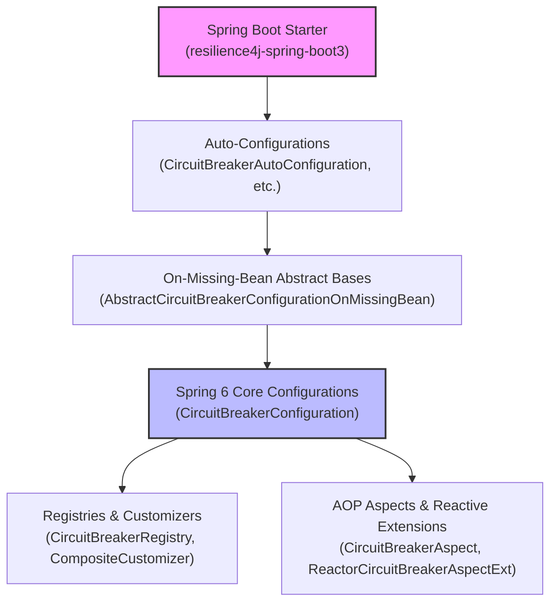

# Spring Boot 3 Configuration

<details>
<summary>Relevant source files</summary>

The following files were used as context for generating this wiki page:

- [resilience4j-spring6/src/main/java/io/github/resilience4j/spring6/circuitbreaker/configure/CircuitBreakerConfiguration.java](https://github.com/resilience4j/resilience4j/blob/main/resilience4j-spring6/src/main/java/io/github/resilience4j/spring6/circuitbreaker/configure/CircuitBreakerConfiguration.java)
- [resilience4j-spring6/src/main/java/io/github/resilience4j/spring6/retry/configure/RetryConfiguration.java](https://github.com/resilience4j/resilience4j/blob/main/resilience4j-spring6/src/main/java/io/github/resilience4j/spring6/retry/configure/RetryConfiguration.java)
- [resilience4j-micronaut/src/main/java/io/github/resilience4j/micronaut/circuitbreaker/CircuitBreakerRegistryFactory.java](https://github.com/resilience4j/resilience4j/blob/main/resilience4j-micronaut/src/main/java/io/github/resilience4j/micronaut/circuitbreaker/CircuitBreakerRegistryFactory.java)
- [resilience4j-spring6/src/main/java/io/github/resilience4j/spring6/bulkhead/configure/BulkheadConfiguration.java](https://github.com/resilience4j/resilience4j/blob/main/resilience4j-spring6/src/main/java/io/github/resilience4j/spring6/bulkhead/configure/BulkheadConfiguration.java)
- [resilience4j-spring-boot3/src/main/resources/META-INF/additional-spring-configuration-metadata.json](https://github.com/resilience4j/resilience4j/blob/main/resilience4j-spring-boot3/src/main/resources/META-INF/additional-spring-configuration-metadata.json)
- [resilience4j-spring-boot4/src/main/java/io/github/resilience4j/springboot/circuitbreaker/autoconfigure/CircuitBreakerAutoConfiguration.java](https://github.com/resilience4j/resilience4j/blob/main/resilience4j-spring-boot4/src/main/java/io/github/resilience4j/springboot/circuitbreaker/autoconfigure/CircuitBreakerAutoConfiguration.java)
- [resilience4j-spring-boot3/src/main/java/io/github/resilience4j/springboot3/bulkhead/autoconfigure/AbstractBulkheadConfigurationOnMissingBean.java](https://github.com/resilience4j/resilience4j/blob/main/resilience4j-spring-boot3/src/main/java/io/github/resilience4j/springboot3/bulkhead/autoconfigure/AbstractBulkheadConfigurationOnMissingBean.java)
- [resilience4j-spring-boot4/src/main/java/io/github/resilience4j/springboot/retry/autoconfigure/RetryAutoConfiguration.java](https://github.com/resilience4j/resilience4j/blob/main/resilience4j-spring-boot4/src/main/java/io/github/resilience4j/springboot/retry/autoconfigure/RetryAutoConfiguration.java)
- [resilience4j-spring-boot3/README.adoc](https://github.com/resilience4j/resilience4j/blob/main/resilience4j-spring-boot3/README.adoc)
- [resilience4j-spring-boot4/src/main/resources/META-INF/additional-spring-configuration-metadata.json](https://github.com/resilience4j/resilience4j/blob/main/resilience4j-spring-boot4/src/main/resources/META-INF/additional-spring-configuration-metadata.json)
- [resilience4j-spring-boot4/src/main/java/io/github/resilience4j/springboot/bulkhead/autoconfigure/BulkheadAutoConfiguration.java](https://github.com/resilience4j/resilience4j/blob/main/resilience4j-spring-boot4/src/main/java/io/github/resilience4j/springboot/bulkhead/autoconfigure/BulkheadAutoConfiguration.java)
- [resilience4j-spring-boot3/src/main/java/io/github/resilience4j/springboot3/verifier/autoconfigure/SpringBoot3VerifierAutoConfiguration.java](https://github.com/resilience4j/resilience4j/blob/main/resilience4j-spring-boot3/src/main/java/io/github/resilience4j/springboot3/verifier/autoconfigure/SpringBoot3VerifierAutoConfiguration.java)
- [resilience4j-spring-boot3/src/main/java/io/github/resilience4j/springboot3/circuitbreaker/autoconfigure/CircuitBreakerAutoConfiguration.java](https://github.com/resilience4j/resilience4j/blob/main/resilience4j-spring-boot3/src/main/java/io/github/resilience4j/springboot3/circuitbreaker/autoconfigure/CircuitBreakerAutoConfiguration.java)
- [resilience4j-spring-boot3/src/main/java/io/github/resilience4j/springboot3/circuitbreaker/autoconfigure/AbstractCircuitBreakerConfigurationOnMissingBean.java](https://github.com/resilience4j/resilience4j/blob/main/resilience4j-spring-boot3/src/main/java/io/github/resilience4j/springboot3/circuitbreaker/autoconfigure/AbstractCircuitBreakerConfigurationOnMissingBean.java)
- [resilience4j-spring-boot3/src/main/java/io/github/resilience4j/springboot3/retry/autoconfigure/RetryAutoConfiguration.java](https://github.com/resilience4j/resilience4j/blob/main/resilience4j-spring-boot3/src/main/java/io/github/resilience4j/springboot3/retry/autoconfigure/RetryAutoConfiguration.java)
- [resilience4j-spring-boot3/src/main/java/io/github/resilience4j/springboot3/circuitbreaker/autoconfigure/CircuitBreakersHealthIndicatorAutoConfiguration.java](https://github.com/resilience4j/resilience4j/blob/main/resilience4j-spring-boot3/src/main/java/io/github/resilience4j/springboot3/circuitbreaker/autoconfigure/CircuitBreakersHealthIndicatorAutoConfiguration.java)
- [resilience4j-spring-boot3/src/main/java/io/github/resilience4j/springboot3/retry/autoconfigure/AbstractRetryConfigurationOnMissingBean.java](https://github.com/resilience4j/resilience4j/blob/main/resilience4j-spring-boot3/src/main/java/io/github/resilience4j/springboot3/retry/autoconfigure/AbstractRetryConfigurationOnMissingBean.java)
- [resilience4j-spring-boot4/src/main/java/io/github/resilience4j/springboot/circuitbreaker/autoconfigure/CircuitBreakerRefreshScopedRegistryAutoConfiguration.java](https://github.com/resilience4j/resilience4j/blob/main/resilience4j-spring-boot4/src/main/java/io/github/resilience4j/springboot/circuitbreaker/autoconfigure/CircuitBreakerRefreshScopedRegistryAutoConfiguration.java)
- [resilience4j-spring-boot3/src/main/java/io/github/resilience4j/springboot3/bulkhead/autoconfigure/BulkheadAutoConfiguration.java](https://github.com/resilience4j/resilience4j/blob/main/resilience4j-spring-boot3/src/main/java/io/github/resilience4j/springboot3/bulkhead/autoconfigure/BulkheadAutoConfiguration.java)
- [resilience4j-spring-boot3/src/main/java/io/github/resilience4j/springboot3/circuitbreaker/autoconfigure/CircuitBreakerMetricsAutoConfiguration.java](https://github.com/resilience4j/resilience4j/blob/main/resilience4j-spring-boot3/src/main/java/io/github/resilience4j/springboot3/circuitbreaker/autoconfigure/CircuitBreakerMetricsAutoConfiguration.java)
- [resilience4j-spring-boot3/src/main/java/io/github/resilience4j/springboot3/ratelimiter/autoconfigure/RateLimiterAutoConfiguration.java](https://github.com/resilience4j/resilience4j/blob/main/resilience4j-spring-boot3/src/main/java/io/github/resilience4j/springboot3/ratelimiter/autoconfigure/RateLimiterAutoConfiguration.java)
- [resilience4j-spring-boot3/src/main/java/io/github/resilience4j/springboot3/ratelimiter/autoconfigure/RateLimitersHealthIndicatorAutoConfiguration.java](https://github.com/resilience4j/resilience4j/blob/main/resilience4j-spring-boot3/src/main/java/io/github/resilience4j/springboot3/ratelimiter/autoconfigure/RateLimitersHealthIndicatorAutoConfiguration.java)
- [resilience4j-spring-boot4/src/main/java/io/github/resilience4j/springboot/ratelimiter/autoconfigure/RateLimiterAutoConfiguration.java](https://github.com/resilience4j/resilience4j/blob/main/resilience4j-spring-boot4/src/main/java/io/github/resilience4j/springboot/ratelimiter/autoconfigure/RateLimiterAutoConfiguration.java)
- [resilience4j-spring-boot3/src/main/java/io/github/resilience4j/springboot3/circuitbreaker/autoconfigure/CircuitBreakerProperties.java](https://github.com/resilience4j/resilience4j/blob/main/resilience4j-spring-boot3/src/main/java/io/github/resilience4j/springboot3/circuitbreaker/autoconfigure/CircuitBreakerProperties.java)
- [resilience4j-spring-boot3/src/main/java/io/github/resilience4j/springboot3/circuitbreaker/autoconfigure/CircuitBreakerStreamEventsAutoConfiguration.java](https://github.com/resilience4j/resilience4j/blob/main/resilience4j-spring-boot3/src/main/java/io/github/resilience4j/springboot3/circuitbreaker/autoconfigure/CircuitBreakerStreamEventsAutoConfiguration.java)
- [resilience4j-spring-boot3/src/main/java/io/github/resilience4j/springboot3/thread/autoconfigure/Resilience4jThreadAutoConfiguration.java](https://github.com/resilience4j/resilience4j/blob/main/resilience4j-spring-boot3/src/main/java/io/github/resilience4j/springboot3/thread/autoconfigure/Resilience4jThreadAutoConfiguration.java)
- [resilience4j-spring-boot4/src/main/java/io/github/resilience4j/springboot/bulkhead/autoconfigure/BulkheadRefreshScopedRegistryAutoConfiguration.java](https://github.com/resilience4j/resilience4j/blob/main/resilience4j-spring-boot4/src/main/java/io/github/resilience4j/springboot/bulkhead/autoconfigure/BulkheadRefreshScopedRegistryAutoConfiguration.java)
- [resilience4j-spring-boot3/src/main/java/io/github/resilience4j/springboot3/nativeimage/configuration/NativeHintsConfiguration.java](https://github.com/resilience4j/resilience4j/blob/main/resilience4j-spring-boot3/src/main/java/io/github/resilience4j/springboot3/nativeimage/configuration/NativeHintsConfiguration.java)
- [resilience4j-spring-boot3/src/main/java/io/github/resilience4j/springboot3/retry/autoconfigure/RetryProperties.java](https://github.com/resilience4j/resilience4j/blob/main/resilience4j-spring-boot3/src/main/java/io/github/resilience4j/springboot3/retry/autoconfigure/RetryProperties.java)
- [gradle/libs.versions.toml](https://github.com/resilience4j/resilience4j/blob/main/gradle/libs.versions.toml)
</details>

## Overview

The Spring Boot 3 Configuration module for Resilience4j bridges Spring Boot 3 applications (built on Spring Framework 6) with Resilience4j’s core fault-tolerance components such as CircuitBreaker, Retry, RateLimiter, and Bulkhead. It solves the operational problem of wiring declarative fault tolerance into container-managed beans through Spring Boot auto-configurations, conditional bean definitions, and externalized property bindings.

Sources: [resilience4j-spring-boot3/README.adoc:1-5](https://github.com/resilience4j/resilience4j/blob/main/resilience4j-spring-boot3/README.adoc#L1-L5)

Design decisions embedded within this module include delegating conditional and fallback bean wiring to abstract configuration bases (e.g., `AbstractCircuitBreakerConfigurationOnMissingBean` and `AbstractRetryConfigurationOnMissingBean`), wrapping underlying registries with composite customizers and event consumers, and providing first-class support for reactive streams (Reactor, RxJava2, RxJava3) alongside AspectJ pointcut interception.

Sources: [resilience4j-spring-boot3/src/main/java/io/github/resilience4j/springboot3/circuitbreaker/autoconfigure/AbstractCircuitBreakerConfigurationOnMissingBean.java:42-54](https://github.com/resilience4j/resilience4j/blob/main/resilience4j-spring-boot3/src/main/java/io/github/resilience4j/springboot3/circuitbreaker/autoconfigure/AbstractCircuitBreakerConfigurationOnMissingBean.java#L42-L54)

Furthermore, the architecture accommodates modern runtime requirements through built-in support for Java Virtual Threads via `Resilience4jThreadAutoConfiguration` and GraalVM native image compatibility via `NativeHintsConfiguration`.

Sources: [resilience4j-spring-boot3/src/main/java/io/github/resilience4j/springboot3/thread/autoconfigure/Resilience4jThreadAutoConfiguration.java:26-35](https://github.com/resilience4j/resilience4j/blob/main/resilience4j-spring-boot3/src/main/java/io/github/resilience4j/springboot3/thread/autoconfigure/Resilience4jThreadAutoConfiguration.java#L26-L35)



Sources: [resilience4j-spring-boot3/README.adoc:1-5](https://github.com/resilience4j/resilience4j/blob/main/resilience4j-spring-boot3/README.adoc#L1-L5)

## Auto-Configuration Architecture and Conditional Wiring

Spring Boot 3 auto-configurations for Resilience4j inspect the classpath and environment to instantiate fault-tolerance registries and aspects safely. Classes such as `CircuitBreakerAutoConfiguration`, `RetryAutoConfiguration`, and `BulkheadAutoConfiguration` are annotated with `@AutoConfiguration` or `@Configuration` and use conditional annotations like `@ConditionalOnClass` to ensure components load only when required classes are present.

Sources: [resilience4j-spring-boot3/src/main/java/io/github/resilience4j/springboot3/circuitbreaker/autoconfigure/CircuitBreakerAutoConfiguration.java:37-41](https://github.com/resilience4j/resilience4j/blob/main/resilience4j-spring-boot3/src/main/java/io/github/resilience4j/springboot3/circuitbreaker/autoconfigure/CircuitBreakerAutoConfiguration.java#L37-L41)

To allow users to override default beans, auto-configurations delegate bean creation to abstract base classes (e.g., `AbstractCircuitBreakerConfigurationOnMissingBean` and `AbstractRetryConfigurationOnMissingBean`) which register beans using `@ConditionalOnMissingBean`. 

Sources: [resilience4j-spring-boot3/src/main/java/io/github/resilience4j/springboot3/circuitbreaker/autoconfigure/AbstractCircuitBreakerConfigurationOnMissingBean.java:44-62](https://github.com/resilience4j/resilience4j/blob/main/resilience4j-spring-boot3/src/main/java/io/github/resilience4j/springboot3/circuitbreaker/autoconfigure/AbstractCircuitBreakerConfigurationOnMissingBean.java#L44-L62)

For instance, `CircuitBreakerAutoConfiguration` imports `CircuitBreakerConfigurationOnMissingBean` and `FallbackConfigurationOnMissingBean`, ensuring that if a user defines a custom `CircuitBreakerRegistry`, the auto-configured bean backs off.

Sources: [resilience4j-spring-boot3/src/main/java/io/github/resilience4j/springboot3/circuitbreaker/autoconfigure/CircuitBreakerAutoConfiguration.java:37-41](https://github.com/resilience4j/resilience4j/blob/main/resilience4j-spring-boot3/src/main/java/io/github/resilience4j/springboot3/circuitbreaker/autoconfigure/CircuitBreakerAutoConfiguration.java#L37-L41)


Sources: [resilience4j-spring-boot3/src/main/java/io/github/resilience4j/springboot3/circuitbreaker/autoconfigure/CircuitBreakerAutoConfiguration.java:37-41](https://github.com/resilience4j/resilience4j/blob/main/resilience4j-spring-boot3/src/main/java/io/github/resilience4j/springboot3/circuitbreaker/autoconfigure/CircuitBreakerAutoConfiguration.java#L37-L41)

## Registry Initialization and Customization Chain

The core configuration logic residing in `resilience4j-spring6` (`CircuitBreakerConfiguration`, `RetryConfiguration`, `BulkheadConfiguration`) orchestrates registry creation by combining externalized configuration properties, customizers, and event consumers. 

Sources: [resilience4j-spring6/src/main/java/io/github/resilience4j/spring6/circuitbreaker/configure/CircuitBreakerConfiguration.java:51-81](https://github.com/resilience4j/resilience4j/blob/main/resilience4j-spring6/src/main/java/io/github/resilience4j/spring6/circuitbreaker/configure/CircuitBreakerConfiguration.java#L51-L81)

When initializing a `CircuitBreakerRegistry`, the configuration processes configured instances and shared configurations step by step:
1. `compositeCircuitBreakerCustomizer(...)` collects any `CircuitBreakerConfigCustomizer` beans present in the Spring application context and wraps them in a `CompositeCustomizer`.
2. `createCircuitBreakerRegistry(...)` maps property configurations into `CircuitBreakerConfig` instances and instantiates the `CircuitBreakerRegistry` with global tags and registry event consumers.

Sources: [resilience4j-spring6/src/main/java/io/github/resilience4j/spring6/circuitbreaker/configure/CircuitBreakerConfiguration.java:62-76](https://github.com/resilience4j/resilience4j/blob/main/resilience4j-spring6/src/main/java/io/github/resilience4j/spring6/circuitbreaker/configure/CircuitBreakerConfiguration.java#L62-L76)

3. `registerEventConsumer(...)` subscribes to registry event publishers (`onEntryAdded`, `onEntryReplaced`, `onEntryRemoved`) to automatically attach event consumers with configured buffer sizes to newly created circuit breaker instances.
4. `initCircuitBreakerRegistry(...)` populates the registry with explicitly defined instances from application properties and any instance names discovered through customizers.

Sources: [resilience4j-spring6/src/main/java/io/github/resilience4j/spring6/circuitbreaker/configure/CircuitBreakerConfiguration.java:77-80](https://github.com/resilience4j/resilience4j/blob/main/resilience4j-spring6/src/main/java/io/github/resilience4j/spring6/circuitbreaker/configure/CircuitBreakerConfiguration.java#L77-L80)

```java
@Bean
public CircuitBreakerRegistry circuitBreakerRegistry(
    EventConsumerRegistry<CircuitBreakerEvent> eventConsumerRegistry,
    RegistryEventConsumer<CircuitBreaker> circuitBreakerRegistryEventConsumer,
    @Qualifier("compositeCircuitBreakerCustomizer") CompositeCustomizer<CircuitBreakerConfigCustomizer> compositeCircuitBreakerCustomizer) {
    CircuitBreakerRegistry circuitBreakerRegistry = createCircuitBreakerRegistry(
        circuitBreakerProperties, circuitBreakerRegistryEventConsumer,
        compositeCircuitBreakerCustomizer);
    registerEventConsumer(circuitBreakerRegistry, eventConsumerRegistry);
    // then pass the map here
    initCircuitBreakerRegistry(circuitBreakerRegistry, compositeCircuitBreakerCustomizer);
    return circuitBreakerRegistry;
}
```

Sources: [resilience4j-spring6/src/main/java/io/github/resilience4j/spring6/circuitbreaker/configure/CircuitBreakerConfiguration.java:69-81](https://github.com/resilience4j/resilience4j/blob/main/resilience4j-spring6/src/main/java/io/github/resilience4j/spring6/circuitbreaker/configure/CircuitBreakerConfiguration.java#L69-L81)

> [!NOTE]
> During registry initialization, any instance name found via `compositeCircuitBreakerCustomizer.instanceNames()` whose configuration is absent from the registry is instantiated with default or custom settings.

Sources: [resilience4j-spring6/src/main/java/io/github/resilience4j/spring6/circuitbreaker/configure/CircuitBreakerConfiguration.java:164-169](https://github.com/resilience4j/resilience4j/blob/main/resilience4j-spring6/src/main/java/io/github/resilience4j/spring6/circuitbreaker/configure/CircuitBreakerConfiguration.java#L164-L169)

## Virtual Thread and Scheduler Configuration

Starting with Resilience4j 3, applications can switch internal schedulers to Java virtual threads (Project Loom) via configuration properties or system properties. `Resilience4jThreadAutoConfiguration` checks for the presence of `resilience4j.thread.type` in Spring property sources and transfers it to the JVM system property `resilience4j.thread.type` if not already set, ensuring command-line overrides take precedence.

Sources: [resilience4j-spring-boot3/src/main/java/io/github/resilience4j/springboot3/thread/autoconfigure/Resilience4jThreadAutoConfiguration.java:34-42](https://github.com/resilience4j/resilience4j/blob/main/resilience4j-spring-boot3/src/main/java/io/github/resilience4j/springboot3/thread/autoconfigure/Resilience4jThreadAutoConfiguration.java#L34-L42)

```yaml
resilience4j:
  thread:
    type: virtual
    metrics:
      enabled: true
```

Sources: [resilience4j-spring-boot3/README.adoc:15-18](https://github.com/resilience4j/resilience4j/blob/main/resilience4j-spring-boot3/README.adoc#L15-L18)

When thread metrics are enabled (default is `true`), Resilience4j registers metrics such as `resilience4j.thread.virtual_thread_enabled`, which reports a gauge value of `1.0` when virtual threads are active and `0.0` when using platform threads.

Sources: [resilience4j-spring-boot3/src/main/resources/META-INF/additional-spring-configuration-metadata.json:88-100](https://github.com/resilience4j/resilience4j/blob/main/resilience4j-spring-boot3/src/main/resources/META-INF/additional-spring-configuration-metadata.json#L88-L100)

> [!CAUTION]
> Setting `resilience4j.thread.type: virtual` only switches Resilience4j's internal schedulers. To run the entire Spring Boot application (including `TaskExecutor`, `@Scheduled`, and Servlet containers) on virtual threads, explicit Spring Boot properties (`spring.threads.virtual.enabled: true` and `server.virtual-threads.enabled: true`) must also be enabled.

Sources: [resilience4j-spring-boot3/README.adoc:19-34](https://github.com/resilience4j/resilience4j/blob/main/resilience4j-spring-boot3/README.adoc#L19-L34)

## AOP Aspects and Aspect Order Considerations

Fault-tolerance annotations (`@CircuitBreaker`, `@Retry`, `@RateLimiter`, `@Bulkhead`, `@TimeLimiter`) are processed by AspectJ aspects instantiated through configuration classes conditioned on `AspectJOnClasspathCondition`. Reactive extensions (`RxJava2CircuitBreakerAspectExt`, `RxJava3CircuitBreakerAspectExt`, `ReactorCircuitBreakerAspectExt`) are conditionally registered based on classpath presence.

Sources: [resilience4j-spring6/src/main/java/io/github/resilience4j/spring6/circuitbreaker/configure/CircuitBreakerConfiguration.java:91-121](https://github.com/resilience4j/resilience4j/blob/main/resilience4j-spring6/src/main/java/io/github/resilience4j/spring6/circuitbreaker/configure/CircuitBreakerConfiguration.java#L91-L121)

> [!WARNING]
> In Spring Boot 3, default aspect ordering may cause `@Retry` to execute outside (before) `@CircuitBreaker`. If a retried operation fails multiple times, each individual retry attempt is recorded as a distinct failure by the CircuitBreaker, potentially opening the circuit prematurely. 

Sources: [resilience4j-spring-boot3/README.adoc:61-66](https://github.com/resilience4j/resilience4j/blob/main/resilience4j-spring-boot3/README.adoc#L61-L66)

To ensure the CircuitBreaker wraps the entire retry sequence (recording only one logical failure for the overall operation), explicit aspect ordering must be configured in properties:

```properties
# Ensure CircuitBreaker runs first (Outer wrapper)
resilience4j.circuitbreaker.circuitBreakerAspectOrder=1
# Ensure Retry runs second (Inner wrapper)
resilience4j.retry.retryAspectOrder=2
```

Sources: [resilience4j-spring-boot3/README.adoc:67-76](https://github.com/resilience4j/resilience4j/blob/main/resilience4j-spring-boot3/README.adoc#L67-L76)

## Metrics and Actuator Endpoints

Spring Boot 3 Configuration auto-configures Micrometer integration and Spring Boot Actuator endpoints for real-time monitoring and health checks.

Sources: [resilience4j-spring-boot3/src/main/java/io/github/resilience4j/springboot3/circuitbreaker/autoconfigure/CircuitBreakerMetricsAutoConfiguration.java:35-41](https://github.com/resilience4j/resilience4j/blob/main/resilience4j-spring-boot3/src/main/java/io/github/resilience4j/springboot3/circuitbreaker/autoconfigure/CircuitBreakerMetricsAutoConfiguration.java#L35-L41)

| Auto-Configuration Class | Condition / Property | Provided Beans / Endpoints |
|-------------------------|----------------------|----------------------------|
| `CircuitBreakerMetricsAutoConfiguration` | `resilience4j.circuitbreaker.metrics.enabled=true` (default) | `TaggedCircuitBreakerMetricsPublisher`, `TaggedCircuitBreakerMetrics` (legacy) |

Sources: [resilience4j-spring-boot3/src/main/java/io/github/resilience4j/springboot3/circuitbreaker/autoconfigure/CircuitBreakerMetricsAutoConfiguration.java:40-58](https://github.com/resilience4j/resilience4j/blob/main/resilience4j-spring-boot3/src/main/java/io/github/resilience4j/springboot3/circuitbreaker/autoconfigure/CircuitBreakerMetricsAutoConfiguration.java#L40-L58)

| Auto-Configuration Class | Condition / Property | Provided Beans / Endpoints |
|-------------------------|----------------------|----------------------------|
| `CircuitBreakersHealthIndicatorAutoConfiguration` | `management.health.circuitbreakers.enabled=true` | `CircuitBreakersHealthIndicator` |

Sources: [resilience4j-spring-boot3/src/main/java/io/github/resilience4j/springboot3/circuitbreaker/autoconfigure/CircuitBreakersHealthIndicatorAutoConfiguration.java:18-35](https://github.com/resilience4j/resilience4j/blob/main/resilience4j-spring-boot3/src/main/java/io/github/resilience4j/springboot3/circuitbreaker/autoconfigure/CircuitBreakersHealthIndicatorAutoConfiguration.java#L18-L35)

| Auto-Configuration Class | Condition / Property | Provided Beans / Endpoints |
|-------------------------|----------------------|----------------------------|
| `CircuitBreakerEndpoint` / `CircuitBreakerEventsEndpoint` | `ConditionalOnAvailableEndpoint` | Actuator endpoints for inspecting circuit breaker instances and event streams |

Sources: [resilience4j-spring-boot3/src/main/java/io/github/resilience4j/springboot3/circuitbreaker/autoconfigure/CircuitBreakerAutoConfiguration.java:37-61](https://github.com/resilience4j/resilience4j/blob/main/resilience4j-spring-boot3/src/main/java/io/github/resilience4j/springboot3/circuitbreaker/autoconfigure/CircuitBreakerAutoConfiguration.java#L37-L61)

## GraalVM Native Image Support

To support GraalVM Native Images in Spring Boot 3, `NativeHintsConfiguration` implements Spring's `RuntimeHintsRegistrar` interface via `@ImportRuntimeHints`. 

Sources: [resilience4j-spring-boot3/src/main/java/io/github/resilience4j/springboot3/nativeimage/configuration/NativeHintsConfiguration.java:9-11](https://github.com/resilience4j/resilience4j/blob/main/resilience4j-spring-boot3/src/main/java/io/github/resilience4j/springboot3/nativeimage/configuration/NativeHintsConfiguration.java#L9-L11)

It registers reflection metadata and member access categories (`MemberCategory.INVOKE_DECLARED_METHODS`, `MemberCategory.INVOKE_DECLARED_CONSTRUCTORS`) for key Resilience4j execution aspects, fallback handlers, annotation extractors, and Spring SpEL evaluation contexts.

Sources: [resilience4j-spring-boot3/src/main/java/io/github/resilience4j/springboot3/nativeimage/configuration/NativeHintsConfiguration.java:13-38](https://github.com/resilience4j/resilience4j/blob/main/resilience4j-spring-boot3/src/main/java/io/github/resilience4j/springboot3/nativeimage/configuration/NativeHintsConfiguration.java#L13-L38)

```java
@Configuration
@ImportRuntimeHints(NativeHintsConfiguration.class)
public class NativeHintsConfiguration implements RuntimeHintsRegistrar {

    @Override
    public void registerHints(RuntimeHints hints, ClassLoader classLoader) {
        hints.reflection().registerType(io.github.resilience4j.spring6.circuitbreaker.configure.CircuitBreakerAspect.class,
            builder -> builder.withMembers(MemberCategory.INVOKE_DECLARED_METHODS));
        hints.reflection().registerType(io.github.resilience4j.spring6.fallback.FallbackExecutor.class,
            builder -> builder.withMembers(MemberCategory.INVOKE_DECLARED_METHODS, MemberCategory.INVOKE_DECLARED_CONSTRUCTORS));
    }
}
```

Sources: [resilience4j-spring-boot3/src/main/java/io/github/resilience4j/springboot3/nativeimage/configuration/NativeHintsConfiguration.java:9-38](https://github.com/resilience4j/resilience4j/blob/main/resilience4j-spring-boot3/src/main/java/io/github/resilience4j/springboot3/nativeimage/configuration/NativeHintsConfiguration.java#L9-L38)

## Related

- [[Common Configuration Properties]]
- [[Spring Boot 3 Actuator]]

