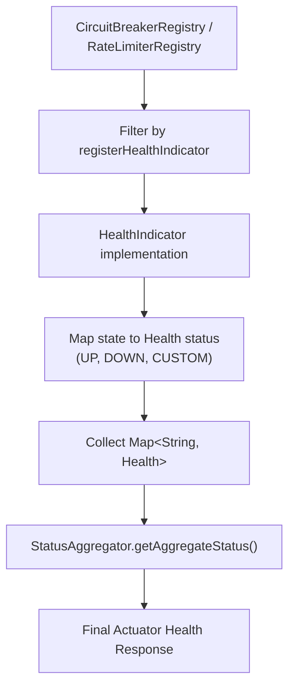
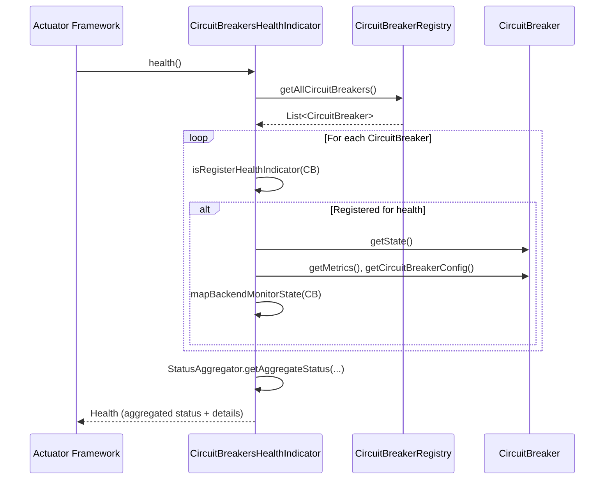
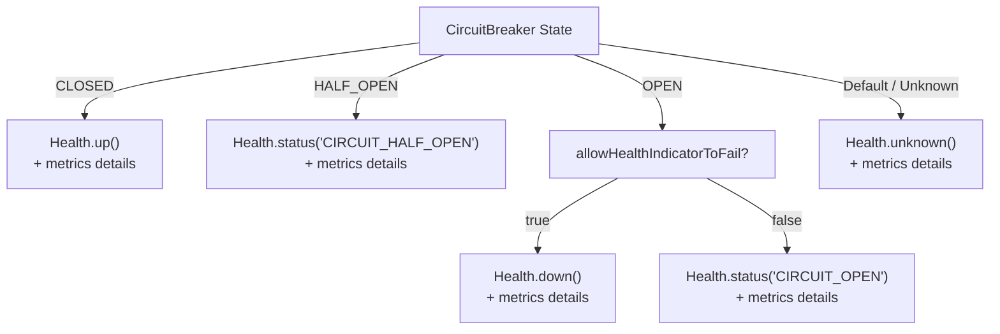

# Spring Boot 3 Health

<details>
<summary>Relevant source files</summary>

The following files were used as context for generating this wiki page:

- [resilience4j-spring-boot3/src/main/java/io/github/resilience4j/springboot3/circuitbreaker/monitoring/endpoint/CircuitBreakerEndpoint.java](https://github.com/resilience4j/resilience4j/blob/main/resilience4j-spring-boot3/src/main/java/io/github/resilience4j/springboot3/circuitbreaker/monitoring/endpoint/CircuitBreakerEndpoint.java)
- [resilience4j-spring-boot4/src/main/java/io/github/resilience4j/springboot/circuitbreaker/monitoring/endpoint/CircuitBreakerEndpoint.java](https://github.com/resilience4j/resilience4j/blob/main/resilience4j-spring-boot4/src/main/java/io/github/resilience4j/springboot/circuitbreaker/monitoring/endpoint/CircuitBreakerEndpoint.java)
- [resilience4j-spring-boot3/src/main/java/io/github/resilience4j/springboot3/circuitbreaker/monitoring/health/CircuitBreakersHealthIndicator.java](https://github.com/resilience4j/resilience4j/blob/main/resilience4j-spring-boot3/src/main/java/io/github/resilience4j/springboot3/circuitbreaker/monitoring/health/CircuitBreakersHealthIndicator.java)
- [resilience4j-spring-boot4/src/main/java/io/github/resilience4j/springboot/circuitbreaker/monitoring/health/CircuitBreakersHealthIndicator.java](https://github.com/resilience4j/resilience4j/blob/main/resilience4j-spring-boot4/src/main/java/io/github/resilience4j/springboot/circuitbreaker/monitoring/health/CircuitBreakersHealthIndicator.java)
- [resilience4j-spring-boot3/src/main/java/io/github/resilience4j/springboot3/ratelimiter/monitoring/health/RateLimitersHealthIndicator.java](https://github.com/resilience4j/resilience4j/blob/main/resilience4j-spring-boot3/src/main/java/io/github/resilience4j/springboot3/ratelimiter/monitoring/health/RateLimitersHealthIndicator.java)
- [resilience4j-spring-boot3/src/main/resources/META-INF/additional-spring-configuration-metadata.json](https://github.com/resilience4j/resilience4j/blob/main/resilience4j-spring-boot3/src/main/resources/META-INF/additional-spring-configuration-metadata.json)
- [resilience4j-spring-boot4/src/main/java/io/github/resilience4j/springboot/ratelimiter/monitoring/health/RateLimitersHealthIndicator.java](https://github.com/resilience4j/resilience4j/blob/main/resilience4j-spring-boot4/src/main/java/io/github/resilience4j/springboot/ratelimiter/monitoring/health/RateLimitersHealthIndicator.java)
- [resilience4j-spring-boot4/src/main/resources/META-INF/additional-spring-configuration-metadata.json](https://github.com/resilience4j/resilience4j/blob/main/resilience4j-spring-boot4/src/main/resources/META-INF/additional-spring-configuration-metadata.json)
- [resilience4j-spring-boot3/src/main/java/io/github/resilience4j/springboot3/ratelimiter/autoconfigure/RateLimitersHealthIndicatorAutoConfiguration.java](https://github.com/resilience4j/resilience4j/blob/main/resilience4j-spring-boot3/src/main/java/io/github/resilience4j/springboot3/ratelimiter/autoconfigure/RateLimitersHealthIndicatorAutoConfiguration.java)
- [resilience4j-spring-boot3/README.adoc](https://github.com/resilience4j/resilience4j/blob/main/resilience4j-spring-boot3/README.adoc)
- [resilience4j-spring-boot3/src/main/java/io/github/resilience4j/springboot3/circuitbreaker/autoconfigure/CircuitBreakersHealthIndicatorAutoConfiguration.java](https://github.com/resilience4j/resilience4j/blob/main/resilience4j-spring-boot3/src/main/java/io/github/resilience4j/springboot3/circuitbreaker/autoconfigure/CircuitBreakersHealthIndicatorAutoConfiguration.java)
- [resilience4j-spring-boot4/src/main/java/io/github/resilience4j/springboot/ratelimiter/autoconfigure/RateLimitersHealthIndicatorAutoConfiguration.java](https://github.com/resilience4j/resilience4j/blob/main/resilience4j-spring-boot4/src/main/java/io/github/resilience4j/springboot/ratelimiter/autoconfigure/RateLimitersHealthIndicatorAutoConfiguration.java)
- [resilience4j-spring-boot4/src/main/java/io/github/resilience4j/springboot/circuitbreaker/autoconfigure/CircuitBreakersHealthIndicatorAutoConfiguration.java](https://github.com/resilience4j/resilience4j/blob/main/resilience4j-spring-boot4/src/main/java/io/github/resilience4j/springboot/circuitbreaker/autoconfigure/CircuitBreakersHealthIndicatorAutoConfiguration.java)
- [resilience4j-spring-boot3/src/main/java/io/github/resilience4j/springboot3/circuitbreaker/monitoring/endpoint/CircuitBreakerHystrixServerSideEvent.java](https://github.com/resilience4j/resilience4j/blob/main/resilience4j-spring-boot3/src/main/java/io/github/resilience4j/springboot3/circuitbreaker/monitoring/endpoint/CircuitBreakerHystrixServerSideEvent.java)
- [resilience4j-spring-boot3/src/main/java/io/github/resilience4j/springboot3/circuitbreaker/monitoring/health/package-info.java](https://github.com/resilience4j/resilience4j/blob/main/resilience4j-spring-boot3/src/main/java/io/github/resilience4j/springboot3/circuitbreaker/monitoring/health/package-info.java)
- [resilience4j-spring-boot3/src/main/java/io/github/resilience4j/springboot3/ratelimiter/monitoring/health/package-info.java](https://github.com/resilience4j/resilience4j/blob/main/resilience4j-spring-boot3/src/main/java/io/github/resilience4j/springboot3/ratelimiter/monitoring/health/package-info.java)
- [resilience4j-spring-boot3/src/main/java/io/github/resilience4j/springboot3/circuitbreaker/autoconfigure/CircuitBreakerStreamEventsAutoConfiguration.java](https://github.com/resilience4j/resilience4j/blob/main/resilience4j-spring-boot3/src/main/java/io/github/resilience4j/springboot3/circuitbreaker/autoconfigure/CircuitBreakerStreamEventsAutoConfiguration.java)
- [resilience4j-spring-boot3/src/main/java/io/github/resilience4j/springboot3/circuitbreaker/autoconfigure/CircuitBreakerAutoConfiguration.java](https://github.com/resilience4j/resilience4j/blob/main/resilience4j-spring-boot3/src/main/java/io/github/resilience4j/springboot3/circuitbreaker/autoconfigure/CircuitBreakerAutoConfiguration.java)
- [resilience4j-spring-boot3/src/main/java/io/github/resilience4j/springboot3/circuitbreaker/monitoring/endpoint/CircuitBreakerServerSideEvent.java](https://github.com/resilience4j/resilience4j/blob/main/resilience4j-spring-boot3/src/main/java/io/github/resilience4j/springboot3/circuitbreaker/monitoring/endpoint/CircuitBreakerServerSideEvent.java)
- [resilience4j-spring-boot4/src/main/java/io/github/resilience4j/springboot/circuitbreaker/monitoring/endpoint/CircuitBreakerHystrixServerSideEvent.java](https://github.com/resilience4j/resilience4j/blob/main/resilience4j-spring-boot4/src/main/java/io/github/resilience4j/springboot/circuitbreaker/monitoring/endpoint/CircuitBreakerHystrixServerSideEvent.java)
- [resilience4j-spring-boot3/src/main/java/io/github/resilience4j/springboot3/ratelimiter/autoconfigure/RateLimiterAutoConfiguration.java](https://github.com/resilience4j/resilience4j/blob/main/resilience4j-spring-boot3/src/main/java/io/github/resilience4j/springboot3/ratelimiter/autoconfigure/RateLimiterAutoConfiguration.java)
- [resilience4j-spring-boot3/src/main/java/io/github/resilience4j/springboot3/ratelimiter/autoconfigure/RateLimiterMetricsAutoConfiguration.java](https://github.com/resilience4j/resilience4j/blob/main/resilience4j-spring-boot3/src/main/java/io/github/resilience4j/springboot3/ratelimiter/autoconfigure/RateLimiterMetricsAutoConfiguration.java)
- [resilience4j-spring-boot3/src/main/java/io/github/resilience4j/springboot3/circuitbreaker/monitoring/endpoint/CircuitBreakerEventsEndpoint.java](https://github.com/resilience4j/resilience4j/blob/main/resilience4j-spring-boot3/src/main/java/io/github/resilience4j/springboot3/circuitbreaker/monitoring/endpoint/CircuitBreakerEventsEndpoint.java)
- [resilience4j-spring-boot4/src/main/java/io/github/resilience4j/springboot/circuitbreaker/autoconfigure/CircuitBreakerStreamEventsAutoConfiguration.java](https://github.com/resilience4j/resilience4j/blob/main/resilience4j-spring-boot4/src/main/java/io/github/resilience4j/springboot/circuitbreaker/autoconfigure/CircuitBreakerStreamEventsAutoConfiguration.java)
- [resilience4j-spring-boot3/src/main/java/io/github/resilience4j/springboot3/circuitbreaker/autoconfigure/CircuitBreakerMetricsAutoConfiguration.java](https://github.com/resilience4j/resilience4j/blob/main/resilience4j-spring-boot3/src/main/java/io/github/resilience4j/springboot3/circuitbreaker/autoconfigure/CircuitBreakerMetricsAutoConfiguration.java)
- [resilience4j-spring-boot3/src/main/java/io/github/resilience4j/springboot3/ratelimiter/monitoring/endpoint/RateLimiterEventsEndpoint.java](https://github.com/resilience4j/resilience4j/blob/main/resilience4j-spring-boot3/src/main/java/io/github/resilience4j/springboot3/ratelimiter/monitoring/endpoint/RateLimiterEventsEndpoint.java)
- [resilience4j-spring-boot3/src/main/java/io/github/resilience4j/springboot3/verifier/autoconfigure/SpringBoot3VerifierAutoConfiguration.java](https://github.com/resilience4j/resilience4j/blob/main/resilience4j-spring-boot3/src/main/java/io/github/resilience4j/springboot3/verifier/autoconfigure/SpringBoot3VerifierAutoConfiguration.java)
- [resilience4j-spring-boot4/src/main/java/io/github/resilience4j/springboot/ratelimiter/monitoring/health/package-info.java](https://github.com/resilience4j/resilience4j/blob/main/resilience4j-spring-boot4/src/main/java/io/github/resilience4j/springboot/ratelimiter/monitoring/health/package-info.java)
- [resilience4j-spring-boot3/src/main/java/io/github/resilience4j/springboot3/timelimiter/autoconfigure/TimeLimiterAutoConfiguration.java](https://github.com/resilience4j/resilience4j/blob/main/resilience4j-spring-boot3/src/main/java/io/github/resilience4j/springboot3/timelimiter/autoconfigure/TimeLimiterAutoConfiguration.java)
- [resilience4j-spring-boot4/src/main/java/io/github/resilience4j/springboot/circuitbreaker/monitoring/health/package-info.java](https://github.com/resilience4j/resilience4j/blob/main/resilience4j-spring-boot4/src/main/java/io/github/resilience4j/springboot/circuitbreaker/monitoring/health/package-info.java)
</details>

## Overview

The Spring Boot 3 Health subsystem in Resilience4j bridges fault tolerance primitives—specifically Circuit Breakers and Rate Limiters—with Spring Boot Actuator's health and monitoring framework. It provides automated health indicators that evaluate backend states, aggregates multiple instance healths using Spring Boot's `StatusAggregator`, and exposes operational details through actuator endpoints and configuration metadata.

Sources: [resilience4j-spring-boot3/src/main/java/io/github/resilience4j/springboot3/circuitbreaker/monitoring/health/CircuitBreakersHealthIndicator.java:107-115](https://github.com/resilience4j/resilience4j/blob/main/resilience4j-spring-boot3/src/main/java/io/github/resilience4j/springboot3/circuitbreaker/monitoring/health/CircuitBreakersHealthIndicator.java#L107-L115)

By design, resilience components do not inherently alter an application's overall container health unless explicitly configured. The architecture utilizes conditional auto-configurations (`CircuitBreakersHealthIndicatorAutoConfiguration` and `RateLimitersHealthIndicatorAutoConfiguration`) to inspect registries, filter instances based on `registerHealthIndicator` properties, and map internal runtime states (such as `CLOSED`, `OPEN`, `HALF_OPEN`, or permission exhaustion) into standard or custom Actuator `Status` values. This ensures that infrastructure degradation in downstream dependencies can be accurately monitored and surfaced via standardized operational touchpoints.

Sources: [resilience4j-spring-boot3/src/main/java/io/github/resilience4j/springboot3/ratelimiter/monitoring/health/RateLimitersHealthIndicator.java:52-59](https://github.com/resilience4j/resilience4j/blob/main/resilience4j-spring-boot3/src/main/java/io/github/resilience4j/springboot3/ratelimiter/monitoring/health/RateLimitersHealthIndicator.java#L52-L59)



Sources: [resilience4j-spring-boot3/src/main/java/io/github/resilience4j/springboot3/circuitbreaker/monitoring/health/CircuitBreakersHealthIndicator.java:107-115](https://github.com/resilience4j/resilience4j/blob/main/resilience4j-spring-boot3/src/main/java/io/github/resilience4j/springboot3/circuitbreaker/monitoring/health/CircuitBreakersHealthIndicator.java#L107-L115), [resilience4j-spring-boot3/src/main/java/io/github/resilience4j/springboot3/ratelimiter/monitoring/health/RateLimitersHealthIndicator.java:52-59](https://github.com/resilience4j/resilience4j/blob/main/resilience4j-spring-boot3/src/main/java/io/github/resilience4j/springboot3/ratelimiter/monitoring/health/RateLimitersHealthIndicator.java#L52-L59)

---

## Circuit Breakers Health Indicator

The `CircuitBreakersHealthIndicator` implements Spring Boot's `HealthIndicator` interface to evaluate all registered circuit breakers. It inspects each circuit breaker's configuration and metrics, determining whether it contributes to the overall health check and how its runtime state maps to an actuator status.

Sources: [resilience4j-spring-boot3/src/main/java/io/github/resilience4j/springboot3/circuitbreaker/monitoring/health/CircuitBreakersHealthIndicator.java:37-49](https://github.com/resilience4j/resilience4j/blob/main/resilience4j-spring-boot3/src/main/java/io/github/resilience4j/springboot3/circuitbreaker/monitoring/health/CircuitBreakersHealthIndicator.java#L37-L49)

During the execution of `health()`, the indicator retrieves all circuit breakers from the `CircuitBreakerRegistry`, filters them using `isRegisterHealthIndicator()`, and maps each surviving instance via `mapBackendMonitorState()`. The resulting individual health statuses are aggregated using the configured `StatusAggregator`.

Sources: [resilience4j-spring-boot3/src/main/java/io/github/resilience4j/springboot3/circuitbreaker/monitoring/health/CircuitBreakersHealthIndicator.java:106-116](https://github.com/resilience4j/resilience4j/blob/main/resilience4j-spring-boot3/src/main/java/io/github/resilience4j/springboot3/circuitbreaker/monitoring/health/CircuitBreakersHealthIndicator.java#L106-L116)



Sources: [resilience4j-spring-boot3/src/main/java/io/github/resilience4j/springboot3/circuitbreaker/monitoring/health/CircuitBreakersHealthIndicator.java:106-116](https://github.com/resilience4j/resilience4j/blob/main/resilience4j-spring-boot3/src/main/java/io/github/resilience4j/springboot3/circuitbreaker/monitoring/health/CircuitBreakersHealthIndicator.java#L106-L116)

---

## Rate Limiters Health Indicator

The `RateLimitersHealthIndicator` monitors the execution capacity and thread contention of rate limiter instances. It inspects available permissions, waiting threads, and configuration timeout durations to assess whether a rate limiter is operating normally or experiencing exhaustion.

Sources: [resilience4j-spring-boot3/src/main/java/io/github/resilience4j/springboot3/ratelimiter/monitoring/health/RateLimitersHealthIndicator.java:29-41](https://github.com/resilience4j/resilience4j/blob/main/resilience4j-spring-boot3/src/main/java/io/github/resilience4j/springboot3/ratelimiter/monitoring/health/RateLimitersHealthIndicator.java#L29-L41)

If available permissions are greater than zero or no threads are waiting, the health status is reported as `Status.UP`. When permissions are exhausted and threads are waiting, if the instance is an `AtomicRateLimiter`, it retrieves detailed metrics via `getDetailedMetrics()` to evaluate `nanosToWait`. If the wait time exceeds the configured timeout duration, the health status becomes either `Status.DOWN` (if `allowHealthIndicatorToFail` is enabled) or a custom `RATE_LIMITED` status.

Sources: [resilience4j-spring-boot3/src/main/java/io/github/resilience4j/springboot3/ratelimiter/monitoring/health/RateLimitersHealthIndicator.java:73-95](https://github.com/resilience4j/resilience4j/blob/main/resilience4j-spring-boot3/src/main/java/io/github/resilience4j/springboot3/ratelimiter/monitoring/health/RateLimitersHealthIndicator.java#L73-L95)

> [!NOTE]
> Detailed metrics and wait-time evaluations are restricted to instances of `AtomicRateLimiter`. Other rate limiter implementations fall back to `Status.UNKNOWN` when permissions are exhausted and threads are waiting.

Sources: [resilience4j-spring-boot3/src/main/java/io/github/resilience4j/springboot3/ratelimiter/monitoring/health/RateLimitersHealthIndicator.java:83-94](https://github.com/resilience4j/resilience4j/blob/main/resilience4j-spring-boot3/src/main/java/io/github/resilience4j/springboot3/ratelimiter/monitoring/health/RateLimitersHealthIndicator.java#L83-L94)

---

## Health Auto-Configurations

Auto-configurations wire the health indicators into Spring Boot's actuator environment conditionally. `CircuitBreakersHealthIndicatorAutoConfiguration` and `RateLimitersHealthIndicatorAutoConfiguration` evaluate class presence, auto-configuration ordering, and property flags before registering the respective beans.

Sources: [resilience4j-spring-boot3/src/main/java/io/github/resilience4j/springboot3/circuitbreaker/autoconfigure/CircuitBreakersHealthIndicatorAutoConfiguration.java:18-34](https://github.com/resilience4j/resilience4j/blob/main/resilience4j-spring-boot3/src/main/java/io/github/resilience4j/springboot3/circuitbreaker/autoconfigure/CircuitBreakersHealthIndicatorAutoConfiguration.java#L18-34)

The auto-configurations run after their respective core feature configurations (`CircuitBreakerAutoConfiguration` and `RateLimiterAutoConfiguration`) and before Spring Boot's `HealthContributorAutoConfiguration`. They require `HealthIndicator`, `StatusAggregator`, and the resilience domain classes to be present on the classpath.

Sources: [resilience4j-spring-boot3/src/main/java/io/github/resilience4j/springboot3/ratelimiter/autoconfigure/RateLimitersHealthIndicatorAutoConfiguration.java:18-34](https://github.com/resilience4j/resilience4j/blob/main/resilience4j-spring-boot3/src/main/java/io/github/resilience4j/springboot3/ratelimiter/autoconfigure/RateLimitersHealthIndicatorAutoConfiguration.java#L18-34)

| Auto-Configuration Class | Required Condition Classes | Enabled Property Flag | Default Value |
| :--- | :--- | :--- | :--- |
| `CircuitBreakersHealthIndicatorAutoConfiguration` | `CircuitBreaker.class`, `HealthIndicator.class`, `StatusAggregator.class` | `management.health.circuitbreakers.enabled` | `false` |
| `RateLimitersHealthIndicatorAutoConfiguration` | `RateLimiter.class`, `HealthIndicator.class`, `StatusAggregator.class` | `management.health.ratelimiters.enabled` | `false` |

Sources: [resilience4j-spring-boot3/src/main/resources/META-INF/additional-spring-configuration-metadata.json:4-14](https://github.com/resilience4j/resilience4j/blob/main/resilience4j-spring-boot3/src/main/resources/META-INF/additional-spring-configuration-metadata.json#L4-14)

---

## Status Mapping Logic

The health indicators translate internal states into Actuator `Status` objects based on instance configuration properties. For circuit breakers, state transitions determine the base health status and whether failure flags permit the overall health indicator to report `DOWN`.

Sources: [resilience4j-spring-boot3/src/main/java/io/github/resilience4j/springboot3/circuitbreaker/monitoring/health/CircuitBreakersHealthIndicator.java:85-98](https://github.com/resilience4j/resilience4j/blob/main/resilience4j-spring-boot3/src/main/java/io/github/resilience4j/springboot3/circuitbreaker/monitoring/health/CircuitBreakersHealthIndicator.java#L85-L98)

For circuit breakers, when the state is `OPEN`, `allowHealthIndicatorToFail(circuitBreaker)` is evaluated. If true, `Health.down()` is returned; otherwise, a custom status `CIRCUIT_OPEN` is emitted. When the state is `HALF_OPEN`, a custom status `CIRCUIT_HALF_OPEN` is always used.

Sources: [resilience4j-spring-boot3/src/main/java/io/github/resilience4j/springboot3/circuitbreaker/monitoring/health/CircuitBreakersHealthIndicator.java:89-94](https://github.com/resilience4j/resilience4j/blob/main/resilience4j-spring-boot3/src/main/java/io/github/resilience4j/springboot3/circuitbreaker/monitoring/health/CircuitBreakersHealthIndicator.java#L89-L94)



Sources: [resilience4j-spring-boot3/src/main/java/io/github/resilience4j/springboot3/circuitbreaker/monitoring/health/CircuitBreakersHealthIndicator.java:85-98](https://github.com/resilience4j/resilience4j/blob/main/resilience4j-spring-boot3/src/main/java/io/github/resilience4j/springboot3/circuitbreaker/monitoring/health/CircuitBreakersHealthIndicator.java#L85-L98)

---

## Configuration Properties

To control whether specific resilience instances register with the health indicators or influence aggregate application health, instance properties are queried via configuration property finders.

Sources: [resilience4j-spring-boot3/src/main/java/io/github/resilience4j/springboot3/circuitbreaker/monitoring/health/CircuitBreakersHealthIndicator.java:79-104](https://github.com/resilience4j/resilience4j/blob/main/resilience4j-spring-boot3/src/main/java/io/github/resilience4j/springboot3/circuitbreaker/monitoring/health/CircuitBreakersHealthIndicator.java#L79-L104)

| Configuration Property Path | Target Instance Property | Description | Default Value |
| :--- | :--- | :--- | :--- |
| `resilience4j.circuitbreaker.instances.<name>.register-health-indicator` | `RegisterHealthIndicator` | Whether the circuit breaker registers a health indicator | `false` (inferred) |
| `resilience4j.circuitbreaker.instances.<name>.allow-health-indicator-to-fail` | `AllowHealthIndicatorToFail` | Whether an open circuit breaker forces overall health status to DOWN | `false` |
| `resilience4j.ratelimiter.instances.<name>.register-health-indicator` | `RegisterHealthIndicator` | Whether the rate limiter registers a health indicator | `false` (inferred) |
| `resilience4j.ratelimiter.instances.<name>.allow-health-indicator-to-fail` | `AllowHealthIndicatorToFail` | Whether a rate-limited state forces overall health status to DOWN | `false` |

Sources: [resilience4j-spring-boot3/src/main/java/io/github/resilience4j/springboot3/ratelimiter/monitoring/health/RateLimitersHealthIndicator.java:61-71](https://github.com/resilience4j/resilience4j/blob/main/resilience4j-spring-boot3/src/main/java/io/github/resilience4j/springboot3/ratelimiter/monitoring/health/RateLimitersHealthIndicator.java#L61-71)

---

## Actuator Endpoints and Metrics

In addition to health indicators, Resilience4j exposes operational endpoints for monitoring and runtime management of circuit breakers and rate limiters. These include summary endpoints (`/actuator/circuitbreakers`, `/actuator/ratelimiters`), event streaming endpoints (`/actuator/circuitbreakerevents`, `/actuator/streamcircuitbreakerevents`), and Hystrix-compatible migration streams (`/actuator/hystrixstreamcircuitbreakerevents`).

Sources: [resilience4j-spring-boot3/src/main/java/io/github/resilience4j/springboot3/circuitbreaker/monitoring/endpoint/CircuitBreakerEndpoint.java:38-53](https://github.com/resilience4j/resilience4j/blob/main/resilience4j-spring-boot3/src/main/java/io/github/resilience4j/springboot3/circuitbreaker/monitoring/endpoint/CircuitBreakerEndpoint.java#L38-53)

> [!WARNING]
> By default, management health checks for circuit breakers and rate limiters are disabled (`management.health.circuitbreakers.enabled=false` and `management.health.ratelimiters.enabled=false`). They must be explicitly enabled in configuration properties to appear in the `/actuator/health` response.

Sources: [resilience4j-spring-boot3/src/main/resources/META-INF/additional-spring-configuration-metadata.json:4-14](https://github.com/resilience4j/resilience4j/blob/main/resilience4j-spring-boot3/src/main/resources/META-INF/additional-spring-configuration-metadata.json#L4-14)

---

## Runnable Example

To enable and configure Circuit Breaker and Rate Limiter health indicators in a Spring Boot 3 application, declare the following properties in `application.yml`:

Sources: [resilience4j-spring-boot3/src/main/resources/META-INF/additional-spring-configuration-metadata.json:4-14](https://github.com/resilience4j/resilience4j/blob/main/resilience4j-spring-boot3/src/main/resources/META-INF/additional-spring-configuration-metadata.json#L4-14)

```yaml
management:
  health:
    circuitbreakers:
      enabled: true
    ratelimiters:
      enabled: true

resilience4j:
  circuitbreaker:
    instances:
      backendA:
        registerHealthIndicator: true
        allowHealthIndicatorToFail: true
        failureRateThreshold: 50
        slowCallRateThreshold: 100
        slowCallDurationThreshold: 60s
        slidingWindowType: COUNT_BASED
        slidingWindowSize: 10
        minimumNumberOfCalls: 5
        automaticTransitionFromOpenToHalfOpenEnabled: true
        waitDurationInOpenState: 10s
        permittedNumberOfCallsInHalfOpenState: 3
  
  ratelimiter:
    instances:
      backendB:
        registerHealthIndicator: true
        allowHealthIndicatorToFail: false
        limitForPeriod: 10
        limitRefreshPeriod: 1s
        timeoutDuration: 0s
```

Sources: [resilience4j-spring-boot3/src/main/java/io/github/resilience4j/springboot3/circuitbreaker/monitoring/health/CircuitBreakersHealthIndicator.java:79-116](https://github.com/resilience4j/resilience4j/blob/main/resilience4j-spring-boot3/src/main/java/io/github/resilience4j/springboot3/circuitbreaker/monitoring/health/CircuitBreakersHealthIndicator.java#L79-L116), [resilience4j-spring-boot3/src/main/java/io/github/resilience4j/springboot3/ratelimiter/monitoring/health/RateLimitersHealthIndicator.java:61-94](https://github.com/resilience4j/resilience4j/blob/main/resilience4j-spring-boot3/src/main/java/io/github/resilience4j/springboot3/ratelimiter/monitoring/health/RateLimitersHealthIndicator.java#L61-94)

## Related

- [[Spring Boot 3 Actuator]]

