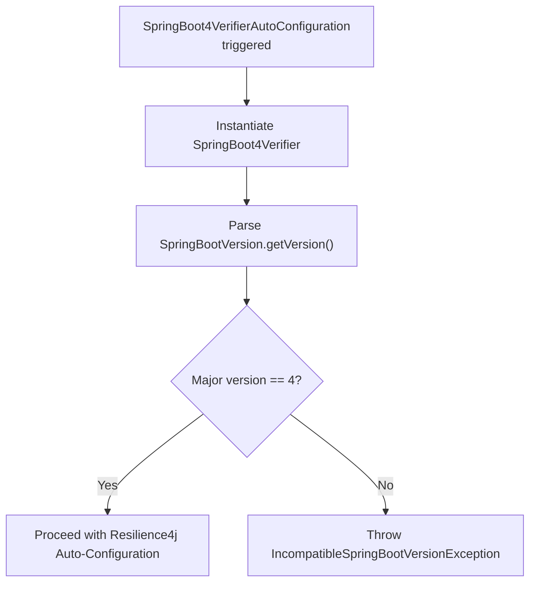
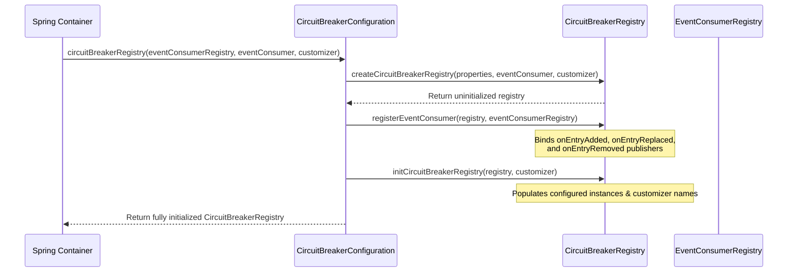

# Spring Boot 4 Configuration

<details>
<summary>Relevant source files</summary>

The following files were used as context for generating this wiki page:

- [resilience4j-spring6/src/main/java/io/github/resilience4j/spring6/circuitbreaker/configure/CircuitBreakerConfiguration.java](https://github.com/resilience4j/resilience4j/blob/main/resilience4j-spring6/src/main/java/io/github/resilience4j/spring6/circuitbreaker/configure/CircuitBreakerConfiguration.java)
- [resilience4j-spring-boot4/src/main/java/io/github/resilience4j/springboot/circuitbreaker/autoconfigure/CircuitBreakerAutoConfiguration.java](https://github.com/resilience4j/resilience4j/blob/main/resilience4j-spring-boot4/src/main/java/io/github/resilience4j/springboot/circuitbreaker/autoconfigure/CircuitBreakerAutoConfiguration.java)
- [resilience4j-spring-boot4/src/main/resources/META-INF/additional-spring-configuration-metadata.json](https://github.com/resilience4j/resilience4j/blob/main/resilience4j-spring-boot4/src/main/resources/META-INF/additional-spring-configuration-metadata.json)
- [resilience4j-spring-boot4/src/main/java/io/github/resilience4j/springboot/retry/autoconfigure/RetryAutoConfiguration.java](https://github.com/resilience4j/resilience4j/blob/main/resilience4j-spring-boot4/src/main/java/io/github/resilience4j/springboot/retry/autoconfigure/RetryAutoConfiguration.java)
- [resilience4j-spring-boot4/src/main/java/io/github/resilience4j/springboot/ratelimiter/autoconfigure/RateLimiterAutoConfiguration.java](https://github.com/resilience4j/resilience4j/blob/main/resilience4j-spring-boot4/src/main/java/io/github/resilience4j/springboot/ratelimiter/autoconfigure/RateLimiterAutoConfiguration.java)
- [resilience4j-spring-boot3/src/main/resources/META-INF/additional-spring-configuration-metadata.json](https://github.com/resilience4j/resilience4j/blob/main/resilience4j-spring-boot3/src/main/resources/META-INF/additional-spring-configuration-metadata.json)
- [resilience4j-spring-boot4/src/main/java/io/github/resilience4j/springboot/bulkhead/autoconfigure/BulkheadAutoConfiguration.java](https://github.com/resilience4j/resilience4j/blob/main/resilience4j-spring-boot4/src/main/java/io/github/resilience4j/springboot/bulkhead/autoconfigure/BulkheadAutoConfiguration.java)
- [README.adoc](https://github.com/resilience4j/resilience4j/blob/main/README.adoc)
- [resilience4j-spring-boot3/README.adoc](https://github.com/resilience4j/resilience4j/blob/main/resilience4j-spring-boot3/README.adoc)
- [resilience4j-spring-boot4/src/main/java/io/github/resilience4j/springboot/verifier/autoconfigure/SpringBoot4VerifierAutoConfiguration.java](https://github.com/resilience4j/resilience4j/blob/main/resilience4j-spring-boot4/src/main/java/io/github/resilience4j/springboot/verifier/autoconfigure/SpringBoot4VerifierAutoConfiguration.java)
- [resilience4j-spring-boot3/src/main/java/io/github/resilience4j/springboot3/verifier/autoconfigure/SpringBoot3VerifierAutoConfiguration.java](https://github.com/resilience4j/resilience4j/blob/main/resilience4j-spring-boot3/src/main/java/io/github/resilience4j/springboot3/verifier/autoconfigure/SpringBoot3VerifierAutoConfiguration.java)
- [resilience4j-spring-boot4/src/main/java/io/github/resilience4j/springboot/circuitbreaker/autoconfigure/CircuitBreakerStreamEventsAutoConfiguration.java](https://github.com/resilience4j/resilience4j/blob/main/resilience4j-spring-boot4/src/main/java/io/github/resilience4j/springboot/circuitbreaker/autoconfigure/CircuitBreakerStreamEventsAutoConfiguration.java)
- [resilience4j-spring-boot4/src/main/java/io/github/resilience4j/springboot/circuitbreaker/autoconfigure/CircuitBreakerRefreshScopedRegistryAutoConfiguration.java](https://github.com/resilience4j/resilience4j/blob/main/resilience4j-spring-boot4/src/main/java/io/github/resilience4j/springboot/circuitbreaker/autoconfigure/CircuitBreakerRefreshScopedRegistryAutoConfiguration.java)
- [resilience4j-spring-boot3/src/main/java/io/github/resilience4j/springboot3/circuitbreaker/autoconfigure/CircuitBreakerStreamEventsAutoConfiguration.java](https://github.com/resilience4j/resilience4j/blob/main/resilience4j-spring-boot3/src/main/java/io/github/resilience4j/springboot3/circuitbreaker/autoconfigure/CircuitBreakerStreamEventsAutoConfiguration.java)
- [resilience4j-spring-boot4/src/main/java/io/github/resilience4j/springboot/circuitbreaker/autoconfigure/CircuitBreakerMetricsAutoConfiguration.java](https://github.com/resilience4j/resilience4j/blob/main/resilience4j-spring-boot4/src/main/java/io/github/resilience4j/springboot/circuitbreaker/autoconfigure/CircuitBreakerMetricsAutoConfiguration.java)
- [resilience4j-spring-boot4/src/main/java/io/github/resilience4j/springboot/verifier/autoconfigure/SpringBoot4Verifier.java](https://github.com/resilience4j/resilience4j/blob/main/resilience4j-spring-boot4/src/main/java/io/github/resilience4j/springboot/verifier/autoconfigure/SpringBoot4Verifier.java)
- [resilience4j-spring-boot4/src/main/java/io/github/resilience4j/springboot/circuitbreaker/autoconfigure/CircuitBreakersHealthIndicatorAutoConfiguration.java](https://github.com/resilience4j/resilience4j/blob/main/resilience4j-spring-boot4/src/main/java/io/github/resilience4j/springboot/circuitbreaker/autoconfigure/CircuitBreakersHealthIndicatorAutoConfiguration.java)
- [resilience4j-spring-boot3/src/main/java/io/github/resilience4j/springboot3/circuitbreaker/autoconfigure/CircuitBreakerAutoConfiguration.java](https://github.com/resilience4j/resilience4j/blob/main/resilience4j-spring-boot3/src/main/java/io/github/resilience4j/springboot3/circuitbreaker/autoconfigure/CircuitBreakerAutoConfiguration.java)
- [gradle/libs.versions.toml](https://github.com/resilience4j/resilience4j/blob/main/gradle/libs.versions.toml)
- [resilience4j-spring-boot3/src/main/java/io/github/resilience4j/springboot3/circuitbreaker/autoconfigure/CircuitBreakersHealthIndicatorAutoConfiguration.java](https://github.com/resilience4j/resilience4j/blob/main/resilience4j-spring-boot3/src/main/java/io/github/resilience4j/springboot3/circuitbreaker/autoconfigure/CircuitBreakersHealthIndicatorAutoConfiguration.java)
- [resilience4j-spring-boot4/README.adoc](https://github.com/resilience4j/resilience4j/blob/main/resilience4j-spring-boot4/README.adoc)
- [resilience4j-spring-boot3/src/main/java/io/github/resilience4j/springboot3/retry/autoconfigure/RetryAutoConfiguration.java](https://github.com/resilience4j/resilience4j/blob/main/resilience4j-spring-boot3/src/main/java/io/github/resilience4j/springboot3/retry/autoconfigure/RetryAutoConfiguration.java)
- [resilience4j-spring-boot3/src/main/java/io/github/resilience4j/springboot3/circuitbreaker/autoconfigure/CircuitBreakerMetricsAutoConfiguration.java](https://github.com/resilience4j/resilience4j/blob/main/resilience4j-spring-boot3/src/main/java/io/github/resilience4j/springboot3/circuitbreaker/autoconfigure/CircuitBreakerMetricsAutoConfiguration.java)
- [resilience4j-spring-boot4/src/main/java/io/github/resilience4j/springboot/micrometer/autoconfigure/TimerAutoConfiguration.java](https://github.com/resilience4j/resilience4j/blob/main/resilience4j-spring-boot4/src/main/java/io/github/resilience4j/springboot/micrometer/autoconfigure/TimerAutoConfiguration.java)
- [resilience4j-spring-boot4/src/main/java/io/github/resilience4j/springboot/retry/autoconfigure/RetryMetricsAutoConfiguration.java](https://github.com/resilience4j/resilience4j/blob/main/resilience4j-spring-boot4/src/main/java/io/github/resilience4j/springboot/retry/autoconfigure/RetryMetricsAutoConfiguration.java)
- [resilience4j-spring-boot4/src/main/java/io/github/resilience4j/springboot/nativeimage/configuration/NativeHintsConfiguration.java](https://github.com/resilience4j/resilience4j/blob/main/resilience4j-spring-boot4/src/main/java/io/github/resilience4j/springboot/nativeimage/configuration/NativeHintsConfiguration.java)
- [resilience4j-spring-boot3/src/main/java/io/github/resilience4j/springboot3/nativeimage/configuration/NativeHintsConfiguration.java](https://github.com/resilience4j/resilience4j/blob/main/resilience4j-spring-boot3/src/main/java/io/github/resilience4j/springboot3/nativeimage/configuration/NativeHintsConfiguration.java)
- [resilience4j-spring-boot4/src/main/java/io/github/resilience4j/springboot/retry/autoconfigure/RetryRefreshScopedRegistryAutoConfiguration.java](https://github.com/resilience4j/resilience4j/blob/main/resilience4j-spring-boot4/src/main/java/io/github/resilience4j/springboot/retry/autoconfigure/RetryRefreshScopedRegistryAutoConfiguration.java)
- [resilience4j-spring-boot4/src/main/java/io/github/resilience4j/springboot/bulkhead/autoconfigure/BulkheadRefreshScopedRegistryAutoConfiguration.java](https://github.com/resilience4j/resilience4j/blob/main/resilience4j-spring-boot4/src/main/java/io/github/resilience4j/springboot/bulkhead/autoconfigure/BulkheadRefreshScopedRegistryAutoConfiguration.java)
- [resilience4j-spring-boot4/src/main/java/io/github/resilience4j/springboot/nativeimage/configuration/package-info.java](https://github.com/resilience4j/resilience4j/blob/main/resilience4j-spring-boot4/src/main/java/io/github/resilience4j/springboot/nativeimage/configuration/package-info.java)
</details>

## Overview

### Overview Sub-section

The `resilience4j-spring-boot4` module provides advanced auto-configuration support tailored for Spring Boot 4 environments. It bridges Resilience4j fault tolerance capabilities—such as Circuit Breakers, Retries, Rate Limiters, Bulkheads, Time Limiters, and Timers—with Spring Boot's dependency injection container, Actuator endpoints, Micrometer metrics infrastructure, and Spring Cloud refresh scopes. By leveraging conditional annotations, classpath checks, and Spring 6 / Spring Boot 4 integration components, the starter dynamically provisions appropriate registry beans, aspect interceptors, health indicators, and event stream publishers without requiring manual boilerplate wiring.

Sources: [resilience4j-spring-boot4/src/main/java/io/github/resilience4j/springboot/circuitbreaker/autoconfigure/CircuitBreakerAutoConfiguration.java](https://github.com/resilience4j/resilience4j/blob/main/resilience4j-spring-boot4/src/main/java/io/github/resilience4j/springboot/circuitbreaker/autoconfigure/CircuitBreakerAutoConfiguration.java#L56-L68)

A core design decision in Resilience4j's Spring Boot 4 integration is the separation between pure Spring configuration classes (housed primarily in `resilience4j-spring6`) and Spring Boot auto-configurations. Auto-configuration classes delegate conditional bean definitions to underlying configuration delegates while enforcing strict runtime verification. For example, `SpringBoot4Verifier` validates that the executing runtime environment runs specifically on Spring Boot major version 4, throwing an `IncompatibleSpringBootVersionException` if a mismatch is detected before any fault tolerance beans are initialized.

Sources: [resilience4j-spring-boot4/src/main/java/io/github/resilience4j/springboot/verifier/autoconfigure/SpringBoot4Verifier.java](https://github.com/resilience4j/resilience4j/blob/main/resilience4j-spring-boot4/src/main/java/io/github/resilience4j/springboot/verifier/autoconfigure/SpringBoot4Verifier.java#L9-L15)

Furthermore, the architecture seamlessly integrates reactive runtimes and asynchronous execution frameworks. It conditionally registers aspect extensions for Project Reactor (`ReactorOnClasspathCondition`), RxJava 2 (`RxJava2OnClasspathCondition`), and RxJava 3 (`RxJava3OnClasspathCondition`) alongside AspectJ weaving (`AspectJOnClasspathCondition`). This ensures that reactive streams and method annotations coexist cleanly while supporting dynamic configuration updates through Spring Cloud's `@RefreshScope` integrations.

Sources: [resilience4j-spring-boot4/src/main/java/io/github/resilience4j/springboot/circuitbreaker/autoconfigure/CircuitBreakerAutoConfiguration.java](https://github.com/resilience4j/resilience4j/blob/main/resilience4j-spring-boot4/src/main/java/io/github/resilience4j/springboot/circuitbreaker/autoconfigure/CircuitBreakerAutoConfiguration.java#L27-L30)

## Version Verification and Compatibility Guard

### Version Verification Mechanisms

To prevent runtime failures caused by mismatched dependencies or classpath pollution, `resilience4j-spring-boot4` executes a strict version validation check during context initialization. The `SpringBoot4VerifierAutoConfiguration` class acts before all primary auto-configurations (including Bulkhead, Circuit Breaker, Rate Limiter, Retry, and Time Limiter configurations) by instantiating `SpringBoot4Verifier` and invoking `verifyCompatibility()`.

Sources: [resilience4j-spring-boot4/src/main/java/io/github/resilience4j/springboot/verifier/autoconfigure/SpringBoot4VerifierAutoConfiguration.java](https://github.com/resilience4j/resilience4j/blob/main/resilience4j-spring-boot4/src/main/java/io/github/resilience4j/springboot/verifier/autoconfigure/SpringBoot4VerifierAutoConfiguration.java#L11-L26)



Sources: [resilience4j-spring-boot4/src/main/java/io/github/resilience4j/springboot/verifier/autoconfigure/SpringBoot4Verifier.java](https://github.com/resilience4j/resilience4j/blob/main/resilience4j-spring-boot4/src/main/java/io/github/resilience4j/springboot/verifier/autoconfigure/SpringBoot4Verifier.java#L10-L15)

> [!CAUTION]
> If `SpringBootVersion.getVersion()` resolves to any major version other than `4` (such as `3.x` or `5.x`), `SpringBoot4Verifier` immediately terminates startup by throwing `IncompatibleSpringBootVersionException`. Developers must ensure that their project classpath strictly includes Spring Boot 4 dependencies.

Sources: [resilience4j-spring-boot4/src/main/java/io/github/resilience4j/springboot/verifier/autoconfigure/SpringBoot4Verifier.java](https://github.com/resilience4j/resilience4j/blob/main/resilience4j-spring-boot4/src/main/java/io/github/resilience4j/springboot/verifier/autoconfigure/SpringBoot4Verifier.java#L10-L15)

## Auto-Configuration Classes and Delegation Architecture

### Delegation Mapping and Conditions

The auto-configuration module splits responsibilities between Spring Boot starter classes and underlying container configuration logic. Each resilience pattern provides a dedicated `@AutoConfiguration` class annotated with `@ConditionalOnClass` to check for the presence of the core domain class on the classpath, and `@EnableConfigurationProperties` to bind properties from application configuration files.

Sources: [resilience4j-spring-boot4/src/main/java/io/github/resilience4j/springboot/circuitbreaker/autoconfigure/CircuitBreakerAutoConfiguration.java](https://github.com/resilience4j/resilience4j/blob/main/resilience4j-spring-boot4/src/main/java/io/github/resilience4j/springboot/circuitbreaker/autoconfigure/CircuitBreakerAutoConfiguration.java#L56-L60)

| Auto-Configuration Class | Target Domain Class | Enabled Properties Class | Imported Configuration / Components |
| :--- | :--- | :--- | :--- |
| `CircuitBreakerAutoConfiguration` | `CircuitBreaker.class` | `CircuitBreakerProperties.class` | `FallbackConfigurationOnMissingBean`, `SpelResolverConfigurationOnMissingBean` |
| `RetryAutoConfiguration` | `Retry.class` | `RetryProperties.class` | `FallbackConfigurationOnMissingBean`, `SpelResolverConfigurationOnMissingBean` |
| `RateLimiterAutoConfiguration` | `RateLimiter.class` | `RateLimiterProperties.class` | `FallbackConfigurationOnMissingBean`, `SpelResolverConfigurationOnMissingBean` |
| `BulkheadAutoConfiguration` | `Bulkhead.class` | `BulkheadProperties`, `ThreadPoolBulkheadProperties` | `FallbackConfigurationOnMissingBean`, `SpelResolverConfigurationOnMissingBean` |
| `TimerAutoConfiguration` | `Timer.class` | `TimerProperties.class` | `FallbackConfigurationOnMissingBean`, `SpelResolverConfigurationOnMissingBean` |

Sources: [resilience4j-spring-boot4/src/main/java/io/github/resilience4j/springboot/retry/autoconfigure/RetryAutoConfiguration.java](https://github.com/resilience4j/resilience4j/blob/main/resilience4j-spring-boot4/src/main/java/io/github/resilience4j/springboot/retry/autoconfigure/RetryAutoConfiguration.java#L59-L63)

Auto-configuration classes instantiate delegate configuration handlers from `resilience4j-spring6` to construct registry beans, customizers, and AOP aspects. For instance, `CircuitBreakerAutoConfiguration` wraps an internal instance of `CircuitBreakerConfiguration`, delegating bean construction methods such as `circuitBreakerRegistry(...)` and `circuitBreakerAspect(...)` while layering `@ConditionalOnMissingBean` annotations to allow seamless user overrides.

Sources: [resilience4j-spring-boot4/src/main/java/io/github/resilience4j/springboot/ratelimiter/autoconfigure/RateLimiterAutoConfiguration.java](https://github.com/resilience4j/resilience4j/blob/main/resilience4j-spring-boot4/src/main/java/io/github/resilience4j/springboot/ratelimiter/autoconfigure/RateLimiterAutoConfiguration.java#L62-L111)

## Registry Initialization and Event Consumer Wiring

### Registry Construction Workflow

Registries manage the lifecycle and configuration of individual resilience instances. The initialization sequence for a `CircuitBreakerRegistry`, for example, processes customizers, configuration properties, and event consumers in a precise execution chain.

Sources: [resilience4j-spring6/src/main/java/io/github/resilience4j/spring6/circuitbreaker/configure/CircuitBreakerConfiguration.java](https://github.com/resilience4j/resilience4j/blob/main/resilience4j-spring6/src/main/java/io/github/resilience4j/spring6/circuitbreaker/configure/CircuitBreakerConfiguration.java#L70-L81)



Sources: [resilience4j-spring6/src/main/java/io/github/resilience4j/spring6/circuitbreaker/configure/CircuitBreakerConfiguration.java](https://github.com/resilience4j/resilience4j/blob/main/resilience4j-spring6/src/main/java/io/github/resilience4j/spring6/circuitbreaker/configure/CircuitBreakerConfiguration.java#L141-L184)

During event consumer registration, resilience instances look up their specific event buffer size from configuration properties. If omitted, a default buffer size of `100` is assigned.

Sources: [resilience4j-spring6/src/main/java/io/github/resilience4j/spring6/circuitbreaker/configure/CircuitBreakerConfiguration.java](https://github.com/resilience4j/resilience4j/blob/main/resilience4j-spring6/src/main/java/io/github/resilience4j/spring6/circuitbreaker/configure/CircuitBreakerConfiguration.java#L190-L199)

```java
private void registerEventConsumer(
    EventConsumerRegistry<CircuitBreakerEvent> eventConsumerRegistry,
    CircuitBreaker circuitBreaker) {
    int eventConsumerBufferSize = circuitBreakerProperties
        .findCircuitBreakerProperties(circuitBreaker.getName())
        .map(InstanceProperties::getEventConsumerBufferSize)
        .orElse(100);
    circuitBreaker.getEventPublisher().onEvent(eventConsumerRegistry
        .createEventConsumer(circuitBreaker.getName(), eventConsumerBufferSize));
}
```

Sources: [resilience4j-spring6/src/main/java/io/github/resilience4j/spring6/circuitbreaker/configure/CircuitBreakerConfiguration.java](https://github.com/resilience4j/resilience4j/blob/main/resilience4j-spring6/src/main/java/io/github/resilience4j/spring6/circuitbreaker/configure/CircuitBreakerConfiguration.java#L190-L199)

> [!NOTE]
> The `EventConsumerRegistry` acts as a central repository managing event consumer instances, which are subsequently queried by Actuator health indicators to render recent telemetry events for each named resilience instance.

Sources: [resilience4j-spring6/src/main/java/io/github/resilience4j/spring6/circuitbreaker/configure/CircuitBreakerConfiguration.java](https://github.com/resilience4j/resilience4j/blob/main/resilience4j-spring6/src/main/java/io/github/resilience4j/spring6/circuitbreaker/configure/CircuitBreakerConfiguration.java#L122-L132)

## Actuator Health Indicators and Monitoring Endpoints

### Health and Endpoint Subsections

Spring Boot 4 configuration provides robust observability through Actuator endpoints and health contributors. Endpoints are conditionally registered when `Endpoint.class` and available endpoint conditions (`@ConditionalOnAvailableEndpoint`) are satisfied.

Sources: [resilience4j-spring-boot4/src/main/java/io/github/resilience4j/springboot/circuitbreaker/autoconfigure/CircuitBreakerAutoConfiguration.java](https://github.com/resilience4j/resilience4j/blob/main/resilience4j-spring-boot4/src/main/java/io/github/resilience4j/springboot/circuitbreaker/autoconfigure/CircuitBreakerAutoConfiguration.java#L137-L154)

### Health Indicator Configuration Properties

Health checks for circuit breakers and rate limiters can be enabled or disabled via application properties defined in Spring configuration metadata:

Sources: [resilience4j-spring-boot4/src/main/resources/META-INF/additional-spring-configuration-metadata.json](https://github.com/resilience4j/resilience4j/blob/main/resilience4j-spring-boot4/src/main/resources/META-INF/additional-spring-configuration-metadata.json#L4-L14)

| Configuration Property | Type | Default Value | Description |
| :--- | :--- | :--- | :--- |
| `management.health.circuitbreakers.enabled` | `Boolean` | `false` | Whether to enable CircuitBreakers health check. |
| `management.health.ratelimiters.enabled` | `Boolean` | `false` | Whether to enable RateLimiters health check. |

Sources: [resilience4j-spring-boot4/src/main/resources/META-INF/additional-spring-configuration-metadata.json](https://github.com/resilience4j/resilience4j/blob/main/resilience4j-spring-boot4/src/main/resources/META-INF/additional-spring-configuration-metadata.json#L4-L14)

The `CircuitBreakersHealthIndicatorAutoConfiguration` class runs after `CircuitBreakerAutoConfiguration` and before `HealthContributorAutoConfiguration`, instantiating a `CircuitBreakersHealthIndicator` when `management.health.circuitbreakers.enabled` is set to `true`.

Sources: [resilience4j-spring-boot4/src/main/java/io/github/resilience4j/springboot/circuitbreaker/autoconfigure/CircuitBreakersHealthIndicatorAutoConfiguration.java](https://github.com/resilience4j/resilience4j/blob/main/resilience4j-spring-boot4/src/main/java/io/github/resilience4j/springboot/circuitbreaker/autoconfigure/CircuitBreakersHealthIndicatorAutoConfiguration.java#L16-L29)

```java
@AutoConfiguration(before = HealthContributorAutoConfiguration.class, after = CircuitBreakerAutoConfiguration.class)
@ConditionalOnClass({CircuitBreaker.class, HealthIndicator.class, HealthContributorAutoConfiguration.class, StatusAggregator.class})
public class CircuitBreakersHealthIndicatorAutoConfiguration {

    @Bean
    @ConditionalOnMissingBean(name = "circuitBreakersHealthIndicator")
    @ConditionalOnProperty(prefix = "management.health.circuitbreakers", name = "enabled")
    public CircuitBreakersHealthIndicator circuitBreakersHealthIndicator(
        CircuitBreakerRegistry circuitBreakerRegistry,
        CircuitBreakerConfigurationProperties circuitBreakerProperties,
        StatusAggregator statusAggregator) {
        return new CircuitBreakersHealthIndicator(circuitBreakerRegistry, circuitBreakerProperties, statusAggregator);
    }
}
```

Sources: [resilience4j-spring-boot4/src/main/java/io/github/resilience4j/springboot/circuitbreaker/autoconfigure/CircuitBreakersHealthIndicatorAutoConfiguration.java](https://github.com/resilience4j/resilience4j/blob/main/resilience4j-spring-boot4/src/main/java/io/github/resilience4j/springboot/circuitbreaker/autoconfigure/CircuitBreakersHealthIndicatorAutoConfiguration.java#L16-L29)

## Micrometer Metrics Publishing

### Metrics Publishing Subsections

Resilience4j integrates deeply with Micrometer telemetry in Spring Boot 4 applications. Metrics auto-configurations—such as `CircuitBreakerMetricsAutoConfiguration` and `RetryMetricsAutoConfiguration`—inspect property flags to determine whether to publish metrics using legacy registry bindings or modern tagged metrics publishers.

Sources: [resilience4j-spring-boot4/src/main/java/io/github/resilience4j/springboot/circuitbreaker/autoconfigure/CircuitBreakerMetricsAutoConfiguration.java](https://github.com/resilience4j/resilience4j/blob/main/resilience4j-spring-boot4/src/main/java/io/github/resilience4j/springboot/circuitbreaker/autoconfigure/CircuitBreakerMetricsAutoConfiguration.java#L34-L39)

### Metrics Configuration Options

| Property Key | Type | Default Value | Description |
| :--- | :--- | :--- | :--- |
| `resilience4j.circuitbreaker.metrics.enabled` | `Boolean` | `true` | Whether to enable circuit breaker metrics. |
| `resilience4j.circuitbreaker.metrics.legacy.enabled` | `Boolean` | `false` | Whether to enable legacy circuit breaker metrics. |
| `resilience4j.retry.metrics.enabled` | `Boolean` | `true` | Whether to enable retry metrics. |
| `resilience4j.retry.metrics.legacy.enabled` | `Boolean` | `false` | Whether to enable legacy retry metrics. |
| `resilience4j.bulkhead.metrics.enabled` | `Boolean` | `true` | Whether to enable bulkhead metrics. |
| `resilience4j.thread-pool-bulkhead.metrics.enabled` | `Boolean` | `true` | Whether to enable thread pool bulkhead metrics. |
| `resilience4j.ratelimiter.metrics.enabled` | `Boolean` | `true` | Whether to enable rate limiter metrics. |
| `resilience4j.timelimiter.metrics.enabled` | `Boolean` | `true` | Whether to enable time limiter metrics. |

Sources: [resilience4j-spring-boot4/src/main/resources/META-INF/additional-spring-configuration-metadata.json](https://github.com/resilience4j/resilience4j/blob/main/resilience4j-spring-boot4/src/main/resources/META-INF/additional-spring-configuration-metadata.json#L16-L86)

When `resilience4j.circuitbreaker.metrics.legacy.enabled` is explicitly set to `false` (or omitted, matching the default `true` for publishers), the application registers a `TaggedCircuitBreakerMetricsPublisher` bound to the active `MeterRegistry`:

Sources: [resilience4j-spring-boot4/src/main/java/io/github/resilience4j/springboot/circuitbreaker/autoconfigure/CircuitBreakerMetricsAutoConfiguration.java](https://github.com/resilience4j/resilience4j/blob/main/resilience4j-spring-boot4/src/main/java/io/github/resilience4j/springboot/circuitbreaker/autoconfigure/CircuitBreakerMetricsAutoConfiguration.java#L50-L57)

```java
    @Bean
    @ConditionalOnBean(MeterRegistry.class)
    @ConditionalOnProperty(value = "resilience4j.circuitbreaker.metrics.legacy.enabled", havingValue = "false", matchIfMissing = true)
    @ConditionalOnMissingBean
    public TaggedCircuitBreakerMetricsPublisher taggedCircuitBreakerMetricsPublisher(
        MeterRegistry meterRegistry) {
        return new TaggedCircuitBreakerMetricsPublisher(meterRegistry);
    }
```

Sources: [resilience4j-spring-boot4/src/main/java/io/github/resilience4j/springboot/circuitbreaker/autoconfigure/CircuitBreakerMetricsAutoConfiguration.java](https://github.com/resilience4j/resilience4j/blob/main/resilience4j-spring-boot4/src/main/java/io/github/resilience4j/springboot/circuitbreaker/autoconfigure/CircuitBreakerMetricsAutoConfiguration.java#L50-L57)

## Cloud Refresh Scope and Native Image Hints

### Refresh Scope and AOT Hints Subsections

For dynamic environments using Spring Cloud, `resilience4j-spring-boot4` provides dedicated refresh-scoped auto-configurations such as `CircuitBreakerRefreshScopedRegistryAutoConfiguration`, `RetryRefreshScopedRegistryAutoConfiguration`, and `BulkheadRefreshScopedRegistryAutoConfiguration`. 

Sources: [resilience4j-spring-boot4/src/main/java/io/github/resilience4j/springboot/circuitbreaker/autoconfigure/CircuitBreakerRefreshScopedRegistryAutoConfiguration.java](https://github.com/resilience4j/resilience4j/blob/main/resilience4j-spring-boot4/src/main/java/io/github/resilience4j/springboot/circuitbreaker/autoconfigure/CircuitBreakerRefreshScopedRegistryAutoConfiguration.java#L22-L26)

These auto-configurations run after `RefreshAutoConfiguration` and before primary auto-configurations whenever `RefreshScope` is present on the classpath and active in the bean factory. They override registry beans with the `@RefreshScope` annotation, enabling runtime reloading of resilience properties without restarting the application container.

Sources: [resilience4j-spring-boot4/src/main/java/io/github/resilience4j/springboot/circuitbreaker/autoconfigure/CircuitBreakerRefreshScopedRegistryAutoConfiguration.java](https://github.com/resilience4j/resilience4j/blob/main/resilience4j-spring-boot4/src/main/java/io/github/resilience4j/springboot/circuitbreaker/autoconfigure/CircuitBreakerRefreshScopedRegistryAutoConfiguration.java#L40-L50)

```java
@AutoConfiguration(before = CircuitBreakerAutoConfiguration.class, after = RefreshAutoConfiguration.class)
@EnableConfigurationProperties(CircuitBreakerProperties.class)
@ConditionalOnClass({CircuitBreaker.class, RefreshScope.class})
@ConditionalOnBean(org.springframework.cloud.context.scope.refresh.RefreshScope.class)
public class CircuitBreakerRefreshScopedRegistryAutoConfiguration {

    private final CircuitBreakerConfiguration circuitBreakerConfiguration;

    public CircuitBreakerRefreshScopedRegistryAutoConfiguration(
        CircuitBreakerConfigurationProperties circuitBreakerProperties) {
        this.circuitBreakerConfiguration = new CircuitBreakerConfiguration(
            circuitBreakerProperties);
    }

    @Bean
    @RefreshScope
    @ConditionalOnMissingBean
    public CircuitBreakerRegistry circuitBreakerRegistry(
        EventConsumerRegistry<CircuitBreakerEvent> eventConsumerRegistry,
        RegistryEventConsumer<CircuitBreaker> circuitBreakerRegistryEventConsumer,
        @Qualifier("compositeCircuitBreakerCustomizer") CompositeCustomizer<CircuitBreakerConfigCustomizer> compositeCircuitBreakerCustomizer) {
        return circuitBreakerConfiguration
            .circuitBreakerRegistry(eventConsumerRegistry, circuitBreakerRegistryEventConsumer,
                compositeCircuitBreakerCustomizer);
    }
}
```

Sources: [resilience4j-spring-boot4/src/main/java/io/github/resilience4j/springboot/circuitbreaker/autoconfigure/CircuitBreakerRefreshScopedRegistryAutoConfiguration.java](https://github.com/resilience4j/resilience4j/blob/main/resilience4j-spring-boot4/src/main/java/io/github/resilience4j/springboot/circuitbreaker/autoconfigure/CircuitBreakerRefreshScopedRegistryAutoConfiguration.java#L22-L50)

Additionally, `NativeHintsConfiguration` implements Spring AOT's `RuntimeHintsRegistrar` to register reflection metadata and member invocation categories for AOP aspects (`BulkheadAspect`, `CircuitBreakerAspect`, `RateLimiterAspect`, `RetryAspect`, `TimeLimiterAspect`), fallback executors, and SpEL evaluation contexts, ensuring full compatibility with GraalVM native image compilation.

Sources: [resilience4j-spring-boot4/src/main/java/io/github/resilience4j/springboot/nativeimage/configuration/NativeHintsConfiguration.java](https://github.com/resilience4j/resilience4j/blob/main/resilience4j-spring-boot4/src/main/java/io/github/resilience4j/springboot/nativeimage/configuration/NativeHintsConfiguration.java#L7-L34)

## Related

- [[Spring Boot 3 Configuration]]

