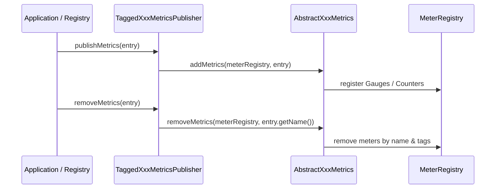

# Tagged Micrometer Metrics

<details>
<summary>Relevant source files</summary>

The following files were used as context for generating this wiki page:

- [resilience4j-micrometer/src/main/java/io/github/resilience4j/micrometer/tagged/TaggedRateLimiterMetrics.java](https://github.com/resilience4j/resilience4j/blob/main/resilience4j-micrometer/src/main/java/io/github/resilience4j/micrometer/tagged/TaggedRateLimiterMetrics.java)
- [resilience4j-micrometer/src/main/java/io/github/resilience4j/micrometer/tagged/TaggedTimeLimiterMetrics.java](https://github.com/resilience4j/resilience4j/blob/main/resilience4j-micrometer/src/main/java/io/github/resilience4j/micrometer/tagged/TaggedTimeLimiterMetrics.java)
- [resilience4j-micrometer/src/main/java/io/github/resilience4j/micrometer/tagged/TaggedRetryMetrics.java](https://github.com/resilience4j/resilience4j/blob/main/resilience4j-micrometer/src/main/java/io/github/resilience4j/micrometer/tagged/TaggedRetryMetrics.java)
- [resilience4j-micrometer/src/main/java/io/github/resilience4j/micrometer/tagged/TaggedBulkheadMetrics.java](https://github.com/resilience4j/resilience4j/blob/main/resilience4j-micrometer/src/main/java/io/github/resilience4j/micrometer/tagged/TaggedBulkheadMetrics.java)
- [resilience4j-micrometer/src/main/java/io/github/resilience4j/micrometer/tagged/TaggedCircuitBreakerMetrics.java](https://github.com/resilience4j/resilience4j/blob/main/resilience4j-micrometer/src/main/java/io/github/resilience4j/micrometer/tagged/TaggedCircuitBreakerMetrics.java)
- [resilience4j-micrometer/src/main/java/io/github/resilience4j/micrometer/tagged/TaggedThreadPoolBulkheadMetrics.java](https://github.com/resilience4j/resilience4j/blob/main/resilience4j-micrometer/src/main/java/io/github/resilience4j/micrometer/tagged/TaggedThreadPoolBulkheadMetrics.java)
- [resilience4j-spring6/src/main/java/io/github/resilience4j/spring6/micrometer/configure/TimerConfiguration.java](https://github.com/resilience4j/resilience4j/blob/main/resilience4j-spring6/src/main/java/io/github/resilience4j/spring6/micrometer/configure/TimerConfiguration.java)
- [resilience4j-micrometer/src/main/java/io/github/resilience4j/micrometer/tagged/AbstractCircuitBreakerMetrics.java](https://github.com/resilience4j/resilience4j/blob/main/resilience4j-micrometer/src/main/java/io/github/resilience4j/micrometer/tagged/AbstractCircuitBreakerMetrics.java)
- [resilience4j-spring6/src/main/java/io/github/resilience4j/spring6/micrometer/configure/TimerAspect.java](https://github.com/resilience4j/resilience4j/blob/main/resilience4j-spring6/src/main/java/io/github/resilience4j/spring6/micrometer/configure/TimerAspect.java)
- [resilience4j-micrometer/src/main/java/io/github/resilience4j/micrometer/tagged/AbstractThreadPoolBulkheadMetrics.java](https://github.com/resilience4j/resilience4j/blob/main/resilience4j-micrometer/src/main/java/io/github/resilience4j/micrometer/tagged/AbstractThreadPoolBulkheadMetrics.java)
- [resilience4j-micrometer/src/main/java/io/github/resilience4j/micrometer/internal/TimerImpl.java](https://github.com/resilience4j/resilience4j/blob/main/resilience4j-micrometer/src/main/java/io/github/resilience4j/micrometer/internal/TimerImpl.java)
- [resilience4j-micrometer/src/main/java/io/github/resilience4j/micrometer/tagged/AbstractRateLimiterMetrics.java](https://github.com/resilience4j/resilience4j/blob/main/resilience4j-micrometer/src/main/java/io/github/resilience4j/micrometer/tagged/AbstractRateLimiterMetrics.java)
- [resilience4j-micrometer/src/main/java/io/github/resilience4j/micrometer/tagged/ThreadMetrics.java](https://github.com/resilience4j/resilience4j/blob/main/resilience4j-micrometer/src/main/java/io/github/resilience4j/micrometer/tagged/ThreadMetrics.java)
- [resilience4j-micrometer/src/main/java/io/github/resilience4j/micrometer/tagged/AbstractTimeLimiterMetrics.java](https://github.com/resilience4j/resilience4j/blob/main/resilience4j-micrometer/src/main/java/io/github/resilience4j/micrometer/tagged/AbstractTimeLimiterMetrics.java)
- [resilience4j-micrometer/src/main/java/io/github/resilience4j/micrometer/tagged/AbstractBulkheadMetrics.java](https://github.com/resilience4j/resilience4j/blob/main/resilience4j-micrometer/src/main/java/io/github/resilience4j/micrometer/tagged/AbstractBulkheadMetrics.java)
- [resilience4j-micrometer/src/main/java/io/github/resilience4j/micrometer/tagged/AbstractRetryMetrics.java](https://github.com/resilience4j/resilience4j/blob/main/resilience4j-micrometer/src/main/java/io/github/resilience4j/micrometer/tagged/AbstractRetryMetrics.java)
- [resilience4j-spring-boot3/src/main/java/io/github/resilience4j/springboot3/ratelimiter/autoconfigure/RateLimiterMetricsAutoConfiguration.java](https://github.com/resilience4j/resilience4j/blob/main/resilience4j-spring-boot3/src/main/java/io/github/resilience4j/springboot3/ratelimiter/autoconfigure/RateLimiterMetricsAutoConfiguration.java)
- [resilience4j-micrometer/src/main/java/io/github/resilience4j/micrometer/tagged/TaggedRateLimiterMetricsPublisher.java](https://github.com/resilience4j/resilience4j/blob/main/resilience4j-micrometer/src/main/java/io/github/resilience4j/micrometer/tagged/TaggedRateLimiterMetricsPublisher.java)
- [resilience4j-spring-boot4/src/main/java/io/github/resilience4j/springboot/ratelimiter/autoconfigure/RateLimiterMetricsAutoConfiguration.java](https://github.com/resilience4j/resilience4j/blob/main/resilience4j-spring-boot4/src/main/java/io/github/resilience4j/springboot/ratelimiter/autoconfigure/RateLimiterMetricsAutoConfiguration.java)
- [resilience4j-spring-boot3/src/main/java/io/github/resilience4j/springboot3/timelimiter/autoconfigure/TimeLimiterMetricsAutoConfiguration.java](https://github.com/resilience4j/resilience4j/blob/main/resilience4j-spring-boot3/src/main/java/io/github/resilience4j/springboot3/timelimiter/autoconfigure/TimeLimiterMetricsAutoConfiguration.java)
- [resilience4j-micrometer/src/main/java/io/github/resilience4j/micrometer/tagged/TaggedTimeLimiterMetricsPublisher.java](https://github.com/resilience4j/resilience4j/blob/main/resilience4j-micrometer/src/main/java/io/github/resilience4j/micrometer/tagged/TaggedTimeLimiterMetricsPublisher.java)
- [resilience4j-micrometer/src/main/java/io/github/resilience4j/micrometer/tagged/TaggedCircuitBreakerMetricsPublisher.java](https://github.com/resilience4j/resilience4j/blob/main/resilience4j-micrometer/src/main/java/io/github/resilience4j/micrometer/tagged/TaggedCircuitBreakerMetricsPublisher.java)
- [resilience4j-spring-boot4/src/main/java/io/github/resilience4j/springboot/timelimiter/autoconfigure/TimeLimiterMetricsAutoConfiguration.java](https://github.com/resilience4j/resilience4j/blob/main/resilience4j-spring-boot4/src/main/java/io/github/resilience4j/springboot/timelimiter/autoconfigure/TimeLimiterMetricsAutoConfiguration.java)
- [resilience4j-micrometer/src/main/java/io/github/resilience4j/micrometer/tagged/TaggedBulkheadMetricsPublisher.java](https://github.com/resilience4j/micrometer/tagged/TaggedBulkheadMetricsPublisher.java)
- [resilience4j-spring-boot3/src/main/java/io/github/resilience4j/springboot3/circuitbreaker/autoconfigure/CircuitBreakerMetricsAutoConfiguration.java](https://github.com/resilience4j/resilience4j/blob/main/resilience4j-spring-boot3/src/main/java/io/github/resilience4j/springboot3/circuitbreaker/autoconfigure/CircuitBreakerMetricsAutoConfiguration.java)
- [resilience4j-metrics/src/main/java/io/github/resilience4j/metrics/TimeLimiterMetrics.java](https://github.com/resilience4j/resilience4j/blob/main/resilience4j-metrics/src/main/java/io/github/resilience4j/metrics/TimeLimiterMetrics.java)
- [resilience4j-spring-boot4/src/main/java/io/github/resilience4j/springboot/circuitbreaker/autoconfigure/CircuitBreakerMetricsAutoConfiguration.java](https://github.com/resilience4j/resilience4j/blob/main/resilience4j-spring-boot4/src/main/java/io/github/resilience4j/springboot/circuitbreaker/autoconfigure/CircuitBreakerMetricsAutoConfiguration.java)
- [resilience4j-spring-boot3/src/main/java/io/github/resilience4j/springboot3/retry/autoconfigure/RetryMetricsAutoConfiguration.java](https://github.com/resilience4j/resilience4j/blob/main/resilience4j-spring-boot3/src/main/java/io/github/resilience4j/springboot3/retry/autoconfigure/RetryMetricsAutoConfiguration.java)
- [resilience4j-micrometer/src/main/java/io/github/resilience4j/micrometer/tagged/TaggedRetryMetricsPublisher.java](https://github.com/resilience4j/micrometer/tagged/TaggedRetryMetricsPublisher.java)
- [resilience4j-spring-boot4/src/main/java/io/github/resilience4j/springboot/bulkhead/autoconfigure/ThreadPoolBulkheadMetricsAutoConfiguration.java](https://github.com/resilience4j/springboot/bulkhead/autoconfigure/ThreadPoolBulkheadMetricsAutoConfiguration.java)
</details>

## Overview

Tagged Micrometer Metrics bridges Resilience4j fault tolerance components with Micrometer meter registries, transforming internal state changes and execution results into dimensioned telemetry. By associating rich metadata tags with metrics for circuit breakers, rate limiters, bulkheads, retries, and time limiters, this module addresses the challenge of granular observability in distributed Java applications. It relies on event-driven publishers, binder implementations, and declarative aspect bindings to automate telemetry collection across dynamic instance registries.
Sources: [resilience4j-micrometer/src/main/java/io/github/resilience4j/micrometer/tagged/TaggedRateLimiterMetrics.java:26-74](https://github.com/resilience4j/resilience4j/blob/main/resilience4j-micrometer/src/main/java/io/github/resilience4j/micrometer/tagged/TaggedRateLimiterMetrics.java#L26-L74), [resilience4j-spring6/src/main/java/io/github/resilience4j/spring6/micrometer/configure/TimerConfiguration.java:67-96](https://github.com/resilience4j/resilience4j/blob/main/resilience4j-spring6/src/main/java/io/github/resilience4j/spring6/micrometer/configure/TimerConfiguration.java#L67-L96)

## SpringBoot Metrics Auto-Configuration

### Overview

Spring Boot auto-configuration classes bind resilience components to Micrometer meter registries across both Spring Boot 3 and Spring Boot 4 environments. These configurations conditionally instantiate metric publishers and legacy binders based on class presence, bean availability, and configuration properties.

Auto-configurations for `RateLimiter`, `TimeLimiter`, `CircuitBreaker`, `Retry`, and `ThreadPoolBulkhead` inspect the environment to register either legacy `Tagged*Metrics` beans or modern `Tagged*MetricsPublisher` components. Each auto-configuration class is annotated to load after standard Micrometer metrics export configurations.

Sources: [resilience4j-spring-boot3/src/main/java/io/github/resilience4j/springboot3/ratelimiter/autoconfigure/RateLimiterMetricsAutoConfiguration.java:35-41](https://github.com/resilience4j/resilience4j/blob/main/resilience4j-spring-boot3/src/main/java/io/github/resilience4j/springboot3/ratelimiter/autoconfigure/RateLimiterMetricsAutoConfiguration.java#L35-L41), [resilience4j-spring-boot4/src/main/java/io/github/resilience4j/springboot/ratelimiter/autoconfigure/RateLimiterMetricsAutoConfiguration.java:34-39](https://github.com/resilience4j/resilience4j/blob/main/resilience4j-spring-boot4/src/main/java/io/github/resilience4j/springboot/ratelimiter/autoconfigure/RateLimiterMetricsAutoConfiguration.java#L34-L39), [resilience4j-spring-boot3/src/main/java/io/github/resilience4j/springboot3/timelimiter/autoconfigure/TimeLimiterMetricsAutoConfiguration.java:32-37](https://github.com/resilience4j/resilience4j/blob/main/resilience4j-spring-boot3/src/main/java/io/github/resilience4j/springboot3/timelimiter/autoconfigure/TimeLimiterMetricsAutoConfiguration.java#L32-L37), [resilience4j-spring-boot4/src/main/java/io/github/resilience4j/springboot/timelimiter/autoconfigure/TimeLimiterMetricsAutoConfiguration.java:31-35](https://github.com/resilience4j/resilience4j/blob/main/resilience4j-spring-boot4/src/main/java/io/github/resilience4j/springboot/timelimiter/autoconfigure/TimeLimiterMetricsAutoConfiguration.java#L31-L35), [resilience4j-spring-boot3/src/main/java/io/github/resilience4j/springboot3/circuitbreaker/autoconfigure/CircuitBreakerMetricsAutoConfiguration.java:35-41](https://github.com/resilience4j/resilience4j/blob/main/resilience4j-spring-boot3/src/main/java/io/github/resilience4j/springboot3/circuitbreaker/autoconfigure/CircuitBreakerMetricsAutoConfiguration.java#L35-L41), [resilience4j-spring-boot4/src/main/java/io/github/resilience4j/springboot/circuitbreaker/autoconfigure/CircuitBreakerMetricsAutoConfiguration.java:34-39](https://github.com/resilience4j/resilience4j/blob/main/resilience4j-spring-boot4/src/main/java/io/github/resilience4j/springboot/circuitbreaker/autoconfigure/CircuitBreakerMetricsAutoConfiguration.java#L34-L39), [resilience4j-spring-boot3/src/main/java/io/github/resilience4j/springboot3/retry/autoconfigure/RetryMetricsAutoConfiguration.java:35-40](https://github.com/resilience4j/resilience4j/blob/main/resilience4j-spring-boot3/src/main/java/io/github/resilience4j/springboot3/retry/autoconfigure/RetryMetricsAutoConfiguration.java#L35-L40), [resilience4j-spring-boot4/src/main/java/io/github/resilience4j/springboot/bulkhead/autoconfigure/ThreadPoolBulkheadMetricsAutoConfiguration.java:31-36](https://github.com/resilience4j/resilience4j/blob/main/resilience4j-spring-boot4/src/main/java/io/github/resilience4j/springboot/bulkhead/autoconfigure/ThreadPoolBulkheadMetricsAutoConfiguration.java#L31-L36)

### Conditional Property Mapping

Each metrics auto-configuration class relies on specific property keys to control activation status and legacy binder usage. The root property defaults to enabled (`matchIfMissing = true`), while the legacy sub-property defaults to disabled (`havingValue = "false", matchIfMissing = true`).

| Component | Root Enable Property | Legacy Enable Property | Publisher Bean Created | Legacy Binder Bean Created |
| :--- | :--- | :--- | :--- | :--- |
| **RateLimiter** | `resilience4j.ratelimiter.metrics.enabled` | `resilience4j.ratelimiter.metrics.legacy.enabled` | `TaggedRateLimiterMetricsPublisher` | `TaggedRateLimiterMetrics` |
| **TimeLimiter** | `resilience4j.timelimiter.metrics.enabled` | `resilience4j.timelimiter.metrics.legacy.enabled` | `TaggedTimeLimiterMetricsPublisher` | `TaggedTimeLimiterMetrics` |
| **CircuitBreaker** | `resilience4j.circuitbreaker.metrics.enabled` | `resilience4j.circuitbreaker.metrics.legacy.enabled` | `TaggedCircuitBreakerMetricsPublisher` | `TaggedCircuitBreakerMetrics` |
| **Retry** | `resilience4j.retry.metrics.enabled` | `resilience4j.retry.metrics.legacy.enabled` | `TaggedRetryMetricsPublisher` | `TaggedRetryMetrics` |
| **ThreadPoolBulkhead** | `resilience4j.thread-pool-bulkhead.metrics.enabled` | `resilience4j.thread-pool-bulkhead.metrics.legacy.enabled` | `TaggedThreadPoolBulkheadMetricsPublisher` | `TaggedThreadPoolBulkheadMetrics` |

Sources: [resilience4j-spring-boot3/src/main/java/io/github/resilience4j/springboot3/ratelimiter/autoconfigure/RateLimiterMetricsAutoConfiguration.java:40-58](https://github.com/resilience4j/resilience4j/blob/main/resilience4j-spring-boot3/src/main/java/io/github/resilience4j/springboot3/ratelimiter/autoconfigure/RateLimiterMetricsAutoConfiguration.java#L40-L58), [resilience4j-spring-boot3/src/main/java/io/github/resilience4j/springboot3/timelimiter/autoconfigure/TimeLimiterMetricsAutoConfiguration.java:36-52](https://github.com/resilience4j/resilience4j/blob/main/resilience4j-spring-boot3/src/main/java/io/github/resilience4j/springboot3/timelimiter/autoconfigure/TimeLimiterMetricsAutoConfiguration.java#L36-L52), [resilience4j-spring-boot3/src/main/java/io/github/resilience4j/springboot3/circuitbreaker/autoconfigure/CircuitBreakerMetricsAutoConfiguration.java:40-58](https://github.com/resilience4j/resilience4j/blob/main/resilience4j-spring-boot3/src/main/java/io/github/resilience4j/springboot3/circuitbreaker/autoconfigure/CircuitBreakerMetricsAutoConfiguration.java#L40-L58), [resilience4j-spring-boot3/src/main/java/io/github/resilience4j/springboot3/retry/autoconfigure/RetryMetricsAutoConfiguration.java:39-55](https://github.com/resilience4j/resilience4j/blob/main/resilience4j-spring-boot3/src/main/java/io/github/resilience4j/springboot3/retry/autoconfigure/RetryMetricsAutoConfiguration.java#L39-L55), [resilience4j-spring-boot4/src/main/java/io/github/resilience4j/springboot/bulkhead/autoconfigure/ThreadPoolBulkheadMetricsAutoConfiguration.java:35-54](https://github.com/resilience4j/resilience4j/blob/main/resilience4j-spring-boot4/src/main/java/io/github/resilience4j/springboot/bulkhead/autoconfigure/ThreadPoolBulkheadMetricsAutoConfiguration.java#L35-L54)

> [!NOTE]
> Setting `resilience4j.[component].metrics.legacy.enabled=true` switches the auto-configuration from instantiating event-driven publishers (`Tagged*MetricsPublisher`) to registering registry-wide binders (`Tagged*Metrics`), which poll state via registry binding rather than event listening.

Sources: [resilience4j-spring-boot3/src/main/java/io/github/resilience4j/springboot3/ratelimiter/autoconfigure/RateLimiterMetricsAutoConfiguration.java:43-58](https://github.com/resilience4j/resilience4j/blob/main/resilience4j-spring-boot3/src/main/java/io/github/resilience4j/springboot3/ratelimiter/autoconfigure/RateLimiterMetricsAutoConfiguration.java#L43-L58), [resilience4j-spring-boot3/src/main/java/io/github/resilience4j/springboot3/circuitbreaker/autoconfigure/CircuitBreakerMetricsAutoConfiguration.java:43-58](https://github.com/resilience4j/resilience4j/blob/main/resilience4j-spring-boot3/src/main/java/io/github/resilience4j/springboot3/circuitbreaker/autoconfigure/CircuitBreakerMetricsAutoConfiguration.java#L43-L58)

## Tagged Registry Metrics Binders

### Overview

The `MeterBinder` implementations in Resilience4j bridge component registries directly to Micrometer `MeterRegistry` instances. Classes such as `TaggedRateLimiterMetrics`, `TaggedCircuitBreakerMetrics`, `TaggedRetryMetrics`, `TaggedBulkheadMetrics`, `TaggedThreadPoolBulkheadMetrics`, `TaggedTimeLimiterMetrics`, and `ThreadMetrics` iterate over registered instances during binding and hook into registry event publishers to dynamically track entry additions, removals, and replacements.

Sources: [resilience4j-micrometer/src/main/java/io/github/resilience4j/micrometer/tagged/TaggedRateLimiterMetrics.java:29-74](https://github.com/resilience4j/resilience4j/blob/main/resilience4j-micrometer/src/main/java/io/github/resilience4j/micrometer/tagged/TaggedRateLimiterMetrics.java#L29-L74), [resilience4j-micrometer/src/main/java/io/github/resilience4j/micrometer/tagged/TaggedTimeLimiterMetrics.java:28-73](https://github.com/resilience4j/resilience4j/blob/main/resilience4j-micrometer/src/main/java/io/github/resilience4j/micrometer/tagged/TaggedTimeLimiterMetrics.java#L28-L73), [resilience4j-micrometer/src/main/java/io/github/resilience4j/micrometer/tagged/TaggedRetryMetrics.java:29-73](https://github.com/resilience4j/resilience4j/blob/main/resilience4j-micrometer/src/main/java/io/github/resilience4j/micrometer/tagged/TaggedRetryMetrics.java#L29-L73), [resilience4j-micrometer/src/main/java/io/github/resilience4j/micrometer/tagged/TaggedBulkheadMetrics.java:29-74](https://github.com/resilience4j/resilience4j/blob/main/resilience4j-micrometer/src/main/java/io/github/resilience4j/micrometer/tagged/TaggedBulkheadMetrics.java#L29-L74), [resilience4j-micrometer/src/main/java/io/github/resilience4j/micrometer/tagged/TaggedCircuitBreakerMetrics.java:29-76](https://github.com/resilience4j/resilience4j/blob/main/resilience4j-micrometer/src/main/java/io/github/resilience4j/micrometer/tagged/TaggedCircuitBreakerMetrics.java#L29-L76), [resilience4j-micrometer/src/main/java/io/github/resilience4j/micrometer/tagged/TaggedThreadPoolBulkheadMetrics.java:30-78](https://github.com/resilience4j/resilience4j/blob/main/resilience4j-micrometer/src/main/java/io/github/resilience4j/micrometer/tagged/TaggedThreadPoolBulkheadMetrics.java#L30-L78)

### Registry Event Binding Execution Flow

When `bindTo(MeterRegistry registry)` executes on any of the component registry binders, it processes existing instances and registers event listeners on the underlying registry's event publisher. Taking `TaggedRateLimiterMetrics` as the archetype, the call sequence unfolds as follows:

1. `rateLimiterRegistry.getAllRateLimiters()` is iterated to call `addMetrics(registry, rateLimiter)` for every pre-existing rate limiter.
2. `rateLimiterRegistry.getEventPublisher().onEntryAdded(...)` registers a lambda that invokes `addMetrics(registry, event.getAddedEntry())` whenever a new limiter is instantiated.
3. `rateLimiterRegistry.getEventPublisher().onEntryRemoved(...)` registers a listener invoking `removeMetrics(registry, event.getRemovedEntry().getName())`.
4. `rateLimiterRegistry.getEventPublisher().onEntryReplaced(...)` registers a handler that calls `removeMetrics(registry, event.getOldEntry().getName())` followed by `addMetrics(registry, event.getNewEntry())`.

Sources: [resilience4j-micrometer/src/main/java/io/github/resilience4j/micrometer/tagged/TaggedRateLimiterMetrics.java:61-74](https://github.com/resilience4j/resilience4j/blob/main/resilience4j-micrometer/src/main/java/io/github/resilience4j/micrometer/tagged/TaggedRateLimiterMetrics.java#L61-L74)

> [!NOTE]
> The lifecycle event publishers on registries ensure that dynamic component creation or replacement at runtime automatically attaches or cleans up corresponding Micrometer meters without requiring manual re-registration.

Sources: [resilience4j-micrometer/src/main/java/io/github/resilience4j/micrometer/tagged/TaggedCircuitBreakerMetrics.java:64-76](https://github.com/resilience4j/resilience4j/blob/main/resilience4j-micrometer/src/main/java/io/github/resilience4j/micrometer/tagged/TaggedCircuitBreakerMetrics.java#L64-L76), [resilience4j-micrometer/src/main/java/io/github/resilience4j/micrometer/tagged/TaggedRetryMetrics.java:61-73](https://github.com/resilience4j/resilience4j/blob/main/resilience4j-micrometer/src/main/java/io/github/resilience4j/micrometer/tagged/TaggedRetryMetrics.java#L61-L73)

### Thread Metrics Binding

In addition to component-specific registries, `ThreadMetrics` provides infrastructure monitoring by binding virtual thread configurations. It registers a Micrometer `Gauge` under the default prefix `resilience4j.thread` with the metric name suffix `virtual_thread_enabled`. The gauge evaluates `ExecutorServiceFactory.getThreadType() == ThreadType.VIRTUAL ? 1.0 : 0.0` to report whether virtual threads are active.

Sources: [resilience4j-micrometer/src/main/java/io/github/resilience4j/micrometer/tagged/ThreadMetrics.java:41-101](https://github.com/resilience4j/resilience4j/blob/main/resilience4j-micrometer/src/main/java/io/github/resilience4j/micrometer/tagged/ThreadMetrics.java#L41-L101)

## Abstract Metric Binding Calculators

### Overview

The abstract metric calculation tier provides base classes that encapsulate metric extraction logic, custom tag mapping, and meter registration patterns for each resilience primitive. Extending from `AbstractMetrics`, classes such as `AbstractCircuitBreakerMetrics`, `AbstractRateLimiterMetrics`, `AbstractBulkheadMetrics`, `AbstractThreadPoolBulkheadMetrics`, `AbstractTimeLimiterMetrics`, and `AbstractRetryMetrics` standardise how component states, ring buffer metrics, permissions, and event-driven telemetry are exposed to Micrometer `MeterRegistry` instances.

Sources: [resilience4j-micrometer/src/main/java/io/github/resilience4j/micrometer/tagged/AbstractCircuitBreakerMetrics.java:28-48](https://github.com/resilience4j/resilience4j/blob/main/resilience4j-micrometer/src/main/java/io/github/resilience4j/micrometer/tagged/AbstractCircuitBreakerMetrics.java#L28-L48), [resilience4j-micrometer/src/main/java/io/github/resilience4j/micrometer/tagged/AbstractRateLimiterMetrics.java:31-43](https://github.com/resilience4j/resilience4j/blob/main/resilience4j-micrometer/src/main/java/io/github/resilience4j/micrometer/tagged/AbstractRateLimiterMetrics.java#L31-L43), [resilience4j-micrometer/src/main/java/io/github/resilience4j/micrometer/tagged/AbstractBulkheadMetrics.java:31-43](https://github.com/resilience4j/resilience4j/blob/main/resilience4j-micrometer/src/main/java/io/github/resilience4j/micrometer/tagged/AbstractBulkheadMetrics.java#L31-L43)

### Core Metric Extraction Flow

When a resilience component is bound or updated, the base classes execute a deterministic registration sequence to purge stale metrics and attach current gauges, counters, and timers. Taking `AbstractCircuitBreakerMetrics` as the archetype, the call sequence unfolds as follows:

1. `addMetrics(MeterRegistry meterRegistry, CircuitBreaker circuitBreaker)` extracts custom tags via `mapToTagsList(circuitBreaker.getTags())` and passes them to `registerMetrics(...)`.
2. `removeMetrics(meterRegistry, circuitBreaker.getName())` evicts any previously registered meters associated with the component name from the registry's active map.
3. `Gauge.builder(...)` expressions iterate over `CircuitBreaker.State.values()` and ring buffer metrics (`getNumberOfFailedCalls()`, `getNumberOfSuccessfulCalls()`, `getFailureRate()`), binding each lambda against the underlying `CircuitBreaker` instance.
4. `Timer.builder(...)` and `Counter.builder(...)` create time series for execution durations and non-permitted calls.
5. `circuitBreaker.getEventPublisher()` hooks up listeners (`onIgnoredError`, `onCallNotPermitted`, `onSuccess`, `onError`) that record durations into timers or increment counters dynamically.
6. `meterIdMap.put(circuitBreaker.getName(), idSet)` caches all registered `Meter.Id` references for subsequent cleanup sweeps.

Sources: [resilience4j-micrometer/src/main/java/io/github/resilience4j/micrometer/tagged/AbstractCircuitBreakerMetrics.java:42-146](https://github.com/resilience4j/resilience4j/blob/main/resilience4j-micrometer/src/main/java/io/github/resilience4j/micrometer/tagged/AbstractCircuitBreakerMetrics.java#L42-L146)

> [!NOTE]
> Stale meters are explicitly removed via `removeMetrics(...)` prior to registering new metric sets during updates, preventing duplicate meter registrations in the underlying `MeterRegistry`.

Sources: [resilience4j-micrometer/src/main/java/io/github/resilience4j/micrometer/tagged/AbstractCircuitBreakerMetrics.java:47-50](https://github.com/resilience4j/resilience4j/blob/main/resilience4j-micrometer/src/main/java/io/github/resilience4j/micrometer/tagged/AbstractCircuitBreakerMetrics.java#L47-L50), [resilience4j-micrometer/src/main/java/io/github/resilience4j/micrometer/tagged/AbstractTimeLimiterMetrics.java:49-50](https://github.com/resilience4j/resilience4j/blob/main/resilience4j-micrometer/src/main/java/io/github/resilience4j/micrometer/tagged/AbstractTimeLimiterMetrics.java#L49-L50)

### Metric Kinds and Mappings

Each abstract metric calculator defines specific tag constants and metric extractors appropriate for its resilience primitive. The mapping table below details the extracted metrics, tag kinds, and underlying supplier lambdas across the abstract calculators.

| Component Abstract Class | Metric Type | Kind Tag Value | Underlying Source Method / Expression |
| :--- | :--- | :--- | :--- |
| `AbstractCircuitBreakerMetrics` | Gauge | `state` (per enum value) | `cb.getState() == state ? 1 : 0` |
| `AbstractCircuitBreakerMetrics` | Gauge | `failed` | `cb.getMetrics().getNumberOfFailedCalls()` |
| `AbstractCircuitBreakerMetrics` | Gauge | `successful` | `cb.getMetrics().getNumberOfSuccessfulCalls()` |
| `AbstractRateLimiterMetrics` | Gauge | — (none) | `rl.getMetrics().getAvailablePermissions()` |
| `AbstractRateLimiterMetrics` | Gauge | — (none) | `rl.getMetrics().getNumberOfWaitingThreads()` |
| `AbstractBulkheadMetrics` | Gauge | — (none) | `bh.getMetrics().getAvailableConcurrentCalls()` |
| `AbstractThreadPoolBulkheadMetrics` | Gauge | — (none) | `bh.getMetrics().getQueueDepth()` |
| `AbstractTimeLimiterMetrics` | Counter | `successful` | `timeLimiter.getEventPublisher().onSuccess(...)` |
| `AbstractRetryMetrics` | FunctionCounter | `successful_without_retry` | `rt.getMetrics().getNumberOfSuccessfulCallsWithoutRetryAttempt()` |

Sources: [resilience4j-micrometer/src/main/java/io/github/resilience4j/micrometer/tagged/AbstractCircuitBreakerMetrics.java:30-34](https://github.com/resilience4j/resilience4j/blob/main/resilience4j-micrometer/src/main/java/io/github/resilience4j/micrometer/tagged/AbstractCircuitBreakerMetrics.java#L30-L34), [resilience4j-micrometer/src/main/java/io/github/resilience4j/micrometer/tagged/AbstractCircuitBreakerMetrics.java:53-76](https://github.com/resilience4j/resilience4j/blob/main/resilience4j-micrometer/src/main/java/io/github/resilience4j/micrometer/tagged/AbstractCircuitBreakerMetrics.java#L53-L76), [resilience4j-micrometer/src/main/java/io/github/resilience4j/micrometer/tagged/AbstractRateLimiterMetrics.java:50-61](https://github.com/resilience4j/resilience4j/blob/main/resilience4j-micrometer/src/main/java/io/github/resilience4j/micrometer/tagged/AbstractRateLimiterMetrics.java#L50-L61), [resilience4j-micrometer/src/main/java/io/github/resilience4j/micrometer/tagged/AbstractBulkheadMetrics.java:50-61](https://github.com/resilience4j/resilience4j/blob/main/resilience4j-micrometer/src/main/java/io/github/resilience4j/micrometer/tagged/AbstractBulkheadMetrics.java#L50-L61), [resilience4j-micrometer/src/main/java/io/github/resilience4j/micrometer/tagged/AbstractThreadPoolBulkheadMetrics.java:50-96](https://github.com/resilience4j/resilience4j/blob/main/resilience4j-micrometer/src/main/java/io/github/resilience4j/micrometer/tagged/AbstractThreadPoolBulkheadMetrics.java#L50-L96), [resilience4j-micrometer/src/main/java/io/github/resilience4j/micrometer/tagged/AbstractTimeLimiterMetrics.java:33-35](https://github.com/resilience4j/resilience4j/blob/main/resilience4j-micrometer/src/main/java/io/github/resilience4j/micrometer/tagged/AbstractTimeLimiterMetrics.java#L33-L35), [resilience4j-micrometer/src/main/java/io/github/resilience4j/micrometer/tagged/AbstractTimeLimiterMetrics.java:52-69](https://github.com/resilience4j/resilience4j/blob/main/resilience4j-micrometer/src/main/java/io/github/resilience4j/micrometer/tagged/AbstractTimeLimiterMetrics.java#L52-L69), [resilience4j-micrometer/src/main/java/io/github/resilience4j/micrometer/tagged/AbstractRetryMetrics.java:49-76](https://github.com/resilience4j/resilience4j/blob/main/resilience4j-micrometer/src/main/java/io/github/resilience4j/micrometer/tagged/AbstractRetryMetrics.java#L49-L76)

> [!WARNING]
> Failing to invoke `removeMetrics` prior to re-registering meters can lead to memory accumulation in the `MeterRegistry` when component definitions are dynamically re-instantiated or replaced at runtime.

Sources: [resilience4j-micrometer/src/main/java/io/github/resilience4j/micrometer/tagged/AbstractCircuitBreakerMetrics.java:49-50](https://github.com/resilience4j/resilience4j/blob/main/resilience4j-micrometer/src/main/java/io/github/resilience4j/micrometer/tagged/AbstractCircuitBreakerMetrics.java#L49-L50), [resilience4j-micrometer/src/main/java/io/github/resilience4j/micrometer/tagged/AbstractRetryMetrics.java:45-46](https://github.com/resilience4j/resilience4j/blob/main/resilience4j-micrometer/src/main/java/io/github/resilience4j/micrometer/tagged/AbstractRetryMetrics.java#L45-L46)

## Event-Driven Metrics Publisher Abstractions

### Overview

The `MetricsPublisher` interface implementations adapt Resilience4j resilience components to support dynamic, event-driven metric registration and teardown. Each publisher extends a respective abstract metrics calculator (`AbstractCircuitBreakerMetrics`, `AbstractRateLimiterMetrics`, `AbstractBulkheadMetrics`, `AbstractTimeLimiterMetrics`, or `AbstractRetryMetrics`) and implements `MetricsPublisher<T>`, bridging component lifecycle events directly to a Micrometer `MeterRegistry`.

Sources: [resilience4j-micrometer/src/main/java/io/github/resilience4j/micrometer/tagged/TaggedRateLimiterMetricsPublisher.java:25-26](https://github.com/resilience4j/resilience4j/blob/main/resilience4j-micrometer/src/main/java/io/github/resilience4j/micrometer/tagged/TaggedRateLimiterMetricsPublisher.java#L25-L26), [resilience4j-micrometer/src/main/java/io/github/resilience4j/micrometer/tagged/TaggedTimeLimiterMetricsPublisher.java:25-26](https://github.com/resilience4j/resilience4j/blob/main/resilience4j-micrometer/src/main/java/io/github/resilience4j/micrometer/tagged/TaggedTimeLimiterMetricsPublisher.java#L25-L26), [resilience4j-micrometer/src/main/java/io/github/resilience4j/micrometer/tagged/TaggedCircuitBreakerMetricsPublisher.java:25-26](https://github.com/resilience4j/resilience4j/blob/main/resilience4j-micrometer/src/main/java/io/github/resilience4j/micrometer/tagged/TaggedCircuitBreakerMetricsPublisher.java#L25-L26), [resilience4j-micrometer/src/main/java/io/github/resilience4j/micrometer/tagged/TaggedBulkheadMetricsPublisher.java:25-26](https://github.com/resilience4j/resilience4j/blob/main/resilience4j-micrometer/src/main/java/io/github/resilience4j/micrometer/tagged/TaggedBulkheadMetricsPublisher.java#L25-L26), [resilience4j-micrometer/src/main/java/io/github/resilience4j/micrometer/tagged/TaggedRetryMetricsPublisher.java:25-26](https://github.com/resilience4j/resilience4j/blob/main/resilience4j-micrometer/src/main/java/io/github/resilience4j/micrometer/tagged/TaggedRetryMetricsPublisher.java#L25-L26)

### Lifecycle Execution and Method Mapping

Every metrics publisher accepts a `MeterRegistry` via constructor injection—either paired with custom metric names or defaulting via `ofDefaults()`—and implements two primary lifecycle operations: `publishMetrics(T entry)` and `removeMetrics(T entry)`.



Sources: [resilience4j-micrometer/src/main/java/io/github/resilience4j/micrometer/tagged/TaggedRateLimiterMetricsPublisher.java:30-48](https://github.com/resilience4j/resilience4j/blob/main/resilience4j-micrometer/src/main/java/io/github/resilience4j/micrometer/tagged/TaggedRateLimiterMetricsPublisher.java#L30-L48), [resilience4j-micrometer/src/main/java/io/github/resilience4j/micrometer/tagged/TaggedCircuitBreakerMetricsPublisher.java:30-48](https://github.com/resilience4j/resilience4j/blob/main/resilience4j-micrometer/src/main/java/io/github/resilience4j/micrometer/tagged/TaggedCircuitBreakerMetricsPublisher.java#L30-L48)

The table below details the concrete publisher classes, their target resilience component type, and the metric publisher interface execution targets.

| Publisher Class | Target Component Type (`T`) | `publishMetrics` Action | `removeMetrics` Action |
| :--- | :--- | :--- | :--- |
| `TaggedCircuitBreakerMetricsPublisher` | `CircuitBreaker` | `addMetrics(meterRegistry, entry)` | `removeMetrics(meterRegistry, entry.getName())` |
| `TaggedRateLimiterMetricsPublisher` | `RateLimiter` | `addMetrics(meterRegistry, entry)` | `removeMetrics(meterRegistry, entry.getName())` |
| `TaggedBulkheadMetricsPublisher` | `Bulkhead` | `addMetrics(meterRegistry, entry)` | `removeMetrics(meterRegistry, entry.getName())` |
| `TaggedTimeLimiterMetricsPublisher` | `TimeLimiter` | `addMetrics(meterRegistry, entry)` | `removeMetrics(meterRegistry, entry.getName())` |
| `TaggedRetryMetricsPublisher` | `Retry` | `addMetrics(meterRegistry, entry)` | `removeMetrics(meterRegistry, entry.getName())` |

Sources: [resilience4j-micrometer/src/main/java/io/github/resilience4j/micrometer/tagged/TaggedRateLimiterMetricsPublisher.java:25-48](https://github.com/resilience4j/resilience4j/blob/main/resilience4j-micrometer/src/main/java/io/github/resilience4j/micrometer/tagged/TaggedRateLimiterMetricsPublisher.java#L25-L48), [resilience4j-micrometer/src/main/java/io/github/resilience4j/micrometer/tagged/TaggedTimeLimiterMetricsPublisher.java:25-48](https://github.com/resilience4j/resilience4j/blob/main/resilience4j-micrometer/src/main/java/io/github/resilience4j/micrometer/tagged/TaggedTimeLimiterMetricsPublisher.java#L25-L48), [resilience4j-micrometer/src/main/java/io/github/resilience4j/micrometer/tagged/TaggedCircuitBreakerMetricsPublisher.java:25-48](https://github.com/resilience4j/resilience4j/blob/main/resilience4j-micrometer/src/main/java/io/github/resilience4j/micrometer/tagged/TaggedCircuitBreakerMetricsPublisher.java#L25-L48), [resilience4j-micrometer/src/main/java/io/github/resilience4j/micrometer/tagged/TaggedBulkheadMetricsPublisher.java:25-48](https://github.com/resilience4j/resilience4j/blob/main/resilience4j-micrometer/src/main/java/io/github/resilience4j/micrometer/tagged/TaggedBulkheadMetricsPublisher.java#L25-L48), [resilience4j-micrometer/src/main/java/io/github/resilience4j/micrometer/tagged/TaggedRetryMetricsPublisher.java:25-48](https://github.com/resilience4j/resilience4j/blob/main/resilience4j-micrometer/src/main/java/io/github/resilience4j/micrometer/tagged/TaggedRetryMetricsPublisher.java#L25-L48)

> [!NOTE]
> All publishers enforce non-null validation on the passed `MeterRegistry` instance via `requireNonNull(meterRegistry)` during construction, throwing a `NullPointerException` immediately if an uninitialized registry is supplied.

Sources: [resilience4j-micrometer/src/main/java/io/github/resilience4j/micrometer/tagged/TaggedRateLimiterMetricsPublisher.java:32-37](https://github.com/resilience4j/resilience4j/blob/main/resilience4j-micrometer/src/main/java/io/github/resilience4j/micrometer/tagged/TaggedRateLimiterMetricsPublisher.java#L32-L37), [resilience4j-micrometer/src/main/java/io/github/resilience4j/micrometer/tagged/TaggedCircuitBreakerMetricsPublisher.java:32-37](https://github.com/resilience4j/resilience4j/blob/main/resilience4j-micrometer/src/main/java/io/github/resilience4j/micrometer/tagged/TaggedCircuitBreakerMetricsPublisher.java#L32-L37)

## Timer Instrumentation and Aspect Binding

### Overview

The resilience4j-micrometer module provides custom timing capabilities via `TimerImpl` and the Spring 6 AOP integration layer. Spring 6 configuration wiring handles component registration, reactive extensions, and advice execution order through `TimerConfiguration` and `TimerAspect`.

Sources: [resilience4j-spring6/src/main/java/io/github/resilience4j/spring6/micrometer/configure/TimerConfiguration.java:53-58](https://github.com/resilience4j/resilience4j/blob/main/resilience4j-spring6/src/main/java/io/github/resilience4j/spring6/micrometer/configure/TimerConfiguration.java#L53-L58), [resilience4j-spring6/src/main/java/io/github/resilience4j/spring6/micrometer/configure/TimerAspect.java:42-44](https://github.com/resilience4j/resilience4j/blob/main/resilience4j-spring6/src/main/java/io/github/resilience4j/spring6/micrometer/configure/TimerAspect.java#L42-L44)

### Custom Timer Implementation

`TimerImpl` creates execution contexts that measure elapsed nanoseconds and record call outcomes into a Micrometer `MeterRegistry`. When no registry is supplied, it falls back to a `LoggingMeterRegistry`.

```java
public class TimerImpl implements Timer {
    private final String name;
    private final MeterRegistry registry;
    private final TimerConfig timerConfig;
    private final Map<String, String> tags;
    private final List<Tag> parsedTags;
    private final TimerEventProcessor eventProcessor;

    public TimerImpl(@NonNull String name, @Nullable MeterRegistry registry, @NonNull TimerConfig timerConfig, @NonNull Map<String, String> tags) {
        this.name = requireNonNull(name, "Name must not be null");
        if (registry != null) {
            this.registry = registry;
        } else {
            LOGGER.warn("No meter registry provided to '{}' timer. Will use the logging meter registry", name);
            this.registry = new LoggingMeterRegistry();
        }
        this.timerConfig = requireNonNull(timerConfig, "Timer config must not be null");
        this.tags = copyOf(requireNonNull(tags, "Tags must not be null"));
        parsedTags = this.tags.entrySet().stream()
                .map(tagsEntry -> Tag.of(tagsEntry.getKey(), tagsEntry.getValue()))
                .collect(toList());
        eventProcessor = new TimerEventProcessor();
    }
}
```

Sources: [resilience4j-micrometer/src/main/java/io/github/resilience4j/micrometer/internal/TimerImpl.java:49-74](https://github.com/resilience4j/resilience4j/blob/main/resilience4j-micrometer/src/main/java/io/github/resilience4j/micrometer/internal/TimerImpl.java#L49-L74)

> [!NOTE]
> `TimerImpl.ContextImpl` initializes its start time using `nanoTime()` upon instantiation. Calling `onSuccess()` or `onFailure(Throwable)` computes duration and registers a metric record with `name`, `kind`, and optional failure tags.

Sources: [resilience4j-micrometer/src/main/java/io/github/resilience4j/micrometer/internal/TimerImpl.java:101-153](https://github.com/resilience4j/resilience4j/blob/main/resilience4j-micrometer/src/main/java/io/github/resilience4j/micrometer/internal/TimerImpl.java#L101-L153)

### Spring 6 AOP Aspect Execution and Call Walkthrough

`TimerAspect` intercepts methods annotated with `@Timer` or declared inside a class annotated with `@Timer`. The around advice resolves method names, evaluates SpEL expressions for timer names, and delegates execution through the fallback executor.

The interception and execution flow follows this exact sequence:
1. `timerAroundAdvice()` extracts the target `Method` from `ProceedingJoinPoint` and retrieves any present `Timer` annotation via `getTimerAnnotation()`.
2. `spelResolver.resolve()` evaluates the timer name string.
3. `getOrCreateTimer()` fetches the configuration key from the `TimerRegistry` or falls back to the default config.
4. `proceed()` evaluates whether a registered `TimerAspectExt` can handle the return type; otherwise, it checks if `CompletionStage.class` is assignable (invoking `handleJoinPointCompletableStage()`) or falls back to `handleDefaultJoinPoint()`.
5. `fallbackExecutor.execute()` wraps the execution chain with configured fallback behavior.

Sources: [resilience4j-spring6/src/main/java/io/github/resilience4j/spring6/micrometer/configure/TimerAspect.java:73-89](https://github.com/resilience4j/resilience4j/blob/main/resilience4j-spring6/src/main/java/io/github/resilience4j/spring6/micrometer/configure/TimerAspect.java#L73-L89), [resilience4j-spring6/src/main/java/io/github/resilience4j/spring6/micrometer/configure/TimerAspect.java:91-103](https://github.com/resilience4j/resilience4j/blob/main/resilience4j-spring6/src/main/java/io/github/resilience4j/spring6/micrometer/configure/TimerAspect.java#L91-L103)

### Configuration Properties and Beans

`TimerConfiguration` registers core beans supporting timer execution, registry events, and reactive classpath extensions conditional on AspectJ presence.

| Bean Method | Return Type | Condition / Qualifier | Purpose |
| :--- | :--- | :--- | :--- |
| `compositeTimerCustomizer` | `CompositeCustomizer<TimerConfigCustomizer>` | `@Qualifier("compositeTimerCustomizer")` | Aggregates optional timer configuration customizers. |
| `timerRegistry` | `TimerRegistry` | — | Creates and initializes the active timer registry with events and tags. |
| `timerRegistryEventConsumer` | `RegistryEventConsumer<Timer>` | `@Primary` | Combines registered registry event consumers. |
| `timerAspect` | `TimerAspect` | `@Conditional(AspectJOnClasspathCondition.class)` | Creates the AOP aspect intercepting timed methods. |
| `rxJava2TimerAspectExt` | `RxJava2TimerAspectExt` | RxJava2 & AspectJ on classpath | Handles RxJava 2 return types for the timer aspect. |
| `rxJava3TimerAspectExt` | `RxJava3TimerAspectExt` | RxJava3 & AspectJ on classpath | Handles RxJava 3 return types for the timer aspect. |
| `reactorTimerAspectExt` | `ReactorTimerAspectExt` | Reactor & AspectJ on classpath | Handles Project Reactor return types for the timer aspect. |
| `timerEventsConsumerRegistry` | `EventConsumerRegistry<TimerEvent>` | — | Manages event consumer buffers for timer event monitors. |

Sources: [resilience4j-spring6/src/main/java/io/github/resilience4j/spring6/micrometer/configure/TimerConfiguration.java:60-126](https://github.com/resilience4j/resilience4j/blob/main/resilience4j-spring6/src/main/java/io/github/resilience4j/spring6/micrometer/configure/TimerConfiguration.java#L60-L126)

## Related

- [[Sliding Window Metrics]]
- [[Micrometer Timer Observation]]

