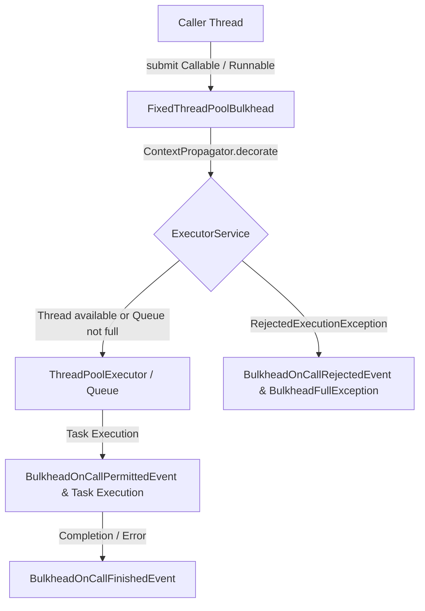
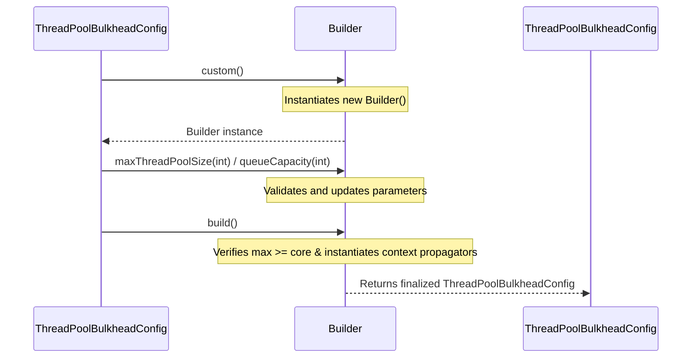
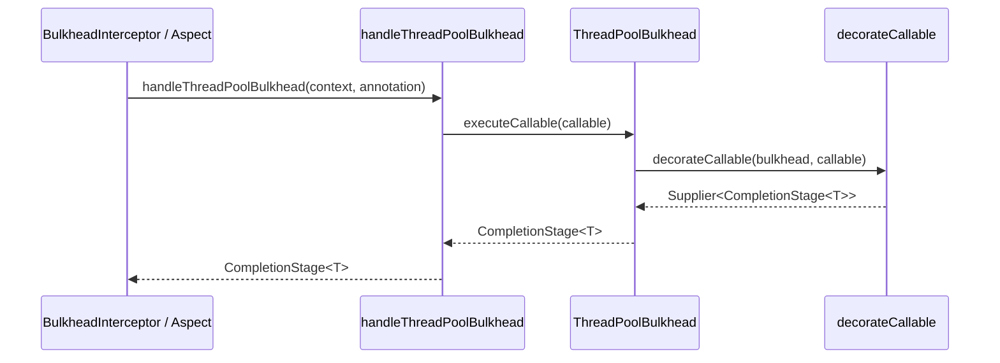
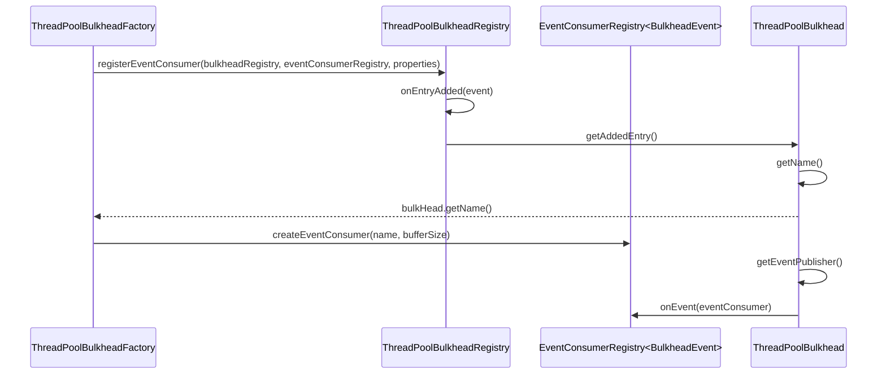

# Thread Pool Bulkheads

<details>
<summary>Relevant source files</summary>

The following files were used as context for generating this wiki page:

- [resilience4j-spring6/src/main/java/io/github/resilience4j/spring6/bulkhead/configure/BulkheadAspect.java](https://github.com/resilience4j/resilience4j/blob/main/resilience4j-spring6/src/main/java/io/github/resilience4j/spring6/bulkhead/configure/BulkheadAspect.java)
- [resilience4j-bulkhead/src/main/java/io/github/resilience4j/bulkhead/internal/FixedThreadPoolBulkhead.java](https://github.com/resilience4j/resilience4j/blob/main/resilience4j-bulkhead/src/main/java/io/github/resilience4j/bulkhead/internal/FixedThreadPoolBulkhead.java)
- [resilience4j-micronaut/src/main/java/io/github/resilience4j/micronaut/bulkhead/ThreadPoolBulkheadFactory.java](https://github.com/resilience4j/resilience4j/blob/main/resilience4j-micronaut/src/main/java/io/github/resilience4j/micronaut/bulkhead/ThreadPoolBulkheadFactory.java)
- [resilience4j-spring6/src/main/java/io/github/resilience4j/spring6/bulkhead/configure/threadpool/ThreadPoolBulkheadConfiguration.java](https://github.com/resilience4j/resilience4j/blob/main/resilience4j-spring6/src/main/java/io/github/resilience4j/spring6/bulkhead/configure/threadpool/ThreadPoolBulkheadConfiguration.java)
- [resilience4j-micronaut/src/main/java/io/github/resilience4j/micronaut/bulkhead/BulkheadInterceptor.java](https://github.com/resilience4j/resilience4j/blob/main/resilience4j-micronaut/src/main/java/io/github/resilience4j/micronaut/bulkhead/BulkheadInterceptor.java)
- [resilience4j-bulkhead/src/main/java/io/github/resilience4j/bulkhead/ThreadPoolBulkhead.java](https://github.com/resilience4j/resilience4j/blob/main/resilience4j-bulkhead/src/main/java/io/github/resilience4j/bulkhead/ThreadPoolBulkhead.java)
- [resilience4j-bulkhead/src/main/java/io/github/resilience4j/bulkhead/ThreadPoolBulkheadRegistry.java](https://github.com/resilience4j/resilience4j/blob/main/resilience4j-bulkhead/src/main/java/io/github/resilience4j/bulkhead/ThreadPoolBulkheadRegistry.java)
- [resilience4j-bulkhead/src/main/java/io/github/resilience4j/bulkhead/internal/InMemoryThreadPoolBulkheadRegistry.java](https://github.com/resilience4j/resilience4j/blob/main/resilience4j-bulkhead/src/main/java/io/github/resilience4j/bulkhead/internal/InMemoryThreadPoolBulkheadRegistry.java)
- [resilience4j-framework-common/src/main/java/io/github/resilience4j/common/bulkhead/configuration/CommonThreadPoolBulkheadConfigurationProperties.java](https://github.com/resilience4j/resilience4j/blob/main/resilience4j-framework-common/src/main/java/io/github/resilience4j/common/bulkhead/configuration/CommonThreadPoolBulkheadConfigurationProperties.java)
- [resilience4j-bulkhead/src/main/java/io/github/resilience4j/bulkhead/Bulkhead.java](https://github.com/resilience4j/resilience4j/blob/main/resilience4j-bulkhead/src/main/java/io/github/resilience4j/bulkhead/Bulkhead.java)
- [resilience4j-kotlin/src/main/kotlin/io/github/resilience4j/kotlin/bulkhead/Bulkhead.kt](https://github.com/resilience4j/resilience4j/blob/main/resilience4j-kotlin/src/main/kotlin/io/github/resilience4j/kotlin/bulkhead/Bulkhead.kt)
- [README.adoc](https://github.com/resilience4j/resilience4j/blob/main/README.adoc)
- [resilience4j-bulkhead/src/main/java/io/github/resilience4j/bulkhead/ThreadPoolBulkheadConfig.java](https://github.com/resilience4j/resilience4j/blob/main/resilience4j-bulkhead/src/main/java/io/github/resilience4j/bulkhead/ThreadPoolBulkheadConfig.java)
- [resilience4j-bulkhead/src/main/java/io/github/resilience4j/bulkhead/internal/SemaphoreBulkhead.java](https://github.com/resilience4j/resilience4j/blob/main/resilience4j-bulkhead/src/main/java/io/github/resilience4j/bulkhead/internal/SemaphoreBulkhead.java)
- [resilience4j-vavr/src/main/java/io/github/resilience4j/bulkhead/VavrBulkhead.java](https://github.com/resilience4j/resilience4j/blob/main/resilience4j-vavr/src/main/java/io/github/resilience4j/bulkhead/VavrBulkhead.java)
- [resilience4j-rxjava3/src/main/java/io/github/resilience4j/rxjava3/bulkhead/operator/FlowableBulkhead.java](https://github.com/resilience4j/resilience4j/blob/main/resilience4j-rxjava3/src/main/java/io/github/resilience4j/rxjava3/bulkhead/operator/FlowableBulkhead.java)
- [resilience4j-spring-boot3/src/main/java/io/github/resilience4j/springboot3/bulkhead/autoconfigure/AbstractBulkheadConfigurationOnMissingBean.java](https://github.com/resilience4j/resilience4j/blob/main/resilience4j-springboot3/src/main/java/io/github/resilience4j/springboot3/bulkhead/autoconfigure/AbstractBulkheadConfigurationOnMissingBean.java)
- [resilience4j-micronaut/src/main/java/io/github/resilience4j/micronaut/bulkhead/ThreadPoolBulkheadProperties.java](https://github.com/resilience4j/resilience4j/blob/main/resilience4j-micronaut/src/main/java/io/github/resilience4j/micronaut/bulkhead/ThreadPoolBulkheadProperties.java)
- [resilience4j-rxjava2/src/main/java/io/github/resilience4j/bulkhead/operator/FlowableBulkhead.java](https://github.com/resilience4j/resilience4j/blob/main/resilience4j-rxjava2/src/main/java/io/github/resilience4j/bulkhead/operator/FlowableBulkhead.java)
- [resilience4j-spring6/src/main/java/io/github/resilience4j/spring6/bulkhead/configure/ReactorBulkheadAspectExt.java](https://github.com/resilience4j/resilience4j/blob/main/resilience4j-spring6/src/main/java/io/github/resilience4j/spring6/bulkhead/configure/ReactorBulkheadAspectExt.java)
- [resilience4j-reactor/src/main/java/io/github/resilience4j/reactor/bulkhead/operator/FluxBulkhead.java](https://github.com/resilience4j/resilience4j/blob/main/resilience4j-reactor/src/main/java/io/github/resilience4j/reactor/bulkhead/operator/FluxBulkhead.java)
- [resilience4j-spring-boot4/src/main/java/io/github/resilience4j/springboot/bulkhead/autoconfigure/BulkheadAutoConfiguration.java](https://github.com/resilience4j/resilience4j/blob/main/resilience4j-spring-boot4/src/main/java/io/github/resilience4j/springboot/bulkhead/autoconfigure/BulkheadAutoConfiguration.java)
- [resilience4j-spring-boot4/src/main/java/io/github/resilience4j/springboot/bulkhead/autoconfigure/BulkheadRefreshScopedRegistryAutoConfiguration.java](https://github.com/resilience4j/resilience4j/blob/main/resilience4j-spring-boot4/src/main/java/io/github/resilience4j/springboot/bulkhead/autoconfigure/BulkheadRefreshScopedRegistryAutoConfiguration.java)
- [resilience4j-kotlin/src/main/kotlin/io/github/resilience4j/kotlin/bulkhead/ThreadPoolBulkheadRegistry.kt](https://github.com/resilience4j/resilience4j/blob/main/resilience4j-kotlin/src/main/kotlin/io/github/resilience4j/kotlin/bulkhead/ThreadPoolBulkheadRegistry.kt)
- [resilience4j-kotlin/src/main/kotlin/io/github/resilience4j/kotlin/bulkhead/ThreadPoolBulkheadConfig.kt](https://github.com/resilience4j/resilience4j/blob/main/resilience4j-kotlin/src/main/kotlin/io/github/resilience4j/kotlin/bulkhead/ThreadPoolBulkheadConfig.kt)
</details>

## Overview

Thread pool bulkheads isolate concurrent executions by dispatching tasks into dedicated fixed thread pools equipped with bounded queues, protecting downstream services from resource exhaustion and cascading failures. Unlike semaphore-based approaches, thread pool bulkheads run asynchronous operations on isolated execution threads and reject tasks with a `BulkheadFullException` when capacity is exceeded.

Sources: [FixedThreadPoolBulkhead.java:43-48](https://github.com/resilience4j/resilience4j/blob/main/resilience4j-bulkhead/src/main/java/io/github/resilience4j/bulkhead/internal/FixedThreadPoolBulkhead.java#L43-L48), [README.adoc:541-545](https://github.com/resilience4j/resilience4j/blob/main/README.adoc#L541-L545), [BulkheadAspect.java:254-255](https://github.com/resilience4j/resilience4j/blob/main/resilience4j-spring6/src/main/java/io/github/resilience4j/spring6/bulkhead/configure/BulkheadAspect.java#L254-L255)

## Core Thread Pool Bulkhead Architecture

### Core Thread Pool Bulkhead Architecture

The primary abstraction for thread pool isolation in Resilience4j is the `ThreadPoolBulkhead` interface, implemented concretely by `FixedThreadPoolBulkhead`. This architecture decouples caller threads from execution threads by wrapping a standard `ThreadPoolExecutor`. When tasks are submitted, the bulkhead coordinates thread allocation, bounded queue buffering, context propagation, and event publishing.

Sources: [ThreadPoolBulkhead.java:36](https://github.com/resilience4j/resilience4j/blob/main/resilience4j-bulkhead/src/main/java/io/github/resilience4j/bulkhead/ThreadPoolBulkhead.java#L36-L36), [FixedThreadPoolBulkhead.java:49-55](https://github.com/resilience4j/resilience4j/blob/main/resilience4j-bulkhead/src/main/java/io/github/resilience4j/bulkhead/internal/FixedThreadPoolBulkhead.java#L49-L55)

The execution model relies on the underlying `ThreadPoolExecutor` configuration parameters. Depending on whether virtual threads are enabled via `ExecutorServiceFactory`, the bulkhead initializes either a platform thread factory (`BulkheadNamingThreadFactory`) or a virtual thread factory. The queue implementation is determined by the configured capacity: a capacity of `0` instantiates a `SynchronousQueue`, whereas any positive capacity instantiates an `ArrayBlockingQueue`.

Sources: [FixedThreadPoolBulkhead.java:84-93](https://github.com/resilience4j/resilience4j/blob/main/resilience4j-bulkhead/src/main/java/io/github/resilience4j/bulkhead/internal/FixedThreadPoolBulkhead.java#L84-L93)



Sources: [FixedThreadPoolBulkhead.java:142-196](https://github.com/resilience4j/resilience4j/blob/main/resilience4j-bulkhead/src/main/java/io/github/resilience4j/bulkhead/internal/FixedThreadPoolBulkhead.java#L142-L196)

> [!WARNING]
> If a bulkhead's thread pool and bounded queue are both fully saturated, submitting an additional task triggers a `RejectedExecutionException` internally. `FixedThreadPoolBulkhead` catches this exception, publishes a `BulkheadOnCallRejectedEvent`, and throws a `BulkheadFullException` to the caller.

Sources: [FixedThreadPoolBulkhead.java:162-165](https://github.com/resilience4j/resilience4j/blob/main/resilience4j-bulkhead/src/main/java/io/github/resilience4j/bulkhead/internal/FixedThreadPoolBulkhead.java#L162-L165), [FixedThreadPoolBulkhead.java:191-194](https://github.com/resilience4j/resilience4j/blob/main/resilience4j-bulkhead/src/main/java/io/github/resilience4j/bulkhead/internal/FixedThreadPoolBulkhead.java#L191-L194)

## Configuration Properties and Builder Infrastructure

### Configuration Properties and Builder Infrastructure

### Overview

Configuring thread pool bulkheads involves defining sizing parameters, queue capacities, keep-alive durations, and context propagators through `ThreadPoolBulkheadConfig` and framework properties classes like `CommonThreadPoolBulkheadConfigurationProperties` and `ThreadPoolBulkheadProperties`.

Sources: [ThreadPoolBulkheadConfig.java:41-59](https://github.com/resilience4j/resilience4j/blob/main/resilience4j-bulkhead/src/main/java/io/github/resilience4j/bulkhead/ThreadPoolBulkheadConfig.java#L41-L59), [CommonThreadPoolBulkheadConfigurationProperties.java:36-40](https://github.com/resilience4j/resilience4j/blob/main/resilience4j-framework-common/src/main/java/io/github/resilience4j/common/bulkhead/configuration/CommonThreadPoolBulkheadConfigurationProperties.java#L36-L40), [ThreadPoolBulkheadProperties.java:31-32](https://github.com/resilience4j/resilience4j/blob/main/resilience4j-micronaut/src/main/java/io/github/resilience4j/micronaut/bulkhead/ThreadPoolBulkheadProperties.java#L31-L32)

### Configuration Parameters and Defaults

The `ThreadPoolBulkheadConfig` class establishes sensible default values based on available system processors. When customizing instances via builders or property files, parameters such as core pool size, maximum pool size, queue capacity, and keep-alive duration govern execution behavior.

Sources: [ThreadPoolBulkheadConfig.java:43-59](https://github.com/resilience4j/resilience4j/blob/main/resilience4j-bulkhead/src/main/java/io/github/resilience4j/bulkhead/ThreadPoolBulkheadConfig.java#L43-L59)

| Parameter / Field | Default Value | Purpose / Meaning |
| :--- | :--- | :--- |
| `maxThreadPoolSize` | `Runtime.getRuntime().availableProcessors()` | Maximum number of threads allowed in the bulkhead pool. |
| `coreThreadPoolSize` | `availableProcessors() > 1 ? availableProcessors() - 1 : 1` | Core number of threads kept alive in the pool. |
| `queueCapacity` | `100` | Capacity of the bounded queue holding pending execution tasks. |
| `keepAliveDuration` | `Duration.ofMillis(20)` | Maximum wait duration for excess idle threads before termination. |
| `writableStackTraceEnabled` | `true` | Controls whether generated exceptions retain writable stack traces. |
| `rejectedExecutionHandler` | `new ThreadPoolExecutor.AbortPolicy()` | Handler invoked when task submission is rejected due to saturation. |

Sources: [ThreadPoolBulkheadConfig.java:43-59](https://github.com/resilience4j/resilience4j/blob/main/resilience4j-bulkhead/src/main/java/io/github/resilience4j/bulkhead/ThreadPoolBulkheadConfig.java#L43-L59)

### Configuration Builder Walkthrough

The creation of a `ThreadPoolBulkheadConfig` follows an explicit builder pattern. The initialization call chain proceeds as follows:

1. `ThreadPoolBulkheadConfig` invokes `custom()` to allocate a new `Builder` instance.
2. `custom()` constructs and returns `new Builder()`.
3. `Builder` methods (`maxThreadPoolSize`, `coreThreadPoolSize`, `queueCapacity`, `keepAliveDuration`, `contextPropagator`) mutate internal config fields.
4. `ThreadPoolBulkheadConfig` invokes `build()` to validate constraints and finalize the configuration instance.

Sources: [ThreadPoolBulkheadConfig.java:68-70](https://github.com/resilience4j/resilience4j/blob/main/resilience4j-bulkhead/src/main/java/io/github/resilience4j/bulkhead/ThreadPoolBulkheadConfig.java#L68-L70), [ThreadPoolBulkheadConfig.java:130-141](https://github.com/resilience4j/resilience4j/blob/main/resilience4j-bulkhead/src/main/java/io/github/resilience4j/bulkhead/ThreadPoolBulkheadConfig.java#L130-L141), [ThreadPoolBulkheadConfig.java:257-273](https://github.com/resilience4j/resilience4j/blob/main/resilience4j-bulkhead/src/main/java/io/github/resilience4j/bulkhead/ThreadPoolBulkheadConfig.java#L257-L273)



Sources: [ThreadPoolBulkheadConfig.java:68-70](https://github.com/resilience4j/resilience4j/blob/main/resilience4j-bulkhead/src/main/java/io/github/resilience4j/bulkhead/ThreadPoolBulkheadConfig.java#L68-L70), [ThreadPoolBulkheadConfig.java:149-207](https://github.com/resilience4j/resilience4j/blob/main/resilience4j-bulkhead/src/main/java/io/github/resilience4j/bulkhead/ThreadPoolBulkheadConfig.java#L149-L207), [ThreadPoolBulkheadConfig.java:257-273](https://github.com/resilience4j/resilience4j/blob/main/resilience4j-bulkhead/src/main/java/io/github/resilience4j/bulkhead/ThreadPoolBulkheadConfig.java#L257-L273)

### Design Trade-Offs in Configuration Structures

| Design Choice | Benefit | Cost |
| :--- | :--- | :--- |
| Dynamic default sizing based on `Runtime.getRuntime().availableProcessors()` | Adapts automatically to underlying host hardware constraints. | Can produce inconsistent thread limits across varied target deployment environments. |
| Queue capacity threshold (`0` for `SynchronousQueue`, `>0` for `ArrayBlockingQueue`) | Allows strict tuning between direct handoff and buffered task queuing. | Misconfiguration can lead to unexpected immediate task rejections or high memory buffering. |
| Dual context propagator configuration (Class array and instance list) | Supports both declarative class-based instantiation and programmatic bean injection. | Requires explicit merge logic during build execution to avoid duplicate entries. |

Sources: [ThreadPoolBulkheadConfig.java:45-49](https://github.com/resilience4j/resilience4j/blob/main/resilience4j-bulkhead/src/main/java/io/github/resilience4j/bulkhead/ThreadPoolBulkheadConfig.java#L45-L49), [ThreadPoolBulkheadConfig.java:194-196](https://github.com/resilience4j/resilience4j/blob/main/resilience4j-bulkhead/src/main/java/io/github/resilience4j/bulkhead/ThreadPoolBulkheadConfig.java#L194-L196), [ThreadPoolBulkheadConfig.java:262-270](https://github.com/resilience4j/resilience4j/blob/main/resilience4j-bulkhead/src/main/java/io/github/resilience4j/bulkhead/ThreadPoolBulkheadConfig.java#L262-L270)

> [!CAUTION]
> During the execution of `Builder.build()`, an `IllegalArgumentException` is thrown if `maxThreadPoolSize` is strictly less than `coreThreadPoolSize`. Ensure builder parameters satisfy `maxThreadPoolSize >= coreThreadPoolSize` before building.

Sources: [ThreadPoolBulkheadConfig.java:258-261](https://github.com/resilience4j/resilience4j/blob/main/resilience4j-bulkhead/src/main/java/io/github/resilience4j/bulkhead/ThreadPoolBulkheadConfig.java#L258-L261)

### Framework Properties and Kotlin DSL Integration

Framework integrations extend `CommonThreadPoolBulkheadConfigurationProperties` to map hierarchical configuration properties from external sources. For instance, Micronaut maps configuration properties via `ThreadPoolProperties` and `InstancePropertiesConfigs` / `InstancePropertiesInstances` annotated with `@EachProperty`. Additionally, Kotlin users can leverage inline DSL extensions provided in `ThreadPoolBulkheadConfig.kt` to construct configurations fluently.

Sources: [CommonThreadPoolBulkheadConfigurationProperties.java:36-40](https://github.com/resilience4j/resilience4j/blob/main/resilience4j-framework-common/src/main/java/io/github/resilience4j/common/bulkhead/configuration/CommonThreadPoolBulkheadConfigurationProperties.java#L36-L40), [ThreadPoolBulkheadProperties.java:31-32](https://github.com/resilience4j/resilience4j/blob/main/resilience4j-micronaut/src/main/java/io/github/resilience4j/micronaut/bulkhead/ThreadPoolBulkheadProperties.java#L31-L32), [ThreadPoolBulkheadConfig.kt:36-40](https://github.com/resilience4j/resilience4j/blob/main/resilience4j-kotlin/src/main/kotlin/io/github/resilience4j/kotlin/bulkhead/ThreadPoolBulkheadConfig.kt#L36-L40)

```kotlin
val bulkheadConfig = ThreadPoolBulkheadConfig {
    maxThreadPoolSize(8)
    coreThreadPoolSize(4)
    queueCapacity(10)
    keepAliveDuration(Duration.ofSeconds(1))
}
```

Sources: [ThreadPoolBulkheadConfig.kt:26-32](https://github.com/resilience4j/resilience4j/blob/main/resilience4j-kotlin/src/main/kotlin/io/github/resilience4j/kotlin/bulkhead/ThreadPoolBulkheadConfig.kt#L26-L32)

## Invocation Interception and Execution Flow

### Overview

Asynchronous method interceptors bridge framework-level annotations—such as Spring 6's `@Bulkhead` and Micronaut's `@Bulkhead`—and Resilience4j's core thread pool execution mechanics. When an annotated method is invoked, framework interceptors inspect the method signature, evaluate configuration parameters, retrieve or instantiate a `ThreadPoolBulkhead` instance, and offload execution into a dedicated worker pool.

Sources: [BulkheadAspect.java:102-125](https://github.com/resilience4j/resilience4j/blob/main/resilience4j-spring6/src/main/java/io/github/resilience4j/spring6/bulkhead/configure/BulkheadAspect.java#L102-L125), [BulkheadInterceptor.java:89-99](https://github.com/resilience4j/resilience4j/blob/main/resilience4j-micronaut/src/main/java/io/github/resilience4j/micronaut/bulkhead/BulkheadInterceptor.java#L89-L99)

### Call-Chain Execution Walkthrough

The execution of a thread pool bulkhead intercepted call follows a strict sequence of invocations from framework aspect entry down to task decoration and dispatch.

1. `intercept` / `bulkheadAroundAdvice`: The framework's interceptor or AOP aspect catches the method invocation, verifies that the bulkhead type is set to `THREADPOOL`, and dispatches control to the thread pool execution handler.
Sources: [BulkheadAspect.java:116-119](https://github.com/resilience4j/resilience4j/blob/main/resilience4j-spring6/src/main/java/io/github/resilience4j/spring6/bulkhead/configure/BulkheadAspect.java#L116-L119), [BulkheadInterceptor.java:97-99](https://github.com/resilience4j/resilience4j/blob/main/resilience4j-micronaut/src/main/java/io/github/resilience4j/micronaut/bulkhead/BulkheadInterceptor.java#L97-L99)

2. `handleThreadPoolBulkhead` / `proceedInThreadPoolBulkhead`: Retrieves the target `ThreadPoolBulkhead` from the registry, validates that the method return type is assignable to `CompletionStage` or `ResultType.COMPLETION_STAGE`, and wraps the underlying join point execution into a `Callable`.
Sources: [BulkheadAspect.java:246-268](https://github.com/resilience4j/resilience4j/blob/main/resilience4j-spring6/src/main/java/io/github/resilience4j/spring6/bulkhead/configure/BulkheadAspect.java#L246-L268), [BulkheadInterceptor.java:143-160](https://github.com/resilience4j/resilience4j/blob/main/resilience4j-micronaut/src/main/java/io/github/resilience4j/micronaut/bulkhead/BulkheadInterceptor.java#L143-L160)

3. `executeCallable`: Invokes the default interface method on `ThreadPoolBulkhead`, which delegates task submission to the underlying bulkhead implementation.
Sources: [ThreadPoolBulkhead.java:249-251](https://github.com/resilience4j/resilience4j/blob/main/resilience4j-bulkhead/src/main/java/io/github/resilience4j/bulkhead/ThreadPoolBulkhead.java#L249-L251)

4. `decorateCallable`: Constructs and returns a `Supplier<CompletionStage<T>>` that submits the value-returning task for execution when evaluated.
Sources: [ThreadPoolBulkhead.java:49-52](https://github.com/resilience4j/resilience4j/blob/main/resilience4j-bulkhead/src/main/java/io/github/resilience4j/bulkhead/ThreadPoolBulkhead.java#L49-L52)



Sources: [BulkheadAspect.java:257-268](https://github.com/resilience4j/resilience4j/blob/main/resilience4j-spring6/src/main/java/io/github/resilience4j/spring6/bulkhead/configure/BulkheadAspect.java#L257-L268), [BulkheadInterceptor.java:150-160](https://github.com/resilience4j/resilience4j/blob/main/resilience4j-micronaut/src/main/java/io/github/resilience4j/micronaut/bulkhead/BulkheadInterceptor.java#L150-L160), [ThreadPoolBulkhead.java:49-52](https://github.com/resilience4j/resilience4j/blob/main/resilience4j-bulkhead/src/main/java/io/github/resilience4j/bulkhead/ThreadPoolBulkhead.java#L49-L52)

> [!WARNING]
> Thread pool bulkheads are strictly restricted to asynchronous return types. Both Spring and Micronaut interceptors throw an `IllegalStateException` or unsupported result type error if a thread-pool bulkhead is applied to a synchronous method returning non-`CompletionStage` values.

Sources: [BulkheadAspect.java:274-277](https://github.com/resilience4j/resilience4j/blob/main/resilience4j-spring6/src/main/java/io/github/resilience4j/spring6/bulkhead/configure/BulkheadAspect.java#L274-L277), [BulkheadInterceptor.java:168-170](https://github.com/resilience4j/resilience4j/blob/main/resilience4j-micronaut/src/main/java/io/github/resilience4j/micronaut/bulkhead/BulkheadInterceptor.java#L168-L170)

### Interceptor Execution Routing Table

| Framework Interceptor | Bulkhead Type | Supported Return Types | Fallback / Error Handling |
| :--- | :--- | :--- | :--- |
| `BulkheadAspect` (Spring 6) | `THREADPOOL` | `CompletionStage` | Catches `BulkheadFullException`, completes future exceptionally; delegated to `fallbackExecutor` |
| `BulkheadAspect` (Spring 6) | `SEMAPHORE` | Any, `CompletionStage`, or custom reactive extensions via `BulkheadAspectExt` | Executed via `fallbackExecutor` wrapping `CheckedSupplier` |
| `BulkheadInterceptor` (Micronaut) | `THREADPOOL` | `COMPLETION_STAGE` | Catches `BulkheadFullException`, completes future exceptionally; passed to `fallbackForFuture` |
| `BulkheadInterceptor` (Micronaut) | `SEMAPHORE` | `PUBLISHER`, `COMPLETION_STAGE`, `SYNCHRONOUS` | Handled via `extension.fallbackPublisher`, `fallbackForFuture`, or `fallback` catch block |

Sources: [BulkheadAspect.java:116-124](https://github.com/resilience4j/resilience4j/blob/main/resilience4j-spring6/src/main/java/io/github/resilience4j/spring6/bulkhead/configure/BulkheadAspect.java#L116-L124), [BulkheadAspect.java:139-150](https://github.com/resilience4j/resilience4j/blob/main/resilience4j-spring6/src/main/java/io/github/resilience4j/spring6/bulkhead/configure/BulkheadAspect.java#L139-L150), [BulkheadAspect.java:253-272](https://github.com/resilience4j/resilience4j/blob/main/resilience4j-spring6/src/main/java/io/github/resilience4j/spring6/bulkhead/configure/BulkheadAspect.java#L253-L272), [BulkheadInterceptor.java:97-136](https://github.com/resilience4j/resilience4j/blob/main/resilience4j-micronaut/src/main/java/io/github/resilience4j/micronaut/bulkhead/BulkheadInterceptor.java#L97-L136), [BulkheadInterceptor.java:148-165](https://github.com/resilience4j/resilience4j/blob/main/resilience4j-micronaut/src/main/java/io/github/resilience4j/micronaut/bulkhead/BulkheadInterceptor.java#L148-L165)

> [!TIP]
> When a `BulkheadFullException` is raised due to thread pool exhaustion and queue saturation, interceptors intercept the runtime exception and automatically convert it into an exceptionally completed `CompletableFuture` containing the exception, ensuring reactive chains propagate failure downstream correctly.

Sources: [BulkheadAspect.java:269-273](https://github.com/resilience4j/resilience4j/blob/main/resilience4j-spring6/src/main/java/io/github/resilience4j/spring6/bulkhead/configure/BulkheadAspect.java#L269-L273), [BulkheadInterceptor.java:161-165](https://github.com/resilience4j/resilience4j/blob/main/resilience4j-micronaut/src/main/java/io/github/resilience4j/micronaut/bulkhead/BulkheadInterceptor.java#L161-L165)

## Registry Management and Event Propagation

### Overview

Registry management and lifecycle operations for thread pool bulkheads are centralized through `ThreadPoolBulkheadRegistry` and its default in-memory implementation `InMemoryThreadPoolBulkheadRegistry`. The registry acts as a factory and container storing bulkhead instances, allowing dynamic creation with custom configurations, shared configuration templates, default settings, and global or instance-level tags.

Sources: [ThreadPoolBulkheadRegistry.java:39-40](https://github.com/resilience4j/resilience4j/blob/main/resilience4j-bulkhead/src/main/java/io/github/resilience4j/bulkhead/ThreadPoolBulkheadRegistry.java#L39-L40), [InMemoryThreadPoolBulkheadRegistry.java:38-40](https://github.com/resilience4j/resilience4j/blob/main/resilience4j-bulkhead/src/main/java/io/github/resilience4j/bulkhead/internal/InMemoryThreadPoolBulkheadRegistry.java#L38-L40)

### Registry Lifecycle and Store Configuration

`InMemoryThreadPoolBulkheadRegistry` extends `AbstractRegistry` to maintain thread pool bulkheads backed by either an in-memory map or a custom `RegistryStore`. Instances can be constructed using static factory methods or via `ThreadPoolBulkheadRegistry.custom()`, which provides a `Builder` class supporting custom registry stores, event consumers, shared configurations, and tags.

Sources: [ThreadPoolBulkheadRegistry.java:49-300](https://github.com/resilience4j/resilience4j/blob/main/resilience4j-bulkhead/src/main/java/io/github/resilience4j/bulkhead/ThreadPoolBulkheadRegistry.java#L49-L300), [InMemoryThreadPoolBulkheadRegistry.java:45-130](https://github.com/resilience4j/resilience4j/blob/main/resilience4j-bulkhead/src/main/java/io/github/resilience4j/bulkhead/internal/InMemoryThreadPoolBulkheadRegistry.java#L45-L130)

| Factory / Builder Method | Parameters | Description |
| :--- | :--- | :--- |
| `ThreadPoolBulkheadRegistry.of(ThreadPoolBulkheadConfig)` | `bulkheadConfig` | Creates a registry backed by a custom default bulkhead configuration. |
| `ThreadPoolBulkheadRegistry.of(Map configs, Map tags)` | `configs`, `tags` | Creates a registry with shared named configurations and default global tags. |
| `ThreadPoolBulkheadRegistry.custom()` | None | Returns a `Builder` for configuring custom registry stores and event consumers. |
| `Builder.withRegistryStore(RegistryStore)` | `registryStore` | Injects a custom storage backend for managing bulkhead instances. |
| `Builder.addThreadPoolBulkheadConfig(String, ThreadPoolBulkheadConfig)` | `configName`, `configuration` | Adds a named shared configuration (throws `IllegalArgumentException` if name is `"default"`). |

Sources: [ThreadPoolBulkheadRegistry.java:49-51](https://github.com/resilience4j/resilience4j/blob/main/resilience4j-bulkhead/src/main/java/io/github/resilience4j/bulkhead/ThreadPoolBulkheadRegistry.java#L49-L51), [ThreadPoolBulkheadRegistry.java:123-125](https://github.com/resilience4j/resilience4j/blob/main/resilience4j-bulkhead/src/main/java/io/github/resilience4j/bulkhead/ThreadPoolBulkheadRegistry.java#L123-L125), [ThreadPoolBulkheadRegistry.java:297-345](https://github.com/resilience4j/resilience4j/blob/main/resilience4j-bulkhead/src/main/java/io/github/resilience4j/bulkhead/ThreadPoolBulkheadRegistry.java#L297-L345)

> [!WARNING]
> Attempting to add a custom shared configuration named `"default"` using `Builder.addThreadPoolBulkheadConfig` throws an `IllegalArgumentException` because that identifier is strictly reserved for the primary default configuration.

Sources: [ThreadPoolBulkheadRegistry.java:338-343](https://github.com/resilience4j/resilience4j/blob/main/resilience4j-bulkhead/src/main/java/io/github/resilience4j/bulkhead/ThreadPoolBulkheadRegistry.java#L338-L343)

### Event Propagation and Listener Registration

Registries publish entry lifecycle events (`onEntryAdded`, `onEntryReplaced`, `onEntryRemoved`) through their event publisher. Framework configurations hook into these events to register or unregister bulkhead event consumers with corresponding event buffers.

Sources: [ThreadPoolBulkheadFactory.java:119-126](https://github.com/resilience4j/resilience4j/blob/main/resilience4j-micronaut/src/main/java/io/github/resilience4j/micronaut/bulkhead/ThreadPoolBulkheadFactory.java#L119-L126), [ThreadPoolBulkheadConfiguration.java:133-140](https://github.com/resilience4j/resilience4j/blob/main/resilience4j-spring6/src/main/java/io/github/resilience4j/spring6/bulkhead/configure/threadpool/ThreadPoolBulkheadConfiguration.java#L133-L140)



Sources: [ThreadPoolBulkheadFactory.java:119-142](https://github.com/resilience4j/resilience4j/blob/main/resilience4j-micronaut/src/main/java/io/github/resilience4j/micronaut/bulkhead/ThreadPoolBulkheadFactory.java#L119-L142), [ThreadPoolBulkheadConfiguration.java:133-155](https://github.com/resilience4j/resilience4j/blob/main/resilience4j-spring6/src/main/java/io/github/resilience4j/spring6/bulkhead/configure/threadpool/ThreadPoolBulkheadConfiguration.java#L133-L155), [ThreadPoolBulkhead.java:154](https://github.com/resilience4j/resilience4j/blob/main/resilience4j-bulkhead/src/main/java/io/github/resilience4j/bulkhead/ThreadPoolBulkhead.java#L154)

The event consumer registration sequence operates through the following traced steps:
1. `registerEventConsumer`: Listens to registry entry additions, replacements, and removals to wire or unwire event tracking.
Sources: [ThreadPoolBulkheadFactory.java:119-126](https://github.com/resilience4j/resilience4j/blob/main/resilience4j-micronaut/src/main/java/io/github/resilience4j/micronaut/bulkhead/ThreadPoolBulkheadFactory.java#L119-L126), [ThreadPoolBulkheadConfiguration.java:133-140](https://github.com/resilience4j/resilience4j/blob/main/resilience4j-spring6/src/main/java/io/github/resilience4j/spring6/bulkhead/configure/threadpool/ThreadPoolBulkheadConfiguration.java#L133-L140)
2. `unregisterEventConsumer`: Removes associated event consumers from the `EventConsumerRegistry` when a bulkhead entry is removed.
Sources: [ThreadPoolBulkheadFactory.java:127-129](https://github.com/resilience4j/resilience4j/blob/main/resilience4j-micronaut/src/main/java/io/github/resilience4j/micronaut/bulkhead/ThreadPoolBulkheadFactory.java#L127-L129), [ThreadPoolBulkheadConfiguration.java:142-144](https://github.com/resilience4j/resilience4j/blob/main/resilience4j-spring6/src/main/java/io/github/resilience4j/spring6/bulkhead/configure/threadpool/ThreadPoolBulkheadConfiguration.java#L142-L144)
3. `getName`: Retrieves the unique identifier of the target `ThreadPoolBulkhead` to key its corresponding event consumer buffer.
Sources: [ThreadPoolBulkhead.java:154](https://github.com/resilience4j/resilience4j/blob/main/resilience4j-bulkhead/src/main/java/io/github/resilience4j/bulkhead/ThreadPoolBulkhead.java#L154)

> [!NOTE]
> When a bulkhead registry is closed via its `close()` method, it iterates through all managed bulkhead instances and invokes `close()` on each, shutting down their underlying thread pools and releasing resources.

Sources: [InMemoryThreadPoolBulkheadRegistry.java:211-215](https://github.com/resilience4j/resilience4j/blob/main/resilience4j-bulkhead/src/main/java/io/github/resilience4j/bulkhead/internal/InMemoryThreadPoolBulkheadRegistry.java#L211-L215)

## Framework Autoconfiguration and Beans Setup

### Framework Autoconfiguration and Beans Setup

Integration with modern dependency injection frameworks is managed via dedicated configuration classes and bean factories in Spring Boot, Spring Framework, and Micronaut. These integration modules automatically detect external configuration properties and construct thread-safe `ThreadPoolBulkheadRegistry` instances alongside customizers and event consumer registries.

In Spring Framework 6 and Spring Boot 3/4, `ThreadPoolBulkheadConfiguration` and `AbstractBulkheadConfigurationOnMissingBean` define the core beans. The auto-configuration activates conditionally based on the presence of `Bulkhead` on the classpath and loads properties through `CommonThreadPoolBulkheadConfigurationProperties` and `ThreadPoolBulkheadProperties`. Similarly, Micronaut uses `ThreadPoolBulkheadFactory` annotated with `@Factory` and guarded by `@Requires(property = "resilience4j.thread-pool-bulkhead.enabled", value = StringUtils.TRUE)`. 

Sources: [ThreadPoolBulkheadFactory.java:46-48](https://github.com/resilience4j/resilience4j/blob/main/resilience4j-micronaut/src/main/java/io/github/resilience4j/micronaut/bulkhead/ThreadPoolBulkheadFactory.java#L46-L48), [ThreadPoolBulkheadConfiguration.java:46-47](https://github.com/resilience4j/resilience4j/blob/main/resilience4j-spring6/src/main/java/io/github/resilience4j/spring6/bulkhead/configure/threadpool/ThreadPoolBulkheadConfiguration.java#L46-L47), [AbstractBulkheadConfigurationOnMissingBean.java:50-52](https://github.com/resilience4j/resilience4j/blob/main/resilience4j-spring-boot3/src/main/java/io/github/resilience4j/springboot3/bulkhead/autoconfigure/AbstractBulkheadConfigurationOnMissingBean.java#L50-L52), [BulkheadAutoConfiguration.java:62-66](https://github.com/resilience4j/resilience4j/blob/main/resilience4j-spring-boot4/src/main/java/io/github/resilience4j/springboot/bulkhead/autoconfigure/BulkheadAutoConfiguration.java#L62-L66)

The container bean setup handles customizers, primary event consumers, and registry instantiation. The primary initialization sequence proceeds through well-defined factory methods:

1. `compositeThreadPoolBulkheadCustomizer`: Gathers all available `ThreadPoolBulkheadConfigCustomizer` beans via dependency injection and aggregates them into a `CompositeCustomizer`.
Sources: [ThreadPoolBulkheadFactory.java:49-54](https://github.com/resilience4j/resilience4j/blob/main/resilience4j-micronaut/src/main/java/io/github/resilience4j/micronaut/bulkhead/ThreadPoolBulkheadFactory.java#L49-L54), [ThreadPoolBulkheadConfiguration.java:49-54](https://github.com/resilience4j/resilience4j/blob/main/resilience4j-spring6/src/main/java/io/github/resilience4j/spring6/bulkhead/configure/threadpool/ThreadPoolBulkheadConfiguration.java#L49-L54)

2. `threadPoolBulkheadRegistryEventConsumer`: Combines optional user-supplied registry event consumers into a `CompositeRegistryEventConsumer` exposed as a primary bean.
Sources: [ThreadPoolBulkheadFactory.java:75-82](https://github.com/resilience4j/resilience4j/blob/main/resilience4j-micronaut/src/main/java/io/github/resilience4j/micronaut/bulkhead/ThreadPoolBulkheadFactory.java#L75-L82), [ThreadPoolBulkheadConfiguration.java:96-102](https://github.com/resilience4j/resilience4j/blob/main/resilience4j-spring6/src/main/java/io/github/resilience4j/spring6/bulkhead/configure/threadpool/ThreadPoolBulkheadConfiguration.java#L96-L102)

3. `threadPoolBulkheadRegistry`: Instantiates the bulkhead registry by calling `createBulkheadRegistry`, registering event consumers, and initializing configured backend instances from properties.
Sources: [ThreadPoolBulkheadFactory.java:56-73](https://github.com/resilience4j/resilience4j/blob/main/resilience4j-micronaut/src/main/java/io/github/resilience4j/micronaut/bulkhead/ThreadPoolBulkheadFactory.java#L56-L73), [ThreadPoolBulkheadConfiguration.java:61-74](https://github.com/resilience4j/resilience4j/blob/main/resilience4j-spring6/src/main/java/io/github/resilience4j/spring6/bulkhead/configure/threadpool/ThreadPoolBulkheadConfiguration.java#L61-L74)

> [!NOTE]
> In Spring Cloud environments, `BulkheadRefreshScopedRegistryAutoConfiguration` overrides the standard `threadPoolBulkheadRegistry` and `bulkheadRegistry` beans with `@RefreshScope` when `RefreshScope` is present on the classpath, allowing dynamic reconfiguration of thread pool parameters without application restarts.

Sources: [BulkheadRefreshScopedRegistryAutoConfiguration.java:27-67](https://github.com/resilience4j/resilience4j/blob/main/resilience4j-spring-boot4/src/main/java/io/github/resilience4j/springboot/bulkhead/autoconfigure/BulkheadRefreshScopedRegistryAutoConfiguration.java#L27-L67)

## Related

- [[Semaphore Bulkheads]]
- [[Threading and Context]]

