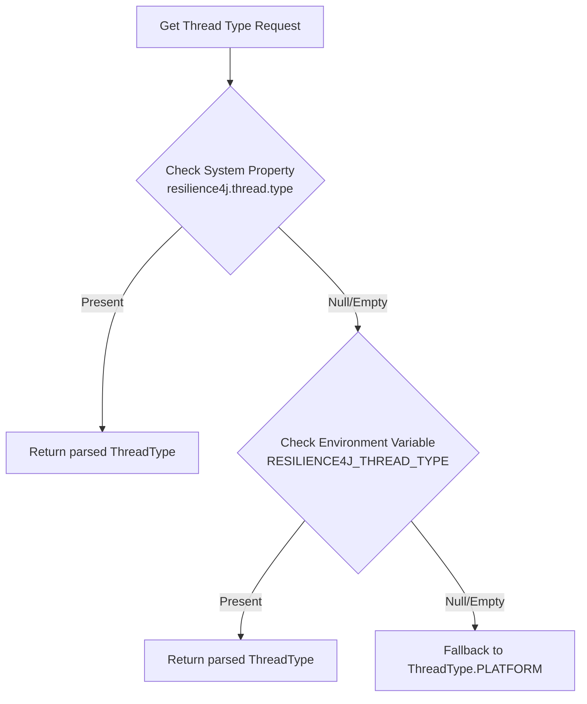
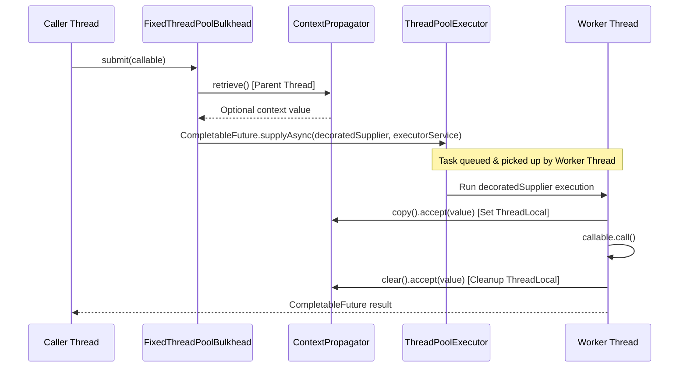
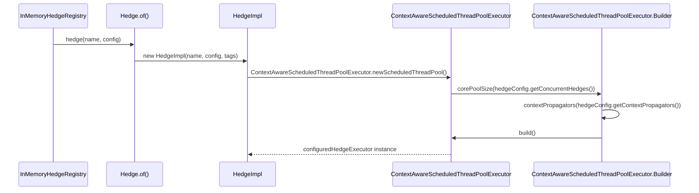

# Threading and Context

<details>
<summary>Relevant source files</summary>

The following files were used as context for generating this wiki page:

- [README.adoc](https://github.com/resilience4j/resilience4j/blob/main/README.adoc)
- [RELEASENOTES.adoc](https://github.com/resilience4j/resilience4j/blob/main/RELEASENOTES.adoc)
- [resilience4j-spring-boot3/README.adoc](https://github.com/resilience4j/resilience4j/blob/main/resilience4j-spring-boot3/README.adoc)
- [resilience4j-core/src/main/java/io/github/resilience4j/core/ContextPropagator.java](https://github.com/resilience4j/resilience4j/blob/main/resilience4j-core/src/main/java/io/github/resilience4j/core/ContextPropagator.java)
- [resilience4j-spring6/src/main/java/io/github/resilience4j/spring6/bulkhead/configure/BulkheadAspect.java](https://github.com/resilience4j/resilience4j/blob/main/resilience4j-spring6/src/main/java/io/github/resilience4j/spring6/bulkhead/configure/BulkheadAspect.java)
- [resilience4j-bulkhead/src/main/java/io/github/resilience4j/bulkhead/internal/FixedThreadPoolBulkhead.java](https://github.com/resilience4j/resilience4j/blob/main/resilience4j-bulkhead/src/main/java/io/github/resilience4j/bulkhead/internal/FixedThreadPoolBulkhead.java)
- [resilience4j-core/src/main/java/io/github/resilience4j/core/ContextAwareScheduledThreadPoolExecutor.java](https://github.com/resilience4j/resilience4j/blob/main/resilience4j-core/src/main/java/io/github/resilience4j/core/ContextAwareScheduledThreadPoolExecutor.java)
- [resilience4j-core/src/main/java/io/github/resilience4j/core/ExecutorServiceFactory.java](https://github.com/resilience4j/resilience4j/blob/main/resilience4j-core/src/main/java/io/github/resilience4j/core/ExecutorServiceFactory.java)
- [resilience4j-hedge/src/main/java/io/github/resilience4j/hedge/internal/HedgeImpl.java](https://github.com/resilience4j/resilience4j/blob/main/resilience4j-hedge/src/main/java/io/github/resilience4j/hedge/internal/HedgeImpl.java)
- [resilience4j-core/src/main/java/io/github/resilience4j/core/NamingThreadFactory.java](https://github.com/resilience4j/resilience4j/blob/main/resilience4j-core/src/main/java/io/github/resilience4j/core/NamingThreadFactory.java)
- [resilience4j-spring6/README.adoc](https://github.com/resilience4j/resilience4j/blob/main/resilience4j-spring6/README.adoc)
- [resilience4j-circuitbreaker/src/main/java/io/github/resilience4j/circuitbreaker/internal/SchedulerFactory.java](https://github.com/resilience4j/circuitbreaker/internal/SchedulerFactory.java)
- [resilience4j-spring-boot3/src/main/java/io/github/resilience4j/springboot3/thread/autoconfigure/Resilience4jThreadAutoConfiguration.java](https://github.com/resilience4j/resilience4j/blob/main/resilience4j-spring-boot3/src/main/java/io/github/resilience4j/springboot3/thread/autoconfigure/Resilience4jThreadAutoConfiguration.java)
- [resilience4j-spring-boot4/src/main/java/io/github/resilience4j/springboot/thread/autoconfigure/Resilience4jThreadAutoConfiguration.java](https://github.com/resilience4j/resilience4j/blob/main/resilience4j-spring-boot4/src/main/java/io/github/resilience4j/springboot/thread/autoconfigure/Resilience4jThreadAutoConfiguration.java)
- [resilience4j-core/src/testFixtures/java/io/github/resilience4j/core/TestContextPropagators.java](https://github.com/resilience4j/resilience4j/blob/main/resilience4j-core/src/testFixtures/java/io/github/resilience4j/core/TestContextPropagators.java)
- [resilience4j-core/src/main/java/io/github/resilience4j/core/ThreadType.java](https://github.com/resilience4j/resilience4j/blob/main/resilience4j-core/src/main/java/io/github/resilience4j/core/ThreadType.java)
- [resilience4j-core/src/testFixtures/java/io/github/resilience4j/core/ThreadModeExtension.java](https://github.com/resilience4j/resilience4j/blob/main/resilience4j-core/src/testFixtures/java/io/github/resilience4j/core/ThreadModeExtension.java)
- [resilience4j-micrometer/src/main/java/io/github/resilience4j/micrometer/tagged/ThreadMetrics.java](https://github.com/resilience4j/micrometer/blob/main/resilience4j-micrometer/src/main/java/io/github/resilience4j/micrometer/tagged/ThreadMetrics.java)
- [resilience4j-spring-boot4/src/main/java/io/github/resilience4j/springboot/thread/autoconfigure/ThreadTypeProperties.java](https://github.com/resilience4j/resilience4j/blob/main/resilience4j-spring-boot4/src/main/java/io/github/resilience4j/springboot/thread/autoconfigure/ThreadTypeProperties.java)
- [resilience4j-spring-boot3/src/main/resources/META-INF/additional-spring-configuration-metadata.json](https://github.com/resilience4j/resilience4j/blob/main/resilience4j-spring-boot3/src/main/resources/META-INF/additional-spring-configuration-metadata.json)
- [resilience4j-spring-boot3/src/main/java/io/github/resilience4j/springboot3/scheduled/threadpool/autoconfigure/ContextAwareScheduledThreadPoolAutoConfiguration.java](https://github.com/resilience4j/resilience4j/blob/main/resilience4j-spring-boot3/src/main/java/io/github/resilience4j/springboot3/scheduled/threadpool/autoconfigure/ContextAwareScheduledThreadPoolAutoConfiguration.java)
- [resilience4j-spring-boot3/src/main/java/io/github/resilience4j/springboot3/thread/autoconfigure/ThreadTypeProperties.java](https://github.com/resilience4j/resilience4j/blob/main/resilience4j-spring-boot3/src/main/java/io/github/resilience4j/springboot3/thread/autoconfigure/ThreadTypeProperties.java)
- [resilience4j-circuitbreaker/src/jmh/resources/resultsWithGCProfiling.txt](https://github.com/resilience4j/resilience4j/blob/main/resilience4j-circuitbreaker/src/jmh/resources/resultsWithGCProfiling.txt)
- [gradle/libs.versions.toml](https://github.com/resilience4j/resilience4j/blob/main/gradle/libs.versions.toml)
- [resilience4j-hedge/src/main/java/io/github/resilience4j/hedge/Hedge.java](https://github.com/resilience4j/resilience4j/blob/main/resilience4j-hedge/src/main/java/io/github/resilience4j/hedge/Hedge.java)
- [resilience4j-hedge/src/main/java/io/github/resilience4j/hedge/internal/InMemoryHedgeRegistry.java](https://github.com/resilience4j/resilience4j/blob/main/resilience4j-hedge/src/main/java/io/github/resilience4j/hedge/internal/InMemoryHedgeRegistry.java)
</details>

## Overview

### Background and Purpose

Threading and Context management in Resilience4j 3 provides foundational abstractions designed to handle concurrent execution, thread-pool isolation, virtual threads (Project Loom), and context propagation across thread boundaries. In modern resilient applications, executing tasks asynchronously or isolating backends with dedicated thread pools (such as `ThreadPoolBulkhead` or `Hedge`) often results in the loss of contextual metadata like `ThreadLocal` variables and SLF4J MDC (Mapped Diagnostic Context). Resilience4j solves this by introducing unified thread factories, configurable thread types, context propagators, and context-aware execution schedulers.

Sources: [README.adoc:38-38](https://github.com/resilience4j/resilience4j/blob/main/README.adoc#L38-L38), [resilience4j-core/src/main/java/io/github/resilience4j/core/ContextPropagator.java](https://github.com/resilience4j/resilience4j/blob/main/resilience4j-core/src/main/java/io/github/resilience4j/core/ContextPropagator.java#L29-L41)

### Architecture and Core Integration

The threading architecture supports seamless switching between traditional OS platform threads and JDK 21 virtual threads across core executors and schedulers. When executing tasks across thread boundaries, `ContextPropagator` implementations capture contextual state from the parent thread via `retrieve()`, install it onto the worker thread via `copy()`, and clean it up via `clear()` within `try-finally` blocks. This guarantees that tracing tokens, security contexts, and logging MDC maps remain intact during asynchronous resilience pattern executions.

Sources: [resilience4j-core/src/main/java/io/github/resilience4j/core/ContextPropagator.java](https://github.com/resilience4j/resilience4j/blob/main/resilience4j-core/src/main/java/io/github/resilience4j/core/ContextPropagator.java#L29-L41), [resilience4j-core/src/main/java/io/github/resilience4j/core/ExecutorServiceFactory.java](https://github.com/resilience4j/resilience4j/blob/main/resilience4j-core/src/main/java/io/github/resilience4j/core/ExecutorServiceFactory.java#L24-L38)

### Ecosystem Bindings

Integrations with Spring Framework 6, Spring Boot 3, and Micrometer allow developers to declare thread execution strategies via properties or configuration classes, while observing virtual thread status through real-time metrics gauges.

Sources: [resilience4j-micrometer/src/main/java/io/github/resilience4j/micrometer/tagged/ThreadMetrics.java](https://github.com/resilience4j/micrometer/blob/main/resilience4j-micrometer/src/main/java/io/github/resilience4j/micrometer/tagged/ThreadMetrics.java#L31-L40), [resilience4j-spring-boot3/README.adoc:10-18](https://github.com/resilience4j/spring-boot3/blob/main/resilience4j-spring-boot3/README.adoc#L10-L18)

---

## Thread Types and Execution Factories

### Selection and Resolution

Resilience4j provides centralized thread and executor management via `ExecutorServiceFactory` and the `ThreadType` enumeration. Applications can choose between traditional platform threads and lightweight virtual threads (Project Loom, introduced in JDK 21).

The thread type resolution mechanism evaluates configuration sources in a strict order:
1. JVM system property `resilience4j.thread.type` (`"virtual"` or `"platform"`).
2. Environment variable `RESILIENCE4J_THREAD_TYPE`.
3. Default fallback: `ThreadType.PLATFORM`.

Sources: [resilience4j-core/src/main/java/io/github/resilience4j/core/ExecutorServiceFactory.java](https://github.com/resilience4j/resilience4j/blob/main/resilience4j-core/src/main/java/io/github/resilience4j/core/ExecutorServiceFactory.java#L46-L66), [resilience4j-core/src/main/java/io/github/resilience4j/core/ThreadType.java](https://github.com/resilience4j/resilience4j/blob/main/resilience4j-core/src/main/java/io/github/resilience4j/core/ThreadType.java#L12-L27)

### Flow Diagram



Sources: [resilience4j-core/src/main/java/io/github/resilience4j/core/ExecutorServiceFactory.java](https://github.com/resilience4j/resilience4j/blob/main/resilience4j-core/src/main/java/io/github/resilience4j/core/ExecutorServiceFactory.java#L46-L66), [resilience4j-core/src/main/java/io/github/resilience4j/core/ThreadType.java](https://github.com/resilience4j/resilience4j/blob/main/resilience4j-core/src/main/java/io/github/resilience4j/core/ThreadType.java#L12-L27)

### Supported Thread Types

| Enum Constant | String Value | Description |
| :--- | :--- | :--- |
| `ThreadType.VIRTUAL` | `"virtual"` | Lightweight virtual threads managed by the JVM (JDK 21+ Project Loom). |
| `ThreadType.PLATFORM` | `"platform"` | Traditional OS platform threads (Default). |

Sources: [resilience4j-core/src/main/java/io/github/resilience4j/core/ThreadType.java](https://github.com/resilience4j/resilience4j/blob/main/resilience4j-core/src/main/java/io/github/resilience4j/core/ThreadType.java#L12-L51)

> [!NOTE]
> When `ThreadType.VIRTUAL` is active, `ExecutorServiceFactory` constructs `ThreadFactory` instances using `Thread.ofVirtual()` instead of standard platform thread executors, optimizing I/O-heavy resilience patterns without pinning carrier threads unnecessarily.

Sources: [resilience4j-core/src/main/java/io/github/resilience4j/core/ExecutorServiceFactory.java](https://github.com/resilience4j/resilience4j/blob/main/resilience4j-core/src/main/java/io/github/resilience4j/core/ExecutorServiceFactory.java#L79-L90), [resilience4j-core/src/main/java/io/github/resilience4j/core/ContextPropagator.java](https://github.com/resilience4j/resilience4j/blob/main/resilience4j-core/src/main/java/io/github/resilience4j/core/ContextPropagator.java#L29-L39)

---

## Context Propagation Across Thread Boundaries

### Abstraction Overview

The `ContextPropagator<T>` interface abstracts the capture, transfer, and cleanup of thread-bound state (such as `ThreadLocal` variables) when tasks cross thread boundaries in asynchronous components like `ThreadPoolBulkhead` and `Hedge`.

Sources: [resilience4j-core/src/main/java/io/github/resilience4j/core/ContextPropagator.java](https://github.com/resilience4j/resilience4j/blob/main/resilience4j-core/src/main/java/io/github/resilience4j/core/ContextPropagator.java#L29-L42)

### Interface Lifecycle Methods

- `Supplier<Optional<T>> retrieve()`: Extracts the value from the currently executing parent thread.
- `Consumer<Optional<T>> copy()`: Injects the retrieved value into the newly executing worker thread.
- `Consumer<Optional<T>> clear()`: Cleans up and removes the propagated value from the worker thread upon task completion.

```java
public interface ContextPropagator<T> {
    Supplier<Optional<T>> retrieve();
    Consumer<Optional<T>> copy();
    Consumer<Optional<T>> clear();
}
```

When decorating suppliers, callables, or runnables with a list of `ContextPropagator` instances, Resilience4j creates an identity map (`HashMap`) pairing each propagator with its retrieved parent context. If duplicate propagators are present, the last entry wins.

Sources: [resilience4j-core/src/main/java/io/github/resilience4j/core/ContextPropagator.java](https://github.com/resilience4j/resilience4j/blob/main/resilience4j-core/src/main/java/io/github/resilience4j/core/ContextPropagator.java#L42-L120)

> [!WARNING]
> Using `ThreadLocal` with many virtual threads can lead to high memory consumption because each virtual thread maintains its own copy of `ThreadLocal` maps. Furthermore, accessing `ThreadLocal` variables inside virtual threads can cause carrier thread pinning. Consider using Scoped Values (JEP 429) where available on Java 21+.

Sources: [resilience4j-core/src/main/java/io/github/resilience4j/core/ContextPropagator.java](https://github.com/resilience4j/resilience4j/blob/main/resilience4j-core/src/main/java/io/github/resilience4j/core/ContextPropagator.java#L31-L39)

---

## Call-Chain Execution Walkthrough: Context-Propagated Asynchronous Submission

When an asynchronous execution is submitted to a `FixedThreadPoolBulkhead`, Resilience4j intercepts the call, captures thread-local context via configured propagators, schedules execution on the underlying thread pool, and ensures cleanup in a `finally` block.



Sources: [resilience4j-bulkhead/src/main/java/io/github/resilience4j/bulkhead/internal/FixedThreadPoolBulkhead.java](https://github.com/resilience4j/resilience4j/blob/main/resilience4j-bulkhead/src/main/java/io/github/resilience4j/bulkhead/internal/FixedThreadPoolBulkhead.java#L142-L167)

1. **Submission Initiation**: The client invokes `FixedThreadPoolBulkhead.submit(Callable<T> callable)`.

Sources: [resilience4j-bulkhead/src/main/java/io/github/resilience4j/bulkhead/internal/FixedThreadPoolBulkhead.java](https://github.com/resilience4j/resilience4j/blob/main/resilience4j-bulkhead/src/main/java/io/github/resilience4j/bulkhead/internal/FixedThreadPoolBulkhead.java#L142-L143)

2. **Context Retrieval**: `ContextPropagator.decorateSupplier()` invokes `propagator.retrieve().get()` on the parent thread to snapshot active thread-local values.

Sources: [resilience4j-core/src/main/java/io/github/resilience4j/core/ContextPropagator.java](https://github.com/resilience4j/resilience4j/blob/main/resilience4j-core/src/main/java/io/github/resilience4j/core/ContextPropagator.java#L78-L82)

3. **Async Dispatch**: `CompletableFuture.supplyAsync()` submits the wrapped lambda to the `ThreadPoolExecutor`.

Sources: [resilience4j-bulkhead/src/main/java/io/github/resilience4j/bulkhead/internal/FixedThreadPoolBulkhead.java](https://github.com/resilience4j/bulkhead/internal/FixedThreadPoolBulkhead.java#L145-L154)

4. **Worker Execution & Binding**: Upon thread allocation, the worker thread executes the wrapper lambda, invoking `propagator.copy().accept(value)` to bind context variables.

Sources: [resilience4j-core/src/main/java/io/github/resilience4j/core/ContextPropagator.java](https://github.com/resilience4j/resilience4j/blob/main/resilience4j-core/src/main/java/io/github/resilience4j/core/ContextPropagator.java#L82-L84)

5. **Guaranteed Cleanup**: Encased in a `try-finally` block, the worker executes the target callable and invokes `propagator.clear().accept(value)` in the `finally` clause, preventing thread-local leaks.

Sources: [resilience4j-core/src/main/java/io/github/resilience4j/core/ContextPropagator.java](https://github.com/resilience4j/resilience4j/blob/main/resilience4j-core/src/main/java/io/github/resilience4j/core/ContextPropagator.java#L85-L88)

---

## Call-Chain Execution Walkthrough: Hedge Initialization and Builder Flow

When initializing a `Hedge` instance, the registry or factory configures the hedging executor using a builder that binds the configured number of concurrent hedges and context propagators.



Sources: [resilience4j-hedge/src/main/java/io/github/resilience4j/hedge/internal/HedgeImpl.java](https://github.com/resilience4j/resilience4j/blob/main/resilience4j-hedge/src/main/java/io/github/resilience4j/hedge/internal/HedgeImpl.java#L62-L68)

1. **Registry Request**: `InMemoryHedgeRegistry.hedge()` delegates to `Hedge.of()`.

Sources: [resilience4j-hedge/src/main/java/io/github/resilience4j/hedge/internal/InMemoryHedgeRegistry.java](https://github.com/resilience4j/hedge/internal/InMemoryHedgeRegistry.java#L121-L124)

2. **Implementation Instantiation**: `HedgeImpl` constructor initializes its metrics, event processor, duration supplier, and scheduled executor.

Sources: [resilience4j-hedge/src/main/java/io/github/resilience4j/hedge/internal/HedgeImpl.java](https://github.com/resilience4j/resilience4j/blob/main/resilience4j-hedge/src/main/java/io/github/resilience4j/hedge/internal/HedgeImpl.java#L54-L68)

3. **Scheduled Executor Creation**: `ContextAwareScheduledThreadPoolExecutor.newScheduledThreadPool()` returns a new `Builder`.

Sources: [resilience4j-core/src/main/java/io/github/resilience4j/core/ContextAwareScheduledThreadPoolExecutor.java](https://github.com/resilience4j/core/ContextAwareScheduledThreadPoolExecutor.java#L110-L112)

4. **Pool Configuration**: The builder configures `corePoolSize` using `hedgeConfig.getConcurrentHedges()` and registers `hedgeConfig.getContextPropagators()`.

Sources: [resilience4j-hedge/src/main/java/io/github/resilience4j/hedge/internal/HedgeImpl.java](https://github.com/resilience4j/hedge/internal/HedgeImpl.java#L64-L67)

5. **Builder Completion**: `Builder.build()` instantiates and returns the fully configured `ContextAwareScheduledThreadPoolExecutor`.

Sources: [resilience4j-core/src/main/java/io/github/resilience4j/core/ContextAwareScheduledThreadPoolExecutor.java](https://github.com/resilience4j/core/ContextAwareScheduledThreadPoolExecutor.java#L134-L137)

---

## Context-Aware Schedulers

### ContextAwareScheduledThreadPoolExecutor
`ContextAwareScheduledThreadPoolExecutor` extends `ScheduledThreadPoolExecutor` to automatically propagate SLF4J MDC (Mapped Diagnostic Context) maps alongside custom `ContextPropagator` instances across scheduled executions (`schedule`, `scheduleAtFixedRate`, `scheduleWithFixedDelay`).

When any task is scheduled, the executor captures the parent thread's MDC context map:
```java
Map<String, String> mdcContextMap = getMdcContextMap();
```
Upon execution on the background thread, it sets the MDC context map, runs the command, and clears MDC in a `finally` block:
```java
try {
    setMDCContext(mdcContextMap);
    command.run();
} finally {
    MDC.clear();
}
```

Sources: [resilience4j-core/src/main/java/io/github/resilience4j/core/ContextAwareScheduledThreadPoolExecutor.java](https://github.com/resilience4j/core/ContextAwareScheduledThreadPoolExecutor.java#L32-L97)

### SchedulerFactory
The circuit breaker module utilizes `SchedulerFactory`, a singleton factory that provides a single-thread `ScheduledExecutorService` for auto-transitioning circuit breaker states (e.g., from `OPEN` to `HALF_OPEN`). `SchedulerFactory` detects at runtime whether `resilience4j.thread.type` has changed, automatically shutting down the old scheduler and instantiating a fresh one matching the active thread mode.

Sources: [resilience4j-circuitbreaker/src/main/java/io/github/resilience4j/circuitbreaker/internal/SchedulerFactory.java](https://github.com/resilience4j/circuitbreaker/internal/SchedulerFactory.java#L21-L84)

---

## Spring Framework and Spring Boot Auto-Configuration

### Auto-Configuration Overview

Resilience4j provides auto-configuration modules (`resilience4j-spring-boot3` and `resilience4j-spring-boot4`) to bind configuration properties to internal thread managers.

Sources: [resilience4j-spring-boot3/src/main/java/io/github/resilience4j/springboot3/thread/autoconfigure/Resilience4jThreadAutoConfiguration.java](https://github.com/resilience4j/resilience4j/blob/main/resilience4j-spring-boot3/src/main/java/io/github/resilience4j/springboot3/thread/autoconfigure/Resilience4jThreadAutoConfiguration.java#L26-L43), [resilience4j-spring-boot4/src/main/java/io/github/resilience4j/springboot/thread/autoconfigure/Resilience4jThreadAutoConfiguration.java](https://github.com/resilience4j/resilience4j/blob/main/resilience4j-spring-boot4/src/main/java/io/github/resilience4j/springboot/thread/autoconfigure/Resilience4jThreadAutoConfiguration.java#L26-L43)

### Configuration Properties

Properties are configured under the `resilience4j.thread` prefix in `application.yml` or `application.properties`:

```yaml
resilience4j:
  thread:
    type: virtual
    metrics:
      enabled: true
```

| Property Key | Type | Default | Description |
| :--- | :--- | :--- | :--- |
| `resilience4j.thread.type` | `String` | `platform` | Internal scheduler thread type (`platform` or `virtual`). |
| `resilience4j.thread.metrics.enabled` | `Boolean` | `true` | Enables Micrometer thread usage metrics. |

Sources: [README.adoc:404-409](https://github.com/resilience4j/resilience4j/blob/main/README.adoc#L404-L409), [resilience4j-spring-boot3/README.adoc:15-18](https://github.com/resilience4j/resilience4j/blob/main/resilience4j-spring-boot3/README.adoc#L15-L18), [resilience4j-spring-boot3/src/main/resources/META-INF/additional-spring-configuration-metadata.json](https://github.com/resilience4j/resilience4j/blob/main/resilience4j-spring-boot3/src/main/resources/META-INF/additional-spring-configuration-metadata.json#L87-L99)

> [!CAUTION]
> Enabling `resilience4j.thread.type=virtual` switches **only the internal schedulers of Resilience4j** (such as CircuitBreaker state-transition schedulers and thread pools) to virtual threads. To run your entire Spring Boot application (TaskExecutor, `@Scheduled`, Servlet containers) on virtual threads, you must explicitly enable Spring's virtual thread flags as well:
> ```yaml
> spring:
>   threads:
>     virtual:
>       enabled: true
> server:
>   virtual-threads:
>     enabled: true
> ```

Sources: [resilience4j-spring-boot3/README.adoc:10-34](https://github.com/resilience4j/resilience4j/blob/main/resilience4j-spring-boot3/README.adoc#L10-L34)

---

## Micrometer Metrics and Observability

### Metrics Collector Overview

When integrated with Micrometer (`resilience4j-micrometer`), Resilience4j registers thread metrics via `ThreadMetrics`. 

Sources: [resilience4j-micrometer/src/main/java/io/github/resilience4j/micrometer/tagged/ThreadMetrics.java](https://github.com/resilience4j/micrometer/blob/main/resilience4j-micrometer/src/main/java/io/github/resilience4j/micrometer/tagged/ThreadMetrics.java#L41-L57)

### Available Metrics and Gauges

When `resilience4j.thread.metrics.enabled` is active, the following gauge is exposed:
- `resilience4j.thread.virtual_thread_enabled`: Reports `1.0` if virtual threads are enabled, or `0.0` if platform threads are active.

Sources: [resilience4j-spring-boot3/README.adoc:44-57](https://github.com/resilience4j/resilience4j/blob/main/resilience4j-spring-boot3/README.adoc#L44-L57), [resilience4j-micrometer/src/main/java/io/github/resilience4j/micrometer/tagged/ThreadMetrics.java](https://github.com/resilience4j/micrometer/blob/main/resilience4j-micrometer/src/main/java/io/github/resilience4j/micrometer/tagged/ThreadMetrics.java#L93-L101)

---

## Design Trade-Offs

| Design Choice | Benefit | Cost |
| :--- | :--- | :--- |
| **Pluggable `ContextPropagator` API** | Decouples thread-local and MDC propagation logic from core resilience decorators, supporting arbitrary context libraries. | Requires manual registration of custom propagators in bulkhead or hedge configurations. |
| **Runtime Scheduler Recreation (`SchedulerFactory`)** | Allows dynamic toggling of thread modes (platform vs. virtual) during testing or runtime without restarting the JVM. | Acquires reentrant locks and incurs overhead when shutting down and re-instantiating underlying `ScheduledExecutorService` instances. |
| **Virtual Thread Factory Integration (`Thread.ofVirtual()`)** | Enables massive concurrency scaling for I/O-bound resilience tasks without exhausting OS thread limits. | Risk of high memory overhead and thread pinning if `ThreadLocal` variables are heavily accessed inside virtual threads. |

Sources: [resilience4j-core/src/main/java/io/github/resilience4j/core/ContextPropagator.java](https://github.com/resilience4j/resilience4j/blob/main/resilience4j-core/src/main/java/io/github/resilience4j/core/ContextPropagator.java#L29-L41), [resilience4j-circuitbreaker/src/main/java/io/github/resilience4j/circuitbreaker/internal/SchedulerFactory.java](https://github.com/resilience4j/circuitbreaker/internal/SchedulerFactory.java#L9-L20), [resilience4j-core/src/main/java/io/github/resilience4j/core/ExecutorServiceFactory.java](https://github.com/resilience4j/resilience4j/blob/main/resilience4j-core/src/main/java/io/github/resilience4j/core/ExecutorServiceFactory.java#L24-L38)

---

## Runnable Usage Example

The following complete example demonstrates how to configure a `ThreadPoolBulkhead` with a custom `ContextPropagator` to propagate tenant IDs across thread boundaries during asynchronous execution.

```java
import io.github.resilience4j.bulkhead.ThreadPoolBulkhead;
import io.github.resilience4j.bulkhead.ThreadPoolBulkheadConfig;
import io.github.resilience4j.core.ContextPropagator;

import java.util.Optional;
import java.util.List;
import java.util.concurrent.CompletableFuture;
import java.util.function.Consumer;
import java.util.function.Supplier;

public class ThreadingAndContextExample {

    private static final ThreadLocal<String> TENANT_CONTEXT = new ThreadLocal<>();

    public static class TenantContextPropagator implements ContextPropagator<String> {
        @Override
        public Supplier<Optional<String>> retrieve() {
            return () -> Optional.ofNullable(TENANT_CONTEXT.get());
        }

        @Override
        public Consumer<Optional<String>> copy() {
            return opt -> opt.ifPresent(TENANT_CONTEXT::set);
        }

        @Override
        public Consumer<Optional<String>> clear() {
            return opt -> TENANT_CONTEXT.remove();
        }
    }

    public static void main(String[] args) {
        // Set tenant ID in parent thread
        TENANT_CONTEXT.set("tenant-alpha");

        // Configure ThreadPoolBulkhead with the custom context propagator
        ThreadPoolBulkheadConfig config = ThreadPoolBulkheadConfig.custom()
            .maxThreadPoolSize(4)
            .coreThreadPoolSize(2)
            .queueCapacity(10)
            .contextPropagators(List.of(new TenantContextPropagator()))
            .build();

        ThreadPoolBulkhead bulkhead = ThreadPoolBulkhead.of("backendService", config);

        // Submit task asynchronously; tenant context is automatically propagated
        CompletableFuture<String> future = bulkhead.submit(() -> {
            String currentTenant = TENANT_CONTEXT.get();
            return "Executed successfully for tenant: " + currentTenant;
        });

        System.out.println(future.join());

        // Cleanup parent thread
        TENANT_CONTEXT.remove();
        bulkhead.close();
    }
}
```

Sources: [resilience4j-core/src/main/java/io/github/resilience4j/core/ContextPropagator.java](https://github.com/resilience4j/resilience4j/blob/main/resilience4j-core/src/main/java/io/github/resilience4j/core/ContextPropagator.java#L42-L120), [resilience4j-bulkhead/src/main/java/io/github/resilience4j/bulkhead/internal/FixedThreadPoolBulkhead.java](https://github.com/resilience4j/resilience4j/blob/main/resilience4j-bulkhead/src/main/java/io/github/resilience4j/bulkhead/internal/FixedThreadPoolBulkhead.java#L78-L167)

## Related

- [[Thread Pool Bulkheads]]

