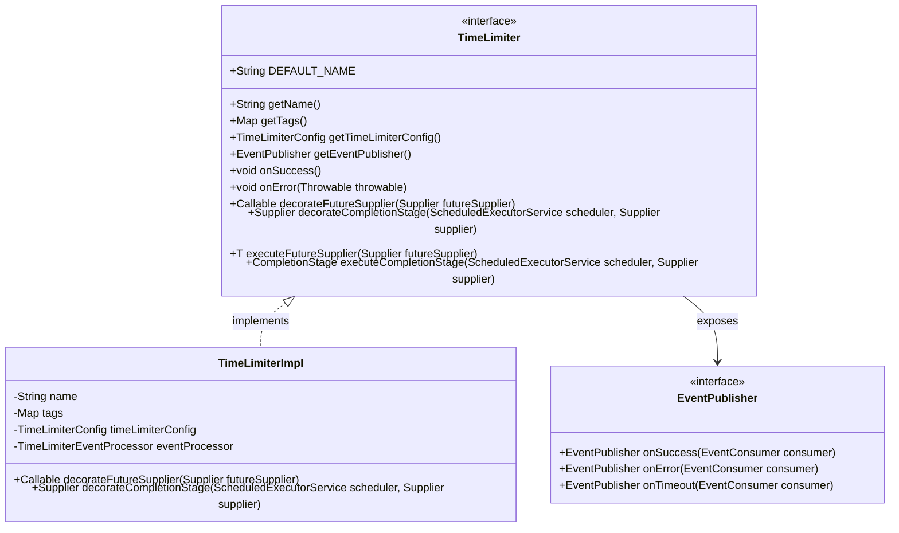
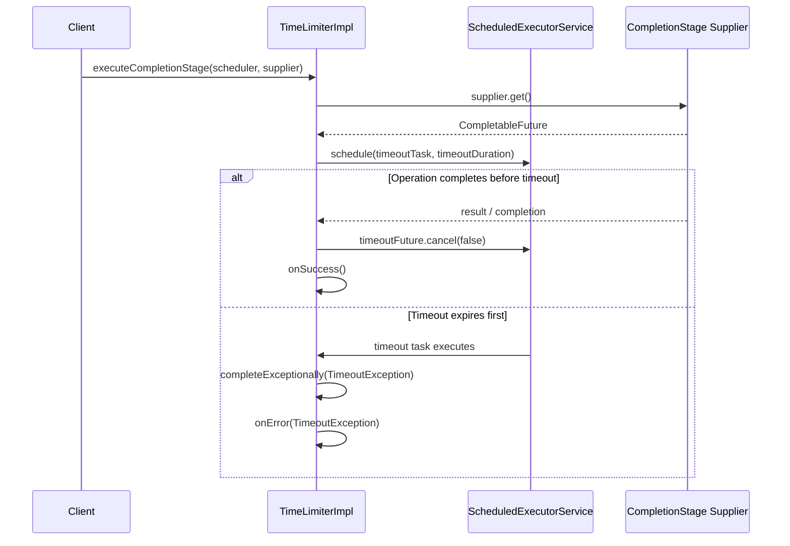

# Time Limiters

<details>
<summary>Relevant source files</summary>

The following files were used as context for generating this wiki page:

- [resilience4j-spring6/src/main/java/io/github/resilience4j/spring6/timelimiter/configure/TimeLimiterConfiguration.java](https://github.com/resilience4j/resilience4j/blob/main/resilience4j-spring6/src/main/java/io/github/resilience4j/spring6/timelimiter/configure/TimeLimiterConfiguration.java)
- [resilience4j-spring6/src/main/java/io/github/resilience4j/spring6/timelimiter/configure/TimeLimiterAspect.java](https://github.com/resilience4j/resilience4j/blob/main/resilience4j-spring6/src/main/java/io/github/resilience4j/spring6/timelimiter/configure/TimeLimiterAspect.java)
- [resilience4j-micronaut/src/main/java/io/github/resilience4j/micronaut/timelimiter/TimeLimiterRegistryFactory.java](https://github.com/resilience4j/resilience4j/blob/main/resilience4j-micronaut/src/main/java/io/github/resilience4j/micronaut/timelimiter/TimeLimiterRegistryFactory.java)
- [resilience4j-micronaut/src/main/java/io/github/resilience4j/micronaut/timelimiter/TimeLimiterInterceptor.java](https://github.com/resilience4j/resilience4j/blob/main/resilience4j-micronaut/src/main/java/io/github/resilience4j/micronaut/timelimiter/TimeLimiterInterceptor.java)
- [resilience4j-timelimiter/src/main/java/io/github/resilience4j/timelimiter/internal/InMemoryTimeLimiterRegistry.java](https://github.com/resilience4j/resilience4j/blob/main/resilience4j-timelimiter/src/main/java/io/github/resilience4j/timelimiter/internal/InMemoryTimeLimiterRegistry.java)
- [resilience4j-kotlin/src/main/kotlin/io/github/resilience4j/kotlin/timelimiter/TimeLimiter.kt](https://github.com/resilience4j/resilience4j/blob/main/resilience4j-kotlin/src/main/kotlin/io/github/resilience4j/kotlin/timelimiter/TimeLimiter.kt)
- [resilience4j-timelimiter/src/main/java/io/github/resilience4j/timelimiter/internal/TimeLimiterImpl.java](https://github.com/resilience4j/resilience4j/blob/main/resilience4j-timelimiter/src/main/java/io/github/resilience4j/timelimiter/internal/TimeLimiterImpl.java)
- [resilience4j-timelimiter/src/main/java/io/github/resilience4j/timelimiter/TimeLimiter.java](https://github.com/resilience4j/resilience4j/blob/main/resilience4j-timelimiter/src/main/java/io/github/resilience4j/timelimiter/TimeLimiter.java)
- [resilience4j-spring6/src/main/java/io/github/resilience4j/spring6/bulkhead/configure/BulkheadAspect.java](https://github.com/resilience4j/resilience4j/blob/main/resilience4j-spring6/src/main/java/io/github/resilience4j/spring6/bulkhead/configure/BulkheadAspect.java)
- [resilience4j-circuitbreaker/src/main/java/io/github/resilience4j/circuitbreaker/CircuitBreaker.java](https://github.com/resilience4j/resilience4j/blob/main/resilience4j-circuitbreaker/src/main/java/io/github/resilience4j/circuitbreaker/CircuitBreaker.java)
- [resilience4j-spring-boot4/src/main/java/io/github/resilience4j/springboot/timelimiter/autoconfigure/TimeLimiterAutoConfiguration.java](https://github.com/resilience4j/resilience4j/blob/main/resilience4j-spring-boot4/src/main/java/io/github/resilience4j/springboot/timelimiter/autoconfigure/TimeLimiterAutoConfiguration.java)
- [resilience4j-timelimiter/src/main/java/io/github/resilience4j/timelimiter/TimeLimiterRegistry.java](https://github.com/resilience4j/resilience4j/blob/main/resilience4j-timelimiter/src/main/java/io/github/resilience4j/timelimiter/TimeLimiterRegistry.java)
- [resilience4j-spring6/src/main/java/io/github/resilience4j/spring6/micrometer/configure/TimerAspect.java](https://github.com/resilience4j/resilience4j/blob/main/resilience4j-spring6/src/main/java/io/github/resilience4j/spring6/micrometer/configure/TimerAspect.java)
- [resilience4j-spring6/src/main/java/io/github/resilience4j/spring6/ratelimiter/configure/RateLimiterAspect.java](https://github.com/resilience4j/resilience4j/blob/main/resilience4j-spring6/src/main/java/io/github/resilience4j/spring6/ratelimiter/configure/RateLimiterAspect.java)
- [resilience4j-framework-common/src/main/java/io/github/resilience4j/common/timelimiter/configuration/CommonTimeLimiterConfigurationProperties.java](https://github.com/resilience4j/resilience4j/blob/main/resilience4j-framework-common/src/main/java/io/github/resilience4j/common/timelimiter/configuration/CommonTimeLimiterConfigurationProperties.java)
- [resilience4j-metrics/src/main/java/io/github/resilience4j/metrics/publisher/TimeLimiterMetricsPublisher.java](https://github.com/resilience4j/resilience4j/blob/main/resilience4j-metrics/src/main/java/io/github/resilience4j/metrics/publisher/TimeLimiterMetricsPublisher.java)
- [resilience4j-rxjava3/src/main/java/io/github/resilience4j/rxjava3/timelimiter/transformer/TimeLimiterTransformer.java](https://github.com/resilience4j/resilience4j/blob/main/resilience4j-rxjava3/src/main/java/io/github/resilience4j/rxjava3/timelimiter/transformer/TimeLimiterTransformer.java)
- [resilience4j-rxjava2/src/main/java/io/github/resilience4j/timelimiter/transformer/TimeLimiterTransformer.java](https://github.com/resilience4j/resilience4j/blob/main/resilience4j-rxjava2/src/main/java/io/github/resilience4j/timelimiter/transformer/TimeLimiterTransformer.java)
- [resilience4j-timelimiter/src/main/java/io/github/resilience4j/timelimiter/internal/TimeLimiterEventProcessor.java](https://github.com/resilience4j/resilience4j/blob/main/resilience4j-timelimiter/src/main/java/io/github/resilience4j/timelimiter/internal/TimeLimiterEventProcessor.java)
- [resilience4j-reactor/src/main/java/io/github/resilience4j/reactor/timelimiter/TimeLimiterOperator.java](https://github.com/resilience4j/resilience4j/blob/main/resilience4j-reactor/src/main/java/io/github/resilience4j/reactor/timelimiter/TimeLimiterOperator.java)
- [resilience4j-ratelimiter/src/main/java/io/github/resilience4j/ratelimiter/RateLimiter.java](https://github.com/resilience4j/resilience4j/blob/main/resilience4j-ratelimiter/src/main/java/io/github/resilience4j/ratelimiter/RateLimiter.java)
- [resilience4j-hedge/src/main/java/io/github/resilience4j/hedge/internal/HedgeImpl.java](https://github.com/resilience4j/resilience4j/blob/main/resilience4j-hedge/src/main/java/io/github/resilience4j/hedge/internal/HedgeImpl.java)
- [resilience4j-micrometer/src/main/java/io/github/resilience4j/micrometer/tagged/AbstractTimeLimiterMetrics.java](https://github.com/resilience4j/resilience4j/blob/main/resilience4j-micrometer/src/main/java/io/github/resilience4j/micrometer/tagged/AbstractTimeLimiterMetrics.java)
- [resilience4j-spring6/src/main/java/io/github/resilience4j/spring6/timelimiter/configure/RxJava3TimeLimiterAspectExt.java](https://github.com/resilience4j/resilience4j/blob/main/resilience4j-spring6/src/main/java/io/github/resilience4j/spring6/timelimiter/configure/RxJava3TimeLimiterAspectExt.java)
- [resilience4j-spring6/src/main/java/io/github/resilience4j/spring6/timelimiter/configure/ReactorTimeLimiterAspectExt.java](https://github.com/resilience4j/resilience4j/blob/main/resilience4j-spring6/src/main/java/io/github/resilience4j/spring6/timelimiter/configure/ReactorTimeLimiterAspectExt.java)
- [resilience4j-spring6/src/main/java/io/github/resilience4j/spring6/timelimiter/configure/RxJava2TimeLimiterAspectExt.java](https://github.com/resilience4j/resilience4j/blob/main/resilience4j-spring6/src/main/java/io/github/resilience4j/spring6/timelimiter/configure/RxJava2TimeLimiterAspectExt.java)
- [resilience4j-commons-configuration/src/main/java/io/github/resilience4j/commons/configuration/timelimiter/configure/CommonsConfigurationTimeLimiterRegistry.java](https://github.com/resilience4j/resilience4j/blob/main/resilience4j-commons-configuration/src/main/java/io/github/resilience4j/commons/configuration/timelimiter/configure/CommonsConfigurationTimeLimiterRegistry.java)
- [resilience4j-spring-boot3/src/main/java/io/github/resilience4j/springboot3/timelimiter/autoconfigure/AbstractTimeLimiterConfigurationOnMissingBean.java](https://github.com/resilience4j/resilience4j/blob/main/resilience4j-spring-boot3/src/main/java/io/github/resilience4j/springboot3/timelimiter/autoconfigure/AbstractTimeLimiterConfigurationOnMissingBean.java)
</details>

## Overview

Time Limiters in Resilience4j are designed to restrict the maximum execution duration of asynchronous and non-blocking operations, preventing system threads from hanging indefinitely when downstream services or remote operations fail to respond within an expected timeframe. By decorating standard asynchronous constructs—such as Java `Future`, `CompletionStage`, reactive streams, and Kotlin coroutines—Time Limiters intercept execution flow, enforce configurable timeout bounds, and trigger failure lifecycles or thread interruptions upon expiration.

The core design centers around decoupling the execution target from timeout enforcement via asynchronous schedulers and event-driven monitoring. Unlike thread-pool-based isolation mechanisms that require provisioning separate worker thread pools, Resilience4j Time Limiters rely on scheduled executor services to monitor asynchronous futures or completion stages, completing them exceptionally with `TimeoutException` when deadlines are exceeded. This mechanism integrates closely with framework-level interceptors, Spring Boot auto-configurations, Micronaut AOP, and metrics publishers to provide unified oversight across reactive and imperative runtimes.

Sources: [resilience4j-timelimiter/src/main/java/io/github/resilience4j/timelimiter/TimeLimiter.java:20-23](https://github.com/resilience4j/resilience4j/blob/main/resilience4j-timelimiter/src/main/java/io/github/resilience4j/timelimiter/TimeLimiter.java#L20-L23), [resilience4j-timelimiter/src/main/java/io/github/resilience4j/timelimiter/internal/TimeLimiterImpl.java:71-110](https://github.com/resilience4j/resilience4j/blob/main/resilience4j-timelimiter/src/main/java/io/github/resilience4j/timelimiter/internal/TimeLimiterImpl.java#L71-L110)

## Public API and Interface Design

The `TimeLimiter` interface defines the primary contract for decorating and executing time-constrained operations. It provides static factory methods like `ofDefaults()`, `of(TimeLimiterConfig)`, and `of(Duration)` for instantiating decorator instances, alongside default execution helpers such as `executeFutureSupplier()` and `executeCompletionStage()`.



Sources: [resilience4j-timelimiter/src/main/java/io/github/resilience4j/timelimiter/TimeLimiter.java:23-231](https://github.com/resilience4j/resilience4j/blob/main/resilience4j-timelimiter/src/main/java/io/github/resilience4j/timelimiter/TimeLimiter.java#L23-L231), [resilience4j-timelimiter/src/main/java/io/github/resilience4j/timelimiter/internal/TimeLimiterImpl.java:19-110](https://github.com/resilience4j/resilience4j/blob/main/resilience4j-timelimiter/src/main/java/io/github/resilience4j/timelimiter/internal/TimeLimiterImpl.java#L19-L110)

## Core Execution Mechanics and Data Flow

When executing an operation through a TimeLimiter, the control flow diverges depending on whether the target returns a standard `Future` or a `CompletionStage`. For `CompletionStage` execution, `TimeLimiterImpl` schedules a timeout task using a `ScheduledExecutorService`.



The verified call chain for timeout exception construction follows: `decorateCompletionStage()` → `Timeout.of()` → `TimeLimiter.createdTimeoutExceptionWithName()`. When a timeout occurs, `Timeout.of()` completes the underlying future exceptionally using `createdTimeoutExceptionWithName(name, null)`, which formats the message and copies stack traces.

Sources: [resilience4j-timelimiter/src/main/java/io/github/resilience4j/timelimiter/internal/TimeLimiterImpl.java:71-110](https://github.com/resilience4j/resilience4j/blob/main/resilience4j-timelimiter/src/main/java/io/github/resilience4j/timelimiter/internal/TimeLimiterImpl.java#L71-L110), [resilience4j-timelimiter/src/main/java/io/github/resilience4j/timelimiter/TimeLimiter.java:223-230](https://github.com/resilience4j/resilience4j/blob/main/resilience4j-timelimiter/src/main/java/io/github/resilience4j/timelimiter/TimeLimiter.java#L223-L230)

> [!NOTE]
> For `Future` suppliers, `decorateFutureSupplier` blocks on `future.get(timeout, unit)` and optionally issues `future.cancel(true)` if `cancelRunningFuture` is configured to `true`.

Sources: [resilience4j-timelimiter/src/main/java/io/github/resilience4j/timelimiter/internal/TimeLimiterImpl.java:42-70](https://github.com/resilience4j/resilience4j/blob/main/resilience4j-timelimiter/src/main/java/io/github/resilience4j/timelimiter/internal/TimeLimiterImpl.java#L42-L70), [resilience4j-timelimiter/src/main/java/io/github/resilience4j/timelimiter/TimeLimiter.java:149-152](https://github.com/resilience4j/resilience4j/blob/main/resilience4j-timelimiter/src/main/java/io/github/resilience4j/timelimiter/TimeLimiter.java#L149-L152)

## Registry Management and Configuration

TimeLimiter instances are managed through the `TimeLimiterRegistry` interface, backed by `InMemoryTimeLimiterRegistry`. Registries manage shared named configurations (`TimeLimiterConfig`) and registry-level tags or event consumers.

Properties are parsed via `CommonTimeLimiterConfigurationProperties` and `TimeLimiterConfigurationProperties`, supporting cascading configuration lookup where individual backend instances inherit from the `default` configuration or a specified `baseConfig`.

| Configuration Property | Type | Default | Description |
| :--- | :--- | :--- | :--- |
| `timeoutDuration` | `Duration` | 1s | Maximum allowable duration before a timeout exception is triggered. |
| `cancelRunningFuture` | `Boolean` | true | Indicates whether running futures should be interrupted upon timeout. |
| `eventConsumerBufferSize` | `Integer` | 100 | Ring buffer size for retaining recent event history. |
| `baseConfig` | `String` | null | Name of another configuration template to inherit from. |

Sources: [resilience4j-timelimiter/src/main/java/io/github/resilience4j/timelimiter/TimeLimiterRegistry.java:35-345](https://github.com/resilience4j/resilience4j/blob/main/resilience4j-timelimiter/src/main/java/io/github/resilience4j/timelimiter/TimeLimiterRegistry.java#L35-L345), [resilience4j-framework-common/src/main/java/io/github/resilience4j/common/timelimiter/configuration/CommonTimeLimiterConfigurationProperties.java:36-167](https://github.com/resilience4j/resilience4j/blob/main/resilience4j-framework-common/src/main/java/io/github/resilience4j/common/timelimiter/configuration/CommonTimeLimiterConfigurationProperties.java#L36-L167)

Sources: [resilience4j-timelimiter/src/main/java/io/github/resilience4j/timelimiter/internal/InMemoryTimeLimiterRegistry.java:38-196](https://github.com/resilience4j/resilience4j/blob/main/resilience4j-timelimiter/src/main/java/io/github/resilience4j/timelimiter/internal/InMemoryTimeLimiterRegistry.java#L38-L196), [resilience4j-spring6/src/main/java/io/github/resilience4j/spring6/timelimiter/configure/TimeLimiterConfiguration.java:52-200](https://github.com/resilience4j/resilience4j/blob/main/resilience4j-spring6/src/main/java/io/github/resilience4j/spring6/timelimiter/configure/TimeLimiterConfiguration.java#L52-L200)

## Framework Integration (Spring & Micronaut)

Time Limiters integrate with declarative frameworks using Aspect-Oriented Programming (AOP). In Spring 6, `TimeLimiterAspect` intercepts methods annotated with `@TimeLimiter`, resolving instance names via Spring Expression Language (SpelResolver) and executing fallbacks through `FallbackExecutor`.

In Micronaut, `TimeLimiterInterceptor` intercepts method invocations, inspecting return types to apply appropriate publishers or completion stage wrappers.

Sources: [resilience4j-spring6/src/main/java/io/github/resilience4j/spring6/timelimiter/configure/TimeLimiterAspect.java:43-168](https://github.com/resilience4j/resilience4j/blob/main/resilience4j-spring6/src/main/java/io/github/resilience4j/spring6/timelimiter/configure/TimeLimiterAspect.java#L43-L168), [resilience4j-micronaut/src/main/java/io/github/resilience4j/micronaut/timelimiter/TimeLimiterInterceptor.java:44-129](https://github.com/resilience4j/resilience4j/blob/main/resilience4j-micronaut/src/main/java/io/github/resilience4j/micronaut/timelimiter/TimeLimiterInterceptor.java#L44-L129)

Sources: [resilience4j-spring-boot4/src/main/java/io/github/resilience4j/springboot/timelimiter/autoconfigure/TimeLimiterAutoConfiguration.java:55-156](https://github.com/resilience4j/resilience4j/blob/main/resilience4j-spring-boot4/src/main/java/io/github/resilience4j/springboot/timelimiter/autoconfigure/TimeLimiterAutoConfiguration.java#L55-L156)

> [!WARNING]
> When using `TimeLimiterAspect` in Spring, methods intercepted by the time limiter must return a `CompletionStage`, or a registered `TimeLimiterAspectExt` extension (such as Reactor or RxJava) must be present on the classpath to handle reactive return types.

Sources: [resilience4j-spring6/src/main/java/io/github/resilience4j/spring6/timelimiter/configure/TimeLimiterAspect.java:94-111](https://github.com/resilience4j/resilience4j/blob/main/resilience4j-spring6/src/main/java/io/github/resilience4j/spring6/timelimiter/configure/TimeLimiterAspect.java#L94-L111), [resilience4j-spring6/src/main/java/io/github/resilience4j/spring6/timelimiter/configure/ReactorTimeLimiterAspectExt.java:25-61](https://github.com/resilience4j/resilience4j/blob/main/resilience4j-spring6/src/main/java/io/github/resilience4j/spring6/timelimiter/configure/ReactorTimeLimiterAspectExt.java#L25-L61)

## Reactive and Kotlin Extensions

Time Limiters support reactive extensions and Kotlin coroutines through dedicated transformer and operator classes:
- **Reactor (`TimeLimiterOperator`)**: Wraps `Mono` and `Flux` publishers with `.timeout(getTimeout())`, mapping success and error signals to the TimeLimiter.
- **RxJava 2 & 3 (`TimeLimiterTransformer`)**: Implements `FlowableTransformer`, `ObservableTransformer`, `SingleTransformer`, `CompletableTransformer`, and `MaybeTransformer`, applying upstream `.timeout()` operators.
- **Kotlin Coroutines (`executeSuspendFunction`)**: Integrates with Kotlin's `withTimeout`, raising `TimeoutCancellationException` derived from `TimeoutException` while cancelling the coroutine context.

Sources: [resilience4j-reactor/src/main/java/io/github/resilience4j/reactor/timelimiter/TimeLimiterOperator.java:32-79](https://github.com/resilience4j/resilience4j/blob/main/resilience4j-reactor/src/main/java/io/github/resilience4j/reactor/timelimiter/TimeLimiterOperator.java#L32-L79), [resilience4j-rxjava3/src/main/java/io/github/resilience4j/rxjava3/timelimiter/transformer/TimeLimiterTransformer.java:25-95](https://github.com/resilience4j/resilience4j/blob/main/resilience4j-rxjava3/src/main/java/io/github/resilience4j/rxjava3/timelimiter/transformer/TimeLimiterTransformer.java#L25-L95), [resilience4j-kotlin/src/main/kotlin/io/github/resilience4j/kotlin/timelimiter/TimeLimiter.kt:44-61](https://github.com/resilience4j/resilience4j/blob/main/resilience4j-kotlin/src/main/kotlin/io/github/resilience4j/kotlin/timelimiter/TimeLimiter.kt#L44-L61)

## Metrics and Event Publishing

Time Limiters emit events via `TimeLimiterEventProcessor`, implementing the `EventPublisher` interface with three event types: `TimeLimiterOnSuccessEvent`, `TimeLimiterOnErrorEvent`, and `TimeLimiterOnTimeoutEvent`.

Metrics integration is provided by:
- **Micrometer (`AbstractTimeLimiterMetrics`)**: Registers tagged counters (`resilience4j.timelimiter.calls`) categorized by `kind` (`successful`, `failed`, `timeout`).
- **Dropwizard Metrics (`TimeLimiterMetricsPublisher`)**: Publishes codahale counters for successes, failures, and timeouts.

Sources: [resilience4j-timelimiter/src/main/java/io/github/resilience4j/timelimiter/internal/TimeLimiterEventProcessor.java:30-58](https://github.com/resilience4j/resilience4j/blob/main/resilience4j-timelimiter/src/main/java/io/github/resilience4j/timelimiter/internal/TimeLimiterEventProcessor.java#L30-L58), [resilience4j-micrometer/src/main/java/io/github/resilience4j/micrometer/tagged/AbstractTimeLimiterMetrics.java:31-80](https://github.com/resilience4j/resilience4j/blob/main/resilience4j-micrometer/src/main/java/io/github/resilience4j/micrometer/tagged/AbstractTimeLimiterMetrics.java#L31-L80), [resilience4j-metrics/src/main/java/io/github/resilience4j/metrics/publisher/TimeLimiterMetricsPublisher.java:31-72](https://github.com/resilience4j/resilience4j/blob/main/resilience4j-metrics/src/main/java/io/github/resilience4j/metrics/publisher/TimeLimiterMetricsPublisher.java#L31-L72)

## Design Trade-Offs

| Design Choice | Benefit | Cost |
| :--- | :--- | :--- |
| **Scheduled Executor Timeout Monitoring** | Avoids blocking dedicated worker threads while waiting for completion. | Requires sharing or provisioning a `ScheduledExecutorService` pool. |
| **Exception StackTrace Preservation** | `createdTimeoutExceptionWithName` copies stack traces from underlying exceptions for debugging. | Slight overhead in exception object initialization. |
| **Configurable Future Cancellation** | `cancelRunningFuture` allows freeing resources immediately on timeout. | May lead to unhandled thread interruption side effects in poorly written tasks. |

Sources: [resilience4j-timelimiter/src/main/java/io/github/resilience4j/timelimiter/internal/TimeLimiterImpl.java:42-110](https://github.com/resilience4j/resilience4j/blob/main/resilience4j-timelimiter/src/main/java/io/github/resilience4j/timelimiter/internal/TimeLimiterImpl.java#L42-L110), [resilience4j-timelimiter/src/main/java/io/github/resilience4j/timelimiter/TimeLimiter.java:223-230](https://github.com/resilience4j/resilience4j/blob/main/resilience4j-timelimiter/src/main/java/io/github/resilience4j/timelimiter/TimeLimiter.java#L223-L230)

## Full Worked Example

The following example demonstrates how to manually configure a `TimeLimiter`, create a registry, and execute a time-constrained asynchronous completion stage:

```java
import io.github.resilience4j.timelimiter.TimeLimiter;
import io.github.resilience4j.timelimiter.TimeLimiterConfig;
import io.github.resilience4j.timelimiter.TimeLimiterRegistry;

import java.time.Duration;
import java.util.concurrent.CompletableFuture;
import java.util.concurrent.Executors;
import java.util.concurrent.ScheduledExecutorService;

public class TimeLimiterExample {
    public static void main(String[] args) throws Exception {
        // 1. Define custom configuration with a 500ms timeout and future cancellation enabled
        TimeLimiterConfig config = TimeLimiterConfig.custom()
            .timeoutDuration(Duration.ofMillis(500))
            .cancelRunningFuture(true)
            .build();

        // 2. Initialize registry and time limiter instance
        TimeLimiterRegistry registry = TimeLimiterRegistry.of(config);
        TimeLimiter timeLimiter = registry.timeLimiter("backendService");

        // 3. Register event consumers
        timeLimiter.getEventPublisher()
            .onSuccess(event -> System.out.println("Call successful: " + event.getName()))
            .onTimeout(event -> System.out.println("Call timed out: " + event.getName()))
            .onError(event -> System.out.println("Call failed: " + event.getThrowable().getMessage()));

        // 4. Create scheduled executor for timeout management
        ScheduledExecutorService scheduler = Executors.newScheduledThreadPool(1);

        // 5. Execute a completion stage through the time limiter
        CompletableFuture<String> futureResult = timeLimiter.executeCompletionStage(scheduler, () ->
            CompletableFuture.supplyAsync(() -> {
                // Simulate slow operation exceeding 500ms timeout
                try {
                    Thread.sleep(800);
                } catch (InterruptedException e) {
                    Thread.currentThread().interrupt();
                }
                return "Hello from backend";
            })
        ).toCompletableFuture();

        try {
            futureResult.join();
        } catch (Exception e) {
            System.out.println("Caught expected exception: " + e.getCause().getMessage());
        } finally {
            scheduler.shutdown();
        }
    }
}
```

Sources: [resilience4j-timelimiter/src/main/java/io/github/resilience4j/timelimiter/TimeLimiter.java:32-166](https://github.com/resilience4j/resilience4j/blob/main/resilience4j-timelimiter/src/main/java/io/github/resilience4j/timelimiter/TimeLimiter.java#L32-L166), [resilience4j-timelimiter/src/main/java/io/github/resilience4j/timelimiter/internal/TimeLimiterImpl.java:71-110](https://github.com/resilience4j/resilience4j/blob/main/resilience4j-timelimiter/src/main/java/io/github/resilience4j/timelimiter/internal/TimeLimiterImpl.java#L71-L110)

## Related

- [[Thread Pool Bulkheads]]

