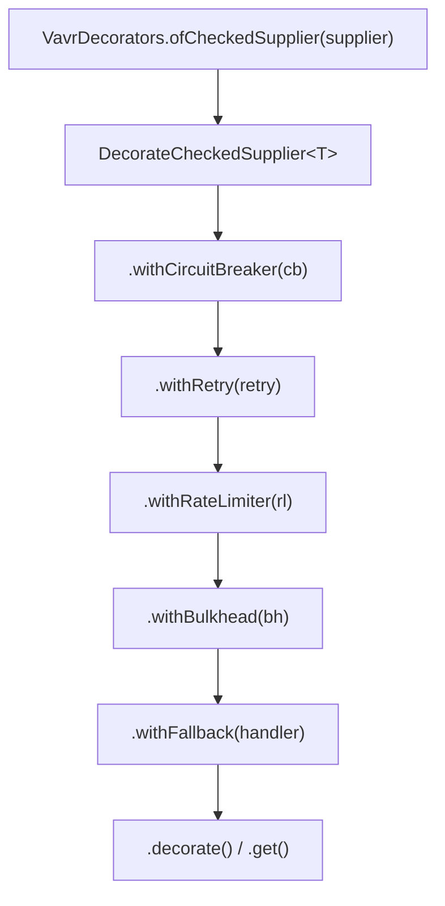
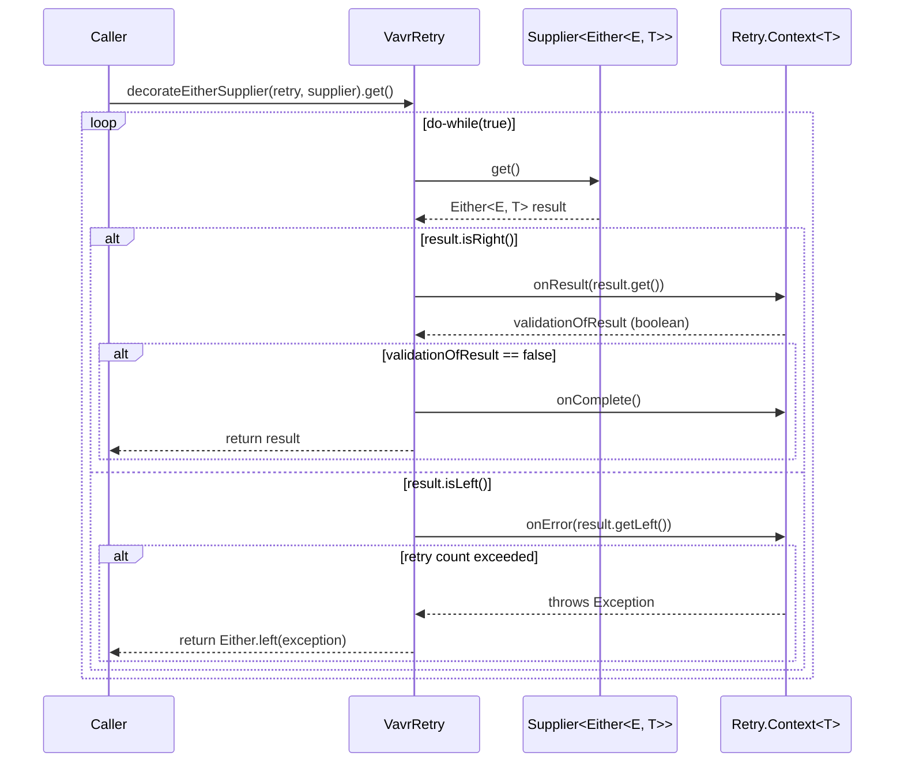

# Vavr Integration

<details>
<summary>Relevant source files</summary>

The following files were used as context for generating this wiki page:

- [resilience4j-all/src/main/java/io/github/resilience4j/decorators/Decorators.java](https://github.com/resilience4j/resilience4j/blob/main/resilience4j-all/src/main/java/io/github/resilience4j/decorators/Decorators.java)
- [README.adoc](https://github.com/resilience4j/resilience4j/blob/main/README.adoc)
- [resilience4j-vavr/src/main/java/io/github/resilience4j/circuitbreaker/VavrCircuitBreaker.java](https://github.com/resilience4j/resilience4j/blob/main/resilience4j-vavr/src/main/java/io/github/resilience4j/circuitbreaker/VavrCircuitBreaker.java)
- [resilience4j-vavr/src/main/java/io/github/resilience4j/ratelimiter/VavrRateLimiter.java](https://github.com/resilience4j/resilience4j/blob/main/resilience4j-vavr/src/main/java/io/github/resilience4j/ratelimiter/VavrRateLimiter.java)
- [resilience4j-vavr/src/main/java/io/github/resilience4j/decorators/VavrDecorators.java](https://github.com/resilience4j/resilience4j/blob/main/resilience4j-vavr/src/main/java/io/github/resilience4j/decorators/VavrDecorators.java)
- [resilience4j-retry/src/main/java/io/github/resilience4j/retry/Retry.java](https://github.com/resilience4j/resilience4j/blob/main/resilience4j-retry/src/main/java/io/github/resilience4j/retry/Retry.java)
- [resilience4j-vavr/src/main/java/io/github/resilience4j/retry/VavrRetry.java](https://github.com/resilience4j/resilience4j/blob/main/resilience4j-vavr/src/main/java/io/github/resilience4j/retry/VavrRetry.java)
- [resilience4j-circuitbreaker/src/main/java/io/github/resilience4j/circuitbreaker/CircuitBreaker.java](https://github.com/resilience4j/resilience4j/blob/main/resilience4j-circuitbreaker/src/main/java/io/github/resilience4j/circuitbreaker/CircuitBreaker.java)
- [resilience4j-vavr/src/main/java/io/github/resilience4j/bulkhead/VavrBulkhead.java](https://github.com/resilience4j/resilience4j/blob/main/resilience4j-vavr/src/main/java/io/github/resilience4j/bulkhead/VavrBulkhead.java)
- [resilience4j-feign/README.adoc](https://github.com/resilience4j/resilience4j/blob/main/resilience4j-feign/README.adoc)
- [resilience4j-vavr/src/main/java/io/github/resilience4j/metrics/VavrTimer.java](https://github.com/resilience4j/resilience4j/blob/main/resilience4j-vavr/src/main/java/io/github/resilience4j/metrics/VavrTimer.java)
- [resilience4j-vavr/src/main/java/io/github/resilience4j/cache/VavrCache.java](https://github.com/resilience4j/resilience4j/blob/main/resilience4j-vavr/src/main/java/io/github/resilience4j/cache/VavrCache.java)
- [resilience4j-ratelimiter/src/main/java/io/github/resilience4j/ratelimiter/RateLimiter.java](https://github.com/resilience4j/resilience4j/blob/main/resilience4j-ratelimiter/src/main/java/io/github/resilience4j/ratelimiter/RateLimiter.java)
- [resilience4j-vavr/src/main/java/io/github/resilience4j/core/VavrCheckedFunctionUtils.java](https://github.com/resilience4j/resilience4j/blob/main/resilience4j-vavr/src/main/java/io/github/resilience4j/core/VavrCheckedFunctionUtils.java)
- [resilience4j-core/src/main/java/io/github/resilience4j/core/CheckedFunctionUtils.java](https://github.com/resilience4j/resilience4j/blob/main/resilience4j-core/src/main/java/io/github/resilience4j/core/CheckedFunctionUtils.java)
</details>

## Overview

The Vavr integration module (`resilience4j-vavr`) provides higher-order function adapters, monadic wrappers, and fluent builder utilities tailored for the Vavr functional programming library. In standard Java applications, fault-tolerance mechanisms often rely on imperative try-catch blocks and explicit runtime exception throwing. However, functional paradigms using Vavr encode control flow and error states directly into monadic types like `Try<T>` and `Either<L, R>`, or checked function types such as `CheckedFunction0<T>`, `CheckedFunction1<T, R>`, and `CheckedRunnable`.

Sources: [resilience4j-vavr/src/main/java/io/github/resilience4j/circuitbreaker/VavrCircuitBreaker.java:20-30](https://github.com/resilience4j/resilience4j/blob/main/resilience4j-vavr/src/main/java/io/github/resilience4j/circuitbreaker/VavrCircuitBreaker.java#L20-L30), [resilience4j-vavr/src/main/java/io/github/resilience4j/decorators/VavrDecorators.java:41-53](https://github.com/resilience4j/resilience4j/blob/main/resilience4j-vavr/src/main/java/io/github/resilience4j/decorators/VavrDecorators.java#L41-L53)

The primary role of the `resilience4j-vavr` module is to allow developers to protect Vavr monads and functional interfaces with Resilience4j aspects—CircuitBreaker, RateLimiter, Bulkhead, Retry, Cache, and Timer—without forcing monads to throw exceptions to trigger resilience state machine transitions. For instance, when a supplier returning an `Either<Exception, T>` or `Try<T>` is decorated with a Vavr CircuitBreaker, failures inside the left projection or failure state of the monad are automatically inspected, recorded as error metrics, and evaluated against failure thresholds. Conversely, when permission is denied (such as when a circuit is open or a bulkhead is full), the decorator captures the rejection and returns an `Either.left(CallNotPermittedException)` or `Try.failure(BulkheadFullException)` directly as a value instead of interrupting thread execution with an uncaught runtime exception.

Sources: [resilience4j-vavr/src/main/java/io/github/resilience4j/circuitbreaker/VavrCircuitBreaker.java:91-140](https://github.com/resilience4j/resilience4j/blob/main/resilience4j-vavr/src/main/java/io/github/resilience4j/circuitbreaker/VavrCircuitBreaker.java#L91-L140), [resilience4j-vavr/src/main/java/io/github/resilience4j/bulkhead/VavrBulkhead.java:77-113](https://github.com/resilience4j/resilience4j/blob/main/resilience4j-vavr/src/main/java/io/github/resilience4j/bulkhead/VavrBulkhead.java#L77-L113)

Architecturally, `resilience4j-vavr` acts as an adapter layer above the core Resilience4j interfaces (`CircuitBreaker`, `RateLimiter`, `Bulkhead`, `Retry`, `Cache`, `Timer`). It contains static utility interfaces (`VavrCircuitBreaker`, `VavrRateLimiter`, `VavrBulkhead`, `VavrRetry`, `VavrCache`, `VavrTimer`, `VavrCheckedFunctionUtils`) and the `VavrDecorators` builder surface. By preserving side-effect isolation and pure function semantics, developers can construct resilient pipelines that seamlessly fit into Vavr monadic chains.

Sources: [resilience4j-vavr/src/main/java/io/github/resilience4j/decorators/VavrDecorators.java:41-53](https://github.com/resilience4j/resilience4j/blob/main/resilience4j-vavr/src/main/java/io/github/resilience4j/decorators/VavrDecorators.java#L41-L53), [resilience4j-vavr/src/main/java/io/github/resilience4j/retry/VavrRetry.java:29-37](https://github.com/resilience4j/resilience4j/blob/main/resilience4j-vavr/src/main/java/io/github/resilience4j/retry/VavrRetry.java#L29-L37)

## Vavr Functional Decorators Builder Surface

### Builder Surface Architecture

The `VavrDecorators` interface provides a fluid builder API for decorating Vavr functional types: `CheckedFunction0<T>` (supplier), `CheckedFunction1<T, R>` (function), and `CheckedRunnable` (runnable). It mirrors the standard `Decorators` builder found in `resilience4j-all`, but operates natively on Vavr types rather than standard Java `Supplier` or `Function`.

Sources: [resilience4j-vavr/src/main/java/io/github/resilience4j/decorators/VavrDecorators.java:41-53](https://github.com/resilience4j/resilience4j/blob/main/resilience4j-vavr/src/main/java/io/github/resilience4j/decorators/VavrDecorators.java#L41-L53), [resilience4j-all/src/main/java/io/github/resilience4j/decorators/Decorators.java:43-85](https://github.com/resilience4j/resilience4j/blob/main/resilience4j-all/src/main/java/io/github/resilience4j/decorators/Decorators.java#L43-L85)



Sources: [resilience4j-vavr/src/main/java/io/github/resilience4j/decorators/VavrDecorators.java:54-123](https://github.com/resilience4j/resilience4j/blob/main/resilience4j-vavr/src/main/java/io/github/resilience4j/decorators/VavrDecorators.java#L54-L123)

### Entry Points and Builder Classes

The entry points create dedicated inner builder instances that encapsulate the functional reference and reassign it as each decorator layer is applied.

Sources: [resilience4j-vavr/src/main/java/io/github/resilience4j/decorators/VavrDecorators.java:41-52](https://github.com/resilience4j/resilience4j/blob/main/resilience4j-vavr/src/main/java/io/github/resilience4j/decorators/VavrDecorators.java#L41-L52)

| Factory Method | Parameter Type | Returned Builder Class | Description |
| :--- | :--- | :--- | :--- |
| `ofCheckedSupplier(supplier)` | `CheckedFunction0<T>` | `DecorateCheckedSupplier<T>` | Wraps a parameterless Vavr checked supplier producing a result of type `T`. |
| `ofCheckedFunction(function)` | `CheckedFunction1<T, R>` | `DecorateCheckedFunction<T, R>` | Wraps a single-argument Vavr checked function mapping `T` to `R`. |
| `ofCheckedRunnable(runnable)` | `CheckedRunnable` | `DecorateCheckedRunnable` | Wraps a parameterless Vavr checked action producing no return value. |

Sources: [resilience4j-vavr/src/main/java/io/github/resilience4j/decorators/VavrDecorators.java:42-52](https://github.com/resilience4j/resilience4j/blob/main/resilience4j-vavr/src/main/java/io/github/resilience4j/decorators/VavrDecorators.java#L42-L52)

### Chaining Mechanics and Execution Sequence

When chaining decorators on `DecorateCheckedSupplier`, each `withX()` method invokes the corresponding static decorator method in `VavrCircuitBreaker`, `VavrRetry`, `VavrRateLimiter`, `VavrBulkhead`, or `VavrCache`, reassigning the internal `supplier` field.

Sources: [resilience4j-vavr/src/main/java/io/github/resilience4j/decorators/VavrDecorators.java:63-90](https://github.com/resilience4j/resilience4j/blob/main/resilience4j-vavr/src/main/java/io/github/resilience4j/decorators/VavrDecorators.java#L63-L90)

The order in which methods are called determines the wrapper nesting. Consider the following chain:

```java
CheckedFunction0<String> supplier = VavrDecorators
    .ofCheckedSupplier(() -> service.call())
    .withCircuitBreaker(circuitBreaker)
    .withRetry(retry)
    .withRateLimiter(rateLimiter)
    .withFallback(throwable -> "Fallback")
    .decorate();
```

Sources: [resilience4j-vavr/src/main/java/io/github/resilience4j/decorators/VavrDecorators.java:63-120](https://github.com/resilience4j/resilience4j/blob/main/resilience4j-vavr/src/main/java/io/github/resilience4j/decorators/VavrDecorators.java#L63-L120)

Because each method wraps the *existing* function reference, the evaluation order when calling `.apply()` or `.get()` is:
`Fallback( RateLimiter( Retry( CircuitBreaker( Supplier ) ) ) )`.

> [!NOTE]
> The last decorator added in the builder chain forms the outermost wrapper around the execution path. For example, applying `.withFallback()` after `.withRetry()` ensures that retries occur before the fallback handler recovers from an exception.

Sources: [resilience4j-vavr/src/main/java/io/github/resilience4j/decorators/VavrDecorators.java:63-120](https://github.com/resilience4j/resilience4j/blob/main/resilience4j-vavr/src/main/java/io/github/resilience4j/decorators/VavrDecorators.java#L63-L120), [resilience4j-all/src/main/java/io/github/resilience4j/decorators/Decorators.java:26-42](https://github.com/resilience4j/resilience4j/blob/main/resilience4j-all/src/main/java/io/github/resilience4j/decorators/Decorators.java#L26-L42)

## Circuit Breaker Vavr Extensions

### Overview

The `VavrCircuitBreaker` interface provides static methods to decorate Vavr functional types (`CheckedFunction0`, `CheckedRunnable`, `CheckedConsumer`, `CheckedFunction1`) as well as monadic return types (`Supplier<Either<E, T>>` and `Supplier<Try<T>>`).

Sources: [resilience4j-vavr/src/main/java/io/github/resilience4j/circuitbreaker/VavrCircuitBreaker.java:30-38](https://github.com/resilience4j/resilience4j/blob/main/resilience4j-vavr/src/main/java/io/github/resilience4j/circuitbreaker/VavrCircuitBreaker.java#L30-L38)

### Checked Functional Decoration

When decorating a `CheckedFunction0<T>`, `VavrCircuitBreaker` acquires permission, measures start time, executes the supplier, and records success or error on the `CircuitBreaker`:

```java
static <T> CheckedFunction0<T> decorateCheckedSupplier(CircuitBreaker circuitBreaker, CheckedFunction0<T> supplier) {
    return () -> {
        circuitBreaker.acquirePermission();
        final long start = circuitBreaker.getCurrentTimestamp();
        try {
            T returnValue = supplier.apply();
            long duration = circuitBreaker.getCurrentTimestamp() - start;
            circuitBreaker.onSuccess(duration, circuitBreaker.getTimestampUnit());
            return returnValue;
        } catch (Exception exception) {
            long duration = circuitBreaker.getCurrentTimestamp() - start;
            circuitBreaker.onError(duration, circuitBreaker.getTimestampUnit(), exception);
            throw exception;
        }
    };
}
```

Sources: [resilience4j-vavr/src/main/java/io/github/resilience4j/circuitbreaker/VavrCircuitBreaker.java:39-56](https://github.com/resilience4j/resilience4j/blob/main/resilience4j-vavr/src/main/java/io/github/resilience4j/circuitbreaker/VavrCircuitBreaker.java#L39-L56)

### Monadic Container Decoration: Try and Either

For Vavr containers like `Either` and `Try`, `VavrCircuitBreaker` uses non-blocking permission checks via `circuitBreaker.tryAcquirePermission()` to avoid throwing runtime exceptions when the circuit is open.

Sources: [resilience4j-vavr/src/main/java/io/github/resilience4j/circuitbreaker/VavrCircuitBreaker.java:91-140](https://github.com/resilience4j/resilience4j/blob/main/resilience4j-vavr/src/main/java/io/github/resilience4j/circuitbreaker/VavrCircuitBreaker.java#L91-L140)

For `Either<Exception, T>` suppliers:

```java
static <T> Supplier<Either<Exception, T>> decorateEitherSupplier(CircuitBreaker circuitBreaker,
                                                                 Supplier<Either<? extends Exception, T>> supplier) {
    return () -> {
        if (circuitBreaker.tryAcquirePermission()) {
            final long start = circuitBreaker.getCurrentTimestamp();
            Either<? extends Exception, T> result = supplier.get();
            long duration = circuitBreaker.getCurrentTimestamp() - start;
            if (result.isRight()) {
                circuitBreaker.onSuccess(duration, circuitBreaker.getTimestampUnit());
            } else {
                Exception exception = result.getLeft();
                circuitBreaker.onError(duration, circuitBreaker.getTimestampUnit(), exception);
            }
            return Either.narrow(result);
        } else {
            return Either.left(
                CallNotPermittedException.createCallNotPermittedException(circuitBreaker));
        }
    };
}
```

Sources: [resilience4j-vavr/src/main/java/io/github/resilience4j/circuitbreaker/VavrCircuitBreaker.java:91-110](https://github.com/resilience4j/resilience4j/blob/main/resilience4j-vavr/src/main/java/io/github/resilience4j/circuitbreaker/VavrCircuitBreaker.java#L91-L110)

For `Try<T>` suppliers:

```java
static <T> Supplier<Try<T>> decorateTrySupplier(CircuitBreaker circuitBreaker,
                                                Supplier<Try<T>> supplier) {
    return () -> {
        if (circuitBreaker.tryAcquirePermission()) {
            final long start = circuitBreaker.getCurrentTimestamp();
            Try<T> result = supplier.get();
            long duration = circuitBreaker.getCurrentTimestamp() - start;
            if (result.isSuccess()) {
                circuitBreaker.onSuccess(duration, circuitBreaker.getTimestampUnit());
                return result;
            } else {
                circuitBreaker.onError(duration, circuitBreaker.getTimestampUnit(), result.getCause());
                return result;
            }
        } else {
            return Try.failure(
                CallNotPermittedException.createCallNotPermittedException(circuitBreaker));
        }
    };
}
```

Sources: [resilience4j-vavr/src/main/java/io/github/resilience4j/circuitbreaker/VavrCircuitBreaker.java:120-140](https://github.com/resilience4j/resilience4j/blob/main/resilience4j-vavr/src/main/java/io/github/resilience4j/circuitbreaker/VavrCircuitBreaker.java#L120-L140)

> [!WARNING]
> In `decorateCheckedSupplier` and `decorateCheckedRunnable`, `java.lang.Error` is intentionally excluded from the `catch (Exception exception)` block. Unhandled `Error` instances propagate without calling `circuitBreaker.onError()`, ensuring JVM system errors do not pollute failure rate metrics.

Sources: [resilience4j-vavr/src/main/java/io/github/resilience4j/circuitbreaker/VavrCircuitBreaker.java:50-51](https://github.com/resilience4j/resilience4j/blob/main/resilience4j-vavr/src/main/java/io/github/resilience4j/circuitbreaker/VavrCircuitBreaker.java#L50-L51), [resilience4j-vavr/src/main/java/io/github/resilience4j/circuitbreaker/VavrCircuitBreaker.java:75-76](https://github.com/resilience4j/resilience4j/blob/main/resilience4j-vavr/src/main/java/io/github/resilience4j/circuitbreaker/VavrCircuitBreaker.java#L75-L76)

### Circuit Breaker Methods Reference

| Method Name | Target Parameter | Return Type | Description |
| :--- | :--- | :--- | :--- |
| `decorateCheckedSupplier` | `CheckedFunction0<T>` | `CheckedFunction0<T>` | Acquires permission, measures duration, records success/error, rethrows exception. |
| `decorateCheckedRunnable` | `CheckedRunnable` | `CheckedRunnable` | Decorates checked runnable with permission checks and execution timing. |
| `decorateEitherSupplier` | `Supplier<Either<? extends Exception, T>>` | `Supplier<Either<Exception, T>>` | Checks `tryAcquirePermission()`, evaluates `isRight()`, maps rejections to `Either.left()`. |
| `decorateTrySupplier` | `Supplier<Try<T>>` | `Supplier<Try<T>>` | Checks `tryAcquirePermission()`, evaluates `isSuccess()`, maps rejections to `Try.failure()`. |
| `decorateCheckedConsumer` | `CheckedConsumer<T>` | `CheckedConsumer<T>` | Decorates a single-argument checked consumer with circuit breaker protection. |
| `decorateCheckedFunction` | `CheckedFunction1<T, R>` | `CheckedFunction1<T, R>` | Decorates a single-argument checked function with timing and error tracking. |
| `executeEitherSupplier` | `Supplier<Either<? extends Exception, T>>` | `Either<Exception, T>` | Decorates and immediately evaluates an `Either` supplier. |
| `executeTrySupplier` | `Supplier<Try<T>>` | `Try<T>` | Decorates and immediately evaluates a `Try` supplier. |
| `executeCheckedSupplier` | `CheckedFunction0<T>` | `T` | Decorates and immediately evaluates a checked supplier. |
| `executeCheckedRunnable` | `CheckedRunnable` | `void` | Decorates and immediately executes a checked runnable. |

Sources: [resilience4j-vavr/src/main/java/io/github/resilience4j/circuitbreaker/VavrCircuitBreaker.java:39-239](https://github.com/resilience4j/resilience4j/blob/main/resilience4j-vavr/src/main/java/io/github/resilience4j/circuitbreaker/VavrCircuitBreaker.java#L39-L239)

## Rate Limiter and Bulkhead Integration

### Overview

The `VavrRateLimiter` and `VavrBulkhead` interfaces adapt rate limiting and bulkhead concurrency limits to Vavr checked functional interfaces and monadic return types (`Try` and `Either`).

Sources: [resilience4j-vavr/src/main/java/io/github/resilience4j/ratelimiter/VavrRateLimiter.java:32-40](https://github.com/resilience4j/resilience4j/blob/main/resilience4j-vavr/src/main/java/io/github/resilience4j/ratelimiter/VavrRateLimiter.java#L32-L40), [resilience4j-vavr/src/main/java/io/github/resilience4j/bulkhead/VavrBulkhead.java:30-38](https://github.com/resilience4j/resilience4j/blob/main/resilience4j-vavr/src/main/java/io/github/resilience4j/bulkhead/VavrBulkhead.java#L30-L38)

### Rate Limiter Adapters

`VavrRateLimiter` wraps execution with `RateLimiter.waitForPermission(rateLimiter, permits)`. If permissions are available, execution proceeds, calling `rateLimiter.onResult()` or `rateLimiter.onSuccess()`. If permission wait fails, a `RequestNotPermitted` exception is thrown or captured into a monad.

Sources: [resilience4j-vavr/src/main/java/io/github/resilience4j/ratelimiter/VavrRateLimiter.java:54-67](https://github.com/resilience4j/resilience4j/blob/main/resilience4j-vavr/src/main/java/io/github/resilience4j/ratelimiter/VavrRateLimiter.java#L54-L67), [resilience4j-vavr/src/main/java/io/github/resilience4j/ratelimiter/VavrRateLimiter.java:169-189](https://github.com/resilience4j/resilience4j/blob/main/resilience4j-vavr/src/main/java/io/github/resilience4j/ratelimiter/VavrRateLimiter.java#L169-L189)

```java
static <T> Supplier<Try<T>> decorateTrySupplier(RateLimiter rateLimiter, int permits, Supplier<Try<T>> supplier) {
    return () -> {
        try {
            waitForPermission(rateLimiter, permits);
            try {
                Try<T> result = supplier.get();
                if (result.isSuccess()) {
                    rateLimiter.onResult(result.get());
                } else {
                    rateLimiter.onError(result.getCause());
                }
                return result;
            } catch (Exception exception) {
                rateLimiter.onError(exception);
                throw exception;
            }
        } catch (RequestNotPermitted requestNotPermitted) {
            return Try.failure(requestNotPermitted);
        }
    };
}
```

Sources: [resilience4j-vavr/src/main/java/io/github/resilience4j/ratelimiter/VavrRateLimiter.java:169-189](https://github.com/resilience4j/resilience4j/blob/main/resilience4j-vavr/src/main/java/io/github/resilience4j/ratelimiter/VavrRateLimiter.java#L169-L189)

### Bulkhead Adapters

`VavrBulkhead` uses `bulkhead.acquirePermission()` for checked suppliers and functions, ensuring `bulkhead.onComplete()` is called in a `finally` block. For `Try` and `Either` suppliers, `VavrBulkhead` uses `bulkhead.tryAcquirePermission()`:

Sources: [resilience4j-vavr/src/main/java/io/github/resilience4j/bulkhead/VavrBulkhead.java:39-49](https://github.com/resilience4j/resilience4j/blob/main/resilience4j-vavr/src/main/java/io/github/resilience4j/bulkhead/VavrBulkhead.java#L39-L49), [resilience4j-vavr/src/main/java/io/github/resilience4j/bulkhead/VavrBulkhead.java:77-89](https://github.com/resilience4j/resilience4j/blob/main/resilience4j-vavr/src/main/java/io/github/resilience4j/bulkhead/VavrBulkhead.java#L77-L89)

```java
static <T> Supplier<Try<T>> decorateTrySupplier(Bulkhead bulkhead, Supplier<Try<T>> supplier) {
    return () -> {
        if (bulkhead.tryAcquirePermission()) {
            try {
                return supplier.get();
            } finally {
                bulkhead.onComplete();
            }
        } else {
            return Try.failure(BulkheadFullException.createBulkheadFullException(bulkhead));
        }
    };
}
```

Sources: [resilience4j-vavr/src/main/java/io/github/resilience4j/bulkhead/VavrBulkhead.java:77-89](https://github.com/resilience4j/resilience4j/blob/main/resilience4j-vavr/src/main/java/io/github/resilience4j/bulkhead/VavrBulkhead.java#L77-L89)

> [!IMPORTANT]
> `VavrBulkhead.decorateTrySupplier` and `decorateEitherSupplier` ALWAYS invoke `bulkhead.onComplete()` in a `finally` block when `tryAcquirePermission()` succeeds, guaranteeing that concurrent permit counts are decremented even if `supplier.get()` throws an unhandled exception.

Sources: [resilience4j-vavr/src/main/java/io/github/resilience4j/bulkhead/VavrBulkhead.java:80-84](https://github.com/resilience4j/resilience4j/blob/main/resilience4j-vavr/src/main/java/io/github/resilience4j/bulkhead/VavrBulkhead.java#L80-L84), [resilience4j-vavr/src/main/java/io/github/resilience4j/bulkhead/VavrBulkhead.java:102-108](https://github.com/resilience4j/resilience4j/blob/main/resilience4j-vavr/src/main/java/io/github/resilience4j/bulkhead/VavrBulkhead.java#L102-L108)

### RateLimiter and Bulkhead Method Surface

| Class | Method Name | Return Type | Failure / Rejection Behavior |
| :--- | :--- | :--- | :--- |
| `VavrRateLimiter` | `decorateCheckedSupplier` | `CheckedFunction0<T>` | Throws `RequestNotPermitted` if permit wait fails. |
| `VavrRateLimiter` | `decorateTrySupplier` | `Supplier<Try<T>>` | Returns `Try.failure(RequestNotPermitted)`. |
| `VavrRateLimiter` | `decorateEitherSupplier` | `Supplier<Either<Exception, T>>` | Returns `Either.left(RequestNotPermitted)`. |
| `VavrBulkhead` | `decorateCheckedSupplier` | `CheckedFunction0<T>` | Throws `BulkheadFullException` if execution slots are full. |
| `VavrBulkhead` | `decorateTrySupplier` | `Supplier<Try<T>>` | Returns `Try.failure(BulkheadFullException)`. |
| `VavrBulkhead` | `decorateEitherSupplier` | `Supplier<Either<Exception, T>>` | Returns `Either.left(BulkheadFullException)`. |

Sources: [resilience4j-vavr/src/main/java/io/github/resilience4j/ratelimiter/VavrRateLimiter.java:54-234](https://github.com/resilience4j/resilience4j/blob/main/resilience4j-vavr/src/main/java/io/github/resilience4j/ratelimiter/VavrRateLimiter.java#L54-L234), [resilience4j-vavr/src/main/java/io/github/resilience4j/bulkhead/VavrBulkhead.java:39-113](https://github.com/resilience4j/resilience4j/blob/main/resilience4j-vavr/src/main/java/io/github/resilience4j/bulkhead/VavrBulkhead.java#L39-L113)

## Retry Mechanisms for Vavr Monads

### Monadic Retry Mechanics

The `VavrRetry` interface decorates Vavr checked functions, `Either` suppliers, and `Try` suppliers with automatic retry loops driven by `Retry.Context<T>`.

Sources: [resilience4j-vavr/src/main/java/io/github/resilience4j/retry/VavrRetry.java:29-37](https://github.com/resilience4j/resilience4j/blob/main/resilience4j-vavr/src/main/java/io/github/resilience4j/retry/VavrRetry.java#L29-L37)

### Call-Chain Execution Walkthrough

The trace below illustrates the verified call sequence for retrying an `Either` supplier (`decorateEitherSupplier` → `onResult` → `onComplete`):



Sources: [resilience4j-vavr/src/main/java/io/github/resilience4j/retry/VavrRetry.java:114-137](https://github.com/resilience4j/resilience4j/blob/main/resilience4j-vavr/src/main/java/io/github/resilience4j/retry/VavrRetry.java#L114-L137), [resilience4j-retry/src/main/java/io/github/resilience4j/retry/Retry.java:741-754](https://github.com/resilience4j/resilience4j/blob/main/resilience4j-retry/src/main/java/io/github/resilience4j/retry/Retry.java#L741-L754), [resilience4j-retry/src/main/java/io/github/resilience4j/retry/Retry.java:648](https://github.com/resilience4j/resilience4j/blob/main/resilience4j-retry/src/main/java/io/github/resilience4j/retry/Retry.java#L648)

Detailed step-by-step control flow:

1. **`decorateEitherSupplier` (step 1)**: `VavrRetry.decorateEitherSupplier` creates a supplier enclosing a `do-while(true)` loop and initializes `Retry.Context<T> context = retry.context()`.

   Sources: [resilience4j-vavr/src/main/java/io/github/resilience4j/retry/VavrRetry.java:114-119](https://github.com/resilience4j/resilience4j/blob/main/resilience4j-vavr/src/main/java/io/github/resilience4j/retry/VavrRetry.java#L114-L119)

2. **Supplier Execution & Result Check**: `supplier.get()` returns an `Either<E, T>`. If `result.isRight()`, the inner value `result.get()` is passed to `context.onResult(result.get())`.

   Sources: [resilience4j-vavr/src/main/java/io/github/resilience4j/retry/VavrRetry.java:120-122](https://github.com/resilience4j/resilience4j/blob/main/resilience4j-vavr/src/main/java/io/github/resilience4j/retry/VavrRetry.java#L120-L122)

3. **`onResult` (step 2)**: `context.onResult(...)` validates whether the returned result matches a configured result predicate requiring a retry. If `validationOfResult` is `false` (meaning the result is acceptable and no retry is needed), `context.onComplete()` is called.

   Sources: [resilience4j-vavr/src/main/java/io/github/resilience4j/retry/VavrRetry.java:122-126](https://github.com/resilience4j/resilience4j/blob/main/resilience4j-vavr/src/main/java/io/github/resilience4j/retry/VavrRetry.java#L122-L126), [resilience4j-retry/src/main/java/io/github/resilience4j/retry/Retry.java:741-754](https://github.com/resilience4j/resilience4j/blob/main/resilience4j-retry/src/main/java/io/github/resilience4j/retry/Retry.java#L741-L754)

4. **`onComplete` (step 3)**: `context.onComplete()` completes the retry context metrics recording, and the successful `Either` instance is returned to the caller.

   Sources: [resilience4j-vavr/src/main/java/io/github/resilience4j/retry/VavrRetry.java:124-126](https://github.com/resilience4j/resilience4j/blob/main/resilience4j-vavr/src/main/java/io/github/resilience4j/retry/VavrRetry.java#L124-L126), [resilience4j-retry/src/main/java/io/github/resilience4j/retry/Retry.java:648](https://github.com/resilience4j/resilience4j/blob/main/resilience4j-retry/src/main/java/io/github/resilience4j/retry/Retry.java#L648)

5. **Error Branch**: If `result.isLeft()`, `context.onError(result.getLeft())` is called. If the max retry count is reached, `context.onError` throws an exception, caught inside the decorator to return `Either.left(exception)`.

   Sources: [resilience4j-vavr/src/main/java/io/github/resilience4j/retry/VavrRetry.java:127-135](https://github.com/resilience4j/resilience4j/blob/main/resilience4j-vavr/src/main/java/io/github/resilience4j/retry/VavrRetry.java#L127-L135)

> [!CAUTION]
> In `VavrRetry.decorateTrySupplier`, non-`Exception` cause types (such as `java.lang.Error`) directly bypass `context.onError(...)` and return the failed `Try` immediately without retrying.

Sources: [resilience4j-vavr/src/main/java/io/github/resilience4j/retry/VavrRetry.java:159-168](https://github.com/resilience4j/resilience4j/blob/main/resilience4j-vavr/src/main/java/io/github/resilience4j/retry/VavrRetry.java#L159-L168)

### Monadic Retry Methods Reference

| Method Name | Input Parameter | Return Type | Description |
| :--- | :--- | :--- | :--- |
| `decorateCheckedSupplier` | `CheckedFunction0<T>` | `CheckedFunction0<T>` | Retries checked supplier on exception until `onResult` or `onError` completes. |
| `decorateCheckedRunnable` | `CheckedRunnable` | `CheckedRunnable` | Retries checked runnable on exception until success or max attempts. |
| `decorateCheckedFunction` | `CheckedFunction1<T, R>` | `CheckedFunction1<T, R>` | Retries checked function for input argument `t`. |
| `decorateEitherSupplier` | `Supplier<Either<E, T>>` | `Supplier<Either<E, T>>` | Retries supplier producing `Either` on left values or invalid right results. |
| `decorateTrySupplier` | `Supplier<Try<T>>` | `Supplier<Try<T>>` | Retries supplier producing `Try` on failure causes or invalid success results. |

Sources: [resilience4j-vavr/src/main/java/io/github/resilience4j/retry/VavrRetry.java:38-172](https://github.com/resilience4j/resilience4j/blob/main/resilience4j-vavr/src/main/java/io/github/resilience4j/retry/VavrRetry.java#L38-L172)

## Vavr Functional Utilities and Metrics

### Utility and Metrics Helper Surface

The `resilience4j-vavr` module includes functional utilities (`VavrCheckedFunctionUtils`), caching adapters (`VavrCache`), and timing adapters (`VavrTimer`).

Sources: [resilience4j-vavr/src/main/java/io/github/resilience4j/core/VavrCheckedFunctionUtils.java:29-32](https://github.com/resilience4j/resilience4j/blob/main/resilience4j-vavr/src/main/java/io/github/resilience4j/core/VavrCheckedFunctionUtils.java#L29-L32), [resilience4j-vavr/src/main/java/io/github/resilience4j/cache/VavrCache.java:26-30](https://github.com/resilience4j/resilience4j/blob/main/resilience4j-vavr/src/main/java/io/github/resilience4j/cache/VavrCache.java#L26-L30), [resilience4j-vavr/src/main/java/io/github/resilience4j/metrics/VavrTimer.java:25-30](https://github.com/resilience4j/resilience4j/blob/main/resilience4j-vavr/src/main/java/io/github/resilience4j/metrics/VavrTimer.java#L25-L30)

### VavrCheckedFunctionUtils Recovery Functions

`VavrCheckedFunctionUtils` provides static helper methods to attach exception recovery handlers and result predicates to Vavr `CheckedFunction0` suppliers:

Sources: [resilience4j-vavr/src/main/java/io/github/resilience4j/core/VavrCheckedFunctionUtils.java:44-146](https://github.com/resilience4j/resilience4j/blob/main/resilience4j-vavr/src/main/java/io/github/resilience4j/core/VavrCheckedFunctionUtils.java#L44-L146)

- `recover(function, exceptionHandler)`: Catches any `Throwable` and passes it to a `CheckedFunction1<Throwable, T>`.

  Sources: [resilience4j-vavr/src/main/java/io/github/resilience4j/core/VavrCheckedFunctionUtils.java:44-53](https://github.com/resilience4j/resilience4j/blob/main/resilience4j-vavr/src/main/java/io/github/resilience4j/core/VavrCheckedFunctionUtils.java#L44-L53)

- `andThen(function, handler)`: Applies `CheckedFunction2<T, Throwable, R> handler` to `(result, null)` on success, or `(null, throwable)` on exception.

  Sources: [resilience4j-vavr/src/main/java/io/github/resilience4j/core/VavrCheckedFunctionUtils.java:65-74](https://github.com/resilience4j/resilience4j/blob/main/resilience4j-vavr/src/main/java/io/github/resilience4j/core/VavrCheckedFunctionUtils.java#L65-L74)

- `recover(function, resultPredicate, resultHandler)`: Evaluates `resultPredicate.test(result)` on a successful return. If `true`, applies `resultHandler.apply(result)`.

  Sources: [resilience4j-vavr/src/main/java/io/github/resilience4j/core/VavrCheckedFunctionUtils.java:85-94](https://github.com/resilience4j/resilience4j/blob/main/resilience4j-vavr/src/main/java/io/github/resilience4j/core/VavrCheckedFunctionUtils.java#L85-L94)

- `recover(function, exceptionTypes, exceptionHandler)`: Filters exceptions by checking if any class in `List<Class<? extends Throwable>>` is assignable from the caught exception class using `exceptionType.isAssignableFrom(exception.getClass())`.

  Sources: [resilience4j-vavr/src/main/java/io/github/resilience4j/core/VavrCheckedFunctionUtils.java:106-120](https://github.com/resilience4j/resilience4j/blob/main/resilience4j-vavr/src/main/java/io/github/resilience4j/core/VavrCheckedFunctionUtils.java#L106-L120)

### Cache and Timer Adapters

`VavrCache` converts a `Cache<K, R>` and a `CheckedFunction0<R>` or `Callable<R>` into a `CheckedFunction1<K, R>` key-lookup function:

Sources: [resilience4j-vavr/src/main/java/io/github/resilience4j/cache/VavrCache.java:38-55](https://github.com/resilience4j/resilience4j/blob/main/resilience4j-vavr/src/main/java/io/github/resilience4j/cache/VavrCache.java#L38-L55)

```java
static <K, R> CheckedFunction1<K, R> decorateCheckedSupplier(Cache<K, R> cache, CheckedFunction0<R> supplier) {
    return (K cacheKey) -> cache.computeIfAbsent(cacheKey, supplier::apply);
}
```

Sources: [resilience4j-vavr/src/main/java/io/github/resilience4j/cache/VavrCache.java:38-41](https://github.com/resilience4j/resilience4j/blob/main/resilience4j-vavr/src/main/java/io/github/resilience4j/cache/VavrCache.java#L38-L41)

`VavrTimer` decorates Vavr checked suppliers, runnables, and functions with timing metric context hooks (`Timer.Context`):

Sources: [resilience4j-vavr/src/main/java/io/github/resilience4j/metrics/VavrTimer.java:34-90](https://github.com/resilience4j/resilience4j/blob/main/resilience4j-vavr/src/main/java/io/github/resilience4j/metrics/VavrTimer.java#L34-L90)

```java
static <T> CheckedFunction0<T> decorateCheckedSupplier(Timer timer, CheckedFunction0<T> supplier) {
    return () -> {
        final Timer.Context context = timer.context();
        try {
            T returnValue = supplier.apply();
            context.onSuccess();
            return returnValue;
        } catch (Throwable e) {
            context.onError();
            throw e;
        }
    };
}
```

Sources: [resilience4j-vavr/src/main/java/io/github/resilience4j/metrics/VavrTimer.java:34-47](https://github.com/resilience4j/resilience4j/blob/main/resilience4j-vavr/src/main/java/io/github/resilience4j/metrics/VavrTimer.java#L34-L47)

## Design Trade-Offs and Invariants

### Architectural Trade-Offs

The design decisions in `resilience4j-vavr` balance functional immutability and side-effect isolation against execution overhead and exception unwrapping.

| Design Choice | Benefit | Cost / Trade-off |
| :--- | :--- | :--- |
| **Value-Based Rejection via Monads** (`Either.left`, `Try.failure`) | Prevents costly stack-trace generation and thread interruption when permissions are denied. | Callers must unwrap monadic containers to detect resilience rejections (`CallNotPermittedException`). |
| **Non-blocking Permission Checks** (`tryAcquirePermission`) for monads | Guarantees instant return without blocking threads when a CircuitBreaker or Bulkhead is saturated. | Cannot wait for permissions in queue; immediately converts saturation to a left or failure projection. |
| **Wrapper Re-Assignment in Builder** (`VavrDecorators`) | Flexible fluent API allowing arbitrary decorator stacking. | Reallocates intermediate wrapper functions for every added aspect in the builder chain. |
| **Type Narrowing for Either** (`Either.narrow(result)`) | Retains exact generic error types declared on supplier interface signatures. | Requires casting via Vavr's internal `Either.narrow` helper. |

Sources: [resilience4j-vavr/src/main/java/io/github/resilience4j/circuitbreaker/VavrCircuitBreaker.java:91-140](https://github.com/resilience4j/resilience4j/blob/main/resilience4j-vavr/src/main/java/io/github/resilience4j/circuitbreaker/VavrCircuitBreaker.java#L91-L140), [resilience4j-vavr/src/main/java/io/github/resilience4j/bulkhead/VavrBulkhead.java:77-113](https://github.com/resilience4j/resilience4j/blob/main/resilience4j-vavr/src/main/java/io/github/resilience4j/bulkhead/VavrBulkhead.java#L77-L113), [resilience4j-vavr/src/main/java/io/github/resilience4j/decorators/VavrDecorators.java:54-123](https://github.com/resilience4j/resilience4j/blob/main/resilience4j-vavr/src/main/java/io/github/resilience4j/decorators/VavrDecorators.java#L54-L123)

### System Invariants

> [!NOTE]
> **Monadic Error Inspection Invariant**: When decorating `Supplier<Try<T>>` or `Supplier<Either<E, T>>` with `VavrCircuitBreaker` or `VavrRateLimiter`, the decorator inspects the *returned container value*. If a `Try` is `isFailure()` or an `Either` is `isLeft()`, `onError()` is invoked on the aspect state machine even though no Java exception was thrown out of the supplier method.

Sources: [resilience4j-vavr/src/main/java/io/github/resilience4j/circuitbreaker/VavrCircuitBreaker.java:100-103](https://github.com/resilience4j/resilience4j/blob/main/resilience4j-vavr/src/main/java/io/github/resilience4j/circuitbreaker/VavrCircuitBreaker.java#L100-L103), [resilience4j-vavr/src/main/java/io/github/resilience4j/circuitbreaker/VavrCircuitBreaker.java:131-133](https://github.com/resilience4j/resilience4j/blob/main/resilience4j-vavr/src/main/java/io/github/resilience4j/circuitbreaker/VavrCircuitBreaker.java#L131-L133)

> [!WARNING]
> **Bulkhead Completion Invariant**: Every call to `bulkhead.tryAcquirePermission()` or `bulkhead.acquirePermission()` inside `VavrBulkhead` MUST be paired with `bulkhead.onComplete()` in a `finally` block to release the semaphore permit or execution slot.

Sources: [resilience4j-vavr/src/main/java/io/github/resilience4j/bulkhead/VavrBulkhead.java:43-47](https://github.com/resilience4j/resilience4j/blob/main/resilience4j-vavr/src/main/java/io/github/resilience4j/bulkhead/VavrBulkhead.java#L43-L47), [resilience4j-vavr/src/main/java/io/github/resilience4j/bulkhead/VavrBulkhead.java:80-84](https://github.com/resilience4j/resilience4j/blob/main/resilience4j-vavr/src/main/java/io/github/resilience4j/bulkhead/VavrBulkhead.java#L80-L84)

## Full Worked Example

The executable example below demonstrates configuring a remote backend call protected by a `CircuitBreaker`, `Retry`, and `RateLimiter` using `VavrDecorators` and Vavr's `Try` monad for fallback recovery:

```java
package io.github.resilience4j.examples;

import io.github.resilience4j.circuitbreaker.CircuitBreaker;
import io.github.resilience4j.ratelimiter.RateLimiter;
import io.github.resilience4j.retry.Retry;
import io.github.resilience4j.vavr.decorators.VavrDecorators;
import io.vavr.CheckedFunction0;
import io.vavr.control.Try;

public class VavrIntegrationExample {

    public interface RemoteBackendService {
        String executeCall(String param) throws Exception;
    }

    public static void main(String[] args) {
        RemoteBackendService service = p -> {
            if ("error".equals(p)) {
                throw new RuntimeException("Remote call failed");
            }
            return "Success: " + p;
        };

        CircuitBreaker circuitBreaker = CircuitBreaker.ofDefaults("backendService");
        Retry retry = Retry.ofDefaults("backendService");
        RateLimiter rateLimiter = RateLimiter.ofDefaults("
```

## Related

- [[Decorator Chains]]

