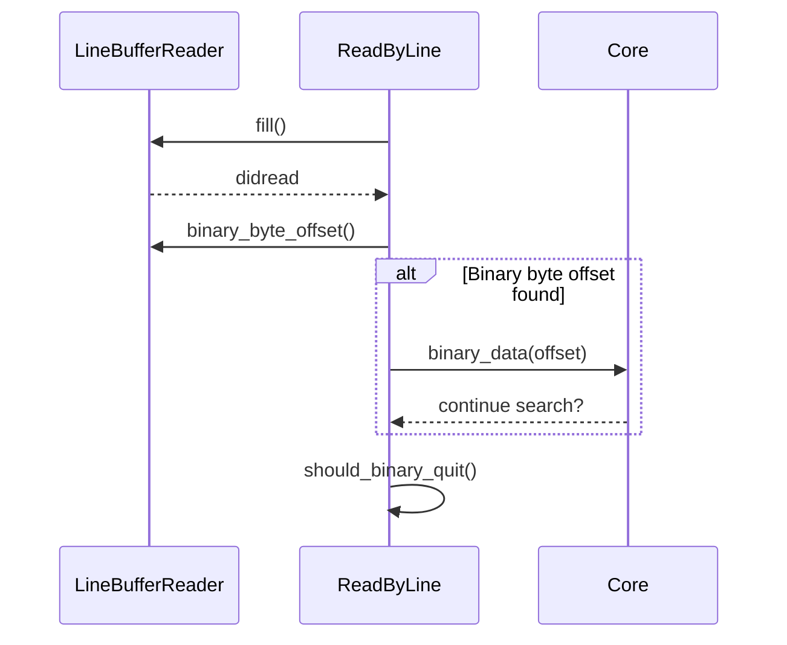

# File Search Core

<details>
<summary>Relevant source files</summary>

The following files were used as context for generating this wiki page:

- [crates/searcher/src/searcher/glue.rs](https://github.com/BurntSushi/ripgrep/blob/main/crates/searcher/src/searcher/glue.rs)
- [crates/printer/src/standard.rs](https://github.com/BurntSushi/ripgrep/blob/main/crates/printer/src/standard.rs)
- [crates/core/search.rs](https://github.com/BurntSushi/ripgrep/blob/main/crates/core/search.rs)
</details>

## Overview

File search core components coordinate pattern matchers, line readers, preprocessors, and decompression workers to execute searches across file streams and memory buffers.
Sources: [crates/core/search.rs:1-8](https://github.com/BurntSushi/ripgrep/blob/main/crates/core/search.rs#L1-L8)

The search core handles low-level matching logic over byte streams, managing line iteration, buffer rolling, slicing, and binary content detection policies.
Sources: [crates/searcher/src/searcher/glue.rs:1-94](https://github.com/BurntSushi/ripgrep/blob/main/crates/searcher/src/searcher/glue.rs#L1-L94)

Output sinking and formatting integrate match locations, line contexts, absolute byte offsets, path separators, and ANSI color highlights into configurable streams.
Sources: [crates/printer/src/standard.rs:1-30](https://github.com/BurntSushi/ripgrep/blob/main/crates/printer/src/standard.rs#L1-L30)

## High Level Search Worker Orchestration

### Overview

The high-level search worker orchestration manages the execution boundary between matchers, searchers, printers, preprocessors, and decompression workers in `crates/core/search.rs`. A `SearchWorker` instance coordinates how data is read from paths and fed into search routines while applying configuration policies such as zip decompression and external command preprocessing.
Sources: [crates/core/search.rs:1-8](https://github.com/BurntSushi/ripgrep/blob/main/crates/core/search.rs#L1-L8)

### Configuration and Builder

The `SearchWorkerBuilder` constructs `SearchWorker` instances using a `Config` structure and builders for command execution. The configuration manages preprocessors, preprocessor globs, zip searching, and binary detection rules for implicit and explicit paths.
Sources: [crates/core/search.rs:14-45](https://github.com/BurntSushi/ripgrep/blob/main/crates/core/search.rs#L14-L45)

| Field / Method | Type | Default | Purpose |
| :--- | :--- | :--- | :--- |
| `preprocessor` | `OptionathBuf>` | `None` | Path to an external command run on matching files instead of direct reading. |
| `preprocessor_globs` | `ignore::overrides::Override` | Empty | Globs determining which files are routed through the preprocessor. |
| `search_zip` | `bool` | `false` | Enables decompression and searching of common compressed archive files. |
| `binary_implicit` | `grep::searcher::BinaryDetection` | None | Binary detection policy for files discovered via recursive directory walks. |
| `binary_explicit` | `grep::searcher::BinaryDetection` | None | Binary detection policy for files explicitly supplied by the user. |
Sources: [crates/core/search.rs:19-35](https://github.com/BurntSushi/ripgrep/blob/main/crates/core/search.rs#L19-L35)

> [!NOTE]
> If a preprocessor command is explicitly configured via `SearchWorkerBuilder::preprocessor`, it takes precedence and overrides the `search_zip` decompression setting entirely.
> Sources: [crates/core/search.rs:120-122](https://github.com/BurntSushi/ripgrep/blob/main/crates/core/search.rs#L120-L122)

## Byte Stream Matching and Line Iteration

### Overview

Low-level search execution over byte streams is handled by core driver structures in `crates/searcher/src/searcher/glue.rs`. These drivers coordinate buffering, line iteration, boundary slicing, and multi-line matching logic by interfacing directly with matchers, line buffers, and output sinks.
Sources: [crates/searcher/src/searcher/glue.rs:10-148](https://github.com/BurntSushi/ripgrep/blob/main/crates/searcher/src/searcher/glue.rs#L10-L148)

### Search Driver Structures

The searcher engine implements three distinct low-level drivers depending on the input stream type and whether multi-line matching is enabled. Each driver wraps a core search instance and manages state transitions over the underlying data.
Sources: [crates/searcher/src/searcher/glue.rs:10-148](https://github.com/BurntSushi/ripgrep/blob/main/crates/searcher/src/searcher/glue.rs#L10-L148)

| Struct Name | Generic Parameters | Purpose | Sources |
| :--- | :--- | :--- | :--- |
| `ReadByLine` | `'s, M, R, S` | Executes single-line searching over a buffered `std::io::Read` stream. | [crates/searcher/src/searcher/glue.rs:10-15](https://github.com/BurntSushi/ripgrep/blob/main/crates/searcher/src/searcher/glue.rs#L10-L15) |
| `SliceByLine` | `'s, M, S` | Executes single-line searching over an in-memory `&[u8]` slice. | [crates/searcher/src/searcher/glue.rs:96-100](https://github.com/BurntSushi/ripgrep/blob/main/crates/searcher/src/searcher/glue.rs#L96-L100) |
| `MultiLine` | `'s, M, S` | Executes multi-line regex matching over an in-memory `&[u8]` slice. | [crates/searcher/src/searcher/glue.rs:141-147](https://github.com/BurntSushi/ripgrep/blob/main/crates/searcher/src/searcher/glue.rs#L141-L147) |

### Call-Chain Execution Walkthrough

The execution flow for streaming line-buffered searches follows a precise lifecycle managed internally by `ReadByLine`:

1. `self.core.begin()?` initializes the search session and emits initial state.
   Sources: [crates/searcher/src/searcher/glue.rs:38-39](https://github.com/BurntSushi/ripgrep/blob/main/crates/searcher/src/searcher/glue.rs#L38-L39)
2. Buffer filling rolls the internal buffer, consumes processed bytes, fills new data from the underlying reader, checks for binary byte offsets, and verifies whether the search should quit.
   Sources: [crates/searcher/src/searcher/glue.rs:40-40](https://github.com/BurntSushi/ripgrep/blob/main/crates/searcher/src/searcher/glue.rs#L40-L40), [crates/searcher/src/searcher/glue.rs:58-88](https://github.com/BurntSushi/ripgrep/blob/main/crates/searcher/src/searcher/glue.rs#L58-L88)
3. `self.core.match_by_line(self.rdr.buffer())?` scans the current buffer slice line by line for matches.
   Sources: [crates/searcher/src/searcher/glue.rs:41-41](https://github.com/BurntSushi/ripgrep/blob/main/crates/searcher/src/searcher/glue.rs#L41-L41)
4. If matching stops early, `self.consume_remaining()` advances the reader position via `self.core.pos()`.
   Sources: [crates/searcher/src/searcher/glue.rs:41-44](https://github.com/BurntSushi/ripgrep/blob/main/crates/searcher/src/searcher/glue.rs#L41-L44), [crates/searcher/src/searcher/glue.rs:53-56](https://github.com/BurntSushi/ripgrep/blob/main/crates/searcher/src/searcher/glue.rs#L53-L56)
5. `self.core.finish(...)` concludes execution with final absolute and binary byte offsets.
   Sources: [crates/searcher/src/searcher/glue.rs:47-51](https://github.com/BurntSushi/ripgrep/blob/main/crates/searcher/src/searcher/glue.rs#L47-L51)

> [!NOTE]
> In `MultiLine`, adjacent matches that start and end on the same line are delayed and grouped into a single sink event via `last_match` to ensure that a single line is never sinked more than once.
> Sources: [crates/searcher/src/searcher/glue.rs:221-226](https://github.com/BurntSushi/ripgrep/blob/main/crates/searcher/src/searcher/glue.rs#L221-L226)

### Sinking and Inverted Matching

For multi-line slices, internal methods on `MultiLine` handle finding matches, advancing slice offsets, and delaying sink notifications. When `invert_match` is configured, inverted matching locates non-matching regions and steps through them line-by-line using `LineStep`.
Sources: [crates/searcher/src/searcher/glue.rs:208-297](https://github.com/BurntSushi/ripgrep/blob/main/crates/searcher/src/searcher/glue.rs#L208-L297)

| Method Name | Return Type | Purpose | Sources |
| :--- | :--- | :--- | :--- |
| `ReadByLine` struct helper methods | `Result<bool, S::Error>` | Drives stream reader search execution loop and buffer management. | [crates/searcher/src/searcher/glue.rs:38-51](https://github.com/BurntSushi/ripgrep/blob/main/crates/searcher/src/searcher/glue.rs#L38-L51) |
| `SliceByLine` struct helper methods | `Result<(), S::Error>` | Drives in-memory slice search execution loop. | [crates/searcher/src/searcher/glue.rs:117-131](https://github.com/BurntSushi/ripgrep/blob/main/crates/searcher/src/searcher/glue.rs#L117-L131) |
| `MultiLine` struct helper methods | `Result<(), S::Error>` | Drives multi-line slice search execution loop. | [crates/searcher/src/searcher/glue.rs:166-206](https://github.com/BurntSushi/ripgrep/blob/main/crates/searcher/src/searcher/glue.rs#L166-L206) |
| `MultiLine` sink functions | `Result<bool, S::Error>` | Discovers multi-line matches, groups adjacent matches, and dispatches context or matched output. | [crates/searcher/src/searcher/glue.rs:208-258](https://github.com/BurntSushi/ripgrep/blob/main/crates/searcher/src/searcher/glue.rs#L208-L258) |
| `MultiLine` inverted matching | `Result<bool, S::Error>` | Computes inverted match regions and iterates line-by-line over non-matches. | [crates/searcher/src/searcher/glue.rs:260-297](https://github.com/BurntSushi/ripgrep/blob/main/crates/searcher/src/searcher/glue.rs#L260-L297) |

> [!WARNING]
> Zero-width matches require special advancement handling: if a match is empty, `advance` increments the search position by one byte past the end of the match to prevent infinite loops, provided it has not reached the end of the slice.
> Sources: [crates/searcher/src/searcher/glue.rs:333-343](https://github.com/BurntSushi/ripgrep/blob/main/crates/searcher/src/searcher/glue.rs#L333-L343)

## Binary Data Detection and Quitting

### Overview

During search execution, ripgrep inspects input streams for binary content to implement quit policies or bypass binary files. Binary detection behavior varies depending on whether the search is performed line-by-line via buffered readers or across in-memory slices.
Sources: [crates/searcher/src/searcher/glue.rs:69-75](https://github.com/BurntSushi/ripgrep/blob/main/crates/searcher/src/searcher/glue.rs#L69-L75), [crates/searcher/src/searcher/glue.rs:736-745](https://github.com/BurntSushi/ripgrep/blob/main/crates/searcher/src/searcher/glue.rs#L736-L745)

### Detection and Quit Flow

For `ReadByLine` streams, buffer filling invokes `self.rdr.binary_byte_offset()`. If binary data is detected and not already recorded, `self.core.binary_data(offset)?` is called.
Sources: [crates/searcher/src/searcher/glue.rs:69-75](https://github.com/BurntSushi/ripgrep/blob/main/crates/searcher/src/searcher/glue.rs#L69-L75)


Sources: [crates/searcher/src/searcher/glue.rs:58-94](https://github.com/BurntSushi/ripgrep/blob/main/crates/searcher/src/searcher/glue.rs#L58-L94)

The decision to quit immediately upon encountering binary data is governed by binary quit helpers:
```rust
fn should_binary_quit(&self) -> bool {
    self.rdr.binary_byte_offset().is_some()
        && self.config.binary.quit_byte().is_some()
}
```
Sources: [crates/searcher/src/searcher/glue.rs:90-94](https://github.com/BurntSushi/ripgrep/blob/main/crates/searcher/src/searcher/glue.rs#L90-L94)

> [!NOTE]
> `ReadByLine` checks for binary data in every buffer refill before searching, whereas slice readers (`SliceByLine` and `MultiLine`) restrict initial binary detection to the first chunk bounded by `DEFAULT_BUFFER_CAPACITY`, subsequently checking only within matches.
> Sources: [crates/searcher/src/searcher/glue.rs:119-122](https://github.com/BurntSushi/ripgrep/blob/main/crates/searcher/src/searcher/glue.rs#L119-L122), [crates/searcher/src/searcher/glue.rs:168-171](https://github.com/BurntSushi/ripgrep/blob/main/crates/searcher/src/searcher/glue.rs#L168-L171), [crates/searcher/src/searcher/glue.rs:736-745](https://github.com/BurntSushi/ripgrep/blob/main/crates/searcher/src/searcher/glue.rs#L736-L745)

### Binary Search Methods and Config

| Method / Field | Struct | Purpose | Sources |
| :--- | :--- | :--- | :--- |
| `fill` helper | `ReadByLine` | Fills buffer, checks binary byte offsets, and evaluates quit criteria. | [crates/searcher/src/searcher/glue.rs:58-88](https://github.com/BurntSushi/ripgrep/blob/main/crates/searcher/src/searcher/glue.rs#L58-L88) |
| `should_binary_quit` helper | `ReadByLine` | Determines if search should terminate based on binary detection and quit byte config. | [crates/searcher/src/searcher/glue.rs:90-94](https://github.com/BurntSushi/ripgrep/blob/main/crates/searcher/src/searcher/glue.rs#L90-L94) |
| `SliceByLine` execution | `SliceByLine` | Detects binary data within the initial buffer capacity range before line iteration. | [crates/searcher/src/searcher/glue.rs:117-126](https://github.com/BurntSushi/ripgrep/blob/main/crates/searcher/src/searcher/glue.rs#L117-L126) |
| `MultiLine` execution | `MultiLine` | Performs initial slice binary detection prior to running multi-line matching loops. | [crates/searcher/src/searcher/glue.rs:166-171](https://github.com/BurntSushi/ripgrep/blob/main/crates/searcher/src/searcher/glue.rs#L166-L171) |
| `binary_detection_implicit` | `SearchWorkerBuilder` | Configures implicit binary detection for recursive directory searches. | [crates/core/search.rs:139-145](https://github.com/BurntSushi/ripgrep/blob/main/crates/core/search.rs#L139-L145) |
| `binary_detection_explicit` | `SearchWorkerBuilder` | Configures explicit binary detection for user-supplied paths. | [crates/core/search.rs:155-161](https://github.com/BurntSushi/ripgrep/blob/main/crates/core/search.rs#L155-L161) |

Sources: [crates/searcher/src/searcher/glue.rs:58-171](https://github.com/BurntSushi/ripgrep/blob/main/crates/searcher/src/searcher/glue.rs#L58-L171), [crates/core/search.rs:139-161](https://github.com/BurntSushi/ripgrep/blob/main/crates/core/search.rs#L139-L161)

## Standard Output Sink and Line Formatting

### Overview

The standard printer subsystem handles formatting and sinking search matches and line contexts into standard output writers. It bridges the `grep_searcher::Sink` trait with terminal output by managing line numbers, byte offsets, column indicators, ASCII prefix trimming, maximum column limits, and pattern replacements. 
Sources: [crates/printer/src/standard.rs:466-484](https://github.com/BurntSushi/ripgrep/blob/main/crates/printer/src/standard.rs#L466-L484)

### Sink Execution Call Chain

When a match or context line is encountered by the underlying searcher, execution flows through the `StandardSink` implementation of `grep_searcher::Sink` into `StandardImpl` and `PreludeWriter`. The call-chain execution proceeds as follows:

`StandardSink::matched()` → `StandardSink::record_matches()` → `StandardSink::replace()` → `StandardImpl::from_match()` → `StandardImpl::sink()` → `StandardImpl::write_search_prelude()` → `StandardImpl::write_prelude()` → `PreludeWriter::start()` → `PreludeWriter::write_path()` → `PreludeWriter::write_line_number()` → `PreludeWriter::write_column_number()` → `PreludeWriter::write_byte_offset()` → `PreludeWriter::end()` → `StandardImpl::sink_fast()` or `StandardImpl::sink_slow()`
Sources: [crates/printer/src/standard.rs:766-791](https://github.com/BurntSushi/ripgrep/blob/main/crates/printer/src/standard.rs#L766-L791), [crates/printer/src/standard.rs:901-943](https://github.com/BurntSushi/ripgrep/blob/main/crates/printer/src/standard.rs#L901-L943), [crates/printer/src/standard.rs:1176-1189](https://github.com/BurntSushi/ripgrep/blob/main/crates/printer/src/standard.rs#L1176-L1189), [crates/printer/src/standard.rs:1615-1653](https://github.com/BurntSushi/ripgrep/blob/main/crates/printer/src/standard.rs#L1615-L1653)

> [!NOTE]
> `needs_match_granularity` evaluates whether individual match locations must be computed prior to sinking. It returns `true` if coloring is enabled (`supports_color && match_colored`), or if column numbers, replacements, per-match output, only-matching, or statistics gathering are active.
> Sources: [crates/printer/src/standard.rs:578-594](https://github.com/BurntSushi/ripgrep/blob/main/crates/printer/src/standard.rs#L578-L594)

### Configuration and Design Trade-Offs

The `StandardBuilder` struct configures the printer behavior. Once built into a `Standard<W>`, the configuration becomes frozen inside an immutable `Config` struct.
Sources: [crates/printer/src/standard.rs:30-101](https://github.com/BurntSushi/ripgrep/blob/main/crates/printer/src/standard.rs#L30-L101)

| Design Choice | Benefit | Cost | Sources |
| :--- | :--- | :--- | :--- |
| `RefCell<CounterWriter<W>>` wrapping | Tracks total byte counts and written status dynamically without mutable references on write methods | Small runtime borrow-checking overhead on sink operations | [crates/printer/src/standard.rs:480-484](https://github.com/BurntSushi/ripgrep/blob/main/crates/printer/src/standard.rs#L480-L484) |
| Conditional `needs_match_granularity` pass | Avoids expensive match iteration over matching lines when only fast printing is required | Requires a preliminary check against active feature flags | [crates/printer/src/standard.rs:578-594](https://github.com/BurntSushi/ripgrep/blob/main/crates/printer/src/standard.rs#L578-L594), [crates/printer/src/standard.rs:705-707](https://github.com/BurntSushi/ripgrep/blob/main/crates/printer/src/standard.rs#L705-L707) |
| `Arc`-wrapped configuration items (replacements, separators) | Cheap cloning of `StandardBuilder` and `Config` across workers | Indirection overhead when referencing string slices or byte vectors | [crates/printer/src/standard.rs:35-57](https://github.com/BurntSushi/ripgrep/blob/main/crates/printer/src/standard.rs#L35-L57) |

Sources: [crates/printer/src/standard.rs:30-101](https://github.com/BurntSushi/ripgrep/blob/main/crates/printer/src/standard.rs#L30-L101), [crates/printer/src/standard.rs:480-484](https://github.com/BurntSushi/ripgrep/blob/main/crates/printer/src/standard.rs#L480-L484), [crates/printer/src/standard.rs:578-594](https://github.com/BurntSushi/ripgrep/blob/main/crates/printer/src/standard.rs#L578-L594)

### Sink API and Worked Example

The `Standard` printer exposes builder methods and sink factories to process reader streams. The following example demonstrates configuring a standard printer with line numbers, custom field separators, and sinking matches from a byte slice reader:

```rust
use grep_regex::RegexMatcher;
use grep_searcher::SearcherBuilder;
use grep_printer::StandardBuilder;
use termcolor::NoColor;

let matcher = RegexMatcher::new("Watson").unwrap();
let mut printer = StandardBuilder::new()
    .separator_field_match(b":".to_vec())
    .build(NoColor::new(vec![]));

let mut sink = printer.sink(&matcher);
SearcherBuilder::new()
    .line_number(true)
    .build()
    .search_reader(&matcher, b"Doctor Watson has arrived.\n", &mut sink)
    .unwrap();

assert!(sink.has_match());
assert_eq!(sink.match_count(), 1);
```
Sources: [crates/printer/src/standard.rs:99-133](https://github.com/BurntSushi/ripgrep/blob/main/crates/printer/src/standard.rs#L99-L133), [crates/printer/src/standard.rs:515-535](https://github.com/BurntSushi/ripgrep/blob/main/crates/printer/src/standard.rs#L515-L535), [crates/printer/src/standard.rs:1781-1801](https://github.com/BurntSushi/ripgrep/blob/main/crates/printer/src/standard.rs#L1781-L1801)

## Context Break and Color Styling Management

### Overview

The standard printer handles formatting elements such as search context breaks, path headers, field separators, and ANSI color highlighting specs via methods implemented on `StandardImpl`. When discontiguous runs of search context occur, the sink triggers a context break routine that writes the configured context separator. Similarly, search results are separated using search dividers when multiple search outputs are concatenated. Path headers and file paths can be rendered either as standalone headings or as prefixes to matching and contextual lines, governed by the printer's configuration options.
Sources: [crates/printer/src/standard.rs:815-821](https://github.com/BurntSushi/ripgrep/blob/main/crates/printer/src/standard.rs#L815-L821), [crates/printer/src/standard.rs:1358-1386](https://github.com/BurntSushi/ripgrep/blob/main/crates/printer/src/standard.rs#L1358-L1386)

### Call-Chain Execution Walkthrough

When a match containing individual sub-matches or colored highlights is written, execution follows a precise call path through `StandardImpl`:

`write_colored_line()` → `write_colored_matches()` → `start_line_highlight()` / `start_color_match()` → `write()` → `end_color_match()` / `end_line_highlight()`

1. **`write_colored_line()`**: Checks whether the underlying writer supports color and whether matching color specs are active; falls back to fast uncolored writing if disabled.
   Sources: [crates/printer/src/standard.rs:1219-1239](https://github.com/BurntSushi/ripgrep/blob/main/crates/printer/src/standard.rs#L1219-L1239)
2. **`write_colored_matches()`**: Iterates through line bytes and match definitions, tracking whether each byte segment falls inside or outside a match region.
   Sources: [crates/printer/src/standard.rs:1247-1288](https://github.com/BurntSushi/ripgrep/blob/main/crates/printer/src/standard.rs#L1247-L1288)
3. **`start_line_highlight()` / `start_color_match()`**: Applies the highlight color specification to the underlying writer via `CounterWriter` borrowing if line highlighting or match coloring is enabled and active.
   Sources: [crates/printer/src/standard.rs:1475-1510](https://github.com/BurntSushi/ripgrep/blob/main/crates/printer/src/standard.rs#L1475-L1510)
4. **`write()`**: Writes the raw or styled byte slices to the destination writer.
   Sources: [crates/printer/src/standard.rs:1519-1521](https://github.com/BurntSushi/ripgrep/blob/main/crates/printer/src/standard.rs#L1519-L1521)
5. **`end_color_match()` / `end_line_highlight()`**: Resets terminal color specs once the matching segment or line boundary is crossed.
   Sources: [crates/printer/src/standard.rs:1484-1517](https://github.com/BurntSushi/ripgrep/blob/main/crates/printer/src/standard.rs#L1484-L1517)

Sources: [crates/printer/src/standard.rs:1219-1288](https://github.com/BurntSushi/ripgrep/blob/main/crates/printer/src/standard.rs#L1219-L1288), [crates/printer/src/standard.rs:1475-1521](https://github.com/BurntSushi/ripgrep/blob/main/crates/printer/src/standard.rs#L1475-L1521)

### Separators and Formatting Options Reference

The `Config` struct and `StandardBuilder` define multiple configurable byte sequences and separators used during formatting output generation.

| Configuration Method | Default Value | Purpose | Sources |
| :--- | :--- | :--- | :--- |
| `separator_search` | `None` | Separator printed between separate search results when multiple searches are run. | [crates/printer/src/standard.rs:374-380](https://github.com/BurntSushi/ripgrep/blob/main/crates/printer/src/standard.rs#L374-L380) |
| `separator_context` | `Some(b"--")` | Divider printed between discontiguous runs of search context. | [crates/printer/src/standard.rs:391-397](https://github.com/BurntSushi/ripgrep/blob/main/crates/printer/src/standard.rs#L391-L397) |
| `separator_field_match` | `b":"` | Field separator written after line/column numbers before matching lines. | [crates/printer/src/standard.rs:407-413](https://github.com/BurntSushi/ripgrep/blob/main/crates/printer/src/standard.rs#L407-L413) |
| `separator_field_context` | `b"-"` | Field separator written after line numbers before context lines. | [crates/printer/src/standard.rs:423-429](https://github.com/BurntSushi/ripgrep/blob/main/crates/printer/src/standard.rs#L423-L429) |
| `separator_path` | `None` | Optional replacement byte for path separators when printing file paths. | [crates/printer/src/standard.rs:444-447](https://github.com/BurntSushi/ripgrep/blob/main/crates/printer/src/standard.rs#L444-L447) |
| `path_terminator` | `None` | Terminator byte printed immediately after file paths instead of field separators or newlines. | [crates/printer/src/standard.rs:457-463](https://github.com/BurntSushi/ripgrep/blob/main/crates/printer/src/standard.rs#L457-L463) |

Sources: [crates/printer/src/standard.rs:51-82](https://github.com/BurntSushi/ripgrep/blob/main/crates/printer/src/standard.rs#L51-L82), [crates/printer/src/standard.rs:374-463](https://github.com/BurntSushi/ripgrep/blob/main/crates/printer/src/standard.rs#L374-L463)

> [!NOTE]
> When `heading(true)` is enabled, path headers are printed once on their own line before any matches appear, using either the standard newline or the configured `path_terminator`. If `heading` is disabled, paths are prefixed directly onto each matching or context line using `separator_field_match` or `separator_field_context`.
> Sources: [crates/printer/src/standard.rs:210-217](https://github.com/BurntSushi/ripgrep/blob/main/crates/printer/src/standard.rs#L210-L217), [crates/printer/src/standard.rs:1358-1366](https://github.com/BurntSushi/ripgrep/blob/main/crates/printer/src/standard.rs#L1358-L1366)

## Related

- [[Line Buffering]]
- [[Search Sink Interface]]

