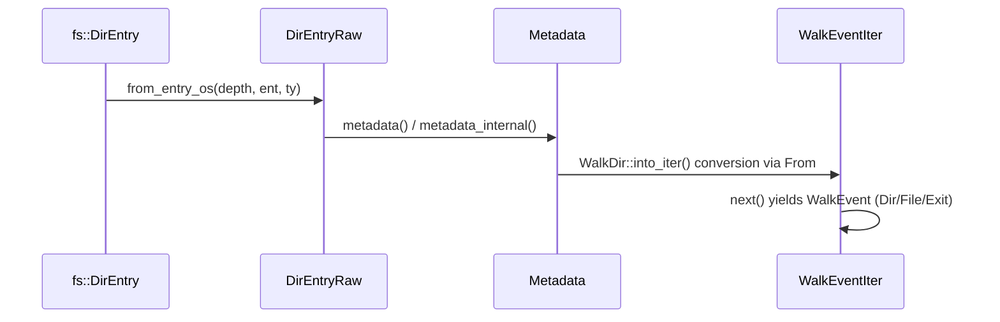
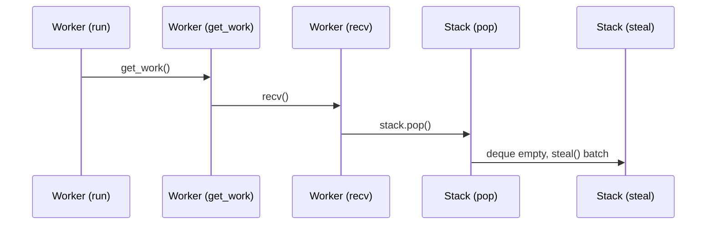

# File System Walkers

<details>
<summary>Relevant source files</summary>

The following files were used as context for generating this wiki page:

- [crates/ignore/src/walk.rs](https://github.com/BurntSushi/ripgrep/blob/main/crates/ignore/src/walk.rs)
- [crates/ignore/src/dir.rs](https://github.com/BurntSushi/ripgrep/blob/main/crates/ignore/src/dir.rs)
- [crates/ignore/src/gitignore.rs](https://github.com/BurntSushi/ripgrep/blob/main/crates/ignore/src/gitignore.rs)
- [crates/ignore/src/incremental.rs](https://github.com/BurntSushi/ripgrep/blob/main/crates/ignore/src/incremental.rs)
</details>

## Overview

The file system walkers component provides a robust engine for recursively traversing directory hierarchies while evaluating complex ignore rules, file type filters, and traversal constraints. Positioned as a core capability within file search infrastructure, it solves the fundamental problem of efficiently discovering and filtering millions of paths across diverse storage volumes without excessive memory consumption or redundant disk I/O. Key design decisions include persistent parent ignore state sharing, depth-first work-stealing parallelism, and lazy hierarchical matching that avoids manual re-traversal. It interacts closely with adjacent components such as gitignore pattern compilers, directory context integrators, and incremental cache layers to orchestrate both single-threaded iterators and multi-threaded parallel workers. Sources: [crates/ignore/src/walk.rs:439-444](https://github.com/BurntSushi/ripgrep/blob/main/crates/ignore/src/walk.rs#L439-L444), [crates/ignore/src/dir.rs:1-10](https://github.com/BurntSushi/ripgrep/blob/main/crates/ignore/src/dir.rs#L1-L10), and [crates/ignore/src/incremental.rs:36-40](https://github.com/BurntSushi/ripgrep/blob/main/crates/ignore/src/incremental.rs#L36-L40).

## Public Walkers and Iterator API

### Overview

The public API surface for directory traversal is anchored by `WalkBuilder`, `Walk`, and `WalkParallel`. `WalkBuilder` configures traversal rules including depth bounds, symlink following, custom ignore filenames, overrides, and multi-threading options. Calling `build()` constructs a single-threaded `Walk` iterator yielding `Result<DirEntry, Error>`, whereas `build_parallel()` creates a `WalkParallel` executor for multi-threaded traversal. Sources: [crates/ignore/src/walk.rs:439-512](https://github.com/BurntSushi/ripgrep/blob/main/crates/ignore/src/walk.rs#L439-L512), [crates/ignore/src/walk.rs:593-643](https://github.com/BurntSushi/ripgrep/blob/main/crates/ignore/src/walk.rs#L593-L643), [crates/ignore/src/walk.rs:700-714](https://github.com/BurntSushi/ripgrep/blob/main/crates/ignore/src/walk.rs#L700-L714).

### Configuration Options and Builder Methods

`WalkBuilder` exposes numerous mutator methods to adjust filtering behaviors, limits, and operational switches prior to initializing iterators.

| Method | Parameter Type | Default | Purpose |
| :--- | :--- | :--- | :--- |
| `new` | `P: AsRefath>` | N/A | Creates a builder initialized with a single path. |
| `empty` | None | N/A | Creates an empty builder yielding zero items. |
| `from_iter` | `IntoIterator<Item = P>` | N/A | Creates a builder from a sequence of paths. |
| `max_depth` | `Option<usize>` | `None` | Limits maximum recursion depth. |
| `min_depth` | `Option<usize>` | `None` | Limits minimum recursion depth for yielded items. |
| `follow_links` | `bool` | `false` | Toggles whether symbolic links are followed. |
| `max_filesize` | `Option<u64>` | `None` | Skips non-directory files exceeding the byte size limit. |
| `threads` | `usize` | `0` | Sets thread count for parallel traversal (`0` uses heuristics). |
| `same_file_system` | `bool` | `false` | Prevents crossing file system boundaries. |
| `skip_stdout` | `bool` | `false` | Skips paths corresponding to redirected stdout files. |
| `filter_entry` | `Fn(&DirEntry) -> bool` | `None` | Applies a predicate to skip entries and prune directories. |

Sources: [crates/ignore/src/walk.rs:488-512](https://github.com/BurntSushi/ripgrep/blob/main/crates/ignore/src/walk.rs#L488-L512), [crates/ignore/src/walk.rs:552-590](https://github.com/BurntSushi/ripgrep/blob/main/crates/ignore/src/walk.rs#L552-L590), [crates/ignore/src/walk.rs:726-1051](https://github.com/BurntSushi/ripgrep/blob/main/crates/ignore/src/walk.rs#L726-L1051)

> [!NOTE]
> If both `min_depth` and `max_depth` are set such that `max_depth < min_depth`, `WalkBuilder` clamps `max_depth` up to equal `min_depth` (and vice versa) to prevent invalid range states. Sources: [crates/ignore/src/walk.rs:731-736](https://github.com/BurntSushi/ripgrep/blob/main/crates/ignore/src/walk.rs#L731-L736), [crates/ignore/src/walk.rs:745-750](https://github.com/BurntSushi/ripgrep/blob/main/crates/ignore/src/walk.rs#L745-L750)

### Call-Chain Execution Walkthrough

When constructing raw directory entry wrappers from OS directory entries during traversal or iteration setup, the execution flows through specific internal functions:

1. `from_entry_os` receives depth, the underlying `fs::DirEntry`, and file type (`fs::FileType`) to instantiate platform-specific fields. Sources: [crates/ignore/src/walk.rs:339-372](https://github.com/BurntSushi/ripgrep/blob/main/crates/ignore/src/walk.rs#L339-L372)
2. `metadata` calls internal entry metadata routines to retrieve structural file attributes or symlink metadata depending on follow flags. Sources: [crates/ignore/src/walk.rs:284-308](https://github.com/BurntSushi/ripgrep/blob/main/crates/ignore/src/walk.rs#L284-L308)
3. `from` converts a configured `WalkDir` instance into a `WalkEventIter` adapter. Sources: [crates/ignore/src/walk.rs:1276-1280](https://github.com/BurntSushi/ripgrep/blob/main/crates/ignore/src/walk.rs#L1276-L1280)
4. `WalkEventIter` processes raw walkdir outputs into structured `WalkEvent` items (Dir, File, Exit). Sources: [crates/ignore/src/walk.rs:1282-1312](https://github.com/BurntSushi/ripgrep/blob/main/crates/ignore/src/walk.rs#L1282-L1312)


Sources: [crates/ignore/src/walk.rs:284-308](https://github.com/BurntSushi/ripgrep/blob/main/crates/ignore/src/walk.rs#L284-L308), [crates/ignore/src/walk.rs:339-372](https://github.com/BurntSushi/ripgrep/blob/main/crates/ignore/src/walk.rs#L339-L372), [crates/ignore/src/walk.rs:1276-1312](https://github.com/BurntSushi/ripgrep/blob/main/crates/ignore/src/walk.rs#L1276-L1312)

### Design Trade-Offs

| Design Choice | Benefit | Cost |
| :--- | :--- | :--- |
| `WalkEventIter` event mapping (`Dir`, `File`, `Exit`) | Explicit notification of directory traversal completion (`Exit`) for tracking ignore stack scopes. | Additional wrapper state overhead over raw iterator yields. |
| Separate `DirEntryRaw` and `walkdir::DirEntry` | Allows building synthetic `DirEntry` values from whole cloth in parallel work queues. | Code duplication of entry query methods between implementations. |
| Lazy CWD discovery via `OnceLock` | Avoids unnecessary environment system calls if global gitignores are unused. | Small synchronization check overhead on initial access. |

Sources: [crates/ignore/src/walk.rs:120-135](https://github.com/BurntSushi/ripgrep/blob/main/crates/ignore/src/walk.rs#L120-L135), [crates/ignore/src/walk.rs:235-237](https://github.com/BurntSushi/ripgrep/blob/main/crates/ignore/src/walk.rs#L235-L237), [crates/ignore/src/walk.rs:1074-1100](https://github.com/BurntSushi/ripgrep/blob/main/crates/ignore/src/walk.rs#L1074-L1100), [crates/ignore/src/walk.rs:1259-1274](https://github.com/BurntSushi/ripgrep/blob/main/crates/ignore/src/walk.rs#L1259-L1274)

### Worked Example

The following example configures a `WalkBuilder` with custom filters, depth constraints, and executes a single-threaded traversal loop:

```rust
use ignore::{WalkBuilder, WalkState};

let walker = WalkBuilder::new("./src")
    .max_depth(Some(3))
    .hidden(true)
    .build();

for result in walker {
    match result {
        Ok(entry) => {
            println!("Discovered path: {:?}", entry.path());
        }
        Err(err) => {
            eprintln!("Traversal error: {}", err);
        }
    }
}
```
Sources: [crates/ignore/src/walk.rs:552-554](https://github.com/BurntSushi/ripgrep/blob/main/crates/ignore/src/walk.rs#L552-L554), [crates/ignore/src/walk.rs:593-643](https://github.com/BurntSushi/ripgrep/blob/main/crates/ignore/src/walk.rs#L593-L643), [crates/ignore/src/walk.rs:729-738](https://github.com/BurntSushi/ripgrep/blob/main/crates/ignore/src/walk.rs#L729-L738), [crates/ignore/src/walk.rs:1184-1254](https://github.com/BurntSushi/ripgrep/blob/main/crates/ignore/src/walk.rs#L1184-L1254)

## Parallel Work-Stealing Traversal Engine

### Overview

The parallel traversal engine coordinates multi-threaded file system walking using a work-stealing scheduling architecture built on crossbeam deques. `WalkParallel` manages thread pool creation, thread activation tracking, and visitor dispatch, operating in a depth-first manner to minimize peak memory consumption from accumulated ignore matchers and paths. Sources: [crates/ignore/src/walk.rs:1404-1415](https://github.com/BurntSushi/ripgrep/blob/main/crates/ignore/src/walk.rs#L1404-L1415), [crates/ignore/src/walk.rs:1656-1661](https://github.com/BurntSushi/ripgrep/blob/main/crates/ignore/src/walk.rs#L1656-L1661), [crates/ignore/src/walk.rs:1718-1724](https://github.com/BurntSushi/ripgrep/blob/main/crates/ignore/src/walk.rs#L1718-L1724)

### Execution Walkthroughs

#### Work Retrieval and Stealing Chain

1. `run` executes the worker loop by continuously invoking `get_work` to fetch available directories or quit signals. Sources: [crates/ignore/src/walk.rs:1754-1760](https://github.com/BurntSushi/ripgrep/blob/main/crates/ignore/src/walk.rs#L1754-L1760)
2. `get_work` calls `recv` to attempt pulling a local message from the thread's deque stack. Sources: [crates/ignore/src/walk.rs:1936](https://github.com/BurntSushi/ripgrep/blob/main/crates/ignore/src/walk.rs#L1936), [crates/ignore/src/walk.rs:2007-2010](https://github.com/BurntSushi/ripgrep/blob/main/crates/ignore/src/walk.rs#L2007-L2010)
3. `recv` invokes `self.stack.pop` on the thread-local `Stack`. Sources: [crates/ignore/src/walk.rs:2007-2010](https://github.com/BurntSushi/ripgrep/blob/main/crates/ignore/src/walk.rs#L2007-L2010)
4. `pop` checks the local `Deque` and falls back to `steal` if empty. Sources: [crates/ignore/src/walk.rs:1689-1692](https://github.com/BurntSushi/ripgrep/blob/main/crates/ignore/src/walk.rs#L1689-L1692)
5. `steal` iterates over peer stealers in a round-robin order starting from `index + 1` to batch-steal work items. Sources: [crates/ignore/src/walk.rs:1694-1707](https://github.com/BurntSushi/ripgrep/blob/main/crates/ignore/src/walk.rs#L1694-L1707)

Sources: [crates/ignore/src/walk.rs:1689-1707](https://github.com/BurntSushi/ripgrep/blob/main/crates/ignore/src/walk.rs#L1689-L1707), [crates/ignore/src/walk.rs:1754-1760](https://github.com/BurntSushi/ripgrep/blob/main/crates/ignore/src/walk.rs#L1754-L1760), [crates/ignore/src/walk.rs:1936](https://github.com/BurntSushi/ripgrep/blob/main/crates/ignore/src/walk.rs#L1936), [crates/ignore/src/walk.rs:2007-2010](https://github.com/BurntSushi/ripgrep/blob/main/crates/ignore/src/walk.rs#L2007-L2010)

#### Termination and Quit Propagation Chain

1. `run` receives a `WalkState::Quit` result from `run_one` and executes `quit_now`. Sources: [crates/ignore/src/walk.rs:1756-1758](https://github.com/BurntSushi/ripgrep/blob/main/crates/ignore/src/walk.rs#L1756-L1758)
2. `get_work` hits the quit condition, triggering `send_quit`. Sources: [crates/ignore/src/walk.rs:1947-1953](https://github.com/BurntSushi/ripgrep/blob/main/crates/ignore/src/walk.rs#L1947-L1953)
3. `send_quit` pushes a `Message::Quit` onto the worker stack. Sources: [crates/ignore/src/walk.rs:2003-2005](https://github.com/BurntSushi/ripgrep/blob/main/crates/ignore/src/walk.rs#L2003-L2005)
4. `push` places the quit message into the thread's deque for propagation across threads. Sources: [crates/ignore/src/walk.rs:1685-1687](https://github.com/BurntSushi/ripgrep/blob/main/crates/ignore/src/walk.rs#L1685-L1687)

Sources: [crates/ignore/src/walk.rs:1685-1687](https://github.com/BurntSushi/ripgrep/blob/main/crates/ignore/src/walk.rs#L1685-L1687), [crates/ignore/src/walk.rs:1756-1758](https://github.com/BurntSushi/ripgrep/blob/main/crates/ignore/src/walk.rs#L1756-L1758), [crates/ignore/src/walk.rs:1947-1953](https://github.com/BurntSushi/ripgrep/blob/main/crates/ignore/src/walk.rs#L1947-L1953), [crates/ignore/src/walk.rs:2003-2005](https://github.com/BurntSushi/ripgrep/blob/main/crates/ignore/src/walk.rs#L2003-L2005)


Sources: [crates/ignore/src/walk.rs:1689-1707](https://github.com/BurntSushi/ripgrep/blob/main/crates/ignore/src/walk.rs#L1689-L1707), [crates/ignore/src/walk.rs:1754-1760](https://github.com/BurntSushi/ripgrep/blob/main/crates/ignore/src/walk.rs#L1754-L1760), [crates/ignore/src/walk.rs:1936](https://github.com/BurntSushi/ripgrep/blob/main/crates/ignore/src/walk.rs#L1936), [crates/ignore/src/walk.rs:2007-2010](https://github.com/BurntSushi/ripgrep/blob/main/crates/ignore/src/walk.rs#L2007-L2010)

### State and Message Reference

| Name | Type / Values | Purpose |
| :--- | :--- | :--- |
| `WalkState::Continue` | Enum variant | Continue walking as normal. |
| `WalkState::Skip` | Enum variant | Do not descend into the given directory entry; has no effect on non-directories. |
| `WalkState::Quit` | Enum variant | Quit the entire parallel iterator as soon as possible. |
| `Message::Work` | Enum variant wrapping `Work` | Represents a directory unit of work to be descended into by a worker. |
| `Message::Quit` | Enum variant | Instruction commanding the worker to terminate execution. |

Sources: [crates/ignore/src/walk.rs:1318-1330](https://github.com/BurntSushi/ripgrep/blob/main/crates/ignore/src/walk.rs#L1318-L1330), [crates/ignore/src/walk.rs:1540-1547](https://github.com/BurntSushi/ripgrep/blob/main/crates/ignore/src/walk.rs#L1540-L1547)

### Design Trade-Offs

| Design Choice | Benefit | Cost |
| :--- | :--- | :--- |
| LIFO work queues (`Deque::new_lifo`) | Enforces depth-first traversal, significantly reducing peak memory usage for deep directory hierarchies and gitignore matchers. | Can lead to uneven work distribution if tasks are heavily unbalanced before stealing occurs. |
| Atomic worker activation counters | Allows precise detection of global work exhaustion when active workers drop to zero. | Introduces atomic synchronization overhead on thread sleep and wake transitions. |
| Shared `Arc<[Stealer]>` stealers | Enables every thread to inspect and steal work from any peer queue fairly. | Requires immutable shared arc indirection across thread boundaries. |

Sources: [crates/ignore/src/walk.rs:1645-1673](https://github.com/BurntSushi/ripgrep/blob/main/crates/ignore/src/walk.rs#L1645-L1673), [crates/ignore/src/walk.rs:1955-1982](https://github.com/BurntSushi/ripgrep/blob/main/crates/ignore/src/walk.rs#L1955-L1982)

> [!WARNING]
> Setting `WalkState::Quit` is an inherently asynchronous action. Additional directory entries and visitor callbacks may still be invoked even after instructing the parallel iterator to quit, because other threads may already have queued work items in flight. Sources: [crates/ignore/src/walk.rs:1324-1329](https://github.com/BurntSushi/ripgrep/blob/main/crates/ignore/src/walk.rs#L1324-L1329)

> [!NOTE]
> When all worker deques are simultaneously empty, `deactivate_worker()` decrements the active count to `0`, signaling complete work exhaustion and broadcasting a cascade of `Message::Quit` tokens to wake and terminate any sleeping threads. Sources: [crates/ignore/src/walk.rs:1955-1964](https://github.com/BurntSushi/ripgrep/blob/main/crates/ignore/src/walk.rs#L1955-L1964)

## Directory Tree Context Integration

### Overview

The `Ignore` data structure connects recursive directory traversal with context-aware ignore rule matchers. It functions as a persistent data structure where every matcher logically corresponds to ignore rules from a single directory and points to the matcher for its parent directory. This hierarchy integration ensures that rule precedence and parent directories are respected efficiently across single-threaded and parallel traversals.

Sources: [crates/ignore/src/dir.rs:1-10](https://github.com/BurntSushi/ripgrep/blob/main/crates/ignore/src/dir.rs#L1-L10), [crates/ignore/src/dir.rs:92-95](https://github.com/BurntSushi/ripgrep/blob/main/crates/ignore/src/dir.rs#L92-L95)

### Context Integration Walk-Chain

When a directory traversal reaches a child directory or initializes its roots, it dynamically builds and extends the active ignore state through a defined sequence of structural method calls.

1. `WalkBuilder::build()` or `WalkParallel::visit()` constructs the root `Ignore` via `build_ignore()` using the current working directory.
Sources: [crates/ignore/src/walk.rs:633](https://github.com/BurntSushi/ripgrep/blob/main/crates/ignore/src/walk.rs#L633), [crates/ignore/src/walk.rs:701](https://github.com/BurntSushi/ripgrep/blob/main/crates/ignore/src/walk.rs#L701), [crates/ignore/src/walk.rs:1103-1107](https://github.com/BurntSushi/ripgrep/blob/main/crates/ignore/src/walk.rs#L1103-L1107)

2. `Ignore::add_parents()` canonicalizes the target path and ascends from child to root, inspecting cached parent matchers in `compiled` (`RwLock<HashMap<OsString, Weak<IgnoreInner>>>`).
Sources: [crates/ignore/src/dir.rs:122](https://github.com/BurntSushi/ripgrep/blob/main/crates/ignore/src/dir.rs#L122), [crates/ignore/src/dir.rs:208-229](https://github.com/BurntSushi/ripgrep/blob/main/crates/ignore/src/dir.rs#L208-L229)

3. `Ignore::add_child()` or `Ignore::add_child_with_entries()` invokes `collect_ignore_files()` and `add_child_path_with_found_ignore_files()` to scan directory entries, resolve git common directories, and compile local ignore matchers.
Sources: [crates/ignore/src/dir.rs:268-301](https://github.com/BurntSushi/ripgrep/blob/main/crates/ignore/src/dir.rs#L268-301), [crates/ignore/src/dir.rs:308-338](https://github.com/BurntSushi/ripgrep/blob/main/crates/ignore/src/dir.rs#L308-L338), [crates/ignore/src/dir.rs:340-467](https://github.com/BurntSushi/ripgrep/blob/main/crates/ignore/src/dir.rs#L340-467)

4. `Ignore::matched()` evaluates path components against overrides, ignore rules, and file types, delegating to `matched_ignore()` to check parent chain precedence.
Sources: [crates/ignore/src/dir.rs:500-544](https://github.com/BurntSushi/ripgrep/blob/main/crates/ignore/src/dir.rs#L500-L544), [crates/ignore/src/dir.rs:548-685](https://github.com/BurntSushi/ripgrep/blob/main/crates/ignore/src/dir.rs#L548-L685)

> [!NOTE]
> Parent matchers are cached across search roots using weak references, but absolute path rewriting during matching ensures that rules are correctly anchored relative to each specific search root's base path. Sources: [crates/ignore/src/dir.rs:96-112](https://github.com/BurntSushi/ripgrep/blob/main/crates/ignore/src/dir.rs#L96-L112), [crates/ignore/src/dir.rs:228-237](https://github.com/BurntSushi/ripgrep/blob/main/crates/ignore/src/dir.rs#L228-L237)

### Ignore Matcher Configuration Reference

| Field / Option | Type | Default Value | Purpose |
| :--- | :--- | :--- | :--- |
| `hidden` | `bool` | `true` | Whether to ignore hidden file paths or not. |
| `ignore` | `bool` | `true` | Whether to read `.ignore` files. |
| `parents` | `bool` | `true` | Whether to respect any ignore files in parent directories. |
| `git_global` | `bool` | `true` | Whether to read git's global gitignore file. |
| `git_ignore` | `bool` | `true` | Whether to read `.gitignore` files. |
| `git_exclude` | `bool` | `true` | Whether to read `.git/info/exclude` files. |
| `ignore_case_insensitive` | `bool` | `false` | Whether to process ignore files case-insensitively. |
| `require_git` | `bool` | `true` | Whether a git repository must be present to apply git-related ignore rules. |

Sources: [crates/ignore/src/dir.rs:72-90](https://github.com/BurntSushi/ripgrep/blob/main/crates/ignore/src/dir.rs#L72-L90), [crates/ignore/src/dir.rs:792-801](https://github.com/BurntSushi/ripgrep/blob/main/crates/ignore/src/dir.rs#L792-L801)

## Gitignore Pattern Matching and Parsing

### Overview

The `gitignore` module implements the gitignore specification from scratch without shelling out to external Git binaries. It parses individual ignore files line by line, compiles patterns into regex-backed glob sets via the `globset` crate, discovers global configuration paths, and enforces strict rule precedence across multiple ignore sources.

Sources: [crates/ignore/src/gitignore.rs:1-8](https://github.com/BurntSushi/ripgrep/blob/main/crates/ignore/src/gitignore.rs#L1-L8), [crates/ignore/src/gitignore.rs:17-20](https://github.com/BurntSushi/ripgrep/blob/main/crates/ignore/src/gitignore.rs#L17-L20)

### Gitconfig Discovery Walk-Chain

When locating global exclusion rules, `gitconfig_excludes_path()` evaluates environment variables and standard locations in a strict fallback order to find active ignore files.

1. `gitconfig_excludes_path()` checks `GIT_CONFIG_GLOBAL` via `gitconfig_global_env_contents()` and attempts to parse `core.excludesfile`.
Sources: [crates/ignore/src/gitignore.rs:581-587](https://github.com/BurntSushi/ripgrep/blob/main/crates/ignore/src/gitignore.rs#L581-L587), [crates/ignore/src/gitignore.rs:604-612](https://github.com/BurntSushi/ripgrep/blob/main/crates/ignore/src/gitignore.rs#L604-L612)

2. If unset, it inspects the user home directory (`$HOME/.gitconfig`) via `gitconfig_home_contents()`.
Sources: [crates/ignore/src/gitignore.rs:588-590](https://github.com/BurntSushi/ripgrep/blob/main/crates/ignore/src/gitignore.rs#L588-L590), [crates/ignore/src/gitignore.rs:627-634](https://github.com/BurntSushi/ripgrep/blob/main/crates/ignore/src/gitignore.rs#L627-L634)

3. If neither provides an excludes file, it evaluates `$XDG_CONFIG_HOME/git/config` (or `$HOME/.config/git/config`) via `gitconfig_xdg_contents()`.
Sources: [crates/ignore/src/gitignore.rs:591-593](https://github.com/BurntSushi/ripgrep/blob/main/crates/ignore/src/gitignore.rs#L591-L593), [crates/ignore/src/gitignore.rs:636-647](https://github.com/BurntSushi/ripgrep/blob/main/crates/ignore/src/gitignore.rs#L636-L647)

4. It falls back to system-level configuration (`GIT_CONFIG_SYSTEM` or `/etc/gitconfig`) via `gitconfig_system_contents()`.
Sources: [crates/ignore/src/gitignore.rs:596-598](https://github.com/BurntSushi/ripgrep/blob/main/crates/ignore/src/gitignore.rs#L596-L598), [crates/ignore/src/gitignore.rs:617-625](https://github.com/BurntSushi/ripgrep/blob/main/crates/ignore/src/gitignore.rs#L617-L625)

5. Finally, it defaults to `$XDG_CONFIG_HOME/git/ignore` via `excludes_file_default()`.
Sources: [crates/ignore/src/gitignore.rs:599](https://github.com/BurntSushi/ripgrep/blob/main/crates/ignore/src/gitignore.rs#L599), [crates/ignore/src/gitignore.rs:652-658](https://github.com/BurntSushi/ripgrep/blob/main/crates/ignore/src/gitignore.rs#L652-L658)

> [!NOTE]
> `parse_excludes_file` uses a regular expression to extract the `excludesfile` key from raw configuration bytes, expanding leading tildes (`~`) via `expand_tilde()` using the current user's home directory. Sources: [crates/ignore/src/gitignore.rs:662-694](https://github.com/BurntSushi/ripgrep/blob/main/crates/ignore/src/gitignore.rs#L662-L694)

### Glob Compilation and Parsing Rules

When `GitignoreBuilder::add_line()` processes a pattern line, it applies transformations to align behavior with Git specifications before compiling it into a glob set.

- Comments starting with `#` and empty lines are skipped.
Sources: [crates/ignore/src/gitignore.rs:465-473](https://github.com/BurntSushi/ripgrep/blob/main/crates/ignore/src/gitignore.rs#L465-L473)
- Escaped markers like `\!` or `\#` have their escape prefix stripped and are treated as literal patterns.
Sources: [crates/ignore/src/gitignore.rs:482-485](https://github.com/BurntSushi/ripgrep/blob/main/crates/ignore/src/gitignore.rs#L482-L485)
- Leading `!` marks the glob as a whitelist (`is_whitelist = true`).
Sources: [crates/ignore/src/gitignore.rs:486-489](https://github.com/BurntSushi/ripgrep/blob/main/crates/ignore/src/gitignore.rs#L486-L489)
- Leading `/` restricts matching to the base directory (`is_absolute = true`). If no leading slash and no internal slashes exist, a `**/` prefix is prepended unless a double-star prefix is already present.
Sources: [crates/ignore/src/gitignore.rs:490-519](https://github.com/BurntSushi/ripgrep/blob/main/crates/ignore/src/gitignore.rs#L490-L519)
- A trailing `/` sets `is_only_dir = true`, restricting matches strictly to directories. A trailing `/**` has `/*` appended to target directory contents without matching the directory itself.
Sources: [crates/ignore/src/gitignore.rs:500-525](https://github.com/BurntSushi/ripgrep/blob/main/crates/ignore/src/gitignore.rs#L500-L525)

Sources: [crates/ignore/src/gitignore.rs:458-539](https://github.com/BurntSushi/ripgrep/blob/main/crates/ignore/src/gitignore.rs#L458-L539)

### Rule Precedence and Ignore Layering

Within a single directory, multiple ignore mechanisms are evaluated in a specific precedence order. Custom ignore filenames take highest precedence, followed by `.ignore` files, standard `.gitignore` files, git exclude files (`.git/info/exclude`), global gitignore matchers, and explicit programmatic ignores.

Sources: [crates/ignore/src/dir.rs:679-685](https://github.com/BurntSushi/ripgrep/blob/main/crates/ignore/src/dir.rs#L679-L685)

## Incremental Matching and Hierarchy Caching

### Overview

The `IncrementalIgnore` data structure provides an optimized, cached mechanism for evaluating individual file paths against hierarchical ignore rules without performing a full directory traversal. Built via [`WalkBuilder::build_matchers`](https://github.com/BurntSushi/ripgrep/blob/main/crates/ignore/src/walk.rs#L674-L693), each matcher targets a specific root directory and interprets queried paths relative to that root.
Sources: [crates/ignore/src/incremental.rs:11-33](https://github.com/BurntSushi/ripgrep/blob/main/crates/ignore/src/incremental.rs#L11-L33)

### Incremental Rule Evaluation and Caching

When a caller queries a path via `IncrementalIgnore::matched()`, the matcher avoids re-evaluating parent directory structures by maintaining a cache of compiled directory states in `dirs: HashMapathBuf, CachedDir>`.
Sources: [crates/ignore/src/incremental.rs:57-68](https://github.com/BurntSushi/ripgrep/blob/main/crates/ignore/src/incremental.rs#L57-L68)

The evaluation process follows a specific call chain: `IncrementalIgnore::matched()` delegates to `IncrementalIgnore::matched_with_errors()`, which invokes `IncrementalIgnore::matched_with_errors_impl()`. This internal implementation performs depth verification, queries `IncrementalIgnore::matched_with_errors_ignore()`, and optionally checks file size limits.
Sources: [crates/ignore/src/incremental.rs:194-293](https://github.com/BurntSushi/ripgrep/blob/main/crates/ignore/src/incremental.rs#L194-L293)

> [!NOTE]
> If a query path's parent directory is already cached as `CachedDir::Allowed(Ignore)`, the matcher bypasses component-by-component traversal and directly invokes rule matching against the precompiled ignore context. Conversely, a `CachedDir::Ignored` entry treats the directory and all its descendants as terminal ignores without touching disk. Sources: [crates/ignore/src/incremental.rs:94-103](https://github.com/BurntSushi/ripgrep/blob/main/crates/ignore/src/incremental.rs#L94-L103), [crates/ignore/src/incremental.rs:337-340](https://github.com/BurntSushi/ripgrep/blob/main/crates/ignore/src/incremental.rs#L337-L340)

### Depth and Boundary Limits

`IncrementalIgnoreOptions` enforces traversal constraints during incremental path checking, mirroring the limits available in parallel and single-threaded walkers.
Sources: [crates/ignore/src/incremental.rs:72-79](https://github.com/BurntSushi/ripgrep/blob/main/crates/ignore/src/incremental.rs#L72-L79)

| Option Field | Type | Default / Behavior | Purpose |
| :--- | :--- | :--- | :--- |
| `min_depth` | `Option<usize>` | `None` | Skips and reports paths shallower than the specified depth limit. |
| `max_depth` | `Option<usize>` | `None` | Rejects paths exceeding the maximum recursive depth boundary. |
| `max_filesize` | `Option<u64>` | `None` | Compares file size against the byte limit using file metadata. |
| `hidden` | `bool` | `true` | Automatically ignores paths identified as hidden entries. |
| `follow_links` | `bool` | `false` | Controls whether symlink metadata is resolved during size checks. |

Sources: [crates/ignore/src/incremental.rs:72-79](https://github.com/BurntSushi/ripgrep/blob/main/crates/ignore/src/incremental.rs#L72-L79), [crates/ignore/src/incremental.rs:238-292](https://github.com/BurntSushi/ripgrep/blob/main/crates/ignore/src/incremental.rs#L238-L292)

> [!WARNING]
> Incremental matchers operate on snapshots at directory granularity. Once ignore files within a directory are loaded and cached, subsequent edits to those ignore files are ignored during the lifetime of the `IncrementalIgnore` instance; callers must construct a new matcher to observe updates. Sources: [crates/ignore/src/incremental.rs:30-33](https://github.com/BurntSushi/ripgrep/blob/main/crates/ignore/src/incremental.rs#L30-L33)

## Related

- [[Gitignore Matching]]
- [[Search Workflow]]

