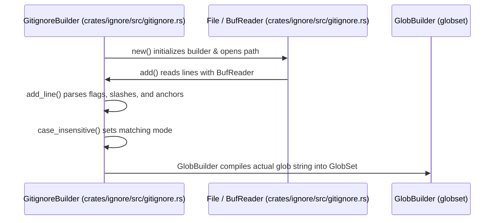

# Gitignore Matching

<details>
<summary>Relevant source files</summary>

The following files were used as context for generating this wiki page:

- [crates/ignore/src/gitignore.rs](https://github.com/BurntSushi/ripgrep/blob/main/crates/ignore/src/gitignore.rs)
- [crates/ignore/src/walk.rs](https://github.com/BurntSushi/ripgrep/blob/main/crates/ignore/src/walk.rs)
- [crates/ignore/src/dir.rs](https://github.com/BurntSushi/ripgrep/blob/main/crates/ignore/src/dir.rs)
- [crates/ignore/src/incremental.rs](https://github.com/BurntSushi/ripgrep/blob/main/crates/ignore/src/incremental.rs)
</details>

## Overview

Gitignore matching is a high-performance engine that evaluates file system paths against Gitignore-style glob patterns without shelling out to the `git` command-line tool. It serves as the core filtering subsystem for directory traversal operations, determining whether files or entire directory subtrees should be skipped or processed during recursive file searches. By implementing standard specification rules from scratch—such as recursive glob expansion, negation whitelisting, and directory-only scoping—the component solves the complex problem of accurately filtering out ignored files across diverse project layouts. Key design decisions include compiling individual pattern lines into optimized `GlobSet` structures, persisting hierarchical directory matchers across parent and child scopes, and caching compiled rules to minimize redundant I/O during massive directory walks. The component integrates directly with directory traversal loops, parallel worker pools, and global system configurations, supporting seamless coordination between local project ignore files, user-level excludes, and custom ignore rules. Sources: [crates/ignore/src/gitignore.rs:1-8](https://github.com/BurntSushi/ripgrep/blob/main/crates/ignore/src/gitignore.rs#L1-L8), [crates/ignore/src/dir.rs:1-15](https://github.com/BurntSushi/ripgrep/blob/main/crates/ignore/src/dir.rs#L1-L15), [crates/ignore/src/walk.rs:439-496](https://github.com/BurntSushi/ripgrep/blob/main/crates/ignore/src/walk.rs#L439-L496), [crates/ignore/src/incremental.rs:11-43](https://github.com/BurntSushi/ripgrep/blob/main/crates/ignore/src/incremental.rs#L11-L43)

## Gitignore Rule Parsing and Compilation

### Overview

The rule parsing and compilation subsystem processes individual `.gitignore` pattern lines, normalizes leading indicators such as negations and path anchors, adapts standard gitignore glob syntax for regex conversion via the `globset` crate, and compiles collections of rules into optimized matcher sets. Each rule line is ingested by `GitignoreBuilder`, classified as an ignore or whitelist entry, and transformed into an actual glob string before being inserted into a underlying `GlobSetBuilder`. Sources: [crates/ignore/src/gitignore.rs:318-344](https://github.com/BurntSushi/ripgrep/blob/main/crates/ignore/src/gitignore.rs#L318-L344), [crates/ignore/src/gitignore.rs:452-539](https://github.com/BurntSushi/ripgrep/blob/main/crates/ignore/src/gitignore.rs#L452-L539)

### Parsing Execution Walkthrough

The compilation pipeline executes a strict sequence of method calls when processing and adding gitignore rules to a builder instance:

1. `new`: Initializes an empty `GitignoreBuilder` via `GitignoreBuilder::new` at a specified root path, setting up default states such as case sensitivity (`false`) and unclosed character class tolerance (`true`). Sources: [crates/ignore/src/gitignore.rs:335-344](https://github.com/BurntSushi/ripgrep/blob/main/crates/ignore/src/gitignore.rs#L335-L344)
2. `add`: Opens the gitignore file via `File::open` and wraps it in a `BufReader`, iterating over each line with `rdr.lines()`, stripping the UTF-8 BOM if present on line 0, and invoking `add_line`. Sources: [crates/ignore/src/gitignore.rs:403-432](https://github.com/BurntSushi/ripgrep/blob/main/crates/ignore/src/gitignore.rs#L403-L432)
3. `add_line`: Parses individual pattern lines in `GitignoreBuilder::add_line`, stripping comments (`#`), trimming trailing spaces unless escaped with `\ `, handling negation `!` prefixes, absolute path slashes `/`, and directory-only trailing slashes `/`. It generates the actual glob string (prepending `**/` if unanchored) and adds the parsed `GlobBuilder` output to `self.builder`. Sources: [crates/ignore/src/gitignore.rs:458-539](https://github.com/BurntSushi/ripgrep/blob/main/crates/ignore/src/gitignore.rs#L458-L539)
4. `case_insensitive`: Toggles whether subsequent globs are matched case-insensitively via `GitignoreBuilder::case_insensitive`. Sources: [crates/ignore/src/gitignore.rs:547-555](https://github.com/BurntSushi/ripgrep/blob/main/crates/ignore/src/gitignore.rs#L547-L555)
5. `add_str`: Used during testing to iterate across lines of an in-memory string slice and feed them sequentially into `self.add_line`. Sources: [crates/ignore/src/gitignore.rs:441-450](https://github.com/BurntSushi/ripgrep/blob/main/crates/ignore/src/gitignore.rs#L441-L450)



Sources: [crates/ignore/src/gitignore.rs:335-344](https://github.com/BurntSushi/ripgrep/blob/main/crates/ignore/src/gitignore.rs#L335-L344), [crates/ignore/src/gitignore.rs:403-450](https://github.com/BurntSushi/ripgrep/blob/main/crates/ignore/src/gitignore.rs#L403-L450), [crates/ignore/src/gitignore.rs:458-539](https://github.com/BurntSushi/ripgrep/blob/main/crates/ignore/src/gitignore.rs#L458-L539), [crates/ignore/src/gitignore.rs:547-555](https://github.com/BurntSushi/ripgrep/blob/main/crates/ignore/src/gitignore.rs#L547-L555)

> [!WARNING]
> When a glob pattern ends with `/**`, `GitignoreBuilder::add_line` explicitly appended `/*` to force matching everything inside a directory without matching the directory itself, distinguishing standard glob behavior from gitignore directory expansion rules. Sources: [crates/ignore/src/gitignore.rs:523-525](https://github.com/BurntSushi/ripgrep/blob/main/crates/ignore/src/gitignore.rs#L523-L525)

### Glob Compilation Options

The `GitignoreBuilder` configures each compiled pattern using specific underlying globset parameters.

| Option Setter | Type | Default Value | Purpose |
| :--- | :--- | :--- | :--- |
| `case_insensitive` | `bool` | `false` | Toggles case-insensitive glob matching for rules added after configuration. Sources: [crates/ignore/src/gitignore.rs:341-342](https://github.com/BurntSushi/ripgrep/blob/main/crates/ignore/src/gitignore.rs#L341-L342), [crates/ignore/src/gitignore.rs:547-555](https://github.com/BurntSushi/ripgrep/blob/main/crates/ignore/src/gitignore.rs#L547-L555) |
| `allow_unclosed_class` | `bool` | `true` | Treats an unclosed bracket `[` as a literal string rather than a parse error to match gitignore semantics. Sources: [crates/ignore/src/gitignore.rs:342-343](https://github.com/BurntSushi/ripgrep/blob/main/crates/ignore/src/gitignore.rs#L342-L343), [crates/ignore/src/gitignore.rs:569-575](https://github.com/BurntSushi/ripgrep/blob/main/crates/ignore/src/gitignore.rs#L569-L575) |
| `literal_separator` | `bool` | `true` (Hardcoded) | Configures `GlobBuilder` so that path separators do not match wildcards like `*`. Sources: [crates/ignore/src/gitignore.rs:526-527](https://github.com/BurntSushi/ripgrep/blob/main/crates/ignore/src/gitignore.rs#L526-L527) |
| `backslash_escape` | `bool` | `true` (Hardcoded) | Enables backslash escape handling within pattern globs. Sources: [crates/ignore/src/gitignore.rs:529-529](https://github.com/BurntSushi/ripgrep/blob/main/crates/ignore/src/gitignore.rs#L529-L529) |

Sources: [crates/ignore/src/gitignore.rs:341-343](https://github.com/BurntSushi/ripgrep/blob/main/crates/ignore/src/gitignore.rs#L341-L343), [crates/ignore/src/gitignore.rs:526-535](https://github.com/BurntSushi/ripgrep/blob/main/crates/ignore/src/gitignore.rs#L526-L535), [crates/ignore/src/gitignore.rs:547-575](https://github.com/BurntSushi/ripgrep/blob/main/crates/ignore/src/gitignore.rs#L547-L575)

### Design Trade-offs

| Design Choice | Benefit | Cost |
| :--- | :--- | :--- |
| **From-scratch glob syntax translation** | Avoids external process overhead and dependency on host `git` binaries. | Duplicates specification parsing logic in Rust code. Sources: [crates/ignore/src/gitignore.rs:5-8](https://github.com/BurntSushi/ripgrep/blob/main/crates/ignore/src/gitignore.rs#L5-L8) |
| **Partial error collection (`PartialErrorBuilder`)** | Allows valid globs in a malformed `.gitignore` file to be compiled successfully despite syntax or I/O errors on individual lines. | Requires wrapping execution outcomes in custom partial error accumulators. Sources: [crates/ignore/src/gitignore.rs:97-102](https://github.com/BurntSushi/ripgrep/blob/main/crates/ignore/src/gitignore.rs#L97-L102), [crates/ignore/src/gitignore.rs:411-419](https://github.com/BurntSushi/ripgrep/blob/main/crates/ignore/src/gitignore.rs#L411-L419) |
| **Permissive unclosed character classes by default** | Maximizes compatibility with existing gitignore files containing literal brackets like `[abc`. | Permits looser syntax checks, potentially masking actual pattern configuration errors. Sources: [crates/ignore/src/gitignore.rs:569-575](https://github.com/BurntSushi/ripgrep/blob/main/crates/ignore/src/gitignore.rs#L569-L575) |

Sources: [crates/ignore/src/gitignore.rs:5-8](https://github.com/BurntSushi/ripgrep/blob/main/crates/ignore/src/gitignore.rs#L5-L8), [crates/ignore/src/gitignore.rs:97-102](https://github.com/BurntSushi/ripgrep/blob/main/crates/ignore/src/gitignore.rs#L97-L102), [crates/ignore/src/gitignore.rs:411-419](https://github.com/BurntSushi/ripgrep/blob/main/crates/ignore/src/gitignore.rs#L411-L419), [crates/ignore/src/gitignore.rs:569-575](https://github.com/BurntSushi/ripgrep/blob/main/crates/ignore/src/gitignore.rs#L569-L575)

> [!TIP]
> Line 0 of a `.gitignore` file is automatically inspected for a UTF-8 Byte Order Mark (BOM `\u{feff}`); if found, it is stripped prior to rule parsing to mimic Git's exact file handling behavior. Sources: [crates/ignore/src/gitignore.rs:422-425](https://github.com/BurntSushi/ripgrep/blob/main/crates/ignore/src/gitignore.rs#L422-L425)

## Hierarchical Directory Ignore Tree

### Overview

The `Ignore` data structure connects directory traversal with ignore matchers by forming a persistent, hierarchical tree where every child matcher points to its corresponding parent directory matcher. This persistent design makes it possible to share and cache parent matchers efficiently across parallel worker threads and multi-root searches. Sources: [crates/ignore/src/dir.rs:1-10](https://github.com/BurntSushi/ripgrep/blob/main/crates/ignore/src/dir.rs#L1-L10)

### Configuration and Matching Options

The `IgnoreOptions` struct controls how hidden files, ignore files, parent directory rules, and version control systems are evaluated during tree construction and path matching.

| Option Field | Type | Default Value | Purpose |
| :--- | :--- | :--- | :--- |
| `hidden` | `bool` | `true` | Whether to ignore hidden file paths or not. Sources: [crates/ignore/src/dir.rs:73-74](https://github.com/BurntSushi/ripgrep/blob/main/crates/ignore/src/dir.rs#L73-L74), [crates/ignore/src/dir.rs:793-793](https://github.com/BurntSushi/ripgrep/blob/main/crates/ignore/src/dir.rs#L793-L793) |
| `ignore` | `bool` | `true` | Whether to read `.ignore` files. Sources: [crates/ignore/src/dir.rs:75-76](https://github.com/BurntSushi/ripgrep/blob/main/crates/ignore/src/dir.rs#L75-L76), [crates/ignore/src/dir.rs:794-794](https://github.com/BurntSushi/ripgrep/blob/main/crates/ignore/src/dir.rs#L794-L794) |
| `parents` | `bool` | `true` | Whether to respect any ignore files in parent directories. Sources: [crates/ignore/src/dir.rs:77-78](https://github.com/BurntSushi/ripgrep/blob/main/crates/ignore/src/dir.rs#L77-L78), [crates/ignore/src/dir.rs:795-795](https://github.com/BurntSushi/ripgrep/blob/main/crates/ignore/src/dir.rs#L795-L795) |
| `git_global` | `bool` | `true` | Whether to read git's global gitignore file. Sources: [crates/ignore/src/dir.rs:79-80](https://github.com/BurntSushi/ripgrep/blob/main/crates/ignore/src/dir.rs#L79-L80), [crates/ignore/src/dir.rs:796-796](https://github.com/BurntSushi/ripgrep/blob/main/crates/ignore/src/dir.rs#L796-L796) |
| `git_ignore` | `bool` | `true` | Whether to read `.gitignore` files. Sources: [crates/ignore/src/dir.rs:81-82](https://github.com/BurntSushi/ripgrep/blob/main/crates/ignore/src/dir.rs#L81-L82), [crates/ignore/src/dir.rs:797-797](https://github.com/BurntSushi/ripgrep/blob/main/crates/ignore/src/dir.rs#L797-L797) |
| `git_exclude` | `bool` | `true` | Whether to read `.git/info/exclude` files. Sources: [crates/ignore/src/dir.rs:83-84](https://github.com/BurntSushi/ripgrep/blob/main/crates/ignore/src/dir.rs#L83-L84), [crates/ignore/src/dir.rs:798-798](https://github.com/BurntSushi/ripgrep/blob/main/crates/ignore/src/dir.rs#L798-L798) |
| `ignore_case_insensitive` | `bool` | `false` | Whether to ignore files case insensitively. Sources: [crates/ignore/src/dir.rs:85-86](https://github.com/BurntSushi/ripgrep/blob/main/crates/ignore/src/dir.rs#L85-L86), [crates/ignore/src/dir.rs:799-799](https://github.com/BurntSushi/ripgrep/blob/main/crates/ignore/src/dir.rs#L799-L799) |
| `require_git` | `bool` | `true` | Whether a git repository must be present in order to apply any git-related ignore rules. Sources: [crates/ignore/src/dir.rs:87-90](https://github.com/BurntSushi/ripgrep/blob/main/crates/ignore/src/dir.rs#L87-L90), [crates/ignore/src/dir.rs:800-800](https://github.com/BurntSushi/ripgrep/blob/main/crates/ignore/src/dir.rs#L800-L800) |

Sources: [crates/ignore/src/dir.rs:71-90](https://github.com/BurntSushi/ripgrep/blob/main/crates/ignore/src/dir.rs#L71-L90), [crates/ignore/src/dir.rs:792-801](https://github.com/BurntSushi/ripgrep/blob/main/crates/ignore/src/dir.rs#L792-L801)

### Execution Trace and Sequence

When initializing hierarchical ignore trees for target paths, builder execution flows through a defined sequence of functions that configure base options and compile matchers.

1. `absolute_parent` — Receives target path inputs and initiates parent hierarchy traversal. Sources: [crates/ignore/src/dir.rs:192-217](https://github.com/BurntSushi/ripgrep/blob/main/crates/ignore/src/dir.rs#L192-L217)
2. `tmpdir` — Generates temporary test directories for setting up hierarchical path checks. Sources: [crates/ignore/src/dir.rs:1140-1142](https://github.com/BurntSushi/ripgrep/blob/main/crates/ignore/src/dir.rs#L1140-L1142)
3. `new` — Instantiates base builder structures via `IgnoreBuilder::new()`. Sources: [crates/ignore/src/dir.rs:784-803](https://github.com/BurntSushi/ripgrep/blob/main/crates/ignore/src/dir.rs#L784-L803)
4. `IgnoreBuilder` — Configures and builds the root matcher state. Sources: [crates/ignore/src/dir.rs:752-776](https://github.com/BurntSushi/ripgrep/blob/main/crates/ignore/src/dir.rs#L752-L776)

Alternatively, option configuration follows this trace:

1. `absolute_parent` — Initiates the directory lookup phase. Sources: [crates/ignore/src/dir.rs:192-217](https://github.com/BurntSushi/ripgrep/blob/main/crates/ignore/src/dir.rs#L192-L217)
2. `tmpdir` — Prepares temporary test environments. Sources: [crates/ignore/src/dir.rs:1140-1142](https://github.com/BurntSushi/ripgrep/blob/main/crates/ignore/src/dir.rs#L1140-L1142)
3. `new` — Initializes default option flags. Sources: [crates/ignore/src/dir.rs:784-803](https://github.com/BurntSushi/ripgrep/blob/main/crates/ignore/src/dir.rs#L784-L803)
4. `IgnoreOptions` — Holds boolean configuration flags for matching behavior. Sources: [crates/ignore/src/dir.rs:71-90](https://github.com/BurntSushi/ripgrep/blob/main/crates/ignore/src/dir.rs#L71-L90)

```mermaid
sequenceDiagram
    participant Abs as absolute_parent
    participant Tmp as tmpdir
    participant New as new
    participant Opt as IgnoreBuilder / IgnoreOptions

    Abs->>Tmp: Initialize path traversal
    Tmp->>New: Invoke constructor
    New->>Opt: Populate default IgnoreOptions & build root
```

Sources: [crates/ignore/src/dir.rs:71-90](https://github.com/BurntSushi/ripgrep/blob/main/crates/ignore/src/dir.rs#L71-L90), [crates/ignore/src/dir.rs:192-217](https://github.com/BurntSushi/ripgrep/blob/main/crates/ignore/src/dir.rs#L192-L217), [crates/ignore/src/dir.rs:784-803](https://github.com/BurntSushi/ripgrep/blob/main/crates/ignore/src/dir.rs#L784-L803), [crates/ignore/src/dir.rs:1140-1142](https://github.com/BurntSushi/ripgrep/blob/main/crates/ignore/src/dir.rs#L1140-L1142)

> [!WARNING]
> Calling `Ignore::add_parents` on an `Ignore` matcher where `is_root()` returns `false` will cause an immediate panic. Sources: [crates/ignore/src/dir.rs:192-207](https://github.com/BurntSushi/ripgrep/blob/main/crates/ignore/src/dir.rs#L192-L207)

### Design Trade-offs

| Design Choice | Benefit | Cost |
| :--- | :--- | :--- |
| **Persistent `Ignore` tree with `Arc` and `Weak` caching** | Avoids rebuilding glob sets for parent directories across multiple search paths and parallel workers. | Introduces lock contention via `RwLock` and complexity in maintaining `absolute_base` path rewriting per root. Sources: [crates/ignore/src/dir.rs:6-10](https://github.com/BurntSushi/ripgrep/blob/main/crates/ignore/src/dir.rs#L6-L10), [crates/ignore/src/dir.rs:94-112](https://github.com/BurntSushi/ripgrep/blob/main/crates/ignore/src/dir.rs#L94-L112), [crates/ignore/src/dir.rs:228-256](https://github.com/BurntSushi/ripgrep/blob/main/crates/ignore/src/dir.rs#L228-L256) |
| **Bulk entry pre-filtering via `IgnoreFilesFound`** | Reduces unnecessary filesystem probing by inspecting directory entries in memory before stat calls. | Requires coordination between directory walker entry lists and ignore file collection passes. Sources: [crates/ignore/src/dir.rs:284-337](https://github.com/BurntSushi/ripgrep/blob/main/crates/ignore/src/dir.rs#L284-L337) |
| **Bypassing existence checks on Windows** | Avoids known Windows performance penalties associated with frequent file system stat operations. | May attempt to read ignore files that do not exist, relying on I/O error suppression. Sources: [crates/ignore/src/dir.rs:1025-1042](https://github.com/BurntSushi/ripgrep/blob/main/crates/ignore/src/dir.rs#L1025-L1042) |

Sources: [crates/ignore/src/dir.rs:6-10](https://github.com/BurntSushi/ripgrep/blob/main/crates/ignore/src/dir.rs#L6-L10), [crates/ignore/src/dir.rs:94-112](https://github.com/BurntSushi/ripgrep/blob/main/crates/ignore/src/dir.rs#L94-L112), [crates/ignore/src/dir.rs:228-256](https://github.com/BurntSushi/ripgrep/blob/main/crates/ignore/src/dir.rs#L228-L256), [crates/ignore/src/dir.rs:284-337](https://github.com/BurntSushi/ripgrep/blob/main/crates/ignore/src/dir.rs#L284-L337), [crates/ignore/src/dir.rs:1025-1042](https://github.com/BurntSushi/ripgrep/blob/main/crates/ignore/src/dir.rs#L1025-L1042)

## Traversal Integration and Directory Walking

### Overview

Directory traversal integrates hierarchical ignore matching via the single-threaded `Walk` iterator and the multi-threaded `WalkParallel` work-stealing engine. Both traversal loops evaluate filter predicates, skip conditions, and directory descent rules against `DirEntry` structures.

Sources: [crates/ignore/src/walk.rs:1110-1124](https://github.com/BurntSushi/ripgrep/blob/main/crates/ignore/src/walk.rs#L1110-L1124), [crates/ignore/src/walk.rs:1396-1415](https://github.com/BurntSushi/ripgrep/blob/main/crates/ignore/src/walk.rs#L1396-L1415)

### Single-Threaded Traversal Call Flow

The `Walk` iterator processes directory tree events through a sequential execution flow that updates active ignore states.

1. `Iterator::next()` for `Walk`: Pulls the next event from the underlying `WalkEventIter`. Sources: [crates/ignore/src/walk.rs:1188-1213](https://github.com/BurntSushi/ripgrep/blob/main/crates/ignore/src/walk.rs#L1188-L1213)
2. `Walk::skip_entry()`: Evaluates ignore matches, stdout equality, file size limits, and custom filters. Sources: [crates/ignore/src/walk.rs:1147-1181](https://github.com/BurntSushi/ripgrep/blob/main/crates/ignore/src/walk.rs#L1147-L1181)
3. `should_skip_entry()`: Invokes `ig.matched_dir_entry(dent)` to check ignore and whitelist rules. Sources: [crates/ignore/src/walk.rs:2078-2089](https://github.com/BurntSushi/ripgrep/blob/main/crates/ignore/src/walk.rs#L2078-L2089)
4. `Ignore::matched_dir_entry()`: Combines path overrides, ignore matchers, file types, and hidden file checks. Sources: [crates/ignore/src/dir.rs:485-494](https://github.com/BurntSushi/ripgrep/blob/main/crates/ignore/src/dir.rs#L485-L494)

Sources: [crates/ignore/src/dir.rs:485-494](https://github.com/BurntSushi/ripgrep/blob/main/crates/ignore/src/dir.rs#L485-L494), [crates/ignore/src/walk.rs:1147-1213](https://github.com/BurntSushi/ripgrep/blob/main/crates/ignore/src/walk.rs#L1147-L1213), [crates/ignore/src/walk.rs:2078-2089](https://github.com/BurntSushi/ripgrep/blob/main/crates/ignore/src/walk.rs#L2078-L2089)

> [!WARNING]
> Trivial skipping via `should_skip_entry` occurs before expensive operations like `stat` or filesystem boundary checks to avoid triggering remote filesystem downloads or heavy overheads. Sources: [crates/ignore/src/walk.rs:1147-1162](https://github.com/BurntSushi/ripgrep/blob/main/crates/ignore/src/walk.rs#L1147-L1162)

### Parallel Worker State Machine

`WalkParallel` distributes search roots across a pool of threads using work-stealing stacks (`Stack`) operating in LIFO order to guarantee depth-first traversal. Workers transition between active work execution and queue stealing.

| State / Message | Value / Variant | Purpose |
| :--- | :--- | :--- |
| `WalkState::Continue` | Enum Variant | Proceed with normal directory traversal and callback invocation. Sources: [crates/ignore/src/walk.rs:1318-1321](https://github.com/BurntSushi/ripgrep/blob/main/crates/ignore/src/walk.rs#L1318-L1321) |
| `WalkState::Skip` | Enum Variant | Do not descend into the current directory entry; continue walking siblings. Sources: [crates/ignore/src/walk.rs:1322-1324](https://github.com/BurntSushi/ripgrep/blob/main/crates/ignore/src/walk.rs#L1322-L1324) |
| `WalkState::Quit` | Enum Variant | Terminate the entire parallel iterator as soon as possible across all threads. Sources: [crates/ignore/src/walk.rs:1325-1330](https://github.com/BurntSushi/ripgrep/blob/main/crates/ignore/src/walk.rs#L1325-L1330) |
| `Message::Work` | Enum Variant | Carries a `Work` unit containing directory entry, ignore state, and root device. Sources: [crates/ignore/src/walk.rs:1543-1545](https://github.com/BurntSushi/ripgrep/blob/main/crates/ignore/src/walk.rs#L1543-L1545) |
| `Message::Quit` | Enum Variant | Signals worker threads to exit their run loops. Sources: [crates/ignore/src/walk.rs:1546-1547](https://github.com/BurntSushi/ripgrep/blob/main/crates/ignore/src/walk.rs#L1546-L1547) |

Sources: [crates/ignore/src/walk.rs:1318-1330](https://github.com/BurntSushi/ripgrep/blob/main/crates/ignore/src/walk.rs#L1318-L1330), [crates/ignore/src/walk.rs:1543-1547](https://github.com/BurntSushi/ripgrep/blob/main/crates/ignore/src/walk.rs#L1543-L1547)

> [!NOTE]
> Workers use LIFO depth-first deques via `Deque::new_lifo` because breadth-first traversal on wide directory trees containing numerous gitignore files causes catastrophic memory bloat. Sources: [crates/ignore/src/walk.rs:1655-1661](https://github.com/BurntSushi/ripgrep/blob/main/crates/ignore/src/walk.rs#L1655-L1661), [crates/ignore/src/walk.rs:1718-1723](https://github.com/BurntSushi/ripgrep/blob/main/crates/ignore/src/walk.rs#L1718-L1723)

## Incremental Matching and Cache Optimization

### Overview

The `IncrementalIgnore` engine enables checking individual file paths against hierarchical ignore rules without performing a full recursive directory walk. By caching compiled matchers for directories on first use, repeated queries avoid re-parsing parent ignore files. Matchers are constructed via `WalkBuilder::build_matchers()`, returning one `IncrementalIgnore` instance per configured root path. Sources: [crates/ignore/src/walk.rs:674-693](https://github.com/BurntSushi/ripgrep/blob/main/crates/ignore/src/walk.rs#L674-L693), [crates/ignore/src/incremental.rs:11-32](https://github.com/BurntSushi/ripgrep/blob/main/crates/ignore/src/incremental.rs#L11-L32)

### Incremental Path Matching Execution

Evaluating a single path incrementally follows a precise validation and resolution sequence across internal methods:

1. `IncrementalIgnore::matched()`: Public entry point that delegates to `matched_with_errors()` and logs any errors encountered while loading ignore files. Sources: [crates/ignore/src/incremental.rs:194-204](https://github.com/BurntSushi/ripgrep/blob/main/crates/ignore/src/incremental.rs#L194-L204)
2. `IncrementalIgnore::matched_with_errors()`: Wraps rule evaluation in a `PartialErrorBuilder` to capture partial parsing failures. Sources: [crates/ignore/src/incremental.rs:213-222](https://github.com/BurntSushi/ripgrep/blob/main/crates/ignore/src/incremental.rs#L213-L222)
3. `IncrementalIgnore::matched_with_errors_impl()`: Performs absolute-path checks, depth filtering, and delegates to ignore rule evaluation. Sources: [crates/ignore/src/incremental.rs:224-308](https://github.com/BurntSushi/ripgrep/blob/main/crates/ignore/src/incremental.rs#L224-L308)
4. `IncrementalIgnore::matched_with_errors_ignore()`: Resolves parent directory components and queries the `dirs` cache for compiled `CachedDir` states. Sources: [crates/ignore/src/incremental.rs:310-341](https://github.com/BurntSushi/ripgrep/blob/main/crates/ignore/src/incremental.rs#L310-L341)

Sources: [crates/ignore/src/incremental.rs:194-341](https://github.com/BurntSushi/ripgrep/blob/main/crates/ignore/src/incremental.rs#L194-L341)

> [!NOTE]
> The empty path represents the explicitly configured root and returns a non-match, treating the root as depth zero in accordance with recursive traversal rules. Sources: [crates/ignore/src/incremental.rs:192-193](https://github.com/BurntSushi/ripgrep/blob/main/crates/ignore/src/incremental.rs#L192-L193)

### Cached Directory States

The incremental engine maintains a `HashMapathBuf, CachedDir>` tracking directory traversal states relative to the root.

| Variant | Purpose |
| :--- | :--- |
| `RootIgnore::Unloaded(Ignore)` | The root directory ignore state before its ignore files have been loaded. Sources: [crates/ignore/src/incremental.rs:82-87](https://github.com/BurntSushi/ripgrep/blob/main/crates/ignore/src/incremental.rs#L82-L87) |
| `RootIgnore::Loaded(Ignore)` | The root directory ignore state after ignore files have been loaded and compiled. Sources: [crates/ignore/src/incremental.rs:82-87](https://github.com/BurntSushi/ripgrep/blob/main/crates/ignore/src/incremental.rs#L82-L87) |
| `RootIgnore::NotDirectory` | Indicates the configured root path is not a directory. Sources: [crates/ignore/src/incremental.rs:82-87](https://github.com/BurntSushi/ripgrep/blob/main/crates/ignore/src/incremental.rs#L82-L87) |
| `RootIgnore::Stdin` | Special variant for the `-` root representing standard input, always returning non-matches. Sources: [crates/ignore/src/incremental.rs:82-87](https://github.com/BurntSushi/ripgrep/blob/main/crates/ignore/src/incremental.rs#L82-L87) |
| `CachedDir::Allowed(Ignore)` | Directory may be descended into; holds the compiled `Ignore` matcher for child queries. Sources: [crates/ignore/src/incremental.rs:94-100](https://github.com/BurntSushi/ripgrep/blob/main/crates/ignore/src/incremental.rs#L94-L100) |
| `CachedDir::Ignored` | Directory is ignored by a path rule or hidden-file filter; terminates descendant checks. Sources: [crates/ignore/src/incremental.rs:101-103](https://github.com/BurntSushi/ripgrep/blob/main/crates/ignore/src/incremental.rs#L101-L103) |

Sources: [crates/ignore/src/incremental.rs:82-103](https://github.com/BurntSushi/ripgrep/blob/main/crates/ignore/src/incremental.rs#L82-L103)

> [!WARNING]
> Once ignore files in a directory have been loaded into an `IncrementalIgnore` snapshot, subsequent edits to those files are not observed. Callers must build a new matcher instance to reload modified ignore files. Sources: [crates/ignore/src/incremental.rs:30-32](https://github.com/BurntSushi/ripgrep/blob/main/crates/ignore/src/incremental.rs#L30-L32)

## Global and System Configuration Integration

### Overview

Global and system-level ignore integration bridges user-wide Git configurations with local directory traversal by discovering, parsing, and compiling exclude files defined outside the project root. This subsystem locates exclude patterns through environment variables, user home configurations, and XDG directory standards, mirroring Git's precedence rules without invoking the external `git` binary. Sources: [crates/ignore/src/gitignore.rs:5-7](https://github.com/BurntSushi/ripgrep/blob/main/crates/ignore/src/gitignore.rs#L5-L7), [crates/ignore/src/gitignore.rs:578-600](https://github.com/BurntSushi/ripgrep/blob/main/crates/ignore/src/gitignore.rs#L578-L600)

### Configuration Resolution Order

The function `gitconfig_excludes_path()` resolves the active global excludes file by querying configuration sources in strict descending priority order. Sources: [crates/ignore/src/gitignore.rs:578-600](https://github.com/BurntSushi/ripgrep/blob/main/crates/ignore/src/gitignore.rs#L578-L600)

| Priority | Source / Environment Variable | Default Path / Behaviour | Sources |
| :--- | :--- | :--- | :--- |
| 1 (Highest) | `GIT_CONFIG_GLOBAL` | Replaces both `$HOME/.gitconfig` and XDG config when set. | [crates/ignore/src/gitignore.rs:582-587](https://github.com/BurntSushi/ripgrep/blob/main/crates/ignore/src/gitignore.rs#L582-L587) |
| 2 | Home Directory Configuration | `$HOME/.gitconfig` | [crates/ignore/src/gitignore.rs:588-590](https://github.com/BurntSushi/ripgrep/blob/main/crates/ignore/src/gitignore.rs#L588-L590) |
| 3 | XDG Configuration Home | `$XDG_CONFIG_HOME/git/config` (falls back to `$HOME/.config/git/config`). | [crates/ignore/src/gitignore.rs:591-593](https://github.com/BurntSushi/ripgrep/blob/main/crates/ignore/src/gitignore.rs#L591-L593) |
| 4 | System-Level Configuration | `GIT_CONFIG_SYSTEM` environment variable, falling back to `/etc/gitconfig`. | [crates/ignore/src/gitignore.rs:594-598](https://github.com/BurntSushi/ripgrep/blob/main/crates/ignore/src/gitignore.rs#L594-L598) |
| 5 (Lowest) | Default Excludes File | `$XDG_CONFIG_HOME/git/ignore` (falls back to `$HOME/.config/git/ignore`). | [crates/ignore/src/gitignore.rs:599-600](https://github.com/BurntSushi/ripgrep/blob/main/crates/ignore/src/gitignore.rs#L599-L600), [crates/ignore/src/gitignore.rs:649-658](https://github.com/BurntSushi/ripgrep/blob/main/crates/ignore/src/gitignore.rs#L649-L658) |

Sources: [crates/ignore/src/gitignore.rs:578-600](https://github.com/BurntSushi/ripgrep/blob/main/crates/ignore/src/gitignore.rs#L578-L600)

> [!NOTE]
> When `GIT_CONFIG_GLOBAL` is set, it entirely replaces the default search locations `$HOME/.gitconfig` and `$XDG_CONFIG_HOME/git/config`, conforming to Git 2.32+ behavior. Sources: [crates/ignore/src/gitignore.rs:582-585](https://github.com/BurntSushi/ripgrep/blob/main/crates/ignore/src/gitignore.rs#L582-L585)

### Global Config Parsing Call Chain

Extracting the `core.excludesfile` path from raw Git configuration contents executes a sequential scanning and expansion procedure:

1. `gitconfig_excludes_path()`: Iterates through potential configuration source contents (`gitconfig_global_env_contents`, `gitconfig_home_contents`, `gitconfig_xdg_contents`, `gitconfig_system_contents`) until a valid excludes path is parsed. Sources: [crates/ignore/src/gitignore.rs:578-600](https://github.com/BurntSushi/ripgrep/blob/main/crates/ignore/src/gitignore.rs#L578-L600)
2. `parse_excludes_file()`: Applies a lazy regular expression match `(?im-u)^\s*excludesfile\s*=\s*"?\s*(\S+?)\s*"?\s*$` to locate the `excludesfile` key-value assignment within INI file data. Sources: [crates/ignore/src/gitignore.rs:660-685](https://github.com/BurntSushi/ripgrep/blob/main/crates/ignore/src/gitignore.rs#L660-L685)
3. `expand_tilde()`: Replaces any leading or embedded tilde (`~`) character with the value of the `$HOME` directory obtained via `home_dir()`. Sources: [crates/ignore/src/gitignore.rs:687-694](https://github.com/BurntSushi/ripgrep/blob/main/crates/ignore/src/gitignore.rs#L687-L694)

Sources: [crates/ignore/src/gitignore.rs:578-694](https://github.com/BurntSushi/ripgrep/blob/main/crates/ignore/src/gitignore.rs#L578-L694)

> [!WARNING]
> If a discovered global configuration file or its specified excludes file does not exist on disk, `build_global()` silently returns an empty `Gitignore` matcher rather than throwing a fatal error. Sources: [crates/ignore/src/gitignore.rs:375-394](https://github.com/BurntSushi/ripgrep/blob/main/crates/ignore/src/gitignore.rs#L375-L394)

## Related

- [[File System Walkers]]
- [[Path Overrides]]

