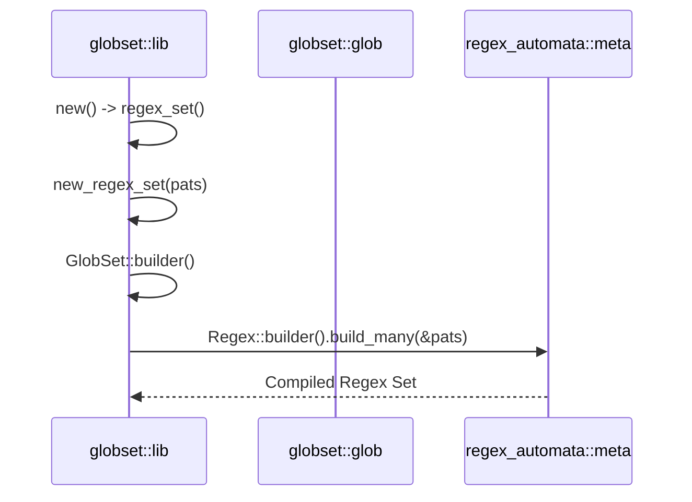
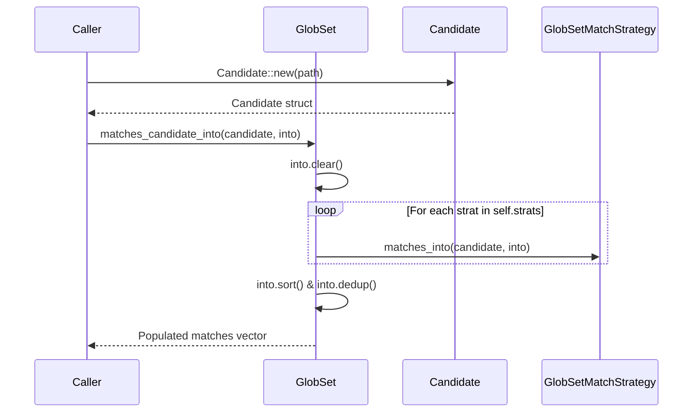

# Glob Matching

Relevant source files

The following files were used as context for generating this wiki page:

- [crates/globset/src/lib.rs](https://github.com/BurntSushi/ripgrep/blob/main/crates/globset/src/lib.rs)
- [crates/globset/src/glob.rs](https://github.com/BurntSushi/ripgrep/blob/main/crates/globset/src/glob.rs)
- [crates/ignore/src/gitignore.rs](https://github.com/BurntSushi/ripgrep/blob/main/crates/ignore/src/gitignore.rs)
- [crates/ignore/src/dir.rs](https://github.com/BurntSushi/ripgrep/blob/main/crates/ignore/src/dir.rs)

## Overview

Glob matching provides cross-platform pattern evaluation for single files and sets of globs, driving core filtering mechanisms throughout ripgrep. It translates Unix-style shell patterns into robust regular expression automata and specialized match strategies, enabling efficient simultaneous evaluation against candidate paths. By bridging raw glob syntax with directory traversal and version control ignore semantics, the matching engine efficiently processes complex rules while respecting hierarchical precedence and whitelist overrides.

Sources: [crates/globset/src/lib.rs:2-13](https://github.com/BurntSushi/ripgrep/blob/main/crates/globset/src/lib.rs#L2-L13), [crates/ignore/src/gitignore.rs:1-8](https://github.com/BurntSushi/ripgrep/blob/main/crates/ignore/src/gitignore.rs#L1-L8), [crates/ignore/src/dir.rs:1-14](https://github.com/BurntSushi/ripgrep/blob/main/crates/ignore/src/dir.rs#L1-L14)

## Glob Parsing and AST Construction

### Overview

Raw glob strings are processed by `GlobBuilder::build()` which initializes a `Parser` containing character iterators, alternation stacks, and active token branches. The parser consumes characters sequentially using `Parser::parse()`, translating glob wildcards, character classes, and brace expansions into an abstract syntax tree composed of `Token` variants.

Sources: [crates/globset/src/glob.rs:578-590](https://github.com/BurntSushi/ripgrep/blob/main/crates/globset/src/glob.rs#L578-L590), [crates/globset/src/glob.rs:791-837](https://github.com/BurntSushi/ripgrep/blob/main/crates/globset/src/glob.rs#L791-L837)

### Parser Operation and Token Translation

The parsing engine walks the input string via `Parser::parse()`, dispatching specific metacharacters to dedicated handler routines. Single asterisks (`*`) are routed to `Parser::parse_star()`, brackets (`[`) invoke `Parser::parse_class()`, braces (`{`) invoke `Parser::push_alternate()`, commas (`,`) invoke `Parser::parse_comma()`, closing braces (`}`) invoke `Parser::pop_alternate()`, and backslashes (`\`) invoke `Parser::parse_backslash()`. All other scalar values are stored as literal tokens.

Sources: [crates/globset/src/glob.rs:823-837](https://github.com/BurntSushi/ripgrep/blob/main/crates/globset/src/glob.rs#L823-L837)

The parser manages alternation branches using `alternates_stack` and `branches`. When an opening brace `{` is encountered, `Parser::push_alternate()` pushes the current branch count onto `alternates_stack` and appends a new default `Tokens` container to `branches`. Commas inside alternates trigger `Parser::parse_comma()`, which pushes a new branch onto `branches` if an alternation is active. When a closing brace `}` is reached, `Parser::pop_alternate()` drains the active branches from the stack and wraps them in a `Token::Alternates` variant, pushing it to the parent branch.

Sources: [crates/globset/src/glob.rs:839-853](https://github.com/BurntSushi/ripgrep/blob/main/crates/globset/src/glob.rs#L839-L853), [crates/globset/src/glob.rs:876-885](https://github.com/BurntSushi/ripgrep/blob/main/crates/globset/src/glob.rs#L876-L885)

> [!WARNING]
> When `allow_unclosed_class` is enabled in `GlobOptions`, an unclosed character class starting with `[` is intercepted by `Parser::parse_class()` upon reaching the end of input, rolling back the parser state and treating the opening bracket as a literal `[`. To prevent quadratic time complexity caused by deeply nested or unclosed bracket sequences like `[[[[[[[[[[[[`, `found_unclosed_class` permanently disables subsequent class parsing for that glob instance once triggered.

Sources: [crates/globset/src/glob.rs:805-814](https://github.com/BurntSushi/ripgrep/blob/main/crates/globset/src/glob.rs#L805-L814), [crates/globset/src/glob.rs:962-1006](https://github.com/BurntSushi/ripgrep/blob/main/crates/globset/src/glob.rs#L962-L1006)

### Token Variants and Regex Translation

The AST representation relies on the `Token` enum, defining distinct structures for matching semantics. Once parsing completes, `Tokens::to_regex_with()` translates these tokens into a regular expression string prefixed with `(type-modifiers)`.

| Token Variant | Value / Structure | Regex Translation Output (`tokens_to_regex`) |
| :--- | :--- | :--- |
| `Token::Literal(char)` | `char` | Escaped literal sequence via `char_to_escaped_literal` |
| `Token::Any` | None | `[^/]` if `literal_separator` is true; otherwise `.` |
| `Token::ZeroOrMore` | None | `[^/]*` if `literal_separator` is true; otherwise `.*` |
| `Token::RecursivePrefix` | None | `(?:/?|./*)` |
| `Token::RecursiveSuffix` | None | `/.*` |
| `Token::RecursiveZeroOrMore` | None | `(?:/|/.*/)` |
| `Token::Class` | `{ negated: bool, ranges: Vec<(char, char)> }` | `[...]` or `[^...]` with escaped range boundaries |
| `Token::Alternates` | `Vec<Tokens>` | `(?:alt1|alt2|...)` |

Sources: [crates/globset/src/glob.rs:268-279](https://github.com/BurntSushi/ripgrep/blob/main/crates/globset/src/glob.rs#L268-L279), [crates/globset/src/glob.rs:673-763](https://github.com/BurntSushi/ripgrep/blob/main/crates/globset/src/glob.rs#L673-L763)

## GlobSet Building and Regex Compilation

### Overview

The `GlobSet` and `GlobSetBuilder` structures aggregate multiple individual glob patterns into a unified collection, analyzing and partitioning them into optimized matching strategies during compilation. Rather than treating all patterns uniformly as regular expressions, `GlobSet::new()` inspects each pattern's structure to select the most efficient evaluation path.

Sources: [crates/globset/src/lib.rs:306-312](https://github.com/BurntSushi/ripgrep/blob/main/crates/globset/src/lib.rs#L306-L312), [crates/globset/src/lib.rs:458-514](https://github.com/BurntSushi/ripgrep/blob/main/crates/globset/src/lib.rs#L458-L514)

### Strategy Selection and Partitioning

When `GlobSetBuilder::build()` or `GlobSet::new()` processes a collection of glob patterns, it iterates through each entry, wraps it in a `MatchStrategy`, and bins it into one of seven specialized strategy containers.

| MatchStrategy Variant | Underlying Collection / Engine | Matching Condition |
| :--- | :--- | :--- |
| `MatchStrategy::Extension` | `ExtensionStrategy` (`fnv::HashMap<Vec<u8>, Vec<usize>>`) | Path extension exactly matches table key. |
| `MatchStrategy::BasenameLiteral` | `BasenameLiteralStrategy` (`fnv::HashMap<Vec<u8>, Vec<usize>>`) | Path basename exactly matches table key. |
| `MatchStrategy::Literal` | `LiteralStrategy` (`fnv::HashMap<Vec<u8>, Vec<usize>>`) | Entire path exactly matches table key. |
| `MatchStrategy::Suffix` | `SuffixStrategy` (Aho-Corasick automaton) | Path suffix matches overlapping automaton pattern at end of path. |
| `MatchStrategy::Prefix` | `PrefixStrategy` (Aho-Corasick automaton) | Path prefix matches overlapping automaton pattern at start of path. |
| `MatchStrategy::RequiredExtension` | `RequiredExtensionStrategy` (Hash map of regex vectors) | Path extension matches key, followed by full regex evaluation. |
| `MatchStrategy::Regex` | `RegexSetStrategy` (Regex Automata `Regex` set) | Matches against a compiled multi-pattern regular expression set. |

Sources: [crates/globset/src/glob.rs:15-47](https://github.com/BurntSushi/ripgrep/blob/main/crates/globset/src/glob.rs#L15-L47), [crates/globset/src/lib.rs:483-513](https://github.com/BurntSushi/ripgrep/blob/main/crates/globset/src/lib.rs#L483-L513)

### Compilation and Call-Chain Execution

When compiling regex sets and builders, the system follows a strict call-chain execution flow (`New -> Builder` chain):

1. `new` (in `crates/globset/src/lib.rs`) invokes `GlobSet::new()` or initializes the glob set builder lifecycle.
   Sources: [crates/globset/src/lib.rs:1073-1075](https://github.com/BurntSushi/ripgrep/blob/main/crates/globset/src/lib.rs#L1073-L1075)
2. `regex_set` (in `crates/globset/src/lib.rs`) invokes `MultiStrategyBuilder::regex_set()` to compile collected literal strings into a multi-pattern regex set.
   Sources: [crates/globset/src/lib.rs:1050-1060](https://github.com/BurntSushi/ripgrep/blob/main/crates/globset/src/lib.rs#L1050-L1060)
3. `new_regex_set` (in `crates/globset/src/lib.rs`) configures `regex_automata::MatchKind::All`, sets byte-mode UTF-8 configuration via `syntax` rules, and executes `Regex::builder().build_many(&pats)`.
   Sources: [crates/globset/src/lib.rs:286-303](https://github.com/BurntSushi/ripgrep/blob/main/crates/globset/src/lib.rs#L286-L303)
4. `builder` (in `regex_automata::meta::Regex`) constructs the underlying multi-pattern automaton and returns the compiled matcher builder.
   Sources: [crates/globset/src/lib.rs:318-320](https://github.com/BurntSushi/ripgrep/blob/main/crates/globset/src/lib.rs#L318-L320)

Similarly, compiling individual regular expressions follows a parallel invocation sequence:

1. `new` (in `crates/globset/src/lib.rs`) invokes pattern compilation.
   Sources: [crates/globset/src/lib.rs:461-465](https://github.com/BurntSushi/ripgrep/blob/main/crates/globset/src/lib.rs#L461-L465)
2. `regex_set` or `new_regex` prepares compilation parameters.
   Sources: [crates/globset/src/lib.rs:271-285](https://github.com/BurntSushi/ripgrep/blob/main/crates/globset/src/lib.rs#L271-L285)
3. `new_regex_set` wraps syntax configurations.
   Sources: [crates/globset/src/lib.rs:287-304](https://github.com/BurntSushi/ripgrep/blob/main/crates/globset/src/lib.rs#L287-L304)
4. `syntax` (in `regex_automata::util::syntax`) establishes byte-oriented parsing rules without UTF-8 validation constraints.
   Sources: [crates/globset/src/lib.rs:272-274](https://github.com/BurntSushi/ripgrep/blob/main/crates/globset/src/lib.rs#L272-L274)

Sources: [crates/globset/src/lib.rs:286-303](https://github.com/BurntSushi/ripgrep/blob/main/crates/globset/src/lib.rs#L286-L303), [crates/globset/src/lib.rs:318-320](https://github.com/BurntSushi/ripgrep/blob/main/crates/globset/src/lib.rs#L318-L320), [crates/globset/src/lib.rs:1050-1060](https://github.com/BurntSushi/ripgrep/blob/main/crates/globset/src/lib.rs#L1050-L1060)

### Design Trade-Offs

| Design Choice | Benefit | Cost |
| :--- | :--- | :--- |
| **Strategy Partitioning** | Avoids heavy regex evaluation for literal, prefix, and suffix matches. | Increases builder complexity and requires maintaining multiple distinct collection types. |
| **PatternSet Pools (`ArcoolatternSet>>`)** | Amortizes allocation overhead across high-frequency matching passes. | Introduces interior synchronization and pool management overhead. |
| **Byte-oriented Regex Config (`utf8(false)`)** | Permits matching against arbitrary non-UTF-8 paths and raw OS byte sequences. | Disables Unicode character class optimizations during matching. |

Sources: [crates/globset/src/lib.rs:271-274](https://github.com/BurntSushi/ripgrep/blob/main/crates/globset/src/lib.rs#L271-L274), [crates/globset/src/lib.rs:483-513](https://github.com/BurntSushi/ripgrep/blob/main/crates/globset/src/lib.rs#L483-L513), [crates/globset/src/lib.rs:964-976](https://github.com/BurntSushi/ripgrep/blob/main/crates/globset/src/lib.rs#L964-L976)

> [!NOTE]
> `RegexSetStrategy` utilizes an `ArcoolatternSet, PatternSetPoolFn>>` to manage reusable pattern match sets across match queries. When `RegexSetStrategy::matches_into()` executes, it acquires a guard from the pool, clears previous states via `patset.clear()`, evaluates overlapping matches, and returns the guard to the pool via `PoolGuard::put(patset)` to prevent memory reallocation on subsequent matching calls.

Sources: [crates/globset/src/lib.rs:964-976](https://github.com/BurntSushi/ripgrep/blob/main/crates/globset/src/lib.rs#L964-L976), [crates/globset/src/lib.rs:986-1012](https://github.com/BurntSushi/ripgrep/blob/main/crates/globset/src/lib.rs#L986-1012)

## Strategic Matching and Candidate Execution

### Overview

Path candidate execution dispatches pre-parsed candidate byte arrays across the active compiled match strategies inside a `GlobSet`. When evaluating candidates, the matching process delegates directly through `GlobSet::is_match_candidate()` or `GlobSet::matches_candidate_into()`, iterating sequentially over the configured collection of `GlobSetMatchStrategy` variants to check for matches, collect all matching pattern indices, or verify that all globs match.

Sources: [crates/globset/src/lib.rs:350-360](https://github.com/BurntSushi/ripgrep/blob/main/crates/globset/src/lib.rs#L350-L360), [crates/globset/src/lib.rs:442-456](https://github.com/BurntSushi/ripgrep/blob/main/crates/globset/src/lib.rs#L442-L456)

### Candidate Execution Walkthrough

The candidate execution pipeline flows through specific core functions to process file paths efficiently:

1. `Candidate::new()` (in `crates/globset/src/lib.rs`) receives a file path reference, passes it through `Vec::from_path_lossy()`, and calls `Candidate::from_cow()`.
   Sources: [crates/globset/src/lib.rs:617-619](https://github.com/BurntSushi/ripgrep/blob/main/crates/globset/src/lib.rs#L617-L619)
2. `Candidate::from_cow()` normalizes the path via `normalize_path()`, extracts the filename via `file_name()`, and isolates the file extension via `file_name_ext()`.
   Sources: [crates/globset/src/lib.rs:633-638](https://github.com/BurntSushi/ripgrep/blob/main/crates/globset/src/lib.rs#L633-L638)
3. `GlobSet::matches_candidate_into()` iterates over every active `GlobSetMatchStrategy` stored in `self.strats` and dispatches the candidate to `strat.matches_into()`.
   Sources: [crates/globset/src/lib.rs:451-453](https://github.com/BurntSushi/ripgrep/blob/main/crates/globset/src/lib.rs#L451-L453)
4. Strategy-specific handlers (`LiteralStrategy`, `BasenameLiteralStrategy`, `ExtensionStrategy`, `PrefixStrategy`, `SuffixStrategy`, `RequiredExtensionStrategy`, and `RegexSetStrategy`) test the candidate components or execute Aho-Corasick / regex matching routines.
   Sources: [crates/globset/src/lib.rs:684-692](https://github.com/BurntSushi/ripgrep/blob/main/crates/globset/src/lib.rs#L684-L692)
5. `GlobSet::matches_candidate_into()` finalizes the output vector by invoking `into.sort()` and `into.dedup()` to ensure indices are ordered correctly and duplicates are removed.
   Sources: [crates/globset/src/lib.rs:454-455](https://github.com/BurntSushi/ripgrep/blob/main/crates/globset/src/lib.rs#L454-L455)

Sources: [crates/globset/src/lib.rs:442-456](https://github.com/BurntSushi/ripgrep/blob/main/crates/globset/src/lib.rs#L442-L456), [crates/globset/src/lib.rs:617-619](https://github.com/BurntSushi/ripgrep/blob/main/crates/globset/src/lib.rs#L617-L619)

### Strategy Matcher Reference

| Strategy Type | Underlying Matcher Structure | Matching Condition |
| :--- | :--- | :--- |
| **Literal** | `fnv::HashMap<Vec<u8>, Vec<usize>>` | Candidate path matches key exactly. |
| **BasenameLiteral** | `fnv::HashMap<Vec<u8>, Vec<usize>>` | Candidate basename matches key exactly. |
| **Extension** | `fnv::HashMap<Vec<u8>, Vec<usize>>` | Candidate extension matches key exactly. |
| **Prefix** | `PrefixStrategy` (Aho-Corasick) | Overlapping match starts at index `0` of path prefix. |
| **Suffix** | `SuffixStrategy` (Aho-Corasick) | Overlapping match ends at `path.len()` of path suffix. |
| **RequiredExtension** | `RequiredExtensionStrategy` (HashMap + Regex) | Candidate extension matches map key AND compiled regex matches path. |
| **Regex** | `RegexSetStrategy` (Regex + Pool) | Overlapping regex set matches candidate path bytes. |

Sources: [crates/globset/src/lib.rs:710-1013](https://github.com/BurntSushi/ripgrep/blob/main/crates/globset/src/lib.rs#L710-L1013)

> [!WARNING]
> `PrefixStrategy` and `SuffixStrategy` bound candidate inspection lengths using `candidate.path_prefix(self.longest)` and `candidate.path_suffix(self.longest)` where `self.longest` represents the length of the longest literal string in the strategy builder. If a candidate path exceeds `longest`, it is sliced to prevent scanning unnecessary leading or trailing bytes.

Sources: [crates/globset/src/lib.rs:640-650](https://github.com/BurntSushi/ripgrep/blob/main/crates/globset/src/lib.rs#L640-L650), [crates/globset/src/lib.rs:826-827](https://github.com/BurntSushi/ripgrep/blob/main/crates/globset/src/lib.rs#L826-L827), [crates/globset/src/lib.rs:871-872](https://github.com/BurntSushi/ripgrep/blob/main/crates/globset/src/lib.rs#L871-L872)

> [!NOTE]
> `RequiredExtensionStrategy` serves as a necessary but non-sufficient optimization: `candidate.ext` must hit the hash map, after which individual compiled regular expressions are executed against the full candidate path via `re.is_match(candidate.path.as_bytes())`.

Sources: [crates/globset/src/lib.rs:911-925](https://github.com/BurntSushi/ripgrep/blob/main/crates/globset/src/lib.rs#L911-L925)

## Gitignore Integration and Precedence Rules

### Overview

The `gitignore` module translates standard `gitignore` file syntax into underlying glob and regex matching rules while preserving specific precedence and whitelist overriding mechanics. It parses files line by line, handling comments, byte order marks, directory constraints (`/`), and negation prefixes (`!`).

Sources: [crates/ignore/src/gitignore.rs:1-8](https://github.com/BurntSushi/ripgrep/blob/main/crates/ignore/src/gitignore.rs#L1-L8), [crates/ignore/src/gitignore.rs:403-535](https://github.com/BurntSushi/ripgrep/blob/main/crates/ignore/src/gitignore.rs#L403-L535)

### Call-Chain Execution Walkthrough

Matching a candidate path against a gitignore ruleset proceeds through a defined pipeline of stripping, candidate building, glob set execution, and last-wins index evaluation:

1. `Gitignore::matched()` checks if the matcher is empty, then invokes `self.strip(path.as_ref())` to normalize relative path prefixes and root overlap before delegating to `self.matched_stripped()`.
   Sources: [crates/ignore/src/gitignore.rs:202-211](https://github.com/BurntSushi/ripgrep/blob/main/crates/ignore/src/gitignore.rs#L202-L211)
2. `Gitignore::matched_stripped()` acquires a reusable match vector from `self.matches` via a pool, instantiates a `Candidate::new(path)`, and executes `self.set.matches_candidate_into(&candidate, &mut *matches)`.
   Sources: [crates/ignore/src/gitignore.rs:259-270](https://github.com/BurntSushi/ripgrep/blob/main/crates/ignore/src/gitignore.rs#L259-L270)
3. The method iterates over the matching glob indices in reverse order (`matches.iter().rev()`), implementing git's "last pattern wins" precedence rule where later patterns override earlier ones.
   Sources: [crates/ignore/src/gitignore.rs:271-272](https://github.com/BurntSushi/ripgrep/blob/main/crates/ignore/src/gitignore.rs#L271-L272)
4. For each matched index, it verifies directory constraints (`!glob.is_only_dir() || is_dir`) and returns either `Match::Whitelist(glob)` or `Match::Ignore(glob)`.
   Sources: [crates/ignore/src/gitignore.rs:273-280](https://github.com/BurntSushi/ripgrep/blob/main/crates/ignore/src/gitignore.rs#L273-L280)

> [!WARNING]
> Iterating matching glob indices in reverse (`matches.iter().rev()`) is critical for correctness: git semantics dictate that later entries in a `.gitignore` file override earlier ones, meaning the highest-indexed matching glob takes precedence.

Sources: [crates/ignore/src/gitignore.rs:271-272](https://github.com/BurntSushi/ripgrep/blob/main/crates/ignore/src/gitignore.rs#L271-L272)

### Gitignore Pattern Translation Rules

| Pattern Syntax | Transformed Actual Glob | Purpose & Behavior |
| :--- | :--- | :--- |
| `!` prefix | Stripped (`is_whitelist = true`) | Whitelists previously ignored paths, overriding ignore rules. |
| `/` prefix | Stripped (`is_absolute = true`) | Restricts matching to the root of the gitignore directory by disabling unanchored `**/` prefixing. |
| `/` suffix | Stripped (`is_only_dir = true`) | Restricts the glob to match directories only, ignoring files with identical names. |
| `/**` suffix | `/**/*` | Forces matching of everything inside a directory while excluding the directory itself. |
| No literal slash | `**/attern>` | Prepends `**/` to allow unanchored matching anywhere beneath the root directory. |

Sources: [crates/ignore/src/gitignore.rs:482-525](https://github.com/BurntSushi/ripgrep/blob/main/crates/ignore/src/gitignore.rs#L482-L525)

> [!NOTE]
> When a gitignore line ends with a trailing slash followed by an escaped backslash (`\\/`), the parser strips both characters to correctly support escaped path separators in directory-only patterns.

Sources: [crates/ignore/src/gitignore.rs:501-509](https://github.com/BurntSushi/ripgrep/blob/main/crates/ignore/src/gitignore.rs#L501-L509)

## Directory Traversal Matcher Tree

### Overview

The `dir` module connects recursive directory traversal with ignore matchers by maintaining a persistent tree structure where each `Ignore` node logically corresponds to the ignore rules of a single directory and points to its parent matcher.

Sources: [crates/ignore/src/dir.rs:1-6](https://github.com/BurntSushi/ripgrep/blob/main/crates/ignore/src/dir.rs#L1-L6), [crates/ignore/src/dir.rs:93-112](https://github.com/BurntSushi/ripgrep/blob/main/crates/ignore/src/dir.rs#L93-L112)

### Call-Chain Execution Walkthrough

Adding and traversing parent directories during a recursive file tree walk executes through a specific sequence of canonicalization, caching, and child path creation:

1. `Ignore::add_parents()` checks if parent ignore rules are required, ensures it is called on a root matcher, and canonicalizes the target path into an `absolute_base`.
   Sources: [crates/ignore/src/dir.rs:192-217](https://github.com/BurntSushi/ripgrep/blob/main/crates/ignore/src/dir.rs#L192-L217)
2. It collects all ancestor paths from child to root, then iterates through them in reverse (`parents.into_iter().rev()`) from root down to child.
   Sources: [crates/ignore/src/dir.rs:218-227](https://github.com/BurntSushi/ripgrep/blob/main/crates/ignore/src/dir.rs#L218-L227)
3. For each ancestor directory, it checks the thread-safe `compiled` cache (`HashMap<OsString, Weak<IgnoreInner>>`) for a prebuilt matcher. If present, it upgrades the `Weak` pointer and reuses the cached inner matcher.
   Sources: [crates/ignore/src/dir.rs:228-237](https://github.com/BurntSushi/ripgrep/blob/main/crates/ignore/src/dir.rs#L228-L237)
4. If absent, `ig.add_child_path(parent)` is invoked to discover and compile ignore files (`.ignore`, `.gitignore`, `.git/info/exclude`), wrapping the result in an `Arc` and inserting it back into the `compiled` cache.
   Sources: [crates/ignore/src/dir.rs:238-255](https://github.com/BurntSushi/ripgrep/blob/main/crates/ignore/src/dir.rs#L238-L255)

> [!TIP]
> Parent matchers are cached globally across search roots using weak references (`Weak<IgnoreInner>`) inside a `RwLock<HashMap>`, avoiding redundant glob set compilation when multiple paths share common ancestor directories.

Sources: [crates/ignore/src/dir.rs:122-122](https://github.com/BurntSushi/ripgrep/blob/main/crates/ignore/src/dir.rs#L122-L122), [crates/ignore/src/dir.rs:228-237](https://github.com/BurntSushi/ripgrep/blob/main/crates/ignore/src/dir.rs#L228-L237)

### Ignore Options and Precedence Configuration

| Option Field | Default Value | Purpose & Behavior |
| :--- | :--- | :--- |
| `hidden` | `true` | Enables ignoring hidden file paths. |
| `ignore` | `true` | Enables reading `.ignore` files. |
| `parents` | `true` | Enables respecting ignore files in parent directories. |
| `git_global` | `true` | Enables reading git's global gitignore file. |
| `git_ignore` | `true` | Enables reading `.gitignore` files. |
| `git_exclude` | `true` | Enables reading `.git/info/exclude` files. |
| `ignore_case_insensitive` | `false` | Enables case-insensitive matching for ignore rules. |
| `require_git` | `true` | Requires a git repository to be present before applying git-related ignore rules. |

Sources: [crates/ignore/src/dir.rs:792-801](https://github.com/BurntSushi/ripgrep/blob/main/crates/ignore/src/dir.rs#L792-801)

### Design Trade-Offs Table

| Design Choice | Benefit | Cost |
| :--- | :--- | :--- |
| Persistent `Ignore` tree with `Arc<IgnoreInner>` | Enables safe sharing of parent matchers across parallel directory iterator threads. | Increased pointer indirection and reference-counting overhead during traversal. |
| Caching compiled parent matchers via `Weak` references | Eliminates duplicate disk I/O and glob set compilation for shared ancestor directories. | Synchronization overhead on the `RwLock` cache when discovering new directories. |
| Fast-path file existence checks (`ignore_files_list`) | Avoids unnecessary `stat` or `open` syscalls when directory entries are already known from `read_dir`. | Requires collecting and passing directory entry metadata down traversal calls. |

Sources: [crates/ignore/src/dir.rs:8-9](https://github.com/BurntSushi/ripgrep/blob/main/crates/ignore/src/dir.rs#L8-9), [crates/ignore/src/dir.rs:115-122](https://github.com/BurntSushi/ripgrep/blob/main/crates/ignore/src/dir.rs#L115-L122), [crates/ignore/src/dir.rs:284-301](https://github.com/BurntSushi/ripgrep/blob/main/crates/ignore/src/dir.rs#L284-301)

## Related

- [[Glob Pattern Parsing]]
- [[Path Overrides]]

