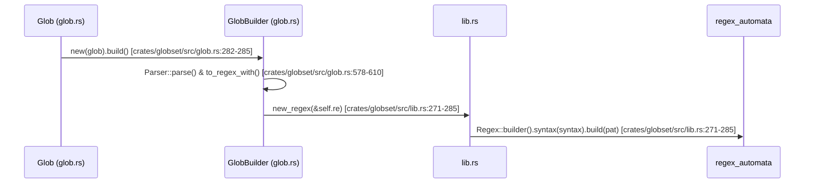

# Glob Pattern Parsing

<details>
<summary>Relevant source files</summary>

The following files were used as context for generating this wiki page:

- [crates/globset/src/lib.rs](https://github.com/BurntSushi/ripgrep/blob/main/crates/globset/src/lib.rs)
- [crates/globset/src/glob.rs](https://github.com/BurntSushi/ripgrep/blob/main/crates/globset/src/glob.rs)
- [crates/ignore/src/gitignore.rs](https://github.com/BurntSushi/ripgrep/blob/main/crates/ignore/src/gitignore.rs)
- [crates/regex/src/literal.rs](https://github.com/BurntSushi/ripgrep/blob/main/crates/regex/src/literal.rs)
- [crates/index/src/literal.rs](https://github.com/BurntSushi/ripgrep/blob/main/crates/index/src/literal.rs)
</details>

## Overview

Glob pattern parsing provides the core foundation for matching Unix-style shell wildcards and `.gitignore` file specifications against file paths in ripgrep. By transforming glob expressions into optimized regular expressions and high-performance match sets, this subsystem enables both single-pattern evaluations and simultaneous multi-glob evaluations against candidate paths. It bridges user-facing file matching syntax with underlying regex automata engines while supporting specialized features such as case-insensitivity, literal path separators, negative exclusions, and directory-only constraints. Sources: [crates/globset/src/lib.rs](https://github.com/BurntSushi/ripgrep/blob/main/crates/globset/src/lib.rs#L2-L13), [crates/globset/src/glob.rs](https://github.com/BurntSushi/ripgrep/blob/main/crates/globset/src/glob.rs#L70-L81), [crates/ignore/src/gitignore.rs](https://github.com/BurntSushi/ripgrep/blob/main/crates/ignore/src/gitignore.rs#L27-L43)

## Public Glob API and Builder Pipeline

### Overview

The public glob API and builder pipeline provides high-level entry points for configuring, constructing, and matching individual glob patterns and collective glob sets. It orchestrates user-facing builder patterns via `GlobBuilder` and `GlobSetBuilder`, routing parsed specifications through compilation pipelines to produce reusable `Glob`, `GlobMatcher`, and `GlobSet` handles. Sources: [crates/globset/src/lib.rs](https://github.com/BurntSushi/ripgrep/blob/main/crates/globset/src/lib.rs#L30-L64), [crates/globset/src/glob.rs](https://github.com/BurntSushi/ripgrep/blob/main/crates/globset/src/glob.rs#L204-L216)

### Call-Chain Execution Walkthrough and Syntax Initialization

1. `GlobSet::new` (defined in [crates/globset/src/lib.rs](https://github.com/BurntSushi/ripgrep/blob/main/crates/globset/src/lib.rs#L461-L470)) initiates creation of a glob set by checking if the iterator is empty.
2. `GlobSet::new` calls `regex_set` (defined in [crates/globset/src/lib.rs](https://github.com/BurntSushi/ripgrep/blob/main/crates/globset/src/lib.rs#L1050-L1060)) to configure multi-pattern regex matching strategy builders.
3. `MultiStrategyBuilder::regex_set` calls `new_regex_set` (defined in [crates/globset/src/lib.rs](https://github.com/BurntSushi/ripgrep/blob/main/crates/globset/src/lib.rs#L286-L303)) to build an overlapping regex matcher across multiple patterns.
4. `new_regex_set` configures non-UTF8 matching (`utf8(false)`) and dot-matching syntax before building automata, invoking the macro-defined syntax handling (`syntax!` macro defined in [crates/globset/src/glob.rs](https://github.com/BurntSushi/ripgrep/blob/main/crates/globset/src/glob.rs#L1092-L1100)).
5. `Glob::new` initializes a new glob pattern using default options by invoking `GlobBuilder::new(glob).build()` (defined in [crates/globset/src/glob.rs](https://github.com/BurntSushi/ripgrep/blob/main/crates/globset/src/glob.rs#L282-L285)).
6. `GlobBuilder::build` instantiates a `Parser` over the pattern string, executes `p.parse()`, and compiles the resulting tokens into a regular expression via `tokens.to_regex_with(&self.opts)` (defined in [crates/globset/src/glob.rs](https://github.com/BurntSushi/ripgrep/blob/main/crates/globset/src/glob.rs#L578-L610)).
7. `new_regex` configures regex automata syntax and compilation parameters (`utf8(false)`, `dot_matches_new_line(true)`) before building the compiled `Regex` (defined in [crates/globset/src/lib.rs](https://github.com/BurntSushi/ripgrep/blob/main/crates/globset/src/lib.rs#L271-L285)).

Sources: [crates/globset/src/lib.rs](https://github.com/BurntSushi/ripgrep/blob/main/crates/globset/src/lib.rs#L271-L303), [crates/globset/src/lib.rs](https://github.com/BurntSushi/ripgrep/blob/main/crates/globset/src/lib.rs#L461-L470), [crates/globset/src/lib.rs](https://github.com/BurntSushi/ripgrep/blob/main/crates/globset/src/lib.rs#L1050-L1060), [crates/globset/src/glob.rs](https://github.com/BurntSushi/ripgrep/blob/main/crates/globset/src/glob.rs#L282-L285), [crates/globset/src/glob.rs](https://github.com/BurntSushi/ripgrep/blob/main/crates/globset/src/glob.rs#L578-L610), [crates/globset/src/glob.rs](https://github.com/BurntSushi/ripgrep/blob/main/crates/globset/src/glob.rs#L1092-L1100)



Sources: [crates/globset/src/lib.rs](https://github.com/BurntSushi/ripgrep/blob/main/crates/globset/src/lib.rs#L271-L303), [crates/globset/src/glob.rs](https://github.com/BurntSushi/ripgrep/blob/main/crates/globset/src/glob.rs#L282-L285), [crates/globset/src/glob.rs](https://github.com/BurntSushi/ripgrep/blob/main/crates/globset/src/glob.rs#L578-L610), [crates/globset/src/glob.rs](https://github.com/BurntSushi/ripgrep/blob/main/crates/globset/src/glob.rs#L1092-L1100)

### Configuration Options and Match Strategies

`GlobBuilder` exposes several configuration toggles to customize match semantics. The resulting patterns are categorized into specific matching strategies (`MatchStrategy`) during `GlobSet` construction to optimize execution.

| Option Method | Default Value | Purpose |
| :--- | :--- | :--- |
| `case_insensitive` | `false` | Toggle whether the pattern matches case insensitively. |
| `literal_separator` | `false` | Require a literal `/` to match path separators (e.g. `*` won't match `/`). |
| `backslash_escape` | Platform-dependent | Enable `\` to escape special characters and prevent `\` path separator interpretation. |
| `empty_alternates` | `false` | Accept empty patterns in alternates (e.g. `foo{,.txt}` matches `foo`). |
| `allow_unclosed_class` | `false` | Treat unclosed character classes (e.g. `[abc`) as literal text rather than parse errors. |

Sources: [crates/globset/src/glob.rs](https://github.com/BurntSushi/ripgrep/blob/main/crates/globset/src/glob.rs#L8-L47), [crates/globset/src/glob.rs](https://github.com/BurntSushi/ripgrep/blob/main/crates/globset/src/glob.rs#L239-L249), [crates/globset/src/glob.rs](https://github.com/BurntSushi/ripgrep/blob/main/crates/globset/src/glob.rs#L612-L666)

### Design Trade-offs

| Design Choice | Benefit | Cost |
| :--- | :--- | :--- |
| **Strategy Pre-categorization** (`MatchStrategy`) | Bypasses general regex evaluation for fast-path literals, basenames, and extensions. Sources: [crates/globset/src/glob.rs](https://github.com/BurntSushi/ripgrep/blob/main/crates/globset/src/glob.rs#L8-L48) | Increases builder orchestration complexity and compilation overhead. Sources: [crates/globset/src/lib.rs](https://github.com/BurntSushi/ripgrep/blob/main/crates/globset/src/lib.rs#L461-L514) |
| **Path Normalization via Candidates** (`Candidate`) | Amortizes path decomposition (basename, extension, byte slice) across multiple matchers. Sources: [crates/globset/src/lib.rs](https://github.com/BurntSushi/ripgrep/blob/main/crates/globset/src/lib.rs#L592-L604) | Requires temporary allocation and Cow wrapping per candidate path. Sources: [crates/globset/src/lib.rs](https://github.com/BurntSushi/ripgrep/blob/main/crates/globset/src/lib.rs#L616-L638) |
| **Pattern Pool Isolation** (`PatternSet` pool) | Avoids repeated allocation of match result sets during multi-pattern evaluation. Sources: [crates/globset/src/lib.rs](https://github.com/BurntSushi/ripgrep/blob/main/crates/globset/src/lib.rs#L964-L976) | Introduces synchronization and pool management overhead within `RegexSetStrategy`. Sources: [crates/globset/src/lib.rs](https://github.com/BurntSushi/ripgrep/blob/main/crates/globset/src/lib.rs#L981-L1013) |

Sources: [crates/globset/src/lib.rs](https://github.com/BurntSushi/ripgrep/blob/main/crates/globset/src/lib.rs#L461-L553), [crates/globset/src/lib.rs](https://github.com/BurntSushi/ripgrep/blob/main/crates/globset/src/lib.rs#L598-L638), [crates/globset/src/lib.rs](https://github.com/BurntSushi/ripgrep/blob/main/crates/globset/src/lib.rs#L964-L976), [crates/globset/src/glob.rs](https://github.com/BurntSushi/ripgrep/blob/main/crates/globset/src/glob.rs#L50-L68)

> [!NOTE]
> `GlobSet::new` inspects each added glob's `MatchStrategy` and partitions them into separate optimized strategy collections (such as `LiteralStrategy`, `ExtensionStrategy`, `PrefixStrategy`, and `RegexSetStrategy`), executing them in order of specificity during candidate matching. Sources: [crates/globset/src/lib.rs](https://github.com/BurntSushi/ripgrep/blob/main/crates/globset/src/lib.rs#L471-L553)

## Glob Tokenization and AST Parsing

### Overview

The glob parser consumes character streams and translates them into an Abstract Syntax Tree (AST) composed of `Token` variants. The `Parser` struct maintains state over a peekable character iterator (`std::iter::Peekable<std::str::Chars>`), tracking the current and previous characters, active alternation stacks, and branch collections.

Sources: [crates/globset/src/glob.rs](https://github.com/BurntSushi/ripgrep/blob/main/crates/globset/src/glob.rs#L791-L816)

### Token Variants and Parsing Rules

The parser dispatches incoming characters through `Parser::parse()`, instantiating specific AST tokens depending on pattern syntax and configuration options.

| Token Variant | Underlying Syntax | Description |
| :--- | :--- | :--- |
| `Token::Literal(char)` | Literal characters or escaped chars | Matches a precise character value. Sources: [crates/globset/src/glob.rs](https://github.com/BurntSushi/ripgrep/blob/main/crates/globset/src/glob.rs#L270-L272) |
| `Token::Any` | `?` | Matches any single character (or any non-separator byte if `literal_separator` is enabled). Sources: [crates/globset/src/glob.rs](https://github.com/BurntSushi/ripgrep/blob/main/crates/globset/src/glob.rs#L270-L273) |
| `Token::ZeroOrMore` | `*` | Matches zero or more arbitrary characters. Sources: [crates/globset/src/glob.rs](https://github.com/BurntSushi/ripgrep/blob/main/crates/globset/src/glob.rs#L270-L274) |
| `Token::RecursivePrefix` | `**` (at start) | Matches leading path components or an empty prefix. Sources: [crates/globset/src/glob.rs](https://github.com/BurntSushi/ripgrep/blob/main/crates/globset/src/glob.rs#L270-L275) |
| `Token::RecursiveSuffix` | `**` (at end) | Matches trailing path components following a separator. Sources: [crates/globset/src/glob.rs](https://github.com/BurntSushi/ripgrep/blob/main/crates/globset/src/glob.rs#L270-L276) |
| `Token::RecursiveZeroOrMore` | `/**/` | Matches directory containment boundaries recursively. Sources: [crates/globset/src/glob.rs](https://github.com/BurntSushi/ripgrep/blob/main/crates/globset/src/glob.rs#L270-L277) |
| `Token::Class` | `[...]`, `[!...]`, `[^...]` | Matches character ranges with optional negation. Sources: [crates/globset/src/glob.rs](https://github.com/BurntSushi/ripgrep/blob/main/crates/globset/src/glob.rs#L270-L278) |
| `Token::Alternates` | `{...}` | Evaluates a set of alternative token sub-streams separated by commas. Sources: [crates/globset/src/glob.rs](https://github.com/BurntSushi/ripgrep/blob/main/crates/globset/src/glob.rs#L270-L279) |

Sources: [crates/globset/src/glob.rs](https://github.com/BurntSushi/ripgrep/blob/main/crates/globset/src/glob.rs#L268-L279), [crates/globset/src/glob.rs](https://github.com/BurntSushi/ripgrep/blob/main/crates/globset/src/glob.rs#L823-L837)

### Parsing Execution Walkthrough

When `GlobBuilder::build()` executes, it instantiates a `Parser` and invokes the primary parsing loop via `Parser::parse()`:
1. `Parser::parse()` calls `self.bump()` to fetch characters sequentially from the peekable character stream (defined in [crates/globset/src/glob.rs](https://github.com/BurntSushi/ripgrep/blob/main/crates/globset/src/glob.rs#L823-L837)).
2. Special characters invoke specialized parser functions: `?` calls `self.push_token(Token::Any)`, `*` invokes `self.parse_star()`, `[` invokes `self.parse_class()`, `{` invokes `self.push_alternate()`, `}` invokes `self.pop_alternate()`, `,` invokes `self.parse_comma()`, and `\` invokes `self.parse_backslash()` (defined in [crates/globset/src/glob.rs](https://github.com/BurntSushi/ripgrep/blob/main/crates/globset/src/glob.rs#L824-L835)).
3. `Parser::parse_star()` inspects subsequent characters and preceding tokens to distinguish single wildcards from recursive directory matchers (`RecursivePrefix`, `RecursiveSuffix`, or `RecursiveZeroOrMore`) (defined in [crates/globset/src/glob.rs](https://github.com/BurntSushi/ripgrep/blob/main/crates/globset/src/glob.rs#L901-L960)).
4. `Parser::parse_class()` clones parser state before iterating through character ranges; if an unclosed class is encountered and `allow_unclosed_class` is enabled, it rolls back state via `self.chars = saved_chars` and pushes `Token::Literal('[')`. Otherwise, it validates ranges and produces `Token::Class` (defined in [crates/globset/src/glob.rs](https://github.com/BurntSushi/ripgrep/blob/main/crates/globset/src/glob.rs#L962-L1052)).
5. `Parser::pop_alternate()` drains active branch tokens from the `branches` vector and wraps them in `Token::Alternates`, pushing the result onto the enclosing token stream (defined in [crates/globset/src/glob.rs](https://github.com/BurntSushi/ripgrep/blob/main/crates/globset/src/glob.rs#L845-L853)).

Sources: [crates/globset/src/glob.rs](https://github.com/BurntSushi/ripgrep/blob/main/crates/globset/src/glob.rs#L578-L610), [crates/globset/src/glob.rs](https://github.com/BurntSushi/ripgrep/blob/main/crates/globset/src/glob.rs#L823-L1063)

> [!WARNING]
> When `allow_unclosed_class` is enabled and an unclosed character class like `[` is encountered, the parser sets `found_unclosed_class = true` to prevent quadratic parsing overhead on pathological inputs consisting of deeply nested or repeated opening brackets (e.g., `[[[[[[[[[[[[...`). Once triggered, subsequent unclosed classes are treated immediately as literal text. Sources: [crates/globset/src/glob.rs](https://github.com/BurntSushi/ripgrep/blob/main/crates/globset/src/glob.rs#L805-L813), [crates/globset/src/glob.rs](https://github.com/BurntSushi/ripgrep/blob/main/crates/globset/src/glob.rs#L995-L1005)

## Regex Translation and Pattern Optimization

### Overview

The translation phase converts parsed glob AST tokens into equivalent regular expression strings via `Tokens::to_regex_with()` and compiles them using `regex_automata`. Because globs match against arbitrary file path bytes (`&[u8]`) rather than valid UTF-8 strings, regex compilation forces non-Unicode mode (`(?-u)`) and configures dot-matching semantics so that newline characters can be matched.

Sources: [crates/globset/src/lib.rs](https://github.com/BurntSushi/ripgrep/blob/main/crates/globset/src/lib.rs#L271-L285), [crates/globset/src/glob.rs](https://github.com/BurntSushi/ripgrep/blob/main/crates/globset/src/glob.rs#L673-L690)

### Token-to-Regex Translation Rules

Each `Token` variant maps to specific regular expression syntax depending on user configuration flags such as `literal_separator` and `case_insensitive`.

| Token Variant | Generated Regex Syntax (`literal_separator` = false) | Generated Regex Syntax (`literal_separator` = true) |
| :--- | :--- | :--- |
| `Token::Literal(c)` | Escaped literal sequence (`char_to_escaped_literal`) Sources: [crates/globset/src/glob.rs](https://github.com/BurntSushi/ripgrep/blob/main/crates/globset/src/glob.rs#L700-L702) | Escaped literal sequence Sources: [crates/globset/src/glob.rs](https://github.com/BurntSushi/ripgrep/blob/main/crates/globset/src/glob.rs#L700-L702) |
| `Token::Any` | `.` Sources: [crates/globset/src/glob.rs](https://github.com/BurntSushi/ripgrep/blob/main/crates/globset/src/glob.rs#L703-L709) | `[^/]` Sources: [crates/globset/src/glob.rs](https://github.com/BurntSushi/ripgrep/blob/main/crates/globset/src/glob.rs#L703-L709) |
| `Token::ZeroOrMore` | `.*` Sources: [crates/globset/src/glob.rs](https://github.com/BurntSushi/ripgrep/blob/main/crates/globset/src/glob.rs#L710-L716) | `[^/]*` Sources: [crates/globset/src/glob.rs](https://github.com/BurntSushi/ripgrep/blob/main/crates/globset/src/glob.rs#L710-L716) |
| `Token::RecursivePrefix` | `(?:/?|.*/)` Sources: [crates/globset/src/glob.rs](https://github.com/BurntSushi/ripgrep/blob/main/crates/globset/src/glob.rs#L717-L719) | `(?:/?|.*/)` Sources: [crates/globset/src/glob.rs](https://github.com/BurntSushi/ripgrep/blob/main/crates/globset/src/glob.rs#L717-L719) |
| `Token::RecursiveSuffix` | `/.*` Sources: [crates/globset/src/glob.rs](https://github.com/BurntSushi/ripgrep/blob/main/crates/globset/src/glob.rs#L720-L722) | `/.*` Sources: [crates/globset/src/glob.rs](https://github.com/BurntSushi/ripgrep/blob/main/crates/globset/src/glob.rs#L720-L722) |
| `Token::RecursiveZeroOrMore` | `(?:/|/.*/)` Sources: [crates/globset/src/glob.rs](https://github.com/BurntSushi/ripgrep/blob/main/crates/globset/src/glob.rs#L723-L725) | `(?:/|/.*/)` Sources: [crates/globset/src/glob.rs](https://github.com/BurntSushi/ripgrep/blob/main/crates/globset/src/glob.rs#L723-L725) |
| `Token::Class` | `[...]` (with escaped ranges) Sources: [crates/globset/src/glob.rs](https://github.com/BurntSushi/ripgrep/blob/main/crates/globset/src/glob.rs#L726-L742) | `[...]` (with escaped ranges) Sources: [crates/globset/src/glob.rs](https://github.com/BurntSushi/ripgrep/blob/main/crates/globset/src/glob.rs#L726-L742) |
| `Token::Alternates` | `(?:sub1\|sub2\|…)` Sources: [crates/globset/src/glob.rs](https://github.com/BurntSushi/ripgrep/blob/main/crates/globset/src/glob.rs#L743-L760) | `(?:sub1\|sub2\|…)` Sources: [crates/globset/src/glob.rs](https://github.com/BurntSushi/ripgrep/blob/main/crates/globset/src/glob.rs#L743-L760) |

Sources: [crates/globset/src/glob.rs](https://github.com/BurntSushi/ripgrep/blob/main/crates/globset/src/glob.rs#L692-L763)

### Regex Translation and Compilation Call Chain

When building a single glob or a glob set, the translation and compilation pipeline executes through a defined sequence of functions:
1. `GlobBuilder::build()` invokes `Parser::parse()` to generate the `Tokens` collection (defined in [crates/globset/src/glob.rs](https://github.com/BurntSushi/ripgrep/blob/main/crates/globset/src/glob.rs#L578-L610)).
2. `Tokens::to_regex_with()` prepends `(?-u)`, adds `(?i)` if case insensitivity is enabled, appends `^`, handles the special-case `**` pattern (`.*`), and delegates to `Tokens::tokens_to_regex()` (defined in [crates/globset/src/glob.rs](https://github.com/BurntSushi/ripgrep/blob/main/crates/globset/src/glob.rs#L673-L690)).
3. `Tokens::tokens_to_regex()` iterates through each `Token`, translating characters via `char_to_escaped_literal()` and `bytes_to_escaped_literal()`, before appending the trailing `$` anchor (defined in [crates/globset/src/glob.rs](https://github.com/BurntSushi/ripgrep/blob/main/crates/globset/src/glob.rs#L692-L763)).
4. `Glob::compile_matcher()` calls `new_regex(&self.re)` to build the underlying `regex_automata::meta::Regex` matcher (defined in [crates/globset/src/glob.rs](https://github.com/BurntSushi/ripgrep/blob/main/crates/globset/src/glob.rs#L287-L292)).
5. `GlobSet::new()` aggregates multiple glob patterns and builds a multi-pattern regex matcher using `new_regex_set()` when literal and prefix strategies are insufficient (defined in [crates/globset/src/lib.rs](https://github.com/BurntSushi/ripgrep/blob/main/crates/globset/src/lib.rs#L461-L553)).

Sources: [crates/globset/src/lib.rs](https://github.com/BurntSushi/ripgrep/blob/main/crates/globset/src/lib.rs#L271-L304), [crates/globset/src/lib.rs](https://github.com/BurntSushi/ripgrep/blob/main/crates/globset/src/lib.rs#L461-L553), [crates/globset/src/glob.rs](https://github.com/BurntSushi/ripgrep/blob/main/crates/globset/src/glob.rs#L578-L610), [crates/globset/src/glob.rs](https://github.com/BurntSushi/ripgrep/blob/main/crates/globset/src/glob.rs#L673-L690)

> [!NOTE]
> Regular expressions compiled for globs operate on byte slices (`&[u8]`) rather than Unicode strings (`&str`). Non-ASCII code units are explicitly escaped into hexadecimal form (`\x00`) via `bytes_to_escaped_literal()` to guarantee correct matching on paths containing invalid UTF-8 bytes. Sources: [crates/globset/src/glob.rs](https://github.com/BurntSushi/ripgrep/blob/main/crates/globset/src/glob.rs#L312-L326), [crates/globset/src/glob.rs](https://github.com/BurntSushi/ripgrep/blob/main/crates/globset/src/glob.rs#L776-L789)

### Optimization Trade-Offs

| Design Choice | Benefit | Cost |
| :--- | :--- | :--- |
| **Non-Unicode byte matching** (`utf8(false)`) | Correctly matches invalid UTF-8 file paths on Linux and Windows Sources: [crates/globset/src/lib.rs](https://github.com/BurntSushi/ripgrep/blob/main/crates/globset/src/lib.rs#L271-L275) | Bypasses standard UTF-8 string invariants Sources: [crates/globset/src/lib.rs](https://github.com/BurntSushi/ripgrep/blob/main/crates/globset/src/lib.rs#L271-L275) |
| **Regex Set matching with `MatchKind::All`** | Simultaneously evaluates overlapping match patterns in a single pass Sources: [crates/globset/src/lib.rs](https://github.com/BurntSushi/ripgrep/blob/main/crates/globset/src/lib.rs#L287-L293) | Requires pooled `PatternSet` management to amortize allocation overhead Sources: [crates/globset/src/lib.rs](https://github.com/BurntSushi/ripgrep/blob/main/crates/globset/src/lib.rs#L964-L976) |
| **Literal and Extension pre-filtering** | Avoids expensive NFA/DFA regex execution for simple path lookups Sources: [crates/globset/src/lib.rs](https://github.com/BurntSushi/ripgrep/blob/main/crates/globset/src/lib.rs#L484-L504) | Requires maintaining multiple specialized hash maps and strategy branches Sources: [crates/globset/src/lib.rs](https://github.com/BurntSushi/ripgrep/blob/main/crates/globset/src/lib.rs#L310-L313) |

Sources: [crates/globset/src/lib.rs](https://github.com/BurntSushi/ripgrep/blob/main/crates/globset/src/lib.rs#L271-L304), [crates/globset/src/lib.rs](https://github.com/BurntSushi/ripgrep/blob/main/crates/globset/src/lib.rs#L461-L553), [crates/globset/src/lib.rs](https://github.com/BurntSushi/ripgrep/blob/main/crates/globset/src/lib.rs#L964-L976)

## Gitignore Rule Syntax and Parsing

### Overview

The gitignore parsing engine translates gitignore file lines and rules into underlying `Glob` structures and compiled `GlobSet` matchers, applying git-specific semantics such as negation prefixes, root-relative path restrictions, and directory-only constraints.

Sources: [crates/ignore/src/gitignore.rs](https://github.com/BurntSushi/ripgrep/blob/main/crates/ignore/src/gitignore.rs#L27-L44), [crates/ignore/src/gitignore.rs](https://github.com/BurntSushi/ripgrep/blob/main/crates/ignore/src/gitignore.rs#L458-L539)

### Line Processing and Rule Semantics

When `GitignoreBuilder::add_line()` processes a gitignore entry, it inspects leading and trailing characters to configure rule flags and adjust the actual glob string before passing it to `GlobBuilder`.

| Line Pattern | Action Taken | Resulting Flag / Behavior |
| :--- | :--- | :--- |
| `#...` | Skips line immediately Sources: [crates/ignore/src/gitignore.rs](https://github.com/BurntSushi/ripgrep/blob/main/crates/ignore/src/gitignore.rs#L465-L467) | Treated as a comment Sources: [crates/ignore/src/gitignore.rs](https://github.com/BurntSushi/ripgrep/blob/main/crates/ignore/src/gitignore.rs#L465-L467) |
| `\!...` or `\#...` | Strips leading backslash, sets `is_absolute` Sources: [crates/ignore/src/gitignore.rs](https://github.com/BurntSushi/ripgrep/blob/main/crates/ignore/src/gitignore.rs#L482-L485) | Literal exclamation or hash mark Sources: [crates/ignore/src/gitignore.rs](https://github.com/BurntSushi/ripgrep/blob/main/crates/ignore/src/gitignore.rs#L482-L485) |
| `!pat` | Strips `!`, sets `is_whitelist = true` Sources: [crates/ignore/src/gitignore.rs](https://github.com/BurntSushi/ripgrep/blob/main/crates/ignore/src/gitignore.rs#L486-L489) | Whitelist (negative) rule Sources: [crates/ignore/src/gitignore.rs](https://github.com/BurntSushi/ripgrep/blob/main/crates/ignore/src/gitignore.rs#L486-L489) |
| `/pat` | Strips leading `/`, sets `is_absolute = true` Sources: [crates/ignore/src/gitignore.rs](https://github.com/BurntSushi/ripgrep/blob/main/crates/ignore/src/gitignore.rs#L490-L497) | Root-relative path constraint Sources: [crates/ignore/src/gitignore.rs](https://github.com/BurntSushi/ripgrep/blob/main/crates/ignore/src/gitignore.rs#L490-L497) |
| `pat/` | Strips trailing `/`, sets `is_only_dir = true` Sources: [crates/ignore/src/gitignore.rs](https://github.com/BurntSushi/ripgrep/blob/main/crates/ignore/src/gitignore.rs#L501-L509) | Matches directories only Sources: [crates/ignore/src/gitignore.rs](https://github.com/BurntSushi/ripgrep/blob/main/crates/ignore/src/gitignore.rs#L501-L509) |
| `pat/**` | Appends `/*` via formatting Sources: [crates/ignore/src/gitignore.rs](https://github.com/BurntSushi/ripgrep/blob/main/crates/ignore/src/gitignore.rs#L523-L525) | Forces matching inside directory, excluding the directory itself Sources: [crates/ignore/src/gitignore.rs](https://github.com/BurntSushi/ripgrep/blob/main/crates/ignore/src/gitignore.rs#L523-L525) |
| No slashes (relative) | Prepends `**/` if no double-star prefix exists Sources: [crates/ignore/src/gitignore.rs](https://github.com/BurntSushi/ripgrep/blob/main/crates/ignore/src/gitignore.rs#L514-L519) | Matches path anywhere in tree Sources: [crates/ignore/src/gitignore.rs](https://github.com/BurntSushi/ripgrep/blob/main/crates/ignore/src/gitignore.rs#L514-L519) |

Sources: [crates/ignore/src/gitignore.rs](https://github.com/BurntSushi/ripgrep/blob/main/crates/ignore/src/gitignore.rs#L465-L519)

> [!NOTE]
> If a directory-only pattern ends with an escaped trailing slash (`\/`), the builder strips the escape backslash to preserve correct glob compilation semantics. Sources: [crates/ignore/src/gitignore.rs](https://github.com/BurntSushi/ripgrep/blob/main/crates/ignore/src/gitignore.rs#L501-L509)

### Parsing Call-Chain Execution Walkthrough

When loading an entire ignore file via `GitignoreBuilder::add()`, lines are processed through a deterministic sequence of parsing and compilation steps:
1. `GitignoreBuilder::add()` opens the file using `File::open()`, wraps it in a `BufReader`, and iterates over each line (defined in [crates/ignore/src/gitignore.rs](https://github.com/BurntSushi/ripgrep/blob/main/crates/ignore/src/gitignore.rs#L403-L412)).
2. `GitignoreBuilder::add()` handles UTF-8 BOM markers on the first line via `.trim_start_matches("\u{feff}")` and passes the line string to `GitignoreBuilder::add_line()` (defined in [crates/ignore/src/gitignore.rs](https://github.com/BurntSushi/ripgrep/blob/main/crates/ignore/src/gitignore.rs#L423-L427)).
3. `GitignoreBuilder::add_line()` evaluates comment markers (`#`), trims whitespace, extracts negation (`!`), root-relative slashes (`/`), and directory-only trailing slashes (`/`), and constructs the `Glob` instance (defined in [crates/ignore/src/gitignore.rs](https://github.com/BurntSushi/ripgrep/blob/main/crates/ignore/src/gitignore.rs#L465-L510)).
4. `GitignoreBuilder::add_line()` configures and invokes `GlobBuilder::new(&glob.actual)` with `literal_separator(true)`, `backslash_escape(true)`, and `allow_unclosed_class(self.allow_unclosed_class)` (defined in [crates/ignore/src/gitignore.rs](https://github.com/BurntSushi/ripgrep/blob/main/crates/ignore/src/gitignore.rs#L526-L535)).
5. `GlobBuilder::build()` adds the compiled glob matcher into the internal `GlobSetBuilder` and stores the finalized `Glob` metadata in `self.globs` (defined in [crates/ignore/src/gitignore.rs](https://github.com/BurntSushi/ripgrep/blob/main/crates/ignore/src/gitignore.rs#L536-L537)).

Sources: [crates/ignore/src/gitignore.rs](https://github.com/BurntSushi/ripgrep/blob/main/crates/ignore/src/gitignore.rs#L403-L432), [crates/ignore/src/gitignore.rs](https://github.com/BurntSushi/ripgrep/blob/main/crates/ignore/src/gitignore.rs#L458-L539)

> [!WARNING]
> Unclosed character classes are permitted by default (`allow_unclosed_class = true`) to match established gitignore semantics, causing unmatched `[` characters to be parsed as literal strings rather than returning syntax errors. Sources: [crates/ignore/src/gitignore.rs](https://github.com/BurntSushi/ripgrep/blob/main/crates/ignore/src/gitignore.rs#L342-L343), [crates/ignore/src/gitignore.rs](https://github.com/BurntSushi/ripgrep/blob/main/crates/ignore/src/gitignore.rs#L569-L575)

### Match Evaluation and Path Stripping

Once built, `Gitignore` evaluates candidate paths by stripping superfluous prefixes and querying the underlying `GlobSet`.

```rust
pub fn matched<P: AsRef<Path>>(
    &self,
    path: P,
    is_dir: bool,
) -> Match<&Glob> {
    if self.is_empty() {
        return Match::None;
    }
    self.matched_stripped(self.strip(path.as_ref()), is_dir)
}
```

Sources: [crates/ignore/src/gitignore.rs](https://github.com/BurntSushi/ripgrep/blob/main/crates/ignore/src/gitignore.rs#L202-L211)

The `strip()` method removes leading `./` prefixes and common root path segments to ensure correct relative matching, unless the path represents a bare file name or the root is `.`. During `matched_stripped()`, matching indices from `GlobSet` are evaluated in reverse order so that later rules take precedence over earlier ones, returning either `Match::Ignore(glob)` or `Match::Whitelist(glob)` if directory constraints (`is_only_dir()`) are satisfied.

Sources: [crates/ignore/src/gitignore.rs](https://github.com/BurntSushi/ripgrep/blob/main/crates/ignore/src/gitignore.rs#L259-L315)

## Literal Extraction and Fast Indexing

### Overview

To accelerate pre-filtering and throughput-oriented searches, compiled expressions extract inner literals, prefixes, suffixes, and n-grams. Ripgrep inspects individual lines rather than multi-line blocks (unless `-U`/`--multiline` is enabled), allowing the engine to pluck out required literals, locate the bounds of matching lines, and run the heavier regex engine exclusively on candidate lines.

Sources: [crates/regex/src/literal.rs](https://github.com/BurntSushi/ripgrep/blob/main/crates/regex/src/literal.rs#L17-L25)

> [!NOTE]
> Inner literal extraction is skipped if no line terminator is configured, if the regex is already accelerated (unless it contains Unicode word boundaries), or if the HIR properties indicate an alternation of literals.
> Sources: [crates/regex/src/literal.rs](https://github.com/BurntSushi/ripgrep/blob/main/crates/regex/src/literal.rs#L55-L89)

### Extractor Configuration and Limits

The `Extractor` type uses default limits to bound memory usage and prevent combinatorial explosion during literal extraction across concatenations and repetitions.

| Field | Default Value | Purpose |
| :--- | :--- | :--- |
| `limit_class` | `10` | Maximum character or byte count permitted when expanding character classes into literal sequences Sources: [crates/regex/src/literal.rs](https://github.com/BurntSushi/ripgrep/blob/main/crates/regex/src/literal.rs#L131-L147) |
| `limit_repeat` | `10` | Maximum repetition count when unrolling fixed or bounded repetition operators Sources: [crates/regex/src/literal.rs](https://github.com/BurntSushi/ripgrep/blob/main/crates/regex/src/literal.rs#L131-L147) |
| `limit_literal_len` | `100` | Maximum byte length enforced on individual extracted literals Sources: [crates/regex/src/literal.rs](https://github.com/BurntSushi/ripgrep/blob/main/crates/regex/src/literal.rs#L131-L147) |
| `limit_total` | `64` | Maximum total number of literals permitted in a sequence before falling back to infinite Sources: [crates/regex/src/literal.rs](https://github.com/BurntSushi/ripgrep/blob/main/crates/regex/src/literal.rs#L131-L147) |

Sources: [crates/regex/src/literal.rs](https://github.com/BurntSushi/ripgrep/blob/main/crates/regex/src/literal.rs#L131-L147)

### Extraction Call-Chain Execution Walkthrough

Top-level extraction processes expressions through a deterministic traversal and optimization sequence:
1. `InnerLiterals::new()` checks validation guards (line terminator presence, acceleration status, and alternation properties) before invoking `Extractor::new().extract_untagged(chir.hir())` (defined in [crates/regex/src/literal.rs](https://github.com/BurntSushi/ripgrep/blob/main/crates/regex/src/literal.rs#L54-L92)).
2. `Extractor::extract_untagged()` invokes `self.extract(hir)`, which recursively matches on `HirKind` variants (`Empty`, `Look`, `Literal`, `Class`, `Repetition`, `Capture`, `Concat`, and `Alternation`) (defined in [crates/regex/src/literal.rs](https://github.com/BurntSushi/ripgrep/blob/main/crates/regex/src/literal.rs#L151-L189)).
3. For concatenations, `Extractor::extract_concat()` combines child sequences via cross products using `self.cross()`, short-circuiting if sequences become inexact or empty (defined in [crates/regex/src/literal.rs](https://github.com/BurntSushi/ripgrep/blob/main/crates/regex/src/literal.rs#L196-L226)).
4. `Extractor::extract_untagged()` then calls `seq.seq.optimize_for_prefix_by_preference()` on the resulting sequence (defined in [crates/regex/src/literal.rs](https://github.com/BurntSushi/ripgrep/blob/main/crates/regex/src/literal.rs#L151-L166)).
5. Finally, `seq.is_good()` evaluates whether the extracted sequence is viable for acceleration (checking for poisonous literals and minimum length constraints); if not, `seq.make_infinite()` discards the literals (defined in [crates/regex/src/literal.rs](https://github.com/BurntSushi/ripgrep/blob/main/crates/regex/src/literal.rs#L159-L165)).

Sources: [crates/regex/src/literal.rs](https://github.com/BurntSushi/ripgrep/blob/main/crates/regex/src/literal.rs#L54-L166), [crates/regex/src/literal.rs](https://github.com/BurntSushi/ripgrep/blob/main/crates/regex/src/literal.rs#L169-L189)

> [!WARNING]
> Empty strings and single-byte characters with a high frequency rank (greater than or equal to `250`) are deemed "poisonous." If a sequence contains a poisonous literal and is not strictly exact, it is marked infinite to prevent slow pre-filters.
> Sources: [crates/regex/src/literal.rs](https://github.com/BurntSushi/ripgrep/blob/main/crates/regex/src/literal.rs#L635-L639), [crates/regex/src/literal.rs](https://github.com/BurntSushi/ripgrep/blob/main/crates/regex/src/literal.rs#L1001-L1007)

## Related

- [[Glob Matching]]

