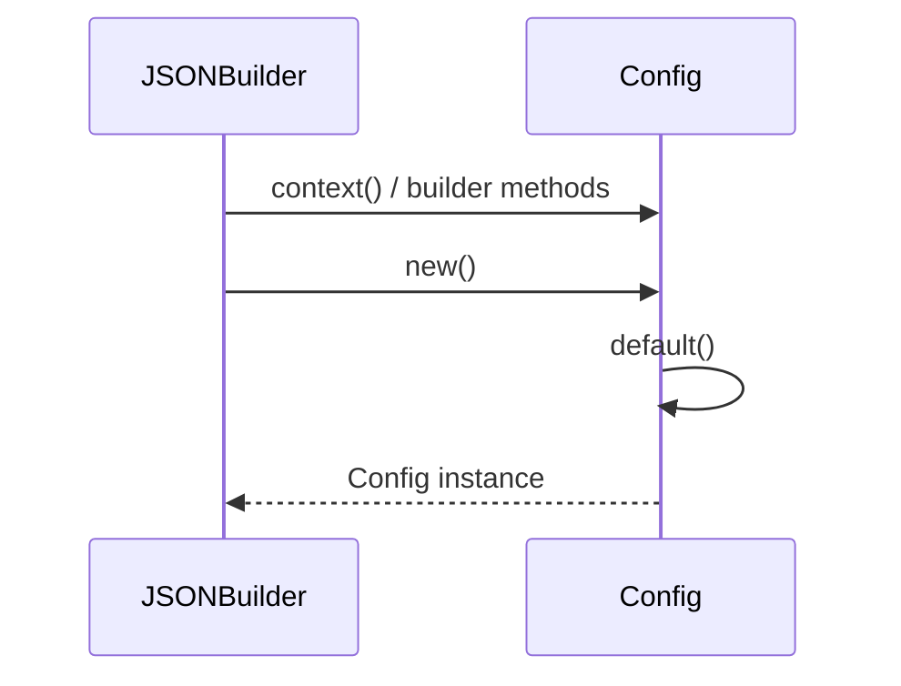

# JSON Output Format

<details>
<summary>Relevant source files</summary>

The following files were used as context for generating this wiki page:

- [crates/searcher/src/searcher/glue.rs](https://github.com/BurntSushi/ripgrep/blob/main/crates/searcher/src/searcher/glue.rs)
- [crates/printer/src/json.rs](https://github.com/BurntSushi/ripgrep/blob/main/crates/printer/src/json.rs)
- [crates/printer/src/standard.rs](https://github.com/BurntSushi/ripgrep/blob/main/crates/printer/src/standard.rs)
</details>

## Overview

The JSON output format provides a structured, machine-readable mechanism for emitting search results in the JSON Lines format, where each discrete message is encoded as a single JSON value on its own line. This format addresses the need for programmatic consumers to parse search hits, file boundaries, and contextual lines without relying on fragile text-scraping techniques against human-oriented terminal output. Key design decisions include encapsulating every message within a consistent envelope containing a type tag and payload, and handling arbitrary or non-UTF-8 binary data by conditionally encoding byte sequences as base64 strings while preserving valid UTF-8 text. The JSON printer integrates directly with the searcher's sink architecture to serialize search progress and summary statistics across file lifecycles.

Sources: [crates/printer/src/json.rs:115-177](https://github.com/BurntSushi/ripgrep/blob/main/crates/printer/src/json.rs#L115-L177), [crates/printer/src/json.rs:500-545](https://github.com/BurntSushi/ripgrep/blob/main/crates/printer/src/json.rs#L500-L545)

## JSON Serialization and Message Types

### Overview

The JSON output architecture centers on `JSONBuilder`, `JSON`, and `JSONSink`, which work in tandem to construct, configure, and serialize structured search messages. The `JSONBuilder` struct manipulates an underlying private `Config` struct that controls formatting preferences such as pretty printing and mandatory begin/end message emission. Once `JSONBuilder::build` is invoked, the configuration becomes immutable, producing a generic `JSON<W>` printer bound to any type implementing `io::Write`. Search execution is mediated through `JSONSink`, which implements the `grep_searcher::Sink` trait to intercept search events like matches, context lines, and binary data detection.

Sources: [crates/printer/src/json.rs:25-39](https://github.com/BurntSushi/ripgrep/blob/main/crates/printer/src/json.rs#L25-L39), [crates/printer/src/json.rs:54-113](https://github.com/BurntSushi/ripgrep/blob/main/crates/printer/src/json.rs#L54-L113), [crates/printer/src/json.rs:486-561](https://github.com/BurntSushi/ripgrep/blob/main/crates/printer/src/json.rs#L486-L561), [crates/printer/src/json.rs:596-606](https://github.com/BurntSushi/ripgrep/blob/main/crates/printer/src/json.rs#L596-L606)

### Configuration and Call-Chain Execution

To initialize the printer configuration, builder methods instantiate and modify state before handing off ownership to the printer. The construction call chain follows a deterministic path from default initialization to structured configuration building: `context` → `new` → `default` → `Config`. 

1. `context` (or builder context methods like `pretty`, `always_begin_end`, and `replacement`) mutates the builder's internal parameter state.
2. `new` instantiates a fresh `JSONBuilder` via `JSONBuilder::new()`.
3. `default` invokes `Config::default()` to establish baseline settings (`pretty: false`, `always_begin_end: false`, `replacement: Arc::new(None)`).
4. `Config` finalizes the frozen configuration container consumed by `build`.



Sources: [crates/printer/src/json.rs:25-39](https://github.com/BurntSushi/ripgrep/blob/main/crates/printer/src/json.rs#L25-L39), [crates/printer/src/json.rs:58-62](https://github.com/BurntSushi/ripgrep/blob/main/crates/printer/src/json.rs#L58-L62)

### JSONBuilder and JSONSink Reference Table

The API exposes explicit builder options and sink management helpers to configure serialization behavior and tie searches to optional file paths.

| Method / Struct | Type / Signature | Default / Initial Value | Purpose |
| :--- | :--- | :--- | :--- |
| `JSONBuilder::new()` | `fn() -> JSONBuilder` | `Config::default()` | Returns a new builder for configuring the JSON printer. |
| `JSONBuilder::build()` | `fn(&self, W) -> JSON<W>` | N/A | Creates a JSON printer writing results to the given writer. |
| `JSONBuilder::pretty()` | `fn(&mut self, bool) -> &mut JSONBuilder` | `false` | Enables pretty-printed JSON formatting spanning multiple lines. |
| `JSONBuilder::always_begin_end()` | `fn(&mut self, bool) -> &mut JSONBuilder` | `false` | Forces emission of `begin` and `end` messages even without matches. |
| `JSONBuilder::replacement()` | `fn(&mut self, Option<Vec<u8>>) -> &mut JSONBuilder` | `None` | Sets replacement bytes for matched text occurrences. |
| `JSON::sink()` | `fn(&'s mut self, M) -> JSONSink<'static, 's, M, W>` | N/A | Returns an unassociated `Sink` implementation without file paths. |
| `JSON::sink_with_path()` | `fn(&'s mut self, M, &'p P) -> JSONSink<'p, 's, M, W>` | N/A | Returns a `Sink` implementation associated with a specific file path. |

Sources: [crates/printer/src/json.rs:58-113](https://github.com/BurntSushi/ripgrep/blob/main/crates/printer/src/json.rs#L58-L113), [crates/printer/src/json.rs:504-545](https://github.com/BurntSushi/ripgrep/blob/main/crates/printer/src/json.rs#L504-L545)

### Structural Trade-Offs in JSON Serialization

The design of `JSONSink` and its internal match-buffering mechanics involve deliberate trade-offs between memory allocation overhead and serialization simplicity.

| Design Choice | Benefit | Cost |
| :--- | :--- | :--- |
| Pre-collecting matches into `self.json.matches` via `record_matches()` | Simplifies printing logic so that match locations are computed in a single pass before serialization. | Adds an extra vector allocation and copy step per match event. |
| Using `SubMatches` enum with `Small([SubMatch; 1])` | Avoids heap allocation for the extremely common case of exactly one submatch per range. | Introduces branch overhead and enum discriminant matching during slice generation. |
| Freezing `Config` upon printer construction | Eliminates race conditions and invalid mid-search state mutations. | Prevents dynamic re-configuration of pretty printing or replacement rules during an active search. |

Sources: [crates/printer/src/json.rs:25-39](https://github.com/BurntSushi/ripgrep/blob/main/crates/printer/src/json.rs#L25-L39), [crates/printer/src/json.rs:647-680](https://github.com/BurntSushi/ripgrep/blob/main/crates/printer/src/json.rs#L647-L680), [crates/printer/src/json.rs:847-898](https://github.com/BurntSushi/ripgrep/blob/main/crates/printer/src/json.rs#L847-L898)

> [!NOTE]
> When `always_begin_end` is disabled, `begin` messages are suppressed until the first `match` or `context` message is actually triggered via `write_begin_message()`, ensuring empty files do not emit noise lines in `jsonl` streams.

Sources: [crates/printer/src/json.rs:91-94](https://github.com/BurntSushi/ripgrep/blob/main/crates/printer/src/json.rs#L91-L94), [crates/printer/src/json.rs:708-717](https://github.com/BurntSushi/ripgrep/blob/main/crates/printer/src/json.rs#L708-L717)

> [!WARNING]
> Empty matches occurring at or past the end of the byte buffer are explicitly filtered out and popped during `record_matches()` to prevent infinite iteration loops and malformed zero-length match payloads.

Sources: [crates/printer/src/json.rs:672-679](https://github.com/BurntSushi/ripgrep/blob/main/crates/printer/src/json.rs#L672-L679)

## Search Execution and Glue Integration

### Overview

The `searcher` crate glue layer orchestrates how search execution structures iterate across line boundaries, manage internal buffers, handle binary detection, and feed matched text or context lines to underlying sinks. Three primary execution driver structs handle different search strategies: `ReadByLine` for buffered I/O streams, `SliceByLine` for single-line slice matching, and `MultiLine` for regex patterns spanning multiple lines.

Sources: [crates/searcher/src/searcher/glue.rs:10-148](https://github.com/BurntSushi/ripgrep/blob/main/crates/searcher/src/searcher/glue.rs#L10-L148)

### Execution Walkthrough and Lifecycle Flow

The search execution proceeds through a strict call chain starting from the public searcher API down into the glue driver and its core helper. For buffered reader searches, the lifecycle follows this path:

`Searcher::search_reader()` → `ReadByLine::new()` → `ReadByLine::run()` → `Core::begin()` → `ReadByLine::fill()` → `Core::match_by_line()` → `Core::finish()`

1. `ReadByLine::run()` initiates execution by invoking `self.core.begin()?`.
2. It loops over `self.fill()?`, which rolls leftover buffer data via `self.core.roll()`, consumes processed bytes from the `LineBufferReader`, and refills from the underlying I/O stream.
3. If binary detection finds an offset and binary quitting is enabled via `should_binary_quit()`, the reader terminates early.
4. Otherwise, `self.core.match_by_line(self.rdr.buffer())?` evaluates the current buffer contents against the matcher.
5. Upon completion, `self.core.finish()` is called with absolute byte and binary offsets.

Sources: [crates/searcher/src/searcher/glue.rs:38-94](https://github.com/BurntSushi/ripgrep/blob/main/crates/searcher/src/searcher/glue.rs#L38-L94)

### Glue Driver Reference Table

The searcher glue layer defines three principal structs tailored to specific input types and matching constraints.

| Struct Name | Generic Parameters | Purpose | Key Methods |
| :--- | :--- | :--- | :--- |
| `ReadByLine` | `'s, M, R, S` | Iterates and searches across buffered I/O readers line by line. | `new()`, `run()`, `fill()`, `consume_remaining()`, `should_binary_quit()` |
| `SliceByLine` | `'s, M, S` | Executes single-line line matching directly over an in-memory byte slice. | `new()`, `run()`, `byte_count()` |
| `MultiLine` | `'s, M, S` | Handles multi-line matching patterns, overlapping matches, and inverted context over a byte slice. | `new()`, `run()`, `sink()`, `sink_matched_inverted()`, `sink_matched()`, `sink_context()`, `find()`, `advance()`, `byte_count()` |

Sources: [crates/searcher/src/searcher/glue.rs:10-165](https://github.com/BurntSushi/ripgrep/blob/main/crates/searcher/src/searcher/glue.rs#L10-L165)

### Glue Design Trade-Offs

The internal architectural choices within `glue.rs` balance memory safety, buffering overhead, and search accuracy.

| Design Choice | Benefit | Cost |
| :--- | :--- | :--- |
| Delaying match sinking in `MultiLine::sink()` | Groups adjacent or overlapping matches into a single sink emission, preventing duplicate sinking of the same line. | Requires maintaining `self.last_match` state and conditional branch evaluation for range overlap checks. |
| Strict buffer-capacity clamping for binary detection (`DEFAULT_BUFFER_CAPACITY`) | Limits upfront binary scanning overhead to an initial chunk on slice inputs. | Slice readers may miss binary detection on early un-matched lines located beyond the initial buffer chunk. |
| Zero-width match advance handling in `advance()` | Explicitly advances the search position by at least one byte past zero-width matches to prevent infinite loops. | Requires special-case position arithmetic separate from standard non-empty match advancement. |

Sources: [crates/searcher/src/searcher/glue.rs:221-257](https://github.com/BurntSushi/ripgrep/blob/main/crates/searcher/src/searcher/glue.rs#L221-L257), [crates/searcher/src/searcher/glue.rs:119-121](https://github.com/BurntSushi/ripgrep/blob/main/crates/searcher/src/searcher/glue.rs#L119-L121), [crates/searcher/src/searcher/glue.rs:333-342](https://github.com/BurntSushi/ripgrep/blob/main/crates/searcher/src/searcher/glue.rs#L333-L342)

> [!NOTE]
> In `ReadByLine::fill()`, if rolling the buffer results in zero bytes consumed and refilling adds no new bytes, the reader forcefully consumes the remaining buffer length and quits to avoid deadlocks on leftover context.

Sources: [crates/searcher/src/searcher/glue.rs:79-86](https://github.com/BurntSushi/ripgrep/blob/main/crates/searcher/src/searcher/glue.rs#L79-L86)

> [!WARNING]
> Slice-based readers (`SliceByLine` and `MultiLine`) only check for binary data within an initial chunk bounded by `DEFAULT_BUFFER_CAPACITY`, differing from buffered readers that check every active buffer before search execution.

Sources: [crates/searcher/src/searcher/glue.rs:119-121](https://github.com/BurntSushi/ripgrep/blob/main/crates/searcher/src/searcher/glue.rs#L119-L121), [crates/searcher/src/searcher/glue.rs:168-171](https://github.com/BurntSushi/ripgrep/blob/main/crates/searcher/src/searcher/glue.rs#L168-L171)

## Comparison with Standard Output Formatting

### Overview

The `JSON` printer (`JSONSink`) and the human-oriented printer (`StandardSink`) handle search output via entirely distinct paradigms. While `JSONSink` emits structured JSON-lines messages enclosed in type-tagged envelopes (`begin`, `match`, `context`, `end`), `Standard` formatting relies on terminal-targeted text streaming via `StandardSink` and `StandardImpl` using the `termcolor::WriteColor` trait.

Sources: [crates/printer/src/json.rs:115-154](https://github.com/BurntSushi/ripgrep/blob/main/crates/printer/src/json.rs#L115-L154), [crates/printer/src/standard.rs:470-478](https://github.com/BurntSushi/ripgrep/blob/main/crates/printer/src/standard.rs#L470-L478)

### Printer Execution Call-Chain Walkthrough

The formatting pipeline differs depending on whether a match or a context line is delivered to the sink. For `StandardSink`, execution proceeds through specific internal handoffs:

`StandardSink::matched()` → `StandardImpl::from_match()` → `StandardImpl::sink()` → `StandardImpl::sink_slow()` or `StandardImpl::sink_fast()`

1. `StandardSink::matched()` increments match counts, computes match granularity via `record_matches()`, handles optional replacements via `replace()`, and invokes `StandardImpl::from_match()`.
2. `StandardImpl::from_match()` wraps the matcher state, sink, and `Sunk` match slice.
3. `StandardImpl::sink()` inspects whether individual match locations exist via `self.sunk.matches().is_empty()` and branches to either fast single-line/multi-line output or slow match-granularity output (`sink_slow()`).
4. `StandardImpl::sink_slow()` iterates over individual match sub-ranges, invokes `write_prelude()` (which sequences paths, line numbers, and column fields), and calls `write_colored_line()`.

Sources: [crates/printer/src/standard.rs:766-791](https://github.com/BurntSushi/ripgrep/blob/main/crates/printer/src/standard.rs#L766-L791), [crates/printer/src/standard.rs:928-943](https://github.com/BurntSushi/ripgrep/blob/main/crates/printer/src/standard.rs#L928-L943)

In contrast, `JSONSink` routes matching lines directly through structured serialization:

`JSONSink::matched()` → `JSONSink::record_matches()` → `JSONSink::replace()` → `SubMatches::new()` → `JSON::write_message()`

1. `JSONSink::matched()` records match positions using `find_iter_at_in_context()`.
2. `SubMatches::new()` categorizes matches into `SubMatches::Empty`, `SubMatches::Small`, or `SubMatches::Big`.
3. `JSON::write_message()` serializes the envelope via `serde_json::to_writer()` and appends a newline byte.

Sources: [crates/printer/src/json.rs:722-753](https://github.com/BurntSushi/ripgrep/blob/main/crates/printer/src/json.rs#L722-L753), [crates/printer/src/json.rs:549-560](https://github.com/BurntSushi/ripgrep/blob/main/crates/printer/src/json.rs#L549-L560), [crates/printer/src/json.rs:853-882](https://github.com/BurntSushi/ripgrep/blob/main/crates/printer/src/json.rs#L853-L882)

### Printer Architectural Comparison

| Feature / Aspect | JSON Printer (`JSON` / `JSONSink`) | Standard Printer (`Standard` / `StandardSink`) |
| :--- | :--- | :--- |
| **Underlying Writer Trait** | `io::Write` | `termcolor::WriteColor` |
| **Granularity Requirement** | Always computes match offsets for submatches array. | Lazy evaluation via `needs_match_granularity()`, skipping offset discovery if colors/columns/stats are unconfigured. |
| **Output Encoding** | UTF-8 JSON strings; base64-encoded `bytes` fallback for invalid UTF-8 paths/lines. | Direct raw byte stream with optional terminal ANSI escape sequences or hyperlinks. |
| **Statistics Emission** | Emitted automatically within the `end` message object. | Optional; tracked via `Stats` only if explicitly enabled via `StandardBuilder::stats(true)`. |

Sources: [crates/printer/src/json.rs:115-119](https://github.com/BurntSushi/ripgrep/blob/main/crates/printer/src/json.rs#L115-L119), [crates/printer/src/json.rs:173-177](https://github.com/BurntSushi/ripgrep/blob/main/crates/printer/src/json.rs#L173-L177), [crates/printer/src/json.rs:243-245](https://github.com/BurntSushi/ripgrep/blob/main/crates/printer/src/json.rs#L243-L245), [crates/printer/src/standard.rs:188-191](https://github.com/BurntSushi/ripgrep/blob/main/crates/printer/src/standard.rs#L188-L191), [crates/printer/src/standard.rs:470-478](https://github.com/BurntSushi/ripgrep/blob/main/crates/printer/src/standard.rs#L470-L478), [crates/printer/src/standard.rs:578-594](https://github.com/BurntSushi/ripgrep/blob/main/crates/printer/src/standard.rs#L578-L594)

> [!WARNING]
> `StandardSink` evaluates `needs_match_granularity()` to skip costly match-location searches when colors, columns, stats, per-match, and replacements are all disabled, whereas `JSONSink` always invokes `record_matches()` to populate structural submatch arrays.

Sources: [crates/printer/src/json.rs:730-734](https://github.com/BurntSushi/ripgrep/blob/main/crates/printer/src/json.rs#L730-L734), [crates/printer/src/standard.rs:578-594](https://github.com/BurntSushi/ripgrep/blob/main/crates/printer/src/standard.rs#L578-L594)

> [!NOTE]
> `Standard` uses a `RefCell<CounterWriter<W>>` wrapper to permit interior mutability of byte counting across shared printer references, whereas `JSON` holds a direct `CounterWriter<W>` without dynamic borrowing overhead.

Sources: [crates/printer/src/json.rs:65-71](https://github.com/BurntSushi/ripgrep/blob/main/crates/printer/src/json.rs#L65-L71), [crates/printer/src/standard.rs:127-133](https://github.com/BurntSushi/ripgrep/blob/main/crates/printer/src/standard.rs#L127-L133)

## Binary Data and Context Line Handling

### Overview

The JSON output subsystem manages binary data detection, byte offset tracking, and search-and-replace capture interpolation during search execution. When a searcher encounters binary content or executes matching workflows across slices and buffered readers, the printer coordinates closely with `grep_searcher` traits to record absolute byte offsets and structure context lines.

Sources: [crates/printer/src/json.rs:596-606](https://github.com/BurntSushi/ripgrep/blob/main/crates/printer/src/json.rs#L596-L606), [crates/searcher/src/searcher/glue.rs:38-51](https://github.com/BurntSushi/ripgrep/blob/main/crates/searcher/src/searcher/glue.rs#L38-L51)

### Binary Data Detection and Offset Tracking

Binary detection is integrated into search execution glue and reported via sink methods. When searchers such as `ReadByLine`, `SliceByLine`, or `MultiLine` execute, binary byte offsets are tracked and propagated to finish messages.

The call chain for handling binary detection and finalizing search metrics flows through searcher glue:
`ReadByLine::run()` → `Core::finish()` → `JSONSink::finish()` → `finish.binary_byte_offset()`.

1. `ReadByLine::run()` or slice-based searchers evaluate buffer contents during `fill()` or `detect_binary()`.
2. When binary data is encountered, `Core` records the absolute byte offset (`binary_byte_offset`).
3. `JSONSink::finish()` captures this offset from `SinkFinish` and embeds it into the `end` message object under `binary_offset`.

Sources: [crates/searcher/src/searcher/glue.rs:38-51](https://github.com/BurntSushi/ripgrep/blob/main/crates/searcher/src/searcher/glue.rs#L38-L51), [crates/printer/src/json.rs:815-840](https://github.com/BurntSushi/ripgrep/blob/main/crates/printer/src/json.rs#L815-L840)

> [!WARNING]
> Line-buffered searchers (`ReadByLine`) will always inspect the current buffer for binary data before searching it, whereas slice readers (`SliceByLine` and `MultiLine`) only scan for binary data in the initial chunk and within actual matches after that point.

Sources: [crates/searcher/src/searcher/glue.rs:58-88](https://github.com/BurntSushi/ripgrep/blob/main/crates/searcher/src/searcher/glue.rs#L58-L88), [crates/searcher/src/searcher/glue.rs:119-121](https://github.com/BurntSushi/ripgrep/blob/main/crates/searcher/src/searcher/glue.rs#L119-L121)

### Context Line Handling and Inverted Matches

Context lines are emitted via `JSONSink::context()`, which delegates formatting depending on whether the search is inverted.

| Sink Context State | Behavior | Submatches Generation |
| :--- | :--- | :--- |
| **Normal Context** | Emits adjacent non-matching lines around hits. | `SubMatches::empty()` |
| **Inverted Match Context** | Executes `record_matches()` and `replace()` on context bytes. | Dynamically populated via `SubMatches::new()` |

Sources: [crates/printer/src/json.rs:755-782](https://github.com/BurntSushi/ripgrep/blob/main/crates/printer/src/json.rs#L755-L782)

> [!NOTE]
> When a search is configured with `invert_match`, contextual lines may contain submatches because the original matcher can match substrings within those lines.

Sources: [crates/printer/src/json.rs:300-305](https://github.com/BurntSushi/ripgrep/blob/main/crates/printer/src/json.rs#L300-L305), [crates/printer/src/json.rs:763-773](https://github.com/BurntSushi/ripgrep/blob/main/crates/printer/src/json.rs#L763-L773)

### Capture Replacement and Submatches Optimization

When replacement bytes are configured via `JSONBuilder::replacement()`, `JSONSink::replace()` invokes `Replacer::replace_all()` to interpolate capture groups. The `SubMatches` enum optimizes allocation for varying match counts per byte range.

```rust
enum SubMatches<'a> {
    Empty,
    Small([jsont::SubMatch<'a>; 1]),
    Big(Vec<jsont::SubMatch<'a>>),
}
```

Sources: [crates/printer/src/json.rs:106-113](https://github.com/BurntSushi/ripgrep/blob/main/crates/printer/src/json.rs#L106-L113), [crates/printer/src/json.rs:686-705](https://github.com/BurntSushi/ripgrep/blob/main/crates/printer/src/json.rs#L686-L705), [crates/printer/src/json.rs:847-851](https://github.com/BurntSushi/ripgrep/blob/main/crates/printer/src/json.rs#L847-L851)

## Printer Statistics and Lifecycle State

### Overview

The lifecycle state and printer statistics tracking mechanisms coordinate search execution boundaries, capture duration metrics, accumulate match counters, and serialize the final summary payload in both JSON and standard printer sinks. State transitions are governed by the `Sink::begin()` and `Sink::finish()` callback methods, which reset internal counters, measure elapsed time via `std::time::Instant`, and update `Stats` aggregation structures.

Sources: [crates/printer/src/json.rs:802-839](https://github.com/BurntSushi/ripgrep/blob/main/crates/printer/src/json.rs#L802-L839), [crates/printer/src/standard.rs:841-867](https://github.com/BurntSushi/ripgrep/blob/main/crates/printer/src/standard.rs#L841-L867)

### Lifecycle State Execution Walkthrough

The search lifecycle follows an explicit callback sequence managed by `grep_searcher::Searcher` interacting with printer sink implementations. The complete call chain flows from search initialization through match discovery to final summary emission:

`Searcher::search_reader()` → `JSONSink::begin()` → `JSONSink::matched()` / `JSONSink::context()` → `JSONSink::finish()` → `JSON::write_message()`.

1. `JSONSink::begin()` resets the writer counter (`self.json.wtr.reset_count()`), records the start timestamp via `Instant::now()`, clears `match_count`, and resets binary byte offsets. If `always_begin_end` is enabled, it immediately writes the `begin` JSON envelope.
2. During the search, `JSONSink::matched()` increments `match_count`, records match locations, updates `self.stats` with match totals and matched line counts, and serializes `match` messages.
3. `JSONSink::finish()` finalizes metrics by calculating elapsed duration (`self.start_time.elapsed()`), recording total searches (`1`), adding searched and printed byte counts from `finish.byte_count()` and `self.json.wtr.count()`, and conditionally emitting the `end` message containing the `stats` payload.

Sources: [crates/printer/src/json.rs:802-839](https://github.com/BurntSushi/ripgrep/blob/main/crates/printer/src/json.rs#L802-L839)

> [!NOTE]
> In the standard printer sink, statistics collection is entirely optional and disabled by default; it must be explicitly enabled via `StandardBuilder::stats(true)` to avoid the runtime overhead of tracking elapsed time and byte counts on every search invocation.

Sources: [crates/printer/src/standard.rs:188-191](https://github.com/BurntSushi/ripgrep/blob/main/crates/printer/src/standard.rs#L188-L191), [crates/printer/src/standard.rs:857-865](https://github.com/BurntSushi/ripgrep/blob/main/crates/printer/src/standard.rs#L857-L865)

### Statistics Fields and Summary Payload Reference

The aggregate statistics tracked across searches are encapsulated within the `Stats` structure and serialized inside the `end` JSON message payload or queried programmatically via `StandardSink::stats()`.

| Statistic Field | Type | Meaning / Purpose |
| :--- | :--- | :--- |
| **elapsed** | Duration object (`secs`, `nanos`, `human`) | Total wall-clock time elapsed while performing the search operation. |
| **searches** | `u64` | Total number of search operations executed. For individual file sinks, this is always `1`. |
| **searches_with_match** | `u64` | Number of executed searches that discovered at least one match (never exceeds `searches`). |
| **bytes_searched** | `u64` | Total number of raw input bytes evaluated by the searcher. |
| **bytes_printed** | `u64` | Total number of bytes written to the underlying writer by the printer. |
| **matched_lines** | `u64` | Total number of lines that participated in a match across all search hits. |
| **matches** | `u64` | Total number of individual match occurrences found (may exceed matched lines). |

Sources: [crates/printer/src/json.rs:331-353](https://github.com/BurntSushi/ripgrep/blob/main/crates/printer/src/json.rs#L331-L353), [crates/printer/src/standard.rs:188-191](https://github.com/BurntSushi/ripgrep/blob/main/crates/printer/src/standard.rs#L188-L191)

> [!WARNING]
> The `bytes_printed` statistic tracks everything emitted by the printer, including preludes, separators, path headings, and envelope structures, whereas `bytes_searched` measures exclusively the raw input buffer length reported by `SinkFinish::byte_count()`.

Sources: [crates/printer/src/json.rs:344-346](https://github.com/BurntSushi/ripgrep/blob/main/crates/printer/src/json.rs#L344-L346), [crates/printer/src/json.rs:826-827](https://github.com/BurntSushi/ripgrep/blob/main/crates/printer/src/json.rs#L826-L827)

## Related

- [[Standard Text Printer]]

