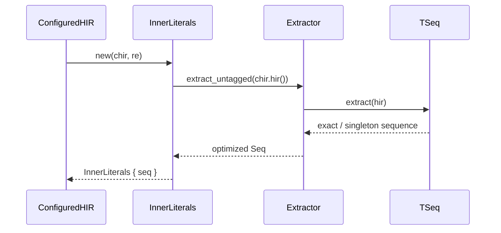
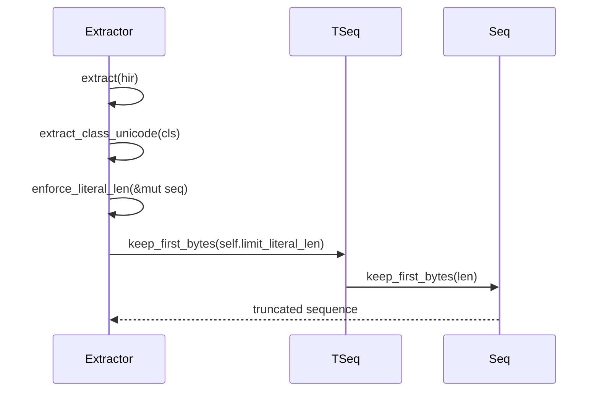
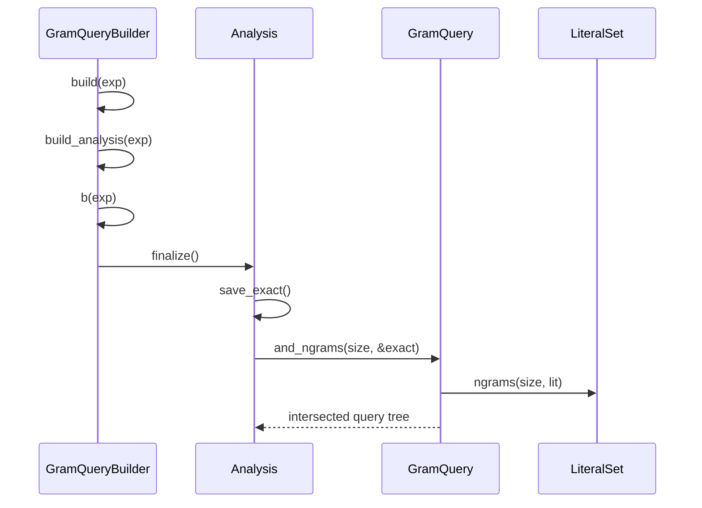

# Literal Optimizations

Relevant source files

The following files were used as context for generating this wiki page:

- [crates/globset/src/glob.rs](https://github.com/BurntSushi/ripgrep/blob/main/crates/globset/src/glob.rs)
- [crates/regex/src/literal.rs](https://github.com/BurntSushi/ripgrep/blob/main/crates/regex/src/literal.rs)
- [crates/searcher/src/searcher/glue.rs](https://github.com/BurntSushi/ripgrep/blob/main/crates/searcher/src/searcher/glue.rs)
- [crates/index/src/literal.rs](https://github.com/BurntSushi/ripgrep/blob/main/crates/index/src/literal.rs)
- [crates/globset/src/lib.rs](https://github.com/BurntSushi/ripgrep/blob/main/crates/globset/src/lib.rs)

## Overview

Literal optimizations serve as a core high-performance technique in search and pattern matching engines, designed to bypass slower full regular expression evaluation by identifying and exploiting exact substrings. By isolating specific byte sequences, prefixes, or structural components from complex expressions, the system can rapidly scan candidate inputs or filter out non-matching targets using vectorized routines before ever invoking a general regex engine. Sources: [crates/regex/src/literal.rs:11-24](https://github.com/BurntSushi/ripgrep/blob/main/crates/regex/src/literal.rs#L11-L24)

These optimizations directly address the computational overhead of matching large patterns against high-throughput data streams or extensive sets of file paths. Through specialized parsing strategies, AST traversal, and n-gram indexing, the system converts complex criteria into deterministic prefilters and specialized match strategies, significantly reducing overall CPU utilization across both regex searching and path glob matching. Sources: [crates/globset/src/glob.rs:8-14](https://github.com/BurntSushi/ripgrep/blob/main/crates/globset/src/glob.rs#L8-L14), [crates/regex/src/literal.rs:11-24](https://github.com/BurntSushi/ripgrep/blob/main/crates/regex/src/literal.rs#L11-L24), [crates/index/src/literal.rs:1-5](https://github.com/BurntSushi/ripgrep/blob/main/crates/index/src/literal.rs#L1-L5)

## Regex Literal Extraction and Sequences

### Overview of Extraction

Literal extraction traverses the Abstract Syntax Tree (AST) of a regular expression via the `Extractor` and `TSeq` structures to isolate exact prefix and suffix byte sequences. Ripgrep performs line-oriented searches by default (unless `-U`/`--multiline` is enabled), allowing it to extract literals, locate containing lines via fast vectorized routines, and run the full regex only on those matched lines. Sources: [crates/regex/src/literal.rs:11-25](https://github.com/BurntSushi/ripgrep/blob/main/crates/regex/src/literal.rs#L11-L25), [crates/regex/src/literal.rs:125-136](https://github.com/BurntSushi/ripgrep/blob/main/crates/regex/src/literal.rs#L125-L136)

The `InnerLiterals` type encapsulates this process using heuristics to extract inner literals and build a simpler, highly optimizable regex pattern. Sources: [crates/regex/src/literal.rs:11-42](https://github.com/BurntSushi/ripgrep/blob/main/crates/regex/src/literal.rs#L11-L42)

### Call-Chain Execution Walkthrough

#### Sequence Extraction Walkthrough (`InnerLiterals`)

Extraction operations proceed through specific call chains to evaluate AST nodes and construct tagged sequences (`TSeq`). Sources: [crates/regex/src/literal.rs:54-92](https://github.com/BurntSushi/ripgrep/blob/main/crates/regex/src/literal.rs#L54-L92)

1. `extract`: Entry point in `InnerLiterals::new` where `Extractor::new().extract_untagged(chir.hir())` is invoked. Sources: [crates/regex/src/literal.rs:90-90](https://github.com/BurntSushi/ripgrep/blob/main/crates/regex/src/literal.rs#L90-L90)
2. `exact`: `Extractor::extract` matches AST nodes (such as `Literal`, `Concat`, or `Alternation`) and constructs initial exact or singleton literal sequences via `TSeq::singleton(self::Literal::exact(...))`. Sources: [crates/regex/src/literal.rs:174-179](https://github.com/BurntSushi/ripgrep/blob/main/crates/regex/src/literal.rs#L174-L179)
3. `new`: `TSeq::new` or `TSeq::singleton` initializes wrapper sequences holding underlying regex-syntax `Seq` instances and prefix flags. Sources: [crates/regex/src/literal.rs:440-465](https://github.com/BurntSushi/ripgrep/blob/main/crates/regex/src/literal.rs#L440-L465)
4. `none`: If line terminators are missing or regex engines are already accelerated without Unicode word boundaries, `InnerLiterals::none()` returns an infinite sequence (`Seq::infinite()`) to bypass extraction. Sources: [crates/regex/src/literal.rs:54-63](https://github.com/BurntSushi/ripgrep/blob/main/crates/regex/src/literal.rs#L54-L63), [crates/regex/src/literal.rs:96-98](https://github.com/BurntSushi/ripgrep/blob/main/crates/regex/src/literal.rs#L96-L98)
5. `infinite`: Sequences exceeding size limits or containing poisonous literals are marked infinite (`seq.make_infinite()`) to disable ineffective prefilters. Sources: [crates/regex/src/literal.rs:159-165](https://github.com/BurntSushi/ripgrep/blob/main/crates/regex/src/literal.rs#L159-L165), [crates/regex/src/literal.rs:479-481](https://github.com/BurntSushi/ripgrep/blob/main/crates/regex/src/literal.rs#L479-L481)
6. `InnerLiterals`: The resulting `Seq` is wrapped back into an `InnerLiterals` struct holding the extracted literal sequence. Sources: [crates/regex/src/literal.rs:90-92](https://github.com/BurntSushi/ripgrep/blob/main/crates/regex/src/literal.rs#L90-L92)

#### Sequence Extraction Walkthrough (`TSeq`)

1. `extract`: `Extractor::extract` pattern-matches on `hir.kind()` to delegate node processing for empty nodes, literals, classes, repetitions, captures, concatenations, and alternations. Sources: [crates/regex/src/literal.rs:168-189](https://github.com/BurntSushi/ripgrep/blob/main/crates/regex/src/literal.rs#L168-L189)
2. `exact`: Child sequences are initialized using exact literal builders or singletons. Sources: [crates/regex/src/literal.rs:173-179](https://github.com/BurntSushi/ripgrep/blob/main/crates/regex/src/literal.rs#L173-L179)
3. `new`: `TSeq` helper methods package raw collections into structured tagged sequences. Sources: [crates/regex/src/literal.rs:459-465](https://github.com/BurntSushi/ripgrep/blob/main/crates/regex/src/literal.rs#L459-L465)
4. `none`: Sequences failing criteria or exceeding threshold limits invoke fallback states or return empty structures. Sources: [crates/regex/src/literal.rs:447-453](https://github.com/BurntSushi/ripgrep/blob/main/crates/regex/src/literal.rs#L447-L453)
5. `InnerLiterals`: Final validated byte sequences are compiled into line-matching regexes via `one_regex`. Sources: [crates/regex/src/literal.rs:106-123](https://github.com/BurntSushi/ripgrep/blob/main/crates/regex/src/literal.rs#L106-L123)

Sources: [crates/regex/src/literal.rs:54-92](https://github.com/BurntSushi/ripgrep/blob/main/crates/regex/src/literal.rs#L54-L92), [crates/regex/src/literal.rs:149-189](https://github.com/BurntSushi/ripgrep/blob/main/crates/regex/src/literal.rs#L149-L189), [crates/regex/src/literal.rs:440-465](https://github.com/BurntSushi/ripgrep/blob/main/crates/regex/src/literal.rs#L440-L465)

### Extractor Limits and Configuration

The `Extractor` struct enforces hard limits during AST traversal to prevent combinatorial explosions when processing large classes, repetitions, or cross-products. Sources: [crates/regex/src/literal.rs:130-147](https://github.com/BurntSushi/ripgrep/blob/main/crates/regex/src/literal.rs#L130-L147)

| Field | Type | Default Value | Purpose |
| :--- | :--- | :--- | :--- |
| `limit_class` | `usize` | `10` | Maximum character count allowed in Unicode or byte classes before defaulting to an infinite sequence. |
| `limit_repeat` | `usize` | `10` | Upper iteration limit when unrolling fixed or bounded repetition nodes. |
| `limit_literal_len` | `usize` | `100` | Maximum length in bytes permitted for any individual extracted literal. |
| `limit_total` | `usize` | `64` | Maximum total number of literals permitted within a single sequence (`TSeq`). |

Sources: [crates/regex/src/literal.rs:130-147](https://github.com/BurntSushi/ripgrep/blob/main/crates/regex/src/literal.rs#L130-L147)

> [!WARNING]
> If a character class or repetition exceeds `limit_class` or `limit_total`, `Extractor` forces the sequence to become infinite. An infinite sequence disables inner literal optimizations for that pattern entirely, falling back to the standard regex engine. Sources: [crates/regex/src/literal.rs:320-323](https://github.com/BurntSushi/ripgrep/blob/main/crates/regex/src/literal.rs#L320-L323), [crates/regex/src/literal.rs:386-389](https://github.com/BurntSushi/ripgrep/blob/main/crates/regex/src/literal.rs#L386-L389)

### Design Trade-Offs in Literal Extraction

| Design Choice | Benefit | Cost |
| :--- | :--- | :--- |
| **Cross-product concatenation (`extract_concat`)** | Captures exact multi-part byte combinations across sequential AST nodes. | Can exponentially increase sequence lengths, triggering fallback limits (`limit_total`). |
| **Poisonous literal rejection (`is_poisonous`)** | Prevents high-frequency patterns (like empty strings or common single bytes) from swamping prefilters. | May discard valid low-selectivity literals, bypassing potential acceleration opportunities. |
| **Sequence truncation (`keep_first_bytes`)** | Preserves finite sequence status during large union operations by truncating literals to 4 bytes. | Reduces literal specificity for downstream matching algorithms like Teddy. |

Sources: [crates/regex/src/literal.rs:196-226](https://github.com/BurntSushi/ripgrep/blob/main/crates/regex/src/literal.rs#L196-L226), [crates/regex/src/literal.rs:398-430](https://github.com/BurntSushi/ripgrep/blob/main/crates/regex/src/literal.rs#L398-L430), [crates/regex/src/literal.rs:633-639](https://github.com/BurntSushi/ripgrep/blob/main/crates/regex/src/literal.rs#L633-L639)

## Character Class Byte Limit Enforcement

### Character Class Processing and Truncation

When the extractor encounters character classes during AST traversal, it dispatches to `extract_class_unicode` or `extract_class_bytes`. These functions first validate whether the class size exceeds `limit_class`. If the class contains more elements than the configured threshold, the extractor abandons precise enumeration and returns an infinite sequence. Otherwise, it iterates through all ranges and individual scalar values or bytes, pushes them into a temporary sequence (`TSeq`), and invokes length enforcement. Sources: [crates/regex/src/literal.rs:320-348](https://github.com/BurntSushi/ripgrep/blob/main/crates/regex/src/literal.rs#L320-L348)

To maintain strict bounds on memory consumption and prevent oversized patterns from degrading search performance, `enforce_literal_len` calls `keep_first_bytes` using `limit_literal_len`. If any extracted literal sequence grows beyond permitted byte constraints, truncation confines the sequence size. Sources: [crates/regex/src/literal.rs:434-436](https://github.com/BurntSushi/ripgrep/blob/main/crates/regex/src/literal.rs#L434-L436)

### Call-Chain Execution Walkthrough

1. `extract`: Receives an AST node and matches on its `HirKind`, routing `Class(hir::Class::Unicode(ref cls))` nodes directly to Unicode handling. Sources: [crates/regex/src/literal.rs:169-182](https://github.com/BurntSushi/ripgrep/blob/main/crates/regex/src/literal.rs#L169-L182)
2. `extract_class_unicode`: Checks `class_over_limit_unicode(cls)`; if within bounds, it iterates over character ranges, constructs individual literals, pushes them to a `TSeq`, and hands the sequence to length enforcement. Sources: [crates/regex/src/literal.rs:320-332](https://github.com/BurntSushi/ripgrep/blob/main/crates/regex/src/literal.rs#L320-L332)
3. `enforce_literal_len`: Wraps the sequence parameter and delegates directly to the underlying byte truncation method with `limit_literal_len`. Sources: [crates/regex/src/literal.rs:433-435](https://github.com/BurntSushi/ripgrep/blob/main/crates/regex/src/literal.rs#L433-L435)
4. `keep_first_bytes`: Truncates individual literal byte vectors within the `Seq` structure to the specified byte length limit. Sources: [crates/regex/src/literal.rs:499-501](https://github.com/BurntSushi/ripgrep/blob/main/crates/regex/src/literal.rs#L499-L501)

Sources: [crates/regex/src/literal.rs:169-182](https://github.com/BurntSushi/ripgrep/blob/main/crates/regex/src/literal.rs#L169-L182), [crates/regex/src/literal.rs:320-332](https://github.com/BurntSushi/ripgrep/blob/main/crates/regex/src/literal.rs#L320-L332), [crates/regex/src/literal.rs:433-435](https://github.com/BurntSushi/ripgrep/blob/main/crates/regex/src/literal.rs#L433-L435), [crates/regex/src/literal.rs:499-501](https://github.com/BurntSushi/ripgrep/blob/main/crates/regex/src/literal.rs#L499-L501)

> [!WARNING]
> `class_over_limit_unicode` and `class_over_limit_bytes` accumulate range lengths by summing `r.len()` across all ranges in the class. If `count` exceeds `limit_class` (defaulting to 10), extraction halts immediately and returns `TSeq::infinite()`. Sources: [crates/regex/src/literal.rs:350-374](https://github.com/BurntSushi/ripgrep/blob/main/crates/regex/src/literal.rs#L350-L374)

## Trigram and N-Gram Index Extraction

### Overview of Trigram Extraction

Index-based candidate filtering relies on extracting n-gram sub-sequences from regex syntax trees (`Hir`) to build canonicalized queries. The `crates/index/src/literal.rs` module provides `GramQueryBuilder`, `GramQuery`, `LiteralSet`, and `Analysis` structures to transform regular expressions into boolean queries composed of literal byte n-grams. Sources: [crates/index/src/literal.rs:16-20](https://github.com/BurntSushi/ripgrep/blob/main/crates/index/src/literal.rs#L16-L20), [crates/index/src/literal.rs:320-326](https://github.com/BurntSushi/ripgrep/blob/main/crates/index/src/literal.rs#L320-L326), [crates/index/src/literal.rs:504-507](https://github.com/BurntSushi/ripgrep/blob/main/crates/index/src/literal.rs#L504-L507), [crates/index/src/literal.rs:636-641](https://github.com/BurntSushi/ripgrep/blob/main/crates/index/src/literal.rs#L636-L641)

### Core Structures and Configuration Defaults

`GramQueryBuilder` initializes index extraction with a default N-gram size of 3 bytes, a maximum length limit of 250, and a character class limit of 10. `LiteralSet` stores collections of `BString` values, keeping them sorted and deduplicated through its `canonicalize` method. Sources: [crates/index/src/literal.rs:504-554](https://github.com/BurntSushi/ripgrep/blob/main/crates/index/src/literal.rs#L504-L554), [crates/index/src/literal.rs:636-646](https://github.com/BurntSushi/ripgrep/blob/main/crates/index/src/literal.rs#L636-L646)

| Field / Method | Type | Default Value | Purpose |
| :--- | :--- | :--- | :--- |
| `ngram_size` | `usize` | `3` | Byte length of extracted sliding n-grams. |
| `limit_len` | `usize` | `250` | Maximum length threshold before concatenation falls back to anything. |
| `limit_class` | `usize` | `10` | Maximum size threshold for Unicode or byte character classes. |

Sources: [crates/index/src/literal.rs:637-646](https://github.com/BurntSushi/ripgrep/blob/main/crates/index/src/literal.rs#L637-L646)

### Call-Chain Execution Walkthrough

1. `build`: Takes an `&Hir` expression and invokes `self.build_analysis(exp).query`. Sources: [crates/index/src/literal.rs:667-669](https://github.com/BurntSushi/ripgrep/blob/main/crates/index/src/literal.rs#L667-L669)
2. `build_analysis`: Calls `self.b(exp)` to recursively analyze the AST, then invokes `ana.finalize()` on the resulting `Analysis`. Sources: [crates/index/src/literal.rs:671-675](https://github.com/BurntSushi/ripgrep/blob/main/crates/index/src/literal.rs#L671-L675)
3. `b`: Matches on `HirKind`, routing `Literal` nodes to `Analysis::exact_one` and `Concat` nodes through `combine_literals` and `.concat()`. Sources: [crates/index/src/literal.rs:677-748](https://github.com/BurntSushi/ripgrep/blob/main/crates/index/src/literal.rs#L677-L748)
4. `finalize`: Checks if `self.is_exact()` and `self.exact.min_len() >= self.size`, saving exact n-grams via `self.save_exact()` and populating prefix and suffix sets. Sources: [crates/index/src/literal.rs:469-491](https://github.com/BurntSushi/ripgrep/blob/main/crates/index/src/literal.rs#L469-L491)
5. `save_exact`: Delegates to `self.query.and_ngrams(self.size, &self.exact)`. Sources: [crates/index/src/literal.rs:382-384](https://github.com/BurntSushi/ripgrep/blob/main/crates/index/src/literal.rs#L382-L384)
6. `and_ngrams`: Iterates through literal strings in the set, extracts n-grams using `ngrams(size, lit)`, and intersects them into the query. Sources: [crates/index/src/literal.rs:256-271](https://github.com/BurntSushi/ripgrep/blob/main/crates/index/src/literal.rs#L256-L271)

Sources: [crates/index/src/literal.rs:256-271](https://github.com/BurntSushi/ripgrep/blob/main/crates/index/src/literal.rs#L256-L271), [crates/index/src/literal.rs:382-384](https://github.com/BurntSushi/ripgrep/blob/main/crates/index/src/literal.rs#L382-L384), [crates/index/src/literal.rs:469-491](https://github.com/BurntSushi/ripgrep/blob/main/crates/index/src/literal.rs#L469-L491), [crates/index/src/literal.rs:667-675](https://github.com/BurntSushi/ripgrep/blob/main/crates/index/src/literal.rs#L667-L675)

> [!CAUTION]
> If a character class (Unicode or bytes) exceeds `limit_class`, `class_over_limit_unicode` or `class_over_limit_bytes` returns true, causing `b()` to immediately return `Analysis::anything(self.ngram_size)`, discarding index filtering for that node. Sources: [crates/index/src/literal.rs:686-716](https://github.com/BurntSushi/ripgrep/blob/main/crates/index/src/literal.rs#L686-L716), [crates/index/src/literal.rs:766-786](https://github.com/BurntSushi/ripgrep/blob/main/crates/index/src/literal.rs#L766-L786)

### Design Trade-Offs in Query Canonicalization

| Design Choice | Benefit | Cost |
| :--- | :--- | :--- |
| **Sorted and Deduplicated `LiteralSet`** | Enables efficient linear-time factoring (`factor`) via parallel index pointers. | Requires explicit `canonicalize()` sorting and deduplication overhead after mutations. |
| **Byte-Level N-Grams** | Independent of UTF-8 codepoint boundaries, avoiding decoding overhead during extraction. | N-grams smaller than 3 bytes or spanning multibyte codepoints may produce wider candidate sets. |
| **Recursive AST Analysis with `Analysis` Struct** | Tracks exact, prefix, and suffix literal sets simultaneously during composition. | Increases memory allocation complexity when merging unconstrained alternations or repetitions. |

Sources: [crates/index/src/literal.rs:320-443](https://github.com/BurntSushi/ripgrep/blob/main/crates/index/src/literal.rs#L320-L443), [crates/index/src/literal.rs:551-589](https://github.com/BurntSushi/ripgrep/blob/main/crates/index/src/literal.rs#L551-L589)

## Glob Literal Parsing and Extraction

### Overview of Glob Extraction

Glob literal extraction inspects parsed shell glob tokens to derive optimized matching strategies before falling back to regular expressions. When a pattern consists entirely of literal characters or follows specific structural boundaries involving wildcards and recursive prefixes, the parser extracts precise matching strategy properties. Sources: [crates/globset/src/glob.rs:50-68](https://github.com/BurntSushi/ripgrep/blob/main/crates/globset/src/glob.rs#L50-L68)

### Match Strategies and Extracted Properties

The `MatchStrategy` enum defines various fast-path execution paths assigned during pattern compilation. `MatchStrategy::new()` evaluates pattern structure in order of specificity to select the most restrictive strategy available.

| Strategy Variant | Trigger Condition | Matching Semantics |
| :--- | :--- | :--- |
| `Literal(String)` | `pat.literal()` | Exact match against the entire candidate path string. |
| `BasenameLiteral(String)` | `pat.basename_literal()` | Exact match against the candidate file path's basename component. |
| `Extension(String)` | `pat.ext()` | Exact match against the candidate file path's extension (including the dot). |
| `Prefix(String)` | `pat.prefix()` | Candidate path must start with the specified prefix literal. |
| `Suffix { suffix, component }` | `pat.suffix()` | Candidate path must end with the suffix; `component` enforces a leading slash or start of path. |
| `RequiredExtension(String)` | `pat.required_ext()` | Candidate must end with the extension; full regex search required as a secondary check. |
| `Regex` | Default fallback | Full compiled regular expression evaluation against the candidate. |

Sources: [crates/globset/src/glob.rs:16-68](https://github.com/BurntSushi/ripgrep/blob/main/crates/globset/src/glob.rs#L16-L68)

> [!NOTE]
> Case-insensitive matching (`case_insensitive` option enabled) disables all literal extraction strategies (`literal`, `ext`, `required_ext`, `prefix`, `suffix`, and `basename_tokens`), immediately falling back to `MatchStrategy::Regex`. Sources: [crates/globset/src/glob.rs:335-337](https://github.com/BurntSushi/ripgrep/blob/main/crates/globset/src/glob.rs#L335-L337), [crates/globset/src/glob.rs:354-356](https://github.com/BurntSushi/ripgrep/blob/main/crates/globset/src/glob.rs#L354-L356), [crates/globset/src/glob.rs:391-393](https://github.com/BurntSushi/ripgrep/blob/main/crates/globset/src/glob.rs#L391-L393), [crates/globset/src/glob.rs:420-422](https://github.com/BurntSushi/ripgrep/blob/main/crates/globset/src/glob.rs#L420-L422), [crates/globset/src/glob.rs:463-465](https://github.com/BurntSushi/ripgrep/blob/main/crates/globset/src/glob.rs#L463-L465), [crates/globset/src/glob.rs:511-513](https://github.com/BurntSushi/ripgrep/blob/main/crates/globset/src/glob.rs#L511-L513)

### Call-Chain Execution Walkthrough

1. `GlobBuilder::build()`: Instantiates a `Parser` struct and invokes `p.parse()` over the pattern character iterator. Sources: [crates/globset/src/glob.rs:579-590](https://github.com/BurntSushi/ripgrep/blob/main/crates/globset/src/glob.rs#L579-L590)
2. `Parser::parse()`: Loops through characters, calling token builders like `parse_star()`, `parse_class()`, or pushing `Token::Literal` onto active branches. Sources: [crates/globset/src/glob.rs:824-836](https://github.com/BurntSushi/ripgrep/blob/main/crates/globset/src/glob.rs#L824-L836)
3. `Tokens::to_regex_with()`: Converts the finalized vector of tokens into a regular expression string anchored with `^` and `$`. Sources: [crates/globset/src/glob.rs:602-608](https://github.com/BurntSushi/ripgrep/blob/main/crates/globset/src/glob.rs#L602-L608), [crates/globset/src/glob.rs:673-690](https://github.com/BurntSushi/ripgrep/blob/main/crates/globset/src/glob.rs#L673-L690)
4. `MatchStrategy::new()`: Inspects the constructed `Glob` instance, testing `basename_literal()`, `literal()`, `ext()`, `prefix()`, `suffix()`, and `required_ext()` in sequence to establish the matching strategy. Sources: [crates/globset/src/glob.rs:51-67](https://github.com/BurntSushi/ripgrep/blob/main/crates/globset/src/glob.rs#L51-L67)

Sources: [crates/globset/src/glob.rs:51-67](https://github.com/BurntSushi/ripgrep/blob/main/crates/globset/src/glob.rs#L51-L67), [crates/globset/src/glob.rs:579-590](https://github.com/BurntSushi/ripgrep/blob/main/crates/globset/src/glob.rs#L579-L590), [crates/globset/src/glob.rs:673-690](https://github.com/BurntSushi/ripgrep/blob/main/crates/globset/src/glob.rs#L673-L690), [crates/globset/src/glob.rs:824-836](https://github.com/BurntSushi/ripgrep/blob/main/crates/globset/src/glob.rs#L824-L836)

### Basename and Extension Extraction Mechanics

Basename token extraction (`basename_tokens`) checks if a pattern starts with `Token::RecursivePrefix` (representing `**/`) followed exclusively by path-safe tokens. If any character class, alternation, or unconstrained wildcard appears without `literal_separator` enabled, extraction aborts and returns `None`. Sources: [crates/globset/src/glob.rs:510-552](https://github.com/BurntSushi/ripgrep/blob/main/crates/globset/src/glob.rs#L510-L552)

> [!CAUTION]
> Extension and prefix extractions check `self.opts.literal_separator`. If `literal_separator` is true, wildcards like `*` cannot match path separators (`/`), preventing optimization assumptions where trailing wildcards would otherwise match nested directories. Sources: [crates/globset/src/glob.rs:366-368](https://github.com/BurntSushi/ripgrep/blob/main/crates/globset/src/glob.rs#L366-L368), [crates/globset/src/glob.rs:425-433](https://github.com/BurntSushi/ripgrep/blob/main/crates/globset/src/glob.rs#L425-L433)

## Fast Byte Scanning Searcher Execution

### Overview of Searcher Execution

Searcher glue integrates extracted literal properties and line-by-line scanning routines via structures like `ReadByLine`, `SliceByLine`, and `MultiLine`. These structs manage internal line buffers, buffer rolling, and sink interactions to execute accelerated searches. Sources: [crates/searcher/src/searcher/glue.rs:11-15](https://github.com/BurntSushi/ripgrep/blob/main/crates/searcher/src/searcher/glue.rs#L11-L15), [crates/searcher/src/searcher/glue.rs:96-100](https://github.com/BurntSushi/ripgrep/blob/main/crates/searcher/src/searcher/glue.rs#L96-L100), [crates/searcher/src/searcher/glue.rs:141-147](https://github.com/BurntSushi/ripgrep/blob/main/crates/searcher/src/searcher/glue.rs#L141-L147)

### Call-Chain Execution Walkthrough

1. `ReadByLine::new()`: Asserts that multi-line matching is disabled with the given matcher and initializes `ReadByLine` with a configuration reference, buffer reader, and a `Core` instance created via `Core::new(searcher, matcher, write_to, false)`. Sources: [crates/searcher/src/searcher/glue.rs:23-36](https://github.com/BurntSushi/ripgrep/blob/main/crates/searcher/src/searcher/glue.rs#L23-L36)
2. `ReadByLine::run()`: Invokes `self.core.begin()?`, then enters a loop calling `self.fill()?` and `self.core.match_by_line(self.rdr.buffer())?`. If matching fails, it triggers `self.consume_remaining()` and breaks. Sources: [crates/searcher/src/searcher/glue.rs:38-51](https://github.com/BurntSushi/ripgrep/blob/main/crates/searcher/src/searcher/glue.rs#L38-L51)
3. `ReadByLine::fill()`: Rolls the buffer via `self.core.roll(self.rdr.buffer())`, consumes the processed bytes, fills the underlying reader, checks binary status via `self.rdr.binary_byte_offset()`, and exits if `should_binary_quit()` evaluates to true. Sources: [crates/searcher/src/searcher/glue.rs:58-88](https://github.com/BurntSushi/ripgrep/blob/main/crates/searcher/src/searcher/glue.rs#L58-L88)
4. `Core::finish()`: Concludes execution using the final absolute and binary byte offsets from the buffer reader. Sources: [crates/searcher/src/searcher/glue.rs:47-51](https://github.com/BurntSushi/ripgrep/blob/main/crates/searcher/src/searcher/glue.rs#L47-L51)

Sources: [crates/searcher/src/searcher/glue.rs:23-88](https://github.com/BurntSushi/ripgrep/blob/main/crates/searcher/src/searcher/glue.rs#L23-L88)

### Searcher Execution Structures

| Struct Name | Generic Parameters | Purpose & Field Configuration |
| :--- | :--- | :--- |
| `ReadByLine` | `'s, M, R, S` | Executes line-by-line scanning over a streaming reader (`R`), maintaining config, core search logic, and a line buffer reader. Sources: [crates/searcher/src/searcher/glue.rs:10-15](https://github.com/BurntSushi/ripgrep/blob/main/crates/searcher/src/searcher/glue.rs#L10-L15) |
| `SliceByLine` | `'s, M, S` | Executes line-by-line scanning over an in-memory byte slice (`&'s [u8]`), holding a core searcher and slice reference with `Core` initialized with slice mode enabled. Sources: [crates/searcher/src/searcher/glue.rs:96-100](https://github.com/BurntSushi/ripgrep/blob/main/crates/searcher/src/searcher/glue.rs#L96-L100), [crates/searcher/src/searcher/glue.rs:111-114](https://github.com/BurntSushi/ripgrep/blob/main/crates/searcher/src/searcher/glue.rs#L111-L114) |
| `MultiLine` | `'s, M, S` | Handles multi-line pattern matching over a slice (`&'s [u8]`), tracking configuration, core search state, slice reference, and the last matched range. Sources: [crates/searcher/src/searcher/glue.rs:141-147](https://github.com/BurntSushi/ripgrep/blob/main/crates/searcher/src/searcher/glue.rs#L141-L147) |

Sources: [crates/searcher/src/searcher/glue.rs:10-15](https://github.com/BurntSushi/ripgrep/blob/main/crates/searcher/src/searcher/glue.rs#L10-L15), [crates/searcher/src/searcher/glue.rs:96-100](https://github.com/BurntSushi/ripgrep/blob/main/crates/searcher/src/searcher/glue.rs#L96-L100), [crates/searcher/src/searcher/glue.rs:111-114](https://github.com/BurntSushi/ripgrep/blob/main/crates/searcher/src/searcher/glue.rs#L111-L114), [crates/searcher/src/searcher/glue.rs:141-147](https://github.com/BurntSushi/ripgrep/blob/main/crates/searcher/src/searcher/glue.rs#L141-L147)

### Design Trade-Offs

| Design Choice | Benefit | Cost |
| :--- | :--- | :--- |
| Line-buffered streaming via `ReadByLine` | Binds memory consumption to buffer capacity, enabling safe processing of arbitrarily large streams. | Requires explicit buffer rolling and state management across chunk boundaries. Sources: [crates/searcher/src/searcher/glue.rs:38-88](https://github.com/BurntSushi/ripgrep/blob/main/crates/searcher/src/searcher/glue.rs#L38-L88) |
| Slice-based execution via `SliceByLine` | Avoids explicit buffer allocations and read loops when searching contiguous memory regions. | Requires the entire search target to fit within memory as a byte slice. Sources: [crates/searcher/src/searcher/glue.rs:96-139](https://github.com/BurntSushi/ripgrep/blob/main/crates/searcher/src/searcher/glue.rs#L96-L139) |
| Delayed match sinking in `MultiLine` | Groups adjacent and overlapping matches into a single sink invocation, avoiding duplicate line output. | Requires tracking `last_match` state and handling trailing contexts post-loop. Sources: [crates/searcher/src/searcher/glue.rs:176-200](https://github.com/BurntSushi/ripgrep/blob/main/crates/searcher/src/searcher/glue.rs#L176-L200), [crates/searcher/src/searcher/glue.rs:223-257](https://github.com/BurntSushi/ripgrep/blob/main/crates/searcher/src/searcher/glue.rs#L223-L257) |

Sources: [crates/searcher/src/searcher/glue.rs:38-88](https://github.com/BurntSushi/ripgrep/blob/main/crates/searcher/src/searcher/glue.rs#L38-L88), [crates/searcher/src/searcher/glue.rs:96-139](https://github.com/BurntSushi/ripgrep/blob/main/crates/searcher/src/searcher/glue.rs#L96-L139), [crates/searcher/src/searcher/glue.rs:176-200](https://github.com/BurntSushi/ripgrep/blob/main/crates/searcher/src/searcher/glue.rs#L176-L200), [crates/searcher/src/searcher/glue.rs:223-257](https://github.com/BurntSushi/ripgrep/blob/main/crates/searcher/src/searcher/glue.rs#L223-L257)

> [!NOTE]
> Line-buffered searchers (`ReadByLine`) will always detect binary data within the current buffer before searching it, whereas slice readers (`SliceByLine` and `MultiLine`) inspect binary data only in the initial chunk of bytes and subsequently within matches. Sources: [crates/searcher/src/searcher/glue.rs:70-75](https://github.com/BurntSushi/ripgrep/blob/main/crates/searcher/src/searcher/glue.rs#L70-L75), [crates/searcher/src/searcher/glue.rs:119-122](https://github.com/BurntSushi/ripgrep/blob/main/crates/searcher/src/searcher/glue.rs#L119-L122), [crates/searcher/src/searcher/glue.rs:736-748](https://github.com/BurntSushi/ripgrep/blob/main/crates/searcher/src/searcher/glue.rs#L736-L748)

## Related

- [[Rust Regex Matching]]

