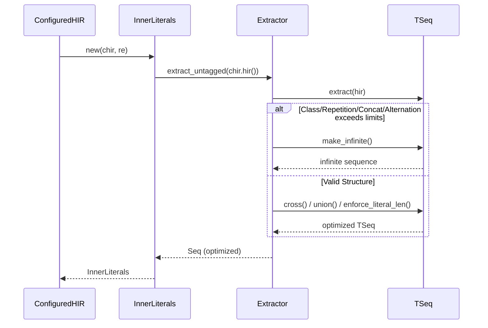
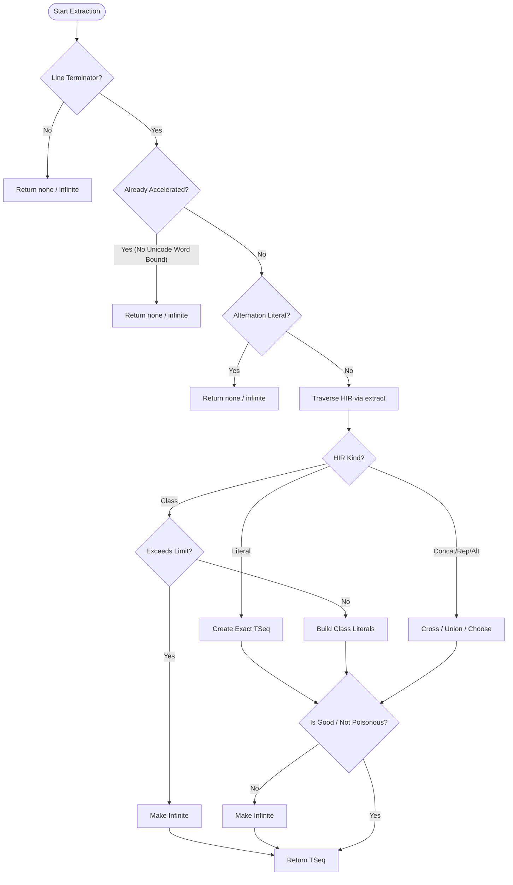

# Literal Sequence Extraction

<details>
<summary>Relevant source files</summary>

The following files were used as context for generating this wiki page:

- [crates/regex/src/literal.rs](https://github.com/BurntSushi/ripgrep/blob/main/crates/regex/src/literal.rs)
</details>

## Overview

The `Extract -> TSeq` pipeline is a heuristic-driven optimization subsystem inside ripgrep's regular expression engine (`crates/regex/src/literal.rs`). Its primary responsibility is to analyze a compiled regex's High-Level Intermediate Representation (HIR), "pluck out" inner literals that are guaranteed to appear whenever the pattern matches, and construct an optimized literal sequence (`Seq` or `TSeq`). 

By isolating these inner literals, ripgrep can bypass its expensive general-purpose NFA/DFA regex engine during throughput searches. Instead, it locates the literal using fast vectorized routines (such as Teddy), bounds the line containing the match, and runs the full regex only against that specific line.

### Step 1: extract

The extraction process begins when `InnerLiterals::new` evaluates whether inner literal optimization is applicable. If line terminators and prefilter criteria are met, it invokes `Extractor::new().extract_untagged(chir.hir())`, which drives the traversal by calling `extract(hir)`.

```rust
let seq = Extractor::new().extract_untagged(chir.hir());
```

Sources: [crates/regex/src/literal.rs:90-90](https://github.com/BurntSushi/ripgrep/blob/main/crates/regex/src/literal.rs#L90-L90)

### Step 2: exact

The `extract` method inspects the node kind of the current HIR element. For literal expressions, empty matches, or lookarounds, it constructs a baseline `TSeq` containing an exact literal match or boundary representation.

```rust
match *hir.kind() {
    Empty | Look(_) => TSeq::singleton(self::Literal::exact(vec![])),
    Literal(hir::Literal(ref bytes)) => {
        let mut seq =
            TSeq::singleton(self::Literal::exact(bytes.to_vec()));
        self.enforce_literal_len(&mut seq);
        seq
    }
    // ...
}
```

Sources: [crates/regex/src/literal.rs:172-179](https://github.com/BurntSushi/ripgrep/blob/main/crates/regex/src/literal.rs#L172-L179)

### Step 3: new

During compound expressions such as repetitions, concatenations, and character classes, sub-sequences are dynamically built or instantiated via helper functions like `TSeq::singleton`, `TSeq::empty`, and `TSeq::new`. These helper constructors wrap `regex_syntax` literal sequences with prefix-tracking metadata (`TSeq`).

```rust
    fn singleton(lit: Literal) -> TSeq {
        TSeq { seq: Seq::singleton(lit), prefix: true }
    }
```

Sources: [crates/regex/src/literal.rs:455-457](https://github.com/BurntSushi/ripgrep/blob/main/crates/regex/src/literal.rs#L455-L457)

### Step 4: none

When extraction encounters conditions that invalidate optimization—such as missing line terminators, already-accelerated regexes without unicode word boundaries, or character classes exceeding configured size limits—the system gracefully falls back to `InnerLiterals::none()`.

```rust
    pub(crate) fn none() -> InnerLiterals {
        InnerLiterals { seq: Seq::infinite() }
    }
```

Sources: [crates/regex/src/literal.rs:96-98](https://github.com/BurntSushi/ripgrep/blob/main/crates/regex/src/literal.rs#L96-L96)

### Step 5: infinite

If sequences grow beyond configured limits (`limit_total`, `limit_class`, `limit_repeat`), or contain "poisonous" high-frequency literals (like empty strings or extremely common single bytes), the sequence is marked infinite via `make_infinite()`. An infinite sequence disables prefiltering and instructs ripgrep to rely entirely on the standard regex engine.

```rust
    fn make_infinite(&mut self) {
        self.seq.make_infinite();
    }
```

Sources: [crates/regex/src/literal.rs:479-481](https://github.com/BurntSushi/ripgrep/blob/main/crates/regex/src/literal.rs#L479-L481)

### Step 6: TSeq

`TSeq` is an internal wrapper struct that pairs a `regex_syntax::hir::literal::Seq` with a `prefix` boolean flag. It governs composition logic—such as cross products (`cross`), unions (`union`), and heuristic selection (`choose`)—to ensure extracted literal sets remain manageable and effective for prefiltering.

```rust
#[derive(Clone, Debug)]
struct TSeq {
    seq: Seq,
    prefix: bool,
}
```

Sources: [crates/regex/src/literal.rs:439-443](https://github.com/BurntSushi/ripgrep/blob/main/crates/regex/src/literal.rs#L439-L443)

## Execution Flow



Sources: [crates/regex/src/literal.rs:54-92](https://github.com/BurntSushi/ripgrep/blob/main/crates/regex/src/literal.rs#L54-L92), [crates/regex/src/literal.rs:151-166](https://github.com/BurntSushi/ripgrep/blob/main/crates/regex/src/literal.rs#L151-L166)

## Decision Flowchart



Sources: [crates/regex/src/literal.rs:57-90](https://github.com/BurntSushi/ripgrep/blob/main/crates/regex/src/literal.rs#L57-L90), [crates/regex/src/literal.rs:172-188](https://github.com/BurntSushi/ripgrep/blob/main/crates/regex/src/literal.rs#L172-L188), [crates/regex/src/literal.rs:379-430](https://github.com/BurntSushi/ripgrep/blob/main/crates/regex/src/literal.rs#L379-L430)

## Key Observations

- **Cross-Module Boundaries:** The pipeline interacts directly with `regex_syntax::hir` to inspect pattern AST nodes and utilizes `regex_automata::meta::Regex` to check acceleration states.
- **Poisonous Literals:** High-frequency matches (like empty strings or frequent single bytes where `rank >= 250`) are flagged as "poisonous" (`is_poisonous`), automatically converting sequences to infinite to prevent prefilter performance degradation.
- **Capacity Limits:** Hard limits (`limit_class: 10`, `limit_repeat: 10`, `limit_total: 64`) prevent combinatorial explosion when calculating cross products of alternations and repetitions.
