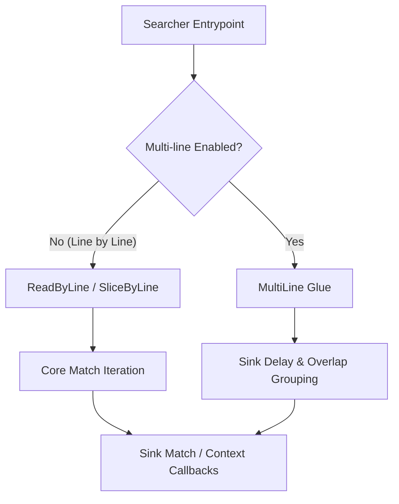

# Search Sink Interface

Relevant source files

The following files were used as context for generating this wiki page:

- [crates/searcher/src/searcher/glue.rs](https://github.com/BurntSushi/ripgrep/blob/main/crates/searcher/src/searcher/glue.rs)
- [crates/printer/src/standard.rs](https://github.com/BurntSushi/ripgrep/blob/main/crates/printer/src/standard.rs)
- [crates/printer/src/json.rs](https://github.com/BurntSushi/ripgrep/blob/main/crates/printer/src/json.rs)

## Overview

The search sink interface bridges low-level text searching and structured output formatting by defining the [`Sink`](https://github.com/BurntSushi/ripgrep/blob/main/crates/searcher/src/searcher/glue.rs#L7) trait that receives match, context, and binary event callbacks. Searcher glue modules such as `ReadByLine` and `SliceByLine` drive buffers and iterate over input streams, invoking sink methods when patterns are discovered. Sinks consume these events to build human-readable reports or serialized stream messages. Sources: [crates/searcher/src/searcher/glue.rs#L21-L22](https://github.com/BurntSushi/ripgrep/blob/main/crates/searcher/src/searcher/glue.rs#L21-L22), [crates/printer/src/standard.rs#L14-L15](https://github.com/BurntSushi/ripgrep/blob/main/crates/printer/src/standard.rs#L14-L15), [crates/printer/src/json.rs#L10-L10](https://github.com/BurntSushi/ripgrep/blob/main/crates/printer/src/json.rs#L10-L10)

Key design decisions focus on decoupling the search algorithms from output representation, allowing specialized implementations like `StandardSink` and `JSONSink` to handle formatting rules independently. Sinks process state such as line numbers, byte offsets, and match granularities without altering the searcher's core logic. Sources: [crates/printer/src/standard.rs#L639-L650](https://github.com/BurntSushi/ripgrep/blob/main/crates/printer/src/standard.rs#L639-L650), [crates/printer/src/json.rs#L65-L71](https://github.com/BurntSushi/ripgrep/blob/main/crates/printer/src/json.rs#L65-L71)

## Searcher Glue and Sink Dispatch

### Searcher Glue and Sink Dispatch

### Overview

Searcher glue structures coordinate execution between underlying stream readers or byte slices and the search core, dispatching matched regions and contextual lines to search sinks. The glue layer implements buffer management, binary data detection, and chunk iteration before invoking sink callback methods. Sources: [crates/searcher/src/searcher/glue.rs#L11-L15](https://github.com/BurntSushi/ripgrep/blob/main/crates/searcher/src/searcher/glue.rs#L11-L15), [crates/searcher/src/searcher/glue.rs#L97-L100](https://github.com/BurntSushi/ripgrep/blob/main/crates/searcher/src/searcher/glue.rs#L97-L100)

Sources: [crates/searcher/src/searcher/glue.rs#L28-L36](https://github.com/BurntSushi/ripgrep/blob/main/crates/searcher/src/searcher/glue.rs#L28-L36), [crates/searcher/src/searcher/glue.rs#L150-L164](https://github.com/BurntSushi/ripgrep/blob/main/crates/searcher/src/searcher/glue.rs#L150-L164)

### Glue Execution Flow

The execution walkthrough for single-line stream searching follows a precise lifecycle managed by `ReadByLine`:

1. `ReadByLine::run()` initiates execution by calling `self.core.begin()?` to signal the start of search sink reporting. Sources: [crates/searcher/src/searcher/glue.rs#L38-L39](https://github.com/BurntSushi/ripgrep/blob/main/crates/searcher/src/searcher/glue.rs#L38-L39)
2. `self.fill()?` manages buffer rolling, input reading via `self.rdr.fill()`, and binary offset checks. Sources: [crates/searcher/src/searcher/glue.rs#L40-L40](https://github.com/BurntSushi/ripgrep/blob/main/crates/searcher/src/searcher/glue.rs#L40-L40), [crates/searcher/src/searcher/glue.rs#L58-L88](https://github.com/BurntSushi/ripgrep/blob/main/crates/searcher/src/searcher/glue.rs#L58-L88)
3. `self.core.match_by_line(self.rdr.buffer())?` scans the active buffer chunk, dispatching match events to the underlying sink. Sources: [crates/searcher/src/searcher/glue.rs#L41-L41](https://github.com/BurntSushi/ripgrep/blob/main/crates/searcher/src/searcher/glue.rs#L41-L41)
4. If matching halts, `self.consume_remaining()` updates the reader position using `self.core.pos()`. Sources: [crates/searcher/src/searcher/glue.rs#L42-L43](https://github.com/BurntSushi/ripgrep/blob/main/crates/searcher/src/searcher/glue.rs#L42-L43), [crates/searcher/src/searcher/glue.rs#L53-L56](https://github.com/BurntSushi/ripgrep/blob/main/crates/searcher/src/searcher/glue.rs#L53-L56)
5. `self.core.finish(...)` concludes the search session with final byte and binary offsets. Sources: [crates/searcher/src/searcher/glue.rs#L47-L50](https://github.com/BurntSushi/ripgrep/blob/main/crates/searcher/src/searcher/glue.rs#L47-L50)

> [!NOTE]
> In `MultiLine` search execution, match dispatch is intentionally delayed to aggregate adjacent or overlapping matches into a single sink event, preventing any individual line from being sent to the sink multiple times. Sources: [crates/searcher/src/searcher/glue.rs#L223-L226](https://github.com/BurntSushi/ripgrep/blob/main/crates/searcher/src/searcher/glue.rs#L223-L226)

### Glue Struct Architecture

| Struct Name | Type Parameters | Purpose | Key Methods | Sources |
| --- | --- | --- | --- | --- |
| `ReadByLine` | `'s, M, R, S` | Drives line-buffered stream searching over an `io::Read` source. | `new()`, `run()`, `fill()`, `consume_remaining()`, `should_binary_quit()` | [crates/searcher/src/searcher/glue.rs#L11-L15](https://github.com/BurntSushi/ripgrep/blob/main/crates/searcher/src/searcher/glue.rs#L11-L15), [crates/searcher/src/searcher/glue.rs#L23-L93](https://github.com/BurntSushi/ripgrep/blob/main/crates/searcher/src/searcher/glue.rs#L23-L93) |
| `SliceByLine` | `'s, M, S` | Executes single-line searches directly over an in-memory byte slice. | `new()`, `run()`, `byte_count()` | [crates/searcher/src/searcher/glue.rs#L96-L100](https://github.com/BurntSushi/ripgrep/blob/main/crates/searcher/src/searcher/glue.rs#L96-L100), [crates/searcher/src/searcher/glue.rs#L103-L138](https://github.com/BurntSushi/ripgrep/blob/main/crates/searcher/src/searcher/glue.rs#L103-L138) |
| `MultiLine` | `'s, M, S` | Handles multi-line matching, overlapping regions, and inverted match callbacks. | `new()`, `run()`, `sink()`, `sink_matched_inverted()`, `sink_matched()`, `sink_context()`, `find()`, `advance()`, `byte_count()` | [crates/searcher/src/searcher/glue.rs#L141-L147](https://github.com/BurntSushi/ripgrep/blob/main/crates/searcher/src/searcher/glue.rs#L141-L147), [crates/searcher/src/searcher/glue.rs#L150-L350](https://github.com/BurntSushi/ripgrep/blob/main/crates/searcher/src/searcher/glue.rs#L150-L350) |

Sources: [crates/searcher/src/searcher/glue.rs#L11-L15](https://github.com/BurntSushi/ripgrep/blob/main/crates/searcher/src/searcher/glue.rs#L11-L15), [crates/searcher/src/searcher/glue.rs#L96-L100](https://github.com/BurntSushi/ripgrep/blob/main/crates/searcher/src/searcher/glue.rs#L96-L100), [crates/searcher/src/searcher/glue.rs#L141-L147](https://github.com/BurntSushi/ripgrep/blob/main/crates/searcher/src/searcher/glue.rs#L141-L147)

### Design Trade-offs

| Design Choice | Benefit | Cost | Sources |
| --- | --- | --- | --- |
| Buffer-rolling (`Core::roll`) | Reuses existing buffer memory and retains necessary context windows without full allocations. | Requires complex tracking of consumed bytes and offset adjustments during re-fills. | [crates/searcher/src/searcher/glue.rs#L63-L64](https://github.com/BurntSushi/ripgrep/blob/main/crates/searcher/src/searcher/glue.rs#L63-L64), [crates/searcher/src/searcher/glue.rs#L79-L86](https://github.com/BurntSushi/ripgrep/blob/main/crates/searcher/src/searcher/glue.rs#L79-L86) |
| Delayed multi-line sinking (`self.last_match`) | Groups adjacent and overlapping matches into unified blocks, avoiding redundant line sink calls. | Introduces stateful lookahead buffering during multi-line iterations. | [crates/searcher/src/searcher/glue.rs#L223-L226](https://github.com/BurntSushi/ripgrep/blob/main/crates/searcher/src/searcher/glue.rs#L223-L226), [crates/searcher/src/searcher/glue.rs#L233-L236](https://github.com/BurntSushi/ripgrep/blob/main/crates/searcher/src/searcher/glue.rs#L233-L236) |
| Separate glue types (`ReadByLine` vs `SliceByLine`) | Optimizes execution paths for streams versus static memory slices respectively. | Duplicates glue structural boilerplate for reader and slice modalities. | [crates/searcher/src/searcher/glue.rs#L11-L15](https://github.com/BurntSushi/ripgrep/blob/main/crates/searcher/src/searcher/glue.rs#L11-L15), [crates/searcher/src/searcher/glue.rs#L96-L100](https://github.com/BurntSushi/ripgrep/blob/main/crates/searcher/src/searcher/glue.rs#L96-L100) |

Sources: [crates/searcher/src/searcher/glue.rs#L11-L15](https://github.com/BurntSushi/ripgrep/blob/main/crates/searcher/src/searcher/glue.rs#L11-L15), [crates/searcher/src/searcher/glue.rs#L63-L64](https://github.com/BurntSushi/ripgrep/blob/main/crates/searcher/src/searcher/glue.rs#L63-L64), [crates/searcher/src/searcher/glue.rs#L223-L226](https://github.com/BurntSushi/ripgrep/blob/main/crates/searcher/src/searcher/glue.rs#L223-L226)

## Standard Sink Line Formatting

### Overview

The `StandardSink` implementation processes search matches, context blocks, and structural breaks, rendering formatted lines through `StandardImpl` and `PreludeWriter`. It coordinates layout decisions—such as whether to display file path headings, absolute byte offsets, line numbers, or column numbers—while delegating color specifications and hyperlink generation to underlying `termcolor::WriteColor` writers.

Sources: [crates/printer/src/standard.rs#L515-L535](https://github.com/BurntSushi/ripgrep/blob/main/crates/printer/src/standard.rs#L515-L535), [crates/printer/src/standard.rs#L763-L868](https://github.com/BurntSushi/ripgrep/blob/main/crates/printer/src/standard.rs#L763-L868)

### Execution Call Chain

When a match is reported during a search, `StandardSink` executes a precise sequence of formatting and rendering steps. The call chain proceeds as follows:

`StandardSink::matched()` → `StandardImpl::from_match()` → `StandardImpl::sink()` → `StandardImpl::write_search_prelude()` → `StandardImpl::sink_slow()` (or `sink_fast()`) → `StandardImpl::write_prelude()` → `PreludeWriter::start()` → `PreludeWriter::write_path()` → `PreludeWriter::write_line_number()` → `PreludeWriter::write_column_number()` → `PreludeWriter::write_byte_offset()` → `PreludeWriter::end()` → `StandardImpl::write_colored_line()`

During this sequence, if match granularity is required (e.g., for color highlights or column offsets), `StandardSink::record_matches` populates match positions before `StandardImpl::sink()` branches based on whether the match list is empty or spans multiple lines.

Sources: [crates/printer/src/standard.rs#L698-L735](https://github.com/BurntSushi/ripgrep/blob/main/crates/printer/src/standard.rs#L698-L735), [crates/printer/src/standard.rs#L766-L790](https://github.com/BurntSushi/ripgrep/blob/main/crates/printer/src/standard.rs#L766-L790), [crates/printer/src/standard.rs#L928-L943](https://github.com/BurntSushi/ripgrep/blob/main/crates/printer/src/standard.rs#L928-L943), [crates/printer/src/standard.rs#L1176-L1189](https://github.com/BurntSushi/ripgrep/blob/main/crates/printer/src/standard.rs#L1176-L1189)

### Prelude Separator Types

The `PreludeWriter` structure manages the delimiter spacing between successive metadata fields inside line headers, such as path names, line numbers, and column offsets.

| Enum Variant | Purpose | Sources |
| --- | --- | --- |
| `PreludeSeparator::None` | Emits no separator bytes before the next field. | [crates/printer/src/standard.rs#L1602-L1604](https://github.com/BurntSushi/ripgrep/blob/main/crates/printer/src/standard.rs#L1602-L1604) |
| `PreludeSeparator::FieldSeparator` | Emits the configured field separator bytes (e.g., `:` for matches or `-` for context). | [crates/printer/src/standard.rs#L1605-L1606](https://github.com/BurntSushi/ripgrep/blob/main/crates/printer/src/standard.rs#L1605-L1606) |
| `PreludeSeparator::PathTerminator` | Emits the designated path terminator byte instead of a standard field separator. | [crates/printer/src/standard.rs#L1607-L1609](https://github.com/BurntSushi/ripgrep/blob/main/crates/printer/src/standard.rs#L1607-L1609) |

Sources: [crates/printer/src/standard.rs#L1602-L1609](https://github.com/BurntSushi/ripgrep/blob/main/crates/printer/src/standard.rs#L1602-L1609)

> [!WARNING]
> When `heading(true)` is enabled on `StandardBuilder`, the file path is emitted once as a standalone header line before matching lines rather than being prepended to every individual line prelude. However, line-dependent hyperlink interpolation forces individual prelude path annotations if the hyperlink format requires per-line target coordinates.

Sources: [crates/printer/src/standard.rs#L218-L221](https://github.com/BurntSushi/ripgrep/blob/main/crates/printer/src/standard.rs#L218-L221), [crates/printer/src/standard.rs#L1635-L1643](https://github.com/BurntSushi/ripgrep/blob/main/crates/printer/src/standard.rs#L1635-L1643)

### Design Trade-offs

| Design Choice | Benefit | Cost | Sources |
| --- | --- | --- | --- |
| Pre-collecting match granularity (`record_matches`) | Simplifies rendering logic and ensures a single search pass suffices for layout computation. | Incurs extra allocations and vector copies stored inside the shared printer state. | [crates/printer/src/standard.rs#L708-L714](https://github.com/BurntSushi/ripgrep/blob/main/crates/printer/src/standard.rs#L708-L714) |
| Fast-path vs. slow-path sink separation (`sink_fast` vs `sink_slow`) | Avoids overhead of individual match detection and column scanning when colors and column numbers are disabled. | Duplicates control flow structures across fast and slow formatting handlers. | [crates/printer/src/standard.rs#L951-L1027](https://github.com/BurntSushi/ripgrep/blob/main/crates/printer/src/standard.rs#L951-L1027) |
| Cell-wrapped color tracking (`in_color_match: Cell<bool>`) | Allows interior mutability for active ANSI state checks within immutable rendering references. | Introduces runtime state checks during byte chunk writing loops. | [crates/printer/src/standard.rs#L881-L882](https://github.com/BurntSushi/ripgrep/blob/main/crates/printer/src/standard.rs#L881-L882), [crates/printer/src/standard.rs#L1475-L1497](https://github.com/BurntSushi/ripgrep/blob/main/crates/printer/src/standard.rs#L1475-L1497) |

Sources: [crates/printer/src/standard.rs#L708-L714](https://github.com/BurntSushi/ripgrep/blob/main/crates/printer/src/standard.rs#L708-L714), [crates/printer/src/standard.rs#L881-L882](https://github.com/BurntSushi/ripgrep/blob/main/crates/printer/src/standard.rs#L881-L882), [crates/printer/src/standard.rs#L951-L1027](https://github.com/BurntSushi/ripgrep/blob/main/crates/printer/src/standard.rs#L951-L1027)

## JSON Sink Message Serialization

### Overview

The `JSONSink` implementation translates search events into streamed JSON lines envelopes containing a `type` discriminator and a `data` payload. Message serialization handles file search lifecycle boundaries, match occurrences, and surrounding context lines according to the JSON Lines format specification.

Sources: [crates/printer/src/json.rs#L115-L154](https://github.com/BurntSushi/ripgrep/blob/main/crates/printer/src/json.rs#L115-L154)

### Message Envelope Types

Every structured message emitted by the JSON printer adheres to an envelope structure enclosing the event payload.

| Message Type | Payload Structure | Sources |
| --- | --- | --- |
| `begin` | Contains path metadata indicating the initiation of file search operations. | [crates/printer/src/json.rs#L135-L135](https://github.com/BurntSushi/ripgrep/blob/main/crates/printer/src/json.rs#L135-L135) |
| `end` | Contains summary statistics and finalization counters for a completed file search. | [crates/printer/src/json.rs#L136-L137](https://github.com/BurntSushi/ripgrep/blob/main/crates/printer/src/json.rs#L136-L137) |
| `match` | Contains matching line text, byte offsets, and individual submatch coordinate arrays. | [crates/printer/src/json.rs#L138-L139](https://github.com/BurntSushi/ripgrep/blob/main/crates/printer/src/json.rs#L138-L139) |
| `context` | Contains contextual line text and optional match data when searching with inversion enabled. | [crates/printer/src/json.rs#L140-L143](https://github.com/BurntSushi/ripgrep/blob/main/crates/printer/src/json.rs#L140-L143) |

Sources: [crates/printer/src/json.rs#L135-L143](https://github.com/BurntSushi/ripgrep/blob/main/crates/printer/src/json.rs#L135-L143)

## Context and Byte Offset Tracking

### Overview

Line numbering, byte offset tracking, and context break separators govern how search sinks establish spatial and structural boundaries across files. Sinks receive line numbers and absolute byte offsets through `SinkMatch` and `SinkFinish` payloads, which standard and JSON printer implementations format into human-readable prefixes or structured metadata fields.

Sources: [crates/searcher/src/searcher/glue.rs#L47-L50](https://github.com/BurntSushi/ripgrep/blob/main/crates/searcher/src/searcher/glue.rs#L47-L50), [crates/printer/src/standard.rs#L766-L770](https://github.com/BurntSushi/ripgrep/blob/main/crates/printer/src/standard.rs#L766-L770)

### Call-Chain Execution Walkthrough

The tracking and writing of context breaks and byte offsets follow an explicit call sequence when transitioning between matching regions and discontiguous context:

1. `Searcher::search_reader()` or `Searcher::search_slice()` drives the core search loop, detecting matches and context lines.
2. When a gap between context blocks occurs, the searcher invokes `StandardSink::context_break()`.
3. `StandardSink::context_break()` instantiates `StandardImpl::new(searcher, self)` and calls `.write_context_separator()?`.
4. `StandardImpl::write_context_separator()` checks if `separator_context` is configured, writes the separator bytes via `self.write(sep)?`, and terminates the line with `self.write_line_term()?`.
5. Upon completion of the entire search, `StandardSink::finish()` receives `SinkFinish`, pulling the final byte count and adding elapsed statistics.

Sources: [crates/searcher/src/searcher/glue.rs#L38-L51](https://github.com/BurntSushi/ripgrep/blob/main/crates/searcher/src/searcher/glue.rs#L38-L51), [crates/printer/src/standard.rs#L815-L867](https://github.com/BurntSushi/ripgrep/blob/main/crates/printer/src/standard.rs#L815-L867), [crates/printer/src/standard.rs#L1421-L1427](https://github.com/BurntSushi/ripgrep/blob/main/crates/printer/src/standard.rs#L1421-L1427)

### Configuration Options for Tracking and Separators

The standard printer builder accepts several parameters controlling byte offsets, line numbering behavior, and separation strings.

| Builder Method | Default Value | Purpose | Sources |
| --- | --- | --- | --- |
| `byte_offset(bool)` | `false` | Prints the absolute byte offset of the beginning of each line or match. | [crates/printer/src/standard.rs#L74-L74](https://github.com/BurntSushi/ripgrep/blob/main/crates/printer/src/standard.rs#L74-L74), [crates/printer/src/standard.rs#L347-L350](https://github.com/BurntSushi/ripgrep/blob/main/crates/printer/src/standard.rs#L347-L350) |
| `separator_search(Option<Vec<u8>>)` | `None` | Sets the separator printed between distinct sets of search results. | [crates/printer/src/standard.rs#L76-L76](https://github.com/BurntSushi/ripgrep/blob/main/crates/printer/src/standard.rs#L76-L76), [crates/printer/src/standard.rs#L374-L380](https://github.com/BurntSushi/ripgrep/blob/main/crates/printer/src/standard.rs#L374-L380) |
| `separator_context(Option<Vec<u8>>)` | `Some(b"--".to_vec())` | Sets the separator printed between discontiguous runs of search context. | [crates/printer/src/standard.rs#L77-L77](https://github.com/BurntSushi/ripgrep/blob/main/crates/printer/src/standard.rs#L77-L77), [crates/printer/src/standard.rs#L391-L397](https://github.com/BurntSushi/ripgrep/blob/main/crates/printer/src/standard.rs#L391-L397) |
| `column(bool)` | `false` | Enables printing the 1-based column number of the first match in a line. | [crates/printer/src/standard.rs#L73-L73](https://github.com/BurntSushi/ripgrep/blob/main/crates/printer/src/standard.rs#L73-L73), [crates/printer/src/standard.rs#L335-L338](https://github.com/BurntSushi/ripgrep/blob/main/crates/printer/src/standard.rs#L335-L338) |

Sources: [crates/printer/src/standard.rs#L73-L79](https://github.com/BurntSushi/ripgrep/blob/main/crates/printer/src/standard.rs#L73-L79), [crates/printer/src/standard.rs#L335-L397](https://github.com/BurntSushi/ripgrep/blob/main/crates/printer/src/standard.rs#L335-L397)

## Multi-line Matching and Replacement Sinks

### Overview

Search sinks handle complex search scenarios involving multi-line patterns, regular expression capture group replacements, and column truncation limits in both standard and JSON printers. When a search matches across multiple lines or requires capture substitution, the sink coordinates match recording and substitution buffers before formatting output.

Sources: [crates/printer/src/standard.rs#L519-L534](https://github.com/BurntSushi/ripgrep/blob/main/crates/printer/src/standard.rs#L519-L534), [crates/printer/src/standard.rs#L737-L760](https://github.com/BurntSushi/ripgrep/blob/main/crates/printer/src/standard.rs#L737-L760)

### Call-Chain Execution Walkthrough

When a match is reported to `StandardSink`, match granularity analysis, match recording, and replacement execution proceed in a strict order:

1. `StandardSink::matched()` intercepts the `SinkMatch` payload and increments `self.match_count`.
2. `StandardSink::record_matches()` clears `self.standard.matches` and checks `self.needs_match_granularity`. If required, it executes `find_iter_at_in_context()` to record individual match ranges.
3. `StandardSink::replace()` clears `self.replacer` and, if `self.standard.config.replacement` is `Some`, invokes `self.replacer.replace_all()`.
4. `StandardImpl::from_match()` builds a `Sunk` instance bundling the match buffer, recorded matches, and replacement output.
5. `StandardImpl::sink()` evaluates match properties, dispatching to `sink_slow_multi_line()` or `sink_fast_multi_line()` depending on multi-line flags and match counts.

Sources: [crates/printer/src/standard.rs#L698-L760](https://github.com/BurntSushi/ripgrep/blob/main/crates/printer/src/standard.rs#L698-L760), [crates/printer/src/standard.rs#L766-L791](https://github.com/BurntSushi/ripgrep/blob/main/crates/printer/src/standard.rs#L766-L791), [crates/printer/src/standard.rs#L900-L943](https://github.com/BurntSushi/ripgrep/blob/main/crates/printer/src/standard.rs#L900-L943)

### Multi-Line and Truncation Configuration Options

The standard printer builder provides several configuration methods governing multi-line behaviors, column limits, and substitution patterns.

| Builder Method | Default Value | Purpose | Sources |
| --- | --- | --- | --- |
| `replacement(Option<Vec<u8>>)` | `None` | Sets replacement bytes supporting capturing group references (e.g., `$1`). | [crates/printer/src/standard.rs#L70-L70](https://github.com/BurntSushi/ripgrep/blob/main/crates/printer/src/standard.rs#L70-L70), [crates/printer/src/standard.rs#L290-L296](https://github.com/BurntSushi/ripgrep/blob/main/crates/printer/src/standard.rs#L290-L296) |
| `max_columns(Option<u64>)` | `None` | Limits the maximum number of bytes per printed line before omission. | [crates/printer/src/standard.rs#L71-L71](https://github.com/BurntSushi/ripgrep/blob/main/crates/printer/src/standard.rs#L71-L71), [crates/printer/src/standard.rs#L306-L309](https://github.com/BurntSushi/ripgrep/blob/main/crates/printer/src/standard.rs#L306-L309) |
| `max_columns_preview(bool)` | `false` | Displays a preview of long lines up to `max_columns` grapheme clusters. | [crates/printer/src/standard.rs#L72-L72](https://github.com/BurntSushi/ripgrep/blob/main/crates/printer/src/standard.rs#L72-L72), [crates/printer/src/standard.rs#L321-L324](https://github.com/BurntSushi/ripgrep/blob/main/crates/printer/src/standard.rs#L321-L324) |
| `per_match_one_line(bool)` | `false` | Prints at most one line per match when multi-line matching is enabled. | [crates/printer/src/standard.rs#L69-L69](https://github.com/BurntSushi/ripgrep/blob/main/crates/printer/src/standard.rs#L69-L69), [crates/printer/src/standard.rs#L275-L278](https://github.com/BurntSushi/ripgrep/blob/main/crates/printer/src/standard.rs#L275-L278) |

Sources: [crates/printer/src/standard.rs#L69-L72](https://github.com/BurntSushi/ripgrep/blob/main/crates/printer/src/standard.rs#L69-L72), [crates/printer/src/standard.rs#L275-L324](https://github.com/BurntSushi/ripgrep/blob/main/crates/printer/src/standard.rs#L275-L324)

> [!WARNING]
> When `max_columns` is exceeded and `max_columns_preview` is enabled, `StandardImpl::write_exceeded_line()` calculates previews using grapheme cluster boundaries (`grapheme_indices()`). If no matches are present, it appends `[...] omitted end of long line]`, whereas remaining matches are counted and summarized dynamically.

Sources: [crates/printer/src/standard.rs#L1297-L1327](https://github.com/BurntSushi/ripgrep/blob/main/crates/printer/src/standard.rs#L1297-L1327)

## Related

- [[File Search Core]]
- [[Standard Text Printer]]

