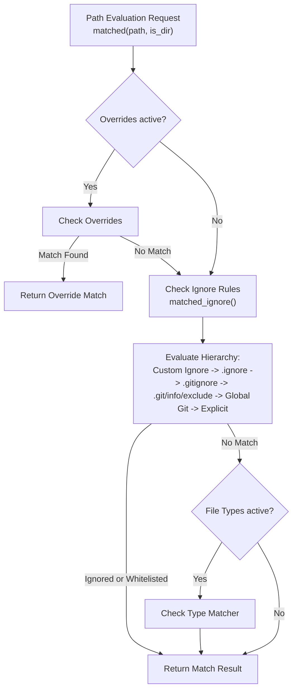
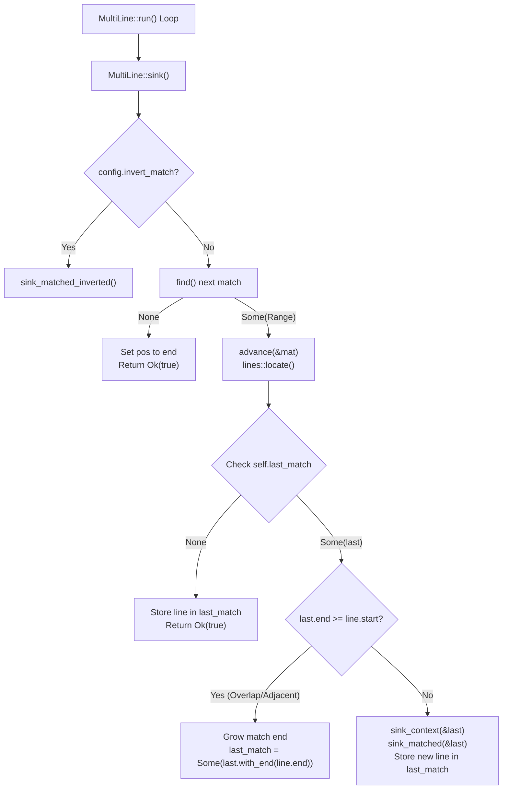
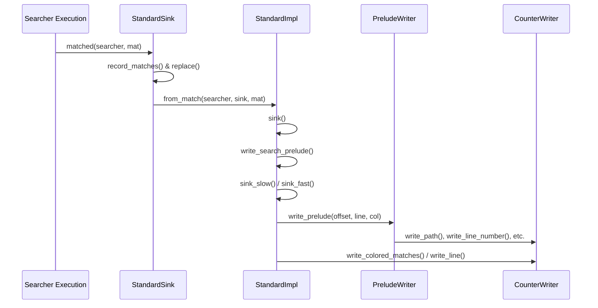

# Search Test Harness

<details>
<summary>Relevant source files</summary>

The following files were used as context for generating this wiki page:

- [crates/searcher/src/searcher/glue.rs](https://github.com/BurntSushi/ripgrep/blob/main/crates/searcher/src/searcher/glue.rs)
- [crates/ignore/src/dir.rs](https://github.com/BurntSushi/ripgrep/blob/main/crates/ignore/src/dir.rs)
- [crates/printer/src/standard.rs](https://github.com/BurntSushi/ripgrep/blob/main/crates/printer/src/standard.rs)
</details>

## Overview

### Introduction and Scope

The Search Test Harness and its surrounding search subsystem provide a comprehensive architecture for executing regular expression and pattern matches against streaming readers or byte slices, filtering paths according to hierarchical VCS ignore rules, and formatting search results with line numbers, context, and terminal color support.

Sources: [crates/searcher/src/searcher/glue.rs:353-385](https://github.com/BurntSushi/ripgrep/blob/main/crates/searcher/src/searcher/glue.rs#L353-L385), [crates/ignore/src/dir.rs:1-15](https://github.com/BurntSushi/ripgrep/blob/main/crates/ignore/src/dir.rs#L1-L15), [crates/printer/src/standard.rs:86-103](https://github.com/BurntSushi/ripgrep/blob/main/crates/printer/src/standard.rs#L86-L103)

To ensure high performance across concurrent multi-threaded directory walks, the system separates directory traversal logic, line-buffered match streaming, and output formatting into distinct components linked by persistent data structures and generic sink traits. Test fixtures like `SearcherTester` exercise these components against known text inputs such as Sherlock Holmes excerpts and source code samples.

Sources: [crates/searcher/src/searcher/glue.rs:355-385](https://github.com/BurntSushi/ripgrep/blob/main/crates/searcher/src/searcher/glue.rs#L355-L385), [crates/ignore/src/dir.rs:93-112](https://github.com/BurntSushi/ripgrep/blob/main/crates/ignore/src/dir.rs#L93-L112), [crates/printer/src/standard.rs:515-535](https://github.com/BurntSushi/ripgrep/blob/main/crates/printer/src/standard.rs#L515-L535)

The harness verifies crucial invariants across edge cases including inverted matching, overlapping multi-line span matches, empty line assertions, buffer capacity limits, binary data detection thresholds, and before/after context line propagation.

Sources: [crates/searcher/src/searcher/glue.rs:387-438](https://github.com/BurntSushi/ripgrep/blob/main/crates/searcher/src/searcher/glue.rs#L387-L438), [crates/searcher/src/searcher/glue.rs:700-756](https://github.com/BurntSushi/ripgrep/blob/main/crates/searcher/src/searcher/glue.rs#L700-L756), [crates/searcher/src/searcher/glue.rs:828-978](https://github.com/BurntSushi/ripgrep/blob/main/crates/searcher/src/searcher/glue.rs#L828-L978)

By simulating complete search pipelines using test utilities like `KitchenSink`, the harness guarantees that search execution drivers (`ReadByLine`, `SliceByLine`, `MultiLine`), persistent directory hierarchy matchers (`Ignore`), and standard output printers (`Standard`, `StandardSink`) operate synchronously with predictable memory consumption and accurate statistics tracking.

Sources: [crates/searcher/src/searcher/glue.rs:11-15](https://github.com/BurntSushi/ripgrep/blob/main/crates/searcher/src/searcher/glue.rs#L11-L15), [crates/searcher/src/searcher/glue.rs:97-101](https://github.com/BurntSushi/ripgrep/blob/main/crates/searcher/src/searcher/glue.rs#L97-L101), [crates/searcher/src/searcher/glue.rs:142-147](https://github.com/BurntSushi/ripgrep/blob/main/crates/searcher/src/searcher/glue.rs#L142-L147), [crates/printer/src/standard.rs:639-650](https://github.com/BurntSushi/ripgrep/blob/main/crates/printer/src/standard.rs#L639-L650)

## Virtual Directory Hierarchy and Ignore Filtering

### Overview

The `Ignore` data structure connects directory traversal with ignore matchers, organizing gitignore semantics, custom ignore files, and precedence rules hierarchically by directory. Every matcher logically corresponds to ignore rules from a single directory and points to the matcher for its corresponding parent directory, forming a persistent data structure optimized for parallel directory iterators.

Sources: [crates/ignore/src/dir.rs:1-10](https://github.com/BurntSushi/ripgrep/blob/main/crates/ignore/src/dir.rs#L1-L10), [crates/ignore/src/dir.rs:93-112](https://github.com/BurntSushi/ripgrep/blob/main/crates/ignore/src/dir.rs#L93-L112)

### Ignore Options and Builder Configuration

An `IgnoreBuilder` initializes and configures default flags and matchers before constructing an `Ignore` instance. The default options enforce hidden file filtering, `.ignore` file parsing, parent traversal, global gitignore parsing, `.gitignore` parsing, and git exclude rule evaluation while disabling case-insensitive matching by default and requiring a git repository.

Sources: [crates/ignore/src/dir.rs:71-90](https://github.com/BurntSushi/ripgrep/blob/main/crates/ignore/src/dir.rs#L71-L90), [crates/ignore/src/dir.rs:784-803](https://github.com/BurntSushi/ripgrep/blob/main/crates/ignore/src/dir.rs#L784-L803)

| Option Field | Type | Default Value | Purpose |
| --- | --- | --- | --- |
| `hidden` | `bool` | `true` | Whether to ignore hidden file paths or not |
| `ignore` | `bool` | `true` | Whether to read `.ignore` files |
| `parents` | `bool` | `true` | Whether to respect any ignore files in parent directories |
| `git_global` | `bool` | `true` | Whether to read git's global gitignore file |
| `git_ignore` | `bool` | `true` | Whether to read `.gitignore` files |
| `git_exclude` | `bool` | `true` | Whether to read `.git/info/exclude` files |
| `ignore_case_insensitive` | `bool` | `false` | Whether to ignore files case insensitively |
| `require_git` | `bool` | `true` | Whether a git repository must be present to apply git-related ignore rules |

Sources: [crates/ignore/src/dir.rs:71-90](https://github.com/BurntSushi/ripgrep/blob/main/crates/ignore/src/dir.rs#L71-L90), [crates/ignore/src/dir.rs:784-803](https://github.com/BurntSushi/ripgrep/blob/main/crates/ignore/src/dir.rs#L784-L803)

### Directory Hierarchy Construction and Traversal

Parent directories are traversed and compiled into the persistent structure via `add_parents()`, which canonicalizes the base path, collects path components from child to root, checks the thread-safe compiled cache (`RwLock<HashMap<OsString, Weak<IgnoreInner>>>`), and invokes `add_child_path()` for uncompiled ancestors.

Sources: [crates/ignore/src/dir.rs:115-122](https://github.com/BurntSushi/ripgrep/blob/main/crates/ignore/src/dir.rs#L115-L122), [crates/ignore/src/dir.rs:192-258](https://github.com/BurntSushi/ripgrep/blob/main/crates/ignore/src/dir.rs#L192-L258)

> [!WARNING]
> Calling `Ignore::add_parents` on a non-root matcher causes an immediate panic. It must only be invoked on root matchers where `is_root()` returns `true`.

Sources: [crates/ignore/src/dir.rs:188-207](https://github.com/BurntSushi/ripgrep/blob/main/crates/ignore/src/dir.rs#L188-L207)

The call-chain execution walkthrough for building parent ignore hierarchies proceeds as follows:
`Ignore::add_parents()` canonicalizes the target path via `.canonicalize()` -> iterates through parent components from child to root -> locks `compiled` cache to check for existing `Weak<IgnoreInner>` entries -> calls `add_child_path()` if missing -> builds `IgnoreInner` with `is_absolute_parent = true` and git repository detection -> wraps in an `Arc` and inserts a weak reference into the `compiled` hash map.

Sources: [crates/ignore/src/dir.rs:208-256](https://github.com/BurntSushi/ripgrep/blob/main/crates/ignore/src/dir.rs#L208-L256)

### Design Trade-Offs in Persistent Ignore Matching

| Design Choice | Benefit | Cost |
| --- | --- | --- |
| Persistent `Arc`-linked parent structures | Avoids rebuilding glob sets for parent directories across parallel walkers | Requires careful path rewriting and absolute base tracking across multiple search roots |
| Probing directory entries via `IgnoreFilesFound` | Reduces filesystem stat overhead by checking pre-read directory entries | Requires passing entry lists down during child directory construction |
| Caching compiled matchers in shared `RwLock<HashMap>` | Prevents redundant glob compilation for shared parent hierarchies | Introduces lock contention overhead across parallel search threads |

Sources: [crates/ignore/src/dir.rs:8-10](https://github.com/BurntSushi/ripgrep/blob/main/crates/ignore/src/dir.rs#L8-L10), [crates/ignore/src/dir.rs:115-122](https://github.com/BurntSushi/ripgrep/blob/main/crates/ignore/src/dir.rs#L115-L122), [crates/ignore/src/dir.rs:284-337](https://github.com/BurntSushi/ripgrep/blob/main/crates/ignore/src/dir.rs#L284-L337)

## Ignore Rule Precedence and Caching Mechanics

### Overview

The evaluation of ignore rules combines multiple rule layers, ranging from repository-specific excludes to user-defined custom ignore filenames and global git configurations. The `Ignore` matcher evaluates paths in a strict precedence order, checking explicit overrides first, followed by aggregated ignore files across the directory hierarchy, and finally file type filters.

Sources: [crates/ignore/src/dir.rs:500-544](https://github.com/BurntSushi/ripgrep/blob/main/crates/ignore/src/dir.rs#L500-L544)

### Rule Precedence and Evaluation Order

When `matched()` is invoked on an `Ignore` instance, rule evaluation proceeds through a fixed sequence of layers. Override patterns take precedence over all ignore and type filters. If no override matches, the engine executes `matched_ignore()` to inspect hierarchical ignore rules.

Sources: [crates/ignore/src/dir.rs:515-533](https://github.com/BurntSushi/ripgrep/blob/main/crates/ignore/src/dir.rs#L515-L533)

| Precedence Order | Matcher Layer | Source / File Pattern | Description |
| --- | --- | --- | --- |
| 1 (Highest) | Override | `Override` | Command-line or builder-specified glob overrides |
| 2 | Custom Ignore | `custom_ignore_filenames` | User-defined custom ignore files (e.g., `.rgignore`) |
| 3 | Local Ignore | `.ignore` | Standard ignore files with gitignore semantics |
| 4 | Git Ignore | `.gitignore` | Standard gitignore files (requires git repository unless disabled) |
| 5 | Git Exclude | `.git/info/exclude` | Local repository exclude file resolved via common dir |
| 6 | Global Git Ignore | `git_global_matcher` | Global gitignore file (typically `$XDG_CONFIG_HOME/git/ignore`) |
| 7 (Lowest) | Explicit Ignores | `explicit_ignores` | Explicitly added global ignore matchers |

Sources: [crates/ignore/src/dir.rs:458-462](https://github.com/BurntSushi/ripgrep/blob/main/crates/ignore/src/dir.rs#L458-L462), [crates/ignore/src/dir.rs:515-685](https://github.com/BurntSushi/ripgrep/blob/main/crates/ignore/src/dir.rs#L515-L685), [crates/ignore/src/dir.rs:908-914](https://github.com/BurntSushi/ripgrep/blob/main/crates/ignore/src/dir.rs#L908-L914)

> [!NOTE]
> Within custom ignore files configured via `add_custom_ignore_filename`, earlier names have lower precedence than later names, allowing fine-grained override control between multiple custom ignore file formats.

Sources: [crates/ignore/src/dir.rs:904-907](https://github.com/BurntSushi/ripgrep/blob/main/crates/ignore/src/dir.rs#L904-L907)



Sources: [crates/ignore/src/dir.rs:500-544](https://github.com/BurntSushi/ripgrep/blob/main/crates/ignore/src/dir.rs#L500-L544), [crates/ignore/src/dir.rs:548-685](https://github.com/BurntSushi/ripgrep/blob/main/crates/ignore/src/dir.rs#L548-L685)

### Caching and Multi-Root Parent Matchers

Parent matchers are cached globally across search roots using a shared thread-safe map (`compiled: Arc<RwLock<HashMap<OsString, Weak<IgnoreInner>>>>`). When multiple directory roots are searched in the same process, parent matchers for shared ancestors are reused via weak pointer upgrades.

Sources: [crates/ignore/src/dir.rs:115-122](https://github.com/BurntSushi/ripgrep/blob/main/crates/ignore/src/dir.rs#L115-L122), [crates/ignore/src/dir.rs:227-237](https://github.com/BurntSushi/ripgrep/blob/main/crates/ignore/src/dir.rs#L227-L237)

To ensure correctness when sibling roots share cached parent matchers, each `Ignore` instance retains an independent `absolute_base` path. During matching, paths are rewritten relative to the specific search root's base rather than a shared global base, preventing multi-root path misattribution bugs.

Sources: [crates/ignore/src/dir.rs:94-112](https://github.com/BurntSushi/ripgrep/blob/main/crates/ignore/src/dir.rs#L94-L112), [crates/ignore/src/dir.rs:595-662](https://github.com/BurntSushi/ripgrep/blob/main/crates/ignore/src/dir.rs#L595-L662)

## Search Execution Engines and Line Streaming

### Overview

Search execution in ripgrep manages streaming data from buffered readers and search slices, detecting binary files, driving line-by-line and multi-line matching loops, and coordinating state transitions between readers, matcher cores, and sinks. The underlying structures include `ReadByLine`, `SliceByLine`, and `MultiLine`, each tailoring search loop mechanics to the input source type and matching constraints.

Sources: [crates/searcher/src/searcher/glue.rs:10-148](https://github.com/BurntSushi/ripgrep/blob/main/crates/searcher/src/searcher/glue.rs#L10-L148)

### Execution and Line Streaming Loop

The search execution orchestrates loops depending on whether the input is a byte slice or a streaming reader. For line-buffered readers (`ReadByLine`), the search driver executes `run()` which initializes the search via `self.core.begin()`, loops while `self.fill()` pulls new data into the buffer, and drives line matching through `self.core.match_by_line(self.rdr.buffer())`. If a match returns false, remaining positions are consumed and the loop breaks, followed by final offset calculations in `self.core.finish()`.

Sources: [crates/searcher/src/searcher/glue.rs:38-51](https://github.com/BurntSushi/ripgrep/blob/main/crates/searcher/src/searcher/glue.rs#L38-L51)

> [!NOTE]
> During buffer filling in `ReadByLine::fill`, if rolling the buffer results in zero bytes consumed and re-filling the reader adds no new bytes, the reader forcefully consumes the remaining buffer length and terminates to prevent infinite polling loops on leftover context.

Sources: [crates/searcher/src/searcher/glue.rs:79-86](https://github.com/BurntSushi/ripgrep/blob/main/crates/searcher/src/searcher/glue.rs#L79-L86)

### Binary Data Detection and Reader State Management

Binary detection inspects buffer regions to identify non-text files according to configured binary detection policies. For slice-based searches (`SliceByLine` and `MultiLine`), binary detection checks up to `DEFAULT_BUFFER_CAPACITY` bytes via `self.core.detect_binary()`. For streamed readers, `ReadByLine::fill` checks binary offsets on every buffer refill unless binary data was already encountered.

Sources: [crates/searcher/src/searcher/glue.rs:61-75](https://github.com/BurntSushi/ripgrep/blob/main/crates/searcher/src/searcher/glue.rs#L61-L75), [crates/searcher/src/searcher/glue.rs:119-126](https://github.com/BurntSushi/ripgrep/blob/main/crates/searcher/src/searcher/glue.rs#L119-L126)

| Struct Type | Input Source | Match Mode Constraint | Binary Detection Strategy |
| --- | --- | --- | --- |
| `ReadByLine` | `LineBufferReader<'s, R>` | `!searcher.multi_line_with_matcher(&matcher)` | Evaluated per buffer refill via `rdr.binary_byte_offset()` |
| `SliceByLine` | `&'s [u8]` (slice) | `!searcher.multi_line_with_matcher(&matcher)` | Evaluated on initial chunk (`0` to `DEFAULT_BUFFER_CAPACITY`) |
| `MultiLine` | `&'s [u8]` (slice) | `searcher.multi_line_with_matcher(&matcher)` | Evaluated on initial chunk with deferred/match-based checks |

Sources: [crates/searcher/src/searcher/glue.rs:10-164](https://github.com/BurntSushi/ripgrep/blob/main/crates/searcher/src/searcher/glue.rs#L10-L164)

### Design Trade-Offs in Search Loops

| Design Choice | Benefit | Cost |
| --- | --- | --- |
| Separate `ReadByLine` and `SliceByLine` structs | Avoids branch overhead and buffer management code during memory slice searches | Code duplication across buffer-backed and slice-backed search paths |
| Deferred match sinking in `MultiLine` | Groups adjacent/overlapping matches into a single sink call to avoid redundant line processing | Requires maintaining `last_match` state across loop iterations |
| Initial chunk binary detection for slices | Quick rejection of binary files without scanning entire large memory buffers | Binary data exclusively past `DEFAULT_BUFFER_CAPACITY` outside matches may be missed in slice mode |

Sources: [crates/searcher/src/searcher/glue.rs:38-131](https://github.com/BurntSushi/ripgrep/blob/main/crates/searcher/src/searcher/glue.rs#L38-L131), [crates/searcher/src/searcher/glue.rs:223-257](https://github.com/BurntSushi/ripgrep/blob/main/crates/searcher/src/searcher/glue.rs#L223-L257)

## Match Sinking and Context Propagation Pipeline

### Overview

Match sinking delegates discovered match ranges and surrounding context lines to registered match handlers (`Sink` implementations) while coordinating context extraction and line-boundary alignment. In multi-line search modes managed by `MultiLine`, matches and context lines flow through a dedicated sink dispatch pipeline that handles overlapping ranges, inverted searches, and trailing context.

Sources: [crates/searcher/src/searcher/glue.rs:142-351](https://github.com/BurntSushi/ripgrep/blob/main/crates/searcher/src/searcher/glue.rs#L142-L351)

### Sink Dispatch and Call-Chain Execution Walkthrough

When searching multi-line byte slices, `MultiLine::run` drives the search loop by invoking `self.sink()`. The sink dispatch pipeline executes through a specific sequence of internal functions to locate, group, and deliver matches:

`MultiLine::run()` → `MultiLine::sink()` → `MultiLine::find()` → `lines::locate()` → `MultiLine::sink_context()` → `MultiLine::sink_matched()`

1. `MultiLine::run()` initiates the loop while the slice remains non-empty and `keepgoing` is true, invoking `self.sink()`. Sources: [crates/searcher/src/searcher/glue.rs:166-175](https://github.com/BurntSushi/ripgrep/blob/main/crates/searcher/src/searcher/glue.rs#L166-L175)
2. `MultiLine::sink()` checks if `invert_match` is configured, delegating to `self.sink_matched_inverted()` if true. Otherwise, it calls `self.find()` to locate the next match range. Sources: [crates/searcher/src/searcher/glue.rs:208-218](https://github.com/BurntSushi/ripgrep/blob/main/crates/searcher/src/searcher/glue.rs#L208-L218)
3. `MultiLine::find()` searches the remaining slice starting at `self.core.pos()` and adjusts offsets relative to the slice root. Sources: [crates/searcher/src/searcher/glue.rs:327-331](https://github.com/BurntSushi/ripgrep/blob/main/crates/searcher/src/searcher/glue.rs#L327-L331)
4. `lines::locate()` maps the raw match range to full line boundaries using the configured line terminator byte. Sources: [crates/searcher/src/searcher/glue.rs:221-222](https://github.com/BurntSushi/ripgrep/blob/main/crates/searcher/src/searcher/glue.rs#L221-L222)
5. `MultiLine::sink()` delays sinking the match via `self.last_match` to group adjacent or overlapping matches. If `last_match.end() >= line.start()`, it grows the existing match range; otherwise, it flushes prior context via `self.sink_context()` and delivers the matched lines via `self.sink_matched()`. Sources: [crates/searcher/src/searcher/glue.rs:223-257](https://github.com/BurntSushi/ripgrep/blob/main/crates/searcher/src/searcher/glue.rs#L223-L257)



Sources: [crates/searcher/src/searcher/glue.rs:208-258](https://github.com/BurntSushi/ripgrep/blob/main/crates/searcher/src/searcher/glue.rs#L208-L258)

> [!NOTE]
> `MultiLine::sink` delays match delivery intentionally. Distinct matches that start and end on the same line are merged or grown so that a single line is never sinked more than once, providing larger blocks of lines to downstream printers and improving replacement handling.

Sources: [crates/searcher/src/searcher/glue.rs:223-242](https://github.com/BurntSushi/ripgrep/blob/main/crates/searcher/src/searcher/glue.rs#L223-L242)

### Context Management and Inverted Sinking

Context lines before and after matches are managed by `MultiLine::sink_context`. Depending on whether `passthru` mode is active, the searcher dispatches to core context routines:

* **Standard Context Mode (`passthru: false`)**: Invokes `self.core.after_context_by_line()` followed by `self.core.before_context_by_line()` relative to the match start. Sources: [crates/searcher/src/searcher/glue.rs:316-322](https://github.com/BurntSushi/ripgrep/blob/main/crates/searcher/src/searcher/glue.rs#L316-L322)
* **Passthrough Mode (`passthru: true`)**: Invokes `self.core.other_context_by_line()` to stream non-matching context lines alongside matches. Sources: [crates/searcher/src/searcher/glue.rs:312-315](https://github.com/BurntSushi/ripgrep/blob/main/crates/searcher/src/searcher/glue.rs#L312-L315)

For inverted matches (`invert_match`), `MultiLine::sink_matched_inverted` computes non-matching ranges between the current position and located matches, sinks context for those inverted regions, and steps through line ranges using `LineStep` to report every non-matching line as a match.

Sources: [crates/searcher/src/searcher/glue.rs:260-297](https://github.com/BurntSushi/ripgrep/blob/main/crates/searcher/src/searcher/glue.rs#L260-L297)

> [!WARNING]
> Zero-width matches require special position advancement inside `MultiLine::advance`. If a match range is empty, the search position is advanced by one byte past the match end (provided it does not exceed the slice length) to prevent infinite loops on zero-length assertions.

Sources: [crates/searcher/src/searcher/glue.rs:333-343](https://github.com/BurntSushi/ripgrep/blob/main/crates/searcher/src/searcher/glue.rs#L333-L343)

### Sink Method Reference

| Method Name | Return Type | Purpose |
| --- | --- | --- |
| `MultiLine::sink` | `Result<bool, S::Error>` | Dispatches regular or inverted match processing, coordinating match grouping and delay logic |
| `MultiLine::sink_matched_inverted` | `Result<bool, S::Error>` | Computes inverted ranges when `invert_match` is enabled and steps through unmatched lines |
| `MultiLine::sink_matched` | `Result<bool, S::Error>` | Validates non-empty match ranges and delegates delivery to `core.matched()` |
| `MultiLine::sink_context` | `Result<bool, S::Error>` | Dispatches before/after context extraction or passthrough context based on configuration |
| `MultiLine::advance` | `()` | Advances search position past the match end, handling zero-width match progression |

Sources: [crates/searcher/src/searcher/glue.rs:208-258](https://github.com/BurntSushi/ripgrep/blob/main/crates/searcher/src/searcher/glue.rs#L208-L258), [crates/searcher/src/searcher/glue.rs:260-297](https://github.com/BurntSushi/ripgrep/blob/main/crates/searcher/src/searcher/glue.rs#L260-L297), [crates/searcher/src/searcher/glue.rs:299-309](https://github.com/BurntSushi/ripgrep/blob/main/crates/searcher/src/searcher/glue.rs#L299-L309), [crates/searcher/src/searcher/glue.rs:311-325](https://github.com/BurntSushi/ripgrep/blob/main/crates/searcher/src/searcher/glue.rs#L311-L325), [crates/searcher/src/searcher/glue.rs:333-343](https://github.com/BurntSushi/ripgrep/blob/main/crates/searcher/src/searcher/glue.rs#L333-L343)

## Standard Result Printing and Output Formatting

### Overview

The standard printer provides core grep-like formatting and color support for search results, managing line numbers, path headers, match highlighting, and custom field separators. The formatting subsystem is built around two primary types defined in `crates/printer/src/standard.rs`: `Standard<W>`, which wraps a frozen `Config` and a `CounterWriter`, and `StandardSink<'p, 's, M, W>`, which implements the `grep_searcher::Sink` trait to process matches and context lines reported by a `Searcher`.

Sources: [crates/printer/src/standard.rs:30-57](https://github.com/BurntSushi/ripgrep/blob/main/crates/printer/src/standard.rs#L30-L57), [crates/printer/src/standard.rs:480-484](https://github.com/BurntSushi/ripgrep/blob/main/crates/printer/src/standard.rs#L480-L484), [crates/printer/src/standard.rs:639-650](https://github.com/BurntSushi/ripgrep/blob/main/crates/printer/src/standard.rs#L639-L650), [crates/printer/src/standard.rs:763](https://github.com/BurntSushi/ripgrep/blob/main/crates/printer/src/standard.rs#L763)

### Call-Chain Execution Walkthrough

When a searcher encounters a match, it invokes `StandardSink::matched()`, which triggers the primary formatting and output pipeline. The operation flows through the following named functions in strict sequence:

1. `StandardSink::matched()` — Increments the match count, invokes `self.record_matches()` to cache match locations if granularity is required, executes text replacements via `self.replace()`, updates statistics, and instantiates `StandardImpl::from_match().sink()?`. Sources: [crates/printer/src/standard.rs:766-791](https://github.com/BurntSushi/ripgrep/blob/main/crates/printer/src/standard.rs#L766-L791)
2. `StandardImpl::sink()` — Writes search preludes and branches based on whether match ranges are empty and whether multi-line mode is active, dispatching to `sink_fast()`, `sink_fast_multi_line()`, `sink_slow()`, or `sink_slow_multi_line()`. Sources: [crates/printer/src/standard.rs:928-943](https://github.com/BurntSushi/ripgrep/blob/main/crates/printer/src/standard.rs#L928-L943)
3. `StandardImpl::sink_slow()` or `sink_slow_multi_line()` — Coordinates line iteration using `LineStep` and delegates individual line rendering to `write_prelude()`, `write_colored_matches()`, or `write_exceeded_line()`. Sources: [crates/printer/src/standard.rs:994-1062](https://github.com/BurntSushi/ripgrep/blob/main/crates/printer/src/standard.rs#L994-L1062)
4. `StandardImpl::write_prelude()` — Instantiates a `PreludeWriter` to emit path headers, line numbers, column numbers, and byte offsets with appropriate color specifications and field separators. Sources: [crates/printer/src/standard.rs:1176-1189](https://github.com/BurntSushi/ripgrep/blob/main/crates/printer/src/standard.rs#L1176-L1189)
5. `PreludeWriter::start()` → `write_path()` → `write_line_number()` → `write_column_number()` → `write_byte_offset()` → `end()` — Sequentially writes each component of the line prefix, managing dynamic separator insertion between fields. Sources: [crates/printer/src/standard.rs:1630-1653](https://github.com/BurntSushi/ripgrep/blob/main/crates/printer/src/standard.rs#L1630-L1653)



Sources: [crates/printer/src/standard.rs:766-791](https://github.com/BurntSushi/ripgrep/blob/main/crates/printer/src/standard.rs#L766-L791), [crates/printer/src/standard.rs:928-943](https://github.com/BurntSushi/ripgrep/blob/main/crates/printer/src/standard.rs#L928-L943), [crates/printer/src/standard.rs:1176-1189](https://github.com/BurntSushi/ripgrep/blob/main/crates/printer/src/standard.rs#L1176-L1189)

> [!NOTE]
> `StandardSink::record_matches` evaluates whether match granularity is required by inspecting `needs_match_granularity`. Coloring, column calculation, replacements, per-match output, and statistics collection all force match granularity on, while fast paths skip individual match identification entirely.

Sources: [crates/printer/src/standard.rs:578-594](https://github.com/BurntSushi/ripgrep/blob/main/crates/printer/src/standard.rs#L578-L594), [crates/printer/src/standard.rs:698-707](https://github.com/BurntSushi/ripgrep/blob/main/crates/printer/src/standard.rs#L698-L707)

### Printer Configuration and Design Trade-offs

The printer's behavior is fully configured via `StandardBuilder` before building an immutable `Config` instance.

| Design Choice | Benefit | Cost |
| --- | --- | --- |
| Immutable `Config` after build | Thread safety, zero synchronization overhead during high-speed parallel searches | Inflexible post-construction modification |
| Separate `StandardSink` per search | Cheap to instantiate, enables concurrent search operations across multiple files | Requires allocating sink state per search target |
| Amortized match caching in `Standard` | Avoids repeated regex matching passes during slow-path formatting and replacement | Additional memory overhead for storing match vectors |

Sources: [crates/printer/src/standard.rs:33-34](https://github.com/BurntSushi/ripgrep/blob/main/crates/printer/src/standard.rs#L33-L34), [crates/printer/src/standard.rs:515-535](https://github.com/BurntSushi/ripgrep/blob/main/crates/printer/src/standard.rs#L515-L535), [crates/printer/src/standard.rs:708-715](https://github.com/BurntSushi/ripgrep/blob/main/crates/printer/src/standard.rs#L708-L715)

> [!CAUTION]
> Zero-width matches occurring at or beyond `range.end` are explicitly popped from the match vector in `record_matches` to prevent trailing phantom matches on line boundaries.

Sources: [crates/printer/src/standard.rs:727-734](https://github.com/BurntSushi/ripgrep/blob/main/crates/printer/src/standard.rs#L727-L734)

### Result Formatting API Reference

| Method / Struct | Return Type | Purpose |
| --- | --- | --- |
| `StandardBuilder::new` | `StandardBuilder` | Returns a new builder initialized with default configuration values |
| `StandardBuilder::build` | `Standard<W>` | Consumes the builder and constructs a standard printer over any `WriteColor` writer |
| `Standard::sink` | `StandardSink<'static, 's, M, W>` | Creates a sink without a file path |
| `Standard::sink_with_path` | `StandardSink<'p, 's, M, W>` | Creates a sink associated with a file path and custom path separator |
| `StandardSink::has_match` | `bool` | Returns true if the previous search received at least one match |
| `StandardSink::match_count` | `u64` | Returns the total number of matches reported during the previous search |

Sources: [crates/printer/src/standard.rs:105-107](https://github.com/BurntSushi/ripgrep/blob/main/crates/printer/src/standard.rs#L105-L107), [crates/printer/src/standard.rs:127-133](https://github.com/BurntSushi/ripgrep/blob/main/crates/printer/src/standard.rs#L127-L133), [crates/printer/src/standard.rs:515-535](https://github.com/BurntSushi/ripgrep/blob/main/crates/printer/src/standard.rs#L515-L535), [crates/printer/src/standard.rs:541-571](https://github.com/BurntSushi/ripgrep/blob/main/crates/printer/src/standard.rs#L541-L571), [crates/printer/src/standard.rs:658-660](https://github.com/BurntSushi/ripgrep/blob/main/crates/printer/src/standard.rs#L658-L660), [crates/printer/src/standard.rs:669-671](https://github.com/BurntSushi/ripgrep/blob/main/crates/printer/src/standard.rs#L669-L671)

## Advanced Printer Configuration and Line Truncation

### Overview

Advanced formatting controls in `StandardBuilder` permit adjusting column limits, rendering per-match output, injecting replacement text, and recording aggregate search statistics. When column constraints are active, long lines can either be omitted entirely or previewed using grapheme cluster boundaries. Separators between search results and discontiguous context runs are also customized via builder settings.

Sources: [crates/printer/src/standard.rs:306-324](https://github.com/BurntSushi/ripgrep/blob/main/crates/printer/src/standard.rs#L306-L324), [crates/printer/src/standard.rs:374-397](https://github.com/BurntSushi/ripgrep/blob/main/crates/printer/src/standard.rs#L374-L397)

### Column Limits and Preview Execution

The printer handles lines exceeding configured column thresholds through `StandardImpl::write_exceeded_line`. If `max_columns_preview` is enabled, the output takes a prefix of length $N$ measured in grapheme clusters rather than dropping the entire line.

Sources: [crates/printer/src/standard.rs:1290-1328](https://github.com/BurntSushi/ripgrep/blob/main/crates/printer/src/standard.rs#L1290-L1328)

```rust
fn write_exceeded_line(
    &self,
    bytes: &[u8],
    mut line: Match,
    matches: &[Match],
    match_index: &mut usize,
) -> io::Result<()> {
    if self.config().max_columns_preview {
        let original = line;
        let end = bytes[line]
            .grapheme_indices()
            .map(|(_, end, _)| end)
            .take(self.config().max_columns.unwrap_or(0) as usize)
            .last()
            .unwrap_or(0)
            + line.start();
        line = line.with_end(end);
        self.write_colored_matches(bytes, line, matches, match_index)?;
        // ...
    }
    Ok(())
}
```

Sources: [crates/printer/src/standard.rs:1290-1308](https://github.com/BurntSushi/ripgrep/blob/main/crates/printer/src/standard.rs#L1290-L1308)

> [!WARNING]
> Column numbers are computed in terms of bytes from the start of the line. However, when `max_columns_preview` is enabled, the preview limit $N$ is measured in grapheme clusters rather than raw bytes, which requires scanning UTF-8 boundaries.

Sources: [crates/printer/src/standard.rs:312-316](https://github.com/BurntSushi/ripgrep/blob/main/crates/printer/src/standard.rs#L312-L316), [crates/printer/src/standard.rs:1299-1305](https://github.com/BurntSushi/ripgrep/blob/main/crates/printer/src/standard.rs#L1299-L1305)

### Replacement and Statistics Tracking

When replacement text is configured via `StandardBuilder::replacement`, `StandardSink::replace` invokes `Replacer::replace_all` to interpolate matching groups. When statistics are enabled via `StandardBuilder::stats`, `StandardSink::finish` records elapsed duration, total searches, searches with matches, bytes searched, and bytes printed.

Sources: [crates/printer/src/standard.rs:203-206](https://github.com/BurntSushi/ripgrep/blob/main/crates/printer/src/standard.rs#L203-L206), [crates/printer/src/standard.rs:290-296](https://github.com/BurntSushi/ripgrep/blob/main/crates/printer/src/standard.rs#L290-L296), [crates/printer/src/standard.rs:741-760](https://github.com/BurntSushi/ripgrep/blob/main/crates/printer/src/standard.rs#L741-L760), [crates/printer/src/standard.rs:849-867](https://github.com/BurntSushi/ripgrep/blob/main/crates/printer/src/standard.rs#L849-L867)

| Builder Option | Default Value | Purpose |
| --- | --- | --- |
| `max_columns` | `None` | Limits the maximum columns printed per line |
| `max_columns_preview` | `false` | Enables printing grapheme cluster previews for long lines |
| `per_match` | `false` | Prints at least one line per match |
| `per_match_one_line` | `false` | Restricts multi-line matches to exactly one line of output |
| `separator_search` | `None` | Sets the divider printed between separate search operations |
| `separator_context` | `Some(b"--")` | Sets the separator used between discontiguous context runs |

Sources: [crates/printer/src/standard.rs:71](https://github.com/BurntSushi/ripgrep/blob/main/crates/printer/src/standard.rs#L71), [crates/printer/src/standard.rs:306-309](https://github.com/BurntSushi/ripgrep/blob/main/crates/printer/src/standard.rs#L306-L309), [crates/printer/src/standard.rs:72](https://github.com/BurntSushi/ripgrep/blob/main/crates/printer/src/standard.rs#L72), [crates/printer/src/standard.rs:321-324](https://github.com/BurntSushi/ripgrep/blob/main/crates/printer/src/standard.rs#L321-L324), [crates/printer/src/standard.rs:68](https://github.com/BurntSushi/ripgrep/blob/main/crates/printer/src/standard.rs#L68), [crates/printer/src/standard.rs:260-263](https://github.com/BurntSushi/ripgrep/blob/main/crates/printer/src/standard.rs#L260-L263), [crates/printer/src/standard.rs:69](https://github.com/BurntSushi/ripgrep/blob/main/crates/printer/src/standard.rs#L69), [crates/printer/src/standard.rs:275-278](https://github.com/BurntSushi/ripgrep/blob/main/crates/printer/src/standard.rs#L275-L278), [crates/printer/src/standard.rs:76](https://github.com/BurntSushi/ripgrep/blob/main/crates/printer/src/standard.rs#L76), [crates/printer/src/standard.rs:374-380](https://github.com/BurntSushi/ripgrep/blob/main/crates/printer/src/standard.rs#L374-L380), [crates/printer/src/standard.rs:77](https://github.com/BurntSushi/ripgrep/blob/main/crates/printer/src/standard.rs#L77), [crates/printer/src/standard.rs:391-397](https://github.com/BurntSushi/ripgrep/blob/main/crates/printer/src/standard.rs#L391-L397)

## Related

- [[File Search Core]]

