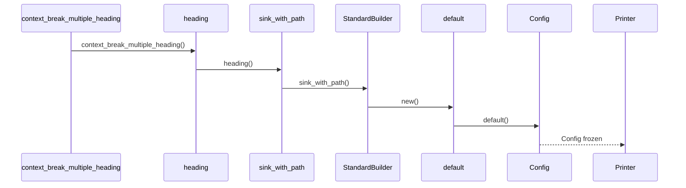

# Standard Text Printer

Relevant source files

The following files were used as context for generating this wiki page:

- [crates/searcher/src/searcher/glue.rs](https://github.com/BurntSushi/ripgrep/blob/main/crates/searcher/src/searcher/glue.rs)
- [crates/printer/src/standard.rs](https://github.com/BurntSushi/ripgrep/blob/main/crates/printer/src/standard.rs)
- [crates/core/flags/defs.rs](https://github.com/BurntSushi/ripgrep/blob/main/crates/core/flags/defs.rs)

## Overview

The standard text printer component in ripgrep is responsible for rendering grep-like search outputs, formatting matches, managing file paths and headings, applying color highlights and pattern replacements, and aggregating statistics. Acting as the presentation tier between search execution and output streams, it solves the problem of translating raw match bytes and structural line metadata into structured, readable terminal formats. Key design decisions include separating immutable configuration from active printers via builders, decoupling printers from raw search loops through sink callback interfaces, and employing distinct fast and slow execution paths to optimize performance when individual match granularity is unnecessary. Sources: [crates/printer/src/standard.rs:30-57](https://github.com/BurntSushi/ripgrep/blob/main/crates/printer/src/standard.rs#L30-L57), [crates/printer/src/standard.rs:86-101](https://github.com/BurntSushi/ripgrep/blob/main/crates/printer/src/standard.rs#L86-L101), [crates/printer/src/standard.rs:479-484](https://github.com/BurntSushi/ripgrep/blob/main/crates/printer/src/standard.rs#L479-L484), [crates/printer/src/standard.rs:578-594](https://github.com/BurntSushi/ripgrep/blob/main/crates/printer/src/standard.rs#L578-L594), [crates/printer/src/standard.rs:928-943](https://github.com/BurntSushi/ripgrep/blob/main/crates/printer/src/standard.rs#L928-L943)

## Printer Configuration and Flag Mapping

### Printer Configuration and Flag Mapping

The configuration state governing ripgrep's standard printer formatting behavior is encapsulated within the private `Config` struct and manipulated via the public `StandardBuilder` API. Each configuration parameter directly corresponds to a command-line flag or formatting rule that determines whether paths, headings, byte offsets, column numbers, or custom separators are emitted.

Sources: [crates/printer/src/standard.rs:30-57](https://github.com/BurntSushi/ripgrep/blob/main/crates/printer/src/standard.rs#L30-L57), [crates/printer/src/standard.rs:86-101](https://github.com/BurntSushi/ripgrep/blob/main/crates/printer/src/standard.rs#L86-L101)

### Configuration Parameters and Flag Mapping

The following table maps output configuration options in `Config` and `StandardBuilder` to their underlying fields and default values:

| Configuration Parameter | Struct Field | Default Value | Purpose |
| :--- | :--- | :--- | :--- |
| Color specifications | `colors` | `ColorSpecs::default()` | Sets terminal color styling rules for matches, paths, and line numbers. |
| Hyperlink configuration | `hyperlink` | `HyperlinkConfig::default()` | Configures clickable ANSI hyperlinks for file paths and locations. |
| Aggregate statistics | `stats` | `false` | Enables collection of search metrics such as bytes searched, matching lines, and elapsed time. |
| File headings | `heading` | `false` | Prints the file path once on its own line before displaying matches. |
| Path printing | `path` | `true` | Controls whether file paths are included in the output. |
| Only matching | `only_matching` | `false` | Prints only the matching substring on its own line rather than the full line. |
| Per match | `per_match` | `false` | Prints at least one line for every individual match found. |
| Per match one line | `per_match_one_line` | `false` | Restricts multi-line matches to a single printed line under `per_match`. |
| Replacement pattern | `replacement` | `Arc::new(None)` | Substitutes matches with a replacement byte string supporting capture group references. |
| Maximum columns | `max_columns` | `None` | Omits lines exceeding the specified byte width limit. |
| Maximum columns preview | `max_columns_preview` | `false` | Truncates long lines to a grapheme cluster preview instead of omitting them entirely. |
| Column numbers | `column` | `false` | Prints the 1-based byte column offset of the first match on a line. |
| Byte offsets | `byte_offset` | `false` | Prints the absolute 0-based byte offset from the start of the search buffer. |
| ASCII trimming | `trim_ascii` | `false` | Trims leading ASCII whitespace from printed lines. |
| Search separator | `separator_search` | `Arc::new(None)` | Inserts a divider string between discontiguous search result sets. |
| Context separator | `separator_context` | `Arc::new(Some(b"--".to_vec()))` | Inserts a divider string between discontiguous runs of search context. |
| Field match separator | `separator_field_match` | `Arc::new(b":".to_vec())` | Separates metadata fields (line numbers, paths) from matching lines. |
| Field context separator | `separator_field_context` | `Arc::new(b"-".to_vec())` | Separates metadata fields from context lines. |
| Path separator | `separator_path` | `None` | Overrides the environment's default directory path separator byte. |
| Path terminator | `path_terminator` | `None` | Custom terminator byte written immediately following every emitted file path. |

Sources: [crates/printer/src/standard.rs:36-57](https://github.com/BurntSushi/ripgrep/blob/main/crates/printer/src/standard.rs#L36-L57), [crates/printer/src/standard.rs:61-84](https://github.com/BurntSushi/ripgrep/blob/main/crates/printer/src/standard.rs#L61-L84)

### CLI Flag Registry

The CLI flag definitions in ripgrep register user-facing arguments that map directly to the printer configuration builder methods:

| CLI Flag Name | Corresponding Builder Method | Description |
| :--- | :--- | :--- |
| `--color` | `color_specs` | Controls when to use colors in output. |
| `--colors` | `color_specs` | Configures color specifications for specific output components. |
| `--column` | `column` | Shows column numbers of matches. |
| `--context-separator` | `separator_context` | Sets the string used to separate non-continuous context lines. |
| `--field-context-separator` | `separator_field_context` | Sets the separator between context path, line number, and line. |
| `--field-match-separator` | `separator_field_match` | Sets the separator between match path, line number, and line. |
| `--heading` | `heading` | Prints file names above matches rather than as prefixes. |
| `--max-columns` | `max_columns` | Don't print lines longer than this limit. |
| `--max-columns-preview` | `max_columns_preview` | Print a preview of long lines instead of omitting them. |
| `--only-matching` | `only_matching` | Print only the matched parts of a line. |
| `--path-separator` | `separator_path` | Specifies the path separator character on the command line. |
| `--passthru` | `replacement` / standard sink | Prints all lines, replacing matches where configured. |
| `--replace` | `replacement` | Replaces matched patterns with the given string. |
| `--stats` | `stats` | Prints aggregate statistics about the search. |
| `--trim` | `trim_ascii` | Trims prefix ASCII whitespace from matching lines. |
| `--with-filename` / `-H` / `-h` | `path` | Displays file names for matches. |

Sources: [crates/core/flags/defs.rs:52-151](https://github.com/BurntSushi/ripgrep/blob/main/crates/core/flags/defs.rs#L52-L151)

> [!NOTE]
> Command-line flags are ordered inside `FLAGS` array in `crates/core/flags/defs.rs` to dictate their exact presentation sequence in generated help menus and man pages, ensuring that options like `-e`/`--regexp` and `-f`/`--file` precede all other category entries.
> Sources: [crates/core/flags/defs.rs:44-48](https://github.com/BurntSushi/ripgrep/blob/main/crates/core/flags/defs.rs#L44-L48)

## Standard Builder and Instance Construction

### Overview

The construction of standard printer instances follows the builder pattern via `StandardBuilder`, which manages an internal, private `Config` structure. Once construction completes through methods taking writers implementing `termcolor::WriteColor` or `io::Write`, the resulting `Standard` printer freezes its configuration state, rendering it immutable throughout subsequent search operations.
Sources: [crates/printer/src/standard.rs:30-57](https://github.com/BurntSushi/ripgrep/blob/main/crates/printer/src/standard.rs#L30-L57), [crates/printer/src/standard.rs:86-101](https://github.com/BurntSushi/ripgrep/blob/main/crates/printer/src/standard.rs#L86-L101)

### Builder Execution and Call-Chain Walkthrough

During test execution involving multiple heading configurations and search paths, printer initialization and configuration flow through the precise sequence defined by the `Context_break_multiple_heading -> Config` call chain: `context_break_multiple_heading` invokes `heading`, which delegates to `sink_with_path`, calling `new` to instantiate the builder, which invokes `default` to instantiate `Config::default()`, yielding the underlying `Config`.

1. `context_break_multiple_heading` initializes test assertions and builder configuration.
Sources: [crates/printer/src/standard.rs:1973-1981](https://github.com/BurntSushi/ripgrep/blob/main/crates/printer/src/standard.rs#L1973-L1981)
2. `heading` sets the heading configuration option to true on the builder.
Sources: [crates/printer/src/standard.rs:2126-2131](https://github.com/BurntSushi/ripgrep/blob/main/crates/printer/src/standard.rs#L2126-L2131)
3. `sink_with_path` configures the standard sink with an associated file path and path separator.
Sources: [crates/printer/src/standard.rs:540-546](https://github.com/BurntSushi/ripgrep/blob/main/crates/printer/src/standard.rs#L540-L546)
4. `new` constructs a `StandardBuilder` with default configurations.
Sources: [crates/printer/src/standard.rs:1613-1620](https://github.com/BurntSushi/ripgrep/blob/main/crates/printer/src/standard.rs#L1613-L1620)
5. `default` populates `Config` with default fields (`path: true`, `stats: false`, default separators).
Sources: [crates/printer/src/standard.rs:59-84](https://github.com/BurntSushi/ripgrep/blob/main/crates/printer/src/standard.rs#L59-L84)
6. `Config` encapsulates the frozen configuration structure.
Sources: [crates/printer/src/standard.rs:35-56](https://github.com/BurntSushi/ripgrep/blob/main/crates/printer/src/standard.rs#L35-L56)

Concurrently, building the concrete printer instance follows this explicit path:
1. `context_break_multiple_heading` invokes builder methods.
Sources: [crates/printer/src/standard.rs:1973-1981](https://github.com/BurntSushi/ripgrep/blob/main/crates/printer/src/standard.rs#L1973-L1981)
2. `heading` configures heading emission.
Sources: [crates/printer/src/standard.rs:2126-2131](https://github.com/BurntSushi/ripgrep/blob/main/crates/printer/src/standard.rs#L2126-L2131)
3. `StandardBuilder::new` creates the builder.
Sources: [crates/printer/src/standard.rs:1613-1620](https://github.com/BurntSushi/ripgrep/blob/main/crates/printer/src/standard.rs#L1613-L1620)
4. `StandardBuilder::build` wraps the provided writer in a `CounterWriter` and `RefCell`, combining it with cloned configuration data.
Sources: [crates/printer/src/standard.rs:126-132](https://github.com/BurntSushi/ripgrep/blob/main/crates/printer/src/standard.rs#L126-L132)
5. `Standard` represents the finalized printer type generic over `W`.
Sources: [crates/printer/src/standard.rs:479-483](https://github.com/BurntSushi/ripgrep/blob/main/crates/printer/src/standard.rs#L479-L483)

Sources: [crates/printer/src/standard.rs:59-84](https://github.com/BurntSushi/ripgrep/blob/main/crates/printer/src/standard.rs#L59-L84), [crates/printer/src/standard.rs:126-132](https://github.com/BurntSushi/ripgrep/blob/main/crates/printer/src/standard.rs#L126-L132), [crates/printer/src/standard.rs:479-483](https://github.com/BurntSushi/ripgrep/blob/main/crates/printer/src/standard.rs#L479-L483), [crates/printer/src/standard.rs:1973-1981](https://github.com/BurntSushi/ripgrep/blob/main/crates/printer/src/standard.rs#L1973-L1981)

### Construction Methods Reference

| Constructor / Builder Method | Parameter Types | Return Type | Description |
| :--- | :--- | :--- | :--- |
| `StandardBuilder::new` | None | `StandardBuilder` | Returns a builder with default printer configuration. |
| `StandardBuilder::build` | `W: WriteColor` | `Standard<W>` | Constructs a printer wrapping any color-aware writer. |
| `StandardBuilder::build_no_color` | `W: io::Write` | `Standard<NoColor<W>>` | Constructs a printer wrapping a raw byte writer with color disabled. |
| `Standard::new` | `W: WriteColor` | `Standard<W>` | Convenience function initializing a default color printer. |
| `Standard::new_no_color` | `W: io::Write` | `Standard<NoColor<W>>` | Convenience function initializing a default non-color printer. |

Sources: [crates/printer/src/standard.rs:103-145](https://github.com/BurntSushi/ripgrep/blob/main/crates/printer/src/standard.rs#L103-L145), [crates/printer/src/standard.rs:486-508](https://github.com/BurntSushi/ripgrep/blob/main/crates/printer/src/standard.rs#L486-L508)

> [!NOTE]
> Once `StandardBuilder::build` or `StandardBuilder::build_no_color` is invoked, the internal `Config` structure is cloned directly into the `Standard` instance inside a frozen state. Subsequent modifications to the builder have zero effect on already constructed printer instances.
> Sources: [crates/printer/src/standard.rs:32-34](https://github.com/BurntSushi/ripgrep/blob/main/crates/printer/src/standard.rs#L32-L34), [crates/printer/src/standard.rs:126-145](https://github.com/BurntSushi/ripgrep/blob/main/crates/printer/src/standard.rs#L126-L145)

## Searcher Glue and Sink Integration

### Overview

The glue logic inside `grep_searcher` and the sink implementations inside `grep_printer` form the bridge that translates raw byte scanning and pattern matching into formatted terminal output. Specifically, `grep_searcher` manages line iteration glue—such as `ReadByLine`, `SliceByLine`, and `MultiLine`—which drives match discovery and buffer filling. When matches, context lines, or binary markers are encountered, these glue structs invoke the callback interface defined by the `Sink` trait implemented on `StandardSink`.
Sources: [crates/searcher/src/searcher/glue.rs:11-147](https://github.com/BurntSushi/ripgrep/blob/main/crates/searcher/src/searcher/glue.rs#L11-L147), [crates/printer/src/standard.rs:763-868](https://github.com/BurntSushi/ripgrep/blob/main/crates/printer/src/standard.rs#L763-L868)

### Sink Callback Interface Implementation

`StandardSink` implements the `Sink` trait for the standard printer, handling callbacks dispatched by searcher glue logic during a search operation.

| Sink Method | Parameter Signatures | Purpose & Behavior |
| :--- | :--- | :--- |
| `begin` | `&mut self, _searcher: &Searcher` | Resets match counts, execution timers, and byte offset tracking at the start of a search. |
| `matched` | `&mut self, searcher: &Searcher, mat: &SinkMatch<'_>` | Increments match counters, records match locations if granularity is needed, executes replacements, and invokes formatting. |
| `context` | `&mut self, searcher: &Searcher, ctx: &SinkContext<'_>` | Clears temporary state, handles inverted match context recording if required, and dispatches contextual line rendering. |
| `context_break` | `&mut self, searcher: &Searcher` | Emits a context separator line between discontiguous runs of search context. |
| `binary_data` | `&mut self, searcher: &Searcher, binary_byte_offset: u64}` | Records the absolute byte offset where binary data was first detected. |
| `finish` | `&mut self, searcher: &Searcher, finish: &SinkFinish` | Emits any deferred binary warning messages and updates aggregate search statistics if enabled. |

Sources: [crates/printer/src/standard.rs:763-868](https://github.com/BurntSushi/ripgrep/blob/main/crates/printer/src/standard.rs#L763-L868)

> [!NOTE]
> `StandardSink` instances are lightweight and should be constructed freshly for each searched entity via `Standard::sink` or `Standard::sink_with_path`. They borrow a mutable reference to the parent `Standard` printer, which stores reusable match vectors and counter writers.
> Sources: [crates/printer/src/standard.rs:515-571](https://github.com/BurntSushi/ripgrep/blob/main/crates/printer/src/standard.rs#L515-L571), [crates/printer/src/standard.rs:619-650](https://github.com/BurntSushi/ripgrep/blob/main/crates/printer/src/standard.rs#L619-L650)

## Standard Formatting and Execution Paths

### Overview

The standard printer dispatches matched lines and context lines through specific code execution paths depending on whether the configuration demands match granularity (such as colored output, column numbers, replacements, per-match printing, or statistics gathering) and whether the search operates in single-line or multi-line mode. When a match or context callback is received, `StandardImpl` is initialized via `StandardImpl::from_match` or `StandardImpl::from_context`, bundling the searcher, sink, and sunk buffer data.
Sources: [crates/printer/src/standard.rs:578-594](https://github.com/BurntSushi/ripgrep/blob/main/crates/printer/src/standard.rs#L578-L594), [crates/printer/src/standard.rs:875-926](https://github.com/BurntSushi/ripgrep/blob/main/crates/printer/src/standard.rs#L875-L926)

### Output Dispatch Paths

The core routing logic resides in `StandardImpl::sink()`, which evaluates whether individual matches were recorded and whether multi-line matching is active. Depending on these conditions, control flows to one of four primary rendering methods or specialized handling routines.
Sources: [crates/printer/src/standard.rs:928-943](https://github.com/BurntSushi/ripgrep/blob/main/crates/printer/src/standard.rs#L928-L943)

| Condition | Match Granularity | Multi-Line Mode | Target Dispatch Function | Purpose |
| :--- | :--- | :--- | :--- | :--- |
| Fast Path (Single-line) | None | Disabled / Context | `StandardImpl::sink_fast()` | Prints lines directly without scanning for individual match offsets. |
| Fast Path (Multi-line) | None | Enabled (Non-context) | `StandardImpl::sink_fast_multi_line()` | Iterates lines via line terminators and prints each line rapidly. |
| Slow Path (Single-line) | Required | Disabled / Context | `StandardImpl::sink_slow()` | Processes individual match offsets for coloring, `only_matching`, or `per_match`. |
| Slow Path (Multi-line) | Required | Enabled (Non-context) | `StandardImpl::sink_slow_multi_line()` | Delegates to specialized multi-line handlers (`sink_slow_multi_line_only_matching` or `sink_slow_multi_per_match`). |

Sources: [crates/printer/src/standard.rs:928-1037](https://github.com/BurntSushi/ripgrep/blob/main/crates/printer/src/standard.rs#L928-L1037)

> [!NOTE]
> The helper method `Standard::needs_match_granularity()` determines whether individual match offsets must be computed. Granularity is required if color support and match coloring are enabled, or if `column`, `replacement`, `per_match`, `only_matching`, or `stats` options are active.
> Sources: [crates/printer/src/standard.rs:578-594](https://github.com/BurntSushi/ripgrep/blob/main/crates/printer/src/standard.rs#L578-L594)

### Execution Walkthrough and Match Processing

When `StandardImpl::sink()` executes, it follows an explicit invocation chain to render results:
1. `StandardImpl::sink()` calls `self.write_search_prelude()` to check if any bytes have been written for the current search; if not, it evaluates search separators and path headings.
2. It tests whether `self.sunk.matches().is_empty()` and checks `self.multi_line()` to branch between fast paths (`sink_fast`, `sink_fast_multi_line`) and slow paths (`sink_slow`, `sink_slow_multi_line`).
3. For slow multi-line processing when `per_match` is enabled, `sink_slow_multi_per_match()` initializes a `LineStep` over the byte buffer, iterates through lines, checks column offsets, and writes colored segments using `self.write_spec()` or plain segments using `self.write()`.
Sources: [crates/printer/src/standard.rs:928-943](https://github.com/BurntSushi/ripgrep/blob/main/crates/printer/src/standard.rs#L928-L943), [crates/printer/src/standard.rs:1115-1170](https://github.com/BurntSushi/ripgrep/blob/main/crates/printer/src/standard.rs#L1115-L1170), [crates/printer/src/standard.rs:1370-1386](https://github.com/BurntSushi/ripgrep/blob/main/crates/printer/src/standard.rs#L1370-L1386)

> [!WARNING]
> In `sink_slow_multi_per_match()`, vimgrep requirements enforce that only a single line is printed per match even when a match spans multiple lines. If `per_match_one_line` is enabled, execution breaks immediately after printing the first line associated with that match.
> Sources: [crates/printer/src/standard.rs:1158-1166](https://github.com/BurntSushi/ripgrep/blob/main/crates/printer/src/standard.rs#L1158-L1166)

## Context Lines and Column Truncation

### Context Line Breaks and Separator Configuration

The standard printer controls the rendering of boundaries between discontiguous search results and context blocks through explicit separators. When discontiguous runs of search context occur, `StandardSink::context_break` invokes `StandardImpl::write_context_separator()`, which checks whether `separator_context` is configured and writes the configured byte sequence followed by a line terminator. Similarly, between separate searches, `write_search_prelude()` evaluates `separator_search` if additional results have already been written.
Sources: [crates/printer/src/standard.rs:815-821](https://github.com/BurntSushi/ripgrep/blob/main/crates/printer/src/standard.rs#L815-L821), [crates/printer/src/standard.rs:1370-1386](https://github.com/BurntSushi/ripgrep/blob/main/crates/printer/src/standard.rs#L1370-L1386), [crates/printer/src/standard.rs:1421-1427](https://github.com/BurntSushi/ripgrep/blob/main/crates/printer/src/standard.rs#L1421-L1427)

Field separators are managed via `PreludeWriter` and `StandardImpl::separator_field()`, which returns either `separator_field_context` (`-` by default) or `separator_field_match` (`:` by default) depending on whether the current line is a context line or a matching line.
Sources: [crates/printer/src/standard.rs:1552-1558](https://github.com/BurntSushi/ripgrep/blob/main/crates/printer/src/standard.rs#L1552-L1558), [crates/printer/src/standard.rs:1594-1621](https://github.com/BurntSushi/ripgrep/blob/main/crates/printer/src/standard.rs#L1594-L1621)

### Field and Separator Reference

| Configuration Option | Default Value | Purpose |
| :--- | :--- | :--- |
| `separator_context` | `Some(b"--".to_vec())` | Separator printed between discontiguous runs of search context. |
| `separator_search` | `None` | Divider printed between separate search results if previous search printed data. |
| `separator_field_match` | `b":".to_vec()` | Separator written after path/line numbers and before matching lines. |
| `separator_field_context` | `b"-".to_vec()` | Separator written after path/line numbers and before context lines. |
| `separator_path` | `None` | Optional byte replacement for environment path separators when displaying paths. |
| `path_terminator` | `None` | Optional byte terminating file paths instead of standard field separators or newlines. |

Sources: [crates/printer/src/standard.rs:76-81](https://github.com/BurntSushi/ripgrep/blob/main/crates/printer/src/standard.rs#L76-L81)

### Column Truncation and Preview Rendering

When `max_columns` is configured, lines exceeding the byte length limit are intercepted by `exceeds_max_columns()`. If `max_columns_preview` is enabled, `write_exceeded_line()` calculates the preview boundary in terms of grapheme clusters using `grapheme_indices()` up to the `max_columns` limit, prints the truncated text, and appends a summary such as `[... omitted end of long line]` or counts remaining matches. If preview mode is disabled, it outputs an omitted line notice.
Sources: [crates/printer/src/standard.rs:1290-1352](https://github.com/BurntSushi/ripgrep/blob/main/crates/printer/src/standard.rs#L1290-L1352), [crates/printer/src/standard.rs:1562-1564](https://github.com/BurntSushi/ripgrep/blob/main/crates/printer/src/standard.rs#L1562-L1564)

> [!TIP]
> When `max_columns_preview` is active, grapheme cluster boundaries are correctly respected rather than raw byte slicing, preventing malformed multi-byte UTF-8 sequences from appearing in preview outputs.
> Sources: [crates/printer/src/standard.rs:1297-1306](https://github.com/BurntSushi/ripgrep/blob/main/crates/printer/src/standard.rs#L1297-L1306)

## Related

- [[Terminal Colors]]
- [[Search Sink Interface]]

