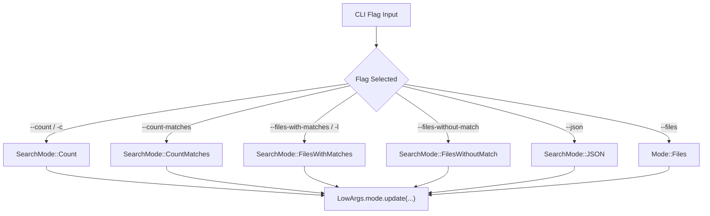
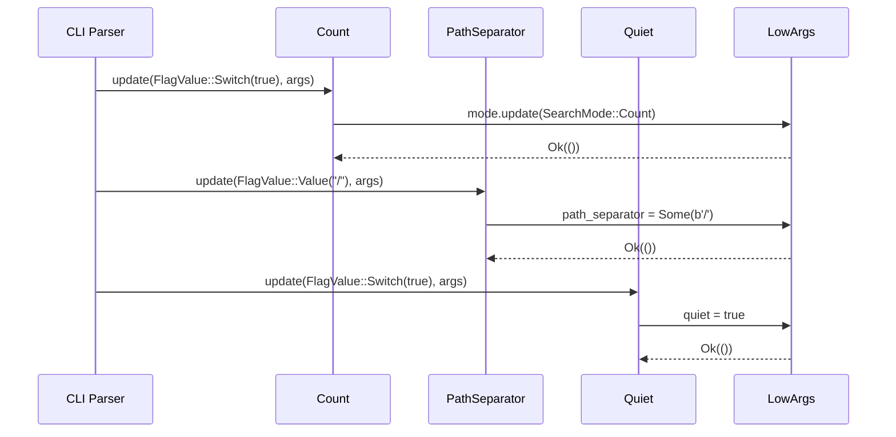

# Summary Printers

<details>
<summary>Relevant source files</summary>

The following files were used as context for generating this wiki page:

- [crates/core/flags/defs.rs](https://github.com/BurntSushi/ripgrep/blob/main/crates/core/flags/defs.rs)
</details>

## Overview

Ripgrep provides command-line flags under the output and output-modes categories that govern summary printing behavior, controlling how search results are aggregated and presented. These flags allow users to switch between standard line matching, match counting, path-only reporting, and quiet execution modes.

Sources: [crates/core/flags/defs.rs:1322-1376](https://github.com/BurntSushi/ripgrep/blob/main/crates/core/flags/defs.rs#L1322-L1376), [crates/core/flags/defs.rs:2249-2303](https://github.com/BurntSushi/ripgrep/blob/main/crates/core/flags/defs.rs#L2249-L2303), [crates/core/flags/defs.rs:6071-6106](https://github.com/BurntSushi/ripgrep/blob/main/crates/core/flags/defs.rs#L6071-L6106)

## Public Flags for Summary Modes

### Overview

Ripgrep declares specific command-line flag types and structs within `crates/core/flags/defs.rs` that control summary printing behavior, controlling how search results are aggregated and presented. These flags allow users to switch between standard line matching, match counting, path-only reporting, and quiet execution modes. Each flag struct implements the `Flag` trait, mapping user-supplied CLI arguments directly into the underlying low-level argument structures (`LowArgs`) that configure the execution engine and output printers.

Sources: [crates/core/flags/defs.rs:1-18](https://github.com/BurntSushi/ripgrep/blob/main/crates/core/flags/defs.rs#L1-L18), [crates/core/flags/defs.rs:39-156](https://github.com/BurntSushi/ripgrep/blob/main/crates/core/flags/defs.rs#L39-L156)

### Flag Registry and Categories

The global `FLAGS` slice in `crates/core/flags/defs.rs` defines the authoritative list of all supported flags and their canonical ordering. Within this registry, summary-related flags are classified into distinct output categories such as `Category::Output` and `Category::OutputModes`.

Sources: [crates/core/flags/defs.rs:39-44](https://github.com/BurntSushi/ripgrep/blob/main/crates/core/flags/defs.rs#L39-L44), [crates/core/flags/defs.rs:1336-1338](https://github.com/BurntSushi/ripgrep/blob/main/crates/core/flags/defs.rs#L1336-L1338)

### Summary Flag Reference Table

| Flag Name | Short Option | Long Option | Category | Purpose |
| :--- | :--- | :--- | :--- | :--- |
| `Count` | `-c` | `--count` | `OutputModes` | Show count of matching lines for each file. |
| `CountMatches` | None | `--count-matches` | `OutputModes` | Show count of every match for each file. |
| `FilesWithMatches` | `-l` | `--files-with-matches` | `OutputModes` | Print paths with at least one match. |
| `FilesWithoutMatch` | None | `--files-without-match` | `OutputModes` | Print paths that contain zero matches. |
| `Quiet` | `-q` | `--quiet` | `Output` | Suppress all stdout printing and exit on first match. |
| `IncludeZero` | None | `--include-zero` | `Output` | Include zero matches in summary output. |
| `Null` | `-0` | `--null` | `Output` | Print a NUL byte after file paths. |

Sources: [crates/core/flags/defs.rs:1322-1376](https://github.com/BurntSushi/ripgrep/blob/main/crates/core/flags/defs.rs#L1322-L1376), [crates/core/flags/defs.rs:1397-1439](https://github.com/BurntSushi/ripgrep/blob/main/crates/core/flags/defs.rs#L1397-L1439), [crates/core/flags/defs.rs:2249-2303](https://github.com/BurntSushi/ripgrep/blob/main/crates/core/flags/defs.rs#L2249-L2303), [crates/core/flags/defs.rs:2305-2338](https://github.com/BurntSushi/ripgrep/blob/main/crates/core/flags/defs.rs#L2305-L2338), [crates/core/flags/defs.rs:3405-3438](https://github.com/BurntSushi/ripgrep/blob/main/crates/core/flags/defs.rs#L3405-L3438), [crates/core/flags/defs.rs:5338-5372](https://github.com/BurntSushi/ripgrep/blob/main/crates/core/flags/defs.rs#L5338-L5372), [crates/core/flags/defs.rs:6071-6106](https://github.com/BurntSushi/ripgrep/blob/main/crates/core/flags/defs.rs#L6071-L6106)

## Match Counting Flag Definitions

### Overview

Ripgrep implements match counting behavior through two dedicated flag structs defined in `crates/core/flags/defs.rs`: `Count` and `CountMatches`. These flags belong to the `Category::OutputModes` category and suppress normal line-by-line output in favor of aggregated file summaries.

Sources: [crates/core/flags/defs.rs:1322-1376](https://github.com/BurntSushi/ripgrep/blob/main/crates/core/flags/defs.rs#L1322-L1376), [crates/core/flags/defs.rs:1397-1439](https://github.com/BurntSushi/ripgrep/blob/main/crates/core/flags/defs.rs#L1397-L1439)

### Flag Struct Implementations and Execution Updates

The `Count` struct defines the short flag `-c` and the long flag `--count`. When invoked, its `update` method asserts that the switch is enabled and updates the underlying execution mode to `SearchMode::Count`. Conversely, the `CountMatches` struct defines only the long flag `--count-matches` and updates the execution mode to `SearchMode::CountMatches`.

Sources: [crates/core/flags/defs.rs:1322-1376](https://github.com/BurntSushi/ripgrep/blob/main/crates/core/flags/defs.rs#L1322-L1376), [crates/core/flags/defs.rs:1397-1439](https://github.com/BurntSushi/ripgrep/blob/main/crates/core/flags/defs.rs#L1397-L1439)

```rust
impl Flag for Count {
    fn is_switch(&self) -> bool { true }
    fn name_short(&self) -> Option<u8> { Some(b'c') }
    fn name_long(&self) -> &'static str { "count" }
    fn doc_category(&self) -> Category { Category::OutputModes }

    fn update(&self, v: FlagValue, args: &mut LowArgs) -> anyhow::Result<()> {
        assert!(v.unwrap_switch(), "--count can only be enabled");
        args.mode.update(Mode::Search(SearchMode::Count));
        Ok(())
    }
}
```

Sources: [crates/core/flags/defs.rs:1326-1376](https://github.com/BurntSushi/ripgrep/blob/main/crates/core/flags/defs.rs#L1326-L1376)

```rust
impl Flag for CountMatches {
    fn is_switch(&self) -> bool { true }
    fn name_long(&self) -> &'static str { "count-matches" }
    fn doc_category(&self) -> Category { Category::OutputModes }

    fn update(&self, v: FlagValue, args: &mut LowArgs) -> anyhow::Result<()> {
        assert!(v.unwrap_switch(), "--count-matches can only be enabled");
        args.mode.update(Mode::Search(SearchMode::CountMatches));
        Ok(())
    }
}
```

Sources: [crates/core/flags/defs.rs:1401-1439](https://github.com/BurntSushi/ripgrep/blob/main/crates/core/flags/defs.rs#L1401-L1439)

> [!WARNING]
> The `Count` and `CountMatches` flags override each other depending on command-line precedence. When `Count` is combined with `OnlyMatching` (`-o`), ripgrep automatically forces the behavior of `CountMatches`. Furthermore, because counting mode requires searching entire files rather than short-circuiting on the first match, it may encounter binary data and produce different behaviors than path-only flags unless `Binary` handling is explicitly configured.

Sources: [crates/core/flags/defs.rs:1343-1368](https://github.com/BurntSushi/ripgrep/blob/main/crates/core/flags/defs.rs#L1343-L1368), [crates/core/flags/defs.rs:1418-1430](https://github.com/BurntSushi/ripgrep/blob/main/crates/core/flags/defs.rs#L1418-L1430)

## Path Only Output Flag Specifications

### Overview

Ripgrep provides dedicated path-only summary flags that suppress match contents and report file paths based on search outcome criteria. These flags are implemented as unit structs adhering to the `Flag` trait under the `Category::OutputModes` category, and they directly mutate the internal `LowArgs` search mode configuration.

Sources: [crates/core/flags/defs.rs:2249-2303](https://github.com/BurntSushi/ripgrep/blob/main/crates/core/flags/defs.rs#L2249-L2303), [crates/core/flags/defs.rs:2305-2338](https://github.com/BurntSushi/ripgrep/blob/main/crates/core/flags/defs.rs#L2305-L2338)

### FilesWithMatches Flag Definition

The `FilesWithMatches` struct implements the `-l` short flag and `--files-with-matches` long flag. When parsed successfully, its `update` method asserts that the flag value is an active switch and updates `args.mode` to `Mode::Search(SearchMode::FilesWithMatches)`.

Sources: [crates/core/flags/defs.rs:2249-2290](https://github.com/BurntSushi/ripgrep/blob/main/crates/core/flags/defs.rs#L2249-L2290)

```rust
impl Flag for FilesWithMatches {
    fn is_switch(&self) -> bool {
        true
    }
    fn name_short(&self) -> Option<u8> {
        Some(b'l')
    }
    fn name_long(&self) -> &'static str {
        "files-with-matches"
    }
    fn doc_category(&self) -> Category {
        Category::OutputModes
    }
    fn update(&self, v: FlagValue, args: &mut LowArgs) -> anyhow::Result<()> {
        assert!(v.unwrap_switch(), "--files-with-matches can only be enabled");
        args.mode.update(Mode::Search(SearchMode::FilesWithMatches));
        Ok(())
    }
}
```

Sources: [crates/core/flags/defs.rs:2253-2289](https://github.com/BurntSushi/ripgrep/blob/main/crates/core/flags/defs.rs#L2253-L2289)

### FilesWithoutMatch Flag Definition

The `FilesWithoutMatch` struct defines the `--files-without-match` long flag (sharing no short flag). Its `update` method asserts an active switch and updates `args.mode` to `Mode::Search(SearchMode::FilesWithoutMatch)`.

Sources: [crates/core/flags/defs.rs:2305-2338](https://github.com/BurntSushi/ripgrep/blob/main/crates/core/flags/defs.rs#L2305-L2338)

```rust
impl Flag for FilesWithoutMatch {
    fn is_switch(&self) -> bool {
        true
    }
    fn name_long(&self) -> &'static str {
        "files-without-match"
    }
    fn doc_category(&self) -> Category {
        Category::OutputModes
    }
    fn update(&self, v: FlagValue, args: &mut LowArgs) -> anyhow::Result<()> {
        assert!(
            v.unwrap_switch(),
            "--files-without-match can only be enabled"
        );
        args.mode.update(Mode::Search(SearchMode::FilesWithoutMatch));
        Ok(())
    }
}
```

Sources: [crates/core/flags/defs.rs:2309-2337](https://github.com/BurntSushi/ripgrep/blob/main/crates/core/flags/defs.rs#L2309-L2337)

> [!WARNING]
> `FilesWithoutMatch` explicitly marks indexing as unsupported. During low-level argument validation via `indexing_unsupported_flag()`, encountering `SearchMode::FilesWithoutMatch` immediately returns `Some(&FilesWithoutMatch)`, preventing indexed searches from utilizing this mode. Additionally, `FilesWithoutMatch` overrides `FilesWithMatches` depending on command line ordering, and vice-versa.

Sources: [crates/core/flags/defs.rs:170-172](https://github.com/BurntSushi/ripgrep/blob/main/crates/core/flags/defs.rs#L170-L172), [crates/core/flags/defs.rs:2281](https://github.com/BurntSushi/ripgrep/blob/main/crates/core/flags/defs.rs#L2281), [crates/core/flags/defs.rs:2326](https://github.com/BurntSushi/ripgrep/blob/main/crates/core/flags/defs.rs#L2326)

## Quiet Mode and Zero Count Flags

### Overview

Ripgrep provides specific flags to control silent execution and zero-match suppression through the `Quiet` and `IncludeZero` unit structs. These flags reside under the `Category::Output` classification and directly adjust execution behavior and tally reporting without modifying the core search mode.

Sources: [crates/core/flags/defs.rs:128-136](https://github.com/BurntSushi/ripgrep/blob/main/crates/core/flags/defs.rs#L128-L136), [crates/core/flags/defs.rs:405-438](https://github.com/BurntSushi/ripgrep/blob/main/crates/core/flags/defs.rs#L405-L438), [crates/core/flags/defs.rs:6072-6106](https://github.com/BurntSushi/ripgrep/blob/main/crates/core/flags/defs.rs#L6072-L6106)

### Quiet Flag Specification

The `Quiet` struct implements the `-q` short flag and `--quiet` long flag. When invoked, it suppresses all output to `stdout` and causes ripgrep to stop searching immediately upon encountering the first match in a file. Its `update` method validates that the switch is active and sets `args.quiet = true`.

Sources: [crates/core/flags/defs.rs:6070-6106](https://github.com/BurntSushi/ripgrep/blob/main/crates/core/flags/defs.rs#L6070-L6106)

```rust
impl Flag for Quiet {
    fn is_switch(&self) -> bool {
        true
    }
    fn name_short(&self) -> Option<u8> {
        Some(b'q')
    }
    fn name_long(&self) -> &'static str {
        "quiet"
    }
    fn doc_category(&self) -> Category {
        Category::Output
    }
    fn update(&self, v: FlagValue, args: &mut LowArgs) -> anyhow::Result<()> {
        assert!(v.unwrap_switch(), "--quiet has no negation");
        args.quiet = true;
        Ok(())
    }
}
```

Sources: [crates/core/flags/defs.rs:6074-6105](https://github.com/BurntSushi/ripgrep/blob/main/crates/core/flags/defs.rs#L6074-L6105)

> [!NOTE]
> Flags such as `--json`, `-l` (`files-with-matches`), `--files-without-match`, `--count`, and `--count-matches` cannot override `-q`. Regardless of argument ordering, once `-q` is specified, `args.quiet` remains `true`.

Sources: [crates/core/flags/defs.rs:6120-6135](https://github.com/BurntSushi/ripgrep/blob/main/crates/core/flags/defs.rs#L6120-L6135)

### IncludeZero Flag Specification

The `IncludeZero` struct implements the `--include-zero` long flag and its negation `--no-include-zero`. When used alongside count-oriented flags, it forces ripgrep to print match counts for every file even when the count is zero.

Sources: [crates/core/flags/defs.rs:405-438](https://github.com/BurntSushi/ripgrep/blob/main/crates/core/flags/defs.rs#L405-L438)

```rust
impl Flag for IncludeZero {
    fn is_switch(&self) -> bool {
        true
    }
    fn name_long(&self) -> &'static str {
        "include-zero"
    }
    fn name_negated(&self) -> Option<&'static str> {
        Some("no-include-zero")
    }
    fn doc_category(&self) -> Category {
        Category::Output
    }
    fn update(&self, v: FlagValue, args: &mut LowArgs) -> anyhow::Result<()> {
        args.include_zero = v.unwrap_switch();
        Ok(())
    }
}
```

Sources: [crates/core/flags/defs.rs:409-437](https://github.com/BurntSushi/ripgrep/blob/main/crates/core/flags/defs.rs#L409-L437)

## Formatting Delimiters and Output Modifiers

### Overview

Ripgrep defines specific flags to customize output formatting, specifically focusing on path delimiters, NUL termination of paths, and raw data handling. The `Null`, `NullData`, and `PathSeparator` unit structs configure how paths and file contents are delimited in summary and standard print modes. These flags belong to `Category::Output` or `Category::Search` and directly modify `LowArgs` fields during command line parsing.

Sources: [crates/core/flags/defs.rs:117-121](https://github.com/BurntSushi/ripgrep/blob/main/crates/core/flags/defs.rs#L117-L121), [crates/core/flags/defs.rs:5338-5372](https://github.com/BurntSushi/ripgrep/blob/main/crates/core/flags/defs.rs#L5338-L5372), [crates/core/flags/defs.rs:5559-5610](https://github.com/BurntSushi/ripgrep/blob/main/crates/core/flags/defs.rs#L5559-L5610)

### Null and NullData Flag Specifications

The `Null` struct implements the short flag `-0` and the long flag `--null`. When enabled, it appends a `NUL` byte after every printed file path, facilitating safe consumption by utilities like `xargs`. The `NullData` struct implements `--null-data`, configuring ripgrep to treat `NUL` bytes as line terminators instead of `\n`.

Sources: [crates/core/flags/defs.rs:5338-5428](https://github.com/BurntSushi/ripgrep/blob/main/crates/core/flags/defs.rs#L5338-L5428)

```rust
impl Flag for Null {
    fn is_switch(&self) -> bool {
        true
    }
    fn name_short(&self) -> Option<u8> {
        Some(b'0')
    }
    fn name_long(&self) -> &'static str {
        "null"
    }
    fn doc_category(&self) -> Category {
        Category::Output
    }
    fn update(&self, v: FlagValue, args: &mut LowArgs) -> anyhow::Result<()> {
        assert!(v.unwrap_switch(), "--null has no negation");
        args.null = true;
        Ok(())
    }
}
```

Sources: [crates/core/flags/defs.rs:5341-5371](https://github.com/BurntSushi/ripgrep/blob/main/crates/core/flags/defs.rs#L5341-L5371)

> [!WARNING]
> Enabling `--null-data` implicitly sets `args.null_data = true` and forces `args.crlf = false`. Conversely, enabling `--crlf` explicitly resets `args.null_data = false`.

Sources: [crates/core/flags/defs.rs:1497-1499](https://github.com/BurntSushi/ripgrep/blob/main/crates/core/flags/defs.rs#L1497-L1499), [crates/core/flags/defs.rs:5422-5426](https://github.com/BurntSushi/ripgrep/blob/main/crates/core/flags/defs.rs#L5422-L5426)

### PathSeparator Flag Execution Walkthrough

The `PathSeparator` struct implements the `--path-separator` flag, which customizes the byte character used to delimit directory components in printed paths.

Sources: [crates/core/flags/defs.rs:5559-5562](https://github.com/BurntSushi/ripgrep/blob/main/crates/core/flags/defs.rs#L5559-L5562)

The update process parses and validates the argument through a distinct execution sequence:
1. `convert::string(v.unwrap_value())?` extracts the raw string value from the flag input.
2. `Vec::unescape_bytes(&s)` processes any escape sequences (such as `\t`, `\x00`, or `\0`) into a raw byte vector.
3. The parser branches based on the unescaped byte vector's length:
   - If empty (`raw.is_empty()`), `args.path_separator` is set to `None`, reverting to platform defaults.
   - If exactly one byte (`raw.len() == 1`), `args.path_separator` is set to `Some(raw[0])`.
   - If any other length is encountered, `anyhow::bail!` returns an error enforcing the single-byte invariant.

Sources: [crates/core/flags/defs.rs:5591-5609](https://github.com/BurntSushi/ripgrep/blob/main/crates/core/flags/defs.rs#L5591-L5609)

## Summary Printer Mode Dispatch

### Overview

Ripgrep dispatches search execution modes based on CLI flag inputs. Flags that alter the primary search mode invoke `args.mode.update(...)` on `LowArgs`. The decision tree below traces how command line summary switches resolve into distinct `Mode::Search` states inside `LowArgs`.

Sources: [crates/core/flags/defs.rs:1369-1373](https://github.com/BurntSushi/ripgrep/blob/main/crates/core/flags/defs.rs#L1369-L1373), [crates/core/flags/defs.rs:1432-1436](https://github.com/BurntSushi/ripgrep/blob/main/crates/core/flags/defs.rs#L1432-L1436), [crates/core/flags/defs.rs:2284-2287](https://github.com/BurntSushi/ripgrep/blob/main/crates/core/flags/defs.rs#L2284-L2287), [crates/core/flags/defs.rs:2331-2335](https://github.com/BurntSushi/ripgrep/blob/main/crates/core/flags/defs.rs#L2331-L2335)

### Execution Mode Transition Flowchart



Sources: [crates/core/flags/defs.rs:1369-1373](https://github.com/BurntSushi/ripgrep/blob/main/crates/core/flags/defs.rs#L1369-L1373), [crates/core/flags/defs.rs:1432-1436](https://github.com/BurntSushi/ripgrep/blob/main/crates/core/flags/defs.rs#L1432-L1436), [crates/core/flags/defs.rs:2284-2287](https://github.com/BurntSushi/ripgrep/blob/main/crates/core/flags/defs.rs#L2284-L2287), [crates/core/flags/defs.rs:2331-2335](https://github.com/BurntSushi/ripgrep/blob/main/crates/core/flags/defs.rs#L2331-L2335)

## LowArgs Flag Update Sequence

### Overview

When flags are evaluated during argument parsing, each `Flag` instance updates `LowArgs` in place. The sequence diagram below demonstrates how invocation of summary-related flags mutates `LowArgs` attributes across execution modes.

Sources: [crates/core/flags/defs.rs:1369-1373](https://github.com/BurntSushi/ripgrep/blob/main/crates/core/flags/defs.rs#L1369-L1373), [crates/core/flags/defs.rs:5591-5609](https://github.com/BurntSushi/ripgrep/blob/main/crates/core/flags/defs.rs#L5591-L5609), [crates/core/flags/defs.rs:6099-6103](https://github.com/BurntSushi/ripgrep/blob/main/crates/core/flags/defs.rs#L6099-L6103)

### Argument Processing Sequence Diagram



Sources: [crates/core/flags/defs.rs:1369-1373](https://github.com/BurntSushi/ripgrep/blob/main/crates/core/flags/defs.rs#L1369-L1373), [crates/core/flags/defs.rs:5591-5609](https://github.com/BurntSushi/ripgrep/blob/main/crates/core/flags/defs.rs#L5591-L5609), [crates/core/flags/defs.rs:6099-6103](https://github.com/BurntSushi/ripgrep/blob/main/crates/core/flags/defs.rs#L6099-L6103)

## Related

- [[Standard Text Printer]]
- [[Match Counters]]

