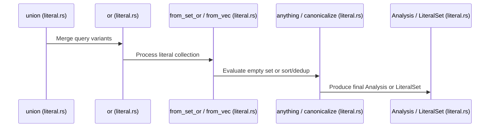

# Trigram Indexing

<details>
<summary>Relevant source files</summary>

The following files were used as context for generating this wiki page:

- [crates/ignore/src/walk.rs](https://github.com/BurntSushi/ripgrep/blob/main/crates/ignore/src/walk.rs)
- [crates/globset/src/lib.rs](https://github.com/BurntSushi/ripgrep/blob/main/crates/globset/src/lib.rs)
- [crates/index/src/literal.rs](https://github.com/BurntSushi/ripgrep/blob/main/crates/index/src/literal.rs)
- [crates/ignore/src/gitignore.rs](https://github.com/BurntSushi/ripgrep/blob/main/crates/ignore/src/gitignore.rs)
</details>

## Overview

Trigram indexing provides high-performance candidate query optimization by analyzing search expressions and extracting trigram literal sets. By decomposing query patterns into constituent n-grams and evaluating boolean combinations, the indexing subsystem bridges abstract syntax analysis with concrete path filtering. This mechanism supports candidate generation and glob pattern matching strategies across complex directory hierarchies.

Sources: [crates/index/src/literal.rs:16-21](https://github.com/BurntSushi/ripgrep/blob/main/crates/index/src/literal.rs#L16-L21)

Working in tandem with parallel directory traversal engines, gitignore parsing, and rule evaluation, trigram indexing feeds into an integrated candidate path filtering pipeline. This cohesive architecture coordinates filesystem walking, ignore rule enforcement, and fast path pre-filtering to eliminate non-matching paths efficiently before full evaluation.

Sources: [crates/ignore/src/walk.rs:439-486](https://github.com/BurntSushi/ripgrep/blob/main/crates/ignore/src/walk.rs#L439-L486), [crates/ignore/src/gitignore.rs:78-88](https://github.com/BurntSushi/ripgrep/blob/main/crates/ignore/src/gitignore.rs#L78-L88)

## Trigram Extraction and Literal Analysis

### Overview

Analyzing expressions and extracting trigram literal sets for candidate query optimization relies on structural traversal of regular expression syntax. The `GramQueryBuilder` struct processes a compiled `Hir` expression to produce a `GramQuery` representation. This system extracts n-grams from literals, handles character classes, and applies boolean combinations to optimize candidate lookup performance.

Sources: [crates/index/src/literal.rs:16-20](https://github.com/BurntSushi/ripgrep/blob/main/crates/index/src/literal.rs#L16-L20), [crates/index/src/literal.rs:637-642](https://github.com/BurntSushi/ripgrep/blob/main/crates/index/src/literal.rs#L637-L642)

### Execution Walkthrough and Sequence Diagram

The query union operation processes disjunctions through a sequence of normalization and construction functions. The trace `union` → `or` → `from_set_or` → `anything` → `Analysis` executes as follows:

1. `union` merges two `GramQuery` instances by evaluating their variants and invoking `or` on the resulting disjunct vectors.
2. `or` retains non-empty queries, flattens nested disjunctions, and converts literal collections into `LiteralSet` instances.
3. `from_set_or` inspects the resulting `LiteralSet` length, returning `GramQuery::anything()` if empty, a single `GramQuery::Literal` if the set has one element, or a `GramQuery::Or` variant otherwise.
4. `anything` constructs an empty `GramQuery::And` variant representing a universal match.
5. `Analysis` wraps the resulting `GramQuery` alongside size constraints and prefix/suffix literal sets.

Sources: [crates/index/src/literal.rs:73-99](https://github.com/BurntSushi/ripgrep/blob/main/crates/index/src/literal.rs#L73-L99), [crates/index/src/literal.rs:129-139](https://github.com/BurntSushi/ripgrep/blob/main/crates/index/src/literal.rs#L129-L139), [crates/index/src/literal.rs:153-203](https://github.com/BurntSushi/ripgrep/blob/main/crates/index/src/literal.rs#L153-L203), [crates/index/src/literal.rs:319-326](https://github.com/BurntSushi/ripgrep/blob/main/crates/index/src/literal.rs#L319-L326)

Additionally, vector-backed literal normalization follows the chain `union` → `or` → `from_vec` → `canonicalize` (and concurrently `LiteralSet`):

1. `union` combines disjuncts into a vector.
2. `or` identifies vectors of literals and forwards them to `LiteralSet::from_vec`.
3. `from_vec` instantiates a `LiteralSet` and executes `canonicalize`.
4. `canonicalize` sorts the literal vector (`self.lits.sort()`) and removes duplicates (`self.lits.dedup()`).

Sources: [crates/index/src/literal.rs:73-99](https://github.com/BurntSushi/ripgrep/blob/main/crates/index/src/literal.rs#L73-L99), [crates/index/src/literal.rs:518-522](https://github.com/BurntSushi/ripgrep/blob/main/crates/index/src/literal.rs#L518-L522), [crates/index/src/literal.rs:551-554](https://github.com/BurntSushi/ripgrep/blob/main/crates/index/src/literal.rs#L551-L554)



Sources: [crates/index/src/literal.rs:73-99](https://github.com/BurntSushi/ripgrep/blob/main/crates/index/src/literal.rs#L73-L99), [crates/index/src/literal.rs:129-139](https://github.com/BurntSushi/ripgrep/blob/main/crates/index/src/literal.rs#L129-L139), [crates/index/src/literal.rs:153-203](https://github.com/BurntSushi/ripgrep/blob/main/crates/index/src/literal.rs#L153-L203), [crates/index/src/literal.rs:518-522](https://github.com/BurntSushi/ripgrep/blob/main/crates/index/src/literal.rs#L518-L522), [crates/index/src/literal.rs:551-554](https://github.com/BurntSushi/ripgrep/blob/main/crates/index/src/literal.rs#L551-L554)

> [!WARNING]
> During `GramQuery::or` and `GramQuery::and` simplification, queries returning `GramQuery::nothing()` (an empty `Or` variant) or `GramQuery::anything()` (an empty `And` variant) short-circuit boolean evaluations. A single `nothing` operand inside an `And` query collapses the entire expression into `nothing`.

Sources: [crates/index/src/literal.rs:23-29](https://github.com/BurntSushi/ripgrep/blob/main/crates/index/src/literal.rs#L23-L29), [crates/index/src/literal.rs:101-107](https://github.com/BurntSushi/ripgrep/blob/main/crates/index/src/literal.rs#L101-L107)

### Query Structures and Configuration Options

The `GramQueryBuilder` type exposes configuration parameters governing n-gram generation and expansion limits.

| Field / Method | Type | Default Value | Purpose |
| :--- | :--- | :--- | :--- |
| `ngram_size` | `usize` | `3` | Sets the byte size of extracted sliding n-grams (`assert!(size >= 2)`). |
| `limit_len` | `usize` | `250` | Maximum length threshold for concatenation analysis before falling back to `anything`. |
| `limit_class` | `usize` | `10` | Maximum character or byte count permitted in character classes before degrading to `anything`. |

Sources: [crates/index/src/literal.rs:637-665](https://github.com/BurntSushi/ripgrep/blob/main/crates/index/src/literal.rs#L637-L665), [crates/index/src/literal.rs:687-689](https://github.com/BurntSushi/ripgrep/blob/main/crates/index/src/literal.rs#L687-L689), [crates/index/src/literal.rs:704-706](https://github.com/BurntSushi/ripgrep/blob/main/crates/index/src/literal.rs#L704-L706)

> [!NOTE]
> `GramQueryBuilder::ngram_size` asserts that `size >= 2`. Sizes smaller than 2 bytes are not supported because n-grams are measured in raw bytes rather than Unicode codepoints or graphemes.

Sources: [crates/index/src/literal.rs:648-652](https://github.com/BurntSushi/ripgrep/blob/main/crates/index/src/literal.rs#L648-L652)

### Design Trade-Offs

| Design Choice | Benefit | Cost |
| :--- | :--- | :--- |
| **Byte-level n-gram extraction** (`ngrams`) | Avoids heavy Unicode decoding overhead during high-speed path filtering; supports raw byte strings. | May generate fragmented n-grams across multi-byte UTF-8 character boundaries. |
| **Canonicalized `LiteralSet` vectors** (`canonicalize`) | Ensures deterministic querying, eliminates redundant candidates via `dedup()`, and enables linear-time set factoring. | Requires sorting (`self.lits.sort()`) on mutations and allocations for derived vectors. |
| **Class limit thresholding** (`limit_class`) | Prevents explosive memory growth and combinatoric overload when processing large character classes like `[0-9a-zA-Z]`. | Degrades broad character classes into universal matches (`anything()`), sacrificing indexing precision. |

Sources: [crates/index/src/literal.rs:551-554](https://github.com/BurntSushi/ripgrep/blob/main/crates/index/src/literal.rs#L551-L554), [crates/index/src/literal.rs:637-646](https://github.com/BurntSushi/ripgrep/blob/main/crates/index/src/literal.rs#L637-L646), [crates/index/src/literal.rs:687-689](https://github.com/BurntSushi/ripgrep/blob/main/crates/index/src/literal.rs#L687-L689)

### API Usage Example

The following example configures a `GramQueryBuilder` with a custom n-gram size and builds a `GramQuery` from a parsed regular expression:

```rust
use regex_syntax::ParserBuilder;
use crate::index::literal::GramQueryBuilder;

fn build_sample_query() {
    let hir = ParserBuilder::new()
        .utf8(true)
        .build()
        .parse("abc(def|ghi)")
        .unwrap();

    let mut builder = GramQueryBuilder::new();
    builder.ngram_size(3)
           .limit_len(250)
           .limit_class(10);

    let query = builder.build(&hir);
    println!("Generated query: {:?}", query);
}
```

Sources: [crates/index/src/literal.rs:643-670](https://github.com/BurntSushi/ripgrep/blob/main/crates/index/src/literal.rs#L643-L670), [crates/index/src/literal.rs:854-863](https://github.com/BurntSushi/ripgrep/blob/main/crates/index/src/literal.rs#L854-L863)

## Glob Pattern Matching Strategies

### Overview

The `globset` crate provides cross-platform single-glob and glob-set matching. `GlobSet` represents a collection of glob patterns that can be matched simultaneously against a single candidate path in a single pass. When `GlobSet::new` compiles a collection of globs, it iterates over each pattern, inspects its classification via `MatchStrategy::new(p)`, and routes it into dedicated strategy builders such as `LiteralStrategy`, `BasenameLiteralStrategy`, `ExtensionStrategy`, `MultiStrategyBuilder` for prefixes and suffixes, `RequiredExtensionStrategyBuilder`, and regex builders.

Sources: [crates/globset/src/lib.rs:2-13](https://github.com/BurntSushi/ripgrep/blob/main/crates/globset/src/lib.rs#L2-L13), [crates/globset/src/lib.rs:306-312](https://github.com/BurntSushi/ripgrep/blob/main/crates/globset/src/lib.rs#L306-L312), [crates/globset/src/lib.rs:461-514](https://github.com/BurntSushi/ripgrep/blob/main/crates/globset/src/lib.rs#L461-L514)

### Glob Set Compilation and Strategy Dispatch

During compilation in `GlobSet::new`, each pattern is categorized into one of seven match strategies: `Literal`, `BasenameLiteral`, `Extension`, `Prefix`, `Suffix`, `RequiredExtension`, or `Regex`. 

Adding patterns: `GlobSetBuilder::add()` → `GlobSet::new()` iterates over input globs → matches `MatchStrategy::new(p)` → inserts into strategy-specific collections (`lits`, `base_lits`, `exts`, `prefixes`, `suffixes`, `required_exts`, `regexes`) → populates `GlobSet { len, strats }`.

Sources: [crates/globset/src/lib.rs:461-553](https://github.com/BurntSushi/ripgrep/blob/main/crates/globset/src/lib.rs#L461-L553), [crates/globset/src/lib.rs:585-590](https://github.com/BurntSushi/ripgrep/blob/main/crates/globset/src/lib.rs#L585-L590)

> [!NOTE]
> When a glob is classified as a component suffix strategy where `component` is true, it is duplicated and also added to the literal strategy (`lits.add(i, suffix[1..].to_string())`) to optimize full path component lookups.

Sources: [crates/globset/src/lib.rs:496-501](https://github.com/BurntSushi/ripgrep/blob/main/crates/globset/src/lib.rs#L496-L501)

### Prefix, Suffix, and Regex Match Execution

Prefix and suffix strategies leverage Aho-Corasick automaton matching (`AhoCorasick`) combined with a vector mapping automaton pattern IDs back to their global glob indices (`map: Vec<usize>`). 

- `PrefixStrategy::is_match` calls `candidate.path_prefix(self.longest)`, iterates over `self.matcher.find_overlapping_iter(path)`, and returns `true` if any match has `m.start() == 0`.
- `SuffixStrategy::is_match` calls `candidate.path_suffix(self.longest)`, iterates over `self.matcher.find_overlapping_iter(path)`, and returns `true` if any match has `m.end() == path.len()`.
- `RegexSetStrategy` utilizes a pooled `PatternSet` (`ArcoolatternSet, PatternSetPoolFn>>`) to execute overlapping regular expression searches via `self.matcher.which_overlapping_matches(&input, &mut patset)`.

Sources: [crates/globset/src/lib.rs:818-860](https://github.com/BurntSushi/ripgrep/blob/main/crates/globset/src/lib.rs#L818-L860), [crates/globset/src/lib.rs:863-905](https://github.com/BurntSushi/ripgrep/blob/main/crates/globset/src/lib.rs#L863-L905), [crates/globset/src/lib.rs:963-1013](https://github.com/BurntSushi/ripgrep/blob/main/crates/globset/src/lib.rs#L963-L1013)

> [!WARNING]
> `RegexSetStrategy` acquires a `PatternSet` from a thread-safe pool (`self.patset.get()`) and explicitly clears it before executing `which_overlapping_matches`. Failing to clear or pool guard management errors can cause search results to leak across candidate path evaluations.

Sources: [crates/globset/src/lib.rs:975-994](https://github.com/BurntSushi/ripgrep/blob/main/crates/globset/src/lib.rs#L975-L994), [crates/globset/src/lib.rs:1276-1294](https://github.com/BurntSushi/ripgrep/blob/main/crates/globset/src/lib.rs#L1276-L1294)

### Match Strategies Reference Table

| Strategy Enum Variant | Internal Type / Container | Matching Condition / Prerequisite | Purpose |
| :--- | :--- | :--- | :--- |
| `Literal` | `LiteralStrategy` (`fnv::HashMap<Vec<u8>, Vec<usize>>`) | `candidate.path.as_bytes()` matches hash map key exactly. | Matches full candidate paths against literal strings. |
| `BasenameLiteral` | `BasenameLiteralStrategy` (`fnv::HashMap<Vec<u8>, Vec<usize>>`) | `candidate.basename` is non-empty and matches hash map key. | Matches file basenames directly without traversing parent directories. |
| `Extension` | `ExtensionStrategy` (`fnv::HashMap<Vec<u8>, Vec<usize>>`) | `candidate.ext` is non-empty and matches hash map key. | Fast filtering based on file extensions (e.g., `*.rs`). |
| `Prefix` | `PrefixStrategy` (`AhoCorasick`, `Vec<usize>`, `usize`) | Overlapping Aho-Corasick match where `m.start() == 0` on path prefix. | Efficient multi-pattern prefix matching (e.g., `src/*`). |
| `Suffix` | `SuffixStrategy` (`AhoCorasick`, `Vec<usize>`, `usize`) | Overlapping Aho-Corasick match where `m.end() == path.len()` on path suffix. | Efficient multi-pattern suffix matching (e.g., `*.rs`). |
| `RequiredExtension` | `RequiredExtensionStrategy` (`fnv::HashMap`) | `candidate.ext` matches key, then compiled regex `re.is_match(candidate.path.as_bytes())`. | Combines extension hashing with full regex validation. |
| `Regex` | `RegexSetStrategy` (`Regex`, `Vec<usize>`, `Arcool<...>>`) | `self.matcher.is_match(candidate.path.as_bytes())` or overlapping regex match. | Fallback strategy handling complex or general glob patterns. |

Sources: [crates/globset/src/lib.rs:654-662](https://github.com/BurntSushi/ripgrep/blob/main/crates/globset/src/lib.rs#L654-L662), [crates/globset/src/lib.rs:710-1013](https://github.com/BurntSushi/ripgrep/blob/main/crates/globset/src/lib.rs#L710-L1013)

### Design Trade-Offs

| Design Choice | Benefit | Cost |
| :--- | :--- | :--- |
| **Strategy partitioning** (`GlobSetMatchStrategy` variants) | Routes simple lookups (literals, extensions, basenames) to hash maps and complex patterns to automata, avoiding regex overhead for common filters. | Increases compilation complexity and code size across multiple strategy structs and builders. |
| **Candidate amortization** (`Candidate` struct) | Computes normalized path, basename, and extension once per path via `Candidate::new()`, amortizing cost across multiple matchers. | Requires allocating and retaining `Cow<'a, [u8]>` buffers for path components during matching. |
| **PatternSet pooling** (`RegexSetStrategy` pool) | Reuses `PatternSet` allocation pools across `matches_into` calls to minimize heap allocation overhead during traversal. | Introduces lock contention or pool synchronization overhead when evaluating paths across multiple threads. |

Sources: [crates/globset/src/lib.rs:343-350](https://github.com/BurntSushi/ripgrep/blob/main/crates/globset/src/lib.rs#L343-L350), [crates/globset/src/lib.rs:592-638](https://github.com/BurntSushi/ripgrep/blob/main/crates/globset/src/lib.rs#L592-L638), [crates/globset/src/lib.rs:964-976](https://github.com/BurntSushi/ripgrep/blob/main/crates/globset/src/lib.rs#L964-L976)

### API Usage Example

The following example demonstrates building a `GlobSet` using `GlobSetBuilder`, creating a candidate path, and querying matching pattern indices:

```rust
use globset::{Glob, GlobSetBuilder, Candidate};

fn evaluate_globs() -> Result<(), Box<dyn std::error::Error>> {
    let mut builder = GlobSetBuilder::new();
    builder.add(Glob::new("src/**/*.rs")?);
    builder.add(Glob::new("*.c")?);
    builder.add(Glob::new("src/lib.rs")?);
    let set = builder.build()?;

    let candidate = Candidate::new(std::path::Path::new("src/lib.rs"));
    let matches = set.matches_candidate(&candidate);

    assert_eq!(matches, vec![0, 2]);
    Ok(())
}
```

Sources: [crates/globset/src/lib.rs:52-64](https://github.com/BurntSushi/ripgrep/blob/main/crates/globset/src/lib.rs#L52-L64), [crates/globset/src/lib.rs:400-417](https://github.com/BurntSushi/ripgrep/blob/main/crates/globset/src/lib.rs#L400-L417), [crates/globset/src/lib.rs:581-590](https://github.com/BurntSushi/ripgrep/blob/main/crates/globset/src/lib.rs#L581-L590), [crates/globset/src/lib.rs:616-619](https://github.com/BurntSushi/ripgrep/blob/main/crates/globset/src/lib.rs#L616-L619)

## Parallel Directory Traversal Engine

### Overview

The parallel directory traversal engine, implemented via `WalkParallel` and `Worker` structs in `crates/ignore/src/walk.rs`, executes concurrent filesystem iteration and worker thread scheduling for candidate generation. It utilizes a work-stealing architecture built on crossbeam deques to balance traversal workload across multiple worker threads.

Sources: [crates/ignore/src/walk.rs:13-15](https://github.com/BurntSushi/ripgrep/blob/main/crates/ignore/src/walk.rs#L13-L15), [crates/ignore/src/walk.rs:1404-1415](https://github.com/BurntSushi/ripgrep/blob/main/crates/ignore/src/walk.rs#L1404-L1415)

### Traversal Execution & Call Chain

The entry point for parallel traversal is `WalkParallel::run()`, which delegates to `WalkParallel::visit()`. The traversal lifecycle proceeds through worker initialization, work distribution via work-stealing stacks, and per-item evaluation.

```
WalkParallel::run() → WalkParallel::visit() → Stack::new_for_each_thread() → Worker::run() → Worker::get_work() → Worker::run_one() → Worker::generate_work()
```

1. `WalkParallel::run()` calls `self.visit(&mut FnBuilder { builder: mkf })`.
2. `WalkParallel::visit()` initializes thread counts via `self.threads()`, sets up root work items, creates thread-local stacks via `Stack::new_for_each_thread()`, and spawns threads running `Worker::run()`.
3. `Worker::run()` loops on `self.get_work()` to fetch work items and processes each item via `self.run_one(work)`.
4. `Worker::run_one()` checks file type limits, depth bounds, device boundaries via `is_same_file_system()`, reads directory contents via `work.read_dir()`, invokes the visitor callback, and spawns child work items via `self.generate_work()`.

Sources: [crates/ignore/src/walk.rs:1417-1527](https://github.com/BurntSushi/ripgrep/blob/main/crates/ignore/src/walk.rs#L1417-L1527), [crates/ignore/src/walk.rs:1754-1852](https://github.com/BurntSushi/ripgrep/blob/main/crates/ignore/src/walk.rs#L1754-L1852)

> [!NOTE]
> `Stack::new_for_each_thread()` explicitly uses `Deque::new_lifo()` to enforce a depth-first traversal order. Breadth-first traversal on wide directory trees containing numerous gitignore files causes catastrophic memory consumption, whereas LIFO processing keeps active paths and matchers minimal.

Sources: [crates/ignore/src/walk.rs:1655-1661](https://github.com/BurntSushi/ripgrep/blob/main/crates/ignore/src/walk.rs#L1655-L1661)

### Walk States and Control Flow Constants

During traversal, worker threads evaluate directory entries and return control directives governing the iteration flow.

| State Variant | Description | Action Taken by Engine |
| :--- | :--- | :--- |
| `WalkState::Continue` | Proceed with walking and iteration as normal. | Continues standard child generation and callback invocation. |
| `WalkState::Skip` | Skip descending into the current directory. | Skips reading directory contents; has no effect on non-directory files. |
| `WalkState::Quit` | Quit the entire iterator as soon as possible. | Sets the asynchronous `quit_now` atomic flag and initiates termination across workers. |

Sources: [crates/ignore/src/walk.rs:1318-1330](https://github.com/BurntSushi/ripgrep/blob/main/crates/ignore/src/walk.rs#L1318-L1330)

### Design Trade-Offs

| Design Choice | Benefit | Cost |
| :--- | :--- | :--- |
| **LIFO Work-Stealing Queues** (`crossbeam_deque`) | Maximizes depth-first locality, reducing peak memory overhead for deep or wide ignore hierarchies. | Increases contention on global stealers when local queues empty rapidly near termination. |
| **Active Worker Atomic Tracking** (`active_workers` counter) | Enables deterministic termination detection when all local deques are simultaneously empty. | Requires atomic fetch-add and fetch-sub overhead on every worker deactivation and wake-up cycle. |
| **Pre-read Directory Batching** (`Work::read_dir`) | Reads directory contents entirely into memory before transferring ownership to visitor callbacks. | Allocates transient vectors (`Vec<fs::DirEntry>`) for directory listings during traversal. |

Sources: [crates/ignore/src/walk.rs:1609-1637](https://github.com/BurntSushi/ripgrep/blob/main/crates/ignore/src/walk.rs#L1609-L1637), [crates/ignore/src/walk.rs:1656-1661](https://github.com/BurntSushi/ripgrep/blob/main/crates/ignore/src/walk.rs#L1656-L1661), [crates/ignore/src/walk.rs:1955-1974](https://github.com/BurntSushi/ripgrep/blob/main/crates/ignore/src/walk.rs#L1955-L1974)

### API Usage Example

The following example demonstrates building a parallel recursive iterator via `WalkBuilder::build_parallel()` and running it with a custom visitor callback:

```rust
use ignore::{WalkBuilder, WalkState};

fn run_parallel_walk(root_path: &std::path::Path) -> Result<(), Box<dyn std::error::Error>> {
    let builder = WalkBuilder::new(root_path);
    builder.build_parallel().run(|| {
        Box::new(|result| {
            match result {
                Ok(entry) => {
                    println!("Visited: {:?}", entry.path());
                    WalkState::Continue
                }
                Err(err) => {
                    eprintln!("Error: {err}");
                    WalkState::Continue
                }
            }
        })
    });
    Ok(())
}
```

Sources: [crates/ignore/src/walk.rs:700-714](https://github.com/BurntSushi/ripgrep/blob/main/crates/ignore/src/walk.rs#L700-L714), [crates/ignore/src/walk.rs:1417-1426](https://github.com/BurntSushi/ripgrep/blob/main/crates/ignore/src/walk.rs#L1417-L1426)

## Gitignore Parsing and Rule Evaluation

### Overview

The `gitignore` module implements a complete, scratch-built gitignore file parser and glob-matching engine adhering to gitignore specification rules. It processes ignore rules line by line, resolves global configuration paths across environment variables and XDG directories, compiles patterns into high-performance `GlobSet` structures, and evaluates paths hierarchically during traversal.

Sources: [crates/ignore/src/gitignore.rs:1-8](https://github.com/BurntSushi/ripgrep/blob/main/crates/ignore/src/gitignore.rs#L1-L8), [crates/ignore/src/gitignore.rs:318-326](https://github.com/BurntSushi/ripgrep/blob/main/crates/ignore/src/gitignore.rs#L318-L326)

### Gitignore Parsing and Compilation Call Chain

When a gitignore file or string is registered, parsing proceeds through a strict sequence of validation, normalization, and compilation steps:

`GitignoreBuilder::add()` → `GitignoreBuilder::add_line()` → `GlobBuilder::new()` → `GlobSetBuilder::add()` → `GitignoreBuilder::build()`

1. `GitignoreBuilder::add()` opens the target file, wraps it in a `BufReader`, iterates over lines while recording line numbers for error tagging, handles UTF-8 BOM headers on the first line, and passes each line to `add_line()`.
2. `GitignoreBuilder::add_line()` strips comments (`#`), trims trailing whitespace unless escaped (`\ `), strips leading negation (`!`) or absolute root slashes (`/`), flags directory-only constraints (`/` suffix), formats implicit `**/` path-segment prefixes for relative globs, and appends `/*` if the glob ends with `/**`.
3. `GlobBuilder::new()` compiles the normalized actual glob string with literal separators enabled, case sensitivity configured, and backslash escapes supported.
4. `GlobSetBuilder::add()` inserts the compiled glob into the underlying regex set builder.
5. `GitignoreBuilder::build()` finalizes the `GlobSet`, counts total ignore versus whitelist patterns, allocates a thread-safe object pool (`Pool::new(|| vec![])`), and returns the initialized `Gitignore` matcher.

Sources: [crates/ignore/src/gitignore.rs:349-364](https://github.com/BurntSushi/ripgrep/blob/main/crates/ignore/src/gitignore.rs#L349-L364), [crates/ignore/src/gitignore.rs:403-432](https://github.com/BurntSushi/ripgrep/blob/main/crates/ignore/src/gitignore.rs#L403-L432), [crates/ignore/src/gitignore.rs:458-539](https://github.com/BurntSushi/ripgrep/blob/main/crates/ignore/src/gitignore.rs#L458-L539)

> [!WARNING]
> When a gitignore line ends with a trailing `/**`, `GitignoreBuilder::add_line()` automatically appends `/*` to transform it into `/**/*`. This ensures the glob matches everything inside a directory without matching the directory itself, aligning with gitignore semantics where `abc/**` matches contents inside `abc` but standard globs would also match the directory entry.

Sources: [crates/ignore/src/gitignore.rs:523-525](https://github.com/BurntSushi/ripgrep/blob/main/crates/ignore/src/gitignore.rs#L523-L525)

### Global Configuration Discovery Order

Global gitignore and exclude patterns are located by checking environment variables and configuration files in a defined priority sequence. `gitconfig_excludes_path()` evaluates options in the following fallback order:

| Priority | Source Mechanism | Configuration / File Path |
| :--- | :--- | :--- |
| 1 (Highest) | `GIT_CONFIG_GLOBAL` env var | Path specified by `GIT_CONFIG_GLOBAL` |
| 2 | Home `.gitconfig` file | `$HOME/.gitconfig` (extracting `core.excludesFile`) |
| 3 | XDG config directory | `$XDG_CONFIG_HOME/git/config` or `$HOME/.config/git/config` |
| 4 | System-level config | `GIT_CONFIG_SYSTEM` env var or `/etc/gitconfig` |
| 5 (Lowest) | Default XDG ignore path | `$XDG_CONFIG_HOME/git/ignore` or `$HOME/.config/git/ignore` |

Sources: [crates/ignore/src/gitignore.rs:581-600](https://github.com/BurntSushi/ripgrep/blob/main/crates/ignore/src/gitignore.rs#L581-L600)

> [!NOTE]
> `parse_excludes_file()` uses a regular expression (`(?im-u)^\s*excludesfile\s*=\s*"?\s*(\S+?)\s*"?\s*$`) to extract the `core.excludesfile` setting from raw INI configuration file contents, automatically expanding leading tilde characters (`~`) to the user's home directory.

Sources: [crates/ignore/src/gitignore.rs:662-694](https://github.com/BurntSushi/ripgrep/blob/main/crates/ignore/src/gitignore.rs#L662-L694)

### Design Trade-Offs

| Design Choice | Benefit | Cost |
| :--- | :--- | :--- |
| **Scratch-Built Parser** (`add_line`) | Avoids external shell dependencies on the `git` binary, ensuring portability across environments. | Requires maintaining custom glob normalization logic for negation, anchoring, and escaping. |
| **Object Pool for Match Candidates** (`Pool::new`) | Reuses scratch vectors (`Vec<usize>`) across match evaluations to eliminate per-path allocation overhead. | Adds thread-pool synchronization overhead when borrowing scratch storage across threads. |
| **Permissive Unclosed Classes** (`allow_unclosed_class`) | Maintains high compatibility with standard `gitignore` files containing unclosed character brackets. | Can lead to more permissive glob parsing behavior and weaker syntax error reporting. |

Sources: [crates/ignore/src/gitignore.rs:5-7](https://github.com/BurntSushi/ripgrep/blob/main/crates/ignore/src/gitignore.rs#L5-L7), [crates/ignore/src/gitignore.rs:87](https://github.com/BurntSushi/ripgrep/blob/main/crates/ignore/src/gitignore.rs#L87), [crates/ignore/src/gitignore.rs:362](https://github.com/BurntSushi/ripgrep/blob/main/crates/ignore/src/gitignore.rs#L362), [crates/ignore/src/gitignore.rs:569-575](https://github.com/BurntSushi/ripgrep/blob/main/crates/ignore/src/gitignore.rs#L569-L575)

### API Usage Example

The following example demonstrates building a gitignore matcher from a pattern string and evaluating file paths against ignore and whitelist rules:

```rust
use ignore::{GitignoreBuilder, Match};
use std::path::Path;

fn evaluate_gitignores() -> Result<(), Box<dyn std::error::Error>> {
    let mut builder = GitignoreBuilder::new(Path::new("/home/user/project"));
    builder.add_str(None, "*.lock\n!important.lock\nsrc/")?;
    let gi = builder.build()?;

    // Evaluate paths against the compiled matcher
    match gi.matched("Cargo.lock", false) {
        Match::Ignore(glob) => println!("Ignored by glob: {}", glob.original()),
        Match::Whitelist(glob) => println!("Whitelisted by glob: {}", glob.original()),
        Match::None => println!("No match"),
    }

    match gi.matched("important.lock", false) {
        Match::Whitelist(glob) => println!("Explicitly allowed: {}", glob.original()),
        _ => {}
    }

    Ok(())
}
```

Sources: [crates/ignore/src/gitignore.rs:202-211](https://github.com/BurntSushi/ripgrep/blob/main/crates/ignore/src/gitignore.rs#L202-L211), [crates/ignore/src/gitignore.rs:440-450](https://github.com/BurntSushi/ripgrep/blob/main/crates/ignore/src/gitignore.rs#L440-L450), [crates/ignore/src/gitignore.rs:349-364](https://github.com/BurntSushi/ripgrep/blob/main/crates/ignore/src/gitignore.rs#L349-L364)

## Integrated Candidate Path Filtering Pipeline

### Overview

The indexing and traversal pipeline integrates recursive directory walkers, hierarchical ignore matchers, glob filtering engines, and trigram query analysis into a unified execution flow. When a search query or traversal is initiated, path candidates flow through a sequence of pre-filtering, directory descent, and matching phases.

Sources: [crates/ignore/src/walk.rs:454-486](https://github.com/BurntSushi/ripgrep/blob/main/crates/ignore/src/walk.rs#L454-L486), [crates/index/src/literal.rs:637-669](https://github.com/BurntSushi/ripgrep/blob/main/crates/index/src/literal.rs#L637-L669)

### Pipeline Execution Walkthrough

The evaluation and filtering pipeline processes paths via a specific call chain during traversal:

1. **`WalkBuilder::build()`** or **`WalkBuilder::build_parallel()`** constructs the root iterator or parallel worker pool, initializing the base ignore ruleset (`Ignore`) and configuration filters.
2. **`Walk::next()`** or **`Worker::run_one()`** pulls the next directory entry event (`WalkEvent`) or worker message (`Message::Work`), driving tree traversal.
3. **`Walk::skip_entry()`** or **`Worker::generate_work()`** evaluates whether a discovered entry should be bypassed before expensive operations occur, executing checks in sequence:
   - **`should_skip_entry()`** calls `Ignore::matched_dir_entry()` to test the path against active `.gitignore`, `.ignore`, global ignore rules, and glob overrides.
   - **`path_equals()`** verifies whether the entry conflicts with stdout redirection handles.
   - **`skip_filesize()`** compares file metadata length against `max_filesize`.
   - **`Filter`** predicates apply custom user-defined filter closures.
4. **`GramQueryBuilder::build()`** analyzes search expressions into `GramQuery` trees containing literal ngram sets for rapid candidate pruning.

Sources: [crates/ignore/src/walk.rs:593-643](https://github.com/BurntSushi/ripgrep/blob/main/crates/ignore/src/walk.rs#L593-L643), [crates/ignore/src/walk.rs:1147-1181](https://github.com/BurntSushi/ripgrep/blob/main/crates/ignore/src/walk.rs#L1147-L1181), [crates/ignore/src/walk.rs:1867-1929](https://github.com/BurntSushi/ripgrep/blob/main/crates/ignore/src/walk.rs#L1867-L1929), [crates/index/src/literal.rs:667-670](https://github.com/BurntSushi/ripgrep/blob/main/crates/index/src/literal.rs#L667-L670)

### Precedence and Filtering Order

| Precedence Stage | Filtering Mechanism | Action on Match |
| :--- | :--- | :--- |
| 1 (Highest) | Glob Overrides (`WalkBuilder::overrides`) | Skips path if override matches and is an ignore glob; continues if whitelist. |
| 2 | Ignore Files (`.ignore`, `.gitignore`, global, custom) | Skips path on ignore match; continues on whitelist match. |
| 3 | File Type Matchers (`WalkBuilder::types`) | Skips non-directory files matching an ignore file-type rule. |
| 4 | Hidden File Filter (`WalkBuilder::hidden`) | Skips path if hidden and not explicitly whitelisted. |
| 5 | Maximum File Size (`WalkBuilder::max_filesize`) | Skips non-directory files exceeding `max_filesize`. |
| 6 (Lowest) | Custom Filter Entry (`WalkBuilder::filter_entry`) | Skips path and prevents descending into subdirectories if predicate returns false. |

Sources: [crates/ignore/src/walk.rs:461-486](https://github.com/BurntSushi/ripgrep/blob/main/crates/ignore/src/walk.rs#L461-L486)

> [!WARNING]
> Trivial skipping checks in `skip_entry()` and `generate_work()` are intentionally executed *before* any filesystem `stat` calls or expensive metadata lookups. This prevents unnecessary remote file downloads on bespoke virtual filesystems where operations like `stat` trigger on-demand fetching.

Sources: [crates/ignore/src/walk.rs:1147-1153](https://github.com/BurntSushi/ripgrep/blob/main/crates/ignore/src/walk.rs#L1147-L1153)

## Related

- [[Literal Optimizations]]

