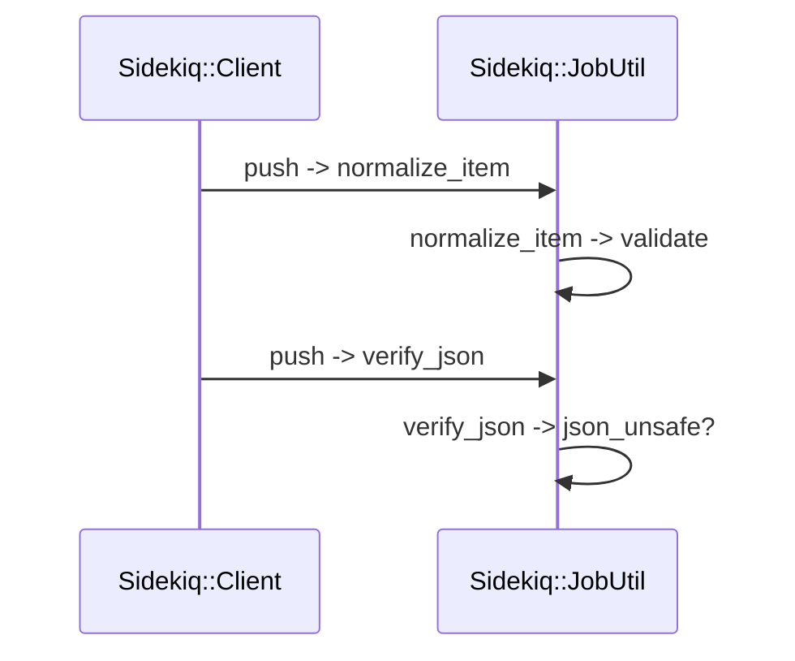
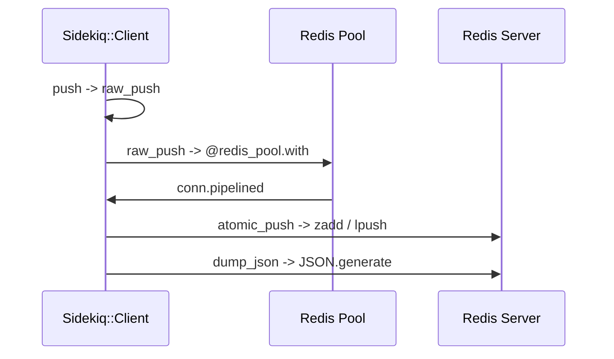
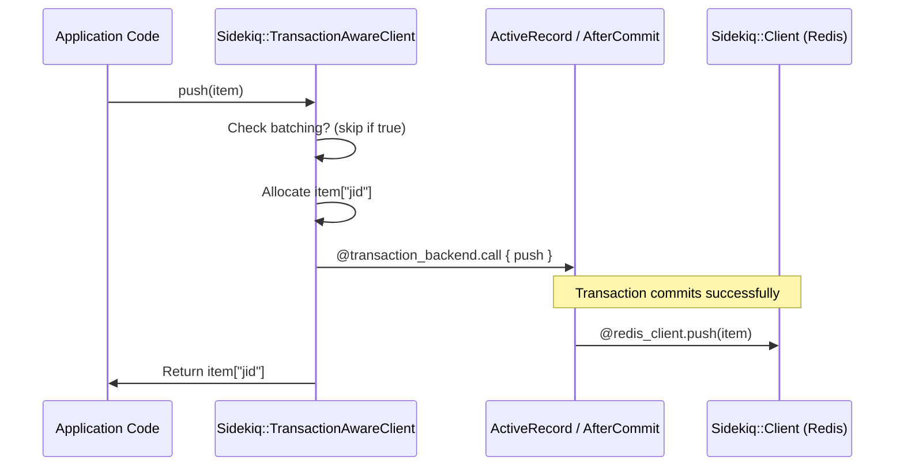
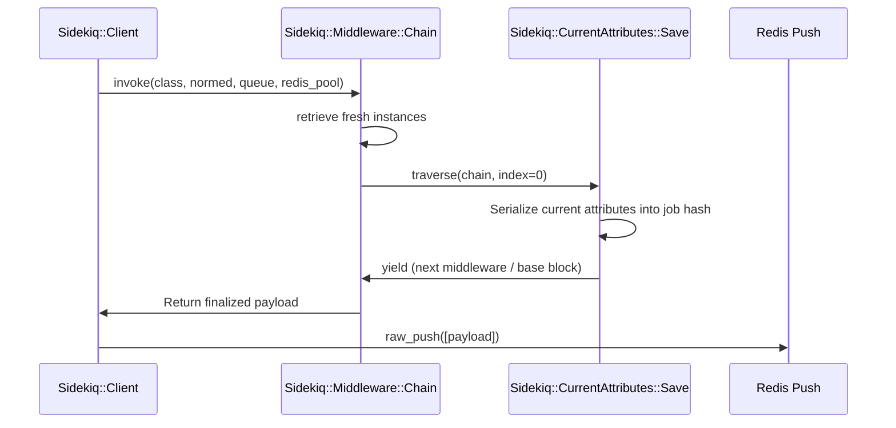
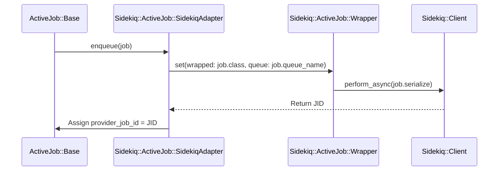

# Client Enqueueing

Relevant source files

The following files were used as context for generating this wiki page:

- [lib/sidekiq/client.rb](https://github.com/sidekiq/sidekiq/blob/main/lib/sidekiq/client.rb)
- [lib/sidekiq/job.rb](https://github.com/sidekiq/sidekiq/blob/main/lib/sidekiq/job.rb)
- [lib/sidekiq/api.rb](https://github.com/sidekiq/sidekiq/blob/main/lib/sidekiq/api.rb)
- [lib/sidekiq/processor.rb](https://github.com/sidekiq/sidekiq/blob/main/lib/sidekiq/processor.rb)
- [lib/active_job/queue_adapters/sidekiq_adapter.rb](https://github.com/sidekiq/sidekiq/blob/main/lib/active_job/queue_adapters/sidekiq_adapter.rb)
- [lib/sidekiq/transaction_aware_client.rb](https://github.com/sidekiq/sidekiq/blob/main/lib/sidekiq/transaction_aware_client.rb)
- [lib/sidekiq/scheduled.rb](https://github.com/sidekiq/sidekiq/blob/main/lib/sidekiq/scheduled.rb)
- [lib/sidekiq/test_api.rb](https://github.com/sidekiq/sidekiq/blob/main/lib/sidekiq/test_api.rb)
- [lib/sidekiq/middleware/current_attributes.rb](https://github.com/sidekiq/sidekiq/blob/main/lib/sidekiq/middleware/current_attributes.rb)
- [lib/sidekiq/middleware/chain.rb](https://github.com/sidekiq/sidekiq/blob/main/lib/sidekiq/middleware/chain.rb)
- [docs/internals.md](https://github.com/sidekiq/sidekiq/blob/main/docs/internals.md)
- [myapp/config/initializers/sidekiq.rb](https://github.com/sidekiq/sidekiq/blob/main/myapp/config/initializers/sidekiq.rb)
- [README.md](https://github.com/sidekiq/sidekiq/blob/main/README.md)
- [lib/sidekiq/redis_client_adapter.rb](https://github.com/sidekiq/sidekiq/blob/main/lib/sidekiq/redis_client_adapter.rb)
- [lib/sidekiq/fetch.rb](https://github.com/sidekiq/sidekiq/blob/main/lib/sidekiq/fetch.rb)
- [lib/sidekiq/job_util.rb](https://github.com/sidekiq/sidekiq/blob/main/lib/sidekiq/job_util.rb)
- [docs/7.0-Upgrade.md](https://github.com/sidekiq/sidekiq/blob/main/docs/7.0-Upgrade.md)
- [bare/boot.rb](https://github.com/sidekiq/sidekiq/blob/main/bare/boot.rb)
- [docs/Pro-2.0-Upgrade.md](https://github.com/sidekiq/sidekiq/blob/main/docs/Pro-2.0-Upgrade.md)
- [lib/sidekiq.rb](https://github.com/sidekiq/sidekiq/blob/main/lib/sidekiq.rb)

## Overview

Client Enqueueing encompasses the mechanisms and APIs responsible for generating, validating, normalizing, and pushing job payloads into Redis or executing them inline. It bridges application code and background processing by providing high-level class methods such as `perform_async` and `perform_in`, running validation and JSON safety checks, invoking client-side middleware chains, and supporting transactional synchronization with relational databases like Active Record.

Sources: [lib/sidekiq/client.rb:33-33](https://github.com/sidekiq/sidekiq/blob/main/lib/sidekiq/client.rb#L33-L33), [lib/sidekiq/job.rb:298-300](https://github.com/sidekiq/sidekiq/blob/main/lib/sidekiq/job.rb#L298-L300), [lib/sidekiq/job_util.rb:12-21](https://github.com/sidekiq/sidekiq/blob/main/lib/sidekiq/job_util.rb#L12-L21), [lib/sidekiq/transaction_aware_client.rb:22-31](https://github.com/sidekiq/sidekiq/blob/main/lib/sidekiq/transaction_aware_client.rb#L22-L31)

## Client API Surface and Job Inclusion

### Overview

Including the `Sidekiq::Job` module into a Ruby class extends it with class methods and configuration capabilities that turn it into an asynchronous background job. When included, it prevents usage inside `ActiveJob::Base` classes, sets up options management through `Sidekiq::Job::Options`, and extends the base class with `Sidekiq::Job::ClassMethods`. Developers interact with this API surface by calling class-level enqueueing methods such as `perform_async`, `perform_in`, `perform_at`, `perform_bulk`, and `perform_inline`.

Sources: [lib/sidekiq/job.rb:6-17](https://github.com/sidekiq/sidekiq/blob/main/lib/sidekiq/job.rb#L6-L17), [lib/sidekiq/job.rb:165-170](https://github.com/sidekiq/sidekiq/blob/main/lib/sidekiq/job.rb#L165-L170), [lib/sidekiq/job.rb:298-359](https://github.com/sidekiq/sidekiq/blob/main/lib/sidekiq/job.rb#L298-L359)

### Job Inclusion and Validation Checks

When `Sidekiq::Job` is included in any class, `self.included(base)` checks whether the target class's ancestors include `ActiveJob::Base`. If an `ActiveJob::Base` ancestor is detected, it raises an `ArgumentError` stating that `Sidekiq::Job` cannot be included in an ActiveJob class. Otherwise, it mixes in `Sidekiq::Job::Options` and extends `Sidekiq::Job::ClassMethods`.

> [!WARNING]
> Including `Sidekiq::Job` directly into an `ActiveJob` subclass is forbidden and triggers an immediate `ArgumentError` during class loading to prevent conflicting job lifecycle semantics.

Sources: [lib/sidekiq/job.rb:165-170](https://github.com/sidekiq/sidekiq/blob/main/lib/sidekiq/job.rb#L165-L170)

### Public Client API Methods and Call Walkthrough

The job class delegates enqueueing operations through a helper instance of `Sidekiq::Job::Setter`. The call-chain execution walkthrough for enqueuing a job asynchronously flows through these named methods:

`SomeJob.perform_async(*args)` → `Sidekiq::Job::ClassMethods.perform_async(*args)` → `Sidekiq::Job::Setter.new(self, {}).perform_async(*args)` → `Sidekiq::Job::Setter#perform_async` → `SomeJob.client_push(...)` → `Sidekiq::Job::ClassMethods.client_push(item)` → `Sidekiq::Job::ClassMethods.build_client` → `Sidekiq::Client#push(item)`.

When `perform_in` or `perform_at` is invoked, it calculates the execution timestamp before delegating:

`SomeJob.perform_in(interval, *args)` → calculates numeric timestamp `ts` and assigns `item["at"] = ts` if `ts > now` → `client_push(item)`.

Sources: [lib/sidekiq/job.rb:187-211](https://github.com/sidekiq/sidekiq/blob/main/lib/sidekiq/job.rb#L187-L211), [lib/sidekiq/job.rb:298-300](https://github.com/sidekiq/sidekiq/blob/main/lib/sidekiq/job.rb#L298-L300), [lib/sidekiq/job.rb:347-397](https://github.com/sidekiq/sidekiq/blob/main/lib/sidekiq/job.rb#L347-L397)

### Job Class Method Reference Table

| Method Signature | Return Type | Description |
| :--- | :--- | :--- |
| `perform_async(*args)` | `String` (JID) or `nil` | Instantiates a `Setter` and pushes the job payload asynchronously. |
| `perform_in(interval, *args)` | `String` (JID) or `nil` | Converts interval into a scheduled timestamp (`at`) and pushes the job. |
| `perform_at(interval, *args)` | `String` (JID) or `nil` | Alias for `perform_in`. |
| `perform_inline(*args)` | `Boolean` or `nil` | Executes the job immediately via client and server middleware, returning `true` or `nil`. |
| `perform_sync(*args)` | `Boolean` or `nil` | Alias for `perform_inline`. |
| `perform_bulk(*args, **kwargs)` | `Array<String>` | Pushes a large batch of jobs in chunks to reduce Redis round trips. |
| `set(options)` | `Sidekiq::Job::Setter` | Returns a `Setter` instance configured with one-off options like queues or delays. |
| `queue_as(q)` | `Hash` | Sets the default queue option for the job class. |
| `sidekiq_options(opts = {})` | `Hash` | Configures job options such as retry limits, backtrace tracking, and queues. |

Sources: [lib/sidekiq/job.rb:205-263](https://github.com/sidekiq/sidekiq/blob/main/lib/sidekiq/job.rb#L205-L263), [lib/sidekiq/job.rb:290-359](https://github.com/sidekiq/sidekiq/blob/main/lib/sidekiq/job.rb#L290-L359), [lib/sidekiq/job.rb:374-376](https://github.com/sidekiq/sidekiq/blob/main/lib/sidekiq/job.rb#L374-L376)

## Payload Normalization and Validation Pipeline

### Overview

The payload normalization and validation pipeline ensures job hashes are well-formed, contain valid classes and arguments, meet JSON compatibility requirements, and receive required default attributes prior to Redis serialization. These routines are encapsulated inside `Sidekiq::JobUtil` and included directly into `Sidekiq::Client`.

Sources: [lib/sidekiq/client.rb:8-10](https://github.com/sidekiq/sidekiq/blob/main/lib/sidekiq/client.rb#L8-L10), [lib/sidekiq/job_util.rb:6-9](https://github.com/sidekiq/sidekiq/blob/main/lib/sidekiq/job_util.rb#L6-L9)

### Validation and Normalization Call Walkthroughs

The normalization and validation pipeline executes via explicit call chains during `push` or `push_bulk`.

For argument validation and structure checking, the call sequence flows as follows:
1. `push` (in `lib/sidekiq/client.rb`): Invokes `normalize_item(item)` to prepare and validate the payload.
2. `normalize_item` (in `lib/sidekiq/job_util.rb`): Immediately calls `validate(item)` before merging default options or assigning identifiers.
3. `validate` (in `lib/sidekiq/job_util.rb`): Checks that `item` is a Hash containing `"class"` and `"args"` keys, ensures `args` is an Array or `Enumerator::Lazy`, validates that `"class"` is a Class or String, confirms optional keys (`"at"`, `"tags"`, `"retry_for"`) conform to expected numeric and array types, and raises `ArgumentError` upon any violation.

Sources: [lib/sidekiq/client.rb:101-102](https://github.com/sidekiq/sidekiq/blob/main/lib/sidekiq/client.rb#L101-L102), [lib/sidekiq/job_util.rb:12-20](https://github.com/sidekiq/sidekiq/blob/main/lib/sidekiq/job_util.rb#L12-L20), [lib/sidekiq/job_util.rb:43-45](https://github.com/sidekiq/sidekiq/blob/main/lib/sidekiq/job_util.rb#L43-L45)

For JSON safety checks, the execution trace flows as:
1. `push` (in `lib/sidekiq/client.rb`): Calls `verify_json(payload)` after middleware execution.
2. `verify_json` (in `lib/sidekiq/job_util.rb`): Inspects the configured `on_complex_arguments` mode from `Sidekiq::Config::DEFAULTS` and calls `json_unsafe?(args)`.
3. `json_unsafe?` (in `lib/sidekiq/job_util.rb`): Dispatches through the `RECURSIVE_JSON_UNSAFE` hash-lookup registry using `item.class`, recursively inspecting Arrays and Hashes to ensure dictionary keys are strings and values are native JSON types.

Sources: [lib/sidekiq/client.rb:106-107](https://github.com/sidekiq/sidekiq/blob/main/lib/sidekiq/client.rb#L106-L107), [lib/sidekiq/job_util.rb:21-41](https://github.com/sidekiq/sidekiq/blob/main/lib/sidekiq/job_util.rb#L21-L41), [lib/sidekiq/job_util.rb:109-111](https://github.com/sidekiq/sidekiq/blob/main/lib/sidekiq/job_util.rb#L109-L111)

Sources: [lib/sidekiq/client.rb:101-107](https://github.com/sidekiq/sidekiq/blob/main/lib/sidekiq/client.rb#L101-L107), [lib/sidekiq/job_util.rb:12-41](https://github.com/sidekiq/sidekiq/blob/main/lib/sidekiq/job_util.rb#L12-L41), [lib/sidekiq/job_util.rb:43-45](https://github.com/sidekiq/sidekiq/blob/main/lib/sidekiq/job_util.rb#L43-L45), [lib/sidekiq/job_util.rb:109-111](https://github.com/sidekiq/sidekiq/blob/main/lib/sidekiq/job_util.rb#L109-L111)

### Validation Rules Reference Table

| Rule / Check | Target Key | Condition | Raised Error / Action |
| :--- | :--- | :--- | :--- |
| Hash Type & Required Keys | `item` | Must be a Hash containing `"class"` and `"args"` | `ArgumentError` |
| Arguments Type | `item["args"]` | Must be an `Array` or `Enumerator::Lazy` | `ArgumentError` |
| Class Type | `item["class"]` | Must be a `Class` or `String` | `ArgumentError` |
| Timestamp Type | `item["at"]` | If present, must be `Numeric` | `ArgumentError` |
| Tags Type | `item["tags"]` | If present, must be an `Array` | `ArgumentError` |
| Retry Duration Limit | `item["retry_for"]` | If present, must not exceed `1_000_000_000` | `ArgumentError` |
| Queue Presence | `item["queue"]` | Must not be `nil` or empty string `""` | `ArgumentError` |
| JSON Safety Check | `item["args"]` | Hash keys must be Strings; values must be native JSON types | Raises `ArgumentError` or logs `warn` depending on `on_complex_arguments` config mode |

Sources: [lib/sidekiq/job_util.rb:12-19](https://github.com/sidekiq/sidekiq/blob/main/lib/sidekiq/job_util.rb#L12-L19), [lib/sidekiq/job_util.rb:21-40](https://github.com/sidekiq/sidekiq/blob/main/lib/sidekiq/job_util.rb#L21-L40), [lib/sidekiq/job_util.rb:52-53](https://github.com/sidekiq/sidekiq/blob/main/lib/sidekiq/job_util.rb#L52-L53)

> [!WARNING]
> Symbol keys inside hash arguments or complex objects that cannot be serialized natively will trigger strict argument checking unless `Sidekiq.strict_args!(false)` is explicitly configured in your initializer.

Sources: [lib/sidekiq/job_util.rb:21-40](https://github.com/sidekiq/sidekiq/blob/main/lib/sidekiq/job_util.rb#L21-L40)

### Design Trade-Offs in Payload Verification

| Design Choice | Benefit | Cost |
| :--- | :--- | :--- |
| Recursive identity-compared hash table for JSON safety (`RECURSIVE_JSON_UNSAFE`) | Avoids slow conditional type-checking branches during deep argument inspection via `compare_by_identity` | Requires maintaining an explicit lookup table for ruby classes |
| Early validation inside `normalize_item` before middleware execution | Fails fast on malformed job parameters before incurring network or middleware overhead | Requires payload structure to be known upfront before customization |

Sources: [lib/sidekiq/job_util.rb:43-44](https://github.com/sidekiq/sidekiq/blob/main/lib/sidekiq/job_util.rb#L43-L44), [lib/sidekiq/job_util.rb:80-108](https://github.com/sidekiq/sidekiq/blob/main/lib/sidekiq/job_util.rb#L80-L108)

## Push Execution and Redis Serialization

### Overview

Once job payloads have successfully passed normalization and JSON-safety verification, `Sidekiq::Client` manages pushing them down into Redis via an atomic pipeline. This section details the execution walkthrough from push invocation to Redis serialization, JSON dumping, and connection failure recovery.

Sources: [lib/sidekiq/client.rb:101-111](https://github.com/sidekiq/sidekiq/blob/main/lib/sidekiq/client.rb#L101-L111), [lib/sidekiq/client.rb:260-304](https://github.com/sidekiq/sidekiq/blob/main/lib/sidekiq/client.rb#L260-L304)

### Call-Chain Execution Walkthrough

The push execution flow follows an explicit four-step chain:

1. `push` (in `lib/sidekiq/client.rb`): Invokes client middleware, verifies JSON safety, and hands validated payloads to `raw_push([payload])`.
2. `raw_push` (in `lib/sidekiq/client.rb`): Acquires a connection from `@redis_pool` and executes a piped block via `atomic_push`, wrapping execution with retry handling for `RedisClient::Error` conditions such as `READONLY`, `NOREPLICAS`, or `UNBLOCKED`.
3. `atomic_push` (in `lib/sidekiq/client.rb`): Inspects the job payload for an `"at"` key. If scheduled, it adds the entry to the `"schedule"` sorted set; otherwise, it records the current clock time in milliseconds via `Process.clock_gettime(Process::CLOCK_REALTIME, :millisecond)`, records available queues via `sadd`, and pushes the serialized job into the appropriate queue list.
4. `dump_json` (in `lib/sidekiq.rb`): Dumps the processed job hash into a JSON string using `JSON.generate(object)` before appending it to Redis.

Sources: [lib/sidekiq/client.rb:101-111](https://github.com/sidekiq/sidekiq/blob/main/lib/sidekiq/client.rb#L101-L111), [lib/sidekiq/client.rb:260-304](https://github.com/sidekiq/sidekiq/blob/main/lib/sidekiq/client.rb#L260-L304), [lib/sidekiq.rb:64-67](https://github.com/sidekiq/sidekiq/blob/main/lib/sidekiq.rb#L64-L67)

Sources: [lib/sidekiq/client.rb:101-111](https://github.com/sidekiq/sidekiq/blob/main/lib/sidekiq/client.rb#L101-L111), [lib/sidekiq/client.rb:260-304](https://github.com/sidekiq/sidekiq/blob/main/lib/sidekiq/client.rb#L260-L304), [lib/sidekiq.rb:64-67](https://github.com/sidekiq/sidekiq/blob/main/lib/sidekiq.rb#L64-L67)

### Redis Enqueueing Reference Table

| Target Redis Command | Payload Condition | Key / Channel Structure | Action Performed |
| :--- | :--- | :--- | :--- |
| `zadd` | `payload["at"]` is present | `"schedule"` | Adds scheduled job score (timestamp) and serialized JSON payload into the schedule sorted set |
| `sadd` | Immediate execution (`"at"` absent) | `"queues"` | Adds named queue identifiers to the global active queues set |
| `lpush` | Immediate execution (`"at"` absent) | `"queue:#{queue}"` | Pushes serialized job payloads (with injected `"enqueued_at"` timestamp) into the named list |

Sources: [lib/sidekiq/client.rb:284-304](https://github.com/sidekiq/sidekiq/blob/main/lib/sidekiq/client.rb#L284-L304)

> [!WARNING]
> When a failover causes a Redis primary server to become a replica, `raw_push` intercepts `RedisClient::Error` matching `/READONLY|NOREPLICAS|UNBLOCKED/`, closes the connection, and retries the operation once to reconnect to the primary instance.

Sources: [lib/sidekiq/client.rb:267-277](https://github.com/sidekiq/sidekiq/blob/main/lib/sidekiq/client.rb#L267-L277)

> [!NOTE]
> ActiveJob sets an `enqueued_at` key during job generation, but `atomic_push` strips and overrides this key with the precise millisecond-level realtime clock value (`Process::CLOCK_REALTIME`) immediately before serializing the payload for immediate queue pushes.

Sources: [lib/sidekiq/client.rb:288-300](https://github.com/sidekiq/sidekiq/blob/main/lib/sidekiq/client.rb#L288-L300)

## Transactional Enqueueing with Active Record

### Overview

When executing database-backed web applications, pushing jobs to Redis immediately inside a database transaction risks orphaned jobs if the transaction ultimately rolls back. `Sidekiq::TransactionAwareClient` provides transactional enqueueing mechanics that intercept job pushes and delay dispatching them until the database transaction successfully commits.

Sources: [lib/sidekiq/transaction_aware_client.rb:7-31](https://github.com/sidekiq/sidekiq/blob/main/lib/sidekiq/transaction_aware_client.rb#L7-L31)

### Mechanics and Initialization

The transaction-aware client wraps a standard `Sidekiq::Client` instance and resolves its transaction dispatch backend based on the active ActiveRecord version. 

### Call-Chain Execution Walkthrough

The transactional push flow follows an explicit four-step execution path:

1. `push` (in `lib/sidekiq/transaction_aware_client.rb`): Checks if the current thread is operating within a Sidekiq batch via `batching?`. If `Thread.current[:sidekiq_batch]` is active, it delegates immediately to `@redis_client.push(item)`.
2. `push` (continuation): Pre-allocates a unique Job ID by setting `item["jid"] ||= SecureRandom.hex(12)` so the JID can be persisted immediately to the database within the transaction record.
3. `transaction_backend.call` (in `lib/sidekiq/transaction_aware_client.rb`): Hands the inner push block to the configured transaction callback backend. For ActiveRecord 7.2 and newer, it invokes `ActiveRecord.method(:after_all_transactions_commit)`. For older versions, it falls back to `AfterCommitEverywhere.method(:after_commit)`.
4. `@redis_client.push` (in `lib/sidekiq/client.rb`): Upon successful transaction commit, executes normal client normalization, middleware chain invocation, JSON verification, and Redis raw push.

Sources: [lib/sidekiq/transaction_aware_client.rb:18-31](https://github.com/sidekiq/sidekiq/blob/main/lib/sidekiq/transaction_aware_client.rb#L18-L31), [lib/sidekiq/client.rb:101-111](https://github.com/sidekiq/sidekiq/blob/main/lib/sidekiq/client.rb#L101-L111)

Sources: [lib/sidekiq/transaction_aware_client.rb:18-31](https://github.com/sidekiq/sidekiq/blob/main/lib/sidekiq/transaction_aware_client.rb#L18-L31)

### Configuration and Limitations

Enabling transactional pushes requires invoking `Sidekiq.transactional_push!` in the application initializer. This configuration reassigns the default client class for all jobs.

| Configuration Target | Constant / Setting | Effect |
| :--- | :--- | :--- |
| Job Client Class | `Sidekiq.default_job_options["client_class"]` | Points default job enqueuing to `Sidekiq::TransactionAwareClient` |
| Transient Attribute | `Sidekiq::JobUtil::TRANSIENT_ATTRIBUTES` | Adds `"client_class"` to transient attributes so it is not serialized directly into Redis job payloads |

Sources: [lib/sidekiq/transaction_aware_client.rb:45-59](https://github.com/sidekiq/sidekiq/blob/main/lib/sidekiq/transaction_aware_client.rb#L45-L59)

> [!WARNING]
> `push_bulk` explicitly bypasses transaction awareness and dispatches directly via `@redis_client.push_bulk(items)`. The transaction-aware client deliberately avoids bulk transactions to prevent holding potentially hundreds of thousands of job records in memory during long-running batch enqueue loops.

Sources: [lib/sidekiq/transaction_aware_client.rb:33-40](https://github.com/sidekiq/sidekiq/blob/main/lib/sidekiq/transaction_aware_client.rb#L33-L40)

> [!CAUTION]
> Sidekiq batches and database transactions cannot be supported simultaneously. If `batching?` evaluates to true (`Thread.current[:sidekiq_batch]` is set), `TransactionAwareClient#push` bypasses transactional delay and pushes immediately to Redis.

Sources: [lib/sidekiq/transaction_aware_client.rb:18-25](https://github.com/sidekiq/sidekiq/blob/main/lib/sidekiq/transaction_aware_client.rb#L18-L25)

## Client Middleware Chain Execution

### Overview

Client-side middleware allows intercepting and modifying job payloads before they are serialized and pushed to Redis. Sidekiq instantiates clean, isolated copies of middleware classes for every job execution to prevent state leakage. Concurrently, the current attributes persistence integration (`Sidekiq::CurrentAttributes`) propagates implicit request context—such as tenants, locales, or timezones—from Rails actions across the thread boundary into enqueued jobs.

Sources: [lib/sidekiq/middleware/chain.rb:11-15](https://github.com/sidekiq/sidekiq/blob/main/lib/sidekiq/middleware/chain.rb#L11-L15), [lib/sidekiq/middleware/current_attributes.rb:7-11](https://github.com/sidekiq/sidekiq/blob/main/lib/sidekiq/middleware/current_attributes.rb#L7-L11)

### Call-Chain Execution Walkthrough

When a job is pushed via `Sidekiq::Client#push` or `Sidekiq::Client#push_bulk`, the middleware chain is traversed using an explicit recursive mechanism:

1. `Sidekiq::Client#push` (in `lib/sidekiq/client.rb`): Invokes `middleware.invoke(item["class"], normed, normed["queue"], @redis_pool)` passing a block that returns `normed`.
2. `Sidekiq::Middleware::Chain#invoke` (in `lib/sidekiq/middleware/chain.rb`): Checks if the entry list is empty via `empty?`. If not empty, retrieves fresh instances via `retrieve` and calls `traverse(chain, 0, args, &block)`.
3. `Sidekiq::Middleware::Chain#traverse` (in `lib/sidekiq/middleware/chain.rb`): Recursively steps through each middleware entry at the given index:
   - If `index >= chain.size`, it executes the base block yielding the normalized job item (`normed`).
   - Otherwise, it invokes `chain[index].call(*args)` passing a nested block that increments the index and recurses to the next middleware link.
4. `Sidekiq::CurrentAttributes::Save#call` (in `lib/sidekiq/middleware/current_attributes.rb`): If configured, serializes active current attributes into the job payload under designated keys (`cattr`, `cattr_1`, etc.) if not already present, before yielding control deeper into the chain.

Sources: [lib/sidekiq/client.rb:101-105](https://github.com/sidekiq/sidekiq/blob/main/lib/sidekiq/client.rb#L101-L105), [lib/sidekiq/middleware/chain.rb:159-186](https://github.com/sidekiq/sidekiq/blob/main/lib/sidekiq/middleware/chain.rb#L159-L186), [lib/sidekiq/middleware/current_attributes.rb:33-43](https://github.com/sidekiq/sidekiq/blob/main/lib/sidekiq/middleware/current_attributes.rb#L33-L43)

Sources: [lib/sidekiq/client.rb:101-105](https://github.com/sidekiq/sidekiq/blob/main/lib/sidekiq/client.rb#L101-L105), [lib/sidekiq/middleware/chain.rb:159-186](https://github.com/sidekiq/sidekiq/blob/main/lib/sidekiq/middleware/chain.rb#L159-L186), [lib/sidekiq/middleware/current_attributes.rb:33-43](https://github.com/sidekiq/sidekiq/blob/main/lib/sidekiq/middleware/current_attributes.rb#L33-L43)

### Middleware Chain Management API

The `Sidekiq::Middleware::Chain` class exposes methods for ordering and modifying execution hooks.

| Method | Parameters | Purpose |
| :--- | :--- | :--- |
| `add` | `(klass, *args)` | Appends a middleware class to the end of the chain |
| `prepend` | `(klass, *args)` | Inserts a middleware class at the front of the chain |
| `insert_before` | `(oldklass, newklass, *args)` | Inserts `newklass` immediately preceding `oldklass` |
| `insert_after` | `(oldklass, newklass, *args)` | Inserts `newklass` immediately following `oldklass` |
| `remove` | `(klass)` | Removes all middleware entries matching the given class |
| `clear` | `none` | Clears all entries from the middleware chain |

Sources: [lib/sidekiq/middleware/chain.rb:107-165](https://github.com/sidekiq/sidekiq/blob/main/lib/sidekiq/middleware/chain.rb#L107-L165)

> [!NOTE]
> `Sidekiq::CurrentAttributes.persist` registers both client and server middleware automatically: it prepends `Load` and appends `Save` to the client middleware chain, and prepends `Load` to the server middleware chain.

Sources: [lib/sidekiq/middleware/current_attributes.rb:93-100](https://github.com/sidekiq/sidekiq/blob/main/lib/sidekiq/middleware/current_attributes.rb#L93-L100)

> [!WARNING]
> A client middleware `call` method **must** return the result of `yield` (or an equivalent valid payload hash). If middleware stops the job or returns `nil`, the job will not be pushed to Redis and `push` will return `nil`.

Sources: [lib/sidekiq/client.rb:96-96](https://github.com/sidekiq/sidekiq/blob/main/lib/sidekiq/client.rb#L96-L96), [lib/sidekiq/middleware/chain.rb:64-77](https://github.com/sidekiq/sidekiq/blob/main/lib/sidekiq/middleware/chain.rb#L64-L77)

## ActiveJob Queue Adapter Integration

### Overview

The ActiveJob integration in Sidekiq maps native ActiveJob enqueue operations to underlying Sidekiq client pushing methods through `Sidekiq::ActiveJob::Wrapper`. When ActiveJob is loaded, `ActiveSupport.on_load(:active_job)` injects `Sidekiq::Job::Options` into `ActiveJob::Base` unless already present, granting direct access to class-level configuration via `sidekiq_options`.

Sources: [lib/active_job/queue_adapters/sidekiq_adapter.rb:20-33](https://github.com/sidekiq/sidekiq/blob/main/lib/active_job/queue_adapters/sidekiq_adapter.rb#L20-L33)

### Adapter Enqueue Methods and Execution Flow

The `SidekiqAdapter` implements explicit methods for single and bulk job forwarding. Each adapter method wraps job serialization data and assigns provider tracking identifiers.

1. `enqueue(job)`: Extracts `job.class` as `wrapped` and `job.queue_name` as `queue`, sets optional `profile`, builds a `Sidekiq::ActiveJob::Wrapper` instance, and calls `wrapper.perform_async(job.serialize)`, assigning the resulting JID to `job.provider_job_id`.
2. `enqueue_at(job, timestamp)`: Gathers identical wrapper options (`wrapped`, `queue`, `profile`) and invokes `Sidekiq::ActiveJob::Wrapper.set(options).perform_at(timestamp, job.serialize)`.
3. `enqueue_all(jobs)`: Partitions bulk jobs by class and queue name, separates immediate execution jobs from scheduled jobs (`scheduled_at.nil?`), and dispatches them via `Sidekiq::Client.push_bulk` targeting `Sidekiq::ActiveJob::Wrapper`.

Sources: [lib/active_job/queue_adapters/sidekiq_adapter.rb:63-111](https://github.com/sidekiq/sidekiq/blob/main/lib/active_job/queue_adapters/sidekiq_adapter.rb#L63-L111)

Sources: [lib/active_job/queue_adapters/sidekiq_adapter.rb:63-71](https://github.com/sidekiq/sidekiq/blob/main/lib/active_job/queue_adapters/sidekiq_adapter.rb#L63-L71)

### ActiveJob Wrapper Execution

When the worker thread picks up a wrapper job from Redis, `Sidekiq::ActiveJob::Wrapper#perform` executes the payload by calling `::ActiveJob::Base.execute(job_data.merge("provider_job_id" => jid))`.

Sources: [lib/active_job/queue_adapters/sidekiq_adapter.rb:10-15](https://github.com/sidekiq/sidekiq/blob/main/lib/active_job/queue_adapters/sidekiq_adapter.rb#L10-L15)

> [!NOTE]
> ActiveJob only serializes keys it explicitly recognizes, preventing overarching custom key-value pairs from being injected during standard adapter enqueue calls.

Sources: [lib/active_job/queue_adapters/sidekiq_adapter.rb:63-65](https://github.com/sidekiq/sidekiq/blob/main/lib/active_job/queue_adapters/sidekiq_adapter.rb#L63-L65)

## Related

- [[Job Definition]]
- [[Redis Connection Handling]]
- [[Middleware Processing]]

