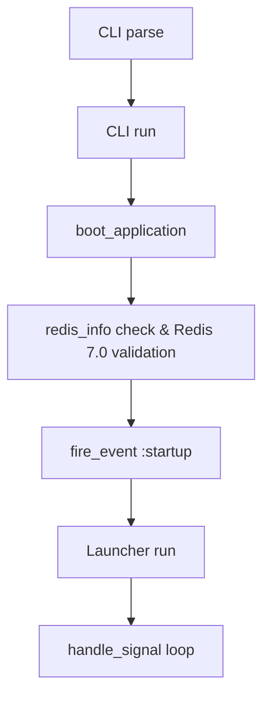
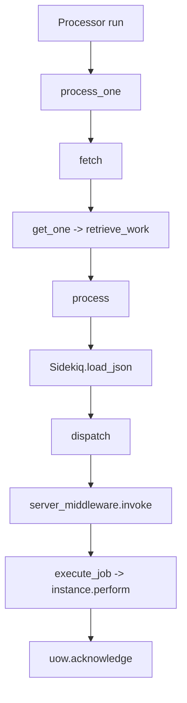

# Design Internals

<details>
<summary>Relevant source files</summary>

The following files were used as context for generating this wiki page:

- [lib/sidekiq/cli.rb](https://github.com/sidekiq/sidekiq/blob/main/lib/sidekiq/cli.rb)
- [lib/sidekiq/processor.rb](https://github.com/sidekiq/sidekiq/blob/main/lib/sidekiq/processor.rb)
- [docs/sdlc.md](https://github.com/sidekiq/sidekiq/blob/main/docs/sdlc.md)
- [docs/capsule.md](https://github.com/sidekiq/sidekiq/blob/main/docs/capsule.md)
- [README.md](https://github.com/sidekiq/sidekiq/blob/main/README.md)
- [lib/sidekiq/api.rb](https://github.com/sidekiq/sidekiq/blob/main/lib/sidekiq/api.rb)
- [lib/sidekiq/manager.rb](https://github.com/sidekiq/sidekiq/blob/main/lib/sidekiq/manager.rb)
- [docs/internals.md](https://github.com/sidekiq/sidekiq/blob/main/docs/internals.md)
- [lib/sidekiq/config.rb](https://github.com/sidekiq/sidekiq/blob/main/lib/sidekiq/config.rb)
- [lib/sidekiq.rb](https://github.com/sidekiq/sidekiq/blob/main/lib/sidekiq.rb)
- [lib/sidekiq/middleware/chain.rb](https://github.com/sidekiq/sidekiq/blob/main/lib/sidekiq/middleware/chain.rb)
- [docs/7.0-Upgrade.md](https://github.com/sidekiq/sidekiq/blob/main/docs/7.0-Upgrade.md)
- [lib/sidekiq/component.rb](https://github.com/sidekiq/sidekiq/blob/main/lib/sidekiq/component.rb)
- [lib/sidekiq/fetch.rb](https://github.com/sidekiq/sidekiq/blob/main/lib/sidekiq/fetch.rb)
- [docs/SECURITY.md](https://github.com/sidekiq/sidekiq/blob/main/docs/SECURITY.md)
- [bare/boot.rb](https://github.com/sidekiq/bare/boot.rb)
- [docs/menu.md](https://github.com/sidekiq/sidekiq/blob/main/docs/menu.md)
- [docs/Pro-2.0-Upgrade.md](https://github.com/sidekiq/sidekiq/blob/main/docs/Pro-2.0-Upgrade.md)
- [docs/8.0-Upgrade.md](https://github.com/sidekiq/sidekiq/blob/main/docs/8.0-Upgrade.md)
- [docs/3.0-Upgrade.md](https://github.com/sidekiq/sidekiq/blob/main/docs/3.0-Upgrade.md)
- [docs/webui.md](https://github.com/sidekiq/sidekiq/blob/main/docs/webui.md)
- [docs/4.0-Upgrade.md](https://github.com/sidekiq/sidekiq/blob/main/docs/4.0-Upgrade.md)
- [Ent-Changes.md](https://github.com/sidekiq/sidekiq/blob/main/Ent-Changes.md)
</details>

## Overview

Sidekiq's internal design centers around a robust configuration engine, modular concurrency control, and flexible middleware pipelines that coordinate background job execution atop Redis. By isolating runtime components into distinct execution capsules and providing clean programmatic APIs alongside strict development lifecycle standards, Sidekiq achieves high throughput while maintaining operational clarity and safety.

Sources: [docs/internals.md:13-41](https://github.com/sidekiq/sidekiq/blob/main/docs/internals.md#L13-L41), [docs/capsule.md:46-72](https://github.com/sidekiq/sidekiq/blob/main/docs/capsule.md#L46-L72), [docs/sdlc.md:5-15](https://github.com/sidekiq/sidekiq/blob/main/docs/sdlc.md#L5-L15)

## Core Architecture and Configuration Engine

### Overview

The core architecture of Sidekiq relies on central configuration management, global state initialization, and structured component lifecycle setup. Central to this design is the configuration engine, which encapsulates default execution settings, error handlers, and lifecycle hooks, while command line parsing coordinates command-line option parsing, application bootstrapping, signal trapping, and worker launching.

Sources: [lib/sidekiq/cli.rb:16-29](https://github.com/sidekiq/sidekiq/blob/main/lib/sidekiq/cli.rb#L16-L29), [lib/sidekiq/config.rb:7-41](https://github.com/sidekiq/sidekiq/blob/main/lib/sidekiq/config.rb#L7-L41)

### Configuration Defaults and Initialization

Configuration definitions include default options that control runtime behavior, error management, and queue polling. These default attributes govern operational limits such as concurrency, timeouts, and scheduled poll intervals.

| Option Key | Default Value | Purpose |
| :--- | :--- | :--- |
| `labels` | `Set.new` | Set of tags or labels associated with the instance |
| `require` | `"."` | Path to load application code or directory |
| `environment` | `nil` | Active application environment string |
| `concurrency` | `5` | Number of concurrent execution threads in default capsule |
| `timeout` | `25` | Shutdown timeout duration in seconds |
| `average_scheduled_poll_interval` | `5` | Target frequency for checking scheduled/retriable jobs |
| `on_complex_arguments` | `:raise` | Strictness mode for complex job arguments |
| `dead_max_jobs` | `10_000` | Maximum number of entries kept in the dead queue |
| `dead_timeout_in_seconds` | `15_552_000` | Expiration window for dead jobs (6 months) |

Sources: [lib/sidekiq/config.rb:11-41](https://github.com/sidekiq/sidekiq/blob/main/lib/sidekiq/config.rb#L11-L41)

### Bootstrapping and Execution Call Chain

When booting Sidekiq via the command line interface, the execution follows a strict sequence of option resolution, environment validation, Redis connection verification, and multi-threaded launcher startup.



Sources: [lib/sidekiq/cli.rb:23-29](https://github.com/sidekiq/sidekiq/blob/main/lib/sidekiq/cli.rb#L23-L29), [lib/sidekiq/cli.rb:42-115](https://github.com/sidekiq/sidekiq/blob/main/lib/sidekiq/cli.rb#L42-L115)

The invocation call-chain flows through distinct phases: argument parsing initializes options and validates file paths, execution startup boots the application (`boot_application`), verifies that the connected Redis version is at least `7.0.0`, checks the `maxmemory_policy`, fires the `:startup` lifecycle event via `fire_event`, and finally delegates execution to launcher startup.

Sources: [lib/sidekiq/cli.rb:23-29](https://github.com/sidekiq/sidekiq/blob/main/lib/sidekiq/cli.rb#L23-L29), [lib/sidekiq/cli.rb:42-115](https://github.com/sidekiq/sidekiq/blob/main/lib/sidekiq/cli.rb#L42-L115)

> [!WARNING]
> Sidekiq strictly requires Redis version 7.0.0 or greater. Attempting to boot against an older version raises an immediate runtime error during startup.

Sources: [lib/sidekiq/cli.rb:76-78](https://github.com/sidekiq/sidekiq/blob/main/lib/sidekiq/cli.rb#L76-L78)

### Component Lifecycle and Thread Safety

Shared component modules provide shared utility methods across internal subsystems by depending on a valid configuration instance. They manage thread creation (`safe_thread`), exception handling (`watchdog`), and lifecycle event emission (`fire_event`). Lifecycle hooks (`startup`, `quiet`, `shutdown`, `exit`, `heartbeat`, and `beat`) are executed sequentially, and oneshot events are automatically cleared to prevent duplicate execution.

Sources: [lib/sidekiq/component.rb:22-35](https://github.com/sidekiq/sidekiq/blob/main/lib/sidekiq/component.rb#L22-L35), [lib/sidekiq/component.rb:82-97](https://github.com/sidekiq/sidekiq/blob/main/lib/sidekiq/component.rb#L82-L97)

## Concurrency Model and Processor Management

### Overview

Sidekiq manages concurrency through worker pool orchestration governed by manager components, which coordinate a collection of standalone worker threads represented by individual processor units. Each processor runs within its own dedicated thread, continuously fetching jobs from Redis, executing middleware chains, invoking worker instances, and handling failures or graceful shutdowns.

Sources: [lib/sidekiq/processor.rb:10-24](https://github.com/sidekiq/sidekiq/blob/main/lib/sidekiq/processor.rb#L10-L24), [lib/sidekiq/manager.rb:7-19](https://github.com/sidekiq/sidekiq/blob/main/lib/sidekiq/manager.rb#L7-L19)

### Processor Execution Loop and Job Lifecycle

The execution lifecycle of an individual job flows through specific internal phases. A processor invokes `retrieve_work` to block on Redis, parses the resulting JSON payload, dispatches the job through middleware and logging wrappers, instantiates the worker class, executes the `#perform` method, and finally acknowledges completion.



Sources: [lib/sidekiq/processor.rb:73-90](https://github.com/sidekiq/sidekiq/blob/main/lib/sidekiq/processor.rb#L73-L90), [lib/sidekiq/processor.rb:167-225](https://github.com/sidekiq/sidekiq/blob/main/lib/sidekiq/processor.rb#L167-L225), [lib/sidekiq/fetch.rb:39-50](https://github.com/sidekiq/sidekiq/blob/main/lib/sidekiq/fetch.rb#L39-L50)

The core execution path is driven by the processor run loop which processes one job at a time until shutdown. Inside `process_one`, `fetch` calls `get_one`, which executes `capsule.fetcher.retrieve_work`. `retrieve_work` queries Redis via `blocking_call(TIMEOUT, "brpop", *qs, TIMEOUT)` and returns a unit of work instance. The processor then passes the unit of work to `process(uow)`, which loads the JSON payload (`Sidekiq.load_json`), wraps execution in thread interrupt handlers, and invokes `dispatch`. Within `dispatch`, it runs through `job_logger.prepare`, `retrier.global`, `job_logger.call`, `stats`, `profile`, the application reloader (`reloader.call`), instantiates the worker class (`Object.const_get`, `klass.new`), and triggers `retrier.local` before yielding to the server middleware chain (`server_middleware.invoke`) and finally calling `execute_job` which executes `instance.perform(*cloned_args)`. Upon successful execution, `uow.acknowledge` is called.

Sources: [lib/sidekiq/processor.rb:73-229](https://github.com/sidekiq/sidekiq/blob/main/lib/sidekiq/processor.rb#L73-L229), [lib/sidekiq/fetch.rb:39-50](https://github.com/sidekiq/sidekiq/blob/main/lib/sidekiq/fetch.rb#L39-L50)

> [!NOTE]
> If a job payload contains malformed JSON, Sidekiq bypasses normal dispatch, writes the raw job string directly to the `dead` sorted set in Redis with length and ranking limits enforced by `dead_timeout_in_seconds` and `dead_max_jobs`, logs an exception, and immediately acknowledges the unit of work.

Sources: [lib/sidekiq/processor.rb:171-186](https://github.com/sidekiq/sidekiq/blob/main/lib/sidekiq/processor.rb#L171-L186)

### Worker Pool Orchestration and Manager Actions

Manager components act as the central coordination point for worker concurrency. Upon initialization, manager instances validate that concurrency is at least `1`, and instantiate the configured number of processor instances, passing each a callback method (`&method(:processor_result)`) to handle processor termination or failure.

| Manager Method | Action Triggered | Operational Behavior |
| :--- | :--- | :--- |
| `initialize(capsule)` | Pool creation | Asserts concurrency `>= 1`, populates `@workers` set with processor instances |
| `start` | Worker launch | Iterates over `@workers` calling `start` on each |
| `quiet` | Graceful drain | Sets `@done = true` and calls `terminate` on all active worker processors |
| `stop(deadline)` | Shutdown sequence | Invokes `quiet`, pauses briefly (`PAUSE_TIME`), waits for `@workers` to empty up to deadline, then calls `hard_shutdown` |
| `processor_result` | Replacement/cleanup | Synchronizes via `@plock`, removes dead processor, and spawns a replacement processor if not quieted |

Sources: [lib/sidekiq/manager.rb:26-79](https://github.com/sidekiq/manager.rb#L26-L79)

### Graceful Shutdown and Hard Stop Mechanics

When Sidekiq receives a shutdown signal, manager shutdown initiates a multi-stage shutdown process. First, `quiet` marks the manager as done and instructs processors to finish current work without fetching new jobs. If threads do not finish before the provided `deadline`, `hard_shutdown` extracts all busy processors, collects their in-progress jobs, and pushes them back to Redis in bulk via `capsule.fetcher.bulk_requeue(jobs)` to satisfy at-least-once execution guarantees. Finally, it invokes `processor.kill` which raises `Sidekiq::Shutdown` directly on the stubborn worker thread.

Sources: [lib/sidekiq/manager.rb:51-119](https://github.com/sidekiq/manager.rb#L51-L119), [lib/sidekiq/fetch.rb:52-72](https://github.com/sidekiq/sidekiq/blob/main/lib/sidekiq/fetch.rb#L52-L72), [lib/sidekiq/processor.rb:51-61](https://github.com/sidekiq/sidekiq/blob/main/lib/sidekiq/processor.rb#L51-L61)

> [!WARNING]
> Sidekiq guarantees at-least-once execution. During a hard shutdown, unfinished jobs are pushed back to Redis *before* worker threads are forcefully terminated via `processor.kill`, ensuring that jobs are never lost even if process termination is forced.

Sources: [lib/sidekiq/manager.rb:101-106](https://github.com/sidekiq/manager.rb#L101-L106)

## Middleware Pipeline and Public API Mechanics

### Overview

Sidekiq provides patterned middleware pipelines for both client-side job pushing and server-side job execution, modeled after Rack middleware. Callers register middleware classes, and Sidekiq creates new instances for every job execution to prevent accidental state sharing. Middleware chain management classes handle this pipeline, supporting methods like `add`, `prepend`, `insert_before`, `insert_after`, and `remove`.

Sources: [lib/sidekiq/middleware/chain.rb:6-16](https://github.com/sidekiq/sidekiq/blob/main/lib/sidekiq/middleware/chain.rb#L6-L16), [lib/sidekiq/middleware/chain.rb:80-147](https://github.com/sidekiq/sidekiq/blob/main/lib/sidekiq/middleware/chain.rb#L80-L147)

### Chain Execution Architecture

The middleware invocation architecture is driven by middleware chain invocation methods, which check if the chain is empty and yield directly if so. Otherwise, it retrieves instantiated middleware objects via `retrieve` and triggers `traverse(chain, index, args, &block)`.

```
Middleware Chain invoke
  ├── empty? -> yield
  └── retrieve -> traverse(chain, 0, args, &block)
        ├── index >= chain.size -> yield (terminal block)
        └── chain[index].call(*args) → yields to traverse(chain, index + 1)
```

During traversal, each middleware entry executes its `call` method, passing arguments and a block that advances the index recursively to the next link, terminating at the core job execution or push operation.

Sources: [lib/sidekiq/middleware/chain.rb:169-186](https://github.com/sidekiq/sidekiq/blob/main/lib/sidekiq/middleware/chain.rb#L169-L186)

> [!NOTE]
> Client middleware must explicitly return the result of the block (`result = yield; result`) when wrapping a job push, or the job will fail to push into Redis. Server middleware yields control to execute the job but does not require an explicit return value.

Sources: [lib/sidekiq/middleware/chain.rb:64-77](https://github.com/sidekiq/middleware/chain.rb#L64-L77)

### Middleware Chain Management Methods

| Method | Signature | Operational Behavior |
| :--- | :--- | :--- |
| `add` | `(klass, *args)` | Removes existing instances of `klass` and appends a new entry to the end of the chain |
| `prepend` | `(klass, *args)` | Removes existing instances of `klass` and inserts a new entry at index `0` |
| `insert_before` | `(oldklass, newklass, *args)` | Inserts `newklass` immediately preceding `oldklass`, defaulting to index `0` if `oldklass` is missing |
| `insert_after` | `(oldklass, newklass, *args)` | Inserts `newklass` immediately following `oldklass`, defaulting to count minus one if missing |
| `remove` | `(klass)` | Deletes all entries in the chain matching the specified class |

Sources: [lib/sidekiq/middleware/chain.rb:105-146](https://github.com/sidekiq/middleware/chain.rb#L105-L146)

### Data API and Programmatic Introspection

Data API utilities and associated classes in `lib/sidekiq/api.rb` supply a Ruby object model over runtime data in Redis, powering the Web UI. These data structures offer programmatic visibility into queues, historical statistics, active processes, and worker sets.

| API Class | Underlying Redis Key / Structure | Primary Purpose |
| :--- | :--- | :--- |
| Stats API | `stat:processed`, `stat:failed`, `schedule`, `retry`, `dead`, `processes`, `queues` | Retrieves global cluster runtime statistics and queue summaries |
| Queue API | `queue:{name}`, `queues` | Enumerates, inspects, and clears real-time pending jobs within a queue |
| Job Record | Hash / JSON string in queue | Represents an immutable pending job payload with helper methods for inspection |
| Sorted Set API | Sorted sets (`schedule`, `retry`, `dead`) | Base class providing scanning, clearing, and management over score-ordered job sets |
| Process Set API | `processes` set, `{identity}` hashes | Enumerates active Sidekiq processes via heartbeats and prunes dead nodes |
| Work Set API | `{identity}:work` hashes | Tracks currently executing jobs across active processes and worker threads |

Sources: [lib/sidekiq/api.rb:8-16](https://github.com/sidekiq/sidekiq/blob/main/lib/sidekiq/api.rb#L8-L16), [lib/sidekiq/api.rb:39-140](https://github.com/sidekiq/sidekiq/blob/main/lib/sidekiq/api.rb#L39-L140), [lib/sidekiq/api.rb:285-386](https://github.com/sidekiq/sidekiq/blob/main/lib/sidekiq/api.rb#L285-L386), [lib/sidekiq/api.rb:393-414](https://github.com/sidekiq/sidekiq/blob/main/lib/sidekiq/api.rb#L393-L414), [lib/sidekiq/api.rb:671-721](https://github.com/sidekiq/sidekiq/blob/main/lib/sidekiq/api.rb#L671-L721), [lib/sidekiq/api.rb:984-1105](https://github.com/sidekiq/sidekiq/blob/main/lib/sidekiq/api.rb#L984-L1105), [lib/sidekiq/api.rb:1236-1316](https://github.com/sidekiq/sidekiq/blob/main/lib/sidekiq/api.rb#L1236-L1316)

> [!CAUTION]
> Sidekiq's Data API should never be used within application code for business logic. The Sidekiq server process bypasses this API entirely, manipulating Redis data directly for performance reasons.

Sources: [lib/sidekiq/api.rb:9-16](https://github.com/sidekiq/sidekiq/blob/main/lib/sidekiq/api.rb#L9-L16)

## Execution Isolation via Capsules

### Overview

Sidekiq 7.0 introduces encapsulation features to eliminate global mutable singletons and enable concurrency segregation, embedding, and multiple resource sets within a single Ruby process.

Sources: [docs/capsule.md:15-35](https://github.com/sidekiq/sidekiq/blob/main/docs/capsule.md#L15-L35), [docs/capsule.md:46-50](https://github.com/sidekiq/sidekiq/blob/main/docs/capsule.md#L46-L50)

### Capsule Architecture and Resource Scoping

Execution capsules represent the set of resources necessary to process a set of queues, holding state previously stored globally such as error handlers, lifecycle callbacks, and connection pools.

Sources: [docs/capsule.md:46-48](https://github.com/sidekiq/sidekiq/blob/main/docs/capsule.md#L46-L48), [docs/capsule.md:64-68](https://github.com/sidekiq/sidekiq/blob/main/docs/capsule.md#L64-L68)

> [!WARNING]
> A Sidekiq process only executes jobs from one Redis instance; all capsules within a process must share the exact same Redis instance. To process jobs from separate Redis instances, you must start separate Sidekiq processes.

Sources: [docs/capsule.md:70-72](https://github.com/sidekiq/sidekiq/blob/main/docs/capsule.md#L70-L72)

### Component Integration via Shared Modules

Internal classes include shared component modules to access capsule-local resources implicitly through methods like `redis`, `logger`, and `handle_exception` rather than global APIs.

```ruby
module Sidekiq::Component
  def config
    @config
  end

  def redis(&block)
    config.redis(&block)
  end

  def logger
    config.logger
  end

  def handle_exception(ex, ctx)
    config.handle_exception(ex, ctx)
  end
end
```

Sources: [docs/capsule.md:101-124](https://github.com/sidekiq/sidekiq/blob/main/docs/capsule.md#L101-L124)

### Concurrency Tuning and Initialization Example

You configure custom capsules and tune concurrency levels inside server configuration blocks.

```ruby
Sidekiq.configure_server do |config|
  config.capsule("unsafe") do |capsule|
    capsule.queues = %w(thread_unsafe)
    capsule.concurrency = 1
  end
end
```

Sources: [docs/capsule.md:78-86](https://github.com/sidekiq/sidekiq/blob/main/docs/capsule.md#L78-L86)

## Software Development Lifecycle Standards

### Overview

Sidekiq follows structured maintenance conventions, versioning standards, and upgrade pathways to ensure high-quality, secure, and maintainable releases across open source and commercial codebases.

Sources: [docs/sdlc.md:1-8](https://github.com/sidekiq/sidekiq/blob/main/docs/sdlc.md#L1-L8)

### Versioning and Deprecation Standards

Sidekiq does not strictly adhere to semantic versioning, but takes all reasonable measures to ensure that substantial breaking changes only occur at major version increments. Minor changes with potential for breakage, such as internal API refactoring, can occur at minor version bumps. Support is officially guaranteed for the current and previous major versions.

Sources: [docs/sdlc.md:70-72](https://github.com/sidekiq/sidekiq/blob/main/docs/sdlc.md#L70-L72), [docs/3.0-Upgrade.md:40-42](https://github.com/sidekiq/sidekiq/blob/main/docs/3.0-Upgrade.md#L40-L42), [docs/8.0-Upgrade.md:57-58](https://github.com/sidekiq/sidekiq/blob/main/docs/8.0-Upgrade.md#L57-L58)

> [!WARNING]
> Upgrading Sidekiq across multiple major versions simultaneously is unsupported. Always upgrade one major version at a time (e.g., upgrading to the latest 7.x release, clearing deprecations, and then proceeding to 8.x).

Sources: [docs/8.0-Upgrade.md:61-64](https://github.com/sidekiq/sidekiq/blob/main/docs/8.0-Upgrade.md#L61-L64)

### Upgrade Pathways and Data Compatibility

Major upgrades often incorporate underlying data model changes and API updates that require intermediate preparation steps. 

| Upgrade Path | Required Intermediate Step | Data Model / API Impact |
| :--- | :--- | :--- |
| Sidekiq Pro 1.x to 2.0 | Upgrade to latest 1.x and run for a week | New BIDs (14-char base64), hardcoded 30-day expiry, batch deletion on success |
| Sidekiq Pro 7.3.6+ to 8.0 | Run Pro 7.3.6+ for a few weeks | Ensures forward data compatibility for persistent batch data in Redis |
| Sidekiq 2.x to 3.0 | Upgrade to latest 2.x and run for a few weeks | Error handlers take `(ex, context)`, client middleware passes `redis_pool` |
| Sidekiq 3.x to 4.0 | Ensure Redis 2.8+ is deployed first | Parallel fetching requires minimum `concurrency + 2` Redis connections |

Sources: [docs/Pro-2.0-Upgrade.md:17-19](https://github.com/sidekiq/sidekiq/blob/main/docs/Pro-2.0-Upgrade.md#L17-L19), [docs/8.0-Upgrade.md:39-41](https://github.com/sidekiq/sidekiq/blob/main/docs/8.0-Upgrade.md#L39-L41), [docs/3.0-Upgrade.md:6-17](https://github.com/sidekiq/sidekiq/blob/main/docs/3.0-Upgrade.md#L6-L17), [docs/4.0-Upgrade.md:17-25](https://github.com/sidekiq/sidekiq/blob/main/docs/4.0-Upgrade.md#L17-L25)

## Security Governance and Web Configuration

### Overview

Sidekiq enforces strict vulnerability reporting protocols, rapid response timelines, and advanced Web UI security configurations to protect enterprise deployments against remote code execution, injection, and cross-site scripting attacks.

Sources: [docs/SECURITY.md:1-77](https://github.com/sidekiq/sidekiq/blob/main/docs/SECURITY.md#L1-L77), [docs/webui.md:45-71](https://github.com/sidekiq/sidekiq/blob/main/docs/webui.md#L45-L71)

### Vulnerability Management and Assessment

Sidekiq maintains a structured disclosure protocol. Reporters must never open public issues for security vulnerabilities, instead emailing disclosures to `security@contribsys.com` or utilizing GitHub's **“Report a vulnerability”** feature. The security policy scope covers Sidekiq's source code and configuration files, Ruby dependencies declared in `sidekiq.gemspec`, CI pipelines, deployment scripts, and related documentation or infrastructure-as-code.

Sources: [docs/SECURITY.md:1-16](https://github.com/sidekiq/sidekiq/blob/main/docs/SECURITY.md#L1-L16)

> [!WARNING]
> Never open a public GitHub issue for security vulnerabilities. Always use private reporting channels to allow coordinated patching before public disclosure.

Sources: [docs/SECURITY.md:3-5](https://github.com/sidekiq/sidekiq/blob/main/docs/SECURITY.md#L3-L5)

Severity scoring relies on CVSS v3.1 and dictates fixed release targets.

| Level | Description | Example |
| :--- | :--- | :--- |
| **Critical** | Remote code execution, data exfiltration, or supply-chain compromise | Unsafe YAML deserialization |
| **High** | Privilege escalation or significant data exposure | SQL injection, open redirect |
| **Medium** | Limited impact or mitigated by configuration | Denial of Service from malformed input |
| **Low** | Minor issue or best practice improvement | Information disclosure via logs |

Sources: [docs/SECURITY.md:30-37](https://github.com/sidekiq/sidekiq/blob/main/docs/SECURITY.md#L30-L37)

Response management mandates an initial acknowledgment within **48 hours**, triage and validation within **7 days**, and a fix release target within **14 days** of validation depending on severity. Automated dependency tracking is enforced via Bundler Audit, Dependabot, the RubySec Advisory Database, and CVE feeds.

Sources: [docs/SECURITY.md:20-24](https://github.com/sidekiq/sidekiq/blob/main/docs/SECURITY.md#L20-L24), [docs/SECURITY.md:50-54](https://github.com/sidekiq/sidekiq/blob/main/docs/SECURITY.md#L50-L54)

### Web UI Configuration and Security Policies

Sidekiq 8.0 replaces global class-methods on web configuration with an idiomatic `configure` block to register third-party extensions, add Rack middleware, and configure UI options like `app_url`.

```ruby
require "sidekiq/web"
Sidekiq::Web.configure do |config|
  config.register(MyExtension, name: "myext", tab: "TabName", index: "tabpage/")
  config.use Some::Rack::Middleware
  config.app_url "https://acmecorp.com" # Adds "Back to App" button in the UI
end
```

Sources: [docs/webui.md:11-41](https://github.com/sidekiq/sidekiq/blob/main/docs/webui.md#L11-L41)

To harden parameters against injection attacks, Sidekiq 8.0 distinguishes between query parameters (`url_params`) and route variables (`route_params`), assigning them distinct String or Symbol types so an attacker cannot override a resource identifier via query strings. Furthermore, web management components lock down their Content-Security-Policy by requiring all assets to tag themselves with a per-request nonce, which can be applied using helper methods defined in helper modules.

Sources: [docs/webui.md:50-71](https://github.com/sidekiq/sidekiq/blob/main/docs/webui.md#L50-L71)

## Related

- [[Overview]]
- [[Execution Capsules]]

