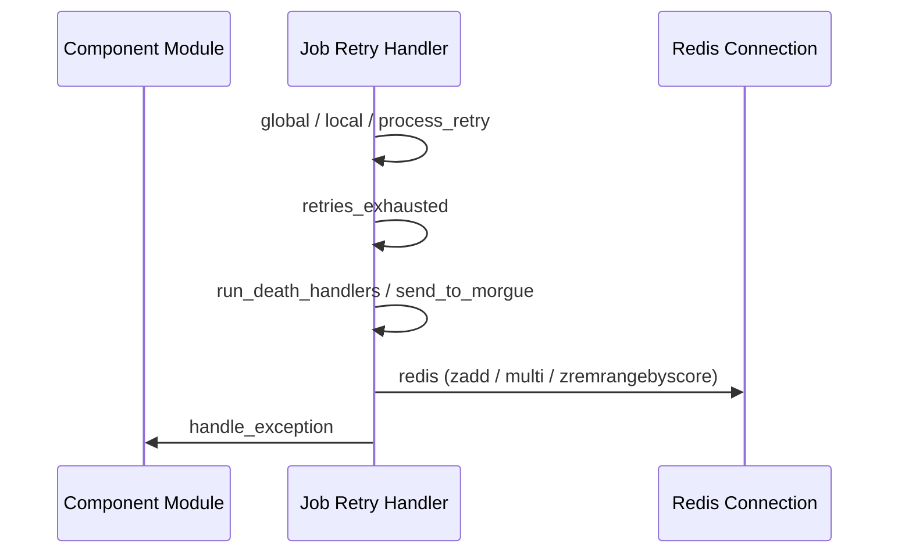

# Execution Capsules

<details>
<summary>Relevant source files</summary>

The following files were used as context for generating this wiki page:

- [lib/sidekiq/cli.rb](https://github.com/sidekiq/sidekiq/blob/main/lib/sidekiq/cli.rb)
- [lib/sidekiq/processor.rb](https://github.com/sidekiq/sidekiq/blob/main/lib/sidekiq/processor.rb)
- [lib/sidekiq/config.rb](https://github.com/sidekiq/sidekiq/blob/main/lib/sidekiq/config.rb)
- [lib/sidekiq/api.rb](https://github.com/sidekiq/sidekiq/blob/main/lib/sidekiq/api.rb)
- [docs/capsule.md](https://github.com/sidekiq/sidekiq/blob/main/docs/capsule.md)
- [lib/sidekiq/launcher.rb](https://github.com/sidekiq/sidekiq/blob/main/lib/sidekiq/launcher.rb)
- [lib/sidekiq/manager.rb](https://github.com/sidekiq/sidekiq/blob/main/lib/sidekiq/manager.rb)
- [lib/sidekiq/capsule.rb](https://github.com/sidekiq/sidekiq/blob/main/lib/sidekiq/capsule.rb)
- [docs/internals.md](https://github.com/sidekiq/sidekiq/blob/main/docs/internals.md)
- [lib/sidekiq/scheduled.rb](https://github.com/sidekiq/sidekiq/blob/main/lib/sidekiq/scheduled.rb)
- [docs/7.0-Upgrade.md](https://github.com/sidekiq/sidekiq/blob/main/docs/7.0-Upgrade.md)
- [lib/sidekiq/embedded.rb](https://github.com/sidekiq/sidekiq/blob/main/lib/sidekiq/embedded.rb)
- [README.md](https://github.com/sidekiq/sidekiq/blob/main/README.md)
- [lib/sidekiq/fetch.rb](https://github.com/sidekiq/sidekiq/blob/main/lib/sidekiq/fetch.rb)
- [bare/boot.rb](https://github.com/sidekiq/sidekiq/blob/main/bare/boot.rb)
- [lib/sidekiq.rb](https://github.com/sidekiq/sidekiq/blob/main/lib/sidekiq.rb)
- [myapp/config/initializers/sidekiq.rb](https://github.com/sidekiq/sidekiq/blob/main/myapp/config/initializers/sidekiq.rb)
- [docs/Pro-2.0-Upgrade.md](https://github.com/sidekiq/sidekiq/blob/main/docs/Pro-2.0-Upgrade.md)
- [lib/sidekiq/component.rb](https://github.com/sidekiq/sidekiq/blob/main/lib/sidekiq/component.rb)
- [lib/sidekiq/job_retry.rb](https://github.com/sidekiq/sidekiq/blob/main/lib/sidekiq/job_retry.rb)
</details>

## Overview

Introduced as part of a major internal refactoring away from global mutable singletons, execution capsules provide a modular core abstraction that encapsulates all resources necessary to process one or more queues within a defined execution context. By isolating queue sets, thread concurrency limits, Redis connection pools, and middleware chains per capsule, this design enables fine-grained multi-tenant job processing—such as dedicating a single-threaded execution context to thread-unsafe jobs alongside a multi-threaded default capsule—while ensuring all components share a single Redis instance per process.

Sources: [docs/capsule.md:15-22](https://github.com/sidekiq/sidekiq/blob/main/docs/capsule.md#L15-L22), [docs/capsule.md:46-62](https://github.com/sidekiq/sidekiq/blob/main/docs/capsule.md#L46-L62), [docs/capsule.md:73-78](https://github.com/sidekiq/sidekiq/blob/main/docs/capsule.md#L73-L78), [lib/sidekiq/capsule.rb:6-10](https://github.com/sidekiq/sidekiq/blob/main/lib/sidekiq/capsule.rb#L6-L10)

## Capsule Concept and Architecture Overview

### Overview

Capsules represent the set of resources necessary to process a set of queues. By default, configuration creates one capsule instance and mutates it according to command line parameters and configuration file data.

Sources: [docs/capsule.md:46-69](https://github.com/sidekiq/sidekiq/blob/main/docs/capsule.md#L46-L69), [lib/sidekiq/capsule.rb:20-51](https://github.com/sidekiq/sidekiq/blob/main/lib/sidekiq/capsule.rb#L20-L51)

### Architecture and Component Isolation

The architecture shifts state management away from global singletons (`Sidekiq.redis`, `Sidekiq.logger`) toward component-local readers via component utility modules. Capsule implementations include component traits, delegating configuration keys and providing local resource accessors.

```ruby
module Sidekiq::Component
  def config
    @config
  end

  def redis(&block)
    config.redis(&block)
  end

  def logger
    config.logger
  end

  def handle_exception(ex, ctx)
    config.handle_exception(ex, ctx)
  end
end
```

Sources: [docs/capsule.md:103-123](https://github.com/sidekiq/sidekiq/blob/main/docs/capsule.md#L103-L123), [lib/sidekiq/capsule.rb:21](https://github.com/sidekiq/sidekiq/blob/main/lib/sidekiq/capsule.rb#L21-L21)

Every capsule evaluates queue priorities using three internal modes governed by assigned weights: `:strict` (all queues have 0 weight and are checked sequentially), `:weighted` (queues have arbitrary weights between 1 and N), and `:random` (all queues have a uniform weight of 1).

Sources: [lib/sidekiq/capsule.rb:38-39](https://github.com/sidekiq/sidekiq/blob/main/lib/sidekiq/capsule.rb#L38-L39), [lib/sidekiq/capsule.rb:56-78](https://github.com/sidekiq/sidekiq/blob/main/lib/sidekiq/capsule.rb#L56-L78)

> [!IMPORTANT]
> A Sidekiq process only executes jobs from one Redis instance. All capsules within a single process must share and use that exact same Redis instance; processing jobs across two separate Redis instances requires starting entirely separate Sidekiq processes.

Sources: [docs/capsule.md:70-72](https://github.com/sidekiq/sidekiq/blob/main/docs/capsule.md#L70-L72)

## Capsule Configuration and Registration

### Overview

Sidekiq provides configuration hooks via server and client configuration blocks to register named capsules, define queue sets, and assign thread pool concurrency limits. Global configuration state maintains a hash of registered capsules via `@capsules`, a set of default configuration options in `DEFAULTS`, and global singletons in `@directory`.

Sources: [lib/sidekiq/config.rb:7-41](https://github.com/sidekiq/sidekiq/blob/main/lib/sidekiq/config.rb#L7-L41), [lib/sidekiq/config.rb:63-69](https://github.com/sidekiq/sidekiq/blob/main/lib/sidekiq/config.rb#L63-L69)

### Capsule Registration and Queue Assignment

New execution subsystems are registered using the `capsule(name)` method on configuration objects. When called with a name string or symbol, `capsule` fetches an existing instance or instantiates a new capsule object, stores it in `@capsules`, and yields it to a configuration block if given.

```ruby
Sidekiq.configure_server do |config|
  config.capsule("single_threaded") do |cap|
    cap.concurrency = 1
    cap.queues = %w[single]
    cap.server_middleware.add Singler
  end
end
```

Sources: [lib/sidekiq/config.rb:134-142](https://github.com/sidekiq/sidekiq/blob/main/lib/sidekiq/config.rb#L134-L142), [myapp/config/initializers/sidekiq.rb:64-70](https://github.com/sidekiq/sidekiq/blob/main/myapp/config/initializers/sidekiq.rb#L64-L70)

Queues assigned to a capsule can be specified in strict, weighted, or random order format. Setting queue attributes on configuration objects delegates directly to the default or named capsule, allowing queue configurations such as strict arrays, weight-annotated arrays, or uniform sets.

Sources: [lib/sidekiq/config.rb:109-115](https://github.com/sidekiq/sidekiq/blob/main/lib/sidekiq/config.rb#L109-L115), [bare/boot.rb:3-6](https://github.com/sidekiq/sidekiq/blob/main/bare/boot.rb#L3-L6)

> [!NOTE]
> All capsules within a Sidekiq instance must share the exact same Redis configuration. Setting `config.redis=` updates `@redis_config` globally, which is then used by each capsule's dedicated connection pool.

Sources: [lib/sidekiq/config.rb:67-67](https://github.com/sidekiq/sidekiq/blob/main/lib/sidekiq/config.rb#L67-L67), [lib/sidekiq/config.rb:144-147](https://github.com/sidekiq/sidekiq/blob/main/lib/sidekiq/config.rb#L144-L147)

### Configuration Options Reference

Default values for global runtime options, error handlers, and lifecycle events are defined within configuration defaults.

| Option Key | Default Value | Purpose |
| :--- | :--- | :--- |
| `labels` | `Set.new` | Operational labels attached to the instance |
| `require` | `"."` | Path or directory to require on boot |
| `environment` | `nil` | Application environment name (e.g., development, production) |
| `concurrency` | `5` | Default thread pool concurrency limit per capsule |
| `timeout` | `25` | Hard shutdown timeout in seconds for worker threads |
| `average_scheduled_poll_interval` | `5` | Average frequency in seconds to poll scheduled/retry queues |
| `on_complex_arguments` | `:raise` | Handling mode for complex job arguments |
| `max_iteration_runtime` | `nil` | Maximum runtime before an iterable job is interrupted and re-enqueued |
| `dead_max_jobs` | `10_000` | Maximum number of jobs retained in the dead queue (morgue) |
| `dead_timeout_in_seconds` | `15_552_000` (6 months) | Time-to-live for jobs stored in the dead queue |

Sources: [lib/sidekiq/config.rb:11-41](https://github.com/sidekiq/sidekiq/blob/main/lib/sidekiq/config.rb#L11-L41)

## Worker Management and Task Fetching

### Overview

Worker management and task fetching coordinate through a hierarchy of components: top-level launchers instantiate managers for each capsule, which in turn manage pools of worker processor threads. Each processor relies on fetcher implementations to retrieve work from Redis via blocking list pops (`brpop`).

Sources: [lib/sidekiq/launcher.rb:25-30](https://github.com/sidekiq/sidekiq/blob/main/lib/sidekiq/launcher.rb#L25-L30), [lib/sidekiq/manager.rb:34-36](https://github.com/sidekiq/manager.rb#L34-L36), [lib/sidekiq/fetch.rb:39-50](https://github.com/sidekiq/sidekiq/blob/main/lib/sidekiq/fetch.rb#L39-L50), [lib/sidekiq/processor.rb:10-17](https://github.com/sidekiq/sidekiq/blob/main/lib/sidekiq/processor.rb#L10-L17)

### Task Fetching and Unit of Work

Basic fetch implementations handle retrieving jobs from Redis based on capsule queue configurations. When retrieving work, command lists are constructed using queue permutations (shuffling queues unless strictly ordered) and executing a blocking `brpop` call with a timeout of 2 seconds. Successful retrievals are wrapped in unit-of-work structures.

```ruby
def retrieve_work
  qs = queues_cmd
  if qs.size <= 0
    sleep(TIMEOUT)
    return nil
  end

  queue, job = redis { |conn| conn.blocking_call(TIMEOUT, "brpop", *qs, TIMEOUT) }
  UnitOfWork.new(queue, job, config) if queue
end
```

Sources: [lib/sidekiq/fetch.rb:13-50](https://github.com/sidekiq/sidekiq/blob/main/lib/sidekiq/fetch.rb#L13-L50), [lib/sidekiq/fetch.rb:79-87](https://github.com/sidekiq/sidekiq/blob/main/lib/sidekiq/fetch.rb#L79-L87)

> [!NOTE]
> Units of work provide three core methods: `acknowledge` (a no-op for standard Redis queues since items are removed from the list on pop), `queue_name` (strips the `queue:` prefix), and `requeue` (pushes the job back onto the right side of the Redis list).

Sources: [lib/sidekiq/fetch.rb:15-28](https://github.com/sidekiq/sidekiq/blob/main/lib/sidekiq/fetch.rb#L15-L28)

### Processor Lifecycle and Execution Walkthrough

Each processor runs as an independent thread executing run loops until marked done. The primary execution call chain proceeds as follows:

`run` → `process_one` → `fetch` → `get_one` (`capsule.fetcher.retrieve_work`) → `process(uow)` → `dispatch(job_hash, queue, jobstr)` → `execute_job(instance, cloned_args)` (`instance.perform(*cloned_args)`)

If an unhandled exception occurs during job execution, the processor triggers its callback (handled by manager result hooks), which removes the dead processor, instantiates a replacement processor, and starts it.

```ruby
def processor_result(processor, reason = nil)
  @plock.synchronize do
    @workers.delete(processor)
    if !@done && @count > @workers.size
      p = Processor.new(@config, &method(:processor_result))
      @workers << p
      p.start
    end
  end
  nil
end
```

Sources: [lib/sidekiq/processor.rb:21-23](https://github.com/sidekiq/sidekiq/blob/main/lib/sidekiq/processor.rb#L21-L23), [lib/sidekiq/processor.rb:73-84](https://github.com/sidekiq/processor.rb#L73-L84), [lib/sidekiq/processor.rb:86-90](https://github.com/sidekiq/processor.rb#L86-L90), [lib/sidekiq/processor.rb:92-102](https://github.com/sidekiq/processor.rb#L92-L102), [lib/sidekiq/processor.rb:128-160](https://github.com/sidekiq/processor.rb#L128-L160), [lib/sidekiq/processor.rb:227-229](https://github.com/sidekiq/processor.rb#L227-L229), [lib/sidekiq/manager.rb:69-79](https://github.com/sidekiq/manager.rb#L69-L79)

### Component Coordination Reference

| Component | Role / Class | Key Methods / Constants | Purpose |
| :--- | :--- | :--- | :--- |
| Launcher | Launcher component | `run`, `quiet`, `stop` | Manages process-wide managers and scheduled poller |
| Manager | Manager component | `start`, `quiet`, `stop`, `processor_result` | Controls worker pool sizing, lifecycle, and hard shutdown re-enqueueing |
| Processor | Processor component | `start`, `terminate`, `kill`, `process` | Standalone thread executing middleware, loaders, and worker `perform` |
| Fetcher | Basic fetch component | `retrieve_work`, `bulk_requeue`, `queues_cmd` | Fetches jobs from Redis queues using blocking pops |
| Unit of Work | Unit of work struct | `acknowledge`, `queue_name`, `requeue` | Represents an active job unit retrieved from Redis |

Sources: [lib/sidekiq/launcher.rb:25-72](https://github.com/sidekiq/sidekiq/blob/main/lib/sidekiq/launcher.rb#L25-L72), [lib/sidekiq/manager.rb:20-79](https://github.com/sidekiq/manager.rb#L20-L79), [lib/sidekiq/processor.rb:25-69](https://github.com/sidekiq/processor.rb#L25-L69), [lib/sidekiq/fetch.rb:8-50](https://github.com/sidekiq/fetch.rb#L8-L50)

## Embedded and CLI Subsystem Integration

### Overview

Capsules and their associated worker managers are orchestrated within top-level application runners. Two primary runtime integration paths exist: the standalone command-line runner and the embedded runtime environment. Both subsystems rely on launcher components to bootstrap capsule managers, scheduled pollers, process heartbeats, and graceful shutdown lifecycles.

Sources: [lib/sidekiq/cli.rb:16-125](https://github.com/sidekiq/sidekiq/blob/main/lib/sidekiq/cli.rb#L16-L125), [lib/sidekiq/launcher.rb:8-44](https://github.com/sidekiq/launcher.rb#L8-L44), [lib/sidekiq/embedded.rb:7-24](https://github.com/sidekiq/embedded.rb#L7-L24)

### CLI Execution and Lifecycle Management

The CLI subsystem initializes configuration via command parsing routines, boots Rails or plain Ruby worker environments, traps system signals, validates Redis versions and connection pool sizing, and fires startup events before instantiating launchers.

```ruby
def launch(self_read)
  if environment == "development" && $stdout.tty?
    logger.info "Starting processing, hit Ctrl-C to stop"
  end

  @launcher = Sidekiq::Launcher.new(@config)

  begin
    launcher.run

    while self_read.wait_readable
      signal = self_read.gets.strip
      handle_signal(signal)
    end
  rescue Interrupt
    logger.info "Shutting down"
    launcher.stop
    logger.info "Bye!"

    exit(0)
  end
end
```

Sources: [lib/sidekiq/cli.rb:23-143](https://github.com/sidekiq/cli.rb#L23-L143)

Signal traps route operational commands to the launcher or process state. Registered signal handlers govern runtime control behavior across process lifecycles.

| Signal | Target Action / Handler | Purpose |
| :--- | :--- | :--- |
| `INT` | `->(cli) { raise Interrupt }` | Triggers immediate interactive shutdown sequence |
| `TERM` | `->(cli) { raise Interrupt }` | Triggers container or orchestrator termination sequence |
| `TSTP` | `->(cli) { cli.launcher.quiet }` | Quiets the launcher, stopping all capsule managers from accepting new work |
| `TTIN` | Thread backtrace logger | Dumps backtraces for all active ruby threads to the logger |
| `INFO` | Deprecated thread logger | Legacy thread backtrace logger (unsupported on Linux) |
| `USR2` | Pro-specific signal | Registered conditionally on non-JRuby Pro environments |

Sources: [lib/sidekiq/cli.rb:51-68](https://github.com/sidekiq/cli.rb#L51-L68), [lib/sidekiq/cli.rb:193-224](https://github.com/sidekiq/cli.rb#L193-L224)

### Embedded Application Integration

For applications embedding background processing directly within another process (such as custom web servers or background worker frameworks), embedded modules expose explicit lifecycle controls: `run`, `quiet`, and `stop`. Embedded launchers skip updating process title strings (`$0`) by passing `embedded: true` to prevent interference with host process naming conventions.

```ruby
def run
  housekeeping
  fire_event(:startup, reverse: false, reraise: true)
  @launcher = Sidekiq::Launcher.new(@config, embedded: true)
  @launcher.run
  sleep 0.2 # pause to give threads time to spin up

  logger.info "Sidekiq running embedded, total process thread count: #{Thread.list.size}"
  logger.debug { Thread.list.map(&:name) }
end
```

Sources: [lib/sidekiq/embedded.rb:7-24](https://github.com/sidekiq/embedded.rb#L7-L24)

> [!WARNING]
> When embedding background processing, the host process must ensure connection pools are appropriately sized and housekeeping checks (such as verifying Redis version compatibility and maxmemory policies) execute before firing startup lifecycle events.

Sources: [lib/sidekiq/embedded.rb:36-62](https://github.com/sidekiq/embedded.rb#L36-L62)

## Job Retry and Error Handling

### Overview

Automated error handling and job retry management operate across capsule boundaries. Failed executions are intercepted, job configurations inspected, exponential backoff delays with jitter calculated, custom retry and death hooks invoked, and exhausted items persisted into dead job queues (morgue) or discarded.

Sources: [lib/sidekiq/job_retry.rb:7-60](https://github.com/sidekiq/job_retry.rb#L7-L60), [lib/sidekiq/job_retry.rb:84-138](https://github.com/sidekiq/job_retry.rb#L84-L138)

### Exception Management and Error Handlers

The error handling system distinguishes between global execution blocks and local job-instantiated blocks. Global retry handlers accept raw JSON job strings and queue names without instantiating worker classes, while local handlers associate errors with specific worker instances to support exhausted-retry blocks.

```ruby
def global(jobstr, queue)
  yield
rescue Handled => ex
  raise ex
rescue Sidekiq::Shutdown => ey
  raise ey
rescue Exception => e
  raise Sidekiq::Shutdown if exception_caused_by_shutdown?(e)

  msg = Sidekiq.load_json(jobstr)
  if msg["retry"]
    process_retry(nil, msg, queue, e)
  else
    @config[:death_handlers].each do |handler|
      handler.call(msg, e)
    rescue => handler_ex
      handle_exception(handler_ex, {context: "Error calling death handler", job: msg})
    end
  end

  raise Handled
end
```

Sources: [lib/sidekiq/job_retry.rb:84-107](https://github.com/sidekiq/job_retry.rb#L84-L107), [lib/sidekiq/job_retry.rb:117-138](https://github.com/sidekiq/job_retry.rb#L117-L138)

> [!WARNING]
> Any exception raised inside a local retry block is wrapped in retry skip exception subclasses to prevent global blocks from reprocessing the error. This exception is subsequently unwrapped within processor execution loops prior to invoking general error handlers.

Sources: [lib/sidekiq/job_retry.rb:67-70](https://github.com/sidekiq/job_retry.rb#L67-L70), [lib/sidekiq/job_retry.rb:117-138](https://github.com/sidekiq/job_retry.rb#L117-L138)

### Execution Walkthrough: Global Error Handling and Retry Pipeline

When an unhandled exception occurs inside a global job execution block, failures route through the verified call chain: `global` → `process_retry` → `retries_exhausted` → `run_death_handlers` → `handle_exception`.

1. `global` (`lib/sidekiq/job_retry.rb:83-106`): Intercepts exceptions raised during execution, checks for shutdown causes, parses the raw job payload string, and invokes `process_retry` when retries are enabled.
Sources: [lib/sidekiq/job_retry.rb:83-106](https://github.com/sidekiq/sidekiq/blob/main/lib/sidekiq/job_retry.rb#L83-L106)
2. `process_retry` (`lib/sidekiq/job_retry.rb:148-207`): Calculates retry attempts, updates error classes and backtraces, evaluates retry duration or count limits, and computes exponential backoff delays with jitter before pushing the payload back to the Redis retry sorted set. If limits are exceeded, it delegates directly to `retries_exhausted`.
Sources: [lib/sidekiq/job_retry.rb:148-207](https://github.com/sidekiq/sidekiq/blob/main/lib/sidekiq/job_retry.rb#L148-L207)
3. `retries_exhausted` (`lib/sidekiq/job_retry.rb:249-272`): Invokes exhausted blocks if defined, determines whether to discard the job or send it to the morgue via `send_to_morgue`, and then calls `run_death_handlers`.
Sources: [lib/sidekiq/job_retry.rb:249-272](https://github.com/sidekiq/sidekiq/blob/main/lib/sidekiq/job_retry.rb#L249-L272)
4. `run_death_handlers` (`lib/sidekiq/job_retry.rb:274-280`): Iterates over registered death handlers, executing each one and wrapping block calls in rescue blocks.
Sources: [lib/sidekiq/job_retry.rb:274-280](https://github.com/sidekiq/sidekiq/blob/main/lib/sidekiq/job_retry.rb#L274-L280)
5. `handle_exception` (`lib/sidekiq/component.rb:77-79`): Delegates exception reporting to the central configuration error handler.
Sources: [lib/sidekiq/component.rb:77-79](https://github.com/sidekiq/component.rb#L77-L79), [lib/sidekiq/job_retry.rb:278-280](https://github.com/sidekiq/sidekiq/blob/main/lib/sidekiq/job_retry.rb#L278-L280)

Sources: [lib/sidekiq/component.rb:77-79](https://github.com/sidekiq/component.rb#L77-L79), [lib/sidekiq/job_retry.rb:83-106](https://github.com/sidekiq/sidekiq/blob/main/lib/sidekiq/job_retry.rb#L83-L106), [lib/sidekiq/job_retry.rb:148-207](https://github.com/sidekiq/sidekiq/blob/main/lib/sidekiq/job_retry.rb#L148-L207), [lib/sidekiq/job_retry.rb:249-280](https://github.com/sidekiq/sidekiq/blob/main/lib/sidekiq/job_retry.rb#L249-L280)

### Execution Walkthrough: Morgue Persistence Pipeline

When retries are exhausted and the job is not explicitly discarded, the failure pipeline persists payloads directly into Redis storage.

1. `global` (`lib/sidekiq/job_retry.rb:83-106`): Captures exceptions and dispatches payloads to `process_retry`.
Sources: [lib/sidekiq/job_retry.rb:83-106](https://github.com/sidekiq/sidekiq/blob/main/lib/sidekiq/job_retry.rb#L83-L106)
2. `process_retry` (`lib/sidekiq/job_retry.rb:148-207`): Determines that retry attempts are exhausted and delegates control to `retries_exhausted`.
Sources: [lib/sidekiq/job_retry.rb:148-207](https://github.com/sidekiq/sidekiq/blob/main/lib/sidekiq/job_retry.rb#L148-L207)
3. `retries_exhausted` (`lib/sidekiq/job_retry.rb:249-272`): Evaluates whether jobs are marked as dead or discarded, then invokes `send_to_morgue`.
Sources: [lib/sidekiq/job_retry.rb:249-272](https://github.com/sidekiq/sidekiq/blob/main/lib/sidekiq/job_retry.rb#L249-L272)
4. `send_to_morgue` (`lib/sidekiq/job_retry.rb:282-294`): Serializes dead job payloads and logs their addition to dead sets.
Sources: [lib/sidekiq/job_retry.rb:282-294](https://github.com/sidekiq/sidekiq/blob/main/lib/sidekiq/job_retry.rb#L282-L294)
5. `redis` (`lib/sidekiq/component.rb:54-56`): Executes Redis multi transactions (`MULTI/EXEC`) to add dead jobs to `"dead"` sorted sets, prune expired items older than `dead_timeout_in_seconds`, and trim sets down to `dead_max_jobs`.
Sources: [lib/sidekiq/component.rb:54-56](https://github.com/sidekiq/component.rb#L54-L56), [lib/sidekiq/job_retry.rb:288-294](https://github.com/sidekiq/sidekiq/blob/main/lib/sidekiq/job_retry.rb#L288-L294)

Sources: [lib/sidekiq/component.rb:54-56](https://github.com/sidekiq/component.rb#L54-L56), [lib/sidekiq/job_retry.rb:83-106](https://github.com/sidekiq/sidekiq/blob/main/lib/sidekiq/job_retry.rb#L83-L106), [lib/sidekiq/job_retry.rb:148-207](https://github.com/sidekiq/sidekiq/blob/main/lib/sidekiq/job_retry.rb#L148-L207), [lib/sidekiq/job_retry.rb:249-294](https://github.com/sidekiq/sidekiq/blob/main/lib/sidekiq/job_retry.rb#L249-L294)

### Execution Walkthrough: Local Error Handling Pipeline

When errors occur inside worker-instance-bound execution blocks, local retry routing ensures worker-level configurations take precedence before falling back to global handlers.

1. `local` (`lib/sidekiq/job_retry.rb:116-137`): Yields to job execution blocks, catches exceptions, and loads job payload JSON strings.
Sources: [lib/sidekiq/job_retry.rb:116-137](https://github.com/sidekiq/sidekiq/blob/main/lib/sidekiq/job_retry.rb#L116-L137)
2. `process_retry` (`lib/sidekiq/job_retry.rb:148-207`): Evaluates retry options, custom retry intervals, and backtrace cleaning rules for worker instances.
Sources: [lib/sidekiq/job_retry.rb:148-207](https://github.com/sidekiq/sidekiq/blob/main/lib/sidekiq/job_retry.rb#L148-L207)
3. `retries_exhausted` (`lib/sidekiq/job_retry.rb:249-272`): Executes worker-level exhausted hooks if defined.
Sources: [lib/sidekiq/job_retry.rb:249-272](https://github.com/sidekiq/sidekiq/blob/main/lib/sidekiq/job_retry.rb#L249-L272)
4. `run_death_handlers` (`lib/sidekiq/job_retry.rb:274-280`): Processes all configured system death handlers.
Sources: [lib/sidekiq/job_retry.rb:274-280](https://github.com/sidekiq/sidekiq/blob/main/lib/sidekiq/job_retry.rb#L274-L280)
5. `handle_exception` (`lib/sidekiq/component.rb:77-79`): Reports errors encountered during death handler execution to configuration exception handlers.
Sources: [lib/sidekiq/component.rb:77-79](https://github.com/sidekiq/component.rb#L77-L79), [lib/sidekiq/job_retry.rb:278-280](https://github.com/sidekiq/sidekiq/blob/main/lib/sidekiq/job_retry.rb#L278-L280)

Sources: [lib/sidekiq/component.rb:77-79](https://github.com/sidekiq/component.rb#L77-L79), [lib/sidekiq/job_retry.rb:116-137](https://github.com/sidekiq/sidekiq/blob/main/lib/sidekiq/job_retry.rb#L116-L137), [lib/sidekiq/job_retry.rb:148-280](https://github.com/sidekiq/sidekiq/blob/main/lib/sidekiq/job_retry.rb#L148-L280)



Sources: [lib/sidekiq/component.rb:77-79](https://github.com/sidekiq/component.rb#L77-L79), [lib/sidekiq/job_retry.rb:83-137](https://github.com/sidekiq/sidekiq/blob/main/lib/sidekiq/job_retry.rb#L83-L137), [lib/sidekiq/job_retry.rb:148-207](https://github.com/sidekiq/sidekiq/blob/main/lib/sidekiq/job_retry.rb#L148-L207), [lib/sidekiq/job_retry.rb:249-294](https://github.com/sidekiq/sidekiq/blob/main/lib/sidekiq/job_retry.rb#L249-L294)

### Retry Configuration and Options Reference

Job retry behavior is governed by options stored directly within job payloads or configured globally via configuration objects.

| Option Name | Type | Default Value | Purpose |
| :--- | :--- | :--- | :--- |
| `retry` | Boolean or Integer | `25` | Enables retries or sets maximum retry attempts before giving up |
| `retry_queue` | String | `nil` | Reroutes retried jobs to lower-priority queues |
| `retry_for` | Numeric (duration) | `nil` | Duration-based retry mode; ignores count-based retry limits when set |
| `backtrace` | Boolean or Integer | `false` | Stores worker error backtrace lines in payloads |
| `dead` | Boolean | `true` | When set to `false`, prevents sending exhausted jobs to morgues |

Sources: [lib/sidekiq/job_retry.rb:23-44](https://github.com/sidekiq/sidekiq/blob/main/lib/sidekiq/job_retry.rb#L23-L44), [lib/sidekiq/job_retry.rb:73-79](https://github.com/sidekiq/sidekiq/blob/main/lib/sidekiq/job_retry.rb#L73-L79), [lib/sidekiq/job_retry.rb:183-188](https://github.com/sidekiq/sidekiq/blob/main/lib/sidekiq/job_retry.rb#L183-L188), [lib/sidekiq/job_retry.rb:264-270](https://github.com/sidekiq/sidekiq/blob/main/lib/sidekiq/job_retry.rb#L264-L270)

### Error Handling Design Trade-Offs

| Design Choice | Benefit | Cost |
| :--- | :--- | :--- |
| **JSON Payload Serialization** | Avoids requiring class instantiation for global retries; enables robust error processing when worker classes are missing | Requires re-parsing and dumping JSON during failure handling passes |
| **Separation of Global and Local Blocks** | Allows lightweight global retry mechanics while supporting instance-bound hooks | Duplicates exception interception logic across execution paths |
| **Exception Wrapper Classes** | Prevents redundant error logging and multi-level retry processing | Requires explicit unwrapping in processor middleware entrypoints |
| **MULTI/EXEC Morgue Persistence** | Ensures atomic insertion and cleanup of dead job sorted sets in Redis | Increases round-trip complexity during queue exhaustion |

Sources: [lib/sidekiq/job_retry.rb:62-70](https://github.com/sidekiq/job_retry.rb#L62-L70), [lib/sidekiq/job_retry.rb:81-138](https://github.com/sidekiq/job_retry.rb#L81-L138), [lib/sidekiq/job_retry.rb:283-295](https://github.com/sidekiq/job_retry.rb#L283-L295)

## Monitoring and API Capsule Inspection

### Overview

Data APIs supply Ruby object models over runtime data residing in Redis. 
Sources: [lib/sidekiq/api.rb:9-16](https://github.com/sidekiq/api.rb#L9-L16)

> [!WARNING]
> Server processes never use data APIs: all data manipulation is done directly for performance reasons to ensure optimal Redis utilization at every callsite. Application code should avoid using this API for business logic.
> Sources: [lib/sidekiq/api.rb:10-16](https://github.com/sidekiq/api.rb#L10-L16)

### Querying Stats and Runtime Metrics

Statistics query classes retrieve cluster-wide processing statistics from Redis, exposing summary metrics such as processed counts, failures, and queue lengths via pipelined O(1) or O(process + queue) fetches.
Sources: [lib/sidekiq/api.rb:39-53](https://github.com/sidekiq/api.rb#L39-L53), [lib/sidekiq/api.rb:142-206](https://github.com/sidekiq/api.rb#L142-L206)

| Metric Method | Return Type | Underlying Redis Command / Key | Purpose |
| :--- | :--- | :--- | :--- |
| `processed` | Integer | `GET stat:processed` | Total jobs processed cluster-wide |
| `failed` | Integer | `GET stat:failed` | Total failed jobs cluster-wide |
| `scheduled_size` | Integer | `ZCARD schedule` | Number of jobs in scheduled sets |
| `retry_size` | Integer | `ZCARD retry` | Number of jobs in retry sets |
| `dead_size` | Integer | `ZCARD dead` | Number of jobs in dead sets |
| `processes_size` | Integer | `SCARD processes` | Number of active processes |

Sources: [lib/sidekiq/api.rb:55-73](https://github.com/sidekiq/api.rb#L55-L73), [lib/sidekiq/api.rb:145-155](https://github.com/sidekiq/api.rb#L145-L155)

### Inspecting Processes and Capsules

Process set APIs enumerate active runtime nodes and inspect individual process attributes, including capsule weight distributions and process health.
Sources: [lib/sidekiq/api.rb:984-1004](https://github.com/sidekiq/api.rb#L984-L1004), [lib/sidekiq/api.rb:1108-1123](https://github.com/sidekiq/api.rb#L1108-L1123)

```ruby
process = Sidekiq::ProcessSet.new.first
if process
  puts process.identity
  puts process.capsules.inspect
  process.quiet! unless process.stopping?
end
```
Sources: [lib/sidekiq/api.rb:1039-1067](https://github.com/sidekiq/api.rb#L1039-L1067), [lib/sidekiq/api.rb:1142-1194](https://github.com/sidekiq/api.rb#L1142-L1194)

## Related

- [[Worker Processing]]
- [[Process Lifecycle]]

