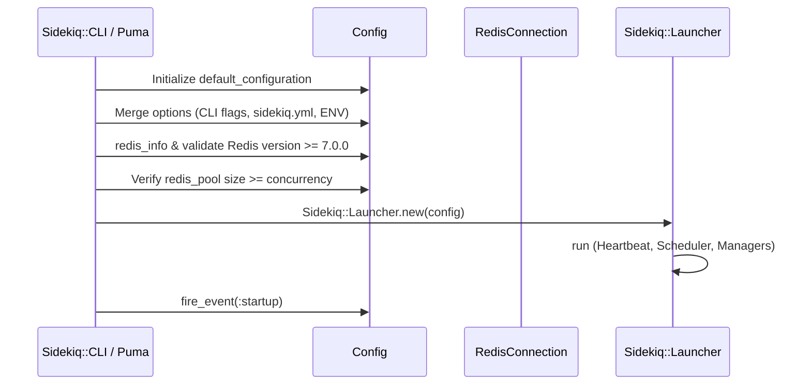

# Global Configuration

<details>
<summary>Relevant source files</summary>

The following files were used as context for generating this wiki page:

- [lib/sidekiq/cli.rb](https://github.com/sidekiq/sidekiq/blob/main/lib/sidekiq/cli.rb)
- [lib/sidekiq/config.rb](https://github.com/sidekiq/sidekiq/blob/main/lib/sidekiq/config.rb)
- [lib/sidekiq/job.rb](https://github.com/sidekiq/sidekiq/blob/main/lib/sidekiq/job.rb)
- [docs/capsule.md](https://github.com/sidekiq/sidekiq/blob/main/docs/capsule.md)
- [lib/sidekiq/web/helpers.rb](https://github.com/sidekiq/sidekiq/blob/main/lib/sidekiq/web/helpers.rb)
- [lib/sidekiq/component.rb](https://github.com/sidekiq/sidekiq/blob/main/lib/sidekiq/component.rb)
- [lib/sidekiq.rb](https://github.com/sidekiq/sidekiq/blob/main/lib/sidekiq.rb)
- [lib/sidekiq/capsule.rb](https://github.com/sidekiq/sidekiq/blob/main/lib/sidekiq/capsule.rb)
- [lib/sidekiq/middleware/current_attributes.rb](https://github.com/sidekiq/sidekiq/blob/main/lib/sidekiq/middleware/current_attributes.rb)
- [lib/sidekiq/embedded.rb](https://github.com/sidekiq/sidekiq/blob/main/lib/sidekiq/embedded.rb)
- [lib/sidekiq/middleware/i18n.rb](https://github.com/sidekiq/sidekiq/blob/main/lib/sidekiq/middleware/i18n.rb)
- [myapp/config/initializers/sidekiq.rb](https://github.com/sidekiq/sidekiq/blob/main/myapp/config/initializers/sidekiq.rb)
- [docs/internals.md](https://github.com/sidekiq/sidekiq/blob/main/docs/internals.md)
- [lib/sidekiq/loader.rb](https://github.com/sidekiq/sidekiq/blob/main/lib/sidekiq/loader.rb)
- [lib/sidekiq/web/config.rb](https://github.com/sidekiq/sidekiq/blob/main/lib/sidekiq/web/config.rb)
- [myapp/config/sidekiq.yml](https://github.com/sidekiq/sidekiq/blob/main/myapp/config/sidekiq.yml)
- [bare/boot.rb](https://github.com/sidekiq/sidekiq/blob/main/bare/boot.rb)
- [myapp/config/locales/en.yml](https://github.com/sidekiq/sidekiq/blob/main/myapp/config/locales/en.yml)
- [.standard.yml](https://github.com/sidekiq/sidekiq/blob/main/.standard.yml)
- [myapp/config/puma.rb](https://github.com/sidekiq/sidekiq/blob/main/myapp/config/puma.rb)
- [lib/sidekiq/redis_connection.rb](https://github.com/sidekiq/sidekiq/blob/main/lib/sidekiq/redis_connection.rb)
</details>

## Overview

### Overview Introduction

Global Configuration in Sidekiq serves as the centralized container for process-wide settings, operational parameters, Redis connection management, middleware chains, error/death handlers, and lifecycle event callbacks. Prior to Sidekiq 7.0, state was stored across a patchwork of global module-level variables and class methods on the `Sidekiq` module, which prevented multi-instance process designs, safe concurrent execution under Ractors, and flexible web or server embedding. The modern architecture solves these limitations by encapsulating all configuration within explicit `Config` instances—primarily exposed globally via `Sidekiq.default_configuration`—while enabling isolated queue processing topologies called `Capsule` instances.

Sources: [lib/sidekiq/cli.rb:16-29](https://github.com/sidekiq/sidekiq/blob/main/lib/sidekiq/cli.rb#L16-L29)

### System Architecture and Roles

The configuration subsystem acts as the orchestrator during process boot. When starting via `Sidekiq::CLI` or embedding via `Sidekiq::Embedded`, the configuration instance merges values from command-line flags, environment variables, and YAML files (`sidekiq.yml` or `sidekiq.yml.erb`), validates runtime prerequisites against Redis, and initializes internal connection pools and middleware. Components throughout the engine include `Sidekiq::Component` to gain direct access to this configuration, logger, and Redis primitives without relying on opaque global lookups.

Sources: [lib/sidekiq/config.rb:7-41](https://github.com/sidekiq/sidekiq/blob/main/lib/sidekiq/config.rb#L7-L41)

### Execution Safety and Immutability

By establishing immutable state boundaries once the launcher runs, the global configuration subsystem ensures thread safety across multithreaded worker pools. It cleanly separates client-side push behaviors from server-side execution parameters, governs error handling and lifecycle hooks (`:startup`, `:quiet`, `:shutdown`, `:exit`, `:heartbeat`, `:beat`), and provides extension points for enterprise features, custom middleware, and multi-tenant current attributes propagation.

Sources: [docs/capsule.md:15-45](https://github.com/sidekiq/sidekiq/blob/main/docs/capsule.md#L15-L45)

---

## Core Configuration Structure and Defaults

### Hash Delegation and Accessors

The `Config` class manages options through an internal `@options` hash initialized with comprehensive fallback defaults. Forwardable delegation methods (`[]`, `[]=`, `fetch`, `key?`, `has_key?`, `merge!`, `dig`) allow `Config` instances to behave like configuration hashes while providing strict accessors for specialized subsystems.

Sources: [lib/sidekiq/config.rb:63-71](https://github.com/sidekiq/sidekiq/blob/main/lib/sidekiq/config.rb#L63-L71)

### Baseline Options Table

The default configuration table establishes baseline runtime operational parameters:

| Option Key | Default Value | Purpose |
| :--- | :--- | :--- |
| `labels` | `Set.new` | Operational process tags assigned in `sidekiq.yml`. |
| `require` | `"."` | Path to load Rails application or job requirement files. |
| `environment` | `nil` | Active application environment (e.g., development, production). |
| `concurrency` | `5` | Number of concurrent execution threads in the default capsule. |
| `timeout` | `25` | Hard shutdown timeout in seconds. |
| `poll_interval_average` | `nil` | Dynamic poll interval tuning for queue fetchers. |
| `average_scheduled_poll_interval` | `5` | Frequency in seconds for checking scheduled and retryable jobs. |
| `on_complex_arguments` | `:raise` | Strict argument checking mode for complex object payloads. |
| `max_iteration_runtime` | `nil` | Maximum runtime before interrupting and re-enqueuing iterable jobs. |
| `error_handlers` | `[ERROR_HANDLER]` | Array of exception handling procs. |
| `death_handlers` | `[]` | Array of procs executed when all job retries are exhausted. |
| `lifecycle_events` | Hash | Registered callbacks for `:startup`, `:quiet`, `:shutdown`, `:exit`, `:heartbeat`, `:beat`. |
| `dead_max_jobs` | `10_000` | Maximum capacity of the dead job queue. |
| `dead_timeout_in_seconds` | `15,552,000` | Retention timeout for dead jobs (6 months). |
| `reloader` | Proc | Code reloader hook wrapper block. |
| `backtrace_cleaner` | Proc | Cleaner filter applied to error backtraces. |
| `logged_job_attributes` | `["bid", "tags"]` | Attributes logged alongside job execution telemetry. |
| `redis_idle_timeout` | `nil` | Timeout interval for reaping idle Redis connections. |

Sources: [lib/sidekiq/config.rb:11-41](https://github.com/sidekiq/sidekiq/blob/main/lib/sidekiq/config.rb#L11-L41)

---

## Initialization and Configuration Lifecycle

### Boot Sequence and YAML Merging

Sidekiq processes boot through distinct entry points depending on whether they run as a standalone server (`bundle exec sidekiq`), an embedded server (such as within Puma), or a client application. The initialization sequence merges user-supplied block configuration with configuration files and environment overrides. `Sidekiq::CLI#parse` initializes `@config` via `Sidekiq.default_configuration` and invokes `setup_options(args)`. `setup_options` parses command-line flags, checks for `config/sidekiq.yml` or `config/sidekiq.yml.erb`, merges parsed YAML configuration keyed by the current environment, and establishes defaults for queues and concurrency (falling back to `RAILS_MAX_THREADS` if present).

Sources: [lib/sidekiq/cli.rb:23-29](https://github.com/sidekiq/sidekiq/blob/main/lib/sidekiq/cli.rb#L23-L29), [lib/sidekiq/cli.rb:261-306](https://github.com/sidekiq/sidekiq/blob/main/lib/sidekiq/cli.rb#L261-L306)

### Validation and Launcher Initialization

`Sidekiq::CLI#run` evaluates Redis connectivity via `@config.redis_info`, asserting that the connected Redis version meets or exceeds `7.0.0` and warning if `maxmemory_policy` is set to an unsafe eviction policy. It asserts that every registered capsule's connection pool size is at least equal to its concurrency limit (`cap.redis_pool.size < cap.concurrency` raises an `ArgumentError`). Middleware chains are touched (`@config.server_middleware`) to prevent lazy-loading contention across threads, followed by firing the `:startup` lifecycle event.

Sources: [lib/sidekiq/cli.rb:74-110](https://github.com/sidekiq/sidekiq/blob/main/lib/sidekiq/cli.rb#L74-L110)

### Sequence Diagram of Boot Flow



Sources: [lib/sidekiq/cli.rb:23-110](https://github.com/sidekiq/sidekiq/blob/main/lib/sidekiq/cli.rb#L23-L110)

---

## Capsules and Multi-Tenant Resource Partitioning

### Capsule Definition and Configuration

A `Capsule` represents the isolated set of resources necessary to process one or more queues with a designated concurrency and set of middleware chains. While the default capsule is initialized automatically, applications can define additional capsules within configuration blocks to partition workloads (such as running thread-unsafe jobs in a single-threaded capsule).

```ruby
Sidekiq.configure_server do |config|
  config.capsule("single-threaded") do |cap|
    cap.concurrency = 1
    cap.queues = %w[single]
  end
end
```

Sources: [docs/capsule.md:46-60](https://github.com/sidekiq/sidekiq/blob/main/docs/capsule.md#L46-L60)

### Queue Modes and Weighting

Capsules inspect and classify queues into three execution modes based on assigned weights:
- `:strict`: All queues have a weight of `0` and are polled strictly in the order declared.
- `:weighted`: Queues have arbitrary positive integer weights determining relative polling frequency.
- `:random`: All queues have an equal weight of `1`.

Sources: [lib/sidekiq/capsule.rb:56-78](https://github.com/sidekiq/sidekiq/blob/main/lib/sidekiq/capsule.rb#L56-L78)

### Capsule Invariant Callout

> [!IMPORTANT]
> All capsules within a single Sidekiq process must connect to the exact same Redis instance. A Sidekiq process can execute jobs across multiple queues and concurrency pools, but cross-instance Redis federation requires launching separate Sidekiq operating system processes.

Sources: [docs/capsule.md:70-72](https://github.com/sidekiq/sidekiq/blob/main/docs/capsule.md#L70-L72)

---

## Redis Connection Management and Pooling

### Specialized Connection Pools

Sidekiq manages Redis connections through `RedisConnection` and `ConnectionPool`. Rather than maintaining a single monolithic pool, Sidekiq establishes multiple specialized connection pools:
- **Internal Pool (`local_redis_pool`)**: A dedicated pool of **10** connections used for background housekeeping, client pushes, and metric tracking.
- **Capsule Processors Pools**: Each `Capsule` maintains its own connection pool sized explicitly to its `concurrency` level.

Sources: [lib/sidekiq/config.rb:153-167](https://github.com/sidekiq/sidekiq/blob/main/lib/sidekiq/config.rb#L153-L167), [lib/sidekiq/capsule.rb:95-103](https://github.com/sidekiq/sidekiq/blob/main/lib/sidekiq/capsule.rb#L95-L103), [docs/capsule.md:91-96](https://github.com/sidekiq/sidekiq/blob/main/docs/capsule.md#L91-L96)

### Call-Chain Execution Walkthrough: Local Redis Pool Creation and Key Symbolization

When the system needs its internal connection pool, `Config#local_redis_pool` executes the verified call chain `local_redis_pool` → `new_redis_pool` → `RedisConnection.create` → `deep_symbolize_keys`. 

1. `local_redis_pool` (`lib/sidekiq/config.rb:157-160`) initializes or retrieves the memoized `@redis` instance by invoking `new_redis_pool(10, "internal")`.
2. `new_redis_pool` (`lib/sidekiq/config.rb:162-166`) passes the pool size (`10`), logger, pool name (`"internal"`), and stored `@redis_config` hash into `RedisConnection.create`.
3. `RedisConnection.create` (`lib/sidekiq/redis_connection.rb:9-38`) begins by calling `deep_symbolize_keys(options)` to normalize all keys.
4. `deep_symbolize_keys` (`lib/sidekiq/redis_connection.rb:51-62`) traverses hashes and arrays recursively, converting every hash key via `.to_sym` so that options supplied as strings or mixed types are uniformly represented as symbols before adapter initialization.

Sources: [lib/sidekiq/config.rb:157-166](https://github.com/sidekiq/sidekiq/blob/main/lib/sidekiq/config.rb#L157-L166), [lib/sidekiq/redis_connection.rb:9-38](https://github.com/sidekiq/sidekiq/blob/main/lib/sidekiq/redis_connection.rb#L9-38), [lib/sidekiq/redis_connection.rb:51-62](https://github.com/sidekiq/sidekiq/blob/main/lib/sidekiq/redis_connection.rb#L51-L62)

### Redis Protocol Warning Callout

> [!WARNING]
> Sidekiq 7+ strictly requires Redis protocol 3. Passing `protocol: 2` in your Redis configuration hash will trigger an immediate runtime exception.

Sources: [lib/sidekiq/redis_connection.rb:19-19](https://github.com/sidekiq/sidekiq/blob/main/lib/sidekiq/redis_connection.rb#L19-L19)

---

## Middleware and Lifecycle Callbacks

### Middleware Subsections

#### Client and Server Middleware Chains
`Config` maintains global client and server middleware chains (`client_middleware` and `server_middleware`). Individual capsules copy these global chains or maintain specialized wrappers. Common extensions include multi-tenant attributes persistence (`CurrentAttributes`) and locale preservation (`I18n` middleware).

Sources: [lib/sidekiq/config.rb:117-127](https://github.com/sidekiq/sidekiq/blob/main/lib/sidekiq/config.rb#L117-L127), [lib/sidekiq/capsule.rb:83-93](https://github.com/sidekiq/sidekiq/blob/main/lib/sidekiq/capsule.rb#L83-L93)

#### Lifecycle Event Hooks
Applications register hooks into process lifecycle events using `config.on(event, &block)`. Valid lifecycle event symbols are `:startup`, `:quiet`, `:shutdown`, `:exit`, `:heartbeat`, and `:beat`.

Sources: [lib/sidekiq/config.rb:274-278](https://github.com/sidekiq/sidekiq/blob/main/lib/sidekiq/config.rb#L274-L278), [lib/sidekiq/component.rb:82-97](https://github.com/sidekiq/sidekiq/blob/main/lib/sidekiq/component.rb#L82-L97)

---

## Design Trade-offs

| Design Choice | Benefit | Cost |
| :--- | :--- | :--- |
| **Explicit `Config` instances** | Eliminates global mutable singletons, enabling Ractor safety and multi-instance process embedding. | Requires passing configuration or component context down execution paths instead of relying on implicit globals. |
| **Isolated Capsule Redis Pools** | Prevents processor threads in separate queue tiers from starving internal housekeeping or competing across shared connection limits. | Increases the total maximum open connection count across Redis client instances. |
| **Lazy Connection Pool Creation** | Avoids establishing idle network sockets during initial boot phases when connections are unneeded. | Potential latency spike on the first Redis command execution while sockets establish. |
| **Stringified Job Payload Keys** | Ensures consistent hash lookup behavior across JSON serialization boundaries. | Requires key transformation overhead when converting symbol keys during job pushing. |

Sources: [docs/capsule.md:30-36](https://github.com/sidekiq/sidekiq/blob/main/docs/capsule.md#L30-L36), [lib/sidekiq/config.rb:162-166](https://github.com/sidekiq/sidekiq/blob/main/lib/sidekiq/config.rb#L162-L166), [lib/sidekiq/job.rb:72-76](https://github.com/sidekiq/sidekiq/blob/main/lib/sidekiq/job.rb#L72-L76)

---

## Runnable Example

The following complete configuration initializer demonstrates how to configure global settings, define custom error handlers, add lifecycle hooks, establish multi-tenant current attributes, and configure a dedicated high-priority capsule with custom server middleware:

```ruby
# config/initializers/sidekiq.rb
require "sidekiq"
require "sidekiq/middleware/current_attributes"
require "sidekiq/middleware/i18n"

Sidekiq.configure_client do |config|
  config.redis = { size: 2, url: ENV.fetch("REDIS_URL", "redis://localhost:6379/0") }
end

Sidekiq.configure_server do |config|
  # Configure Redis connection pool parameters and idle reaping
  config.redis = { size: 10, timeout: 3 }
  config.reap_idle_redis_connections(60)

  # Register custom error handler
  config.error_handlers << proc do |ex, ctx_hash, cfg|
    Rails.logger.error("Sidekiq Error caught in #{ctx_hash}: #{ex.message}")
  end

  # Register lifecycle event callbacks
  config.on(:startup) do
    Rails.logger.info("Sidekiq server instance has booted successfully.")
  end

  config.on(:shutdown) do
    Rails.logger.info("Sidekiq server instance is shutting down.")
  end

  # Define a custom capsule for priority workloads
  config.capsule("priority-tier") do |cap|
    cap.concurrency = 3
    cap.queues = %w[critical,5 default,1]
  end
end

# Persist Rails current attributes across job boundaries
Sidekiq::CurrentAttributes.persist("Myapp::Current")
```

Sources: [myapp/config/initializers/sidekiq.rb:1-40](https://github.com/sidekiq/sidekiq/blob/main/myapp/config/initializers/sidekiq.rb#L1-L40), [lib/sidekiq/config.rb:145-151](https://github.com/sidekiq/sidekiq/blob/main/lib/sidekiq/config.rb#L145-L151), [lib/sidekiq/middleware/current_attributes.rb:18-21](https://github.com/sidekiq/sidekiq/blob/main/lib/sidekiq/middleware/current_attributes.rb#L18-L21)

## Related

- [[Redis Connection Handling]]
- [[Process Lifecycle]]

