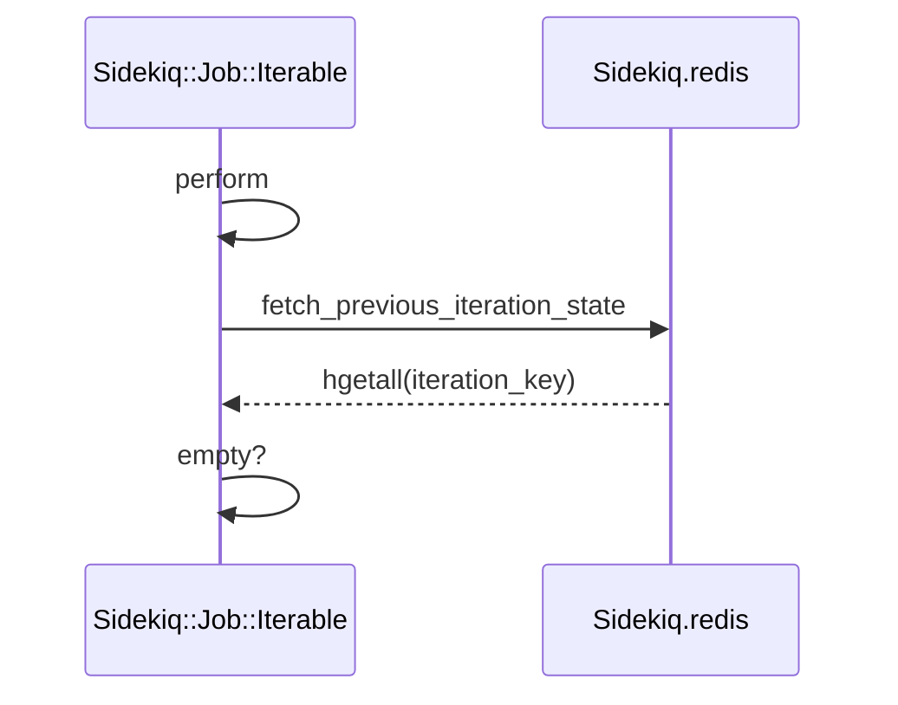
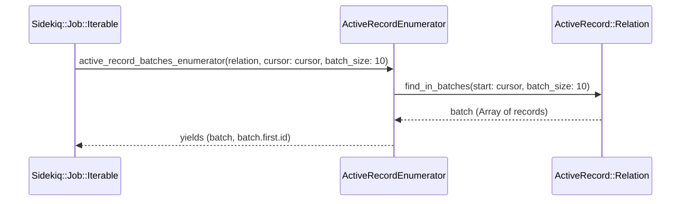
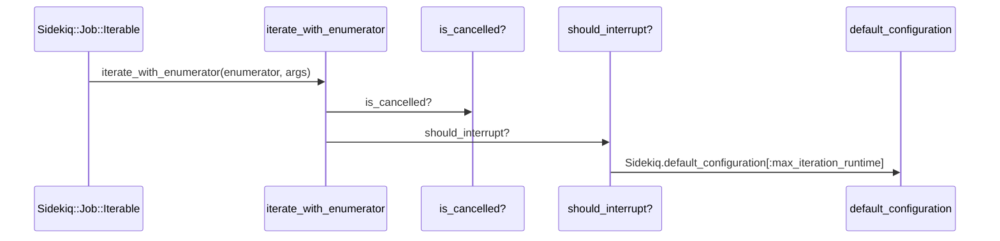
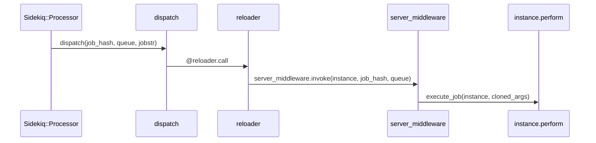

# Iterable Job Processing

Relevant source files

The following files were used as context for generating this wiki page:

- [lib/sidekiq/job/iterable.rb](https://github.com/sidekiq/sidekiq/blob/main/lib/sidekiq/job/iterable.rb)
- [lib/sidekiq/api.rb](https://github.com/sidekiq/sidekiq/blob/main/lib/sidekiq/api.rb)
- [lib/sidekiq/processor.rb](https://github.com/sidekiq/sidekiq/blob/main/lib/sidekiq/processor.rb)
- [lib/sidekiq/client.rb](https://github.com/sidekiq/sidekiq/blob/main/lib/sidekiq/client.rb)
- [lib/sidekiq/tui/tabs/set_tab.rb](https://github.com/sidekiq/sidekiq/blob/main/lib/sidekiq/tui/tabs/set_tab.rb)
- [lib/sidekiq/job.rb](https://github.com/sidekiq/sidekiq/blob/main/lib/sidekiq/job.rb)
- [lib/sidekiq/job/iterable/enumerators.rb](https://github.com/sidekiq/sidekiq/blob/main/lib/sidekiq/job/iterable/enumerators.rb)
- [lib/sidekiq/job/iterable/active_record_enumerator.rb](https://github.com/sidekiq/sidekiq/blob/main/lib/sidekiq/job/iterable/active_record_enumerator.rb)
- [myapp/app/jobs/post_updater.rb](https://github.com/sidekiq/sidekiq/blob/main/myapp/app/jobs/post_updater.rb)
- [myapp/app/jobs/post_creator.rb](https://github.com/sidekiq/sidekiq/blob/main/myapp/app/jobs/post_creator.rb)
- [lib/sidekiq/iterable_job.rb](https://github.com/sidekiq/sidekiq/blob/main/lib/sidekiq/iterable_job.rb)
- [docs/internals.md](https://github.com/sidekiq/sidekiq/blob/main/docs/internals.md)
- [docs/Pro-2.0-Upgrade.md](https://github.com/sidekiq/sidekiq/blob/main/docs/Pro-2.0-Upgrade.md)
- [lib/sidekiq/job/iterable/csv_enumerator.rb](https://github.com/sidekiq/sidekiq/blob/main/lib/sidekiq/job/iterable/csv_enumerator.rb)
- [lib/sidekiq/scheduled.rb](https://github.com/sidekiq/sidekiq/blob/main/lib/sidekiq/scheduled.rb)
- [lib/sidekiq/fetch.rb](https://github.com/sidekiq/sidekiq/blob/main/lib/sidekiq/fetch.rb)
- [lib/sidekiq/job/interrupt_handler.rb](https://github.com/sidekiq/sidekiq/blob/main/lib/sidekiq/job/interrupt_handler.rb)
- [lib/sidekiq/paginator.rb](https://github.com/sidekiq/sidekiq/blob/main/lib/sidekiq/paginator.rb)
- [README.md](https://github.com/sidekiq/sidekiq/blob/main/README.md)
- [myapp/app/sidekiq/hard_job.rb](https://github.com/sidekiq/sidekiq/blob/main/myapp/app/sidekiq/hard_job.rb)
- [lib/sidekiq.rb](https://github.com/sidekiq/sidekiq/blob/main/lib/sidekiq.rb)
- [lib/sidekiq/middleware/chain.rb](https://github.com/sidekiq/sidekiq/blob/main/lib/sidekiq/middleware/chain.rb)

## Overview

Iterable Job Processing provides a robust framework within Sidekiq for executing long-running, batch-oriented jobs by breaking large data sets into manageable, incremental iterations. By maintaining durable cursor state in Redis and supporting graceful interruptions, iterable jobs ensure that large data processing tasks can be safely paused, resumed, or terminated without data loss or duplication.

Sources: [lib/sidekiq/job/iterable.rb:38-76](https://github.com/sidekiq/sidekiq/blob/main/lib/sidekiq/job/iterable.rb#L38-L76), [lib/sidekiq/iterable_job.rb:5-32](https://github.com/sidekiq/sidekiq/blob/main/lib/sidekiq/iterable_job.rb#L5-L32)

## Iterable Job Module Integration

### Overview

The foundation of interruptible batch processing in Sidekiq is built through module composition via `Sidekiq::IterableJob` or direct inclusion of `Sidekiq::Job::Iterable`. When a class includes `Sidekiq::IterableJob`, it pulls in both `Sidekiq::Job` and `Sidekiq::Job::Iterable`, establishing standard asynchronous job capabilities alongside iteration mechanics.

Sources: [lib/sidekiq/iterable_job.rb:33-38](https://github.com/sidekiq/sidekiq/blob/main/lib/sidekiq/iterable_job.rb#L33-L38)

### Mixin Entry Points and Validation

Including `Sidekiq::Job::Iterable` triggers an `included` hook that extends the base class with `ClassMethods`. This module composition enforces strict structural rules on the job definition. Specifically, `ClassMethods#method_added` intercepts method definitions on the job class and raises a RuntimeError if the class defines a standard `#perform` method, reserving `#perform` exclusively for internal iteration orchestration.

Sources: [lib/sidekiq/job/iterable.rb:12-23](https://github.com/sidekiq/sidekiq/blob/main/lib/sidekiq/job/iterable.rb#L12-L23)

> [!WARNING]
> Defining a custom `#perform` method inside an iterable job class will immediately raise an error upon definition (`#{self} is an iterable job and must not define #perform`), because Sidekiq utilizes its own internal `perform` method to coordinate state fetching, enumerator validation, callbacks, and iteration loops.

Sources: [lib/sidekiq/job/iterable.rb:19-22](https://github.com/sidekiq/sidekiq/blob/main/lib/sidekiq/job/iterable.rb#L19-L22)

### Lifecycle Hooks and Callbacks

Iterable jobs expose several hook methods designed for overriding throughout the execution lifecycle. These hooks allow implementers to execute custom logic during initialization, iteration steps, resumes, stops, cancellations, and completions.

Sources: [lib/sidekiq/job/iterable.rb:77-113](https://github.com/sidekiq/sidekiq/blob/main/lib/sidekiq/job/iterable.rb#L77-L113)

| Hook Method | Invocation Timing | Typical Use Case |
| :--- | :--- | :--- |
| `on_start` | Called once when the job executes its very first iteration run (`@_executions == 1`). | Initialization tasks, startup logging, metric initialization. |
| `on_resume` | Called when the job starts subsequent executions after being previously interrupted and re-queued. | Re-establishing connections, resuming tracking metrics. |
| `around_iteration` | Wrapped around each individual invocation of `each_iteration`. Must yield control (`yield`). | Performance tracking, metric collection, individual item timing. |
| `on_stop` | Called whenever the job stops iterating, regardless of completion status. | Cleanup operations bound to execution boundary. |
| `on_cancel` | Called when the job detects a cancellation flag during iteration or startup checks. | Marking records as discarded, cancellation audit logging. |
| `on_complete` | Called once the entire enumerator finishes successfully without interruption. | Finalization tasks, success notifications. |

Sources: [lib/sidekiq/job/iterable.rb:77-112](https://github.com/sidekiq/sidekiq/blob/main/lib/sidekiq/job/iterable.rb#L77-L112), [lib/sidekiq/job/iterable.rb:156-170](https://github.com/sidekiq/sidekiq/blob/main/lib/sidekiq/job/iterable.rb#L156-L170)

### Module Composition Design Trade-Offs

The structural design choices embedded within the iterable job module composition balance flexibility with safety guarantees.

| Design Choice | Benefit | Cost |
| :--- | :--- | :--- |
| **Separating `#build_enumerator` and `#each_iteration`** | Decouples data cursor loading logic from item-level processing, keeping data traversal testable. | Requires developers to manage and return JSON-serializable cursor states explicitly. |
| **Intercepting `#perform` via `method_added`** | Prevents accidental overrides of Sidekiq's internal iteration dispatcher by developers. | Restricts class method definitions; metaprogramming that defines `#perform` dynamically can trigger false-positive errors. |
| **State persistence via Redis hashes (`it-JID`)** | Keeps cursor position, execution count, and runtime duration durable across job retry boundaries. | Introduces Redis round-trips every 5 seconds or upon interruption. |

Sources: [lib/sidekiq/job/iterable.rb:18-23](https://github.com/sidekiq/sidekiq/blob/main/lib/sidekiq/job/iterable.rb#L18-L23), [lib/sidekiq/job/iterable.rb:121-134](https://github.com/sidekiq/sidekiq/blob/main/lib/sidekiq/job/iterable.rb#L121-L134), [lib/sidekiq/job/iterable.rb:183-196](https://github.com/sidekiq/sidekiq/blob/main/lib/sidekiq/job/iterable.rb#L183-L196), [lib/sidekiq/job/iterable.rb:281-296](https://github.com/sidekiq/sidekiq/blob/main/lib/sidekiq/job/iterable.rb#L281-L296)

## Iteration Execution and Cursor State

### Overview

The execution loop and cursor state mechanics coordinate how iterable jobs process records in batches while maintaining durability across interruptions. When Sidekiq invokes an iterable job, it executes the internal `#perform` coordinator, which fetches previous execution state, validates the built enumerator, manages lifecycle hooks, and runs the item iteration loop.

Sources: [lib/sidekiq/job/iterable.rb:141-175](https://github.com/sidekiq/sidekiq/blob/main/lib/sidekiq/job/iterable.rb#L141-L175)

### Execution Walkthrough and Sequence

The execution pipeline flows through a precise sequence of internal methods when processing a batch job. 

1. `perform` — Initializes argument freezing, invokes state re-hydration, tracks execution count and start time, builds and validates the enumerator, triggers start or resume hooks, and drives the iteration loop.
Sources: [lib/sidekiq/job/iterable.rb:141-175](https://github.com/sidekiq/sidekiq/blob/main/lib/sidekiq/job/iterable.rb#L141-L175)

2. `fetch_previous_iteration_state` — Queries Redis for all fields stored under the job's `iteration_key` (`it-JID`), parsing previous execution counts, JSON-serialized cursors, and accumulated runtime durations unless the state hash is empty.
Sources: [lib/sidekiq/job/iterable.rb:183-191](https://github.com/sidekiq/sidekiq/blob/main/lib/sidekiq/job/iterable.rb#L183-L191)

3. `empty?` — Evaluates whether the retrieved Redis state hash contains any keys or values; if non-empty, re-hydrates `@_executions`, `@_cursor`, and `@_runtime`.
Sources: [lib/sidekiq/job/iterable.rb:186-190](https://github.com/sidekiq/sidekiq/blob/main/lib/sidekiq/job/iterable.rb#L186-L190), [lib/sidekiq/middleware/chain.rb:154-157](https://github.com/sidekiq/sidekiq/blob/main/lib/sidekiq/middleware/chain.rb#L154-L157)

Sources: [lib/sidekiq/job/iterable.rb:141-144](https://github.com/sidekiq/sidekiq/blob/main/lib/sidekiq/job/iterable.rb#L141-L144), [lib/sidekiq/job/iterable.rb:183-191](https://github.com/sidekiq/sidekiq/blob/main/lib/sidekiq/job/iterable.rb#L183-L191), [lib/sidekiq/middleware/chain.rb:154-157](https://github.com/sidekiq/sidekiq/blob/main/lib/sidekiq/middleware/chain.rb#L154-L157)

### Cursor Persistence and State Flushing

During iteration (`iterate_with_enumerator`), the loop tracks individual object items and updates `@_cursor` with the current cursor position. State persistence is governed by temporal and operational thresholds:

- **State Flush Interval:** State is persisted to Redis via `flush_state` at least every `STATE_FLUSH_INTERVAL` (5 seconds) or immediately whenever an interruption is flagged.
- **Redis Hash Fields:** The stored state hash records execution count (`ex`), JSON-dumped cursor state (`c`), and accumulated runtime (`rt`).
- **TTL Policies:** Keys are assigned an expiration TTL of `STATE_TTL` (one month, `30 * 24 * 60 * 60` seconds) using the `nx` option to preserve retry state.

Sources: [lib/sidekiq/job/iterable.rb:193-224](https://github.com/sidekiq/sidekiq/blob/main/lib/sidekiq/job/iterable.rb#L193-L224), [lib/sidekiq/job/iterable.rb:281-296](https://github.com/sidekiq/sidekiq/blob/main/lib/sidekiq/job/iterable.rb#L281-L296)

> [!NOTE]
> If `build_enumerator` returns `nil`, `#perform` logs an informational message (`'#build_enumerator' returned nil, skipping the job.`) and terminates immediately without raising an error or triggering completion hooks.

Sources: [lib/sidekiq/job/iterable.rb:149-152](https://github.com/sidekiq/sidekiq/blob/main/lib/sidekiq/job/iterable.rb#L149-L152)

## Built-In Collection Enumerator Adapters

### ActiveRecord Enumerator Adapters

The `Sidekiq::Job::Iterable::Enumerators` module provides methods to wrap `ActiveRecord::Relation` queries into enumerators that yield individual records, batches of records, or relation scopes. These adapters interface directly with `ActiveRecordEnumerator` to manage pagination and batching offsets using the `cursor` parameter.

- `active_record_records_enumerator(relation, cursor:, **options)` — Wraps a relation using `ActiveRecord::Relation#find_each`, yielding individual records one by one while advancing the cursor by record ID.
- `active_record_batches_enumerator(relation, cursor:, **options)` — Wraps a relation using `ActiveRecord::Relation#find_in_batches`, yielding arrays of records grouped by `batch_size`.
- `active_record_relations_enumerator(relation, cursor:, **options)` — Wraps a relation using `ActiveRecord::Relation#in_batches`, yielding sub-relations (`ActiveRecord::Relation`) for bulk operations like `update_all`.

Sources: [lib/sidekiq/job/iterable/enumerators.rb:27-92](https://github.com/sidekiq/sidekiq/blob/main/lib/sidekiq/job/iterable/enumerators.rb#L27-L92), [lib/sidekiq/job/iterable/active_record_enumerator.rb:14-42](https://github.com/sidekiq/sidekiq/blob/main/lib/sidekiq/job/iterable/active_record_enumerator.rb#L14-L42)

Sources: [lib/sidekiq/job/iterable/enumerators.rb:68-70](https://github.com/sidekiq/sidekiq/blob/main/lib/sidekiq/job/iterable/enumerators.rb#L68-L70), [lib/sidekiq/job/iterable/active_record_enumerator.rb:22-28](https://github.com/sidekiq/sidekiq/blob/main/lib/sidekiq/job/iterable/active_record_enumerator.rb#L22-L28)

### CSV and Array Collection Enumerators

For non-database sources, `Enumerators` provides array and CSV streaming support:

- `array_enumerator(array, cursor:)` — Validates that `array` is an instance of `Array`, drops elements up to `cursor` using `Enumerable#each_with_index`, and returns an enumerator with a size block.
- `csv_enumerator(csv, cursor:)` — Uses `CsvEnumerator#rows` to iterate over lazy CSV rows starting from the given integer offset.
- `csv_batches_enumerator(csv, cursor:, **options)` — Uses `CsvEnumerator#batches` to slice lazy CSV rows into batches of specified size (defaulting to 100).

Sources: [lib/sidekiq/job/iterable/enumerators.rb:10-25](https://github.com/sidekiq/sidekiq/blob/main/lib/sidekiq/job/iterable/enumerators.rb#L10-L25), [lib/sidekiq/job/iterable/enumerators.rb:94-131](https://github.com/sidekiq/sidekiq/blob/main/lib/sidekiq/job/iterable/enumerators.rb#L94-L131), [lib/sidekiq/job/iterable/csv_enumerator.rb:16-29](https://github.com/sidekiq/sidekiq/blob/main/lib/sidekiq/job/iterable/csv_enumerator.rb#L16-L29)

> [!WARNING]
> `CsvEnumerator` requires `defined?(CSV)` and that the passed `csv` argument is an exact instance of `CSV`; otherwise it raises an `ArgumentError`. Furthermore, row counting uses an external `wc -l` system process call on `@csv.path`, subtracting 1 if headers are present.

Sources: [lib/sidekiq/job/iterable/csv_enumerator.rb:8-12](https://github.com/sidekiq/sidekiq/blob/main/lib/sidekiq/job/iterable/csv_enumerator.rb#L8-L12), [lib/sidekiq/job/iterable/csv_enumerator.rb:33-43](https://github.com/sidekiq/sidekiq/blob/main/lib/sidekiq/job/iterable/csv_enumerator.rb#L33-L43)

### Enumerator Method Reference

| Method Name | Target Collection | Underlying Class / Method | Default Batch Size | Yield Signature |
| :--- | :--- | :--- | :--- | :--- |
| `array_enumerator` | `Array` | `Array#each_with_index` | N/A | `(element, index)` |
| `active_record_records_enumerator` | `ActiveRecord::Relation` | `ActiveRecordEnumerator#records` (`find_each`) | ActiveRecord default | `(record, record.id)` |
| `active_record_batches_enumerator` | `ActiveRecord::Relation` | `ActiveRecordEnumerator#batches` (`find_in_batches`) | ActiveRecord default | `(batch, batch.first.id)` |
| `active_record_relations_enumerator` | `ActiveRecord::Relation` | `ActiveRecordEnumerator#relations` (`in_batches`) | 1000 (via `relations_size`) | `(relation, first_record.id)` |
| `csv_enumerator` | `CSV` | `CsvEnumerator#rows` (`CSV#lazy`) | N/A | `(row, index)` |
| `csv_batches_enumerator` | `CSV` | `CsvEnumerator#batches` (`CSV#lazy.each_slice`) | 100 | `(batch_of_rows, index)` |

Sources: [lib/sidekiq/job/iterable/enumerators.rb:20-131](https://github.com/sidekiq/sidekiq/blob/main/lib/sidekiq/job/iterable/enumerators.rb#L20-L131), [lib/sidekiq/job/iterable/active_record_enumerator.rb:14-49](https://github.com/sidekiq/sidekiq/blob/main/lib/sidekiq/job/iterable/active_record_enumerator.rb#L14-L49), [lib/sidekiq/job/iterable/csv_enumerator.rb:16-43](https://github.com/sidekiq/sidekiq/blob/main/lib/sidekiq/job/iterable/csv_enumerator.rb#L16-L43)

## Interruption Detection and Job Cancellation

### Overview

Iterable jobs support checking cancellation flags, monitoring maximum runtime constraints, and handling graceful interruptions. When execution needs to be suspended—such as during server deployment or shutdown—the job flushes its current state and re-queues itself.

Sources: [lib/sidekiq/job/iterable.rb:214-226](https://github.com/sidekiq/sidekiq/blob/main/lib/sidekiq/job/iterable.rb#L214-L226), [lib/sidekiq/job/interrupt_handler.rb:8-15](https://github.com/sidekiq/sidekiq/blob/main/lib/sidekiq/job/interrupt_handler.rb#L8-L15)

### Interruption Call Chains

The execution and interruption validation flow follows a precise sequence of method calls during each iteration cycle.

1. `perform` initiates the execution flow in `lib/sidekiq/job/iterable.rb`.
Sources: [lib/sidekiq/job/iterable.rb:141-163](https://github.com/sidekiq/sidekiq/blob/main/lib/sidekiq/job/iterable.rb#L141-L163)

2. `iterate_with_enumerator` iterates over the collection.
Sources: [lib/sidekiq/job/iterable.rb:198-203](https://github.com/sidekiq/sidekiq/blob/main/lib/sidekiq/job/iterable.rb#L198-L203)

3. `is_cancelled?` queries Redis to check if the `cancelled` hash key is set for `iteration_key`.
Sources: [lib/sidekiq/job/iterable.rb:179-181](https://github.com/sidekiq/sidekiq/blob/main/lib/sidekiq/job/iterable.rb#L179-L181)

Additionally, runtime limits are evaluated through a separate check sequence:

1. `perform` starts the batch execution.
Sources: [lib/sidekiq/job/iterable.rb:141-163](https://github.com/sidekiq/sidekiq/blob/main/lib/sidekiq/job/iterable.rb#L141-L163)

2. `iterate_with_enumerator` evaluates interruption status on each cycle.
Sources: [lib/sidekiq/job/iterable.rb:214-214](https://github.com/sidekiq/sidekiq/blob/main/lib/sidekiq/job/iterable.rb#L214-L214)

3. `should_interrupt?` compares elapsed monotonic time against configuration limits.
Sources: [lib/sidekiq/job/iterable.rb:276-279](https://github.com/sidekiq/sidekiq/blob/main/lib/sidekiq/job/iterable.rb#L276-L279)

4. `default_configuration` supplies the `max_iteration_runtime` parameter from `Sidekiq.default_configuration`.
Sources: [lib/sidekiq/job/iterable.rb:277-277](https://github.com/sidekiq/sidekiq/blob/main/lib/sidekiq/job/iterable.rb#L277-L277), [lib/sidekiq.rb:97-99](https://github.com/sidekiq/sidekiq/blob/main/lib/sidekiq.rb#L97-L99)

Sources: [lib/sidekiq/job/iterable.rb:141-279](https://github.com/sidekiq/sidekiq/blob/main/lib/sidekiq/job/iterable.rb#L141-L279), [lib/sidekiq.rb:97-99](https://github.com/sidekiq/sidekiq/blob/main/lib/sidekiq.rb#L97-L99)

> [!NOTE]
> The `CANCELLATION_PERIOD` constant is defined as 3 days (`3 * 86_400` seconds) to ensure cancelled job flags persist in Redis long enough for delayed retries to catch and process the cancellation.
Sources: [lib/sidekiq/job/iterable.rb:47-50](https://github.com/sidekiq/sidekiq/blob/main/lib/sidekiq/job/iterable.rb#L47-L50)

### Interruption Handling and Middleware

When an iterable job encounters an interruption condition, it flushes its state and raises `Sidekiq::Job::Interrupted`. The server middleware `Sidekiq::Job::InterruptHandler` catches this exception, pushes the job hash back onto the client queue, and raises `Sidekiq::JobRetry::Skip` to prevent normal error handling from logging a failure.

Sources: [lib/sidekiq/job/iterable.rb:254-259](https://github.com/sidekiq/sidekiq/blob/main/lib/sidekiq/job/iterable.rb:254-259), [lib/sidekiq/job/interrupt_handler.rb:8-15](https://github.com/sidekiq/sidekiq/blob/main/lib/sidekiq/job/interrupt_handler.rb#L8-L15)

> [!WARNING]
> Do not rescue `Sidekiq::Shutdown` or `Sidekiq::Job::Interrupted` inside your custom job execution methods in a way that swallows the signal, as this breaks graceful termination and cursor checkpointing.
Sources: [lib/sidekiq.rb:157-157](https://github.com/sidekiq/sidekiq/blob/main/lib/sidekiq.rb#L157-L157)

## Processor Dispatch and Queue Lifecycle

### Processor Dispatch and Queue Lifecycle

Sidekiq processes jobs through standalone `Sidekiq::Processor` threads managed by `Sidekiq::Manager`. A processor retrieves work items from Redis via `Sidekiq::BasicFetch#retrieve_work`, which executes blocking queue pops (`brpop`) across prioritized or weighted queues.
Sources: [lib/sidekiq/processor.rb:10-13](https://github.com/sidekiq/sidekiq/blob/main/lib/sidekiq/processor.rb#L10-L13), [lib/sidekiq/fetch.rb:48-49](https://github.com/sidekiq/sidekiq/blob/main/lib/sidekiq/fetch.rb#L48-L49)

The job dispatch and execution call-chain follows a strict nested sequence:
1. `Processor#process` receives a `UnitOfWork` and loads the JSON payload into a `job_hash`.
Sources: [lib/sidekiq/processor.rb:167-174](https://github.com/sidekiq/sidekiq/blob/main/lib/sidekiq/processor.rb#L167-L174)
2. `Processor#dispatch` wraps execution inside `JobLogger#prepare`, `JobRetry#global`, `JobLogger#call`, `stats`, `profile`, and `reloader`.
Sources: [lib/sidekiq/processor.rb:137-146](https://github.com/sidekiq/sidekiq/blob/main/lib/sidekiq/processor.rb#L137-L146)
3. Within `reloader`, the worker class is constantized (`Object.const_get`), instantiated, assigned a `jid`, and passed to `JobRetry#local`.
Sources: [lib/sidekiq/processor.rb:147-151](https://github.com/sidekiq/sidekiq/blob/main/lib/sidekiq/processor.rb#L147-L151)
4. Server middleware is invoked via `config.server_middleware.invoke(instance, job_hash, queue)`.
Sources: [lib/sidekiq/processor.rb:192-194](https://github.com/sidekiq/sidekiq/blob/main/lib/sidekiq/processor.rb#L192-L194)
5. Finally, `Processor#execute_job` calls `instance.perform(*cloned_args)`.
Sources: [lib/sidekiq/processor.rb:227-229](https://github.com/sidekiq/sidekiq/blob/main/lib/sidekiq/processor.rb:227-229)

Sources: [lib/sidekiq/processor.rb:128-160](https://github.com/sidekiq/sidekiq/blob/main/lib/sidekiq/processor.rb#L128-L160), [lib/sidekiq/processor.rb:191-195](https://github.com/sidekiq/sidekiq/blob/main/lib/sidekiq/processor.rb#L191-L195)

Client-side enqueuing is handled by `Sidekiq::Client#push` and `Sidekiq::Client#push_bulk`, which normalize payloads, invoke client middleware, verify JSON serialization, and push items atomically using `Sidekiq::Client#atomic_push`.
Sources: [lib/sidekiq/client.rb:33-33](https://github.com/sidekiq/sidekiq/blob/main/lib/sidekiq/client.rb#L33-L33), [lib/sidekiq/client.rb:101-108](https://github.com/sidekiq/sidekiq/blob/main/lib/sidekiq/client.rb#L101-L108)

Scheduled and retry jobs are managed by `Sidekiq::Scheduled::Poller` and `Sidekiq::Scheduled::Enq`. The enqueuer evaluates sorted sets using Lua scripts (`LUA_ZPOPBYSCORE`) to atomically retrieve expired execution timestamps and push them back onto runtime queues via `Sidekiq::Client`.
Sources: [lib/sidekiq/scheduled.rb:10-41](https://github.com/sidekiq/sidekiq/blob/main/lib/sidekiq/scheduled.rb#L10-L41), [lib/sidekiq/scheduled.rb:71-71](https://github.com/sidekiq/sidekiq/blob/main/lib/sidekiq/scheduled.rb#L71-L71)

| Method / Component | Target Data Structure | Operation Type | Purpose |
| :--- | :--- | :--- | :--- |
| `Sidekiq::BasicFetch#retrieve_work` | List (`queue:name`) | Blocking Pop (`brpop`) | Retrieves next pending job unit from Redis queues. |
| `Sidekiq::Client#atomic_push` | List / ZSet | `lpush` / `zadd` | Pushes immediate jobs to list or scheduled jobs to sorted set. |
| `Sidekiq::Scheduled::Enq` | ZSet (`schedule`, `retry`) | Lua Script (`EVALSHA`) | Atomically pops due jobs from scheduled sets for re-enqueuing. |
| `Sidekiq::Processor#process` | ZSet (`dead`) | `zadd` / `zremrangebyscore` | Routes malformed JSON payloads directly to the dead set. |

Sources: [lib/sidekiq/fetch.rb:48-49](https://github.com/sidekiq/sidekiq/blob/main/lib/sidekiq/fetch.rb#L48-L49), [lib/sidekiq/client.rb:284-304](https://github.com/sidekiq/sidekiq/blob/main/lib/sidekiq/client.rb#L284-L304), [lib/sidekiq/scheduled.rb:13-41](https://github.com/sidekiq/sidekiq/blob/main/lib/sidekiq/scheduled.rb#L13-L41), [lib/sidekiq/processor.rb:173-186](https://github.com/sidekiq/sidekiq/blob/main/lib/sidekiq/processor.rb#L173-L186)

| Design Choice | Benefit | Cost |
| :--- | :--- | :--- |
| **Standalone Thread-per-Processor** | Simple concurrency model; isolates job execution context. | Higher memory footprint and thread-pool scheduling overhead in Ruby. |
| **Lua-Based ZPOP via Scheduled Enq** | Guarantees atomicity when migrating due jobs from scheduled sets to queues. | Requires Lua script compilation/caching via `SCRIPT LOAD` and `EVALSHA`. |
| **Immutable String JSON Passing in Dispatch** | Avoids redundant deep-cloning of job hashes during middleware and retry tracking. | Requires re-parsing JSON if untouched raw payloads are needed downstream. |

Sources: [lib/sidekiq/processor.rb:10-13](https://github.com/sidekiq/sidekiq/blob/main/lib/sidekiq/processor.rb#L10-L13), [lib/sidekiq/processor.rb:128-136](https://github.com/sidekiq/sidekiq/blob/main/lib/sidekiq/processor.rb#L128-L136), [lib/sidekiq/scheduled.rb:13-64](https://github.com/sidekiq/sidekiq/blob/main/lib/sidekiq/scheduled.rb:13-64)

> [!WARNING]
> If a job payload contains malformed JSON, `Sidekiq::Processor#process` bypasses middleware and standard retry handling entirely, adding the raw string directly to the `dead` sorted set and acknowledging the work unit.
Sources: [lib/sidekiq/processor.rb:172-186](https://github.com/sidekiq/sidekiq/blob/main/lib/sidekiq/processor.rb#L172-L186)

> [!NOTE]
> Thread-local variable `Thread.current[:sidekiq_capsule]` is configured inside `Processor#run` so that any subsequent `Sidekiq.redis` calls correctly reference the capsule's dedicated connection pool rather than the global pool.
Sources: [lib/sidekiq/processor.rb:73-77](https://github.com/sidekiq/sidekiq/blob/main/lib/sidekiq/processor.rb#L73-L77)

## Related

- [[Data Collection Enumerators]]
- [[Job Definition]]

