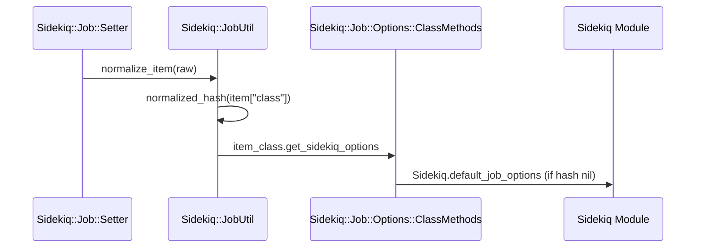
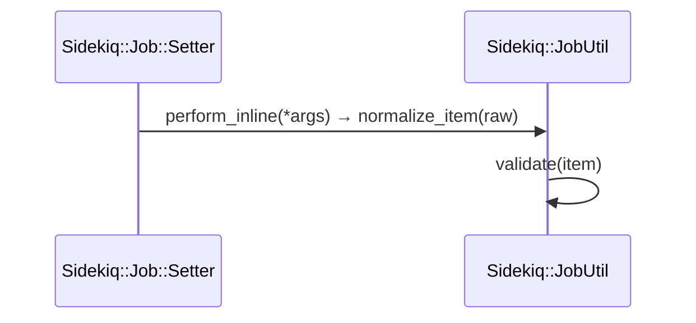
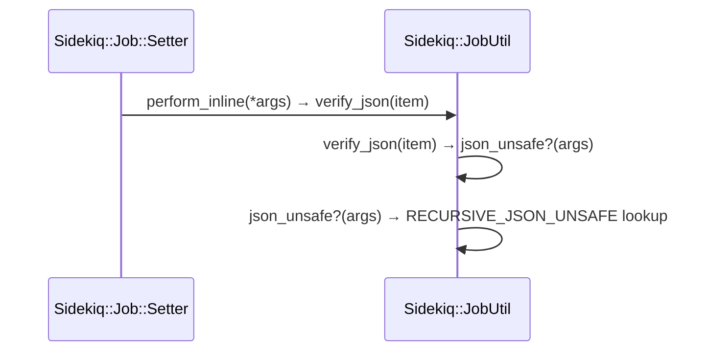

# Job Definition

<details>
<summary>Relevant source files</summary>

The following files were used as context for generating this wiki page:

- [lib/sidekiq/job.rb](https://github.com/sidekiq/sidekiq/blob/main/lib/sidekiq/job.rb)
- [lib/sidekiq/cli.rb](https://github.com/sidekiq/sidekiq/blob/main/lib/sidekiq/cli.rb)
- [lib/sidekiq/api.rb](https://github.com/sidekiq/sidekiq/blob/main/lib/sidekiq/api.rb)
- [lib/sidekiq/client.rb](https://github.com/sidekiq/sidekiq/blob/main/lib/sidekiq/client.rb)
- [lib/active_job/queue_adapters/sidekiq_adapter.rb](https://github.com/sidekiq/sidekiq/blob/main/lib/active_job/queue_adapters/sidekiq_adapter.rb)
- [lib/sidekiq/processor.rb](https://github.com/sidekiq/sidekiq/blob/main/lib/sidekiq/processor.rb)
- [lib/sidekiq/job_retry.rb](https://github.com/sidekiq/sidekiq/blob/main/lib/sidekiq/job_retry.rb)
- [lib/sidekiq/job_util.rb](https://github.com/sidekiq/sidekiq/blob/main/lib/sidekiq/job_util.rb)
- [docs/5.0-Upgrade.md](https://github.com/sidekiq/sidekiq/blob/main/docs/5.0-Upgrade.md)
- [myapp/config/initializers/sidekiq.rb](https://github.com/sidekiq/sidekiq/blob/main/myapp/config/initializers/sidekiq.rb)
- [lib/sidekiq/rails.rb](https://github.com/sidekiq/sidekiq/blob/main/lib/sidekiq/rails.rb)
- [lib/sidekiq/config.rb](https://github.com/sidekiq/sidekiq/blob/main/lib/sidekiq/config.rb)
- [lib/sidekiq/redis_client_adapter.rb](https://github.com/sidekiq/sidekiq/blob/main/lib/sidekiq/redis_client_adapter.rb)
- [lib/sidekiq/worker_compatibility_alias.rb](https://github.com/sidekiq/sidekiq/blob/main/lib/sidekiq/worker_compatibility_alias.rb)
- [lib/sidekiq.rb](https://github.com/sidekiq/sidekiq/blob/main/lib/sidekiq.rb)
- [myapp/app/jobs/some_job.rb](https://github.com/sidekiq/sidekiq/blob/main/myapp/app/jobs/some_job.rb)
- [myapp/app/sidekiq/lazy_job.rb](https://github.com/sidekiq/sidekiq/blob/main/myapp/app/sidekiq/lazy_job.rb)
- [myapp/app/sidekiq/hard_job.rb](https://github.com/sidekiq/sidekiq/blob/main/myapp/app/sidekiq/hard_job.rb)
- [myapp/app/jobs/application_job.rb](https://github.com/sidekiq/sidekiq/blob/main/myapp/app/jobs/application_job.rb)
- [bare/boot.rb](https://github.com/sidekiq/sidekiq/blob/main/bare/boot.rb)
- [docs/7.0-Upgrade.md](https://github.com/sidekiq/sidekiq/blob/main/docs/7.0-Upgrade.md)
- [docs/Pro-2.0-Upgrade.md](https://github.com/sidekiq/sidekiq/blob/main/docs/Pro-2.0-Upgrade.md)
</details>

## Overview

Job definition in Sidekiq serves as the primary abstraction for authoring, configuring, and enqueuing asynchronous background tasks. By including the `Sidekiq::Job` module into a Ruby class and implementing a `perform` instance method, application code can easily trigger asynchronous execution via class methods such as `perform_async` and `perform_in`. This component bridges application-level task declarations with Sidekiq's client-side and server-side infrastructure, managing option resolution, payload normalization, argument validation, and execution lifecycles while maintaining seamless compatibility with ActiveJob adapters and legacy worker conventions. Sources: [lib/sidekiq/job.rb:7-44](https://github.com/sidekiq/sidekiq/blob/main/lib/sidekiq/job.rb#L7-L44), [lib/sidekiq/worker_compatibility_alias.rb:1-13](https://github.com/sidekiq/sidekiq/blob/main/lib/sidekiq/worker_compatibility_alias.rb#L1-L13)

## Defining Jobs with Sidekiq Job

### Overview

Defining background jobs in Sidekiq revolves around the `Sidekiq::Job` module, which is included into standard Ruby classes to furnish both class-level enqueuing methods and instance-level runtime helpers. When a class includes `Sidekiq::Job`, it gains access to option declarations via `sidekiq_options`, queue assignment shortcuts like `queue_as`, and execution hooks such as `logger` and `interrupted?`. The module explicitly prohibits inclusion in classes that inherit from `ActiveJob::Base`, raising an `ArgumentError` to prevent mixing incompatible job models. Sources: [lib/sidekiq/job.rb:10-17](https://github.com/sidekiq/sidekiq/blob/main/lib/sidekiq/job.rb#L10-L17), [lib/sidekiq/job.rb:165-170](https://github.com/sidekiq/sidekiq/blob/main/lib/sidekiq/job.rb#L165-L170)

```ruby
class HardJob
  include Sidekiq::Job

  sidekiq_options backtrace: 5

  def perform(name, count, salt)
    raise name if name == "crash"
    logger.info Time.now
    sleep count
  end
end
```
Sources: [myapp/app/sidekiq/hard_job.rb:1-11](https://github.com/sidekiq/sidekiq/blob/main/myapp/app/sidekiq/hard_job.rb#L1-L11)

### Client Methods and Enqueuing Execution Walkthrough

The `Sidekiq::Job` module provides a comprehensive suite of class methods to dispatch jobs to Redis synchronously, asynchronously, or with precise timing constraints. When an application calls an enqueuing method, the execution flows through a structured call chain managed by `Sidekiq::Job::Setter` and class-level helpers.

For asynchronous enqueuing, the call-chain execution proceeds as follows: `SomeJob.perform_async(*args)` invokes `Setter.new(self, {}).perform_async(*args)` → checks if `@opts["sync"] == true` (executing `perform_inline` if true) → otherwise calls `@klass.client_push(@opts.merge("args" => args, "class" => @klass))` → `client_push` checks that the item contains no Ruby symbols, extracts any thread-local pool configuration, and invokes `build_client.push(item)`. Sources: [lib/sidekiq/job.rb:205-211](https://github.com/sidekiq/sidekiq/blob/main/lib/sidekiq/job.rb#L205-L211), [lib/sidekiq/job.rb:298-300](https://github.com/sidekiq/sidekiq/blob/main/lib/sidekiq/job.rb#L298-L300), [lib/sidekiq/job.rb:378-391](https://github.com/sidekiq/sidekiq/blob/main/lib/sidekiq/job.rb#L378-L391)

Scheduled jobs follow a similar path: `SomeJob.perform_in(interval, *args)` calculates the target timestamp `ts` (treating intervals under `1_000_000_000` as seconds from now and larger values as absolute epochs), sets `item["at"] = ts` if `ts > now`, and passes the payload to `client_push(item)`. Sources: [lib/sidekiq/job.rb:347-359](https://github.com/sidekiq/sidekiq/blob/main/lib/sidekiq/job.rb#L347-L359)

> [!NOTE]
> When `perform_in` or `perform_at` evaluates an interval, any value less than `1_000_000_000` is treated as an offset relative to `Time.now.to_f`, whereas larger numbers are interpreted as absolute Unix timestamps. If the computed timestamp does not exceed the current time, the `"at"` key is omitted entirely to trigger immediate enqueuing. Sources: [lib/sidekiq/job.rb:348-356](https://github.com/sidekiq/sidekiq/blob/main/lib/sidekiq/job.rb#L348-L356)

### Job Class Methods Reference

The `Sidekiq::Job::ClassMethods` module defines the interface exposed on job classes for configuration, batch enqueuing, and inline execution.

| Method Signature | Description |
| :--- | :--- |
| `sidekiq_options(opts = {})` | Configures job options such as `queue`, `retry`, `backtrace`, and `pool`. |
| `queue_as(q)` | ActiveJob-compatible helper that sets the job queue string. |
| `set(options)` | Returns a `Setter` instance to configure transient options (e.g., `wait`, `queue`, `sync`) for a single dispatch. |
| `perform_async(*args)` | Dispatches the job asynchronously to the Redis queue. |
| `perform_in(interval, *args)` (alias `perform_at`) | Schedules the job for future execution at a given interval or timestamp. |
| `perform_bulk(args, **options)` | Pushes a batch of job payloads to Redis in chunks of up to 1,000 to minimize round trips. |
| `perform_inline(*args)` (alias `perform_sync`) | Executes the job immediately within the current process after running client and server middleware. |
| `delay`, `delay_for`, `delay_until` | Explicitly disabled methods that raise an `ArgumentError` directing users to use `perform_async`, `perform_in`, or `perform_at`. |

Sources: [lib/sidekiq/job.rb:278-398](https://github.com/sidekiq/sidekiq/blob/main/lib/sidekiq/job.rb#L278-L398)

## Configuring Default and Class Options

### Overview

Configuring options for jobs involves defining queue assignments, retry behaviors, and error handling strategies across environments. Sidekiq allows both global defaults and class-level option overrides through `sidekiq_options`, `queue_as`, and configuration blocks. Sources: [lib/sidekiq/job.rb:60-78](https://github.com/sidekiq/sidekiq/blob/main/lib/sidekiq/job.rb#L60-L78), [lib/sidekiq/job.rb:290-292](https://github.com/sidekiq/sidekiq/blob/main/lib/sidekiq/job.rb#L290-L292)

### Default Job Options and Configuration Resolution

Global defaults are maintained by `Sidekiq.default_job_options`, which initializes every job with `"retry" => true` and `"queue" => "default"`. When a job class defines custom options via `sidekiq_options`, keys are stringified across two levels, and merged with existing class or global options. Sources: [lib/sidekiq/job.rb:71-78](https://github.com/sidekiq/sidekiq/blob/main/lib/sidekiq/job.rb#L71-L78), [lib/sidekiq.rb:93-95](https://github.com/sidekiq/sidekiq/blob/main/lib/sidekiq.rb#L93-L95)

To resolve configuration during execution or enqueuing, Sidekiq evaluates options through a deterministic call-chain sequence:

1. `perform_inline` initiates the inline dispatch process by building the raw hash payload and passing it to normalization. Sources: [lib/sidekiq/job.rb:216-219](https://github.com/sidekiq/sidekiq/blob/main/lib/sidekiq/job.rb#L216-L219)
2. `normalize_item` receives the raw hash, validates its structure, and calls `normalized_hash(item["class"])` to fetch class-level options. Sources: [lib/sidekiq/job_util.rb:43-48](https://github.com/sidekiq/sidekiq/blob/main/lib/sidekiq/job_util.rb#L43-L48)
3. `normalized_hash` checks if the item class is a `Class`, verifies that it responds to `get_sidekiq_options`, and invokes `item_class.get_sidekiq_options`. If the class is passed as a string instead, it falls back directly to `Sidekiq.default_job_options`. Sources: [lib/sidekiq/job_util.rb:69-76](https://github.com/sidekiq/sidekiq/blob/main/lib/sidekiq/job_util.rb#L69-L76)
4. `get_sidekiq_options` checks whether `self.sidekiq_options_hash` is defined; if not, it defaults to `Sidekiq.default_job_options`. Sources: [lib/sidekiq/job.rb:88-90](https://github.com/sidekiq/sidekiq/blob/main/lib/sidekiq/job.rb#L88-L90)
5. `default_job_options` returns the foundational hash containing `"retry" => true` and `"queue" => "default"`. Sources: [lib/sidekiq.rb:93-95](https://github.com/sidekiq/sidekiq/blob/main/lib/sidekiq.rb#L93-L95)


Sources: [lib/sidekiq/job.rb:88-90](https://github.com/sidekiq/sidekiq/blob/main/lib/sidekiq/job.rb#L88-L90), [lib/sidekiq/job.rb:218-219](https://github.com/sidekiq/sidekiq/blob/main/lib/sidekiq/job.rb#L218-L219), [lib/sidekiq/job_util.rb:43-48](https://github.com/sidekiq/sidekiq/blob/main/lib/sidekiq/job_util.rb#L43-L48), [lib/sidekiq/job_util.rb:69-76](https://github.com/sidekiq/sidekiq/blob/main/lib/sidekiq/job_util.rb#L69-L76), [lib/sidekiq.rb:93-95](https://github.com/sidekiq/sidekiq/blob/main/lib/sidekiq.rb#L93-L95)

> [!IMPORTANT]
> When calling `normalized_hash`, passing a class name as a `String` rather than a `Class` object bypasses `get_sidekiq_options` and forces a fallback to `Sidekiq.default_job_options`. Ensure job classes are referenced directly when custom options must be preserved during normalization. Sources: [lib/sidekiq/job_util.rb:69-76](https://github.com/sidekiq/sidekiq/blob/main/lib/sidekiq/job_util.rb#L69-L76)

### Legal Job Options Reference

The `sidekiq_options` helper accepts arbitrary configuration keys, but recognizes specific core options governing execution routing, persistence, and error recovery.

| Option Key | Type | Default Value | Purpose |
| :--- | :--- | :--- | :--- |
| `queue` | String | `"default"` | Specifies the target named queue for the job type. |
| `retry` | Boolean or Integer | `true` | Enables retries upon execution error, or sets a specific maximum retry count. |
| `backtrace` | Boolean or Integer | `false` | Controls whether error backtraces are saved in the retry payload for display in the web UI. |
| `pool` | Symbol or String | `nil` | Directs job pushes to a specific Redis connection pool or shard. |

Sources: [lib/sidekiq/job.rb:63-68](https://github.com/sidekiq/sidekiq/blob/main/lib/sidekiq/job.rb#L63-L68), [lib/sidekiq/job.rb:365-371](https://github.com/sidekiq/sidekiq/blob/main/lib/sidekiq/job.rb#L365-L371), [lib/sidekiq.rb:93-95](https://github.com/sidekiq/sidekiq/blob/main/lib/sidekiq.rb#L93-L95)

## Argument Normalization and Validation

### Call-Chain Execution Walkthrough

When a job is enqueued or dispatched inline via `perform_inline`, Sidekiq validates the payload and normalizes its internal properties through a precise sequence of utility methods:

1. `perform_inline` initiates the sequence by gathering the job arguments and class, packaging them into a raw hash, and passing it directly to `normalize_item`. Sources: [lib/sidekiq/job.rb:216-219](https://github.com/sidekiq/sidekiq/blob/main/lib/sidekiq/job.rb#L216-L219)
2. `normalize_item` immediately delegates to `validate(item)` to ensure the payload structure conforms to required specifications before merging defaults or assigning identifiers. Sources: [lib/sidekiq/job_util.rb:43-44](https://github.com/sidekiq/sidekiq/blob/main/lib/sidekiq/job_util.rb#L43-L44)
3. `validate(item)` enforces strict type checks on keys, arguments, classes, and options, raising an `ArgumentError` if any invariant is violated. Sources: [lib/sidekiq/job_util.rb:12-19](https://github.com/sidekiq/sidekiq/blob/main/lib/sidekiq/job_util.rb#L12-L19)


Sources: [lib/sidekiq/job.rb:216-219](https://github.com/sidekiq/sidekiq/blob/main/lib/sidekiq/job.rb#L216-L219), [lib/sidekiq/job_util.rb:12-19](https://github.com/sidekiq/sidekiq/blob/main/lib/sidekiq/job_util.rb#L12-L19), [lib/sidekiq/job_util.rb:43-44](https://github.com/sidekiq/sidekiq/blob/main/lib/sidekiq/job_util.rb#L43-L44)

> [!CAUTION]
> Bypassing `normalize_item` during custom client implementations can result in unvalidated payloads entering Redis, causing worker crashes during deserialization. Always ensure payloads pass through `validate` via `normalize_item`. Sources: [lib/sidekiq/job_util.rb:12-19](https://github.com/sidekiq/sidekiq/blob/main/lib/sidekiq/job_util.rb#L12-L19), [lib/sidekiq/job_util.rb:43-44](https://github.com/sidekiq/sidekiq/blob/main/lib/sidekiq/job_util.rb#L43-L44)

### Validation Rules and Constraints

The `validate` method enforces strict structural constraints on every job item before it is accepted for queue insertion. The criteria checked during validation are summarized below.

| Validation Check | Target Key | Required Type / Condition | Exception Message |
| :--- | :--- | :--- | :--- |
| Hash and Keys | Root Item | Must be a `Hash` containing both `"class"` and `"args"` keys | `"Job must be a Hash with 'class' and 'args' keys: ..."` |
| Arguments Type | `"args"` | Must be an `Array` or `Enumerator::Lazy` | `"Job args must be an Array: ..."` |
| Class Type | `"class"` | Must be a `Class` or a `String` representation | `"Job class must be either a Class or String representation of the class name: ..."` |
| Timestamp Type | `"at"` | Must be a `Numeric` value if present | `"Job 'at' must be a Numeric timestamp: ..."` |
| Tags Type | `"tags"` | Must be an `Array` if present | `"Job tags must be an Array: ..."` |
| Retry Duration | `"retry_for"` | Must not exceed `1_000_000_000` seconds if present | `"retry_for must be a relative amount of time, e.g. 48.hours ..."` |

Sources: [lib/sidekiq/job_util.rb:12-19](https://github.com/sidekiq/sidekiq/blob/main/lib/sidekiq/job_util.rb#L12-L19)

## JSON Serialization and Safety Checks

### Call-Chain Execution Walkthrough

When validating payload safety during execution or dispatch, Sidekiq traverses a specific method call chain to inspect complex arguments and enforce JSON compatibility:

1. `perform_inline` triggers payload preparation and invokes `verify_json(item)` to check argument types against supported native JSON serialization standards. Sources: [lib/sidekiq/job.rb:216-230](https://github.com/sidekiq/sidekiq/blob/main/lib/sidekiq/job.rb#L216-L230)
2. `verify_json` reads the current configuration mode for complex arguments (`:on_complex_arguments`), passing the job arguments to `json_unsafe?(args)` when strict validation is enabled. Sources: [lib/sidekiq/job_util.rb:21-41](https://github.com/sidekiq/sidekiq/blob/main/lib/sidekiq/job_util.rb#L21-L41)
3. `json_unsafe?` dispatches execution through the `RECURSIVE_JSON_UNSAFE` identity-compared handler map, recursively evaluating nested arrays, hashes, and scalar types to detect non-native data types. Sources: [lib/sidekiq/job_util.rb:108-111](https://github.com/sidekiq/sidekiq/blob/main/lib/sidekiq/job_util.rb#L108-L111)


Sources: [lib/sidekiq/job.rb:216-230](https://github.com/sidekiq/sidekiq/blob/main/lib/sidekiq/job.rb#L216-L230), [lib/sidekiq/job_util.rb:21-41](https://github.com/sidekiq/sidekiq/blob/main/lib/sidekiq/job_util.rb#L21-L41), [lib/sidekiq/job_util.rb:108-111](https://github.com/sidekiq/sidekiq/blob/main/lib/sidekiq/job_util.rb#L108-L111)

> [!WARNING]
> Passing complex Ruby objects (such as ActiveRecord models or non-string hash keys) inside `args` will trigger an `ArgumentError` under strict argument validation rules. Always pass native JSON types or configure `Sidekiq.strict_args!(false)` in your initializer to bypass strict checks. Sources: [lib/sidekiq/job_util.rb:26-40](https://github.com/sidekiq/sidekiq/blob/main/lib/sidekiq/job_util.rb#L26-L40)

### JSON Safety Handlers Reference

The `RECURSIVE_JSON_UNSAFE` constant defines identity-mapped lambda handlers for inspecting argument types recursively during `json_unsafe?` evaluations.

| Argument Type | Handler Behavior | Return Value |
| :--- | :--- | :--- |
| `Integer`, `Float`, `TrueClass`, `FalseClass`, `NilClass`, `String` | No-op validation block | `nil` (Safe) |
| `Array` | Iterates over elements, recursively checking item classes | First unsafe object found, or `nil` |
| `Hash` | Validates that keys are strings (`String === k`) and recursively checks values | Unsafe key or nested unsafe item, or `nil` |
| Default / Other Types | Fallback handler | Returns the raw unsupported object |

Sources: [lib/sidekiq/job_util.rb:80-107](https://github.com/sidekiq/sidekiq/blob/main/lib/sidekiq/job_util.rb#L80-L107)

### Design Trade-Offs in Argument Validation

| Design Choice | Benefit | Cost |
| :--- | :--- | :--- |
| **Strict argument checking via identity-mapped hashes (`compare_by_identity`)** | Extremely fast type lookups without string coercion overhead during recursive traversals. | Requires predefined handling blocks for core Ruby classes; custom types fall back to unsafe identification. |
| **Configurable enforcement modes (`:raise`, `:warn`)** | Allows applications to transition gradually or disable strict checks entirely via `Sidekiq.strict_args!`. | Potential runtime serialization failures if warnings are ignored and invalid payloads reach Redis. |

Sources: [lib/sidekiq/job_util.rb:24-40](https://github.com/sidekiq/sidekiq/blob/main/lib/sidekiq/job_util.rb#L24-L40), [lib/sidekiq/job_util.rb:105-107](https://github.com/sidekiq/sidekiq/blob/main/lib/sidekiq/job_util.rb#L105-L107)

## Legacy Worker Compatibility and Migration

### Overview

Sidekiq provides compatibility aliases and upgrade pathways to support legacy job classes written with older mixins as applications transition across major versions. Specifically, `Sidekiq::Job` serves as the modern replacement for `Sidekiq::Worker`, which remains available as a compatibility alias. Sources: [lib/sidekiq/worker_compatibility_alias.rb:3-13](https://github.com/sidekiq/sidekiq/blob/main/lib/sidekiq/worker_compatibility_alias.rb#L3-L13)

### Worker-to-Job Migration and Compatibility

As of Sidekiq 6.3.0, `Sidekiq::Job` was introduced as a new alias for `Sidekiq::Worker` to reduce naming confusion between Sidekiq execution threads, OS-level processes, and job classes. Developers are encouraged to use `include Sidekiq::Job` rather than `include Sidekiq::Worker` in new job definitions. Sources: [lib/sidekiq/worker_compatibility_alias.rb:3-13](https://github.com/sidekiq/sidekiq/blob/main/lib/sidekiq/worker_compatibility_alias.rb#L3-L13)

```ruby
# Legacy style (pre-6.3.0)
class LegacyJob
  include Sidekiq::Worker
end

# Modern style (6.3.0+)
class ModernJob
  include Sidekiq::Job
end
```
Sources: [lib/sidekiq/worker_compatibility_alias.rb:3-13](https://github.com/sidekiq/sidekiq/blob/main/lib/sidekiq/worker_compatibility_alias.rb#L3-L13)

> [!WARNING]
> While `Sidekiq::Worker` remains available as an alias pointing directly to `Sidekiq::Job`, new applications and refactored codebases should adopt `Sidekiq::Job` to align with modern ActiveJob naming conventions where classes extend application job base classes. Sources: [lib/sidekiq/worker_compatibility_alias.rb:3-13](https://github.com/sidekiq/sidekiq/blob/main/lib/sidekiq/worker_compatibility_alias.rb#L3-L13)

### Major Version Upgrades

When upgrading Sidekiq across major boundaries, you must upgrade one major version at a time to ensure proper deprecation handling and migration execution. Sources: [docs/5.0-Upgrade.md:43-56](https://github.com/sidekiq/sidekiq/blob/main/docs/5.0-Upgrade.md#L43-L56), [docs/7.0-Upgrade.md:91-104](https://github.com/sidekiq/sidekiq/blob/main/docs/7.0-Upgrade.md#L91-L104)

| Upgrade Path | Intermediate Pin | Final Pin / Target | Required Prerequisites & Notes |
| :--- | :--- | :--- | :--- |
| **Sidekiq 4.x to 5.x** | `gem 'sidekiq', '< 5'` | `gem 'sidekiq', '< 6'` | Upgrade to latest 4.x, resolve deprecations, require Ruby 2.2.2+ and Rails 5.0+ (Rails 3.2 dropped). |
| **Sidekiq 6.x to 7.x** | `gem 'sidekiq', '< 7'` | `gem 'sidekiq', '< 8'` | Upgrade to latest 6.x, resolve deprecations, require Ruby 2.7+, Redis 6.2+, and `redis-client`. |

Sources: [docs/5.0-Upgrade.md:40-56](https://github.com/sidekiq/sidekiq/blob/main/docs/5.0-Upgrade.md#L40-L56), [docs/7.0-Upgrade.md:82-104](https://github.com/sidekiq/sidekiq/blob/main/docs/7.0-Upgrade.md#L82-L104)

## ActiveJob Integration and Queue Adapters

### Overview

Sidekiq provides native integration for Ruby on Rails through the `SidekiqAdapter` class, allowing applications using `ActiveJob` to seamlessly dispatch jobs through Sidekiq's engine without altering standard job definitions. Sources: [lib/active_job/queue_adapters/sidekiq_adapter.rb:41-47](https://github.com/sidekiq/sidekiq/blob/main/lib/active_job/queue_adapters/sidekiq_adapter.rb#L41-L47)

### Queue Adapter Integration and Flow

To configure Sidekiq as the backend execution engine for ActiveJob, applications define the queue adapter configuration inside the Rails initialization flow:

```ruby
Rails.application.config.active_job.queue_adapter = :sidekiq
```
Sources: [lib/active_job/queue_adapters/sidekiq_adapter.rb:43-45](https://github.com/sidekiq/sidekiq/blob/main/lib/active_job/queue_adapters/sidekiq_adapter.rb#L43-L45)

When an ActiveJob instance is enqueued or executed, the framework routes payload handling through wrapper abstractions and execution callbacks:

1. `Sidekiq::ActiveJob::SidekiqAdapter#enqueue(job)` or `enqueue_at(job, timestamp)` initializes options wrapping the job class and target queue name. Sources: [lib/active_job/queue_adapters/sidekiq_adapter.rb:63-79](https://github.com/sidekiq/sidekiq/blob/main/lib/active_job/queue_adapters/sidekiq_adapter.rb#L63-L79)
2. `Sidekiq::ActiveJob::Wrapper.set(options)` configures the underlying Sidekiq worker payload and triggers `perform_async` or `perform_at` with `job.serialize`. Sources: [lib/active_job/queue_adapters/sidekiq_adapter.rb:69-78](https://github.com/sidekiq/sidekiq/blob/main/lib/active_job/queue_adapters/sidekiq_adapter.rb#L69-L78)
3. `Sidekiq::ActiveJob::Wrapper#perform(job_data)` receives the serialized hash on the server processor thread. Sources: [lib/active_job/queue_adapters/sidekiq_adapter.rb:10-16](https://github.com/sidekiq/sidekiq/blob/main/lib/active_job/queue_adapters/sidekiq_adapter.rb#L10-L16)
4. `::ActiveJob::Base.execute(job_data.merge("provider_job_id" => jid))` unpacks the arguments and executes the job instance while injecting the Sidekiq `jid` as the `provider_job_id`. Sources: [lib/active_job/queue_adapters/sidekiq_adapter.rb:13-15](https://github.com/sidekiq/sidekiq/blob/main/lib/active_job/queue_adapters/sidekiq_adapter.rb#L13-L15)

> [!NOTE]
> By including `Sidekiq::Job::Options`, ActiveJob classes can directly control Sidekiq-specific features via the `sidekiq_options` class method—such as bypassing ActiveJob's internal retry mechanism in favor of Sidekiq's robust retry subsystem. Sources: [lib/active_job/queue_adapters/sidekiq_adapter.rb:20-33](https://github.com/sidekiq/sidekiq/blob/main/lib/active_job/queue_adapters/sidekiq_adapter.rb#L20-L33)

### Adapter Methods and Aliases

| Method / Constant | Scope | Purpose / Description |
| :--- | :--- | :--- |
| `enqueue(job)` | Instance Method | Serializes and pushes an immediate ActiveJob instance to Redis via `Sidekiq::ActiveJob::Wrapper`. |
| `enqueue_at(job, timestamp)` | Instance Method | Pushes a scheduled ActiveJob instance to Redis for execution at a specified timestamp. |
| `enqueue_all(jobs)` | Instance Method | Batch-partitions and pushes multiple ActiveJob instances using `Sidekiq::Client.push_bulk`. |
| `JobWrapper` | Constant Alias | References `Sidekiq::ActiveJob::Wrapper` for backwards compatibility with enqueued Active Job payloads. |

Sources: [lib/active_job/queue_adapters/sidekiq_adapter.rb:63-119](https://github.com/sidekiq/sidekiq/blob/main/lib/active_job/queue_adapters/sidekiq_adapter.rb#L63-L119)

## Related

- [[Client Enqueueing]]
- [[Worker Processing]]

