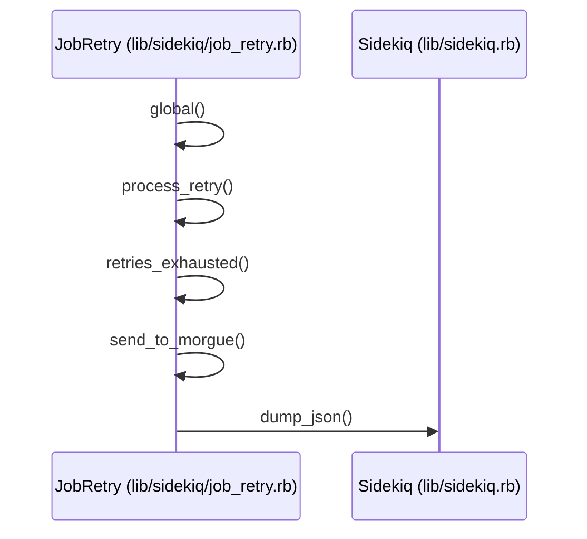
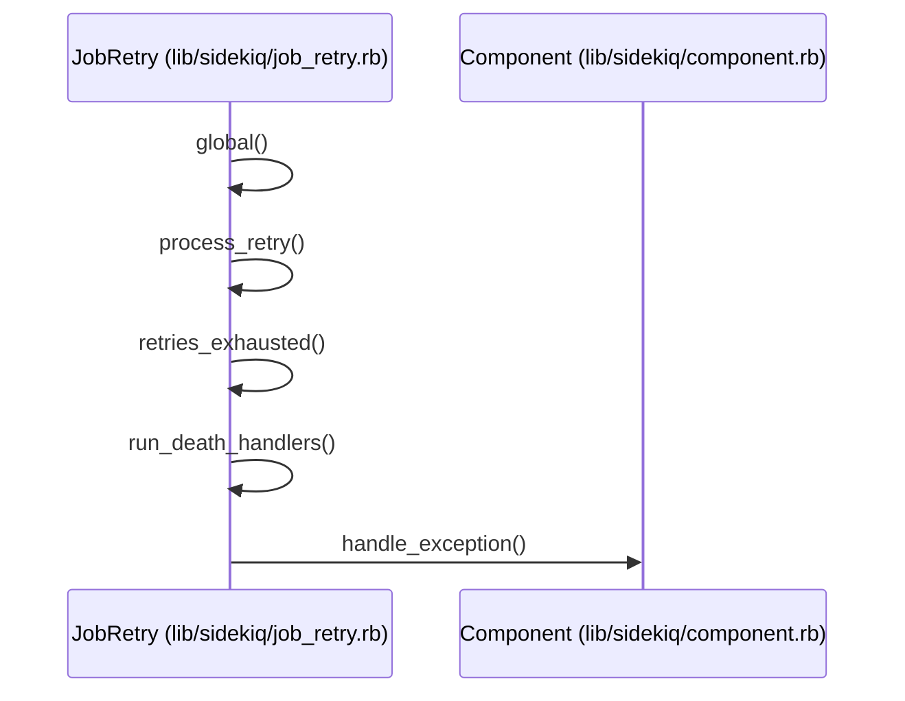
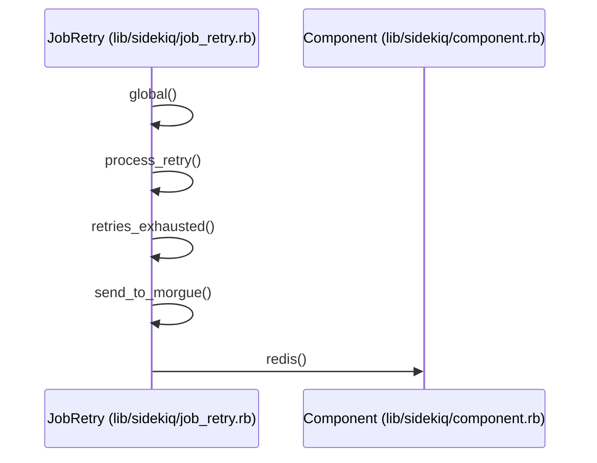
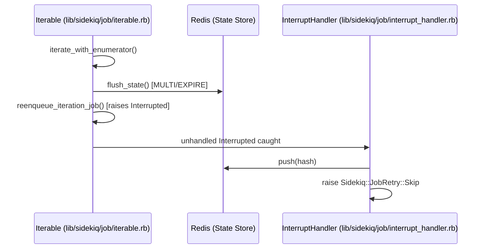
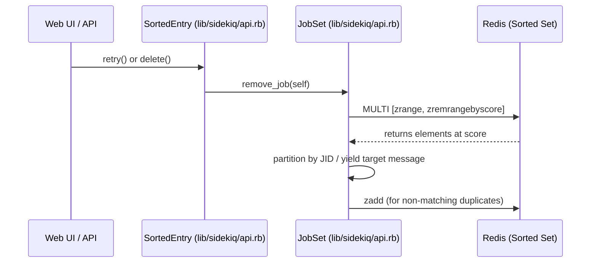

# Job Retry Handling

<details>
<summary>Relevant source files</summary>

The following files were used as context for generating this wiki page:

- [lib/sidekiq/job_retry.rb](https://github.com/sidekiq/sidekiq/blob/main/lib/sidekiq/job_retry.rb)
- [lib/sidekiq/processor.rb](https://github.com/sidekiq/sidekiq/blob/main/lib/sidekiq/processor.rb)
- [lib/sidekiq/job.rb](https://github.com/sidekiq/sidekiq/blob/main/lib/sidekiq/job.rb)
- [lib/sidekiq/job/iterable.rb](https://github.com/sidekiq/sidekiq/blob/main/lib/sidekiq/job/iterable.rb)
- [lib/sidekiq/api.rb](https://github.com/sidekiq/sidekiq/blob/main/lib/sidekiq/api.rb)
- [lib/sidekiq/web/application.rb](https://github.com/sidekiq/sidekiq/blob/main/lib/sidekiq/web/application.rb)
- [lib/sidekiq/scheduled.rb](https://github.com/sidekiq/sidekiq/blob/main/lib/sidekiq/scheduled.rb)
- [lib/sidekiq/config.rb](https://github.com/sidekiq/sidekiq/blob/main/lib/sidekiq/config.rb)
- [lib/sidekiq/component.rb](https://github.com/sidekiq/sidekiq/blob/main/lib/sidekiq/component.rb)
- [lib/sidekiq/job/interrupt_handler.rb](https://github.com/sidekiq/sidekiq/blob/main/lib/sidekiq/job/interrupt_handler.rb)
- [docs/internals.md](https://github.com/sidekiq/sidekiq/blob/main/docs/internals.md)
- [myapp/app/jobs/exit_job.rb](https://github.com/sidekiq/sidekiq/blob/main/myapp/app/jobs/exit_job.rb)
- [myapp/app/sidekiq/hard_job.rb](https://github.com/sidekiq/sidekiq/blob/main/myapp/app/sidekiq/hard_job.rb)
- [myapp/app/sidekiq/exit_job.rb](https://github.com/sidekiq/sidekiq/blob/main/myapp/app/sidekiq/exit_job.rb)
- [docs/5.0-Upgrade.md](https://github.com/sidekiq/sidekiq/blob/main/docs/5.0-Upgrade.md)
- [myapp/app/jobs/application_job.rb](https://github.com/sidekiq/sidekiq/blob/main/myapp/app/jobs/application_job.rb)
- [myapp/config/initializers/sidekiq.rb](https://github.com/sidekiq/sidekiq/blob/main/myapp/config/initializers/sidekiq.rb)
- [README.md](https://github.com/sidekiq/sidekiq/blob/main/README.md)
- [lib/sidekiq.rb](https://github.com/sidekiq/sidekiq/blob/main/lib/sidekiq.rb)
</details>

## Overview

Sidekiq's job retry subsystem provides automated error recovery for failing background jobs through a structured development and operational lifecycle. When exceptions occur during execution, Sidekiq captures the failure, calculates exponential delays, and schedules jobs for subsequent re-execution in Redis sets. 

Sources: [lib/sidekiq/job_retry.rb#L7-L21](https://github.com/sidekiq/sidekiq/blob/main/lib/sidekiq/job_retry.rb#L7-L21)

The subsystem integrates directly with worker processors and execution hooks, ensuring that transient failures are transparently retried while exhausted attempts are routed to dead job queues for manual intervention or inspection via the Web UI and Data API.

Sources: [lib/sidekiq/job_retry.rb#L7-L21](https://github.com/sidekiq/sidekiq/blob/main/lib/sidekiq/job_retry.rb#L7-L21), [lib/sidekiq/processor.rb#L10-L24](https://github.com/sidekiq/sidekiq/blob/main/lib/sidekiq/processor.rb#L10-L24)

## Processor Execution and Exception Catching

### Overview of Processor Execution

The `Sidekiq::Processor` operates as a standalone thread responsible for retrieving work from Redis, dispatching job payloads through the middleware and retry subsystems, and managing execution lifecycles. When a processor starts up, it enters a processing loop (`process_one`) that fetches work units (`uow`), parses job payloads, and coordinates thread interrupt handling around job execution.

Sources: [lib/sidekiq/processor.rb#L10-L25](https://github.com/sidekiq/sidekiq/blob/main/lib/sidekiq/processor.rb#L10-L25), [lib/sidekiq/processor.rb#L78-L90](https://github.com/sidekiq/sidekiq/blob/main/lib/sidekiq/processor.rb#L78-L90), [lib/sidekiq/processor.rb#L167-L225](https://github.com/sidekiq/sidekiq/blob/main/lib/sidekiq/processor.rb#L167-L225)

### Dispatch and Call-Chain Execution Walkthrough

Job execution flows through a nested series of instrumentation, reloader, and retry wrappers before invoking the job instance. The exact call chain from payload fetching to job performance proceeds as follows:

1. `Sidekiq::Processor#process` — Receives work unit, parses JSON, and wraps execution in thread interrupt handlers.
Sources: [lib/sidekiq/processor.rb#L167-L225](https://github.com/sidekiq/sidekiq/blob/main/lib/sidekiq/processor.rb#L167-L225)
2. `Sidekiq::Processor#dispatch` — Initiates job logging and delegation wrappers.
Sources: [lib/sidekiq/processor.rb#L128-L160](https://github.com/sidekiq/sidekiq/blob/main/lib/sidekiq/processor.rb#L128-L160)
3. `@job_logger.prepare` — Prepares log contexts using the job hash.
Sources: [lib/sidekiq/processor.rb#L137-L137](https://github.com/sidekiq/sidekiq/blob/main/lib/sidekiq/processor.rb#L137-L137)
4. `@retrier.global` — Enters global retry boundaries (`Sidekiq::JobRetry#global`), handling unhandled exceptions or delegating to the retry subsystem if `retry` is enabled.
Sources: [lib/sidekiq/job_retry.rb#L84-L107](https://github.com/sidekiq/sidekiq/blob/main/lib/sidekiq/job_retry.rb#L84-L107), [lib/sidekiq/processor.rb#L138-L138](https://github.com/sidekiq/sidekiq/blob/main/lib/sidekiq/processor.rb#L138-L138)
5. `@job_logger.call` — Logs job start and completion metrics.
Sources: [lib/sidekiq/processor.rb#L139-L139](https://github.com/sidekiq/sidekiq/blob/main/lib/sidekiq/processor.rb#L139-L139)
6. `stats` — Updates `WORK_STATE` and increments `PROCESSED` or `FAILURE` atomic counters.
Sources: [lib/sidekiq/processor.rb#L285-L297](https://github.com/sidekiq/sidekiq/blob/main/lib/sidekiq/processor.rb#L285-L297)
7. `profile` — Optionally invokes `Sidekiq::Profiler` when job profiling is enabled (`job["profile"]`).
Sources: [lib/sidekiq/processor.rb#L123-L126](https://github.com/sidekiq/sidekiq/blob/main/lib/sidekiq/processor.rb#L123-L126), [lib/sidekiq/processor.rb#L141-L141](https://github.com/sidekiq/sidekiq/blob/main/lib/sidekiq/processor.rb#L141-L141)
8. `@reloader.call` — Invokes the framework reloader (e.g., Rails Reloader) to manage database connections and code loading.
Sources: [lib/sidekiq/processor.rb#L146-L146](https://github.com/sidekiq/sidekiq/blob/main/lib/sidekiq/processor.rb#L146-L146)
9. `Object.const_get` / `klass.new` — Constantizes the worker class and instantiates the job object, assigning `jid` and `_context`.
Sources: [lib/sidekiq/processor.rb#L147-L150](https://github.com/sidekiq/processor.rb#L147-L150)
10. `@retrier.local` — Enters local retry boundaries (`Sidekiq::JobRetry#local`), mapping job instance options and associating errors with the specific job instance.
Sources: [lib/sidekiq/job_retry.rb#L117-L138](https://github.com/sidekiq/sidekiq/blob/main/lib/sidekiq/job_retry.rb#L117-L138), [lib/sidekiq/processor.rb#L151-L151](https://github.com/sidekiq/sidekiq/blob/main/lib/sidekiq/processor.rb#L151-L151)
11. `server_middleware.invoke` — Executes the server middleware chain.
Sources: [lib/sidekiq/processor.rb#L192-L192](https://github.com/sidekiq/sidekiq/blob/main/lib/sidekiq/processor.rb#L192-L192)
12. `execute_job` (`instance.perform`) — Invokes `#perform` with the cloned job arguments.
Sources: [lib/sidekiq/processor.rb#L193-L193](https://github.com/sidekiq/sidekiq/blob/main/lib/sidekiq/processor.rb#L193-L193), [lib/sidekiq/processor.rb#L227-L229](https://github.com/sidekiq/sidekiq/blob/main/lib/sidekiq/processor.rb#L227-L229)

### Exception Catching and Rescue Subsystem

During job dispatch, `Sidekiq::Processor#process` catches several specific exception classes to determine job acknowledgment (`ack`) behavior and error reporting:

* `Sidekiq::JobRetry::Skip` — Indicates the error was handled elsewhere; marks acknowledgment as true (`ack = true`) without logging or reporting the error.
Sources: [lib/sidekiq/processor.rb#L201-L205](https://github.com/sidekiq/sidekiq/blob/main/lib/sidekiq/processor.rb#L201-L205)
* `Sidekiq::JobRetry::Handled` — Signals that the retry subsystem successfully caught the error and scheduled a retry or sent the job to the morgue. Acknowledges the job (`ack = true`), extracts the root cause exception (`h.cause || h`), passes it to `handle_exception`, and raises it.
Sources: [lib/sidekiq/processor.rb#L206-L212](https://github.com/sidekiq/sidekiq/blob/main/lib/sidekiq/processor.rb#L206-L212)
* `Sidekiq::Shutdown` — Forces processor termination or hard shutdown without acknowledging the work unit, leaving the job in Redis to be recovered.
Sources: [lib/sidekiq/processor.rb#L197-L200](https://github.com/sidekiq/sidekiq/blob/main/lib/sidekiq/processor.rb#L197-L200)
* `Exception` — Catches unexpected internal exceptions that bypassed the retry subsystem, reports them via `handle_exception`, and re-raises them.
Sources: [lib/sidekiq/processor.rb#L213-L218](https://github.com/sidekiq/processor.rb#L213-L218)

> [!WARNING]
> Malformed JSON payloads bypass standard job execution entirely. `Sidekiq::Processor#process` rescues JSON parsing errors, writes the raw payload directly to the `"dead"` Redis sorted set using a multi-command transaction (`MULTI/EXEC`), logs the exception, and immediately acknowledges the work unit.
> 
> Sources: [lib/sidekiq/processor.rb#L171-L186](https://github.com/sidekiq/sidekiq/blob/main/lib/sidekiq/processor.rb#L171-L186)

## Exponential Backoff and Delay Calculation

### Overview of Delay Calculation

When a job fails and requires a retry, `Sidekiq::JobRetry#process_retry` calculates the retry delay and schedules the job into Redis. The delay calculation logic inspects whether the worker defines a custom `sidekiq_retry_in` block or falls back to an exponential formula.

Sources: [lib/sidekiq/job_retry.rb#L149-L151](https://github.com/sidekiq/sidekiq/blob/main/lib/sidekiq/job_retry.rb#L149-L151), [lib/sidekiq/job_retry.rb#L219-L225](https://github.com/sidekiq/sidekiq/blob/main/lib/sidekiq/job_retry.rb#L219-L225)

### Delay Calculation and Custom Retry Blocks

The `delay_for` method determines the retry interval by evaluating any custom retry block defined on the job instance or its wrapped class (such as ActiveJob). The block receives three arguments: `count`, `exception`, and `msg`. 

Sources: [lib/sidekiq/job_retry.rb#L219-L231](https://github.com/sidekiq/sidekiq/blob/main/lib/sidekiq/job_retry.rb#L219-L231)

```ruby
def delay_for(jobinst, count, exception, msg)
  rv = begin
    block = jobinst&.sidekiq_retry_in_block

    unless msg["wrapped"].nil?
      wrapped = Object.const_get(msg["wrapped"])
      block = wrapped.respond_to?(:sidekiq_retry_in_block) ? wrapped.sidekiq_retry_in_block : nil
    end
    block&.call(count, exception, msg)
  rescue Exception => e
    handle_exception(e, {context: "Failure scheduling retry using the defined `sidekiq_retry_in` in #{jobinst.class.name}, falling back to default"})
    nil
  end

  rv = rv.to_i if rv.respond_to?(:to_i)
  delay = (count**4) + 15
  if Integer === rv && rv > 0
    delay = rv
  elsif rv == :discard
    return [:discard, nil]
  elsif rv == :kill
    return [:kill, nil]
  end

  [:default, delay]
end
```

Sources: [lib/sidekiq/job_retry.rb#L219-L248](https://github.com/sidekiq/sidekiq/blob/main/lib/sidekiq/job_retry.rb#L219-L248)

| Return Value or Strategy | Condition / Behavior | Resulting Action |
| :--- | :--- | :--- |
| Integer (`rv > 0`) | Custom `sidekiq_retry_in` block returns a positive integer | Uses `rv` seconds as the retry delay |
Sources: [lib/sidekiq/job_retry.rb#L239-L240](https://github.com/sidekiq/sidekiq/blob/main/lib/sidekiq/job_retry.rb#L239-L240)
| `:discard` | Custom block returns symbol `:discard` | Assigns `discarded_at` timestamp and runs death handlers without scheduling a retry |
Sources: [lib/sidekiq/job_retry.rb#L192-L195](https://github.com/sidekiq/sidekiq/blob/main/lib/sidekiq/job_retry.rb#L192-L195), [lib/sidekiq/job_retry.rb#L241-L242](https://github.com/sidekiq/sidekiq/blob/main/lib/sidekiq/job_retry.rb#L241-L242)
| `:kill` | Custom block returns symbol `:kill` | Immediately routes the job to retries exhausted handling |
Sources: [lib/sidekiq/job_retry.rb#L196-L197](https://github.com/sidekiq/sidekiq/blob/main/lib/sidekiq/job_retry.rb#L196-L197), [lib/sidekiq/job_retry.rb#L243-L245](https://github.com/sidekiq/sidekiq/blob/main/lib/sidekiq/job_retry.rb#L243-L245)
| Default (`nil` or invalid) | Default fallback or unhandled return value | Calculates delay using the formula `(count**4) + 15` |
Sources: [lib/sidekiq/job_retry.rb#L238-L247](https://github.com/sidekiq/sidekiq/blob/main/lib/sidekiq/job_retry.rb#L238-L247)

> [!NOTE]
> To prevent a thundering herd when many failed jobs retry simultaneously, `Sidekiq::JobRetry#process_retry` adds a randomized jitter factor to the calculated delay before storing the timestamp in Redis. The jitter is calculated as `rand(10 * (count + 1))`.
> 
> Sources: [lib/sidekiq/job_retry.rb#L202-L203](https://github.com/sidekiq/sidekiq/blob/main/lib/sidekiq/job_retry.rb#L202-L203)

### Scheduling Retries into Redis Sorted Sets

Once the delay and jitter are calculated, the retry timestamp (`retry_at`) is computed as `Time.now.to_f + delay + jitter`. The job payload is serialized using `Sidekiq.dump_json(msg)` and added to the `"retry"` sorted set in Redis using a `ZADD` command.

Sources: [lib/sidekiq/job_retry.rb#L203-L207](https://github.com/sidekiq/sidekiq/blob/main/lib/sidekiq/job_retry.rb#L203-L207)

```ruby
jitter = rand(10 * (count + 1))
retry_at = Time.now.to_f + delay + jitter
payload = Sidekiq.dump_json(msg)
redis do |conn|
  conn.zadd("retry", retry_at.to_s, payload)
end
```

Sources: [lib/sidekiq/job_retry.rb#L202-L207](https://github.com/sidekiq/sidekiq/blob/main/lib/sidekiq/job_retry.rb#L202-L207)

Background polling by `Sidekiq::Scheduled::Poller` and `Sidekiq::Scheduled::Enq` periodically inspects the `"retry"` and `"schedule"` sets using Lua scripts (`LUA_ZPOPBYSCORE`) to retrieve jobs whose execution timestamp is less than or equal to current time (`-inf` to `now`), popping them atomically and pushing them back onto their target work queues via `Sidekiq::Client#push`.

Sources: [lib/sidekiq/scheduled.rb#L8-L20](https://github.com/sidekiq/sidekiq/blob/main/lib/sidekiq/scheduled.rb#L8-L20), [lib/sidekiq/scheduled.rb#L29-L44](https://github.com/sidekiq/sidekiq/blob/main/lib/sidekiq/scheduled.rb#L29-L44), [lib/sidekiq/scheduled.rb#L67-L70](https://github.com/sidekiq/sidekiq/blob/main/lib/sidekiq/scheduled.rb#L67-L70)

## Exhausted Retries and Dead Queue Handling

### Overview of Exhausted Retries

When a job exceeds its maximum allowed retry attempts or duration (`retry_for`), or when a retry strategy explicitly resolves to `:kill`, Sidekiq invokes `Sidekiq::JobRetry#retries_exhausted`. This method orchestrates custom exhaust blocks, dead queue storage, and death handler execution.

Sources: [lib/sidekiq/job_retry.rb#L183-L198](https://github.com/sidekiq/sidekiq/blob/main/lib/sidekiq/job_retry.rb#L183-L198), [lib/sidekiq/job_retry.rb#L250-L273](https://github.com/sidekiq/sidekiq/blob/main/lib/sidekiq/job_retry.rb#L250-L273)

### Call-Chain Execution Walkthroughs

The lifecycle of an exhausted retry can be traced through explicit call paths starting from the global exception handler down to serialization, exception reporting, and Redis interaction.

#### Global to Dump JSON Call-Chain Walkthrough
1. `global` intercepts an unhandled exception during job processing.
Sources: [lib/sidekiq/job_retry.rb#L84-L97](https://github.com/sidekiq/sidekiq/blob/main/lib/sidekiq/job_retry.rb#L84-L97)
2. `process_retry` evaluates attempt thresholds and delegates to `retries_exhausted`.
Sources: [lib/sidekiq/job_retry.rb#L186-L187](https://github.com/sidekiq/sidekiq/blob/main/lib/sidekiq/job_retry.rb#L186-L187), [lib/sidekiq/job_retry.rb#L250-L273](https://github.com/sidekiq/sidekiq/blob/main/lib/sidekiq/job_retry.rb#L250-L273)
3. `retries_exhausted` determines that the job is not discarded and calls `send_to_morgue`.
Sources: [lib/sidekiq/job_retry.rb#L264-L270](https://github.com/sidekiq/sidekiq/blob/main/lib/sidekiq/job_retry.rb#L264-L270)
4. `send_to_morgue` prepares the dead entry payload.
Sources: [lib/sidekiq/job_retry.rb#L283-L286](https://github.com/sidekiq/sidekiq/blob/main/lib/sidekiq/job_retry.rb#L283-L286)
5. `dump_json` converts the message hash into JSON format.
Sources: [lib/sidekiq.rb#L65-L67](https://github.com/sidekiq/sidekiq/blob/main/lib/sidekiq.rb#L65-L67)



Sources: [lib/sidekiq/job_retry.rb#L84-L97](https://github.com/sidekiq/sidekiq/blob/main/lib/sidekiq/job_retry.rb#L84-L97), [lib/sidekiq/job_retry.rb#L186-L187](https://github.com/sidekiq/sidekiq/blob/main/lib/sidekiq/job_retry.rb#L186-L187), [lib/sidekiq/job_retry.rb#L250-L273](https://github.com/sidekiq/sidekiq/blob/main/lib/sidekiq/job_retry.rb#L250-L273), [lib/sidekiq/job_retry.rb#L283-L286](https://github.com/sidekiq/sidekiq/blob/main/lib/sidekiq/job_retry.rb#L283-L286), [lib/sidekiq.rb#L65-L67](https://github.com/sidekiq/sidekiq/blob/main/lib/sidekiq.rb#L65-L67)

#### Retries Exhausted to Death Handlers Walkthrough
1. `global` intercepts the failed execution and initiates `process_retry`.
Sources: [lib/sidekiq/job_retry.rb#L84-L97](https://github.com/sidekiq/sidekiq/blob/main/lib/sidekiq/job_retry.rb#L84-L97)
2. `process_retry` reaches the failure limit and invokes `retries_exhausted`.
Sources: [lib/sidekiq/job_retry.rb#L186-L187](https://github.com/sidekiq/sidekiq/blob/main/lib/sidekiq/job_retry.rb#L186-L187), [lib/sidekiq/job_retry.rb#L250-L273](https://github.com/sidekiq/sidekiq/blob/main/lib/sidekiq/job_retry.rb#L250-L273)
3. `retries_exhausted` runs any defined user hooks and calls `run_death_handlers`.
Sources: [lib/sidekiq/job_retry.rb#L250-L273](https://github.com/sidekiq/sidekiq/blob/main/lib/sidekiq/job_retry.rb#L250-L273)
4. `run_death_handlers` iterates over configured death handlers, invoking each block.
Sources: [lib/sidekiq/job_retry.rb#L275-L281](https://github.com/sidekiq/sidekiq/blob/main/lib/sidekiq/job_retry.rb#L275-L281)
5. `handle_exception` catches any errors raised inside death handler blocks and routes them to configuration exception handlers.
Sources: [lib/sidekiq/job_retry.rb#L278-L280](https://github.com/sidekiq/sidekiq/blob/main/lib/sidekiq/job_retry.rb#L278-L280), [lib/sidekiq/component.rb#L77-L79](https://github.com/sidekiq/sidekiq/blob/main/lib/sidekiq/component.rb#L77-L79)



Sources: [lib/sidekiq/job_retry.rb#L84-L97](https://github.com/sidekiq/sidekiq/blob/main/lib/sidekiq/job_retry.rb#L84-L97), [lib/sidekiq/job_retry.rb#L186-L187](https://github.com/sidekiq/sidekiq/blob/main/lib/sidekiq/job_retry.rb#L186-L187), [lib/sidekiq/job_retry.rb#L250-L273](https://github.com/sidekiq/sidekiq/blob/main/lib/sidekiq/job_retry.rb#L250-L273), [lib/sidekiq/job_retry.rb#L275-L281](https://github.com/sidekiq/sidekiq/blob/main/lib/sidekiq/job_retry.rb#L275-L281), [lib/sidekiq/component.rb#L77-L79](https://github.com/sidekiq/sidekiq/blob/main/lib/sidekiq/component.rb#L77-L79)

#### Retries Exhausted to Redis Sorted Set Walkthrough
1. `global` captures the exception and calls `process_retry`.
Sources: [lib/sidekiq/job_retry.rb#L84-L97](https://github.com/sidekiq/sidekiq/blob/main/lib/sidekiq/job_retry.rb#L84-L97)
2. `process_retry` identifies that maximum retries are reached and delegates to `retries_exhausted`.
Sources: [lib/sidekiq/job_retry.rb#L186-L187](https://github.com/sidekiq/sidekiq/blob/main/lib/sidekiq/job_retry.rb#L186-L187), [lib/sidekiq/job_retry.rb#L250-L273](https://github.com/sidekiq/sidekiq/blob/main/lib/sidekiq/job_retry.rb#L250-L273)
3. `retries_exhausted` checks discard criteria and executes `send_to_morgue`.
Sources: [lib/sidekiq/job_retry.rb#L264-L270](https://github.com/sidekiq/sidekiq/blob/main/lib/sidekiq/job_retry.rb#L264-L270)
4. `send_to_morgue` opens a Redis transaction context.
Sources: [lib/sidekiq/job_retry.rb#L283-L289](https://github.com/sidekiq/sidekiq/blob/main/lib/sidekiq/job_retry.rb#L283-L289)
5. `redis` executes a Redis `MULTI` transaction adding the dead payload to the `"dead"` sorted set while trimming old entries based on score and rank limits.
Sources: [lib/sidekiq/job_retry.rb#L288-L294](https://github.com/sidekiq/sidekiq/blob/main/lib/sidekiq/job_retry.rb#L288-L294), [lib/sidekiq/component.rb#L54-L56](https://github.com/sidekiq/sidekiq/blob/main/lib/sidekiq/component.rb#L54-L56)



Sources: [lib/sidekiq/job_retry.rb#L84-L97](https://github.com/sidekiq/sidekiq/blob/main/lib/sidekiq/job_retry.rb#L84-L97), [lib/sidekiq/job_retry.rb#L186-L187](https://github.com/sidekiq/sidekiq/blob/main/lib/sidekiq/job_retry.rb#L186-L187), [lib/sidekiq/job_retry.rb#L250-L273](https://github.com/sidekiq/sidekiq/blob/main/lib/sidekiq/job_retry.rb#L250-L273), [lib/sidekiq/job_retry.rb#L288-L294](https://github.com/sidekiq/sidekiq/blob/main/lib/sidekiq/job_retry.rb#L288-L294), [lib/sidekiq/component.rb#L54-L56](https://github.com/sidekiq/sidekiq/blob/main/lib/sidekiq/component.rb#L54-L56)

### Dead Queue Maintenance and Configuration

Jobs added to the morgue via `send_to_morgue` are managed inside the `"dead"` sorted set in Redis using a multi-command transaction (`MULTI/EXEC`). The transaction performs three atomic operations: adding the payload with the current timestamp as score, removing items older than `dead_timeout_in_seconds`, and pruning the set down to `dead_max_jobs`.

Sources: [lib/sidekiq/job_retry.rb#L288-L294](https://github.com/sidekiq/sidekiq/blob/main/lib/sidekiq/job_retry.rb#L288-L294)

```ruby
def send_to_morgue(msg)
  logger.info { "Adding dead #{msg["class"]} job #{msg["jid"]}" }
  payload = Sidekiq.dump_json(msg)
  now = Time.now.to_f

  redis do |conn|
    conn.multi do |xa|
      xa.zadd("dead", now.to_s, payload)
      xa.zremrangebyscore("dead", "-inf", now - @config[:dead_timeout_in_seconds])
      xa.zremrangebyrank("dead", 0, - @config[:dead_max_jobs])
    end
  end
end
```

Sources: [lib/sidekiq/job_retry.rb#L283-L295](https://github.com/sidekiq/sidekiq/blob/main/lib/sidekiq/job_retry.rb#L283-L295)

> [!WARNING]
> If a job explicitly sets `retry: false` in its options hash, it bypasses the retry queue entirely upon failure. Instead of entering `process_retry`, the global error handler iterates over configured death handlers directly and executes them without writing to the dead set.
> 
> Sources: [lib/sidekiq/job_retry.rb#L96-L104](https://github.com/sidekiq/sidekiq/blob/main/lib/sidekiq/job_retry.rb#L96-L104)

### Exhaustion Lifecycle and Configuration Options

| Option / Method | Default Value / Behavior | Purpose |
| :--- | :--- | :--- |
| `dead_timeout_in_seconds` | 6 months (managed via `DeadSet#trim`) | Expiration window after which dead jobs are automatically purged from the morgue |
Sources: [lib/sidekiq/config.rb#L36-L36](https://github.com/sidekiq/sidekiq/blob/main/lib/sidekiq/config.rb#L36-L36), [lib/sidekiq/api.rb#L937-L946](https://github.com/sidekiq/sidekiq/blob/main/lib/sidekiq/api.rb#L937-L946)
| `dead_max_jobs` | Configured maximum limit | Maximum capacity constraint for the dead sorted set, enforced via `zremrangebyrank` |
Sources: [lib/sidekiq/config.rb#L35-L35](https://github.com/sidekiq/sidekiq/blob/main/lib/sidekiq/config.rb#L35-L35), [lib/sidekiq/api.rb#L937-L946](https://github.com/sidekiq/sidekiq/blob/main/lib/sidekiq/api.rb#L937-L946)
| `sidekiq_retries_exhausted` | Job instance or wrapped class block | Custom hook executed immediately before a job is moved to the dead set or discarded |
Sources: [lib/sidekiq/job_retry.rb#L250-L270](https://github.com/sidekiq/sidekiq/blob/main/lib/sidekiq/job_retry.rb#L250-L270)
| `death_handlers` | Array of global callables on `@config` | Global callbacks invoked whenever a job's retries are exhausted or it fails without retries |
Sources: [lib/sidekiq/job_retry.rb#L99-L103](https://github.com/sidekiq/sidekiq/blob/main/lib/sidekiq/job_retry.rb#L99-L103), [lib/sidekiq/config.rb#L24-L24](https://github.com/sidekiq/sidekiq/blob/main/lib/sidekiq/config.rb#L24-L24)

## Thread Interrupts and Job Interruption

### Overview of Job Interruption

Managing thread interrupts, shutdown signals, and state preservation for iterable jobs involves coordinating worker thread signals with incremental state persistence in Redis. Sidekiq implements iterable jobs via `Sidekiq::Job::Iterable`, which tracks execution state across iterations and interacts with `Sidekiq::Job::InterruptHandler` to ensure jobs can stop cleanly and resume later.

Sources: [lib/sidekiq/job/iterable.rb#L5-L10](https://github.com/sidekiq/sidekiq/blob/main/lib/sidekiq/job/iterable.rb#L5-L10), [lib/sidekiq/job/interrupt_handler.rb#L3-L16](https://github.com/sidekiq/sidekiq/blob/main/lib/sidekiq/job/interrupt_handler.rb#L3-L16)

### Interruption Call-Chain and State Flow

When a shutdown signal or interruption occurs during iterable job processing, the execution flow follows a precise sequence across components:

1. `iterate_with_enumerator` evaluates `interrupt_job = interrupted? || should_interrupt?` at each iteration step.
Sources: [lib/sidekiq/job/iterable.rb#L214-L216](https://github.com/sidekiq/sidekiq/blob/main/lib/sidekiq/job/iterable.rb#L214-L216)
2. If an interrupt is flagged, `flush_state` executes a Redis `MULTI` transaction persisting execution count (`ex`), JSON-dumped cursor (`c`), and runtime (`rt`) into the hash key `it-#{jid}` with an expiration TTL.
Sources: [lib/sidekiq/job/iterable.rb#L215-L216](https://github.com/sidekiq/sidekiq/blob/main/lib/sidekiq/job/iterable.rb#L215-L216), [lib/sidekiq/job/iterable.rb#L281-L296](https://github.com/sidekiq/sidekiq/blob/main/lib/sidekiq/job/iterable.rb#L281-L296)
3. `reenqueue_iteration_job` raises `Sidekiq::Job::Interrupted`.
Sources: [lib/sidekiq/job/iterable.rb#L254-L259](https://github.com/sidekiq/sidekiq/blob/main/lib/sidekiq/job/iterable.rb#L254-L259)
4. `Sidekiq::Job::InterruptHandler#call` catches `Interrupted`, pushes the updated job hash back to Redis via `Sidekiq::Client.new.push(hash)`, and raises `Sidekiq::JobRetry::Skip` to prevent standard error reporting.
Sources: [lib/sidekiq/job/interrupt_handler.rb#L7-L15](https://github.com/sidekiq/sidekiq/blob/main/lib/sidekiq/job/interrupt_handler.rb#L7-L15)



Sources: [lib/sidekiq/job/iterable.rb#L214-L296](https://github.com/sidekiq/sidekiq/blob/main/lib/sidekiq/job/iterable.rb#L214-L296), [lib/sidekiq/job/interrupt_handler.rb#L7-L15](https://github.com/sidekiq/sidekiq/blob/main/lib/sidekiq/job/interrupt_handler.rb#L7-L15)

### Iterable Job State and Lifecycle Constants

| Constant / Method | Value / Type | Purpose |
| :--- | :--- | :--- |
| `Sidekiq::Job::Interrupted` | `::RuntimeError` subclass | Exception raised to signal an active iteration interruption and trigger re-queueing |
Sources: [lib/sidekiq/job/iterable.rb#L7-L7](https://github.com/sidekiq/sidekiq/blob/main/lib/sidekiq/job/iterable.rb#L7-L7)
| `Sidekiq::Job::Iterable::CANCELLATION_PERIOD` | `(3 * 86_400).to_s` (3 days) | Expiration window for cancellation flags in Redis |
Sources: [lib/sidekiq/job/iterable.rb#L50-L50](https://github.com/sidekiq/sidekiq/blob/main/lib/sidekiq/job/iterable.rb#L50-L50)
| `STATE_FLUSH_INTERVAL` | `5` seconds | Time interval or threshold forcing state persistence during long iterations |
Sources: [lib/sidekiq/job/iterable.rb#L193-L193](https://github.com/sidekiq/sidekiq/blob/main/lib/sidekiq/job/iterable.rb#L193-L193)
| `STATE_TTL` | `30 * 24 * 60 * 60` (1 month) | Duration state is kept in Redis while the job awaits resumption or retry |
Sources: [lib/sidekiq/job/iterable.rb#L196-L196](https://github.com/sidekiq/sidekiq/blob/main/lib/sidekiq/job/iterable.rb#L196-L196)

> [!WARNING]
> Defining a `#perform` method directly inside an iterable job class raises a runtime error during class loading. Iterable jobs must omit `#perform` and implement `#build_enumerator` and `#each_iteration` instead.
> 
> Sources: [lib/sidekiq/job/iterable.rb#L18-L22](https://github.com/sidekiq/sidekiq/blob/main/lib/sidekiq/job/iterable.rb#L18-L22)

> [!TIP]
> State is flushed to Redis every 5 seconds or immediately when `interrupted?` or `should_interrupt?` becomes true, ensuring minimal duplicate work upon resumption.
> 
> Sources: [lib/sidekiq/job/iterable.rb#L214-L217](https://github.com/sidekiq/sidekiq/blob/main/lib/sidekiq/job/iterable.rb#L214-L217)

## Web UI and API Retry Management

### Overview of Web UI and API Management

Inspecting, retrying, and deleting failed or dead jobs is managed through Sidekiq's Data API and Web UI integration. The classes `Sidekiq::RetrySet` and `Sidekiq::DeadSet` inherit from `Sidekiq::JobSet` and `Sidekiq::SortedSet`, storing retriable and exhausted jobs as Redis sorted sets where scores represent timestamps. The `Sidekiq::Web::Application` routes administrative actions to inspect payloads, execute manual retries, or purge records.

Sources: [lib/sidekiq/api.rb#L586-L604](https://github.com/sidekiq/sidekiq/blob/main/lib/sidekiq/api.rb#L586-L604), [lib/sidekiq/api.rb#L671-L677](https://github.com/sidekiq/sidekiq/blob/main/lib/sidekiq/api.rb#L671-L677), [lib/sidekiq/api.rb#L920-L935](https://github.com/sidekiq/sidekiq/blob/main/lib/sidekiq/api.rb#L920-L935), [lib/sidekiq/web/application.rb#L169-L287](https://github.com/sidekiq/sidekiq/blob/main/lib/sidekiq/web/application.rb#L169-L287)

### Retry and Dead Set Operations Call-Chain

When a failed job in the `RetrySet` or `DeadSet` is manually retried or removed via the API or Web UI, the operation flows through specific methods in `SortedEntry` and `JobSet`:

1. `SortedEntry#retry` invokes `remove_job`, passing a block that loads the JSON message, decrements `retry_count` if present (`msg["retry_count"] -= 1`), and calls `Sidekiq::Client.push(msg)`.
Sources: [lib/sidekiq/api.rb#L644-L650](https://github.com/sidekiq/sidekiq/blob/main/lib/sidekiq/api.rb#L644-L650), [lib/sidekiq/api.rb#L665-L667](https://github.com/sidekiq/sidekiq/blob/main/lib/sidekiq/api.rb#L665-L667)
2. `SortedSet#remove_job` executes a Redis `MULTI` transaction running `zrange` and `zremrangebyscore` for the given score.
Sources: [lib/sidekiq/api.rb#L835-L843](https://github.com/sidekiq/sidekiq/blob/main/lib/sidekiq/api.rb#L835-L843)
3. If multiple entries share the exact same score timestamp, `remove_job` partitions the elements by matching the unique job identifier (`jid`), yields the target message, and pushes non-matching messages back onto the sorted set via `zadd`.
Sources: [lib/sidekiq/api.rb#L847-L871](https://github.com/sidekiq/sidekiq/blob/main/lib/sidekiq/api.rb#L847-L871)
4. For dead set insertion, `DeadSet#kill` adds the message to the `"dead"` sorted set with a timestamp score, trims excess entries according to configuration limits, and evaluates `death_handlers`.
Sources: [lib/sidekiq/api.rb#L953-L974](https://github.com/sidekiq/sidekiq/blob/main/lib/sidekiq/api.rb#L953-L974)



Sources: [lib/sidekiq/api.rb#L644-L650](https://github.com/sidekiq/sidekiq/blob/main/lib/sidekiq/api.rb#L644-L650), [lib/sidekiq/api.rb#L835-L873](https://github.com/sidekiq/sidekiq/blob/main/lib/sidekiq/api.rb#L835-L873), [lib/sidekiq/api.rb#L953-L974](https://github.com/sidekiq/sidekiq/blob/main/lib/sidekiq/api.rb#L953-L974)

### Data API Classes and Web UI Endpoints

| Class / Endpoint Route | Underlying Redis Key / Target | Purpose |
| :--- | :--- | :--- |
| `Sidekiq::RetrySet` | `"retry"` (Sorted Set) | Holds jobs that encountered errors and are waiting for their backoff retry period |
Sources: [lib/sidekiq/api.rb#L920-L924](https://github.com/sidekiq/sidekiq/blob/main/lib/sidekiq/api.rb#L920-L924)
| `Sidekiq::DeadSet` | `"dead"` (Sorted Set) | Holds exhausted jobs ("morgue") pending manual review or expiration cleanup |
Sources: [lib/sidekiq/api.rb#L931-L934](https://github.com/sidekiq/sidekiq/blob/main/lib/sidekiq/api.rb#L931-L934)
| `GET /retries` | `Sidekiq::RetrySet` | Web UI page rendering paginated or searched entries in the retry set |
Sources: [lib/sidekiq/web/application.rb#L229-L243](https://github.com/sidekiq/sidekiq/blob/main/lib/sidekiq/web/application.rb#L229-L243)
| `POST /retries/:key` | `SortedEntry` | Executes manual retry, deletion, or killing of a specific retry entry |
Sources: [lib/sidekiq/web/application.rb#L281-L287](https://github.com/sidekiq/sidekiq/blob/main/lib/sidekiq/web/application.rb#L281-L287)
| `POST /morgue/all/retry` | `DeadSet#retry_all` | Re-queues all dead jobs back into their respective queues |
Sources: [lib/sidekiq/web/application.rb#L213-L216](https://github.com/sidekiq/sidekiq/blob/main/lib/sidekiq/web/application.rb#L213-L216)

> [!NOTE]
> Manual retries initiated through `SortedEntry#retry` decrement the job's `retry_count` attribute (`msg["retry_count"] -= 1`), preventing operator interventions from penalizing the job's remaining automated retry budget.
> 
> Sources: [lib/sidekiq/api.rb#L644-L650](https://github.com/sidekiq/sidekiq/blob/main/lib/sidekiq/api.rb#L644-L650)

> [!WARNING]
> Methods like `JobSet#find_job` and `Queue#find_job` execute `zscan` or linear scans across Redis keys to locate entries by `jid`. These are slow $O(N)$ operations and must never be invoked within core business logic.
> 
> Sources: [lib/sidekiq/api.rb#L357-L359](https://github.com/sidekiq/sidekiq/blob/main/lib/sidekiq/api.rb#L357-L359), [lib/sidekiq/api.rb#L819-L822](https://github.com/sidekiq/sidekiq/blob/main/lib/sidekiq/api.rb#L819-L822)

## Related

- [[Worker Processing]]
- [[Scheduled Job Polling]]

