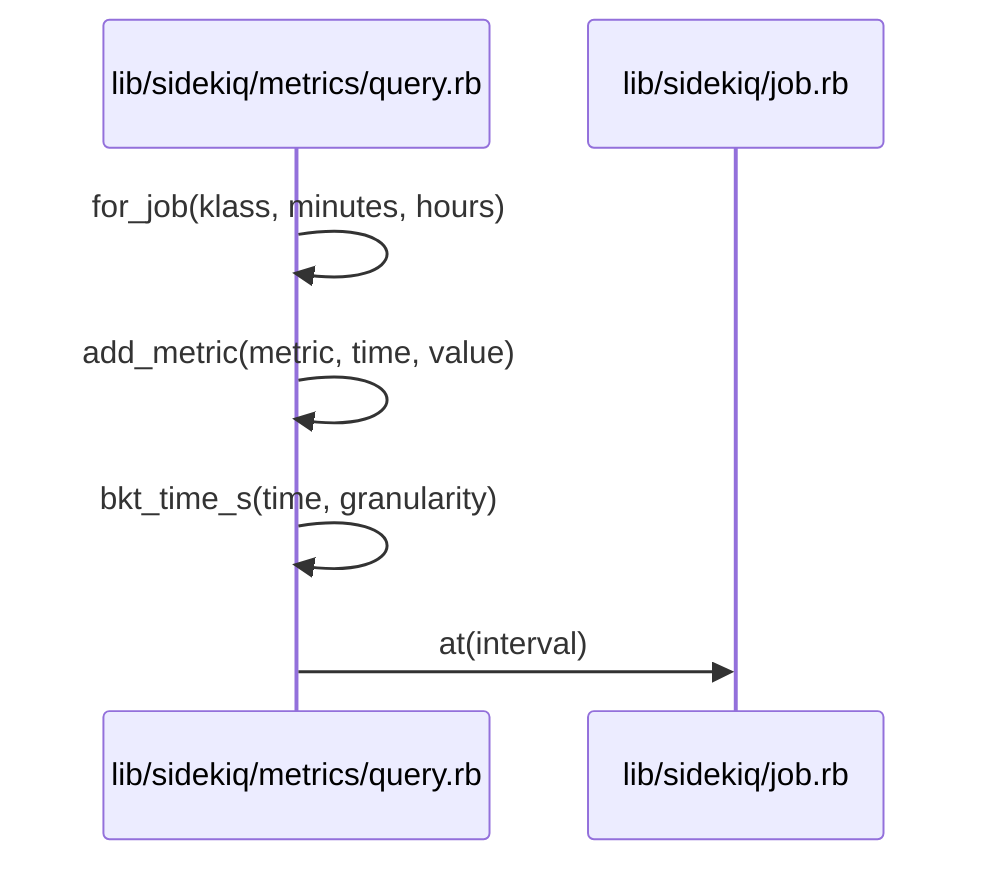
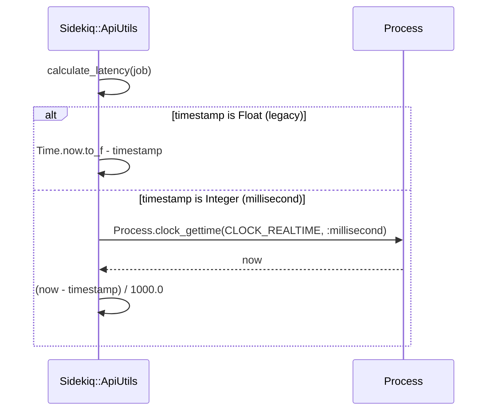
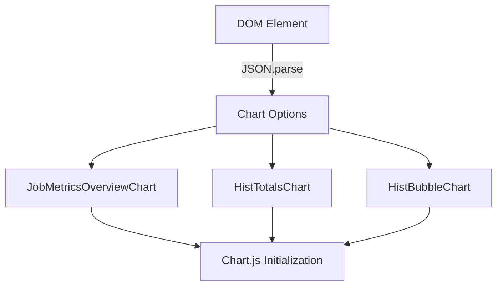
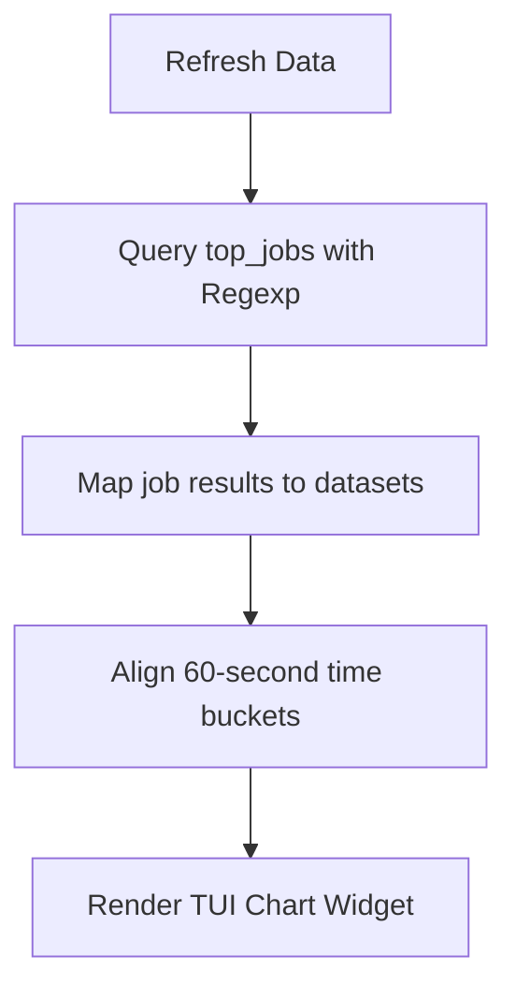

# Metrics Query Collection

<details>
<summary>Relevant source files</summary>

The following files were used as context for generating this wiki page:

- [lib/sidekiq/web/application.rb](https://github.com/sidekiq/sidekiq/blob/main/lib/sidekiq/web/application.rb)
- [lib/sidekiq/metrics/query.rb](https://github.com/sidekiq/sidekiq/blob/main/lib/sidekiq/metrics/query.rb)
- [lib/sidekiq/api.rb](https://github.com/sidekiq/sidekiq/blob/main/lib/sidekiq/api.rb)
- [lib/sidekiq/tui/tabs/metrics.rb](https://github.com/sidekiq/sidekiq/blob/main/lib/sidekiq/tui/tabs/metrics.rb)
- [lib/sidekiq/tui/tabs/home.rb](https://github.com/sidekiq/sidekiq/blob/main/lib/sidekiq/tui/tabs/home.rb)
- [lib/sidekiq/metrics/tracking.rb](https://github.com/sidekiq/sidekiq/blob/main/lib/sidekiq/metrics/tracking.rb)
- [lib/sidekiq/metrics/shared.rb](https://github.com/sidekiq/sidekiq/blob/main/lib/sidekiq/metrics/shared.rb)
- [README.md](https://github.com/sidekiq/sidekiq/blob/main/README.md)
- [docs/8.0-Upgrade.md](https://github.com/sidekiq/sidekiq/blob/main/docs/8.0-Upgrade.md)
- [web/assets/javascripts/metrics.js](https://github.com/sidekiq/sidekiq/blob/main/web/assets/javascripts/metrics.js)
- [myapp/config/initializers/sidekiq.rb](https://github.com/sidekiq/sidekiq/blob/main/myapp/config/initializers/sidekiq.rb)
- [lib/sidekiq/paginator.rb](https://github.com/sidekiq/sidekiq/blob/main/lib/sidekiq/paginator.rb)
- [docs/internals.md](https://github.com/sidekiq/sidekiq/blob/main/docs/internals.md)
- [lib/sidekiq.rb](https://github.com/sidekiq/sidekiq/blob/main/lib/sidekiq.rb)
- [lib/sidekiq/job.rb](https://github.com/sidekiq/sidekiq/blob/main/lib/sidekiq/job.rb)
- [lib/sidekiq/logger.rb](https://github.com/sidekiq/sidekiq/blob/main/lib/sidekiq/logger.rb)
</details>

## Overview

Sidekiq provides comprehensive runtime telemetry through its metrics query collection and tracking infrastructure, capturing job execution durations, success and failure counters, and detailed runtime histograms. This subsystem records execution telemetry directly into Redis data structures, enabling operators to analyze historical performance trends and diagnose throughput bottlenecks across distributed background processing clusters.
Sources: [lib/sidekiq/metrics/tracking.rb:10-51](https://github.com/sidekiq/sidekiq/blob/main/lib/sidekiq/metrics/tracking.rb#L10-L51), [lib/sidekiq/metrics/shared.rb:20-47](https://github.com/sidekiq/sidekiq/blob/main/lib/sidekiq/metrics/shared.rb#L20-L47)

By leveraging time-series aggregation, rolling window rollups, and space-efficient Redis bitfield histogram storage, the metrics architecture balances analytical depth with minimal memory overhead. The collected telemetry is surfaced across multiple operational interfaces, including the built-in Web UI chart components, terminal dashboard views, and the public stats API.
Sources: [lib/sidekiq/web/application.rb:63-89](https://github.com/sidekiq/sidekiq/blob/main/lib/sidekiq/web/application.rb#L63-L89), [lib/sidekiq/api.rb:39-141](https://github.com/sidekiq/sidekiq/blob/main/lib/sidekiq/api.rb#L39-L141), [lib/sidekiq/tui/tabs/metrics.rb:23-40](https://github.com/sidekiq/sidekiq/blob/main/lib/sidekiq/tui/tabs/metrics.rb#L23-L40), [lib/sidekiq/metrics/query.rb:22-74](https://github.com/sidekiq/sidekiq/blob/main/lib/sidekiq/metrics/query.rb#L22-L74), [lib/sidekiq/metrics/shared.rb:20-47](https://github.com/sidekiq/sidekiq/blob/main/lib/sidekiq/metrics/shared.rb#L20-L47)

The query interface empowers developers and site reliability engineers to perform real-time programmatic introspection or visual analysis over background worker throughput. Standardized metrics like millisecond execution latency, queue latency, active worker counts, and execution count totals are stored with fine-grained minutely resolution and rolled up over multi-day windows.
Sources: [lib/sidekiq/metrics/query.rb:36-115](https://github.com/sidekiq/sidekiq/blob/main/lib/sidekiq/metrics/query.rb#L36-L115), [docs/8.0-Upgrade.md:25-27](https://github.com/sidekiq/sidekiq/blob/main/docs/8.0-Upgrade.md#L25-L27)

## Job Execution Telemetry and Middleware

### Execution Tracker and Middleware Pipeline

Sidekiq tracks job execution performance via the `ExecutionTracker` component and `Middleware`, which intercept server-side job execution to record runtimes, process counts, failure counts, and fine-grained histograms. Telemetry is accumulated thread-safely in memory using `Mutex` synchronization and flushed periodically to Redis via batched pipelined commands upon receiving server heartbeat or exit events.
Sources: [lib/sidekiq/metrics/tracking.rb:10-51](https://github.com/sidekiq/sidekiq/blob/main/lib/sidekiq/metrics/tracking.rb#L10-L51), [lib/sidekiq/metrics/tracking.rb:128-153](https://github.com/sidekiq/sidekiq/blob/main/lib/sidekiq/metrics/tracking.rb#L128-L153)

The execution tracking middleware wraps worker blocks during job execution. The `Middleware#call` method extracts the target job class and delegates execution to `ExecutionTracker#track`.
Sources: [lib/sidekiq/metrics/tracking.rb:21-51](https://github.com/sidekiq/sidekiq/blob/main/lib/sidekiq/metrics/tracking.rb#L21-L51), [lib/sidekiq/metrics/tracking.rb:135-137](https://github.com/sidekiq/sidekiq/blob/main/lib/sidekiq/metrics/tracking.rb#L135-L137)

```ruby
def track(queue, klass)
  start = mono_ms
  time_ms = 0
  begin
    begin
      yield
    ensure
      finish = mono_ms
      time_ms = finish - start
    end
    track_time(klass, time_ms)
  rescue JobRetry::Skip
    track_time(klass, time_ms)
    raise
  rescue Exception
    @lock.synchronize {
      @jobs["#{klass}|f"] += 1
      @totals["f"] += 1
    }
    raise
  ensure
    @lock.synchronize {
      @jobs["#{klass}|p"] += 1
      @totals["p"] += 1
    }
  end
end
```
Sources: [lib/sidekiq/metrics/tracking.rb:21-51](https://github.com/sidekiq/sidekiq/blob/main/lib/sidekiq/metrics/tracking.rb#L21-L51)

> [!NOTE]
> Sidekiq intentionally skips runtime tracking for failed jobs with general exceptions. Unpredictable error durations skew performance averages, whereas tracking successful durations helps identify performance regressions accurately.
> Sources: [lib/sidekiq/metrics/tracking.rb:31-34](https://github.com/sidekiq/sidekiq/blob/main/lib/sidekiq/metrics/tracking.rb#L31-L34)

### Space-Efficient Histogram Storage

The `Histogram` class implements space-efficient runtime distribution tracking by mapping durations into 26 discrete buckets rather than storing individual execution samples. Durations are stored using Redis `BITFIELD` commands with unsigned 16-bit counters (`u16`) per bucket per job class per minute.
Sources: [lib/sidekiq/metrics/shared.rb:20-47](https://github.com/sidekiq/sidekiq/blob/main/lib/sidekiq/metrics/shared.rb#L20-L47), [lib/sidekiq/metrics/shared.rb:93-106](https://github.com/sidekiq/sidekiq/blob/main/lib/sidekiq/metrics/shared.rb#L93-L106)

| Bucket Index Range | Max Milliseconds | Bucket Label | Purpose & Behavior |
| :--- | :--- | :--- | :--- |
| `0` to `4` | 20ms, 30ms, 45ms, 65ms, 100ms | `"20ms"`, `"30ms"`, `"45ms"`, `"65ms"`, `"100ms"` | Tracks high-frequency ultrafast job executions. |
| `5` to `9` | 150ms, 225ms, 335ms, 500ms, 750ms | `"150ms"`, `"225ms"`, `"335ms"`, `"500ms"`, `"750ms"` | Tracks sub-second operational task durations. |
| `10` to `14` | 1100ms, 1700ms, 2500ms, 3800ms, 5750ms | `"1.1s"`, `"1.7s"`, `"2.5s"`, `"3.8s"`, `"5.75s"` | Captures multi-second job runtimes. |
| `15` to `19` | 8500ms, 13000ms, 20000ms, 30000ms, 45000ms | `"8.5s"`, `"13s"`, `"20s"`, `"30s"`, `"45s"` | Measures extended background processing durations. |
| `20` to `24` | 65000ms, 100000ms, 150000ms, 225000ms, 335000ms | `"65s"`, `"100s"`, `"150s"`, `"225s"`, `"335s"` | Tracks long-running background tasks up to 5.5 minutes. |
| `25` | `1e20` (Infinity) | `"Slow"` | Fallback bucket for jobs exceeding 335 seconds. |

Sources: [lib/sidekiq/metrics/shared.rb:40-55](https://github.com/sidekiq/sidekiq/blob/main/lib/sidekiq/metrics/shared.rb#L40-L55)

> [!WARNING]
> Histogram bitfields saturate at unsigned 16-bit limits (65,536 executions per minute per bucket). Persistence uses `OVERFLOW SAT` policy to prevent integer wrap-around upon reaching maximum capacity.
> Sources: [lib/sidekiq/metrics/shared.rb:26-29](https://github.com/sidekiq/sidekiq/blob/main/lib/sidekiq/metrics/shared.rb#L26-L29), [lib/sidekiq/metrics/shared.rb:97](https://github.com/sidekiq/sidekiq/blob/main/lib/sidekiq/metrics/shared.rb#L97)

### Redis Persistence and Expiry Policy

When `ExecutionTracker#flush` runs (triggered via server `:beat` or `:exit` lifecycle hooks), accumulated instance state is atomically reset and flushed to Redis using pipelined commands.
Sources: [lib/sidekiq/metrics/tracking.rb:57-101](https://github.com/sidekiq/sidekiq/blob/main/lib/sidekiq/metrics/tracking.rb#L57-L101), [lib/sidekiq/metrics/tracking.rb:147-152](https://github.com/sidekiq/sidekiq/blob/main/lib/sidekiq/metrics/tracking.rb#L147-L152)

| Constant Name | Value (Seconds) | Purpose / Time-to-Live |
| :--- | :--- | :--- |
| `HISTOGRAM_TTL` | `28800` (8 hours) | Expiry TTL applied to fine-grained histogram keys (`h\|#{klass}-#{window}`). |
| `SHORT_TERM` | `28800` (8 hours) | Expiry TTL for 1-minute rollup keys (`j\|#{nowshort}`). |
| `MID_TERM` | `259200` (3 days) | Expiry TTL for 10-minute rollup keys (`j\|#{nowmid}`). |

Sources: [lib/sidekiq/metrics/tracking.rb:54-55](https://github.com/sidekiq/sidekiq/blob/main/lib/sidekiq/metrics/tracking.rb#L54-L55), [lib/sidekiq/metrics/shared.rb:63](https://github.com/sidekiq/sidekiq/blob/main/lib/sidekiq/metrics/shared.rb#L63)

## Metrics Query Processing and Aggregation

### Rollup Configurations and Granularity

The `Sidekiq::Metrics::Query` engine allows callers to retrieve execution metrics and time-series aggregates stored in Redis. All metrics, dates, and times operate exclusively in UTC, with explicit avoidance of arbitrary timezone support. Callers initialize a query instance with a Redis connection pool and a reference timestamp, after which queries execute against fine-grained minutely or coarser-grained hourly rollup structures.
Sources: [lib/sidekiq/metrics/query.rb:7-20](https://github.com/sidekiq/metrics/query.rb#L7-L20)

Rollup mappings define the time stride and key generation lambda used when reading data from Redis. The engine supports `:minutely` granularity (60-second stride) and `:hourly` granularity (600-second stride capturing six data points per hour).
Sources: [lib/sidekiq/metrics/query.rb:22-31](https://github.com/sidekiq/sidekiq/blob/main/lib/sidekiq/metrics/query.rb#L22-L31)

| Granularity Key | Stride (Seconds) | Key Generation Strategy (`keyproc`) | Purpose |
| :--- | :--- | :--- | :--- |
| `:minutely` | `60` | `time.strftime("j\|%y%m%d\|%-H:%M")` | Fine-grained minute-by-minute metric bucket retrieval. |
| `:hourly` | `600` | Truncates minutes to 10-minute blocks (`"j\|%y%m%d\|%-H:#{mins}"`) | Coarser-grained aggregates providing six data points per hour. |

Sources: [lib/sidekiq/metrics/query.rb:22-31](https://github.com/sidekiq/sidekiq/blob/main/lib/sidekiq/metrics/query.rb#L22-L31)

> [!WARNING]
> Query parameters are bound by hard safety limits to prevent denial-of-service vulnerabilities. Requesting minutely buckets restricts `minutes` to a maximum of 480, while hourly buckets restrict `hours` to a maximum of 72.
> Sources: [lib/sidekiq/metrics/query.rb:41-43](https://github.com/sidekiq/sidekiq/blob/main/lib/sidekiq/metrics/query.rb#L41-L43), [lib/sidekiq/metrics/query.rb:80-82](https://github.com/sidekiq/sidekiq/blob/main/lib/sidekiq/metrics/query.rb#L80-L82)

### Executing the For_job to At Call Chain

The execution trace for querying job execution metrics moves through four primary steps in the `For_job -> At` call chain:

1. `for_job` (`lib/sidekiq/metrics/query.rb:76-114`): The caller invokes `for_job` with a job class name and time parameters (`minutes:` or `hours:`). It computes the required rollup count, selects the granularity (`:minutely` or `:hourly`), and pipelines `hmget` commands to Redis to retrieve millisecond execution times (`#{klass}|ms`), passed counts (`#{klass}|p`), and failed counts (`#{klass}|f`).
2. `add_metric` (`lib/sidekiq/metrics/query.rb:134-140`): As Redis returns hash metrics for each interval, `for_job` calls `add_metric` on the `JobResult` instance. `add_metric` updates totals and calculates time-series bucket locations.
3. `bkt_time_s` (`lib/sidekiq/metrics/query.rb:162-166`): `add_metric` delegates time truncation to `Query.bkt_time_s`, which truncates the metric timestamp down to 60-second or 600-second window boundaries based on granularity.
4. `at` (`lib/sidekiq/job.rb:266-273`): `bkt_time_s` formats the truncated epoch timestamp into a standardized UTC ISO8601 string via `Time.at(...).utc.iso8601`, matching the time bucket model defined across job setters.

Sources: [lib/sidekiq/metrics/query.rb:76-114](https://github.com/sidekiq/sidekiq/blob/main/lib/sidekiq/metrics/query.rb#L76-L114), [lib/sidekiq/metrics/query.rb:134-140](https://github.com/sidekiq/sidekiq/blob/main/lib/sidekiq/metrics/query.rb#L134-L140), [lib/sidekiq/metrics/query.rb:162-166](https://github.com/sidekiq/sidekiq/blob/main/lib/sidekiq/metrics/query.rb#L162-L166), [lib/sidekiq/job.rb:266-273](https://github.com/sidekiq/sidekiq/blob/main/lib/sidekiq/job.rb#L266-L273)



Sources: [lib/sidekiq/metrics/query.rb:76-114](https://github.com/sidekiq/sidekiq/blob/main/lib/sidekiq/metrics/query.rb#L76-L114), [lib/sidekiq/metrics/query.rb:134-140](https://github.com/sidekiq/sidekiq/blob/main/lib/sidekiq/metrics/query.rb#L134-L140), [lib/sidekiq/metrics/query.rb:162-166](https://github.com/sidekiq/sidekiq/blob/main/lib/sidekiq/metrics/query.rb#L162-L166), [lib/sidekiq/job.rb:266-273](https://github.com/sidekiq/sidekiq/blob/main/lib/sidekiq/job.rb#L266-L273)

### Programmatic Usage Example

To query job metrics programmatically in Ruby application code or custom extensions, instantiate `Sidekiq::Metrics::Query` and execute `top_jobs` or `for_job`:

```ruby
require "sidekiq/metrics/query"

# Create a query instance referencing the default configuration
query = Sidekiq::Metrics::Query.new

# Query the top jobs across the last 60 minutes matching a class filter regex
top_results = query.top_jobs(class_filter: /Order/i, minutes: 60)

top_results.job_results.each do |klass, job_result|
  puts "Job Class: #{klass}"
  puts "  Passed Count: #{job_result.totals['p']}"
  puts "  Failed Count: #{job_result.totals['f']}"
  puts "  Average Runtime: #{job_result.total_avg('ms')} ms"
end

# Fetch detailed execution metrics and histogram data for a specific worker
job_metrics = query.for_job("OrderJunkJob", minutes: 30)
order_result = job_metrics.job_results["OrderJunkJob"]

puts "30-minute series averages:"
order_result.series_avg("ms").each do |time_bucket, avg_latency|
  puts "  [#{time_bucket}]: #{avg_latency.round(2)} ms"
end
```
Sources: [lib/sidekiq/metrics/query.rb:36-115](https://github.com/sidekiq/sidekiq/blob/main/lib/sidekiq/metrics/query.rb#L36-L115), [lib/sidekiq/metrics/query.rb:125-159](https://github.com/sidekiq/sidekiq/blob/main/lib/sidekiq/metrics/query.rb#L125-L159)

### Design Trade-Offs in Aggregation

| Design Choice | Benefit | Cost |
| :--- | :--- | :--- |
| **Pipelined Redis batching** | Reduces network round trips when querying multiple time buckets. | Consumes more memory buffering pipelined command replies on the client. |
| **Strict UTC time truncation** | Eliminates timezone offset conversion bugs and complex offset math. | Callers must convert local times to UTC before querying execution ranges. |
| **Dual minutely/hourly ROLLUPS** | Balances high-resolution recent tracking against compact long-term storage. | Requires branching logic during query execution depending on user timeframe. |

Sources: [lib/sidekiq/metrics/query.rb:13-14](https://github.com/sidekiq/sidekiq/blob/main/lib/sidekiq/metrics/query.rb#L13-L14), [lib/sidekiq/metrics/query.rb:22-31](https://github.com/sidekiq/sidekiq/blob/main/lib/sidekiq/metrics/query.rb#L22-L31), [lib/sidekiq/metrics/query.rb:51-59](https://github.com/sidekiq/sidekiq/blob/main/lib/sidekiq/metrics/query.rb#L51-L59)

## Operational Stats and Data API

### Queue Latency Calculation Mechanism

Sidekiq exposes a public Data API providing a Ruby object model over runtime data stored in Redis. This API layer handles cluster-wide statistics, queue inspection, latency calculations, and paginated data retrieval.
Sources: [lib/sidekiq/api.rb:8-16](https://github.com/sidekiq/sidekiq/blob/main/lib/sidekiq/api.rb#L8-L16), [lib/sidekiq/api.rb:39-44](https://github.com/sidekiq/sidekiq/blob/main/lib/sidekiq/api.rb#L39-L44)

The `ApiUtils#calculate_latency` module method determines job latency by inspecting enqueued timestamps.
Sources: [lib/sidekiq/api.rb:20-36](https://github.com/sidekiq/sidekiq/blob/main/lib/sidekiq/api.rb#L20-L36)

1. `calculate_latency`: Accepts a job hash, checking for `enqueued_at` or `created_at` timestamp keys.
Sources: [lib/sidekiq/api.rb:25-26](https://github.com/sidekiq/sidekiq/blob/main/lib/sidekiq/api.rb#L25-L26)
2. `is_a?(Float)`: Checks whether the timestamp uses the legacy float format or the newer millisecond integer format.
Sources: [lib/sidekiq/api.rb:29](https://github.com/sidekiq/sidekiq/blob/main/lib/sidekiq/api.rb#L29)
3. Legacy branch: Subtracts the float timestamp from `Time.now.to_f` to yield latency in seconds.
Sources: [lib/sidekiq/api.rb:31](https://github.com/sidekiq/api.rb#L31)
4. Modern branch: Captures `Process.clock_gettime(Process::CLOCK_REALTIME, :millisecond)` and calculates `(now - timestamp) / 1000.0`.
Sources: [lib/sidekiq/api.rb:33-34](https://github.com/sidekiq/sidekiq/blob/main/lib/sidekiq/api.rb#L33-L34)



Sources: [lib/sidekiq/api.rb:20-36](https://github.com/sidekiq/sidekiq/blob/main/lib/sidekiq/api.rb#L20-L36)

> [!NOTE]
> The server process never uses this Data API for business logic; all data manipulation within server worker loops is performed directly against Redis for performance reasons.
> Sources: [lib/sidekiq/api.rb:13-16](https://github.com/sidekiq/sidekiq/blob/main/lib/sidekiq/api.rb#L13-L16)

### Paginated Redis and Collection Retrieval

The `Sidekiq::Paginator` module provides pagination helpers for Redis data structures (`zset` and `list`) and in-memory collections.
Sources: [lib/sidekiq/paginator.rb:11-75](https://github.com/sidekiq/sidekiq/blob/main/lib/sidekiq/paginator.rb#L11-L75)

| Method | Parameters | Description |
| :--- | :--- | :--- |
| `page` | `(key, pageidx = 1, page_size = 25, opts = nil)` | Paginates through Redis zsets or lists using computed index ranges. |
| `page_items` | `(items, pageidx = 1, page_size = 25)` | Paginates through a Ruby enumerable or array of items in memory. |

Sources: [lib/sidekiq/paginator.rb:11-60](https://github.com/sidekiq/sidekiq/blob/main/lib/sidekiq/paginator.rb#L11-L60), [lib/sidekiq/paginator.rb:61-75](https://github.com/sidekiq/sidekiq/blob/main/lib/sidekiq/paginator.rb#L61-L75)

> [!WARNING]
> A negative `page_size` passed to `page_items` forces `Array#[]` to return `nil` instead of an array slice, causing callers like the Web UI Busy page to crash during iteration.
> Sources: [lib/sidekiq/paginator.rb:63-65](https://github.com/sidekiq/sidekiq/blob/main/lib/sidekiq/paginator.rb#L63-L65)

## Web UI Metrics Routing and Visualization

### Web Application Endpoints and Timeframes

The Sidekiq Web UI application layer handles HTTP routing for metric endpoints and initializes frontend Chart.js components to render time-series and histogram data. Routing is managed inside `Sidekiq::Web::Application`, which defines periods and query parameters for job metrics.
Sources: [lib/sidekiq/web/application.rb:30-38](https://github.com/sidekiq/sidekiq/blob/main/lib/sidekiq/web/application.rb#L30-L38), [lib/sidekiq/web/application.rb:63-89](https://github.com/sidekiq/sidekiq/blob/main/lib/sidekiq/web/application.rb#L63-L89)

The web application defines specific endpoints to query top jobs and individual job performance histories.
Sources: [lib/sidekiq/web/application.rb:63-89](https://github.com/sidekiq/sidekiq/blob/main/lib/sidekiq/web/application.rb#L63-L89)

| Route | HTTP Verb | Description |
| :--- | :--- | :--- |
| `/metrics` | `GET` | Parses `substr` query parameters for class filtering and fetches top jobs via `Sidekiq::Metrics::Query`. |
| `/metrics/:name` | `GET` | Extracts job name route parameters, constrains periods to 8 hours or less, and queries job-specific metrics. |

Sources: [lib/sidekiq/web/application.rb:63-89](https://github.com/sidekiq/sidekiq/blob/main/lib/sidekiq/web/application.rb#L63-L89)

Supported metrics periods are mapped with granular time steps.
Sources: [lib/sidekiq/web/application.rb:30-38](https://github.com/sidekiq/sidekiq/blob/main/lib/sidekiq/web/application.rb#L30-L38)

| Period Key | Configuration Value |
| :--- | :--- |
| `1h` | `{minutes: 60}` |
| `2h` | `{minutes: 120}` |
| `4h` | `{minutes: 240}` |
| `8h` | `{minutes: 480}` |
| `24h` | `{hours: 24}` |
| `48h` | `{hours: 48}` |
| `72h` | `{hours: 72}` |

Sources: [lib/sidekiq/web/application.rb:30-38](https://github.com/sidekiq/sidekiq/blob/main/lib/sidekiq/web/application.rb#L30-L38)

> [!WARNING]
> Periods larger than 8 hours are automatically rejected or truncated for histogram charts because execution time histograms require fine-grained buckets that become too sparse or expensive over extended durations.
> Sources: [lib/sidekiq/web/application.rb:80-82](https://github.com/sidekiq/sidekiq/blob/main/lib/sidekiq/web/application.rb#L80-L82)

### Client-Side Charting Components

Frontend metric charts extend a shared base chart implementation using Chart.js to visualize telemetry.
Sources: [web/assets/javascripts/metrics.js:1-160](https://github.com/sidekiq/sidekiq/blob/main/web/assets/javascripts/metrics.js#L1-L160)

- `JobMetricsOverviewChart`: Renders line graphs for job series data, managing swatches and class visibility toggles.
Sources: [web/assets/javascripts/metrics.js:1-109](https://github.com/sidekiq/sidekiq/blob/main/web/assets/javascripts/metrics.js#L1-L109)
- `HistTotalsChart`: Renders bar charts displaying total execution counts across distribution buckets.
Sources: [web/assets/javascripts/metrics.js:111-160](https://github.com/sidekiq/sidekiq/blob/main/web/assets/javascripts/metrics.js#L111-L160)
- `HistBubbleChart`: Renders bubble charts mapping runtime histograms where bubble radius scales dynamically with event count frequencies.
Sources: [web/assets/javascripts/metrics.js:162-246](https://github.com/sidekiq/sidekiq/blob/main/web/assets/javascripts/metrics.js#L162-L246)



Sources: [web/assets/javascripts/metrics.js:248-267](https://github.com/sidekiq/sidekiq/blob/main/web/assets/javascripts/metrics.js#L248-L267)

> [!TIP]
> Period inputs automatically trigger debounced form submissions using a 300ms timeout handler to prevent excessive page reloads while users adjust time selectors.
> Sources: [web/assets/javascripts/metrics.js:270-280](https://github.com/sidekiq/sidekiq/blob/main/web/assets/javascripts/metrics.js#L270-L280)

## Terminal UI Performance Dashboards

### Terminal Dashboard Layouts

The Sidekiq Terminal UI (TUI) provides a terminal-based dashboard composed of specialized tabs, including `Sidekiq::TUI::Tabs::Home` and `Sidekiq::TUI::Tabs::Metrics`. These tabs render dynamic split-stat views, real-time activity charts, and system operational summaries inside terminal frames.
Sources: [lib/sidekiq/tui/tabs/metrics.rb:3-40](https://github.com/sidekiq/sidekiq/blob/main/lib/sidekiq/tui/tabs/metrics.rb#L3-L40), [lib/sidekiq/tui/tabs/home.rb:3-60](https://github.com/sidekiq/sidekiq/blob/main/lib/sidekiq/tui/tabs/home.rb#L3-L60)

The `Home` tab utilizes vertical layout constraints to structure its display areas, dividing available space into a statistics summary block, a live chart section, and a Redis status view.
Sources: [lib/sidekiq/tui/tabs/home.rb:46-60](https://github.com/sidekiq/sidekiq/blob/main/lib/sidekiq/tui/tabs/home.rb#L46-L60)

| Area Section | Constraint Type | Size Value | Purpose |
| :--- | :--- | :--- | :--- |
| Stats Summary | `constraint_length` | `4` | Renders core processed and failed job statistics. |
| Graph Section | `constraint_fill` | `1` | Renders a scrolling time-series delta line chart. |
| Redis Info | `constraint_length` | `4` | Renders a key-value panel of Redis metrics. |

Sources: [lib/sidekiq/tui/tabs/home.rb:47-55](https://github.com/sidekiq/sidekiq/blob/main/lib/sidekiq/tui/tabs/home.rb#L47-L55)

The `Metrics` tab implements the `filterable` feature, allowing operators to filter job classes by regular expressions.
Sources: [lib/sidekiq/tui/tabs/metrics.rb:11-21](https://github.com/sidekiq/sidekiq/blob/main/lib/sidekiq/tui/tabs/metrics.rb#L11-L21)

> [!NOTE]
> Modifying the active filter clears the `@data[:metrics_refresh]` timestamp, forcing an immediate query execution on the subsequent refresh cycle.
> Sources: [lib/sidekiq/tui/tabs/metrics.rb:15-17](https://github.com/sidekiq/sidekiq/blob/main/lib/sidekiq/tui/tabs/metrics.rb#L15-L17)

### Terminal Metrics Chart Engine

The metrics chart rendering engine transforms raw time-series data into terminal datasets. Color palettes are predefined as light variants of blue, cyan, yellow, red, green, white, and gray.
Sources: [lib/sidekiq/tui/tabs/metrics.rb:9-10](https://github.com/sidekiq/sidekiq/blob/main/lib/sidekiq/tui/tabs/metrics.rb#L9-L10), [lib/sidekiq/tui/tabs/metrics.rb:46-86](https://github.com/sidekiq/sidekiq/blob/main/lib/sidekiq/tui/tabs/metrics.rb#L46-L86)



Sources: [lib/sidekiq/tui/tabs/metrics.rb:23-33](https://github.com/sidekiq/sidekiq/blob/main/lib/sidekiq/tui/tabs/metrics.rb#L23-L33), [lib/sidekiq/tui/tabs/metrics.rb:46-110](https://github.com/sidekiq/sidekiq/blob/main/lib/sidekiq/tui/tabs/metrics.rb#L46-L110)

During chart generation in `Sidekiq::TUI::Tabs::Metrics#render_metrics_chart`, bucket indexes are inverted so newest entries map to the highest indices.
Sources: [lib/sidekiq/tui/tabs/metrics.rb:69-77](https://github.com/sidekiq/sidekiq/blob/main/lib/sidekiq/tui/tabs/metrics.rb#L69-L77)

```ruby
data = Array.new(60) { |idx| idx }.map do |bucket_idx|
  jumpback = bucket_idx * 60
  value = hrdata[(tm - jumpback).iso8601] || 0
  y_max = value if value > y_max
  [59 - bucket_idx, value]
end
```
Sources: [lib/sidekiq/tui/tabs/metrics.rb:69-77](https://github.com/sidekiq/sidekiq/blob/main/lib/sidekiq/tui/tabs/metrics.rb#L69-L77)

## Metrics Configuration and Version Migration

### Connection Initializers and Server Hooks

Sidekiq provides configuration hooks via `Sidekiq.configure_client` and `Sidekiq.configure_server` blocks to manage Redis connections, client pools, and server lifecycle hooks. Sidekiq 8.0 requires Redis 7.0+, Valkey 7.2+, or Dragonfly 1.27+, alongside Ruby 3.2+ and Rails 7.0+. Upgrading across major versions should be performed sequentially one major version at a time.
Sources: [README.md:16-19](https://github.com/sidekiq/sidekiq/blob/main/README.md#L16-L19), [docs/8.0-Upgrade.md:51-55](https://github.com/sidekiq/sidekiq/blob/main/docs/8.0-Upgrade.md#L51-L55), [docs/8.0-Upgrade.md:63-64](https://github.com/sidekiq/sidekiq/blob/main/docs/8.0-Upgrade.md#L63-L64), [myapp/config/initializers/sidekiq.rb:1-5](https://github.com/sidekiq/sidekiq/blob/main/myapp/config/initializers/sidekiq.rb#L1-L5)

Server and client configurations specify connection parameters and lifecycle hooks. The server configuration can set up connection pools, idle connection reaping, and event hooks such as `:startup`, `:quiet`, `:shutdown`, and `:exit`.
Sources: [myapp/config/initializers/sidekiq.rb:1-21](https://github.com/sidekiq/sidekiq/blob/main/myapp/config/initializers/sidekiq.rb#L1-L21)

| Configuration Context | Block Key / Method | Value / Argument | Purpose |
| :--- | :--- | :--- | :--- |
| Client | `Sidekiq.configure_client` | `{size: 2}` | Sets the client-side Redis connection pool size. |
| Server | `Sidekiq.configure_server` | `{password: ->(u) { "foobar" }}` | Configures dynamic Redis authentication. |
| Server Lifecycle | `config.on` | `:startup` | Registers a callback executed when the server starts. |
| Server Lifecycle | `config.on` | `:quiet` | Registers a callback executed when the server enters quiet mode. |
| Server Lifecycle | `config.on` | `:shutdown` | Registers a callback executed during server shutdown. |
| Server Lifecycle | `config.on` | `:exit` | Registers a callback executed upon process exit. |
| Server Connection | `config.reap_idle_redis_connections` | N/A | Enables periodic reaping of idle Redis connections in the server process. |

Sources: [myapp/config/initializers/sidekiq.rb:1-21](https://github.com/sidekiq/sidekiq/blob/main/myapp/config/initializers/sidekiq.rb#L1-L21)

> [!WARNING]
> Running deployment scripts like `Sidekiq::Deploy.mark!` inside a `Sidekiq.configure_server` block on boot will cause multiple deploy marks to be written if multiple Sidekiq processes boot simultaneously. Instead, run deploy markers strictly from your deployment script.
> Sources: [myapp/config/initializers/sidekiq.rb:44-52](https://github.com/sidekiq/sidekiq/blob/main/myapp/config/initializers/sidekiq.rb

## Related

- [[Process Monitoring]]
- [[Web Assets Dashboard]]

