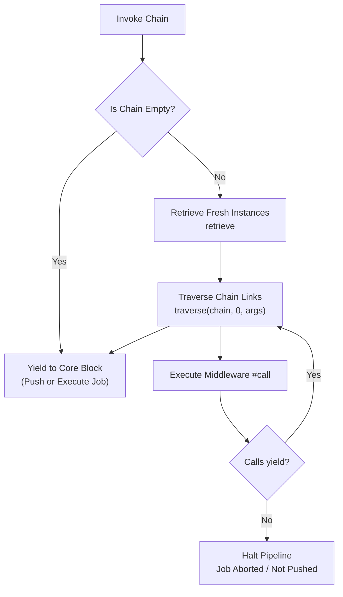
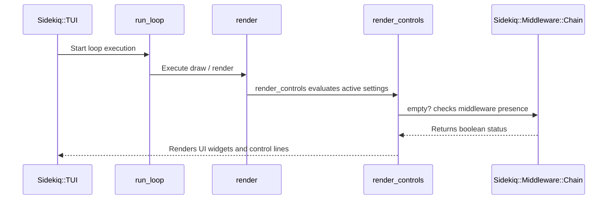
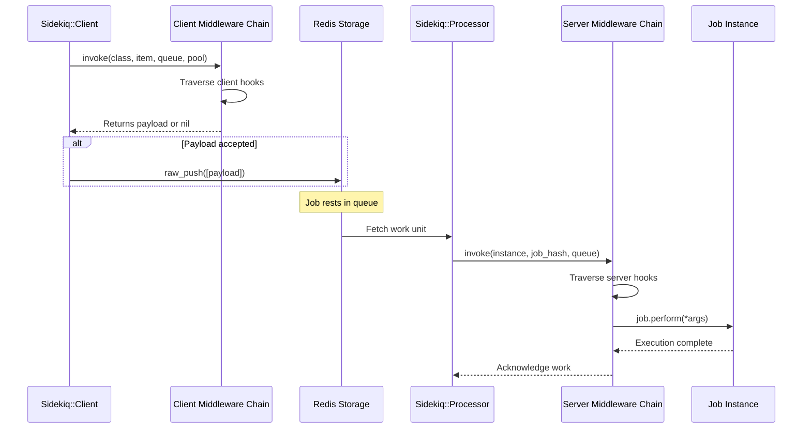

# Middleware Processing

<details>
<summary>Relevant source files</summary>

The following files were used as context for generating this wiki page:

- [lib/sidekiq/cli.rb](https://github.com/sidekiq/sidekiq/blob/main/lib/sidekiq/cli.rb)
- [lib/sidekiq/client.rb](https://github.com/sidekiq/sidekiq/blob/main/lib/sidekiq/client.rb)
- [lib/sidekiq/job.rb](https://github.com/sidekiq/sidekiq/blob/main/lib/sidekiq/job.rb)
- [lib/sidekiq/middleware/chain.rb](https://github.com/sidekiq/sidekiq/blob/main/lib/sidekiq/middleware/chain.rb)
- [lib/sidekiq/processor.rb](https://github.com/sidekiq/sidekiq/blob/main/lib/sidekiq/processor.rb)
- [lib/sidekiq/web/application.rb](https://github.com/sidekiq/sidekiq/blob/main/lib/sidekiq/web/application.rb)
- [lib/sidekiq/web.rb](https://github.com/sidekiq/sidekiq/blob/main/lib/sidekiq/web.rb)
- [lib/sidekiq/middleware/current_attributes.rb](https://github.com/sidekiq/sidekiq/blob/main/lib/sidekiq/middleware/current_attributes.rb)
- [docs/capsule.md](https://github.com/sidekiq/sidekiq/blob/main/docs/capsule.md)
- [docs/internals.md](https://github.com/sidekiq/sidekiq/blob/main/docs/internals.md)
- [lib/sidekiq/middleware/i18n.rb](https://github.com/sidekiq/sidekiq/blob/main/lib/sidekiq/middleware/i18n.rb)
- [myapp/config/initializers/sidekiq.rb](https://github.com/sidekiq/sidekiq/blob/main/myapp/config/initializers/sidekiq.rb)
- [lib/sidekiq/middleware/modules.rb](https://github.com/sidekiq/sidekiq/blob/main/lib/sidekiq/middleware/modules.rb)
- [lib/sidekiq/rails.rb](https://github.com/sidekiq/sidekiq/blob/main/lib/sidekiq/rails.rb)
- [docs/middleware.md](https://github.com/sidekiq/sidekiq/blob/main/docs/middleware.md)
- [lib/sidekiq/config.rb](https://github.com/sidekiq/sidekiq/blob/main/lib/sidekiq/config.rb)
- [lib/sidekiq/transaction_aware_client.rb](https://github.com/sidekiq/sidekiq/blob/main/lib/sidekiq/transaction_aware_client.rb)
- [docs/menu.md](https://github.com/sidekiq/sidekiq/blob/main/docs/menu.md)
- [docs/Pro-2.0-Upgrade.md](https://github.com/sidekiq/sidekiq/blob/main/docs/Pro-2.0-Upgrade.md)
- [lib/sidekiq/job/interrupt_handler.rb](https://github.com/sidekiq/sidekiq/blob/main/lib/sidekiq/job/interrupt_handler.rb)
- [docs/sdlc.md](https://github.com/sidekiq/sidekiq/blob/main/docs/sdlc.md)
- [bare/boot.rb](https://github.com/sidekiq/sidekiq/blob/main/bare/boot.rb)
- [lib/sidekiq/api.rb](https://github.com/sidekiq/sidekiq/blob/main/lib/sidekiq/api.rb)
- [lib/sidekiq/job/iterable.rb](https://github.com/sidekiq/sidekiq/blob/main/lib/sidekiq/job/iterable.rb)
- [lib/sidekiq/tui.rb](https://github.com/sidekiq/sidekiq/blob/main/lib/sidekiq/tui.rb)
</details>

## Overview

### Overview Introduction

Middleware processing in Sidekiq is an extensible filtering framework patterned after Rack middleware, designed to intercept jobs at critical lifecycle boundaries before they enter persistent storage or execute in worker threads. The primary purpose of this architecture is to decouple cross-cutting concerns—such as multi-tenant attribute propagation, localization, error-handling wrappers, and metrics collection—from core business logic. By executing plugins sequentially via managed chains, Sidekiq allows developers to inspect, modify, or halt job payloads deterministically.

Design decisions within Sidekiq 7.0 refactor middleware management from global static constructs into containerized, Capsule-local and Config-level chains. Each link in a middleware chain is instantiated fresh for every job execution to prevent accidental state pollution across threads. Furthermore, server-side and client-side middleware implementations gain scoped access to localized resources (like Redis connection pools and loggers) via helper modules rather than global singletons, making the processing pipeline fully compatible with multi-threaded runtimes and embedded deployment architectures.

Sources: [lib/sidekiq/middleware/chain.rb:6-15](https://github.com/sidekiq/sidekiq/blob/main/lib/sidekiq/middleware/chain.rb#L6-L15)
Sources: [docs/capsule.md:62-68](https://github.com/sidekiq/sidekiq/blob/main/docs/capsule.md#L62-L68)

## Middleware Chain Mechanics and Traversal

### Chain Mechanics Overview

The core engine driving middleware execution is `Sidekiq::Middleware::Chain`, which maintains an ordered array of `Sidekiq::Middleware::Entry` objects. When a job is pushed or processed, the runtime invokes the chain via `#invoke`, which retrieves fresh instances of all registered middleware classes and evaluates them recursively using a depth-first traversal algorithm.

Sources: [lib/sidekiq/middleware/chain.rb:80-93](https://github.com/sidekiq/sidekiq/blob/main/lib/sidekiq/middleware/chain.rb#L80-L93)

### Flowchart and Invocation



Sources: [lib/sidekiq/middleware/chain.rb:154-186](https://github.com/sidekiq/sidekiq/blob/main/lib/sidekiq/middleware/chain.rb#L154-L186)

### Traversal Implementation

The traversal logic relies on an index pointer and block recursion. Below is the exact implementation of the `#traverse` mechanism from `lib/sidekiq/middleware/chain.rb`:

```ruby
def traverse(chain, index, args, &block)
  if index >= chain.size
    yield
  else
    chain[index].call(*args) do
      traverse(chain, index + 1, args, &block)
    end
  end
end
```

Sources: [lib/sidekiq/middleware/chain.rb:178-186](https://github.com/sidekiq/sidekiq/blob/main/lib/sidekiq/middleware/chain.rb#L178-L186)

### Execution Guard and Invariant

> [!IMPORTANT]
> A client middleware must explicitly return the result of `yield` (or the mutated payload), whereas server middleware must yield control to invoke subsequent middleware and eventually the job itself. If a client middleware fails to return the result of `yield`, the job payload evaluates to `nil` and is silently dropped before reaching Redis.

Sources: [lib/sidekiq/middleware/chain.rb:64-77](https://github.com/sidekiq/sidekiq/blob/main/lib/sidekiq/middleware/chain.rb#L64-L77)

### Call-Chain Execution Walkthrough: Run_loop to Empty? Check

When executing the terminal user interface event loop, Sidekiq periodically refreshes view data and verifies whether middleware chains are empty or active. This operational flow proceeds through the following verified call chain: `run_loop` (lib/sidekiq/tui.rb:48-57) initiates the loop, calls `render` (lib/sidekiq/tui.rb:58-154), which subsequently invokes `render_controls` (lib/sidekiq/tui.rb:162-218) to build control panels, which finally invokes `empty?` (lib/sidekiq/middleware/chain.rb:154-157) on the underlying chain instance to determine whether any middleware hooks are present.



Sources: [lib/sidekiq/tui.rb:48-57](https://github.com/sidekiq/sidekiq/blob/main/lib/sidekiq/tui.rb#L48-L57)
Sources: [lib/sidekiq/tui.rb:58-154](https://github.com/sidekiq/sidekiq/blob/main/lib/sidekiq/tui.rb#L58-L154)
Sources: [lib/sidekiq/tui.rb:162-218](https://github.com/sidekiq/sidekiq/blob/main/lib/sidekiq/tui.rb#L162-L218)
Sources: [lib/sidekiq/middleware/chain.rb:154-157](https://github.com/sidekiq/sidekiq/blob/main/lib/sidekiq/middleware/chain.rb#L154-L157)

## Client vs. Server Middleware Architectures

### Pipeline Bifurcation

Sidekiq bifurcates middleware into two distinct pipelines: **Client Middleware** and **Server Middleware**. Each type enforces specific signature contracts and executes at different stages of a job's lifecycle.

Sources: [docs/middleware.md:6-52](https://github.com/sidekiq/sidekiq/blob/main/docs/middleware.md#L6-L52)

### Architecture Reference Table

| Middleware Type | Execution Point | Signature | Purpose & Behavior |
| :--- | :--- | :--- | :--- |
| **Client** | During `Sidekiq::Client#push` or `#push_bulk` | `call(job_class_or_string, job, queue, redis_pool)` | Inspects or mutates job payloads prior to Redis serialization; can cancel pushes by returning `nil`. |
| **Server** | Inside `Sidekiq::Processor#process` around `#perform` | `call(job_instance, job_payload, queue)` | Wraps job execution on worker threads; handles environment restoration, context tracking, and exception recovery. |

Sources: [lib/sidekiq/client.rb:101-111](https://github.com/sidekiq/sidekiq/blob/main/lib/sidekiq/client.rb#L101-L111)
Sources: [lib/sidekiq/processor.rb:187-225](https://github.com/sidekiq/sidekiq/blob/main/lib/sidekiq/processor.rb#L187-L225)
Sources: [docs/middleware.md:60-90](https://github.com/sidekiq/sidekiq/blob/main/docs/middleware.md#L60-L90)

### Sequence Flow



Sources: [lib/sidekiq/client.rb:101-111](https://github.com/sidekiq/sidekiq/blob/main/lib/sidekiq/client.rb#L101-L111)
Sources: [lib/sidekiq/processor.rb:187-225](https://github.com/sidekiq/sidekiq/blob/main/lib/sidekiq/processor.rb#L187-L225)
Sources: [docs/middleware.md:10-52](https://github.com/sidekiq/sidekiq/blob/main/docs/middleware.md#L10-L52)

## Configuration and Chain Manipulation API

### Chain Configuration Overview

Middleware chains are configured globally via `Sidekiq::Config` or locally per `Sidekiq::Capsule`. The `Sidekiq::Middleware::Chain` class exposes public mutation methods that control the exact placement of middleware entries.

Sources: [lib/sidekiq/middleware/chain.rb:17-50](https://github.com/sidekiq/sidekiq/blob/main/lib/sidekiq/middleware/chain.rb#L17-L50)

### Configuration Code Example

```ruby
Sidekiq.configure_server do |config|
  config.server_middleware do |chain|
    chain.add MyServerHook, optional_arg
    chain.prepend PriorityHook
    chain.insert_before ExistingMiddleware, PreHook
    chain.insert_after ExistingMiddleware, PostHook
    chain.remove UnwantedMiddleware
  end
end
```

Sources: [docs/middleware.md:28-34](https://github.com/sidekiq/sidekiq/blob/main/docs/middleware.md#L28-L34)

### Entry Placement Logic

The underlying position calculation logic when inserting or adding middleware guarantees uniqueness by class and handles missing reference classes gracefully:

- `#add(klass, *args)`: Removes existing instances of `klass` and appends a new `Entry` to the tail of `entries`.
- `#prepend(klass, *args)`: Removes existing instances of `klass` and inserts a new `Entry` at index `0`.
- `#insert_before(oldklass, newklass, *args)`: Locates `oldklass` (defaulting to index `0` if not found) and inserts `newklass` immediately prior to it.
- `#insert_after(oldklass, newklass, *args)`: Locates `oldklass` (defaulting to `entries.count - 1` if not found) and inserts `newklass` immediately after it.

Sources: [lib/sidekiq/middleware/chain.rb:119-146](https://github.com/sidekiq/sidekiq/blob/main/lib/sidekiq/middleware/chain.rb#L119-L146)

## Scoped Resources via Middleware Modules

### Module Inclusion Mechanics

Server and client middleware classes include `Sidekiq::ServerMiddleware` (aliased to `Sidekiq::ClientMiddleware`), which injects helper methods providing direct access to the active capsule's configuration, logger, and Redis connection pool without referencing global singletons.

Sources: [lib/sidekiq/middleware/modules.rb:3-23](https://github.com/sidekiq/sidekiq/blob/main/lib/sidekiq/middleware/modules.rb#L3-L23)

### Helper Methods Table

| Helper Method | Return Type | Underlying Source |
| :--- | :--- | :--- |
| `config` | `Sidekiq::Config` / `Sidekiq::Capsule` | Assigned via `Entry#make_new` during instantiation |
| `redis_pool` | `ConnectionPool` | `config.redis_pool` |
| `logger` | `Sidekiq::Logger` | `config.logger` |
| `redis(&block)` | Result of block evaluation | `config.redis(&block)` |

Sources: [lib/sidekiq/middleware/modules.rb:7-18](https://github.com/sidekiq/sidekiq/blob/main/lib/sidekiq/middleware/modules.rb#L7-L18)
Sources: [lib/sidekiq/middleware/chain.rb:200-205](https://github.com/sidekiq/sidekiq/blob/main/lib/sidekiq/middleware/chain.rb#L200-L205)

### Middleware Usage Example

```ruby
class CustomMiddleware
  include Sidekiq::ServerMiddleware

  def call(worker, job, queue)
    logger.info "Executing middleware for job #{job['jid']}"
    redis do |conn|
      conn.set("last_job", job['class'])
    end
    yield
  end
end
```

Sources: [docs/middleware.md:74-90](https://github.com/sidekiq/sidekiq/blob/main/docs/middleware.md#L74-L90)

## Built-in Middleware Implementations

### Built-in Overview

Sidekiq ships with core middleware modules that manage context propagation, localization, and execution safety out of the box.

Sources: [lib/sidekiq/middleware/current_attributes.rb:7-23](https://github.com/sidekiq/sidekiq/blob/main/lib/sidekiq/middleware/current_attributes.rb#L7-L23)

### Current Attributes Middleware

Persists `ActiveSupport::CurrentAttributes` state across the client-server boundary. The client middleware (`Sidekiq::CurrentAttributes::Save`) serializes attributes into the job hash under keys `"cattr"`, `"cattr_1"`, etc., while the server middleware (`Sidekiq::CurrentAttributes::Load`) extracts and wraps job execution inside `klass.set(attrs)`.

```ruby
require "sidekiq/middleware/current_attributes"
Sidekiq::CurrentAttributes.persist("Myapp::Current")
```

Sources: [lib/sidekiq/middleware/current_attributes.rb:7-44](https://github.com/sidekiq/sidekiq/blob/main/lib/sidekiq/middleware/current_attributes.rb#L7-L44)
Sources: [lib/sidekiq/middleware/current_attributes.rb:46-90](https://github.com/sidekiq/sidekiq/blob/main/lib/sidekiq/middleware/current_attributes.rb#L46-L90)

### Current Attributes Invariant

> [!NOTE]
> If a `NoMethodError` occurs during attribute restoration on the server due to schema drift or modified definitions between enqueue and execution, the middleware automatically prunes obsolete attributes that the target class no longer responds to and retries once.

Sources: [lib/sidekiq/middleware/current_attributes.rb:79-88](https://github.com/sidekiq/sidekiq/blob/main/lib/sidekiq/middleware/current_attributes.rb#L79-L88)

### Internationalization and Interrupt Handlers

Captures the active `I18n.locale` during client push, stores it in the job payload, and wraps server execution in `I18n.with_locale`. Additionally, `Sidekiq::Job::InterruptHandler` intercepts `Sidekiq::Job::Interrupted` exceptions raised during graceful shutdown or iterable job yielding, automatically re-queues the job payload back into Redis, and raises `Sidekiq::JobRetry::Skip` to prevent error reporting.

Sources: [lib/sidekiq/middleware/i18n.rb:9-28](https://github.com/sidekiq/sidekiq/blob/main/lib/sidekiq/middleware/i18n.rb#L9-L28)
Sources: [lib/sidekiq/job/interrupt_handler.rb:3-17](https://github.com/sidekiq/sidekiq/blob/main/lib/sidekiq/job/interrupt_handler.rb#L3-L17)

## Design Trade-Offs

### Trade-Offs Matrix

| Design Choice | Benefit | Cost |
| :--- | :--- | :--- |
| **Fresh instance per job (`make_new`)** | Prevents state bleeding and race conditions across concurrent threads. | Minor object allocation overhead on every job push and execution. |
| **Array-backed chain entries** | Simple ordering control via prepend, append, and index insertion. | Linear search time $O(N)$ when inserting before or after specific classes. |
| **Block-based traversal recursion** | Clean API mirroring Rack and intuitive exception unwinding. | Stack frame allocation per middleware layer during deep pipelines. |
| **Capsule-local resource binding** | Eliminates global mutable state, enabling multi-tenant and embedded setups. | Requires components to pass config/capsule references explicitly down initialization paths. |

Sources: [lib/sidekiq/middleware/chain.rb:200-205](https://github.com/sidekiq/sidekiq/blob/main/lib/sidekiq/middleware/chain.rb#L200-L205)
Sources: [docs/capsule.md:30-38](https://github.com/sidekiq/sidekiq/blob/main/docs/capsule.md#L30-L38)

## Related

- [[Standard Middleware Plugins]]
- [[Worker Processing]]
- [[Client Enqueueing]]

