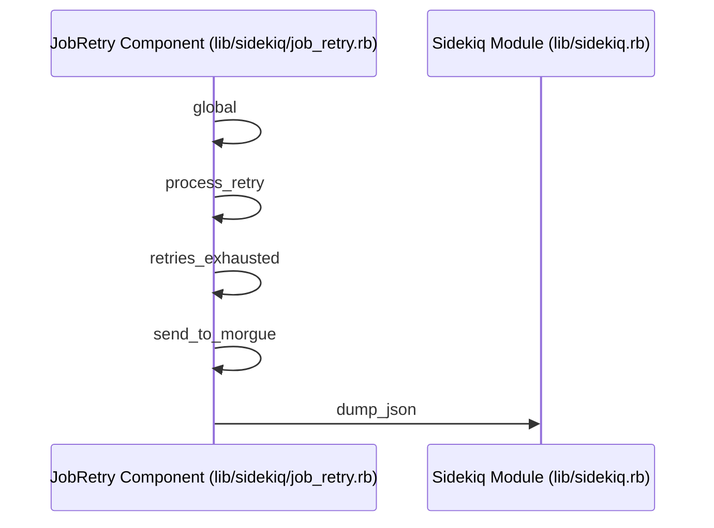
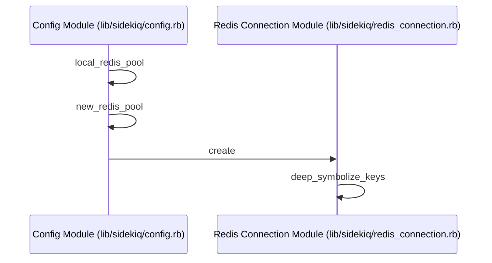
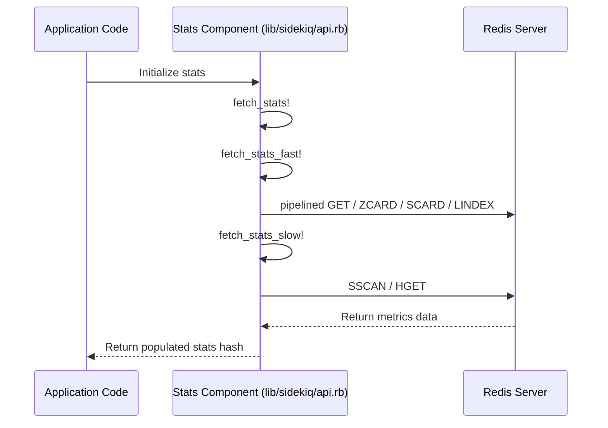

# Overview

Relevant source files

The following files were used as context for generating this wiki page:

- [lib/sidekiq/cli.rb](https://github.com/sidekiq/sidekiq/blob/main/lib/sidekiq/cli.rb)
- [lib/sidekiq/processor.rb](https://github.com/sidekiq/sidekiq/blob/main/lib/sidekiq/processor.rb)
- [lib/sidekiq/api.rb](https://github.com/sidekiq/sidekiq/blob/main/lib/sidekiq/api.rb)
- [lib/sidekiq/client.rb](https://github.com/sidekiq/sidekiq/blob/main/lib/sidekiq/client.rb)
- [README.md](https://github.com/sidekiq/sidekiq/blob/main/README.md)
- [docs/capsule.md](https://github.com/sidekiq/sidekiq/blob/main/docs/capsule.md)
- [lib/sidekiq/tui.rb](https://github.com/sidekiq/sidekiq/blob/main/lib/sidekiq/tui.rb)
- [docs/internals.md](https://github.com/sidekiq/sidekiq/blob/main/docs/internals.md)
- [lib/sidekiq/manager.rb](https://github.com/sidekiq/sidekiq/blob/main/lib/sidekiq/manager.rb)
- [lib/sidekiq/launcher.rb](https://github.com/sidekiq/sidekiq/blob/main/lib/sidekiq/launcher.rb)
- [lib/sidekiq/scheduled.rb](https://github.com/sidekiq/sidekiq/blob/main/lib/sidekiq/scheduled.rb)
- [lib/sidekiq/middleware/chain.rb](https://github.com/sidekiq/sidekiq/blob/main/lib/sidekiq/middleware/chain.rb)
- [lib/sidekiq/embedded.rb](https://github.com/sidekiq/sidekiq/blob/main/lib/sidekiq/embedded.rb)
- [lib/sidekiq/fetch.rb](https://github.com/sidekiq/sidekiq/blob/main/lib/sidekiq/fetch.rb)
- [lib/sidekiq/component.rb](https://github.com/sidekiq/sidekiq/blob/main/lib/sidekiq/component.rb)
- [myapp/app/jobs/post_updater.rb](https://github.com/sidekiq/sidekiq/blob/main/myapp/app/jobs/post_updater.rb)
- [docs/menu.md](https://github.com/sidekiq/sidekiq/blob/main/docs/menu.md)
- [lib/sidekiq.rb](https://github.com/sidekiq/sidekiq/blob/main/lib/sidekiq.rb)
- [bare/boot.rb](https://github.com/sidekiq/boot.rb)
- [docs/sdlc.md](https://github.com/sidekiq/sidekiq/blob/main/docs/sdlc.md)
- [docs/Pro-2.0-Upgrade.md](https://github.com/sidekiq/sidekiq/blob/main/docs/Pro-2.0-Upgrade.md)
- [docs/4.0-Upgrade.md](https://github.com/sidekiq/sidekiq/blob/main/docs/4.0-Upgrade.md)
- [docs/7.0-Upgrade.md](https://github.com/sidekiq/sidekiq/blob/main/docs/7.0-Upgrade.md)
- [lib/sidekiq/config.rb](https://github.com/sidekiq/sidekiq/blob/main/lib/sidekiq/config.rb)
- [lib/sidekiq/job_retry.rb](https://github.com/sidekiq/sidekiq/blob/main/lib/sidekiq/job_retry.rb)
- [lib/sidekiq/redis_connection.rb](https://github.com/sidekiq/sidekiq/blob/main/lib/sidekiq/redis_connection.rb)

## Overview

Sidekiq is a robust, highly efficient background job processing framework for Ruby applications designed to handle high-throughput workloads concurrently within a single process. By leveraging multi-threading and an optimized architecture backed by Redis, Sidekiq processes background tasks with minimal CPU and memory overhead compared to traditional process-heavy alternatives. The system coordinates booting life cycles, manages worker thread pools through isolated capsules, enforces reliability via retries and scheduled queues, and supports runtime inspection through comprehensive programmatic APIs and terminal interfaces. Sources: [README.md:7-10](https://github.com/sidekiq/sidekiq/blob/main/README.md#L7-L10), [docs/capsule.md:15-18](https://github.com/sidekiq/sidekiq/blob/main/docs/capsule.md#L15-L18), [lib/sidekiq/api.rb:9-12](https://github.com/sidekiq/sidekiq/blob/main/lib/sidekiq/api.rb#L9-L12), [lib/sidekiq/tui.rb:16-18](https://github.com/sidekiq/sidekiq/blob/main/lib/sidekiq/tui.rb#L16-L18)

## CLI Lifecycle and Process Bootstrapping

### Overview

The Sidekiq initialization and process bootstrapping sequence orchestrates configuration parsing, logger initialization, environment detection, application booting, signal trap registration, and the handoff to the runtime launcher. Whether executed via command-line parsing, via embedded server configurations, or through direct process setup, Sidekiq establishes a rigorous startup protocol before worker threads begin executing tasks.
Sources: [lib/sidekiq/cli.rb:23-44](https://github.com/sidekiq/sidekiq/blob/main/lib/sidekiq/cli.rb#L23-L44), [lib/sidekiq/embedded.rb:15-24](https://github.com/sidekiq/sidekiq/blob/main/lib/sidekiq/embedded.rb#L15-L24)

### Initialization and Configuration Bootstrapping

When running via the command line, option parsing initializes configuration defaults, processes arguments, sets up logging levels, and validates the resulting options.
Sources: [lib/sidekiq/cli.rb:23-29](https://github.com/sidekiq/sidekiq/blob/main/lib/sidekiq/cli.rb#L23-L29)

The options parser defines flags mapped to configuration keys.

| CLI Flag | Long Option | Configuration Key | Purpose |
| :--- | :--- | :--- | :--- |
| `-c` | `--concurrency INT` | `:concurrency` | Number of processor threads to use |
| `-e` | `--environment ENV` | `:environment` | Application environment name |
| `-g` | `--tag TAG` | `:tag` | Process tag for procline display |
| `-q` | `--queue QUEUE[,WEIGHT]` | `:queues` | Queues to process with optional weights |
| `-r` | `--require [PATH\|DIR]` | `:require` | Location of Rails application or file to require |
| `-t` | `--timeout NUM` | `:timeout` | Shutdown timeout in seconds |
| `-v` | `--verbose` | `:verbose` | Enable verbose logging output |
| `-C` | `--config PATH` | `:config_file` | Path to YAML configuration file |
| `-V` | `--version` | N/A | Print version and exit |
| `-h` | `--help` | N/A | Show help documentation and exit |

Sources: [lib/sidekiq/cli.rb:349-393](https://github.com/sidekiq/sidekiq/blob/main/lib/sidekiq/cli.rb#L349-L393)

Application booting is handled by application loaders, which set `RACK_ENV` and `RAILS_ENV` to the resolved environment. If the required path is a directory containing a Rails application, it requires `rails`, `sidekiq/rails`, and `config/environment.rb`. Otherwise, it directly requires the specified Ruby file path.
Sources: [lib/sidekiq/cli.rb:308-323](https://github.com/sidekiq/sidekiq/blob/main/lib/sidekiq/cli.rb#L308-L323)

> [!WARNING]
> Sidekiq strictly requires Rails 7.0 or greater when booting a Rails application directory, and will output a warning if an older major version is detected.
> Sources: [lib/sidekiq/cli.rb:312-315](https://github.com/sidekiq/sidekiq/blob/main/lib/sidekiq/cli.rb#L312-L315)

### Signal Handling and Process Execution

Once options are validated and the application is loaded, the process establishes signal traps across process signals and performs Redis connection checks before launching the worker supervisor.
Sources: [lib/sidekiq/cli.rb:42-115](https://github.com/sidekiq/sidekiq/blob/main/lib/sidekiq/cli.rb#L42-L115)

The call-chain execution walkthrough for process startup proceeds as follows:
Startup execution → application booting (loads application code) → `Signal.trap` (registers signal handlers and an IO pipe) → Redis info retrieval (validates Redis version >= 7.0.0 and checks `maxmemory_policy`) → `fire_event(:startup)` (invokes registered startup lifecycle hooks) → launcher execution (instantiates launcher supervisor and starts processing).
Sources: [lib/sidekiq/cli.rb:43-114](https://github.com/sidekiq/sidekiq/blob/main/lib/sidekiq/cli.rb#L43-L114)

Signals are trapped and routed through an IO pipe (`self_read`, `self_write`) to ensure thread-safe handling. The registered signals and their handlers include:

| Signal | Target Action / Behavior |
| :--- | :--- |
| `INT` | Raises `Interrupt`, triggering graceful shutdown |
| `TERM` | Raises `Interrupt`, triggering graceful shutdown |
| `TSTP` | Sets launcher to quiet mode (stops accepting new work) |
| `TTIN` | Logs backtraces for all running Ruby threads |
| `INFO` | Logs warning about deprecation on Linux and dumps thread backtraces |
| `USR2` | Trapped on Sidekiq Pro when running on non-JVM platforms |

Sources: [lib/sidekiq/cli.rb:50-68](https://github.com/sidekiq/sidekiq/blob/main/lib/sidekiq/cli.rb#L50-L68), [lib/sidekiq/cli.rb:193-224](https://github.com/sidekiq/sidekiq/blob/main/lib/sidekiq/cli.rb#L193-L224)

### Launcher Startup and Embedded Execution

The launcher component initializes capsule managers and the scheduled polling subsystem. When started, it freezes global Sidekiq configuration (`Sidekiq.freeze!`), starts the heartbeat thread, starts the poller, and starts all capsule managers.
Sources: [lib/sidekiq/launcher.rb:25-44](https://github.com/sidekiq/launcher.rb#L25-L44)

Alternatively, applications can embed Sidekiq via configuration methods, which create an embedded component instance. The embedded run method executes housekeeping validation (such as checking Redis version and maxmemory policy), fires startup lifecycle events, instantiates a launcher with `embedded: true`, and starts processing without spawning a duplicate CLI heartbeat thread or modifying process titles.
Sources: [lib/sidekiq.rb:136-146](https://github.com/sidekiq/sidekiq/blob/main/lib/sidekiq.rb#L136-L146), [lib/sidekiq/embedded.rb:11-24](https://github.com/sidekiq/sidekiq/blob/main/lib/sidekiq/embedded.rb#L11-L24)

> [!NOTE]
> Embedding Sidekiq sets a default concurrency of 2 threads to prevent resource contention under the Ruby GVL. Sidekiq supports only a single embedded instance in memory per process; attempting to embed multiple instances results in undefined behavior.
> Sources: [lib/sidekiq.rb:131-141](https://github.com/sidekiq/sidekiq/blob/main/lib/sidekiq.rb#L131-L141)

## Thread Management and Processor Execution

### Overview

Sidekiq manages concurrent job execution using a thread pool of worker threads, coordinated by manager components and executed by individual processor instances. Each processor runs in its own dedicated thread, fetching jobs from Redis queues via fetch fetchers and executing them through the server middleware chain and application worker classes.
Sources: [lib/sidekiq/processor.rb:10-23](https://github.com/sidekiq/processor.rb#L10-L23), [lib/sidekiq/manager.rb:6-18](https://github.com/sidekiq/manager.rb#L6-L18), [lib/sidekiq/fetch.rb:8-14](https://github.com/sidekiq/fetch.rb#L8-L14)

### Manager and Concurrency Control

Manager components act as the central coordination point for processor lifecycle management within a capsule. During initialization, managers read the concurrency count and spawn a corresponding number of processor instances, registering each with a result callback.
Sources: [lib/sidekiq/manager.rb:6-37](https://github.com/sidekiq/manager.rb#L6-L37)

| Manager Method | Action / Purpose |
| :--- | :--- |
| `initialize(capsule)` | Validates concurrency (raises `ArgumentError` if `< 1`) and instantiates processors |
| `start` | Iterates over all worker processors and invokes `#start` on each |
| `quiet` | Marks the manager as done and calls `#terminate` on all worker processors to stop accepting new work |
| `stop(deadline)` | Transitions through quiet mode, pauses, waits for workers to finish within the deadline, and triggers hard shutdown |
| `processor_result(processor, reason)` | Synchronized callback handling dead processors; removes dead workers and spawns replacements if not shut down |

Sources: [lib/sidekiq/manager.rb:26-79](https://github.com/sidekiq/manager.rb#L26-L79)

> [!WARNING]
> If busy worker threads do not finish within the allocated shutdown deadline during a hard shutdown, their unfinished jobs are collected and bulk-requeued back to Redis via `bulk_requeue` before their threads are forcefully killed.
> Sources: [lib/sidekiq/manager.rb:87-112](https://github.com/sidekiq/manager.rb#L87-L112)

### Processor Execution and Work Fetching

Processor instances run a continuous loop on assigned threads, fetching units of work from Redis and passing them through dispatch and execution pipelines.
Sources: [lib/sidekiq/processor.rb:10-23](https://github.com/sidekiq/processor.rb#L10-L23), [lib/sidekiq/processor.rb:73-84](https://github.com/sidekiq/processor.rb#L73-L84)

The call-chain execution walkthrough for job fetching and execution proceeds as follows:
Processor thread execution → `process_one` → `fetch` → `get_one` → `capsule.fetcher.retrieve_work` (executes a blocking `brpop` call on Redis queues) → `process(uow)` (loads JSON payload, checks for invalid formats, wraps execution in shutdown interrupt handlers, and calls `dispatch`) → `dispatch` (invokes job logger, global retries, stats recording, profiling, reloader, worker instantiation, local retries, server middleware, and executes `execute_job`).
Sources: [lib/sidekiq/processor.rb:73-84](https://github.com/sidekiq/processor.rb#L73-L84), [lib/sidekiq/processor.rb:86-90](https://github.com/sidekiq/processor.rb#L86-L90), [lib/sidekiq/processor.rb:92-102](https://github.com/sidekiq/processor.rb#L92-L102), [lib/sidekiq/processor.rb:104-112](https://github.com/sidekiq/processor.rb#L104-L112), [lib/sidekiq/processor.rb:128-160](https://github.com/sidekiq/processor.rb#L128-L160), [lib/sidekiq/processor.rb:167-225](https://github.com/sidekiq/processor.rb#L167-L225), [lib/sidekiq/fetch.rb:39-50](https://github.com/sidekiq/fetch.rb#L39-L50)

| Design Choice | Benefit | Cost |
| :--- | :--- | :--- |
| Basic fetcher using blocking `brpop` with timeout | Avoids busy-waiting and allows threads to periodically check for shutdown signals | Introduces a fixed timeout lag (2 seconds) during graceful shutdown polling |
| Dedicated thread per processor worker | Simple isolation of work units and straightforward thread-level exception handling | Higher OS thread count proportional to configured concurrency |
| Thread-local capsule assignment | Enables isolated Redis connection pools per capsule without global contention | Requires thread-local state management across asynchronous boundaries |

Sources: [lib/sidekiq/processor.rb:73-76](https://github.com/sidekiq/processor.rb#L73-L76), [lib/sidekiq/fetch.rb:13-14](https://github.com/sidekiq/fetch.rb#L13-L14), [lib/sidekiq/fetch.rb:48-48](https://github.com/sidekiq/fetch.rb#L48-L48)

> [!NOTE]
> Malformed JSON payloads retrieved from Redis are caught during processing, stored directly in the `dead` sorted set with configurable timeout and size limits, and immediately acknowledged so they do not block queue processing.
> Sources: [lib/sidekiq/processor.rb:172-186](https://github.com/sidekiq/processor.rb#L172-L186)

## Client Enqueuing and Middleware Chains

### Client Enqueuing and Middleware Chains

Sidekiq clients push job payloads to Redis through client instances, which manage serialization, unique job ID generation (`jid`), and client-side middleware execution. Callers can push individual jobs via `#push` or high-throughput batches via `#push_bulk`, or use Resque compatibility helpers like `enqueue`, `enqueue_to`, `enqueue_to_in`, and `enqueue_in`.
Sources: [lib/sidekiq/client.rb:33-35](https://github.com/sidekiq/client.rb#L33-L35), [lib/sidekiq/client.rb:101-111](https://github.com/sidekiq/client.rb#L101-L111), [lib/sidekiq/client.rb:139-185](https://github.com/sidekiq/client.rb#L139-L185), [lib/sidekiq/client.rb:225-255](https://github.com/sidekiq/client.rb#L225-L255)

The call-chain execution walkthrough for pushing a single job proceeds as follows:
Client push invocation (`push(item)`) → normalizes item (`normalize_item`) → `middleware.invoke` (executes client middleware chain) → `verify_json(payload)` → `raw_push` (acquires a connection from Redis pool and executes `atomic_push` inside a Redis pipeline) → returns unique job ID (`jid`), or `nil` if middleware halted execution.
Sources: [lib/sidekiq/client.rb:101-111](https://github.com/sidekiq/client.rb#L101-L111), [lib/sidekiq/client.rb:260-282](https://github.com/sidekiq/client.rb#L260-L282), [lib/sidekiq/client.rb:284-304](https://github.com/sidekiq/client.rb#L284-L304)

> [!WARNING]
> If a client middleware block halts execution and does not yield or return a payload, `#push` and `#push_bulk` return `nil` for that job ID, preventing the job from being pushed to Redis.
> Sources: [lib/sidekiq/client.rb:96-96](https://github.com/sidekiq/sidekiq/blob/main/lib/sidekiq/client.rb#L96-L96), [lib/sidekiq/client.rb:106-110](https://github.com/sidekiq/sidekiq/blob/main/lib/sidekiq/client.rb#L106-L110), [lib/sidekiq/client.rb:175-175](https://github.com/sidekiq/sidekiq/blob/main/lib/sidekiq/client.rb#L175-L175)

Middleware chains are managed by middleware chain components, supporting both client and server middleware pipelines patterned after Rack. Middleware classes are instantiated fresh for every job to prevent accidental state sharing.
Sources: [lib/sidekiq/middleware/chain.rb:6-16](https://github.com/sidekiq/middleware/chain.rb#L6-L16), [lib/sidekiq/middleware/chain.rb:80-87](https://github.com/sidekiq/middleware/chain.rb#L80-L87), [lib/sidekiq/middleware/chain.rb:111-122](https://github.com/sidekiq/middleware/chain.rb#L111-L122)

| Chain Mutation Method | Behavior |
| :--- | :--- |
| `add(klass, *args)` | Removes existing instances of `klass` and appends a new entry to the end of the chain |
| `prepend(klass, *args)` | Removes existing instances of `klass` and inserts a new entry at the front of the chain |
| `insert_before(oldklass, newklass, *args)` | Inserts `newklass` immediately before `oldklass` (or defaults to index 0 if `oldklass` is missing) |
| `insert_after(oldklass, newklass, *args)` | Inserts `newklass` immediately after `oldklass` (or defaults to the end of the chain if `oldklass` is missing) |
| `remove(klass)` | Deletes all entries matching the given class from the chain |
| `clear` | Empties all entries from the chain |

Sources: [lib/sidekiq/middleware/chain.rb:107-147](https://github.com/sidekiq/middleware/chain.rb#L107-L147), [lib/sidekiq/middleware/chain.rb:163-165](https://github.com/sidekiq/middleware/chain.rb#L163-L165)

## Scheduled Polling and Retry Infrastructure

### Overview

Sidekiq manages delayed jobs, retries, and dead job handling through scheduled modules and retry management classes. The scheduler polls Redis sorted sets for due jobs, while the retry infrastructure computes backoff intervals and manages failed jobs.
Sources: [lib/sidekiq/scheduled.rb:6-8](https://github.com/sidekiq/scheduled.rb#L6-L8), [lib/sidekiq/job_retry.rb:7-11](https://github.com/sidekiq/job_retry.rb#L7-L11)

### Scheduled Polling and Enqueuing

Scheduled polling components periodically inspect Redis for jobs in the retry or scheduled sorted sets that have reached their execution timestamps. Pollers dynamically scale their polling interval based on active process counts to prevent Redis request storms.
Sources: [lib/sidekiq/scheduled.rb:67-71](https://github.com/sidekiq/scheduled.rb#L67-L71), [lib/sidekiq/scheduled.rb:149-160](https://github.com/sidekiq/scheduled.rb#L149-L160)

Enqueuing components perform the atomic extraction of due jobs using a Lua script (`LUA_ZPOPBYSCORE`) that queries jobs with a score less than or equal to the current time, removes them from the sorted set, and returns them for client pushing.
Sources: [lib/sidekiq/scheduled.rb:10-20](https://github.com/sidekiq/scheduled.rb#L10-L20), [lib/sidekiq/scheduled.rb:32-41](https://github.com/sidekiq/scheduled.rb#L32-L41)

> [!TIP]
> For clusters with fewer than 10 processes, random interval calculations add a 50% upward adjustment to keep check-in frequency close to the desired average without requiring explicit inter-process coordination.
> Sources: [lib/sidekiq/scheduled.rb:142-155](https://github.com/sidekiq/scheduled.rb#L142-L155)

### Retry Infrastructure and Global to Dump_json Call Chain

When a job raises an exception during execution, retry handling captures the failure via either global or local retry wrappers, evaluating backoff strategies and death handlers.
Sources: [lib/sidekiq/job_retry.rb:81-107](https://github.com/sidekiq/job_retry.rb#L81-107), [lib/sidekiq/job_retry.rb:117-138](https://github.com/sidekiq/job_retry.rb#L117-L138)

The verified call chain `Global -> Dump_json` (`global` → `process_retry` → `retries_exhausted` → `send_to_morgue` → `dump_json`) traces how unhandled job exceptions propagate through global retry handling into the dead job morgue and JSON serialization:
1. `global` (`lib/sidekiq/job_retry.rb:83-106`) — catches unhandled exceptions raised during job execution and invokes `process_retry` when retries are enabled, or triggers death handlers directly.
Sources: [lib/sidekiq/job_retry.rb:83-106](https://github.com/sidekiq/sidekiq/blob/main/lib/sidekiq/job_retry.rb#L83-L106)
2. `process_retry` (`lib/sidekiq/job_retry.rb:148-207`) — formats error details, increments retry counts, checks max attempts, and invokes `retries_exhausted` if limits are reached.
Sources: [lib/sidekiq/job_retry.rb:148-207](https://github.com/sidekiq/sidekiq/blob/main/lib/sidekiq/job_retry.rb#L148-L207)
3. `retries_exhausted` (`lib/sidekiq/job_retry.rb:249-272`) — evaluates exhaustion blocks and calls `send_to_morgue` to persist dead jobs.
Sources: [lib/sidekiq/job_retry.rb:249-272](https://github.com/sidekiq/sidekiq/blob/main/lib/sidekiq/job_retry.rb#L249-L272)
4. `send_to_morgue` (`lib/sidekiq/job_retry.rb:282-294`) — packages the dead job payload for Redis persistence, calling `Sidekiq.dump_json`.
Sources: [lib/sidekiq/job_retry.rb:282-294](https://github.com/sidekiq/sidekiq/blob/main/lib/sidekiq/job_retry.rb#L282-L294)
5. `dump_json` (`lib/sidekiq.rb:64-66`) — generates the JSON representation of the job hash using `JSON.generate`.
Sources: [lib/sidekiq.rb:64-66](https://github.com/sidekiq/sidekiq/blob/main/lib/sidekiq.rb#L64-L66)

Sources: [lib/sidekiq/job_retry.rb:83-106](https://github.com/sidekiq/sidekiq/blob/main/lib/sidekiq/job_retry.rb#L83-L106), [lib/sidekiq/job_retry.rb:148-207](https://github.com/sidekiq/sidekiq/blob/main/lib/sidekiq/job_retry.rb#L148-L207), [lib/sidekiq/job_retry.rb:249-272](https://github.com/sidekiq/sidekiq/blob/main/lib/sidekiq/job_retry.rb#L249-L272), [lib/sidekiq/job_retry.rb:282-294](https://github.com/sidekiq/sidekiq/blob/main/lib/sidekiq/job_retry.rb#L282-L294), [lib/sidekiq.rb:64-66](https://github.com/sidekiq/sidekiq/blob/main/lib/sidekiq.rb#L64-L66)

### Retry Configuration and Strategies

| Constant / Option | Default Value / Type | Purpose / Meaning |
| :--- | :--- | :--- |
| `DEFAULT_MAX_RETRY_ATTEMPTS` | `25` (Integer) | Default maximum number of retry attempts before giving up |
| `SETS` | `%w[retry schedule]` (Array) | Sorted sets polled by scheduled enqueuers |
| `INITIAL_WAIT` | `10` (Integer) | Initial baseline sleep duration for poller startup |
| `strategy: :discard` | Symbol | Drops the job immediately without sending to morgue |
| `strategy: :kill` | Symbol | Forces immediate exhaustion and moves job to morgue |
| `strategy: :default` | Symbol | Applies standard exponential backoff delay calculation |

Sources: [lib/sidekiq/scheduled.rb:8-8](https://github.com/sidekiq/scheduled.rb#L8-L8), [lib/sidekiq/scheduled.rb:74-74](https://github.com/sidekiq/scheduled.rb#L74-L74), [lib/sidekiq/job_retry.rb:73-73](https://github.com/sidekiq/job_retry.rb#L73-L73), [lib/sidekiq/job_retry.rb:190-198](https://github.com/sidekiq/job_retry.rb#L190-L198), [lib/sidekiq/job_retry.rb:240-248](https://github.com/sidekiq/job_retry.rb#L240-L248)

> [!WARNING]
> When `retry_for` is specified on a job payload, it takes absolute precedence over count-based retry limits, causing exhaustion based on elapsed time since `failed_at` rather than attempt counts.
> Sources: [lib/sidekiq/job_retry.rb:183-188](https://github.com/sidekiq/sidekiq/blob/main/lib/sidekiq/job_retry.rb#L183-L188)

### Design Trade-offs

| Design Choice | Benefit | Cost |
| :--- | :--- | :--- |
| Lua-based sorted set polling (`LUA_ZPOPBYSCORE`) | Atomically pops and removes the due item in a single round-trip, eliminating race conditions between concurrent pollers | Requires loading and caching script SHAs in Redis across reconnections |
| Clustered random polling intervals | Spreads polling check-ins across the process cluster without requiring explicit coordination or heartbeats | Introduces jitter in exact polling intervals for individual processes |
| Exception wrapping via internal exception subclasses | Prevents redundant error handling and bubbling across nested middleware layers | Couples error propagation tightly to internal exception subclasses |

Sources: [lib/sidekiq/scheduled.rb:13-20](https://github.com/sidekiq/scheduled.rb#L13-20), [lib/sidekiq/scheduled.rb:129-160](https://github.com/sidekiq/scheduled.rb#L129-L160), [lib/sidekiq/job_retry.rb:62-70](https://github.com/sidekiq/job_retry.rb#L62-70), [lib/sidekiq/job_retry.rb:111-116](https://github.com/sidekiq/job_retry.rb#L111-L116)

## Redis Connection Pools and Capsules

### Overview

Sidekiq 7.0 introduces encapsulation features and restructured Redis connection management to replace global singleton states, supporting process isolation and multiple queue-processing configurations.
Sources: [docs/capsule.md:15-17](https://github.com/sidekiq/sidekiq/blob/main/docs/capsule.md#L15-L17), [docs/capsule.md:46-49](https://github.com/sidekiq/sidekiq/blob/main/docs/capsule.md#L46-L49), [lib/sidekiq/config.rb:157-160](https://github.com/sidekiq/sidekiq/blob/main/lib/sidekiq/config.rb#L157-L160)

### Redis Pool Initialization Call Chain

The bootstrapping sequence for internal Redis connection pools normalizes user-provided configurations and instantiates lazy connection pools via connection pooling.
Sources: [lib/sidekiq/config.rb:157-160](https://github.com/sidekiq/config.rb#L157-L160), [lib/sidekiq/config.rb:163-167](https://github.com/sidekiq/config.rb#L163-L167), [lib/sidekiq/redis_connection.rb:10-39](https://github.com/sidekiq/sidekiq/blob/main/lib/sidekiq/redis_connection.rb#L10-L39)

1. Local Redis pool access (`local_redis_pool`) — accesses or initializes the internal client and housekeeping pool of size 10 by invoking `new_redis_pool(10, "internal")`.
Sources: [lib/sidekiq/config.rb:157-161](https://github.com/sidekiq/config.rb#L157-L161)
2. New pool creation (`new_redis_pool`) — accepts pool size and name parameters, merging configuration options before calling connection creation.
Sources: [lib/sidekiq/config.rb:163-167](https://github.com/sidekiq/config.rb#L163-L167)
3. Connection creation (`create`) — normalizes configuration options, validates protocol and cluster safety constraints, wraps passwords, and configures timeouts.
Sources: [lib/sidekiq/redis_connection.rb:10-34](https://github.com/sidekiq/redis_connection.rb#L10-L34)
4. Key symbolization (`deep_symbolize_keys`) — recursively transforms hash keys to symbols and maps array elements to ensure consistent option lookups.
Sources: [lib/sidekiq/redis_connection.rb:11-11](https://github.com/sidekiq/redis_connection.rb#L11-L11), [lib/sidekiq/redis_connection.rb:52-63](https://github.com/sidekiq/redis_connection.rb#L52-L63)

Sources: [lib/sidekiq/config.rb:157-167](https://github.com/sidekiq/config.rb#L157-L167), [lib/sidekiq/redis_connection.rb:10-39](https://github.com/sidekiq/sidekiq/blob/main/lib/sidekiq/redis_connection.rb#L10-L39), [lib/sidekiq/redis_connection.rb:52-63](https://github.com/sidekiq/redis_connection.rb#L52-L63)

### Redis Connection Options and Parameters

| Option / Parameter | Default Value / Type | Purpose / Meaning |
| :--- | :--- | :--- |
| `:size` | `5` (Integer) | Number of connections maintained in the pool |
| `:pool_timeout` | `1` (Integer) | Maximum seconds to wait when checking out a connection from the pool |
| `:timeout` | `3` (Integer) | Network socket timeout for Redis command execution |
| `:protocol` | Nil / Integer | Explicit Redis protocol version; protocol 2 raises an error in Sidekiq 7+ |
| `:cluster_safe` | `false` (Boolean) | Bypasses validation check preventing usage on Redis Cluster nodes |

Sources: [lib/sidekiq/redis_connection.rb:19-33](https://github.com/sidekiq/sidekiq/blob/main/lib/sidekiq/redis_connection.rb#L19-L33)

> [!WARNING]
> Sidekiq 7+ explicitly rejects Redis protocol 2 (`protocol == 2`), raising an immediate runtime exception during connection pool initialization.
> Sources: [lib/sidekiq/redis_connection.rb:19-19](https://github.com/sidekiq/sidekiq/blob/main/lib/sidekiq/redis_connection.rb#L19-L19)

### Design Trade-offs

| Design Choice | Benefit | Cost |
| :--- | :--- | :--- |
| Lazy Redis connection pool initialization | Avoids establishing unneeded network connections during process boot when no commands have run | Can mask misconfigured connection settings until first runtime access |
| Separate internal pool and capsule pools | Isolates housekeeping tasks (size 10) from job execution processors (concurrency-sized) to prevent starvation | Multiplies total possible client connections opened against the Redis server instance |
| Environment variable resolution via `REDIS_PROVIDER` | Allows automated discovery of platform-specific Redis URL variables without custom code | Requires strict adherence to naming the configuration variable rather than embedding the raw URL |

Sources: [docs/capsule.md:92-96](https://github.com/sidekiq/sidekiq/blob/main/docs/capsule.md#L92-L96), [lib/sidekiq/config.rb:160-165](https://github.com/sidekiq/sidekiq/blob/main/lib/sidekiq/config.rb#L160-L165), [lib/sidekiq/redis_connection.rb:92-112](https://github.com/sidekiq/redis_connection.rb#L92-L112)

## Inspection APIs and Navigating Documentation

### Overview

Sidekiq provides programmatic APIs in `lib/sidekiq/api.rb` that wrap runtime state stored in Redis into a Ruby object model. The Data API should never be used within application code for business logic; server processes execute operations directly against Redis for performance.
Sources: [lib/sidekiq/api.rb:9-16](https://github.com/sidekiq/sidekiq/blob/main/lib/sidekiq/api.rb#L9-L16)

For interactive terminal monitoring, terminal interface components in `lib/sidekiq/tui.rb` build upon `ratatui_ruby` and the Data API to render real-time runtime dashboards, tab navigation, filtering, and help windows with localized strings.
Sources: [lib/sidekiq/tui.rb:1-16](https://github.com/sidekiq/tui.rb#L1-L16), [lib/sidekiq/tui.rb:38-46](https://github.com/sidekiq/tui.rb#L38-L46)

Core documentation resources reside across the repository root and `docs/`, covering release upgrade paths like `docs/7.0-Upgrade.md` and component internals such as `docs/internals.md`.
Sources: [docs/internals.md:1-13](https://github.com/sidekiq/sidekiq/blob/main/docs/internals.md#L1-L13), [docs/7.0-Upgrade.md:1-11](https://github.com/sidekiq/sidekiq/blob/main/docs/7.0-Upgrade.md#L1-L11)

### Runtime Inspection APIs

Statistics and runtime collections are retrieved via classes such as stats collections, queue wrappers, sorted set wrappers, process collections, and work set wrappers.
Sources: [lib/sidekiq/api.rb:39-44](https://github.com/sidekiq/sidekiq/blob/main/lib/sidekiq/api.rb#L39-L44), [lib/sidekiq/api.rb:285-285](https://github.com/sidekiq/sidekiq/blob/main/lib/sidekiq/api.rb#L285-L285), [lib/sidekiq/api.rb:726-726](https://github.com/sidekiq/sidekiq/blob/main/lib/sidekiq/api.rb#L726-L726), [lib/sidekiq/api.rb:984-984](https://github.com/sidekiq/sidekiq/blob/main/lib/sidekiq/api.rb#L984-L984), [lib/sidekiq/api.rb:1255-1255](https://github.com/sidekiq/sidekiq/blob/main/lib/sidekiq/api.rb#L1255-L1255)

Sources: [lib/sidekiq/api.rb:51-53](https://github.com/sidekiq/api.rb#L51-L53), [lib/sidekiq/api.rb:144-179](https://github.com/sidekiq/api.rb#L144-L179), [lib/sidekiq/api.rb:183-206](https://github.com/sidekiq/api.rb#L183-L206), [lib/sidekiq/api.rb:209-212](https://github.com/sidekiq/api.rb#L209-L212)

| Data API Class | Underlying Redis Structure | Primary Purpose |
| :--- | :--- | :--- |
| Stats collection | Strings, Sorted Sets, Sets | Aggregate counters (processed, failed, scheduled, retry, dead, queues) |
| Queue wrapper | List (`queue:name`) | Inspect and enumerate live jobs in a specific queue |
| Job set wrapper | Sorted Set (`schedule`, `retry`, `dead`) | Query, reschedule, or retry delayed and failed job sets |
| Process collection | Set (`processes`) + Hash keys | Active Sidekiq process inspection, heartbeats, and leader election |
| Work set wrapper | Hash keys (`key:work`) | Tracks executing jobs across worker threads in the cluster |

Sources: [lib/sidekiq/api.rb:144-179](https://github.com/sidekiq/api.rb#L144-L179), [lib/sidekiq/api.rb:310-312](https://github.com/sidekiq/api.rb#L310-L312), [lib/sidekiq/api.rb:686-688](https://github.com/sidekiq/api.rb#L686-L688), [lib/sidekiq/api.rb:987-993](https://github.com/sidekiq/api.rb#L987-L993), [lib/sidekiq/api.rb:1263-1269](https://github.com/sidekiq/api.rb#L1263-L1269)

> [!CAUTION]
> Never use queue or work lookup methods in application business logic. These methods execute slow $O(n)$ scans over real-time Redis structures and are intended strictly for administrative tooling and debugging.
> Sources: [lib/sidekiq/api.rb:358-359](https://github.com/sidekiq/api.rb#L358-L359), [lib/sidekiq/api.rb:1303-1304](https://github.com/sidekiq/api.rb#L1303-L1304)

### Terminal UI (TUI) Architecture

The TUI event loop redirects standard logging to `tui.log`, polls user input throttled at 10 FPS, refreshes runtime data every 2 seconds (`REFRESH_INTERVAL_SECONDS = 2`), and draws layout widgets via `ratatui_ruby`.
Sources: [lib/sidekiq/tui.rb:21-22](https://github.com/sidekiq/tui.rb#L21-L22), [lib/sidekiq/tui.rb:48-57](https://github.com/sidekiq/tui.rb#L48-L57), [lib/sidekiq/tui.rb:236-239](https://github.com/sidekiq/tui.rb#L236-L239), [lib/sidekiq/tui.rb:269-271](https://github.com/sidekiq/tui.rb#L269-L271)

| TUI Keybinding / Action | Target Component / Method | Description |
| :--- | :--- | :--- |
| `Esc` | Input event handler | Closes the help window or returns to the main view |
| `← / →` | Tab navigation | Switches between different runtime tabs (:left or :right) |
| `q` | Run loop termination | Terminates the TUI application loop |
| `h / l` | Tab-specific paging | Moves to previous or next page of tabular data |
| `j / k` | Tab-specific row navigation | Moves to previous or next row in the current view |

Sources: [lib/sidekiq/tui.rb:52-56](https://github.com/sidekiq/tui.rb#L52-L56), [lib/sidekiq/tui.rb:110-116](https://github.com/sidekiq/tui.rb#L110-L116), [lib/sidekiq/tui.rb:240-244](https://github.com/sidekiq/tui.rb#L240-L244), [lib/sidekiq/tui.rb:313-317](https://github.com/sidekiq/tui.rb#L313-L317)

## Related

- [[Quick Start]]
- [[Project Structure]]
- [[Worker Processing]]

